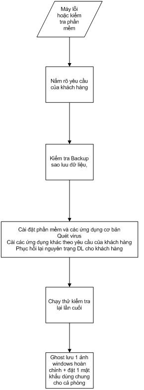

**QUY TRÌNH LÀM VIỆC**

A.  Làm việc trong phòng

1\. Tiếp nhận máy từ bộ phận giao dịch

-   Các máy để trên giàn ở khu vực cần gấp hoặc khu vực máy để qua ngày
    chưa xử lý phải được ưu tiên kiểm tra trước.

-   Đọc kỹ, kiểm tra so sánh các thiết bị thực tế và trên phiếu có khớp
    nhau hay không, sau đó xem xét tình trạng máy và yêu cầu của khách
    hàng; kiểm tra tổng thể một lần trước khi kết luận.

-   Nếu máy trong tình trạng vệ sinh kém, phải vệ sinh máy sạch sẽ trước
    khi tiếp tục kiểm tra.

-   Từ khi tiếp nhận đến khi có phiếu dịch vụ trả lời chậm nhất
    sau 1tiếng.

-   Quy trình thực hiện việc kiểm tra : áp dụng quy trình ***sửa chữa
    phần cứng, sửa chữa phần mềm*** để xử lý.

-   Trong quá trình xử lý máy cần hỏi thêm ý kiến khách hàng về dữ liệu
    hay yêu cầu của khách hàng thì báo với người có trách nhiệm để
    báo khách.

-   Sau khi kiểm tra thiết bị phải ghi, ký tên đầy đủ lên phiếu dán trên
    máy cũng như phiếu nhỏ về tình trạng, kết quả kiểm tra; nếu chưa
    được thì ghi rõ lý do, nguyên nhân.

-   Nếu máy đã làm xong thì mang ra kho trả, máy chờ linh kiện sữa chữa,
    bảo hành hay chờ ý kiến khách hành thì cho vào kho chờ bảo hành
    sữa chữa.

-   Phiếu dịch vụ (phiếu nhỏ) chuyển cho bộ phận trả hàng để cập nhật
    vào phần mềm phải ghi đầy đủ, chính xác số dịch vụ, tình trạng máy
    (chi tiết), tên kỹ thuật, ngày giờ…(lưu ý cập nhật ngay sau khi kiểm
    tra xong thiết bị).

-   Trường hợp đang làm dở công việc mà được giao công việc ra ngoài thì
    phải ghi rõ những gì mình đã xử lý lên phiếu dán trên thiết bị sau
    đó bàn giao lại cho người ở phòng.

2\. Nhận máy từ kho bảo hành sửa chữa

-   Kiểm tra so sánh các thiết bị thực tế và trên phiếu có khớp nhau hay
    không, nếu phát hiện thiếu hoặc thất lạc thiết bị thì báo ngay cho
    người quản lý kho hoặc người có trách nhiệm để xử lý.

-   Những thiết bị bảo hành về, sữa chữa đã xong cần lắp và test thử cẩn
    thận, ghi rõ nội dung bảo hành hoặc sữa chữa lên phiếu dán trên máy
    và phiếu dịch vụ rồi mang ra kho trả.

-   Từ khi tiếp nhận đến khi có phiếu dịch vụ trả lời chậm nhất
    sau 1tiếng.

-   Những thiết bị bảo hành về, sữa chữa mà vẫn bị lỗi thì chyển lại cho
    bộ phận điện tử hoặc bảo hành (ghi rõ tình trạng lỗi, tên kỹ thuật
    dán lên thiết bị).

-   Những thiết bị không sửa chữa được thì báo với những người có trách
    nhiệm để xin ý kiến khách hàng tìm phương án giải quyết.

-   Tất cả các linh kiện hỏng của khách thay thế ra phải trả lại cho
    khách hàng.

-   Phiếu dịch vụ (phiếu nhỏ) chuyển cho bộ phận trả hàng để cập nhật
    vào phần mềm phải ghi đầy đủ, chính xác số dịch vụ, tình trạng máy
    (chi tiết), tên kỹ thuật, ngày giờ…(lưu ý cập nhật ngay sau khi kiểm
    tra xong thiết bị).

3\. Bộ phận kỹ thuật làm ca

-   Ưu tiên xử lý những máy cần gấp và qua ngày, các máy chạy kiểm tra
    mất nhiều thời gian, đối với ca tối hết ca phải ghi báo cáo tổng hợp
    công việc hàng ngày, tắt hệ thống điện nơi bộ phận mình làm việc.

> 4\. kỹ thuật thử việc và học việc

-   Chỉ xử lý những máy không chứa dữ liệu

-   Xử lý xong phải có sự kiểm tra xác nhận của kỹ thuật chính lên đó.
    Yêu cầu kỹ thuật chính kiểm tra kỹ trước khi ký và chịu trách nhiệm
    với máy đó.

-   Xử lý dứt điểm làm từng máy một không làm nhiều máy một lúc.

-   Lúc gặp khó khăn nên hỏi tham khảo kỹ thuật chính.

A.  Làm việc bên ngoài

<!-- -->

1.  Khi nhận nhiệm vụ, công việc bên ngoài thì bàn giao các công việc
    đang làm dở chậm nhất trong 10 phút.

2.  Nhận địa chỉ sau 1h30 phút mà chưa đến được thì phải chủ động hẹn
    khách hàng hoặc gọi về người điều hành để sắp xếp.

3.  Công việc cần gấp phải đến trước, sắp xếp thời gian hợp lý để có thể
    hoàn thành hết công việc được giao.

4.  Đến địa chỉ khách hàng phải hỏi rõ tình trạng máy hiện tại và yêu
    cầu của khách hàng; tiến hành kiểm tra và xử lý.

5.  Những máy dịch vụ sửa chữa lần đầu thì cấp cho máy đó một tem số
    dịch vụ dán lên máy.

6.  Áp dụng quy trình ***sửa chữa phần cứng*** và ***sửa chữa phần
    mềm*** để xử lý máy cho khách hàng.

7.  Khi kiểm tra và xử lý hoàn thành xong thì dán tem niêm phong thiết
    bị, ghi phiếu báo kỹ thuật (quy trình kiểm tra xử lý tương tự
    như trên).

8.  Phiếu báo kỹ thuật phải ghi đầy đủ các thông tin trên phiếu đặc biệt
    là: tên, số điện thoại, ý kiến, chữ ký và tên của khách hàng.

9.  Khi mang thiết bị của khách hàng về phải ghi rõ: số dịch vụ, tên
    khách hàng, cấu hình, tình trạng thiết bị, photo 1 bản phiếu báo kỹ
    thuật dán lên thiết bị để bộ phận nhận hàng có cơ sở nhận vào.

10. Khi mang thiết bị của khách hàng đi trả phải ký ghi rõ họ tên vào
    phần người trả hàng trên phiếu. Nếu phiếu có thu phí dịch vụ hay
    linh liện phải photo thành 2 bản giao cho bộ phận trả hàng và
    kế toán.

11. Khi đi địa chỉ ngoài về phải nạp ngay phiếu báo kỹ thuật trong buổi
    cho bộ phận tổng đài để cập nhật, những phiếu có tiền thì phải ghi
    rõ số tiền dịch vụ hoặc linh kiện và phôtô 1 bản nạp cùng tiền cho
    kế toán. Nếu sau 2 ngày chưa nạp kịp phiếu báo kỹ thuật cho bộ phận
    tổng đài, phải nạp phiếu báo cho tổ trưởng kiểm tra trước.

12. Trường hợp đi công tác nhiều ngày thì phiếu báo kỹ thuật nạp ngay
    khi về đến công ty.

13. Nếu vì bất cứ lý do gì mà chưa hoàn thành công việc được giao thì về
    công ty phải báo ngay với người điều hành và bộ phận tổng đài để
    theo dõi.

**III- QUY TRÌNH KỸ THUẬT**

> Một thiết bị nhận vào sẽ thuộc vào một hoặc trong nhiều lỗi trên, căn
> cứ vào từng lỗi mà áp dụng quy trình xử lý.

***A. QUY TRÌNH XỬ LÝ PHẦN MỀM ***

{width="3.0194444444444444in"
height="8.175694444444444in"}

1.  Nắm rõ và đọc kỹ các yêu cầu của khách hàng bao gồm dữ liệu, các
    phần mềm khách hàng đang sử dụng, driver của các thiết bị ngoại vi.

2.  Sao lưu backup dữ liệu hiện có trong máy tính của khách hàng nên tạo
    một ảnh ghost windows lỗi (Eddmmyy).(bắt buộc)

> *"Chú ý phải chắc chắn bản ghost lưu có thể mở được bằng
> GhostExplorer"*

1.  Cài đặt:

    1.  đối với máy văn phòng, cơ quan trường học, nhà riêng

-   Cài đặt các phần mềm ứng dụng cơ bản (có danh sách kèm theo)

-   Quét và diệt virus

-   Cài các ứng dụng khách theo yêu cầu của khách hàng yêu cầu bao gồm
    > phần mềm và driver các thiết bị ngoại vi

-   Phục hồi nguyên trạng lại dữ liệu cho khách hàng.

    1.  đối với máy phòng game

-   Xóa và chia lại HDD sao cho thích hợp với từng cấu hình của
    > máy games.

-   Ghost Dữ liệu Games, Cài Lại HĐH, cài các phần mềm ứng dụng cơ bản
    > cho máy Games và update phiên bản mới nhất cho các Gameonline.

-   Cài phần mềm tính tiền (tùy theo các phòng games sử dụng) và cài
    > Phần mềm Đóng băng (mật khẩu chung của tổ game)

1.  Chạy thử kiểm tra lại lần cuối

2.  đối với các máy đã có ảnh ghost. Phục hồi lại ảnh ghost, update các
    chương trình, PM diệt virus.

3.  các phần mềm cơ bản của một máy tính

    1.  đối với máy văn phòng, cơ quan, trường học, nhà riêng

-   HDH : Windows (98, XP, Vista, Windows7)

-   Office: Microsoft Office (word, excel, powerpoint)

-   Bộ gõ & Font chữ: Unikey + Vietkey2000

-   Antivirus: Autorun Eater, Symantec Antivirus (hoặc:BKAV,
    Kaspersky, Avira..)

Tuỳ thuộc cấu hình máy để cài chương trình hợp lý

-   Đọc Files DPF: Acrobat Reader( &gt;=ver 6) hoặc Foxit Reader

-   Các chương trình hỗ trợ nghe nhạc xem phim: K-Lite Codec,
    Realplayer, Windows Media Player 11, PowerDVD, KMplayer,….

-   Từ điển Anh –Việt: MTD 2009(2002).

-   Máy In (Thật hoặc ảo) (bắt buộc)

Nếu khách hàng có nối mạng internet thì cài thêm:

-   Yahoo!Messenger (nên cài các phiên bản mới )

-   Anti Spyware

-   Flash Player

-   Chương trình hỗ trợ download (nên dùng orbit downloader)

-   Copy file Teamviewer Quick support vào máy để có thể hỗ trợ khách
    hàng từ xa.

    1.  Đối với máy phòng game

<!-- -->

-   HĐH : Windows Xp

<!-- -->

-   Bộ gõ & Font chữ: unikey+ font chữ(vietkey2k)

<!-- -->

-   Phần mềm tạo CD ảo

<!-- -->

-   yahoo chat (nên cài các phiên bản mới + cài chat nhiều nick tùy các
    phòng yêu cầu)

<!-- -->

-   Flash Player(site [www.flash.com](http://www.flash.com/))

<!-- -->

-   Cài đặt Game offline theo dữ liệu chung của công ty hoặc khách hàng
    yêu cầu + Cài phần mềm (Ganera) Chơi Đế chế,Warcraft.... qua Mạng.

<!-- -->

-   Cài đặt Game online theo dữ liệu chung của công ty, tùy theo dung
    Lượng HDD và tùy theo các phòng game yêu cầu.

-   Cài đặt các phần mềm chống Web xấu

<!-- -->

-   Phần Mềm tính tiền (tùy theo các phòng sử dụng)

<!-- -->

-   Cài Phần mềm Đóng băng (Password mặc Định là: chexanh).

<!-- -->

-   Hạn chế cài các chương trình diệt virus cho các máy game, không cần
    phải lưu ảnh ghost (vì có thể ghost từ máy khác sang, phải cập nhật
    game liên tục, không có dữ liệu quan trọng)

> ***Yêu cầu :** - Partition phải định dạng NTFS(Partition &gt;10GB)*

B.  ***QUY TRÌNH XỬ LÝ PHẦN CỨNG***

<!-- -->

1.  Máy không vào điện

Kiểm tra nguồn điện: kiểm tra dây nguồn , giắc cắm nguồn, kiểm tra nút
power…

Kiểm tra nguồn máy tính: có vào điện hay không:

-   Chập chân lệnh P.ON xuống Mass (dùng sợi thiếc đấu dây mầu xanh lá
    cây vào một dây mầu đen)

-   Cấp điện cho bộ nguồn và quan sát quạt

-   Nếu quạt quay tít là nguồn đã hoạt động tốt

Nếu nguồn điện của máy sau khi kiểm tra chạy bình thường tiếp tục chuyển
qua kiểm tra Main: clear BIOS, tháo pin CMOS, tháo lắp lại CPU, thử bằng
cách thay 1 bộ nguồn khác….

Qua quá trình kiểm tra các thiết bị xác định bị lỗi chuyển cho bộ phận
sửa chữa hoặc bảo hành tuỳ theo tình trạng.

1.  Không lên màn hình

    -   Vệ sinh máy bao gồm :vệ sinh main, clear bios, vê sinh ram, card
        VGA kết hợp với card test main để kiểm tra.

    -   Nếu không lên màn hình thì thay thế kiểm tra lần lượt các thiết
        bị như Ram, VGA, Nguồn, Main, Chíp…

    -   Chuyển các thiết bị hỏng cho bộ phận tuỳ theo tình trạng của
        thiết bị.

2.  Máy không khởi động được(không nhận HDD)

> A : Kiểm tra, config BIOS : xem trong BIOS đã thiết lập chế độ của HDD
> phù hợp theo chuẩn Sata hay Ata hay chưa; nếu chưa thì xử lý thiết lập
> lại BIOS; nếu BIOS bình thường chuyển qua bước B
>
> B : Kiểm tra Cable (Power, Data): Kiểm tra các loại cable kết nối Main
> với HDD bằng cách thay thử cable khác hoặc cắm HDD khác test để xác
> định :
>
> - nếu thay cable khác mà nhận HDD → Lỗi cable
>
> - nếu thay cable khác vẫn không nhận HDD → bước C
>
> C : Kiểm tra HDD : Tuỳ vào điều kiện có thể kiểm tra bằng cách cắm HDD
> sang máy khác hoặc thay 1 HDD khác (đang sử dụng tốt) để test thử:
>
> - nếu thay HDD khác mà main nhận HDD (hay đưa HDD sang máy khác cắm mà
> vẫn không nhận HDD) → kết luận HDD lỗi

- nếu thay HDD khác mà main không nhận HDD (hay đưa HDD sang máy khác
cắm mà nhận HDD) → kết luận main lỗi

1.  Không khởi động được(vẫn nhận HDD ) Màn hình xanh, chạy treo, tự
    tắt, khởi động lại

-   Kiểm tra HDD

-   Làm lại phần mềm theo quy trình xử lý phần mềm.

-   Kiểm tra các thiết bị phần cứng khác như Ram, Nguồn, Main, tản
    nhiệt, CPU…

-   Những máy bị lỗi này cần phải bỏ thời gian tập trung kiểm tra để xử
    lý lỗi dứt điểm.

1.  Các lỗi khác

-   Kiểm tra HDD:

    -   Kiểm tra Vật lý: chân IDE, SATA.. có bị biến dạng hay không,
        Kiểm tra cơ

    -   Kiểm tra Bad, kiểm tra các partition có lỗi không

PM check bad: mhdd4.6, HDAT2 trong đĩa hiren’s boot

PM kiểm tra Phân vùng( partition ): Acronis disk doctors , Partition
Table Doctor có trong đĩa hiren.

Không dùng Ontrack disk manager để chia HDD

-   Kiểm tra ram:

    -   Vệ sinh ram cắm vào xem có lên hay không

    -   Dùng các PM test ram để kiểm tra

PM GoldMemory, memtest86+ có trong đĩa hiren’s boot. Memtest đối với máy
vào được windows.

-   Kiểm tra VGA rời:

    -   Vệ sinh chân VGA

    -   Kiểm tra Driver

    -   Chạy thử (các lỗi vga có thể có: sọc màn hình, chạy tự tắt,
        chạy treo…)

    -   Kiểm tra tản nhiệt.

-   Kiểm Tra Sound

    -   Kiểm tra Bios đã enable sound hay chưa

    -   Kiểm tra lại phần mềm windows và driver sound

-   Kiểm Tra CPU

    -   Kiểm tra xem Main board có support CPU không (đối với trường hợp
        không lên)

    -   Thay CPU khác chạy thử (không lên)

    -   Dùng card test main để phán đoán

    -   Làm lại PM và chạy thử (chạy lỗi).

-   Kiểm Tra Card mạng

    -   Kiểm tra PM xem có nhận NIC hay không

    -   Kiểm tra trong Bios đã enable chưa

Yêu cầu : MỘT BỘ MÁY TÍNH PHẢI KIỂM TRA TỔNG THỂ TẤT CẢ CÁC THIẾT BỊ ĐỂ
XỬ LÝ 1 LẦN LUÔN.

**IV. NHÂN VIÊN THỬ VIỆC, HỌC VIỆC**

1.  nhân viên thử việc thực hiện đầy đủ các quy trình như kỹ thuật làm
    việc chính thức

2.  Tất cả các máy xử lý xong phải có kỹ thuật chính kiểm tra lại và ký
    xác nhận lên trên phiếu.

3.  kỹ thuật chỉ xử lý duy nhất 1 máy trên chỗ(bàn) làm việc của mình.
    hết buổi làm việc không được để máy ở trên bàn mà phải có tình trạng
    của máy đó. chuyển vào các kho tương ứng.

4.  Không tự ý vào kho để mượn hàng.

