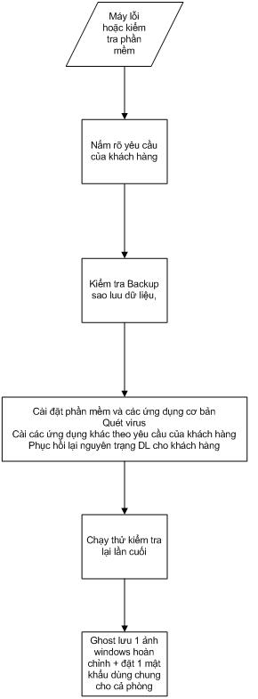

## Quy Trình Kỹ Thuật

Một thiết bị nhận vào sẽ thuộc vào một hoặc trong nhiều lỗi trên, căn cứ
vào từng lỗi mà áp dụng quy trình xử lý.

### Quy trình xử lý phần mềm 

1. Nắm rõ và đọc kỹ các yêu cầu của khách hàng bao gồm dữ liệu, các
phần mềm khách hàng đang sử dụng, driver của các thiết bị ngoại vi.

2. Sao lưu backup dữ liệu hiện có trong máy tính của khách hàng nên tạo
một ảnh ghost windows lỗi (Eddmmyy).(bắt buộc)

- *Chú ý phải chắc chắn bản ghost lưu có thể mở được bằng GhostExplorer*

#### Cài đặt:

##### Đối với máy văn phòng, cơ quan trường học, nhà riêng

- Cài đặt các phần mềm ứng dụng cơ bản (có danh sách kèm theo)
- Quét và diệt virus
- Cài các ứng dụng khách theo yêu cầu của khách hàng yêu cầu bao gồm
phần mềm và driver các thiết bị ngoại vi
- Phục hồi nguyên trạng lại dữ liệu cho khách hàng.

##### Đối với máy phòng game

- Xóa và chia lại HDD sao cho thích hợp với từng cấu hình của
máy games.
- Ghost Dữ liệu Games, Cài Lại HĐH, cài các phần mềm ứng dụng cơ bản
cho máy Games và update phiên bản mới nhất cho các Gameonline.
- Cài phần mềm tính tiền (tùy theo các phòng games sử dụng) và cài
Phần mềm Đóng băng (mật khẩu chung của tổ game)
- Chạy thử kiểm tra lại lần cuối
- Đối với các máy đã có ảnh ghost. Phục hồi lại ảnh ghost, update các chương trình, PM diệt virus.

#### Các phần mềm cơ bản của một máy tính

##### Đối với máy văn phòng, cơ quan, trường học, nhà riêng

- HDH: Windows (98, XP, Vista, Windows7)
- Office: Microsoft Office (word, excel, powerpoint)
- Bộ gõ & Font chữ: Unikey + Vietkey2000
- Antivirus: Autorun Eater, Symantec Antivirus (hoặc:BKAV,
Kaspersky, Avira..)

Tuỳ thuộc cấu hình máy để cài chương trình hợp lý.

- Đọc Files DPF: Acrobat Reader( &gt;=ver 6) hoặc Foxit Reader
- Các chương trình hỗ trợ nghe nhạc xem phim: K-Lite Codec,
Realplayer, Windows Media Player 11, PowerDVD, KMplayer,….
- Từ điển Anh –Việt: MTD 2009(2002).
- Máy In (Thật hoặc ảo) (bắt buộc)

Nếu khách hàng có nối mạng internet thì cài thêm:

- Yahoo!Messenger (nên cài các phiên bản mới )
- Anti Spyware
- Flash Player
- Chương trình hỗ trợ download (nên dùng orbit downloader)
- Copy file Teamviewer Quick support vào máy để có thể hỗ trợ khách
hàng từ xa.

##### Đối với máy phòng game

- HĐH: Windows Xp
- Bộ gõ & Font chữ: unikey+ font chữ(vietkey2k)
- Phần mềm tạo CD ảo
- yahoo chat (nên cài các phiên bản mới + cài chat nhiều nick tùy các
phòng yêu cầu)
- Flash Player(site [www.flash.com](http://www.flash.com/))
- Cài đặt Game offline theo dữ liệu chung của công ty hoặc khách hàng
yêu cầu + Cài phần mềm (Ganera) Chơi Đế chế,Warcraft.... qua Mạng.
- Cài đặt Game online theo dữ liệu chung của công ty, tùy theo dung
Lượng HDD và tùy theo các phòng game yêu cầu.
- Cài đặt các phần mềm chống Web xấu
- Phần Mềm tính tiền (tùy theo các phòng sử dụng)
- Cài Phần mềm Đóng băng (Password mặc Định là: chexanh).
- Hạn chế cài các chương trình diệt virus cho các máy game, không cần
phải lưu ảnh ghost (vì có thể ghost từ máy khác sang, phải cập nhật
game liên tục, không có dữ liệu quan trọng)

*Yêu cầu: Partition phải định dạng NTFS (Partition 10GB)*

### Quy trình xử lý phần cứng

#### Máy không vào điện

Kiểm tra nguồn điện: kiểm tra dây nguồn , giắc cắm nguồn, kiểm tra nút
power…

Kiểm tra nguồn máy tính: có vào điện hay không:

- Chập chân lệnh P.ON xuống Mass (dùng sợi thiếc đấu dây mầu xanh lá
cây vào một dây mầu đen)

- Cấp điện cho bộ nguồn và quan sát quạt

- Nếu quạt quay tít là nguồn đã hoạt động tốt

Nếu nguồn điện của máy sau khi kiểm tra chạy bình thường tiếp tục chuyển
qua kiểm tra Main: clear BIOS, tháo pin CMOS, tháo lắp lại CPU, thử bằng
cách thay 1 bộ nguồn khác….

Qua quá trình kiểm tra các thiết bị xác định bị lỗi chuyển cho bộ phận
sửa chữa hoặc bảo hành tuỳ theo tình trạng.

#### Không lên màn hình

- Vệ sinh máy bao gồm:vệ sinh main, clear bios, vê sinh ram, card
VGA kết hợp với card test main để kiểm tra.

- Nếu không lên màn hình thì thay thế kiểm tra lần lượt các thiết
bị như Ram, VGA, Nguồn, Main, Chíp…

- Chuyển các thiết bị hỏng cho bộ phận tuỳ theo tình trạng của
thiết bị.

#### Máy không khởi động được(không nhận HDD)

- A: Kiểm tra, config BIOS: xem trong BIOS đã thiết lập chế độ của HDD
phù hợp theo chuẩn Sata hay Ata hay chưa; nếu chưa thì xử lý thiết lập
lại BIOS; nếu BIOS bình thường chuyển qua bước B

- B: Kiểm tra Cable (Power, Data): Kiểm tra các loại cable kết nối Main
với HDD bằng cách thay thử cable khác hoặc cắm HDD khác test để xác
định:
  - nếu thay cable khác mà nhận HDD → Lỗi cable
  - nếu thay cable khác vẫn không nhận HDD → bước C

- C: Kiểm tra HDD: Tuỳ vào điều kiện có thể kiểm tra bằng cách cắm HDD
sang máy khác hoặc thay 1 HDD khác (đang sử dụng tốt) để test thử:
  - nếu thay HDD khác mà main nhận HDD (hay đưa HDD sang máy khác cắm mà vẫn không nhận HDD) → kết luận HDD lỗi
  - nếu thay HDD khác mà main không nhận HDD (hay đưa HDD sang máy khác
cắm mà nhận HDD) → kết luận main lỗi

#### Không khởi động được(vẫn nhận HDD ) Màn hình xanh, chạy treo, tự tắt, khởi động lại

- Kiểm tra HDD
- Làm lại phần mềm theo quy trình xử lý phần mềm.
- Kiểm tra các thiết bị phần cứng khác như Ram, Nguồn, Main, tản
nhiệt, CPU…
- Những máy bị lỗi này cần phải bỏ thời gian tập trung kiểm tra để xử
lý lỗi dứt điểm.

#### Các lỗi khác

Kiểm tra HDD:

- Kiểm tra Vật lý: chân IDE, SATA.. có bị biến dạng hay không, Kiểm
tra cơ

- Kiểm tra Bad, kiểm tra các partition có lỗi không

PM check bad: mhdd4.6, HDAT2 trong đĩa hiren’s boot

PM kiểm tra Phân vùng (partition ): Acronis disk doctors , Partition
Table Doctor có trong đĩa hiren.

Không dùng Ontrack disk manager để chia HDD

- Kiểm tra ram:

- Vệ sinh ram cắm vào xem có lên hay không

- Dùng các PM test ram để kiểm tra

PM GoldMemory, memtest86+ có trong đĩa hiren’s boot. Memtest đối với máy
vào được windows.

- Kiểm tra VGA rời:

- Vệ sinh chân VGA

- Kiểm tra Driver

- Chạy thử (các lỗi vga có thể có: sọc màn hình, chạy tự tắt,
chạy treo…)

- Kiểm tra tản nhiệt.

- Kiểm Tra Sound

- Kiểm tra Bios đã enable sound hay chưa

- Kiểm tra lại phần mềm windows và driver sound

- Kiểm Tra CPU

- Kiểm tra xem Main board có support CPU không (đối với trường hợp
không lên)

- Thay CPU khác chạy thử (không lên)

- Dùng card test main để phán đoán

- Làm lại PM và chạy thử (chạy lỗi).

- Kiểm Tra Card mạng

- Kiểm tra PM xem có nhận NIC hay không

- Kiểm tra trong Bios đã enable chưa

---

**Yêu cầu:** MỘT BỘ MÁY TÍNH PHẢI KIỂM TRA TỔNG THỂ TẤT CẢ CÁC THIẾT BỊ
ĐỂ XỬ LÝ 1 LẦN LUÔN.
