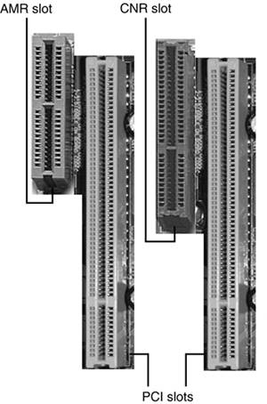
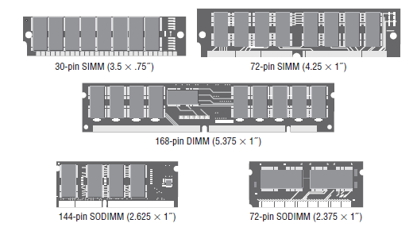
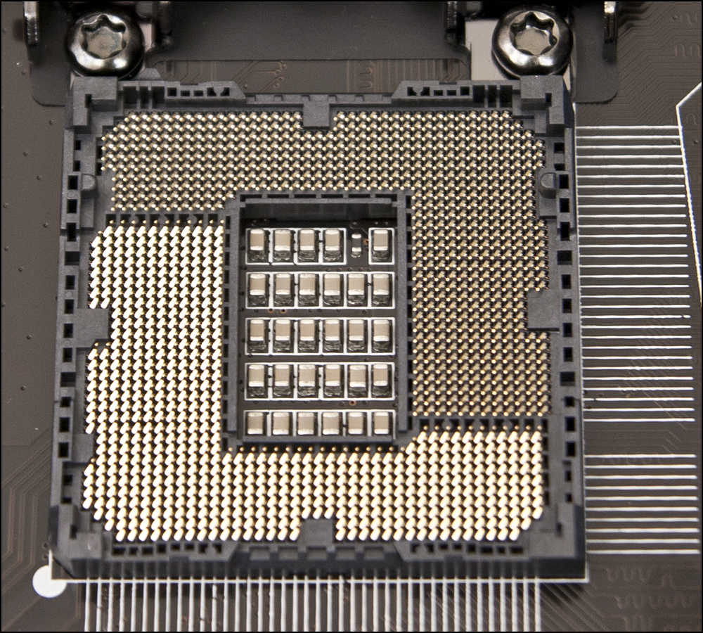
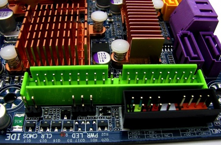
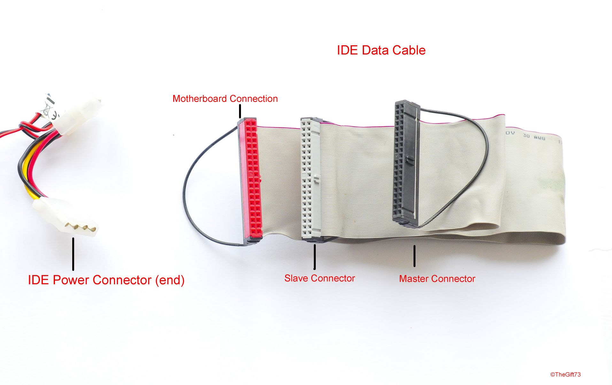
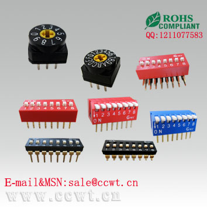

## MAINBOARD LÀ GÌ?

- Là bo mạch điện tử chính làm nhiệm vụ cung cấp các kết nối vật lý và
luận lý giữa tất cả các thiết bị trong hệ thống máy tính. Có thể xem
bo mạch chủ như là khung sườn của hệ thống.

- Điều khiển tốc độ và đường đi của luồng dữ liệu giữa các thiết bị
trên

- Điều khiển điện áp cung cấp cho các linh kiện gắn chết hoặc cắm rời
trên Mainboard

- Bo mạch chủ (Mainboard) là một bộ phận rất quan trọng trong máy vi
tính, nó được tích hợp các công nghệ quyết định đến tính năng,
tốc độ, sự vận hành ổn định của toàn hệ thống. Tất cả các linh kiện
khác đều phải tương thích và được hỗ trợ bởi Mainboard

- Mainboard là thành phần phức tạp nhất trong máy tính. thông thường
khi lắp ráp máy tính bạn phải bắt đầu với việc lựa chọn CPU và
mainboard sẽ sử dụng. Mọi quyết định khác đều dựa theo lựa chọn này.

- Mainboard thường có cấu tạo 4 lớp trừ Main dành cho Server có cấu
tạo 6 lớp.

Bo mạch chủ được phân thành 2 loại

- Bo mạch không tích hợp (nonintegrated system board) -Là bo mạch chỉ
chứa các thành phần cơ bản

- Bo mạch tích hợp (integrated system board) - là bo mạch được tích
hợp thêm sound, VGA...

Trên mainboard thường được tích hợp:

- Chipset (chip cầu bắc và chip cầu nam)

- Slot/ Socket để kết nối vi xử lý

- Khe cắm bộ nhớ (RAM slot)

- Khe cắm mở rộng (expansion card)

- Kết nối nguồn (power connector)

- BIOS ROM

- I/O Port…

PHÂN LOẠI MAINBOARD THEO KÍCH THƯỚC (SYSTEM BOARD FORM FACTORS)

- Mainboard có nhiều chuẩn kích thước khác nhau nhưng thông dụng nhất
là chuẩn ATX (kích thước lớn) có nhiều khe cắm, gắn vừa trong hầu
hết các loại thùng máy (Case) thông dụng hiện có và Micro ATX (Kích
thước nhỏ) có ít khe cắm hơn có thể gắn vào một số loại thùng

  ------------------ ---------------------- ------------------------------------
  Style  Where FoundMatch to Case and Power Supply
  Full ATObselete   Full AT, Full Tower
  Baby ATObselete   All except Slimline, ATX
  LPXObselete   Slimline
  Mini LPX   Obselete   Slimline
  NLXOld PCs (circa 1999)   Slimline
  ATXNewer PCs  ATX
  MicroATX   Newer PCs  MicroATX/ATX
  FlexATXNewer PCs  FlexATX
  Standard BTX   Newest form factor BTX
  MicroBTX   Newest form factor MicroBTX
  PicoBTXNewest form factor PicoBTX
  ------------------ ---------------------- ------------------------------------

- AT và Baby AT : trước đây các loại mainboard được sử dụng trong các
PC chủ yếu là các loại có kích thước tương đối lớn (từ năm 1984 -
theo chuẩn từ năm IBM PC/XT chuẩn này quá cũ kỹ rôi\` nên kô đề cập
đến ở đây). Sau đó chuẩn AT ( Advance Technology) ra đời được sử
dụng phổ biến cho thế hệ máy 386, 486.. tuy nhiên sau một thời gian
chuẩn AT cũng gặp một số vần đề về kích thước liên quan đến các
drive bay do kích thước còn tương đối lớn của mình và các nhà sản
xuất cho ra đời Baby AT kích thước giảm từ 12” xuống còn 8,5”. Và
chuẩn Baby AT nhanh chóng phổ biến do kích thước rất hợp lý của
mình..Chuẩn AT và Baby AT được sử dụng rộng rãi cho 2 thể loại vỏ
máy Desktop và Tower..Ngoài ra cũng có một vài biến thể của vỏ máy
là LPX và mini LPX được sản xuất..

- Các loại chuẩn ATX: trước khi ATX xuất hiện ông lớn Intel còn đưa ra
một chuẩn NPX thay thế cho chuẩn LPX. Thế nhưng thay đổi thực sự
quan trọng nhất đó là sự ra đời của tiêu chuẩn ATX cũng của Intel
vào năm 1995 (được sử dụng rộng rãi phổ biến cho đến nay và được
nâng cấp liên tục) nó làm thay đổi hoàn toàn các thiết kế các loại
mainboard, vỏ máy tính ATX trở thành chuẩn công nghiệp thay thế cho
AT và AT Baby. Có được sự thành công như vậy là nhờ ATX kế thừa được
các ưu điểm nổi trội của chuẩn AT và bổ sung rất nhiều tính năng
nâng cấp mở rộng. ATX cũng là chuẩn có nhiều phiên bản thay đổi và
nâng cấp nhất đặc biệt ở phần I/O panel..

Dưới đây là môt số cỡ mainboard lớn nhất theo chuẩn ATX phổ biến:

+ Full ATX: có kích thước 19”x 9.6” (48.26 x 24.4cm)

+ Mini ATX: có kích thước 11.2”x 8.2” (28.45cm x 20.83cm)

+ Extended ATX: có kích thước 12”x 13” (30.48cm x 33.02cm)

+ WTX: chuẩn Workstation có kích thước 14”x 16.75” (35.56cm x 42.54cm)

+ microATX: có kích thước 9.6”x 9.6” (24.4cm x 24.4cm)

+ FlexATX: có kích thước 9”x 7.5” (22.86cm x 19.05cm)

- Các chuẩn khác do Via Technology phát triển dựa trên nền tảng ATX:

+ Mini-ITX: do Via phát triển có kích thước 6.7”x6.7” ( 17cm x17cm)

+ Nano-ITX: do Via phát triển có kích thước 4.7”x4.7” ( 12cm x12cm)

- Chuẩn BTX - Balanced Technology Extended: chuẩn mới này của Intel
đem lại 1 bộ mặt mới cho các mainboard và vỏ máy tính. Thiết kế mới
giúp cho hệ thống giải nhiệt tốt hơn rất nhiều bằng cách bố trí lại
thành phần và vị trí các cụm linh liện nhằm tối ưu các luồng khí
giải nhiệt lan truyền trong thùng máy. Chuẩn này ra đời giải quyết
vấn đề lớn về nhiệt độ mà các bộ vi xử lý Pentium 4 của Intel
gặp phải. Ngoài ra đây cũng là chuẩn mới ra đời nhằm đáp ứng các
chuẩn thiết bị khác như USB2.0, SATA, PCI Express..

Hiện mới có 4 loại kích cỡ theo chuẩn mới BTX đều cùng dài 26.67cm

+ BTX: có kích thước 12.8”x 10.5” (32.512cm x 26.67cm)

+ microBTX: có kích thước 10.4”x 10.5” (26.416 x 26.67cm)

+ nanoBTX: có kích thước 8.8”x 10.5” (22.352cm x 26.67cm)

+ picoBTX: có kích thước 8”x 10.5” (20.32cm x 26.67cm)

Các Bạn có thể tham khảo thêm tại: <http://www.formfactors.org/>

CÁC THÀNH PHẦN TRÊN MAINBOARD

Một mainboard thường được cấu tạo và tích hợp bởi nhiều thành phần linh
kiện điện tử khác nhau. Có thể chia làm các nhóm: khe mở rộng, I/O port,
các chip điện tử, khe cắm bộ nhớ, các connectors, jumpers và đế cắm vi
xử lý.

- Chipsets

- Expansions slots and buses

- Memory slots and external cache

- Cpu and processor slots or sockets

- Power connectors

- Onboard connectors

- Peripheral ports and connectors

- BIOS

- CMOS battery

- Jumpers and DIP switches

- Firmware

Kiến trúc Bus

- Tất cả các thiết,linh kiện, thiết bị trong máy tính làm việc được
với nhau thông qua kiến trúc bus

- Giữa các thiết bị này thông thường có tốc độ truyền qua lại rất khác
nhau

Ví dụ: trên một Mainboard Pentium 4, tốc độ dữ liệu ra vào CPU là 533MHz
nhưng tốc độ ra vào bộ nhớ RAM chỉ có 266MHz và tốc độ ra vào Card Sound
gắn trên khe PCI lại chỉ có 66MHz

Chipsets

- Là bộ chip quan trọng làm cầu nối chính cho tất cả các thành phần
trên mainboard. Gồm có chip cầu bắc và chip cầu nam.

- Là bộ phận quyết định đến công nghệ và các chức năng của Mainboard,
nó xử lý giao tiếp giữa các bộ phận có trên Mainboard và các thiết
bị được gắn thêm vào với nhau. Tùy theo công nghệ và các chức năng
kèm theo mà Mainboard có các loại Chipset với các mã số khác nhau.

- Các nhà sản xuất thường lấy mã số của Chipset để đặt tên cho chủng
loại (Model) của Mainboard, tuy nhiên đối với người sử dụng thông
thường thì cũng không cần hiểu rõ ý nghĩa của các mã số này mà chỉ
cần chú ý đến các thông số và chức năng của Mainboard để chọn các bộ
phận khác cho phù hợp.

- Một số nhà sản xuất mainboard như intel và AMD sản xuất chipset
riêng của họ. các hãng sản xuất chipset lơn theo thứ tự là Intel
([www.intel.com](http://www.intel.com)) AMD
([www.amd.com](http://www.amd.com) ) Nvidia
([www.nvidia.com](http://www.nvidia.com) ), SiS
([www.sis.com](http://www.sis.com) ).

Chip cầu bắc, hay còn gọi là Memory Controller Hub (MCH):

- là một trong hai chip trong một chipset trên một bo mạch chủ của PC,
chip còn lại là chip cầu nam. Thông thường thì chipset luôn được
tách thành chip cầu bắc và chip cầu nam mặc dù đôi khi hai chip này
được kết hợp làm một.

- Chip cầu bắc đảm nhiệm việc liên lạc giữa các thiết bị CPU, RAM, AGP
hoặc PCI Express, và chip cầu nam. Một vài loại còn chứa chương
trình điều khiển video tích hợp, hay còn gọi là Graphics and Memory
Controller Hub (GMCH)

Chip cầu nam, hay còn gọi là I/O Controller Hub (ICH):

- là một chip đảm nhiệm những việc có tốc độ chậm của bo mạch chủ
trong chipset. Khác với chip cầu bắc, chip cầu nam không được kết
nối trực tiếp với CPU. Đúng hơn là chip cầu bắc kết nối chip cầu nam
với CPU. Chipset nam nhiệm vụ quản lý các cổng kết nối chậm như :
Audio, USB, PCI…

Khe Cắm Mở rộng (Expansion Slots)

- ISA (Industrial Standard Architecture)

- PCI (Peripheral Component Interconnect)

- AGP (Accelerated Graphics Port)

- PCI Express

- AMR (Audio Modem Riser)

- CNR (Communications and Networking Riser)

Khe cắm ISA:

- khe cắm để gắn thêm các bo mạch mở rộng như bo mạch âm thanh hoặc
hình ảnh. Loại khe cắm ISA giờ đây đã không còn được tích hợp trên
bo mạch chủ do đã lỗi thời.

- Thông số kỹ thuật: độ rộng bus của ISA từ 8 đến 16 bit, tần số hoạt
động 8-10Mhz.

Khe cắm PCI :

- Là khe cắm mở rộng, trên Mainboard thường có sẵn vài khe cắm này để
gắn thêm các thiết bị khác khi cần như âm thanh (Sound), Thiết bị
kết nối mạng (Modem), thiết bị xem truyền hình (TV Card)....

- Thông số kỹ thuật: hoạt động ở tần số 33Mhz, 66Mhz, 133Mhz với các
đường truyền dữ liệu có băng thông 32bit/ 64bit.

Khe cắm PCI-X

- Thế hệ phát triển tiếp theo của PCI là PCI-X với 3 phiên bản
sửa đổi. phiên bản mới nhất là PCI-X 3.0. PCI-X có tính tương thích
ngược với các phiên bản cũ. PCI-X tập trung vào công nghệ ngắm tới
thị trường server. vì vậy bạn sẽ không thấy các khe cắm PCI-X trong
các máy tính để bàn. khe cắm PCI-X có thể sử dụng hầu hết card PCI
32 bit và 64 bit hoặc PCI-X. PCI Express đang dần thay thế PCI-X.

Khe cắm PCI Express:

- Sử dụng kiến trúc hoàn toàn khác so với các PCI chuẩn và PCI-X. PCIe
không tương thích ngược với cả 2 loại trên. PCIe sẽ dần thay thế cả
2 loại bus trên cũng như bus AGP. Mặc dù vậy PCIe được mong đợi là
sẽ cùng tồn tại song song với PCI chuẩn thêm một thời gian nữa.

- Trong khi PCI sử dụng bus song song 32 bit và 64 bit, PCI Express sử
dụng bus tuần tự. Bus này nhanh hơn Bus song song.

- Loại khe cắm dùng cho thiết bị đồ họa (VGA), AGP là chuẩn cũ còn PCI
Ex là chuẩn mới. PCIe có 4 kích thước khe cắm khác
nhau x1,x4,x8,x16. Các thông số như 8x, 16x... là tốc độ giao tiếp
dữ liệu giữa Mainboard và VGA, số càng lớn tốc độ càng cao. Ta có
thể cắm card PCIe ngắn hơn ( ví dụ như card x1) vào khe cắm PCI
Express dài hơn (ví dụ như khe cắm x4). Lưu ý là có một số Mainboard
nếu có VGA onboard thì có thể không có khe AGP hoặc PCI-Ex để gắn
thêm VGA card.

- Thông số kỹ thuật: PCIe có băng thông lớn so với các khe cắm
AGP, PCI... 2.5Gb/s chuẩn 1X (250MB/s) và 5.0Gb/s chuẩn 16X (1X
= 500MB/s).

- PCIe có các phiên bản : 1.0 ,1.1, 2.0, 2.1 và 3.0 sắp tới sẽ xuất
hiện thêm phiên bản 4.0 ( các bạn có thể tham khảo so sánh ở bảng
tổng kết sau này)

Khe cắm AGP:

- Là khe cắm dành riêng cho các bo mạch đồ họa. Trong các bo mạch mới
hiện nay khe cắm này đã được loại bỏ và được thay thế bằng
PCI Express.

- Thông số kỹ thuật: chuẩn AGP đầu tiên là AGP 1X tốc độ truyền
266MB/s và được phát triển lên AGP 2X, 4X, 8X.

Khe cắm AMR:

- là khe cắm mở rộng dành cho Modem, âm thanh được tích hợp
trên Mainboard.

- chỉ tồn tại trong các máy tính cũ

Khe cắm CNR:

- là khe cắm mở rộng dành riêng cho card mạng được tích hợp sẵn
trên Mainboard.

- chỉ tồn tại trong các máy tính cũ. ( sự xuất hiện của khe cắm CNR và
AMR mục đích làm giảm giá thành)

Khe cắm bộ nhớ RAM

Các loại bộ nhớ (RAM) sử dụng được trên Mainboard bao gồm chuẩn, công
nghệ, tốc độ Bus, dung lượng cho phép, số khe cắm... Một số Mainboard có
hỗ trợ công nghệ Dual channel, triple channel hỗ trợ sử dụng RAM đôi,
RAM 3 cho công nghệ siêu phân luồng, giúp tăng tốc độ truyền dữ liệu.

Các loại module khe cắm

SIMM (Single Inline Memory Modules)

DIMM (Dual Inline Memory Modules)

RIMM (Rambus Inline Memory Modules)

SoDIMM (Small Outline Dual Inline Memory Modules)

SIMM (Single In-Line Memory Module)

- Ðây là loại ra đời sớm và có hai loại hoặc là 30 pins hoặc là
72 pins. Người ta hay gọi rõ là 30-pin SIMM hoặc 72-pin SIMM. Nếu ra
ngoài thị trường bạn chỉ cần nhận dạng SIMM khi nó có 30 hoặc
72 pins. Loại 72-pin SIMM có chiều rộng 41/2" trong khi loại 30-pin
SIMM có chiều rộng 31/2"

DIMM (Dual In-line Memory Modules)

- Cũng gần giống như loại SIMM mà thôi nhưng có số pins là 72 hoặc
168, 184. Một đặc điểm khác để phân biệt DIMM với SIMM là cái
chân (pins) của SIMM dính lại với nhau tạo thành một mảng để tiếp
xúc với memory slot trong khi DIMM có các chân hoàn toàn cách rời
độc lập với nhau. Một đặc điểm phụ nửa là DIMM được cài đặt thẳng
đứng (ấn miếng RAM thẳng đứng vào memory slot) trong khi SIMM thì ấn
vào nghiêng khoảng 45 độ. Thông thường loại 30 pins tải data 16bits,
loại 72 pins tải data 32bits, loại 144 (cho notebook) hay 168 pins
tải data 64bits.

Chủng loại DIMM Modules

SDR SDRAM

DDR SDRAM

DDR II SDRAM

DDR III SDRAM

SO DIMM (Small Outline DIMM)

- Ðây là loại memory dùng cho notebook, có hai loại pin là 72
hoặc 144. Nếu bạn để ý một tý thì thấy chúng có khổ hình nhỏ phù hợp
cho notebook. Loại 72pins vận hành với 32bits, loại 144pins vận hành
với 64bits.

RIMM (Rambus In-line Memory Modules) và SO RIMM (RIMM dùng cho
notebook)

- Là công nghệ của hãng Rambus, có 184 pins (RIMM) và 160 pins
(SO RIMM) và truyền data mỗi lần 16bit (thế hệ củ chỉ có 8bits
mà thôi)

Bộ nhớ Cache

Là bộ nhớ đệm nằm giữa bộ nhớ RAM và CPU nhằm rút ngắn thời gian lấy dữ
liệu trong lúc CPU xử lý, có hai loại Cache là Cache L1 và Cache L2.

Cần bổ sung

Giao tiếp vi xử lý

- Ta có thể căn cứ vào khe cắm CPU để phân biệt các chủng loại
mainboard

- Thông số này cho biết Mainboard hỗ trợ loại CPU nào (Intel,
AMD,...), có chuẩn chân cắm là gì (LGA775 cho CPU Intel P4, AM2 cho
CPU AMD Athlon,...)

- Slot 1: Pentium II, Pentium III, Celeron

- Slot 2: Pentium II Xeon, Pentium III Xeon

- Slot A: các vi xử lý của hãng AMD

- Socket: là đế cắm dạng hình chữ nhật.

  --------------- --------------------- ------ -------------- --------------------------------------------------------------------------- ------------
  Chip Class  SocketPins   Layout Supported ProcessorsIntroduced
  Intel P4/Core   423   42339x39 SPGA Pentium 4 FC-PGANov. 2000
  478   47826x26 mPGA Pentium 4/Celeron FC-PGA2, Celeron DOct. 2001
  T (LGA 775)   77530x33 LGA  Pentium 4/Extreme Edition, Pentium D, Celeron D, Pentium dual-core, Core2   Jun-04
  LGA 1156 (Socket H)   1156   40x40 LGA  Pentium, Core i3/i5/i7, XeonSept. 2009
  LGA 1136 (Socket B)   1366   41x43 LGA  Core i7, Xeon   Nov. 2008
  LGA 1155(Socket H2)   1155   40x40 LGA  Core i7, i5, i3 Jan. 2011
  LGA 2011  2011   58x43 hexLGA   Core i7 Nov. 2011
  AMD K8  754   75429x29 mPGA Athlon 64   Sept. 2003
  939   93931x31 mPGA Athlon 64 v.2   Jun-04
  940   94031x31 mPGA Athlon 64 FX, Opteron   Apr. 2003
  AM2   94031x31 mPGA Athlon 64/64FX/64 X2, Sempron, Opteron, Phenom  May-06
  AM2+  94031x31 mPGA Athlon 64/64 X2, Opteron, Phenom X2/X3/X4, II X4Nov. 2007
  AM3   9412   31x31 mPGA Athlon II, Phenom II, Sempron   Feb. 2009
  AM3+  9412   31x31 mPGA "Bulldozer" Processors  Mid-2011
  F (1207 FX)   1207   35x35 LGA  Athlon 64 FX, Opteron   Aug. 2006
  AMD A   FM1   90531x31 LGA  A4, A6, A8, Athlon II, E2, Sempron  Jul. 2011
  FM2   90431x31 LGA  A4, A6, A8, A10 Sept. 2012
  --------------- --------------------- ------ -------------- --------------------------------------------------------------------------- ------------

Socket 775

Socket 1156

Socket 1155

Socket 2011

Giắc cắm nguồn

Power
Connectors: thành phần quan trọng dùng để cung cấp năng lượng cho tất cả
các thiết bị trên mainboard.

AT ATX- 20 pin ATX -24 pin

Connector Port

FDD (Floppy Disk Drive)

IDE (Integrated Drive Electronics)

SATA (Serial ATA )

- Có thế mạnh về tốc độ, dung lượng, truyền tín hiệu xa hơn, an toàn
hơn giúp SATA nhanh chóng thay thế giao diện Parallel ATA.

Có 3 loại tốc độ truyền dữ liệu là SATA1 -150MB/s, SATA 2 - 300MB/s và
SATA 3 - 600MB/s

SCSI (Small Computer System Interface)

- Là chuẩn cao cấp chuyên dùng cho Server, có tốc độ rất cao từ 10,000
vòng/phút, số chân 50 hoặc 68. Chủ yếu được dùng cho các thiết bị
như: ổ đĩa cứng, ổ đĩa quang, scanner… Thế mạnh của SCSI là khả năng
kết nối liên tiếp (daisy-chain) 15 thiết bị khác nhau.

Cổng tích hợp ( on-board) và bộ kết nối

Ngoài các khe cắm mở rộng mainboard còn có một số cổng tích hợp và bộ
kết nối nội bộ

cổng được gắn trên mainboard được gọi là cổng tích hợp hay bộ phận tích
hợp.đa số mainboard có nhiều hơn 2 cổng usb và cổng âm thanh. mainboard
cũng có thể có cổng mạng, cổng modem, cổng firewire (IEEE1394), cổng
video, bàn phím, chuột...

Jumper và DIP switch

Jumper: được thiết kế bằng plastic nhỏ có tính chất dẫn điện dùng để cắm
vào những mạch hở tạo thành mạch kín để thực hiện một nhiệm vụ nào đó.

DIP Switches: là một dạng công tắc gạt dùng hiệu chỉnh tốc độ CPU, RAM…
trên mainboard của các đời mainboard cũ Pentium II, III.

Giới thiệu các công nghệ được tích hợp trên mainboard

