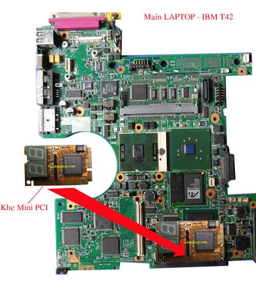
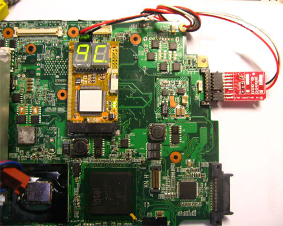
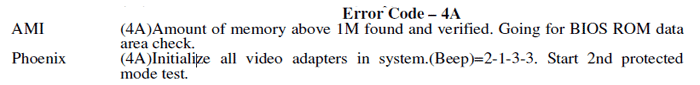
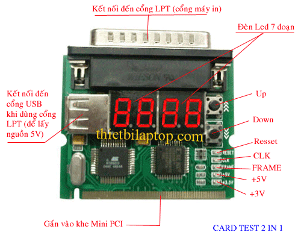

## Kiểm tra hư hỏng của máy bằng Card Test Main laptop

1 Các lưu ý khi sử dụng Card Test Laptop.

- Với các máy Laptop có cổngMini PCI(cổng gắn card Wifi
 loại thường) như các máy IBM T41 thì cổng này đều sử dụng được Card
 Test và đều xuất tín hiệu mã lỗi POST Code.

Khe-MiniPCI-2

- Với các máy có cổngMini PCIe(loại gắn card Wifi nhỏ trên các
 máy đời mới) thì chỉ có 3 dòng máy còn hỗ trợ xuất tín hiệu
 Post Code ra Card Test nhưng lại không xuất trực tiếp qua khe Mini
 PCIe mà xuất qua chân Pin, qua cổng ELPC và qua chân
 của BIOS.

- =&gt;&gt; Vì thế trên các máy Laptop mới hiện nay, việc sử dụng
 Card Test để “Khám bệnh” không còn khả thi nữa, người thợ chủ yếu
 phải dựa vào nguồn đa năng và đồng hồ vạn năng, kết hợp với kiến
 thức cần thiết về quá trình Post máy.(Dưới đây là minh hoạ)

Cachdau-I2C

2 – Gắn Card Test vào máy như thế nào để hiển thị mã POST code ? (trên
một số dòng máy còn hỗ trợ – IBM, Lenovo, Asus)

- Nếu bạn kiểm tra tín hiệu Clock, Reset hệ thống và kiểm tra mã POST
 Code thì bạn lưu ý như sau:
 - Tất cả các máy có cổng Mini PCI bạn có thể sử dụng cổng này để
 kiểm tra.
 - Các máy có cổng Mini PCIE thì chi làm ba loại.1) – Các
 máyASUSchỉ xuất mã POST Code ra cổng ELPC (tức là cổng Debug
 Connector)
 * Kiểm tra mã POST trên các máy ASUS*2) – Các máyLenovolại
 xuất mã POST ra cổng I2C (tức là chân PIN), với cổng này bạn phải
 gắn Card Test
 đồng thời qua cổng Mini PCIE và qua cáp gắn vào chân PIN. (như hình
 dưới đây)
 *Các máy Lenovo phải gắn card Test qua cổng Mini PCIE và cổng I2C
 (chân Pin) để có thể hiển thị mã POST.*3) – Hầu hết các dòng máy có
 cổng Mini PCIE đều xuất mã POST ra qua chuẩn LPC, chuẩn này không có
 cổng kết nối
 nên để sử dụng chúng ta phải hàn cáp LPC từ Card đến các vị trí
 tương ứng trên Main, nói chung việc này quá phức tạp
 và có nhiều rủi ro.

3 – Ý nghĩa của các mã POST Code.

- Khi bạn kiểm tra máy, sau khi kích nguồn mã Hecxa nhảy một số bước
 rồi dừng lại ở mã Hecxa là 4A.
 - Bạn tra cứu và nhận được thông tin như
 sau:Nếu bạn hiểu tiếng Anh thì bạn cũng
 cần phải tìm hiểu xem máy mà bạn đang sửa có BIOS do hãngAMIhay
 hãng
 Phoenixlập trình =&gt; thì bạn mới suy ra được sự cố tương ứng,
 thậm chí giữa một hãng lập trình BIOS thì mã trên cũng
 không thống nhất giữa các phiên bản BIOS, vì vậy việc tra mã POST để
 chuẩn đoán lỗi là việc làm mất nhiều thời gian và
 thiếu độ chính xác, vì vậy tốt nhất là bạn nên dựa vào kinh nghiệm.

- Bạn cần tích luỹ kinh nghiệm trong quá trình sửa chữa.
 Giả sử bạn kiểm tra máy IBM T42, khi kiểm tra máy không lên hình và
 thấy mã POST nhảy một số bước rồi dừng lại ở
 mã 4A, sau khi phân tích và thay thử một số linh kiện, kết quả là
 sau khi bạn thay Chip Video thì máy đã lên hình, Card
 Test nhảy đến mã 4A rồi tiếp tục nhảy qua các mã khác.
 =&gt; Bạn rút ra kinh nghiệm là mã 4A (với máy IBM) đó là lỗi
 Chip Video.

- Bạn thử nghiệm trên máy sống để tạo ra kinh nghiệm cho
 chính mình.
 - Bạn có thể tháo RAM ra để biết mã lỗi không nhận RAM trên dòng máy
 bạn đang thử là gì.
 - Bạn có thể tạm thời ngắt cuộn dây cấp nguồn 1,8V cho Chip Video ra
 để biết được mã báo lỗi khi máy không nhận
 Chip Video là gì.

- Thay vì dựa vào mã lỗi thì bạn dựa vào số bước nhảy để chuẩn đoán
 hư hỏng của máy, sau đây là một số
 kinh nghiệm mà chúng tôi đã đúc kết trong quá trình sửa chữa.*1)
 Card Test không hiển thị mã POST hoặc hiển thị 00 hoặc FF nhưng
 không nhảy số Hecxa.*

 -------------------------------------------------
  Nguyên nhân:* Hiện tượng này do CPU
  không hoạt động hoặc không nạp được BIOS.
  - Do hỏng hoặc bong chân Chipset bắc
  nên không có tín hiệu CPU_RST
  khởi
  động CPU.
  - Do hỏng CPU hoặc gắn CPU sai BUS.
  - Mất xung Clock cấp cho CPU
  - Do hỏng ROM
  - Do lỗi BIOS
  - Mất nguồn VIO (1,05V) là nguồn phụ
  cấp cho CPU
  =&gt; Bạn hãy kiểm tra các nguyên nhân trên.
 -- ----------------------------------------------
 -------------------------------------------------

- *2) Card Test hiển thị mã POST và nhảy được 1 số rồi dừng.*

 --------------------------------------------------------------------------------
  Nguyên nhân:* Hiện tượng này do CPU bị
  lỗi hoặc sai BUS
  - Khi chương trình BIOS kiểm tra máy, ban đầu nó kiểm tra chính CPU trước,
  sau đó sẽ kiểm tra Chipset bắc, vì vậy nếu Card Test nhảy được 1 bước
  rồi dừng thì thường do lỗi CPU.
  =&gt; Bạn hãy thay thử CPU tốt và đúng BUS.
 -- -----------------------------------------------------------------------------
 --------------------------------------------------------------------------------

- *3) Card Test nhảy được 2 bước rồi dừng.*

 --------------------------------------------------------------------------
  Nguyên nhân:* Hiện tượng này thường do
  lỗi Chipset bắc, thường bị lỗi bộ nhớ DMA (Direct Memory Access – Bộ
  nhớ truy cập trực tiếp) đấy là vùng nhớ đệm nằm trong Chipset nhằm
  tăng tốc độ xử lý cho hệ thống.
 -- -----------------------------------------------------------------------
 --------------------------------------------------------------------------

- *4) Card Test nhảy được3 đến 4 bước thì dừng.*

 --------------------------------------------------------------------------
  Nguyên nhân:* Khi Card Test nhảy được
  3 đến 4 bước rồi dừng, thông thường đây là báo lỗi không nhận RAM và
  báo lỗi đã nhận RAM nhưng RAM có sự cố.
  =&gt; Bạn cần thay thử RAM tốt, đúng BUS.
  =&gt; Kiểm tra, vệ sinh chân RAM.
  =&gt; Kiểm tra các nguồn điện cấp cho RAM
  =&gt; Hàn lại chân RAM
 -- -----------------------------------------------------------------------
 --------------------------------------------------------------------------

- *5) Card Test nhảy đượctừ 5 đến 8, 9 bước thì dừng.*

 --------------------------------------------------------------------------
  Nguyên nhân:* Khi Card Test nhảy được
  từ 5 đến 9 bước rồi dừng, thông thường các lỗi này thuộc về Chipset
  nam.
  - Chipset nam có các vùng nhớ đệm DMA trước các ngõ ra để điều khiển
  các thiết bị ngoại vi, khi các vùng nhớ này có sự cố sẽ gây ra báo
  lỗi.
 -- -----------------------------------------------------------------------
 --------------------------------------------------------------------------

- *6) Card Test nhảy đượctrên 9 bước, hoặc dừng lại ở mã lỗi cuối
 cùng trước khi ra hình.
 Ví dụ máy IBM T42 nếu mã nhảy qua mã …49 – 4A – 52 thì lên hình,
 nhưng lại dừng ở mã 49 hoặc 4A
 là lỗi Chip Video.*

 ------------------------------------------------------------------------
  Nguyên nhân:* Card Test đã nhảy khoảng
  10 – 11 bước nhưng không lên hình thì thông thường là do lỗi không
  nhận Chip Video hoặc Chip Video hỏng.
 -- ---------------------------------------------------------------------
 ------------------------------------------------------------------------

- *7) Card Test nhảytrên 12 bước thì máy đã Test qua Chip Video,
 nếu không lên hình thì do lỗi màn hình hoặc hỏng
 cao áp.
 - Nếu lên được hình thì bạn nên quan sát màn hình để xem hiển thị,
 bởi khi máy đã lên hình, BIOS sẽ xuất thông báo
 lỗi lên màn hình và đây là các thông báo lỗi bằng tiếng anh, ví dụ:
 “Disk Boot Failure, Press Anykey Continue”
 hoặc xuất mã kiểu “Erro 1085“*

 --------------------------------------------------------------------------
  Nguyên nhân:* Card Test đã nhảy qua
  bước 12 thì thông thường máy đã lên hình, nếu không lên hình thì bạn
  cần kiểm tra, thay thử màn hình và cao áp.
 -- -----------------------------------------------------------------------
 --------------------------------------------------------------------------

4 – Làm sao để đếm được số bước nhảy.

- Khi mã Hecxa nhảy rất nhanh thì bạn không thể đếm được có bao nhiêu
 bước nhảy đã qua trước khi nó dừng lại ở mã lỗi
 để biết được điều này, bạn nên mua một Card Test có các nút bấm Up
 và Down, phím Down cho phép bạn xem lại các mã
 đã nhảy qua.

Card-2in1

Card Test này có hai phím Up và Down cho phép xem lại các mã Hecxa
đã nhảy qua.

