# Phần cứng máy tính

## TỔNG QUAN VỀ PHẦN CỨNG MÁY TÍNH

### Các khái niệm cơ bản
#### Phần cứng (Hardware)

Phần cứng là các thiết bị vật lý của máy tính.

#### Phần mềm (Software)

Là các chương trình được thiết kế chứa các mã lệnh giúp phần cứng làm
việc phục vụ nhu cầu người sử dụng. Phần mềm được lưu trữ trong các
thiết bị lưu trữ.

Phần mềm chia làm 2 loại:

Phần mềm hệ thống (**System Softwares**): bao gồm các hệ điều hành điều
khiển, quản lý phần cứng và phần mềm ứng dụng; các trình điều khiển
trình thiết bị (driver).

Phần mềm ứng dụng (**Application Softwares**): là các phần mềm chạy trên
nền các hệ điều hành để giúp người sử dụng thao tác với máy tính.

#### Các loại máy tính thông dụng:**

##### Mainframe:**

Hình bên là một siêu máy tính của hãng IBM với tốc độ nhanh nhất thế giới hiện nay.                                         

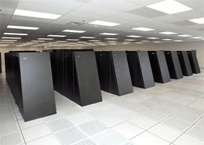
                                                                                           
Là những máy tính có cấu hình phần cứng lớn, tốc độ xử lý cao được dùng trong các công việc đòi hỏi tính toán lớn như làm máy chủ phục vụ mạng Internet, máy chủ để tính toán phục vụ dự báo thời tiết, vũ trụ.....   

##### PC - Persional Computer:**

Máy vi tính cá nhân, tên gọi khác máy tính để bàn (Desktop).

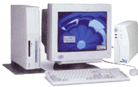

##### Laptop, DeskNote, Notebook**
Là những máy tính xách tay.

##### PDA - Persional Digital Assistant**

Thiết bị hỗ trợ kỹ thuật số cá nhân. Tên gọi khác: máy tính cầm tay, máy tính bỏ túi (Pocket PC).

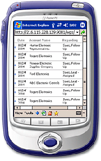

Ngày nay có rất nhiều điện thoại di động có tính năng của một PDA.                                  

### Cấu trúc máy tính:**

#### Thiết bị nhập (Input Devices)**

Là những thiết bị nhập dữ liệu vào máy tính như bàn phím, chuột, máy
quét, máy scan...

#### Thiết bị xử lý (Processing Devies)**

Là những thiết bị xử lý dữ liệu bao gồm bộ vi xử lý, bo mạch chủ.

#### Thiết bị lưu trữ (Stogare Devices)**

- Là những thiết bị lưu trữ dữ liệu bao gồm bộ nhớ trong và bộ nhớ ngoài. 
- Bộ nhớ trong bao gồm bộ nhớ chì đọc ROM, bộ nhớ truy xuất ngẫu nhiên RAM.
- Bộ nhớ ngoài bao gồm ổ cứng, đĩa mềm, đĩa CD, DVD, ổ cứng USB, thẻ nhớ và các thiết bị lưu trữ khác.

#### Thiết bị xuất (Output Devices)**

- Là những thiết bị hiển thị và xuất dữ liệu từ máy tính. Thiết bị xuất bao gồm màn hình, đèn chiếu, máy in...

### THIẾT BỊ NỘI VI

#### Vỏ máy - Case**

- Công dụng: Thùng máy là giá đỡ để gắn các bộ phận khác của máy và bảo vệ các thiết bị khỏi bị tác động bởi môi trường.

Case chưa sử dụng   
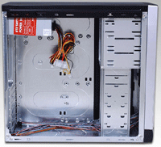

Case đang sử dụng
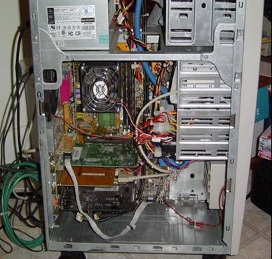

Case hết sử dụng
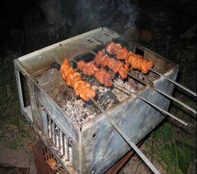

#### Bộ nguồn - Power**

- **Công dụng:** là thiết bị chuyển điện xoay chiều thành điện 1 chiều để cung cấp cho các bộ phận phần cứng với nhiều hiệu điện thế khác nhau.

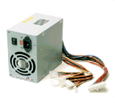
                     
Bộ nguồn thường đi kèm với vỏ máy.                                                                                                              
  ----------------------------------------------------------------------------------------------------------------------------------------------- -----------------------------------------------------------------------------------------------------------------------------------------------------------------

**3. Bảng mạch chủ (Mainboard, Motherboard)**

  ------------------------------------------------------------------------------------------ -----------------------------------------------------------------------------------------------------------------------------------------------------------------
  Công dụng: Là thiết bị trung gian để gắn kết tất cả các thiết bị phần cứng khác của máy.   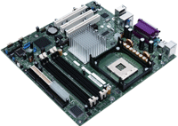{width="2.0833333333333335in" height="1.4791666666666667in"}
                                                                                             
  Nhận dạng: là bảng mạch to nhất gắn trong thùng máy.                                       
                                                                                             
                                                                                             
  ------------------------------------------------------------------------------------------ -----------------------------------------------------------------------------------------------------------------------------------------------------------------

**3.1 Bên trong mainboard**

**3.1.1 Chipset**

  --------------------------------------------------------------------------------------------------------------------- ------------------------------------------------------------------------------------------------------------------------------------------------------------------
  **Công dụng:** Là thiết bị điều hành mọi hoạt động của mainboard.                                                     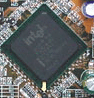{width="0.9791666666666666in" height="1.0208333333333333in"}
                                                                                                                        
  **Nhân dạng:** Là con chíp lớn nhấn trên main và thừơng có 1 gạch vàng ở một góc, mặt trên có ghi tên nhà sản xuất.   
                                                                                                                        
  **Nhà sản xuất:** Intel, SIS, AMD, VIA...                                                                             
  --------------------------------------------------------------------------------------------------------------------- ------------------------------------------------------------------------------------------------------------------------------------------------------------------

**3.1.2 Giao tiếp với CPU.**

**Công dụng:** Giúp bộ vi xử lý gắn kết với mainboard.

**Nhân dạng:** Giao tiếp với CPU có 2 dạng khe cắm (slot) và chân cắm
(socket). 

+ Dạng khe cắm là một rãnh dài nằm ở khu vực giữa mainboard dùng cho
PII, PIII đời cũ. Hiện nay hầu như người ta không sử dụng dạng khe cắm.

+ Dạng chân cắm (socket) là một khối hình vuông gồm nhiều chân. Hiên nay
đang sử dụng socket 370, 478, 775.. tương ứng với số chân của CPU.

  ------------------------------------------------------------------------------------------------------------------------------------------------------------------ ----------------------------------------------------------------------------------------------------------------------------------------------------- -------------------------------------------------------------------------------------------------------------------------------------------------------
  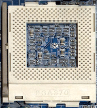{width="1.6458333333333333in" height="1.8645833333333333in"}   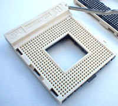{width="2.0833333333333335in" height="1.875in"}   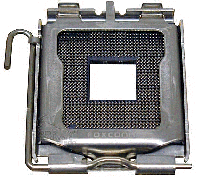{width="2.0833333333333335in" height="1.84375in"}
                                                                                                                                                                                                                                                                                                                           
                                                                                                                                                                                                                                                                                                                            
  ------------------------------------------------------------------------------------------------------------------------------------------------------------------ ----------------------------------------------------------------------------------------------------------------------------------------------------- -------------------------------------------------------------------------------------------------------------------------------------------------------

**3.1.3  AGP Slot**

  ----------------------------------------------------------------------------------------------------------------------------------------------------------------------------------------------------------------------------- ------------------------------------------------------------------------------------------------------------------------------------------------------------------
  Khe cắm card màn hình ** AGP** viết tắt từ **Array Graphic Adapter.**                                                                                                                                                         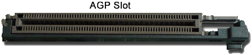{width="2.4791666666666665in" height="0.5729166666666666in"}
                                                                                                                                                                                                                                
                                                                                                                                                                                                                                

  **Công dụng:** Dùng để cắm card đồ họa.

  **Nhận dạng:** Là khe cắm màu nâu hoặc màu đen nằm giữa socket và khe PCI màu trắng sữa trên mainboard.

  **Lưu ý**: Đối với những mainboard có card màn hình tích hợp thì có thể có hoặc không có khe AGP. Khi đó khe AGP chỉ có tác để nâng cấp card màn hình bằng card rời nếu cần thiết để thay thế card tích hợp trên mainboard.

   
  ----------------------------------------------------------------------------------------------------------------------------------------------------------------------------------------------------------------------------- ------------------------------------------------------------------------------------------------------------------------------------------------------------------

** 3.1.4  RAM slot**

  ------------------------------------------------------------------------------- ------------------------------------------------------------------------------------------------------------------------------------------------------
  **Công dụng:** Dùng để cắm RAM và main.                                         {width="2.8125in" height="0.3645833333333333in"}

  **Nhận dạng:** Khe cắm RAM luôn có cần gạt ở 2 đầu.

  Lưu ý: Tùy vào loại RAM (SDRAM, DDRAM, RDRAM) mà giao diện khe cắm khác nhau.
  ------------------------------------------------------------------------------- ------------------------------------------------------------------------------------------------------------------------------------------------------

**3.1.5 PCI Slot**

  ---------------------------------------------------------------------------- -------------------------------------------------------------------------------------------------------------------------------------------
  **PCI - Peripheral Component Interconnect -** khe cắm mở rộng                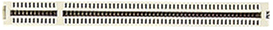{width="2.84375in" height="0.3125in"}
                                                                               
                                                                               

  **Công dụng:** Dùng để cắm các loại card như card mạng, card âm thanh, ...

  **Nhận dạng:** khe màu trắng sử nằm ở phía rìa mainboard.
  ---------------------------------------------------------------------------- -------------------------------------------------------------------------------------------------------------------------------------------

 

**3.1.6 ISA Slot**

  -------------------------------------------------------------------------------------------------------------------------------------- -------------------------------------------------------------------------------------------------------------------------------------------------------
  Khe cắm mở rộng **ISA** - Viết tắt **Industry Standard Architecture.**                                                                 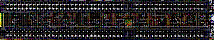{width="2.96875in" height="0.4166666666666667in"}

  **Công dụng**: Dùng để cắm các loại card mở rộng như card mạng, card âm thanh...

  **Nhận dạng**: khe màu đen dài hơn PCI nằm ở rìa mainboard (nếu có).

  **Lưu ý:** Vì tốc độ truyền dữ liệu chậm, chiếm không gian trong mainboard nên hầu hết các mainboard hiện nay không sử dụng khe ISA.
  -------------------------------------------------------------------------------------------------------------------------------------- -------------------------------------------------------------------------------------------------------------------------------------------------------

**3.1.7 IDE Header**

  -------------------------------------------------------------------------------------------------------------------- ------------------------------------------------------------------------------------------------------------------------------------------------------------------
  Viết tắt **Intergrated Drive Electronics** - là đầu cắm 40 chân, có đinh trên mainboard để cắm các loại ổ cứng, CD   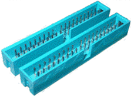{width="1.2708333333333333in" height="0.9270833333333334in"}

  Mỗi mainboard thường có 2 IDE trên mainboard:

  **IDE1**: chân cắm chính, để cắm dây cáp nối với ổ cứng chính

  **IDE2**: chân cắm phụ, để cắm dây cáp nối với ổ cứng thứ 2 hoặc các ổ CD, DVD...

  **Lưu ý**: Dây cắp cắm ổ cứng dùng được cho cả ổ CD, DVD vì 2 IDE hoàn toàn giống nhau.
  -------------------------------------------------------------------------------------------------------------------- ------------------------------------------------------------------------------------------------------------------------------------------------------------------

**3.1.8 FDD Header**

  ---------------------------------------------------------------------------------------------------------------------
  Là chân cắm dây cắm ổ đĩa mềm trên mainboard. Đầu cắm FDD thường nằm gần IDE trên main và có tiết diện nhỏ hơn IDE.

  Lưu ý khi cắm dây cắm ổ mềm: đầu bị đánh tréo cắm vào ổ, đầu không tréo cắm vào đầu FDD trên mainboard.
  ---------------------------------------------------------------------------------------------------------------------

**3.1.9 ROM BIOS**

  ---------------------------------------------------------------------------------------------------------------------------------------------------------------------------- -----------------------------------------------------------------------------------------------------------------------------------------
  Là bộ nhớ sơ cấp của máy tính. ROM chứa hệ thống lệnh nhập xuất cơ bản (BIOS - Basic Input Output System) để kiểm tra phần cứng, nạp hệ điều hành nên còn gọi là ROM BIOS.   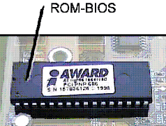{width="1.375in" height="1.0625in"}
  ---------------------------------------------------------------------------------------------------------------------------------------------------------------------------- -----------------------------------------------------------------------------------------------------------------------------------------

**3.1.10 PIN CMOS**

  ------------------------------------------------------------------------------------------------------ ------------------------------------------------------------------------------------------------------------------------------------------------------------------
  Là viên pin 3V nuôi những thiết lập riêng của người  dùng như ngày giờ hệ thống, mật khẩu bảo vệ ...   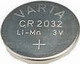{width="0.8333333333333334in" height="0.6666666666666666in"}
  ------------------------------------------------------------------------------------------------------ ------------------------------------------------------------------------------------------------------------------------------------------------------------------

 

  ------------------- ---------------------------------------------------------------------------------------------------------------------------------------------------
  **3.1.11 Jumper**   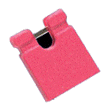{width="0.4791666666666667in" height="0.5in"}
  ------------------- ---------------------------------------------------------------------------------------------------------------------------------------------------

  ------------------------------------------------------------------------------------------------------------------------------------------------------------------------------------ -------------------------------------------------------------------------------------------------------------------------------------------------------
  **Jumper** là một miếng Plastic nhỏ trong có chất dẫn điện dùng để cắm vào những mạch hở tạo thành mạch kín trên mainboard để thực hiện một nhiệm vụ nào đó như lưu mật khẩu CMOS.   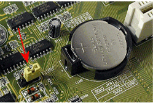{width="2.59375in" height="1.7604166666666667in"}
                                                                                                                                                                                       
  **Jumper** là một thành phần không thể thiếu để thiết lập ổ chính, ổ phụ khi bạn gắn 2 ổ cứng, 2 ổ CD, hoặc ổ cứng và ổ CD trên một dây cáp.                                         
  ------------------------------------------------------------------------------------------------------------------------------------------------------------------------------------ -------------------------------------------------------------------------------------------------------------------------------------------------------

**3.1.12 Power Connector.**

  -------------------------------------------------------------------------------------- --------------------------------------------------------------------------------------------------------------------------------------------------------------------
  Bạn phải xác định được các loại đầu cắm cáp nguồn trên main:                             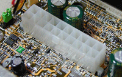{width="2.0833333333333335in" height="1.3229166666666667in"}
                                                                                         
  -   Đầu lớn nhất để cáp dây cáp nguồn lớn nhất từ bộ nguồn.                            
                                                                                         
  -   Đối với main dành cho PIV trở lên có một đầu cáp nguồn vuông 4 dây cắm vào main.   
                                                                                         
                                                                                         
  -------------------------------------------------------------------------------------- --------------------------------------------------------------------------------------------------------------------------------------------------------------------

**3.1.13 FAN Connector**

  ----------------------------------------------------------------------------------------------------------------------------------------------------------------------- -------------------------------------------------------------------------------------------------------------------------------------------------------
  Là chân cắm 3 đinh có ký hiệu FAN nằm ở khu vực giữa mainboard để cung cấp nguồn cho quạt giải nhiệt của CPU.                                                           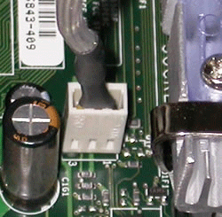{width="1.46875in" height="1.4479166666666667in"}
                                                                                                                                                                          
  Trong trường hợp Case của bạn có gắn quạt giải nhiệt, nếu không tìm thấy một chân cắm quạt nào dư trên mainboard thì lấy nguồn trực tiếp từ các đầu dây của bộ nguồn.   
  ----------------------------------------------------------------------------------------------------------------------------------------------------------------------- -------------------------------------------------------------------------------------------------------------------------------------------------------

**3.1.14 Dây nối với Case**

  ------------------------------------------------------------------------------------------------- ------------------------------------------------------------------------------------------------------------------------------------------------------
  Mặt trước thùng máy thông thường chúng ta có các thiết bị sau:                                    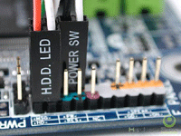{width="2.0833333333333335in" height="1.5625in"}
                                                                                                    
  -   **Nút Power:** dùng để khởi động máy.                                                         
                                                                                                    
  -   **Nút Reset:** để khởi động lại máy trong trừơng hợp cần thiết.                               
                                                                                                    
  -   **Đèn nguồn:** màu xanh báo máy đang hoạt động.                                               
                                                                                                    
  -   **Đèn ổ cứng:** màu đỏ báo ổ cứng đang truy xuất dữ liệu.                                     
                                                                                                    
                                                                                                    

  Các thiết bị này được nối với mainboard thông qua các dây điên nhỏ đi kèm Case.

  Trên mainboard sẽ có những chân cắm với các ký hiệu để giúp bạn gắn đúng dây cho từng thiết bị.
  ------------------------------------------------------------------------------------------------- ------------------------------------------------------------------------------------------------------------------------------------------------------

**3.2 Bên ngoài mainboard:**

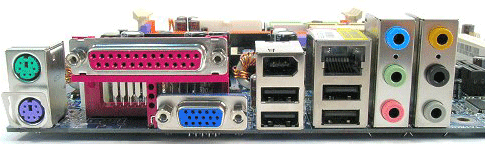{width="5.052083333333333in"
height="1.5in"}

**3.2.1 PS/2 Port**

  ------------------------------------------------------------------------------------------------------- ------------------------------------------------------------------------------------------------------------------------------------------------------------------
  **Công dụng:** Cổng gắn chuột và bàn phím.                                                              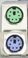{width="0.2916666666666667in" height="0.6041666666666666in"}
  **Nhận dạng:** 2 cổng tròn nằm sát nhau. Màu xanh đậm để cắm dây bàn phím, màu xanh lạt để dây chuột.
  ------------------------------------------------------------------------------------------------------- ------------------------------------------------------------------------------------------------------------------------------------------------------------------

**3.2.2 USB Port**

  -------------------------------------------------------------------------------------------------------------------------------------------------------------------------------------- -----------------------------------------------------------------------------------------------------------------------------------------------------
  Cổng vạn năng - USB viết tắt từ **Universal Serial Bus**                                                                                                                               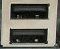{width="0.625in" height="0.5104166666666666in"}

  **Công dụng:** Dùng để cắm các thiết bị ngoại vi như máy in, máy quét, webcame ...; cổng USB đang thay thế vai trò của các cổng COM, LPT.

  **Nhận dạng:** cổng USB dẹp và thường có ít nhất 2 cổng nằm gần nhau và có ký hiệu mỏ neo đi kèm.

  **Lưu ý!:** Đối vói một số thùng máy (case) có cổng USB phía trước, muốn dùng được cổng USB này bạn phải nối dây nối từ Case vào chân cắm dành cho nó có ký hiệu USB trên mainboard.
  -------------------------------------------------------------------------------------------------------------------------------------------------------------------------------------- -----------------------------------------------------------------------------------------------------------------------------------------------------

**3.2.3 COM Port**

  ----------------------------------------------------------------------------------------------------------------------- ----------------------------------------------------------------------------------------------------------------------------------------
  Cổng tuần tự - COM viết tắt từ **Communications**.                                                                      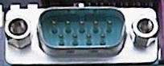{width="1.0in" height="0.4375in"}

  **Công dụng:** Cắm các loại thiết bị ngoại vi như máy in, máy quyét,... Nhưng hiện nay rất ít thiết bị dùng cổng COM.

  **Nhận dạng:** là cổng có chân cắm nhô ra, thường có 2 cổng COM trên mỗi mainboard và có ký hiệu COM1, COM2
  ----------------------------------------------------------------------------------------------------------------------- ----------------------------------------------------------------------------------------------------------------------------------------

**3.2.4 LPT Port**

  ----------------------------------------------------------------------------------------------------------------------------------------------- ------------------------------------------------------------------------------------------------------------------------------------------------------------------
  Cổng song song, cổng cái, cổng máy in - LPT viết tắt từ **Line Printer Terminal**                                                               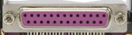{width="1.7083333333333333in" height="0.4583333333333333in"}

  **Công dụng:** thường dành riêng cho cắm máy in. Tuy nhiên đối với những máy in thế hệ mới hầu hết cắm vào cổng USB thay vì cổng COM hay LPT.

  **Nhận dạng:** Là cổng dài nhất trên mainboard.
  ----------------------------------------------------------------------------------------------------------------------------------------------- ------------------------------------------------------------------------------------------------------------------------------------------------------------------

*Trên đây là 4 loại cổng mặc định phải có trên mọi mainboard. Còn các
loại cổng khác là những loại card được tích hợp trên main, số lượng là
tùy vào loại main, tùy nhà sản xuất.*

**4. VGA Card**

+--+
|  |
+--+
|  |
+--+
|  |
+--+
|  |
+--+
|  |
+--+

**5. HDD**

  ---------------------------------------------------------------------------------------------------------------------------------------------------------------------- ------------------------------------------------------------------------------------------------------------------------------------------------------------------
  Ổ đĩa cứng **HDD** viết tắt từ **Hard Disk Drive**                                                                                                                     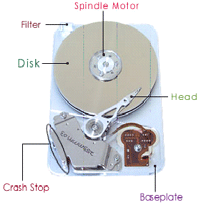{width="2.0833333333333335in" height="2.125in"}
                                                                                                                                                                         
  **Cấu tạo:** gồm nhiều đĩa tròn xếp chồng lên nhau với một motor quay ở giữa và một đầu đọc quay quanh các lá đĩa để đọc và ghi dữ liệu (xem hình bên).                
                                                                                                                                                                         
  **Công dụng:** ổ đĩa cứng là bộ nhớ ngoài quan trọng nhất của máy tính. Nó có nhiệm vụ lưu trữ hệ điều hành, các phần mềm ứng dụng và các dữ liệu của người sử dụng.   

  **Đặc trưng:** Dung lượng nhớ tính bằng **MB**, và tốc độ quay tính bằng số vòng trên một phút - rounds per minute (**rpm**)                                           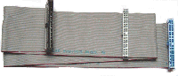{width="2.0833333333333335in" height="0.8958333333333334in"}
                                                                                                                                                                         
  **Mách bạn:**  HDD hiện nay trên thị trường có 2 tốc độ 5400rpm, 7200 rpm                                                                                              

  **Sử dụng:** HDD nối vào cổng IDE1 trên mainboard bằng cáp (hình trên), và một dây nguồn 4 chân từ bộ nguồn vào phía sau ổ.

  **Lưu ý: **

  -   Dây cáp dữ liệu của HDD cũng có thể dùng cắm cho các ổ CD, DVD.

  -   Trên một IDE bạn có thể gắn được nhiều ổ cứng, ổ CD tùy vào số đầu của dây cáp dữ liệu.

  -   Dây cáp dữ liệu của ổ cứng khác cáp dữ liệu của ổ mềm.

  ---------------------------------------------------------------------------------------------------------------------------------------------------------------------- ------------------------------------------------------------------------------------------------------------------------------------------------------------------

**6. RAM**

Bộ nhớ truy xuất ngẫu nhiên - RAM viết tắt từ **Random Access Memory**.

**Công dụng:** Lưu trữ những chỉ lệnh của CPU, những ứng dụng đang hoạt
động, những dữ liệu mà CPU cần ...

**Đặc trưng:**

-   Dung lượng tính bằng MB.

-   Tốc độ truyền dữ liệu (Bus) tính bằng Mhz.

**Phân loại:**

-   Giao diện SIMM - Single Inline Memory Module.

-   Giao diện DIMM - Double Inline Memory Module.

**6.1 Giao diện SIMM**

Giao diện SIMM là những loại RAM dùng cho những mainboard và CPU đời cũ.
Hiện nay loại Ram giao diện SIMM này không còn sử dụng.

**6.2 Giao diện DIMM**

Là loại RAM hiện nay đang sử dụng với các loại RAM sau:

**6.2.1 SDRAM**

  ----------------------------------------------------------------------------------------------------------------------------- ------------------------------------------------------------------------------------------------------------------------------------------------------------------
  **Nhận dạng:** SDRAM có 168 chân, 2 khe cắt ở phần chân cắm.                                                                  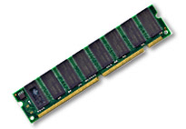{width="2.1354166666666665in" height="1.4791666666666667in"}
                                                                                                                                
  **Tốc độ (Bus):** 100Mhz, 133Mhz.                                                                                             
                                                                                                                                
  **Dung lượng:** 32MB, 64MB, 128MB.                                                                                            

  **Lưu ý!:**  SDRAM sử dụng tương thích với các mainboard socket 370 (Mainboard  socket 370 sử dụng CPU PII, Celeron, PIII).
  ----------------------------------------------------------------------------------------------------------------------------- ------------------------------------------------------------------------------------------------------------------------------------------------------------------

**6.2.2 DDRAM**

  ----------------------------------------------------------------------------------------------------------------------------------- -------------------------------------------------------------------------------------------------------------------------------------------------------
  **Nhận dạng:** SDRAM có 184 chân, chỉ có 1 khe cắt ở giữa phần chân cắm.                                                            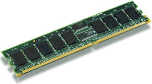{width="3.1041666666666665in" height="1.71875in"}
                                                                                                                                      
  **Tốc độ (Bus):** 266 Mhz, 333Mhz, 400Mhz                                                                                           
                                                                                                                                      
  **Dung lượng:** 128MB, 256MB, 512MB.                                                                                                

  **Lưu ý!:** DDRAM sử dụng tương thích với các mainboard socket 478, 775 ( sử dụng cùng với các loại CPU Celeron Socket 478, P IV)
  ----------------------------------------------------------------------------------------------------------------------------------- -------------------------------------------------------------------------------------------------------------------------------------------------------

**6.2.3 DDRAM2**

  ----------------------------------------------------------------------------------------------------------------------------------------------------- -----------------------------------------------------------------------------------------------------------------------------------------------------
  Viết tắt là DDR2 - là thế hệ tiếp theo của DDRAM                                                                                                      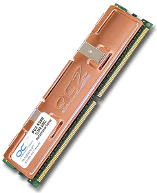{width="2.375in" height="2.9166666666666665in"}
                                                                                                                                                        
  **Nhận dạng:** Tốc độ gấp đôi DDRAM, cũng có 1 khe cắt giống DDRAM nhưng DDR2 cắt ở vị trí khác nên không dùng chung được khe DDRAM trên mainboard.   
                                                                                                                                                        
  **Tốc độ (Bus):** 400 Mhz                                                                                                                             
                                                                                                                                                        
  **Dung lượng:** 256MB, 512MB                                                                                                                          
  ----------------------------------------------------------------------------------------------------------------------------------------------------- -----------------------------------------------------------------------------------------------------------------------------------------------------

**6.2.4 RDRAM**

  ------------------------------------------------------------------------------------------------------------------------------------ -------------------------------------------------------------------------------------------------------------------------------------------------------
  **Nhận dạng:** Có 184 chân, có 2 khe cắt gần nhau ở phần chân cắm. Bên ngoài RDRAM có bọc tôn giải nhiệt vì nó hoạt động rất mạnh.   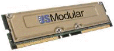{width="2.03125in" height="0.9166666666666666in"}
                                                                                                                                       
  **Tốc độ (Bus):** 800Mhz.                                                                                                            

  **Dung lượng:** 512MB

  **Lưu ý!:** RDRAM sử dụng tương thích với mainboard socket 478, 775 (các main sừ dụng PIV, Pentium D)
  ------------------------------------------------------------------------------------------------------------------------------------ -------------------------------------------------------------------------------------------------------------------------------------------------------

**7. CPU**

  ---------------------------------------------------------------------------------- -----------------------------------------------------------------------------------------------------------------------------------------------------
  Bộ vi xử lý, đơn vị xử lý trung tâm - CPU viết tắt từ **Center Processor Unit.**   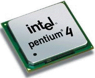{width="0.9791666666666666in" height="0.875in"}
                                                                                     
  **Đặc trưng: **                                                                    

  -   Tốc độ đồng hồ (tốc độ xử lý) tính bằng MHz, GHz                                
                                                                                     
  -   Tốc độ truyền dữ liệu với mainboard Bus: Mhz                                   
                                                                                     
  -   Bộ đệm - L2 Cache.                                                             
                                                                                     
                                                                                     
  ---------------------------------------------------------------------------------- -----------------------------------------------------------------------------------------------------------------------------------------------------

**Nhà sản xuất:** Hiện nay trên thế giớ có 2 hãng sản xuất CPU lớn nhất
là AMD và Intel. Riêng ở thị trường VN chủ yếu sử dụng CPU Intel.

**Phân loại:** Dạng khe cắm Slot, dạng chân cắm Socket.

{width="0.17708333333333334in"
height="0.16666666666666666in"}**Dạng khe cắm (Slot)**

  -------------------------------------------------------------------------------------- -------------------------------------------------------------------------------------------------------------------------------------------
  -   **Slot1:** dùng cho những CPU PII, PIII có 242 chân dạng khe cắm của hãng Intel.   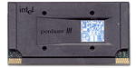{width="1.5625in" height="0.78125in"}
                                                                                         
  -   **Slot A Athlon:** dùng cho những CPU 242 chân dạng khe cắm của hãng AMD.          
                                                                                         
                                                                                         
  -------------------------------------------------------------------------------------- -------------------------------------------------------------------------------------------------------------------------------------------

{width="0.17708333333333334in"
height="0.16666666666666666in"}**Dạng chân cắm (Socket)**

-   **Socket 370:** Pentium II, Celeron, Pentitum III

-   **Socket 478:** Celeron, Pentium IV

-   **Socket 775:** Pentium D.

-   ...

**Lưu ý!:** Socket đi kèm với 1 số là số chân của CPU, và phải xác định
mainboard có
[**socket**](file:///I:\New%20folder\temp\htm\Bai2.htm#Socket) bao nhiêu
để dùng đúng loại CPU tương ứng.

  ------------------------------------------------------------------------------------------------------------------------------------------------------------------ ------------------------------------------------------------------------------------------------------------------------------------------------------- ------------------------------------------------------------------------------------------------------------------------------------------------------
  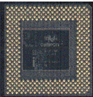{width="1.4895833333333333in" height="1.5729166666666667in"}   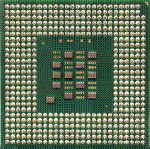{width="1.59375in" height="1.5729166666666667in"}   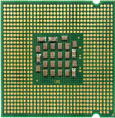{width="1.5625in" height="1.5729166666666667in"}
  **Socket 370**                                                                                                                                                     **Socket 478**                                                                                                                                          **Socket 775**
  ------------------------------------------------------------------------------------------------------------------------------------------------------------------ ------------------------------------------------------------------------------------------------------------------------------------------------------- ------------------------------------------------------------------------------------------------------------------------------------------------------

{width="0.17708333333333334in"
height="0.16666666666666666in"}**Tóm tắt: **

Thiết bị nội vi là những thiết bị không thể thiếu trong cấu hình của một
máy tính.

Phải đảm bảo sự tương thích của các thiết bị khi lắp ráp.

**II. Thiết bị ngoại vi:**

**1. Monitor - màn hình**

  ---------------------------------------------------------------------------------------------------------- ------------------------------------------------------------------------------------------------------------------------------------------------------------------
  **Công dụng:** Là thiết bị hiển thị thông tin cùa máy tính giúp người sử dụng giao tiếp với máy.           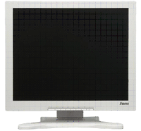{width="1.3020833333333333in" height="1.1979166666666667in"}
                                                                                                             
  **Đặc trưng:** độ rộng tính bằng Inch.                                                                     

  **Phân loại:** Màn hình ống phóng điện tử CRT (lồi, phẳng), màn hình tinh thể lỏng LCD, màn hình Plasma.
  ---------------------------------------------------------------------------------------------------------- ------------------------------------------------------------------------------------------------------------------------------------------------------------------

**2. Keyboard - Bàn phím**

  --------------------------------------------------------------------------------------------------------------------------------------------------------------------------------------------- ------------------------------------------------------------------------------------------------------------------------------------------------------------------
  **Công dụng:** Bàn phím là thiết bị nhập. Ngoài những chức năng cơ bản, bạn có thể tìm thấy những loại bàn phím có nhiều chức năng mở rộng để nghe nhạc, truy cập internet, hoặc chơi game.   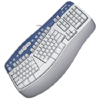{width="1.4166666666666667in" height="1.4270833333333333in"}
                                                                                                                                                                                                
  **Phân loại:**                                                                                                                                                                                
                                                                                                                                                                                                
  -   Bàn phím cắm cổng PS/2.                                                                                                                                                                   
                                                                                                                                                                                                
  -   Bàn phím cắm cổng USB                                                                                                                                                                     
                                                                                                                                                                                                
  -   Bàn phím không dây.                                                                                                                                                                       
                                                                                                                                                                                                
                                                                                                                                                                                                
  --------------------------------------------------------------------------------------------------------------------------------------------------------------------------------------------- ------------------------------------------------------------------------------------------------------------------------------------------------------------------

**3. Mouse - chuột.**

  ----------------------------------------------------------------------------------------------- ------------------------------------------------------------------------------------------------------------------------------------------------------------------
  **Công dụng:** Chuột cũng là một thiết bị nhập, đặc biệt hữu ích đối với các ứng dụng đồ họa.   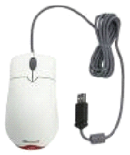{width="1.0833333333333333in" height="1.2916666666666667in"}
                                                                                                  
  **Phân loại:**                                                                                  
                                                                                                  
  - Chuột cơ: dùng bi lăn để xác định vị trí.                                                     
                                                                                                  
  - Chuột quang: dùng phản ứng ánh sáng (không có bi lăn)                                         

  **Sử dụng:** Tùy loại chuột có thể cắm cổng PS/2, cổng USB, hoặc không dây.
  ----------------------------------------------------------------------------------------------- ------------------------------------------------------------------------------------------------------------------------------------------------------------------

**4. FDD**

  ------------------------------------------------------------------------------------------------------------------------- -------------------------------------------------------------------------------------------------------------------------------------------------------
  Ổ đĩa mềm - FDD viết tắt từ **Floopy Disk Drive**                                                                         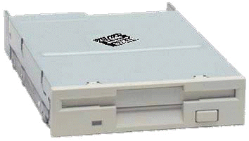{width="1.375in" height="0.8020833333333334in"}
                                                                                                                            
  **Sử dụng:** Ổ mềm lắp từ bên trong thùng máy. Đầu cáp bị đánh tréo gắn vào ổ, đầu thắng gắn vào đầu cắm FDD trên main.   

  **Lưu ý!:** Cáp ổ mềm nhỏ hơn cáp ổ cứng, cáp ổ mềm bị đánh tréo một đầu, đầu này để gắn vào ổ mềm.                       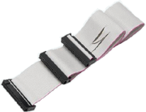{width="0.96875in" height="0.7604166666666666in"}
  ------------------------------------------------------------------------------------------------------------------------- -------------------------------------------------------------------------------------------------------------------------------------------------------

**5. CD, CD-RW, DVD, Combo-DVD**

  ------------------------------------------------------------------------------------------------------------------------------------------------------ ------------------------------------------------------------------------------------------------------------------------------------------------------------------
  **Công dụng:** Là những loại ổ đọc ghi dữ liệu từ ổ CD, VCD, DVD. Vì dùng tia lazer để đọc và ghi dữ liệu nên các loại ổ này còn gọi là ổ quang học.   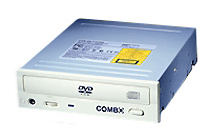{width="2.1041666666666665in" height="1.4583333333333333in"}
                                                                                                                                                         
  **Đặc trưng:** Tốc độ đọc ghi dữ liệu (24X, 32X, 48X, 52X)                                                                                             
                                                                                                                                                         
  **Phân loại:**                                                                                                                                         
  ------------------------------------------------------------------------------------------------------------------------------------------------------ ------------------------------------------------------------------------------------------------------------------------------------------------------------------

-   CD-ROM: chỉ đọc đĩa CD, VCD.

-   CD-RW: đọc và ghi đĩa CD, VCD.

-   DVD-ROM: chỉ đọc tất cả các loại đĩa CD, VCD, DVD.

-   Combo-DVD: đọc được tất cả các loại đĩa, ghi đĩa CD, VCD.

**6. NIC**

+--+
|  |
+--+
|  |
+--+

**7. Sound Card**

  ----------------------------------------------------------------------------------- -------------------------------------------------------------------------------------------------------------------------------------------------------
  **Công dụng:** Card âm thanh là thiết bị xuất và nhập dữ liệu audio của máy tính.   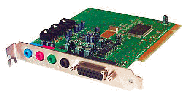{width="1.9791666666666667in" height="1.15625in"}
                                                                                      
  **Đặc trưng:** Khả năng xử lý Mhz.                                                  
                                                                                      
  **Nhận dạng:** là thiết bị có ít nhất 3 chân cắm tròn nằm liên tiếp nhau.           
  ----------------------------------------------------------------------------------- -------------------------------------------------------------------------------------------------------------------------------------------------------

**Phân loại:**

-   Card tích hợp trên mạch - Sound onboard.

-   Card rời - gắn khe PCI

**Sử dụng:** Dựa vào các ký hiệu bằng chữ hoặc bằng màu trên sound card
chúng ta cắm các thiết bị như sau:

-   Line Out (xanh nhạt): để cắm dây audio của loa hoặc tai nghe.

-   Line In (xanh đậm): cắm dây dữ liệu audio vào từ các thiết bị cần
    > đưa âm thanh vào máy như đàn điện tử ...

-   Mic (màu đỏ): để cắm dây của micro.

-   Game (cổng lớn nhất): để cắm cần chơi game Joystick.

**8. Modem**

  ----------------------------------------------------------------------------------------------------------------------------------------------- ------------------------------------------------------------------------------------------------------------------------------------------------------
  **Công dụng:** Chuyển đổi qua lại giữa tín hiệu điện thoại và tín hiệu máy tính giúp máy tính nối với mạng Internet thông qua dây điện thoại.   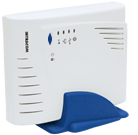{width="1.4375in" height="1.40625in"}
                                                                                                                                                  
  **Đặc trưng:** Tốc độ truyền dữ liệu Kbps, Mbps...                                                                                              

  **Nhận dạng:** Có đầu cắm dây điện thoại.                                                                                                       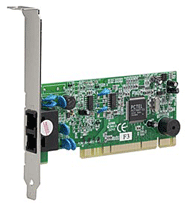{width="1.6770833333333333in" height="1.8125in"}
                                                                                                                                                  
  **Phân loại:**                                                                                                                                  
                                                                                                                                                  
  -   Onboard: thường có trên máy xách tay.                                                                                                       
                                                                                                                                                  
  -   External: gắn ngoài như hình 1.                                                                                                             
                                                                                                                                                  
  -   Internet: gắn trong, cắm vào khe PCI trên main như hình 2.                                                                                  
                                                                                                                                                  
                                                                                                                                                  
  ----------------------------------------------------------------------------------------------------------------------------------------------- ------------------------------------------------------------------------------------------------------------------------------------------------------

**Lưu ý:** Đối với modem gắn trong bạn dễ nhầm với card mạng, card mạng
có đầu cắm to hơn để cắm dây cáp mạng và có đèn tín hiệu đi kèm.

**9. USB Hard Disk**

  ---------------------------------------------------------------------------------------------------------------------------- ------------------------------------------------------------------------------------------------------------------------------------------------------------------
  **Công dụng:** Ổ cứng USB dùng để lưu trữ dữ liệu với dung lượng lớn . Ổ cứng USB còn dùng để nghe nhạc MP3, xem phim MP4.   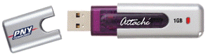{width="1.59375in" height="0.4583333333333333in"}
  **Đặc trưng:** Dung lượng nhớ MB, GB và luôn cắm vào cổng USB trên mainboard.                                                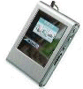{width="0.9791666666666666in" height="1.0520833333333333in"}
  ---------------------------------------------------------------------------------------------------------------------------- ------------------------------------------------------------------------------------------------------------------------------------------------------------------

**Sử dụng:** Để đảm bảo an toàn dữ liệu và kéo dài tuổi thọ của đĩa cứng
USB bạn phải thực hiện thao tác rút đĩa  an toàn ra khỏi hệ thống: Khi
không dùng đĩa nữa thì kích chuột phải trên biểu tượng đặc trưng của đĩa
dưới khay hệ thống, chọn **Safe to remove** (đối với Windows XP trở lên)
hoặc **Unplug or Eject hardware** (đối với Windows 200 trở xuống). Chọn
tên ổ đĩa trong danh sách. Nhấn nút Stop.

**10. USB TV**

  ----------------------------------------------------------------------------------------------------------------- -----------------------------------------------------------------------------------------------------------------------------------------------------------------
  **Công dụng:** Thiết bị thu sóng truyền hình vào máy tính.                                                        {width="2.0833333333333335in" height="1.4583333333333333in"}
                                                                                                                    
  **Sử dụng:** Cắm USB TV vào cổng USB trên mainboard và cài các phần mềm đi kèm theo hướng dẫn của nhà sản xuất    
                                                                                                                    
  **Lưu ý!:** Khi sử dụng USB TV máy bạn cần phải có card màn hình dung lượng lớn để đảm bảo chất lượng hình ảnh.   
  ----------------------------------------------------------------------------------------------------------------- -----------------------------------------------------------------------------------------------------------------------------------------------------------------

**11. Printer**

  ---------------------------------------------------------------------------------------------------------------------------------------- ----------------------------------------------------------------------------------------------------------------------------------------------------
  **Công dụng:** Dùng để in ấn tài liệu từ máy tính.                                                                                       {width="1.25in" height="0.9479166666666666in"}
                                                                                                                                           
  **Đặc trưng:** Độ phân giải dpi ([**\***](file:///I:\New%20folder\temp\htm\Bai2.htm#*)), tốc độ in (số trang trên 1 phút), bộ nhớ (MB)   
  ---------------------------------------------------------------------------------------------------------------------------------------- ----------------------------------------------------------------------------------------------------------------------------------------------------

**Phân loại:** In kim, In phun, Lazer

**12. Scanner**

  ------------------------------------------------------------------------------------------------------------------------------------------------------------------------------------------------------------------------------------------------------------------------------------------------------------------------- ------------------------------------------------------------------------------------------------------------------------------------------------------------------
  **Công dụng:** Máy quét để nhập dữ liệu hình ảnh, chữ viết, mã vạch, mã từ vào máy tính.                                                                                                                                                                                                                                  {width="1.6041666666666667in" height="1.0833333333333333in"}
                                                                                                                                                                                                                                                                                                                            
  **Đặc trưng:** độ phân giải - dpi ([**\***](file:///I:\New%20folder\temp\htm\Bai2.htm#*))                                                                                                                                                                                                                                 
                                                                                                                                                                                                                                                                                                                            
  **Phân loại:**                                                                                                                                                                                                                                                                                                            
                                                                                                                                                                                                                                                                                                                            
  -   *Máy quyét ảnh:* dùng để quyét hình ảnh, film của ảnh chụp, chữ viết... (h1)                                                                                                                                                                                                                                          
                                                                                                                                                                                                                                                                                                                            
  -   *Máy quyét mã vạch:* dùng quyét mã vạch dùng trong siêu thị để đọc giá tiền của hàng hóa, trong thư viên để đọc mã số SV từ thẻ SV... (h2)                                                                                                                                                                            
                                                                                                                                                                                                                                                                                                                            
  -   *Máy quyét  từ:* đọc thẻ từ, ứng dụng trong hệ thống cửa thông minh, hệ thống chấm công nhân viên...(h3)                                                                                                                                                                                                              
                                                                                                                                                                                                                                                                                                                            
  **(****\*)** dpi viết tắt từ **dots per inch** - số điểm ảnh trên mỗi inch vuông. Số lượng điểm ảnh càng nhiều thì độ phân giải càng lớn và hình ảnh càng rõ nét, chât lượng. dpi là giá trị để xác định độ phân giải của các thiết bị xử lý hình ảnh như màn hình, máy in, máy quyét, máy ảnh kỹ thuật số, webcame ...   

                                                                                                                                                                                                                                                                                                                            {width="1.3125in" height="1.2708333333333333in"}

                                                                                                                                                                                                                                                                                                                            {width="1.5416666666666667in" height="1.2708333333333333in"}
  ------------------------------------------------------------------------------------------------------------------------------------------------------------------------------------------------------------------------------------------------------------------------------------------------------------------------- ------------------------------------------------------------------------------------------------------------------------------------------------------------------

**13. Projector**

  ------------------------------------------------------------------------------------------------------------------------- ------------------------------------------------------------------------------------------------------------------------------------------------------------------
  **Công dụng:** đèn chiếu thiết bị hiển thị hình ảnh với màn hình rộng thay thế màn hình để phục vụ hội thảo, học tập...   {width="2.0833333333333335in" height="1.6458333333333333in"}
                                                                                                                            
  **Đặc trưng:** độ phân giải.                                                                                              
                                                                                                                            
  **Sử dụng:** cắm dây dữ liệu vào cổng VGA thay thế dây dữ liệu của màn hình.                                              
  ------------------------------------------------------------------------------------------------------------------------- ------------------------------------------------------------------------------------------------------------------------------------------------------------------

**14. Memory card**

  ----------------------------------------------------------------------------------------------------------------------------------------------------------------------- ------------------------------------------------------------------------------------------------------------------------------------------------------
  **Công dụng:** thẻ nhớ là thiết bị lưu trữ di động, là bộ nhớ có khả năng tương thích với nhiều thiết bị khác nhau như máy ảnh kỹ thuật số, máy điện thoại di động...   {width="2.0833333333333335in" height="1.5625in"}
                                                                                                                                                                          
  **Đặc trưng:** Dung lượng MB, GB.                                                                                                                                       
                                                                                                                                                                          
  **Sử dụng:** đối với máy tính không có khe cắm thẻ nhớ nên bạn phải sử dụng một đầu đọc thẻ nhớ gắn vào cổng USB như hình bên.                                          
  ----------------------------------------------------------------------------------------------------------------------------------------------------------------------- ------------------------------------------------------------------------------------------------------------------------------------------------------

**15. Speaker.**

  ---------------------------------------------------------------------------------------------------- ------------------------------------------------------------------------------------------------------------------------------------------------------------------
  **Công dụng:** loa để phát âm.                                                                       {width="2.0833333333333335in" height="1.4270833333333333in"}
                                                                                                       
  **Đặc trưng:** công suất W                                                                           
                                                                                                       
  **Sử dụng:** cắm dây audio của loa với đầu có ký hiệu Line Out (màu xanh nhạt) trên card âm thanh.   
  ---------------------------------------------------------------------------------------------------- ------------------------------------------------------------------------------------------------------------------------------------------------------------------

**16. Microheadphone.**

  ----------------------------------------------------------------------------------------------------------------------------------------------------------------------------------------------- ------------------------------------------------------------------------------------------------------------------------------------------------------------------
  **Công dụng:** Microheadphone có 2 chức năng xuất và nhập dữ liệu audio.                                                                                                                        {width="2.0833333333333335in" height="1.6354166666666667in"}
                                                                                                                                                                                                  
  **Sử dụng:** Mỗi Microheadphone có 2 đầu dây, cắm dây có ký hiệu tai nghe vào chân cắm Line Out (màu xanh nhạt), dây có ký hiệu Micro vào chân cắm Mic (màu đỏ, hoặc hồng trên card âm thanh.   
  ----------------------------------------------------------------------------------------------------------------------------------------------------------------------------------------------- ------------------------------------------------------------------------------------------------------------------------------------------------------------------

**17. Joystick**

  ------------------------------------------------------------------------------------------------------- ----------------------------------------------------------------------------------------------------------------------------------------------------
  **Công dụng:** Dùng để chơi game trên máy tính với nhiều chức năng đặc biệt thay thế chuột, bàn phím.   {width="0.6354166666666666in" height="0.75in"}
                                                                                                          
  **Sử dụng:** Cắm dây cáp của Joystick                                                                   
  ------------------------------------------------------------------------------------------------------- ----------------------------------------------------------------------------------------------------------------------------------------------------

**18. Webcame**

  ----------------------------------------------------------------------------------------------------------------------------------------- -----------------------------------------------------------------------------------------------------------------------------------------
  **Công dụng:** thiết bị thu hình vào máy tính, Webcame sử dụng trong việc giải trí, bảo vệ an ninh, hội thảo từ xa, khám bệnh từ xa ...   {width="1.375in" height="1.5625in"}
                                                                                                                                            
  **Đặc trưng:** độ phân giải dpi                                                                                                           
                                                                                                                                            
  **Sử dụng:** nối dây dữ liệu vào cổng USB phía sau mainboard. Cài các phần mềm hỗ trợ đi kèm.                                             
  ----------------------------------------------------------------------------------------------------------------------------------------- -----------------------------------------------------------------------------------------------------------------------------------------

**19. UPS**

  ----------------------------------------------------------------------------------------------------------------------------------------------------------------------------------------------- ----------------------------------------------------------------------------------------------------------------------------------------------------
  Bộ lưu điện - UPS viết tắt từ Uninterruptible Power Supply                                                                                                                                      {width="0.75in" height="0.7708333333333334in"}
                                                                                                                                                                                                  
  **Công dụng:** Ổn áp dòng điện và cung cấp điện cho máy trong một khoảng thời gian ngắn (5 - 10 phút) trong trường hợp có sự cố mất điện để giúp người sử dụng lưu tài liệu, tắt máy an toàn.   
  ----------------------------------------------------------------------------------------------------------------------------------------------------------------------------------------------- ----------------------------------------------------------------------------------------------------------------------------------------------------

**Đặc trưng:** Công suất KW

**Sử dụng:** Cắm dây nguồn của UPS vào nguồn điện, cắm nguồn của case,
màn hình, máy in vào UPS.

**20. USB Bluetooth.**

+--+
|  |
+--+

