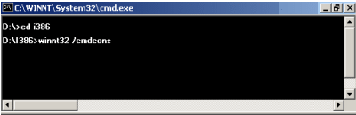
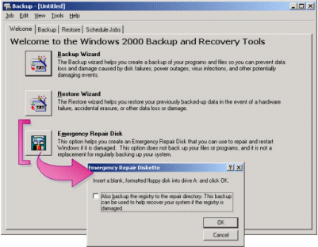
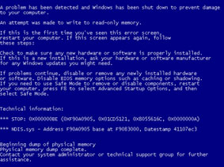

## Sự Cố Phần Mềm Máy Tính

### Hệ Điều Hành

#### Khôi phục máy tính dùng Advanced Startup Option

Các Hệ Điều Hành mới hiện nay như Windows 2000, Windows XP,…cho
phép chúng sử dụng chức năng trong *Advanced Startup Option* để
giải quyết một số vấn đề sau như:

- Hệ Điều hành bị lỗi
- Xung đột phần cứng
- Xung đột phần mềm
- Xung đột drivers

**Lưu ý:** Để hiển thị *Advanced Startup Option*, bạn nhấn *F8* trong khi Windows bắt đầu hoạt động

Bảng mô tả sử dụng trong Advanced startup Option:

Lựa Chọn | Mô tả
--|--
Safe Mode | Chỉ nạp những thiết bi và các drivers mà máy tính yêu cầu để hoạt động được như: Mouse, Keyboard, các thiết bị lưu trữ, hiển thị cơ bản và các dịch vụ mà hệ thống yêu cầu.  
Safe Mode with Networking | Chỉ nạp những thiết bi và các drivers mà máy tính yêu cầu để hoạt động được và cho phép sử dụng mạng
Safe Mode with Command Prompt | Cũng giống như Safe Mode nhưng hiển thị giao diện DOS thay vì hiển thị giao diện đồ họa.
Enable Boot Logging | Tạo ra một Log file để tham khảo của tất cả các drivers và thiết bị mà hệ thống nạp (hay không nạp). Log file này có tên là Ntbtlog.txt và nằm ở thư mục gốc của ổ đĩa chứa Hệ Điều hành.  
Enable VGA Mode | Nạp driver card màn hình ở chế độ cơ bản. Giúp ích khi yêu cầu hiển thị của độ phân giải màn hình (Resolution) hay chế độ làm tươi màn hình (Screen refresh rate) vượt quá giới hạn cho phép của màn hình.
Last Known Good Configuration | Sử dụng lấy lại thông tin cấu hình tốt nhất của máy tính ở lần khởi động trước.  
Directory Services Restore Mode | Cho phép bảo dưỡng và phục hồi Active Directory và Sysvol Folder trên Domain Controllers.  
Debugging Mode | Chạy từng lệnh theo sự cho phép của bạn. Gởi thông tin gỡ rối đến máy khác thông qua Cable.

*Chú ý*: *Một máy Doma### Controller có thể dùng chế độ Safe Mode
và Safe Mode with Command Prompt, nhưng dịch vụ Active Directory sẽ
không có g### trị*.

#### Khôi phục máy dùng Recovery Console

Bạn có thể dùng Recovery Console để:

- Stop/Start các dịch vụ trong hệ thống

- Đọc/ghi dữ liệu vào đĩa cứng (kể cả ổ đĩa được format NTFS)

- Format ổ đĩa cứng

- Hiển thị các tập t### ẩn của hệ thống

Để cài đặt bằng Recovery Console, bạn thực hiện như sau:

Bước 1: khởi động giao diện DOS trong Windows

Bước 2: Chuyển đến thư mục I386 trong đĩa CD Windows 2000

Bước 3: Gõ *Winnt32.exe/cmdcons*

Bước 4: Sau khi cài đặt Recovery Console, bạn có thể truy cập từ Menu khởi động.

*Lưu Ý:* Khi Logon vào máy tính bạn phải dùng đăng nhập bằng
User Aministrator

Các lệnh trong Recovery Console

Lệnh | Mô tả
-----|-------
Chdir (cd) | Hiển thị tên của thư mục hiện hành (Thay đổi thư mục hiện hành )
Chkdsk | Kiểm tra đĩa cứng và hiển thị kết quả 
Cls  Xóa sạch màn hình  
Copy | Chép tập t### (files) đến vị trí khác
Delete (del) | Xóa một hoặc nhiều tập t###  
Dir  Hiển thi danh sách thư mục và thư mục con  
Disable  Ngưng chạy một dịch vụ hay một driver  
Enable | Chạy một dịch vụ hay một driver  
Exit | Thoát khỏi Recovery Console và khởi động lại máy tính 
Fdisk  Phân ch### đĩa cứng  
Fixboot  Ghi Boot record mới lên The System Partition  
Fixmbr | Sửa chữa Master boot record.  The same fdisk /mbr
Format | Định dạng ổ đĩa  
Help | Hiển thị danh sách lệnh dùng trong The Recovery Console
Logon  Đăng nhập vào hệ thống.  
Map  Hiển thị tên ổ đĩa được ánh xạ  
Mkdir (Md) | Tạo thư mục mới 
More | Hiển thị nội dung tập t### văn bản
Rmdir (rd) | Xoá một thư mục  
Rename (ren) Đổi tên tập t###  
Type | Hiển thị nội dung tập t### văn bản  

#### Khôi phục máy tính dùng Emergency Repair Process

- Tạo đĩa Emergency Repair

Bước 1: Mở công cụ Backup để tạo

- Click *Start Programs Accessories System tools Backup *

- Trong Tab Welcome, chọn *Emergency Repa### Disk*

- Cho đĩa mềm vào ổ vào chọn *OK*

*Chú ý:* *Không dùng đĩa Emergency Repa### để khởi động máy tính,
mà chỉ dùng sửa chữa hư hỏng của hệ thống*

- Sử dụng đĩa Emergency Repair

*Bước 1:* Khởi động máy tính bị hư/lỗi bằng đĩa Windows 2000
Setup hay CD-Rom
*Bước 2:* Chọn cách sửa chữa trong khi cài đặt

Sau khi máy tính khởi động, bắt đầu chương trình cài đặt. Trong
khi cài đặt, Bạn nhấn để chọn sửa chữa hệ thống dùng *Emergency
Repa### Process. *

*Bước 3*: Chọn kiểu sửa chữa

- The fast repair option does not require any user interaction/Sửa
nhanh không ảnh hưởng đền người sử dụng.

- Th### option attempts to repair problems related to the registry,
system files, the partition boot sector on your boot volume, and
your startup environment (### you have a dual-boot or
multiple-boot configuration). / Sửa các vấn đền liên quan tới
Registry, System Files, Boot Sector và môi trường khởi động.

- The manual repa### option requires user input.Th### option allows you
to choose whether to repa### system files, partition boot sector
problems, or startup environment problems, but not problems with
your registry / làm bằng tay thì yêu cầu bạn nhập vào là chọn sửa
các vấn đề của System Files, Boot Sector hay Các vấn đề về môi
trường khởi động.

*Bước 4*: Bắt đầu khôi phục

- Cho đĩa Emergency Repa### vào ổ mềm,
- Có đĩa Windows của máy tính đang sử dụng

*Bước 5*: kết thúc

Tiến trình sửa chữa hoàn thành, máy tính sẽ tự động khởi động lại và
hệ thống bắt đầu làm việc.

### Chương Trình Ứng Dụng – Virus:

 Như các bạn đã biết, hiện nay có rất nhiều loại virus máy tính xuất
hiện và các hình thức phá hoại của chúng cũng rất đa dạng và ngày càng
nguy hiểm. Vì thế, việc nghi ngờ và đề phòng virus tấn công máy tính của
chúng ta, đã dường như đã trở thành một phản xạ tự nhiên mỗi khi gặp một
vấn đề lạ khi sử dụng máy tính.

 Tuy nhiên không phải tất cả những sự cố xảy ra trên máy tính của bạn
đều do virus gây ra và để xử lý chúng ta sẽ phải mất rất nhiều thời gian
mà không đạt được kết quả gì nếu chúng ta cho rằng đó là do virus. Hay
nói cách khác, đôi khi chúng ta cũng đổ oan chi virus.

 Chúng ta có thể sẽ không phải mất nhiều thời gian như thế nữa nếu biết
được một số sự cố thường gặp mà nguyên nhân có thể không phải là do
virus.

Dưới đây là một số trường hợp thường gặp:

- *Máy tính của bạn bị treo khi bạn đang làm việc*

- *Cương trình soạn thảo Word của bạn xuất hiện những ký tự lạ*

- *Chương trình của bạn tự nhiên không chạy*

- *Máy tính của bạn không khởi động được và có thông báo lỗi*

- *Máy tính của bạn đưa ra thông báo có Virus boot khi bạn cài Windows
hay một chương trình hệ thống nào đó*

- *Bạn không thể cài được Windows vì cứ chạy cài đặt là máy bị treo*

Và điều tất nhiên là mọi người nghi ngay can phạm là virus! Sự thực
không phải thế, những thông t### sau sẽ giúp bạn một phần nào:

-  Máy tính của bạn bị treo khi bạn đang làm việc

Hiện tượng máy tính bị treo khi bạn đang làm việc hoặc khi khởi động
lại chỉ được 10 đến 15 phút nó lại treo.

Hiện tượng này thường là do Ch### máy tính (CPU) của bạn bị nóng,
nguyên nhân có thể quạt Ch### của bạn bị hỏng hoặc là chạy chậm, trong
trường hợp này bạn có thể kiểm tra nguồn cho quạt hoặc tra dầu cho
quạt, nếu trường hợp quạt bị hỏng bạn nên thay quạt cho Chip.

Ngoài ra cũng có thể do RAM hay Mainboard có vấn đề. Sau khi kiểm tra
hết các vấn đề đó bạn hãy đặt nghi vấn cho virus.

- Chương trình soạn thảo Word của bạn xuất hiện những ký tự lạ

Khách hàng có thường hỏi bạn về vấn đề này, và gần như tất cả đều do
một nguyên nhân là trên thanh công cụ của Microsoft Word có một phím
gọi là phím Show/Hide ( nó có biểu tượng là "¶") phím này có tác dụng
làm hiện hoặc ẩn các kí tự đặc biệt mà Word dùng để chỉ định các định
dạng của nó, các dấu hiệu paragraph hoặc các kí tự ẩn, những thứ này
thường chỉ phục vụ cho bản thân Microsoft Word biết về định dạng của
văn bản, còn người sử dụng thì không cần phải biết đến.

Tuy nhiên, đôi khi người sử dụng cũng có nhu cầu hiện những thông tin
này lên, và đó là nguyên nhân của một loạt các ký tự lạ xuất hiện khắp
màn hình. Nếu gặp phải hiện tượng này bạn chỉ cẩn tìm trên thanh công
cụ phím bấm có biểu tượng  "¶" và bấm chuột vào phím đó, các ký tự lạ
sẽ mất đi.

- Chương trình của bạn tự nhiên không chạy

Tự nhiên một ngày nào đó, khi bạn bật máy tính của mình lên và click
vào biểu tượng của chương trình mà bạn vẫn dùng hàng ngày và thật là
kỳ lạ, thay vào giao diện của chương trình quen thuộc là một thông báo
lỗi rất khó hiểu của Windows sau đó nó không chịu làm gì nữa.

Nếu bị rơi vào trường hợp này thì bạn hãy chịu khó đọc qua thông báo
lỗi xuất hiện. Các thông báo này thường là:

- Không tìm thấy file chương trình,

- Không tìm thấy file dữ liệu nào đó,

- Không tìm thấy file .dll

Đối với những thông báo như vậy, bạn chỉ cần ghi nhớ tên file mà thông
báo chỉ ra, sau đó bạn sử dụng công cụ Find/Search của Windows tìm
file đó trên máy tính của bạn, nếu thấy bạn hãy copy file đó vào thư
mục của chương trình, sau đó bạn cho chạy lại chương trình nếu không
được bạn hãy thử cài lại chương trình của bạn.

Đôi khi có một số chương trình có yêu cầu bản quyền mà phiên bản bạn
dùng lại là bản dùng thử, và khi bạn chạy chương trình vào thời điểm
hết thời gian dùng thử thì chương trình thường đưa ra thông báo lỗi.
Trong trường hợp này bạn phải liên hệ với nhà cung cấp để mua bản
chính thức. 

- Máy tính của bạn không khởi động được và có thông báo lỗi Máy tính của bạn bỗng nhiên khi khởi động lại đưa ra thông báo 
"Invalid system disk..." hoặc "System disk error..." "None system
disk" thì có lẽ trong ổ đĩa mềm của bạn đang chứa một đĩa mềm nào
đó không có file hệ thống, bạn hãy lấy đĩa mềm đó ra và khởi động
lại máy, mọi việc sẽ ổn.

- Máy tính của bạn đưa ra thông báo có Virus boot khi bạn cài
Windows hay một chương trình hệ thống nào đó

Trên một số MainBoard, nhà sản xuất thường tạo thêm một chức năng
trong CMOS đó là "tự động bảo vệ trước virus" nhưng thực tế thì chức
năng này luôn đưa ra cảnh báo khi một chương trình nào đó (Kể cả nó
không phải là virus) ghi thông tin lên Boot Sector của đĩa cứng, và
không cho phép chương trình làm việc đó nữa. Để giải quyết vấn đề này
bạn hãy vào CMOS và "Disable" chức năng này đ### chương trình của bạn
sẽ lại làm việc bình thường.

- Bạn không thể cài được Windows vì cứ chạy cài đặt là máy bị treo

Lỗi này có thể là đĩa cứng của bạn bị trục trặc về phần cứng và cũng
có thể RAM của bạn bị lỗi Để xử lý tình huống này bạn phải kiểm tra
lại phần cứng của máy, xem có thiêt bị nào bị lỏng hay không, nếu
không được có lẽ bạn phải gọi cho người bảo hành.

Chia SẼ KINH NGHIỆM

- MÁY TÍNH TỰ KHỞI ĐỘNG LẠI

Hiện tượng máy tính tự khởi động lại mà không có thông báo lỗi là vấn đề
"đau đầu" của nhiều người sử dụng máy tinh. Cùng một hiện tượng nhưng do
nhiều nguyên nhân khác nhau:

- Có thể do lỗi của Windows,

- Xung đột giữa các phần mềm,

- Trình điều khiển thiết bị phần cứng gây tranh chấp hoặc phần cứng
kém chất lượng, không ổn định.

Vì chúng xảy ra không theo một quy luật nào cả, để xác định nguyên nhân
chính xác đòi hỏi bạn phải có phần cứng thay thế, thời gian và tính kiên
nhẫn. Trong trường hợp này, chúng tôi thường sử dụng phương pháp loại
trừ để loại dần các nguyên nhân có thể gây ra hiện tượng máy tính tự
khởi động lại.

1. Kiểm tra phần mềm

Tiến hành kiểm tra phần mềm nếu hiện tượng này xảy ra sau khi:

- Chỉnh sửa hệ thống,

- Cài đặt hoặc gỡ bỏ ứng dụng, phần mềm...

*Lưu ý*: Tất cả những thao tác có ảnh hưởng đến hệ thống.

Với Windows 2000/XP, đăng nhập với quyền Administrator, vào Control
Pannel\\Administrative Tools\\Event Viewew để xem thông báo lỗ### Đây là
một trong những nơi cần tham khảo, tìm hiểu nguyên nhân để biết cách
khắc phục.

Trong trường hợp cần thiết, tải về từ website của nhà sản xuất và cập
nhật các trình điều khiển thiết bị phần cứng như chipset, card đồ họa,
card âm thanh, card mạng... Bạn nên chọn những driver tương thích với
phiên bản hệ điều hành đang sử dụng. Tham khảo thêm thông t### tại
[*www.microsoft.com/whdc/whql/default.mspx*](http://www.microsoft.com/whdc/whql/default.mspx).

Tạm thời tắt tính năng tự động khởi động lại khi gặp lỗi liên quan đến
hệ thống trong thiết lập mặc định của Windows 2000/XP (kể cả trong quá
trình shutdown). Thực hiện như sau:

- Nhấn phải chuột trên *My Computer*, chọn *Properties*

- Chọn Tab *Advanced*, trong mục *Start and Recovery*, chọn *Settings*

- Bỏ dấu tùy chọn mục *"Automatically Restart".*

- Nhấn *OK* để xác nhận thay đổi và khởi động lại

{width="3.25in"
height="2.452777777777778in"}Việc bỏ tùy chọn *Automatically Restart* sẽ
làm hệ thống bị treo hoặc hiển thị "màn hình Dump màu xanh " khi gặp lỗi
như hình bên. Điều này sẽ giúp bạn dễ xác định được nguyên nhân gây lỗi
hơn.

Để khắc phục, bạn nên format phân vùng đĩa cứng và cài mới Windows.

1. Kiểm tra phần cứng

Để giảm thiểu thời gian xác định nguyên nhân, bạn nên sử dụng phương
pháp loại trừ. Trong trường hợp này, RAM và bộ nguồn (Power Supply) là
hai phần cứng bạn cần quan tâm đặc biệt.

*Kinh nghiệm thực tế cho thấy:*

- *Với các hệ thống P3 (hoặc tương đương), RAM là phần cứng đầu tiên
cần kiểm tra. *

- *Với các hệ thống P4 hiện nay, phần cứng đầu tiên cần kiểm tra là
bộ nguồn.*

1. RAM 

Một số phần mềm sẽ giúp bạn kiểm tra RAM như Memtest86
(www.memtest86.com), Gold Memory
([*www.goldmemory.cz*](http://www.goldmemory.cz/)).

Tuy nhiên, việc sử dụng phần mềm kiểm tra sẽ mất nhiều thời gian. Vì
vậy, sử dụng phương pháp loại trừ là tối ưu nhất.

1. BỘ NGUỒN

Bộ nguồn là một thiết bị phần cứng quan trọng, cung cấp năng lượng hoạt
động cho toàn hệ thống.

Tuy nhiên, việc lựa chọn bộ nguồn đã không được người dùng quan tâm
trong một thời gian dà### Với hàng loạt công nghệ mới chạy đôi hoặc "2
trong 1" như RAM dual channel, đĩa cứng RAID, đồ họa SLI/CrossFire, Dual
Monitor, CPU dual core...

Bộ nguồn càng trở nên quan trọng hơn bao g### hết bởi nó quyết định sự ổn
định của hệ thống, tuổi thọ của các thiết bị phần cứng khác. Gánh nặng
này đã vượt quá khả năng "chịu đựng" của những bộ nguồn không tên tuổi
trên thị trường, kể cả những bộ nguồn được dán nhãn 600 - 700W. Vì vậy,
bạn đừng tiếc tiền khi đầu tư cho bộ nguồn của hệ thống vì chúng tránh
cho bạn những sự cố đáng tiếc khi xảy ra quá tải.

*Lưu ý*

- Trong quá trình kiểm tra, bạn phải lưu ý vấn đề tĩnh điện và tiếp
đất của cơ thể để tránh gây hỏng hóc cho các thiết bị, linh kiện.

- Sao lưu những dữ liệu quan trọng để tránh mất mát khi kiểm tra.

- Việc kiểm tra phần cứng đòi hỏi phải có chuyên môn và kinh nghiệm,
nếu có thể, bạn nên nhờ người có kinh nghiệm giúp đỡ

- Điện áp trồi sụt cũng là nguyên nhân làm máy tính không ổn định.
Điện áp quá cao hay quá thấp có thể làm hư hỏng thiết bị
phần cứng. Nếu có thể, bạn nên trang bị ổn áp hoặc hoặc tốt hơn là
UPS cho "cục cưng" của mình.

LỖI MÃ BEEP CỦA CÁC BIOS

Trong quá trình khởi động, khi BIOS phát hiện ra lỗi trước khi hệ
thống video của PC làm việc, nó sẽ thông báo lỗi này bằng một chuỗi
tiếng beep có tần số thay đổi tùy theo lỗi.

Dưới đây là ý nghĩa chuỗi beep của BIOS mà bạn có thể tham khảo
trong khi chuẩn đoán:

A/ CÁC MÃ LỖI BEEP CỦA AMI BIOS ROM

- *Beep…..Beep…..Beep….:* Không tìm thấy RAM/ RAM hư

- *1 tiếng beep dài* : Không tìm thấy VGA Card - Không áp dụng
cho các Mainboard có VGA Card onboard.

- *2 ngắn 1 dài* : Chưa nối dây tín hiệu cho màn hình - Chỉ áp
dụng cho Mainboard có VGA Card onboard.

- *1 ngắn* : Lỗi về làm tươi bộ nhớ - Mạch làm tươi bộ nhờ trên
Mainboard bị hỏng.

- *2 ngắn* : Lỗi sai chẳn lẻ - Việc kiểm tra chẳn lẻ không được hỗ
trợ trên sản phẩm này.

- *3 ngắn* : Lỗi trong 64 KB bộ nhớ - Lỗi trong 64 KB đầu tiên
của RAM.

- *4 ngắn* : Lỗi bộ định thời gian - Bộ định thời gian trên
Mainboard không hoạt động.

- *5 ngắn* : Lỗi về bộ xử lý - CPU gây lỗi.

- *6 ngắn* : Lỗi 8042 - cổng A20 - BIOS không chuyển sang chế
độ bảo vệ được.

- *7 ngắn* : Lỗi về bộ xử lý - CPU gây lỗi.

- *8 ngắn* : Lỗi VGA card - Card VGA hay RAM trên Card bị hư.

- *9 ngắn* : Lỗi sai số tổng kiểm tra ROM - Số tổng kiểm tra ROM
không đúng với g### trị đã lưu trong BIOS.

- *10 ngắn* : Lỗi trên BIOS nên thay Mainboard

- *11 ngắn* : Bạn nên cắm chặt lại bộ nhớ Cache hay thay Cache.

B/ MÃ B### CỦA PHOEN### BIOS ROM

Nếu máy bạn đang sử dụng Phoen### Bios, các mã lỗi phát thành 3 nhóm bip
cách quãng, chúng ta tạm qui định 1-1-3, 1-1-4,……., ví dụ "Beep
<nghỉ> Beep <nghỉ> Beep, Beep, Beep" sẽ trình bày 1-1-3.

1-1-3 " CMOS Write/ReadFailure":

Máy tính không đọc cấu hình được lưu trong CMOS

1-1-4 "ROM BIOS Checksum Error":

Tiêu ROM BIOS nên thay Board

1-2-1 "Programmable Interval Timer Failure"

Ch### định thời trên Board bị hư

1-2-2 "DMA Initilalization Failure" hoặc

1-2-3 "DMA Page Register Write/Read Failure"

Ch### DMA bị hỏng, vì ch### này hàn trên Board nên tốt nhất là thay Board.
Cũng có thể 1 Card trên Board bị hỏng nên thường xuyên duy trì sự điều
khiển đối với một trong các đường DMA, kiểm tra các Card mở rộng gắn
trên Board.

1-3-1 "Ram Refresh Verification Failure":

Ch### định thời báo cho ch### DMA thâm nhập vào Ram đề làm tươi bộ nhớ.
Ch### DMA thực hiện theo, nhưng quá trình làm tươi bị thất bạ### Nguyên
nhân có thể là: Chíp nhớ hỏng, thử lại các ch### nhớ. Ch### DMA hỏng hay
các Ch### Log### địa chỉ hỏng, vì các ch### này hàn trên Board nên nếu các
ch### này lỗi thì nên thay Board là tốt nhất.

1-3-1 "First 64K Ram Ch### or Data line Failure, Multi-Bit"

Vì nhiều lý do, có thể 64K đầu tiên của bộ nhớ không đáp ứng đối với
CPU, kiểm tra các ch### nhớ trên Board khác hoặc kiểm tra Ma### Board bằng
các ch### nhớ khác vì cũng có thể lỗi gây ra là do Ma### Board.

1-3-4 "First 64K Odd/Even Log### Failure" hoặc

1-4-1 "Address Line Failure 64K of Ram"

Ma### hư nên thay Ma### mới

1-4-2 "Parity Failure First 64K of Ram"

Một ch### nhớ bị hư, có thể là ch### để lưu dữ liệu hoặc Ch### kiểm tra bậc
chẵn lẻ, kiểm tra các ch### nhớ bằng các chương trình như PCCHECK hay
AMIDIAG…

1-4-3 "Fa### Safe Timer Failure"

Bộ định thời Fail/Safe trên Ma### Board EISA hư

1-4-4 "Soft Ware NMI PORT Failure"

Lỗi do cổng phần mêm EISA trao đổi thông t### với các Board mở rộng EISA

2-1-1 "B### 0 First 64K Ram Failure"

2-1-2 "B### 1 First 64K Ram Failure"

2-1-3 "B### 2 First 64K Ram Failure"

2-1-4 "B### 3 First 64K Ram Failure"

2-2-1 "B### 4 First 64K Ram Failure"

2-2-2 "B### 5 First 64K Ram Failure"

2-2-3 "B### 6 First 64K Ram Failure"

2-2-4 "B### 7 First 64K Ram Failure"

2-3-1 "B### 8 First 64K Ram Failure"

2-3-2 "B### 9 First 64K Ram Failure"

2-3-3 "B### 10 First 64K Ram Failure"

2-3-4 "B### 11 First 64K Ram Failure"

2-4-1 "B### 12 First 64K Ram Failure"

2-4-2 "B### 13 First 64K Ram Failure"

2-4-3 "B### 14 First 64K Ram Failure"

2-4-4 "B### 15 First 64K Ram Failure"

Tất cả các mã b### này đều cho biết một ch### nhớ bị hỏng 64K đầu tiên. Vì
mỗi b### trong một từ cụ thể được lưu trữ trong một Ch### nên có 16 chip
đối với mỗi từ. Máy tính sẽ sử dụng các mã B### khác nhau trong bảng liệt
kê để xác định ch### nào bị hỏng, theo một trật tự logic, ví dụ 2-4-2 cho
biết b### 13 bị hỏng. Tài liệu hướng dẫn sử dụng Ma### Board có thể cung
cấp cho bạn sơ đồ vị trí Ch### cụ thể.

3-1-1 "Slave DMA Register Failure" hoặc

3-1-2 "Master DMA Register Failure"

Ch### DMA bị hư , vì ch### này hàn cố định trên Board nên mọi hư hỏng với
Ch### này bạn thay cả Board.

3-1-3 "Master Interrup Mask Register Failure" hoặc

3-1-4 "Slave Interrup Mask Register Failure"

Ch### điều khiển ngắt bị hỏng, Ch### này hàn cố định vào Board nên thay cả
Board.

3-2-4 "Keyboard Controller Test Failure"

Ch### điều khiển bàn phím không trả lời đúng cho các tín hiệu Port khi
Self Test, lỗi có thể do bàn phím không thích hợp, do cáp bàn phím hư
hay do bàn phím hư.

3-3-4 "Screen Initilalization Failure" 

Chưa lắp Card hiển thị, chưa nối cáp hay Card hiển thị tiêu

3-4-1 "Screen Retrace Test Failure"

Ch### Video trên Card hiển thị hư

3-4-2 "Screen Retrace Test Failure"

Có trục trặc trong Card hiển thị, nó không thể reset được b### quét lại
theo chu kỳ thích hợp.

4-2-1 "Timer Tick Failure"

Ch### định thời không thể làm cho Ch### điều khiển ngắt phạt ralệnh ngắt 0
(ngắt định thời). Thay Board là tốt nhất.

4-2-2 "Shutdown Test Failure"

Lỗi do Ch### điều khiển bàn phím trên Board hư hay có thể bàn phím hư

4-2-3 "Gate A20 Failure"

Lỗi thường do các mạch trong bàm phím hư, cũng có thể do Ma### Board lỗi.

4-2-4 "Unexpected Interrup ### Protected Mode"

Card VGA hoặc Card mạng hư có thể tạo ra lỗi này vì cả hai đều có thể sử
dụng đường dây ngắt không che mặt nạ (NM### để thực hiện trao đổi với
CPU. Các Card này pháy ra tín hiệu ngắt trong quá trình khởi động, nhưng
đó lại là thời gian mà nó không dùng mạch NM### Lỗi cũng có thể do Main
Board gây ra, cần kiểm tra từng Card mở rộng để xác định lỗi.

4-3-1 "Ram Test Address Failure"

Các Ch### dùng cho việc địa chỉ hoá bộ nhớ bị hỏng. Các chíp này đựơc hàn
cố định trên Board nên bạn phải thay cả Board.

4-3-2 "Programmable Interval TimerChannel 2 Test Failure" hoặc

4-3-3 "Interval Timer Channel 2 Failure"

Các ch### định thì khoảng thời gian lỗ### các ch### hàn trên Board nên bạn
nên thay Board

4-3-4 "Time of Day Clock Failure"

Thay P### CMOS rồi chạy lại chương trình cài đặt bán kèm theo máy. Nguồn
hư cũng có thể gây ra lỗi này.

4-4-1"Serial Port Test Failure" Cổng nối tiếp đã vượt qua các phép
thử Port

4-4-3 "Math Coprocessor Failure"

Bộ đồng xử lý toán có thể bị hư, dùng các phần mềm như PCCHECK
AMIDIAG….kiểm tra lại.
