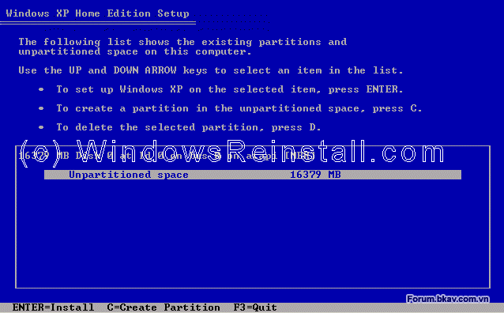
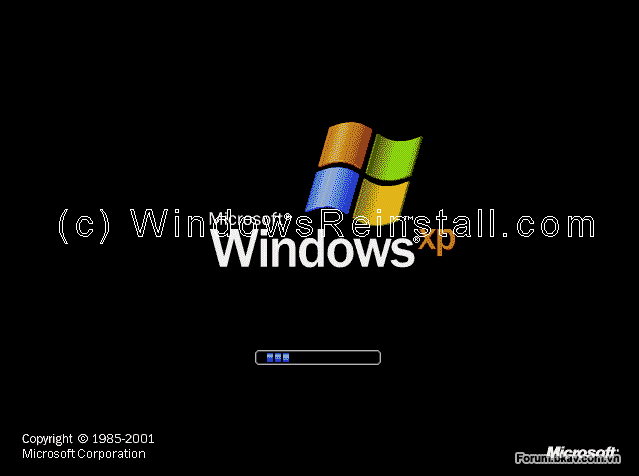

**I. YÊU CẦU VỀ PHẦN CỨNG**

-   Personal computer với CPU intel pentium 233 MHz (tối thiểu) hoặc 300
    MHz

-   64 MB RAM hoặc cao hơn ( recommended 128 MB)

-   1.5 GB dung lượng HDD trống.

-   CD-ROM hoặc DVD

-   Card màn hình và màn hình hỗ trợ độ phân giải tối thiểu super VGA
    (800 x 600)

-   Bàn phím, chuột

-   Thiết bị điều khiển âm thanh, loa

-   Kết nối Internet.

**II. CÁC PHIÊN BẢN WINDOWS XP**

-   ***Starter:*** Phiên bản rút gọn các tính năng cao cấp, không cầu kì
    về giao diện, gọn nhẹ, thích hợp với các máy netbook, hướng tới đối
    tượng là người mua mới netbook, người mới làm quen với máy vi tính,
    người có thu nhập thấp. Phiên bản này hầu như không thấy xuất hiện
    trên thị trường.

-   ***Home***: Lược bỏ một số tính năng nâng cao như Backup chẳng hạn.
    Tuy vậy, bản này phù hợp với những người không có nhiều tiền.

-   ***Professional***: Tập hợp đầy đủ các chức năng của tất cả các
    phiên bản kia cộng lại, giúp người dùng có được một sức mạnh toàn
    năng trong trao đổi thông tin và giải trí mọi lúc mọi nơi, hướng tới
    các cá nhân, tổ chức muốn một giải pháp trọn vẹn cho việc hoạt động
    máy vi tính của họ. Các chức năng kết nối mạng văn phòng cũng như
    kết nối mạng đầy đủ, hướng tới các công ty lớn, các doanh nhân
    thường xuyên làm việc với máy vi tính để trao đổi dữ liệu.

-   ***Windows XP Media Center Edition*** (dùng trên một số dòng máy
    tính giải trí)

-   ***Windows XP Tablet PC Edition*** (dùng cho máy tính xách tay loại
    có màn hình cảm ứng)

-   ***Windows XP Embedded*** (dùng trong một số thiết bị điện tử)

Trong đó Windows XP Home và Professional là 2 phiên bản chính được sử
dụng rộng rãi nhất.

-   Phiên bản bình thường (32 bit): dành cho các máy tính thông thường
    (Kiến trúc x86-32)

-   Phiên bản x64 (64 bit): dành cho các bộ xử lý hỗ trợ 64 bit (Kiến
    trúc x86-64/IA-64)

Service Pack (SP)

Là các gói dịch vụ (có thể được tích hợp sẵn vào các phiên bản trên)
được Microsoft phát hành để khắc phụ lỗi cũng như hỗ trợ thêm một số
tính năng chưa có trong các phiên bản trước.

Windows XP tới nay đã có 3 SP: SP1 (2002), SP2 (2004), SP3 (2008)

Micosoft sẽ ngừng hỗ trợ windows XP bắt đầu từ ngày 8/4/2014

{width="4.936805555555556in"
height="3.0722222222222224in"}

**III. CÀI ĐẶT WINDOWS XP.**

***Thiết lập BIOS để khởi động từ đĩa CD***\
Bạn cần những điều kiện sau để có thể cài đặt Win XP\
1. Một đĩa Windows XP CD\
2. Một máy tính có ổ CD-ROM.\
Để có thể bắt đầu cài đặt, bạn phải kiểm tra trong BIOS xem CD-ROM có
phải là thiết bị để khởi động đầu tiên không (first boot). Ở phần này vì
có rất nhiều loại BIOS nên mình chỉ lấy một loại để minh họa . Các loại
khác các bạn làm tương tự:

{width="6.666666666666667in"
height="4.96875in"}

Đối với các loại Main này các bạn dùng phím mũi tên di chuyển hộp sáng
sang mục Boot và chọn First Boot Device hoặc 1st Boot Device là CDROM
(Lưu ý: Ở các loại Main như thế này thì các ổ cứng, ổ mềm, ổ USB ổ,
CDROM không hiện tên các tên chung chung mà nó hiện tên cả tên hãng và
loại ổ (Ví dụ:TOSHIBA DVD-ROM SDJ hay, Maxtor 6Y160M0) nên cách bạn chú
ý chọn cho chính xác và nếu không biết và không hiểu thì không nên thay
đổi bất kỳ thông số nào khác trên BIOS). Trong trường hợp các bạn trót
thay đổi thông tin nào đó trên BIOS mà không biết có chính xác hay không
thì Hãy nhấn F9 và YES hoặc OK để khôi phục tất cả các thông tin BIOS về
mặc định của nhà sản xuất (Lưu ý: khi khôi phục lại mặc định sẽ có rất
nhiều cái các bạn phải thiết lập lại cho tương thích với các thiết bị
phần cứng, phần mềm để đảm bảo máy tính của bạn vẫn hoạt động bình
thường).\
\
***Bắt đầu cài đặt Windows XP***\
\
Cho đĩa Windows XP vào trong ổ CD-ROM và khởi động lại máy tính của bạn.
Windows sẽ tự động kiểm tra phần cứng và cấu hình của máy bạn.

{width="6.645833333333333in"
height="4.145833333333333in"}

Nhấn Enter hoặc bất kỳ phím nào trên bàn phím để máy tính truy cập vào
đĩa CD WindowsXP, chờ một lát các bạn sẽ thấy hình ảnh như ở dưới.

{width="6.666666666666667in"
height="4.15625in"}

Ở bước này Windows sẽ tự động kiểm tra phần cứng và cấu hình của máy bạn
và sẽ bắt đầu tải các tập tin hệ điều hành (mất khoảng vài phút).

{width="6.65625in"
height="4.125in"}

Các bạn nhìn thấy 3 lựa chọn:\
\
- To setup Windows now press Enter: Muốn cài đặt thì hãy ấn phím Enter\
- To repair a WindowsXP installation using recovery console, press R:
Nếu bạn muốn sửa chữa những lỗi và khôi phục lại những tập tin bị hỏng
của windows thì nhấn phím R.\
- To quit setup without installing WindowsXP press F3: Bạn không muốn
tiếp tục quá trình cài đặt windows nữa thì nhấn phím F3 để thoát.\
\
Các bạn ấn phím Enter để tiếp tục quá trình cài đặt sẽ hiện ra hình bên
dưới:

{width="6.6875in"
height="4.135416666666667in"}

Nếu đồng ý với thông báo của Windows các bạn nhấn F8 để tiếp tục còn nếu
không đồng ý bạn nhấn "ESC" để thóat. Nếu bạn không đồng ý, quá trình
cài đặt sẽ kết thúc. Cửa sổ mới hiện ra với các thông tin về các phân
vùng C:\\, D:\\, E:\\.... trên máy tính của bạn. Tại đây bạn sẽ lựa chọn
phân vùng nào (ổ nào) mà bạn sẽ cài đặt windows (Thông thường cài vào ổ
C:\\) Hoặc nếu ổ cứng của bạn chưa phân vùng và chưa định dạng (Format)
thì bạn sẽ nhận được hình ảnh thông báo như bên dưới:

{width="6.645833333333333in"
height="4.125in"}\
\
{width="6.770833333333333in"
height="4.197916666666667in"}

Nhấn C để tạo 1 phân vùng mới (1 ổ mới). Chia dung lượng ổ cứng Ví dụ
80GB \~ 80.000 MB thì bạn có thể chia ổ đầu tiền: 20.000 MB, các ổ còn
lại làm tương tự win sẽ tự động săp theo thứ tự C D E. Nếu khi chia xong
mà chưa vừa ý các bạn hãy nhấn phím D để xóa các phân vùng và thiết lập
lại từ đầu. Khi hoàn thành các bạn ấn phím Enter để cài đặt lên ổ các
bạn muốn cài sẽ xuất hiện như hình dưới:

{width="6.65625in"
height="4.145833333333333in"}

Tại đây chương trình hỏi bạn muốn định dạng ổ cứng của mình theo định
dạng FAT Hay NTFS (Nếu ổ cứng máy tính của bạn đã được phân vùng và định
dạng rồi thì nó có thêm một dòng thông báo bên dưới If you want to
select a different partition for Windows Xp, Press ESC rằng sẽ cài đặt
luôn windows mà không format lại ổ mà bạn vừa chọn - Tác vụ này nếu bạn
lựa chọn thì toàn bộ windows của bạn sẽ được làm mới lại từ đầu mà các
chương trình cài đặt trên máy cũng như Driver (trình điều khiển theo
máy) không mất đi mà vẫn được giữ nguyên. Cái này thuận tiện cho bạn sẽ
không mất nhiều thời gian để cài lại các ứng dụng tuy nhiên bạn nếu máy
tính của bạn bị lỗi do virus thì không nên chọn chế độ này vì máy tính
sẽ không được làm sạch virus và mục đích của bài viết này là hướng dẫn
bạn cài đặt mới hoàn toàn windows nên bạn chọn chế độ định dạng (Format)
lại ổ cứng). Tới đây bạn nên chọn định dạng FAT vì nó thông dụng tức là
bạn chọn dòng thứ 4 và nhấn Enter. Khi format lại phân vùng bạn chọn thì
tất cả dữ liệu trên phân vùng đó sẽ bị mất hết: Ví dụ bạn chọn phân vùng
C:\\ làm phân vùng cài đặt Windows thì sau khi Format tất cả dữ liệu
trên ổ C:\\ sẽ bị xóa sạch không còn gì, những dữ liệu trên phân vùng
D:\\, E:\\ của bạn sẽ còn nguyên mà không bị ảnh hưởng bởi việc Format ổ
C - Trừ trường hợp ổ cứng của bạn bị lỗi liên kết chéo nhưng cũng đừng
lo vì lỗi liên kết chéo chỉ xảy ra đối với những ổ cứng đã quá cũ hoặc
do bạn đã từng sử dụng các công cụ chia ổ cứng khác mà quá trình thực
hiện bạn làm không đúng hoặc sai quy trình.\
\
Để tiếp tục các bạn ấn phím Enter

{width="6.666666666666667in"
height="4.145833333333333in"}

Quá trình này sẽ khiến mất một khoảng thời gian. Tùy cấu hình từng máy
tính mà quá trình copy những tập tin đầu tiên này có thể nhanh hay chậm
(thông thường đối với các máy tính hiện nay thì quá trình này mất khoảng
5 -&gt; 7 phút). Sau khi hoàn thành sẽ tự động chuyển qua bước bên dưới:

{width="6.65625in"
height="4.135416666666667in"}

Windows sẽ bắt đầu copy những file cần thiết cho quá trình cài đặt. Sau
khi hoàn thành tiếp đến hình dưới:

{width="6.6875in"
height="4.145833333333333in"}

Windows sẽ nhận cấu hình của Win XP. Giờ là lúc để khởi động lại Win XP,
bạn nhấn "ENTER" để quá trình xảy ra nhanh chóng nếu không Windows sẽ tự
động khởi động lại sau 15 giây.

{width="6.677083333333333in"
height="4.135416666666667in"}

Khi khởi động lại, màn hình có hiện thông báo nhấn một phím bất kì để
khởi động bằng ổ CD-ROM, bạn đừng làm gì cả hãy để nó trôi qua.

{width="6.6875in"
height="4.15625in"}

Windows đang được khởi động.

{width="6.65625in"
height="4.979166666666667in"}

Quá trình cài đặt được tiếp tục.

Tiếp tục ngồi quan sát và chờ đợi đến khi có thông báo như hình bên
dưới:

{width="6.666666666666667in"
height="4.989583333333333in"}

Bây giờ là lựa chọn ngôn ngữ và vùng. Chuột của bạn lúc này đã hoạt động
vì thế bạn dùng chuột nhấn vào "CUSTOMIZE"

{width="6.65625in"
height="4.96875in"}

Bây giờ bạn chọn định dạng chuẩn khu vực của bạn và nhấn OK. Sau đó bạn
nhấn vào "DETAILS".

{width="6.666666666666667in"
height="4.989583333333333in"}

Tiếp đó bạn chọn ngôn ngữ mặc định, và nhấn "OK" khi thóat. Bây giờ bạn
đã có tất cả sự thay đổi cần thiết, bạn nhấn "NEXT".

{width="6.645833333333333in"
height="4.989583333333333in"}

Bây giờ là lúc ghi thông tin cá nhân của bạn. Bạn điền tên và có thể
điền thêm nơi công tác, làm việc. Bạn nhấn "NEXT" khi đã sẵn sàng.

{width="6.65625in"
height="4.96875in"}

Tiếp đó bạn điền vào khóa sản phẩm sẽ bắt gặp hình ảnh để bạn nhập
CD-Key bản quyền của hệ điều hành Windows bạn đang sử dụng, bạn hãy nhập
Key được cung cấp vào. Sau khi điền chính xác xong bạn nhấn NEXT.

{width="6.65625in"
height="4.989583333333333in"}

Bây giờ bạn đặt tên cho máy tính của bạn và hỏi bạn có muốn nhập
Password bảo vệ cho tài khoản Administrator hay không. Nếu muốn đổi tên
máy tính cho phù hợp và đặt pass thì bạn điền tên và pass vào (Bạn có
thể chỉ đổi nguyên tên máy tính mà không đặt Pass cho tài khoản
Administrator cũng được). Xác nhận lại password và nhấn "NEXT".

{width="6.645833333333333in"
height="4.96875in"}

Hệ thống giờ và ngày là phần tiếp theo, bạn thay đổi nếu thấy cần thiết,
và nhấn "NEXT".

{width="6.65625in"
height="4.979166666666667in"}

Tại đây bạn sẽ đặt lại giờ và ngày tháng cho máy tính (Nếu giờ và ngày
tháng đang hiệnhiển thị hiện tại không đúng) và đặt lại múi giờ cho phù
hợp thông thường ở Việt Nam bạn chọn đặt múi giờ GMT+7 Bangcok, Hanoi,
Jakarta Chọn xong tiếp tục Next\
\
Quá trình cài đặt windows được tiếp tục:

{width="6.65625in"
height="5.0in"}

Chờ một khoảng thời gian không lâu nữa các bạn sẽ thấy hiện ra bảng
thông báo như sau (Bảng thông báo này chỉ hiện ra với những máy đã tích
hợp card mạng - NIC) nói chung nếu có thông báo hiện ra như hình đây các
bạn chỉ nên Next chứ đừng thay đổi gì. Như vậy là quá trình điền các
thông tin cho hệ điều hành Windows mà bạn đang cài đặt đã cơ bản được
hoàn thành sau khi nhấn Next quá trình cài đặt được tiếp tục bạn lại chờ
đợi (Nói chung cứ làm vài chén chè hoặc vài coffe ngồi chờ đợi hoặc gọi
điện buôn với một em nào đó
{width="0.22916666666666666in"
height="0.20833333333333334in"} vì quá trình sẽ mất khoảng 20 -&gt; 30
phút (Tùy cấu hình nhanh chậm của từng máy).

{width="6.65625in"
height="4.979166666666667in"}\
\
\[IMG\]{width="6.65625in"
height="4.989583333333333in"}\[/IMG\]

Windows sẽ tiếp tục cài đặt.

{width="6.645833333333333in"
height="4.989583333333333in"}

Quá trình cài đặt kết thúc.

{width="6.65625in"
height="4.979166666666667in"}

Bây giờ là lúc để Windows XP khởi động lại lần nữa, bạn nhấn"ENTER" để
quá trình diễn ra nhanh chóng, mặt khác bạn cũng có thể đợi 15 giây để
Windows tự động khởi động lại.

{width="6.677083333333333in"
height="4.135416666666667in"}

Khi khởi động lại sẽ có thông báo nhấn một nút bất kì để máy tính khởi
động bằng CD-ROM, bạn đừng nhấn bất kì nút nào, cứ để mặc cho nó trôi
qua.

{width="6.666666666666667in"
height="4.15625in"}

Windows sẽ tiếp tục được nạp.

{width="6.65625in"
height="4.958333333333333in"}

Windows bấy giờ sẽ nhận cấu hình máy tính của bạn. Bạn nhấn OK để tiếp
tục.

{width="6.666666666666667in"
height="4.989583333333333in"}

Nếu bạn đồng ý với sự thay đổi bạn nhấn "OK" không thì bạn nhấn "CANCEL"
để qấy lại với cấu hình cũ.

{width="6.84375in"
height="4.75in"}

Bây giờ WINDOWS sẽ cập nhật thay đổi. Bạn hãy kiên nhấn chờ đợi.

{width="6.65625in"
height="5.0in"}

Màn hình WELCOME hiện lên.

{width="6.65625in"
height="5.010416666666667in"}

và kết thúc là Desktop của Windows XP. Windows đã được cài xong.\
\
Công việc tiếp theo của bạn là chỉ việc cài đặt Driver cho máy của mình
và cài đặt các ứng dụng khác cho máy mà thôi. việc cài đặt driver cũng
không có gì khó khăn vì khi bạn mua máy thì người ta đã cung cấp sẵn CD
driver cho các bạn rồi các bạn chỉ việc đưa CD đó vào ổ đĩa rồi nó sẽ
Autorun ra một cửa sổ các bạn tích chọn tất cả những lựa chọn mà nó hỏi
rồi nhấn Install hoặc Setup ALL và kệ cho nó làm hoặc làm theo hướng dẫn
của nó bảo là Ok (Quá trình cài đặt Driver cho máy được thực hiện theo
cách trên thì cữ mỗi lần cài xong một driver thì máy tính của bạn lại
được khởi động lại các bạn cứ kệ và chờ cho nó cài đặt đến khi nào nó
báo đã cài đặt xong hết hoặc không tiếp tục khởi động lại máy nữa là OK\
\
Để kiểm trả xem Driver của bạn đã được cài đặt hết chưa các bạn làm như
sau\
\
Chuột phải vào biểu tượng My Computer (Nếu mới cài lai Window chưa thấy
biểu tượng My computer ngoài màn hình các bạn Chuột phải ra màn hình
Desktop -&gt; chọnProperties -&gt; Desktop -&gt; Customize Desktop tích
chọn vào My computer và nhân Ok thì sẽ thấy My computer hiện ngoài màn
hình) và chọn Manage =&gt; Device Manager một cửa sổ mới hiện ra các bạn
thấy không phần nào ở phía trong bảng có dấu hỏi chấm to màu vàng như
hình bên dưới là tất cả driver của bạn đã được cài đặt xong

{width="4.135416666666667in"
height="4.697916666666667in"}

Còn nếu thấy cái nào có biểu tượng dấu hỏi chấm màu vàng như hình bên
dưới thì tức là Driver đó chưa được cài đặt hoặc cài lỗi hoặc đã được
cài đặt nhưng bị lỗi.

{width="3.5104166666666665in"
height="4.9375in"}
