**I. GIỚI THIỆU CÁC PHIÊN BẢN WINDOWS 7**

-   **Starter**: Phiên bản rút gọn các tính năng cao cấp, không cầu kì
    về giao diện, gọn nhẹ, thích hợp với các máy netbook, hướng tới đối
    tượng là người mua mới netbook, người mới làm quen với máy vi tính,
    người có thu nhập thấp.

-   **Home Basic**: Lược bỏ một số các chức năng giải trí nâng cao (như
    Media Center) ở bản Home Premium, thích hợp với các loại netbook,
    máy tính cá nhân, công ty vừa và nhỏ, hướng tới đối tượng là người
    mua mới netbook, gia đình có thu nhập trung bình.

-   **Home Premium**: Các chức năng giải trí, giao tiếp, kết nối ở mức
    khá tốt, thích hợp với các máy netbook thế hệ mới, máy tính cá nhân
    (PC), máy tính xách tay (Laptop), hướng tới người sử dụng là các hộ
    gia đình, công ty vừa và nhỏ.

-   **Professional**: Các chức năng kết nối mạng văn phòng cũng như kết
    nối mạng đầy đủ, hướng tới các công ty lớn, các doanh nhân thường
    xuyên làm việc với máy vi tính để trao đổi dữ liệu.

-   **Ultimate và Enterprise**: Tập hợp đầy đủ các chức năng của tất cả
    các phiên bản kia cộng lại, giúp người dùng có được một sức mạnh
    toàn năng trong trao đổi thông tin và giải trí mọi lúc mọi nơi,
    hướng tới các cá nhân, tổ chức muốn một giải pháp trọn vẹn cho việc
    hoạt động máy vi tính của họ. Điểm khác biệt gần như duy nhất của
    Ultimate và Enterprise nằm ở chỗ Enterprise mang đến giải pháp về
    giá và hỗ trợ toàn diện hơn Ultimate. Vì vậy, Ultimate hướng đến các
    cá nhân sử dụng, còn Enterprise hướng vào môi trường có tính chất
    cộng đồng, tương tự như Professional. Cùng với đó, trong khi
    Ultimate là phiên bản thương mại toàn cầu, còn Enterprise không được
    bán lẻ mà chỉ dành cho các tổ chức đặt mua với số lượng lớn.

-   **Thin PC**: Dành cho máy có cấu hình thấp (nhẹ gần bằng windows
    XP), tất nhiên sẽ bị lượt bỏ một số phần không cần thiết lắm
    trong Windows. ( không có windows search,...)

**Services Pack ( bản vá lỗi )**: Windows 7 SP1 đã ra mắt bản beta vào
12/7/2010. Bản chính thức được phát hành vào ngày 9/2/2011. Người dùng
có thể cập nhật tự động bản SP1 qua Windows Update hoặc tải về trực
tiếp. Các đĩa cài đặt Windows 7 cũng đã được nâng cấp lên bản SP1.

**II. YÊU CẦU VỀ PHẦN CỨNG:**

  --------------------------------- ----------------------------------------------------- --------------
  **Loại**                          **32-bit**                                            **64-bit**
  Bộ vi xử lý                       1 GHz IA-32                                           1 GHz x86-64
  RAM                               1 GB                                                  2 GB
  Card đồ họa                       Bộ xử lý đồ họa DirectX 9 với driver WDDM model 1.0
  Dung lượng ổ đĩa cứng còn trống   16 GB                                                 20 GB
  Ổ đĩa quang                       Ổ DVD-ROM (dùng để cài đặt từ đĩa)
  --------------------------------- ----------------------------------------------------- --------------

**III. CÁC BƯỚC THỰC HIỆN**

**1.** Khởi động máy tính của bạn và ngay sau đó nhấn DEL hoặc F2 để vào
BIOS hệ thống.

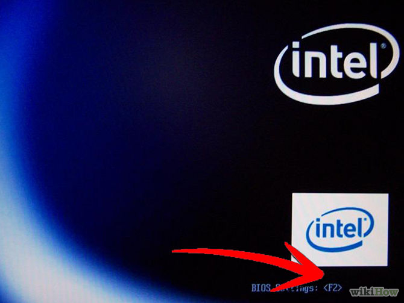

**2.** Đi đến menu BOOT và chọn CD/DVD là ưu tiên khởi động đầu tiên
thay vì ổ đĩa cứng.

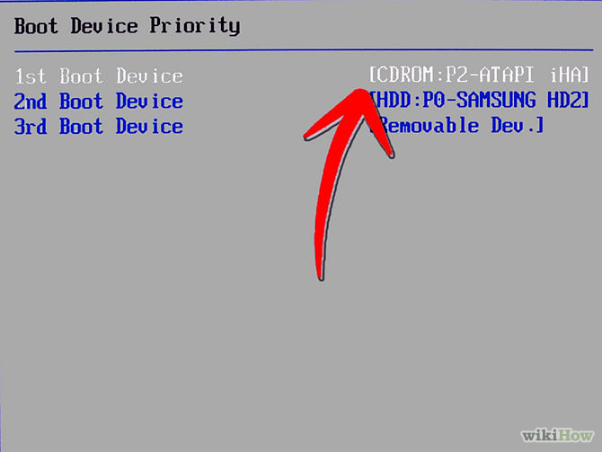

**3.** Nhấn F10 để lưu lại cấu hình BIOS, gõ Y sau đó nhấn Enter khi
được hỏi, hoặc cũng có thể đơn giản chỉ là chọn OK và nhấn Enter tùy
thuộc vào mainboard bạn đang dùng.

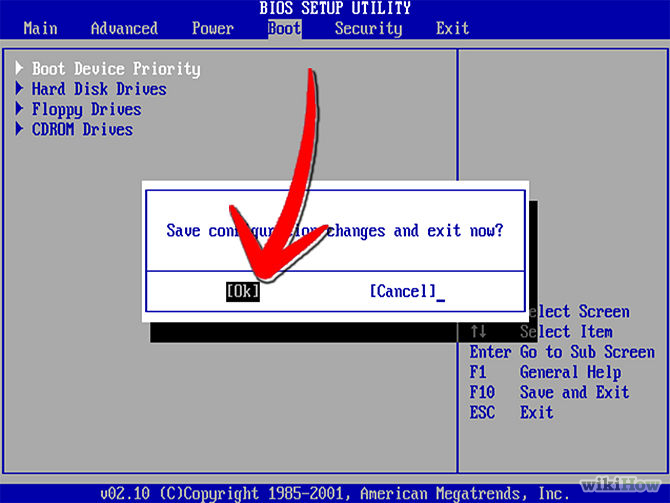

**4.** Chèn đĩa Windows 7 vào ổ đĩa quang sau đó khởi động lại máy tính.
Máy tính của bạn sẽ thực hiện load các tệp tin từ đĩa. Cứ để nó làm việc
đó.

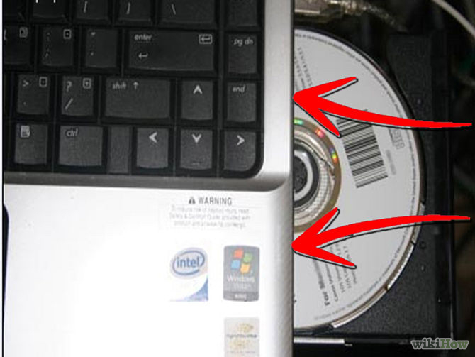

**5.** Một cửa sổ màn hình sẽ xuất hiện khi các tệp tinđược load xong.
Tại đây, chọn ngôn ngữ của bạn, chọn các định dạng thời gian và đơn vị
tương ứng. Mục **Keyboard or input method** là định dạng bàn phím và các
đầu vào, bạn có thể để mặc định.Sau đó nhấn **Next**.

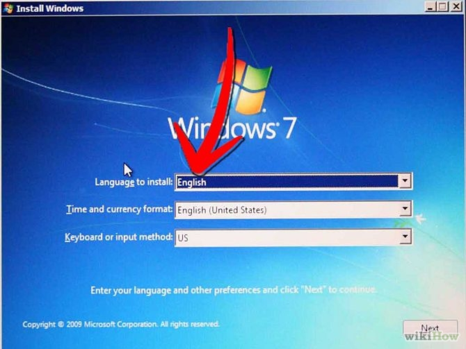

**6.** Chọn phiên bản hệ điều hành mà bạn muốn cài đặt và lại
nhấn **Next**.

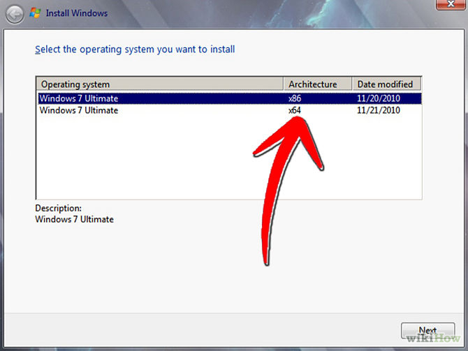

**7.** Click để tích chọn vào hộp kiểm **I accept the license
terms** sau đó nhấn **Next**.

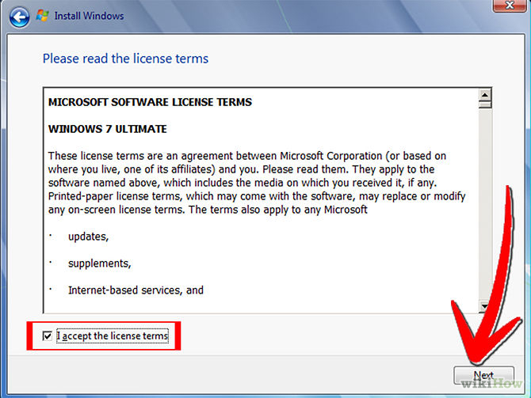

**8.** Chọn **Upgrade** nếu bạn muốn thực hiện nâng cấp từ một phiên bản
Windows trước đó. Hoặc chọn **Custom** nếu muốn cài mới hoàn toàn hệ
điều hành.

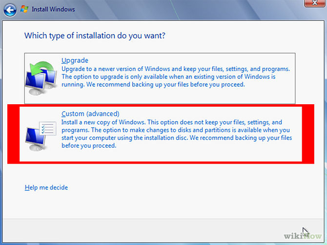

**9.** Chọn phân vùng để cài đặt hệ điều hành, thuông thường là ổ C:/
nhưng bạn cũng có thể chọn ổ đĩa khác. Click chọn **Drive Options** nếu
bạn muốn format phân vùng ổ đĩa hoặc thực hiện các tùy chọn khác với
phân vùng ổ đĩa. Nhấn **Next** để bắt đầu cài đặt.

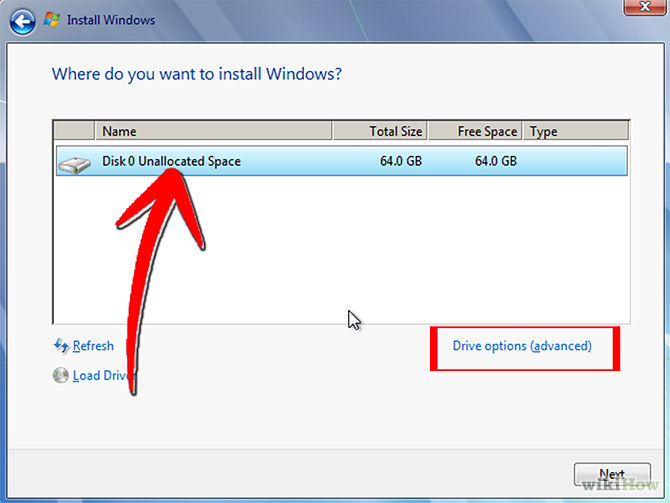

**10.** Chờ đợi để windows cài đặt vào phân vùng ổ đĩa. Máy tính của bạn
có thể được khởi động lại. Để cho nó tự làm việc cho đến khi nhận được
cửa sổ trong hình ở bước 11.

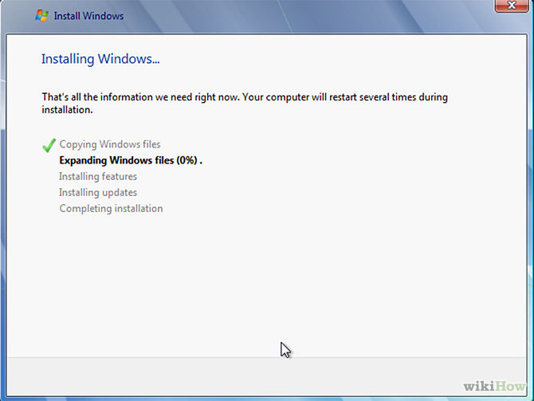

**11.** Dùng bàn phím để viết tên người dùng và tên máy tính. Sau đó
nhấn **Next**.

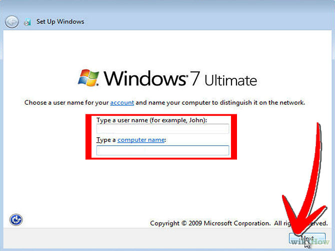

**12.** Cung cấp passwords để truy cập Windows, nếu không muốn đặt pass,
bạn có thể để trống trong bước này.

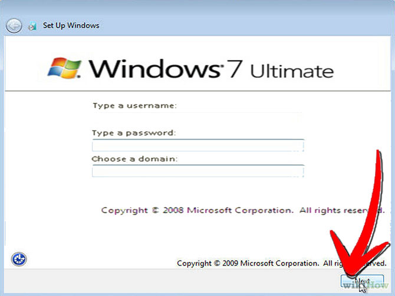

**13.** Nhập mã kích hoạt bản quyền hệ điều hành. Nếu không có mã kích
hoạt hoặc windows bẻ khóa bạn có thể để mặc định và nhấn **Next**.

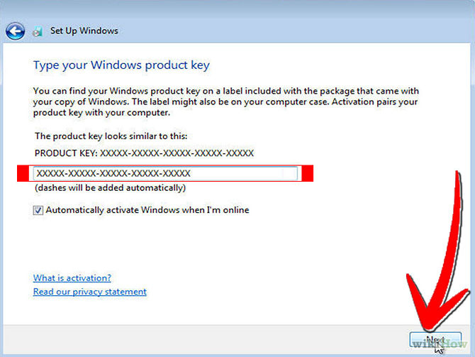

**14.** Lựa chọn phuong pháp bảo vệ hệ điều hành. Bạn có thể chọn **Use
recommended settings** để thiết lập các bảo vệ khuyên dùng.

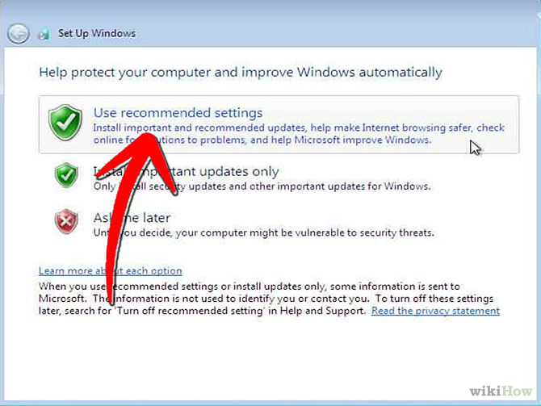

**15.** Thiết lập thời gian và múi giờ bạn muốn sau đó nhấn **Next**.

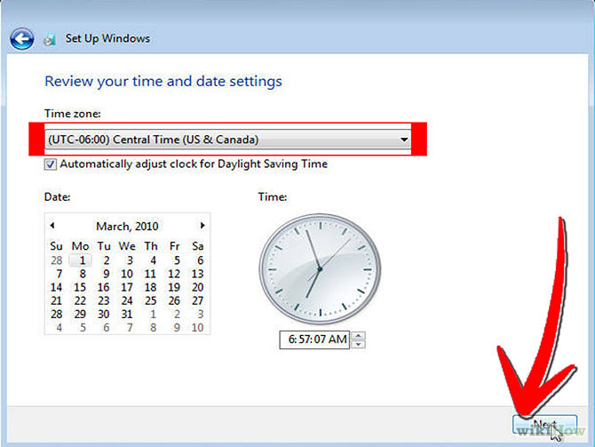

**16.** Chọn các lựa chọn mạng bạn sẽ dùng. Bạn có thể chọn **Public
Network**hoặc** Home Network** đều được.

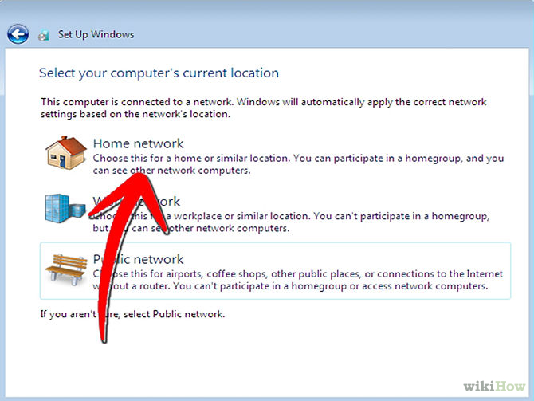

**LỖI MẠNG SAU KHI CÀI ĐẶT**

Sau khi cài đặt Windows 7, nếu gặp sự cố về mạng không thể kết nối được
hãy bình tĩnh và kiểm tra những yếu tố sau:

-   Kiểm tra lại các điểm kết nối. Hãy chắc chắn rằng các đầu dây mạng
    > không bị hỏng, lỏng và kết nối internet hoạt động bình thường.

-   Nếu bạn sử dụng kết nối thông qua Wifi, hãy chắc rằng các trình điều
    > khiển đã được cài đặt.

-   Thiết lập IP nếu IP tự động không làm việc.

-   Các thiết bị ngoại vi có thể chưa làm việc, gần như là do bạn chưa
    > cài đặt driver hoàn chỉnh.

