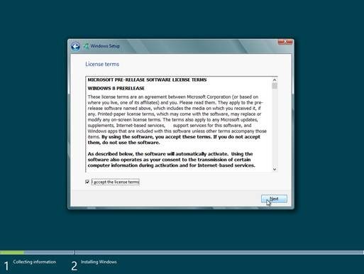
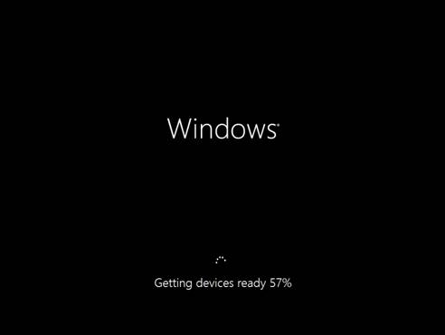
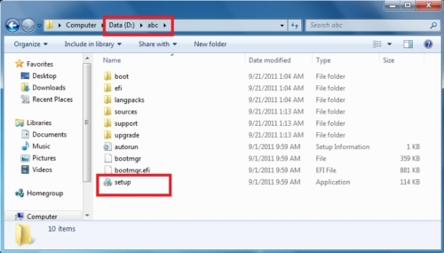
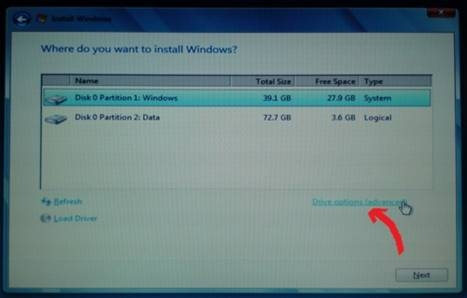
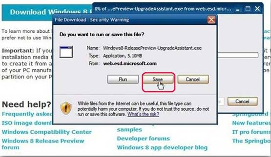
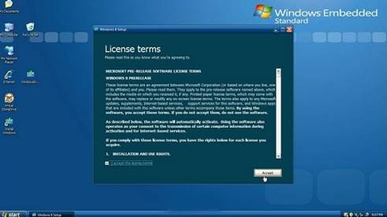

**I. GIỚI THIỆU VỀ WINDOWS 8**

> Tên gọi Windows 8 vốn được người dùng và giới công nghệ sử dụng để đặt
> cho phiên bản Windows tiếp theo sau phiên bản Windows 7, và thật bất
> ngờ khi Microsoft đã quyết định chọn tên gọi này để đặt cho hệ điều
> hành mới nhất của mình.

{width="6.25in"
height="5.947916666666667in"}

**1) Windows 8 gồm bao nhiêu phiên bản?**

Micrsoft cho biết Windows 8 gồm 4 phiên bản. Bản Windows 8 và Windows 8
Pro dành cho người tiêu dùng, Windows RT chỉ dùng cho máy tính bảng, bản
Windows 8 Enterprise dành cho hợp đồng mua bản quyền số lượng lớn.
Windows 8, Windows 8 Pro và Windows 8 enterprise đều gồm 2 phiên bản 32
bit và 64 bit.\
\
**Sự khác nhau giữa phiên bản Windows 8 và Windows 8 Pro?**\
\
Theo trang blog Microsoft, Windows 8 phù hợp với người dùng thông
thường, Windows 8 Pro phù hợp với người dùng am hiểu kỹ thuật, kinh
doanh. Windows 8 Pro có một số tính năng mà người dùng thông thường ít
quan tâm như ảo hóa Client Hyper-V, mã hóa đĩa BitLocker.\
\
Windows 8 không tích hợp phần mềm “rạp hát gia đình” Windows Media
Center. Nếu muốn Windows Media Center, bạn cần tải về gói Windows 8 Pro
Pack để nâng cấp lên phiên bản Windows 8 Pro. Microsoft chưa công bố giá
gói nâng cấp này. Windows 8 Pro cũng không tích hợp sẵn phần mềm Windows
Media Center, tuy nhiên bạn có thể tải về miễn phí phần mềm này.\
\
Windows 8 cũng sẽ bao gồm nền tảng 32-bit và 64-bit tương tự như các
phiên bản Windows trước đây và trang bị nhiều tính năng mới mà đã được
Microsoft giới thiệu, như các ứng dụng trên giao diện Metro, Xbox Live,
khóa máy bằng hình ảnh, hỗ trợ hoạt động trên nhiều màn hình…\
\
Phiên bản cao cấp hơn có tên gọi Windows 8 Pro, đây là phiên bản phù hợp
cho các doanh nhân, các nhà thiết kế ứng dụng và các chuyên gia công
nghệ, những người đỏi hỏi nhiều tính năng hơn trên chiếc máy tính của
mình.\
\
Phiên bản này sẽ được trang bị thêm nhiều tính năng nâng cao như mã hóa
file hệ thống, khởi động từ ổ đĩa ảo, tạo mạng kết nối qua domain…Ngoài
ra, phiên bản này còn được Microsoft cung cấp thêm gói phần mềm mở rộng
Media Pack, cho phép biến máy tính sử dụng Windows 8 Pro trở thành một
thiết bị giải trí đúng nghĩa.\
\
Đáng chú ý nhất trong số những phiên bản của Windows 8 đó chính là phiên
bản Windows RT. Đây chính là tên gọi chính thức mà Microsoft sử dụng để
đặt cho phiên bản Windows 8 hoạt động trên vi xử lý ARM của mình, chính
là phiên bản dành cho máy tính bảng.\
\
Đây là phiên bản hệ điều hành mà nhà sản xuất sẽ cài đặt sẵn trên thiết
bị trước khi người dùng mua sản phẩm, do vậy Windows RT sẽ không được
phân phối riêng biệt. Windows RT được tích hợp thêm phiên bản miễn phí
của bộ ứng dụng văn phòng Microsoft Office (Word, Excel, PowerPoint,
OneNote) cũng như trang bị tính năng mã hóa thiết bị.

{width="6.927083333333333in"
height="4.395833333333333in"}

Mỗi phiên bản Windows 8 phù hợp với từng nhu cầu sử dụng khác nhau của
người dùng\
\
Ngoài ra, với khách hàng doanh nghiệp, Microsoft cũng trang bị thêm
phiên bản Windows 8 Enterprise dành riêng cho doanh nghiệp, trang bị đầy
đủ các tính năng của Windows 8 Pro kèm thêm các tính năng cần thiết cho
các chuyên gia công nghệ thông tin, để họ có thể quản lý một hoặc nhiều
mạng lưới máy tính, với tính năng bảo mật mạnh mẽ…\
\
Đây chỉ là phiên bản đặc biệt dành riêng cho doanh nghiệp nên sẽ không
được phân phối rộng rãi cho người dùng. Microsoft cho biết người dùng
Windows 7 có thể nâng cấp trực tiếp lên Windows 8 hoặc Windows 8 Pro,
phụ thuộc vào phiên bản Windows 7 mà họ đang sử dụng.

**2) Chi tiết của các phiên bản Windows 8**

**Windows 8**: phiên bản dành cho các máy tính dùng chip xử lý Intel
x86/x64, hỗ trợ nâng cấp từ Windows 7 Starter, Home Basic hay Home
Premium, và cung cấp tất cả những tính năng cơ bản của Windows 8, bao
gồm: màn hình Start với chức năng phóng lớn ngữ nghĩa, Windows Store,
các ứng dụng lõi như Mail, Calendar, People, Messaging, Photos,
SkyDrive, Reader, Music và Video, trình duyệt web Internet Explorer 10,
tích hợp tài khoản Microsoft, Windows Desktop...\
**Windows 8 Pro**: phiên bản này cũng dành cho các máy tính dùng chip
Intel x86/x64, hỗ trợ nâng cấp từ thế hệ tiền nhiệm Windows 7 Starter,
Home Basic, Home Premium, Professional hay UltimateNgoài những tính năng
cơ bản của Windows 8, Windows 8 Pro kèm theo BitLocker và BitLocker To
Go, Boot from VHD, Client Hyper-V, khả năng tham gia tên miền,
Encrypting File System (EFS), Group Policy và Remote Desktop (máy chủ).\
**Windows 8 Enterprise**: chứa đựng tất cả tính năng của Windows 8 Pro
kèm theo nhiều chức năng chuyên dụng dành cho các quản trị công nghệ
(IT) trong doanh nghiệp, cho phép quản lý và triển khai các hệ thống máy
tính, bảo mật cấp cao, ảo hóa... Phiên bản này chỉ dành cho khách hàng
là những doanh nghiệp với thỏa thuận Software Assurance.\
**Windows RT**: đây là phiên bản chỉ được cài đặt sẵn trên các máy tính
(PC), máy tính bảng (tablet) hay thiết bị nhúng dùng chip xử lý ARM, đã
được tinh gọn để kéo dài tuổi thọ pin. Trước đây, Windows RT có nhiều
tên gọi khác như Windows Metro, Windows on ARM hay WOA. Windows RT sẽ
bao gồm phiên bản Desktop hỗ trợ điều khiển cảm ứng chạm, các phiên bản
Microsoft Word, Excel, PowerPoint và OneNote 15 mới tinh cùng khả năng
mã hóa bảo mật cho thiết bị. Windows RT thiếu vắng một vài chức năng so
với các phiên bản dành cho nền tảng chip Intel như Storage Spaces,
Windows Media Player và tất cả các tính năng dành riêng cho Windows 8
Pro.

**3) Tính năng**

Tính năng chính được giới thiệu là giao diện người dùng được thiết kế
lại khá nhiều, tối ưu cho điều khiển cảm ứng và bàn phím-chuột. Start
menu được thay bằng một Màn hình Start mới, gồm các tên ứng dụng đang
trực tuyến. Người dùng có thể quay về màn hình Desktop bằng các chọn ứng
dụng "Desktop", và quay về màn hình start bằng nút start. Các máy tính
bảng khác nhau dùng các nút điều khiển khác nhau để chuyển đổi qua lại
giữa hai chế độ này. Ví dụ về các ứng dụng trên màn hình start gồm một
ứng dụng thời tiết, Windows Store, Đầu tư, tin tức từ RSS, trang cá nhân
của người dùng, và tài khoản Windows Live của người dùng. Giao diện mới
này chủ yếu thiết kế cho các màn hình 16:9, với độ phân giải 1366×768
hoặc lớn hơn để có thể hiển thị cùng lúc hai ứng dụng Windows 8 dùng
"Snap". Các màn hình 1024×768 có thể hiển thị một ứng dụng Windows 8
trong chế độ toàn màn hình, và các màn hình 1024×600 chỉ có thể dùng màn
hình Desktop Windows truyền thống.\
\
**Tính năng mới trong Windows 8**

-   Tất cả các ứng dụng trên Wins 7 sẽ chạy được trên Windows 8.

-   Cảnh báo cập nhật hệ thống sẽ được thu nhỏ xuống dưới cùng bên phải
    màn hình đăng nhập.

-   Window Task Manager được làm mới sẽ treo các ứng dụng khi chúng
    không hoạt động.

-   Chức năng reset và làm mới (refresh) PC cho phép đơn giản hóa việc
    quét và phục hồi hệ thống.

-   Công nghệ ảo hóa HyperV sẽ được nạp sẵn trong Windows 8. Là Một
    trong những tính năng mới trên Windows gây chú ý nhiều nhất

-   Giao diện phong cách Metro sẽ làm mới Mail, ảnh, lịch...

-   Hỗ trợ đa chạm cho IE 10.

-   Tập tin Mount ISO

-   Bất cứ lúc nào bạn cần phải gắn kết một file ISO như: MagicDisk,
    MagicISO, hoặc một số công cụ khác ít cho công việc hơn. Windows 8
    đã loại bỏ sự cần thiết cho các tiện ích này. Bạn chỉ có thể chọn
    tập tin ISO trong Explorer bằng cách nhấp vào nó, và chọn Mount.

-   Chức năng Magnifier được cải tiến để phù hợp với các thao tác
    trên Desktop.

-   Tích hợp Sky-Drive: Lưu trữ đám mây bây giờ là một bộ phận của hệ
    điều hành.

-   Các ứng dụng trên nền đám mây sẽ được hỗ trợ về lưu trữ (bằng dịch
    vụ SkyDrive của Microsoft).

-   Windows 8 sẽ không đòi hỏi cấu hình quá cao (máy Lenovo S10 dùng
    chip Atom đời đầu và 1GB Ram vẫn có thể chạy được Windows 8).

-   Tiêu thụ ít bộ nhớ hơn: Windows 8 khai thác bộ nhớ hiệu quả và yêu
    cầu ít bộ nhớ hơn khi chạy. Điều này rất quan trọng đối với những hệ
    thống như các Ultrabook thường kèm sẵn RAM 4GB và không có khả năng
    nâng cấp thêm và một số loại phải cấp bộ nhớ cho xử lý đồ họa.

-   Hiệu năng sử dụng cao hơn: Windows 8 và các hệ thống con nền tảng
    trong nó tiêu thụ ít tài nguyên CPU hơn những bản trước đó. Điều đó
    rất quan trọng với thiết bị bỏ túi và máy tính bảng, những thiết bị
    mà hiệu năng CPU thấp hơn những máy dòng cao.

-   Yêu cầu không gian lữu trữ giảm: Khi ổ đĩa trạng thái rắn dần trở
    nên phổ biến thì không gian ổ đĩa lưu file người dùng sẽ được
    đảm bảo.

-   Cải thiện tính năng hỗ trợ đa màn hình: Trong số những tính năng của
    Windows 8 thì quản lý nhiều màn hình là khả năng mới cho phép điều
    chỉnh và cài đặt vị trí của thanh task bar.

-   Các ứng dụng Metro-style và Win32 sẽ được bán trên Windows Store.

-   Các thiết bị chạy Windows 8 được trang bị chip NFC sẽ có chức năng
    gõ để chia sẻ (tap to share) cho phép gửi dữ liệu từ thiết bị này
    sang thiết bị khác, hoặc đơn giản là nhận dữ liệu từ các thiết bị
    như card NFC.

-   Quá trình đăng nhập sẽ có thêm lựa chọn dùng ảnh làm mật khẩu.

-   Windows 8 sẽ có phần mềm antivirus tích hợp.

Hầu hết những khác biệt này sẽ không có ý nghĩa lắm với người dùng máy
tính để bàn, nhưng chúng sẽ có những tác động rõ rệt lên các thiết bị di
động mà thường có bộ nhớ và CPU có giới hạn.

**4) Cấu hình tối thiểu để cài Windows 8**

Được Microsoft quảng cáo sẽ làm hài lòng mọi đối tượng khách hàng nhưng
để nâng cấp hoặc cài mới Windows 8, máy tính của người dùng phải đáp ứng
được những nhu cầu tối thiểu do chính hãng công nghệ Mỹ khuyến cáo. Đây
cũng là điều kiện gần như bắt buộc để quá trình sử dụng Windows 8 được
“mượt mà” nhất.

-   Bộ vi xử lý: CPU 1 GHz hoặc nhanh hơn.

-   Bộ nhớ ngẫu nhiên Ram: 1 GB (với bản 32 bit) hoặc 2 GB (với bản
    64 bít).

-   Dung lượng ổ đĩa trống tối thiểu cho ổ cài đặt: 16 GB (với bản
    32 bit) hoặc 20 GB (với bản 64 bit).

-   Card đồ họa: hỗ trợ DirectX 9 và trình điều khiển đồ họa kiến trúc
    cho card màn hình trình WDDM (Windows Display Driver Model). Ngoài
    ra, để sử dụng các ứng dụng trên Windows Store, người dùng cần sở
    hữu một màn hình máy tính có độ phân giải tối thiểu 1024x768 pixel.
    Tuy nhiên Microsoft khuyên người dùng nên có độ phân giải 1366 x768
    để có thể tận dụng hết sức mạnh của giao diện Metro đặc trưng.

Bên cạnh việc trang bị để hỗ trợ hoàn toàn cảm ứng, Windows 8 cũng như
trước đây khi cung cấp đầy đủ các tùy chọn cho chuột và bàn phím.
Microsoft cũng đã biến 4 góc màn hình của Windows thành 4 góc “ma
thuật”, mà khi di chuyển con trỏ chuột đến đó sẽ kích hoạt 4 tính năng
khác nhau của Windows, chẳng hạn như khi chuyển chuột đến 1 góc sẽ kích
hoạt danh sách các chức năng điều khiển…\
\
Chức năng Copy dữ liệu trên Windows 8 cũng đã được thiết kế lại, cho
phép người dùng tạm ngừng quá trình sao chép khi cần thiết và trở lại
sau này. Nếu gặp lỗi trong quá trình sao chép dữ liệu, người dùng có thể
phục hồi và tiếp tục từ thời điểm bị lỗi.\
\
Các ứng dụng trong Windows 8 sẽ giao tiếp và tương tác nhuần nhuyễn với
nhau, chẳng hạn người dùng có thể dễ dàng chọn và gửi e-mail các hình
ảnh từ những "không gian" khác nhau như Facebook, Flickr hoặc trong ổ
cứng. Bên cạnh đó, OS gây ấn tượng với khả năng "roaming tức thì", tức
người dùng có thể đồng bộ tất cả nội dung như hình ảnh, e-mail, lịch,
danh bạ thông qua ứng dụng SkyDrive để truy cập trên bất kỳ trình duyệt
nào.\
\
Một điểm mới nữa trong Windows 8 là kho ứng dụng Windows Store, cho phép
các nhà phát triển giới thiệu và kinh doanh ứng dụng trong khi người
dùng sẽ tiếp cận phần mềm mới nhanh chóng hơn.\
\
Microsoft nhấn mạnh Windows 8 chạy trên mọi thiết bị với mọi định dạng
và kích cỡ, sử dụng chipset ARM hay x86 (x32 và x64). Nói cách khác,
Windows 8 hoạt động trên một dải rộng sản phẩm từ máy tính bảng và
laptop 10 inch tới những hệ thống "tất cả trong một" với màn hình HD
kích cỡ lớn.\
\
Windows 8 cũng tương thích với thiết bị phần cứng và chương trình đang
hoạt động trên Windows 7 mà không cần điều chỉnh và đạt hiệu suất như
người dùng mong đợi từ một chiếc máy tính.

**b) Cài đặt mới từ đĩa DVD**

Trong mấy tháng gần đây, Microsoft đã phát hành Windows 8 thử nghiệm để
cho ý kiến. Và trong bài viết này, mình sẽ hướng dẫn các bạn trong cách
cài đặt Windows 8 từ đĩa DVD.\
\
Khi download xong từ địa chỉ trên thì các bạn ghi file iso đó ra đĩa
DVD. Mình không cần phải giới thiệu nữa các bạn xem [*tại
đây*](http://forum.bkav.com.vn/showthread.php?38153-Huong-dan-ghi-dia-Full).
Và tất nhiên các bạn cần có 1 ổ đĩa ghi DVD.\
\
**HƯỚNG DẪN CÀI ĐẶT**\
\
Bạn sử dụng đĩa DVD để cài đặt, hãy thiết lập để ổ đĩa CD/DVD được đưa
lên vị trí khởi động đầu tiên. Sau khi thiết lập từ BIOS, tiến hành khởi
động lại máy tính.\
Bây giờ, máy tính sẽ được khởi động từ ổ đĩa DVD, quá trình cài đặt
Windows 8 sẽ bắt đầu diễn ra.\
Tại bước đầu tiên, bạn chọn ngôn ngữ cài đặt và sử dụng, tại đây bạn có
thể chọn Vietnamese tại mục “Time and Currency format”. Nhấn Next để
tiếp tục.

{width="4.479166666666667in"
height="3.3541666666666665in"}

Nhấn nút **Install Now** ở bước tiếp theo. Đánh dấu đồng ý vào các điều
khoản sử dụng rồi nhấn**Next**.

{width="4.96875in"
height="3.7395833333333335in"}\
\
Chấp nhận các thỏa thuận cấp phép và nhấn "Next"\
\
\
\
{width="5.34375in"
height="4.020833333333333in"}

Ở bước tiếp theo sẽ đưa ra 2 tùy chọn cài đặt (**Upgrade và Custom**).
Nếu muốn nâng cấp trực tiếp lên Windows 8 từ hệ điều hành hiện thời, bạn
chọn **Upgrade**. Nếu bạn muốn cài đặt song song 2 hệ điều hành, thì bạn
chọn **Custom** (**Advanced**).

{width="5.427083333333333in"
height="4.083333333333333in"}

Bước tiếp theo, quá trình sẽ cho phép chọn phân vùng để cài đặt. Tại
đây, bạn hãy chọn phân vùng để sẵn để cài đặt Windows 8 (không phải là
phân vùng đã cài đặt Windows trước đó) nếu bạn muốn dùng song song 2 hệ
điệu hành. Còn không thì đè lên phân vùng của Windows cũ. Có thể, nó sẽ
hỏi là bạn có muốn làm không? Các bạn nhấn Ok. Nhấn Next để qua bước
tiếp theo.\
\
****Lưu ý**:** ổ đĩa hoặc phân vùng bạn chọn sẽ được định dạng hoàn toàn
và tất cả các dữ liệu trên đó sẽ bị mất và nếu bạn không muốn điều đó
hãy thoát khỏi cài đặt ngay (bằng cách nhấn vào nút X màu đỏ) sau đó lập
một phân vùng / ổ đĩa để cài đặt.

{width="5.270833333333333in"
height="3.9583333333333335in"}

Bạn có thể tạo một phân vùng mới bằng cách chọn ổ đĩa bạn muốn phân vùng
và nhấn "New". Chỉ định kích thước và nhấn "Apply". Hãy chắc chắn rằng
kích thước phân vùng là ít nhất mà Microsoft đề nghị (16GB hoặc 20GB)
như quy định trong các yêu cầu hệ thống.\
\
Nhấn "Next". Quá trình cài đặt sẽ bắt đầu. Chờ cho nó để kết thúc, tốc
độ cài đặt tùy thuộc vào máy tính của bạn.

{width="5.354166666666667in"
height="4.020833333333333in"}

Máy tính sẽ tự động khởi động lại sau khi các bước trên, bạn có thể nhấn
"Khởi động lại ngay bây giờ" vào thời điểm này nếu bạn không thể chờ
đợi.

{width="5.65625in"
height="4.260416666666667in"}

Máy tính của bạn sẽ khởi động lại và Windows sẽ bắt đầu nhận được các
thiết bị của bạn đã sẵn sàng. Điều này chỉ mất một vài phút.

{width="5.125in"
height="3.8541666666666665in"}

Bây giờ bạn bắt đầu Cá nhân hóa cài đặt Windows 8. Chọn một màu sắc chủ
đề và nhập tên cho máy tính của bạn và nhấp "Next".

{width="5.46875in"
height="4.072916666666667in"}

Bạn đang ở màn hình Settings, bạn có thể click vào nút "Sử dụng thể hiện
các thiết lập" nếu bạn không muốn gây rối với các cài đặt hoặc
"Customize" nếu bạn muốn. Nếu bạn nhấp vào tùy chỉnh, bạn được trình bày
với các tùy chọn sau đây.

{width="5.34375in"
height="4.010416666666667in"}

{width="5.427083333333333in"
height="4.072916666666667in"}

{width="5.427083333333333in"
height="4.072916666666667in"}

Sau đó, bạn phải đăng nhập vào máy tính của bạn. Nhập một ID email nếu
bạn muốn hoặc tạo một tài khoản mới hoặc sử dụng một tài khoản địa
phương. Để tạo một tài khoản nhấp chuột vào "Đăng nhập mà không có một
tài khoản của Microsoft".

{width="5.739583333333333in"
height="4.3125in"}

Để đăng nhập trực tiếp chỉ cần nhập ID email của bạn và click "Next".
Windows 8 sẽ đồng bộ hóa tất cả các email của bạn và các chi tiết lịch,
vv cài đặt Windows của bạn. Một tài khoản địa phương sẽ chỉ lưu các
thiết lập tại địa phương và bạn sẽ không thể truy cập email và lịch của
bạn thông qua các ứng dụng Metro, trừ khi bạn cấu hình chúng sau này.

{width="5.739583333333333in"
height="4.3125in"}

Để tạo một tài khoản chỉ cần nhập tên người dùng và mật khẩu của bạn tại
"Đăng nhập vào màn hình máy tính của bạn" và nhấp vào "Finish".

Windows sẽ hoàn tất các thiết lập của bạn và sau đó khởi động vào màn
hình Start của Windows 8. Windows 8 của bạn đã sẵn sàng.

{width="6.15625in"
height="4.625in"}

{width="6.15625in"
height="4.614583333333333in"}

****Lưu ý:**** Tên người dùng phải khác với tên của máy tính đã thiết
lập ở bước trên.

**c) Cài đặt từ ổ cứng (hoặc nâng cấp từ Windows 7)**

Windows 8 có nhiều cách cài đặt khác nhau. Trong bài viết này, tôi sẽ
hướng dẫn bạn thiết lập hệ điều hành mới từ ổ cứng máy tính (đang chạy
Windows 7) mà không cần thêm bất kỳ thiết bị hỗ trợ nào. Đây là giải
pháp cài mới, vậy nên bạn nhớ sao lưu mọi dữ liệu quan trọng tại ổ đĩa C
sang nơi khác nhé!\
\
**Bước 1**: Chuẩn bị bộ cài đặt (Tải từ địa chỉ trên). Bạn nhớ chọn đúng
Windows 8 phiên bản 32-bit hoặc 64-bit, tương ứng với nền tảng Windows 7
đang sử dụng.

{width="5.208333333333333in"
height="3.4479166666666665in"}\
\
*Di chuyển bộ cài đặt (file \*.ISO) về ổ đĩa D và dùng Winrar giải nén.\
\
*{width="5.854166666666667in"
height="2.4166666666666665in"}\
\
*Đổi tên thư mục chứa bộ cài thành **abc** nhằm dễ thao tác trong những
bước sau.\
\
*{width="5.208333333333333in"
height="2.96875in"}\
\
*Kiểm tra lần cuối, file **setup.exe** nằm trong thư mục **abc** thuộc ổ
đĩa **D**.*\
\
{width="5.208333333333333in"
height="1.5520833333333333in"}\
\
*Đổi tên ổ đĩa chứa hệ điều hành hiện tại để tránh nhầm lẫn khi cài đặt
(như tên gọi **Windows**chẳng hạn).*

**\
Bước 2**: Load bộ cài đặt Windows 8, restart máy tính và nhấn phím
**F8** (liên tục) khi máy vừa khởi động để bật Menu Boot của Windows 7.

{width="4.708333333333333in"
height="2.8854166666666665in"}\
\
*Di chuyển đến “**Repair Your Computer**” (bằng phím mũi tên lên/xuống)
và nhấn **Enter**.*\
\
{width="5.677083333333333in"
height="3.3125in"}\
\
*\
Chọn **Next** trong cửa sổ “**System Recovery Options**” mới xuất hiện.\
*{width="5.145833333333333in"
height="2.5833333333333335in"}\
\
*\
Chọn tài khoản (**User name**) mà bạn đang sử dụng và nhập mật khẩu
(Password) nếu cần thiết, sau đó nhấn OK.\
*{width="4.489583333333333in"
height="2.78125in"}\
\
*\
Tìm đến “**Command Prompt**” tại cửa sổ mới.*\
\
{width="4.135416666666667in"
height="2.125in"}\
\
*Giao diện của “**Command Prompt**”.\
*{width="4.302083333333333in"
height="2.2708333333333335in"}\
\
*Nhập (gõ) vào “Command Prompt”.*

***\
d:\\** (nhấn Enter) để chuyển sang ổ đĩa **D**.*\
***cd abc** (nhấn Enter) để chuyển vào thư mục abc chứa bộ cài đặt.*\
***setup.exe** (nhấn Enter) để load bộ cài đặt Windows 8.*\
***\
*Lưu ý***:* Nếu xuất hiện thông báo lỗi khi sử dụng lệnh “**cd abc**”,
hãy gõ **e:\\** (Enter) để chuyển sang ổ đĩa kế tiếp và thực hiện 2 lệnh
còn lại. Hiện tượng này xảy ra nếu máy tính của bạn có phân vùng System
phụ.\
**\
Bước 3**: Cài đặt hệ điều hành mới

{width="5.208333333333333in"
height="3.21875in"}\
\
*Chọn Next tại cửa sổ “Install Windows” vừa load khi chạy lệnh
setup.exe.\
\
*{width="4.427083333333333in"
height="2.7291666666666665in"}

Click tiếp “Install now”.

{width="4.25in"
height="2.7291666666666665in"}

*\
Đánh dấu vào phần “I accept the license terms” rồi chọn Next.*

{width="4.541666666666667in"
height="2.8645833333333335in"}

*\
Di chuyển tới “Custom (advanced)” để cài đặt mới. Hoặc Upgrade để nâng
cấp lên Windows 8.*

{width="4.864583333333333in"
height="3.1041666666666665in"}

Lựa chọn “Drive options (advanced)” nếu muốn hiện thêm những tùy chọn
ẩn.

{width="4.635416666666667in"
height="2.9583333333333335in"}\
\
*Chọn ổ đĩa chứa hệ điều hành cũ đã được đổi tên (Windows). Sau đó chọn
Format giúp làm sạch dữ liệu cũ trước khi cài đặt.*\
\
{width="4.947916666666667in"
height="3.1354166666666665in"}

Nhấp OK nhằm xác nhận lệnh Format.

{width="5.208333333333333in"
height="3.2708333333333335in"}\
\
*Nhấn Next để bắt đầu quá trình cài đặt hệ điều hành mới.*

**\
Bước 4**: Hoàn tất cài đặt

{width="4.9375in"
height="2.2604166666666665in"}\
\
*Quá trình cài đặt tự động kéo dài khoảng 15-30 phút (tùy vào cấu hình).
Xong xuôi,\
bạn tiếp tục nhập tên cho máy tính và chọn Next.*\
\
{width="4.875in"
height="3.5833333333333335in"}*\
\
Chọn kết nối Wireless và nhấn Connect nếu có. Ngược lại, nhấp Skip để bỏ
qua.\
*{width="4.802083333333333in"
height="3.59375in"}\
\
*\
Chọn “Use express settings” nhằm thiết lập nhanh các tùy chọn.\
*{width="5.208333333333333in"
height="3.7916666666666665in"}\
\
*\
Click chọn “Don’t want to log on with the Windows Live ID?” giúp thiết
lập 1 tài khoản thông thường.*

***\
*Lưu ý*:*** Nếu bạn sử dụng dịch vụ Windows Live và muốn dùng luôn những
thiết lập mặc định của tài khoản, hãy nhập vào email cá nhân và nhấn
Next (phải có kết nối internet để tiến hành xác nhận tài khoản).

{width="5.5in"
height="4.114583333333333in"}\
\
*Chọn tiếp “Local account” để tạo tài khoản đăng nhập.*\
\
{width="5.114583333333333in"
height="3.875in"}

Nhập các thông tin cần thiết, sau đó nhấn Next.

{width="4.947916666666667in"
height="3.25in"}\
\
*Chờ vài phút trong lúc hệ thống thiết lập các tùy chọn khởi động.\
*{width="5.072916666666667in"
height="3.1666666666666665in"}\
\
*Và đây là thành quả mà bạn nhận được. Giao diện Metro của hệ điều hành
Windows 8 (phiên bản thử nghiệm).*

**e) Cài đặt trên máy MacOS**

{width="5.302083333333333in"
height="3.53125in"}

Nếu bạn đang sở hữu một chiếc máy tính Mac và đang sử dụng hệ điều hành
OS X thì chắc hẳn bạn cũng muốn được sử dụng thử Windows 8 *“một lần cho
biết*” ngay trên chiếc máy Mac *“khó tính”* của mình. Bài viết này sẽ
hướng dẫn bạn từng bước cách cài đặt Windows 8 song song với hệ điều
hành OS X đang sử dụng trên Mac. Mời bạn chú ý theo dõi.\
\
**Bước 1: Tải về tập tin ISO của Windows 8 Release Preview**

{width="4.65625in"
height="3.0104166666666665in"}

Bạn hãy tiến hành tải về tập tin IOS phiên bản Windows 8 Release Preview
vừa được Microsoft phát hành vừa qua. Có 2 phiên bản để bạn lựa chọn tải
về là
[***32bit***](http://download.com.vn/system/other/45837_windows-8-release-preview-32-bit.aspx)
và
[***64bit***](http://download.com.vn/system/other/45838_windows-8-release-preview-64-bit.aspx).
Nếu muốn tiết kiệm không gian trống của ổ đĩa và những rắc rối khi cài
đặt phần mềm ứng dụng thì chúng tôi khuyên bạn hãy sử dụng phiên bản
Windows 8 Release Preview 32bit. Sau khi tải về, bạn tiến hành lưu tập
tin này tại 1 nơi lưu trữ nào đó trên OS X.\
\
**Bước 2: Sử dụng Boot Camp Assistant để tạo phân vùng cài đặt Windows 8
trên Mac**\
\
Với việc cài đặt và sử dụng Windows song song với OS X trên máy Mac, bạn
phải sử dụng ứng dụng Boot Camp để có thể thiết lập phân vùng hệ thống
cho việc cài đặt Windows vào đó, ngoài ra còn để có thể di chuyển qua
lại giữa 2 hệ điều hành tại màn hình khởi động (Boot). Và đặt biệt là
dùng để tạo USB cài đặt Windows. (nên chuẩn bị sẳn 1 USB có dung lượng
8GB trở lên). Tiếp đó bạn cắm USB vào máy và mở ứng dụng *Boot Camp* lên
(có thể dễ dàng được tìm thấy tại thư mục **Utilities** hoặc sử dụng
phím tắt **Cmd+shift+U** để kích hoạt), tiếp đó bạn hãy thực hiện các
hướng dẫn để sử dụng. Tại màn hình **Select Tasks**, bạn hãy đánh dấu
tất cả vào các lựa chọn.

Boot Camp sẽ biến chiếc USB của bạn thành 1 ổ đĩa hệ thống có khả năng
khởi động, quá trình này hệ thống sẽ tự động tải về các ứng dụng hỗ trợ
Windows mới nhất từ Apple để việc sử dụng hệ điều hành Windows được đảm
bảo một cách toàn diện trên máy Mac.

{width="4.84375in"
height="3.5in"}

Tại giao diện thiết lập kế tiếp, bạn sẽ thiết lập lựa chọn đường dẫn tập
tin ISO Windows 8 vừa tải về và thiết bị USB dùng để tạo bộ cài đặt. Sau
khi thiết lập xong bạn nhấn **Continue** để bắt đầu**import tập tin
ISO** vào USB, quá trình này có thể mất đến 5 phút hoặc lâu hơn tùy cấu
hình hệ thống.

{width="5.072916666666667in"
height="3.5729166666666665in"}

Sau khi quá trình kết thúc, bạn sẽ được chuyển sang màn hình thiết lập
tiếp theo. Tại đây bạn sẽ tùy chỉnh không gian ổ đĩa chứa hệ điều hành
Windows. Chúng tôi khuyên bạn nên chỉnh dung lượng khoảng 30GB, với dung
lượng này bạn khá thoải mái cho việc sử dụng, cài đặt các ứng dụng và
cập nhật Windows. Sau khi thiết lập xong, bạn nhấn **Install** để bắt
đầu quá trình cài đặt Windows 8 trên Mac qua USB.

{width="5.145833333333333in"
height="3.6770833333333335in"}

**\
Bước 3: Cài đặt Windows 8**\
\
Máy Mac sẽ khởi động lại và quá trình cài đặt Windows 8 bằng USB sẽ bắt
đầu. Tại màn hình cài đặt bạn tiến hành lựa chọn ngôn ngữ, nhập
**License** cài đặt **TK8TP-9JN6P-7X7WW RFFTV-B7QPF** được cung cấp bởi
Microsoft và tiến hành lựa chọn phân vùng cài đặt mà bạn đã tạo và thiết
lập tại bước 2. Phân vùng cài đặt Windows sẽ có tên mặc định là
**BOOTCAMP**, bạn hãy tiến hành định dạng (format) lại phân vùng ổ đĩa
này bằng cách nhấn chọn lệnh **Drive options**(advanced), chọn tiếp
**Format** và nhấn **OK** sau khi quá trình định dạng kết thúc.

{width="5.458333333333333in"
height="3.03125in"}\
\
Quá trình cài đặt nhanh hay chậm tùy thuộc vào tốc độ đọc USB của ổ cứng
máy bạn.\
\
\
\
{width="4.614583333333333in"
height="2.9479166666666665in"}

Sau khi quá trình cài đặt kết thúc, bạn hãy tiến hành đặt tên máy tính
của bạn và sử dụng tài khoảng Hotmail để đăng nhập hoặc tạo cho mình 1
tài khoản Microsoft (yêu cầu có kết nối mạng) để có thể sử dụng Windows
8.

{width="4.9375in"
height="2.2604166666666665in"}

Để giúp hệ thống tương thích tốt với Windows 8, bạn hãy cài đặt các
thành phần còn thiếu của hệ thống bằng cách truy cập vào thư mục
**WindowsSupport** trong ổ đĩa USB cài đặt (nhấn **Cmd + E** và chọn ổ
đĩa USB từ danh sách các ổ đĩa) và chạy tập tin Setup để cài đặt các
driver hỗ trợ dựa trên các thiết bị phần cứng của máy.\
**\
Bước 4: Di chuyển qua lại giữa Windows 8 và OS X**\
\
Thế là quá trình cài đặt Windows 8 trên Mac đã kết thúc. Bạn có thể
thoải mái *“vọc”* hệ điều hành Windows ngay trên chiếc máy Mac của mình.

{width="4.177083333333333in"
height="2.7291666666666665in"}

Khi khởi động lại máy, nếu muốn di chuyển qua lại giữa Windows 8 và OS
X, bạn hãy nhấn vào phím **Option**(bên phải phím **Cmd**) ngay trong
màn hình boot.

{width="4.916666666666667in"
height="1.8958333333333333in"}

**f) Cài đặt song song với Windows sẵn có**

Trong bài viết này sẽ giúp bạn cài đặt Windows 8 song song hệ điều hành
sẵn có trên máy tính, giúp bạn trải nghiệm và khám phá hệ điều hành
“hot” Windows 8 mà vẫn không phải bỏ đi hệ điều hành quen thuộc vốn có.\
Đầu tiên, bạn download file ảnh đĩa (định dạng .iso) của Windows 8 tại
[*đây*](http://windows.microsoft.com/vi-VN/windows-8/iso) (Bao gồm phiên
bản 32-bit và 64-bit)\
\
Sau khi download, bạn có thể sử dụng các [*phần mềm ghi
đĩa*](http://forum.bkav.com.vn/showthread.php?38153-Huong-dan-ghi-dia-Full)
(nếu chưa biết cách ghi đĩa) để ghi file **iso** này vào đĩa DVD (bạn có
thể tham khảo phần mềm CDBurnerXP đã được giới thiệu
tại[*đây*](http://soft4all.info/free-software-download/cdburnerxp-portable-disc-burning-app-for-your-usb-flash-drive/)).\
\
Trong trường hợp bạn không có ổ ghi đĩa, hoặc muốn cài đặt nhanh chóng
hơn, bạn có thể sử dụng cách thức để khởi động và cài đặt từ USB. Để
thực hiện điều này, bạn tiến hành theo các bước sau:\
Cắm USB vào máy tính.\
***\
*Lưu ý***:* USB phải có dung lượng &gt; 3GB. Trong quá trình sử dụng sẽ
format lại toàn bộ dữ liệu trên USB, do vậy, bạn nên sao lưu dữ liệu có
trên đó để không bị mất.\
Nếu đang sử dụng Windows XP, đầu tiên, bạn download phần mềm mang tên
gọi Microsoft Image Mastering API V2 tại
[*đây*](http://htwares.com/windows/system-utilities/other/image-mastering-api-imapiv20-for-windows-xp/),
tiến hành cài đặt lên máy.\
Tiếp theo, cài đặt .NET Framework 2.0 Service Pack 2 tại
[*đây*](http://htwares.com/windows/system-utilities/other/net-framework-20/)
rồi tiến hành cài đặt.\
***\
*Lưu ý*:*** Nếu bạn đang sử dụng Windows 7 có thể bỏ qua 2 bước này.\
Tiếp theo, download **Windows 7 USB/DVD Download Tool** miễn phí tại
[*đây*](http://www.microsoftstore.com/store/msstore/html/pbPage.Help_Win7_usbdvd_dwnTool)
rồi tiến hành cài đặt.\
***\
*Lưu ý:**** Nếu tiến hành cài đặt mà hiện ra thông báo lỗi, bạn hãy cài
đặt thêm 2 phần mềm đã được cung cấp ở trên.\
\
Sau khi cài đặt đầy đủ 3 ứng dụng trên, kích hoạt phần mềm **Windows 7
USB/DVD Downlaod Tool**, từ giao diện hiện ra, nhấn nút **Browse**, tìm
đến file iso đã download được từ trước rồi nhấn**Next**.

{width="4.0in"
height="2.1354166666666665in"}

Chọn *USB Devide* ở bước tiếp theo. Bước tiếp theo đó, phần mềm sẽ liệt
kê danh sách các thiết bị USB đang có trên máy. Chọn ổ USB bạn muốn sử
dụng để thiết lập khởi động và cài đặt rồi nhấn nút *Begin Copying*.

{width="4.322916666666667in"
height="2.2916666666666665in"}\
\
\
Quá trình sẽ bắt đầu format ổ USB và tiến hành sao chép những dữ liệu từ
file iso của Windows 8 vào trong USB.\
\
{width="4.28125in"
height="2.2916666666666665in"}

Sau khi quá trình sao chép hoàn tất, khởi động lại máy tính. Nếu máy
tính của bạn chưa thiết lập chế độ khởi động từ USB, hãy truy cập vào
BIOS (bằng cách nhấm phím **F2** hoặc phím **Delete**trong quá trình
khởi động), tìm đến mục menu Boot (tùy mỗi BIOS khác nhau), thay đổi thứ
tự khởi động để đưa USB lên hàng đầu.\
***\
*Lưu ý:**** trong trường hợp bạn sử dụng đĩa DVD để cài đặt, hãy thiết
lập để ổ đĩa CD/DVD được đưa lên vị trí khởi động đầu tiên.\
Sau khi thiết lập từ BIOS, tiến hành khởi động lại máy tính.\
\
**Hướng dẫn cài đặt**\
\
Bây giờ, máy tính sẽ được khởi động từ ổ đĩa DVD (hoặc từ USB đang cắm
trên máy), quá trình cài đặt Windows 8 sẽ bắt đầu diễn ra.\
Tại bước đầu tiên, bạn chọn ngôn ngữ cài đặt và sử dụng, tại đây bạn có
thể Vietnamese tại mục “***Time and Currency format***”. Nhấn ***Next***
để tiếp tục.

{width="4.1875in"
height="3.1458333333333335in"}\
\
\
Nhấn nút ***Install Now*** ở bước tiếp theo. Đánh dấu đồng ý vào các
điều khoản sử dụng rồi nhấn Next.

Ở bước tiếp theo sẽ đưa ra 2 tùy chọn cài đặt (**Upgrade** và
**Custom**). Nếu muốn nâng cấp trực tiếp lên Windows 8 từ hệ điều hành
hiện thời, bạn chọn **Upgrade**. Ở đây, ta muốn cài đặt song song 2 hệ
điều hành, do vậy bạn chọn ***Custom (Advanced)***.\
\
Bước tiếp theo, quá trình sẽ cho phép chọn phân vùng để cài đặt. Tại
đây, bạn hãy chọn phân vùng để sẵn để cài đặt Windows 8 (không phải là
phân vùng đã cài đặt Windows trước đó) để đảm bảo 2 hệ điều hành nằm
trên 2 phân vùng khác nhau. Nhấn **Next** để tiếp tục.\
\
Quá trình cài đặt kết thúc, máy tính sẽ tự khởi động lại. Lúc này, bạn
hãy rút USB (hoặc đĩa DVD) đã dùng để khởi động lúc nãy ra khỏi máy tính
để hệ thống không tiếp tục khởi động từ 2 thiết bị này.\
\
Sau khi hoàn tất khởi động lại, giao diện thiết lập bước đầu sẽ hiện ra.
Windows 8 sẽ cho phép người dùng điền tên của máy tính.

{width="4.197916666666667in"
height="3.15625in"}

Ở bước sau đó, nhấn nút “**Use express settings**” để sử dụng các thiết
lập mặc định của Windows.

{width="4.239583333333333in"
height="3.2291666666666665in"}

Tiếp theo, Windows sẽ yêu cầu đặt nhập vào tài khoản Windows Live ID để
sử dụng, tuy nhiên, nếu không muốn (hoặc không có tài khoản này), bạn
nhấn vào mục “**Don’t want to log on…**”, rồi chọn **Local Account** ở
hộp thoại hiện ra sau đó.

{width="4.197916666666667in"
height="3.1666666666666665in"}

Với tùy chọn này, Windows 8 sẽ cho phép bạn khởi tạo 1 tài khoản, điền
mật khẩu và lời gợi ý mật khẩu vào khung để bắt đầu đăng nhập vào
Windows.\
***\
*Lưu ý*:*** Tên người dùng phải khác với tên của máy tính đã thiết lập ở
bước trên.\
Như vậy, bạn đã trải qua đầy đủ các bước của quá trình cài đặt Windows 8
và đã có thể bắt đầu “vọc” những tính năng mới nhất trên hệ điều hành
còn “nóng hổi” của Microsoft.

**\
g) Nâng cấp từ Win XP lên Win 8**

Microsoft thông báo cách thức nâng cấp lên Windows 8 từ các phiên bản
thấp hơn.

{width="5.208333333333333in"
height="3.4270833333333335in"}

Microsoft mới đây đã thông báo cho một số đối tác nhất định về quy trình
nâng cấp lên Windows 8 từ các phiên bản hệ điều hành thấp hơn. Thông báo
này chủ yếu liên quan đến việc các dữ liệu cá nhân và thiết lập hệ thống
có thể được giữ lại hay không khi người dùng tiến hành nâng cấp. Trang
[*ZDNet*](http://www.zdnet.com/blog/microsoft/microsoft-details-its-windows-8-upgrade-plans/13051)
đã có được nội dung bản thông báo này từ một số nguồn giấu tên trong
ngành.\
**\
Cụ thể**:

-   Người dùng nâng cấp lên Windows 8 (bản phổ thông) từ Windows 7
    Starter, Windows 7 Home Basic và Windows 7 Home Premium sẽ giữ lại
    được thiết lập, dữ liệu cá nhân và ứng dụng.

-   Người dùng nâng cấp lên Windows 8 Pro từ Windows 7 Starter, Windows
    7 Home Basic, Windows 7 Home Premium, Windows 7 Professional và
    Windows 7 Ultimate sẽ giữ lại được thiết lập, dữ liệu cá nhân và
    ứng dụng.

-   Người dùng nâng cấp lên Windows 8 Enterprise từ Windows 7
    Professional và Windows 7 Ultimate sẽ giữ lại được thiết lập, dữ
    liệu cá nhân và ứng dụng.

-   Người dùng nâng cấp lên Windows 8 từ Windows Vista (không có SP1) sẽ
    chỉ giữ lại được dữ liệu cá nhân. Nếu nâng cấp từ Vista SP1 thì mới
    có thể giữ lại thiết lập hệ thống.

-   Người dùng nâng cấp lên Windows 8 từ Windows XP SP3 hoặc cao hơn sẽ
    chỉ giữ lại được dữ liệu cá nhân.

Các trường hợp không giữ lại được thiết lập hệ thống, dữ liệu cá nhân và
ứng dụng:\
Cài đặt khác ngôn ngữ (cross-language): không giữ được thiết lập, dữ
liệu và ứng dụng. Tuy nhiên, nếu sử dụng Windows 8 Setup, người dùng có
thể giữ lại dữ liệu cá nhân.\
\
Cài đặt khác kiến trúc (cross-architecture): ví dụ từ 32bit lên 64bit.
Người dùng sẽ không giữ lại được gì khi nâng cấp theo cách này. (bảng hỗ
trợ nâng cấp ở dưới, các bạn tham khảo).\
Nếu bạn đang sở hữu một chiếc PC chạy hệ điều hành XP Pro Service Pack 3
thì đây là các bước cần làm để nâng cấp lên Windows 8.\
***\
*Lưu ý*:*** Khi nâng cấp từ XP Pro sang Windows 8, chỉ những tệp tin dữ
liệu sẽ được lưu lại, một số chương trình và driver sẽ phải cài lại hay
nâng cấp lên.

{width="4.541666666666667in"
height="4.21875in"}

**\
Các bước chuẩn bị**\
\
Trước khi nâng cấp hệ điều hành, hãy đảm bảo phần cứng cũng được nâng
cấp cho phù hợp. Theo thông tin từ Microsoft, yêu cầu phần cứng tối
thiểu như sau:

-   Bộ xử lý: 1GHz hoặc nhanh hơn.

-   RAM: 1GB (32 bit) hoặc 2GB (64 bit).

-   Card đồ họa: Microsoft DirectX 9 với driver WDDM.

Để truy cập Windows Store, người dùng cần độ phân giải màn hình tối
thiểu 1024x768; tính năng Snap cho các ứng dụng Metro là 1366X768 hoặc
cao hơn.

{width="3.28125in"
height="3.84375in"}

Hãy lưu dự phòng những dữ liệu quan trọng. Trong trường hợp có lỗi trong
quá trình cài đặt, bạn vẫn có thể khôi phục lại dữ liệu. Chỉ các tệp tin
được lưu lại còn một số chương trình sẽ cần cài lại. Truy cập trang
download [*Windows 8 Upgrade
Assistant*](http://windows.microsoft.com/en-US/windows-8/download) hoặc
[*tại
đây*](http://web.esd.microsoft.com/WRPDL/F956B86C8FD6C5B1DCD2B9D8A9D4FD92FDFF735DA/Windows8-ReleasePreview-UpgradeAssistant.exe):\
\
[*http://web.esd.microsoft.com/WRPDL/F...eAssistant.exe*](http://web.esd.microsoft.com/WRPDL/F956B86C8FD6C5B1DCD2B9D8A9D4FD92FDFF735DA/Windows8-ReleasePreview-UpgradeAssistant.exe)

{width="5.78125in"
height="3.3541666666666665in"}

**Khởi động Windows 8 Upgrade Assistant**\
\
Sau khi tải về, kích đúp vào file để khởi chạy file thực thi.

{width="4.364583333333333in"
height="4.21875in"}

Khi nâng cấp lên Windows 8, Windows 8 Upgrade Assistant bắt đầu kiểm tra
hệ thống để xem phần tương thích với Windows 8 trên máy.

{width="4.958333333333333in"
height="2.4375in"}

Sau đó, một danh sách những ứng dụng hay thiết bị tương thích và không
tương thích sẽ hiện ra. Nhấn vào **See compatibility details** để biết
thông tin chi tiết.

{width="5.25in"
height="3.2604166666666665in"}

Hãy xem qua danh sách chương trình tương thích với Windows 8. Phần đầu
tiên của danh sách sẽ hiển thị những chương trình không tương thích. Đây
là danh sách quan trọng cần xem qua và in ra hay lưu lại khi người dùng
sẽ bị yêu cầu cài đặt các ứng dụng và driver sao cho tương thích.

{width="4.666666666666667in"
height="4.364583333333333in"}\
\
\
Cuộn xuống để xem các chương trình tương thích với Windows 8.\
\
{width="4.354166666666667in"
height="4.364583333333333in"}\
\
\
Tiếp tục chương trình cài đặt **Windows 8 Upgrade Assistant**. Ta sẽ
nhận được một khóa sản phẩm (**Product key**) một cách tự động cho phiên
bản **Release Preview**.\
\
{width="5.270833333333333in"
height="3.0104166666666665in"}\
\
\
Tiếp theo, Windows 8 sẽ được tải về máy tính. Bạn có thể tiếp tục sử
dụng máy nếu cần trong khi quá trình tải diễn ra.\
\
{width="4.822916666666667in"
height="2.8958333333333335in"}\
\
\
Các thông báo về quá trình nâng cấp hiện ra.\
\
{width="4.9375in"
height="2.75in"}

**\
Cài đặt Windows 8**\
\
Sau khi hoàn thành các bước trên, chọn **Install Now** và kích **Next**.

{width="5.197916666666667in"
height="2.6979166666666665in"}\
\
\
Tiếp theo, tích vào **I Accept the License Terms** và nhấn **Accept**.\
\
{width="5.114583333333333in"
height="2.8645833333333335in"}

Bạn sẽ nhận tùy chọn để lưu file cá nhân hoặc không lưu. Không giống như
nâng cấp lên Vista hay Windows 7, bạn chỉ có thể lưu các file cá nhân đã
tạo như tài liệu, ảnh, nhạc…

{width="5.239583333333333in"
height="2.7916666666666665in"}

Bây giờ Windows đã sẵn sàng được cài. Nếu bạn cần thay đổi bất cứ thiết
lập nào, kích vào**Change Selection**. Sau khi thực hiện xong, kích
**Next**.

Đợi trong khi Windows 8 được cài trên máy. Máy tính sẽ khởi động lại.

Sau khi cài đặt thành công Windows 8, vào chương trình cài đặt thiết lập
và đặt thiết lập cá nhân, Windows ID email và mật khẩu. Sau đó, bạn có
thể bắt đầu dùng Windows 8.

{width="4.645833333333333in"
height="2.9791666666666665in"}

Các bước về cơ bản cũng giống như nâng cấp lên Vista hoặc Windows 7 qua
web. Sự khác biệt lớn nhất là người dùng chỉ có thể giữ lại các file cá
nhân. Tùy thuộc vào loại máy tính mà người dùng có thể cũng cần cập nhật
driver cho thiết bị.

{width="5.166666666666667in"
height="3.2083333333333335in"}

Microsoft đã công bố chi phí nâng cấp lên Windows 8 cho các phiên bản
trước là 39,99 đô hoặc 14,99 đô cho PC mới.

**\
h) Cách cài đặt Windows 8 trên máy ảo VirtualBox**

****Chú ý:**** Trước khi bắt đầu cài đặt, bạn phải chắc chắn phần cứng
của bạn có khả năng hỗ trợ công nghệ ảo hóa, và nó phải được kích hoạt
lên. Bởi vì, Windows 8 không hoạt động được nếu như bộ vi xử lý của bạn
không hỗ trợ chức năng này. Hầu hết các bộ vi xử lý hiện nay đều hỗ trợ
nhưng không được mở một cách mặc định. Bạn có thể mở chức năng này trong
phần BIOS lúc bắt đầu khởi động máy tính. Sau khi mở chức năng hỗ trợ
công nghệ ảo hóa xong, các bạn có thể bắt đầu cài đặt Windows 8 được
rồi.\
\
Đầu tiên, nếu bạn chưa có VirtualBox, bạn có thể tải nó [*tại
đây.*](http://www.virtualbox.org/wiki/Downloads)\
\
Sau khi tải về, tiến hành cài đặt nó trên ổ cứng máy tính bạn. Sau khi
cài đặt xong, mở chương trình và click New, sau đó click Next.

Nhập vào tên của máy ảo, ở đây tôi đặt là Windows 8. Sau đó, chọn hệ
điều hành là\
Microsoft Windows và Version là Windows 7. Sau đó click **Next**.\
\
{width="4.28125in"
height="2.8020833333333335in"}

Các bạn nên chọn ít nhất 1GB bộ nhớ ram nếu xài Windows 8 32-bit, và ít
nhất 3GB ram cho 64-bit, còn tôi thì tôi để 4GB như các bạn thấy trong
hình. Sau đó click **Next**.

{width="4.541666666666667in"
height="2.9479166666666665in"}\
\
\
VirtualBox cung cấp cho bạn 2 cách tạo ổ đĩa cứng ảo: tạo mới hoặc sử
dụng ổ cứng ảo có sẵn như là ổ đĩa khởi động. Mặc định là tạo mới. Tôi
để nguyên mặc định rồi click **Next**.\
\
{width="4.46875in"
height="2.875in"}

Trong bước này, bạn phải chắc chắn VDI được chọn. Sau đó click Next.

{width="4.541666666666667in"
height="3.0104166666666665in"}

Trong bước này, chọn **Fixed Size**, để máy ảo của bạn không ngốn thêm
dung lượng ổ đĩa ngoài, vì sẽ được chỉ định bởi user. Sau đó click
**Next.**

{width="4.46875in"
height="2.9583333333333335in"}

Mặc định, VirtualBox sẽ dành ra 20GB ổ cứng cho một máy ảo mới. Bạn có
thể tăng hay giảm dung lượng ổ đĩa này. Sau khi chọn xong, click Next.

{width="5.229166666666667in"
height="3.4166666666666665in"}

Bước cuối cùng là tổng quát lại những thiết lập bạn đã làm trước đó. Nếu
đồng ý với những thiết lập này, bạm bấm Create để bắt đầu tạo file đĩa
ảo.

{width="4.78125in"
height="3.1770833333333335in"}\
\
Quá trình này tốn khoảng 5 phút tới 30 phút để tạo ra một ổ đĩa ảo. Lưu
ý là nó có thể tốn hơn 30 phút nếu bạn chọn hơn 20GB ổ đĩa cứng làm ổ
đĩa ảo.\
\
{width="5.052083333333333in"
height="1.25in"}

Khi thanh progress bar chạy hết, bấm **Create** và bạn sẽ được đưa tới
màn hình giao diện để sẵn sàng khởi động Windows 8.

{width="4.697916666666667in"
height="3.5416666666666665in"}

Bạn vào phần setting, chọn ***System*** ở thanh bên trái, hãy chắc chắn
rằng tùy chọn ***Enable IO APIC*** được chọn. Bạn có thể bỏ chọn
***Enable abolute pointing device*** vì nó hầu như không được sử dụng.

{width="4.770833333333333in"
height="3.5729166666666665in"}

Sau khi hoàn thành, chuyển qua tab **Processor** và chắc chắn đã chọn
**Enable PAE/NX**.

{width="4.697916666666667in"
height="3.4895833333333335in"}\
\
Cuối cùng, ở tab **Acceleration**, hãy chắc chắn đã chọn **Enable
VT-x/AMD-V** và **Enable Nested Paging.**\
\
{width="4.625in"
height="3.4895833333333335in"}

Chuyển qua mục **Storage**, click **Choose a virtual CD/DVD disk file**.
Chọn đường dẫn tới chỗ lưu ISO file Windows 8 developer build. Sau đó
click OK.

{width="5.104166666666667in"
height="2.8854166666666665in"}\
\
Chuyển về màn hình chính, chọn Start để bắt đầu cài đặt Windows 8.\
\
{width="5.229166666666667in"
height="4.354166666666667in"}

Quá trình cài đặt từ đây là hoàn toàn giống nhau các bạn có thể xem phần
trước để được rõ hơn.
