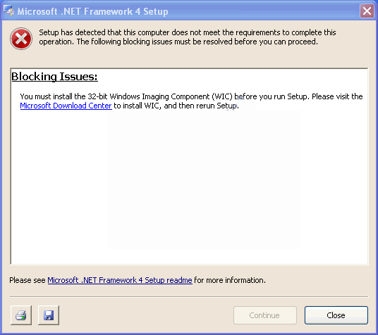
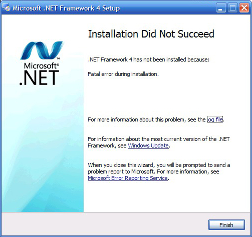

I.  Download phần mềm

<!-- -->

1.  Cài đặt online

-   dot NET Framework 3.5:
    <http://www.microsoft.com/en-us/download/details.aspx?id=21>

-   dot NET Framework 3.5 Service Pack 1:
    <http://www.microsoft.com/en-us/download/details.aspx?id=22>

-   dot NET Framework 4.0 (Web Installer):
    <http://www.microsoft.com/en-us/download/details.aspx?id=17851>

-   dot NET Framework 4.5:
    <http://www.microsoft.com/en-us/download/details.aspx?id=30653>

1.  Cài đặt offilline:

-   3.5:
    <http://download.microsoft.com/download/6/0/f/60fc5854-3cb8-4892-b6db-bd4f42510f28/dotnetfx35.exe>
    (197 MB)

-   4.0:
    <http://download.microsoft.com/download/9/5/A/95A9616B-7A37-4AF6-BC36-D6EA96C8DAAE/dotNetFx40_Full_x86_x64.exe>
    (48.1 MB)

-   4.5:
    <http://113.171.224.5/msupdate/D%2F0%2FF%2FD0F564A3-6734-470B-9772-AC38B3B6D8C2%2FdotNetFx45_Full_x86_x64.exe?ivit=3994&original=download.microsoft.com/download/D/0/F/D0F564A3-6734-470B-9772-AC38B3B6D8C2/dotNetFx45_Full_x86_x64.exe>
    (66.8 MB)

I.  các lỗi thường gặp:

<!-- -->

1.  thiếu Windows Imaging Component

Hình ảnh lỗi:
{width="5.583333333333333in"
height="4.958333333333333in"}

Cách sửa lỗi: download Windows Imaging Component và cài đặt

link download:
<http://www.microsoft.com/en-us/download/details.aspx?id=32>

1.  Lỗi Installation did not succeed

hình ảnh lỗi:
{width="5.239583333333333in"
height="4.9375in"}

cách fix lỗi: Download Microsoft Fixit và cài đặt

link download:
<http://download.microsoft.com/download/9/1/3/913B0797-F3A4-4135-9CF8-E6FD548E3CD8/MicrosoftFixit50123.msi>

1.  chưa được cài đặt Windows Installer 3.1 ( đối với windows SP2)

cách fix lỗi: download và cài đặt Windows Installer 3.1

link download:
<http://www.microsoft.com/downloads/details.aspx?familyid=889482FC-5F56-4A38-B838-DE776FD4138C&displaylang=en>
