Hướng dẫn cài đặt chương trình Fast Accounting 11 {#hướng-dẫn-cài-đặt-chương-trình-fast-accounting-11 .Title1}
=================================================

Nội dung

[1.1 Chuẩn bị cài đặt 2](#chuẩn-bị-cài-đặt)

[1.1.1 Lựa chọn hình thức cài đặt 2](#lựa-chọn-hình-thức-cài-đặt)

[1.1.2 Cấu hình đối với máy tính 2](#cấu-hình-đối-với-máy-tính)

[1.1.3 Đối với các chương trình antivirus
5](#đối-với-các-chương-trình-antivirus)

[1.2 Hướng dẫn cài đặt trên 1 máy đơn lẻ
5](#hướng-dẫn-cài-đặt-trên-1-máy-đơn-lẻ)

[1.2.1 Cài đặt chương trình 5](#cài-đặt-chương-trình)

[1.2.2 Chạy chương trình và kích hoạt bản quyền Fast Accounting 11
14](#chạy-chương-trình-và-kích-hoạt-bản-quyền-fast-accounting-11)

[1.3 Hướng dẫn cài đặt trên mạng nội bộ (mạng LAN) với máy chủ dùng
chung – máy trạm
16](#hướng-dẫn-cài-đặt-trên-mạng-nội-bộ-mạng-lan-với-máy-chủ-dùng-chung-máy-trạm)

[1.3.1 Cài đặt máy chủ 16](#cài-đặt-máy-chủ)

[1.3.2 Cài đặt máy trạm 24](#cài-đặt-máy-trạm)

[1.3.3 Chạy chương trình Fast Accounting 11 trên máy trạm
32](#chạy-chương-trình-fast-accounting-11-trên-máy-trạm)

[1.4 Cài đặt khi đã cài Fast Accounting 11 trước đó
34](#cài-đặt-khi-đã-cài-fast-accounting-11-trước-đó)

[1.4.1 Chuẩn bị 34](#chuẩn-bị)

[1.4.2 Cài đặt 34](#cài-đặt)

1.  Chuẩn bị cài đặt
    ----------------

    1.  ### Lựa chọn hình thức cài đặt

Fast Accounting có 2 hình thức lựa chọn:

*Máy đơn lẻ*: Với hình thức này, máy tính của người sử dụng sẽ đóng vai
trò vừa là máy chủ, vừa là máy trạm khi sử dụng Fast Accounting 11. Bắt
buộc phải chọn kiểu cài đặt này nếu Công ty của người sử dụng chỉ có một
máy tính làm kế toán.

*Cài đặt cho nhiều người sử dụng chung:* Hình thức cài đặt này áp dụng
đối với doanh nghiệp có nhiều người sử dụng từ nhiều máy trong mạng máy
tính nội bộ hoặc có máy kết nối từ xa. Khi này cơ sở dữ liệu (CSDL) sẽ
được cài trên 1 máy và các chương trình được cài trên các máy trạm. Máy
chứa csdl có thể là 1 máy chủ riêng biệt (Server) hoặc là một máy làm
việc bình thường (khi này máy này vừa chứa CSDL vừa chứa chương trình
như các máy trạm làm việc khác.)

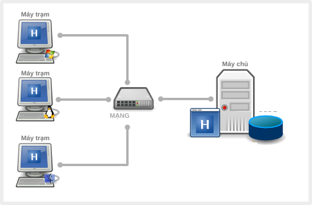

### Cấu hình đối với máy tính

  --------------------------- --------------- ------------ ----------------- ---------
  >                           **Tối Thiểu**   **Win XP**   **Win7/ Vista**

  > **Bộ vi xử lý (CPU)**     > 1.4Ghz        > 1.6Ghz     > 3Ghz

  > **Bộ nhớ Ram**            > 512MB         > 512MB      > 1GB

  > **Đĩa cứng**              

  **Hình thức**               > Máy đơn lẻ    > 192MB      > 192MB
                                                           
  **cài đặt**                                              

                              > Máy chủ       > 150MB      > 150MB

                              > Máy trạm      > 42MB       > 42MB

  **Độ phân giải màn hình**   > 1024 x 768
  --------------------------- --------------- ------------ ----------------- ---------

**Kiểm tra:** Trước khi tiến hành cài đặt, người sử dụng cần kiểm tra
cấu hình máy tính của mình có đáp ứng yêu cầu về hệ thống hay không.

**Sau đây là cách kiểm tra một số yêu cầu cần thiết:**

-   Kiểm tra hệ điều hành và máy tính: Nhấn chuột phải vào biểu tượng
    **My Computer** trên màn hình Desktop, chọn Properties. Trên
    thẻ System. Xem bộ nhớ Ram có đáp ứng được hay không. Bộ vi xử
    lý (Processor) có thoả mãn yêu cầu hay không.

**Windows 7/Vista**

> 

**Windows XP**

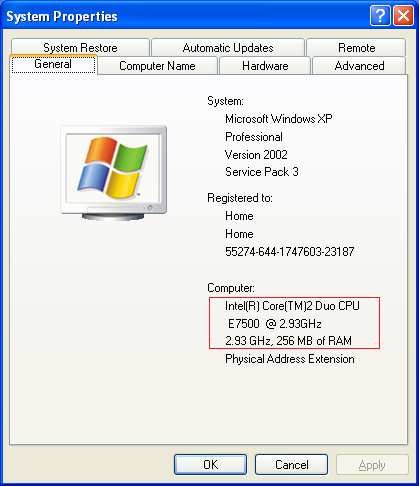

-   Kiểm tra dung lượng ổ đĩa: Nhấp chuột phải vào ổ đĩa bạn cài đặt,
    xem dung lượng ổ đĩa của bạn có đủ hay không

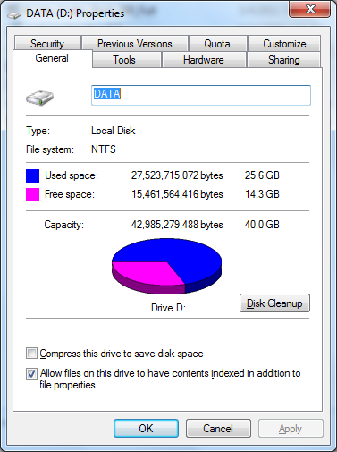

1.  ### Đối với các chương trình antivirus

    Khuyến cáo nên tắt các chương trình antivirus trước khi tiến hành
    cài đặt chương trình.

    Nếu không hãy chọn &lt;&lt;**chấp nhận&gt;&gt;**,
    **&lt;&lt;có&gt;&gt;** hoặc **&lt;&lt;allow&gt;&gt;** khi xuất hiện
    cảnh báo trong quá trình cài đặt.

Hướng dẫn cài đặt trên 1 máy đơn lẻ
-----------------------------------

-   Với hình thức này, máy tính của người sử dụng sẽ đóng vai trò vừa là
    máy chủ, vừa là máy trạm khi sử dụng Fast Accounting 11.

-   Bắt buộc phải chọn kiểu cài đặt này nếu doanh nghiệp của người sử
    dụng chỉ có một máy tính làm kế toán.

    1.  ### Cài đặt chương trình

1.  Chạy chương trình cài đặt:

-   Kích đúp vào file cài đặt (Từ đĩa cài đặt hoặc thư mục có chứa bộ
    cài đặt chương trình khi đã giải nén).

-   Nếu máy dùng hệ điều hành Window 7/Vista thì nhấn chuột phải chọn
    “Run as administrator”.

> 

-   Nếu máy hiện lên cảnh báo, nhấn **&lt;&lt;Yes&gt;&gt;**.

> 

-   Chương trình giải nén file cài đặt và bắt đầu chạy file cài đặt

Chạy file cài đặt

1.  Chương trình sẽ hiện màn hình thông báo cài đặt chương trình. Nhấn
    > **&lt;&lt;Tiếp tục&gt;&gt;** để tiếp tục cài đặt chương trình.

1.  Khi xuất hiện màn hình **Thoả thuận bản quyền**, xin hãy đọc kỹ các
    > yêu cầu đối với người sử dụng.

-   Chọn ‘Tôi chấp nhận các điều khoản trong thỏa thuận bản quyền’.

-   Nhấn **&lt;&lt;Tiếp tục&gt;&gt;.**

1.  Hiện ra màn hình nhập thông tin khách hàng

-   Nhập vào tên thông tin người sử dụng và tên tổ chức (công ty)

-   Nhấn vào nút **&lt;&lt;Tiếp tục&gt;&gt;** để tiếp tục cài đặt chương
    trình

1.  Chọn thư mục cài đặt chương trình:

-   Chương trình mặc định thư mục cài đặt là: D:\\Fast\\Fast Accounting,
    người sử dụng có thể thay đổi đường dẫn thư mục cài đặt, bằng cách
    nhấn vào nút **&lt;&lt;Thay đổi&gt;&gt;…** chọn thư mục cần cài đặt
    chương trình.

-   Nhấn **&lt;&lt;Đồng ý&gt;&gt;** khi chọn xong thư mục cài đặt.

-   Nhấn **&lt;&lt;Tiếp Tục&gt;&gt;** để tiếp tục cài đặt.

1.  Tùy chọn hình thức cài đặt:

1.  Xác nhận lại thông tin cài đặt:

-   Sau khi đã chọn thư mục cài đặt, chương trình hiện ra màn hình để
    xác nhận thông tin cài đặt ban đầu.

-   Nếu cảm thấy không chắc chắn các thông tin đã chọn thì nhấn
    **&lt;&lt;Quay lại&gt;&gt;** để xem và chọn lại.

-   Nếu đã chắc chắn rồi thì chọn **&lt;&lt;Cài đặt&gt;&gt;** để
    cài đặt.

-   Nếu không muốn tiếp tục cài đặt thì chọn **&lt;&lt;Hủy&gt;&gt;**.

1.  Tiến trình cài đặt chương trình

-   Tiến trình cài đặt này thực hiện tự động, không nên làm việc khác
    trên máy tính cho tới khi chương trình thông báo hoàn thành**.**

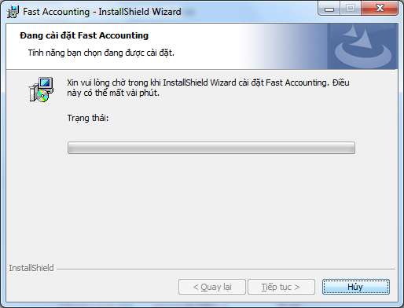

-   Chương trình sẽ kiểm tra nếu máy chưa có “.NET Framework 3.5 SP1“
    thì sẽ tiến hành cài đặt “.NET Framework 3.5 SP1” (Quá trình này chỉ
    diễn ra đối với Windows XP).

-   Chương trình sẽ tiến hành kiểm tra và cài đặt “SQL SERVER 2008 R2
    EXPRESS” với tên máy chủ FASTACCOUNTING.

-   Sau khi cài đặt xong “SQL SERVER 2008 R2 EXPRESS”, chương trình sẽ
    bắt đầu cài đặt Fast Accounting 11.

-   Chương trình Fast Accounting 11 khi được cài đặt xong sẽ xuất hiện
    màn hình kết thúc cài đặt:

-   Nhấn **&lt;&lt;Hoàn thành&gt;&gt;** để kết thúc cài đặt.

-   Lúc đó chương trình sẽ tự động tạo biểu tượng Fast Accounting 11
    > trên Desktop.

### Chạy chương trình và kích hoạt bản quyền Fast Accounting 11

1.  Chạy chương trình

-   Trên màn hình Desktop, kích đúp chuột trái vào biểu tượng Fast
    Accounting 11. Chương trình hiện màn hình đăng nhập vào chương
    trình:

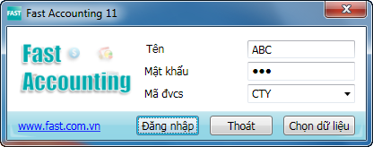

-   Người sử dụng đăng nhập vào chương trình với tên đăng nhập là ABC,
    mật khẩu là 123

Nếu lần đầu chạy chương trình, chương trình sẽ chỉ là bản dùng thử trong
30 ngày, người sử dụng cần phải kích hoạt chương trình để có thể sử dụng
FA11 hoàn chỉnh.

1.  Kích hoạt chương trình:

-   Để kích hoạt bản quyền sử dụng vào mục Trợ giúp/ Đăng ký bản quyền
    sử dụng

> 

-   Chương trình hiện ra màn hình đăng ký bản quyền sản phẩm. Tại dòng
    “Tệp kích hoạt” chọn đường dẫn chứa tệp có tên là fast.lc (tệp này
    sẽ được gởi qua email khi bạn đã mua bản quyền Fast Accounting 11).

-   Chọn **&lt;&lt;Nhận&gt;&gt;** để kích hoạt bản quyền. Nếu kích hoạt
    thành công chương trình sẽ hiện thông báo.

-   Sau khi kích hoạt thành công thì đóng chương trình và chạy lại.

    1.  Hướng dẫn cài đặt trên mạng nội bộ (mạng LAN) với máy chủ dùng chung – máy trạm
        -------------------------------------------------------------------------------

Hình thức cài đặt này sử dụng trong trường hợp doanh nghiệp sử dụng môi
trường mạng, hệ thống gồm 01 máy chủ chỉ có chức năng chứa dữ liệu chung
cho cả hệ thống và nhiều máy trạm kết nối vào máy chủ để cùng làm việc
cộng tác và chia sẻ dữ liệu.

*Lưu ý, trong trường hợp “tiết kiệm” thì trên máy chủ chứa csdl dùng
chung vẫn có thể cài cả chương trình để làm việc như là một máy trạm
bình thường. Tuy nhiên, trong trường hợp này tốc độ làm việc sẽ chậm do
máy phải làm 1 lúc 2 công việc: vừa là 1 máy trạm làm việc bình thường,
vừa là máy chủ để dùng chung. Thông thường, trong trường hợp máy chủ cài
hệ điều hành window bình thường (WinXP/Vista/7) và vì vậy cũng ảnh hưởng
đến tốc độ làm việc do nó không phải là hệ điều hành chuyên dùng để quản
trị nhiều người sử dụng.*

### Cài đặt máy chủ

1.  Chạy chương trình cài đặt:

-   Kích đúp vào file cài đặt (Từ đĩa cài đặt hoặc thư mục có chứa bộ
    cài đặt chương trình khi đã giải nén)

> 

-   Nếu máy dùng hệ điều hành Window 7/Vista thì nhấn chuột phải chọn
    “Run as administrator”.

> 

Nếu máy hiện lên cảnh báo, nhấn **&lt;&lt;Yes&gt;&gt;**.

> 

1.  Chương trình giải nén file cài đặt và chạy file cài đặt

1.  Chương trình chạy file cài đặt.

1.  Chương trình sẽ hiện màn hình thông báo cài đặt chương trình.

2.  Nhấn **&lt;&lt;Tiếp tục&gt;&gt;** để tiếp tục cài đặt chương trình.

1.  Khi xuất hiện màn hình **Thoả thuận bản quyền**, xin hãy đọc kỹ các
    > yêu cầu đối với người sử dụng.

2.  Chọn ‘Tôi chấp nhận các điều khoản trong thỏa thuận bản quyền’.

3.  Nhấn **&lt;&lt;Tiếp tục&gt;&gt;.**

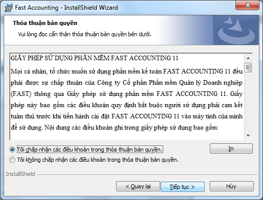

1.  Hiện ra màn hình nhập thông tin khách hàng:

2.  Nhập vào tên thông tin người sử dụng và tên tổ chức (công ty)

3.  Nhấn vào nút **&lt;&lt;Tiếp tục&gt;&gt;** để tiếp tục cài đặt chương
    > trình

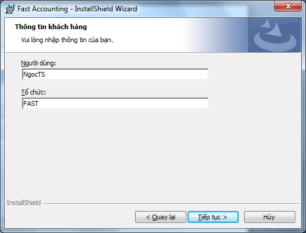

1.  Chọn thư mục cài đặt chương trình:

2.  Chương trình mặc định thư mục cài đặt là: D:\\Fast\\Fast Accounting,
    > người sử dụng có thể thay đổi đường dẫn thư mục cài đặt, bằng cách
    > nhấn vào nút **&lt;&lt;Thay đổi&gt;&gt;…** chọn thư mục cần cài
    > đặt chương trình.

-   Nhấn **&lt;&lt;Đồng ý&gt;&gt;** khi chọn xong thư mục cài đặt.

-   Nhấn **&lt;&lt;Tiếp Tục&gt;&gt;** để tiếp tục cài đặt.

1.  Tùy chọn hình thức cài đặt.

2.  Check chọn dòng “Cài đặt cho nhiều máy dùng chung” và “Cài đặt bộ số
    > liệu”

3.  Nhấn **&lt;&lt;Tiếp tục&gt;**&gt; tiếp tục cài đặt bộ số liệu cho
    > máy chủ

1.  Xác nhận lại thông tin cài đặt:

-   Sau khi đã chọn thư mục cài đặt, chương trình hiện ra màn hình để
    xác nhận thông tin cài đặt ban đầu.

-   Nếu cảm thấy không chắc chắn các thông tin đã chọn thì nhấn
    **&lt;&lt;Quay lại&gt;&gt;** để xem và chọn lại.

-   Nếu đã chắc chắn rồi thì chọn **&lt;&lt;Cài đặt&gt;&gt;** để
    cài đặt.

-   Nếu không muốn tiếp tục cài đặt thì chọn **&lt;&lt;Hủy&gt;&gt;**.

1.  Tiến trình cài đặt chương trình

-   ***Tiến trình cài đặt này thực hiện tự động, không nên làm việc khác
    trên máy tính cho tới khi chương trình thông báo hoàn thành.***

-   Chương trình sẽ kiểm tra nếu máy chưa có “.NET Framework 3.5 SP1“
    thì sẽ tiến hành cài đặt “.NET Framework 3.5 SP1” (Quá trình này chỉ
    diễn ra đối với Windows XP).

-   Chương trình sẽ tiến hành kiểm tra và cài đặt “SQL SERVER 2008 R2
    EXPRESS” với tên máy chủ FASTACCOUNTING.

-   Sau khi cài đặt xong “SQL SERVER 2008 R2 EXPRESS”, chương trình sẽ
    bắt đầu cài đặt bộ số liệu lên máy.

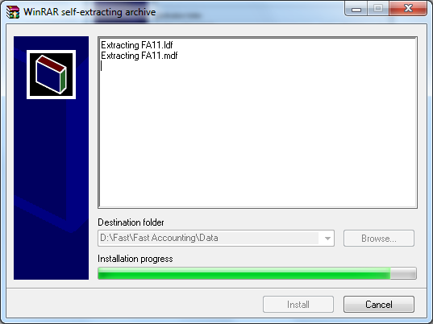

-   Nếu bộ số liệu của bạn bị trùng tên, chương trình sẽ hiện lên thông
    báo yêu cầu đặt lại tên cho bộ số liệu.

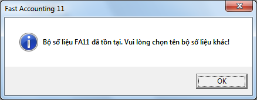

-   Nhấn **&lt;&lt;Ok&gt;&gt;** để nhập tên bộ số liệu mới.

-   Nhấn **&lt;&lt;Nhận&gt;&gt;**. Được màn hình đen, đợi cho tới khi
    kết thúc.

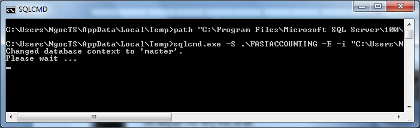

-   Chương trình Fast Accounting 11 khi được cài đặt xong sẽ xuất hiện
    màn hình kết thúc cài đặt.

-   Nhấn **&lt;&lt;Hoàn thành&gt;&gt;** để kết thúc cài đặt.

Hoàn thành quá trình cài đặt bộ số liệu lên máy chủ .

### Cài đặt máy trạm

1.  Chạy chương trình cài đặt:

-   Kích đúp vào file cài đặt (Từ đĩa cài đặt hoặc thư mục có chứa bộ
    cài đặt chương trình khi đã giải nén).

-   Nếu máy dùng hệ điều hành Window 7/Vista thì nhấn chuột phải chọn
    “Run as administrator”.

-   Nếu máy hiện lên cảnh báo, nhấn **&lt;&lt;Yes&gt;&gt;**.

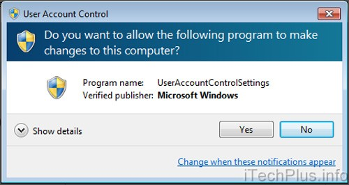

-   Chương trình giải nén file cài đặt.

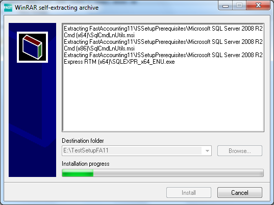

-   Chương trình bắt đầu chạy file cài đặt.

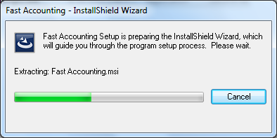

1.  Chương trình sẽ hiện màn hình thông báo cài đặt chương trình.

-   Nhấn **&lt;&lt;Tiếp tục&gt;&gt;** để tiếp tục cài đặt chương trình.

1.  Khi xuất hiện màn hình **Thoả thuận bản quyền**, xin hãy đọc kỹ các
    > yêu cầu đối với người sử dụng.

-   Chọn ‘**Tôi chấp nhận các điều khoản trong thỏa thuận bản quyền’.**

-   Nhấn **&lt;&lt;Tiếp tục&gt;&gt;.**

1.  Xuất hiện màn hình nhập thông tin khách hàng:

-   Nhập vào tên thông tin người sử dụng và tên tổ chức (công ty)

-   Nhấn vào nút **&lt;&lt;Tiếp tục&gt;&gt;** để tiếp tục cài đặt chương
    trình

1.  Chọn thư mục cài đặt chương trình:

Nhấn **&lt;&lt;Đồng ý&gt;&gt;** khi chọn xong thư mục cài đặt.

Nhấn **&lt;&lt;Tiếp Tục&gt;&gt;** để tiếp tục cài đặt.

1.  Tùy chọn hình thức cài đặt.

-   Chương trình mặc định thư mục cài đặt là: D:\\Fast\\Fast Accounting,
    người sử dụng có thể thay đổi đường dẫn thư mục cài đặt, bằng cách
    nhấn vào nút **&lt;&lt;Thay đổi&gt;&gt;…** chọn thư mục cần cài đặt
    chương trình.

-   Check chọn vào dòng “Cài đặt cho nhiều máy dùng chung” và “Cài đặt
    chương trình cho máy trạm”

1.  Xác nhận lại thông tin cài đặt:

-   Sau khi đã chọn thư mục cài đặt, chương trình hiện ra màn hình để
    xác nhận thông tin cài đặt ban đầu.

-   Nếu cảm thấy không chắc chắn các thông tin đã chọn thì nhấn
    **&lt;&lt;Quay lại&gt;&gt;** để xem và chọn lại.

-   Nếu đã chắc chắn rồi thì chọn **&lt;&lt;Cài đặt&gt;&gt;** để
    cài đặt.

-   Nếu không muốn tiếp tục cài đặt thì chọn **&lt;&lt;Hủy&gt;&gt;**.

1.  Tiến trình cài đặt chương trình:

-   ***Tiến trình cài đặt này thực hiện tự động, không nên làm việc khác
    trên máy tính cho tới khi chương trình thông báo hoàn thành.***

-   Chương trình sẽ kiểm tra nếu máy chưa có “.NET Framework 3.5 SP1“
    thì sẽ tiến hành cài đặt “.NET Framework 3.5 SP1” (Quá trình này chỉ
    diễn ra đối với Windows XP).

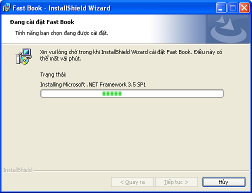

-   Chương trình sẽ bắt đầu cài đặt Fast Accounting 11.

-   Chương trình Fast Accounting 11 khi được cài đặt xong sẽ xuất hiện
    màn hình kết thúc cài đặt.

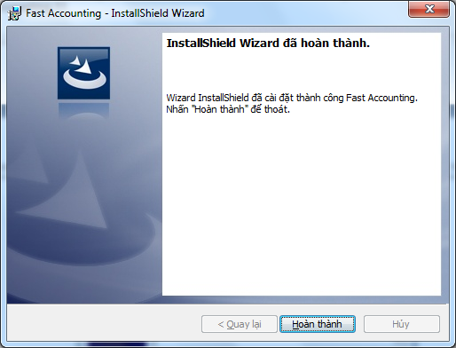

-   Nhấn **&lt;&lt;Hoàn thành&gt;&gt;** để kết thúc cài đặt.

-   Lúc đó chương trình sẽ tự động tạo biểu tượng Fast Accounting 11
    trên Desktop.

1.  Khai báo thông tin kết nối với máy chủ sẵn có:

-   Sau khi cài đặt xong, chạy chương trình Fast Accounting 11 (kích đúp
    vào biểu tượng Fast Accounting 11 trên màn hình Desktop).

-   Nhấn **&lt;&lt;Chọn dữ liệu&gt;&gt;** để kết nối tới máy chủ.

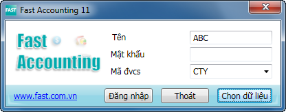

-   Hiện ra màn hình danh sách dữ liệu database:

-   Tên máy chủ mặc định sau khi cài đặt xong là ”.\\FASTACCOUNTING”.
    Nhấn **&lt;&lt;Sửa&gt;&gt;** để đổi lại thông tin kết nối.

    -   Máy chủ SQL: Lấy tên máy chủ của công ty bạn (Mặc
        định là ”.\\FASTACCOUNTING”. Ví dụ: tên máy chủ của đơn vị tôi
        là ”172.168.1.230\\FASTACCOUNTING”.

    -   Bộ số liệu : tên bộ số liệu cần làm việc (Mặc định là FA11).

    -   Tên đăng nhập : là tên đăng nhập vào bộ số liệu đã chọn ở trên
        (Mặc định là fa11).

    -   Mật khẩu: là mật khẩu đăng nhập vào bộ số liệu đã chọn ở trên
        (Mặc định là fa11).

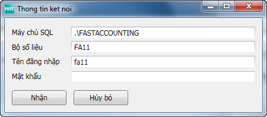

-   Sau đó nhấn **&lt;&lt;Nhận&gt;&gt;**.

-   Nhấn **&lt;&lt;Chọn&gt;&gt;** để quay lại màn hình đăng nhập.

Hoàn thành quá trình cài đặt chương trình Fast Accounting 11 cho máy
trạm.

### Chạy chương trình Fast Accounting 11 trên máy trạm

1.  Đăng nhập vào chương trình.

-   Trên màn hình Desktop, kích đúp chuột trái vào biểu tượng Fast
    Accounting 11 .

-   Người sử dụng đăng nhập vào chương trình với tên đăng nhập là ABC,
    mật khẩu là 123.

Nếu lần đầu chạy chương trình, chương trình sẽ chỉ là bản dùng thử trong
30 ngày, người sử dụng cần phải kích hoạt chương trình để có thể sử dụng
FA11 hoàn chỉnh.

1.  Kích hoạt chương trình:

-   Để kích hoạt bản quyền vào mục Trợ giúp/ Đăng ký bản quyền sử dụng”.

> 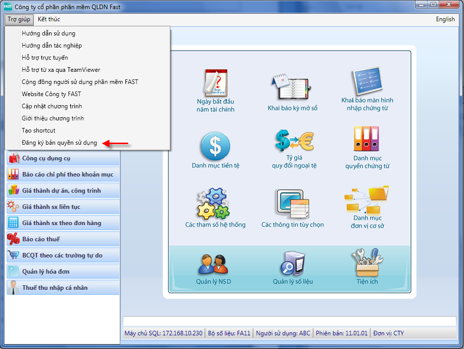

-   Chương trình hiện ra màn hình đăng ký bản quyền sản phẩm. Tại dòng
    “Tệp kích hoạt” chọn đường dẫn chứa tệp có tên là fast.lc (tệp này
    sẽ được gởi qua email khi bạn đã mua bản quyền Fast Accounting 11).

-   Chọn **&lt;&lt;Nhận&gt;&gt;** để kích hoạt bản quyền. Nếu kích hoạt
    thành công chương trình sẽ hiện thông báo.

-   Sau khi kích hoạt thành công thì đóng chương trình và chạy lại.

    1.  Cài đặt khi đã cài Fast Accounting 11 trước đó
        ----------------------------------------------

        1.  ### Chuẩn bị

-   Tắt hết chương trình Fast Accounting 11 đang sử dụng trên máy
    của bạn. Thoát hẳn Fast Accounting: nhấn chuột phải vào biểu tượng
    của Fast Accounting 11 phía bên phải thanh taskbar chọn
    **&lt;&lt;Exit&gt;&gt;**.

> ***Win 7/ Vista:***

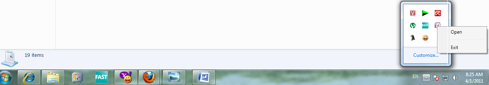

> ***Win XP:***

### Cài đặt

1.  Chạy file Setup.exe (xem hướng dẫn cài đặt cho máy mới).

1.  Nhấn **&lt;&lt;Tiếp tục&gt;&gt;** để thực hiện cài đặt.

1.  Hiện màn hình bảo trì chương trình :

-   Các hình thức bảo trì

    -   Thay đổi: chỉnh sửa hình thức cài đặt chương trình đã được cài
        đặt (VD: máy tính đã cài đặt là máy chủ muốn chuyển thành
        máy trạm).

    -   Sửa chữa: sửa chữa lỗi cài đặt trong chương trình. Tùy chọn này
        sửa chữa tập tin bị mất hoặc bị hỏng, các phím tắt, và các mục
        đăng ký.

    -   Xoá: gỡ bỏ chương trình Fast Accounting 11 khỏi máy của bạn.

-   Màn hình bảo trì chương trình nếu chọn **&lt;&lt;Thay đổi&gt;&gt;**:

    -   Chương trình sẽ hiện lên màn hình **Tùy chọn hình thức cài đặt**
        để bạn chọn lại (Xem Tùy chọn hình thức cài đặt trong cài đặt
        cho máy mới).

        

    -   Lựa chọn hình thức cài đặt (các hình thức cài đặt mục 1.2
        và 1.3) và nhấn vào **&lt;&lt;Tiếp tục&gt;&gt;** để tiếp tục
        việc cài đặt chương trình

-   Nhấn **&lt;&lt;Cài đặt&gt;&gt;**, chương trình tiến hành cài đặt.

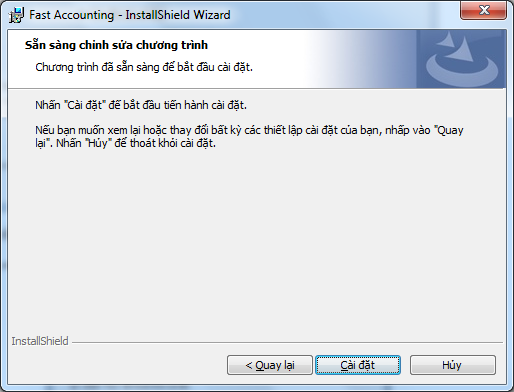

-   Màn hình hiện lên thông báo, nhấn chọn **&lt;&lt;Yes to
    all&gt;&gt;** để chương trình thay thế file cài đặt.

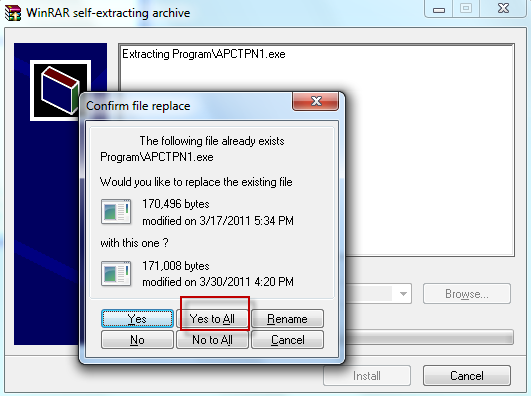

-   Nếu máy chủ ”.\\FASTACCOUNTING” chưa có thì chương trình sẽ yêu cầu
    người dùng chọn máy chủ khác để cài đặt bộ số liệu.

-   Nhập vào ”Tên máy chủ” và nhấn **&lt;&lt;Kết nối&gt;&gt;**”. Chương
    trình sẽ tự động tìm máy chủ. Nếu kết nối được chương trình sẽ tiếp
    tục cài đặt, ngược lại chương trình sẽ yêu cầu bạn nhập lại tên máy
    chủ khác.

> **Chú ý:** Nhấn **&lt;&lt;Hủy&gt;&gt;:** Chương trình sẽ dừng việc cài
> đặt bộ số liệu.

-   Nếu bộ số liệu của bạn bị trùng tên, chương trình sẽ hiện lên thông
    báo yêu cầu đặt lại tên cho bộ số liệu.

-   Nhấn **&lt;&lt;Ok&gt;&gt;** để nhập tên bộ số liệu mới.

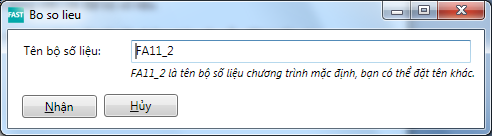

-   Nhấn **&lt;&lt;Nhận&gt;&gt;**.

-   Nhấn **&lt;&lt;Hoàn thành&gt;&gt;**.

<!-- -->

-   Màn hình bảo trì chương trình nếu chọn **&lt;&lt;Sửa chữa&gt;&gt;**:

    -   Check chọn **&lt;&lt;Sửa chửa&gt;&gt;**

    -   Nhấn **&lt;&lt;Tiếp tục&gt;&gt;**

> 

-   Nhấn **&lt;&lt;Cài đặt&gt;&gt;** để bắt đầu tiến hành cài đặt

-   Màn hình hiện lên thông báo, nhấn chọn **&lt;&lt;Yes to
    all&gt;&gt;** để chương trình thay thế file cài đặt.

-   Nếu máy chủ ”.\\FASTACCOUNTING” chưa có thì chương trình sẽ yêu cầu
    người dùng chọn máy chủ khác để cài đặt bộ số liệu.

-   Nhập vào ”Tên máy chủ” và nhấn **&lt;&lt;Kết nối&gt;&gt;**”. Chương
    trình sẽ tự động tìm máy chủ. Nếu kết nối được chương trình sẽ tiếp
    tục cài đặt, ngược lại chương trình sẽ yêu cầu bạn nhập lại tên máy
    chủ khác.

> **Chú ý:** Nhấn **&lt;&lt;Hủy&gt;&gt;:** Chương trình sẽ dừng việc cài
> đặt bộ số liệu.

-   Nếu bộ số liệu của bạn bị trùng tên, chương trình sẽ hiện lên thông
    báo yêu cầu đặt lại tên cho bộ số liệu.

-   Nhấn **&lt;&lt;Ok&gt;&gt;** để nhập tên bộ số liệu mới.

-   Nhấn **&lt;&lt;Nhận&gt;&gt;**.

-   Nhấn **&lt;&lt;Hoàn thành&gt;&gt;**.để hoàn thành cài đặt chương
    trình

<!-- -->

-   Màn hình bảo trì chương trình nếu chọn **&lt;&lt;Xóa&gt;&gt;**

    -   Check chọn vào **&lt;&lt;Xóa&gt;&gt;**

    -   Nhấn **&lt;Tiếp tục&gt;&gt;**

        

    -   Chương trình sẽ gỡ bỏ Fast Accounting 11 khỏi máy của bạn. Nhấn
        vào nút **&lt;&lt;Xóa&gt;&gt;**

-   Nhấn **&lt;&lt;Hoàn thành&gt;&gt;**.

