**AVAST! - CHƯƠNG TRÌNH DIỆT VI RÚT**

**Short Description: **

**avast!** là một chương trình diệt vi rút với đầy đủ tính năng, giúp
phát hiện, tiêu diệt các loại vi rút cũng như các phần mềm độc hại khỏi
mảy tính của bạn. Mặc dù phiên bản **avast!**được cung cấp miễn phí cho
các mục đích sử dụng phi thương mại trên các máy tính tại gia, bạn
vẫn **phải** đăng ký bản dùng miễn phí này sau khi cài đặt, nếu không
chương trình sẽ hết hạn sử dụng sau 30 ngày. Việc đăng ký cũng giúp đảm
bảo rằng chương trình của bạn sẽ tự động cập nhật phiên bản **avast** và
cơ sở dữ liệu virút mới nhất ngay khi chúng được công bố.

**Online Installation Instructions: **

**Cài đặt Avast!**

-   *Xem phần **giới thiệu tóm tắt** [***Hướng dẫn Thực
    hành***](https://securityinabox.org/vi/handsonguides) \[1\]*

-   ***Nhấn chuột** vào biểu tượng **avast!** bên dưới để truy cập trang
    tải tệp từ **www.avast.com***

-   ***Nhấn** nút 'Download' trong phần 'Free Antivirus', và **nhấn
    chọn** 'Download Now' trong trang vừa xuất hiện*

-   ***Chọn** 'Save File' để lưu tệp 'setup\_av\_free.exe' về máy tính
    của bạn, sau đó **nhấn đúp chuột** vào tệp 'setup\_av\_free.exe' để
    khởi động chương trình cài đặt.*

-   *Tham khảo mục **2.0 Hướng dẫn Cài đặt và Đăng ký avast!** trước khi
    tiếp tục*

-   *Sau khi cài đặt thành công **avast!** bạn có thể xóa tệp cài đặt
    vừa tải về khỏi máy tính*

**avast!**:

 \[2\]

**Trang chủ:**

[***www.avast.com***](http://www.avast.com/) \[3\]

**Yêu cầu cấu hình máy tính**:

-   Mọi Phiên bản Windows

**Phiên bản dùng trong tài liệu này**:

-   5.0

**Bản quyền**:

-   Phần mềm miễn phí

**Yêu cầu Đọc thêm**:

-   **Sách Hướng dẫn** chương [***1. Bảo vệ máy tính của bạn khỏi Virút,
    Phần mềm gián điệp và Tin
    tặc***](https://securityinabox.org/vi/ch%C6%B0%C6%A1ng-1) \[4\]

**Mức độ**: 1: Bắt đầu, **2: Trung bình**, 3: Khá, 4: Có kinh nghiệm, 5:
Nâng cao

**Thời gian cần thiết để tìm hiểu**: 20 phút

**Những điều bạn sẽ đạt được**:

-   Khả năng quét tìm và tiêu diệt vi rút trên máy tính cá nhân

-   Khả năng bảo vệ hệ thống khỏi những loại lây nhiễm vi rút mới

-   Khả năng cập nhật chương trình và cơ sở dữ liệu vi rút mới từ
    Internet

**GNU Linux, Mac OS và các Chương trình có Tính năng Tương tự trên
Windows**:

Mặc dù **Bản miễn phí avast! Antivirus** được chúng tôi giới thiệu ở
đây, có nhiều các chương trình diệt virút miễn phí hoạt động trên môi
trường **Microsoft Windows** cũng đáng được giới thiệu:

-   [***Avira AntiVir Personal
    Edition***](http://www.free-av.com/) \[5\] và

-   [***AVG Anti-Virus***](http://free.avg.com/) \[6\].

Hơn nữa, nếu bạn khả năng mua bản quyền phiên bản thương mại của chương
trình diệt vi rút cho hệ điều hành **Microsoft Windows**, đó sẽ là giải
pháp bảo vệ máy tính hoàn thiện hơn.

Cho dù các hệ điều hành như **GNU Linux** và **Mac OS** được xem là an
toàn với virút, việc cài đặt chương trình bảo vệ chống phần mềm độc hại
là cần thiết. Thứ nhất, vi rút máy tính có thể được tạo ra cho các hệ
điều hành này, và thứ hai là bạn có thể làm trung gian lây lan vi rút
một cách vô tình, ngay cả khi hệ thống của bạn có thể không bị ảnh
hưởng.

Ở thời điểm hiện tại, thật không may là chưa có chương trình diệt
virút *miễn phí* dành cho **Linux** và **Mac OS** nào thực sự khiến
chúng tôi an tâm để giới thiệu. Tuy nhiên, trên thị trường có một số sản
phẩm *thương mại* cung cấp nhiều tính năng bảo vệ tốt; dưới đây là danh
sách những phần mềm phổ biến nhất trong số đó:

-   [***avast!***](http://www.avast.com/en-eu/mac-edition) \[7\],

-   [***Kaspersky***](http://www.kaspersky.co.uk/kaspersky-anti-virus-for-mac) \[8\],

-   [***Mcafee***](http://www.mcafee.com/us/small/products/virusscan_for_mac/virusscan_for_mac.html) \[9\],

-   [***Sophos***](http://www.sophos.com/products/enterprise/endpoint/security-and-control/) \[10\],
    và

-   [***Symantec***](http://www.symantec.com/norton/products) \[11\], và
    nhiều một số khác nữa.

Nếu bạn có thể, hãy mua và cài đặt một trong số đó.

**1.1 Những điều bạn cần biết trước khi bắt đầu**

Virút máy tính là những chương trình độc hại có khả năng phá hủy tệp,
làm chậm hệ thống và lây nhiễm tới các máy tính khác bằng cách sử dụng
danh sách liên lạc trên máy của bạn. **Avast!** là một chương trình diệt
vi rút với đầy đủ tính năng giúp bảo vệ máy tính của bạn khỏi các loại
vi rút có thể lây nhiễm do tải tệp từ Internet, các tài liệu đính kèm
thư điện tử hay truyền tệp từ các thiết bị lưu trữ di động (CDs, DVDs,
đĩa mềm, thẻ nhớ USB…).

-   Hãy đảm bảo rằng không có hai chương trình diệt vi rút được cài đặt
    trên máy tính của bạn và hoạt động đồng thời. Nuế bạn đang sử dụng
    một chương trình diệt vi rút nào khác và muốn chuyển qua
    dùng **avast!**, trước tiên bạn cần gỡ bỏ chương trình cũ sau đó
    tiến hành cài đặt **avast!**.

-   Các loại vi rút mới được tạo ra thường xuyên. Để có thể bảo vệ máy
    tính của bạn một cách hiệu quả, nhất thiết phải cập nhật thường
    xuyên cơ sở dữ liệu vi rút của Avast.

-   Có nhiều loại vi rút thông minh và xảo quyệt, một số có thể ngăn cản
    quá trình cài đặt **avast!**, và/hoặc lẩn tránh khỏi bị tìm thấy và
    tiêu diệt bởi **avast!**. Trong các tình huống này, những phương
    pháp nâng cao hơn cần được áp dụng, như được đề cập tại phần [***4.9
    Các Phương pháp Tiêu diệt Vi rút Nâng
    cao***](https://securityinabox.org/vi/avast_doiphovirut#4.9) \[12\]

**Offline Installation Instructions : **

**Cài đặt Avast!**

-   *Đọc phần giới thiệu tóm tắt [*Hướng dẫn Thực
    hành*](https://securityinabox.org/vi/handsonguides) \[1\]*

-   ***Nhấn chuột vào biểu tượng chương trình bên dưới** chọn 'Open'
    hoặc 'Run' để cài đặt chương trình. Nếu cần thiết, hãy lưu tệp cài
    đặt về máy tính, sau đó tìm đến thư mục vừa lưu tệp và nhấn đúp
    chuột vào tệp đó*

-   *Tham khảo 'Hướng dẫn cài đặt' ở phần tiếp theo trước khi tiếp tục*

-   *Nếu bạn lưu tệp cài đặt về máy tính, bạn có thể xóa tệp cài đặt này
    sau khi đã hoàn tất quá trình cài đặt*

**Avast!:** 
 \[13\]

**Hướng dẫn Cài đặt và Đăng ký avast!**

Các mục trong trang này:

-   [***2.0 Hướng dẫn Cài đặt
    avast!***](https://securityinabox.org/print/book/export/html/1214#2.0)

-   [***2.1 Hướng dẫn đăng ký
    avast!***](https://securityinabox.org/print/book/export/html/1214#2.1)

**2.0 Hướng dẫn cài đặt avast!**

Việc cài đặt **avast!** khá dễ dàng và nhanh chóng. Để bắt đầu quá trình
cài đặt **avast!**, hãy theo các bước sau:

**Bước 1**. **Nhấn đúp
chuột** vào 
; hộp thoại cảnh báo **Open File - Security
Warning** có thể xuất hiện. Nếu vậy, **hãy
chọn** 
, cửa sổ trạng thái tiến trình sẽ xuất hiện. Sau khi
gói chương trình **avast!** được giải nén, hộp thoại sau sẽ xuất hiện:

*Hình 1: Cửa sổ Cài đặt Antivirus Setup-avast! Miễn phí*

**Bước
2**. **Nhấn** 
 để mở hộp thoại sau:

*Hình 2: Cửa sổ Cài đặt avast!*

Trong quá trình cài đặt **avast!** bạn sẽ thấy xuất hiện hộp
thoại *avast! Installation* với chọn lựa *Participate in the avast!
Community* (*Tham gia cộng đồng sử dụng avast!*) được đánh dấu, chúng
tôi khuyên bạn nên hủy chọn lựa chọn này như trong *Hình 2* bên trên.

**Bước 3**. **Hủy chọn** hộp *Participate in the avast! Community* để
tắt lựa chọn này,
và **nhấn** 
, hộp thoại sau sẽ xuất hiện:

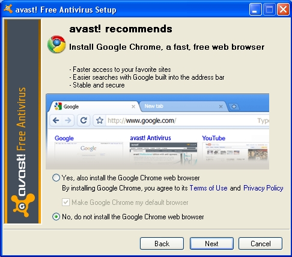

*Hình 3: Cửa sổ các gợi ý cài đặt của avast!*

Trong quá trình cài đặt **avast!** bạn sẽ thấy xuất hiện hộp
thoại *avast! recommends* với chọn lựa *Yes, also install the Google
Chrome web browser* (Cài đặt thêm trình duyệt Google Chrome) được đánh
dấu, chúng tôi khuyên bạn nên hủy chọn lựa chọn này như trong *Hình
3* bên trên.

**Bước 4**. **Nhấn chọn** *No, do not install the Google Chrome web
browser* và
nhấn 
 để tiếp tục quá trình cài đặt.

Một thông báo quá trình cài đặt hoàn tất sẽ xuất hiện.

**Bước
5**. **Nhấn** 
 để hoàn tất quá trình cài đặt. Sau vài giây, biểu
tượng **avast!** sẽ xuất hiện trên *Khay Hệ thống* như sau:

*Hình 4: Biểu tượng avast! xuất hiện trên Khay Hệ thống*

Tiếp đó, một thông báo xác nhận quá trình cài đặt thành
công **avast!** sẽ xuất hiện như sau:

*Hình 5: Thông báo xác nhận cài đặt thành công avast!*

Mỗi lần **avast!** tự động cập nhật chương trình và cơ sở dữ liệu virút,
một hộp thông báo sẽ xuất hiện phía trên *Khay Hệ thống* như trong hình
bên dưới:

*Hình 6: Ví dụ một thông báo của avast!*

**Quan trọng**: Bạn *phải* đăng ký chương trình để đảm bảo các tính năng
chương trình, cơ sở dữ liệu virút và bản thân chương trình thường xuyên
cập nhật.

Sau khi đăng ký với **avast!**, chương trình sẽ tự động bảo vệ bạn chống
lại các chương trình độc hại và virút cũng như đưa ra các cảnh báo an
ninh như sau:

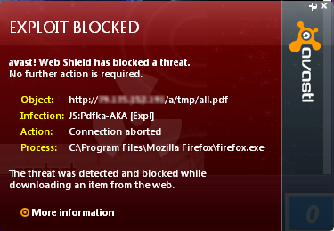

*Hình 7: Ví dụ về cảnh báo một nguy cơ đã được chặn*

**Bước 6**. **Nhấn đúp** chuột
vào 
 trên *Khay Hệ thống* (xem *Hình 4*) để
mở cửa sổ giao diện người dùng của **avast!**,
và **nhấn** 
 để hiển thị thông tin chi tiết *Current
Status* (*Trạng thái Hiện tại*) như sau:

*Hình 8: Cửa sổ Giao diện Người dùng Chính của avast!.*

**Quan trọng**: bạn phải đăng ký **avast!** để có thể cập nhật phiên bản
và dữ liệu virút cho chương trình, điều này giúp bảo vệ máy tính của bạn
khỏi các loại nguy cơ khác nhau.

**2.1 Hướng dẫn Đăng ký avast!**

**Lưu ý**: Nếu bạn không đăng ký chương trình **avast!** nó sẽ ngừng
hoạt động sau 30 ngày. Bạn cần có kết nối Internet để thực hiện việc
đăng ký **avast!**.

Để đăng ký, hãy thực hiện các bước sau: **Bước
1**. **Nhấn** vào 
 để kích hoạt cửa sổ giao diện chính
của **avast!** (*Hình 10*).

**Bước
2**. **Nhấn** 
 (trên mục MAINTENANCE và Registration của
trình đơn) để mở lần lượt các cửa sổ sau:

*Hình 9: Cửa sổ Đăng ký avast!*

Cửa sổ *avast! Free Antivirus Registration* sẽ hướng dẫn bạn các thông
tin cần nhập. Tiếp đó là cửa sổ thông báo việc *avast!* sẽ hết hạn trong
30 ngày nếu không đăng ký. (Ngoài ra còn có thông tin về phiên bản
thương mại và các chương trình khuyến mãi.)

*Hình 10: Cửa sổ Tình trạng Đăng ký Phần mềm*

**Bước
3**. **Nhấn** 
 để mở lại cửa sổ *Hình 2*, và tiếp theo
là các cửa sổ sau:

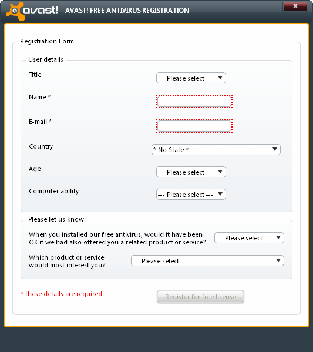

*Hình 11: The Antivirus Free Registration - Mẫu đăng ký*

**Lưu ý**: Trường *Name* (*Tên*) và *Email* (*Thư điện tử*) là những
trường bắt buộc phải nhập thông tin. Chúng được đánh dấu bởi các ký hiệu
hoa thị (\*) và nằm trong các ô viền đỏ. Các trường còn lại không bắt
buộc phải nhập thông tin.

**Bước 4**. **Gõ vào** tên và địa chỉ thư điện tử của bạn vào các ô
tương ứng,
và **nhấn** 
 để mở cửa sổ sau:

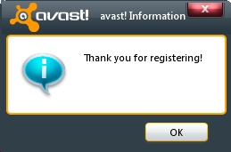

*Hình 12: Thank You for Registering - Cảm ơn đã Đăng ký*

**Bước
5**. **Nhấn** 
 để mở khung *YOUR REGISTRATION* trên cửa
sổ giao diện chính như sau:

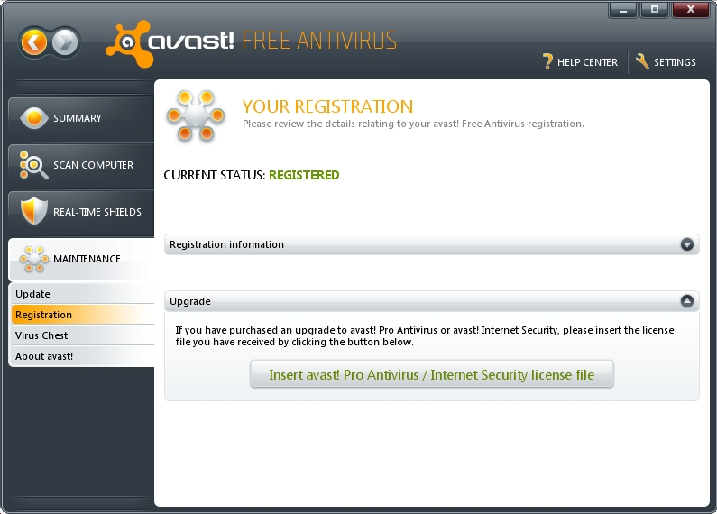

*Hình 13: Xác nhận Đăng ký Chương trình*

Bạn đã hoàn thành việc đăng ký chương trình **avast!** và có thể tìm
hiểu cách cập nhật chương trình cũng như cơ sở dữ liệu vi rút một cách
thủ công. Để thực hiện điều đó, hãy xem phần **3.0 Hướng dẫn Cập nhật
avast! một cách thủ công**

**Hướng dẫn tự Cập nhật avast!**

Các mục trong trang này:

-   [***3.0 Trước khi Bắt
    đầu***](https://securityinabox.org/print/book/export/html/1214#3.0)

-   [***3.1 Hướng dẫn Sử dụng Giao diện Người dùng để Tự Cập nhật
    avast!***](https://securityinabox.org/print/book/export/html/1214#3.1)

-   [***3.2 Hướng dẫn Tự Cập nhật avast! Sử dụng Trình đơn Cảm ngữ
    cảnh***](https://securityinabox.org/print/book/export/html/1214#3.2)

-   [***3.3 Hướng dẫn Tắt Tính năng Tự động Cập nhật Chương trình trong
    avast!***](https://securityinabox.org/print/book/export/html/1214#3.3)

**3.0 Trước khi Bắt đầu**

**avast!** hoạt động ở chế độ nền trên máy tính của bạn, tự động cập
nhật cơ sở dữ liệu vi rút cũng như bản thân chương trình mỗi khi bạn kết
nối với Internet. Tuy nhiên, trong trường hợp không thể kết nối thường
xuyên vào mạng Internet, bị hạn chế truy cập, hoặc chỉ dùng tạm
thời,việc bạn tự cập nhật chương trình sẽ thuận tiện và hiệu quả hơn.

**Lưu ý**: Có hai cách thực hiện việc cập nhật chương
trình **avast!** một cách thủ công: Cách thứ nhất là thông qua cửa sổ
giao diện người dùng chính của **avast!**, và cách thứ hai là sử dụng
trình đơn cảm ngữ cảnh xuất hiện khi bạn nhấn chuột phải vào biểu
tượng **avast!** trên *Khay Hệ thống*. Đồng thời, bạn có thể tắt chế độ
cập nhật tự động của chương trình thông qua lựa chọn *BASIC
SETTINGS* trên cửa sổ xuất hiện khi **nhấn
chuột** vào 
 nằm trên góc phải cửa sổ giao diện chính
của chương trình.

**3.1 Hướng dẫn Sử dụng Cửa sổ Giao diện Người dùng Chính để Tự Cập nhật
avast!**

Để tự thực hiện việc cập nhật **avast!** thông qua cửa sổ giao diện
người dùng, hãy theo các bước sau:

**Bước
1**. **Nhấn** 
 để mở cửa sổ giao diện chính
của **avast!** như dưới đây:

*Hình 1: Khung Sumamary hiển thị ô Trạng thái Hiện hành, chứa những
thông báo chung về tình trạng cập nhật phiên bản của Chương trình*

Một phần cập nhật cho chương trình hoặc cơ sở dữ liệu vi rút được gắn
với một biểu tượng màu da cam với dấu chấm than ở giữa thay vì biểu
tượng màu xanh với dấu chọn như thường dùng. Phiên bản của bản cập nhật
được hiển thị màu đỏ, và nút *Update* (*Cập nhật*) cũng được hiển thị.

**Bước
2**: **Nhấn** 
 để cập nhật ô *Phiên bản Chương
trình* như dưới đây:

*Hình 3: Chương trình đã được cập nhật phiên bản mới*

Sau khi thực hiện cập nhật, chương trình được nâng cấp lên phiên bản
5.0.594 từ phiên bản 5.0.545

Dưới đây là những giải thích ngắn gọn của từng mục, biểu tượng trạng
thái trên khung *Curent Status SECURED* (Trạng thái Hiện hành AN TOÀN):

**Gợi
ý**: **Nhấn** 
 để hiển thị hoặc ẩn thông tin trong
ổ *Trạng thái Hiện hành*.

**Real-time shields** (**Bảo vệ Thời gian thực**): Biểu tượng này cho
biết tình trạng hoạt động của bộ bảo vệ thời gian thực. Thành phần bảo
vệ thời gian thực này sẽ giám sát toàn bộ các hoạt động của máy tính; và
bao gồm bảo vệ thời gian thực cho email, cho các tệp tin hệ thống, cho
trình duyệt và các hệ thống khác. Nếu một thành phần bảo vệ thời gian
thực không hoạt động, có thể là do chủ định hoặc bị tấn công bởi chương
trình phá hoại, khi đó, biểu tượng **avast!** trên *Khay Hệ thống* sẽ
thay đổi nhằm phản ánh trạng thái
này: 

**Definitions auto updates** (**Tự động cập nhật**): Biểu tượng này xác
định trạng thái Cơ chế tự động cập nhật là bật hay tắt.

**Virus definitions version** (**Phiên bản cơ sở dữ liệu vỉ rút**): Biểu
tượng này hiểu thông tin thời gian của phiên bản vi rút mới nhất được
cập nhật. Định dạng thời gian được hiển thị như sau: 10 xác định năm
2010, 06 chỉ tháng và 29 là ngày.

**Program version** (**Phiên bản chương trình**): Biểu tượng này hiển
thị phiên bản được cập nhật gần đây nhất của chương trình.

**Expiration date** (Ngày hết hạn): Mục này hiển thị thông tin ngày và
giờ hết hạn của bản **avast!** bạn đang sử dụng, bạn nên cài hoặc đăng
ký lại trước thời điểm đó.

**Bước
3**. **Nhấn** 
 để kích hoạt cửa sổ sau:

*Hình 4: Khung CẬP NHẬT trên cửa sổ giao diện chính của chương trình*

Khung *Maintenance UPDATE* (*Duy trì Cập nhật*) được sử dụng để thực
hiện việc cập nhật chương trình và cơ sở dữ liệu vi rút một cách thủ
công.

**Bước
4**: **Nhấn** 
 để thực hiện cập nhật bộ tìm diệt và thông tin vi rút.

**Bước
5**: **Nhấn** 
 sau khi quá trình nâng cấp được hoàn
thành để quay về màn hình *Maintenance UPDATE* (*Duy trì CẬP NHẬT*)

Các bước cập nhật chương trình **avast** cũng giống như việc cập nhật bộ
tìm diệt và thông tin virút.

**Bước
6**: **Nhấn** 
 để khởi động tiến trình cập nhật và bắt đầu việc *Nâng
cấp chương trình*.

**Bước
7**: **Nhấn** 
 sau khi việc nâng cấp hoàn thành, quay
trở về cửa sổ *Maintenance UPDATE* (*Duy trì CẬP NHẬT*).

**3.2 Hướng dẫn Sử dụng Trình đơn Cảm ngữ cảnh để Tự Thực hiện Nâng cấp
avast!**

Việc nâng cấp chương trình **avast!** và cập nhật thông tin virút có thể
được thực hiện thông qua trình đơn cảm ngữ cảnh. Trình đơn này có thể
được dùng để truy cập cửa sổ*Maintenace UPDATE* (*Duy trì CẬP NHẬT*).

Để tự cập nhật *Cơ chế tìm diệt và thông tin vi rút* của **avast!** sử
dụng trình đơn cảm ngữ cảnh, hãy theo các bước sau:

**Bước 1**. **Nhấn phải
chuột** vào 
 trong *Khay Hệ thống*:

*Hình 5: Trình đơn điều khiển của avast!*

**Bước 2**: **Chọn Update &gt; Engine and virus definitions** để
mở *Hình 4*, và thực hiện **các bước 4 và 5**

**Bước 3**: **Chọn Update &gt; Program** để mở *Hình 6* và theo **các
bước 6 và 7** trong mục **3.1 Hướng dẫn Tự thực hiện Cập nhật avast! Sử
dụng Cửa sổ Giao diện Chính**

**3.3 Hướng dấn Tắt Tính năng Tự động Cập nhật của avast!**

Ở chế độ mặc định, **avast** được thiết đặt để tự động tải về và cập
nhật chương trình và cơ sở vi rút mới. Tuy nhiên, bạn có thể tắt tính
năng trong phần *Settings* nằm ở góc trên bên phải cửa sổ giao diện
chính.

**Bước
1**. **Nhấn** 
 để mở cửa sổ **avast!** BASIC SETTINGS,
sau đó **chọn** *Updates* để mở khung *UPDATE SETTINGS*.

**Bước 2**. **Nhấn** chọn *Manual update* cho cả hai mục ENGINE AND
VIRUS DEFINITION và PROGRAM.

*Hình 6: Khung SUMMARY ATTENTION (CHÚ Ý TỔNG KẾT) hiển thị trạng thái tự
động cập nhật đang bị tắt*

Những người dùng có kinh nghiệm có thể tùy chọn những thông số cập nhật
trong mục *Details* (*Chi tiết*) và *Proxy Settings* (*Thiết đặt Máy ủy
quyền*). Hãy theo các bước sau:

**Bước
3**. **Nhấn** 
 để mở rộng mục *Details* và *Proxy
Settings* để có thể thay đổi các thông số trong từng mục.

Bạn vừa tìm hiểu về các cách khác nhau để có thể tự thực hiện việc cập
nhật *Cơ chế tìm diệt và cơ sở dữ liệu thông tin vi rút* cũng như *nâng
cấp chương trình* trong **avast!**, hãy chuyển sang mục **4.0 Hướng dẫn
Quét tìm và Đối phó với Virút trong avast!**

**Hướng dẫn Quét và Đối phó với Virút**

Những mục trong trang này:

-   [***4.0 Trước khi Bắt
    đầu***](https://securityinabox.org/print/book/export/html/1214#4.0)

-   [***4.1 Hướng dẫn cơ bản để Đối phó với Sự bùng phát Vi
    rút***](https://securityinabox.org/print/book/export/html/1214#4.1)

-   [***4.2 Giới thiệu chung về Cửa sổ Giao diện Chính
    avast!***](https://securityinabox.org/print/book/export/html/1214#4.2)

-   [***4.3 Hướng dẫn Quét tìm Phần mềm độc hại (Malware) và
    Virút***](https://securityinabox.org/print/book/export/html/1214#4.3)

-   [***4.4 Hướng dẫn Thực hiện tác vụ Quét Tổng
    thể***](https://securityinabox.org/print/book/export/html/1214#4.4)

-   [***4.5 Hướng dẫn Thực hiện tác vụ Quét Thư
    mục***](https://securityinabox.org/print/book/export/html/1214#4.5)

-   [***4.6 Hướng dẫn Thực hiện Quét tại thời điểm khởi
    động***](https://securityinabox.org/print/book/export/html/1214#4.6)

-   [***4.7 Đối phó với Vi
    rút***](https://securityinabox.org/print/book/export/html/1214#4.7)

-   [***4.8 Hướng dẫn Sử dụng Virus Chest (Vùng Cách ly
    Vi rút)***](https://securityinabox.org/print/book/export/html/1214#4.8)

-   [***4.9 Các Phương pháp Diệt Vi rút Nâng
    cao***](https://securityinabox.org/print/book/export/html/1214#4.9)

**4.0 Trước khi Bắt đầu**

Có hai phần cơ bản khi đối phó với phần mềm độc hại và các loại vi rút
máy tính khác trong **avast!**. Thứ nhất là quét tìm để xác định các mối
đe dọa đó. Phần tiếp theo là xóa hoặc di chuyển các chương trình độc hại
đó vào *Vùng Cách ly Vi rút* (*Virus Chest*) của **avast!**. Việc Xóa
hoặc/và di chuyển các mã độc hại và virút vào *Vùng Cách ly Vi rút* giúp
ngăn ngừa một cách có hiệu quả ảnh hưởng của chúng đối với hệ thống, ví
dụ như lây nhiễm tệp hệ thống hoặc các chương trình thư điện tử.

Việc lưu giữ mã độc hại hay virút có vẻ là hành động bất bình thường.
Tuy nhiên, nếu các mã độc đó lây nhiễm các thông tệp tin quan trọng,
nhạy cảm thì có thể bạn sẽ muốn khôi phục các tệp và tài liệu bị lây
nhiễm này càng nhiều càng tốt. Ví dụ trong một số trường hợp hiếm
gặp, **avast!** có thể xác định nhầm các đoạn mã và chương trình hợp lệ
là mã độc hay virút. Những đoạn mã hay chương trình này có thể quan
trọng trong hệ thống và bạn muốn khôi phục chúng.

**Vùng Cách ly Vi rút** (**Virus Chest**) của **avast!** là một 'vùng
nhớ quân sự ' hay 'bị phong tỏa', nơi bạn có thể nghiên cứu một vi rút
và xác định tính chất phá hoại của nó bằng cách tìm hiều thông tin trên
Internet hoặc gửi mẫu virút đó cho một trung tâm nghiên cứu virút - lựa
chọn này có sẵn trong **avast!** khi bạn nhấn chuột phải vào một vi rút
nằm trong danh sách ở *Vùng Cách ly Virút*. Nhấn đúp chuột vào một virút
trong *Vùng Cách ly Virút* sẽ không kích hoạt hoặc thực thi mã độc hay
vi rút đó bởi vì *Vùng Cách ly Virút* đã được cách ly với phần còn lại
của hệ thống.

**Gợi ý**: Bạn có thể chuyển những dữ liệu quan trọng, nhạy cảm
vào **Vùng Cách ly Virút** của **avast!** để bảo vệ thông tin đó khỏi bị
nhiễm virút.

Trong phần này bạn sẽ:

-   Được hướng dẫn cụ thể các cách tôt nhất bảo vệ mạng máy tính và/hoặc
    máy tính cá nhân của bạn;

-   Được giới thiệu về giao diện người dùng chính, chú trọng vào các
    tính năng QUÉT MÁY TÍNH (SCAN COMPUTER) và BẢO TRÌ (MAINTENANCE);

-   Học cách thực hiện các phương pháp quét khác nhau; và

-   Học cách sử dụng *Vùng Cách ly Virút* (*Virus
    Chest* của **avast!**).

**4.1. Hướng dẫn cơ bản để Đối phó với Sự bùng phát Vi rút**

Có một số đề phòng cần thực hiện để giảm nguy cơ lây nhiễm mã độc vào
máy tính của bạn; ví dụ như tránh truy cập các trang web không rõ nguồn
gốc hoặc đáng ngờ, hoặc thường xuyên sử dụng các chương trình diệt virút
hay chống phần mềm gián điệp như **avast!** hoặc **Spybot**. Tuy nhiên,
chúng ta cung thường chia sẻ tài nguyên trên một mạng nội bộ (LAN)
và/hoặc chia sẻ kết nối Internet. Những khuyến nghị dưới đây cần được
cân nhắc khi bạn cần đối phó với sự tấn công của vi rút trong môi trường
mạng hoặc tại nơi làm việc.

-   Ngắt kết nối vật l‎ý khỏi Internet hay mạng nội bộ. Hoặc, nếu bạn có
    kết nối không dây, ngắt kết nối mạng không dây. Nếu có thể, hãy tắt
    hoặc tháo card mạng không dây ra khỏi máy.

-   Nếu máy tính của bạn thuộc một mạng máy tính, có thể ở nhà hay văn
    phòng, bạn nên ngay lập tức ngắt kết nối toàn bộ máy tính trong mạng
    đó khỏi Internet và khỏi mạng nội bộ. Mọi người dùng nên ngừng sử
    dụng kết nối mạng và chạy chương trình **avast!** hay một chương
    trình diệt vi rút đáng tin cậy khác để quét và diệt vi rút. Đây có
    thể là một quy trình mệt mỏi nhưng thực sự rất cần thiết để bảo đảm
    an toàn cho từng máy tính và toàn bộ mạng.

Thực hiện việc quét vi rút tại thời điểm khởi động đối với tất cả các
máy trong mạng. Ghi lại tên tất cả vi rút tìm thấy, để có thể tìm hiểu
thêm về chúng - sau đó xóa, hoặc di chuyển chúng vào *Vùng Cách ly Vi
rút* của **avast!**. Để tìm hiểu cách quét vi rút tại thời điểm khởi
động, xem phần **4.6 Hướng dẫn thực hiện tác vụ Quét tại Thời điểm Khởi
động**.

-   Ngay cả khi đã chọn xóa hoặc sửa tệp nhiễm virút, hãy thực hiện lại
    các bước trên, và quét vi rút tại thời điểm khởi động cho **tất
    cả** các máy tính, cho đến khi **avast!** không còn hiển thị các
    cảnh báo. Tùy thuộc vào mức độ nghiêm trọng của cuộc tấn công của
    virút bạn có thể cần thực hiện việc quét virút tại thời điểm khởi
    động hơn một lần.

Để tìm hiểu thêm về việc đối phó với sự lây lan mã độc hoặc virút, hãy
xem phần **4.9 Các Phương pháp Diệt Virút Nâng cao**.

**4.2 Giới thiệu chung về Cửa sổ Giao diện Chính avast!**

Cửa sổ giao diện chính của **avast!** gồm bốn khung nằm bên trái:
SUMMARY (TỔNG KẾT), SCAN COMPUTER (QUÉT MÁY TÍNH), REAL-TIME SHIELDS
(CÁC BỘ BẢO VỆ THỜI GIAN THỰC) và MAINTENANCE (BẢO TRÌ). Mỗi khung được
chia thành các khung-con để mở các ô thông tin tương ứng.

**Bước
1**. **Nhấn** 
 để kích hoạt cửa sổ sau:

*Hình 1: khung SUMMARY hiển thị ổ Trạng thái Hiện hành AN TOÀN*

Dưới đây là mô tả ngắn gọn các tính năng của bốn khung:

**SUMMARY** (TỔNG KẾT): Khung này chứa các khung con *Current
Status* (Trạng thái Hiện hành) và *Statistics* (Thông tin Thống kê).
Khung *Current Status* (Trạng thái Hiện hành) cho biết tình trạng hoạt
động của các thành phần chính của **avast!** có chức năng bảo vệ máy
tính của bạn khỏi mã độc và virút. Khung *STATISTICS* (Thông tin Thống
kê) hiển thị các thông tin hoạt động của từng thành phần
của *avast!* trong thời gian một tuần, một tháng hay một năm.

**SCAN COMPUTER** (QUÉT MÁY TÍNH): Khung này chứa các khung con *Scan
Now* (Quét tức thời), *Boot-time Scan* (*Quét tại Thời điểm Khởi động*)
và *Scan Logs* (*Nhật ký Quét*). Khung *SCAN NOW* liệt kê các thiết đặt
khi bạn muốn tự thực hiện quét. Khung *BOOT-TIME SCAN* cho phép bạn thực
hiện một tiến trình quét tại thời điểm khởi động trong lần máy tính khởi
động tiếp theo, và khung *SCAN LOGS* hiển thị nhật ký các lần quét virút
theo định dạng bảng.

**REAL-TIME SHIELDS** (CÁC THÀNH PHẦN BẢO VỆ THỜI GIAN THỰC): Khung này
chứa toàn bộ các tính năng liên quan đến việc giám sát hoặc 'bảo vệ' về
mọi mặt cho máy tính, khởi đầu là tính năng *FILE SYSTEM SHIELD* (*BẢO
VỆ HỆ THỐNG TỆP TIN*). Khung này cho phép thiết đặt các tính năng bảo vệ
theo thời gian thực, bao gồm cả việc bật hay tắt từng thành phần bảo vệ.

**MAINTENANCE** (BẢO TRÌ): Khung này gồm các chức năng *Update* (*Nâng
cấp*), *Registration* (*Đăng ký*), *Virus Chest* (*Vùng Cách ly Virút*),
và *About avas!* (*Thông tin avast!*). Cửa sổ *Update* cho phép bạn tự
thực hiện việc nâng cấp chương trình và cập nhật cơ sở dữ liệu virút
trong khi khung *REGISTRATION* là nơi bạn có thể đăng ký phiên
bản *avast!*đang sử dụng. Khung *VIRUS CHEST* cho hiển thị các loại mã
độc hay vi rút được **avast!** phát hiện trong quá trình quét, và cho
phép bạn xử lý chúng theo nhiều cách như xóa, nghiên cứu kỹ hơn hoặc gửi
tới trung tâm nghiên cứu vi rút. Khung *ABOUT AVAST!* hiển thị thông tin
phiên bản chương trình **avast!** đang sử dụng.

**Lưu ý**: Khung *SCAN COMPUTER* và *MAINTENANCE* có nhiều tính năng hữu
ích trong đối phó với vi rút và các mã độc.

**4.3 Hướng dẫn Quét tìm Mã độc và Virút**

Trong phần này bạn sẽ tìm hiểu các phương pháp quét tìm. Bạn cũng sẽ học
các thực hiện một tác vụ quét tổng thể hay quet từng thư mục hoặc quét
ngay khi khởi động hệ thống.

Cửa sổ *SCAN COMPUTER &gt; SCAN NOW* có bốn lựa chọn quét tìm
của **avast!**; để mở cửa sổ này, hãy thực hiện:

**Bước
1**. **Nhấn** 
 để vào cửa sổ sau:

*Hình 2: Khung SCAN COMPUTER chứa ô SCAN NOW*

Hướng dẫn về các lựa chọn tương ứng như sau:

**Quick scan** (**Quét nhanh**): Lựa chọn này được khuyên dùng với những
người dùng có ít thời gian để quét tìm các chương trình có hại trong hệ
thống.

**Full system scan** (**Quét toàn bộ hệ thống**): Nên dùng lựa chọn này
nếu bạn có thời gian để thực hiện việc quét toàn bộ hệ thống hoặc trong
lần đầu quét tìm vi rút cho máy tính. Thời gian để hoàn tất quá trình
quét này sẽ phụ thuộc vào số lượng tài liệu, tệp tin, và dung lượng ổ
cứng cũng như tốc độ của máy tính. Hãy tham khảo phần **4.4 Hướng dẫn
Thực hiện Quét Toàn bộ Hệ thống**.

**Removable media scan** (**Quét các ổ đĩa ngoài**): Lựa chọn này dùng
để quét các ổ đĩa ngoài, thẻ nhớ USB, và các thiết bị lưu trữ khác, nhất
là các ổ đĩa không phải của bạn. Tính năng này cho phép quét tìm các
chương trình độc hại có khả năng tự động chạy khi ổ đĩa được cắm vào máy
tính.

**Select folder to scan** (**Chọn thư mục quét**): Sử dụng lựa chon này
khi bạn muốn quét tìm một thư mục riêng hoặc một nhóm các thư mục đặc
biệt khi bạn biết rõ hoặc nghi ngờ rằng các thư mục hoặc tệp nào đó đã
bị nhiễm virút. Hãy xem phần **4.5 Hướng dẫn quét Thư mục**.

**Gợi ý**: Mỗi lựa chọn quét đều có thông tin cụ thể liên quan, như vùng
nhớ sẽ được
quét. **Nhấn** 
 để tìm hiểu hướng dẫn liên quan. Nếu bạn
có kinh nghiệm hoặc thành thạo về lĩnh vực này,
hãy **nhấn** 
 để tối ưu các thông số tìm kiếm cho từng
lựa chọn.

**4.4 Hướng dẫn Thực hiện Quét Toàn bộ Hệ thống**

Để quét toàn bộ hệ thống, hãy theo các bước sau:

**Bước
1**. **Nhấn** 
 trong lựa chọn *Full system scan* cửa sổ sau sẽ hiện
ra:

*Hình 3: Cửa sổ SCAN NOW thực hiện Quét toàn bộ hệ thống/ đang thực hiện
quét...*

Sau khi quá trình quét toàn bộ hệ thống hoàn thành, và nếu phát hiện có
nguy cơ, cửa sổ *Full system scan* có thể xuất hiện như dưới đây:

*Hình 4: Hoàn thành quá trình quét tìm với cảnh báo THREAT DETECTED!
(PHÁT HIỆN NGUY HIỂM)*

Quá trình quét toàn bộ hệ thống đã phát hiện một số loại nguy hiểm; để
tìm hiểu cách xử lý, hãy xem phần [***4.7 Hướng dẫn Đối phó với Vi
rút***](https://securityinabox.org/vi/node/1217#4.7) \[14\]

*Vùng Cách ly Vỉ rút* của **avast!** là một thư mục được tạo ra trong
quá trình cài đặt chương trình **avast!**, tạo thành một 'vùng cấm' hay
'cách ly' khiến mã độc hay vi rút không thể tương tác hoặc kích hoạt bất
kỳ tiến trình nào trên hệ thống.

**4.5 Hướng dẫn Thực hiện Quét Thư mục**

Để quét thư mục, hãy theo các bước:

**Bước
1**. **Nhấn** 
 trong lựa chọn *Select folder to scan* để kích hoạt cửa
sổ sau:

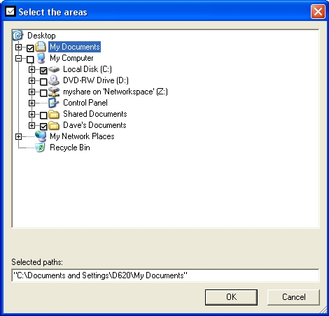

*Hình 5: Hộp thoại hướng dẫn chọn vùng quét*

Hộp thoại *Select the areas* hướng dẫn bạn chọn thư mục muốn quét. Bạn
có thể chọn nhiều hơn một thư mục để quét. Khi bạn nhấn chọn các ô chọn
bên cạnh mỗi thư mục, đường dẫn của thư mục đó sẽ được hiển thị trong
trường *Selected paths*.

**Bước
2**. **Nhấn** 
 để bắt đầu quét các thư mục đã chọn,
khung tiến trình sẽ hiện lên như sau:

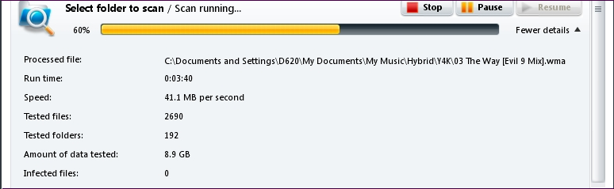

*Hình 6: Tiến trình quét thư mục*

**Gợi ý**: **avast!** cho phép bạn chọn từng thư mục riêng rẽ theo trình
đơn cảm ngữ cảnh của **Windows** xuất hiện khi nhấn phải chuột vào một
thư
mục. **Chọn** 
 ở gần tên thư mục nếu bạn muốn thực hiện
quét tìm vi rút cho thư mục này.

**4.6 Hướng dẫn Quét tại Thời điểm Khởi động**

Tính năng quét tại thời điểm khởi động của **avast!** cho phép bạn quét
kiểm tra toàn bộ ổ cứng hệ thống trước khi **Hệ điều hành Microsoft
Windows** bắt đầu chạy. Tại thời điểm đó, hầu hết các mã độc và các
chương trình phá hoại cũng như vi rút vẫn chưa hoạt động, đúng vậy,
chúng chưa có cơ hội để tự kích hoạt hay tương tác với các tiến trình
khác. Vì lý do đó, chúng dẽ dàng bị phát hiện và xóa bỏ.

Tiến trình quét tại thời điểm khởi động truy cập trực tiếp vào hệ thống
ổ đĩa không qua các trình điều khiển của hệ điều hành **Windows** nơi mà
thường bị tấn công bởi các chương trình độc hại. Do đó sẽ phát hiện các
'rootkit' gan lỳ nhất - rootkit là tên gán cho một số chương trình phá
hoại nguy hiểm. Chúng tôi **khuyến nghị** thực hiện quét
tại-thời-điểm-khởi-động ngay cả khi có nghi ngờ nhỏ rằng máy tính của
bạn bị tấn công hay lây nhiễm.

Lựa chọn *Boot-time Scan* (*Quét tại thời điểm khởi động*) nên được sử
dụng để quét kỹ toàn bộ hệ thống của bạn. Việc làm này sẽ mất thời gian,
tùy thuộc vào tốc độ máy tính và lượng dữ liệu cũng như số ổ đĩa trên hệ
thống của bạn. Tiến trình *Quét tại thời điểm khởi động* sẽ được thực
hiện trong lần máy tính khởi động tiếp theo.

Để quét máy tính tại thời điểm khởi động, hãy theo các bước sau:

**Bước
1**. **Nhấn** 
 để mở khung *BOOT-TIME SCAN*.

**Bước
2**. **Nhấn** 
 để chọn thực hiện việc quét trong lần máy tính khởi
động lần tới.

**Bước
3**. **Nhấn** 
 nếu muốn thực hiện việc thực hiện ngay
lập tức tiến trình quét tại thời điểm khởi động.

**Chú ý**: Tiến trình quét tại thời điểm khởi động sẽ được thực hiện
trước khi hệ điều hành và giao diện đồ họa hoạt động; vì vậy, giao diện
chương trình sẽ là màn hình ký tự màu xanh như sau:

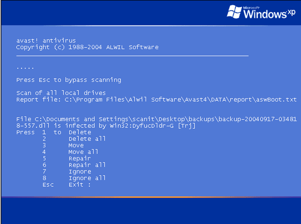

*Hình 7: Tiến trình quét tại thời điểm khởi động của avast!*

**avast!** sẽ thông báo mỗi khi phát hiện một vi rút, và các lựa
chọn *Delete* (*Xóa*), *Ignore* (*Bỏ qua*), *Move* (*Chuyển tới*),
hoặc *Repair*(*Sửa*) đối với các tệp nhiễm được pháp hiện, tuy nhiên
chúng tôi khuyên bạn *không* nên chọn bỏ qua trong bất kỳ trường hợp
nào. Các lện trên chỉ xuất hiện khi chương trình phát hiện một tệp nhiễm
vi rút.

**4.7 Hướng dẫn Đối phó với Vi rút**

Trong quá trình cài đặt **avast!**, **Vùng Cách ly Vi rút** được tạo ra
trên ổ đĩa của máy tính. *Vùng Cách ly Vi rút* này là một thư mục đặc
biệt được cách ly khỏi phần còn lại của hệ thống, và là nơi lưu các mã
độc và vi rút tìm thấy trong quá trình quét, cũng như các tài liệu, tệp
tin hay thư mục bị nhiễm.

Nếu bạn đã từng nâng cấp chương trình và cập nhật thông tin vi rút, bạn
sẽ quen thuộc với khung *MAINTENANCE* - nơi bạn có thể truy cập *Vùng
Cách ly Vi rút* trong **avast**.

Để xử lý các mã độc và vi rút tìm thấy trong quá trình quét, hãy thực
hiện:

**Bước
1**. **Nhấn** 
 để mở cửa sổ:

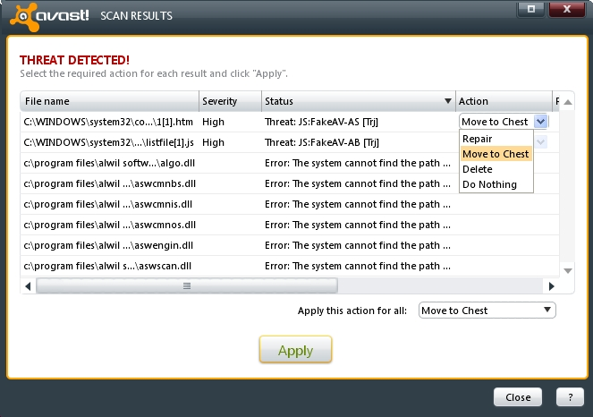

*Hình 8: Cảnh báo PHÁT HIỆN NGUY CƠ! trong cửa sổ SCAN RESULTS*

**Bước
2**. **Nhấn** 
 để mở danh sách xổ-xuống chứa các hành
động tương ứng cho các mối nguy cơ vừa được phát hiện như trong *Hình
8* phía trên.

**Chú ý**: Trong ví dụ này, chúng ta sẽ di chuyển các tệp tin bị nhiễm
vào *Vùng Cách ly Virút*. Tuy nhiên, danh sách các lệnh gồm ba lựa chọn
khác như sau:

**Repair** (**Sửa**): Lệnh này sẽ cố khôi phục tệp bị nhiễm.

**Delete** (**Xóa**): Lệnh này sẽ xóa - vĩnh viễn - tệp tin bị nhiễm.
treating potentially harmful malware or virus threats.

**Do nothing** (**Bỏ qua**): Đúng như tên gọi, lệnh này không thực hiện
gì cả, và lệnh này *không được khuyên dùng* khi phát hiện các nguy hiểm
tiềm tàng hoặc vi rút.

**Bước 3**. **Chọn** mục *Move to Chest* (*Chuyển đên Vùng Cách ly*) sau
đó **chọn** 
, cửa sổ sau sẽ xuất hiện:

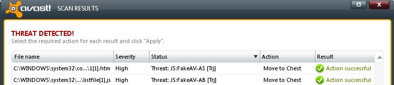

*Hình 9: Vi rút đã được chuyển vào Vùng Cách ly Vi rút*

**4.8 Hướng dẫn Sử dụng Vùng Cách ly Virút**

Giờ bạn có thể tự do quyết định sẽ xử lý một virút khi nó đã được chuyển
vào *Vùng Cách ly* của **avast!**.

**Bước
1**. **Nhấn** 
 và **chọn** 
 để kích hoạt cửa sổ:

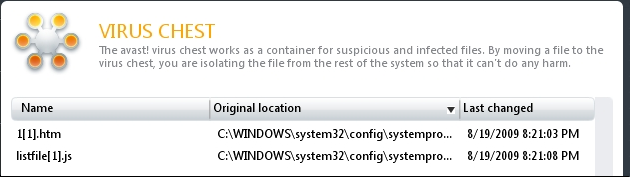

*Hình 10: Vùng Cách ly Vi rút hiển thị thông tin của hai loại virút*

**Bước 2**: **Nhấn phải chuột** lên một trong hai virút để hiển thị các
hành động xử lý:

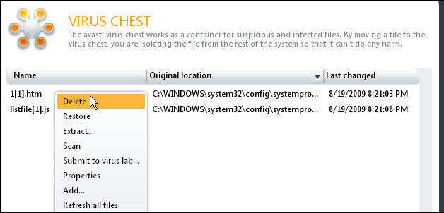

*Hình 11: Các lệnh xử lý một vi rút trong Vùng Cách ly*

**Lưu ý**: Nhấn đúp chuột vào một vi rút trong *Vùng Cách ly* sẽ không
kích hoạt hoặc khởi động vi rút đó. Việc đó sẽ hiển thị các thông tin
thuộc tính của vi rút, cũng nhu khi bạn chọn*Properties* từ trình đơn
cảm ngữ cảnh tương ứng.

Các hành động xử lý vi rút trong trình đơn cảm ngữ cảnh như sau:

**Delete** (**Xóa**): Lệnh này sẽ xóa triệt để virút.

**Restore** (**Khôi phục**): Lệnh này sẽ phục hồi virút về thư mục cũ
nơi nó được tìm thấy.

**Extract** (**Chép**): Lệnh này sẽ sao tệp hoặc vi rút vào một thư mục
do bạn chọn.

**Scan** (**Quét**): Lệnh này sẽ thực hiện một tác vụ quét khác đối với
tệp nhiễm virút này.

**Submit to virus lab...** (**Gửi mẫu tới trung tâm nghiên cứu vi
rút...**): Lệnh này cho phép bản gửi mẫu vi rút tới trung tâm nghiên cứu
để phân tích thêm. Một mẫu đăng ký sẽ xuất hiện yêu cầu bạn điền thông
tin và gửi đi.

**Properties** (**Thuộc tính**): Lệnh này hiển thị các thông tin chi
tiết về vi rút.

**Add...** (**Thêm vào**): Lệnh này cho phép bạn chọn thư mục hay tệp để
chuyển vào *Vùng Cách ly*. Tính năng này rất hữu ích khi bạn muốn bảo vệ
dữ liệu khi bị vi rút tấn công.

**Refresh all files** (**Duyệt lại danh sách tệp**): Lệnh này sẽ cập
nhật lại danh sách tệp để hiển thị các tệp hiện tại.

**4.9 Các Phương pháp Diệt Vi rút Nâng cao**

Trong một số trường hợp, sự bảo vệ của **avast!**, **Comodo
Firewall** và **Spybot** là không đủ; dù chúng ta đã nỗ lực hết sức, máy
tính cá nhân hay hệ thống các máy tính tại nơi làm việc *vẫn* có thể bị
nhiễm mã độc hay vi rút. Trong phần **4.1 Hướng dẫn cơ bản để Đối phó
với Sự bùng phát Vi rút** có nêu một số phương pháp đối phó với các loại
mã độc và vi rút xảo quyệt. Tuy nhiên, *còn có* những phương pháp khác
nữa để đối phó với các loại nguy cơ này.

**Phương pháp A: Sử dụng Đĩa CD/DVD diệt virút**

Một số công ty phát triển phần mềm diệt vi rút cung cấp đĩa CD/DVD diệt
vi rút 'khẩn cấp'. Bạn có thể tải về các tệp ảnh ISO của chương trình
(định dạng này để ghi thành đĩa CD hoặc DVD).

Để sử dụng các đía CD/DVD này, hãy làm theo các bước sau:

1.  Tải về và ghi chương trình diệt virút vào đĩa CD hoặc DVD.

2.  Cho đĩa vừa tạo vào ổ đĩa CD/DVD của máy tính bị nhiễm vi rút và
    khởi động lại máy tính với chọn lựa khởi động từ đía CD/DVD.

*Thường thì bạn có thể nhấn phím F10 hoặc F12 ngay sau khi bật máy. Hãy
chú ý các thông tin chỉ dẫn trên màn hình sau khi khởi động để thực
hiện*

1.  Kết nối máy tính với mạng Internet để chương trình diệt virút có thể
    tự động cập nhật cơ sở dữ liệu vi rút nếu cần, sau đó chương trình
    sẽ thực hiện quét toàn bộ các ổ đỉa để tìm và diệt các loại phần mềm
    độc hại.

Danh sách các chương trình diệt vi rút trên CD:

-   [***AVG Rescue CD***](http://www.avg.com/us-en/avg-rescue-cd) \[15\]

-   [***Kaspersky Rescue
    CD***](http://devbuilds.kaspersky-labs.com/devbuilds/RescueDisk/) \[16\]

-   [***F-Secure Rescue
    CD***](http://www.f-secure.com/linux-weblog/files/f-secure-rescue-cd-release-3.00.zip) \[17\]

-   [***BitDefender Rescue
    CD***](http://download.bitdefender.com/rescue_cd/) \[18\]

Bạn cũng có thể sử dụng các công cụ sau để quét máy tính của minh, những
chương trình này chạy vào thời điểm **Hệ điều hành Windows** khởi động;
tuy nhiên các công cụ này chỉ có tác dụng với các loại vi rút lây nhiễm
trên máy không gây ảnh hưởng tới sự hoạt động của chính các công cụ:

-   [***HijackThis***](http://free.antivirus.com/hijackthis/) \[19\] and
    other tools from free [*Clean-up
    Tools*](http://free.antivirus.com/clean-up-tools/) \[20\] from **Trend
    Micro** company.

-   [***RootkitRevealer***](http://technet.microsoft.com/en-us/sysinternals/bb897445.aspx) \[21\] from [*Sysinternals*](http://technet.microsoft.com/en-us/sysinternals) \[22\] from **Microsoft**.

**Lưu ý:** Bạn có thể sử dụng lần lượt từng công cụ nêu trên để tăng tối
đa hiệu quả.

**Phương pháp B: Cài đặt lại Hệ điều hành Microsoft Windows**

***Lưu ý**: Trước khi bạn thực hiện, hãy chắc chắn rằng bạn có lưu mọi
thông tin liên quan tới bản quyền phần mềm hay mã số đăng ký phần mềm và
bản cài đặt **Hệ điều hành Windows** cũng như các chương trình phần mềm
khác. Việc này đòi hỏi phải mất thời gian chuẩn bị nhưng sẽ là giải pháp
tốt trong trường hợp không thể tiêu diệt triệt để các chương trình độc
hại hay vi rút bằng các phương pháp khác.*

1.  Sao lưụ tất cả các tệp trên máy tính.

2.  Cài lại **Hệ điêu hành Microsoft Windows** với lựa chọn định dạng
    lại toàn bộ ổ đĩa.

3.  Cập nhật hệ điều hành **Microft Windows** sau khi hoàn thành
    cài đặt.

4.  Cài đặt **avast!** (hoặc một chương trình diệt virút bạn tin tưởng)
    và cập nhật chương trình đó.

5.  Cài đặt các chương trình cần thiết và hãy sử dụng phiên bản mới nhất
    cũng như cập nhật từng chương trình.

> **Lưu ý**: Trong bất cứ trường hợp nào cũng không được kết nối ổ đĩa
> sao lưu vào máy tính *trước khi* đã hoàn tất các bước phía trên. Bạn
> có thể sẽ khiến hệ thống bị lây nhiễm lại.

1.  Connect your backup disk to your computer and scan it thoroughly to
    detect and eliminate any existing problems.

2.  Nối ổ đĩa sao lưu vào máy tính và quét toàn bộ ổ đĩa đó để tiêu diệt
    các chương trình độc hại.

3.  Sau khi đã phát hiện và xóa các tệp nhiễm, bạn có thể sao chép dữ
    liệu từ ổ đĩa dự phòng vào ổ cứng máy tính.

**Những Câu hỏi Thường gặp và Tổng kết**

**5.0 Câu hỏi Thường gặp và Tổng kết**

Mặc dù nhận thấy việc sử dụng **avast!** khá dễ dàng, Elena và Nikolai
vẫn có một số câu hỏi về chương trình này.

Elena và Nicolai nhận thấy **avast!** khá dễ sử dụng, tuy nhiên họ có
một số câu hỏi về cách sử dụng chương trình.

**Câu hỏi**: *Nếu tôi phải sử dụng một máy tính tại quán cafe Internet
không được cài đặt chương trình diệt vi rút, làm sao để tôi có thể đảm
bảo các tài liệu không bị lây nhiễm?*

**Trả lời**: *Đây là một câu hỏi rất hay! Cho thấy bạn bắt đầu nhận ra
mối nguy hiểm của vi rút. Sử dụng các máy tính công cộng luôn rất nguy
hiểm vì bạn không có cách nào đẻ biết được các phần mềm độc hại ẩn náu
trong đó. Hãy tránh sử dụng các máy tính công cộng vào các công việc
riêng tư và nhạy cảm trừ khi bạn hoàn toàn không có giải pháp nào khác.*

**Câu hỏi**: *Tôi có một mạng vài máy tính - với một đường truyền
Internet khá chậm. Làm sao có thể tải về các cập nhật cơ sở dữ liệu vi
rút và cài đặt lên tất cả các máy?*

**Trả lời**: *Bạn có thể [***tải về các cập nhật mới
nhất***](http://www.avast.com/download-update) \[23\] trên trang web của
avast!, và sao chép lên từng máy tính trong mạng.*

**Câu hỏi**: *Các tệp trong Vùng Cách ly Vi rút sẽ ra sao nếu gỡ bỏ
chương trình **avast!?***

**Trả lời**: *Tất cả các tệp trong Vùng Cách ly Vi rút sẽ bị xóa nếu bạn
gỡ bỏ chương trình*

**5.1 Câu hỏi Tổng kết**

-   Làm thế nào để quét vi rút cho một thư mục nhất định
    trong **avast!**?

-   Một bản **avast!** không đăng ký sẽ hoạt động trong bao nhiêu ngày?

-   Có thể đưa một tài liệu không bị nhiễm vi rút vào trong *Vùng Cách
    ly Virut* không?

-   Sự khác nhau giữu việc xóa một vi rút và việc di chuyển nó vào *Vùng
    Cách ly Vi rút*?

-   Sự khác nhau giữa quét tại thời điểm khợi động và quét toàn bộ hệ
    thống?

