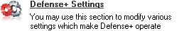

**COMODO - PHẦN MỀM TƯỜNG LỬA**
===============================

**Short Description: **

**COMODO Firewall** là một phần mềm tường lửa nổi tiếng, đáng tin cậy,
miễn phí cho mục đích sử dụng cá nhân. Tường lửa này giúp bảo vệ máy
tính của bạn khỏi những kết nối không được phép đi vào và ra từ
Internet. Chương này được xây dựng đáp ứng các yêu cầu của cả người
dùng **Mới bắt đầu** và **Nâng cao**.

**Online Installation Instructions: **

**Cài đặt COMODO Firewall**

-   *Xem phần giới thiệu tóm tắt [Hướng dẫn Thực
    hành](https://securityinabox.org/vi/handsonguide) \[1\]*

-   ***Kích chuột** vào biểu tượng **COMODO Firewall** bên dưới để mở
    trang **personalfirewall.comodo.com/free-download.html***

-   ***Nhấn** vào nút **download** trong mục 'Download Comodo Firewall
    for Windows'*

-   ***Nhấn chọn** ‘Save File’ để lưu tệp 'cfw\_installer\_x86.exe' về
    máy tính, sau đó **nhấn đúp chuột** vào tệp vừa tải về
    'cfw\_installer\_x86.exe' để khởi động chương trình cài đặt.*

-   *Đọc kỹ phần **2.0 Hướng dẫn Cài đặt COMODO Firewall** trước khi
    tiếp tục*

-   *Nếu bạn lưu tệp cài đặt trên máy, bạn có thể xóa đi sau khi hoàn
    tất quá trình cài đặt*

**COMODO**:\
{width="0.23958333333333334in"
height="0.3229166666666667in"} \[2\]

**Trang chủ**

[***www.personalfirewall.comodo.com***](http://www.personalfirewall.comodo.com/) \[3\]

**Yêu cầu cấu hình máy tính**

-   Windows 2000/XP/2003/Vista

-   Yêu cầu quyền quản trị hệ thống khi tiến hành cài đặt phần mềm

**Phiên bản sử dụng trong tài liệu này**

-   5.0.16

**Bản quyền**

-   Phần mềm miễn phí

**Yêu cầu đọc thêm**

-   Sách Hướng dẫn chương [***1. Làm thế nào để bảo vệ máy tính của bạn
    khỏi phần mềm độc hại và tin
    tặc***](https://securityinabox.org/vi/chuong-1) \[4\].

**Mức độ**: 1: Người mới bắt đầu, 2: Trung bình, 3: **Trên trung bình,
4: Có kinh nghiệm**, 5: Nâng cao

**Thời gian cần thiết để có thể sử dụng công cụ**: 60 phút

**Những lợi ích bạn sẽ có được:**

-   Khả năng bảo vệ một cách nhanh chóng và hiệu quả máy tính và hệ
    thống mạng của bạn khỏi những đối tượng thù địch, tin tặc từ mạng
    Internet, phần mềm gián điệp, vi rút, và các nguy cơ khác.

-   Khả năng kiểm soát mọi yêu cầu kết nối từ các chương trình cài đặt
    trên máy tính khi truy cập Internet, thông qua một giao diện phần
    mềm dễ sử dụng và cấu hình.

**Các Chương trình có Tính năng Tương tự trong GNU Linux, Mac OS và
Microsoft Windows:**

**GNU/Linux** được tích hợp sẵn phần mềm tường lửa
([***netfilter/iptables***](http://www.netfilter.org/) \[5\]) với cài
đặt an ninh mạng rất cao. Có nhiều giao diện người dùng dễ sử dụng để
điều khiển tường lửa tích hợp này, chúng tôi đặc biệt khuyên
dùng [***GUFW***](https://help.ubuntu.com/community/Gufw) \[6\] (**Graphical
Uncomplicated Firewall**) (hãy xem [***thông tin
thêm***](http://blog.bodhizazen.net/linux/firewall-ubuntu-gufw/) \[7\]).

**Mac OS** có tích hợp một tường lửa mạnh mẽ đáng tin cậy có thể được
điều khiển bởi các thành phần mở rộng giao diện người dùng đa dạng giúp
tăng cường khả năng của tường lửa này. Trong số đó
có: [***NoobProof***](http://www.hanynet.com/noobproof/) \[8\] hoặc [***IPSecuritas***](http://www.lobotomo.com/products/IPSecuritas/) \[9\].
Với người dùng muốn tiết kiệm chi phí, chúng tôi khuyên dùng [***Little
Snitch***](http://www.obdev.at/products/littlesnitch/index.html) \[10\],
để nâng cao tính bảo mật Internet và bảo vệ thông tin riêng tư của mình.

Bên cạnh **COMODO Firewall**,có rất nhiều các lựa chọn tốt khác cho môi
trường **Microsoft Windows**. Bạn có thể thấy [***ZoneAlarm Free
Firewall***](http://www.zonealarm.com/security/en-us/zonealarm-pc-security-free-firewall.htm) \[11\] hay [***Outpost
Firewall Free***](http://free.agnitum.com/)\[12\] là những giải pháp
thay thế hiệu quả.

### 1.1 Những điều cần biết về công cụ này trước khi bạn bắt đầu

Một tường lửa giống như một người gác cửa, hay người bảo vệ cho máy tính
của bạn. Nó có một tập chính sách quy định việc cho phép thông tin đi
vào và đi ra khỏi máy tính. Tường lửa là chương trình đầu tiên tiếp nhận
và xử lý thông tin nhận được từ Internet và là chương trình cuối cùng
quét thông tin đi ra khỏi máy tính vào mạng Internet.

Để ngăn chặn tin tặc và những kẻ xâm nhập khác tìm cách truy cập thông
tin cá nhân lưu trữ trong máy tính của bạn. Đồng thời ngăn chặn các
chương trình gián điệp tìm cách gửi thông tin ra Internet mà bạn không
hay biết. Comodo Firewall Pro là một phần mềm tương lửa nổi tiếng. Nó
được cấp phát miễn phí, nghĩa là bạn có thể sử dụng mà không phải trả
tiền bản quyền. Trong những thử nghiệm gần đây, phần mềm luôn tỏ ra vượt
trội so với những phần mềm yêu cầu đăng ký khác.

Sẽ cần một chút thời gian để làm quen. Để cấu hình một chương trình
tường lửa đòi hỏi phải đầu tư một khoảng thời gian và công sức đáng kể
nhằm đảm bảo mọi thiết đặt đều đúng đắn và phù hợp với mục đích sử dụng
máy tính của bạn. Sau giai đoạn tìm hiểu ban đầu, phần mềm tường lửa sẽ
hoạt động trơn tru, ít đòi hỏi sự can thiệp của bạn.

**Cảnh báo!:** Không nên truy cập Internet bằng những máy tính không có
tường lửa bảo vệ. Ngay cả khi modem kết nối Internet hay các bộ định
tuyến có tích hợp những tường lửa, vẫn nên có một phần mềm tường lửa
được cài đặt trên máy tính của bạn.

**Offline Installation Instructions : **

**Cài đặt Comodo Firewall**

-   *Đọc phần giới thiệu tóm tắt [Hướng dẫn Thực
    hành](https://securityinabox.org/vi/handsonguides) \[13\]*

-   ***Nhấn chuột vào biểu tượng chương trình bên dưới** chọn 'Open'
    hoặc 'Run' để cài đặt chương trình. Nếu cần thiết, hãy lưu tệp cài
    đặt về máy tính, sau đó tìm đến thư mục vừa lưu tệp và nhấn đúp
    chuột vào tệp đó*

-   *Tham khảo 'Hướng dẫn cài đặt' ở phần tiếp theo trước khi tiếp tục*

-   *Nếu bạn lưu tệp cài đặt về máy tính, bạn có thể xóa tệp cài đặt này
    sau khi đã hoàn tất quá trình cài đặt*

**Comodo
Firewall:** {width="0.23958333333333334in"
height="0.3229166666666667in"} \[14\]

Hướng dẫn Cài đặt COMODO Firewall
=================================

Các mục trong trang này:

-   [***2.0 Tổng quát về Cài đặt COMODO
    Firewall***](https://securityinabox.org/print/book/export/html/1417#2.0)

-   [***2.1 Hướng dẫn Tắt Windows
    Firewall***](https://securityinabox.org/print/book/export/html/1417#2.1)

-   [***2.2 Hướng dẫn Cài đặt COMODO
    Firewall***](https://securityinabox.org/print/book/export/html/1417#2.2)

2.0 Tổng quát về Cài đặt COMODO Firewall
----------------------------------------

Cài đặt **COMODO Firewall** khá dễ dàng và nhanh chóng, bao gồm hai
bước: trước hết cần phải tắt **Windows Firewall** (tường lửa tích hợp
trong Windows), và tiếp theo là thực hiện cài đặt phần mềm **COMODO
Firewall**.

Tốt nhất bạn chỉ nên sử dụng một chương trình tường lửa trên máy tại một
thời điểm. Nếu bạn đang sử dụng một chương trình tường lửa khác trên
máy, bạn cần gỡ bỏ chương trình này trước khi cài đặt **COMODO
Firewall**, như vậy sẽ giúp loại bỏ khả năng xung đột chương trình.

2.1 Hướng dẫn Tắt Windows Firewall
----------------------------------

Để tắt Windows Firewall hãy thực hiện các bước sau:

**Bước 1**: **Chọn Start &gt; Control Panel &gt; Windows Firewall** để
mở cửa sổ **Windows Firewall**.

**Bước 2**. **Chọn** lựa chọn *Off (not recommended)* để tắt **Windows
Firewall** như trong *Hình 1* dưới đây:

{width="4.520833333333333in"
height="5.364583333333333in"}

*Hình 1: Màn hình Windows Firewall với lựa chọn OFF (Tắt) được nhấn
chọn*

**Bước 3.
Nhấn**: {width="0.7604166666666666in"
height="0.21875in"} để tắt tường lửa của Windows.

2.2 Hướng dẫn cài đặt COMODO Firewall
-------------------------------------

**Lưu ý**: **COMODO Firewall** không tự động gỡ bỏ phiên bản cũ hay một
phiên bản chương trình đã cài đặt trước đó. Bạn cần gỡ bỏ chương trình
cũ trước khi cài đặt phiên bản mới hơn.

Để cài đặt **COMODO Firewall**, hãy theo các bước sau:

**Bước 1**. **Nhấn đúp
chuột** vào {width="1.2916666666666667in"
height="0.16666666666666666in"} để bắt đầu tiến trình cài đặt. Hộp
thoại *Open File - Security Warning* (Cảnh báo An ninh - Mở Tệp) có thể
xuất hiện. Nếu vậy,
hãy**nhấn** {width="0.7916666666666666in"
height="0.21875in"} để mở hộp thoại xác nhận sau:

{width="3.4583333333333335in"
height="1.75in"}

*Hình 2: Hộp thoại Lựa chọn ngôn ngữ*

**Bước
2**. **Nhấn** {width="0.78125in"
height="0.23958333333333334in"} để mở cửa sổ thông tin bản quyền *End
User License Agreement*. Hãy đọc kỹ *End User License Agreement* trước
khi tiến hành các bước cài đặt tiếp theo, sau
đó **nhấn** {width="0.78125in"
height="0.23958333333333334in"} để mở cửa sổ *Free Registration*.

**Bước 3**: **Không** nhập địa chỉ thư điện tử của bạn vào trường *Enter
your email address (optional)*;
chỉ **nhấn** {width="0.78125in"
height="0.23958333333333334in"} để mở cửa sổ *Extracting the
Packages* (Giải nén các Gói cài đặt).

Sau khi việc giải nén hoàn thành, khung *Firewall Setup Destination
Folder* (*Thư mục Cài đặt Tường lửa*) sẽ xuất hiện.

**Bước
4**. **Nhấn** {width="0.78125in"
height="0.23958333333333334in"} để chấp nhận đường dẫn thư mục cài đặt
mặc định và kích hoạt màn hình *Firewall security level selection* (Lựa
chọn mức an ninh Tường lửa), sau đó chọn lựa chọn *Firewall Only* (Chỉ
Tường lửa) như sau:

{width="5.197916666666667in"
height="4.0625in"}

*Hình 3: Màn hình lựa chọn mức An ninh Tường lửa*

**Definition of Firewall Security Level Options** **Định nghĩa các Lựa
chọn Mức An ninh Tường lửa**

Mỗi lựa chọn mức an ninh tường lửa thích hợp cho các mức độ người dùng
khác nhau. Mỗi lựa chọn có mức độ phức tạp sử dụng và độ bảo mật tương
ứng, cũng như số lượng cảnh báo tới người dùng. Sau đây là một số mô tả
sơ lược về các mức độ an ninh:

Chế độ **Firewall Only** (Chỉ có Tường lửa): Lựa chọn này cho phép bạn
chạy chương trình **COMODO Firewall** không có tính năng *Defense +*.
Chương trình đã được xác định trước một số ứng dụng phổ biến được coi là
khá an toàn (như các trình duyệt web và trình quản lý thư điện tử phía
người dùng), nhằm giảm đáng kể số lượng cảnh báo an ninh tới người dùng.
Chương trình đưa ra những thông tin hướng dẫn khi một màn hình cảnh báo
xuất hiện. Thêm vào đó, các hành động cần thao tác cũng khá đơn giản.

Chế độ **Firewall with Optimum Proactive Defense** (Tường lửa với tính
năng Chủ động Phòng vệ Tối ưu): Lựa chọn này bao gồm tính năng bảo vệ
của chế độ *Firewall Only*cộng với tính năng *Defense+* được kích
hoạt. *Defense+* đưa ra sự phòng ngừa tích cực chống lại các chương
trình độc hại được thiết kế để phong tỏa các loại tường lửa khác
nhau. *COMODO Firewall Alerts* đưa ra các thông tin giải thích chi tiết
hơn về lý do một ứng dụng hay một yêu cầu bị khóa, và bạn được cung cấp
lựa chọn riêng để cô lập hoặc 'cách ly' một tệp hay chương trình đáng
ngờ.

Chế độ **Firewall with Maximum Proactive Defense** (Tường lửa với tính
năng Chủ động Phòng vệ Tối đa): Lựa chọn này bao gồm tính năng an ninh
của *Firewall with Optimum Proactive Defense* kết hợp tính năng bảo vệ
'anti-leak' (chống dò rỉ ) để ngăn ngừa các nguy cơ an ninh 'thụ động',
ví dụ như chi tiết về các cổng được mở trên máy tính bị gửi qua mạng
Internet. Tính năng cách ly chương trình được thực hiện hoàn toàn tự
động.

**Bước
6**. **Nhấn** {width="0.78125in"
height="0.23958333333333334in"} để kích hoạt cửa sổ *COMODO Secure DNS
Configuration*, với lựa chọn *I would like to use COMODO Secure DNS
Servers* (Tôi muốn sử dụng Máy chủ DNS bảo mật COMODO) được kích hoạt
như sau:

{width="5.197916666666667in"
height="4.0625in"}

*Hình 4: Cửa sổ Cấu hình COMODO Secure DNS*

**Quan trọng**: Cho dù không tồn tại máy chủ **Hệ thống Tên
miền** (**Domain Name System** - **DNS**) bảo mật hoàn toàn, các lợi ích
của việc sử dụng Các Máy chủ Bảo mật DNS COMODO (**COMODO Secure DNS
Servers**) là rất rõ ràng. Điều này cung cấp thêm sự bảo vệ chống lại
các tấn công dạng *pharming* (địa chỉ ma) và *phishing* (lừa đảo) vốn là
hai dạng tấn công phổ biến bởi những kẻ có ác tâm nhằm 'xâm nhập' hoặc
hướng máy tính của bạn tới các trang web độc hại. **COMODO Secure DNS
Servers** cũng có thể giúp bảo vệ bạn khỏi sự can thiệp của chính quyền,
với những thiết đặt đơn giản trong quá trình cài đặt, cũng như việc giúp
truy cập dễ dàng những trang web đã được đăng ký với**COMODO**. Ví dụ,
nếu bạn vô tình gõ nhầm một địa chỉ trang web, một thông báo cảnh bảo
từ **COMODO Secure DNS Servers** sẽ xuất hiện như sau:

{width="7.552083333333333in"
height="1.40625in"}

*Hình 5: Một ví dụ điển hình về thông báo của COMODO Secure DNS Server*

**Bước
7**. **Nhấn** vào {width="0.78125in"
height="0.23958333333333334in"} để mở cửa sổ *Ready to Install COMODO
Firewall* (Sẵn sàng Cài đặt COMODO Firewall), sau
đó **nhấn** {width="1.1041666666666667in"
height="0.22916666666666666in"} để bắt đầu tiến trình cài đặt, và mở cửa
sổ *Cài đặt COMODO Firewall*. Sau khi quá trình cài đặt hoàn thành, cửa
sổ *Completed the COMODO Firewall Setup Wizard* sẽ xuất hiện.

**Bước
8**. **Nhấn** {width="0.7708333333333334in"
height="0.22916666666666666in"} để mở hộp thoại xác nhận *Hoàn thành*,
và **nhấn** {width="0.7708333333333334in"
height="0.22916666666666666in"} để mở hộp thoại xác nhận sau:

{width="4.020833333333333in"
height="1.78125in"}

*Hình 6: Hộp thoại xác nhận Firewall Installer*

**Bước
9**. **Nhấn** {width="0.78125in"
height="0.23958333333333334in"} để khởi động lại máy tính, và hoàn thành
quá trình cài đặt **COMODO Firewall**.

After your computer restarts itself, the The *New Private Network
Detected!* screen appears as follows:

Sau khi khởi động, cửa sổ *New Private Network Detected!* (Phát hiện
Mạng riêng Mới) xuất hiện như sau:

{width="5.15625in"
height="3.96875in"}

*Hình 7: Cửa sổ COMODO Firewall New Private Network Detected!*

**Gợi ý**: Nếu máy tính của bạn thuộc một mạng nội bộ (LAN), hãy nhấn
chọn *I would like to be fully accessible to other PCs in this
network* để bật tính năng chia sẻ tệp/thư mục/máy in và/hoặc kết nối
Internet.

**Bước 10**. Hãy **nhập** tên vào trường *Give a name to this network
for your network* hoặc sử dụng tên mặc định như trong *Hình 7* phía
trên. Hãy để lựa chọn phía dưới mục *Bước 2 - Decide if you want to
trust the other PCs in this network* không được chọn
và **nhấn** {width="0.78125in"
height="0.23958333333333334in"} để hoàn thành quá trình cài đặt.

Biểu tượng màn hình **COMODO Firewall** và biểu tượng kết nối **COMODO
Firewall** cùng xuất hiện với *Hình 7*. Trước khi kết nối vào Internet,
biểu tượng kết nối xuất hiện trên*Khay Hệ thống* như sau:

{width="1.1354166666666667in"
height="0.3125in"}

*Hình 8: Biểu tượng kết nối của COMODO Firewall xuất hiện trên Khay Hệ
thống*

Khi bạn kết nối mạng và kích hoạt các chương trình có yêu cầu kết nối
(như các trình duyệt) thì ngay lập tức xuất hiện các mũi tên chỉ xuống
màu vàng nhạt và/hoặc các mũi tên chỉ xuống màu xanh nhạt thể hiện các
yêu cầu kết nối Internet đến hay đi như dưới đây:

{width="0.1875in"
height="0.1875in"}

*Hình 9: Biểu tượng kết nối COMODO Firewall đang hoạt động*

Sau khi **COMODO Firewall** được kích hoạt, *Cửa sổ Thông báo* (*COMODO
Message Center*) sẽ xuất hiện:

{width="3.6354166666666665in"
height="1.7708333333333333in"}

*Hình 10: Cửa sổ Thông báo COMODO Message Center*

**Lưu ý**: **Nhấn** vào đường dẫn *Learn more* để truy cập diễn đàn cộng
đồng trợ giúp của **COMODO**.

**Gợi ý**: **Nhấn phải chuột** vào biểu tượng kết nối **COMODO
Firewall** trên *Khay Hệ thống* (như trong *Hình 10*) để kích hoạt trình
đơn chính cũng như các trình đơn con của nó như
sau: {width="4.104166666666667in"
height="1.7291666666666667in"}

*Hình 11: Trình đơn Cấu hình với các trình đơn con của biểu tượng kết
nối*

Trình đơn của biểu tượng kết nối cho phép bạn lựa chọn sử dụng các thành
phần của **COMODO Firewall**. **Lựa chọn \*\*Cấu hình** sẽ kích hoạt
trình đơn *Manage My Configurations* (Quản lý Cấu hình) cho phép
bạn *lựa chọn* sử dụng *COMODO - Proactive Security* hay *COMODO -
Internet Security* để bật tính năng cách ly chương trình/ tệp.

Hơn thế nữa, mỗi thành phần sẽ có các mức an ninh riêng có thể được điều
chỉnh trong các trình đơn con của biểu tượng kết nối như bên dưới; các
mức an ninh này sẽ được thảo luận cụ thể hơn ở phần **4.1 Cửa sổ Thiết
đặt Hành vi Tường lửa** và mục **4.2 Cửa sổ Thiết đặt Defense+**

{width="3.3125in"
height="1.7395833333333333in"}

*Hình 12: Mục Trình đơn Mức An ninh Tường lửa của biểu tượng kết nối*

Hướng dẫn Sử dụng COMODO Firewall
=================================

Các mục trong trang này:

-   [***3.0 Hướng dẫn Cho phép và Khoá các Truy cập Sử dụng COMODO
    Firewall***](https://securityinabox.org/print/book/export/html/1417#3.0)

-   [***3.1 Hướng dẫn Mở Giao diện Chính Chương trình COMODO
    Firewall***](https://securityinabox.org/print/book/export/html/1417#3.1)

-   [***3.2 Tổng quan về Giao diện Chính Chương trình COMODO
    Firewall***](https://securityinabox.org/print/book/export/html/1417#3.2)

3.0 Hướng dẫn Cho phép và Khoá các Truy cập Sử dụng COMODO Firewall
-------------------------------------------------------------------

Tường lửa được thiết kế để bảo vệ máy tính chống lại tin tặc và các phần
mềm độc hại. Cả hai đối tượng này đều tìm cách truy cập trực tiếp máy
tính của bạn hoặc gửi thông tin từ máy tính của bạn cho kẻ nào
đó. **Comodo Firewall** cần phải được thiết đặt để ‘nhận biết’ những
chương trình nào 'đáng tin cậy' và cho phép truy cập, và khóa tất cả
những phần mềm và tiến trình bất hợp lệ trên máy tính của bạn. Có thể sẽ
cần chút kinh nghiệm sau một thời gian sử dụng để phân biệt các yêu cầu
hợp lệ với những yêu cầu kết nối nguy hiểm.

Mỗi khi có yêu cầu kết nối, màn hình *Cảnh bảo An ninh* sẽ xuất hiện cho
phép bạn chọn *Cho phép* (Allow) hoặc *Khóa* (Block) truy cập vào hoặc
ra từ máy tính của bạn tới Internet. Ví dụ dưới đây với một chương trình
an toàn như *Firefox* sẽ giúp bạn làm quen với các cảnh báo của tường
lửa và cách sử dụng chúng. Mặc dù đôi khi có các ngoại lệ đối với các
yêu cầu truy cập xuất phát từ các trình duyệt và trình quản lý thư điện
tử được sử dụng rộng rãi, mỗi lần có một yêu cầu kết nối sẽ kích hoạt
một *Cảnh báo An ninh* như dưới đây:

{width="4.03125in"
height="4.270833333333333in"}

*Hình 1: Một ví dụ Cảnh báo An ninh của COMODO Firewall*

Một tường lửa đơn giản chỉ là tập hợp các quy tắc giám sát luồng thông
tin vào và ra khỏi máy tính. Mỗi khi bạn nhấn chọn *Cho phép* (Allow)
hay *Ngăn cấm* (Block) một tiến trình,**COMODO Firewall** tạo ra một quy
tắc cho tiến trình hay chương trình yêu cầu kết nối. **COMODO
Firewall** thực hiện tác vụ này đối với những tiến trình, chương trình
mới, không nhận diện được cũng như những chương trình đã được liệt vào
danh sách *Các Hãng Phần mềm Đáng tin cậy* (Trusted Software Vendors)
nằm trong cửa sổ *Defense+ - Tasks &gt; Computer Security Policy*.

**Remember my answer** (Ghi nhớ Lệnh thực hiện): Lựa chọn này được sử
dụng để ghi lại lựa chọn của bạn là cho phép hay ngăn cấm một chương
trình nào đó truy cập**COMODO Firewall**. Chương trình sẽ tự động cho
phép hoặc ngăn cấm các kết nối của ứng dụng này trong các lần yêu cầu
sau đó dựa trên lựa chọn hiện tại của bạn.

**Quan trọng**: Chúng tôi khuyến nghị việc tắt chọn lựa *Remember my
answer option* (Ghi nhớ lệnh thực hiện) khi mới sử dụng **COMODO
Firewall**. Hãy quyết định cho phép hay ngăn cấm các yêu cầu kết nối
khác nhau, và tìm hiểu, quan sát ảnh hưởng của các quyết định này tới hệ
thống. Bật chọn lựa *Remember my answer* (Ghi nhớ lệnh thực hiện) khi
và*chỉ* khi bạn hoàn toàn chắc chắn và hiểu rõ quyết định của mình.

**Gợi ý**: Việc giới hạn truy cập hệ thống của bạn là phương pháp tốt
nhất đảm bảo an toàn cho máy tính. Đừng ngần ngại ngăn cấm bất kỳ các
yêu cầu kết nối đáng ngờ hay không xác định được. Nếu việc này khiến một
chương trình bình thường hoạt động không ổn định, bạn có thể cho phép
kết nối được thực hiện trong lần cảnh báo tiếp theo.

**Bước
1**. **Nhấn** {width="1.34375in"
height="0.19791666666666666in"} để mở cửa sổ *Properties* để tìm hiểu
thêm về tiến trình gốc hoặc chương trình yêu cầu truy cập, trong ví dụ
này là **Firefox**:

{width="4.260416666666667in"
height="5.302083333333333in"}

*Hình 2: Thông tin tiến trình firefox.exe Properties*

**Bước
2**: **Nhấn** {width="0.7604166666666666in"
height="0.21875in"} để đóng cửa sổ thông tin chương trình.

**Bước 3**: Nếu bạn xác định rằng một yêu cầu nào đó là không an toàn
hoặc đơn giản là không chắc chắn về yêu cầu đó, dựa vào thông tin hiển
thị trong cửa sổ thông tin
(*Properties*), **nhấn** {width="0.8958333333333334in"
height="0.2916666666666667in"} để yêu cầu **COMODO Firewall** để từ chối
truy cập vào hệ thống của bạn.

HOẶC:

Nếu bạn xác định một chương trình hợp lệ yêu cầu tạo kết nối không có
hại dựa trên thông tin tại bảng thông tin chương trình (*Properties*),
hãy **nhấn** {width="0.8958333333333334in"
height="0.2916666666666667in"} để cho phép chương trình đó truy cập hệ
thống.

**Bước
4**. **Nhấn** {width="0.8958333333333334in"
height="0.2916666666666667in"} để cho phép **Firefox** truy cập hệ thống
qua **COMODO Firewall**.

**Bước 5**. Vì **Firefox** là một ứng dụng an toàn,
hãy **chọn** the {width="1.1354166666666667in"
height="0.125in"} để **COMODO Firewall** tự động cho
phép **Firefox** truy cập hệ thống của bạn trong các lần tiếp theo.

**Lưu ý**: Nút *Allow* (Cho phép) cho phép bạn cấp quyền truy cập cho
các tiến trình hay ứng dụng trong từng trường hợp cụ thể.

**Gợi
ý**: **Nhấn** {width="1.3125in"
height="0.16666666666666666in"} để truy cập thông tin trợ giúp mở rộng
trực tuyến của **COMODO Firewall**.

Khả năng đưa ra quyết định cho phép hay ngăn cấm kết nối của bạn sẽ được
nâng cao khi bạn tự tin và có nhiều kinh nghiệm hơn trong quá trình sử
dụng **COMODO Firewall**.

3.1 Hướng dẫn Mở Giao diện Chính Chương trình COMODO Firewall
-------------------------------------------------------------

**COMODO Firewall** sẽ tự động khởi động sau khi quá trình cài đặt hoàn
tất và khởi động lại hệ thống. Chương trình gồm một khung điều khiển với
một loại tính năng và thiết đặt tùy chọn. **Người dùng Mới Bắt đầu** có
thể tìm hiểu nhanh về các cảnh báo an ninh của **COMODO
Firewall** security alerts, trong khi người dùng **Có kinh
nghiệm** và **Nâng cao** có thể tìm hiểu sâu hơn về các cấu hình phức
tạp và quản lý tường lửa.

**Lưu ý**: Tất cả các ví dụ trình bày trong phần này dựa trên chế
độ **Phòng vệ Tối ưu** của **COMODO Firewall**. Có nghĩa là tính
năng *Defense+* phòng chống giả mạo địa chỉ kết nối được kích hoạt. Nếu
trong quá trình cài đặt **COMODO Firewall** bạn chọn lựa *Firewall
only* (Chỉ riêng Firewall), tính năng *Defense+* sẽ không được kích
hoạt.

Để mở cửa sổ giao diện chính **COMODO Firewall**, hãy theo các bước sau:

**Bước 1**. **Chọn Start &gt; Programs &gt; Comodo &gt; Firewall &gt;
Comodo Firewall**.

**Lưu ý**: Một cách khác, bạn có thể **nhấn đúp chuột** vào biểu tượng
chương trình trên màn hình hoặc **nhấn đúp chuột** vào biểu
tượng **COMODO Firewall** trên *Khay Hệ thống* để mở cửa sổ giao diện
chính chương trình. Ngoài ra, bạn có thể **nhấn chuột phải** vào biểu
tượng **COMODO Firewall** để mở trình đơn cảm ngữ cảnh sau đó
chọn *Open* như sau:

{width="1.9270833333333333in"
height="1.7395833333333333in"}

*Hình 3: Trình đơn cảm ngữ cảnh của biểu tượng kết nối COMODO Firewall*

{width="8.041666666666666in"
height="4.28125in"}

*Hình: Cửa sổ giao diện chính Comodo Firewall ở chế độ Tổng hợp*

3.2 Tổng quan về Giao diện Chính Chương trình COMODO Firewall
-------------------------------------------------------------

Cửa sổ *Firewall* hiển thị rõ ràng, chính xác thông tin chung về các yêu
cầu kết nối vào và ra của các tiến trình và ứng dụng qua **COMODO
Firewall**. Nhìn chung, sẽ có nhiều yêu cầu kết nối ra hơn số lượng yêu
cầu kết nối tới hệ thống. Chế độ hoạt động mặc định là *Safe Mode* (An
toàn), các chế độ hoạt động khác nhau sẽ được đề cập tiếp theo trong
phần này. Khung *Traffic* hiển thị các tiến trình và ứng dụng đang hoạt
động cũng như số lượng yêu cầu kết nối chúng tạo ra tính theo phần trăm.

**Nhấn**{width="1.7291666666666667in"
height="0.25in"} để xem thông tin tổng kết tương ứng của các yêu cầu kết
nối ra *tại thời điểm yêu cầu* như sau:

{width="6.708333333333333in"
height="4.53125in"}

*Hình 5: Cửa sổ Active Connections hiển thị chi tiết thông tin lưu lượng
Internet*

**Nhấn** {width="1.5520833333333333in"
height="0.2708333333333333in"} xem cửa sổ *Active Connections* của các
yêu cầu kết nối tới hệ thống *tại thời điểm xem*.

**Gợi
ý**: **Nhấn** {width="1.0833333333333333in"
height="0.2708333333333333in"} để chặn tất cả các kết nối đến và ra khỏi
máy tính nếu kết nối Internet của bạn tự nhiên chậm hay bị nghẽn đồng
thời bạn có lý do để nghi ngờ một tiến trình hay một ứng dụng đang tự
thực hiện việc tải về tự kích hoạt. Thao tác này sẽ tự động thiết đặt
chế độ hoạt động của *Tường lửa \*
về *{width="0.625in"
height="0.14583333333333334in"}*. Kiểm tra thông tin tổng hợp chi tiết
trong cửa sổ \*Active Connections* để xác định tiến trình gây ra vấn đề
kết nối.

Sau khi đã giải quyết vấn đề thành công,
hãy **nhấn** {width="1.2604166666666667in"
height="0.25in"} để thực hiện các yêu cầu kết nối vào và ra qua **COMODO
Firewall** và trở
về {width="0.6979166666666666in"
height="0.14583333333333334in"} như bình thường.

### 3.2.1 Biểu tượng Trạng thái của COMODO Firewall

**COMODO Firewall** và **Defense+** hoạt động đồng thời; nếu cả hai
chương trình cùng hoạt động, chỉ thị phía trái màn hình giao diện chính
sẽ xuất hiện như sau:

{width="1.4895833333333333in"
height="1.2395833333333333in"}

*Hình 6: Biểu tượng trạng thái COMODO Firewall màu xanh*

Nếu một trong hai chương trình bị tắt, biểu tượng trạng thái sẽ chỉ rõ
rằng tường lửa hoặc thành phần phòng vệ chủ động bị tắt như sau:

{width="1.4166666666666667in"
height="1.4791666666666667in"}

*Hình 7: Biểu tượng trạng thái màu vàng COMODO Firewall bị tắt*

Tuy nhiên nếu cả hai chương trình bị tắt, biểu tượng trạng thái sẽ xuất
hiện như sau:

{width="1.4583333333333333in"
height="1.4791666666666667in"}

*Hình 8: biểu tượng trạng thái COMODO Firewall khi các thành phần bảo vệ
đều bị tắt*

Trong cả hai trường hợp,
hãy **nhấn** {width="0.9895833333333334in"
height="0.28125in"} để kích hoạt các thành phần bảo vệ tương ứng.

Những Thiết đặt và Cấu hình Nâng cao
====================================

Các mục trong trang này:

-   [***4.0 Hướng dẫn Truy cập cửa sổ Firewall và
    Defense+***](https://securityinabox.org/print/book/export/html/1417#4.0)

-   [***4.1 Cửa sổ Thiết đặt Hành vi Tường
    lửa***](https://securityinabox.org/print/book/export/html/1417#4.1)

-   [***4.2 Cửa sổ Thiết đặt
    Defense+***](https://securityinabox.org/print/book/export/html/1417#4.2)

4.0 Hướng dẫn Truy cập cửa sổ Firewall và Defense+
--------------------------------------------------

Màn hình giao diện chính chương trình **COMODO Firewall** chia thành hai
khung chính, khung *Firewall* và *Defense+*.

{width="6.041666666666667in"
height="2.9583333333333335in"}

*Hình 1: Cửa sổ giao diện chính chương trình COMODO Firewall hiển thị
hai khung Firewall và Defense+*

Cửa sổ *Firewall Behavior Settings* (Các Thiết đặt Hành vi Tường lửa)
và *Defense+ Settings* (Các Thiết đặt Phòng vệ) có thể được mở bằng
cách **nhấn** {width="0.6979166666666666in"
height="0.14583333333333334in"} trong khung tương ứng.

Một cách khác, bạn có thể mở hai cửa sổ trên theo các bước sau:

**Bước 1**. **Mở** cửa sổ giao diện chính chương trình **COMODO
Firewall**.

**Bước 2**. **Nhấn**

{width="1.5520833333333333in"
height="0.6458333333333334in"} hoặc {width="1.5625in"
height="0.6458333333333334in"}

để mở các khung *Firewall Tasks* hay *Defense+ Tasks* tương ứng.

**Bước 3**. **Nhấn**

{width="2.8229166666666665in"
height="0.59375in"} hoặc {width="2.6875in"
height="0.7291666666666666in"}

để mở khung *Firewall Behavior Settings* (Thiết đặt Hành vi Tường lửa)
hay *Defense+ Settings* (Thiết đặt Phòng vệ) tương ứng.

**Gợi ý**: *Firewall Security Level* (Mức An ninh Tường lửa), *Defense+
Security Level* (Mức An ninh Phòng vệ) và *Sandbox Security Level* (Mức
An ninh Cách ly) sẽ được đề cập cụ thể trong các phần tiếp theo, có thể
được thiết đặt dễ dàng nhanh chóng thông qua biểu tượng kết nối **COMODO
Firewall** nằm trên *Khay Hệ thống*. **Nhấn chuột phải** vào biểu tượng
kết nối để kích hoạt trình đơn điều khiển và các mục trình đơn con như
sau:

{width="3.3125in"
height="1.7395833333333333in"}

*Hình 2: Trình đơn điều khiển với mục trình đơn con Mức An ninh Tương
lửa của biểu tượng kết nối*

4.1 Cửa sổ Thiết đặt Hành vi Tường lửa
--------------------------------------

Cửa sổ \*The Firewall Behavior Settings\*\* cho phép bạn thay đổi an
ninh tương lửa bằng thông qua các tùy chọn và tính năng khác nhau bao
gồm mức an ninh tường lửa, số lượng cảnh báo an ninh tường lửa, phan
tích và giám sát gói thông tin.

{width="4.979166666666667in"
height="4.739583333333333in"}

*Hình 3: Cửa sổ Thiết đặt Hành vi Tường lửa - Khung Thiết đặt Tổng quát*

Khung *Thiết đặt Tổng quát* cho phép bạn xác định mức độ an ninh phù hợp
của **COMODO Firewall**. Thanh trượt cho phép bạn điều chỉnh mức độ an
ninh trong các tùy chọn sau:

**Block All** (Cấm Tất cả): Ở chế độ này, tường lửa sẽ chặn toàn bộ các
kết nối liên quan tới Internet và ghi đè toàn bộ các cấu hình và quy tắc
đã xác định trước đó. Tường lửa sẽ không tạo ra các quy tắc kết nối cho
ứng dụng hay ghi nhớ hoặc 'học' hành vi mới.

**Custom Policy** (Chính sách Tùy biến): Chế độ này áp dụng *riêng* các
chính sách an ninh và lưu thông mạng của **COMODO Firewall** do người
dùng định nghĩa trong cửa sổ*Firewall Tasks &gt; Network Security
Policy* và *Defense+ Tasks &gt; Computer Security Policy*.

**Safe Mode** (Chế độ An toàn): Đây là chế độ mặc định của **COMODO
Firewall**, gồm thành phần *Optimum Proactive Defense* và *Maximum
Proactive Defense*.

**Gợi ý**: **COMODO Firewall** lưu danh sách các ứng dụng và tệp thường
xuyên hoạt động trên hệ thống đã được kiểm tra an toàn và không đưa ra
các cảnh báo an ninh với những ứng dụng này.

**Cảnh báo**: Cả hai chế độ *Training Mode* và *Disabled Mode* đều không
được khuyên sử dụng bởi chúng có thể không đảm bảo hiệu quả của tường
lửa **COMODO Firewall** khiến hệ thống gặp nguy hiểm.

### 4.2 Cửa sổ Thiết đặt Defense+

**Lưu ý**: Để nắm rõ các tính năng và tùy chọn được giới thiệu trong
phần này đòi hỏi kiến thức sâu về tường lửa cũng như các vấn đề an ninh
liên quan do được thiết kế dành chủ yếu dành cho người dùng **Nâng
cao**.

**Quan trọng**: Nếu bạn nhấn chọn tùy chọn *Firewall with Optimum
Proactive Defense* hay *Firewall with Maximum Proactive Defense* trong
lúc cài đặt **COMODO Firewall**,*Defense+* hệ thống phòng ngừa giả mạo
kết nối sẽ tự động được kích hoạt. Tuy nhiên, nếu bạn chỉ chọn tùy
chọn *Firewall Only* thì tính năng *Defense+* vẫn có thể được kích hoạt
một cách thủ công khi cần thiết. Tính năng *Defense+* cần phải được kích
hoạt để có thể sử dụng mọi tính năng giới thiệu dưới đây.

Thành phần *Defense+* của **COMODO Firewall** là hệ thống phòng ngừa giả
mạo kết nối. Về mặt kỹ thuật, bất kỳ máy tính nào trong mạng đều được
coi là một máy chủ. Thành phần*Defense+* liên tục theo dõi các hoạt động
của các tệp thực thi trên hệ thống của bạn. Một tệp thực thi có thể là
một hay một phần của ứng dụng hay chương trình và thường nhưng không
nhất thiết có đuôi mở rộng dạng: *.bat*, *.exe*, *.dll*, *.sys*, và một
số loại khác.

*Defense+* đưa ra các hộp thoại cảnh báo mỗi khi có một tệp thực thi
không xác định chuẩn bị kích hoạt đồng thời đưa ra cho bạn các lựa chọn
cho phép hay ngăn cấm tệp đó kích hoạt. Điều này rất hữu ích trong tình
huống các chương trình độc hại tìm cách cài đặt lên hệ thống nhằm đánh
cắp thông tin của bạn, xóa sạch ổ cứng hay xâm nhập điều khiển nhằm sử
dụng máy tính của bạn để phát tán phần mềm độc hại hay quảng cáo mà bạn
không hề hay biết.

### 4.2.1 Thiết đặt Defense+ - Khung Thiết đặt Tổng quát

Để tự kích hoạt thành phần *Defense+* và mở cửa sổ *Thiết đặt Defense+*,
hãy theo các bước sau:

**Bước 1**. **Nhấn** khung *Defense+* trong màn hình giao diện chính
chương trình **COMODO Firewall** sau
đó **nhấn** {width="2.6979166666666665in"
height="0.4583333333333333in"} để mở cửa sổ sau:

{width="5.333333333333333in"
height="5.09375in"}

*Hình 4: Cửa sổ Defense+ với khung Thiết đặt Tổng quát mặc định*

**Bước 2**. **Kéo** thanh trượt lên mức *Safe
Mode* và **nhấn** {width="0.78125in"
height="0.23958333333333334in"} để kích hoạt thành phần *Defense+* như
trong *Hình 6*.

*Mức An ninh Defense+* giống với *Mức An ninh Tương lửa* (*Firewall
Behavior Security Level*) với các tùy chọn tương tự, cho phép bạn sử
dụng một thanh trượt để xác định mức tối ưu cho phòng ngừa giả mạo kết
nối máy chủ cho máy tính của bạn.

**Paranoid Mode**(Chế độ Cảnh báo): Đây là mức an ninh cao nhất và sẽ
theo dõi tất cả các tệp thực thi bất kỳ không thuộc danh sách các tệp đã
được bạn xác nhận là an toàn, kể cả những tệp thuộc danh sách *Trusted
Software Vendor* (Các Hãng Phần Mềm Tin cậy). Hệ thống sẽ đưa ra số
lượng lớn cá cảnh báo an ninh, đồng thời các hoạt động hệ thống sẽ được
kiểm tra thông qua các thiết đặt cấu hình.

**Safe Mode**(Chế độ An toàn): Ở chế độ này, hệ thống sẽ tự 'học' các
hành vi tương ứng với các tệp thực thi khác nhau đồng thời giám sát các
hoạt động quan trọng của máy tính. Mỗi khi một ứng dụng không được xác
nhận tìm cách thực thi, hệ thống sẽ tạo ra một *Cảnh báo An ninh*. Chúng
tôi khuyên dùng chế độ này cho hầu hết người dùng.

-   Tùy chọn *Block all unknown requests if the application is
    closed* (Cấm tất cả các yêu cầu kết nối khi đóng ứng dụng) sẽ tự
    động khóa tất cả các yêu cầu của những ứng dụng và chương trình
    không rõ nguồn gốc cũng như không được khai báo trong *Chính sách An
    ninh Máy Tính* (*Computer Security Policy*).

-   Tùy chọn *Deactivate the Defense+ permanently (Requires a
    system restart)* cho phép bạn tắt hẳn tính năng phòng ngừa giả mạo
    kết nối máy chủ *Defense+*. Chúng tôi khuyên *không* nên nhấn chọn
    chọn lựa này.

### 4.2.2 Thiết đặt Defense+ - Khung Thiết đặt Điều khiển Thực thi (Execution Control Settings tab)

Khung *Execution Control Settings* giới hạn khả năng truy cập tài nguyên
máy tính đối với những tệp đáng ngờ hoặc không rõ nguồn gốc và đưa chúng
vào phân tích.

{width="5.333333333333333in"
height="5.09375in"}

*Hình 5: Khung Thiết đặt Điều khiển Thực thi Defense+*

**Gợi ý**: Người dùng **Nâng cao** có thể loại trừ các tiến trình không
mong muốn kể trên bằng
cách **nhấn** {width="0.78125in"
height="0.22916666666666666in"} để mở khung *Exclusions* (Loại trừ) sau
đó tìm và chọn các tiến trình hay ứng dụng cần loại bỏ.

**Lưu ý**: Người dùng **Có Kinh nghiệm** và **Nâng
cao** hãy **chọn**  để truy cập trợ giúp mở rộng **COMODO** trực tuyến
về *Execution Control Settings*, *Sandbox Settings* và*Monitoring
Settings*. Một cách khác, bạn có thể truy cập địa
chỉ [***http://help.comodo.com/topic-72-1-155-1074-Introduction-to-Comodo-Internet-Security.html***](http://help.comodo.com/topic-72-1-155-1074-Introduction-to-Comodo-Internet-Security.html) \[15\] để
chọn danh sách các chủ đề cần trợ giúp

.

Câu hỏi Thường gặp và Tổng kết
==============================

5.0 Câu hỏi Thường gặp và Tổng kết
----------------------------------

Muhindo và Salima đều rất phấn khởi và ngạc nhiên vì **COMODO
Firewall** khá dễ sử dụng và phần lớn thời gian nó hoạt động ở chế độ
nền. Tuy nhiên, họ muốn tìm hiểu thêm:

***Câu hỏi***: *Nếu tôi không có phần mềm tường lửa, có thể chỉ ra cho
tôi một số nguy cơ tôi có thể gặp phải? Có những loại chương trình nào
có thể bị cài vào máy tính của tôi và chúng có thể gây hại gì?*

***Trả lời***: *Có thể có tới hàng ngàn chương trình khác nhau có thể
được cài vào máy tính của bạn từ Internet, nếu nó không được tường lửa
bảo vệ. Thậm chí có những loại ‘nhện’ trên Internet tự động dò quét mọi
địa chỉ để tìm ra những máy tính không được tường lửa bảo vệ và gửi
thông tin địa chỉ máy tính đó cho những kẻ thực hiện xâm nhập máy tính.
Hơn thế nữa, có những chương trình có thể chiếm quyền điều khiển máy
tính của bạn và sử dụng nó để thực hiện các giao dịch lừa đảo hoặc gửi
thông tin quảng cáo rác mà bạn không hề hay biết - kết của là bạn có thể
bị liên đới tới các hoạt động phạm pháp mà mình không thực hiện*.

***Câu hỏi***: *Nếu **COMODO Firewall** chặn tất cả những chương trình
này, tại sao tôi lại cần một chương trình diệt vi rút và chương trình
chống phần mềm gián điệp?*

***Trả lời***: *Phần mềm tường lửa có nhiệm vụ chủ yếu là kiểm soát các
kết nối đến và ra ngoài Internet. Nó ngăn chặn một chương trình hay một
tin tặc tìm cách xâm nhập máy tính của bạn nhưng không thể bảo vệ bạn
khỏi các phần mềm gián điệp mà bạn có khả năng tải về qua thư điện tử,
các trang web hay các ổ đĩa cắm ngoài. **COMODO Firewall** có chứa thành
phần **Defense+**, là hệ thống phòng ngừa giả mạo kết nối máy chủ giúp
giám sát các tệp thực thi được phép hoạt động trên máy tính của bạn.
Những chương trình diệt vi rút và phần mềm gián điệp sẽ hỗ trợ với một
tường lửa tốt để bảo vệ máy tính của bạn chống lại các lây nhiễm kể
trên. Và tất nhiên là những công cụ này còn giúp xóa những phần mềm độc
hại đã tồn tại trên hệ thống của bạn*.

***Câu hỏi***: *Tôi có cần phải coi chừng những chương trình độc hại giả
dạng giống như các thành phần của **Windows** (hay giống như các chương
trình bình thường khác)*?

***Trả lời***: \*Thật không may vì câu trả lời là có những chương trình
giả dạng như vậy. Bạn nên hết sức chú ‎ý tới xuất xứ của phần mềm mỗi
khi tải về và cài đặt. Không nên cài đặt nhưng chương trình không cần
thiết, đặc biệt là đối với những máy tính có chứa các thông tin mật.
Trong trường hợp này hệ thống phòng ngừa giả mạo kết nối máy chủ
\*\*COMODO Defense+\* sẽ rất hữu ích; bằng việc kiểm tra chéo tất cả các
tệp thực thi mới của ứng dụng mới được cài đặt với danh sách của Các
Hãng Phần mềm Tin cậy và tự động đăng ký phân tích các tiến trình đáng
ngờ sẽ giúp tăng cường an ninh và bảo mật Internet cho bạn.

***Câu hỏi***: **COMODO Firewall** bảo vệ hệ thống khỏi bị tin tặc tấn
công tốt ở mức độ nào\*?

***Trả lời***: \***COMODO Firewall** cung cấp quyền kiểm soát đầy đủ với
hệ thống **Windows** của bạn. Một tường lửa chỉ hoạt động theo cách nó
được cấu hình. Cho dù sẽ gặp những khó khăn khi mới sử dụng, bạn hãy
kiên trì sử dụng. Hãy đầu tư tìm hiểu **COMODO Firewall**; khi đã có
thêm kinh nghiệm, bạn sẽ thấy được lợi ích từ khả năng bảo vệ đa dạng
của phần mềm tường lửa.

### 5.1 Câu hỏi tổng kết

-   Có thể sử dụng nhiều hơn một tường lửa không?

-   Làm sao để kiểm tra một chương trình mới có đảm bảo an toàn hay
    không?

-   Phần mềm tường lửa hoạt động ra sao?

-   Tại sao cần cài đặt một phần mềm tường lửa?

-   Sự khác nhau giữa một tường lửa và một hệ thống phòng chống giả mạo
    kết nối máy chủ?

