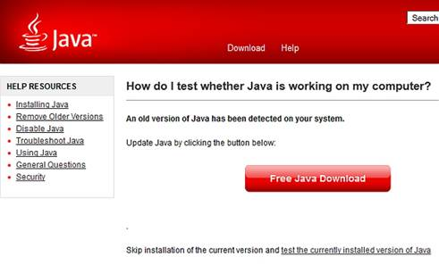
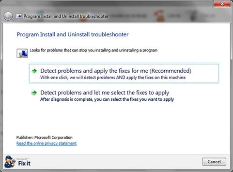
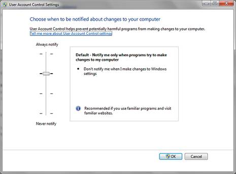
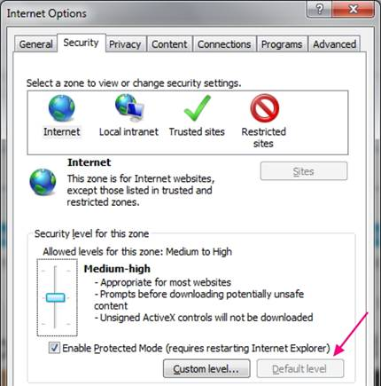
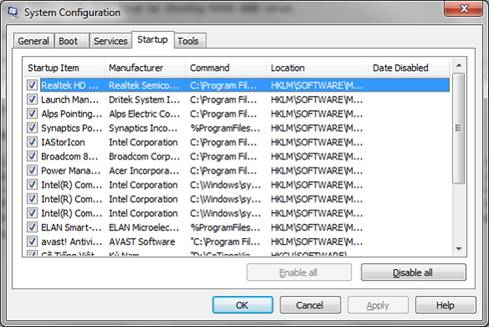

I.  **DOWNLOAD:**

link download: <http://www.java.com/en/download/win8.jsp?locale=en>

link download file cài đặt offline:
<http://www.java.com/en/download/windows_offline.jsp>

nên tải trực tiếp tại trang web [www.java.com](http://www.java.com) để
được cập nhật bản mới nhất.

cấu hình đề nghị:

-   Windows 8 Desktop

-   Windows 7

-   Windows Vista SP2

-   Windows XP SP3 (32-bit); Windows XP SP2 (64-bit)

-   Windows Server 2008

A Pentium 2 266 MHz or faster processor with at least 128 MB of physical
RAM is recommended\*. You will also need a minimum of 124 MB of free
disk space. \
\
\*Windows XP minimum is 64MB RAM.

I.  **CÁC LỖI THƯỜNG GẶP**

Có một vài trường hợp bạn cài đặt Java thành công, nhưng lỗi vẫn xuất
hiện khi chạy. Trong trường hợp này hãy bắt đầu quá trình kiểm tra xem
thực sự Java có làm việc hay không. Cách dễ nhất là truy cập vào đây để
kiểm tra phiên bản Java được cài đặt.

 

{width="5.729166666666667in"
height="3.4583333333333335in"}

**Gỡ bỏ phiên bản gây xung đột**

Nếu cài đặt thành công, nhưng Java không làm việc, hãy kiểm tra xem Java
Control Panel có xuất hiện trong Windows Control Panel. Nếu Java Control
Panel không tồn tại, có thể nó xung đột với JavaFX hoặc phiên bản Java
khác. Trong trường hợp này, bạn hãy gỡ bỏ tất cả phiên bản Java có trên
máy. Kế tiếp dùng [Microsoft
uninstaller](http://support.microsoft.com/mats/Program_Install_and_Uninstall/en) để
gỡ bỏ rác, mục registry… của Java. Sau đó hãy thử cài đặt Java một lần
nữa.

 

{width="5.729166666666667in"
height="4.21875in"}

**Sử dụng trình cài đặt offline**

Khi cài đặt Java bằng trình Web Installer, nó có thể gây ra một số lỗi
và nguyên nhân thường là do kết nối Internet. Bạn có thể tải phiên bản
cài đặt [Java
offline](http://www.java.com/en/download/windows_offline.jsp). Trong
trường hợp này, trình cặt đặt offline có khả năng cài thành công cao hơn
so với trình cài đặt trên Web.

**Thử dùng phiên bản 32-bit**

Nếu gặp khó khăn khi cài đặt phiên bản Java 64-bit, hãy sử dụng thử
phiên bản 32-bit. Mặc dù Java 64-bit thường được lựa chọn khi cài trên
hệ điều hành 64-bit, nhưng phiên bản 32-bit thường ít gặp vấn đề khi cài
đặt hơn.

**Cài đặt với quyền quản trị**

Nếu gặp vấn đề khi cài đặt Java trên Windows 7 hoặc Windows 8, hãy thử
cài đặt Java với quyền Administrator. Để thực hiện, hãy tải phiên bản
cài đặt offline của Java và lưu nó vào một thư mục trống trên đĩa cứng.
Sau đó nhấp chuột phải vào tập tin thực thi và chọn Run As
Administrator.

**Vô hiệu hóa tạm thời User Account Control**

Một số người dùng gặp cửa sổ User Account Control khi cài đặt Java và
gây ra lỗi. Nếu cảm thấy tính năng User Account Control gây ra vấn đề,
bạn có thể tạm thời vô hiệu hóa nó cho đến khi cài đặt hoàn tất Java.
Phương pháp thực hiện còn tùy thuộc phiên bản Windows bạn đang dùng.
Trong Windows 8, các tùy chọn để thay đổi thiết lập User Account Control
được tìm thấy trong Control Panel dưới System And Security -&gt; Action
Center.

 

{width="5.729166666666667in"
height="4.21875in"}

**Thiết lập an ninh trên Internet Explorer đến mức mặc đinh**

Nếu độ bảo mật trên Internet Explorer được cấu hình ở mức độ bảo mật cao
hơn mặc định hoặc nó đang chạy ở mức độ bảo mật tùy chỉnh, rất có khả
năng Java sẽ bị chặn. Vì thế bạn phải thiết lập độ bảo mật trên Internet
Explorer trở về mặc định. Để thực hiện, hãy vào Internet Explorer, chọn
Tools -&gt; Internet Options. Khi hộp thoại Internet Options xuất hiện,
nhấp vào thẻ Security và nhấn vào nút Default level. Nhấn OK để lưu thay
đổi.

 

{width="5.729166666666667in"
height="5.791666666666667in"}

**Vô hiệu hóa tạm thời trình diệt virus**

Có một số báo cáo cho rằng trình duyệt virus ngăn chặn Java khi cài đặt.
Nếu muốn kiểm tra xem chương trình chống virus có gây ra vấn đề này
không, bạn nên tải về bản cài đặt offline, cập nhật phần mềm chống
virus, sau đó quét toàn bộ hệ thống. Điều này đảm bảo không có phần mềm
độc hại nào trên máy tính trước khi bạn vô hiệu hóa trình diệt virus.

Một khi chắc chắn máy tính không còn phần mềm độc hại, bạn có thể vô
hiệu hóa tạm thời trình quét virus. Phương pháp thực hiện còn tùy thuộc
vào chương trình diệt virus bạn đang sử dụng, nhưng cách thường dùng là
nhấn chuột phải vào biểu tượng chương trình chống virus trên Taskbar và
chọn tùy chọn tạm dừng bảo vệ. Khi cài đặt hoàn thành Java, đừng quên
kích hoạt lại chương trình diệt virus.

**Tạo tài khoản người dùng mới**

Theo Microsoft, hồ sơ của tài khoản người dùng bị lỗi có thể gây ra vấn
đề khi cài đặt Java. Hãy thử tạo một tài khoản người dùng mới và gán
quyền Administrator cho tài khoản này. Sau đó, đăng nhập vào tài khoản
người dùng mới tạo và thử cài đặt lại Java.

**Dùng công cụ System Configuration**

Các lỗi khi cài đặt Java có thể liên quan đến các phần mềm khác đang
chạy trên hệ thống, bạn có thể khắc phục bằng cách vô hiệu hóa các phần
mềm khởi động. Cách dễ nhất để làm là mở cửa sổ Run và và nhập vào lệnh
MSCONFIG. Nó sẽ kích hoạt tiện ích Windows System Configuration, cho
phép bạn chọn các mục khởi động muốn vô hiệu hóa mà không cần bất kì
thay đổi nào trên hệ điều hành.

 

{width="5.729166666666667in"
height="3.8229166666666665in"}
