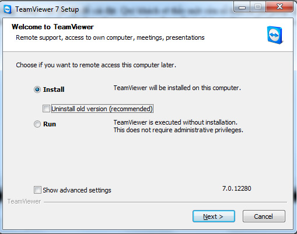
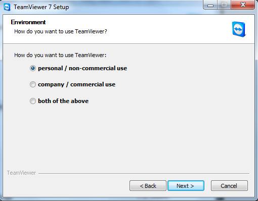
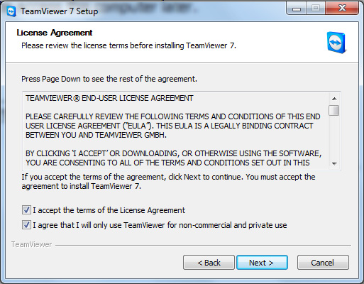
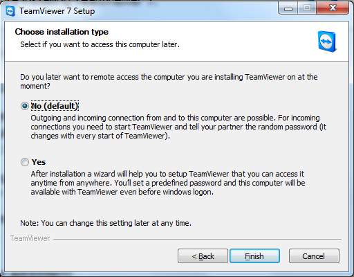
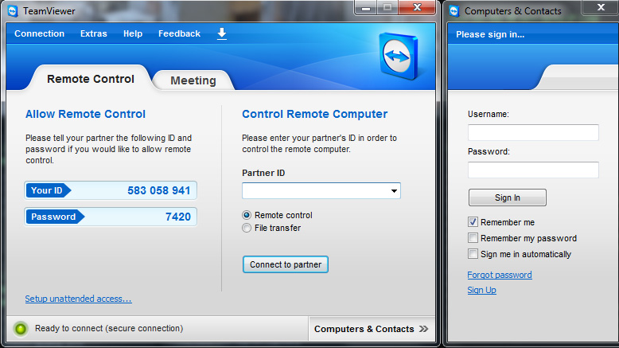

**HƯỚNG DẪN CÀI ĐẶT PHẦN MỀM TeamViewer TRÊN MÁY TÍNH - ĐỂ ĐIỀU KHIỂN
MÁY TÍNH TỪ XA QUA MẠNG INTERNET**

**Bước 1 :** Tải về phần mềm: <http://www.teamviewer.com/vi/index.aspx>
**

Bước 2 : **Mở thư mục chứa file vừa tải về (**tên là
TeamViewer\_Setup\_vi**) và **click đúp chuột** vào file đó để cài đặt.
Bạn sẽ thấy một cửa sổ hiện ra cho phép bạn chọn cài đặt (**Install**)
hoặc chạy ngay (**Run**) mà không cần cài đặt. Trong bài là hướng dẫn
cài đặt để sử dụng lâu dài nên tôi sẽ không nói về phần Run. Bạn
chọn **Install **và click nút **Next **để tiến hành cài đặt.

**Bước 3 : **Bạn sẽ được hỏi sử dụng với mục đích nào. Chúng ta chỉ sử
dụng với mục đích cá nhân và phi thương mại nên Bạn check
vào **Personal/Non-commercial use **và nhấn **Next **để tiếp tục quá
trình cài đặt

**Bước 4 : **Tại đây Bạn phải đồng ý với quy định của nhà sản xuất Bạn
chỉ cần check (chọn) vào 2 ô như trong hình bên dưới và
click **Next **là được.

**Bước 5 : **Ban sẽ có 2 lựa chọn. Lựa chọn thứ nhất mỗi lần Bạn khởi
động và sử dụng phần mềm 1 password (mật khẩu) ngẫu nhiên sẽ được tạo
ra. Lựa chọn thứ 2 Bạn có thể đặt pass mặc định. Ở đây chúng ta nên chọn
lựa chọn thứ nhất **No (default)** và click **Finish.**

**Hoàn tất: **Sau khi click Finish Teamviewer sẽ được cài đặt vào máy
tính

