***1. Download:***\
\
Bạn có thể tải bản cài đặt IDM từ địạ
chỉ:<http://www.internetdownloadmanager.com/download.html>\
\
Cài đặt IDM rất đơn giản, bạn thực hiện như sau:

{width="3.1354166666666665in"
height="1.3020833333333333in"}

**Click đúp** vào file cài đặt để bắt đầu quá trình cài đặt.

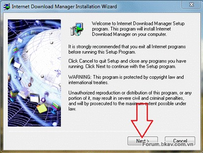{width="4.270833333333333in"
height="3.2291666666666665in"}\
\
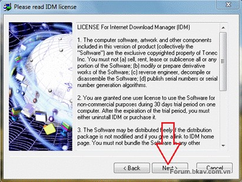{width="4.28125in"
height="3.2291666666666665in"}

Bấm **Next **để tiếp tục

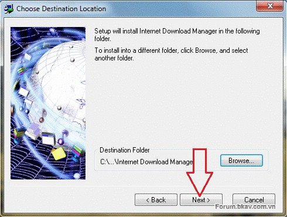{width="5.104166666666667in"
height="3.8541666666666665in"}

Mặc định IDM sẽ cài ở ổ đĩa C, nếu không muốn thay đổi thư mục cài đặt,
bấm **Next **để tiếp tục

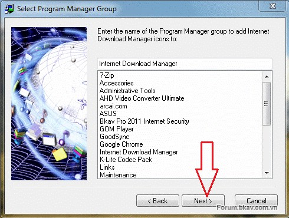{width="5.104166666666667in"
height="3.8541666666666665in"}\
\
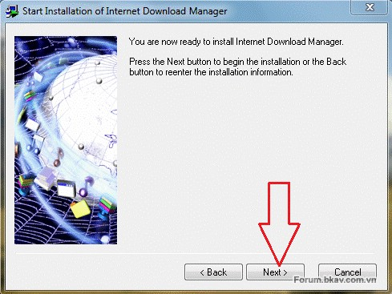{width="5.09375in"
height="3.8229166666666665in"}

Bấm **Next **để quá trình cài đặt bắt đầu

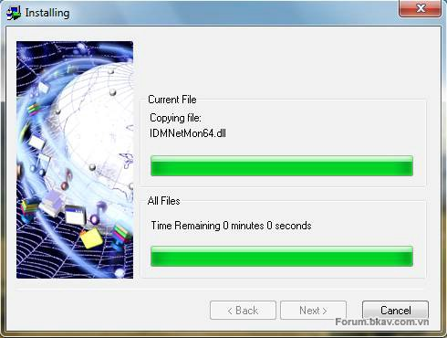{width="5.104166666666667in"
height="3.8541666666666665in"}

Chờ quá trình cài đặt hoàn tất (chỉ tầm 10 giây)

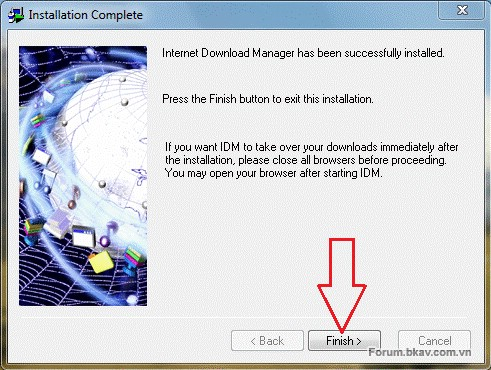{width="5.114583333333333in"
height="3.8541666666666665in"}

Bấm **Finish **để kết thúc

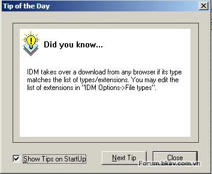{width="3.6875in"
height="3.0208333333333335in"}

Lần khởi động đầu tiên, bỏ chọn mục **Show Tips on StartUp** để không
làm phiền bạn vào những lần sau

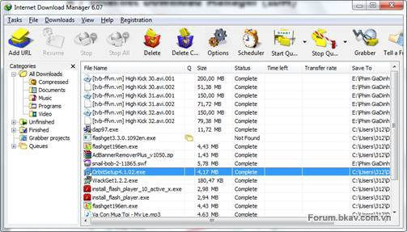{width="5.239583333333333in"
height="2.9895833333333335in"}

Giao diện IDM rất đơn giản. Các file download ở giữa, được phân loại
theo các **Category** có sẵn và trạng thái download để dễ dàng tìm kiếm.
Menu trên cùng và ở thanh toolbar chứa các công cụ hay sử dụng nhất.\
\
Bạn có thể tìm kiếm file tải về theo các category, hoặc trạng thái file
tải về finished - unfinished, grabber projects, queues (hàng đợi).\
\
Sau khi cài đặt, IDM sẽ tự động thay thế cho công cụ download sẵn có của
trình duyệt. Theo quảng cáo, IDM giúp download nhanh gấp 5 lần bằng việc
chia file thành nhiều mảnh nhỏ và tải đồng thời. Theo kinh nghiệm của
mình, IDM giúp bạn luôn đạt đến giới hạn tối đa của gói cước internet
đang sử dụng (tất nhiên là tùy server nữa).

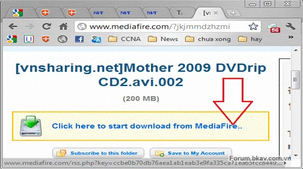{width="5.25in"
height="2.9270833333333335in"}

Trong trình duyệt, bấm vào link download, sẽ có cửa sổ hỏi bạn

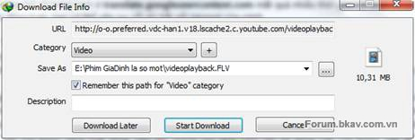{width="4.8125in"
height="1.625in"}

Bấm nút **Start Download** để bắt đầu ngay.\
Bấm **Download Later** để tạm ngừng hoặc download lúc khác\
Mục **Remember this path for “Video” category** nhằm lưu lại đường dẫn
cho những file tải về cùng thể loại (category) - ở đây là Video. Lần tải
tới bạn sẽ không cần chọn nơi lưu trữ nữa.

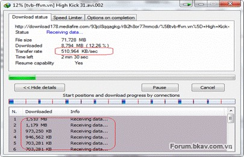{width="4.21875in"
height="2.71875in"}

Sau khi bấm **Start Download** IDM sẽ hiển thị bảng thông báo như hình
trên\
\
Ngoài ra IDM có khả năng tích hợp với hầu hết các trình duyệt, tóm gọn
link nhạc, phim…vô cùng đơn giản

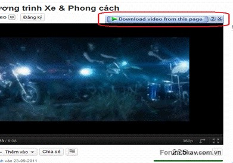{width="4.072916666666667in"
height="2.8541666666666665in"}\
\
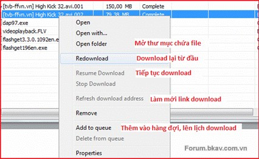{width="4.4375in"
height="2.7291666666666665in"}

***2. Hướng dẫn thiết lập tối ưu***\
\
Tại giao diện chính, bấm nút **Options **trên thanh công cụ

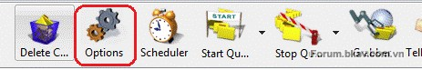{width="4.822916666666667in"
height="0.8020833333333334in"}

-   Thẻ đầu tiên – **General**

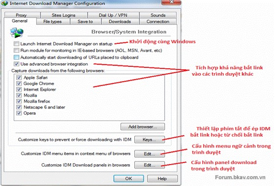{width="5.864583333333333in"
height="3.96875in"}

-   Mặc định mục **Run module for monitoring…** được bật. Thiết lập này
    > sẽ chạy module giám sát Internet Explorer (IE) và các trình duyệt
    > nền tảng IE. Nếu bạn không sử dụng trình duyệt họ IE bạn nên
    > tắt nó.

-   **Automatically start downloading of URLs placed to clipboard**: tự
    > động nhận dạng và download các link trong clipboard (nếu có).

-   **Use advanced browser intergration**: Khả năng bắt link trên các
    > trình duyệt khác sẽ tự động bật khi trình duyệt được cài có trong
    > danh sách. Nếu trình duyệt của bạn không có trong danh sách, có
    > thể tự thêm bằng cách trỏ đến file chạy (.exe) của nó.

<!-- -->

-   Thẻ **File types**

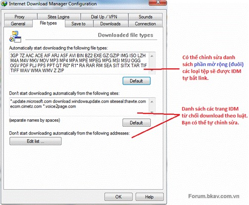{width="5.239583333333333in"
height="4.3125in"}

-   Thẻ **Save to**

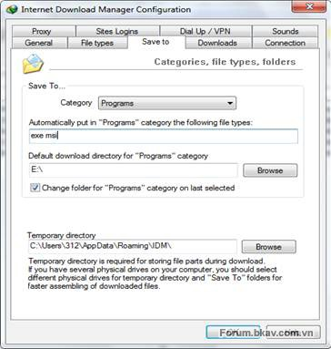{width="3.7916666666666665in"
height="3.9895833333333335in"}

IDM chia các file tải về thành 6 **Category **(thể loại). Các Category
bao gồm các phần mở rộng của file thuộc nhóm đó và thư mục mặc định để
lưu trữ các file trong nhóm.\
\
Vd trong hình : Category Programs gồm 2 định dạng file là .exe và .msi.
Thư mục lưu trữ mặc định là E:\\\
\
Đánh dấu mục **Change folder for "Programs" category on last
selected** để thay đổi nơi lưu trữ theo lượt download cuối cùng.\
\
**Sau khi cài đặt, bạn nên rành thời gian sắp xếp nơi lưu trữ mặc định
cho tất cả các category vào thư mục khác ngoài ổ đĩa C, vì ổ đĩa C là ổ
đĩa hệ thống, trục trặc xảy ra cho Windows có thể khiến bạn mất hết dữ
liệu download.**\
\
Mục **Temporary directory** là nơi lưu trữ các mảnh download của IDM,
sau khi download hoàn tất, các mảnh này được ghép lại và copy vào thư
mục lưu trữ mà bạn đã thiết lập. Theo khuyến cáo của IDM, nên đặt thư
mục này ở ổ đĩa vật lý khác, hoặc ít nhất là ở phân vùng khác với phân
vùng đặt file lưu trữ cuối cùng để quá trình download được nhanh hơn.
(vd: D:\\temp)

-   Thẻ **Downloads**

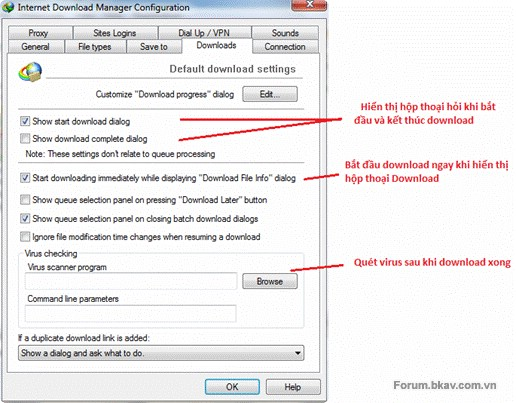{width="5.375in"
height="4.197916666666667in"}

-   Mục **Start downloading immediately while displaying….**

> Chọn mục này – IDM sẽ bắt đầu (âm thầm) quá trình download ngay khi
> hộp thoại hỏi Download hiện ra. -Nếu chọn, nếu mạng nhà bạn tính cước
> theo lưu lượng, bạn sẽ phí nhiều tiền khi IDM bắt link những thứ không
> cần thiết. -Nếu không chọn, sẽ không thể download miễn phí ở những
> trang tính phí (rapidshare, megaupload …) – vì link bắt được mà ko tải
> ngay sẽ trở thành link hỏng. Theo mình thì nên bật.

-   Mục **Virus checking** 

> Không cần thiết vì 100% realtime protection của các Anti Virus đã thực
> hiện việc này mà không hề hỏi ý bạn. Điều bạn cần làm là chắc chắn
> trong máy có 1 Anti Virus.

-   Thẻ **Connection**

{width="5.479166666666667in"
height="4.416666666666667in"}

Về loại kết nối và tốc độ phù hợp, các bạn nên chọn gói cước lớn nhất\
\
**Max connection number** – số lượng kết nối tối đa cho một file
download: 

-   Số lượng kết nối nhiều &gt; mạng chậm đáng kể. Nếu chơi game hoặc
    duyệt web mà vẫn muốn tải file cùng lúc, hãy chọn lượng kết nối nhỏ
    đi (1-2). Việc giảm lượng kết nối có tác dụng hơn nhiều so với giới
    hạn tốc độ (sẽ bàn sau).

-   Số lượng kết nối lớn nhiều : sẽ thêm thao tác ghép các mảnh nhỏ sau
    khi tải xong. Việc này làm tăng nguy cơ lỗi file, đặc biệt khi tải
    nhiều file cùng lúc.

-   (Ở các phiên bản IDM mới, các mảnh ghép này được IDM auto save liên
    tục nên giảm đáng kể khả năng hư hại)

-   Đối với 1 số server đặc biệt, không hỗ trợ chia mảnh để tải, việc
    IDM cố gắng liên kết với các server dự phòng có thể làm tiến trình
    download chậm hơn bình thường, hãy điều chỉnh số kết nối về 1.

Vì vậy, mình vẫn khuyên các bạn để **Max.connection.number là 16 **\
\
***3. Tải hàng loạt file cùng khuôn mẫu***\
\
Ví dụ bạn cần tải ảnh tại một blog, đường dẫn có dạng như
sau: *bp.blogspot.com/-eORDTwPWRv0/3ljlczUdYpc/\*.jpg*\
\
Các bạn vào** Menu Task** &gt; **Add Batch Download**

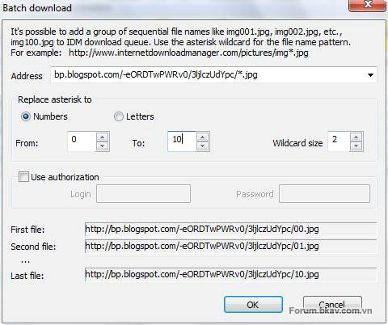{width="5.0in"
height="4.1875in"}

Trong dấu \* có thể là số trong khoảng từ 0 – n (n tự đặt), hoặc là chữ
cái a-z\
**Wildcard size** là độ rộng của \* ở dạng số để có link chính xác (vd:
1, 01, 001)\
\
***4. Site grabber – tải website để xem offline***

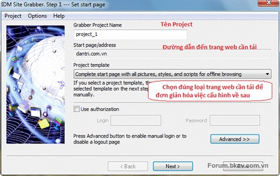{width="4.927083333333333in"
height="3.1041666666666665in"}

Bước 1 : Đặt tên cho project, điền địa chỉ website muốn tải về

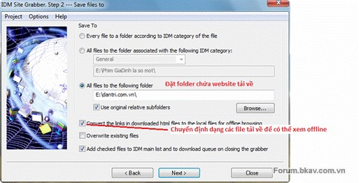{width="5.34375in"
height="2.71875in"}

Bước 2 : Chọn folder chứa sản phẩm

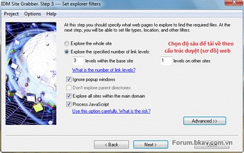{width="4.333333333333333in"
height="2.71875in"}

Bước 3

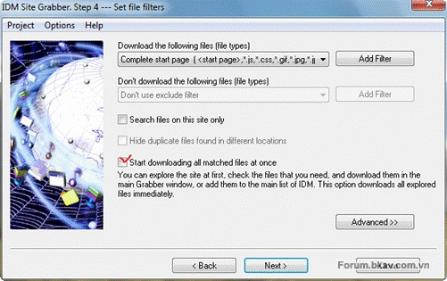{width="5.21875in"
height="3.28125in"}

Bước 4

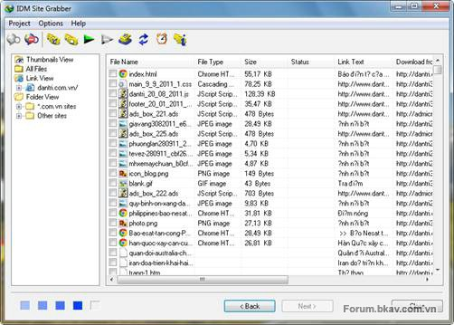{width="5.229166666666667in"
height="3.7395833333333335in"}

Bước 5 : quá trình tìm kiếm và tải về bắt đầu\
\
***5. Sử dụng giỏ download để bắt link***

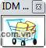{width="0.6145833333333334in"
height="0.6354166666666666in"}

Là cửa sổ nhỏ có dạng như trên, luôn **On top** (nằm trên cửa sổ khác).
Giỏ download hỗ trợ kéo thả rất linh động, bạn có thể kéo thả tất cả các
loại link trực tiếp vào đây để download với IDM. Thậm chí có thể bôi đen
link dạng text rồi kéo thả trực tiếp, IDM sẽ nhận dạng và bắt link nếu
có.\
\
***6. Nhập link từ text***

Có 2 cách:

-   Bôi đen + copy hàng loạt link rồi vào **Menu Task** &gt; **Add batch
    > download from clipboard**

-   **Menu Task** &gt; **Import** &gt; **From text file**, sau đó trỏ
    > đến file text có chứa link download

***7. Lên lịch download***

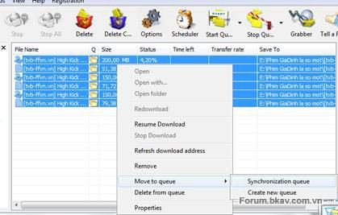{width="4.364583333333333in"
height="2.78125in"}

Mặc định các file tải về khi bấm **Download Later** sẽ được đặt ở **Main
Queue**. Nếu muốn bạn có thể chuyển chúng sang **Queue **khác.

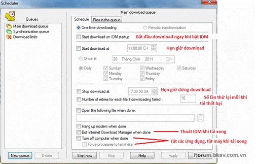{width="5.260416666666667in"
height="3.3645833333333335in"}

Cấu hình chính khi lập lịch

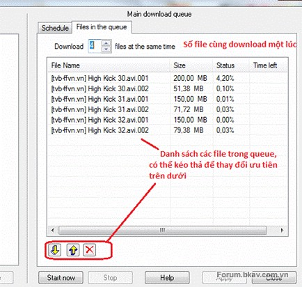{width="4.520833333333333in"
height="4.291666666666667in"}

Sau khi thiết lập xong, bấm **Start now** để bắt đầu ngay nếu muốn\
\
***8. Đặt các giới hạn***\
\
IDM là công cụ rất mạnh nhằm vận dụng toàn bộ khả năng của mạng để hỗ
trợ tối đa việc tải file, vậy nên đừng ngạc nhiên khi mạng gần như chết
hẳn lúc bạn download bằng IDM. Nếu muốn tải file song song khi làm những
việc khác, bạn phải đặt giới hạn.

-   Giới hạn lưu lượng tải về theo giờ

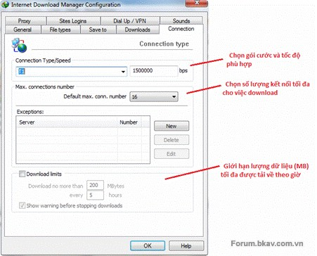{width="4.697916666666667in"
height="3.7916666666666665in"}

-   Giới hạn tốc độ tải

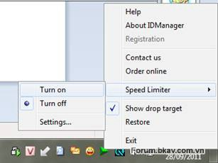{width="3.1979166666666665in"
height="2.3958333333333335in"}

Hoặc thiết lập ngay tại cửa sổ download

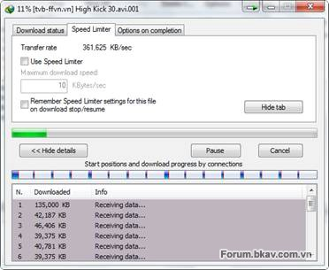{width="3.875in"
height="3.1770833333333335in"}

***9. Thủ thuật nhỏ***\
\
Giả sử bạn đã tải file được 50% nhưng gặp sự cố nên bị tắt mất, lúc bật
máy thì link tải đã hết hạn (expired). Thủ thuật sau sẽ giúp bạn không
phải tải lại từ đầu. 

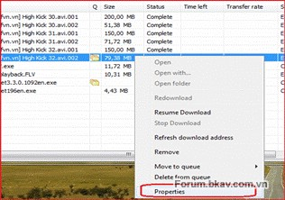{width="3.2916666666666665in"
height="2.3125in"}

Chuột phải vào file, chọn **Properties**

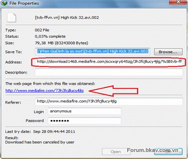{width="3.9270833333333335in"
height="3.3125in"}

Xóa trắng dòng **Address **rồi để đó và bấm vào đường link bên dưới để
tải lại

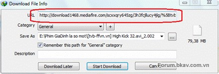{width="4.552083333333333in"
height="1.5416666666666667in"}

Nhanh tay copy URL từ hộp thoại này rồi paste vào khung Address ở cửa sổ
trên. Ấn OK và bây giờ bạn có thể **Resume download** rồi.\
\
***10. Kết luận***

-   Ưu điểm

    -   Tăng tốc download

    -   Tích hợp cùng trình duyệt để bắt video, nhạc …

    -   Hỗ trợ resume

    -   Hỗ trợ kéo thả rất mạnh

    -   Tải website (site grabber)

    -   Lên lịch download

    -   Giới hạn download

    -   Chiếm ít tài nguyên máy

<!-- -->

-   Nhược điểm

    -   Giá không rẻ (TruongAnJSC phân phối ở VN với giá 499k)

Với giao diện đơn giản, tính năng mạnh mẽ, không có gì ngạc nhiên khi
IDM là phần mềm download được ưa chuộng nhất ở VN (có lẽ cả trên thế
giới). Nếu bạn cần một trợ thủ download cũng như dư dả về tài chính thì
IDM chính là sự lựa chọn số một của bạn. 

11\. Hướng dẫn crack IDM

bước 1: sửa nội dung file hosts: C:\\WINDOWS\\system32\\drivers\\etc\\

thêm các dòng sau

1.  205.199.44.156 registeridm.com

2.  205.199.44.16 registeridm.com

3.  127.0.0.1 www.internetdownloadmanager.com

vào file hosts

điền key sau vào idm

1.  First name : abc

2.  Last name : abc

3.  Email : abc@abc.abc

4.  Serial : BGL4H-HJBXT-ABSUD-R31QJ

