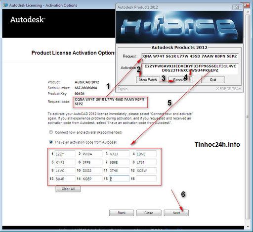

**AutoCad 2012 cải thiện bề mặt các công cụ mô hình 3D cho phép bạn để
đẩy hoặc kéo khuôn mặt, cạnh, và đỉnh để mô hình hình dạng phức tạp,
thêm vào các bề mặt nhẵn, và nhiều hơn nữa. Với các công cụ cho bề mặt,
rắn, và mô hình lưới, AutoCAD 2012 giúp bạn linh hoạt hơn và kiểm soát
đối với thiết kế 3D của bạn.Renovations dễ dàng hơn với hỗ trợ điểm
Cloud.**

**AutoCad 2012** là gì? Autocad là phần mềm dành riêng cho các kiến trúc
sư hay kỹ sư xây dựng dùng để xây dựng mô phỏng về bản vẽ thiết kế. Các
tính năng của **AutoCad 2012** bao gồm: hỗ trợ nhập và làm việc với các
định dạng từ SolidWorks, Pro/ENGINEER, CATIA, Rhino, NX….\
{width="4.84375in"
height="3.96875in"}\
**AutoCad 2012** cải thiện bề mặt các công cụ mô hình 3D cho phép bạn để
đẩy hoặc kéo khuôn mặt, cạnh, và đỉnh để mô hình hình dạng phức tạp,
thêm vào các bề mặt nhẵn, và nhiều hơn nữa. Với các công cụ cho bề mặt,
rắn, và mô hình lưới, AutoCAD 2012 giúp bạn linh hoạt hơn và kiểm soát
đối với thiết kế 3D của bạn.Renovations dễ dàng hơn với hỗ trợ điểm
Cloud.

{width="5.385416666666667in"
height="4.197916666666667in"}

Ảnh chụp AutoCAD 2012 trong quá trình cài đặt

**Yêu cầu hệ thống tối thiểu**

-   Hệ điều hành tối thiểu: Microsoft Windows XP Professional hoặc bản
    Home

-   Bộ vi xử lý Intel Pentium 4 hoặc lõi kép bộ xử lý AMD Athlon

-   Yều cầu RAM tối thiểu: 2 GB

-   Dung lượng ổ cứng còn trống: 1 GB

-   VGA với độ phân giải màn hình ít nhất là 1024 x 768 và hỗ trợ chế độ
    đúng màu.

-   Trình duyệt của Microsoft ® Internet Explorer ® 7.0 hoặc cao hơn.

-   Drive DVD-ROM (chỉ cần thiết để cài đặt)

**Hướng dẫn kỹ thuật AutoCAD 2012**

1\. Yêu cầu máy tính của bạn phải cài trước .Net Framework 4 trở lên nếu
không nó sẽ báo như sau

{width="6.666666666666667in"
height="5.15625in"}\
2. Thực hiện các bước theo hình hướng dẫn dưới đây để cài đặt và crack
AutoCAD 2012 FULL

{width="6.666666666666667in"
height="5.145833333333333in"}

{width="6.666666666666667in"
height="5.15625in"}

{width="6.666666666666667in"
height="5.166666666666667in"}

{width="6.520833333333333in"
height="5.041666666666667in"}

{width="6.666666666666667in"
height="5.166666666666667in"}

Sau khi kết thúc cài đặt chọn Finish.

Tiếp theo là Hướng dẫn crack phần quan trọng nhất

Mở AutoCAD 2012 lên và chọn Activate như hình bên dưới.\
{width="5.333333333333333in"
height="4.822916666666667in"}

{width="5.333333333333333in"
height="4.8125in"}

Tại đây,nếu xuất hiện thông báo như hình có nghĩa bước crack của bạn
chưa được,bạn có thể nhấn close rồi chọn lại Activate như bước trên,hoặc
nhấn vào Try again để làm lại.\
{width="5.791666666666667in"
height="5.291666666666667in"}

{width="5.333333333333333in"
height="4.854166666666667in"}

{width="5.333333333333333in"
height="4.875in"}

{width="5.333333333333333in"
height="4.885416666666667in"}\
Đây là màn hình làm việc

{width="7.5in"
height="5.333333333333333in"}
