**Để thực hiện cài đặt phần mềm AutoCAD 2007 trước hết chúng ta cần có
bộ cài phần mềm. Khi chúng ta đã có bộ cài đặt chúng ta thực hiện các
thao tác như Hướng dẫn cài đặt AutoCad 2007 bằng hình ảnh ở bên dưới.
Trước tiên ta truy cập vào thư mục chứa file cài đặt. Nhấp đôi chuột vào
file Setup**

Để thực hiện cài đặt phần mềm AutoCAD 2007 trước hết chúng ta cần có bộ
cài phần mềm. Khi chúng ta đã có bộ cài đặt chúng ta thực hiện các thao
tác như **Hướng dẫn cài đặt AutoCad 2007 bằng hình** **ảnh** ở bên
dưới.

Trước tiên ta truy cập vào thư mục chứa file cài đặt. Nhấp đôi chuột vào
file **Setup**

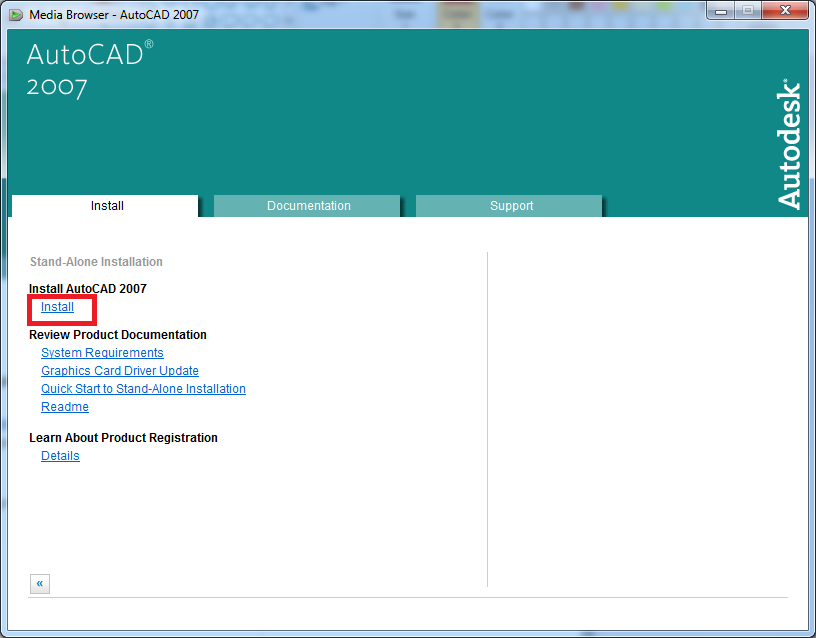

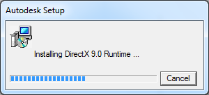

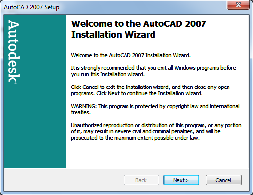

Nhấn chọn** I accept** để chấp nhận thông tin bản quyền

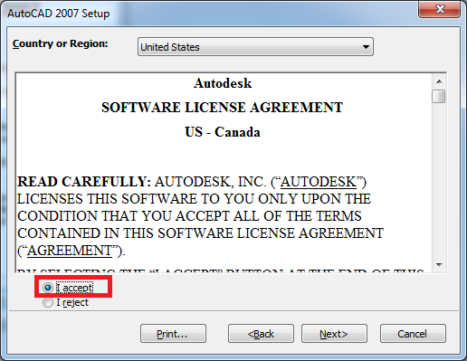

Điền **Serial numbers** (key bản quyền kèm theo đĩa CD AutoCad (ví dụ:
111-1111111)

Điền thông tin người sử dụng

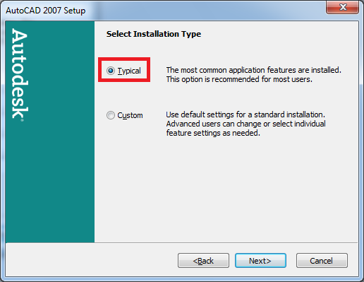

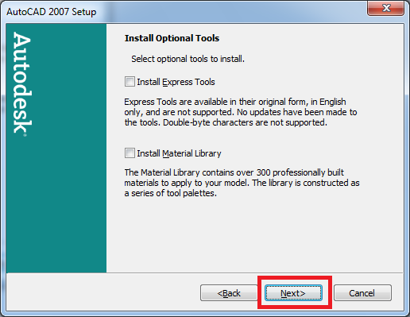

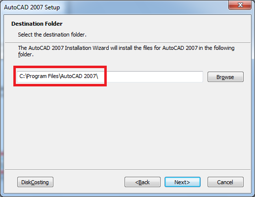

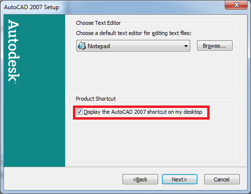

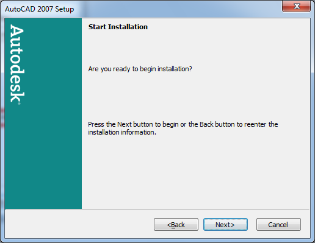

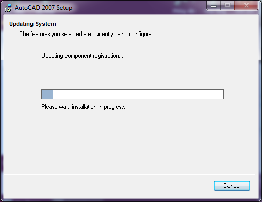

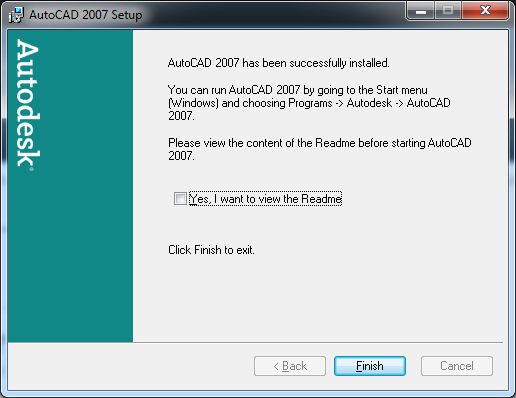

**Hướng dẫn Crack** (chỉ để học tập thôi
nhé 
)

Sau khi cài đặt xong, các bạn vào thư mục chứa source cài đặt autocad
2007, vào thư mục **crack **copy 2 file **dll **(xem ảnh minh họa), sau
đó vào **C:\\Program Files\\AutoCAD 2007** paste 2 file **dll** vào

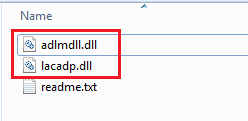

