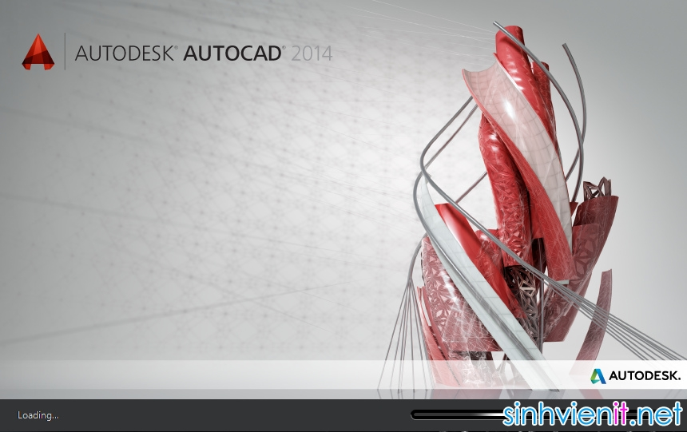
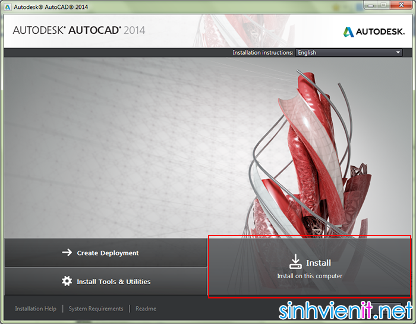
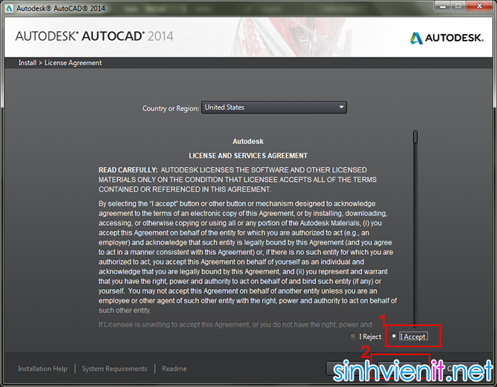
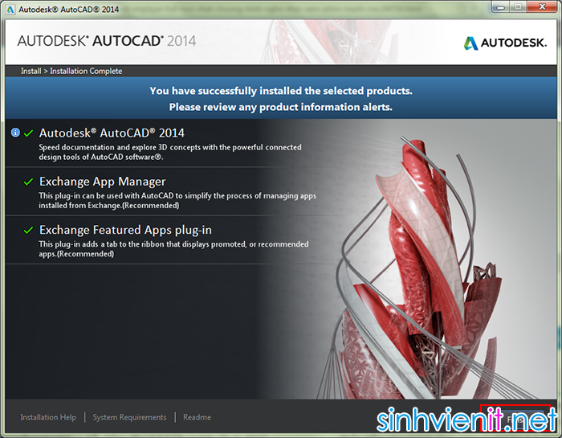
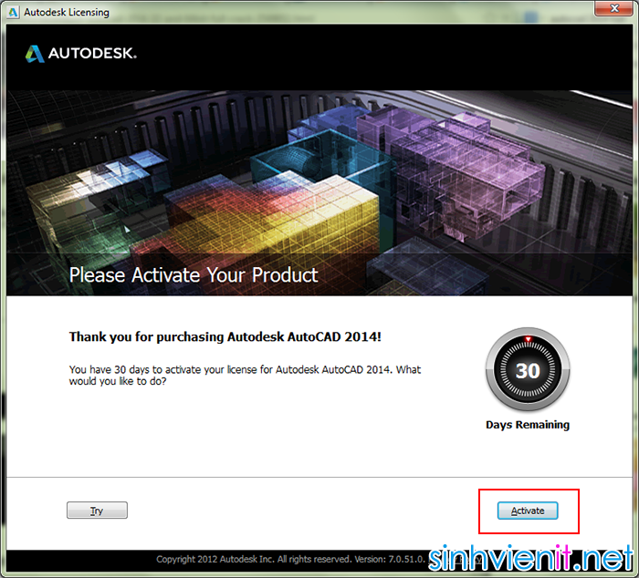
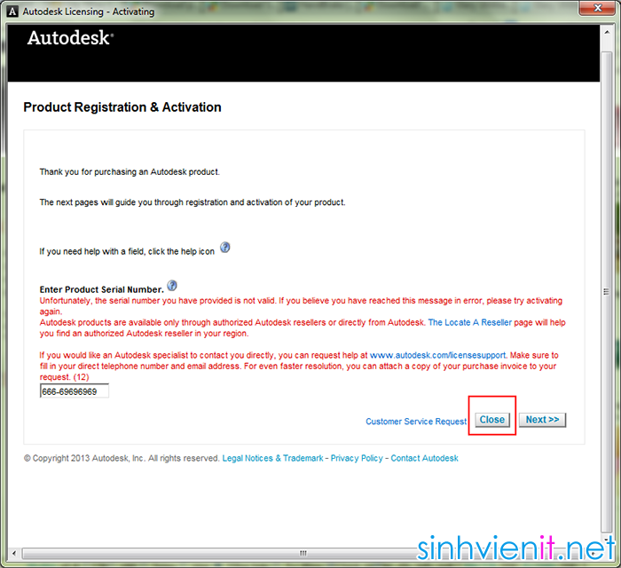
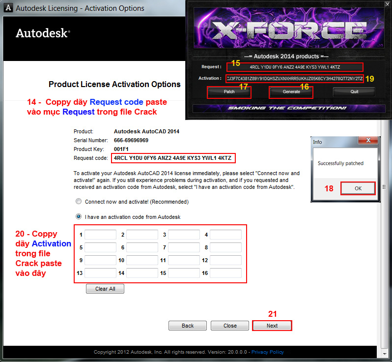
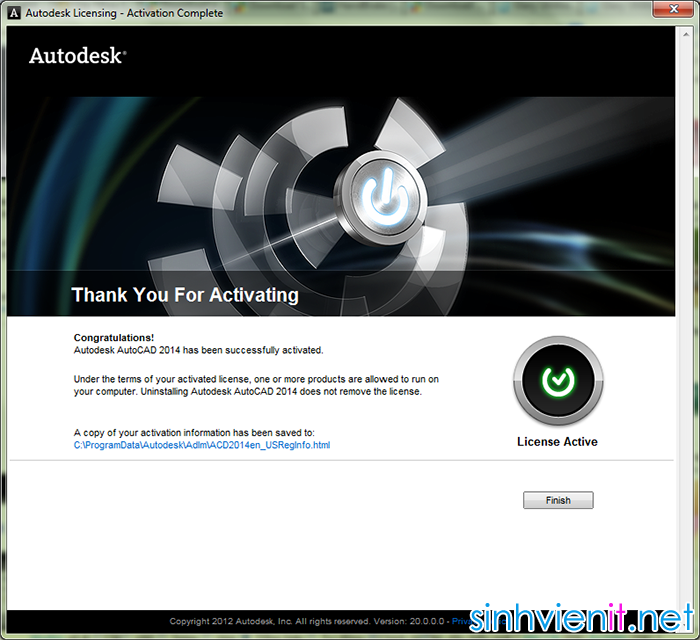

**TỔNG QUAN VỀ AUTODESK AUTOCAD**

Autodesk AutoCad 2014 cho phép bạn để giải quyết những vấn đề thiết kế
phức tạp nhất. Phương tiện của việc tạo ra các hình dạng tùy ý mô phỏng
theo một loạt các cơ quan thẩm định thiết kế bề mặt và thời gian sẽ giảm
đáng kể; bản vẽ tham số giúp đỡ để giữ trên tay tất cả các thông tin có
ích. ý tưởng dự án có thể được hình tượng trong PDF, cũng như trong thực
hiện mô hình, thu được bằng 3D in. Ngay cả khi không có những ý tưởng
không được biến thành hiện thực để nhanh chóng.

Hơn nữa bạn là một kỹ sư, kiến trúc sư thiết kế quan tâm nhiều đến
AutoCAD, công cụ hỗ trợ chính cho công việc của mình, thì hẳn bạn cũng
sẽ rất quan tâm đến sự phát triển của AutoCad qua các phiên bản phát
triển CAD của hãng Autodesk. Qua mỗi phiên bản phát triển, hãng Autodesk
đều mang lại cho người dùng những sự ngạc nhiên , bất ngờ bởi những công
cụ hỗ trợ bổ xung, các tính năng mới giúp cho công việc đồ hoạ, thiết kế
vốn đã rất khó khăn, trừu tượng trở nên đơn giản đi rất nhiều.

Các bạn click vào chữ Install để bắt đầu quá trình cài đặt

Tới màn hình quy định sử dụng, bản quyền các bạn có thể nhắm mắt mà chọn
I Agree, rồi nhấn Next

Màn hình đăng ký thông tin sản phẩm hiện ra, các bạn nhập số serial
này: *666-69696969*
Ở Product Key các bạn nhập 001F1
Xong rồi nhấn Next

Tới màn hình này, các bạn chọn thêm các tính năng, nếu không rành tốt
nhất cứ để mặc định, sau đó nhấn Install để bắt đầu quá trình cài đặt

Màn hình của quá trình cài đặt AutoCad 2014, có thể mất vài phút

Khi màn hình này hiện ra thì quá trình cài đặt đã thành công

Crack AutoCad 2014
Các bạn mở AutoCad 2014 lên, bên dưới là màn hình ở lần mở Autocad đầu
tiên, Các bạn check chọn như trong hình để chấp nhận quy định sử dụng
của AutoCad, xong nhấn Next để tiếp tục

Các bạn nhấn Activate để bắt đầu kích hoạt bản

Nếu gặp màn hình báo lỗi này, các bạn nhấn Close, và sẽ trở lại mình
hình bên trên, xong lại nhấn Activate 1 lần nữa là được

Tới màn hình này, các bạn chọn I have an activation code from AutoDesk

Màn hình thông báo đã kích hoạt bản quyền thành công

