**I. Các công cụ gồm có:**\
**1. Autocad 2005**\
[http://up.4share.vn/f/43727675767471...\_2005.rar.file](http://adf.ly/2860786/http:/up.4share.vn/f/4372767576747170/AutoCAD_2005.rar.file) \
Crack: [https://docs.google.com/file/d/0B9yi...dUYjNDODA/edit](https://docs.google.com/file/d/0B9yiWGuOzNCcTk5jeUdUYjNDODA/edit)\
**2. Nova+HS**\
[http://www.mediafire.com/?84aw60ql95dkio7](http://adf.ly/2860786/http:/www.mediafire.com/?84aw60ql95dkio7)\
**3. File cần có để cài được hamony sofware (setup 7)**\
[http://www.mediafire.com/?55ntik6a5gf0s2m](http://adf.ly/2860786/http:/www.mediafire.com/?55ntik6a5gf0s2m)\
**II. Cài đặt.**\
**Bước 1**: Cài AutoCad 2005. Để cài được thì bạn phải tắt User Account
Control bằng cách vào Start, gõ UAC ---&gt; Enter. Sau đó kéo cho thanh
cuộn xuống dưới cùng như hình này:\
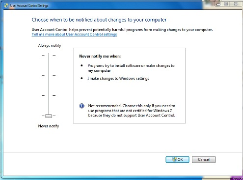{width="5.15625in"
height="3.8125in"}\
Tiếp theo, bạn cần khởi động lại máy tính (bước này rất quan trọng)\
Cài Cad2005 thì có lẽ là không cần thiết phải giới thiệu nữa.\
**Bước 2**: Cài chương trình nhận khóa cứng. Bạn chạy file hdd32, chọn
Next, chọn I accept the license agreement xong chọn Install\
Lưu ý: Bứoc này rất quan trọng, nếu cài đặt không thành công thì bước
sau cùng chắc chắn sẽ không được. Để biết cài đặt thành công hay không
thì sau khi cài đặt xong nó hiện lên bảng này:\
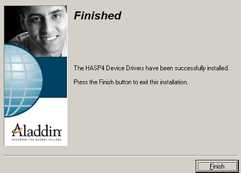{width="4.166666666666667in"
height="2.9895833333333335in"}\
thì mới là cài đặ thành công. Nếu mà cài đặt 1 lần không được thì lần 2.
Theo kinh nghiệm của mình thì thường đến lần 2 mới được. CÒn nếu lần 2
không được thì các bạn cài lại tiếp lần 3, nếu mà không được nưa thì
Remove đi, khởi động lại và cại lại. Các bạn nên dùng phần mềm Revo
Uninstall để tháo cài vì khi thaó cài nó sẽ xóa hết các registry cho
mình.\
**Bước 3**: Cài đặt khóa cứng. Trong bước này, trước tiên bạn phải copy
tất cả các files trong thư
mục [**Setup7**](http://adf.ly/2860786/http:/www.mediafire.com/?55ntik6a5gf0s2m) vào
trong ổ C:/window/system32.\
Tiếp theo, bạn chạy file setup trong thư mục Service Pack.\
Chọn Next.\
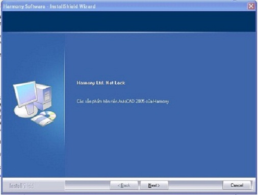{width="5.270833333333333in"
height="3.9791666666666665in"}\
Chọn I accept the terms of the license agrement sau đó chọn Next.\
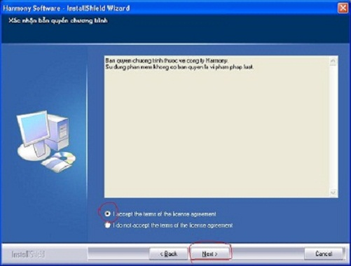{width="5.21875in"
height="3.9583333333333335in"}\
Điền Username và Company name xong chọn Next. \
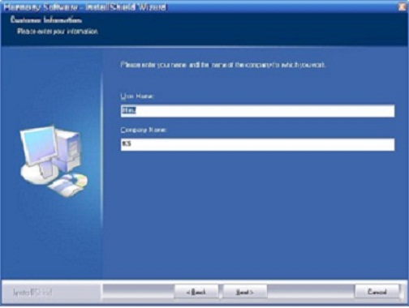{width="5.25in"
height="3.9583333333333335in"}\
Chọn cài đặt trên máy chủ xong chọn Next.\
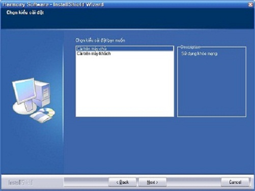{width="5.21875in"
height="3.90625in"}\
Chọn Install sau đó Chọn No, I will restart my computer later.\
*Sau khi cài xong bạn phải cài lại chương trình này 1 lần nữa. (chạy
file setup)*\
Chọn Modify.\
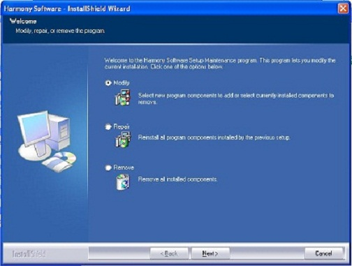{width="5.25in"
height="3.96875in"}\
Tích vào ô Main App rồi nhấn Next.\
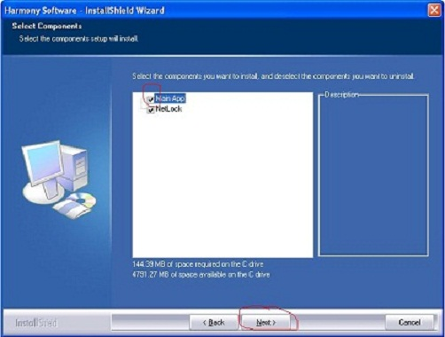{width="5.229166666666667in"
height="3.9583333333333335in"}\
Tiếp tục rồi lại chọn No, I will restart my Computer later.

*Bước 4*. Cài Nova. Bạn chạy file setup.exe\
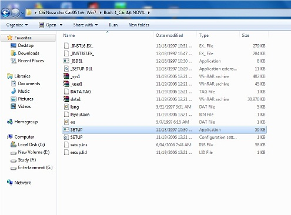{width="5.15625in"
height="3.8125in"}\
Chọn Next.\
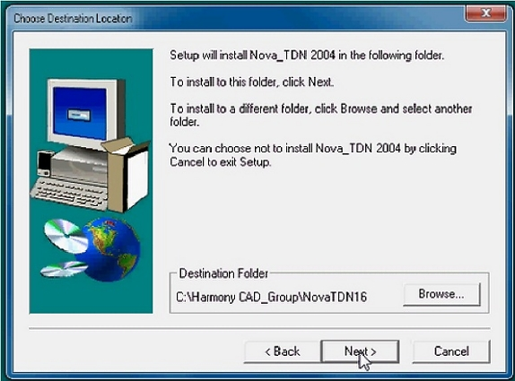{width="5.979166666666667in"
height="4.427083333333333in"}\
Chọn Typical rồi nhấn Next.\
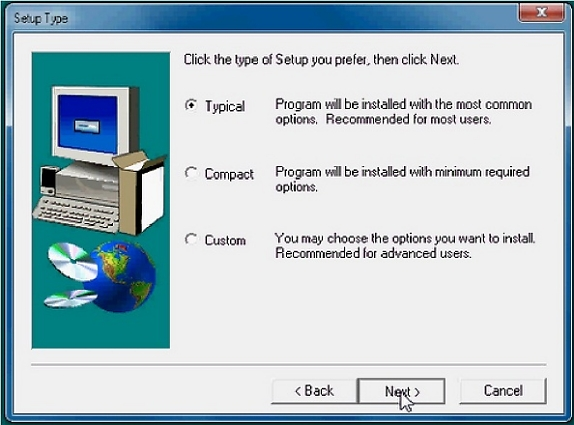{width="5.979166666666667in"
height="4.427083333333333in"}\
Tiếp tục nhấn Next cho đến hết.\
Đến đây thì cần khởi động lại máy tính.\
Sau khi khởi động lại máy tính, để chạy chương trình bạn chạy file
HASPHL2007 trong thư mục" khoa", \
Đầu tiên chọn Tab Driver rồi nhấn vào Install Driver. Nếu không thấy hộp
Insttall Driver chìm (tức là không kích được vào) thì các bạn Uninstall
driver đi, rồi mở lại chắc chắn hộp Ínttalll driver sẽ hiện lên\
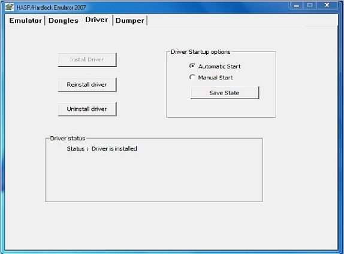{width="5.979166666666667in"
height="4.427083333333333in"}\
\
Chọn tab Emulator rồi nhấn Start service\
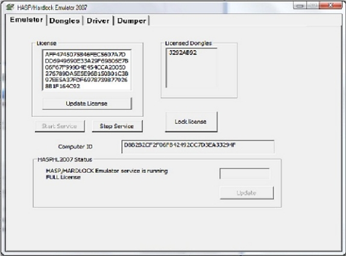{width="5.979166666666667in"
height="4.416666666666667in"}\
Chọn Tab Dongles rồi nhấn Load dump\
Tuỳ chương trình bạn cần mà chọn File \*.DNG của NoVa hay HS, đối với
nova thì bạn chọn file NoVa2004.DNG ở trong thư mục: NoVa
chuan/khoa/HS/NoVa đã dow ở trên.\
\
Khoá sẽ được lưu giữ trong chương trình đến khi bạn load dump khác\
Nếu bạn muốn chương trình HASPHL2007 chạy khi máy tính khởi động thì
chọn tab Driver rồi chọn như hình dưới rồi nhấn rồi nhấn Save State\
\
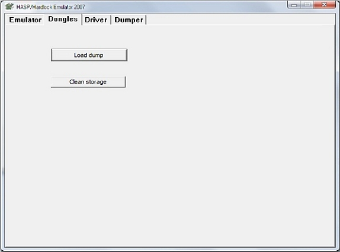{width="5.979166666666667in"
height="4.427083333333333in"}\
Sau cùng sang Tab Emulator rồi nhấn vào Start Service-&gt;Lock license
-&gt; Update License\
\
Để không phải làm lại các bước này, bạn sang Tab Driver, tích chọn vào
Automatic Start, sau đó nhấn vào Save State. Thoát HASP.\
Để khởi động chương trình, sau mỗi lần khởi động máy tính, trước khi
khởi động Nova bạn phải chạy chương trình Harmony Software check Active
Module (ngoài Desktop), nhấn chọn “Thiết lập”\
{width="5.979166666666667in"
height="4.427083333333333in"}\
Nếu khóa đã được xác lập thì sẽ vào bảng thiết lập (hình dưới)\
Nếu khóa chưa được xác lập sẽ hiện ra thông báo Could not connect to
server\
Ở cửa sổ hiện ra, nhấn vào nút (theo mũi tên) rồi tìm đường dẫn đến file
acad.exe trong C:\\Program Files\\Auto Cad 2005\\acad.exe, sau đó nhấn
vào Run Module, nhấn Ok. Lưu ý là lần tiếp theo chỉ cần nhấn vào Ok là
được.\
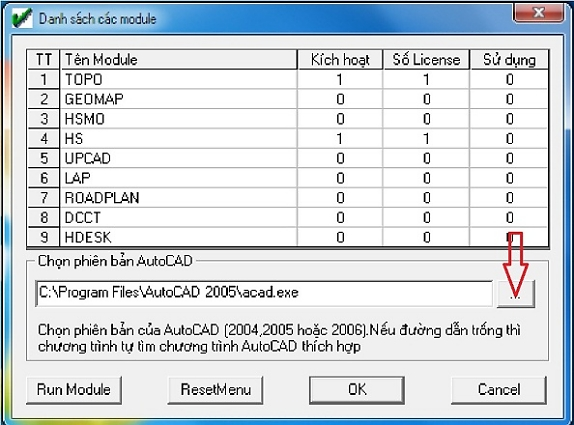{width="5.979166666666667in"
height="4.427083333333333in"}

*Bước 5*. Chỉnh fonts. \
Download font
về:[http://www.mediafire.com/?dwa5xhev2sv9n07](http://adf.ly/2860786/http:/www.mediafire.com/?dwa5xhev2sv9n07)\
Chạy file VN\_SysFonts. Khởi động lại máy tính\
Copy folder FONTHTVN và file CHANGEFONT.BAT vào ổ C\
Chạy file CHANGEFONT.BAT bằng cách nhấn chuột phải, chọn Run as
Administrator\
Tiếp theo, vào registry bằng cách gõ regedit trong ô Search programs and
files, nhấn Enter\
Tìm đến khóa HKEY\_LOCAL\_MACHINE\\SOFTWARE\\Microsoft\\Windows NT\\
CurentVersion\\Fonts. Sau đó tìm tới các mục sau\
MS Sans Serif 8,10,12,14,18,24\
MS Sans Serif 8,10,12,14,18,24 (VGA res)\
MS Serif 8,10,12,14,18,24\
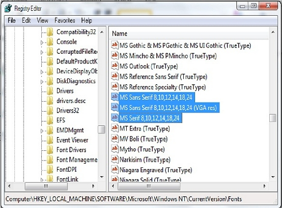{width="5.979166666666667in"
height="4.427083333333333in"}\
Nhấn chuột phải lần lượt vào các khóa này, chọn Modify, đối với 2 fonts
MS Sans Serif và MS Sans Serif (VGA res) thì đổi giá trị thành
C:FONTHTVN\\SSERIFE.FON\
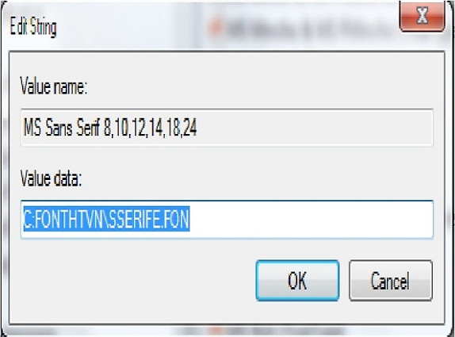{width="5.979166666666667in"
height="4.427083333333333in"}\
Với font MS Serif thì đổi giá trị thành VNSERIFE.FON\
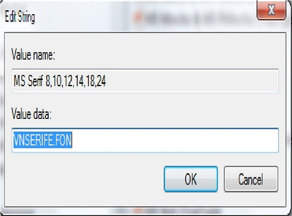{width="5.979166666666667in"
height="4.427083333333333in"}\
Khởi động lại máy tính. \
Tiếp theo bạn gõ color trong Start, chọn Change Window color and metric,
Enter \
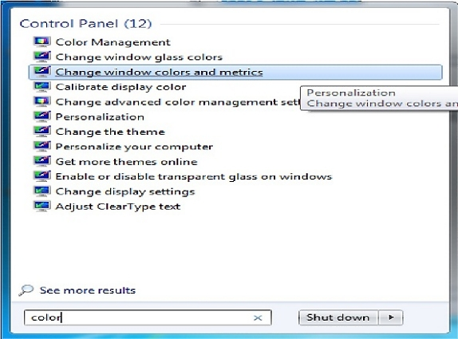{width="5.979166666666667in"
height="4.427083333333333in"}\
Trong cửa sổ Window Color and Appearance chuyển các font trong Message
Box, Active Title và Menu thành MS Sans Serif.\
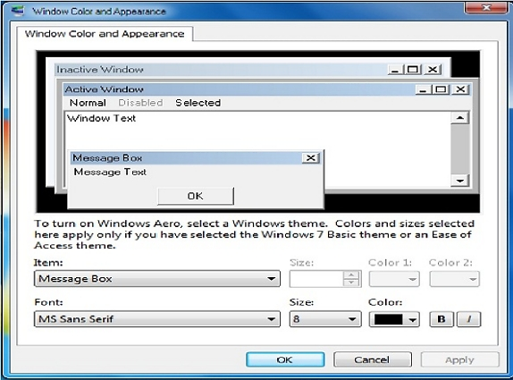{width="5.979166666666667in"
height="4.427083333333333in"}
