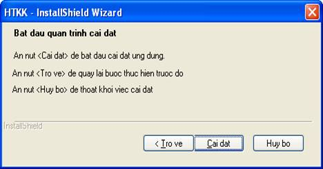
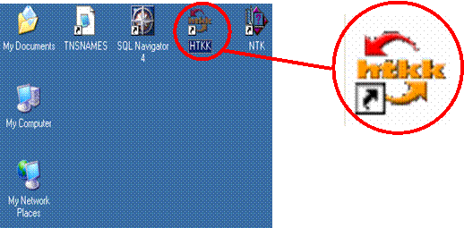
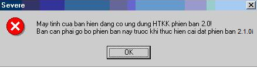
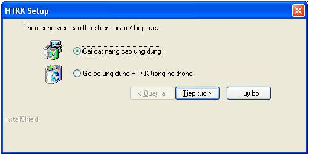
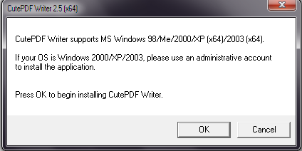
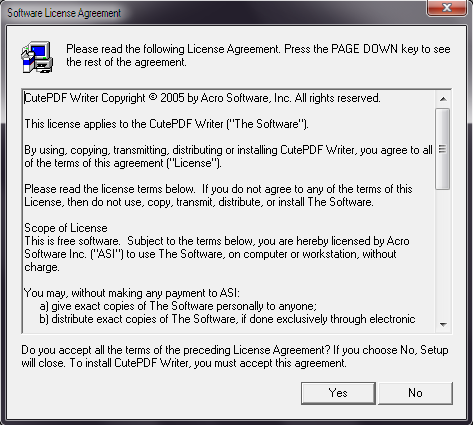
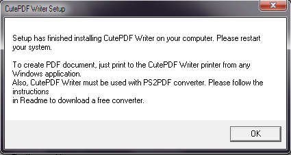
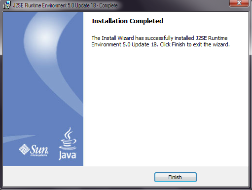

> TỔNG CỤC  THUẾ

 

 

 

 

 

 

 

 

 

 

 

**TÀI LIỆU HƯỚNG DẪN CÀI ĐẶT **

**ỨNG DỤNG HỖ TRỢ KÊ KHAI THUẾ**

(DÙNG CHO DOANH NGHIỆP)

** **

** **

** **

** **

** **

** **

** **

** **

Mục Lục {#mục-lục .TOCHeading}
=======

[I. Cài đặt chương trình HTKK 2.1.0i
3](#cài-đặt-chương-trình-htkk-2.1.0i)

[1. Đối với hệ thống chưa có ứng dụng HTKK
3](#đối-với-hệ-thống-chưa-có-ứng-dụng-htkk)

[2. Đối với hệ thống đang có ứng dụng HTKK
7](#đối-với-hệ-thống-đang-có-ứng-dụng-htkk)

[a. Đối với hệ thống có ứng dụng HTKK 2.0
7](#đối-với-hệ-thống-có-ứng-dụng-htkk-2.0)

[b. Đối với hệ thống có ứng dụng HTKK 2.1.0i và muốn nâng cấp
7](#đối-với-hệ-thống-có-ứng-dụng-htkk-2.1.0i-và-muốn-nâng-cấp)

[3. Gỡ bỏ HTKK 2.1.0i 8](#gỡ-bỏ-htkk-2.1.0i)

[II. Cài đặt chương trình in file PDF
8](#cài-đặt-chương-trình-in-file-pdf)

[1. Cài đặt chương trình “Cute PDF Writer”
8](#cài-đặt-chương-trình-cute-pdf-writer)

[2. Cài đặt “Converter” 10](#cài-đặt-converter)

[III. Cài đặt môi trường Java cho trình duyệt IE
10](#cài-đặt-môi-trường-java-cho-trình-duyệt-ie)

Hà nội, 08/2009

**HƯỚNG DẪN CÀI ĐẶT PHẦN MỀM HỖ TRỢ KÊ KHAI THUẾ **

Cài đặt chương trình HTKK 2.1.0i
================================

 Đối với hệ thống chưa có ứng dụng HTKK
---------------------------------------

Đối với việc cài đặt phần mềm ứng dụng từ đĩa CD, các bước tiến hành như
sau:

-   Bước 1: Kích đúp chuột trái vào **My Computer** trên màn hình, chọn
    mở ổ đĩa CDROM.

-   Vào thư mục “**HTKK**” chạy file **setup.exe**.

<!-- -->

-   Bước 2: Xuất hiện màn hình cài đặt như sau:

>  
>
> {width="4.6875in"
> height="2.1875in"}

Trên màn hình xuất hiện giao diện để chọn thư mục cài đặt như sau:

> {width="5.3125in"
> height="2.375in"}
>
>  

Nhấn nút “**Tiep tuc**” để thực hiện việc cài đặt, sau khi nhấn màn hình
hiện ra như sau

{width="5.270833333333333in"
height="2.3333333333333335in"}

Mặc định thư mục cài đặt sẽ trỏ đến thư mục **HTKK** trong thư mục
**Program Files. **

Nếu không cần thay đổi thư mục mặc định chọn **“Tiep tuc” &gt;**

Để huỷ cài đặt chọn nút **”Huy bo”**

Nếu muốn thay đổi thư mục chọn nút “**Chon…”**

> {width="4.09375in"
> height="3.1875in"}

 

Chọn thư mục cài đặt rồi chọn **“Tiep tuc”&gt;** Sẽ xuất hiện màn hình
cài đặt như sau:

> {width="4.875in"
> height="2.5520833333333335in"}
>
>  

Trên màn hình sẽ chỉ rõ chi tiết các thao tác có thể. Nhấn nút “**Cai
dat**” để bắt đầu cài đặt ứng dụng. Màn hình sẽ hiện ra như sau

{width="5.25in"
height="4.020833333333333in"}

Kết thúc quá trình cài đặt, nhấn nút “**Finish**” hiển thị màn hình sau.

 

> {width="5.25in"
> height="4.020833333333333in"}
>
>  

Đóng các ứng dụng khác đang mở.

Nhấn nút **Finish** đế hoàn thành quá trình cài đặt.

Chờ máy tính khởi động lại (bắt buộc phải khởi động lại).

 

Sau khi kết thúc quá trình cài đặt, trên màn hình Desktop xuất hiện biểu
tượng HTKK.

{width="5.395833333333333in"
height="2.65625in"}**                    **

**  **

Kích đúp vào biểu tưởng HTKK để khởi động chương trình.

Đối với hệ thống đang có ứng dụng HTKK
--------------------------------------

### Đối với hệ thống có ứng dụng HTKK 2.0

-   Khi thực hiện cài đặt ứng dụng HTKK 2.1.0i. Nếu trên máy tính đang
    sử dụng hệ thống HTKK 2.0 thì chương trình cài đặt sẽ xuất hiện
    thông báo sau

> {width="4.5625in"
> height="1.21875in"}

-   Chọn **OK**.       

-   Sau đó vào “Control Panel/Add or Remove Programs” để thực hiện gỡ bỏ
    chương trình HTKK 2.0 đang tồn tại trong hệ thống.

-   Khởi động lại máy tính.

-   Quay lại thực hiện việc cài đặt HTKK 2.1.0i theo phần “1” ở trên.

### Đối với hệ thống có ứng dụng HTKK 2.1.0i và muốn nâng cấp

-   Khi thực hiện cài đặt ứng dụng HTKK 2.1.0i. Nếu trên máy tính đang
    sử dụng hệ thống HTKK 2.1.0i thì chương trình cài đặt sẽ xuất hiện
    thông báo sau :

    {width="5.322916666666667in"
    height="2.6770833333333335in"}

-   Nhấn nút “**Tiep tuc**” để bắt đầu thực hiện việc cài đặt nâng cấp
    ứng dụng HTKK2.1.0i

-   Chờ cho đến khi kết thúc việc nâng cấp nhấn nút “**Finish**” để hoàn
    thành việc nâng cấp.

 Gỡ bỏ HTKK 2.1.0i 
-------------------

-   Khi thực hiện cài đặt ứng dụng HTKK 2.1.0i. Nếu trên máy tính đang
    sử dụng hệ thống HTKK2.1.0i thì chương trình cài đặt sẽ xuất hiện
    thông báo sau:

>  {width="5.322916666666667in"
> height="2.6770833333333335in"} 

-   Chọn vào lựa chọn “**Go bo ung dung HTKK trong he thong**” sau đó
    nhấn nút “**Tiep tuc**” để bắt đầu thực hiện việc gỡ bỏ ứng dụng
    HTKK1.3.0 đã tồn tại trong hệ thống. sẽ xuất hiện thông báo

> {width="2.28125in"
> height="1.1145833333333333in"} 
>
>  
>
>  

 

-   Chọn “**Yes**” để thực hiện gỡ bỏ ứng dụng HTKK1.3.0 đã tồn tại

> Chờ cho đến khi kết thúc nhấn nút “**Finish**” để hoàn thành.

Cài đặt chương trình in file PDF
================================

Cài đặt chương trình “Cute PDF Writer”
--------------------------------------

-   Bước 1: Nhấn đúp chuột vào file:

    **\[CDROM\]:\\PDF Writer\\CuteWriter.exe.** Xuất hiện thông báo:

> {width="4.416666666666667in"
> height="2.2083333333333335in"}

-   Bước 2: Nhấn nút “OK”. Xuất hiện thông báo:

    {width="4.145833333333333in"
    height="1.8020833333333333in"}

-   Bước 3: Nhấn “Yes”. Xuất hiện thông báo:

    {width="4.927083333333333in"
    height="4.427083333333333in"}

-   Bước 4: Nhấn “Yes” để cài đặt chương trình. Sauk hi cài đặt xuất
    hiện thông báo:

    {width="4.427083333333333in"
    height="2.3645833333333335in"}

-   Nhấn “OK” để kết thúc cài đặt.

Cài đặt “Converter”
-------------------

-   Bước 1: Nhấn đúp chuột vào file

    **“\[CDROM\]:\\PDF Writer\\converter.exe”**. Xuất hiện thông báo:

    {width="4.40625in"
    height="1.4791666666666667in"}

-   Nhấn nút Setup để cài đặt.

Cài đặt môi trường Java cho trình duyệt IE
==========================================

-   Bước 1: chạy file
    **\[CDROM\]:\\J2SE\\jre-1\_5\_0\_18-windows-i586-p.exe.** Xuất hiện
    màn hình:

    {width="5.34375in"
    height="4.03125in"}

-   Bước 2: Nhấn “Accept” để cài đặt chương trình. Xuất hiện thông báo:

    {width="5.322916666666667in"
    height="4.010416666666667in"}

-   Nhấn “Finish” để kết thúc.

