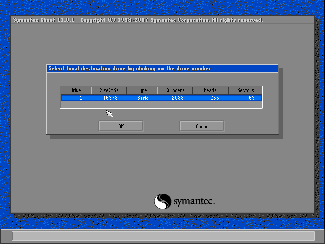

Nhắc đến ghost thì chúng ta đã quá quen thuộc với con ma này rồi phải
không các bạn, thậm Chí ở VN hễ cứ nhắc đến việc backup hoặc restore dữ
liệu là người ta đưa ngay từ ghost vào (giống như trong SG người ta quen
gọi các loại xe máy là xe Honda). Có lẽ do đây là một công cụ free của
Norton nên nó không thường xuyên cập nhật các công nghệ mới,phiên bản
mới nhất của ghost là 14.0, chạy trên nền PE đã cho phép add thêm driver
trong quá trình ghost nhưng có lẽ là phải theo Acronis dài dài. Tuy
nhiên chính sự lâu đời, phổ biến đơn giản dễ dùng mà ghost vẫn được sử
dụng rất nhiều, nhất là trong việc backup phân vùng. Nguyên tắc hoạt
động của ghost là chụp ảnh cấu trúc của phân vùng hay ổ cứng để lưu
thành file image (file này nhỏ hơn rất nhiều so với dung lượng thực của
dữ liệu có trong ổ) chính vì vậy mà ghost thường dùng để backup dữ liệu
trong toàn bộ phân vùng hay ổ cứng.

Sau đây tối sẽ hướng dẫn các bạn sử dụng một tính năng hay sử dụng của
phần mềm này

Trước tiên bạn cần chỉnh Bios để có thể boot được từ USB hoặc CD

Bạn chọn khởi động vào Hiren Boot tại cửa sổ menu chính của HRB bạn chọn
**Disk Clone Tools**

{width="5.99375in"
height="4.097222222222222in"}

Tiếp theo bạn chọn **Norton Ghost**

{width="5.99375in"
height="4.104166666666667in"}

Chọn tiếp Ghost (Normal)

{width="6.0in"
height="4.116666666666666in"}

Hiện ra bảng cho phép bạn lựa chọn giao tiếp thông thường bạn chọn Auto,
tuy nhiên với một số main đời mới có sử dụng chuẩn AHCI cho ổ CD-Sata
thì bạn cần chọn XCDROM và nhấn No đến khi không còn hiện ra thông báo
nào nữa.

{width="5.99375in"
height="3.3180555555555555in"}

Bạn chú ý đối với MTXT sử dụng Chipset Nam có ICH9 trở lên thì Ghost
trong đĩa CD sẽ không còn hỗ trợ, một mẹo nhỏ là bạn hãy tạo HRB trên
USB. Bài sau mình sẽ hướng dẫn một số cách tạo USB boot đơn giản.

{width="5.99375in"
height="3.3444444444444446in"}

Sau khi qua một số tùy chỉnh ta sẽ vào giao diện chính của phần mêm
ghost, tại đây sẽ hiện ra một số thông báo về phiên bản và thỏa thuận sử
dụng bạn quyền của phần mềm. Bạn nhấn OK để tiếp tục

{width="5.99375in"
height="4.227083333333334in"}

Phần mềm ghost về cơ bản là một phần mềm đơn giản và dễ sử dụng tuy
nhiên chính sự đơn giản đó thường làm người dùng nhầm lẫn.

Bạn hãy phân biệt giữa khái niệm Partition và Disk, người ta dùng từ “ổ
C” từ này về mặt kỹ thuật là không chính xác vì C chỉ là một phân vùng
trên ổ cứng (partition C in disk 0)

Ổ cứng là ổ thư 1 (ổ Seagate, Samsung) được chia ra thành cách phân vùng
(C, D, E...)

Menu thực thi của phần mềm có hai dạng cơ bản đó là

Disk to Disk (clone hai ổ sang nhau)

from Image (Bung một file ảnh vào một ổ cứng)

Partition to Partition (clone hai partition sang nhau)

From Image (Bung một file anh vào một phân vùng)

{width="6.0in"
height="4.486805555555556in"}

Menu Parrtition from Image là menu hay được sử dụng nhất tuy nhiên một
số ngưới sử dụng thường nhầm với menu Disk form Image nên khi ghost xong
mà không biết ổ D và E của mình đã đi đâu mất. Các trường hợp mất dữ
liệu do ghi đè một dữ liệu khác lên sẽ rất khó lấy lại vì vậy mà tôi
khuyên các bạn hãy nhìn cho kỹ trước khi làm.

{width="6.0in"
height="4.486805555555556in"}

Sau khi vào menu Partition from Image tại cửa sổ Image file name to
restore from bạn sử dụng phím tab để di chuyển qua lại giữa các menu
hoặc nhấn tổ hợp phím Alt+I để thả menu ổ đĩa xuống, sau đó tìm đường
dẫn đến nới chứa file backup có dạng \*.gho, file đó có thể là từ ổ CD,
USB, Box...

{width="5.99375in"
height="4.5in"}

{width="6.0in"
height="4.50625in"}

Ở đây tôi bung file backup từ đĩa DVD là bản XP-SP2 trial có dung lượng
khoảng 1,7 GB tuy nhiên sẽ có lúc bạn sử dụng bản ghost với 2 đĩa CD
trong quá trình bung ghost phần mềm sẽ yêu cầu bạn cho tiếp các đĩa còn
lại vào ổ.

{width="6.0in"
height="4.5in"}

Cửa sổ kế tiếp tiếp cho biết thông tin về file image được tạo từ quá
trình backup từ phân vùng C có tên System có tổng dung lượng là 25 GB và
có lượng dữ liệu trong đó là 3.38 GB

{width="6.0in"
height="4.486805555555556in"}

Cửa sổ này cho phép bạn chọn ổ cứng mà bạn muốn bung file ghost cái này
chỉ gặp khó khăn khi máy của bạn có nhiều ổ cứng, bạn hãy phân biệt
chúng bằng dung lượng và thứ tự từ trên xuống dưới tương ứng với thứ tự
boot trong bios. Trong trường hợp này ta chỉ cần nhấn OK.

{width="6.0in"
height="4.5in"}

Cửa sổ này bạn chọn phân vùng cần bung lên đến đây bạn hãy quên những
cái tên theo thứ tự ABCD đi vì trong DOS thứ tự đó không còn đúng nữa
hay căn cứ vào tên phân vùng (System – Data) hay đặc điểm của phân vùng
(tổng dung lượng, dung lượng chống). Theo thống kê ngưới sử dụng rất hay
nhầm ở mục này nhất là khi các phân vung chưa được định dạng
(Unlocation)

Tại đây bạn có thể điều chỉnh dung lượng phân vùng C cho nhỏ bớt đi, nếu
không điều chỉnh gì thì chế độ mặc định của phần mềm sẽ tự zise bằng
đúng dung lượng gốc của phân vùng được bung.

{width="6.0in"
height="4.5in"}

Tại cửa sổ này nếu bạn đã chác chắn, bạn hãy nhấn yes

{width="6.0in"
height="4.5in"}

Quá trình ghost diễn ra, phần mềm sẽ phân tích hệ thống. Tùy thuộc vào
mức độ nén của file ghost nơi lưu trữ và tình trạng phân vung được bung,
phần mềm sẽ phân tích và cho biết thời gian tương đối mà bạn phải đợi.
Các thông số như tốc độ copy, tổng dung lượng và dung lương đã copy
được.

Bảng dưới cho biết phần mềm đang copy đến file nào

{width="6.0in"
height="4.5in"}

{width="6.0in"
height="4.5in"}

Trong quá trình này thường xảy ra các lỗi như sau:

{width="6.0in"
height="4.50625in"}

{width="6.0in"
height="4.5in"}

***Nguyên nhân của các lỗi trên thường do ***

1.  Khi backup bị lỗi hoặc trong quá trình lưu trữ file ghost không tốt

2.  Do CD, USB, Box đọc kém

3.  Ram

4.  HDD

Bạn có thể dùng công cụ check có ngay trong phần mềm để kiểm tra
file.gho trước khi thao tác

Quá trình hoàn thành bạn nhấn Reset Computer

{width="6.0in"
height="4.5in"}
