**Cách khôi phục (Recovery) hệ điều hành từ file Backup (\*.TIB)**

Để cài windows trên các máy tính xách tay đời mới có sử dụng chuẩn điều
khiển ổ cứng AHCI là rất khó và hầu như không thể thực hiện với phương
pháp Ghost, có một số hướng dẫn add driver Sata vào đĩa cài đặt windows
tuy nhiên thực tế sử dụng ở các công ty bán phần cứng máy tính thì không
thể cài win một cách thủ công như vậy được

Trước tiên chúng ta sẽ bắt đầu tìm hiểu khái niệm AHCI

AHCI (Advanced Host Controller Interface) là một trình điều khiển ổ cứng
của Sata Controller (điều khiển giao tiếp với ổ cứng SATA) trên chipset
Nam.

Đặc điểm chế độ AHCI còn cho phép cắm nóng (hot plug) ổ cứng, ổ quang
SATA khi hệ thống đang hoạt động và sử dụng công nghệ NCQ cho phép
truyền nhận dữ liệu tốc độ lên đến 3Gbps hơn gấp đôi tốc độ trên IDE 133

Thời gian tìm kiếm một dữ liệu trên ổ cứng phụ thuộc vào hai yếu tố
chính đó là việc xác định vị trí của dữ liệu và vị trí tương đối của đầu
đọc với dữ liệu số trên đĩa từ.

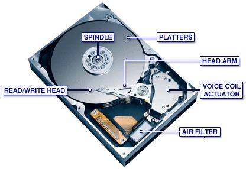

Công nghệ NCQ (Native Command Queuing – Hàng lệnh chờ) có chức năng phân
tích, sắp xếp các câu lệnh cần thực thi để tối ưu việc truy xuất dữ liệu
từ ổ cứng theo yêu cầu của nhiều ứng dụng cùng lúc trong môi trường đa
nhiệm. Nhờ đó cải thiện tốc độ đọc/ghi của ổ cứng, góp phần nâng cao
hiệu năng hoạt động của hệ thống.

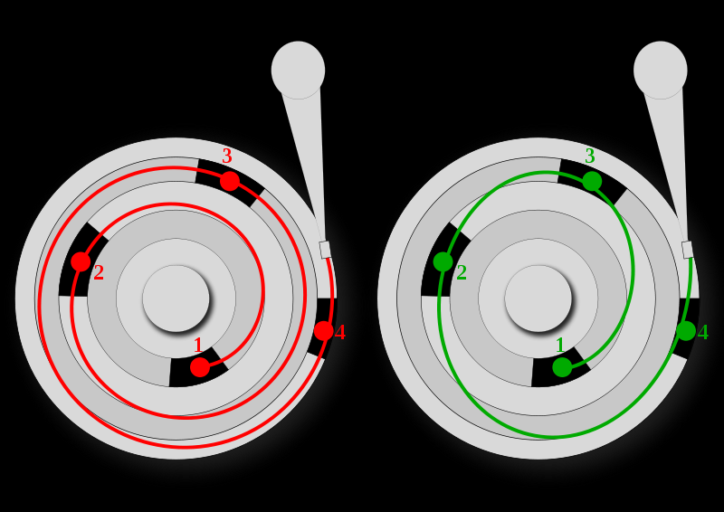

Trong các main board hiện đại có trình điều khiển cho ổ cứng Sata (SATA
Controller) hoạt động với hai chế độ Compatible Mode (Stande IDE Mode)
và AHCI Mode (Enchance Mode)

Đế có driver cho trình điều khiển ổ cứng bạn cần tải về từ side của hãng
sản xuất mainboard. Trên thị trường hiện nay có các loại phổ biến như
sau: Intel, AMD-Ati, Nvidia, Silicon, Jmicron, Via, Sis,...

Ở chế độ mặc đinh thì các mainboard thường bật chế độ này chính vì vậy
mà khi bạn không cài driver sata cho hệ điều hành thì khi bạn mặc định
các tùy chỉnh trong mainboard thì khi khởi động bạn sẽ bị màn hình xanh.

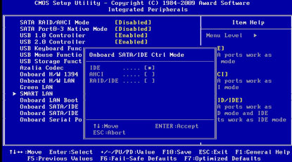

Danh sách các chipset Intel hỗ trợ AHCI

-   Intel® ICH10R/DO SATA RAID/AHCI controller hub

-   Intel® ICH10D SATA AHCI controller hub

-   Intel® ICH9M-E SATA RAID/AHCI controller hub

-   Intel® ICH9M AHCI controller hub

-   Intel® 82801IR/IO Controller Hub (ICH9R/DO) - RAID and AHCI

-   Intel® 82801HEM I/O Controller Hub (ICH8M-E) - RAID and AHCI

-   Intel® 82801HBM I/O Controller Hub (ICH8M) - AHCI only

-   Intel® 82801HR/HH/HO I/O Controller Hub (ICH8R/DH/DO) - RAID and
    AHCI

-   Intel® 631xESB/632xESB I/O Controller Hub - RAID and AHCI

-   Intel® 82801GHM I/O Controller Hub (ICH7MDH) - RAID only

-   Intel® 82801GBM I/O Controller Hub (ICH7M) - AHCI only

-   Intel® 82801GR/GH I/O Controller Hub (ICH7R/DH) - RAID and AHCI

-   Intel® 82801FR I/O Controller Hub (ICH6R) - RAID and AHCI

-   Intel® 82801FBM I/O Controller Hub (ICH6M) - AHCI only

Trước tiên bạn tùy chỉnh trong mainboard để có thể boot bằng CD hoặc USB
hoặc qua mạng...

Tại giao diện đầu tiên bạn chọn Acronis True Image Echo Workstation ....

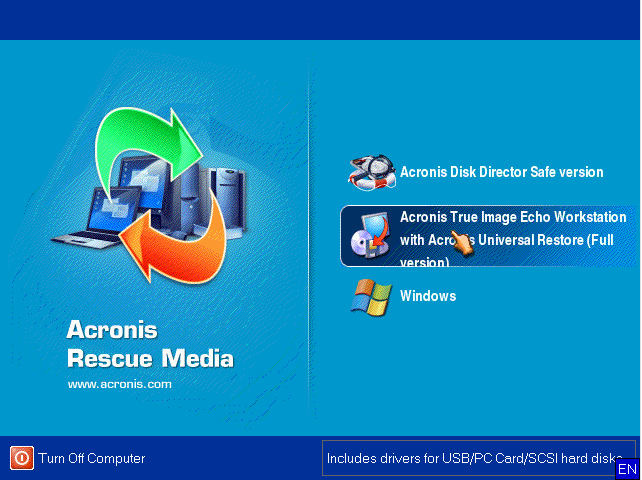

Sau khi khởi động vào phần mềm tại bảng điều khiển bạn nhấn chọn
Recovery để bung hệ điều hành vào phân vùng C

Nhấn Next

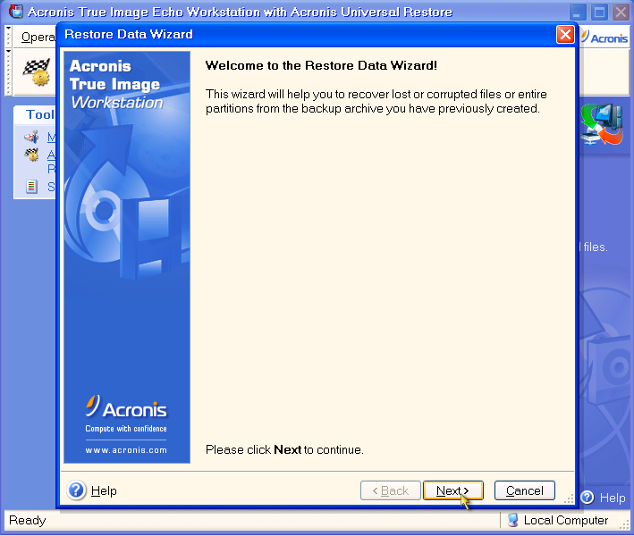

Chọn **file.tib** là file gốc chứa hệ điều hành đa cấu hình được tạo từ
một máy khác tại đây cho biết file đó được tạo từ một máy tính có ổ cứng
80 GB và ổ C có dung lượng 14,53 GB. Bạn có thể bung file này từ ổ CD, ổ
cứng, USB hay box và thậm chí là qua mạng.

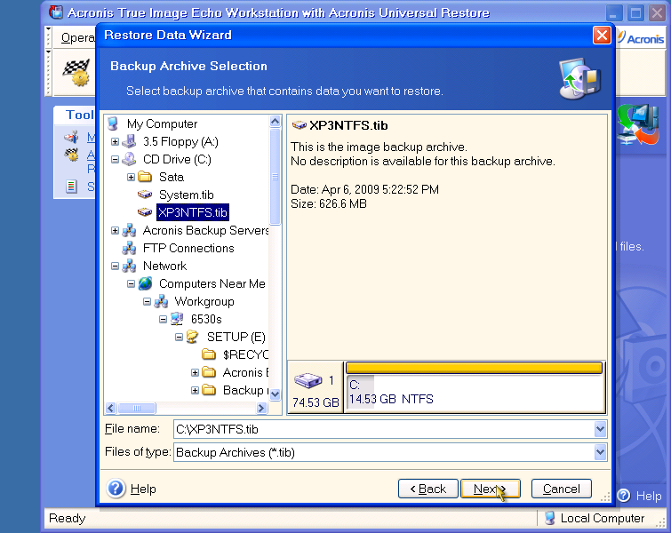

Nhấn chọn như hình, mục dưới là restore MBR mình sẽ hướng dẫn các bạn ở
một bài khác.

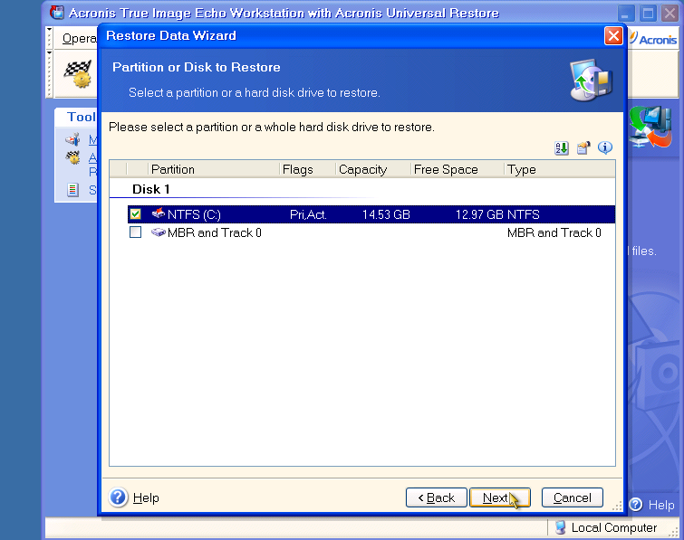

Khi bạn bung từ ổ cứng hoặc box thì sẽ không có dòng lựa chọn này tuy
nhiên nếu bạn bung từ CD thì cửa sổ này có nghĩa là bản Windows gốc được
tạo từ phân vùng 14,53 GB và bung vào phân vùng có dung lượng khác với
dung lượng gốc việc resize cho phép OS bung lên phân vùng đúng bằng dung
lượng hiện tại của ổ C. Sau đó chọn Yes, I want to resize pattions Next.

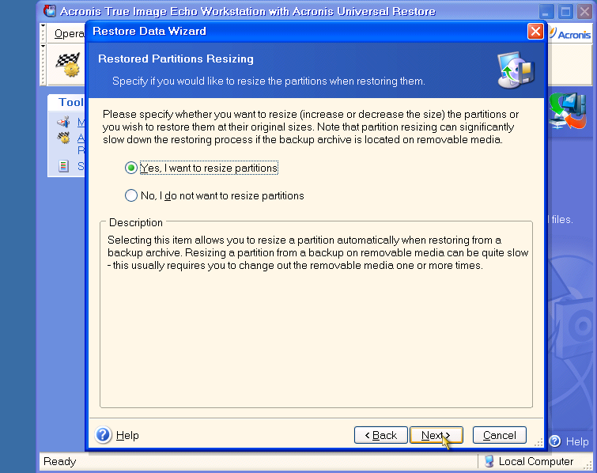

Nhấn chọn phân vùng mà bạn cần bung windows vào (Đặc điểm để tránh bị
nhầm là phân vùng chứa hệ điều hành “thường” được activate và căn cứ
theo tên và dung lượng).

Tại cửa sổ này sẽ cho biết hiện trạng của phân vùng được bung OS vào như
các thông số tổng dung lượng, dung lương sự dụng ...

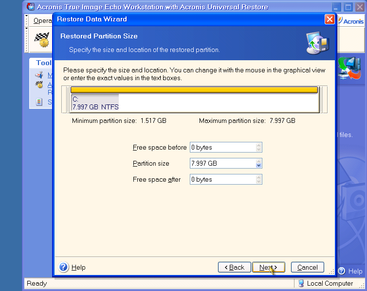

Tại đây nếu bạn muốn chia nhỏ ổ C bạn có thể kéo thanh cuộn từ phải sang
trái (Vì phân vùng C thường nằm đầu tiền trong ổ cứng) theo dung lượng
mà bạn muốn. Sau khi bung xong bạn nhớ vào phần mềm Disk Director Suite
để create phân vùng ra nhé.

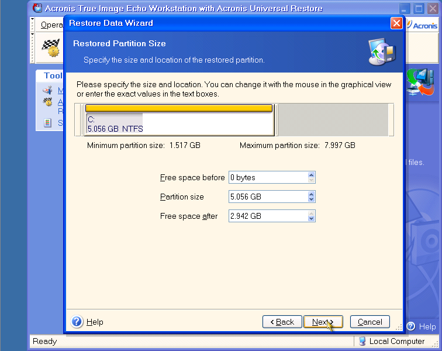

Cửa sổ này cho phép bạn tùy chỉnh bung từ một file ra nhiều ổ cứng nếu
bạn chỉ bung lên một ổ C bạn chọn No

Cái này là tính năng quyết định sự đa cấu hình của Windows. Acronis True
Image Workstation với Addon Universal Restore có đặc điểm khác so với
Ghost đa cấu hình ở chỗ file ghost là file đã được loại bỏ các Driver
của phần cứng ở máy gốc và khi bung ra một máy khác thì các file trong
file ghost được dữ nguyên. Còn file tib của Acronis thì chỉ đơn giản là
một file backup của máy gốc khi bung sang máy khác nó mới tiến hành quá
trình loại bỏ driver và add thêm các driver khác như AHCI, ACPI vì vậy
mà phương pháp Acronis tỏ ra vuột trội hơn ghost nhất là đối với các
MTXT sử dụng ổ cứng Sata có trình điều khiển AHCI.

Bạn tích chọn User Acronis Universal Restore Next

Bước này đối với MTXT rất quan trọng. Bước này cho phép add driver trong
quá trình recovery windows.

Bạn chọn Install the following driver nhấn Add

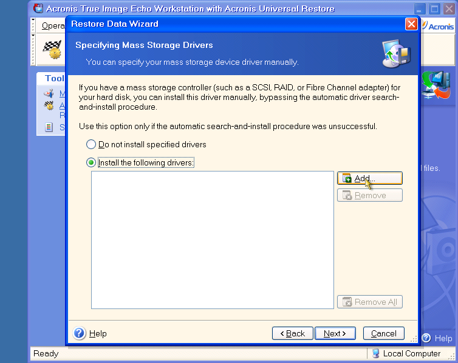

Tìm đến thư mục chứa driver sata thường có luôn trong đĩa CD. Chú ý file
driver thường là dạng inbox driver có đuôi là \*.inf

Sau khi add xong, phần mềm sẽ liệt kê ra tất cả các phiên bản mà nó hỗ
trợ, tại đây bạn có thể thêm vào hoặc loại bỏ những driver không cần
thiết.

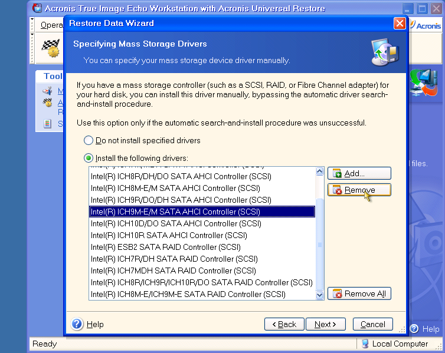

Tại bảng này cho phép bạn thêm đường dẫn của thư mục chứa driver để khi
bung sẽ tự tìm driver của máy được bung, để sử dụng tính năng này bạn
tích chọn Seach for device driver

Nhấn Add và chọn đường dẫn đến thư mục chứa driver

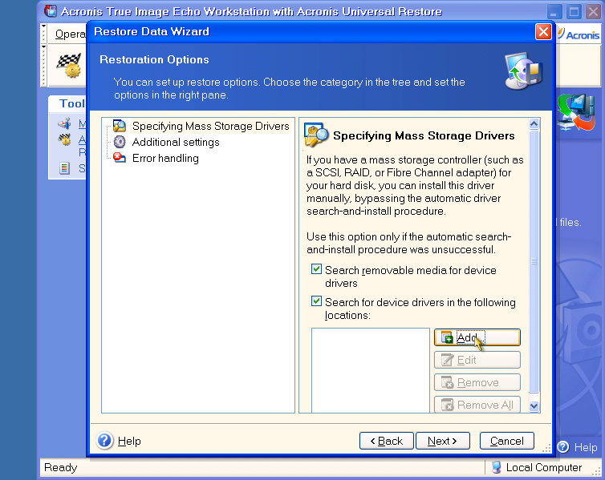

Nhấn next để sang bước sau

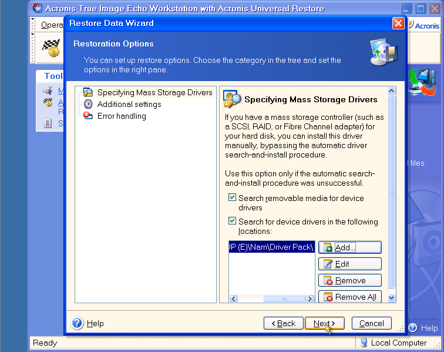

Cửa số cuối cùng liệt kê lại toàn bộ các thiết đặt trước đó để bạn có
thể xem lại nếu bạn đã chắc chắn sau đó nhấn Proceed

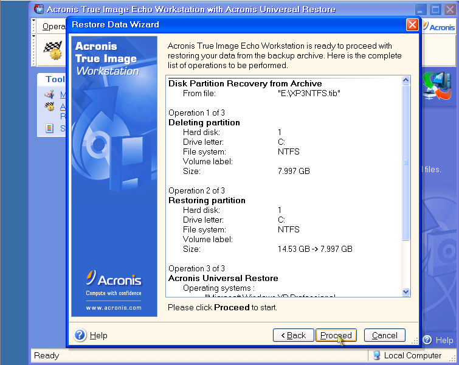

Quá trình bung win bắt đầu hệ thống sẽ phân tích và đưa ra thời gian
thực thi tuy nhiên thời gian này phụ thuộc rất nhiều vào thiết bị chứa
file tib, chế độ nén của file tib và tình trạng phân vùng được bung tuy
nhiên bình thường hết khoảng 3 phút nếu bạn làm từ box.

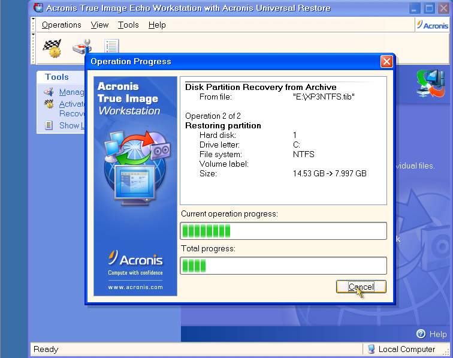

Vì acronis tự động loại bỏ driver và add thêm driver trong quá trình
bung nên đối với một số dòng máy như HP, Asus sẽ hiện ra thông báo thiếu
một device phần cứng như quản lí nguồn (ATK-ACPI)

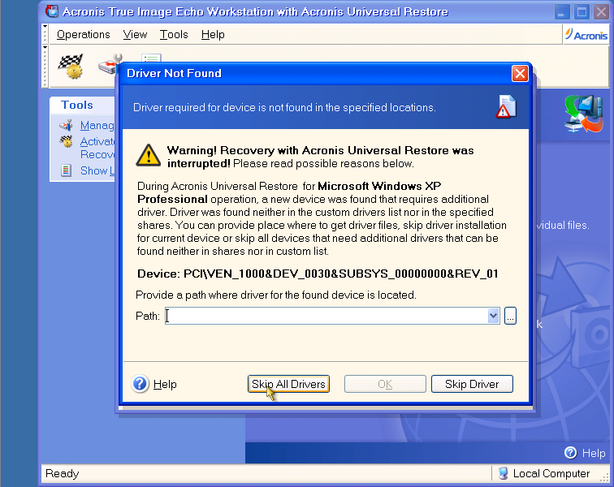

Bạn có thể nhấn Skip all Driver nếu cho rằng phần cứng đó có thể cài sau
hoặc căn cứ theo hardware ID để bạn có thể bổ xung thêm bằng cách nhấn
vào nút “...” và tìm đường dẫn đến driver cần bổ sung

Nhấn OK để tiếp tục

Quá trình hoàn tất bạn nhấn OK, cho đĩa ra khỏi ổ CD nhấn Alt+X để thoát
khỏi phần mềm, máy sẽ tự khởi động lại.

Trong quá trình nếu việc khởi động bị dán doạn ở bước bắt đầu load vào
windows và hiện ra lỗi màn hình xanh dạng (...007B) thì có nghĩa bạn đã
add sai driver AHCI hoặc thiếu trình điều khiển ACPI, còn nếu hiện ra
NTDR missing, cannot load MBR hoac Missing Operation System thì có nghĩa
MBR của ổ cứng bị lỗi. Bạn tham khảo phần sau để biết cách sửa MBR. Còn
nếu bị lỗi khi vào màn hình Welcome thì nguyên nhân có thể do hệ điều
hành được bung không tương thích với phần cứng của máy tính đó, bạn cần
sử dụng một file tib khác để bung hoặc cho đĩa Windows vào cài một cách
thủ công.

Bạn chú ý phiên bản này không hỗ trợ cho Chipset Intel **US15W** thường
dùng cho các chip Atom **Z5xx,** khi boot trên các máy sử dụng chipset
này phần mềm sẽ báo không tìm thấy ổ cứng. Bạn cần sử dụng phiên bản mới
hơn là Acronis Backup and Recovery Version 10

**\*\*./ Cách backup dữ liệu bằng Acronis True Image Work Station**

Một máy tính bị lỗi không vào được hệ điều hành trước khi cài đặt
windows ta cần backup dữ liệu. Để backup dữ liệu ta có rất nhiều cách
như cắm HDD sang máy khác sử dụng WinPE hoặc Các phần mềm quản lí file
như VC, NC... tuy nhiên các phương pháp đó đều rất khó khăn đặc biệt là
trên các máy tính xách tay Mini không có ODD và sử dụng chuẩn điều khiển
ổ cứng AHCI.

Phương pháp backup dữ liệu bằng Acronis True Image có rất nhiều ưu điểm
như boot nhanh, không bị nhấm lẫn bới virus, giao diện dễ sử dụng...

Sau đây tôi xin hướng dẫn các bạn cách backup dữ liệu bằng Acronis True
Image Work Station

Sau khi dùng USB boot, tại giao diện chính của phần mềm bạn nhấn Backup

Chọn My Data nhấn Next

Next tiếp

Tích chọn các dữ liệu cần backup và chú ý rằng Desktop và My Documents
nằm trong User. Sau khi đã chọn xong nhấn Next

Tại cửa sổ này cho phép bạn loại bỏ hoặc thêm các thuộc tính của file và
folder được backup như file ẩn file temp file rác...

Bước tiếp bạn cần chọn đường dẫn để lưu file

Tại cửa sổ Backup mode chọn Create a new full backup Archive

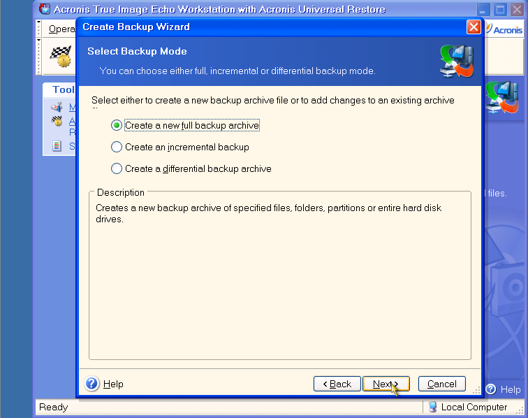

Mổ tả về file backup

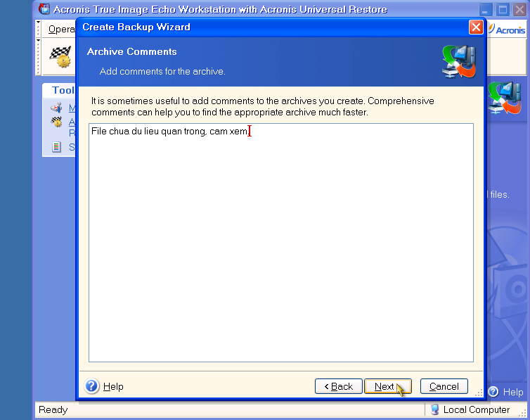

Bản này liệt kê các thiết đặt trước đó nếu đã chắc chắn bạn nhấn Proceed

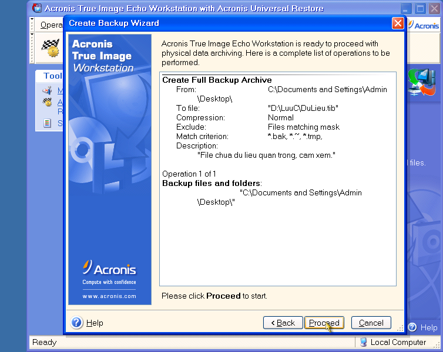

Quá trình backup hoàn thành bạn nhấn OK

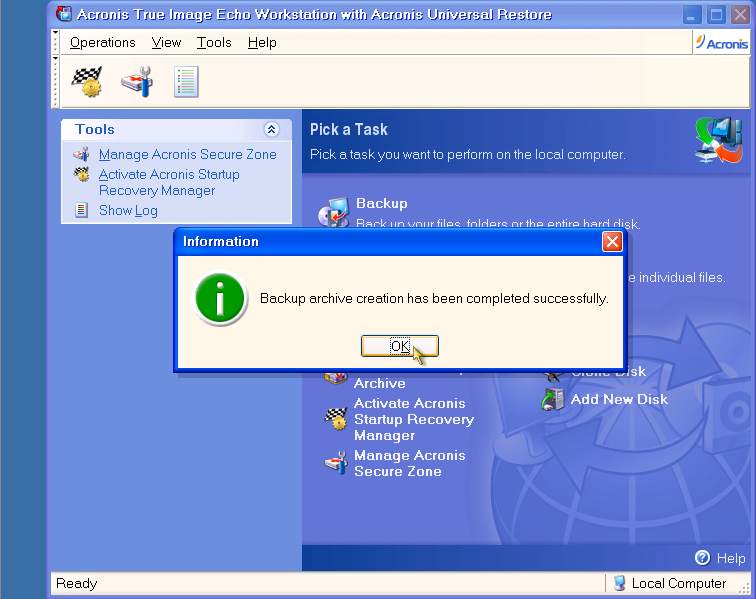

Sau bước này đối với các phiên mới hơn (từ Backup And Recovery 10)
Acronis đã hỗ trợ backup ra file.zip vì vậy bạn có thể bung nó ngay
trong windows mà không cần làm các bước sau đây.

Để đưa dữ liệu về dạng bình thường bạn cần bung lại file tib đó vào ổ
nhấn chọn Recovery

Nhấn Next

Tìm đường dẫn chưa file backup vừa tạo, nhấn Next

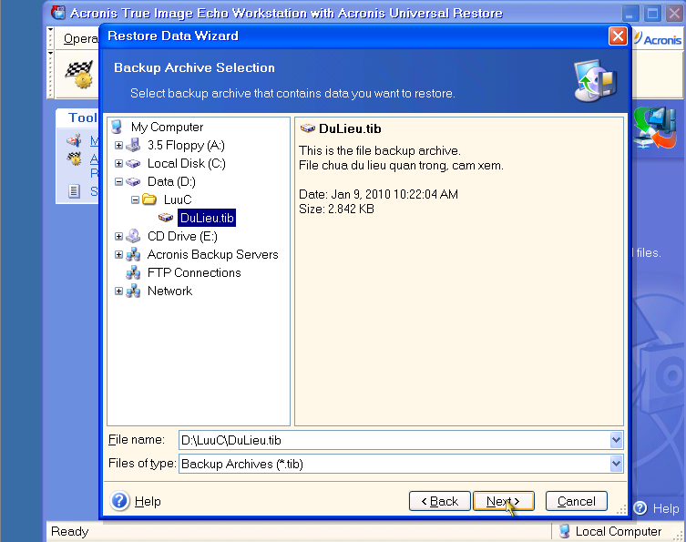

Chú ý là bạn cần chọn New Location ko chọn Original Location để có thể
bung dữ liệu ra một thư mục khác mà không phải là bung lên đường dẫn như
ban đầu (Ổ C)

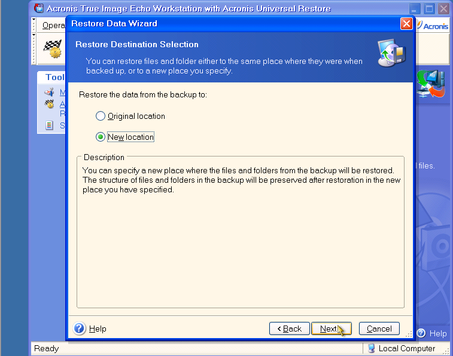

Chọn đường dẫn để bung dữ liệu vào

Có thể bỏ bớt những file không cần thiết

Một số file có chế độ Pemission để bảo vệ dữ liệu theo Setting của User,
tùy chọn ở mục này cho phép loại bỏ các thuộc tính đó, nhấn Next để tiếp
tục

Tại đây ta có thể lược bỏ những file ko cần thiết một lần nữa

Chế độ bung dữ liệu lên Folder

Bảng liệt kê các thiết đặt trước đó, nếu bạn đã chắc chắn đúng bạn nhấn
Proceed

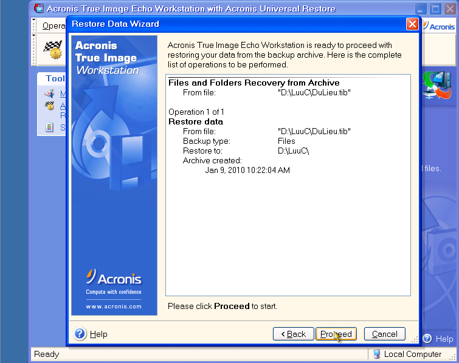

Quá trình bung hoàn tất bạn nhấn OK để hoàn thành

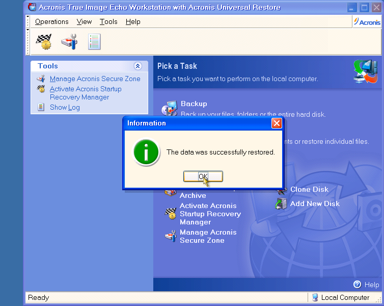

Để chắc chắn rằng dữ liệu đã đầy đủ bạn nhấn backup để kiểm tra lại

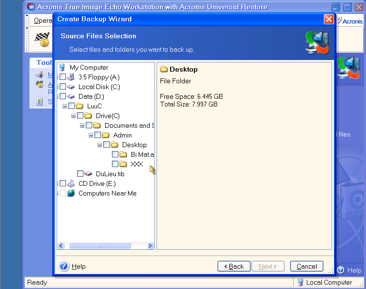

**\*\*\*./ Cách sửa MBR cho ổ cứng**

Khái niệm MBR (Master Boot Recode) là một vùng nhớ có dung lượng 512
byte ở vị trí Sector 0 trong bảng LBA dùng để quản lí quá trình khởi
động của ổ đĩa. MBR rất hay bị lỗi khiến cho quá trình khởi động vào hệ
điều hành không còn chính xác nguyên nhân phần lớn do Virus hoặc thao
tác bung hệ điều hành bằng các phần mềm backup....

Nhất là khi bạn gặp phải một cái HDD Box bạn sẽ không thể diệt được
virus MBR bằng các phần mềm thông thường.

Sau đây tôi xin hướng dẫn các bạn một phương pháp đơn giản để sửa MBR
bằng cách Restore MBR từ một MBR chuẩn.

Trước tiên bạn hãy chọn một MBR bạn cho là chuẩn (có quá trình khởi động
và sử dụng bình thường)

Bạn cũng làm theo cách bước như cách Restore một hệ điều hành tuy nhiên
đến bước này bạn tích chọn MBR thay vì tích vào ổ C và nhấn Next

Tích chọn ổ cần Restore MBR nhấn Next

Nếu chỉ bung một ổ bạn chọn No và nhấn Next

Để cách thiết đặt mặc định bạn nhấn Next

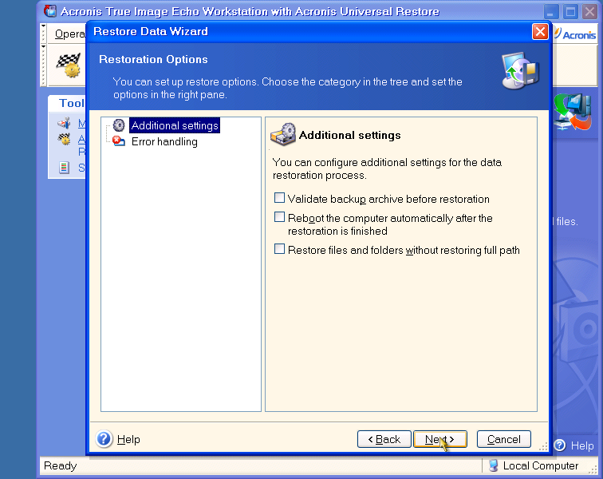

Nếu đã chắc chắn với các thiết đặt của mình bạn nhấn Proceed

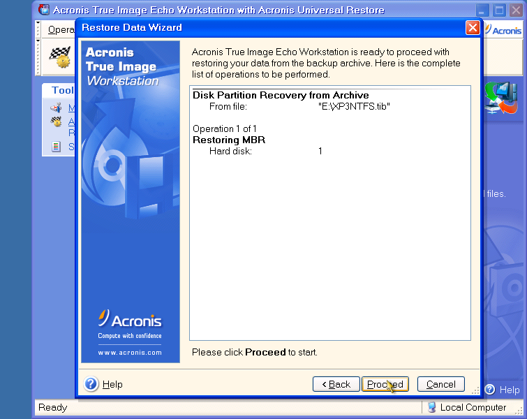

Tool này thực sự hữu dụng khi bạn backup một hệ điều hành như Mac hoặc
Linux để đưa sang một ổ cứng đang cài Windows
