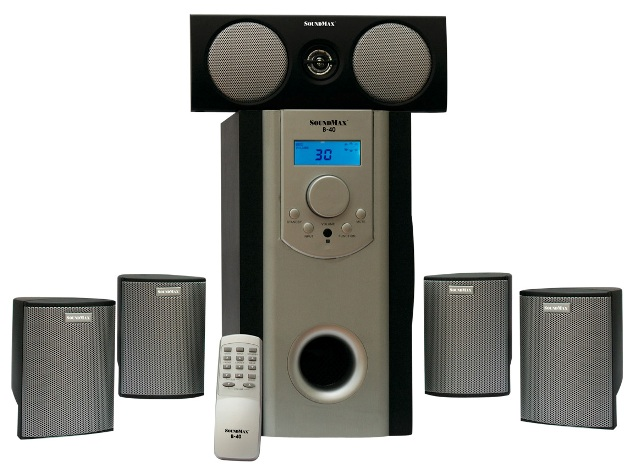
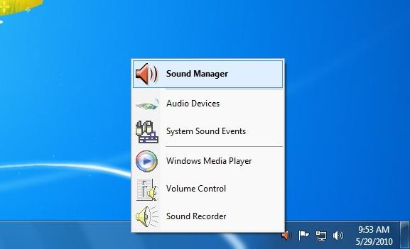
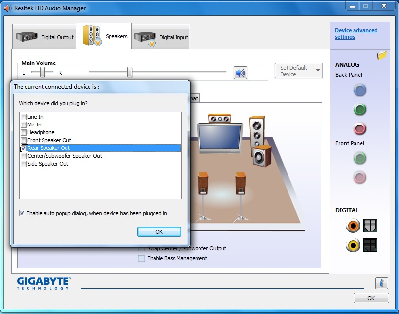
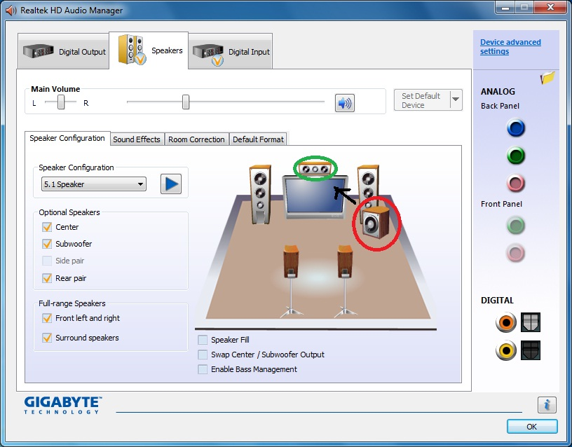
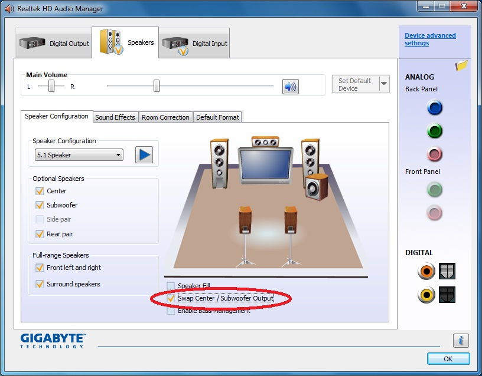
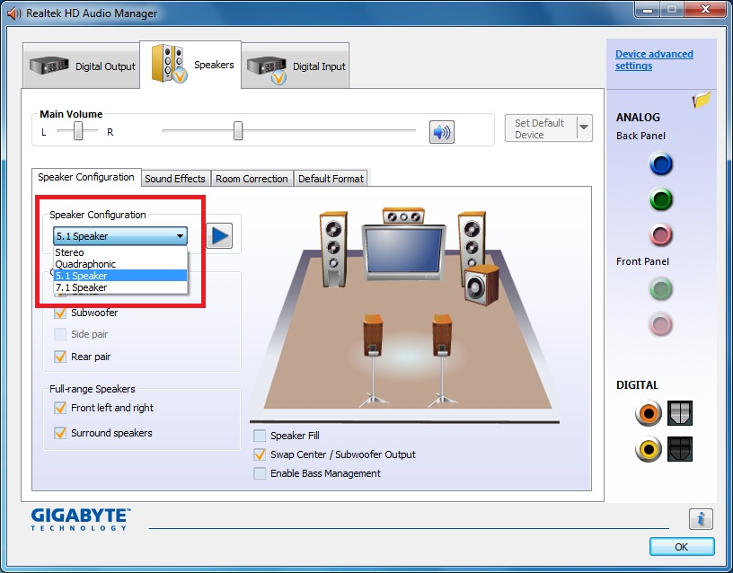

Mainboard Chipset Series G41 được biết đến như một dòng sản phẩm rất
được nhiều khách hàng ưu chuộng vì sự ổn định, khả năng tương thích tốt
đối với ứng dụng văn phòng hay game, thêm vào đó là giá cả phải chăng
phù hợp với đa số túi tiền người sử dụng. Tiền thân là dòng Series G31
nay đã được cải tiến, nâng cấp lên với chất lượng tốt hơn, vẫn đảm bảo
những yêu cầu cho một cấu hình máy tốt tầm trung và phổ thông.\
\
Hiện nay, nhu cầu về nghe nhạc chất lượng cao và xem phim HD ngày càng
lớn. Tuy nhiên không phải bo mạch chủ nào cũng có đủ 6 ngõ ra âm thanh
tách biệt, khiến nhiều người khi chọn mua sản phẩm thường nghĩ những bo
mạch chủ chỉ có 3 ngõ ra phía sau không hỗ trợ âm thanh đa kênh 5.1/
7.1. Thực tế khi thiết lập hệ thống âm thanh 5.1 chỉ cần 3 ngõ ra 3.5mm
và do đó với các bo mạch chủ có 3 ngõ ra phía sau người dùng vẫn hoàn
toàn có thể thiết lập và tận hưởng tốt âm thanh đa kênh sống động trong
những bộ phim HD của mình. Dưới đây tôi xin giới thiệu về cách thiết lập
sử dụng hệ thống loa 5.1 trên các bo mạch chủ chỉ có 3 ngõ ra âm thanh
3.5mm. Bo mạch chủ được sử dụng trong bài viết là Gigabyte G41MT-ES2L và
hệ thống loa 5.1 là SoundMax B-40 5.1 Channel Mini Home Theatre.

**Cấu hình sử dụng:**

-   **CPU: Intel Pentium DualCore E5400**

-   **RAM: 1GB DDR3 KingMax**

-   **MAIN: Gigabyte G41MT-ES2L**

-   **HDD: Intel SSD X25M**

-   **PSU: CoolerMaster 600W**

-   **SPEAKER: SoundMax B-40 (5.1 Channel Mini Home Theatre)**

{width="6.583333333333333in"
height="4.885416666666667in"}

**Thông số kĩ thuật:**

Công suất loa: Loa Trầm: 6 inch- 8 ohm - 40W (RMS)\
Loa vệ tinh: 3 inch- 4 ohm – 15W (RMS) x5\
Tổng công suất: 115W (RMS)\
Ngõ vào: 2.1 hoặc 5.1 kênh\
\
5 dây loa con (kết nối các loa vệ tinh với loa Siêu trầm)\
3 dây Stereo RCA-3.5mm (kết nối với Sound Card Onboard trên Main)\
3 phích cắm RCA-RCA (kết nối với dây Stereo-RCA)

Các bạn cũng có thể tham khảo ở trang chủ SoundMax tại đây \
hoặc xem hướng dẫn cài đặt loa ở Sách hướng dẫn đi kèm B-40\
\
Hãy đảm bảo chắc chắn rằng Window của bạn đã cài đầy đủ các drivers từ
đĩa đi kèm Main G41MT-ES2L do nhà sản xuất Gigabyte cung cấp và nhất là
driver Realtek cho Sound Card onboard. Sau khi cài đặt đầy đủ driver,
khởi động vào window, ở góc dưới bên phải màn hình click vào Icon Sound
Manager.

{width="6.010416666666667in"
height="3.65625in"}

Giao diện phần mềm Realtek HD Audio Manager sẽ mở ra và bắt đầu cắm các
đầu jack vào Back Panel của Mainboard theo trình tự tùy ý. Trước hết tôi
cắm jack của loa front – loa front là 2 loa mà khi sắp xếp hệ thống loa
sẽ được đặt ở phía trước chính diện người nghe. Phần mềm sẽ hiện lên
thông báo có thiết bị được kết nối, ta chọn Front Speaker Out rồi click
Ok.

Tiếp theo tôi kết nối loa jack rear vào back panel – loa rear là 2 loa
sẽ đặt ở vị trí phía sau người nghe. Khi nhận được thông báo kết nối
thiết bị hãy chọn đánh dấu tích Rear Speaker Out rồi Ok:

{width="6.375in"
height="5.041666666666667in"}

Tương tự cắm jack loa Center/Subwoofer vào ngõ ra cuối cùng còn lại trên
main, sau đó chọn Center/Subwoofer Speaker Out. Loa Center là loa sẽ đặt
ở vị trí chính diện phía trước thường làm nhiệm vụ tái hiện các lời
thoại trong phim hay giọng hát ca sĩ khi nghe nhạc. Loa Subwoofer là loa
đảm nhiệm việc phát âm trầm chung cho toàn hệ thống.\
\
Khi kiểm tra lại hệ thống loa, ta thấy ở đây sẽ có sự nhẫm lẫn giữa loa
Subwoofer và loa Center: khi tôi click vào loa Siêu Trầm thì âm thanh
lại phát ra từ loa Trung tầm và ngược lại:

{width="6.375in"
height="5.09375in"}

Cách xử lí thật sự đơn giản chỉ việc chọn dấu tích vào Swap Center/
Subwoofer Ouput:

{width="6.375in"
height="4.802083333333333in"}

Mọi việc đã đâu vào đó, hệ thống loa 5.1 đã được thiết lập xong xuôi
trên máy tính sử dụng main G41MT-ES2L có 3 cổng ra ở Back Panel. Các bạn
cũng đừng quên đặt chế độ 5 kênh ở phần Speaker Configuration:

{width="6.375in"
height="5.0in"}

Hãy tận hưởng âm thanh chất lượng từ các bộ phim HD đỉnh cao sau khi đã
thực hiện một số thao tác đơn giản trên.
