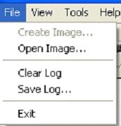
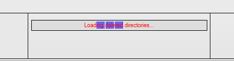
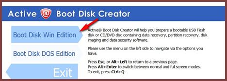

**Phần 1: Giới thiệu tổng quát cấu trúc dữ liệu trên đĩa cứng và khả
năng khôi phục dữ liệu**

**1.1. Giới thiệu chung**\
\
Khi bạn xóa một tập tin hay thư mục nào đó trong hệ thống, thực chất
lệnh này chỉ đánh dấu "đã xóa" trong Directory Entry và những thông tin
liên quan trong File Allocation Table - FAT (với phân vùng định dạng
FAT/FAT32) hoặc đánh dấu "xoá” trong Master File Table - MFT Entry (với
phân vùng định dạng NTFS). \
\
Lúc này, các vùng (cluster) chứa dữ liệu của tập tin xem như trống và
được tính là dung lượng chưa dùng đến của đĩa cứng mặc dù dữ liệu vẫn
tồn tại. Khi dữ liệu mới được ghi vào, lúc này dữ liệu cũ mới thực sự bị
xóa đi và ghi đè bằng dữ liệu mới. Chúng ta (và cả hệ điều hành) đều
không thể "nhìn" thấy được những dữ liệu bị đánh dấu xóa nhưng những
phần mềm cứu dữ liệu vẫn nhìn thấy chúng khi quét qua bề mặt đĩa. Vì vậy
chúng ta mới cần đến những phần mềm này trong việc khôi phục dữ liệu.\
\
Có rất nhiều phần mềm giúp bạn thực hiện việc này, từ miễn phí cho đến
có phí như: EASEUS Data Recovery Wizard Professional 5.0.1, FILE
RECOVERY for Windows, Nucleus Kernel for NTFS Demo, Recuva, Handy
Recovery, DERescue Data Recovery Master, EaseRescue File Recovery,
Ontrack Easy Recovery, Getdataback, Active Uneraser, File Recovery,
RESTORAT, ntfsundelete...Mỗi phần mềm đều có những điểm mạnh - yếu
riêng, nhưng nhìn chung khả năng "cứu hộ" tùy thuộc rất nhiều vào cấu
trúc dữ liệu trên đĩa cứng và những thao tác có ảnh hưởng đến các vùng
dữ liệu.\
\
\
**1.2. Cấu trúc của dữ liệu trên ổ đĩa cứng**\
\
Trước tiên, chúng ta cùng tham khảo qua cách thức thông tin của một tập
tin được lưu trữ trên đĩa cứng. Với phân vùng FAT, dữ liệu được lưu trữ
tại 3 nơi trên đĩa cứng, bao gồm: Directory Entry chứa thông tin về tập
tin gồm tên, dung lượng, thời gian tạo và số hiệu cluster đầu tiên chứa
dữ liệu của tập tin; FAT chứa số hiệu các cluster được sử dụng cho tập
tin và các cluster chứa dữ liệu của tập tin (vùng Allocation). Với phân
vùng NTFS, dữ liệu được lưu trữ trong MFT (Master File Table) Entry và
vùng Allocation (hình minh họa).

{width="5.979166666666667in"
height="3.3958333333333335in"}

Bất kỳ phần mềm cứu dữ liệu nào cũng cố gắng tìm lại những thông tin từ
3 nơi này để có thể khôi phục đầy đủ nội dung của một tập tin, nếu thiếu
(hoặc mất) một trong những thông tin này, dữ liệu không toàn vẹn hoặc
không thể khôi phục (xem bảng).

{width="6.291666666666667in"
height="1.9895833333333333in"}\
\
{width="3.46875in"
height="0.59375in"}

Như vậy, xem xét các trường hợp trên thì khả năng khôi phục dữ liệu
thường khá thấp. Trường hợp các cluster của Allocation bị hỏng hoặc bị
chép đè, bạn hầu như không thể khôi phục được vì dữ liệu đã bị xóa và
chép đè bởi dữ liệu mới.\
\
**1.3. Nguyên nhân mất dữ liệu**\
\
Có nhiều nguyên nhân dẫn đến mất mát dữ liệu, nhìn chung có ba nguyên
nhân chính sau đây:

1.  Lỗi thiết bị phần cứng: đây là nguyên nhân hàng đầu dẫn đến mất dữ
    liệu, chiếm khoảng 44%. Lỗi phần cứng có thê xãy ra do có sự bất
    thường về dòng điện hoặc thiệt hại về vật lý của thiết bị lưu trữ...

2.  Lỗi phần mềm: chiếm khoảng 21%, nguyên nhân do Virus phá hoại, hệ
    điều hành hư hỏng...

3.  Lỗi người sứ dung: chiếm khoảng 32%, nguyên nhân do người sử dụng
    thao tác không đúng cách như: xóa nhầm, format hay fdisk khi chưa
    sao lưu dữ liệu...

4.  Khôi phục dữ liệu là quá trình sử dụng các thiết bị hay phần mềm
    chuyên dụng để tìm kiếm dữ liệu bị mất, nên nhớ đây cũng chỉ là một
    giải pháp làm giảm thiểu thiệt hại, dữ liệu không thể nào được khôi
    phục hoàn toàn như trước.

**1.4. Khả năng khôi phục dữ liệu**

-   **Tập tin bị xóa:** Như đã đề cập ở trên, việc xóa tập tin sẽ đánh
    dấu xóa trong Director Entry và những thông tin liên quan trong bảng
    FAT hoặc MFT Entry. Về lý thuyết, khả năng khôi phục đầy đủ tập tin
    này là cao. Tuy nhiên, kết quả thực tế đôi khi không được như mong
    đợi vì một số nguyên nhân: sau khi xóa, người dùng cố gắng thực hiện
    một số thao tác nhằm lấy lại dữ liệu, HĐH ghi đè dữ liệu mới vào các
    cluster được đánh dấu xóa...

-   **Phân vùng bị xóa (hoặc tạo lại) nhưng chưa định dạng (format)**:
    Hầu hết dữ liệu đều có thể khôi phục được trong trường hợp này vì
    FAT và MFT không bị ảnh hưởng khi người dùng xóa và tạo mới
    phân vùng.

-   **Phân vùng bị format** :Với phân vùng FAT, việc định dạng sẽ xóa
    bảng FAT, Boot Record và thư mục gốc (Root Directory) nhưng
    Partition Table và dữ liệu trong Allocation vẫn còn. Những tập tin
    có dung lượng nhỏ hơn kích thước một cluster (32KB, mặc định của
    FAT32 hoặc theo tùy chọn của bạn khi định dạng), tập tin được khôi
    phục hoàn toàn vì chúng không cần đến thông tin trong bảng FAT. Với
    những tập tin có dung lượng lớn, nhiều cluster liên tiếp nhau, chúng
    sẽ bị phân mảnh khi có sự thay đổi nội dung theo thời gian. Việc tìm
    và ráp các cluster có liên quan với nhau là công việc khó khăn, nhất
    là với những tập tin có dung lượng lớn và hay thay đổi. Một số phần
    mềm cứu dữ liệu có khả năng khôi phục mà không cần thông tin từ
    bảng FAT. tuy nhiên, nội dung những tập tin sau khi tìm lại sẽ không
    đầy đủ hoặc không thể đọc được. Vì vậy, bạn sẽ cần đến một phần mềm
    có khả năng trích xuất những nội dung còn đọc được từ những tập tin
    này . Với phân vùng NTFS, việc định dạng sẽ tạo MFT mới, tuy nhiên
    kết quả khôi phục sẽ tốt hơn phân vùng FAT vì NTFS không sử dụng
    bảng FAT để xác định các cluster chứa dữ liệu của cùng tập tin.

-   **Phân vùng bị format và cài đè HĐH mới hoặc sử dụng Ghost**: Trường
    hợp này thực sự là khó khăn vì Directory Entry (FAT), MFT (NTFS) đã
    bị xóa. Giả sử bạn có 10GB dữ liệu lưu trữ trên phân vùng 20GB, phân
    vùng này bị format và chép đè 5GB dữ liệu mới.

Như vậy, bạn không thể khôi phục những dữ liệu đã bị chép đè mà chỉ có
thể khôi phục dữ liệu từ 5GB trở về sau.

**Phần 2: Sử dụng các phần mềm để cứu dữ liệu**\
\
Trong phần này tôi chỉ đề cập cách đơn giản nhất khi mọi người sử dụng
các công cụ để khôi phục những dữ liệu cần thiết của mình, chứ không
mong muốn là có thể đem đến cho các bạn kỹ năng hay kỹ thuật chuyên sâu
để khôi phục và cứu dữ liệu (bằng được) và chỉ một khía cạnh nào đó mong
bạn đọc thông cảm.\
\
**2.1. Sử dụng phần mềm File Recovery**

**Hướng dẫn cài đặt phần mềm.**\
\
Trước tiên bạn copy file chạy của “Files Recovery” để có thể thực hiện
được chương trình “Files Recovery” (Bạn có thể thấy được biểu tượng của
nó như sau)

{width="3.4895833333333335in"
height="0.4895833333333333in"}

Bạn có thể download phần mềm này tại địa
chỉ: <http://www.file-recovery.net/download.htm>\
\
**Hướng dẫn cách sử dụng**\
\
Để có thể thực hiện chương trình bạn tiến hành các bước như sau:

**Bước 1**: Click double vào biểu tượng”Files Recovery”:\
\
{width="1.9791666666666667in"
height="0.5416666666666666in"}\
\
hoặc bạn có thể nhấp chuột phải vào biểu tượng và chọn open\
\
{width="1.5625in"
height="2.90625in"}\
\
**Bước 2**: Bạn sẽ thấy được giao diện của “Files Recovery” như sau:\
\
{width="5.729166666666667in"
height="3.84375in"}\
\
**Bước 3**: Khi bạn nhấp chuột vào menu File sẽ xuất hiện các menu con:\
\
{width="1.7916666666666667in"
height="1.8645833333333333in"}\
\
**Open Image:** Để mở ra file ảnh\
**Clear Log:** Để làm sạch log\
**Save Log:** Để lưu đường dẫn của log\
**Exit:** Để thoát khỏi chương trình\
\
**Bước 4** :Khi bạn click chuột vào menu View sẽ xuất hiện các menu
con:\
\
{width="1.4270833333333333in"
height="1.21875in"}\
\
**Scan:** Quét\
**Stop:**Dừng lại\
\
**Bước 5**:Khi bạn click chuột vào menu Help sẽ xuất hiện các menu con:\
\
{width="4.947916666666667in"
height="1.4791666666666667in"}\
\
**Contents:** Nội dung\
**Recovery Service on the Web:** Dịch vụ khôi phục trên mạng\
**File Recovery Online:** Khôi phục trực tuyến\
**Frequently Asked Questions:** Thường xuyên hỏi những câu hỏi\
**Help:**Trợ giúp\
**Lsoft Home Page:**Lsoft trang chủ\
**About Recovery Service Tool:** Công cụ khôi phục\
\
**Bước 6**: Khi bạn click vào biểu tượng **Scan**\
\
Hộp thoại Scan sẽ list ra danh sách tên các drive, type, file system,
totalsize hiện tại trên máy tính của bạn:\
\
{width="4.84375in"
height="3.1145833333333335in"}\
\
**Bước 7** : Bạn chọn tên ổ đĩa và nhấp chuột vào nút Scan, khi đó “File
Recovery”sẽ hiện thị cho bạn danh sách các folder và các file có trong ổ
đĩa:\
\
{width="5.197916666666667in"
height="3.46875in"}\
\
Sau đó bạn chọn tên file cần cứu và nhấp nút Recover:\
\
{width="4.479166666666667in"
height="3.0104166666666665in"}\
\
Ngay sau khi bạn nhấp chuột vào nút Recover hộp thoại xuất hiện nhắc bạn
rằng: “chọn folder nơi mà bạn sẽ lưu khôi phục đó”:\
\
{width="2.2395833333333335in"
height="2.1458333333333335in"}\
\
Có 3 lựa chọn :\
\
**Make folder new:** Tạo folder mới\
**Ok:** Chấp nhận (lưu đường dẫn mặc định)\
**Cancel:** từ chối\
\
Khi này chương trình tiến hành quá trình tìm kiếm:\
\
{width="3.9895833333333335in"
height="2.75in"}\
\
**Bước 8:** Nếu như bạn chọn Cancel như ở bước 7 thì giờ đây sau khi tìm
kiếm những file đã xóa bạn Click chuột vào menu file chọn Save log để
lưu lại file mà bạn muốn cứu và chọn save.\
\
{width="4.458333333333333in"
height="3.03125in"}

**Chú ý**: khi ta dùng chương trình “File Recovery” để cứu dữ liệu chúng
ta thấy các file có các màu khác nhau như:

-   File có màu vàng: bình thường thì các file đó là các file chưa
    bị xóa.

-   File có màu xám bạc: file này đã bị xóa tuy nhiên khả năng phục hồi
    lại file là khá cao. Gần như là ta có thể phục hồi lại nguyên vẹn dữ
    liệu như ban đầu.

-   File có màu đen: file này đã bị xóa tương đối lâu, ta khó có khả
    năng khôi phục lại được hay là nếu có khôi phục lại được đi chăng
    nữa thì file đó cũng khó có khả năng trở về hiện trạng ban đầu được
    bởi vì một số dữ liệu trong file đó đã bị xóa mất rồi (do là ta đã
    ghi đè dữ liệu khác nên nó). Ngoài ra giao diện của “File Recovery”
    còn cho ta biết được file đã được tạo vào ngày giờ nào, ngày ta thay
    đổi (xóa) file đó đi và còn dung lượng của nó là bao nhiêu.

{width="5.25in"
height="2.4895833333333335in"}

**2.2. Cứu dữ liệu bằng GetDataback (GDB)**\
\
Đã bao giờ bạn gặp phải tình huống như thế này chưa: Một ngày đẹp trời
nào đó, mở máy lên, không detect được ổ cứng, dữ liệu bị virus ăn mất
sạch sành sanh, v.v... Thế là tất cả các công trình, dữ liệu bạn làm lâu
nay bỗng chốc không cánh mà bay. Những lúc như vậy, bạn phải làm sao
đây? Đừng lo, trên thị trường hiện nay có rất nhiều phần mềm phục hồi dữ
liệu cho bạn chọn lựa. Xin mách bạn sử dụng một trong những chương trình
đó: GetDataBack (GDB) của Runtime Software
(<http://www.runtime.org/data-recovery-software.htm>).\
\
GDB có hai phiên bản, một dùng cho hệ thống FAT và một dùng cho hệ thống
NTFS. Việc sử dụng hai phiên bản này hoàn toàn tương tự nên mình chỉ
giới thiệu phiên bản dùng cho FAT.\
\
GDB sẽ giúp bạn truy tìm lại những dữ liệu đã mất do ổ cứng bị hư vì
virus phá, dữ liệu bị xóa nhầm, format hay Fdisk đĩa.\
\
Với người dùng bình thường, GDB có thể giúp bạn tự phục hồi dữ liệu của
mình thông qua sáu bước rất dễ hiểu. Ngoài ra, với người dùng có trình
độ cao hơn, GDB cung cấp những chọn lựa nâng cao nhằm giúp việc phục hồi
được hiệu quả hơn. GDB có thể phục hồi dữ liệu từ ổ cứng, phân vùng, đĩa
mềm, file ảnh của ổ đĩa (Drive Image), ổ Zip, ổ đĩa mạng.\
\
Tương thích với Windows 95/98/ME, Windows NT, 2000, XP, WIN 7. GDB chỉ
đọc ổ đĩa hư và sao chép toàn bộ dữ liệu phục hồi được lên một ổ đĩa
khác.\
\
***a. Tính năng GetDataback for FAT and NTFS 3.03)***\
\
GetDataBack Data Recovery là một chương trình khôi phục dữ liệu an toàn,
nhanh chóng và dễ sử dụng giúp bạn cứu dữ liệu bị mất từ các sự cố có
thể xảy đến cho ổ cứng của bạn. Việc khôi phục dữ liệu thường thành công
hơn so với những gì bạn mong đợi - dĩ nhiên là bạn cũng không cần đưa ổ
cứng tới các dịch vụ khôi phục dữ liệu.\
\
Các công cụ mạnh mẽ, dễ sử dụng được thiết kế không chỉ dùng để undelete
các dữ liệu, partition đã bị xoá nhầm mà còn có thể khôi phục dữ liệu
các file, thư mục, partition bị xoá sau khi đã Fdisk, Format, Mất nguồn,
bị nhiễm vi rút,lỗi phần mềm.\
\
Cho dù có bất cứ điều gì xảy đến với ổ cứng của bạn - GetDataBack sẽ
giúp bạn khôi phục dữ liệu khi partition table, boot record, FAT/MTF hay
thư mục gốc của bạn bị mất hoặc bị hư hại; khôi phục các dữ liệu bị mất
do xoá nhầm, virus, format, fdisk, mất nguồn, lỗi phần mềm gây nên sự cố
hệ thống ... \
\
Khôi phục lại mọi thứ - Thuật toán cao cấp giúp cho tất cả các thư mục
và thư mục con được đặt chung và tên của chúng được thiết lập lại một
cách chính xác. Khôi phục dữ liệu an toàn - Các dữ liệu khôi phục được
thiết lập chế độ read - only, điều này có nghĩa rằng chương trình sẽ
không bao giờ ghi lên phần ổ đĩa mà bạn dang khôi phục.\
\
**Chú ý**: nguyên tắc để cứu dữ liệu trọn vẹn là: khi bị xóa nhầm,
format, ghost nhầm tuyệt đối không sử dụng ổ cứng đó, nếu sử dụng dữ
liệu mới sẽ bị ghi đè lên dữ liệu cũ, xác suất thành công sẽ thấp hơn.\
\
***b. Hướng dẫn sử dụng***

**Bước 1**: Các bạn khởi động GDB sau đó nhấn NEXT để tiến hành cài:\
\
{width="5.114583333333333in"
height="3.8333333333333335in"}\
\
**Bước 2**: Cửa sổ đầu tiên mà bạn nhìn thấy khi chạy GDB cũng là bước
2. Trong bước này, GDB sẽ tiến hành quét tìm các ổ đĩa vật lý hay logic
có trên máy (tùy thuộc vào chọn lựa của bạn).\
\
{width="5.96875in"
height="4.447916666666667in"}\
\
Trong cửa sổ bên tay trái là danh sách rất nhiều ổ đĩa vật lý quy ước
như sau:\
\
**- FD**: Ổ đĩa mềm\
**- HD**: Ổ đĩa vật lý (HD128 là ổ đĩa thứ nhất, HD129 là ổ đĩa thứ
hai,...)\
**- Logical Drives**: Ổ đĩa logic (phân vùng)\
**- Image files** :Tập tin ảnh\
\
Như vậy, trong trường hợp này, ổ đĩa hư của tôi là ổ đĩa thứ nhất nên
tôi chỉ cần đánh dấu chọn vào ô HD128. Bạn có thể đánh dấu chọn vào mục
Logical Drives để GDB có thể hiển thị cụ thể từng phân vùng trên ổ đĩa
thứ hai này.\
\
Nếu bạn đã tạo tập tin ảnh, bạn có thể chọn vào mục Image File. GDB sẽ
quét tìm tập tin này cho bạn, nếu không bạn có thể tự tìm nó ở trong
bước 2.\
\
Bên phải của cửa sổ là nơi bạn sẽ chọn để chứa các tập tin, hay thư mục
tạm thời được GDB tạo ra trong quá trình làm việc. Bạn không được chọn
những thư mục trên ổ đĩa hư để lưu những thư mục hay tập tin tạm này.\
\
Xong xuôi, các bạn nhấn **Next** để sang bước 3\
\
**Bước 3**: Với những chọn lựa ở bước 2 nêu trên, sang bước 3 bạn sẽ
nhìn thấy cấu trúc của ổ đĩa như trong hình:\
\
{width="3.0208333333333335in"
height="3.96875in"}

**Lưu ý**: Nếu không vừa ý với cách hiển thị như vậy, hoặc không tìm
thấy ổ đĩa mà bạn cần phục hồi, bạn có thể nhấn nút Back, quay trở lại
bước 1 để thực hiện lại việc lựa chọn.\
\
Bên dưới cửa sổ Bước 2 này có hai mục là Image File... và Remote... Bạn
có thể chọn Image File... để xác định vị trí của tập tin ảnh mà bạn cần
phục hồi dữ liệu trong đó. Bạn có thể chọn nhiều file ảnh cùng lúc. Chọn
Remote... để xác định ổ đĩa cần phục hồi trên máy khác thông qua mạng
LAN, hoặc giữa hai máy nối với nhau qua cổng COM. Lúc này, máy chứa ổ
cứng tốt (remote) cài GDB và máy chứa ổ cứng hư (host) phải cài chương
trình HDHost\
\
Bây giờ, bạn hãy nhấp chuột chọn ổ đĩa vật lý hay phân vùng mà bạn muốn
phục hồi (ở đây, tôi chọn phân vùng thứ hai) và nhấn **Next** để sang
bước thứ 4.\
\
**Bước 4**: Ở bước này, nếu chưa nắm rõ về các khái niệm sector, hệ
thống tập tin,... bạn có thể để mặc định và nhấn Next để chuyển sang
bước 5. \
\
Tuy nhiên, tôi sẽ giới thiệu các mục trong bước này để bạn nào có khả
năng có thể đọc thêm:

-   **Search entire drive**:Tìm trên nguyên ổ đĩa.

-   **Search partial drive**: Tìm trên một vùng xác định của ổ đĩa.
    Trong mục này, nếu biết được dữ liệu nằm từ sector nào đến sector
    nào, bạn có thể nhập số vào hai ô bên dưới, nếu không bạn cũng có
    thể để như mặc định. Nếu bạn khoanh vùng càng nhỏ, càng chính xác
    thì thời gian tìm sẽ càng được rút ngắn lại và khả năng tìm được sẽ
    cao hơn.

-   **File system to recover**: Xác định hệ thống tập tin của ổ đĩa
    (FAT12, 16, hay 32....).

Nếu bạn không tự xác định được thì có thể để mặc định hoặc đánh dấu chọn
vào mục**Excessive search** để chương trình tìm cho bạn. Tuy nhiên, việc
này sẽ làm cho quá trình phục hồi kéo dài thêm.\
\
**Template**: Mục này thường không cần thiết, bởi lẽ GDB đã tự động tìm
hệ thống tập tin cho bạn. Trong những trường hợp hiếm hoi (ví dụ như đĩa
mềm của bạn chỉ chứa vài tập tin và GDB không thể xác định được thì bạn
có thể tạo ra một Template để nhận dạng hệ thống tập tin). Để tạo các
template, bạn có thể tìm tập tin GDB.ini trong thư mục cài đặt của GDB.
Bạn có thể tham khảo cấu trúc của file này trong phần Help của chương
trình.\
\
**Bước 5**: Sau khi quá trình quét đĩa đã hoàn tất, GDB sẽ liệt kê các
hệ thống tập tin trong cửa sổ bên trái của bước 5.

{width="5.916666666666667in"
height="3.9166666666666665in"}

GDB quét đĩa của bạn rất kỹ (đặc biệt khi ổ cứng lớn, có nhiều phân vùng
hoặc ổ đĩa đã được format nhiều lần), và tìm ra tất cả những hệ thống
tập tin tồn tại trên đó. Theo mặc định, hầu hết những hệ thống tập tin
tìm được có chất lượng tốt nhất được nằm ở trên cùng.\
\
Màu xanh lá cây biểu thị hệ thống tập tin đó có chất lượng khoảng 50%,
điều này cho thấy đây là một hệ thống tập tin tốt và có thể sẽ cho kết
quả tìm kiếm cao nhất.\
\
Màu vàng biểu thị hệ thống tập tin có chất lượng khoảng hơn 10%, điều
này thể hiện rằng kết quả có thể tạm chấp nhận được (đặc biệt là trong
trường hợp không có màu xanh lá cây xuất hiện).\
\
Màu đỏ biểu thị hệ thống tập tin có chất lượng dưới 10%, hiệu quả của
việc tìm kiếm tập tin trên những hệ thống tập tin này là rất thấp.\
\
Bạn hãy bình tĩnh, chọn hệ thống tập tin nào mà có kích thước partition,
kích thước cluster và có loại hệ thống tập tin gần giống với hệ thống
tập tin mà bạn đang định phục hồi. (Những thông tin này bạn có thể xem ở
cửa sổ bên phải của bước 5.)\
\
Nhấn **Next** để chuyển sang bước cuối cùng.\
\
**Bước 6**: Đây là bước có thể làm cho bạn sung sướng tột cùng vì đã tìm
lại được dữ liệu đã mất, và nó cũng có thể làm cho bạn thất vọng tràn
trề vì kết quả chỉ là con số 0 to tướng.

{width="6.302083333333333in"
height="4.0625in"}

Trong bước này, GDB sẽ liệt kê tất cả các dữ liệu mà nó tìm được theo
dạng cây thư mục. Để có thể nhanh chóng tìm ra dữ liệu cần thiết, bạn có
thể vào menu Tools chọn Search files... hoặc nhấn tổ hợp phím Ctrl và
F.\
\
Sau khi tìm được, bạn hãy chọn tập tin hay thư mục cần phục hồi, nhấn
nút Copy trên thanh công cụ, chọn một thư mục nào đó trên ổ cứng tốt để
chép sang.\
Công việc đến đây đã hoàn tất, bạn thấy có dễ không nào?\
Đây là một phần mềm khôi phục còn hay hơn cả **Esyrecover** vì khi khôi
phục mình có thể lấy nguyên được cả tên của file đã từng bị mất. Trước
đây các bạn đã từng nghe đến NU chương trình khôi phục dữ liệu trên dos
chưa? đây là chương trình sử dụng hơi khó, mất nhiều thời gian và hiệu
quả chỉ đạt đến 60%.\
\
**Esyrecover** ra đời giúp ta có thể sử dụng ngay trên win nhưng khi
khôi phục được, dữ liệu không còn mang cái tên như thủa ban đầu nữa.\
\
Và bây giờ với GetDataBack bạn có thể khôi phục được dữ liệu với cái tên
bạn đã từng đặt được 90% chỉ trong một thời gian rất ngắn, dễ sử dụng,
dễ dàng cài đặt, nhưng nhớ phải dùng bản có bản quyền nhé!\
\
**2.3. Sử dụng phần mềm DERescue Data Recovery Master**

***a. Tính năng của DERescue Data Recovery Master***

-   Có thể nói DERescue Data Recovery Master là một trong những phần mềm
    mà trong quá trình sử dụng tôi cảm nhận thấy là tuyệt vời nhất. Nó
    hỗ trợ tất cả các định dạng phân vùng, nhiều loại file, trong nhiều
    trường hợp có thể đáp ứng các nhu cầu người dùng khó tính nhất.

-   DERescue là một phần mềm phục hồi dữ liệu mạnh mẽ, có thể khôi phục
    dữ liệu bị hư hỏng/bị mất/do định dạng đĩa hay phân vùng hoặc Ghost.

-   DERescue hỗ trợ IDE/SCSI/SATA/ USB. DERescue phục hồi dữ liệu tốc độ
    rất nhanh.

-   Hỗ trợ hệ thống FAT12/FAT16/FAT32/NTFS/EXT2, email, PowerPoint, hình
    ảnh, AutoCad JPG, PDF, CDR, PSD, AI, WAV, AVI, 3GP, mpg, MP4, RM,
    RMVB, BMP, GIF, … Ngay cả trong trường hợp khi định dạng của phân
    vùng đã được chuyển đổi, nó vẫn có thể dễ dàng phục hồi cấu trúc thư
    mục trong phân vùng ban đầu mà không cần định dạng phân vùng với
    phiên bản gốc mới. Để sử dụng phần mềm các bạn có thể tải về từ đĩa
    chỉ sau:<http://www.derescue.com/download-recover-software.html>

***b. Cài đặt phần mềm***\
\
Để cài đặt các bạn click đúp vào file như trên hình vẽ cho đến khi hoàn
thành.

{width="2.4166666666666665in"
height="1.2604166666666667in"}

*c. Cách sử dụng phần mềm DERescue Data Recovery Master*\
\
**Bước 1**: Để sử dụng bạn click đúp vào biểu tượng trên màm hình như
hình vẽ

{width="2.8020833333333335in"
height="1.5in"}

Khi đó xuất hiện màn hình với giao diện rất dễ sử dụng.

{width="5.541666666666667in"
height="3.7083333333333335in"}

**Bước 2:** Lựa chọn kiểu dữ liệu cần phục hồi, ở đây bạn có 4 sự lựa
chọn trên Menu.

-   **Deleted Recovery**: Phục hồi dữ liệu bị xóa.

-   **Formatted recovery**: Phục hồi phân vùng bị format.

-   **Lost partitions recovery**: Phục hồi phân vùng bị mất.

-   **Ghost Recovery**: Phục hồi phân vùng do Ghost nhầm.

Sau khi các bạn chọn phân vùng hay ổ đĩa cần phục hồi và nhấn OK trong
giao diện ở ổ cuối cùng phần mềm sẽ load những thứ cần thiết (hay đọc bề
mặt đĩa). Theo hình sau:

{width="4.75in"
height="1.2395833333333333in"}

Sau khi load xong sẽ có 2 phần ở 2 khung các bạn có thể nhìn rất trực
quan nhưng dữ liệu, bởi vì trong thư mục ô bên trái phần mềm sẽ sắp xếp
rất cụ thể theo từng loại file riêng biệt, những file cùng loại thì vào
một thư mục.

{width="5.260416666666667in"
height="4.291666666666667in"}

Ví dụ: các file video sẽ vào thư mục AVI, các file tài liệu sẽ vào thư
mục DOC…

{width="6.291666666666667in"
height="3.40625in"}

Các bạn chú ý để sau này phần mềm không phải quét dữ liệu trên bề mặt
đĩa lần nữa ta nên lưu dự án quét này lại, bạn thực hiện như sau:\
\
Từ Menu của chương trình ta chọn như hình:

{width="4.041666666666667in"
height="2.3229166666666665in"}

Sau đó lưu file đến vị trí bạn muốn lưu trữ sau này chỉ cần mở phần mềm
và duyệt mở đến file lưu này. File này có đuôi là **\*.de**\
\
Sau khi xác định nhánh thư mục bên trái ta nhìn sang nhánh thư mục bên
phải sẽ nhìn thấy tất cả các dữ liệu mà chúng ta cần phục hồi. Nếu bạn
muốn phục hồi file nào chúng ta chỉ cần đánh dấu sau đó nhấn chuột phải
và chọn Export File sau đó chỉ đến vị trí sao lưu của bạn

{width="5.447916666666667in"
height="2.1875in"}

Bây giờ tôi sẽ lưu file vừa chọn ra bàn làm việc, các bạn chú ý **tên
file** tôi chọn nhé:

{width="4.958333333333333in"
height="3.0833333333333335in"}

Sau khi tôi Export File nhấn OK phần mềm sẽ báo tôi thực hiện thành
công, các bạn nhìn ô bên trái phía dưới nhé:

{width="5.65625in"
height="1.21875in"}

Và bây giờ tôi sẽ tiến hành mở file đó lên cho các bạn xem:

{width="5.739583333333333in"
height="4.020833333333333in"}

Các bạn thấy tuyệt vời không, file này đã xóa rất lâu rồi đến bây giờ
vẫn còn phục hồi được. (các bạn chú ý nhớ tên file tôi chọn nhé).\
\
Như vậy là chúng ta đã sử dụng xong chức năng đầy tiên của phần mềm là:

-   **Deleted Recovery** các tính năng còn lại sử dụng tương tự.

-   **Formatted recovery**: \[/B\]Phục hồi phân vùng bị format.

Thứ tự thực hiện cũng tương tự như trên, theo hình:

{width="5.21875in"
height="3.4479166666666665in"}

Rồi chúng ta cũng chọn lưu file như trên (nên lưu ra ổ đĩa khác với đĩa
đang phục hồi)

{width="5.072916666666667in"
height="3.5in"}

**Lost partitions**: Phục hồi phân vùng bị mất.\
\
Từ giao diện chúng ta chọn menu thứ 3 và chọn ổ đĩa cần phục hồi.

{width="5.520833333333333in"
height="3.6041666666666665in"}\
\
{width="5.645833333333333in"
height="3.7291666666666665in"}

Sau khi thực hiện Scan, OK xong chúng ta tiến hành lưu lại phân vùng đó
lên ổ đĩa cứng khác nhé.\
\
**Ghost Recovery**: Phục hồi dữ liệu bị Ghost nhầm\
\
Khi tiến hành phuc hồi một file ghost lên phân vùng G: (nghĩa là nhầm)
thì chúng ta thực hiện như sau:\
\
Chọn "phục hồi Ghost" và chọn ký tự ổ đĩa, nhấn nút "OK". Sau khi quét,
hệ thống tập tin bị mất và thư mục sẽ được hiển thị trong thư mục bên
phải.

{width="4.645833333333333in"
height="3.0416666666666665in"}\
\
{width="4.6875in"
height="3.53125in"}

Cách sao lưu lại như phần trước.\
\
Khi tiến hành phục hồi file Ghost theo cách từ đĩa đến đĩa và làm mất
phân vùng chúng ta thực hiện như sau:\
\
Các bạn cũng chọn Menu thứ 4 và thực hiện như hình:

{width="5.354166666666667in"
height="3.53125in"}\
\
{width="5.447916666666667in"
height="3.6979166666666665in"}

Sau khi thực hiện Scan, OK xong chúng ta tiến hành lưu lại phân vùng đó
lên ổ đĩa cứng khác nhé.\
\
Ngoài ra có thể xử lý ở trường hợp Ghost nhầm là chúng ta có thể tìm lại
phân vùng với chức năng **Lost partitions**

{width="5.15625in"
height="3.4791666666666665in"}

**Chú ý**: đối với DERescue Data Recovery Master các file dấu hởi màu đỏ
là những file chúng ta cần phục hồi, thư mục dấu chéo đỏ là khả năng
phục hồi không cao, thư mục bình thường là thư mục vẫn còn mà chúng ta
chưa làm gì nó trên ổ cứng.

{width="5.552083333333333in"
height="2.5in"}

**Phần 3: Tổng hợp**\
\
**3.1. Đánh giá**\
\
***a. Ưu điểm***

-   **File Recovery** hỗ trợ FAT12/16/32, NTFS and NTFS5 (Windows
    2000/XP/2003, Win 7 hiện chạy rất tốt). Chạy nhẹ, ổn định, hỗ trợ
    tốt các định dạng file hệ thống. (ngoài ra nó còn có bản cho
    HĐH MaxOS).

<!-- -->

-   **GetDataback**có 2 bản riêng hỗ trợ cho từng loại phân vùng FAT,
    NTFS, khả năng tích hợp gộp như các phần mềm khác là không tốt.
    Nhưng nó lại ưu việt hơn khi chúng ta sử dụng cho từng loại
    phân vùng. Khôi phục ngay cả khi Windows không còn nhận được ổ cứng.
    Phục hồi nguyên hiện trạng hệ thống mà bạn đã sắp xếp như: Thư mục,
    file…khả năng phục hồi tốt.

-   **DERescue Data Recovery Master **Hỗ trợ hệ thống
    FAT12/FAT16/FAT32/NTFS/EXT2, thẻ nhớ, USB…ngoài ra bạn đọc thêm phần
    2.3, hỗ trợ mạnh mé các file và điểm nỗi bật là nó sắp xếp theo
    trình tự như**GetDataback, **ngoài ra nó còn phân loại định dạng
    file và nó sắp xếp thành thư mục cho bạn dễ ràng tìm kiếm. Chạy rất
    nhanh hỗ trợ lưu lại bề mặt ỗ đĩa thành file có đuôi là
    \*.**de, **hỗ trợ kiểm tra file lỗi.Theo đánh giá của cá nhân thì
    khả năng phục hồi tuyệt vời.

***b. Hạn chế***

-   Cả 3 phần mềm trên đều có phí.

-   **File Recovery**sự phục hồi cũng chưa thật hoàn hảo, file phục hồi
    còn lỗi có thể chưa thể sử dụng được.

-   **GetDataback**thời gian quét chậm, không hỗ trợ đọc file lỗi.

-   **DERescue Data Recovery Master **không phải bản miễn phí, ngoài ra
    nó còn có bản người anh em với nó là **EaseRescue File
    Recovery. **Nếu như phục hồi theo sắp xếp định dạng file thì tên
    file bị đổi. Sau lần quét ổ đĩa thì khi khởi động máy, máy
    sẽ **Checking file system on **(đĩa phục hồi) nên khởi động hơi lâu
    khoảng 10’. Cho dù có phí nhưng phần mềm vẫn cho chúng ta sử dụng
    nếu file phục hồi của chúng ta &lt;=67Kb. Còn muốn phục hồi ngay
    file với dung lượng thật các bạn phải mua bản quyền nhé.

**3.2. Bảng so sánh**

{width="6.291666666666667in"
height="1.3125in"}

**3.3. Kinh nghiệm thực tế**

Qua thực tế sử dụng máy tính của mỗi người, có lẽ bất cứ ai cũng gặp các
trường hợp như: ghost nhầm, delete, format…việc mất mát dữ liệu khó có
thể tránh khỏi, nhưng để làm thế nào để phục hồi lại nó đây? Trước khi
bắt tay vào để thực hiện công việc phục hồi thì các bạn nên tham khảo kỹ
các bài viết ở diễn đàn hay hướng dẫn sử dụng các công cụ phục hồi dữ
liệu như thế nào để hiệu quả nhất, để từ đó đưa đến quyết định phục hồi
dữ liệu và cũng không nên lo lắng hay vội vàng gì bởi lẽ chúng ta có vội
thì cũng chưa thể giải quyết đước gì. Vì vậy hãy suy nghĩ thật lỹ rồi
mới quyết định phục hồi bằng phương pháp nào; đây chính là yếu tố quyết
định để bạn có bản Recovery ưng ý nhất.\
\
Theo kinh nghiệm của cá nhân trong quá trình phục hồi dữ liệu cho máy
tính của mình cũng như các máy tính của đồng nghiệp, mình xin đưa ra một
số điểm lưu ý như sau; nó có thể giúp ích một phần nào đó khi lần đầu
các bạn ra tay “**cứu**” dữ liệu thân yêu về với “**ngày xưa dấu
yêu**”.\
\
***a. Trước tiên các bạn cần nhớ một số nguyên tắc***

-   Không copy hay cài đặt thêm phần mềm đè lên partition cần cứu dữ
    liệu

-   Không format

-   Không chia lại ổ cứng

-   Nắm rõ thông tin ổ cứng, kích thước, kiểu format partition

-   Nắm rõ loại file cần cứu, tên một số file/folder cần cứu

Sau dó chúng ta mới dùng đến công cụ:\
\
***b. Dùng công cụ phục hồi***\
\
Khi sử dụng công cụ phục hồi các bạn nên nhớ cho mình các trường hợp sau
đây:

-   ***Một là:*** khi Windows của bạn còn sống (ổ C không mất mát gì),
    bạn muốn khôi phục các Dữ liệu không phải nằm trên ổ C: thì nên sử
    dụng các phần mềm cài đặt trực tiếp lên Windows. Sau đó bạn phục hồi
    từ các ổ còn lại, cách này các bạn có thể sử dụng công cụ trong bài
    viết của mình rất hiệu quả.

-   ***Hai là:*** Windows của bạn không hoạt động (có thể do bạn ghost
    nhầm, format, delete phân vùng..) Bạn có thể dùng đĩa Hiren’sBoot
    CD; các tính năng có sẵn trong đĩa này có lẽ không cần phải nói thêm
    các bạn cũng có thể biết được. Đây là một đĩa công cụ không thể
    thiếu với bất kỳ một KTV nào kể cả bạn, hay bạn có thể sử dụng đĩa
    CD Active@ Boot disk (Active@ Partition Management, Active@
    Partition Recovery, Active@ File Recovery)*(có lẽ các bạn ít khi sử
    dụng công cụ này, đối với mình thì trường hợp không vào được Win thì
    có thể vào đây để phục hồi một cách nhanh, hiệu quả).*

-   ***Ba là:*** để thực hiện công việc phục hồi được an toàn bạn nên
    gắn ổ cứng gắn ngoài hoặc USB dung lượng lớn để lưu dữ liệu phục
    hồi, cho dù tốc độ USB có thấp xong vẫn có thể hy vọng dữ liệu vẫn
    còn đầy đủ.

-   ***Bốn là:*** trong trường hợp không nhất thiết phải phục hồi hết dữ
    liệu mà chỉ một phần nào đó quan trong như: các file Office,
    ảnh, phim.. thì ta nên sử dụng công cụ chuyên phục hồi các file này
    thì kết quả sẽ cao hơn, tránh dùng bừa bãi các công cụ, vì phần mềm
    sẽ quét nhiều, liên tục sẽ hư hỏng bề mặt ổ đĩa. Như vậy không những
    không cứu được dữ liệu mà ỗ đĩa của bạn cũng nhanh hỏng hơn.

Để các bạn có cái nhìn tổng quát về tính năng của công cụ Active@ Boot
disk, sau đây mình sẽ khái quát về tính năng của nó:\
\
Các bạn có thể tải Active@ Boot disk tại
đây: <http://www.killdisk.com/downloadfree.htm>\
Sau khi download về bạn dùng Winrar để giải nén và ghép lại thành file
ActiveBootDiskSuite-Setup.exe duy nhất. Chạy file này để cài đặt Active
Boot Disk. Chương trình sẽ cài vào thư mục **Program Files\\LSoft
Technologies\\Active@ Boot Disk Suite (**cách này các bạn nên sử dụng
trong trường hợp win còn sống nhé**)**. Lưu ý file Active-BootDisk.iso
(phiên bản WinPE) và file Bootdisk\_dos.iso (phiên bản DOS).\
\
Active Boot Disk Suite bao gồm 2 phiên bản: phiên bản dựa trên môi
trường WinPE 2.1 và phiên bản dựa trên môi trường DOS.\
\
Active Boot Disk phiên bản trên môi trường WinPE là một đĩa CD có thể
khởi động được, bao gồm các công cụ được hỗ trợ người sử dụng khi
Windows gặp sự cố. Các công cụ này bao gồm các công cụ chính của Active
cho phép thay đổi mật khẩu người dùng Windows, xóa dữ liệu một cách
triệt để, khôi phục dữ liệu, khôi phục các partition bị lỡ xóa. Ngoài ra
Active Boot Disk còn có các công cụ khác giúp việc sử dụng được thuận
tiện hơn.\
\
Phiên bản 4.0 của Active Boot Disk dựa trên WinPE có khá nhiều thay đổi
về giao diện so với phiên bản 3.0 Active Boot Disk phiên bản WinPE yêu
cầu máy tính có cấu hình RAM tối thiểu khoảng 300MB.\
\
**Tạo đĩa khởi động với công cụ Active Boot Disk Creator**\
\
Việc tạo đĩa CD/DVD khởi động được Active Boot Disk có thể thực hiện một
cách thủ công bằng cách dùng chương trình ghi đĩa để ghi các file iso
trên ra CD/DVD. Tuy nhiên có thể sử dụng công cụ**Active Boot Disk
Creator**.\
\
Nhắp **Start -&gt; Programs -&gt; Active@ Boot Disk Suite -&gt; Active@
Boot Disk Creator**. Giao diện của **Active Boot Disk Creator** như sau:

{width="4.875in"
height="1.7395833333333333in"}\
\
*Active Boot Disk Creator*

Trên cửa sổ của Active Boot Disk Creator trên, chú ý:

-   Lựa chọn **Boot Disk Win Edition**: tạo đĩa khởi động với phiên bản
    WinPE (sử dụng file Active-BootDisk.iso).

-   Lựa chọn **Boot Disk DOS Edition**: tạo đĩa khởi động với phiên bản
    DOS (sử dụng file Bootdisk\_dos.iso)

Các bước tiếp theo của hai lựa chọn trên tương đối giống nhau nên bài
viết sẽ tiếp tục với lựa chọn Boot Disk Win Edition. Khi chọn lựa chọn
này, xuất hiện cửa sổ Boot Disk Win Edition:

{width="5.572916666666667in"
height="1.625in"}\
*Cửa sổ Boot Disk Win Edition*

Trên cửa sổ Boot Disk Win Edition, chú ý:

-   Lựa chọn **Win CD/DVD Boot Disk**: tạo đĩa CD/DVD khởi động với
    Active Boot Disk (phiên bản WinPE). Khi đó chương trình sẽ chạy công
    cụ burn đĩa, ghi file Active-BootDisk.iso ra đĩa CD/DVD. Cách ghi
    đĩa với file ISO có sẵn các bạn xem tại
    đây: [http://forum.bkav.com.vn/showthread....-ghi-dia-Full-](http://forum.bkav.com.vn/showthread.php?38153-Huong-dan-ghi-dia-Full-)

-   Lựa chọn **Win USB Flash Boot Disk**: tạo đĩa USB khởi động với
    Active Boot Disk (phiên bản WinPE). Các bạn có thể xem cách tạo USB
    boot tại
    đây:[http://forum.bkav.com.vn/showthread....ng-can-cong-cu](http://forum.bkav.com.vn/showthread.php?39822-Cach-moi-Tao-USB-cai-dat-WinXP-Vista-Win7-khong-can-cong-cu)

Trong hướng dẫn này, chọn **Win USB Flash Boot Disk**, xuất hiện cửa
sổ **Win USB Flash Boot Disk**:

{width="5.635416666666667in"
height="4.25in"}\
*Cửa sổ Win USB Flash Boot Disk*

Trên cửa sổ WinUSB Flash Boot Disk, lựa chọn ổ USB mà bạn muốn tạo trong
ô USB Flash Removable Drive, sau đó nhắp chuột vào nút Create. Khi đó
chương trình sẽ thực hiện các công việc sau: Format ổ USB đã lựa chọn;
Copy nội dung trong file ISO vào ổ USB và tạo boot cho ổ này.\
\
Như vậy trước khi thực hiện việc tạo ổ USB khởi động với Active Boot
Disk, cần phải lưu dữ liệu hiện có trên ổ.\
\
Việc tạo đĩa CD/DVD, USB khởi động với phiên bản DOS được thực hiện
tương tự.\
\
**Sử dụng Active Boot Disk**\
\
Phiên bản WinPE của Active Boot Disk V4.0 thay đổi giao diện khá nhiều
so với V3.0.81, trong khi đó bản DOS không thay đổi giao diện. Do đó bài
viết sẽ chi tiết vào giao diện mới của phiên bản WinPE. Phiên bản DOS
người đọc có thể tự tìm hiểu.\
\
Khi khởi động máy tính với Active Boot Disk phiên bản WinPE, đợi Active
Boot Disk đến khi xuất hiện hộp thoại lựa chọn dưới:

{width="5.104166666666667in"
height="3.28125in"}\
*Hộp thoại lựa chọn khi khởi động*

Trên hộp thoại trên, chú ý lựa chọn **Screen resolution **phù hợp với
màn hình của bạn. Hiện nay phần lớn các màn hình có thể sử dụng độ phân
giải 1024 x 768. Đánh dấu vào lựa chọn**Initialize network
interface **để Active Boot Disk dò tìm card mạng. Nhắp nút **OK** để kết
thúc việc chọn. Active Boot Disk sẽ khởi động vào màn hình với giao diện
khá giống Windows thông thường:

{width="5.729166666666667in"
height="2.3645833333333335in"}\
*Giao diện của Active Boot Disk V4.0 phiên bản WinPE*

Trên menu chính của Active Boot Disk, trong mục Programs có chứa các
chương trình chính:

-   Active Disk Image: công cụ cho phép tạo ảnh cho một partition hoặc
    ổ đĩa. Tính năng này là một dạng clone ổ đĩa như các chương trình
    thông dụng là Ghost, Acronis True Image.

-   Active Data CD/DVD Burn: công cụ ghi đĩa CD/DVD.

-   Active Partition Recovery: công cụ cho phép khôi phục partition đã
    bị xóa.

-   Active File Recovery: công cụ cho phép khôi phục các file đã bị xóa.

-   Active Hex Editor: công cụ cho phép chỉnh sửa các sector của đĩa ở
    định dạng thực.

-   Active Password Changer: công cụ cho phép thay đổi mật khẩu tài
    khoản của Windows.

-   Active KillDisk: công cụ cho phép xóa hoàn toàn dữ liệu trên ổ cứng
    và loại trừ việc phục hồi các dữ liệu bị xóa.

-   Active Partition Manager: công cụ quản lý partition của ổ đĩa, cho
    phép tạo, xóa, format nhiều định dạng của hệ thống file (FAT, NTFS).

-   Active Disk Monitor: công cụ cho phép kiểm tra, giám sát và theo dõi
    tình trạng của ổ cứng dựa trên kỹ thuật S.M.A.R.T.

Ngoài nhóm công cụ trên, đĩa Active Boot Disk còn rất nhiều các công cụ
khác như:

-   **Mục Network**: bao gồm các công cụ như map một ổ đĩa chia sẻ trên
    mạng; kiểm tra tình trạng mạng; cấu hình mạng; công cụ Remote
    Desktop Connection để kết nối đến một Windows Terminal Server.

-   **Mục Utilities, System, Internet**: bao gồm công cụ của Vista như
    Explorer ; Notepad; Registry Editor; DiskPart (quản lý partition);
    Check Disk; Task Manager; FTP client, Telnet client.

-   Trình duyệt web nhỏ gọn K-Meleon.

-   Tính năng Load Driver cho phép nạp driver cho điều khiển ổ cứng cho
    Active Boot Disk. Nó được sử dụng khi Active Boot Disk không nhận
    diện được ổ cứng do thiếu driver.

Active Boot Disk cùng với đĩa công cụ DaRT của Microsoft là những đĩa
công cụ không thể thiếu cho người dùng khi Windows gặp sự cố.\
\
***c. Thực tế khi phục hồi dữ liệu***\
\
***Phục hồi cho máy cá nhân***, do lần đầu tiên sử dụng nên quá trình
Ghost từ E (tôi lưu file ảnh ghost ở ổ này) lên D đáng lẽ là lên ổ C
(nên ổ D mất hết) còn hiện lên cả 2 Menu boot khi boot vào Win (khi đó
là Win XP). Nhu cầu lúc này là chỉ muốn lấy lại file Ghost bản gốc khi
mua máy (vì để lên ổ D).\
\
Khi dó tôi dùng công cụ có trong Hiren’sBoot là **Undelete. **(khi đó là
bản 8.5)

{width="5.34375in"
height="4.020833333333333in"}

Sau khi quét và phục hồi thành công file Ghost. Lúc này tôi lưu nó lên ổ
E. Một điều mà lúc đó tôi chưa hiểu ra hết là khi ổ D, E của tôi là dùng
định dạng FAT 32 nên tất cả các file Ghost đều có dung lượng &lt;=4GB,
sau khi phục hồi tôi mới thấy tại sao lại có 2 file ghost liền nên tôi
mới tiến hành xóa đí file ghost thứ 2, kết quả khi tôi cần bung lại là
hỡi ôi lỗi hết và không thể chạy được ro thiếu mất 1 file. (đối với định
dạng NTFS thì file ghost ổ C bao nhiêu thì dung lượng ở ổ lưu nó bấy
nhiêu, không chia ra 4GB như ở định dạng FAT32). Khi đó tôi muốn phục
hồi lại cũng không được vì thời gian đẫ quá lâu vả lại tôi đã ghi rất
nhiều dữ liệu lên ổ D rôi. (một bài học cho bản thân).\
\
***Phục hồi dữ liệu cho Laptop Toshiba*** của một đồng nghiệp, sau khi
người dùng recovery thì 3 partition gom lại thành một. Mất dữ liệu ổ D
(trong đó rất nhiều tài liệu, bài giảng, phần mềm có ít, 2 bản ghost; 1
dùng với Acronis, 2 dùng Notron Ghost).\
\
***Hỏi:*** thì người dùng không nhớ rõ thông tin các partition, nhưng
chỉ nhớ ổ cứng là 250GB (bó tay luôn). Nhưng người dùng nhớ rõ thông tin
các folder cần cứu.\
\
Khổ một cái người này tự mày mò phục hồi theo phương pháp cá nhân từ
Hiren’sBoot tự làm thì lại phục hồi lại ngay phân vùng bị mất – chỉ được
một phần nào đó, mà chủ yếu là phục hồi lại các file office (sau khi bị
như vậy thì mới nhờ kêu cứu).\
***Đáp:*** ra tay cứu dữ liệu, nhận định: đối với trường hợp này, khả
năng cứu part rất cao. Boot vào môi trường giả lập win bằng Hiren’sBoot
và Active@ Bootdisk\
\
Khi vào Mini Win XP sử dụng 2 công
cụ: **GetDataBack** và **PartitionRecovery.**

{width="5.447916666666667in"
height="4.09375in"}\
*Hình minh họa*

Khi sử dụng cơ bản phục hồi lại được các file mà người bạn yêu cầu. Đối
với file Office thì có thể nói là 99,9% phần mềm phục hồi lại được xong
chất lượng có cái được cái không, phải sửa chữa lại, còn file Ghost thì
phục hồi lại được, khi phục hồi lại rất may không bị hư hỏng gì. (cái
này rất tiếc là khi đó là tháng 10)\
\
Còn khi sử dụng Active@ Bootdisk\
\
Vào Parttition Management, Delete partition duy nhất, Click phải lên
partition unallocated, tiến hành Scan for deleted parttitions, chọn
"Normal", check chọn loại FAT32/NTFS thích hợp. Đợi kết quả, ra 3
partition, Chọn partition đạt tình trạng Good/ Excellent .... Kích thước
partition hợp lý, Free space, Used data hợp lý sau đó click phải lên
partition đó và Recover.\
Kết quả cho thấy rất tốt với trường hợp Laptop Toshoba bị gom partition
sau khi recovery.\
\
***Phục hồi cho Laptop Dell*** ổ cứng HDD 320GB. Tự tiến hành ghost lại
Win, sau khi ghost Win mới đè lên Win ổ C gốc (chưa sao lưu một số dữ
liệu trong ổ C). Người dùng thông báo là mất một số thư mục chứa file
nằm trên ổ C. (kinh nghiệm cho thấy không nên lưu dữ liệu lên ổ C trong
bất kỳ trường hợp nào mà chỉ giành cho HĐH và cài các ứng dụng).\
\
***Hỏi:*** loại file cần cứu là bản đồ DGN, ảnh, tài liệu Office…tính
đến khi thực hiện là sau gần nữa năm.\
\
***Đáp:*** ra tay tiến hành

-   Đối với trường hợp này chỉ còn cách cứu file (không cứu part được)

-   Trường hợp này có thể do người dùng cài thêm các ứng dụng, để đạt
    kết quả tốt hơn nên tôi quyết định dùng đĩa Hiren’sBoot và
    Active@ Bootdisk.

-   Khi sử dụng Active@ Bootdisk

Boot vào môi trường giả lập win bằng Active@ Bootdisk \
\
Do Ghost đè lên file nên phải tiến hành Super scan, vào Active @ File
Recovery, chọn ổ C, Super scan (thời gian rất lâu tùy thuộc vào tốc độ
máy cũng như chế độ chọn).\
\
Kết quả, chú ý thư mục "Lost and Found", Folder với những ký tự số...
bên trong folder ký tự số sẽ có những folder có tên đầy đủ, dùng chức
năng search để tìm ra file được Modified trong vòng 6 tháng, xem nó nằm
ở folder nào, Click phải lên những folder chứa file đạt yêu cầu sau đó
Recover lưu lên ổ D hoặc E.

-   Khi sử dụng Hiren’sBoot CD với công cụ **Recuva.**

{width="5.0625in"
height="3.7916666666666665in"}

Sau khi quét với chế độ quét sâu (thời gian rất lâu) mà chất lượng phục
hồi kết quả không cao. Một số thì mở được một số không.\
Trong trường hợp này tỉ lệ phục hồi chất lượng thấp dó là do người dùng
để quá lâu, cài thêm ứng dụng.\
\
***Còn trường hợp phục hồi cho USB Sony 4GB, KingMax 1GB,***…thì tôi sử
dụng ngay**DERescue Data Recovery Master** và **File Recovery (**cài đặt
trên Win) tỉ lệ thành công rất cao bởi vì sau khi làm mất dữ liệu, đồng
nghiệp yêu cầu phục hồi ngay nên rất thành công, mà chủ yếu là bài giảng
và file ảnh, video.\
Trên đây là một số kinh nghiệm nhỏ của cá nhân có thể chia sẻ cùng các
bạn, các bạn có thể tham khảo. Chúc các bạn thành công!\
\
**3.4. Lời khuyên**\
\
***a. Các điều cần biết khi bạn khôi phục dữ liệu***

-   Nên dùng và sử dụng ngay thiết bị lưu trữ đang bị mất dữ liệu, không
    nên tiến hành cài đặt hay ghi/xóa, việc này có thể làm mất hẳn dữ
    liệu, không thê khôi phục được.

-   Nên sử dụng thêm một HDD khác dùng để lưu các dữ liệu tìm thấy, HDD
    này được gọi là Destination. Tránh lưu dữ liệu được tìm thấy lên HDD
    bị mất dữ liệu.

-   Các file dữ liệu sau khi được khôi phục có thề bị đổi tên không như
    trước, cấu trúc\
    thư mục thay đổi hoàn toàn.

-   Các file hình ảnh hoặc Exel tìm được có thể chi có tên nhưng không
    có nội dung hoặc hư hỏng hoàn toàn không sử dụng được.

***b. Sử dụng phần mềm chuyên dụng khôi phuc dữ liệu khi nào***\
\
Có rất nhiều phần mềm chuyên dụng dùng khôi phục dữ liệu, tất cả các
phần mềm này chỉ có khả năng khôi phục dữ liệu trong các trường hợp
không bị thiệt hại nặng về vật lý, cụ thể các trường hơp sau cóthể dùng
phần mềm khôi phục dữ liệu:

-   Dữ liệu bị mất do người sử dụng vô ý xóa nhầm hay fdisk.
    format nhầm.

-   Lỗi trong bảng định dạng file FAT, FAT 32, NTFS và không cho phép
    try cập đến partition hoặc sector của HDD.

-   Lỗi hư hỏng ngẫu nhiên của file dữ liệu.

-   Hư hòng do Virus.

Và mình khuyên bạn không nên có dùng nhiều phần mềm để khôi phục nhé, vì
ỗ cứng cũng như là tủ quần áo, bạn lục lạo, tìm kiếm thì không sao chứ
người khác vào lục, bạn sắp xếp lại thì hơi khó đấy, ỗ cứng cũng vậy
thôi. Việc đọc nhiều sẽ làm đĩa nhanh bị bad, bị phân mãnh…\
\
***c. Các trường hợp không thề dùng phần mềm khôi phục dữ liệu***

-   Hư hỏng, cháy nổ mạch điện của thiết bị lưu trữ.

-   Không nhận dạng được thiết bị lưu trữ.

-   Thiệt hại nặng về vật lý như: hư hỏng, biến dạng đầu từ ghi/đọc của
    HDD, bề mặt từ\
    tính của đĩa từ trầy xước, bong tróc.

-   Đã format cấp thấp hoàn toàn.

