***A/ Kiến thức cơ bản***

**1. Các khái niệm chung**

**Ổ đĩa cứng - HDD - Hard Disk Drive** là bộ phận lưu trữ dữ liệu của
máy vi tính. Hầu hết các thuật ngữ, khái niệm trong bài đều nằm trong
lĩnh vực máy tính hay cụ thể hơn là phần mềm máy tính. Các khái niệm đều
tồn tại dạng logic chứ ko ở dạng vật lý.

**Partition** - là một thuật ngữ phần mềm, nói đến một vùng không gian
chứa dữ liệu xác định trên ổ đĩa cứng. Có 2 loại phân vùng là Primary -
phân vùng khởi động, dùng để cài đặt hệ điều hành (OS), và Extended là
phân vùng mở rộng, trong đó có thể chia nhỏ thành các phân vùng Logical
để chứa dữ liệu riêng. Phân vùng Logical không có khả năng khởi động.

**Định dạng **nói chung của ổ đĩa cứnghay một phần vùng nói lên cách
thức lưu trữ, giao tiếp của hệ thống với dữ liệu có trên ổ đĩa hay phân
vùng đó. Các định dạng khác nhau do các hãng công nghệ khác nhau tạo ra
cho hệ thống của mình. Trong bài chỉ đề cập đến các định dạng của
Microsoft Windows.

Ổ đĩa cứng thông thường có 2 định dạng chủ yếu là MBR và GPT. Định dạng
MBR sử dụng MBR - Master Boot Record để quản lý toàn bộ ổ đĩa, là định
dạng phổ biến hiện nay. Trong khi GPT (GUID Partition Table) là định
dạng tối ưu hơn, tuy nhiên lại hơi khó hình dung cũng như sử dụng, được
xem là định dạng ổ đĩa cứng trong tương lai. **Trong bài, các đĩa cứng
được đề cập đều ở dạng MBR. **Trong một ổ đĩa định dạng MBR, chỉ cho
phép tồn**tại tối đa 4 phân vùng Primary**, hoặc 3 phân vùng Primary - 1
phân vùng Extended (Gọi là quy tắc 4pri). Phân vùng **Primary phải được
Set Active** mới khởi động được. **Đây cũng là 2 lỗi rất thường gặp của
người dùng khi tự phân vùng ổ đĩa.**

**File System - Hệ thống tệp tin hay Định dạng phân vùng**: Phân vùng
trong các hệ điều hành Microsoft Windows thường có định dạng FAT, FAT32
hay NTFS.

-   FAT (tên đầy đủ là FAT16), FAT32 là một loại định dạng được sử dụng
    từ thời MS-DOS và Windows 9x. Ngày nay FAT vẫn còn tồn tại ở các
    thiết bị lưu trữ như thẻ nhớ, usb flash, ổ cứng di động… Tính bảo
    mật kém do không hỗ trợ phân quyền. Khả năng chịu lỗi rất kém. Định
    dạng FAT chỉ hỗ trợ phân vùng có dung lượng nhỏ hơn 2GB và tập tin
    cỡ đó. Định dạng FAT32 khá hơn khi hỗ trợ phân vùng dung lượng 2TB
    và tập tin không quá 4GB.

-   NTFS là định dạng có mặt từ Windows 2000, có khả năng chịu lỗi cao,
    mã hóa, phân quyền tới từng tệp tin. Với khả năng lưu trữ của các
    thiết bị hiện nay, có thể tạm coi các kích thước NTFS là không
    giới hạn. Định dạng NTFS là định dạng rất ưu việt,**khuyến cáo nên
    để tất cả các phân vùng của bạn theo định dạng này**, trừ các ổ đĩa
    di động, usb flash để FAT32 theo khuyến cáo của nhà sản xuất.

**Cluster size: ***Coi phân vùng của bạn như một két bia được chia thành
nhiều ô, mỗi tệp tin là một (hoặc một vài) chai bia, dù một hay một vài
chai thì một ô cũng chỉ chứa 01 chai mà thôi.* Vậy 1 ô đó chính là 1
cluster và cluster size chính là kích thước của ô đó. Kích thước càng
lớn thì dung lượng bị lãng phí càng lớn, nhưng tốc độ truy xuất lại
nhanh hơn nhiều.

Cluster size là thông số riêng của một phân vùng. Để **tối ưu**: đặt
cluster size lớn nếu bạn có nhiều file và các file có dung lượng lớn;
ngược lại, nếu bạn có nhiều file dung lượng nhỏ, hãy đặt cluster size
nhỏ để dung lượng bị lãng phí ít nhất.

**2. Thao tác phân vùng ổ đĩa**

**Thao tác phân vùng** cho ổ đĩa có thể hiểu là phân chia lại các khoảng
không lưu trữ trên đĩa cho phù hợp với mục đích sử dụng.

Dựa trên cấu tạo, cách làm việc của ổ đĩa cứng và hệ thống (đặc biệt là
Windows), ta có thể thấy việc **phân chia ổ đĩa thành nhiều phân vùng có
các ưu điểm sau:**

-   Tách hệ điều hành (OS) và dữ liệu các nhân của người sử dụng. Giúp
    quản lý, sao lưu, phục hồi… với OS mà không ảnh hưởng tới dữ liệu.

-   Sử dụng nhiều OS trên cùng một đĩa cứng.

-   Tạo khu vực riêng cho bộ nhớ ảo, tệp phân trang của OS.

-   Quản lý các vùng dữ liệu độc lập. Một phân vùng lỗi sẽ không ảnh
    hưởng tới các phân vùng khác.

-   Dễ quản lý dữ liệu riêng tư bằng các biện pháp cần thiết cho cả một
    phân vùng (vd: mã hóa)

-   Tăng tốc độ truy xuất dữ liệu trong một phần vùng: Về mặt phần cứng,
    đầu từ dễ dàng hoạt động liên tục hơn trong phạm vi hẹp. Về mặt phần
    mềm, truy xuất tập tin từ bảng quản lý tập tin (vd như \$MFT
    của NTFS) càng nhỏ thì càng nhanh.

**Tuy nhiên, phân vùng nói chung cũng có nhược điểm :**

-   Giảm dung lượng lưu trữ của HDD (tăng dung lượng - ngầm - cần để
    quản lý lưu trữ cho từng phân vùng)

-   Giảm năng lực lưu trữ thực của đĩa (vd: HDD bạn có 2 phân vùng, mỗi
    phân vùng còn trống 10GB, bạn không thể copy một file 15GB vào đâu
    mặc dù HDD của bạn thực sự còn trống đến 20GB).

-   Tăng khả năng phân mảnh dữ liệu &gt; giảm tốc độ truy xuất chung,
    giảm khả năng cứu dữ liệu nếu lỗi phân vùng.

-   Chậm quá trình di chuyển tập tin trong đĩa ( nếu cùng phân vùng,
    Windows sẽ thực hiện sửa địa chỉ trên MFT - thao tác move coi như
    xong, nhưng nếu khác phân vùng Windows sẽ phải thực hiện việcmove
    khối dữ liệu thực sự)

-   Giảm tốc độ truy xuất dữ liệu trung bình toàn hệ thống: Các khu vực
    dữ liệu thường xuyên được truy xuất trên toàn bộ đĩa (theo thống kê
    của Windows) sẽ ko gom đc vào 1 vùng, giảm khả năng tối ưu đường đi
    của đầu đọc.

**Vì vậy**, nên chia ổ cứng thành vài phân vùng để quản lý nhưng đừng
quá nhiều, trừ các phân vùng hệ điều hành thì các phân vùng dữ liệu: mỗi
phân vùng nên để khoảng 20-25% dung lượng của toàn ổ đĩa cứng là tốt
nhất.

**3. Phần mềm phân vùng**

Phần mềm phân vùng là công cụ đắc lực giúp người sử dụng thực hiện các
thao tác phân vùng. Cùng với sự phát triển của ổ đĩa cứng, các phần mềm
phân vùng cũng ngày càng phát triển, nhiều chức năng hơn, dễ sử dụng
hơn, hỗ trợ các ổ đĩa lớn hơn… Gắn bó từ thuở đầu tiên với ổ đĩa cứng là
Fdisk của MS-DOS rồi sau này là Disk Management của Windows, các chức
năng có sẵn ở phần mềm của Microsoft đều rất nghèo nàn nhưng được cái an
toàn. Các hãng sản xuất phần cứng như Samsung, Maxtor, Quantum, WD đều
có các công cụ phân vùng của riêng nhưng đều khó sử dụng, ít hỗ trợ ổ
đĩa khác hãng và tập trung vào các chức năng chuyên sâu. Chỉ có các phần
mềm của bên thứ 3 như Symatec, Acronis, Easeus hay Gparted của cộng đồng
Linux là dễ sử dụng, cập nhật và hỗ trợ nhiều hơn.

Partition Magic (được làm bởi tập đoàn PowerQuest nhưng bây giờ thuộc
quyền sở hữu của Symantec) ngưng phát triển từ 2005 đã trở nên quá lạc
hậu hay Gparted hơi khó sử dụng trong môi trường Linux. Paragon
Partition Manager hay Acronis Disk Director bản cài đặt đều rất đắt đỏ
và cồng kềnh - bất tiện.

Hiện tại chỉ còn Easeus partition manager - miễn phí - nhỏ gọn chạy trên
Windows và Acronis Disk Director phiên bản cứu hộ là 2 ứng cử viên sáng
giá. Mình sẽ lần lượt giới thiệu với các bạn trong bài.

**4. Những nguyên tắc chung của các phần mềm phân vùng**

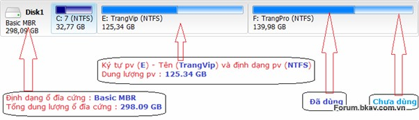

Đây là mô hình theo tỉ lệ tương đối của các phân vùng với nhau giúp
người sử dụng dễ hình dung. Phía dưới các phân vùng là chi tiết về định
dạng, dung lượng chính xác của các phân vùng đó. Khoảng trống có chữ
Unallocated là khoảng không gian chưa được định dạng trên ổ đĩa cứng.
Các phẩn mềm phân vùng hiện nay đều có giao diện đồ họa trình bày mô
hình theo mẫu này.

-   Các phần mềm phân vùng đều cho phép xem trước toàn bộ các thao tác
    trên mô hình - tạo thành một list, sau khi người dùng hài lòng với
    mô hình phân vùng mới thì ấn nút để "Thực hiện" toàn bộ lên ổ đĩa
    cứng thật. Sau khi phần mềm thực hiện xong, việc khôi phục lại mô
    hình cũ là không thể (rất khó). Vì vậy bạn hãy cân nhắc kỹ quyết
    định cũng như cẩn thận trong từng thao tác của mình.

-   Tắt và lưu tất cả các chương trình trước khi thao tác phân vùng
    trên Windows.

-   Đảm bảo cấp điện đầy đủ cho máy tính khi thực hiện phân vùng (cả
    trên Windows và trên đĩa cứu hộ). Mất điện khi thao tác phân vùng
    chưa hoàn thành có thể khiến bạn lỗi đĩa cứng và mất toàn bộ
    dữ liệu.

**5. Vấn đề thường gặp - tăng giảm kích thước phân vùng**

Tăng giảm kích thước phân vùng là yêu cầu rất thường gặp trong quá trình
sử dụng máy tính. Để giải quyết vấn đề này, bạn cần nắm được vài thao
tác cơ bản sau.

1.  **Tạo phân vùng**: là thao tác định dạng cho một khoảng Unallocated
    để trở thành một phân vùng sử dụng được

2.  **Xóa phân vùng**: phân vùng bị xóa sẽ trở thành khoảng Unallocated.

3.  **Giảm kích thước một phân vùng**
    
    Điều kiện: Phân vùng chưa đầy - chưa sử dụng hết dung lượng.
    
    Ví dụ bạn muốn giảm kích thước phân vùng E

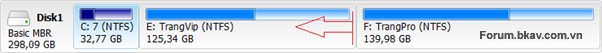

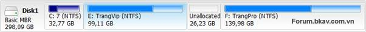

1.  **Dịch chuyển một phân vùng**
    
    Điều kiện: phải có khoảng Unallocated ở cạnh phân vùng đó.

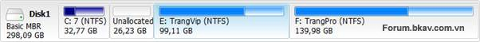

1.  **Tăng kích thước một phân vùng**
    
    Điều kiện: phải có khoảng Unallocated ở cạnh phân vùng đó.

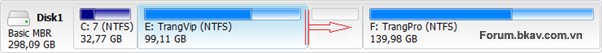

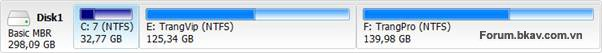

**Tóm lại**

Trong thực tế, một yêu cầu tăng giảm kích thước phân vùng sẽ phải kết
hợp từ 2 - 3 thao tác cơ bản trên. Một số trường hợp thường gặp như:

-   Cần tăng dung lượng cho một phân vùng, trước hết cần thực hiện giảm
    dung lượng 1 phân vùng cạnh nó hoặc xóa 1 phân vùng cạnh nó để có
    khoảng Unallocated

-   Cần chia thêm phân vùng thì trước hết giảm dung lượng 1 phân vùng
    nào đó để lấy khoảng Unallocated rồi tiến hành tạo phân vùng trên
    khoảng đó.

-   …

Tất cả đều kết hợp các thao tác cơ bản, bạn hãy nắm kỹ các thao tác đó
để vận dụng.

***B/ Easeus Partition Master (EPM)***

**1. Làm quen**

EPM là một giải pháp phân vùng và cũng là một công cụ quản lý quản lý ổ
đĩa All-in-One miễn phí. Nó cho phép bạn quản lý không gian ổ đĩa một
cách dễ dàng, giải quyết các vấn về phần vùng ngay trên Windows. Phiên
bản miễn phí mới có thêm cả tính năng copy đĩa và khôi phục phân vùng,
hỗ trợ các ổ đĩa dung lượng lớn, ổ USB flash gắn ngoài.

Phiên bản miễn phí hỗ trợ cài đặt trên Windows 200/XP/Vista/W7 cả 32bit
và 64bit.
Trang chủ: <http://www.partition-tool.com/>
Hoặc [http://download.cnet.com/EaseUS-Part...-10863346.html](http://download.cnet.com/EaseUS-Partition-Master-Home-Edition/3000-2248_4-10863346.html)

**Cài đặt**

**2. Hướng dẫn sử dụng chi tiết**

**2.1. Áp dụng các thao tác vào ổ đĩa thật**

Mỗi thao tác bạn thực hiện đều được ghi lại vào list Pending Operations
nằm dưới cùng bên trái giao diện chính

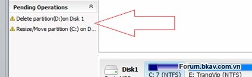

Sử dụng phim Undo để xóa thao tác vừa thực hiện, phím Apply để thực hiện
toàn bộ thao tác trên ổ đĩa thật.

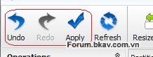

Một số thao tác không thể thực hiện luôn mà sẽ thực hiện sau khi khởi
động lại.

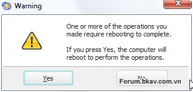

Sau khi sắp xếp công việc, hãy bấm YES để máy tính khởi động lại và để
phần mềm hoàn thành nốt.

**2.2. Tạo phân vùng**

Bấm chuột phải vào khoảng trống Unallocated, chọn Create Partition

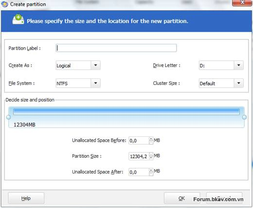

Hộp thoại Create Partition hiện ra. Bạn điền vào các mục cần chú ý sau:

-   **Partition Label**: là nhãn, hay chính là tên riêng bạn đặt cho
    phân vùng đó

-   **Create As**: Logical hay Primary. Nhớ quy tắc 4pri

-   **File System**: định dạng phân vùng, nên để NTFS.

-   **Drive Letter**: ký tự đại diện cho phân vùng.

-   **Cluster Size**: để mặc định - Default.

Khung bên dưới là mô hình cho khoảng phân vùng cần tạo. (Nếu phân vùng
bạn tạo chiếm hết khoảng Unallocated thì không cần chú ý mục này):

-   Có thể cầm 2 mép có núm tròn để kéo cho phân vùng có kích thước và
    vị trí vừa ý.

-   **Unallocated Space Before**: dung lượng khoảng trống bên trái phân
    vùng sẽ tạo.

-   **Partition Size**: dung lượng phân vùng sẽ tạo

-   **Unallocated Space After**: dung lượng khoảng trống bên phải phân
    vùng sẽ tạo.

**2.3. Xóa phân vùng.**

Click chuột phải vào phân vùng cần xóa, chọn Delete Partition

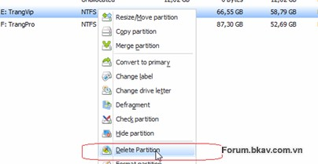

Một hộp thoại hiện ra, bấm OK để xác nhận yêu cầu xóa.

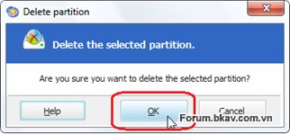

**2.4. Thay đổi kích cỡ, dịch chuyển phân vùng**

Click chuột phải vào phân vùng đó, chọn Resize/Move Partition

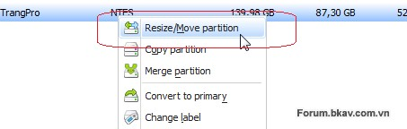

Cửa sổ Resize/Move Partition hiện ra

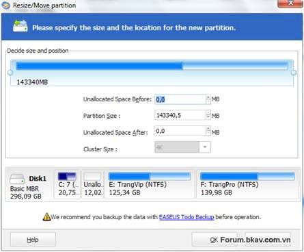

Công cụ đơn giản chỉ gồm có mô hình và một số lựa chọn ở dưới. Việc tăng
giảm kích thước hay dịch chuyển phân vùng có thể hoàn thành một cách
tương đối bằng cách kéo thả 2 núm ở dưới, hoặc dịch toàn bộ khối phân
vùng về 2 phía, các thông số phía dưới sẽ tự thay đổi theo.

Rất đặc biệt, khi sử dụng EPM

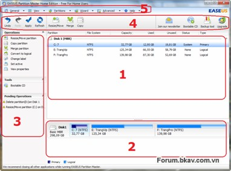

bạn có thể kéo thả để thay đổi kích cỡ hay dịch chuyển phân vùng ngay
tại vùng số 2 - vùng mô hình ở giao diện chính thay vì mở hộp thoại
Resize/Move Partition. Đây là một khác biệt rất thú vị, giúp thao tác
đơn giản hơn với tất cả mọi người.

**2.5. Định dạng lại phân vùng.**

Thao tác này sẽ xóa toàn bộ dữ liệu có trên phân vùng và định dạng lại
phân vùng đó.

Thực hiện: Click chuột phải vào phân vùng, chọn công cụ Format.

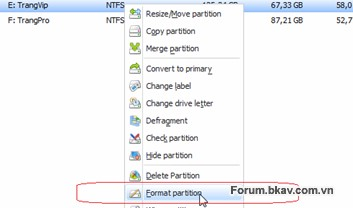

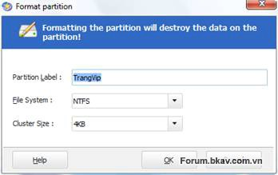

-   **Partition Label**: là nhãn, hay chính là tên riêng bạn đặt cho
    phân vùng đó

-   **File System**: định dạng phân vùng, nên để NTFS.

-   **Cluster Size**: tùy bạn

**2.6. Sao chép phân vùng**

**2.7. Sáp nhập phân vùng**

Click chuột phải vào 1 trong 2 phân vùng cần sáp nhập, chọn Merge
partition

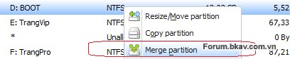

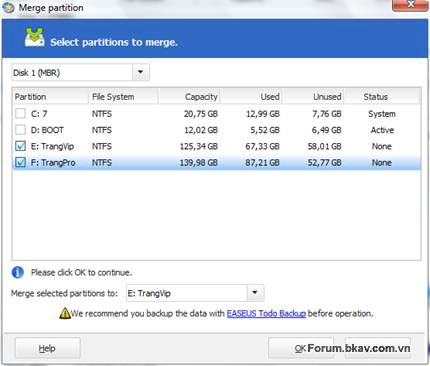

Tích chọn các phân vùng muốn sáp nhập. Lưu ý các phân vùng cần sáp nhập
phải nằm sát cạnh nhau - liên tục.

Mục **Merge selected partitions to**: đặt tên cho phân vùng mới được sáp
nhập theo tên của phân vùng nào trước đó.

**2.8. Xóa dữ liệu an toàn**

Khi bạn Delete Partition, thực chất chỉ có bảng quản lý các tệp tin bị
xóa dẫn đến toàn bộ dữ liệu bị tàng hình, thực chất dữ liệu vẫn nằm trên
ổ đĩa cứng. Công cụ Wipe của EPM giúp dữ liệu bị ghi đè bằng một dữ liệu
khác, mất hẳn khả năng phục hồi.

Thực hiện:

Công cụ Wipe có thể thực hiện trên phân vùng, trên một khoảng
Unallocated hoặc quy mô cả ổ đĩa

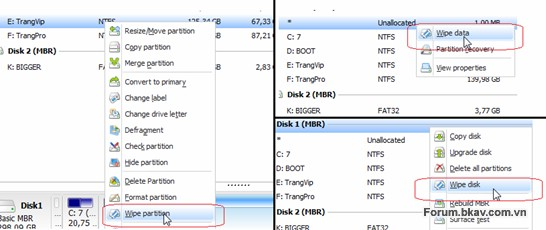

Sau khi chọn đối tượng, chọn số lần ghi đè thích hợp, bấm OK

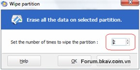

**2.9. Phục hồi phân vùng**

**2.10. Kiểm tra lỗi**

a/ Kiểm tra lỗi ổ đĩa cứng:

Click chuột phải vào ổ đĩa, chọn Surface Test

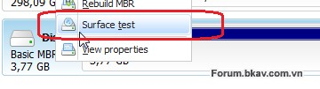

Cửa sổ Surface test hiện ra và quá trình kiểm tra bắt đầu luôn

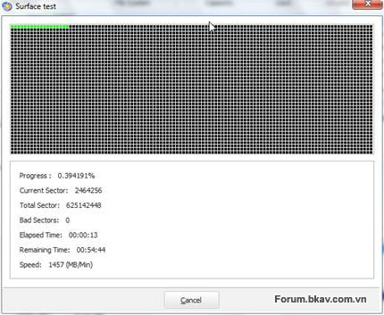

Quá trình này sẽ tiến hành kiểm tra lỗi trên bề mặt ổ đĩa cứng, các điểm
bị hư hại sẽ được đánh dấu để hệ điều hành không sử dụng nữa. Việc kiểm
tra này cũng có đôi chút tác dụng với những ổ đĩa hơi kém. Với những ổ
đĩa quá kém chắc không có phần mềm nào chữa được, phải dùng đến phần
cứng (vd như
búa
)

b/ Kiểm tra lỗi phân vùng

Click chuột phải vào phân vùng cần kiểm tra, chon **Check Partition**

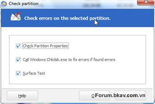

-   **Check Partition Properties**: Kiểm tra các thuộc tính của
    phân vùng.

-   **Call Windows chkdisk.exe**: gọi chương trình Chkdsk có sẵn trong
    Windows để sửa lỗi nếu có.

-   **Surface Test**: kiểm tra bề mặt phân vùng (giống như trên).

Bạn nên chọn cả 3 mục cho chắc ăn, sau khi chọn bấm OK. Quá trình kiểm
tra sẽ bắt đầu luôn.

**2.11. Chuyển đổi**

-   Chuyển từ FAT/FAT32 sang NTFS: click chuột phải vào phân vùng FAT
    chọn**Convert to NTFS.**
    (Yêu cầu phân vùng còn trống ít nhất 3%)

-   Chuyển từ Primary sang Logical và ngược lại: Click chuột phải vào
    phân vùng Primary chọn **Convert to Logical** hoặc click chuột phải
    vào phân vùng Logical chọn **Convert to Primary.**

-   Chuyển từ ổ đĩa **Dynamic** sang **Basic**: Click chuột phải vào đầu
    ổ đĩa, chọn**Convert to basic disk**

**2.12. Một số công cụ khác**

-   **Set active**: chỉ dành cho các phân vùng primary - phân vùng nào
    được set active sẽ là phân vùng khởi động

-   **Change label**: đổi tên riêng - nhãn phân vùng

-   **Change drive letter**: đổi ký tự đại diện phân vùng. Vì EPM chạy
    trên Windows nên ký tự đại diện này chính là ký tự bạn sẽ nhìn thấy
    trong My Computer và các trình duyệt file khác. Bạn có thể đổi ký tự
    đại diện theo ý muốn, miễn là ký tự đó chưa có phân vùng nào
    sử dụng.

-   **Explore partition**: công cụ giúp bạn duyệt cây thư mục, xem tên
    file, dung lượng, ngày tháng tạo file. Vậy thôi.

-   **Defragment**: chống phân mảnh cho phân vùng. Không cần thiết lắm,
    nên để dành cho các công cụ chuyên nghiệp.

-   **Hide partition**: công cụ ẩn phân vùng. Dữ liệu trên phân vùng còn
    nguyên nhưng sẽ không xuất hiện trên bất kỳ hệ điều hành nào. Rất ý
    nghĩa và đơn giản với người dùng nghiệp dư nếu muốn ẩn giấu dữ liệu.

-   **Rebuild MBR**: dành cho ổ đĩa, có lẽ hơi thừa khi bạn vẫn khởi
    động được Windows suôn sẻ để sử dụng EPM. Hơn nữa công cụ này cũng
    rất nghèo nàn khi chỉ cung cấp MBR cho họ nhà Windows.

**3. Tổng kết**

Dễ sử dụng, thẩm mỹ cao, các chức năng quan trọng đều hoàn thành xuất
sắc và đặc biệt, bạn có thể sử dụng miễn phí. EPM là sự lựa chọn số 1
trong các phần mềm phân vùng chạy trên Windows hiện nay.

***C/ Acronis Disk Director***

**1. Làm quen**

**2. Hướng dẫn sử dụng chi tiết**

**2.1. Áp dụng các thao tác vào ổ đĩa thật**

Sử dụng phim Undo để xóa thao tác vừa thực hiện, phím Commit để thực
hiện toàn bộ thao tác trên ổ đĩa thật. Có thể dùng nút này trên Toolbar
hoặc vào Menu**Operations &gt; Commit**
(Nút Commit của ADD tương đương với nút Apply trên các phần mềm khác)

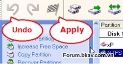

**2.2. Tạo phân vùng mới**

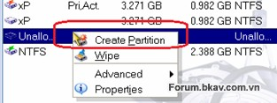

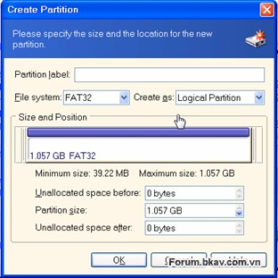

**2.3. Xóa phân vùng - Xóa dữ liệu an toàn**

Bấm chuột phải vào phân vùng cần xử lý, chọn **Delete**

-   **Delete partition**: lựa chọn này chỉ xóa phân vùng, dữ liệu vẫn có
    khả năng phục hồi

-   **Delete partition and destroy data**: xóa phân vùng và hủy dữ liệu
    bằng cách ghi đè nhiều lần. Số lần ghi đè có thể thay đổi theo ý
    muốn (ở đây là 1)
    (Gộp công cụ xóa phân vùng và xóa dữ liệu thành 1 hộp như vậy cũng
    rất tiện)

**2.4. Thay đổi kích thước - dịch chuyển một phân vùng**

Click chuột phải vào phân vùng cần xử lý, chọn Resize

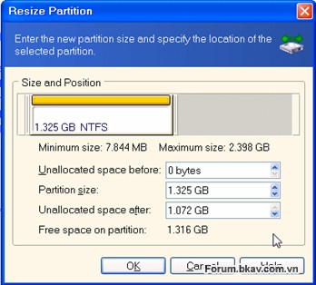

Có thể kéo thả 2 mép hoặc điều chỉnh thông số ở dưới đến khi vừa ý

**2.5. Định dạng**

Click chuột phải vào phân vùng cần định dạng, chọn Format

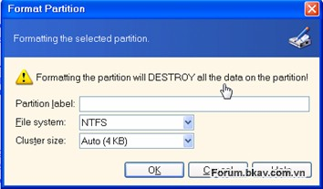

-   **Partition label**: đặt tên phân vùng

-   **File system**: nên để là NTFS

-   **Cluster size**: tùy bạn

**2.6. Chuyển đổi**

Click chuột phải vào phân vùng cần xử lý, chọn **Advanced &gt; Convert**

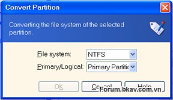

Có thể chuyển đổi định dạng FAT32-NTFS hoặc chuyển qua lại giữa
Primary-Logical

Hoặc **Advanced &gt; Change Type** để có nhiều tùy chọn định dạng hơn

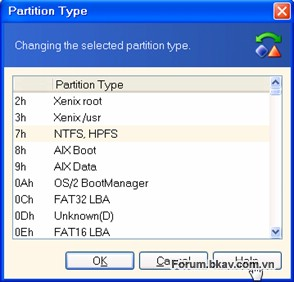

**2.7. Thay đổi kích thước cluster không mất dữ liệu**

Chọn phân vùng cần đổi cluster &gt; **Change Cluster Size**

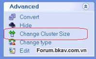

Bảng dưới đây cho thấy rất rõ, kích thước cluster càng lớn thì dung
lượng bị hao hụt càng nhiều. Cột **Wasted** cho thấy cụ thể lượng hao
hụt trong trường hợp này, ứng với từng cỡ Cluster.

Nhập kích thước mà bạn muốn vào ô **New cluster size** &gt; **OK**

**2.8. Công cụ nhanh để tạo thêm phân vùng**

(Nhóm công cụ nhanh này rất đặc biệt, thể hiện ADD đã nghiên cứu kỹ hành
vi người dùng, gộp các thao tác cần thiết cho một mục đích vào chung cửa
sổ, tránh nhầm lẫn hoặc để người dùng tự mò như các phần mềm khác, tuy
vậy, vẫn còn hơi rườm rà)

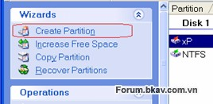

Chọn phân vùng mà bạn muốn cắt bớt dung lượng để tạo phân vùng mới
&gt; **Next**

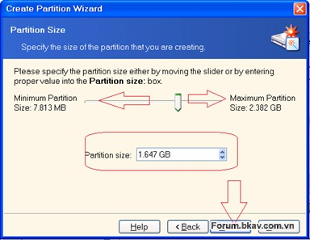

Dung lượng trống muốn cắt ra

Tiếp theo, chọn loại phân vùng mới Primary (active) hay Logical, định
dạng NTFS và đặt tên riêng cho phân vùng &gt; Xong

**2.9. Công cụ nhanh để sao chép phân vùng**

**2.10. Công cụ nhanh để tăng kích thước một phân vùng**

**2.11. Một số công cụ khác**

-   **Recover Partition: **cũng giống như EPM, công cụ này chỉ có thể
    phục hồi phân vùng dạng Unallocated (kiểu như xóa nhầm), không có
    nhiều ý nghĩa lắm.

-   **Merge**: sáp nhập 2 phân vùng, rất đơn giản.

-   **Advanced &gt; Set active**: chỉ dành cho các phân vùng primary -
    phân vùng nào được set active sẽ là phân vùng khởi động

-   **Change label**: đổi tên riêng - nhãn phân vùng

-   **Advanced Hide:** công cụ ẩn phân vùng. Dữ liệu trên phân vùng còn
    nguyên nhưng sẽ không xuất hiện trên bất kỳ hệ điều hành nào. Rất ý
    nghĩa và đơn giản với người dùng nghiệp dư nếu muốn ẩn giấu dữ liệu.

**3. Tổng kết**

ADD là công cụ chạy trên đĩa cứu hộ, mang tính cơ động cao, dễ dàng xử
lý khi gặp trục trặc về phân vùng. Đồng thời do ADD chạy độc lập với hệ
điều hành nên thời gian thực hiện nhanh hơn đáng kể so với EPM. Sử dụng
ADD rất đơn giản và dễ hiểu, vì vậy Acronis vẫn là công cụ phân vùng tốt
nhất trên các đĩa cứu hộ hiện tại.

***D/ Tổng hợp***

Trên đây là 2 phần mềm tốt nhất chạy trên môi trường Windows và đĩa cứu
hộ, tùy vào nhu cầu cũng như điều kiện thiết bị sẵn có, bạn hãy chọn cho
mình phần mềm phù hợp
Sau đây là bảng tổng kết, đánh giá

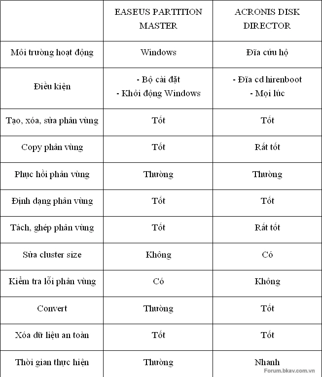

