 ***Hướng Dẫn Sử Dụng Hiren’s ***

 ***BootCD***

-   ***Cách Tùy Chỉnh Bios để Boot Hiren’s hay Boot Windows***

 Bạn đang cần truy cập vào BIOS để điều chỉnh một vài thông số, hay đơn
 giản bạn muốn chỉnh cho máy tính của mình khởi động từ USB/CD thay vì
 khởi động vào ổ cứng. Dưới đây là một số cách Đăng nhập khu rừng (
 Bios ) đối với 1 số dòng máy
 

 ***Lưu ý: Các thao tác này chỉ thực hiện khi bạn đang ở môi trường
 khởi động (Lúc vừa mở máy hoặc vừa khởi động lại máy), chứ không có
 tác dụng trong môi trường hệ điều hành. Thông thường nếu quan sát kỹ
 bạn sẽ hướng dẫn ngay khi khởi động máy, tuy nhiên màn hình này chỉ
 hiện ra trong vài giây, do đó khi máy tính vừa khởi động bạn nên bấm
 ngay nhé***
 
 **Máy tính Sony Vaio**
 
 Vào Bios &gt; nhấn F2
 Recovery &gt; nhấn F10
 Để boot vào đĩa CD/DVD thì các bạn cho đĩa vào ổ đĩa rồi khởi động lại
 máy, máy sẽ tự động boot vào ổ đĩa.(vì dòng SONY mạc định là boot ổ
 CD/DVD đầu tiên rồi).
 
 **Máy tính HP – Compaq**
 
 Vào Bios &gt; nhấn F10
 Chọn boot &gt; nhấn F9
 Recovery &gt; nhấn F11
 
 **Máy tính Lenovo - IBM**
 
 Vào Bios &gt; nhấn F1 có máy là F2
 Chọn boot &gt; nhấn F12
 Recovery &gt; nhấn phím xanh ThinkVantage
 
 **Máy tính Dell**
 
 Vào Bios &gt; nhấn F2
 Chọn boot &gt; nhấn F12
 Recovery &gt; nhấn F8 rồi chọn Repair your Computer
 
 **Máy tính Acer - Emachines - MSI - Gateway**
 
 Chọn Boot &gt; nhấn F12
 Vào BIOS &gt; nhấn F2
 (thường chức năng Menu boot bị Disible phải vào Enale mới bấm F12
 được)
 
 **Máy tính Asus**
 
 Vào BIOS &gt; nhấn F2
 Chọn Boot &gt; nhấn ESC
 
 **Máy tính Toshiba**

 Luôn phải ấn phím ESC rồi ấn liên tục F1 hoặc F2 tùy vào dòng máy, đời
 máy.
 
 Đối với các dòng máy không có trong danh sách trên, để vào BIOS bạn có
 thể thử lần lượt các phím DEL, F1, F2, F10 đây là các phím thường dùng
 để vào BIOS cho tất cả các đời máy, đối với các máy tính bàn, phím DEL
 và phím F2 là 2 phím được sử dụng nhiều nhất.
 
 

 ***Lưu ý: Khi thay đổi các thiết lập trong BIOS có thể làm cho máy
 tính không khởi động được hoặc có khả năng bị màn hình xanh, không
 nhận thiết bị. Hãy cẩn thận với từng thiết lập mà bạn thay đổi, nếu
 không tin chắc vào khả năng của mình, bạn nên liên hệ với Trung
 tâm gần nhất để được hỗ trợ thêm. Chúc bạn thành công***

***Các bạn sẽ được tìm hiểu thật kỹ về các tùy chỉnh các thông số trong
Bios ở (bài viết này)***

***Dưới đây là ví dụ đối với máy tính của mình, mình đăng nhập Bios và
tùy chỉnh sao cho Boot từ đĩa DVD/CD Hiren’s Boot hoặc boot từ USB
flash***

***a) Khởi động sao cho mặc định là boot từ DVD/CD***

***Máy tính của mình muốn vào Bios Setup thì nhấn phím F2***

***Giao diện khi vào tới Bios như sau : ***

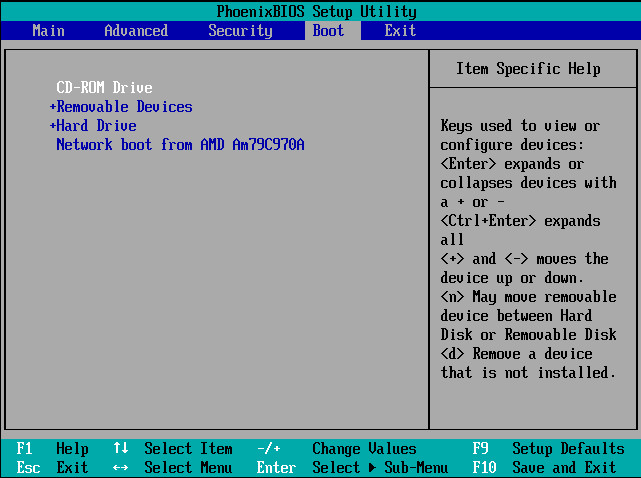

***Như các bạn đã thấy ở trên : tại tab Boot***

***Như bình thường thì cái dòng “ CD-ROM Drive” sẽ không ở hàng đầu.Ở
đây Ngọc Khánh đã tùy chỉnh sao cho dòng đó lên đầu hàng.Nếu các bạn
muốn lần sau khi khởi động máy mà khi ta bỏ đĩa Boot vào mà nó tự động
boot từ DVD thì chuyển dòng “ CD-ROM Drive” lên hàng đầu tiên như hình
trên ---- nhấn phím F10 để lưu lại các tùy chỉnh mới thao tác***

***( Lưu ý thay vì muốn boot mặc định từ USB thay vì từ CD ) thì ta cũng
thao tác tương tự như trên. Nếu các bạn đã cắm USB thì khi vào Bios thì
ta sẽ thấy xuất hiện cái tên USB và ta chỉ việc chọn nó mà thôi .***

***b) Cách vô ( Menu Boot nhanh ) -- cái này thì chỉ có hiệu lực trong
lần mà bạn tác nghiệp với Bios thôi còn lần sau muốn Boot bằng thiết bị
nào mà bạn muốn thì lại thao tác lại***

***Và giao diện của Menu Boot như sau :***

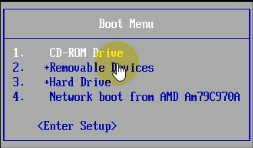

***Ở giao diện này thì các bạn thích cho máy tính của mình khởi động từ
thiết bị nào thì các bạn chỉ cần dùng phím di chuyển lên xuống tới mục
cần chọn và nhấn Enter. Cũng như mình nói ở trên kia là nếu các bạn thực
sự đã kết nối USB với máy tính thì ở giao diện của Menu Boot sẽ xuất
hiện USB của các bạn***

-   ***Cách ghi đĩa Hiren’s Boot.***

Burn file Hiren’s ra DVD thì có nhiều cách chẳng hạn như dùng phần mềm
Nero, Ultraiso , **CDBurnerXP, Burn Aware Free Edition,….v.v**

Tùy theo tính năng nặng nhẹ mà mỗi người lựa chọn cho mình một tools hữu
ích nhất để thực hiện các công việc của mình

Riêng Ngọc Khánh thì với tiêu chí : nhẹ, nhanh chóng, tiện lợi, cơ động,
chất lượng tốt,….nên mình thường hay dung các soft portable ( không cài
đặt ).

Mình sẽ hướng dẫn các bạn Burn file ISO Hiren’n Boot ra đĩa CD/DVD bằng
chương trình Ultraiso:

Chuẩn bị :

-   Các bạn cần có một đĩa DVD hay CD trắng ( chưa ghi dữ liệu trên đó
    ).trên thị trường có bán rất nhiều, tùy theo dung lượng của file ISO
    mà các bạn cần Burn mà có thể chọn mua đĩa DVD hay CD.(CD thì dung
    lượng có 700MB, còn DVD có dung lượng là 4.7GB)

-   Đảm bảo rằng ổ ghi của các bạn còn hoạt động tốt.

-   Điều nữa đó là các bạn tìm trên mạng các bản Hiren Boot nào mà ưng ý
    nhất, kéo em nó về để đưa e nó lên thớt ( ý là để Burn e nó ra đĩa )

Cách Thực hiện :

Cài đặt và Mở chương trình Ultraiso lên với giao diện như sau :

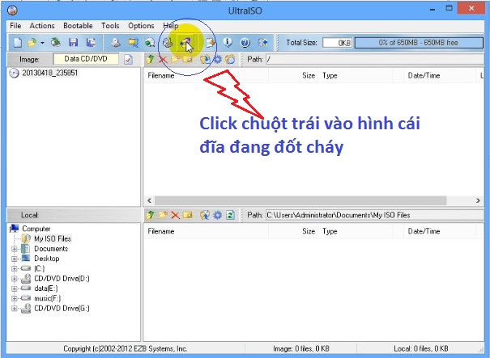

Các bạn làm theo hình trên và xuất hiện giao diện sau :

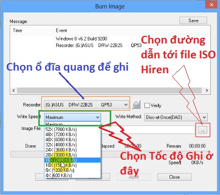

Các bạn nên chọn tốc độ ghi vừa phải để tránh chất lượng đĩa không được
tốt.

Cuối cùng nhấn nút “Burn” như hình dưới đây.

Trong quá trình Burn đĩa, các bạn tốt nhất là không nên nóng vội tắt
giao diện chương trình Ultraiso khi nó thông báo là Burn thành công.

Khi chương trình thông báo như thế thì các bạn vẫn cứ chịu khó đợi cho
tới khi nào mà ổ đĩa của chúng ta tự động đẩy đĩa ra.

Đó là ta đã ghi xong đĩa Hiren rồi đó, và giờ thì có thể sử dụng cái đĩa
mới ghi cho việc cứu hộ máy tính rồi. Chúc các bạn thành công.

Muốn boot đĩa Hiren mới ghi thì các bạn nhớ đọc hướng dẫn ở trên phần
thiết lập các tùy chỉnh Bios để boot DVD,…

-   ***Cách tạo USB boot Hiren***

Có 2 cách như sau : Để tiện cho việc hướng dẫn thì mình lấy file ISO
Hiren của mình làm ví dụ

Cách 1 : Tạo Group4Dos ---&gt; Các bước thực hiện như sau :

Bước 1 : Đảm bảo máy tính đã kết nối với USB

Bước 2 : Tải công cụ USB Format Tools tại đây
: [*http://upfile.vn/9b06*](http://upfile.vn/9b06)

Chạy chương trình này lên với giao diện như sau: (với Windows Vista và
Windows 7 tùy trường hợp, các bạn phải Click phải vào file
usb\_format.exe chọn Run as administrator rồi làm theo hướng dẫn)

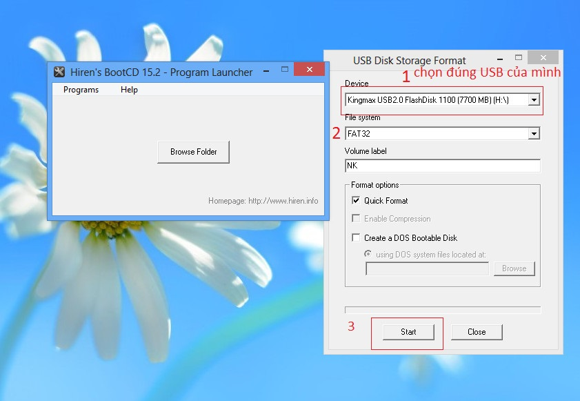

Chọn USB cần format (1): nếu có nhiều ổ usb đang cắm vào máy hoặc nhiều
ổ cứng trên máy, các bạn chú ý chọn chính xác ổ usb muốn làm boot, không
thì nguy hiểm lắm đó

Chọn file system là Fat 32 (2), đặt tên ở Volume Label ví dụ: NK, sau đó
Start (3) như hình trên để format ổ USB BOOT.

Bước 3 : Tải công cụ Grub4dos tại đây
:[*http://upfile.vn/9b2p*](http://upfile.vn/9b2p)

và làm theo hình hướng dẫn sau :

Sau khi Click Install để cài đặt sẽ có một cửa sổ Command Prompt hiện ra
báo Install Success (đã cài đặt thành công), các bạn nhấn Enter để thoát
khỏi chương trình.

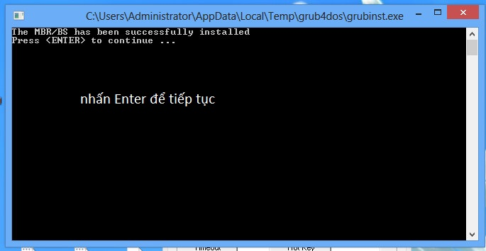

Bước 3 : Vào trong thư mục HBCD Trong file ISO Hiren's copy 2 file đó là
: grldr và menu.lst ( copy vào trực tiếp USB ) hình như sau:

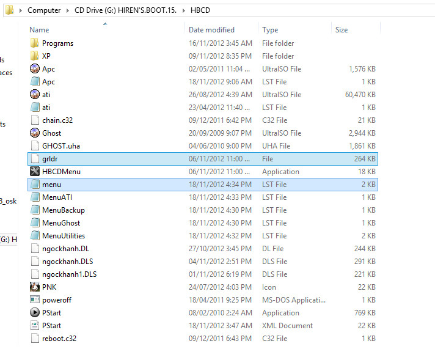

Bước 4 : và sau đó là copy toàn bộ các file Trong file ISO Hiren's vào
trực tiếp USB, copy xong thì ta có thể dùng USB cho công việc cứu hộ đc
rồi đó

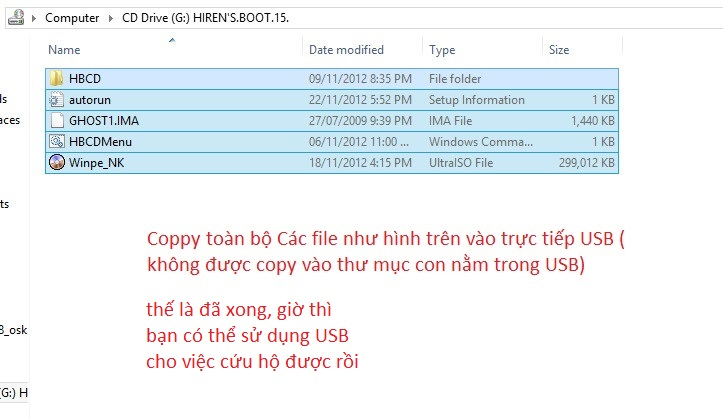

Cách 2 : Boot Trực Tiếp file ISO Hiren's của mình luôn

Làm tương tự như cách 1 cho tới bước 3 : Tiếp theo là làm như sau :

Nếu muốn boot bản Hiren's của mình , thì bạn nhớ đổi tên bên trong của
File Hiren's Boot luôn nhen,
nghĩa là mở file iso của mình lên, và Rename lại sao cho giống tên với
code boot, sau đó Save lại, ra ngoài đổi tên file tương tự, nghĩa là như
sau :

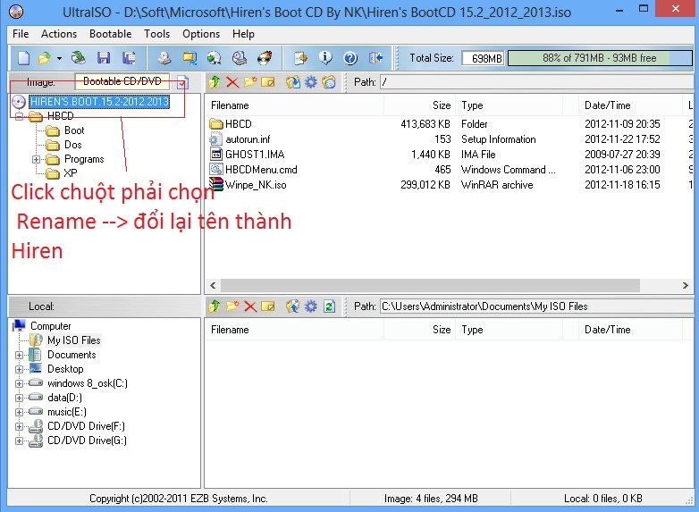

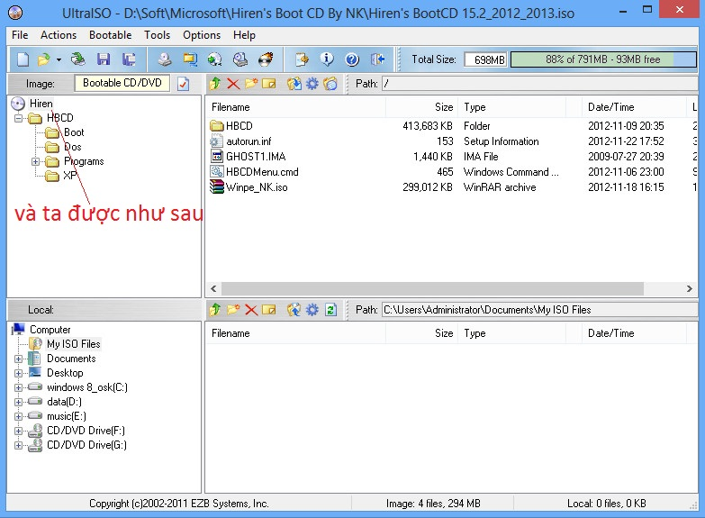

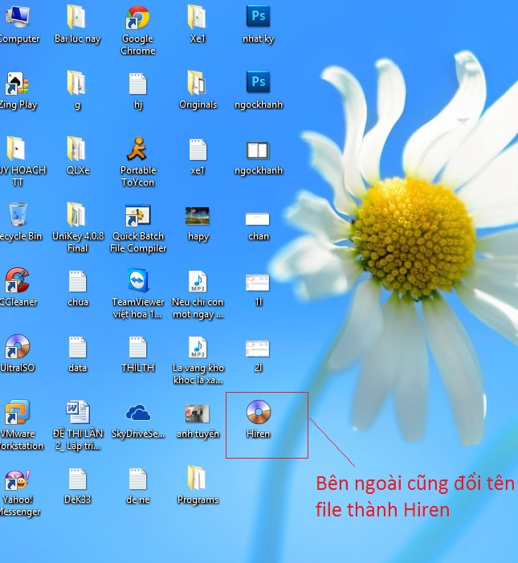

sau đó dùng code sau để boot cho USB hoặc HDD nhé :

*title Start Hiren's BootCD
find --set-root --ignore-floppies /Hiren.iso
map /Hiren.iso (hd32)
map --hook
root (hd32)
chainloader (hd32)
boot*

Hoặc

title Start Hiren's BootCD
find --set-root /Hiren.iso
map --mem /Hiren.iso (hd32)
map --hook
chainloader (hd32)

*Thế là đã tạo xong USB cứu hộ rồi đó, công việc còn lại là các bạn tùy
chỉnh Bios để boot từ USB thôi*

***Lưu ý cho trường hợp mà khi boot vào winmini XP thì trên Destop không
xuất hiện icon của chương trình nào hết***

***Để khắc phục tình trạng đó ta làm như sau :***

Đó là do boot từ file iso. Khi boot vào winxpmini, đầu tiên bạn mout
file iso vào ổ đĩa ảo. Tiếp theo các bạn mở cmd lên, từ dòng lệnh dos
bạn gõ lện như sau:
restartshell.cmd và enter. đợi chút sẽ có menu. Chúc bạn thành công nhé 

-   ***Cách Sử Dụng Mốt Số các Công Cụ Trong Hiren’s***

 ***A-Nhóm Hard Disk Tools ***

 **Phần 1:**

 **Khái niệm, định dạng phân vùng, các loại phân vùng và nguyên tắc
 phân vùng.**
 
 ***1.1. Khái niệm Phân vùng (Partition)***
 
 Phân vùng (partition): là tập hợp các vùng ghi nhớ dữ liệu trên các
 cylinder gần nhau với dung lượng theo thiết đặt của người sử dụng để
 sử dụng cho các mục đích sử dụng khác nhau. 
 
 Sự phân chia phân vùng giúp cho ổ đĩa cứng có thể định dạng các loại
 tập tin khác nhau để có thể cài đặt nhiều hệ điều hành đồng thời trên
 cùng một ổ đĩa cứng.

 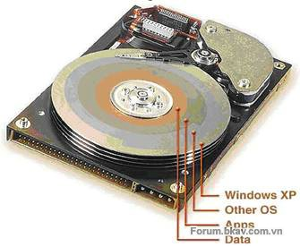

 Ví dụ: trong một ổ đĩa cứng có thể thiết lập một phân vùng có định
 dạng FAT/FAT32 cho hệ điều hành Windows 9X/Me và một vài phân vùng
 NTFS cho hệ điều hành Windows NT/2000/XP/Vista/Win7 với lợi thế về bảo
 mật trong định dạng loại này (mặc dù các hệ điều hành này có thể sử
 dụng các định dạng cũ hơn).
 
 Phân chia phân vùng không phải là điều bắt buộc đối với các ổ đĩa cứng
 để nó làm việc (một vài hãng sản xuất máy tính cá nhân nguyên chiếc
 chỉ thiết đặt một phân vùng duy nhất khi cài sẵn các hệ điều hành vào
 máy tính khi bán ra), chúng chỉ giúp cho người sử dụng có thể cài đặt
 đồng thời nhiều hệ điều hành trên cùng một máy tính hoặc giúp việc
 quản lý các nội dung, lưu trữ, phân loại dữ liệu được thuận tiện và
 tối ưu hơn, tránh sự phân mảnh của các tập tin.
 
 Những lời khuyên dưới đây giúp sử dụng ổ đĩa cứng một cách tối ưu
 hơn:
 
 Phân vùng chứa hệ điều hành chính: thường nên thiết lập phân vùng chứa
 hệ điều hành tại các vùng chứa phía ngoài rìa của đĩa từ (outer zone)
 bởi vùng này có tốc độ đọc/ghi cao hơn, dẫn đến sự khởi động hệ điều
 hành và các phần mềm khởi động và làm việc được nhanh hơn. Phân vùng
 này thường được gán tên là C.
 
 Phân vùng chứa hệ điều hành không nên chứa các dữ liệu quan trọng bởi
 chúng dễ bị virus tấn công (hơn các phân vùng khác), việc sửa chữa
 khắc phục sự cố nếu không thận trọng có thể làm mất toàn bộ dữ liệu
 tại phân vùng này.
 
 Phân vùng chứa dữ liệu thường xuyên truy cập hoặc thay đổi: những tập
 tin đa phương tiện (multimedia) nếu thường xuyên được truy cập hoặc
 các dữ liệu làm việc khác nên đặt tại phân vùng thứ hai ngay sau phân
 vùng chứa hệ điều hành. Sau khi quy hoạch, nên thường xuyên thực thi
 tác vụ chống phân mảnh tập tin trên phân vùng này.
 
 Phân vùng chứa dữ liệu ít truy cập hoặc ít bị sửa đổi: nên đặt riêng
 một phân vùng chứa các dữ liệu ít truy cập hoặc bị thay đổi như các bộ
 cài đặt phần mềm. Phân vùng này nên đặt sau cùng, tương ứng với vị trí
 của nó ở gần khu vực tâm của đĩa (inner zone).
 
 (Có nhiều phần mềm có thể sử dụng để quy hoạch các phân vùng đĩa cứng:
 fdisk trong DOS, Disk
 
 ***1.2. Định dạng phân vùng***
 
 Lựa chọn định dạng các phân vùng là hành động tiếp sau khi quy hoạch
 phân vùng ổ đĩa cứng. Tuỳ thuộc vào các hệ điều hành sử dụng mà cần
 lựa chọn các kiểu định dạng sử dụng trên ổ đĩa cứng. Một số định dạng
 sử dụng trong các hệ điều hành họ Windows có thể là:

-   FAT(File Allocation Table): chuẩn hỗ trợ DOS và các hệ điều hành họ
    Windows 9X/Me (và các hệ điều hành sau). Phân vùng FAT hỗ trợ độ dài
    tên 11 ký tự (8 ký tự tên và 3 ký tự mở rộng) trong DOS hoặc 255 ký
    tự trong các hệ điều hành 32 bit như Windows 9X/Me. FAT có thể sử
    dụng 12 hoặc 16 bit, dung lượng tối đa một phân vùng FAT chỉ đến 2
    GB dữ liệu.

-   FAT32(File Allocation Table, 32-bit): tương tự như FAT, nhưng nó
    được hỗ trợ bắt đầu từ hệ điều hành Windows 95 OSR2 và toàn bộ các
    hệ điều hành sau này. Dung lượng tối đa của một phân vùng FAT32 có
    thể lên tới 2 TB (2.048 GB).

-   NTFS(Windows New Tech File System): được hỗ trợ bắt đầu từ các hệ
    điều hành họ NT/2000/XP/Vista/Win7. Một phân vùng NTFS có thể có
    dung lượng tối đa đến 16 Exabytes.

 Không chỉ có thế, các hệ điều hành họ Linux sử dụng các loại định dạng
 tập tin riêng.
 
 - Format: Format là sự định dạng các vùng ghi dữ liệu của ổ đĩa cứng.
 Tuỳ theo từng yêu cầu mà có thể thực hiện sự định dạng này ở các thể
 loại cấp thấp hay sự định dạng thông thường.
 
 **+ Format cấp thấp**
 
 Format cấp thấp (low-level format) là sự định dạng lại các track,
 sector, cylinder (bao gồm cả các ‘khu vực” đã trình bày trong phần
 sector). Format cấp thấp thường được các hãng sản xuất thực hiện lần
 đầu tiên trước khi xuất xưởng các ổ đĩa cứng. Người sử dụng chỉ nên
 dùng các phần mềm của chính hãng sản xuất để format cấp thấp (cũng có
 các phần mềm của hãng khác nhưng có thể các phần mềm này không nhận
 biết đúng các thông số của ổ đĩa cứng khi tiến hành định dạng lại).
 
 Khi các ổ cứng đã làm việc nhiều năm liên tục hoặc có các khối hư hỏng
 xuất hiện nhiều, điều này có hai khả năng: sự lão hoá tổng thể hoặc sự
 rơ rão của các phần cơ khí bên trong ổ đĩa cứng. Cả hai trường hợp này
 đều dẫn đến một sự không đáng tin cậy khi lưu trữ dữ liệu quan trọng
 trên nó, do đó việc định dạng cấp thấp có thể kéo dài thêm một chút
 thời gian làm việc của ổ đĩa cứng để lưu các dữ liệu không mấy quan
 trọng. Format cấp thấp giúp cho sự đọc/ghi trên các track đang bị lệch
 lạc trở thành phù hợp hơn khi các track đó được định dạng lại (có thể
 hiểu đơn giản rằng nếu đầu đọc/ghi bắt đầu làm việc dịch về một biên
 phía nào đó của track thì sau khi format cấp thấp các đầu đọc/ghi sẽ
 làm việc tại tâm của các track mới).
 
 Không nên lạm dụng format cấp thấp nếu như ổ đĩa cứng của bạn đang
 hoạt động bình thường bởi sự định dạng lại này có thể mang lại sự rủi
 ro: do sự thao tác sai của người dùng, các vấn đề xử lý trong bo mạch
 của ổ đĩa cứng. Nếu như một ổ đĩa cứng xuất hiện một vài khối hư hỏng
 thì người sử dụng nên dùng các phần mềm che dấu nó bởi đó không chắc
 đã do sự hoạt động rơ rão của phần cứng.
 
 **+ Format thông thường**

-   Định dạng mức cao (high-level format) là các hình thức format thông
    thường mà đa phần người sử dụng đã từng thực hiện (chúng chỉ được
    gọi tên như vậy để phân biệt với format cấp thấp) bởi các lệnh sẵn
    có trong các hệ điều hành (DOS hoặc Windows), hình thức format này
    có thể có hai dạng:

-   Format nhanh (quick): đơn thuần là xoá vị trí lưu trữ các ký tự đầu
    tiên để hệ điều hành hoặc các phần mềm có thể ghi đè dữ liệu mới lên
    các dữ liệu cũ. Nếu muốn format nhanh: sử dụng tham số “/q” với lệnh
    trong DOS hoặc chọn “quick format” trong hộp lựa chọn của lệnh ở hệ
    điều hành Windows.

-   Format thông thường: xoá bỏ các dữ liệu cũ và đồng thời kiểm tra
    phát hiện khối hư hỏng (bad block), đánh dấu chúng để chúng không
    còn được vô tình sử dụng đến trong các phiên làm việc sắp tới (nếu
    không có sự đánh dấu này, hệ điều hành sẽ ghi dữ liệu vào khối hư
    hỏng mà nó không báo lỗi - tuy nhiên khi đọc lại dữ liệu đã ghi đó
    mới là vấn đề nghiêm trọng).Đối với bộ nhớ Flash thì cũng không nên
    format nhiều dễ làm hỏng ổ đĩa.

 **+ Tham số khi format**

-   Ở dạng format cấp thấp: các thông số thiết đặt phần nhiều do phần
    mềm của hãng sản xuất xác nhận khi bạn nhập vào các thông số nhìn
    thấy được trên ổ đĩa cứng (Model, serial number...) nên các thông số
    này cần tuyệt đối chính xác nhằm tránh sự thất bại khi tiến hành.

-   Ở dạng format thông thường: nếu là hình thức format nhanh (quick)
    thì các thông số được giữ nguyên như lần format gần nhất, còn lại có
    một thông số mà người tiến hành format cần cân nhắc lựa chọn là kích
    thước đơn vị (nhỏ nhất) của định dạng là cluster trong Windows XP
    (mục Allocation unit size trong hộp thoại lựa chọn format). Kích
    thước cluster có thể lựa chọn bắt đầu từ 512 byte bởi không thể nhỏ
    hơn kích thước chứa dữ liệu của một sector (với kích thước một
    sector thông dụng nhất là 512 byte). Các kích thước còn lại có thể
    là: 1024, 2048, 4096 với quy định giới hạn của từng loại định dạng
    (FAT/FAT32 hay NTFS).

 Sự lựa chọn quan trọng nhất là phân vùng cần định dạng sử dụng chủ yếu
 để chứa các tập tin có kích thước như thế nào. Để hiểu hơn về lựa
 chọn, xin xem một ví dụ sau: Nếu lưu một tập tin text chỉ có dung
 lượng 1 byte (bạn hãy thử tạo một tập tin text và đánh 1 ký tự vào đó)
 thì trên ổ đĩa cứng sẽ phải dùng đến ít nhất 512 byte để chứa tập tin
 này với việc lựa chọn kích thước đơn vị là 512 byte, còn nếu lựa chọn
 cluster bằng 4096 byte thì kích thước lãng phí sẽ là 4096 - 1 = 4095
 byte.
 
 Nếu như lựa chọn kích thước cluster có kích thước khá nhỏ thì các bảng
 FAT hoặc các tập tin MFT (Master File Table) trong định dạng NTFS lại
 trở lên lớn hơn.
 
 Như vậy ta nhận thấy: nếu ổ đĩa cứng sử dụng cho các tập tin do các
 phần mềm văn phòng thường ngày (Winword, bảng tính excel...), nên chọn
 kích thước nhỏ: 1024 hoặc 2048 byte. Nếu chứa các tập tin là dạng các
 bộ cài đặt phần mềm hoặc các tập tin video, nên chọn kích thước này
 lớn hơn. Đặc biệt ở các ổ cứng nhỏ dành cho thiết bị di động thì sự
 lựa chọn thường là 512 byte (đây cũng thường là lựa chọn khi format
 các loại thẻ nhớ). Windows có thể cho bạn biết một tập tin kích thước
 thực (size) của nó và kích thước chứa trên đĩa (size on disk) của nó
 bằng cách bấm chuột phải và chọn Properties. Điều này giúp bạn có thể
 nhận ra sự lãng phí đã nêu. Phần mềm Partition Magic của Symantec có
 thể so sánh việc lựa chọn kích thước các cluster trên một phân vùng
 tồn tại dữ liệu.
 
 ***1.3. Các loại phân vùng, nguyên tắc phân vùng***
 
 - Có 5 loại phân vùng trong hệ thống máy X86: Primary; Extended;
 Logical; NTFS; Non-DOS.
 - **Nguyên tắc**:

-   Đối với Primary: là phân vùng đầu tiên và thường là duy nhất trên
    đĩa cứng để cài đặt điều hành, chỉ có Windows NT và các phiên bản
    sau của Linux thì có thể khởi động trên phân vùng Extended. Có tối
    đa 4 phân vùng Primary trên một ổ cứng hoặc 3 phân vùng Primary và 1
    phân vùng Extended.

-   Đối với Extended: chỉ tồn tại khi có ít nhất một phân vùng Primary.
    Phân vùng này có thể chiếm một phần trống còn lại của đĩa hay chỉ
    chiếm một phần. Phần còn lại có thể chứa phân vùng NTFS hay Non-DOS.

-   Đối với Logical: trong phân vùng Extended phải có ít nhất 1 phân
    vùng Logical nếu bạn muốn DOS hay Windows truy cập đến đĩa cứng
    thông qua chữ cái đại diện. Nếu có phân vùng Extended mà không có
    phân vùng Logical trong nó thì bất cứ hệ điều hành nào cũng có thể
    thay đổi phân vùng Extended thành phân vùng Non-DOS.

-   Đối với NTFS: phân vùng NTFS thường được các phiên bản Windows
    sử dụng. Hệ điều hành Dos và Windows 8x, Me không có khả năng truy
    cập đến phân vùng này.

-   Đối với Non-DOS: phân vùng Non-DOS là phân vùng không được DOS hoặc
    Windows hỗ trợ.

 **Phần 2:**

 **Cách chia đĩa cứng, định dạng, phân vùng trong môi trường DOS (công
 cụ có trong đĩa Hiren’s BootCD, DVD)**

 ***I/Phân Vùng Với Soft : Partition Magic Pro 8.05***

 ***a) Tạo Phân Vùng***

 Đây là toàn bộ giao diện của chương trình (hình bên dưới):

 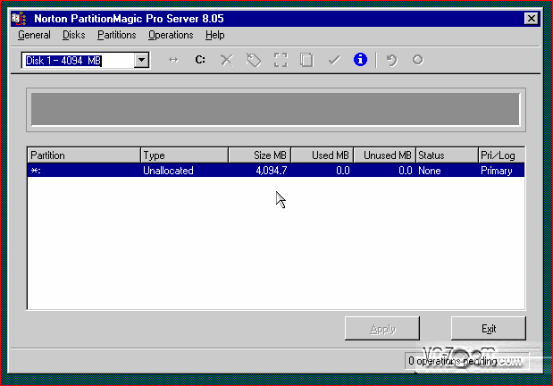

 
 - Để tạo 1 phân vùng mới, click vào
 menu **Operations** -&gt; **Create...**

 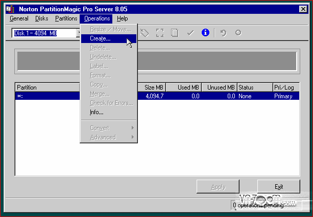

 
 - Đối với 1 ổ cứng mới thì việc đầu tiên là tạo **1 phân vùng
 chính** để cài đặt hệ điều hành. Trong cửa sổ **Create
 Partition** chọn các thông số sau
 Create as : **Primary Partition**
 Partition Type : đây là định dạng phân vùng, bạn thích xài FAT thì
 chọn FAT hoặc NTFS thì click chọn NTFS. Ở đây mình chọn **NTFS**.
 Label : thích tên gì thì bạn đặt tên đó cho phân vùng (kô đặt cũng kô
 sao).
 Size : đây là kích thước phân vùng bạn sẽ tạo (nếu là phân vùng cài
 HĐH thì nên cho kích thước khoảng 40GB = 40960MB).

 

 - Sau đó nhấn **OK** để hoàn tất việc lựa chọn thông số.
 
 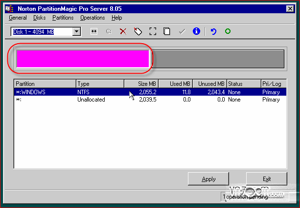

 - Phân vùng được tạo sẽ là vùng màu hồng.
 
 - Để phân vùng đó có thể boot được thì ta phải tiến hành Active cho
 phân vùng vừa tạo.
 - Click chọn phân vùng, vào menu
 chọn **Operations** -&gt; **Advanced** -&gt; **Set Active...**

 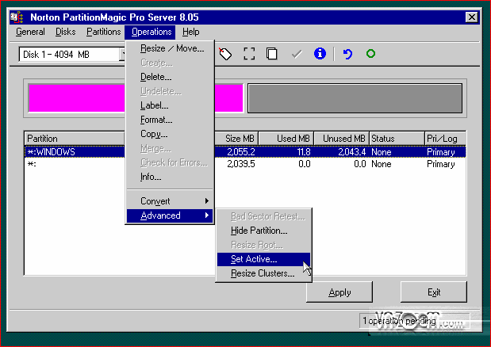

 
 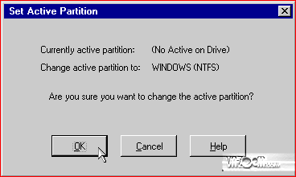

 - Nhấn **OK** để đồng ý.
 
 - Phân vùng được set Active sẽ xuất hiện chữ Active tại cột Status

 

 
 - Để các bước tạo nãy giờ có hiệu lực thì phải bấm nút **Apply** để
 chương trình bắt đầu thực hiện thao tác tạo phân vùng và set Active
 cho phân vùng đó. 

 

 
 - Chương trình sẽ hỏi bạn có muốn thực hiện công việc nãy giờ đã làm
 kô ? chọn **Yes**

 

 
 - Sau khi tạo xong chương trình yêu cần bạn reset lại máy -&gt;
 chọn **OK** để reset máy.

 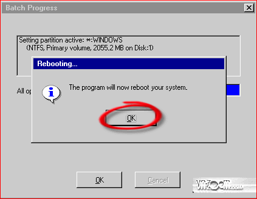

 
 ***2 - Tạo các phân vùng phụ (Logical)***

 - Sau khi reset -&gt; tiếp tục chọn **Partition Magic Pro** như bước
 đầu tiên.
 - Sau khi đã vào chương trình, bạn click vào phân vùng chưa tạo có màu
 xám -&gt; chọn menu **Operations** -&gt; **Create...** 

 

 
 - Tại cửa sổ **Create Partition** thiết lập các thông số sau :
 Create as : **Logical Partition**
 Partition Type : định dạng nào tùy bạn (ở đây tôi chọn NTFS)
 Size : kích thước phân vùng tính bằng MB nếu kô dự định chia ra nhiều
 ổ thì có thể để nguyên số mặc định trong khung.

 

 - Nhấn **OK** để hoàn tất
 - Vùng màu xanh là Extend, vùng này sẽ là nơi chứa tất cả các phân
 vùng Logical.
 
 - Nhấn **Apply** để chương trình bắt đầu thực hiện quá trình vừa thiết
 lập. 

 

 
 

 
 

 
 -&gt; sau khi đã hoàn tất xong xuôi, các bạn click nút **Exit** để
 thoát chương trình và restart lại máy.

 

 
 Kết thúc việc tạo mới phân vùng và set active cho phân vùng cài HĐH.
 Công việc tiếp theo là bạn cài cho máy 1 HĐH mà bạn thích.
 
 **Lưu ý : Đối với mỗi ổ cứng bạn chỉ được phép tạo tối đa 4 phân vùng
 chính (Primary) hoặc 3 phân vùng chính (Primary) và 1 phân vùng
 Extend.**

 ***b) Xóa phân vùng (partition)***
 
 Khi xóa phân vùng, chương trình đòi hỏi bạn phải xóa phân vùng Logical
 trước rồi mới được xóa phân vùng Extended.
 
 - Xóa phân vùng Primary và Logical: bạn bấm phím phải chuột vào phân
 vùng Primary hay Logical rồi chọn Delete trong menu ngữ cảnh (hay chọn
 phân vùng rồi mở menu Operations &gt; chọn Delete) (hình dưới):

 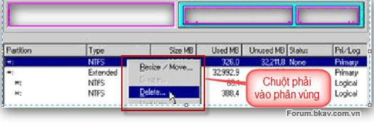

 Chọn phân vùng để xóa
 
 Khi hộp thoại Delete Partition xuất hiện, bạn gõ OK vào ô Type OK to
 confirm partition deletion để xác nhận xóa phân vùng này. Sau đó, bấm
 nút OK. (hình bên dưới):

 

 - Xóa phân vùng Extended: sau khi xóa tất cả phân vùng Logical xong,
 bạn bấm phím phải chuột vào phân vùng Extended rồi chọn Delete trong
 menu ngữ cảnh.

 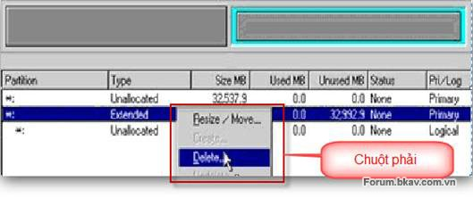

 Chọn phân vùng Extended để xóa. Khi hộp thoại Delete Partition xuất
 hiện, bạn bấm nút Yes để xác nhận (như hình bên dưới):

 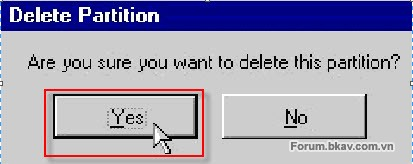

 - Tiến hành xóa phân vùng: sau khi kết thúc việc xóa phân vùng, bạn
 bấm nút Apply rồi bấm nút Yes trong hộp thoại Apply Changes để chương
 trình Tiến hành ghi các thay đổi lại ổ đĩa thật sự (theo hình bên
 dưới):

 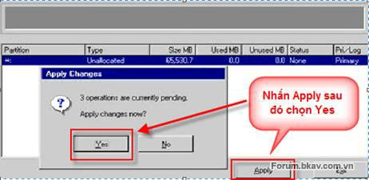

 Bấm nút Apply và Yes để Tiến hành ghi lại các thay đổi của ổ đĩa.
 
 ***c) Phục hồi phân vùng: bạn có thể phục hồi phân vùng FAT, FAT32,
 NTFS, Linux.***
 **Chú ý**:

-   Bạn chỉ phục hồi khi không gian của phân vùng bị xóa chưa được
    sử dụng.

-   Bạn chỉ có thể phục hồi lần lượt nếu có nhiều phân vùng bị xóa vì
    chương trình chỉ hiển thị danh sách từng phân vùng mỗi lần chạy.

-   Bạn không thể phục hồi nếu phân vùng bị xóa có lỗi ở hệ thống file.

-   Bạn không thể phục hồi phân vùng Primary nếu ổ đĩa có đến 4 phân
    vùng primary.

 **d) Thay đổi kích thước phân vùng: từ giao diện hiển thị các phân
 vùng (như hình bên dưới):
 **

 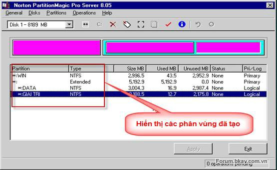

 Ở đây chúng ta nhìn thấy có 3 phân vùng là Win (chứa HĐH) (3GB),
 DATA(3GB) và GIAI TRI(2GB). Yêu cầu đặt ra là thay đổi dung lượng của
 ổ C: từ 3GB thành 2GB và tăng dung lượng của ổ D từ 3GB lên 4GB. Chúng
 ta sẽ thực hiện các bước như sau:
 - Ổ C: giảm kích thước phân vùng từ 3GB thành 2GB thì ta Click phải
 chuột lên phân vùng WIN (C), chọn Resize/Move (hình bên dưới):

 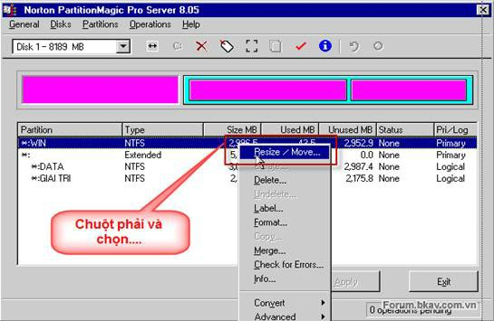

 
 Xuất hiện cửa sổ thay đổi kích thước phân vùng (hình bên dưới):

 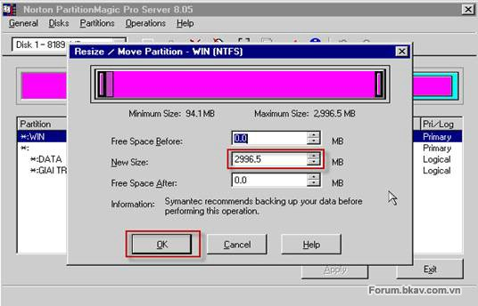

 Điền dung lượng mới cho phân vùng ở phần New Size (theo yêu cầu bạn
 điền 2000), mặc định phần dung lượng còn thừa sẽ đẩy về phía sau và
 tiếp tục Click OK.
 Đây là phân vùng sau khi thực hiện giảm kích thước ổ C (hình bên
 dưới):

 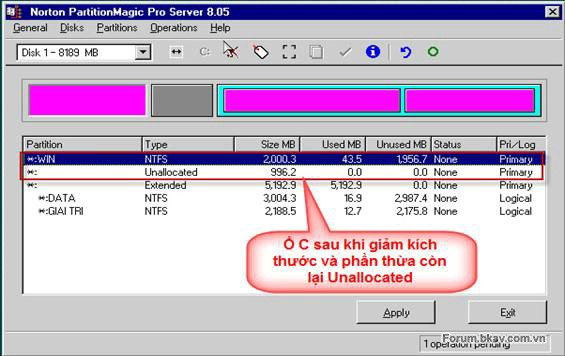

 - Ổ D: tăng dung lượng của từ 3GB lên 4GB
 
 Từ hình trên các bạn sẽ thấy ở phía dưới phân vùng WIN (C) có dư ra 1
 phân vùng chưa được thiết đặt là gần 1GB (phần dung lượng này thừa ra
 sau khi giảm dung lượng của ổ (C) và nó nằm phía trước ổ (D) (có thể
 quan sát trên sơ đồ, khối màu hồng biểu thị các ổ đĩa đã tạo và khối
 màu xám là những phần dung lượng còn dư, chưa được tạo). Tiếp theo,
 Click phải chuột lên phân vùng DATA (D), chọn Resize/Move. Cửa sổ thay
 đổi dung lượng cho phân vùng D (hình bên dưới):

 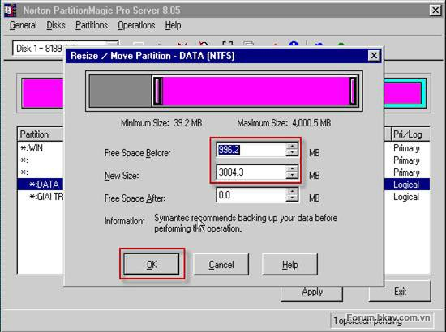

 
 Tại đây, bạn có thể: dùng chuột kéo phần biên khối màu hồng sang che
 lấp khối màu xám. Thay đổi thông số ở phần Free Space Before về giá
 trị 0 và thay đổi thông số ở phần New Size thành 4000 (4GB) sau đó
 Click OK để chấp nhận cuối cùng Click Apply/Yes.
 
 - Chú ý: khi thay đổi hoặc di chuyển phân vùng

-   Không thể thu nhỏ phân vùng nếu trong phân vùng không còn không
    gian trống.

-   Không thể mở rộng phân vùng nếu không có không gian trống ở kề bên
    phân vùng.

-   Trong thời gianđiều chỉnh kích thước hay di chuyển phân vùng NTFS,
    nếu có trục trặc phân vùng này có thể bị hư hỏng.

 ***e) Cách ghép (sát nhập) hai phân vùng thành 1 phân vùng***
 
 Bạn có thể sát nhập hai phân vùng D và E lại thành một phân vùng D,
 toàn bộ dữ liệu trong phân vùng D hay E sẽ được chuyển thành một thư
 mục trong phân vùng còn lại (tuy nhiên, bạn cũng nên sao lưu các dữ
 liệu cá nhân để đảm bảo an toàn cho dù có biến cố bất ngờ).
 
 Cách làm cụ thể như sau:
 
 - Bạn bấm phím phải chuột vào phân vùng E trên thanh Partition Map rồi
 chọn Merge trong menu ngữ cảnh (hình bên dưới):

 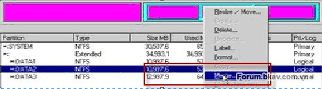

 - Bạn chọn phương cách xác nhập trong phần Merge Options của hộp thoại
 Merge Adjacent Partitions theo hình minh họa bên dưới:

 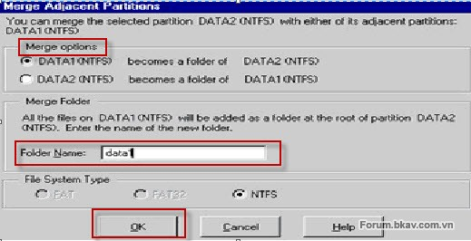

 Chọn tùy chọn 1, nếu muốn cho DATA 1 (ổ D) trở thành một thư mục của
 DATA 2 (ổ E). Chọn tùy chọn 2, nếu muốn cho DATA 2 trở thành một thư
 mục của DATA 1.
 + Nghĩa là Partition bạn chọn sẽ được chuyển thành một thư mục nằm
 trên 1 Partition cạnh nó.
 + Partitions cạnh Partition bạn chọn sẽ được chuyển thành 1 thư mục
 trên Partition mà bạn đã chọn.
 Ta gọi Partition bị chuyển thành thư mục là Partition khách; Partition
 còn lại là Partition chủ.
 
 Sau khi ghép, Partition mới sẽ có kích thước bằng tổng kích thước của
 2 Partition con.
 
 Bạn đặt tên cho thư mục lưu trữ nội dung của phân vùng bị mất khi sát
 nhập trong phần Merge Folder rồi bấm OK. Cuối cùng, bấm nút Apply để
 Partition Magic Tiến hành ghi các thay đổi lại ổ đĩa cứng.
 
 *- Chú ý:* 

-   Bạn chỉ có thể ghép 2 Partition nằm cạnh nhau (2 Partition nằm cạnh
    nhau trong bảng liệt kê).

-   Giữa 2 phân vùng cần ghép (nhập) không được có phân vùng thứ 3 và
    bạn không thể ghép phân vùng FAT/FAT32 với phân vùng NTFS

-   Quá trình ghép có thể sẽ được thực hiện trong thời gian dài nếu như
    dữ liệu trong 2 Partition ghép và được ghép là lớn.

 ***f) Chuyển đổi kiểu File hệ thống của phân vùng (Partition)***
 
 Để chuyển đổi kiểu file hệ thống ta chọn 1 Partition trong bảng liệt
 kê, vào Menu Operatitions rồi chọn Convert hoặc Click chuột phải lên
 Partition trong bảng liệt kê rồi chọn Convert. Một Menu sẽ xuất hiện
 (hình bên dưới):

 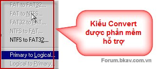

 Bạn có thể chọn một trong các kiểu chuyển đổi:

-   Từ FAT sang FAT32, HPFS hoặc NTFS

-   Từ FAT32 sang FAT

-   Từ NTFS sang FAT hoặc FAT32

 Ngoài ra bạn cũng có thể chuyển 1 Partition từ Logical thành Primary
 và ngược lại.
 Chú ý: sao lưu dữ liệu trước khi thực hiện quá trình chuyển đổi.
 
 ***g) Các thao tác nâng cao***
 
 Chọn 1 Partition trong bảng liệt kê, vào Menu Operations/Advanced hoặc
 Click chuột phải lên Partition rồi chọn Advanced như hình bên dưới:

 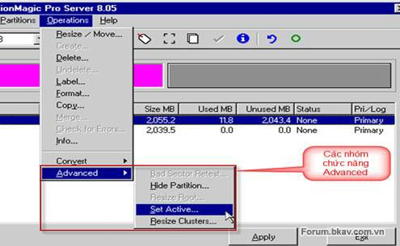

 - Bad Sector Retset: kiểm tra các sector được đánh dấu là “bad” trên
 đĩa cứng xem thử nó còn sử dụng được nữa hay không.
 
 - Hide Partition: làm “ẩn” partition; partition sau khi làm ẩn thì hệ
 điều hành sẽ không còn nhận ra được nữa. Để làm xuất hiện lại
 partition, bạn chọn lệnh Unhide partition (nếu bạn chọn Advanced trên
 1 partition đã bị ẩn thì lệnh Hide partition sẽ được thay bằng lệnh
 Unhide partition).
 
 Chú ý: nếu bạn có nhiều phân vùng primary thì chỉ có phân vùng khởi
 động “hiện” còn lại các phân vùng khác sẽ tự động “ẩn”.

 - Resize Root: thay đổi số lượng file và thư mục con mà thư mục gốc có
 thể lưu trữ.
 - Set Active: làm cho partition “active”. Tại một thời điểm chỉ có thể
 có 1 partition được active và hệ điều hành nào cài trên partition
 active sẽ được chọn khởi động lúc bật máy.
 - Resize Clusters: thay đổi kích thước của 1 clusters. Clusters là một
 nhóm các sector. Mỗi lần đọc/ghi đĩ cứng ta đều truy xuất từng
 clusters chứ không phải là từng sector; làm như thế sẽ tăng tốc độ
 truy xuất đĩa cứng. Thay đổi kích thước clusters chính là thay đổi số
 sector trong một clusters. Số sector trong 1 clusters càng lớn thì đĩa
 cứng truy xuất càng nhanh; nhưng cũng sẽ gây lãng phí dung lượng đĩa
 nhiều hơn.
 
 ***h) Các thao tác khác***
 
 - Kiểm tra lỗi: chọn 1 partition trong bảng liệt kê, hay chuột phải
 vào partition xem hình bên dưới:

 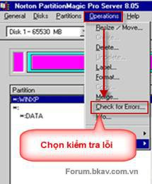

 - Thông tin về partition: chọn 1 partition trong bảng liệt kê, hay
 chuột phải vào partition xem hình bên dưới:

 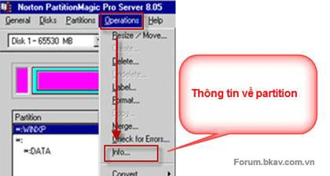

 - Tăng tốc độ các thao tác: bạn vào Menu như hình bên dưới:

 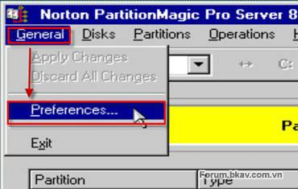

 Trong phần Skip bad sector checks bạn hãy đánh dấu chọn tất cả các
 partition trong danh sách. Lựa chọn này sẽ làm cho tốc độ của các thao
 tác nhanh hơn khoảng 30-35%, xem hình bên dưới:

 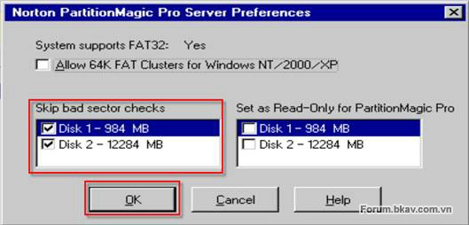

 ***II/ Phân Vùng Với Soft : Acronis Disk Director***

 Giao diện chính của chương trình xuất hiện xem hình bên dưới: 

 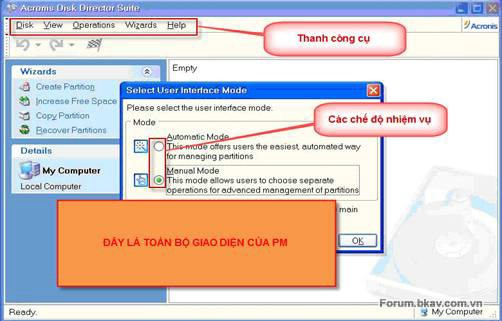

 Công cụ Acronis Disk Ditector sẽ cung cấp cho người dùng toàn bộ tiện
 ích điều hành ổ cứng được cho hiệu quả nhất hiện nay với cách sử dụng
 dễ như “trở bàn tay”. Sau khi sử dụng thử, tôi nhận thấy Acronis Disk
 Ditector có thể nói là công cụ tập hợp mọi “tinh hoa” của các công cụ
 tiện ích dành cho đĩa cứng hiện nay. Toàn bộ mọi chức năng của Acronis
 Disk Ditector đều được trình bày trực quan bằng chữ và biểu tượng trên
 giao diện.
 
 - Mục Wizard của Acronis Disk Director đã có thể thay thế hoàn hảo cho
 công cụ Partition Magic Pro 8.05 với 4 chức năng:

-   Create Partition: chỉ có tác dụng với các phân vùng phụ ngoài phân
    vùng hệ thống C:. Với những phân vùng còn lại, người dùng có thể
    chia thành bao nhiêu phân vùng tùy ý.

-   Increase Free Space: tính năng gia tăng chỗ trống cho đĩa cứng bằng
    cách dồn dữ liệu.

-   Copy Partion: tính năng sao chép nội dung toàn bộ phân vùng này sang
    phân vùng khác. Chú ý là dữ liệu của phân vùng bị chép sang sẽ bị
    xóa hết.

-   Recover Partition: phục hồi lại toàn bộ các phân vùng đã bị
    “lỡ” xóa.

 - Mục Operation gồm có 12 tác vụ sau:

-   Copy: sao chép toàn bộ dữ liệu của phân vùng này sang phân
    vùng khác.

-   Move: di chuyển toàn bộ dữ liệu của phân vùng này sang phân
    vùng khác.

-   Resize: thay đổi kích thước phân vùng.

-   Change Label: thay đổi tên phân vùng.

-   Format: định dạng lại phân vùng.

-   Delete: xóa “biến mất” hẳn toàn bộ một phân vùng và dữ liệu trên đó,
    hết sức thận trọng khi dùng tính năng này.

-   Split: cắt một phân vùng ra thành nhiều phân vùng nhỏ hơn.

-   Merge: hợp nhất nhiều phân vùng thành một.

-   Check: tính năng thay thế hoàn hảo cho tính năng Check Disk
    của Windows.

-   Defrag: tính năng dồn đĩa giúp đĩa cứng truy cập dữ liệu nhanh hơn.

-   Explorer: tương tự như Windows Explorer.

-   Propeties: xem xét tổng quan về các phân vùng đĩa cứng.

-   Mục Advanced: giới thiệu các tính năng cao cấp khác và các công cụ
    quản lý đĩa cứng khác hầu như không có.

-   Change Letter: máy tính của bạn có 3 phân vùng là C, D và E, nhưng
    nay bạn không thích tên D và E mặc định nữa thì có thể dùng tính
    năng Change Letter để thay tên tùy ý.

-   Convert: có thể chuyển bất kỳ phân vùng phụ nào trở thành phân vùng
    khởi động chính.

-   Hide: làm ẩn đi một phân vùng nào đó, tức biến phân vùng này thành
    phân vùng “bí mật” mà người khác không hề biết đến sự tồn tại
    của nó.

-   Change Cluster Size: đây là tính năng hết sức độc đáo và ít có ở các
    công cụ khác. Hiện nay đa số đĩa cứng thường format ở định dạng
    FAT32, với Change Cluster Size thì người dùng có thể chuyển bảng
    FAT32KB xuống còn 16-8-4-2-1 KB để tối ưu thêm được khoảng 6% dung
    lượng đĩa cứng.

-   Change Type: tính năng độc đáo cho phép thay đổi định dạng đĩa cứng
    đã format sang toàn bộ các kiểu định dạng khác mà không làm mất mát
    dữ liệu.

 Ngay giao diện đầu tiên bạn chọn chế độ Manual Mode nhấn OK hộp thoại
 tiếp tục hiện ra (theo hình bên dưới):

 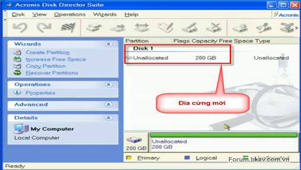

 Về thủ thuật cũng như cách thức nguyên tác để phân vùng và định dạng ổ
 đĩa cơ bản giống Partition Magic Pro 8.05. 
 
 ***a) Tạo phân vùng (partition)***
 
 - Tạo phân vùng Primary: từ giao diện của chương trình bạn nhấn chuột
 phải vào ổ đĩa với tên Unallocated có thể nhấn Menu Wizards Create
 Partition hoặc nhấn trên thanh công cụ (xem hình bên dưới):

 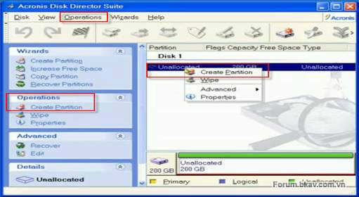

 Sau đó xuất hiện hộp thoại như hình bên dưới:

 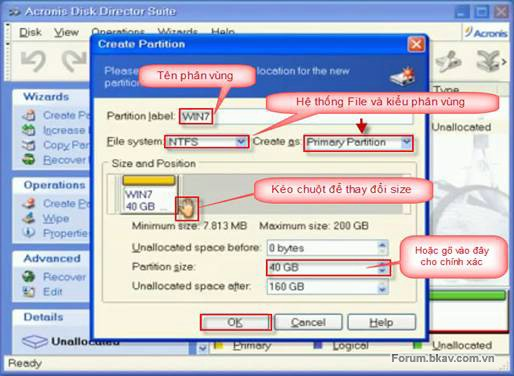

 Khi bạn đã thiết lập xong các thông số cần thiết cho phân vùng mình
 xác định thì nhấn OK, lúc này phần mềm sẽ tự động tạo một phân vùng
 mới cho bạn và để phân vùng này khởi động cũng như cài đặt hệ điều
 hành các bạn phải SetActive nó (theo hình bên dưới):

 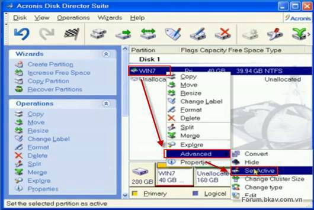

 Khi bạn nhấn SetActive hộp thoại sau sẽ xuất hiện theo hình bên dưới:

 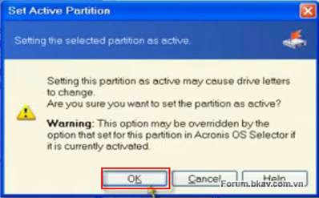

 Sau đó các bạn nhấn OK, như vậy phân vùng bạn tạo ra đã được thực thi
 rồi.
 - Tạo phân vùng Extended: sau khi tạo ra phân vùng Primary phần còn
 lại chúng ta có thể chia ra các phân vùng Extended (chứa các ổ đĩa
 logic D, E). Bạn có thể sử dụng các thanh công cụ hoặc chuột phải vào
 phân vùng muốn tạo thêm rồi chọn Create Partition (theo hình bên
 dưới):

 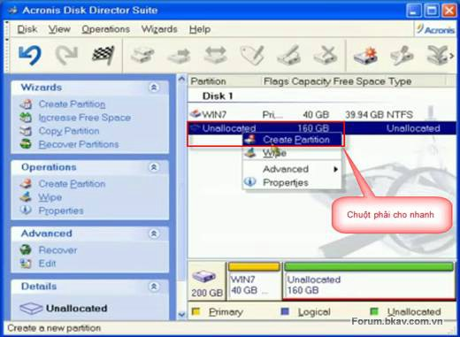

 Khi nhấn Create Partition hộp thoại sau sẽ xuất hiện như hình bên dưới
 và các bạn làm tương tự như phần trên đã giới thiệu nhé, chỉ khác lần
 này là phân vùng tạo thêm không phải là phân vùng Primary.

 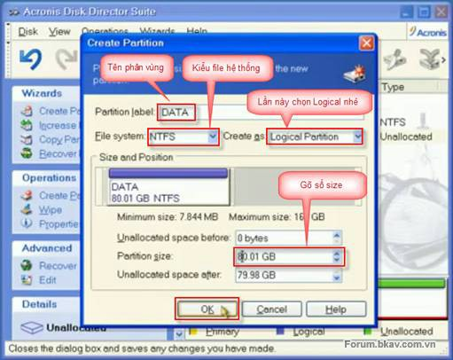

 Khi các bạn thiết lập xong thì nhấn OK, như vậy phân vùng mới đã được
 tạo ra theo hình bên dưới:

 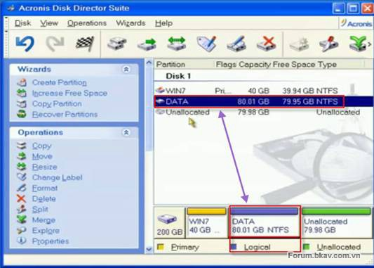

 Chúng ta cứ tiếp tục phân vùng với dung lượng ổ đĩa còn lại cho đến
 khi phân vùng xong ổ cứng.
 Khi phân vùng xong các bạn nhấn vào Commit như hình bên dưới:

 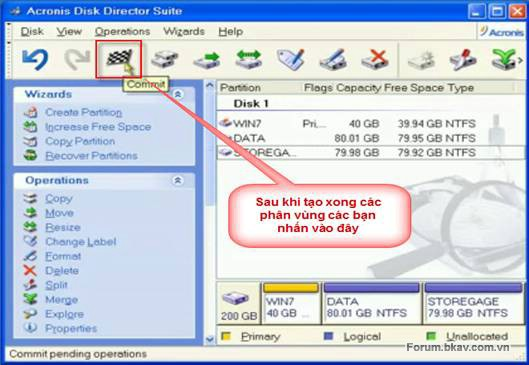

 Sau khi nhấn Commit phần mềm sẽ xuất hiện hộp thoại:

 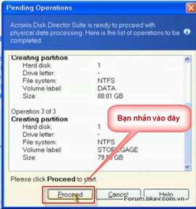

 Bạn nhấn vào Proceed phần mềm sẽ thực thi (rất nhanh) tất cả những
 phần việc mà bạn đã thiết lập cho các phân vùng và kể từ bây giờ ổ đĩa
 của bạn đã được thiết lập phân vùng, định dạng theo đúng yêu cầu và
 không có lỗi bạn khởi động lại và cài đặt hệ điều hành được rồi (hình
 bên dưới):

 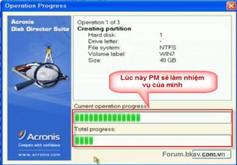

 

 ***b) Xóa phân vùng (partition)***
 
 Về nguyên tắc cở bản cũng giống như khi sử dụng Partition Magic Pro để
 xóa phân vùng, chương trình đòi hỏi bạn phải xóa phân vùng Logical
 trước rồi mới được xóa phân vùng Extended. Để tránh các hiện tượng xảy
 ra không mông muốn bạn nên lưu lại dữ liệu sau đó hãy thực hiện (theo
 hình bên dưới):

 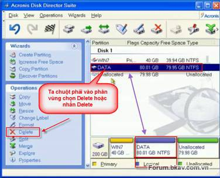

 ***c) Chuyển đổi dung lượng giữa các ổ đĩa (không làm mất dữ liệu)***
 
 Ví dụ: Bạn có ổ C: 10 GB ổ D: 5 GB bạn muốn chuyển 1 phần dung lượng
 của ồ C sang D..việc này rất hay bởi vì thông thường có thể bạn lưu
 trữ rất nhiều phần mềm ổ D thì không còn dung lượng trong khi các ổ
 khác thì còn rất nhiều điều này rất hay vì quá trình chia sẻ dung
 lượng không làm mất dữ liệu giữa các ổ đĩa.
 
 Ở đây ổ C: ổ cần thu hẹp và ổ D: là ổ cần mở rộng thì chúng ta tiến
 hành như sau theo hình bên dưới:

 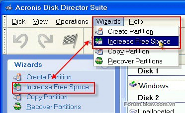

 Sau đó xuất hiện hộp thoại Selcet Partition to Increase, chọn ổ cần mở
 rộng như hình bên dưới:

 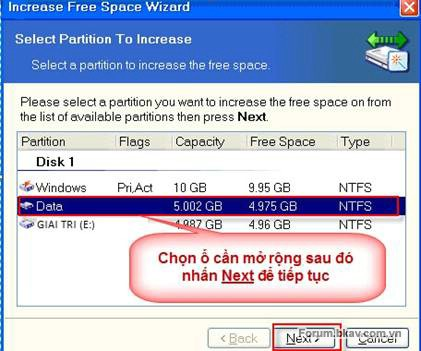

 Sau đó xuất hiện hộp thoại và bạn lại chọn dấu Check vào ổ cần thu hẹp
 như hình bên dưới:

 

 Trong phần Partiton Size bạn gõ dung lượng của ổ muốn mở rộng vào sau
 đó nhấn Next rồi nhấn Finish.
 
 Lưu ý: đây là dung lương sau cùng của ổ cẩn mở rộng (Ví dụ: bạn muốn
 dung lượng ồ D là từ 5GB lên 7GB thì gò 7 GB vào....nên chú ý tới dung
 lượng còn trống của ổ cần thu hẹp.) theo hình bên dưới:

 

 
 
 Nhấn Commit để kết thúc quá trình chuyển đổi dung lượng. Sau khi thực
 hiện quá trình chuyển đổi dung lượng thì ở ổ D dung lượng tăng lên
 7GB, còn ở ổ C dung lượng giảm còn 8 GB (hình bên dưới):

 

 ***d) Tạo một ổ đĩa mới từ ổ đĩa đã có sẵn (chia tách đĩa)***

 Khi bạn muốn khám phá những tính năng mới của các hệ điều hành mới ra
 mà ổ đĩa lại còn trống thì đây là một trong những tính năng rất hay,
 ngoài việc tạo ra được một phân vùng theo ý muốn có thể cài thêm hệ
 điều, hành đồng thời có thể nhập lại chính phân vùng đó khi không muốn
 sử dụng lại hệ điều hành mới cài thêm mà không hề mất dữ liệu.
 
 Ví dụ: bây giờ tôi muốn tạo thêm một ổ F (PHIM) từ ổ E (GIAI TRI) theo
 hình bên dưới:

 

 Trong phần Selcect Partition chọn dấu check vào ổ cần tách (Ổ GIAI TRI
 (E) rồi nhấn Next, tiếp theo trong phần Partition Size bạn gõ dung
 lượng ổ đĩa cần tạo mới (ổ PHIM (F) là 2GB. Tương tự như các phần trên
 Partition tye: Logical, File system: NTFS sau đó bạn nhấn Next rồi
 nhấn Finish, nhấn Commit để kết thúc quá trình tách đĩa. Kết quả như
 hình bên dưới:

 

 ***e) Phục hồi phân vùng: bạn có thể phục hồi phân vùng FAT, FAT32,
 NTFS, Linux.***
 
 Chú ý: cũng như khi sử dụng phần mềm Partition Magic Pro bạn cần nhớ
 rằng

-   Bạn chỉ phục hồi khi không gian của phân vùng bị xóa chưa được
    sử dụng.

-   Bạn chỉ có thể phục hồi lần lượt nếu có nhiều phân vùng bị xóa vì
    chương trình chỉ hiển thị danh sách từng phân vùng mỗi lần chạy.

-   Bạn không thể phục hồi nếu phân vùng bị xóa có lỗi ở hệ thống file.

-   Bạn không thể phục hồi phân vùng Primary nếu ổ đĩa có đến 4 phân
    vùng primary.

 Để phục hồi phân vùng và bảo đảm phục hồi nguyên trạng thì bạn không
 được ghi dữ liệu lên phân vùng định phục hồi nguy cơ phục hồi sẽ khó
 khăn hơn.
 
 Để phục hồi phân vùng bạn chuột vào phân vùng mà mình định phục hồi
 nghĩa là phân vùng được bạn chọn đánh dấu Unallocated sau đó chọn tính
 năng Recover Partition bên Menu trái chọn chế độ rồi kích Next, chọn
 phân vùng phục hồi nhấn Next, chọn phương thức quét. Để phần mềm thực
 hiện nhiệm vụ cuối cùng bạn nhấn Commit rồi nhấn Proceed để thực thi
 quá trình theo hình bên dưới:

 

 Trên đây là 1 số tính năng chính của Acronis Disk Director Suite ngoài
 ra trong quá trình sử dụng bạn có thể khám phá thêm một số tính năng
 khác nữa như nâng cao và thanh công cụ theo hình bên dưới:

 

 

 Chú ý: trong quá trình thực hiện riêng đối với Acronis Disk Director
 Suite vẫn có thể tạo ra một số lỗi chẳng hạn nếu bạn tạo ra 1 phân
 vùng bằng cách ghép 2 phân vùng cho trước thì kết quả nó sẽ như sau
 (theo hình bên dưới):

 

 Các bạn thấy 2 phân vùng D, E vẫn tồn tại lúc này ta có cách xử lý như
 sau: bạn hãy Delete 2 phân vùng dư đó đi rồi sau đó bạn Resize lại
 phân vùng F.

 

 Kết quả đã được khắc phục xem hình bên dưới:

 

*III/ Phân Vùng Với Soft : EASEUS PARTITION MASTER* 
----------------------------------------------------

 1. Thay đổi kích thước, di chuyển phân vùng
 
 Muốn thay đổi kích thước của phân vùng có sẵn, bạn bấm chọn phân vùng
 &gt; Resize/Move partition. Tại cửa sổ mở ra, bạn đưa chuột đến biên
 của vùng giới hạn, trỏ chuột sẽ biến thành mũi tên hai đầu để bạn kéo
 và điều chỉnh kích thước. Việc điều chỉnh ở phía nào là do bạn chọn
 cho phù hợp với mục đích của việc thu nhỏ phân vùng này sẽ mở rộng
 phân vùng nào khác hay dành chỗ cho phân vùng mới. Thao tác kéo có thể
 sẽ không cho kết quả dung lượng chính xác như bạn muốn.
 Vì vậy, để điều chỉnh thì bạn nhập dung lượng mới của phân vùng vào
 Partition Size. Xong, bạn bấm OK để lưu lại. Trường hợp thu nhỏ kích
 thước phân vùng lại để có chỗ tạo phân vùng mới, bạn có thể di chuyển
 vị trí của phân vùng đang có bằng cách đưa trỏ chuột vào để thành biểu
 tượng di chuyển rồi kéo sang hướng bạn muốn.

 

 2. Xóa phân vùng
 
 Trường hợp muốn gộp hai hay nhiều phân vùng lại với nhau bạn phải xóa
 các phân vùng này đi rồi tạo mới lại. Bạn chọn phân vùng &gt; Delete
 partition, khi thấy thông báo xác nhận, bạn hãy chọn OK để thực hiện.

 

 3. Tạo phân vùng mới
 
 Khi thu nhỏ kích thước hoặc xóa một phân vùng đi, bạn sẽ có chỗ để tạo
 phân vùng mới, vùng này sẽ được đánh dấu là Unallocated. Để tạo mới
 một phân vùng, bạn chọn Unallocated &gt; Creat partition.

 Tại Partition Label, bạn đặt tên cho phân vùng mới; rồi tại Create As,
 bạn chọn Logical nếu là phân vùng bình thường. Với phân vùng dự định
 cài đặt hệ điều hành thì bạn chọn Primary. Ở phần File System, bạn có
 thể chọn NTFS hoặc FAT 32; nhưng ở đây khuyên bạn nên chọn NTFS. Qua
 Partition Size, bạn nhập kích thước cho phân vùng rồi bấm OK.
 
 4. Thay đổi ký tự ổ đĩa
 
 Muốn thay đổi ký tự ổ đĩa, bạn chọn Change drive letter rồi ở New
 Drive Letter, bạn chọn ký tự mới &gt; OK.

 

 5. Chuyển đổi qua lại giữa phân vùng Logical và Primary
 
 Các phân vùng của ổ cứng sẽ được chia thành Logical (chứa dữ liệu) và
 Primary (chứa hệ điều hành), nếu cài đặt hệ điều hành vào phân vùng
 Logical thì sẽ không khởi động được. Vì vậy, muốn cài đặt hệ điều hành
 ở ổ đĩa nào đó khác ổ C:\\, bạn phải thực hiện chuyển đổi Logical sang
 Primary. Từ phân vùng Primary, bạn chọn Convert to logical để chuyển
 sang Logical và ngược lại, muốn chuyển sang Primary, bạn chọn Convert
 to primary để chuyển.
 
 6. Chọn phân vùng chạy hệ điều hành
 Như đã nói ở trên, chỉ có phân vùng Primary mới có thể cài đặt hệ điều
 hành được, trường hợp bạn muốn giữ lại hệ điều hành cũ và thử cài đặt
 Windows ở một phân vùng mới để chạy thử nghiệm hoặc chạy cả hai hệ
 điều hành ở hai phân vùng thì hãy khai thác tính năng Set active của
 EASEUS Partition Master. Sau khi chuyển từ Logical sang Primary, bạn
 chọn ổ đĩa vừa chuyển &gt; Set active.

 

 Tiếp theo, trên hộp thoại Set Active, bạn bấm OK để chuyển sang hệ
 điều hành có sẵn trên phân vùng đó hoặc tiến hành cài đặt mới. Đây có
 thể nói là một cách đơn giản để cài đặt song song hai hệ điều hành,
 nhưng nhược điểm là không thể chọn hệ điều hành lúc khởi động được.
 
 7. Định dạng lại phân vùng
 Để định dạng lại phân vùng, bạn phải chắc chắn yếu tố đầu tiên là đã
 sao lưu toàn bộ dữ liệu cần thiết bên trong. Bạn chọn phân vùng &gt;
 Format partition rồi đặt tên, chọn định dạng cho phân vùng ở Partition
 Label, File System và bấm OK.

 

 8. Xóa toàn bộ dữ liệu trong phân vùng và chống phục hồi
 
 Một quan điểm sai lầm là chúng ta nghĩ rằng khi format phân vùng, dữ
 liệu sẽ bị xóa hoàn toàn. Tuy nhiên, với những phần mềm phục hồi thì
 điều này chỉ đúng một phần vì ít nhất có một lượng dữ liệu sẽ được
 khôi phục lại. May mắn là hiện nay có một số công cụ, tiện ích giúp
 xóa dữ liệu chống phục hồi. Và ngày trong EASEUS Partition Master, bạn
 có thể xóa triệt để data bằng cách chọn phân vùng &gt; Wipe partition.
 Sau đó, ở Set the number of time to wipe the partition, bạn chọn số
 lần xóa, chọn càng lớn thì sẽ càng khó phục hồi và quá trình thực hiện
 sẽ lâu hơn. Cuối cùng, bấm OK để tiến hành xóa.

 

 9. Ẩn một phân vùng đi

 Muốn ẩn phân vùng, bạn sẽ không cần phải tìm công cụ nào khác vì ứng
 dụng này đã trang bị sẵn cho bạn tính năng ẩn phân vùng. Bạn chọn phân
 vùng &gt; Hide partition &gt; OK để cho ẩn đi và lúc nào muốn cho hiện
 lại thì bạn chọn Unhide partition &gt; OK.
 10. Chống phân mảnh cho phân vùng

 Để chống phân mảnh, bạn chọn Defragment, sẽ có thông báo hiện lên, bạn
 chọn OK để bắt đầu.

 

 Khi thực hiện xong, bạn bấm OK để xác nhận và xem kết quả thu được.
 
 11. Kiểm tra lỗi ổ đĩa
 
 Muốn kiểm tra lỗi trong ổ đĩa, bạn chọn phân vùng &gt; Check partition
 rồi bấm OK để thực hiện. Chương trình sẽ thực hiện kiểm tra thuộc
 tính, gọi Chkdsk.exe của Windows lên và kiểm tra bề mặt, muốn giảm bớt
 khâu nào thì bạn bỏ dấu chọn ở đó đi.
 
 Trong quá trình làm việc, muốn hoàn lại thao tác nào, bạn bấm nút và
 bấm để quay về trạng thái trước khi hoàn, nó tương tự như Undo và Redo
 Strong Microsoft Office. Khi đã làm các thao tác ở trên thì EASEUS
 Partition Master mới chỉ thực hiện ghi nhớ, bạn bấm nút trên thanh
 công cụ để thực thi.
 
 Một số hoạt động yêu cầu phải khởi động lại máy tính và cần thời gian
 nhất định để thực hiện. Mặc dù tốc độ làm việc của chương trình khá
 nhanh, nhưng để đề phòng sự cố, khi dùng máy tính xách tay, bạn nên
 cắm nguồn điện vào tránh tình trạng pin bị cạn nửa chừng.

 *IV/ **Phân Vùng Với Soft :** Partition Wizard Home Edition*

 **Các khái niệm chung**

 **
 Ổ đĩa cứng - HDD - Hard Disk Drive - là bộ phận lưu trữ dữ liệu của
 máy vi tính. Hầu hết các thuật ngữ, khái niệm trong bài đều nằm trong
 lĩnh vực máy tính hay cụ thể hơn là phần mềm máy tính. Các khái niệm
 đều tồn tại dạng logic chứ ko ở dạng vật lý.
 
 
 Partition - là một thuật ngữ phần mềm, nói đến một vùng không gian
 chứa dữ liệu xác định trên ổ đĩa cứng. Có 2 loại phân vùng là Primary
 - phân vùng khởi động, dùng để cài đặt hệ điều hành (OS), và Extended
 là phân vùng mở rộng, trong đó có thể chia nhỏ thành các phân vùng
 Logical để chứa dữ liệu riêng. Phân vùng Logical không có khả năng
 khởi động.
 
 Định dạng nói chung của ổ đĩa cứnghay một phần vùng nói lên cách thức
 lưu trữ, giao tiếp của hệ thống với dữ liệu có trên ổ đĩa hay phân
 vùng đó. Các định dạng khác nhau do các hãng công nghệ khác nhau tạo
 ra cho hệ thống của mình. Trong bài chỉ đề cập đến các định dạng của
 Microsoft Windows.
 
 Ổ đĩa cứng thông thường có 2 định dạng chủ yếu là MBR và GPT. Định
 dạng MBR sử dụng MBR - Master Boot Record để quản lý toàn bộ ổ đĩa, là
 định dạng phổ biến hiện nay. Trong khi GPT (GUID Partition Table) là
 định dạng tối ưu hơn, tuy nhiên lại hơi khó hình dung cũng như sử
 dụng, được xem là định dạng ổ đĩa cứng trong tương lai. *Trong bài,
 các đĩa cứng được đề cập đều ở dạng MBR*. Trong một ổ đĩa định dạng
 MBR, chỉ cho phép *tồn tại tối đa 4 phân vùng Primary*, hoặc 3 phân
 vùng Primary - 1 phân vùng Extended (Gọi là quy tắc 4pri). Phân
 vùng *Primary phải được Set Active* mới khởi động được. *Đây cũng là 2
 lỗi rất thường gặp của người dùng khi tự phân vùng ổ đĩa.
 *
 File System - Hệ thống tệp tin hay Định dạng phân vùng: Phân vùng
 trong các hệ điều hành Microsoft Windows thường có định dạng FAT,
 FAT32 hay NTFS.
 
 FAT (tên đầy đủ là FAT16), FAT32 là một loại định dạng được sử dụng từ
 thời MS-DOS và Windows 9x. Ngày nay FAT vẫn còn tồn tại ở các thiết bị
 lưu trữ như thẻ nhớ, usb flash, ổ cứng di động… Tính bảo mật kém do
 không hỗ trợ phân quyền. Khả năng chịu lỗi rất kém. Định dạng FAT chỉ
 hỗ trợ phân vùng có dung lượng nhỏ hơn 2GB và tập tin cỡ đó. Định dạng
 FAT32 khá hơn khi hỗ trợ phân vùng dung lượng 2TB và tập tin không quá
 4GB.
 
 NTFS là định dạng có mặt từ Windows 2000, có khả năng chịu lỗi cao, mã
 hóa, phân quyền tới từng tệp tin. Với khả năng lưu trữ của các thiết
 bị hiện nay, có thể tạm coi các kích thước NTFS là không giới hạn.
 Định dạng NTFS là định dạng rất ưu việt, *khuyến cáo nên để tất cả các
 phân vùng của bạn theo định dạng này*, trừ các ổ đĩa di động, usb
 flash để FAT32 theo khuyến cáo của nhà sản xuất.
 
 Cluster size: Coi phân vùng của bạn như một két bia được chia thành
 nhiều ô, mỗi tệp tin là một (hoặc một vài) chai bia, dù một hay một
 vài chai thì một ô cũng chỉ chứa 01 chai mà thôi. Vậy 1 ô đó chính là
 1 cluster và cluster size chính là kích thước của ô đó. Kích thước
 càng lớn thì dung lượng bị lãng phí càng lớn, nhưng tốc độ truy xuất
 lại nhanh hơn nhiều.
 
 Cluster size là thông số riêng của một phân vùng. Để tối ưu: đặt
 cluster size lớn nếu bạn có nhiều file và các file có dung lượng lớn;
 ngược lại, nếu bạn có nhiều file dung lượng nhỏ, hãy đặt cluster size
 nhỏ để dung lượng bị lãng phí ít nhất.
 
 Thao tác phân vùng ổ đĩa
 Thao tác phân vùng cho ổ đĩa có thể hiểu là phân chia lại các khoảng
 không lưu trữ trên đĩa cho phù hợp với mục đích sử dụng.
 
 Dựa trên cấu tạo, cách làm việc của ổ đĩa cứng và hệ thống (đặc biệt
 là Windows), ta có thể thấy việc phân chia ổ đĩa thành nhiều phân vùng
 có các ưu điểm sau:
 
 • Tách hệ điều hành (OS) và dữ liệu các nhân của người sử dụng. Giúp
 quản lý, sao lưu, • phục hồi… với OS mà không ảnh hưởng tới dữ liệu.
 • Sử dụng nhiều OS trên cùng một đĩa cứng.
 • Tạo khu vực riêng cho bộ nhớ ảo, tệp phân trang của OS.
 • Quản lý các vùng dữ liệu độc lập. Một phân vùng lỗi sẽ không ảnh
 hưởng tới các phân vùng khác.
 • Dễ quản lý dữ liệu riêng tư bằng các biện pháp cần thiết cho cả một
 phân vùng (vd: mã hóa)
 • Tăng tốc độ truy xuất dữ liệu trong một phần vùng: Về mặt phần cứng,
 đầu từ dễ dàng hoạt động liên tục hơn trong phạm vi hẹp. Về mặt phần
 mềm, truy xuất tập tin từ bảng quản lý tập tin (vd như \$MFT của NTFS)
 càng nhỏ thì càng nhanh.
 
 Tuy nhiên, phân vùng nói chung cũng có nhược điểm :
 
 • Giảm dung lượng lưu trữ của HDD (tăng dung lượng - ngầm - cần để
 quản lý lưu trữ cho từng phân vùng)
 • Giảm năng lực lưu trữ thực của đĩa (vd: HDD bạn có 2 phân vùng, mỗi
 phân vùng còn trống 10GB, bạn không thể copy một file 15GB vào đâu mặc
 dù HDD của bạn thực sự còn trống đến 20GB).
 • Tăng khả năng phân mảnh dữ liệu &gt; giảm tốc độ truy xuất chung,
 giảm khả năng cứu dữ liệu nếu lỗi phân vùng.
 • Chậm quá trình di chuyển tập tin trong đĩa ( nếu cùng phân vùng,
 Windows sẽ thực hiện sửa địa chỉ trên MFT - thao tác move coi như
 xong, nhưng nếu khác phân vùng Windows sẽ phải thực hiện việcmove khối
 dữ liệu thực sự)
 • Giảm tốc độ truy xuất dữ liệu trung bình toàn hệ thống: Các khu vực
 dữ liệu thường xuyên được truy xuất trên toàn bộ đĩa (theo thống kê
 của Windows) sẽ ko gom đc vào 1 vùng, giảm khả năng tối ưu đường đi
 của đầu đọc.
 Vì vậy, nên chia ổ cứng thành vài phân vùng để quản lý nhưng đừng quá
 nhiều, trừ các phân vùng hệ điều hành thì các phân vùng dữ liệu: mỗi
 phân vùng nên để khoảng 20-25% dung lượng của toàn ổ đĩa cứng là tốt
 nhất.
 
 Những nguyên tắc chung của các phần mềm phân vùng**

 

 **
 Đây là mô hình theo tỉ lệ tương đối của các phân vùng với nhau giúp
 người sử dụng dễ hình dung. Phía dưới các phân vùng là chi tiết về
 định dạng, dung lượng chính xác của các phân vùng đó. Khoảng trống có
 chữ Unallocated là khoảng không gian chưa được định dạng trên ổ đĩa
 cứng. Các phẩn mềm phân vùng hiện nay đều có giao diện đồ họa trình
 bày mô hình theo mẫu này.
 
 • Các phần mềm phân vùng đều cho phép xem trước toàn bộ các thao tác
 trên mô hình - tạo thành một list, sau khi người dùng hài lòng với mô
 hình phân vùng mới thì ấn nút để "Thực hiện" toàn bộ lên ổ đĩa cứng
 thật. Sau khi phần mềm thực hiện xong, việc khôi phục lại mô hình cũ
 là không thể (rất khó). Vì vậy bạn hãy cân nhắc kỹ quyết định cũng như
 cẩn thận trong từng thao tác của mình.
 
 • Tắt và lưu tất cả các chương trình trước khi thao tác phân vùng trên
 Windows.
 
 • Đảm bảo cấp điện đầy đủ cho máy tính khi thực hiện phân vùng (cả
 trên Windows và trên đĩa cứu hộ). Mất điện khi thao tác phân vùng chưa
 hoàn thành có thể khiến bạn lỗi đĩa cứng và mất toàn bộ dữ liệu.
 
 Vấn đề thường gặp - tăng giảm kích thước phân vùng
 Tăng giảm kích thước phân vùng là yêu cầu rất thường gặp trong quá
 trình sử dụng máy tính. Để giải quyết vấn đề này, bạn cần nắm được vài
 thao tác cơ bản sau.
 
 Tạo phân vùng: là thao tác định dạng cho một khoảng Unallocated để trở
 thành một phân vùng sử dụng được
 
 Xóa phân vùng: phân vùng bị xóa sẽ trở thành khoảng Unallocated.
 
 
 Giảm kích thước một phân vùng - Điều kiện: Phân vùng chưa đầy - chưa
 sử dụng hết dung lượng.
 Ví dụ bạn muốn giảm kích thước phân vùng E
 
 **

 

 
**
 Dịch chuyển một phân vùng - [Điều kiện: phải có khoảng Unallocated ở
 cạnh phân vùng
 đó.](http://sinhvienit.net/forum/tut-huong-dan-phan-vung-o-dia-bang-minitool-partition-wizard-server-chi-tiet-nhat-co-the.229472.html)**

 

 
 

 **Tăng
 kích thước một phân vùng - Điều kiện: phải có khoảng Unallocated ở
 cạnh phân vùng đó.**

 

 **
 Tóm lại
 Trong thực tế, một yêu cầu tăng giảm kích thước phân vùng sẽ phải kết
 hợp từ 2 - 3 thao tác cơ bản trên. Một số trường hợp thường gặp như:**

 **
 • Cần tăng dung lượng cho một phân vùng, trước hết cần thực hiện giảm
 dung lượng 1 phân vùng cạnh nó hoặc xóa 1 phân vùng cạnh nó để có
 khoảng Unallocated**

 **
 • Cần chia thêm phân vùng thì trước hết giảm dung lượng 1 phân vùng
 nào đó để lấy khoảng Unallocated rồi tiến hành tạo phân vùng trên
 khoảng đó.
 • …
 *Tất cả đều kết hợp các thao tác cơ bản, bạn hãy nắm kỹ các thao tác
 đó để vận dụng.***

 **HƯỚNG DẪN SỬ DỤNG CHI TIẾT**

 ***Áp dụng các thao tác vào ổ đĩa thật
 ***

 **Mỗi thao tác bạn thực hiện đều được ghi lại vào list Pending
 Operations nằm dưới cùng bên trái giao diện chính**

 

 **Sử dụng phím Undo để xóa thao tác vừa thực hiện, phím Apply để thực
 hiện toàn bộ thao tác trên ổ đĩa thật, phím Discard để xóa toàn bộ
 thao tác đã thực hiện
 **

 

 **Sau khi sắp xếp công việc, hãy bấm YES để máy tính khởi động lại và
 để phần mềm hoàn thành nốt.**

 ***Tạo phân vùng
 ***

 **Bấm chuột phải vào khoảng trống *Unallocated*, chọn Create**

 

 

 

 **Hộp thoại Create Partition hiện ra. Bạn điền vào các mục cần chú ý
 sau:**

-   **Partition Label: là nhãn, hay chính là tên riêng bạn đặt cho phân
    vùng đó**

-   **Create As: Logical hay Primary. Nhớ quy tắc 4pri**

-   **File System: định dạng phân vùng, nên để NTFS.**

-   **Drive Letter: ký tự đại diện cho phân vùng.**

-   **Cluster Size: để mặc định - Default.**

 **Khung bên dưới là mô hình cho khoảng phân vùng cần tạo. (Nếu phân
 vùng bạn tạo chiếm hết khoảng Unallocated thì không cần chú ý mục
 này):**

-   **Có thể cầm 2 mép có núm tròn để kéo cho phân vùng có kích thước và
    vị trí vừa ý.**

-   **Unallocated Space Before: dung lượng khoảng trống bên trái phân
    vùng sẽ tạo.**

-   **Partition Size: dung lượng phân vùng sẽ tạo**

-   **Unallocated Space After: dung lượng khoảng trống bên phải phân
    vùng sẽ tạo.**

 ***Xóa phân vùng***

 **Click chuột phải vào phân vùng cần xóa,
 chọn [Delete](http://sinhvienit.net/forum/tut-huong-dan-phan-vung-o-dia-bang-minitool-partition-wizard-server-chi-tiet-nhat-co-the.229472.html)**

 

 

 
 ***Thay đổi kích cỡ, dịch chuyển phân vùng
 ***

 **Click chuột phải vào phân vùng đó, chọn Move/Resize**

 

 **Cửa sổ Move/Resize Partition hiện ra**

 

 **Công cụ đơn giản chỉ gồm có mô hình và một số lựa chọn ở dưới. Việc
 tăng giảm kích thước hay dịch chuyển phân vùng có thể hoàn thành một
 cách tương đối bằng cách kéo thả 2 núm ở dưới, hoặc dịch toàn bộ khối
 phân vùng về 2 phía, các thông số phía dưới sẽ tự thay đổi theo.**

 ***Định dạng lại phân vùng
 ***

 **Thao tác này sẽ xóa toàn bộ dữ liệu có trên phân vùng và định dạng
 lại phân vùng đó.**

 **Thực hiện: Click chuột phải vào phân vùng, chọn công cụ Format.**

 

 

-   **Partition Label**: là nhãn, hay chính là tên riêng bạn đặt cho
    phân vùng đó

-   **File System**: định dạng phân vùng, nên để NTFS.

-   **Cluster Size**: tùy bạn

 Sao Chép Phân Vùng

 **Điều kiện để sao chép phân vùng là bạn phải có một Unallocated đủ
 dung lượng với phân vùng cần sao chép
 Thực hiện :
 Chọn phân vùng cần sao chép click chuột phải chọn Copy
 Bản Copy Partition Wizard hiện ra Chọn vào phân vùng Unallocated
 nhấn Next .(Ở đây vì ổ cứng mình khiêm tốn quá nên không click next
 được **

 

 

 

 ***Sáp nhập phân vùng***

 **Click chuột phải vào 1 trong 2 phân vùng cần sáp nhập, chọn Merge**

 

 

 **Tích
 chọn các phân vùng muốn sáp nhập 1 &gt; Next**

 

 **Tích chọn phân vùng muốn sát nhập 2 &gt; Finish**

 **Kết quả**

 **Lưu ý các phân vùng cần sáp nhập phải nằm sát cạnh nhau - liên
 tục.**

 **
 Mục Specify a folder name to keep content of the selected
 partition: đặt tên cho phân vùng mới được sáp nhập theo tên của phân
 vùng nào trước đó.**

 ***Xóa dữ liệu an toàn***

 **Khi bạn Delete Phân vùng, thực chất chỉ có bảng quản lý các tệp tin
 bị xóa dẫn đến toàn bộ dữ liệu bị tàng hình, thực chất dữ liệu vẫn nằm
 trên ổ đĩa cứng. Công cụ Wipe Partition của Mini Tool Partition Wizard
 giúp dữ liệu bị ghi đè bằng một dữ liệu khác, mất hẳn khả năng phục
 hồi.**

 **
 *Thực hiện:*
 
 Công cụ Wipe Partition có thể thực hiện* trên phân vùng*, *trên một
 khoảng Unallocated* hoặc *quy mô cả ổ đĩa***

 

 **Sau khi chọn đối tượng, chọn số lần ghi đè thích hợp, bấm OK**
 ***Kiểm tra lỗi***

 **Kiểm tra lỗi ổ đĩa cứng:**

 **Click chuột phải vào ổ đĩa, chọn Surface Test**

 

 **Cửa sổ Surface test hiện ra &gt; Click Start Now để thực hiện quá
 trình kiểm tra**
 
 

 **Quá trình này sẽ tiến hành kiểm tra lỗi trên bề mặt ổ đĩa cứng, các
 điểm bị hư hại sẽ được đánh dấu để hệ điều hành không sử dụng nữa.
 Việc kiểm tra này cũng có đôi chút tác dụng với những ổ đĩa hơi kém.
 Với những ổ đĩa quá kém chắc không có phần mềm nào chữa được, phải
 dùng đến phần cứng (vd như búa)**

 **Kiểm tra lỗi phân vùng**

 **Click chuột phải vào phân vùng cần kiểm tra, chọn Check File
 System**
 
 **Hộp thoại Check File System hiện ra ở đây có 2 chế độ:**

-   **Check only. (Do not fix detected errors.) : Chỉ kiểm trả nhưng
    không fix lỗi**

-   **Check & fix detected errors : Kiểm tra và tự động fix lỗi luôn**

 **Lựa chọn cái nào là tùy bạn &gt; Click Start để thực hiện
 **

 

 **
 *Chuyển đổi***

-   **Chuyển từ FAT/FAT32 sang NTFS: click chuột phải vào phân vùng FAT
    chọn Convert FAT to NTFS.**

-   **(Yêu cầu phân vùng còn trống ít nhất 3%)**

-   **Chuyển từ Primary sang Logical và ngược lại: Click chuột phải vào
    phân vùng Primary/Logical chọn Modify &gt; Set as Partition
    Primary/Set as Partition Logical**

 **
 *Một số công cụ khác***

-   **Set Active/Inactive: chỉ dành cho các phân vùng primary - phân
    vùng nào được set active sẽ là phân vùng khởi động - Inactive : Loại
    bỏ phân vùng được set
    **

-   **Change Volume label: đổi tên riêng - nhãn phân vùng
    **

-   **Change Letter: đổi ký tự đại diện phân vùng. Vì Mini Tool
    Partition Wizard chạy trên Windows nên ký tự đại diện này chính là
    ký tự bạn sẽ nhìn thấy trong My Computer và các trình duyệt
    file khác. Bạn có thể đổi ký tự đại diện theo ý muốn, miễn là ký tự
    đó chưa có phân vùng nào sử dụng.**

-   **Explore: công cụ giúp bạn duyệt cây thư mục, xem tên file, dung
    lượng, ngày tháng tạo file. Vậy thôi.
    **

-   **Hide Partition/Unhide Partition: công cụ ẩn/hiện phân vùng. Dữ
    liệu trên phân vùng còn nguyên nhưng sẽ không xuất hiện trên bất kỳ
    hệ điều hành nào. Rất ý nghĩa và đơn giản với người dùng nghiệp dư
    nếu muốn ẩn giấu dữ liệu.**

-   **Change Serial Number: Đổi mã phân vùng**

 *V/ **Phân Vùng Với Soft :** Paragon Partition Manager Server*

 Giao diện chính của CT

 

 
 chương trình thao tác khá đơn giản, mọi chức năng chính đều nằm trên
 menu chuột phải..

-   **Format **phân vùng

 

 
 

 

-   **tạo nhãn **cho phân vùng

 

 
 

-   **thay đổi kích thước, di chuyển** cho phân vùng

 

 
 

-   **tạo** phân vùng

 

 
 

 
 **Hoặc**

 

 cuối cùng bấm nút **Apply All** bên tay trái và .... Yes

 

 Các bước thực hiện:

1.  **Create** một phân vùng (Primary dùng để cài Win, Extended để chứa
    dữ liệu)

2.  **Format và tạo nhãn** cho phân vùng

3.  **Resize/Move** phân vùng

 *VI/ **Phân Vùng Với Soft :** Aomei Partition Assistant Home Edition*

 Đây là Giao diện chính của chương trình :

 

 1-Tạo Phân Vùng Mới

 Click chuột phải vào vùng trống Unallocated ----- chọn Create
 Partition

 

 ---- Ở giao diện này điều chỉnh các thông số như sau : --- sau đó
 chọn OK

 ( Lưu ý là : vì phân vùng đầu tiên khi chia ổ cứng mới hoàn toàn là
 phân vùng để cài hệ điều hành nên ta chọn kiểu phân vùng là Primary )

 

 ***2-Tạo các phân vùng phụ (Logical)***

 Tương tự như vậy, sau khi tạo xong phân vùng Primary ta tiếp tục click
 chuột phải vào vùng trống Unallocated còn lại để thực hiện tạo thêm
 các phân vùng phụ khác.

 

 Và ở giao diện kế tiếp ta chú ý 1 điều khác so với cách tạo phân vùng
 trước đó là: ở dòng Creat As ta chọn kiểu phân vùng là Logical
 Partition, với định dạng là NTFS

 

 Và sau khi tạo các phân vùng mà ta muốn, công việc cuối cùng của ta là
 phải Active phân vùng chính ( Primary : thường là ổ C đó các bạn )
 ----- sở dĩ phải active là để giúp cho phân vùng này có thể Boot được

 ----- cách thực hiện : Từ giao diện của chương trình ta click chuột
 phải vào phân vùng chính ( Primary Partition ) mà ban đầu ta tạo chọn
 Advanced --- Set active Partition như hình dưới

 

 Ta chọn “ OK ” khi chương trình hỏi rằng bạn có thật sự muốn active
 phân vùng đã chọn hay không?

 

 Sau khi active xong phân vùng boot ( Primary ) để đồng ý tất cả các
 thao tác đã thực hiện ở trên ta chọn nút “ Apply ” ở góc trái bên trên
 giao diện của chương trình.

 

 Chọn “ Proceed ”

 

 Chọn “ Yes ”

 

 Và cuối cùng xuất hiện thông báo đã thành công

 

1-Thay đổi kích thước của một phân vùng, di chuyển phân vùng

 *a/ Thay đổi kích thước của một phân vùng*

từ giao diện có các phân vùng sau : ở đây Ngọc khánh tiếp tục bài hướng
dẫn bằng các phân vùng đã tạo trước đó.

 Và các như các bạn thấy dưới đây : dung lượng của ổ D ( data ) là :
 14,13GB, còn ổ E ( giaitri ) có dung lượng là : 10,85GB.

 

 Và giả sử công việc cần làm là : ta cần giảm bớt dung lượng của ổ D
 đồng thời tăng dung lượng của ổ E, như vậy để hoàn thành công việc đó,
 ta thực hiện như sau : ------ click chuột phải vào ổ D chọn Resize
 Partition.

 

 Khi xuất hiện giao diện dưới đây, các bạn click chuột trái và kéo
 thanh trượt để tăng hay giảm kích thước cho phân vùng sao cho thích
 hợp nhất tùy theo các bạn.khi cảm thấy dung lượng của ổ D hợp lý nhất
 thì chọn “OK ”

 

 Và khi đó ta được phân vùng D có kích thước thay đổi, giảm so với kích
 thước ban đầu, thêm vào đó là xuất hiện một phân vùng trống khác, phân
 vùng trống này được tạo ra là bởi ta giảm dung lượng cho ổ D, kích
 thước của phân vùng trống này = kích thước giảm của ổ D.

 

 Giờ thì ta muốn tăng dung lượng ổ E, ta click chuột phải vào ổ E và
 chọn Merge Partition, mục đích là để sáp nhập phân vùng trống kia vào
 ổ E, thực hiện như hình sau :

 

 Tích dấu chọn “  ” vào ô “  ” tại dòng Unalocated ----- chọn “ OK ”

 

 Khi đó ta được kết quả là ổ E đã được tăng dung lượng, để hoàn thành
 thì ta chọn “ Apply ”.

 

 Chọn “ Proceed ”

 

 ---- “ Yes ” và đợi thông báo thành công

 

 

 *b/ Cắt-tách phân vùng thành 2 phân vùng mới*

 Cũng từ 3 phân vùng dưới đây, ta thực hiện cắt phân vùng thành 2 phân
 vùng mới, và giả sử ta thao tác trên ổ E

 

 Click chuột phải vào ổ E chọn : Split Partition

 

 Tiếp theo ta dùng chuột kéo thanh trượt, di chuyển sao cho dung lượng
 của 2 phân vùng mới này ở mức mà ta cảm thấy hợp lý nhất ( nếu không
 đồng ý với kết quả thì ta có thể chọn nút “ Undo ” ở bên trên giao
 diện chính của chương trình )

 

 Và ta được kết quả là một ổ G mới xuất hiện.

 

 3-Change label, Change letter,chuyển đổi qua lại giữa kiểu phân vùng (
 Logical ↔ Primary ), Format,Delete phân vùng,Ẩn hoặc hiện phân vùng.

 a/ Change Label.

 Giả sử ta có các phân vùng với các nhãn ( label ) là “ data,
 giaitri,osk, và ổ G chưa có nhãn.” Và để tạo nhãn cho ổ G ta click
 chuột phải vào ổ G ---- chọn Change label.

 

 Một cửa sổ mới xuất hiện, tại dòng Partition Label các bạn đặt tên
 nhãn theo ý của các bạn.ví dụ ở đây mình đặt là “ Soft ”,---- “ OK ”

 

 Kết quả là ta đựợc một ổ G có tên là “ Soft ”.

 

 Để đồng ý với tất cả các thao tác ta vừa làm, ta click nút “ Apply ” ở
 góc trái bên trên giao diện chính của chương trình ---- chọn Proceed
 ----- chọn OK

 

 Và thông báo thành công như sau :

 

 b/Change Letter

 Giả sử ta có các phân vùng với các Letter là : C, E, F như sau :

 

 Ở đây Ngọc Khánh ví dụ muốn thay đổi ổ E thành ổ G nhé : và thực hiện
 như sau : click chuột phải vào ổ mà ta cần chuyển, ở đây mình chọn ổ

 E --- Advanced --- Change Drive Letter

 

 Ở giao diện tiếp theo tại dòng “ New Drive Letter ” các bạn chọn
 Letter muốn chuyển trong menu trỏ xuống.ví dụ ta chọn là G

 

 Và kết quả là như sau : ta được ổ G, thay thế cho ổ E ban đầu.

 

 c/ Chuyển đổi kiểu phân vùng :

 Ví dụ ta muốn chuyển từ phân vùng vật lý : Logical ( lưu trữ dữ liệu )
 ta muốn chuyển thành phân vùng Boot Primary ( để cài hệ điều hành )
 hoặc ngược lại.

 Hiện tại là ta đang có 3 phân vùng đều là Primary, ta cần chuyển phân
 vùng D qua Logical. Click chuột phải vào ổ D chọn Advanced ---
 Convert to Logical

 

 Nếu bạn chắc chắn rằng muốn chuyển đổi thì chọn “ OK ”

 

 Và kết quả bây giờ là phân vùng D đã được chuyển từ Primary sang
 Logical rồi đó .

 

 d/ Format Phân Vùng

 Click chuột phải chọn vào phân vùng cần Format chọn Format Partition

 

-   Tại ô Partition label : bạn đặt tên nhãn mới nếu muốn, không thì để
    nguyên

-   Tại ô File system : ở đây bạn chọn định dạng khi format là NTFS hay
    FAT32, FAT,….

-   Tại ô Cluster size : chọn Default

 

 e/ Gán thuộc tính Ẩn hoặc Hiện cho phân vùng.

 Click chuột phải vào phân vùng muốn ẩn ( Hide ) chọn Advanced ---
 Hide Partition . ( Ví dụ mình chọn là ổ C ).

 

 Bạn có chắc chắn muốn ẩn phân vùng đã chọn hay không ? nếu có hãy chọn
 “ OK ”

 

 Và kết quả đó là ổ C của chúng ta đã bị ẩn đi, tuy nhiên ở đây chúng
 ta vẫn thấy ổ C hiển thị, kết quả này sẽ thực sự hiệu dụng khi ở trong
 môi trường Windows ( nghĩa là khi ta vào trong windows thì sẽ ko thấy
 ổ C nữa).

 

 Để hiển thị phân vùng đang ẩn ta thực hiện như sau : Click chuột phải
 vào phân vùng cần hiển thị chọn Advanced --- chọn Unhide Partition.

 

 Chắc chắn rằng bạn muốn hiển thị lại phân vùng đang ẩn này : Chọn

 “ OK ”.

 

 Và kết quả là phân vùng C mà ta đã ẩn vừa nãy, thì giờ đây đã hiển thị
 lên cho chúng ta thấy ( Letter C đã hiện ).

 

 Nhớ nhấn “ Apply ” nếu muốn tất cả các thao tác của chúng ta nãy giờ
 có hiệu lực

 f/ Delete ( Xóa phân vùng ).

 Ở đây Ngọc khánh chỉ trình bày cách xóa phân vùng mà chống phục hồi
 lại dữ liệu, nếu như cách Delete thông thường thì ta chỉ việc click
 chuột phải vào phân vùng cần xóa --- chọn Delete……., nhưng nếu ta
 thao tác kiểu như vậy, thì vẫn chưa thực sự xóa hẳn phân vùng đó, vì
 dữ liệu vẫn còn nằm trong cấu trúc của đĩa cứng ( HDD ).

 Và muốn thực sự xóa bỏ phân vùng ta thực hiện như sau : click chuột
 phải vào phân vùng cần xóa ---- Chọn Wipe Partition

 

 Ở giao diện tiếp này thì tại dòng

 “ Specify the number of times to Wipe the partition ”, trong ô trống
 ta chọn số lần “ Ghi đè ” tùy theo ý muốn của bạn, lưu ý số lần ghi đè
 càng lớn thì cái niềm hi vọng “ cứu lại dữ liệu ” thì đã tắt hẳn rồi
 đó, ngọc khánh dám chắc không một kỹ thuật viên giỏi nào dám nói là sẽ
 lấy lại được dữ liệu sau khi thực hiện xóa như thế này. Nếu xóa phân
 vùng theo kiểu này, Ngọc Khánh xin mạn phép khuyên các bạn phải thật
 thận trọng lưu ý, có chắc chắn muốn xóa hay ko?---- đừng để đến khi “
 trót dại ” thì mếu đó, khi đó đừng có mà tìm Khánh đòi dữ liệu nhé.
 

 

 Cuối cùng cũng nếu muốn các thao tác của ta trước đó thực sự hiệu quả
 thì cũng chọn “ Apply ” như bình thường.

 g/ Check ổ cứng ( Kiểm tra phân vùng )

 Để kiểm tra xem phân vùng nào đó có bị bad sector,…. Hay ko ta thực
 hiện như sau : Click chuột phải vào phân vùng cần kiểm tra chọn --
 Advanced -- Check Partition

 

 Màn hình tiếp theo ta chọn : “ Check werther there bad sectors on the
 partition ”

 Và chọn “OK”

 

 Màn hình kiểm tra xuất hiện --- ta click vào nút “ Start ” và đợi cho
 tới khi nào chương trình kiểm tra xong và nhớ đọc kỹ thông báo xem
 phân vùng vừa kiểm tra có bị bad hay không nhé.nếu bị bad thì Ngọc
 Khánh sẽ hướng dẫn các bạn cắt bad bằng công cụ khác, ở đây ngọc khánh
 chỉ giới thiệu về cách dùng chương trình này kiểm tra sức khỏe HDD
 thôi.

 *VII/ **Phân Vùng Với Soft :** Ontrack Disk Manager*

 Đây là giao diện của chương trình :

 

 Bạn cứ next và next cho đến khi hiện ra mục cài đặt ---- Bạn chọn
 Advanced Options

 

 Sau đó chọn tiếp Advanced Disk Installtion

 

 Tiếp chương trình sẽ detect và thấy máy bạn có những ổ cứng nào dung
 lượng bao nhiêu

 

 Nếu như thông số đã đúng thì bạn cứ chọn “Yes”

 Chương trình sẽ hỏi bạn là sẽ định dạng theo chuẩn FAT 32 (ngoài ra
 chả có chuẩn nào khác) bạn có muốn tiếp tục không, có thì “Yes” tiếp

 

 Tiếp sẽ là chia partition, chương trình sẽ đưa ra tùy chọn chia bao
 nhiu ổ dùm bạn hoặc cho bạn tự chia lấy theo ý thích. Bạn chọn Option
 Define your own

 

 Tiếp đến bạn cần khai báo dung lượng phân vùng mà bạn cần chia, Tùy
 theo nhu cầu mà bạn nhập C, D, E bao nhiêu GB tùy thích

 

 Sau khi đã xong, bạn chọn Save and Continue

 

 Chương trình sẽ hỏi bạn là chọn Fast Format hay Normal, Nếu Yes thì
 bạn sẽ được format nhanh, Ở đây chọn Khánh chọn “Yes”

 

 Sau khi xong chương trình sẽ thông báo và yêu cầu bạn Restart máy

 

 Nhấn tổ hợp phím Control + ALt + delete để restart, Mặc định ổ C sẽ
 được format kèm boot DOS trong đó , khi bạn lấy CD ra máy sẽ boot
 thẳng từ C và ra ngoài dấu nhắc DOS

 C:\

 Thế là bạn đã chia xong ổ cứng.

 Phần 3 – Các vấn đề khác liên quan đến HDD

-   Thủ thuật cắt BAD ổ cứng

 1\) Cắt BAD ổ cứng với phần mềm : MHDD 4.6  

 Thông thường khi ổ đĩa cứng bị **Bad **bạn
 sẽ nghĩ ngay tới việc sử dụng** HDD Regenerator** để khắc phục, nặng
 hơn chút nữa là thì sử dụng tới **Partition Magic** cắt bỏ các **Bad
 
 Sector**. Thế nhưng với những ổ đĩa cứng mà** Partition Magic **cũng

 phải bó tay thì giải quyết thế nào? Ném vào thùng rác không phải là 
 cách giải quyết dành cho người không có điều kiện kinh tế hoặc muốn
 có 
 nhiều khoảng trống lưu trữ dữ liệu. Bài viết này sẽ hướng dẫn bạn
 thủ 
 thuật cắt Bad cho các ổ đĩa cứng không sử dụng được Partition Magic.
 Kết
 quả sẽ do bạn tự kiểm nghiệm.
 **
 I/ Chuẩn bị:**
 - Một chiếc bút và một tờ giấy để ghi chép các thông số.
 - Đĩa Hiren’s Boot. ( Mới nhất càng tốt )
 
 **II/ Quá trình thực hiện:**
 
 **Bước 1: Xác định phân vùng ổ cứng bị Bad Sector**
 
 - Bạn dùng chương trình ***MHDD 4.6*** có trong đĩa Hiren’sBoot
 để kiểm tra ổ đĩa cứng của mình. Đây là một chương trình quét bề 
 mặt đĩa từ có tốc độ cao và rất chính xác. Để sử dụng MHDD, 
 trong Menu chính của Hiren’sBoot bạn chọn 6.Hard Disk Tools. Tiếp đó 
 chọn More hai lần để tìm tới ***Menu 4.MHDD 4.6***.

 

 Trong cửa sổ chương trình bạn chọn thứ tự ổ đĩa bạn cần kiểm
 tra. Sau đó gõ Enter, tiếp đó bấm F4 hai lần để chương trình 
 bắt đầu quét.
 - Bây giờ bạn hãy chú ý đến cột bên phải của chương trình, 
 phần dưới cùng chính là phần trăm của ổ đĩa đã được quét. Hãy lấy
 giấy 
 và bút ghi lại khoảng phần trăm bị Bad nhé (tương ứng với các màu đỏ
 đậm
 và chữ X đỏ).

 

 
 Lấy ví dụ là ổ đĩa cứng bị bad 3 khoảng từ 16% đến 20%; từ 32% đến
 40% 
 và từ 72% đến 84%. Nhưng bạn nên cộng trừ thêm 2% như thế sẽ an toàn 
 hơn. Vậy lúc này sẽ là 14% đến 22%; 30% đến 42% và 70% đến 86%.
 
 **Bước 2: Tính toán dung lượng để tiến hành cắt bad:**
 
 - Đầu tiên là tính dung lượng các khoảng bị bad. Bạn lấy dung lượng
 toàn
 đĩa cứng chia cho 100 sẽ được giá trị dung lượng 1%. Từ đó nhân lên
 với
 số phần trăm đã thu được khi quét để tính. Như trên, với ổ đĩa 40Gb
 sẽ 
 là: 2,8Gb; 4,8Gb và 6,4Gb.
 
 - Với cách tính trên ổ cứng của tôi sẽ có cấu trúc như sau:

 

 **Bước 3: Tiến hành cắt phần ổ đĩa cứng bị Bad:**
 
 - Bạn nên sử dụng chương trình DiskManager 9.57 trong Hiren’sBoot để
 làm
 việc này. Disk Manager (DM) thường được dân kỹ thuật dùng để phân chia
 ổ
 đĩa cứng, nó làm chuẩn và “sạch sẽ” hơn Partition Magic rất nhiều.
 Để 
 chạy chương trình bạn vào Dos trong đĩa Hiren và đánh lệnh DM.
 
 - Trong chương trình bạn chọn Advanceed Options , chọn Yes nếu
 chương 
 trình đưa ra câu hỏi.

 

 Đến khi xuất hiện bảng Select a Partitions Option thì bạn chọn mục
 dưới 
 cùng Define your own và bắt đầu quá trình phân vùng ổ đĩa như cấu
 trúc 
 bạn đã tính toán.
 
 - Đầu tiên DM sẽ yêu cầu bạn nhập dung lượng phân vùng Primary, phần
 còn
 lại sẽ là phân vùng Extended. Sau đó bạn hãy bấm phím Tab để chuyển 
 sang vùng Extended, ở đây bạn bấm phím N để bắt đầu chia nhỏ phân
 vùng 
 này thành các phân vùng Logical với dung lượng như đã tính toán.
 Theo 
 như ổ đĩa của tôi thì sẽ được 1 phân vùng Primary và 6 phân vùng 
 Logical. Bạn sẽ thấy được DM đã phân chia chính xác tới từng
 Cylinder 
 trên ổ đĩa cứng.

 

 Cuối cùng để cắt các phần Bad bạn chỉ việc chọn vào các phân vùng 
 Logical chứa đoạn Bad và bấm Delete để vô hiệu hóa chúng. Sau đó
 chọn 
 Save and Continue để DM lưu lại việc phân vùng ổ cứng.

 **III/ Kết luận:**
 Cách cắt Bad ổ cứng này không dành cho những người thiếu kiên trì bởi
 nó
 khá phức tạp, có khi phải làm lại vài lần mới thành công được. Nhưng 
 lợi ích của nó mang lại là không thể phủ nhận.

 2)Cắt bad ổ cứng với phần mềm : HDAT2

 *Bước 1*: Chọn Dos Program 

 

  
 *Bước 2*: tiếp tục nhé chọn Hard Disk Tool

 

 *Bước 3:* Chọn HDAT2.....

 

 *Bước 4:* Cái này các bạn chú ý là chọn đúng cái ổ đĩa mà các bạn muốn
 Quét Bad và Sửa lại nhé. (các bạn nhìn qua cột bên phải dung lượng của
 nó để nhận định cho chính xác \^\^ ). Di chuyển bằng phím di chuyển
 rồi enter để chọn

 

 *Bước 5:* Các bạn chọn dòng Drive Level Test Menu giống như trong hình
 .

 

 *Bước 6:* Check And Repair Bad Sector để tìm và sửa Bad. Anh em nào
 không thích sửa thì cũng không
 ép 

 

 *Bước 7:* Lúc này bắt đầu quét rồi, nếu nó gặp lỗi bad và có thể sửa
 được sẽ tự động sửa lại ngay và bạn không cần phải làm gì ngoài việc
 chờ đợi. Ổ dung lượng càng lớn quét càng lâu nhưng đa phần là Bad ở
 đoạn đầu và gần giữa. Bởi vì sao thì đọc lại nguyên nhân nhé. 

 

 Các bạn chú ý xem ổ của mình được chia làm mấy khung. nếu chia thành
 10 khung thì với ổ 600G mỗi khung là 60G. 
 Các bạn tính toán và theo dõi để xác định vị trí Bad. Có gì nếu không
 sửa được lỗi Bad vì quá nặng thì ta sẽ nhớ vị trí đó để cắt sẽ tránh
 tốn nhiều dung lượng và đạt hiệu quả. 
 Ví dụ đối với hình trên thì Bad đỏ nằm ở vạch đánh dấu là ở khung số
 1. Ổ này là ổ ảo mình tạo có 100G \^\^ . vậy nếu có bad nặng ta sẽ Cắt
 10G ban đầu. Đến đây là các bạn đã hoàn thành Quét và Repair Bad rồi.

 **3) Tìm Và Sửa Lỗi Bad Sector bằng phần mềm : HDD REGENERATOR **

HDD Regenerator là chương trình tìm và sửa lỗi bad sector trên ổ cứng.
Dưới đây là cách thực hiện.
- Đầu tiên bạn boot bằng đĩa Hiren's boot -&gt; chọn **Boot CD** khi
menu boot hiện ra.

- Tiến vào menu chính của Hiren's Boot -&gt; chọn dòng **Hard Disk
Tools**

 

 
 - Tiếp tục chọn **HDD Regenerator** để mở chương trình, cứ để chương
 trình tự load vào.

 

 
 - Lúc này màn hình chính của chương trình sẽ hiện ra, Nếu có từ 2 ổ
 cứng trở lên thì bấm phím số để chọn ổ cứng tương ứng

 

 
 - Nếu chỉ có 1 ổ cứng duy nhất thì bấm **1 phím bất kỳ** để tiếp tục
 và **Esc** để thoát ra.
 
 - Tại đây các bạn sẽ lựa chọn cách thức hoạt động của chương trình
 (đây có 3 lựa chọn)

1.  Scan and repair (quét toàn bộ ổ cứng và tự sửa chữa lỗi)

2.  Scan but not repair (quét đĩa cứng và hiển thị vị trí lỗi nhưng kô
    sửa chữa)

3.  Regenerate all sector in a range (Phục hồi tất cả sector trong vùng
    được chọn phục hồi ngay cả khi kô có lỗi)

 - Nếu chỉ quét và sửa chữa thông thường, các bạn chọn **1** -&gt; sau
 đó **Enter** để tiếp tục

 

 
 - Vào đến màn hình tiếp theo, chương trình sẽ hỏi bạn scan từ đâu.
 Theo mặc định thì chương trình scan từ sector đầu tiên của ổ cứng, mặc
 định giá trị là 0. Nhấn **enter** để tiếp tục.
 
 - Chương trình bắt đầu scan và sửa lỗi HDD cho bạn. Bây giờ chỉ việc
 chờ.

 

 
 - Sau khi quét và sửa lỗi xong, chương trình sẽ hiển thị 1 bảng liệt
 kê kết quả

 

1.  4)Tạo Boot HDD với phần mềm : Bootice 
    --------------------------------------

    *1. Tạo khả năng boot cho thiết bị*
    -----------------------------------

 Một thiết bị lưu trữ bao giờ cũng gồm có MBR (Master Boot Record – Bản
 ghi khởi động chủ – quản lí việc khởi động của chính thiết bị đó) và
 PBR (Partition Boot Record – Bản ghi khởi động phân vùng – quản lí
 việc khởi động của riêng phân vùng).

 Như vậy để một thiết bị có thể khởi động trôi chảy, MBR và PBR phải
 được “nạp” đúng. MBR và PBR thông thường ít được biết đến nhưng lại
 được rất nhiều công cụ âm thầm sử dụng (nhất là các công cụ quản lý
 phân vùng, tạo boot hay thậm chí là các đĩa cài đặt Windows), do vậy
 có rất nhiều lỗi liên quan mà vọc sỹ “đéo thể cố hiểu” nên đành đè ra
 cài lại Win =)) hay bó chiếu hơn là Format cả ổ đĩa.

 

 Sau khi chọn thiết bị lưu trữ cần “xử” ở mục **Destination Disk**,
 chọn**Process MBR** để nạp MBR

 

 Có 3 loại MBR cần quan tâm là

 + **Grub4dos** : chuẩn boot mã nguồn mở, rất phổ biến mà dân mình hiện
 nay dùng để USB boot cứu hộ kiểu Hiren thay cho các loại đĩa CD, DVD.

 + **Windows NT5x** : là dòng Windows 2000, Windows XP

 + **Windows NT6x** : là Windows Vista, Windows 7.

 Sau khi chọn hàng, bấm **Install rồi Save là OK.**

 - – - – - – - – - – - - – - – - – - – - – - - – - – - – - – - – - - –
 - – - – - – - – -

 Tiếp đó là nạp **PBR**

 

 Cũng vẫn thế chỉ có 3 kiểu PBR thông dụng :

 + **Grub4dos** : PBR kiểu này sẽ tìm và gọi file **GRLDR** trong phân
 vùng khởi động, kế đến là load **menu.lst**, các bạn chơi USB boot
 rành cái này quá rồi nhỉ :&gt;

 + **NTLDR** : cơ chế của riêng Windows XP, tìm file **NTLDR** để khởi
 động (Nếu một ngày đẹp zời bạn vào ổ C dọn rác, xóa mất NTLDR thì chắc
 con mẹ nó luôn, lần khởi động tới sẽ ăn 1 cái **NTLDR is missing** vào
 mặt)

 + **BOOTMGR : **của Windows Vista/7, tìm file **bootmgr**, kế đến
 load**BCD** tạo menu, sẽ bàn tiếp trong phần tới

  - – - – - – - – - – - - – - – - – - – - – - - – - – - – - – - – - - –
 - – - – - – - – -

 Như vậy mình vừa đảo qua mấy mục chính trong việc **nạp MBR và PBR **,
 ngoài việc cần có các file cần thiết trong phân vùng khởi động (vd như
 grldr, ntldr, bootmgr), các bạn chú ý MBR và PBR hoàn toàn có thể dùng
 lẫn lộn, hỗn độn, lộn
 xộn 

 VD như để tạo **USB boot **thường nạp **MBR Grub, PBR cũng Grub**, vấn
 đề là một vài loại mainboard từ chối và treo ngay tại màn hình POST
 (điển hình là thằng chó Foxconn G31), để tránh lỗi này, bạn cứ
 nạp **PBR là Grub**, còn **MBR đổi tránh thành NT5x hay NT6x** là
 ngon.

 Lỗi kế thường gặp là lỗi empty MBR, do một công cụ ngớ ngẩn nào đó
 chén mất MBR của thiết bị, khi bạn bật BootICE lên sẽ không thấy nó
 tick ở mục nảo (kiểu Unknown MBR). Lúc này bạn chỉ cần nạp đúng MBR
 theo ý bạn, máy sẽ khởi động bình thường.

2. Quản lí phân vùng
--------------------

 Mệt thế nhỉ, mới viết đến phần 2
 mà 
 , éo ngờ lại nhiều thế.

 Tại giao diện chính, chọn thiết bị cần “xử”, bấm **Part Manager**, nó
 sẽ ra cái lày :

 

 Các công cụ có tại đây là **Active** (dành cho
 Primary), **Hide** (Ẩn), **Format**, blablabla.

 Lưu ý là đối với thiết bị **có nhiều phân vùng Primary**, **MBR sẽ chỉ
 đọc đến PBR của phân vùng được Active**, PBR các phân vùng còn lại kệ
 mẹ, đéo quan tâm \^\^. &gt;&gt;&gt; Như vậy bạn muốn khởi động phân
 vùng nào thì phải**Active + nạp PBR** cho nó, không được thiếu bước
 nào.

3. Quản lí menu boot Windows 7
------------------------------

 Đây là phần hấp dẫn nhất, cũng là lưng mình cảm thấy mỏi nhất, mắt mờ
 nhất, tay chậm nhất, bài sơ sài cũng cố ngửi, đừng có chửi nhóa :&gt;

 Tạo menu dual boot ??? Cái lày nhiều thằng làm, nổi tiếng nhất có lẽ
 là I Zi Bê Cê Đê. (Easy BCD). Mình thấy thằng này đếu ra gì, vì mình
 loay hoay đến vài phút mà cũng đéo biết dùng, đến khi biết dùng cũng
 éo giải quyết được vấn đề. Thế mà diễn đàn nào cũng giới thiệu, cũng
 thi nhau bốc – ngửi, sợ vãi loằng.

 Cái lày á, BootICE là nhất. BootICE mà là số 2 thì éo có ai số 1.

 - – - – - – - – - – - – - -

 Đầu tiên, việc bạn cần làm là mò đến file BCD chứa toàn bộ thông tin
 khởi động của phân vùng kiểu NT6x (Bao gồm cả Windows 8 hiện đang hót
 vãi cả đái nhé).

 Bấm **The System BCD** nếu bạn đang ngồi trong Windows 7 cần cấu hình,
 hoặc**Other BCD** nếu bạn ngồi chỗ khác (MiniXP, Mini7 hay Win khác),
 thông thường đường dẫn sẽ là X:\\Boot\\BCD.

 

 Chọn **BCD** xong bấm **View/Edit**

 Mục duy nhất bạn cần chú ý đã được khoanh đỏ. Đó là chọn thiết bị khởi
 động, và phân vùng sẽ khởi động trên thiết bị đó. Các thông số mặc
 định sẽ được BootICE chọn, bạn đíu cần quan tâm.

 Để **tạo mới một mục, bấm Add**, chọn loại phân vùng bạn cần add như
 XP, 7 …

 Một máy mà chưa có menu boot hay có mà lỗi, bạn cứ xóa hẳn mục đó đi
 mà tạo mục mới. Vd có sẵn XP  ở Partition C, tạo thêm mục Windows 7,
 chọn Partition D cho nó, xong béng.

 Edit xong mỗi mục bấm **Save current system.** Edit xong toàn bộ
 bấm **Save Global setting** &gt; Thoát

 Bootice ( tiếp theo )

 Bước 2: Chia ổ USB và nạp MBR tạo tính năng boot cho USB

 Phân vùng BOOT các bạn tính toán dung lượng bằng hoặc lớn hơn tổng
 dung lượng các file mà bạn muốn cho vào phân vùng BOOT . Ở đây mình
 chọn 250MB
 Bật BOOTICE lên và làm theo các bước trong hình
 
 

 
 

 
 

 
 
 

 

 
 

 
 

 
 

 

 

 

 
 
 

 
 

 
 
 

 

 
 

 
 

 
 

 
 
 Xong bước này trong Mycomputer sẽ chỉ hiện phân vùng BOOT với dung
 lượng 250MB. Còn phân vùng DATA không xuất hiện, các bạn đừng lo
 lắng. 
 
 Bước 3: Giải nén và copy các file các bạn tải về cho vào USB
 Đây là bước để các bạn tùy biến USB của mình. Mở menu.lst lên bằng
 notepad các bạn sẽ hiểu. Mỗi một title trong đó tương ứng với 1 câu
 lệnh. Các câu lệnh này liên kết với các file bạn copy vào. 
 
 

 
 Trong đó 3 file menu.lst / goldvn109 / grldr để phục vụ cho quá trình
 boot và hiện menu. Các file còn lại để chạy phần mềm.
 Muốn chỉnh sửa thêm bớt gì thì các bạn làm ở bước này nhé. 
 
 Riêng file iso các bạn tự down nhé. Tải file iso nào thì vào menu.lst
 thêm lệnh điều khiển. Ví dụ các bạn tải dc file Kis2013.iso để diệt
 virus. Copy file Kis2013.iso vào phân vùng BOOT rồi bật menu.lst bằng
 notepad thêm lệnh sau.

 *title Diệt virus Kis 2013
 find --set-root /Kis2013.iso
 map /Kis2013.iso (0xff) || map --mem /Kis2013.iso (0xff)
 map --hook
 chainloader (0xff)*

 Nếu muốn có đĩa Hiren boot , các bạn tải về dạng iso. đổi tên thành
 Hiren.ISO copy vào phân vùng BOOT rồi mở menu.lst ra thêm lệnh sau

 *title Vào đĩa Hiren boot 
 find --set-root /Hiren.ISO
 map /Hiren.ISO (0xff) || map --mem /Hiren.ISO (0xff)
 map --hook
 chainloader (0xff)*

 Ở đây mình không tích hợp hiren boot vào bởi vì thực tế mà nói dùng
 đĩa hiren chủ yếu chia ổ đĩa và ghost thôi. Dung lượng 1 đĩa hiren xịn
 bây giờ cũng lên tới vài trăm MB. trong khi với những file của mình
 chỉ cần tồi thiểu 130MB cho phân vùng BOOT. Mình để 250MB để sau này
 có thể thêm các công cụ khác vào được.
 Mình đã tách riêng 2 phần mềm ghost và chia ổ đĩa ra rồi. Với lại
 trong Mini Win7 (chạy trên Ram) có rất nhiều công cụ hay. 
 
 Bạn nào thích tùy chỉnh menu.lst thêm bớt cái gì có thể PM hỏi mình
 cách làm nhé !
 
 

 
 Bước 4: Dùng phần mềm [Test USB
 boot](https://docs.google.com/open?id=0B8UdNVmixbSoSjk5d1BZa25ZeUk) để
 xem kết quả.
 Chọn Run the LiveUSB -&gt; chọn phân vùng BOOT -&gt; Ok -&gt; No . Xem
 kết quả
 
 

 
 Chữ goldvn109 chỉ là đóng dấu thôi, ảnh thực tế không có nhé.
 Mình để mặc định 2 giây, nếu các bạn không chọn thì nó tự vào Ghost
 luôn, thay đổi thứ tự thì các bạn vào menu.lst thay đổi nhé 
 Nếu thành công như trong ảnh thì chuyển sang bước 5 còn không phải xem
 lại xem có làm sai chỗ nào không.

 Bước 5: Ẩn phân vùng BOOT và làm hiện lại phân vùng DATA
 Dùng BOOTICE thực hiện các bước sau
 
 

 
 

 
 

 
 Ok vậy là xong rồi. Muốn hiện lại phân vùng BOOT các bạn làm lại bước
 5. Ở bức hình thứ 2 trong bước 5 các bạn chọn phân vùng BOOT. Tóm lại
 là muốn phân vùng nào hiện ra thì chọn phân vùng đó rồi bấm Set
 Accessible 
 Để chắc ăn khởi động lại máy tính chọn boot vào USB xem kết quả.

 Với Menu của mình bạn cũng có thể Cài Win từ ổ cứng bằng Mini Win7
 bằng cách Vào Mini Win7 bật phần mềm Winnt Setup lên để cài win Tham
 khảo tại đâyĐặc biệt có sẵn ổ đĩa ảo, nhét file iso cài win vào ổ ảo
 không phải giải nén. .
 Cảm ơn các bạn quan tâm.
 Chúc các bạn thành công.

 **5) Tạo đĩa khởi động với công cụ Active Boot Disk Creator
 
 Việc tạo đĩa CD/DVD khởi động được Active Boot Disk có thể thực hiện
 một cách thủ công bằng cách dùng chương trình ghi đĩa để ghi các file
 iso trên ra CD/DVD. Tuy nhiên có thể sử dụng công cụ Active Boot Disk
 Creator.
 
 Nhắp Start -&gt; Programs -&gt; Active@ Boot Disk Suite -&gt; Active@
 Boot Disk Creator. Giao diện của Active Boot Disk Creator như sau:
 **

 

 **
 
 Trên cửa sổ của Active Boot Disk Creator trên, chú ý:
 - Lựa chọn Boot Disk Win Edition: tạo đĩa khởi động với phiên bản
 WinPE (sử dụng file Active-BootDisk.iso).
 - Lựa chọn Boot Disk DOS Edition: tạo đĩa khởi động với phiên bản DOS
 (sử dụng file Bootdisk\_dos.iso )
 Các bước tiếp theo của hai lựa chọn trên tương đối giống nhau nên bài
 viết sẽ tiếp tục với lựa chọn Boot Disk Win Edition. Khi chọn lựa chọn
 này, xuất hiện cửa sổ Boot Disk Win Edition:
 **

 

 **
 
 Trên cửa sổ Boot Disk Win Edition, chú ý:
 - Lựa chọn Win CD/DVD Boot Disk: tạo đĩa CD/DVD khởi động với Active
 Boot Disk (phiên bản WinPE). Khi đó chương trình sẽ chạy công cụ burn
 đĩa, ghi file Active-BootDisk.iso ra đĩa CD/DVD.
 - Lựa chọn Win USB Flash Boot Disk: tạo đĩa USB khởi động với Active
 Boot Disk (phiên bản WinPE).
 
 Trong hướng dẫn này, chọn Win USB Flash Boot Disk, xuất hiện cửa
 sổ Win USB Flash Boot Disk:
 **

 

 **
 
 Trên cửa sổ WinUSB Flash Boot Disk, lựa chọn ổ USB mà bạn muốn tạo
 trong ô USB Flash Removable Drive, sau đó nhắp chuột vào nút Create.
 Khi đó chương trình sẽ thực hiện các công việc sau: Format ổ USB đã
 lựa chọn; Copy nội dung trong file ISO vào ổ USB và tạo boot cho ổ
 này.
 
 Như vậy trước khi thực hiện việc tạo ổ USB khởi động với Active Boot
 Disk, cần phải lưu dữ liệu hiện có trên ổ.
 
 Việc tạo đĩa CD/DVD, USB khởi động với phiên bản DOS được thực hiện
 tương tự.
 Sử dụng Active Boot Disk
 Phiên bản WinPE của Active Boot Disk V4.0.9 có khá nhiều thay đổi
 trong khi đó bản DOS không thay đổi giao diện. Do đó bài viết sẽ chi
 tiết vào giao diện mới của phiên bản WinPE. Phiên bản DOS người đọc có
 thể tự tìm hiểu.
 
 Khi khởi động máy tính với Active Boot Disk phiên bản WinPE, đợi
 Active Boot Disk đến khi xuất hiện hộp thoại lựa chọn dưới:
 **

 

 **
 Trên hộp thoại trên, chú ý lựa chọn Screen resolution phù hợp với màn
 hình của bạn. Hiện nay phần lớn các màn hình có thể sử dụng độ phân
 giải 1024 x 768. Đánh dấu vào lựa chọn Initialize network interface để
 Active Boot Disk dò tìm card mạng. Nhắp nút OK để kết thúc việc chọn.
 Active Boot Disk sẽ khởi động vào màn hình với giao diện khá giống
 Windows thông thường:
 **

 

 **
 Trên menu chính của Active Boot Disk, trong mục Programs có chứa các
 chương trình chính:
 
 - Active Disk Image: công cụ cho phép tạo ảnh cho một partition hoặc ổ
 đĩa. Tính năng này là một dạng clone ổ đĩa như các chương trình thông
 dụng là Ghost, Acronis True Image.
 
 - Active Data CD/DVD Burn: công cụ ghi đĩa CD/DVD.
 
 - Active Partition Recovery: công cụ cho phép khôi phục partition đã
 bị xóa. Có thể tham khảo Hướng dẫn sử dụng Active Partition Recovery
 
 - Active File Recovery: công cụ cho phép khôi phục các file đã bị xóa.
 Có thể tham khảo Hướng dẫn sử dụng Active File Recovery
 
 - Active Hex Editor: công cụ cho phép chỉnh sửa các sector của đĩa ở
 định dạng thực.
 
 - Active Password Changer: công cụ cho phép thay đổi mật khẩu tài
 khoản của Windows.
 
 - Active KillDisk: công cụ cho phép xóa hoàn toàn dữ liệu trên ổ cứng
 và loại trừ việc phục hồi các dữ liệu bị xóa.
 
 - Active Partition Manager: công cụ quản lý partition của ổ đĩa, cho
 phép tạo, xóa, format nhiều định dạng của hệ thống file (FAT, NTFS).
 
 - Active Disk Monitor: công cụ cho phép kiểm tra, giám sát và theo dõi
 tình trạng của ổ cứng dựa trên kỹ thuật S.M.A.R.T.
 Ngoài nhóm công cụ trên, đĩa Active Boot Disk còn rất nhiều các công
 cụ khác như:
 
 - Mục Network: bao gồm các công cụ như map một ổ đĩa chia sẻ trên
 mạng; kiểm tra tình trạng mạng; cấu hình mạng; công cụ Remote Desktop
 Connection để kết nối đến một Windows Terminal Server.
 
 - Mục Utilities, System, Internet: bao gồm công cụ của Vista như
 Explorer ; Notepad; Registry Editor; DiskPart (quản lý partition);
 Check Disk; Task Manager; FTP client, Telnet client.
 
 - Trình duyệt web nhỏ gọn K-Meleon.
 
 - Tính năng Load Driver cho phép nạp driver cho điều khiển ổ cứng cho
 Active Boot Disk. Nó được sử dụng khi Active Boot Disk không nhận diện
 được ổ cứng do thiếu driver.
 
 Active Boot Disk cùng với đĩa công cụ DaRTcủa Microsoft là những đĩa
 công cụ không thể thiếu cho người dùng khi Windows gặp sự cố.**

 6\) Xóa sạch dữ liệu trên ổ cứng an toàn với Active@KillDisk

 Active@ KillDisk là [phần mềm](http://www.mycomputer.vn/) tiện ích
 giúp bạn xóa sạch dữ liệu trên cả ổ cứng một cách an toàn và sẽ không
 có cơ hội phục hồi với những [phần
 mềm](http://www.mycomputer.vn/) chuyên dụng.

 Active@ KillDisk tương thích với Windows XP/Vista/7/8 bạn có thể tải
 chương trình miễn phí tại địa chỉ <http://tinyurl.com/ckm2dzc>. Sau
 khi tải về bạn tiến hành cài đặt bình thường và có thể sử dụng ngay.

 

 Chương trình có giao diện trực quan cho người dùng. Danh sách các ổ
 cứng được gắn kết vào hệ thống. Bạn bấm vào ổ đĩa cần thao tác rồi
 chọn Scan Volume Now để chương trình tiến hành thao tác quét và sẽ
 liệt kê tất cả những dữ liệu đang và đã lưu trữ trên ổ cứng.

 

 Bạn có thể lướt qua [thông tin](http://www.mycomputer.vn/) của những
 tập tin này bằng cách bấm chuột phải vào tập tin cần xem và chọn Hex
 Preview (xem [thông tin](http://www.mycomputer.vn/) dưới dạng HEX)
 hoặc Properties (xem thông tin thuộc tính). Để thực hiện thao tác xóa
 dữ liệu bạn tiến hành chọn ổ đĩa cần tiến hành và bấm chuột phải chọn
 Kill.

 

 Cửa sổ Kill hiện ra. Mục đầu tiên sẽ liệt kê các ổ cứng đã chọn để
 thao tác. Tại mục Erase bạn chọn phương pháp xóa. Tùy theo mức độ an
 toàn mà bạn có thể chọn các chuẩn xóa phù hợp mà chương trình đã cung
 cấp. Bạn tùy chỉnh thêm cho thao tác tại mục Options như:

 -Initialize Disk after Erase: Khởi tạo đĩa sau khi xóa

 -Skip Disk Erase Confirmation: Bỏ qua xác nhận xóa đĩa

 -Save Log & Shutdown PC after completion: Lưu lịch sử thao tác và
 tắt [máy tính](http://www.mycomputer.vn/) sau khi hoàn thành.

 Cuối cùng bạn bấm Start để bắt đầu. Chú ý là nếu bạn không dánh dấu
 mục Skip Disk Erase Confirmation thì sẽ có thêm mục xác nhận và bạn gõ
 dòng chữ mà chương trình yêu cầu vào khung và bấm OK là được.

 

 Sau khi thao tác xong ổ cứng sẽ trở về nguyên dạng ban đầu như lúc
 xuất xưởng. Ngoài thao tác với lệnh Kill như hướng dẫn ở trên bạn có
 thể dùng lệnh Wipe với thao tác cũng như công dụng tương tự.

7)Hướng dẫn phục hồi dữ liệu cho RAID-0 bị hỏng 
------------------------------------------------

 Xin các bác đọc kỹ hết cả bài trước khi áp dụng.
 
 **Điều kiện:**

-   Đĩa SATA. Em không có kinh nghiệm với ATA nên không chắc là phương
    pháp này sẽ có hiệu quả.

-   Đĩa cứng chỉ bị hỏng nhẹ, nối vào PC vẫn detect được. V.d. nếu đĩa
    cháy bo mạch thì pó-tay.com

-   Dữ liệu trên đĩa vẫn còn, chỉ là hỏng RAID-0 nên không lấy ra được.
    V.d. nếu bác nào format cái đĩa hỏng rồi thì pó-tay.com.

-   Trên đĩa có tối thiểu 1 file ảnh JPEG. File này sẽ được dùng để test
    coi data ra là đúng hay sai.

-   Có 1 cái PC chạy Windows XP trở lên.

-   Có 1 cái đĩa cứng khác (không nằm trong RAID) - em tạm gọi là đĩa K
    để phân biệt dù các bác có thể là E F G H hay Z. Dung lượng trống
    của đĩa K tối thiểu = dung lượng dữ liệu trên RAID x 3. V.d. nếu
    RAID chứa 2GB phim thì đĩa K phải có tối thiểu 6GB trống. Bản thân
    kích thước cái RAID là bao nhiêu tương đối không quan trọng bằng
    lượng dữ liệu trữ trên cái RAID - các bác đọc tiếp sẽ hiểu.

-   3 phần mềm: Runtime RAID Reconstructor v4, Runtime GetDataBack v4
    (bản cho NTFS hoặc FAT tùy vào cái RAID bác dùng cái gì) - 2 cái này
    không free. Và 1 chương trình xem ảnh có thể xem được ảnh JPEG
    bị hỏng. Em dùng Irfan View.

 **00. Chuẩn bị**
 Gắn 2 cái đĩa cần phục hồi vào PC ở cổng SATA khác hoặc gắn vào máy
 khác. Hoặc tắt RAID để 2 cái đĩa này không còn là một phần của RAID
 nữa.
 **Quan trọng:** tuyệt đối không xóa RAID! V.d. với main Asus P6t
 thì **tắt** RAID = vào bios chuyển SATA từ RAID sang AHCI (hoặc IDE).
 Còn **xóa** RAID là trong lúc boot, bấm Ctrl-I chọn delete RAID.
 **Quan trọng 2:** Khi mở máy lên, nếu Win hỏi có "initialise" cái đĩa
 hay cái gì tương tự thì bấm No! Phương châm ở đây là không được
 ghi/xóa bất kỳ cái gì vào đĩa RAID hỏng. Initialise sẽ ghi một số dữ
 liệu vào đĩa và sẽ làm mọi thứ phức tạp hơn.
 **Quan trọng 3:** nếu cắm vào PC khác thì phải lập lại thứ tự cắm như
 trong RAID. V.d. nếu đĩa 1 cắm vào SATA0, đĩa 2 cắm vào SATA3 thì khi
 cắm vào PC mới nếu đĩa 1 cắm vào SATA2 thì đĩa 2 tuyệt đối không thể
 cắm vào SATA0 hoặc SATA1. Điều này sẽ làm mọi chuyện đơn giản hơn
 nhiều cho các bác.
 
 **01. Cài RAID Reconstructor, GetDataBack và chương trình xem JPEG**
 Cái này dễ, em khỏi hướng dẫn. Chỉ lưu ý là khi chạy 2 chương trình
 đầu, các bác phải nhấp nút phải, chọn Run As Administrator. Cái này
 rất quan trọng, nếu không chương trình không đọc dữ liệu trên đĩa
 được.
 Khỏi nói các bác cũng hiểu là không được cài chương trình vào đĩa RAID
 hỏng.
 
 **02. Chạy RAID Reconstructor**
 Trong mục RAID type chọn Raid-0.
 \#drives: nhập số đĩa con của RAID vào.
 Bấm vào nút ... rồi chọn đĩa phù hợp. Thứ tự đĩa *hiển thị* phụ thuộc
 vào thứ tự cổng SATA mà các bác gắn đĩa. (v.d. đĩa gắn vào cổng SATA0
 sẽ nằm trên đĩa gắn vào cổng SATA1). Nếu không thấy đĩa nào có nghĩa
 là các bác chưa Run As Administrator.
 
 Thứ tự đĩa *được chọn* phải đúng như thứ tự đĩa đã được lắp trong
 RAID. Nếu các bác làm theo Quan trọng 3 ở trên thì mọi chuyện sẽ dễ
 hơn ở đây vì các bác biết đĩa nào phải nằm trước đĩa nào nằm sau. Với
 máy em, em biết 2 cái đĩa con của RAID là đĩa 129 và 130 theo thứ tự
 đó (128 là đĩa Win). Nếu các bác quên thứ tự và không có đánh dấu thì
 tin buồn là mọi chuyện sẽ phức tạp hơn rất nhiều. Nếu mà như vậy, các
 bác cứ chọn đại thứ tự nào cũng được rồi tiếp tục bước 03.

 

 **02.5 Tạo image cho đĩa**
 Thay vì chọn đĩa trực tiếp, các bác có thể tạo image. Cách này an toàn
 hơn vì các bước sau đòi hỏi phải test dữ liệu. Nếu có file image thì
 sẽ không cần đụng tới mấy cái đĩa hỏng nữa.
 Vào Tools -&gt; Create Single Image File...
 Trong Select the source drive, chọn cái đĩa mà bác muốn lấy dữ liệu
 ra.
 Select destination file, ghi ra 1 file trên đĩa K. Nhớ đánh số theo
 thứ tự đĩa trên RAID.
 Nhớ chọn Compressed. Sẽ chậm hơn nhưng kích thước file sẽ nhỏ hơn hẳn
 nếu RAID không bị full. Vì phần còn lại của dữ liệu sẽ là 0-bit nên
 nén nhanh và tiết kiệm. (Nếu đĩa không bị phân mảnh thì kích thước
 file sẽ nhỏ nhất).
 Bấm Start.
 Làm lại bước 02.5 cho tất cả những đĩa con của RAID.

 

 Sau đó bấm nút ... rồi chọn Select file (image) rồi mở các file image.
 Nhớ lưu ý thứ tự đĩa cho đúng (đó là lý do vì sao các bác phải đánh số
 cho file image).
 
 **03. Chọn start sector và block size**
 Đây là bước vô cùng quan trọng.
 Nhập start sector vào Start sector of the RAID... (trong hình em chọn
 0). Thông thường với hardware RAID (v.d. dùng RAID trên main/card) thì
 số này là 0. Với software RAID thì số này là 63 hoặc 128. Cái này có
 thể test thử được. Các bác đọc tiếp sẽ hiểu.
 Nhập block size (còn gọi là Strip size hoặc Stripe size) vào ô Block
 size. Thế lấy số này ở đâu? Nếu các bác xem thông tin của cái RAID thì
 chắc chắn sẽ thấy số Strip size. (Tips: khi cài RAID-0 nên tìm hiểu và
 ghi lại số này). Số này luôn là một số mũ của 2 (v.d. 8, 16, 256,
 v.v...). 256 block size tương đương với 128KB; 16 block size tương
 đương 8KB v.v.. Nếu số này sai thì chắc chắn 100% dữ liệu ra sẽ vô
 nghĩa.
 Bấm Open drives.

 

 Nếu các bác không biết cả 2 số trên là bao nhiêu thì tin buồn là các
 bác sẽ mất rất nhiều thời gian để phục hồi dữ liệu. Tin ít buồn hơn là
 vẫn có thể làm được. Xin đọc tiếp 03.5.
 
 **03.5 Analyse**
 Cứ nhập đại 0 và 256 vào 2 ô trên. Rồi bấm Open drives.
 Ở cái ô có số 2 to đùng, bấm Analyse rồi bấm Next trên cửa sổ kế.

 

 Chương trình sẽ tự động chọn một số tham số thích hợp. Như ở đây,
 start sector là 1 và 5, block size là 16KB. Các bác nhập thêm 0, 63 và
 128 (hoặc bất kỳ số nào các bác "nghi ngờ" là đúng vào start sectors.
 Chọn hết tất cả các block sizes (có thể add them 8 và 512 để test).
 Lưu ý số trong ô "Numbers of Sectors to probe".
 Rồi bấm Next.

 

 Chương trình sẽ test thử dữ liệu vào nói bác biết số bao nhiêu là đúng
 và thứ tự đĩa phù hợp. Mặc dù không phải 100% là sẽ có kết quả hoặc
 kết quả đúng.
 Như ở ví dụ của em, kết quả có một dòng chữ đỏ to đùng "THIS RESULT IS
 NOT SIGNIFICANT!". Có nghĩa là chương trình hoàn toàn xác định được
 lựa chọn nào là đúng mặc dù block size 256 và start sector 0 là giá
 trị đúng. Có thể vì RAID của em hỏng khá nặng.

 

 Trong trường hợp này các bác có thể test như sau:
 Chọn 1 số block size thông dụng (thường là 64, 128 và 256). Nếu biết
 block size là bao nhiêu thì nhập số đấy.
 Chọn một số start sector thông dụng (v.d. 0, 1, 5, 63, 128). Nếu biết
 thì tất nhiên là nhập số đó vào.
 Number of sectors to probe: chọn 1 giá trị là số mũ của 2 và phải lớn
 hơn block size lớn nhất 8 hoặc 16 lần. Trong trường hợp của em, em
 dùng 4096 (16x256).
 Bấm Next. Nếu vẫn bị NOT SIGNIFICANT thì chọn giá trị khác.
 Nếu may mắn, sau vài lần thử, chương trình sẽ chọn ra được thứ tự đĩa
 đúng và giá trị start sector và block size "tương đối đúng" và không
 bị NOT SIGNIFICANT. Các bác chỉ việc bấm nút tròn chọn cái đấy và bấm
 Finish. Lựa chọn chỉ là tương đối đúng vì như trong trường hợp của em,
 chương trình cho start sector là 1 nhưng thật ra 0 mới đúng. Tuy nhiên
 vậy cũng là quá đủ. Các bác đọc tiếp sẽ hiểu.
 
 Có thể thấy rõ, nếu từ đầu các bác biết được cả 3 tham số, hoặc thậm
 chí chỉ 1 hoặc 2 thì mọi chuyện sẽ nhanh và đơn giản hơn.
 
 **04. Test dữ liệu**
 Trong ô số 3 to đùng, chọn Image, nhập đường dẫn (đĩa K!) và tên file
 để ghi kết quả (nhớ ghi thêm số start sector và block size vào tên
 file để tiện test v.d. 0output256 hoặc 1output256). Chọn Compressed
 rồi bấm Copy. Nếu có warning bảo là file is too big, cứ bấm Ignore,
 miễn là đĩa K còn khoảng 2x dữ liệu trên RAID. (v.d. data trên RAID
 2GB thì K còn 4GB trống là ok - lượng data trên đĩa nhá, không phải
 kích thước của đĩa RAID).

 

 Chờ tối thiểu 1% rồi bấm Cancel. Cái quan trọng ở đây là trong file
 output có dữ liệu hoàn chỉnh của file JPEG mà ta sẽ dùng để test. Nếu
 file nằm ở cuối đĩa thì em xin chia buồn là các bác sẽ phải chạy cho
 hết 100%. Ở trường hợp của em, file JPG nằm ở đầu đĩa nên chỉ cần 1%.

 

 Bây giờ ta chạy GetDataBack. Bấm Next.

 

 Bấm vào chữ Load more... ở cạnh Image files rồi mở file output mới tạo
 ra.

 

 Bấm vào See Current Options -&gt; Change Options, tắt Quick Scan đi.

 

 Bấm Next. Chương trình sẽ scan file output và tìm File System. Nếu
 file system hoàn chỉnh, sẽ có đèn xanh. Vì file ta chưa chạy hết 100%
 nên nhiều khả năng sẽ chẳng thấy gì. Các bác bấm vào "Show All" để
 thấy "đèn đỏ". Chọn cái nào? Ưu tiên theo thứ tự: đèn xanh &gt; đèn
 đỏ, kích thước trong giấu () gần với kích thước của file output nhất
 (không phải kích thước đĩa RAID nhá!) và cái số sau chữ "at sector"
 nhỏ nhất. Bấm Next. Chờ xí cho chương trình đọc file system.

 

 Chọn file JPEG để test. Rồi bấm copy để ghi ra đĩa K

 

 Em sử dụng Irfan View để mở file JPEG. Nếu mở lên không đọc được thì
 thường là do block size của bác bị sai và/hoặc thứ tự đĩa bị sai
 và/hoặc dữ liệu của file JPEG không phục hồi đủ (đó là lý do vì sao em
 chạy tối thiểu 1% vì em biết file JPEG của em nằm ở trong vòng 1% đầu
 của đĩa). Các bác nên thử nhiều file JPEG vì nhiều khi block size và
 thứ tự đĩa đúng nhưng không phục hồi hết hoặc phần header bị shift sai
 nên không mở được.
 
 Nếu 3 cái đấy đúng, chỉ bị start sector sai thì sẽ bị như sau (v.d.)

 

 Đừng xóa file JPEG này vội (em tạm gọi file này là JPEG1). Các bác
 tăng/giảm số start sector 1 đơn vị (v.d. 1 thành 2) rồi thử lại. Save
 cùng file JPEG đấy từ output vào đĩa K nhưng đổi tên khác rồi so sánh
 với JPEG1.
 
 Dưới đây là ví dụ 3 ảnh JPEG tương ứng với start sector 2, 1 và 0. 0
 là lựa chọn đúng.

 

 

 

### 8 )Đọc đĩa cứng bằng phần mềm Disk Editor

Để thuận tiện trong việc khảo sát đĩa cứng của máy tính. Bài viết này
hướng dẫn cách đọc đĩa cứng bằng phần mềm Disk Editor, trích xuất nội
dung đĩa cứng (dạng hex) ra tập tin văn bản (.txt).

Phần hướng dẫn thực hiện trên:

-   Phần mềm VMware 6.0

-   Windows XP hoặc Windows 7

-   Đĩa Hiren’s Boot 10.1

Các bước chuẩn bị:

-   Cài đặt phần mềm VMware.

-   Sử dụng phần mềm VMware để tạo máy tính ảo, máy ảo phải có 1 ổ đĩa
    được định dạng kiểu FAT32.

-   Cài đặt hệ điều hành Windows XP hoặc Windows 7 lên máy tính ảo
    vừa tạo.

-   Đưa đĩa Hiren’s Boot vào máy tính ảo.

1.      Khởi động máy ảo, bấm phím F2, để vào cấu hình lại BIOS, chọn
khởi động từ đĩa CD trước, bấm phím F10 để lưu lại thông tin vừa cấu
hình, xuất hiện cửa sổ xác nhận thông tin, bấm phím Enter. Máy tính sẽ
khởi động lại

2.      Khi máy tính khởi động lại, xuất hiện bảng lựa chọn khởi động,
chọn Start Hiren’s BootCD để khởi động từ đĩa CD.

3.      Danh sách các chương trình có trong đĩa Hiren’s Boot xuất hiện,
chọn mục Hard Disk Tools…, chọn more, chọn more, chọn “Norton Disk
Editor 2002.

4.      Màn hình chương trình Disk Editor xuất hiện.

5.      Vào mục Object, chọn Drive, trong mục Type chọn Physical Disk,
chọn Hard Disk 1 ở khung bên trái, chọn OK.

6.      Để chọn số sector vật lý của đĩa cứng cần đọc, vào mục Object,
chọn Physical Sector.., muốn đọc từ sector nào thì điền vào mục Starting
Sector, và điền số sector cần đọc vào mục Number of Sectors.

7.      Để kết xuất nội dung của đĩa cứng dạng hex sang tập tin văn bản,
vào mục Tools, chọn Print Object As…, tại mục Where to print, chọn File,
nhập đường dẫn, (Ổ đĩa định dạng kiểu FAT32\\TenTapTin.txt). Lưu ý: do
phần mềm Disk Editor phiên bản này chỉ nhận ra ổ đĩa định dạng theo
FAT32, nên ổ đĩa được định dạng theo FAT32 đầu tiên luôn được hiểu là ổ
đĩa C:\\. Bấm OK, nếu kết xuất thành công, sẽ có thông báo Print
complete.

8.      Khởi động lại máy ảo, vào hệ điều hành Windows, mở ổ đĩa định
dạng FAT32 sẽ thấy tập tin kết quả.

9.      Kết quả.

10.  Để lấy tập tin kết quả này từ máy ảo sang máy thật, có thể cài đặt
VMTools để chép trực tiếp hoặc thực hiện chia sẻ thư mục giữa máy ảo và
máy thật.

9\) Kiểm Tra Và Sửa Lỗi Ổ Cứng Với Phần Mềm Norton Disk Doctor

 Các bạn thấy đây là giao diện chính của chương trình

 

 - Chương trình NDD làm việc theo các hệ thống Menu sau:

 + Diagnose Disk: Khám xét, sửa chữa lỗi đĩa.

 + Surface Test: Kiểm tra bề mặt đĩa

 + Undo Change: Huỷ bỏ các công việc đã thực hiện.

 + Option: Các tuỳ chọn cho quá trình làm việc

 + Quit Disk Doctor: Thoát khỏi chương trình.

 Lựa chọn 1 (Diagnose Disk):

 

 Chương trình sẽ cho ta chọn lựa ổ đĩa cần chuẩn đoán, sửa chữa nếu có
 lỗi. Trình tự hoạt động của chương trình sẽ theo các bước:

 - Phân tích bản ghi khởi động (Boot Record).

 - Phân tích bảng phân bố File (FAT) nhằm kiểm tra hệ thống lưu trữ
 trên đĩa. So sánh FAT chính và FAT lưu trữ. Nếu có sự hỏng hóc hoặc
 không hợp lệ,

 chương trình sẽ tự động sửa chữa.

 - Phân tích cấu trúc thư mục nhằm mục đích kiểm tra tính hợp lệ của hệ
 thống thư mục. Tự động sửa chữa nếu có lỗi xảy ra.

 - Phân tích hệ thống File.

 - Kiểm tra dò tìm các liên cung (Cluster) bị thất lạc, bị sai vị trí
 hoặc hỏng. So sánh với hệ thống FAT để kiểm tra tính đúng đắn của
 chúng.

 Lựa chọn 2 (Surface Test):

 

 Quét bề mặt đĩa cứng, công việc thường được thực hiện sau khi đã hoàn
 thành công cụ Diagnose Disk để sửa các lỗi Logic đĩa.

 Giống như công cụ Scandisk của Windows, chương trình sẽ quét và kiểm
 tra lỗi trên hệ thống file, thư mục và bề mặt vật lý của đĩa cứng.

 Chương trình sẽ cập nhật các Bad Sector nếu có để tránh chương trình
 lên bề mặt đĩa.

 Lựa chọn 3 (Undo Changes):

 

 Huỷ bỏ các thay đổi (sửa chữa đã thực hiện trước đây).

 Lựa chọn 4 (Option):

 Thiết lập các lựa chọn khi sử dụng chương trình.

 

 *Tại Tab General : *

 

-   Prompt before surface test : Hỏi trước khi thực hiện quét kiểm tra
    bề mặt đĩa

-   Never perform surface test : Không bao giờ thực hiện việc kiểm tra
    bề mặt ổ đĩa

-   Always perform surface test : Luôn luôn thực hiện kiểm tra bề mặt ổ
    đĩa

-   Skip partition test : bỏ qua kiểm tra phân vùng

-   Skip CMOS test : bỏ qua bước kiểm tra CMOS

-   Skip Compression test : Bỏ qua việc kiểm tra nén,…

-   Skip Host Drive tests : Bỏ qua việc kiểm tra phân vùng chủ đạo, phân
    vùng chính

-   Only 1 Hard Disk : Chỉ kiểm tra 1 ổ đĩa cứng

-   Check File Date & Times : Kiểm tra tập tin ngày và giờ.

-   Drives to exclude : Loại trừ việc kiểm tra đối với ổ đĩa nào đó

 *Tại Tab Suface Test :*

 

-   Entire Disk Area : Quét toàn bộ bề mặt ổ đĩa

-   Area Used by File : Quét vùng có dữ liệu

-   Normal Test : Kiểm tra bình thường

-   Thorough Test : Kiểm tra thật kỹ thật sâu ( quá trình này có thể sẽ
    mất một khoảng thời gian khá lâu đó

-   Repetitions : Lặp lại việc quét ổ đĩa nào đó

 *Tại Tab Auto – Repair*

 

-   Auto- repair lost clusters if fewer than chains :

 Tự động sửa lỗi nếu các nhóm, các cụm bị mất nhỏ hơn …..chuỗi.( gì đó
 – cái này ngọc khánh dịch chưa được chuẩn lắm các bạn thông cảm nhé )

-   Save lost clusters as file :

 Lưu lại các tập tin, các cụm bị mất ( sau khi quét tìm kiếm )

-   Delete lost clusters : Xóa các phần bị mất

-   Prompt for creation of Undo file :

 Nhắc nhở người dùng rằng có muốn tạo ra tập tin nào đó để cáo thể Undo
 ( sao lưu )

-   Make repairs without creating Undo file :

 Sửa chữa Lỗi mà không cần tạo file để undo

 **Tại Tab Save** : Lưu lại các tùy chỉnh mà chúng ta đã chỉnh ở các
 bước trên

 Lựa chọn 5 (Quit Disk Doctor): thoát khỏi chương trình.

 Như vậy qua các bước trên Ngọc Khánh đã cố gắng chia sẻ các thông tin,
 các kỹ thuật mà bằng kinh nghiệm của mình đã sử dụng, để cho các bạn
 có thể nắm bắt được phần nào đó về cách sử dụng 1 công cụ rất hữu ích
 như “ Norton Disk Doctor” đây.Các bạn có tùy chỉnh theo ý của các bạn.
 Cái khuyết điểm của Ngọc Khánh là trình độ Tiếng Anh được xếp vào loại
 “ gà ” các bạn thông cảm nhé

 ***B- Nhóm Backup Tools***

 Mình sẽ tổng hợp tất cả các loại về ghost ở đây.
 
 Thứ nhất mình muốn nói qua về định nghĩa Ghost, nhiều người nghe nói
 nhưng chả biết ghost nó là gì cả .
 
 Ghost là chương trình sao lưu ( backup ) lại dữ liệu của 1 hay nhiều
 phân vùng ổ cứng. Có nhiều phần mềm thực hiện cái này, nhưng chắc có
 lẽ sử dụng rộng rãi nhất là Norton Ghost nên người ta hay gọi chung là
 ghost 
 Khi bạn ghost, chương trình sẽ tạo ra 1 file ảnh (đuôi.gho, .tib) của
 phân vùng ổ cứng của bạn. Sau này, nếu như máy có bị lỗi win,trục trặc
 gì hay nhiều virus quá, bạn sẽ dùng chương trình Ghost để bung file
 ghost này lại, và phân vùng đó sẽ "y như cũ" 
 Ghost cũng giống như việc cài win, cài win thì an toàn hơn nhưng nó
 không có đủ driver và các chương trình còn ghost thì nhanh chóng, tiện
 lợi, driver hay soft tùy theo bạn có cho vào bản ghost hay không.
 Nhưng bạn nên hạn chế việc ghost và cài win vì làm nhiều sẽ hại, thậm
 chí hỏng ổ cứng, tốt nhất là vài tháng 1 lần thôi. (Nói thì nói thế
 chứ nhà sản xuất ổ đĩa cứng nào cũng có đủ sức cho bạn ghost nhiều lần
 miễn sao không lạm dụng là được)
 chú ý khi chọn phân vùng ổ đĩa khi tạo file ghost hay bung file ghost
 phải chọn ổ đĩa cài hệ điều hành của bạn đang dùng (chú ý nó phải là
 Primary , NTFS nha). 
 Có nhiều cách để ghost như dùng Norton Ghost, dùng Acronis True Image,
 One key ghost, ghost 32... Norton Ghost thì cổ điển hơn nhưng rất
 thông dụng, còn Acronis thì hiện đại hơn, nó ghost nhanh hơn Norton
 Ghost nhiều. Còn One key ghost thì dễ dùng nhất, nó đơn giản lắm, ai
 cũng có thể dùng đc, ghost 32 cũng như Norton ghost chỉ là nó ghost
 trực tiếp trên win thôi. Trước khi ghost bạn phải Active ổ đĩa, sao
 lưu dữ liệu cẩn thận.
 Nếu bạn chưa biết ghost thì nên dùng các bản ghost đa cấu hình để bung
 file ghost, nó sẽ tự nhận cấu hình máy, tự nhận đầy đủ driver mà không
 cần đĩa driver tránh trường hợp ghost xong không vào mạng không nghe
 nhạc được... còn sau này biết rồi thì... kệ bạn 

 Hướng dẫn bằng hình ảnh : 

 ***Phần I: Onekey ghost ( Thuộc Nhóm Backup Tools )***

 *Tạo file ghost:*
 
 Mở Onekeyghost lên:
 Giao diện nó đây:
 
 
 

 Muốn tạo file ghost bạn chọn Backup, sau đó chọn ổ cần tạo file ghost
 ( thường là ổ C). Tiếp theo bạn nhấn nút Save để chọn ổ đĩa lưu file
 ghost. Tiếp theo bạn chọn Advanced để chọn thêm thông tin về bản ghost
 như đặt pass, nén, cắt file
 ghost:

 Bạn nên chọn nén file ghost ở mức Highest để bản ghost có dung lượng
 nhỏ. Xong bạn chọn Yes. Nó sẽ hiện thông báo:

 

 Bạn chọn yes để ghost bằng onekeyghost
 -------------------
 *Bung file ghost:*

 

 Để bung file ghost bạn chọn mục Restore. Sau đó nhấn Open để tìm đến
 bản ghost cần bung ra. Tiếp theo bạn chọn ổ đĩa cần bung file ghost
 (thường là ổ C). Sau đó bạn chọn Yes để máy khởi động lại để thực hiên
 bung file ghost. Nếu bản ghost có mật khẩu thì bạn vào mục Advanced
 điền pass rồi chọn Yes là ok

 Phần II: Norton Ghost - Cách tích hợp Norton ghost vào HDD

 Mình sẽ nói về ghost cơ bản trước sau đó nói về các phần khác sau.
 Đầu tiên, mún ghost đc thì bạn phải có đĩa Hirent boot
 Nếu bạn có đĩa thì dùng đĩa.
 
 Còn mình sẽ hướng dẫn các bạn tích hợp ghost vào HDD cho tiện. cách
 này mình nghĩ là tốt nhất cho các bạn, ghost nhanh hơn dùng đĩa hay
 USB rất nhiều, chẳng cần đĩa hay USB
 nữa 
 Nhiều bác chế ra chương trình 1click tích hợp
 Norton ghost vào HDD nhưng nó có cá nhân hóa nên nhiều bạn không
 thích. Ai chả mún tự làm chương trình mang tên mình phải
 không 

 Mình giới thiệu về Easy BCD vì phần mềm này có nhiều tiện ích hay.
 
 Bật Easy BCD lên.
 Nhấn vào Mục Add new entry để thêm file iso ghost:
 
 

 
 Nhấn Add Entry, nó báo success bên dưới là ok.
 Sau đó bạn có thể thay đôi tại mục Edit boot menu như đổi tên, vị trí,
 thời gian....

 

 
 Bạn không Kích chuột vào Skip the boot menu vì nó sẽ bỏ qua menu boot
 không vào ghost đc, bạn chỉnh thời gian hiện menu boot lại cho hợp lí,
 tốt nhất cứ để 10-15s vào.
 Nhấn Save settings là bạn đã thêm Norton Ghost hoặc Acronic vào menu
 boot của máy rồi đó, từ nay mún ghost thì restart là ghost được rồi.
 Bạn có thể dùng phần mềm này thể thêm các file iso vào menu boot để
 tạo những bản ghost có sẵn mục ghost khi khởi động, nó rất tiện khi
 máy bạn bị lỗi win hay nhiễm virus nặng không vào win được.
 
 *Chú ý* là đường dẫn tới file iso không có dấu cách, không viết có
 dấu, tốt nhất bạn nên vứt mấy file iso ở thư mục gốc của ổ đĩa như
 D:,E:... để tránh mắc lỗi.
 
 ----------------------
 *Sử dụng Norton Ghost 11.5.1* ( Thuộc Nhóm Backup Tools )
 
 Dưới đây là bài hướng dẫn tạo file ghost và bung file ghost bằng
 Norton Ghost:

 TẠO FILE GHOST

 Tùy vào menu và cách thức để vào ghost, tớ sẽ hướng dẫn khi bắt đầu
 vào ghost 11.5.1
 
 
 
 
 Nhấn OK

 

 
 Bước này cực kì quan trọng, bạn phải chú ý *chọn Partition* chứ không
 chọn Disk
 Hộp thoại cho bạn lựa chọn đĩa cứng (HDD) chứa phân vùng cần ghost
 --&gt;chọn đĩa --&gt; OK
 
 

 Sau khi lựa chọn ổ đĩa --&gt; xuất hiện các phân vùng (Partition)
 --&gt; chọn phân vùng cần ghost --&gt;OK
 
 
 Lưu file ghost . Chú ý nên lựu chọn một nơi an toàn để lưu file ghost
 và phân vùng (hay đĩa) chứa file ghost nên có dung lượng tương đối đủ
 để chứa file ghost. Và định dạng FAT32 k lưu trữ đc bản ghost
 &gt;4Gb.
 
 

 Hộp thoại hiện lên với 3 ô chọn là Fast, Normal va Hight thì bạn chọn
 Hight cho mình
 (Nếu chọn Fast thì dung lượng file ghost sẽ lớn, nên chọn High tốc độ
 hơi chậm nhưng bù lại nó nén rất cao --&gt; file ghost dung lượng sẽ
 nhỏ hơn rất nhiều)
 
 

 Quá trình tạo file ghost bắt đầu
 
 
 
 
 

 
 Đợi chạy tới 100% là bạn đã ghost xong. 
 
 
 BUNG FILE GHOST
 
 + Quá trình bung ghost các bạn cần đặc biệt chú ý để tránh những
 trường hợp đáng tiếc mất dữ liệu.
 + Cần phân biệt rõ Drive (Ổ cứng) & Partition (Phân vùng ổ cứng). Chỉ
 cần nhầm một bước nhỏ Partition thành Disk là có thể toàn bộ dữ liệu
 trong ổ cứng của bạn sẽ ra đi không lời từ biệt.
 Nó ngược lại với tạo file ghost.
 
 Click OK

 Click Local \~&gt; Partition \~&gt; From Image
 
 

 Tìm nơi chứa file ghost
 
 
 
 \* Nếu máy tính của bạn có nhiều ổ cứng thì phải chú ý
 Chọn đúng Ổ cứng chứa phân vùng cần bung ghost
 
 
 
 Tiếp theo là chọn Phân vùng (Partition) để bung file ghost lên. Chú ý
 nếu là bung HDH thì bạn cần chọn phân vùng Primary

 
 
 Nó báo có muốn phục hồi không =&gt; thì click yes
 
 
 
 
 Quá trình bung ghost bắt đầu:
 
 

 
 Sau khi hoàn tất refresh lại máy.
 
 Như vậy là đã ghost xong rùi đó.

 Bạn có thể dùng Ghost 32 để dụng Norton ghost trực tiếp trên window,
 cách làm như trên.

 Phần III: Acronis True Image 
 
 Tạo file Ghost:

 Vào Acronis True Image:

 

 
 Chọn Backup/ My Disks
 
 

 
 Chọn ổ đĩa tạo file ghost sau đó nhấn Next

 

 
 

 
 Chọn thư mục lưu file ghost tạo ra, gõ tên file ghost sau đó chọn Ok
 
 

 Backup method và What to exclude không quan trọng bạn cứ để mặc định
 Mục Backup options:
 -Archive Protection: nếu bạn mún đặt mật khẩu cho file ghost thì gõ
 vào không thì thôi
 
 

 
 -Compression level bạn nên chọn Maximum
 
 

 
 Cuối cùng là mục Comments: nơi để bạn viết thêm thông tin về bản ghost
 tạo ra. Xong thì nhấn Proceed để tạo file ghost
 
 

 
 
 
 Bung file ghost:
 
 Vào Acronis true image, bạn chọn Recover , My Disks
 

 
 Nhấn Browse để tìm tới file ghost muốn bung ra:
 
 

 
 Nhớ đây là Acronis chứ không phải Norton Ghost nên chỉ bung file ghost
 có đuôi.tib chứ không bung được file ghost đuôi.gho
 
 

 
 

 Nhấn Next để tiếp tục
 
 

 
 Next tiếp
 
 

 
 

 
 

 Bạn nhớ chọn đúng ổ đĩa cần bung file ghost ra nhé không là mếu
 đấy 
!
 
 

 Xong rồi nhấn Proceed để bung file ghost

 Phần IV : Ghost Explorer 11.5

 Mặc dù bản ghost rất ổn định nhưng lại gặp vấn đề về Auto driver vì nó
 đã quá cũ, các phần mền cũng tương tự quá cũ so với thời gian.Nhưng
 chỉ với vài thủ thuật thì chúng ta lại có thể làm cho nó update cùng
 thời gian. Áp dụng với các bản ghost làm bằng SPAT.
 Sử dụng phần mềm Ghost explorer có thể kiếm dễ dàng. Sử dụng nó để sử
 file ghost.
 Tớ lấy ví dụ là bản ghost của ThanhAn 2010, để rebuild.
 
 Đầu tiên mở file ghost bằng Ghost explorer. Vào file -&gt; open (ai
 cũng biết rồi)
 Mở ra được như hình sau :

 

 Các bạn chú ý tới thư mục sysprep mở thư mục này ra như hình
 Các bản phải giải nén 2 file SPATset.ini và sysprep.inf ra khỏi file
 ghost để nó ra bất kì đâu.

 

 

 Các bạn cần delete các thành phần không cần nữa

 

 Chỉ để lại các file như hình

 

 Bây giờ phải sửa lại file SPATset.ini và sysprep.inf. Các bạn mở nó
 bằng notepad. Chú ý tới dòng bôi đen. Các bạn có thể sửa các dòng này
 (Cá nhân hóa ý mà).

 

 

 Tới lúc cho thêm các thành phần vào. Rất đơn giải các bạn chỉ cần copy
 nó vào thư mục sysprep như hình.

 

 Tại đây tớ thêm vào Easy\_DriverPacks\_5.21\_WinXP.x86. Các file
 GHO.bmp là hình nền lúc ghost các bạn tự tạo lấy một cái hình nền để
 thêm vào như hình.

 

 Đến lúc sửa file SPATset.ini các bạn làm theo hình. Sửa dòng bôi đen
 này file exe phải có tên giống hệt file bạn cho vào thư mục sysprep để
 an toàn các bạn copy tên của nó và paste vào. Còn dòng
 Bak=C:\\sysprep\\GHO.bmp các bạn sửa Bak=C:\\sysprep\\anh nen.jpg cũng
 được tùy vào cái ảnh các bạn đặt vào thư mục sysprep. Đối với các bạn
 không muốn file ghost auto driver nữa thì không thêm auto driver đồng
 thời bỏ trống dòng như hình.

 

 

 Cuối cùng là lưu lại file ghost vào file chọn compile. Gõ tên file
 ghost và save.
 Đã hoàn thành qua đây các bạn cũng hiểu thêm về ghost đa cấu hình đồng
 thời lật một số mánh của các ghoster nhưng đừng vì thế mà dung cách
 này để biến các bản ghost tâm huyết của các bạn ấy thành của mình một
 cách quá đáng. Phải chân trọng tác giả một chút. OK?

 

 //////////////////////////////////////////

 *C) Nhóm Pasword Tools*

 1/Offline NT/2000/XP/Vista/7 Password Changer

 **Bước1:**
 Sau khi đã có bộ công cụ Hiren's BootCD, các bạn cho máy tính khởi
 động vào USB hay đĩa CD thích hợp Hiren's BootCD. Khi giao
 hiện Hiren's BootCD hiện ra, các bạn chọn dòng **Offline
 NT/2000/XP/Vista/7 Password Changer** như hình dưới.

 

 **Bước2:**
 Đầu tiên, chương trình sẽ hỏi bạn là khởi động với chế độ nào. Các bạn
 cứ bấm Enter để khởi động chương trình bình thường

 

 **Bước3:**
 Chương trình sẽ dò tìm trên máy tính của các bạn có bao nhiêu hệ điều
 hành Windows. Ở đây chỉ có một hệ điều hành duy nhất và được đánh số
 thứ tự là 1.
 
 *\* Nếu máy tính của các bạn cài 2 Windows thì nó sẽ hiện thêm dòng
 thứ 2. Lúc này, các bạn cần xác định phân vùng nào là Windows mà mình
 cần xóa mật mã (thường thì các bạn dựa vào dung lượng phân vùng cài
 Windows, ở đây phân vùng càiWindowslà5106MB).*
 Các bạn bấm phím 1 và nhấp Enter để tiếp tục. *(Nếu máy có 2 Windows
 và nó nằm ở dòng số 2 thì các bạn bấm 2).*

 

 **Bước4:**
 
 Bước này, các bạn cũng chỉ cần bấm Enter để tiếp tục.

 

 **Bước5:**
 Bước này, các bạn cũng bấm Enter để tiếp tục.

 

 **Bước6:**
 Ở bước này, các bạn bấm phím 1 để vào chỉnh sửa mật mã Windows. Hoặc
 cứ bấm Enter, không cần bấm phím 1 cũng được vì chương trình mặc định
 chọn số 1 rồi \^\^.

 

 **Bước7:**
 Ở bước này, các bạn cứ bấm Enter nếu Windows chỉ có 1 tài khoản người
 dùng. Như theo hình thứ 2 phía trên thì Windows chỉ có 1 tài khoản
 người dùng là **Administrator** (có thể trên máy các bạn là tên khác)
 bị khóa mật mã.
 
 *Còn nếu có nhiều tài khoản người dùng thì các bạn cần gõ vào đúng tên
 tài khoản đó rồi bấm Enter. Nếu bấm sai thì cứ gõ lại đến khi nào cho
 đúng, các bạn nhìn trong hình, chỗ dòng chữ mình đánh dấu, các bạn chỉ
 việc nhìn vào tên tài khoản trên đó mà gõ (ở đây là tài khoản
 Administrator).*

 

 **Bước8:**
 Bước này, các bạn bấm phím 1 rồi Enter để xóa mật mã.

 

 **Bước9:**
 Việc xóa mật mã diễn ra rất nhanh. Sau khi xóa xong, chương trình sẽ
 hỏi làm gì tiếp theo. Các bạn hãy bấm phím **!** *(bấm phím Shift với
 phím 1 bên trái)* để thoát. Vẫn chưa xong đâu, các bạn đừng khởi động
 lại máy vội \^\^.

 

 **Bước10:**
 Chương trình sẽ hỏi các bạn làm gì tiếp theo. Các bạn hãy bấm
 phím **q** để lưu lại thay đổi vừa rồi và thoát chương trình.

 

 **Bước 11:**
 Các bạn bấm phím **y** và Enter để xác nhận việc lưu thay đổi.

 

 **Bước 12:**
 Giờ thì các bạn có thể khởi động lại máy và vào Windows mà không cần
 mật mã gì cả \^\^.

 

 Chúc các bạn thành công !!!.

 2/ Active Password Changer.
 
 Một ngày nào đó, bạn không thể đăng nhập vào được Windows 7, có thể
 bạn quên mật khẩu hoặc bị một ai đó chơi ác đổi mật khẩu. Nếu trước
 khi thiết lập mật khẩu, bạn có điền vào ô Password Hint thì khi đăng
 nhập không được nó sẽ hiện Password Hint cho bạn. 

 

 
 Nếu bạn đã chuẩn bị sẵn một đĩa USB chứa Password Windows 7 để reset
 thì bạn cho USB vào để Windows 7 thực hiện Reset Password.
 
 Còn không thì bạn dùng Hiren's Boot CD 10.5, sau khi cho Hiren's Boot
 CD vào, khởi động lại máy và chọn chế độ boot là CDROM thì màn hình
 boot xuất hiện. Bạn chọn Dos Programs.
 
 

 
 Màn hình kế tiếp xuất hiện, bạn chọn Password & Registry Tool ...
 
 

 
 Chọn Active Password Changer 3.0.420 (NT/2000/XP/2003/Vista)\*
 
 

 
 Để cho chương trình chạy, đến khi xuất hiện cái bảng này thì bạn nhấn
 Enter để chọn YES.
 
 

 
 Lựa chọn để chương trình tìm Password Windows nằm trong MS SAM
 Database. Bạn chọn \[2\] và nhấn Enter
 
 

 
 Đợi cho chương trình tìm MS SAM Database, sau khi tìm thành công, nó
 sẽ xuất hiện kết quả tìm kiếm. Bạn nhấn Enter để tiếp tục. 
 
 

 
 Bạn nhập số tương ứng với tên tài khoản đăng nhập Windows 7 của bạn mà
 bạn lỡ quên password. Sau đó nhấn Enter.
 
 

 
 Mặc định chương trình sẽ chọn dùm bạn 2 dòng Password Never Expires và
 Clear this User's Password. Nhiệm vụ của bạn là nhấn Y để lưu thay đổi
 và thoát chương trình.
 
 

 
 Rút đĩa Hiren's Boot CD ra và khởi động lại máy, kết quả thật bất ngờ,
 Windows đã tự động Login vào thẳng luôn, không yêu cầu đăng nhập
 Password nữa.

 *3) Làm Thế Nào Với Mật Khẩu Bios*

Thực sự sẽ là một vấn đề lớn nếu chẳng may bạn quên đi mật khẩu BIOS của
chính mình. Bởi vì bạn sẽ không thể thay đổi bất cứ điều trên BIOS như
nhận diện các thiết bị mới, thời gian của hệ thống hay thay đổi trật tự
các quá trình khởi động. Thậm chí, bạn không thể nào khởi động máy tính
của mình vào Windows hay các hệ điều hành tương ứng.

 

Dưới đây là 1 vài thủ thuật có thể giúp bạn nếu chẳng may rơi vào trường
hợp trên.

 

**Cách 1: Gỡ pin CMOS ra khỏi Mainboard:**

 

Việc tháo pin CMOS ra khỏi Mainboard sẽ làm tất cả các thông tin về BIOS
khôi phục lại tình trạng ban đầu (tình trạng thiết lập của nhà sản
xuất), tất nhiên kể cả mật khẩu đã được thiết lập trên CMOS. Vì vậy quá
trính này đòi hỏi bạn phải biết về phần cứng của mình và cách thiết lập
BIOS trước khi thực hiện nó.

 

Sau khi tháo nắp thùng máy và nhìn vào Mainboard, bạn có thể dễ dàng
nhận ra pin CMOS. Pin CMOS trông giống như một viên pin đồng hồ thông
thường và bạn có thể lấy nó ra khỏi máy một cách dễ dàng. Nhưng phải đảm
bảo rằng nguồn điện trong máy bạn phải an toàn để tránh shock điện.

 

  --------------------------------------------------------------------------------------------------------------------------------------------------------------------------------------------------------
    ----------------------------------------------------------------------------------------------------------------------------------------------------------------------------------------------------
    {width="3.5520833333333335in" height="2.8229166666666665in"}
    ----------------------------------------------------------------------------------------------------------------------------------------------------------------------------------------------------

  --------------------------------------------------------------------------------------------------------------------------------------------------------------------------------------------------------

 Sau khi tháo pin ra khỏi Mainboard, chờ khoảng 15 đến 20 phút trước khi
gắn nó lại vào vị trí cũ (lưu ý gắn đúng chiến dương và âm của pin).
Khởi động máy, bạn sẽ được hệ thống yêu cầu thiết lập lại cấu hình phần
cứng và thời gian của hệ thống mà không gặp bất kỳ vấn đề nào với mật
khẩu của CMOS.

 

**Cách 2: Sử dụng phần mềm để “bẻ khóa” mật khẩu của BIOS**

 

Nếu bạn là 1 người không quá rành về các thiết bị phần cứng cũng như sợ
những rủi ro có thể xảy ra, cách thứ 2 này có thể là sự lựa chọn thích
hợp cho bạn.

 

Mật khẩu của BIOS được mã hóa trên bộ nhớ BIOS vì thế nó rất dễ dàng để
đọc được nó bằng các phần mềm chuyên dụng. Một trong các phần mềm như
thế là Elevent Alliances Bios.

 

Sau khi kích hoạt chương trình bạn sẽ thấy một menu, bạn có thể lựa chọn
đọc các thông tin về phần mềm hoặc cũng có thể chọn ngay tùy chọn
“Crackers” trên menu và lựa chọn kiểu BIOS bằng cách sử dụng mũi tên lên
hoặc xuống và phím Enter. Bạn sẽ không thể dùng chuột bởi chương trình
này hoạt động dựa trên các dòng lệnh trong môi trường DOS. Nếu bạn không
rõ mình đang sử dụng loại BIOS nào thì cách đơn giản nhất là chọn và thử
tất cả các loại BIOS có trong danh sách. (Điều này sẽ không làm  tổn hại
đến hệ thống)

 

  ----------------------------------------------------------------------------------------------------------------------------------------------------------------------------------------------------
  {width="3.6458333333333335in" height="1.8854166666666667in"}
  ----------------------------------------------------------------------------------------------------------------------------------------------------------------------------------------------------

 

Chương trình cũng có cung cấp 1 vài mật khẩu “cao cấp” của 1 số phiên
bản BIOS (mật khẩu mặc định để truy cập các BIOS). Bạn có thể truy cập
vào menu Docs -&gt; Passwords và nhấn Enter. Danh sách các mật khẩu
tương ứng với các phiên bản BIOS sẽ được hiển thị.

 

  ----------------------------------------------------------------------------------------------------------------------------------------------------------------------------------------------------
  {width="3.6458333333333335in" height="1.7291666666666667in"}
  ----------------------------------------------------------------------------------------------------------------------------------------------------------------------------------------------------

 

Hy vọng với sự giúp đỡ của 2 thủ thuật cực kỳ đơn giản trên, bạn đã có
hướng giải quyết và khắc phục mỗi khi “chẳng may” quên mất mật khẩu truy
cập vào BIOS.

 *D-Nhóm Recovery Tools ( Công Cụ Phục Hồi )*

-   Lấy lại dữ liệu đã bị mất thật đã với GETDATABACK
    =================================================

 Ghost  nhầm, ổ cứng bị bad, lỡ xóa hay do các lý do khách quan khác…và
 túm lại là dữ  liệu của bạn bị văng ra khỏi ổ cứng vào một ngày xấu
 trời nào đó. Bạn sẽ chọn cách giải quyết nào? mang tới trung tâm cứu
 hộ dữ liệu? cái này thì dễ nhất nhưng cũng tỉ lệ thuận với \$ mà bạn
 phải chi, hay nhờ  cao thủ? cũng được thôi! Nhưng tại sao bạn không
 tự  làm lấy nhỉ? hãy sử  dụng phần mềm GetDatabackFAT-NTFS để thực
 hiện.

Bạn chọn Start – Getdataback để gọi phần mềm này.

Trong màn hình bước 1, bạn chọn Next.

Bước 2, như màn hình trên, bạn chọn phân vùng đĩa cứng mà bạn bị mất dữ
liệu. Nếu bạn không xác định được dữ liệu đã mất nằm ở phân vùng nào,
bạn nên chọn với mục 1st hard drive xxx.

Bạn chọn Next

Trong bước 3, bạn nên chọn mục Search entire drive và chọn Next để phần
mềm này sẽ tìm tất cả các dữ liệu của bạn trong phân vùng đã chọn.

Chọn Next.

Trong màn hình trên, bạn phải chờ cho đến khi phần mềm này hoàn thành
bước 3 và tự động sang bước 4.

Trong bước 4 ở trên, bạn sẽ thấy các lựa chọn phục hồi. Để thuận lợi
trong việc phục hồi các tập tin dữ liệu, ở bước 4, bạn nên chọn mục đầu
tiên trong Found file systems.

Bạn chọn Next.

Bạn chờ cho phần mềm này làm việc đến bước 5 như màn hình sau:

Bạn kiếm dữ liệu của bạn trong phần Directory và Files.

Nếu có dữ liệu bạn muốn phục hồi, bạn nhấp bên phải chuột vào thư mục
hoặc tập tin đó, chọn Copy to

Bạn chọn thư mục mà bạn cần lưu dữ liệu đã phục hồi được như màn hình
trên.

Nếu trong bước 5, bạn không tìm thấy dữ liệu, bạn nhấp chuột vào nút
Back để quay lại bước 4. Trong bước 4, bạn tiếp tục chọn các lựa chọn
phục hồi khác và chọn Next để qua bước 5. Công việc trên tiếp tục cho
đến khi bạn chép hết dữ liệu ra đĩa cứng hoặc đĩa mềm của bạn.

P/S:  Tùy ổ đĩa bạn đang sử dụng định dạng gì mà lựa chọn  FAT hay NTFS
để tiến hành khôi phục.

-   Khôi phục dữ liệu bị mất trên USB
    =================================

Ngày nay việc sử dụng ổ đĩa USB Flash để lưu chuyển dữ liệu từ máy tính
này sang máy tính khác cùng nhiều nhu cầu cá nhân khác….là rất phổ biến
và tiện dụng. Đó có thể là lưu trữ những hình ảnh kỉ niệm, những tài
liệu quan trọng, những bản nhạc yêu thích và tất cả mọi thứ đều có thể
lưu trữ trên một ổ đĩa USB nhỏ gọn và di chuyển bất cứ nơi đâu. Sự tiện
dụng trong lưu chuyển dữ liệu của thiết bị USB trong công việc lẫn học
tập như vậy cũng không tránh khỏi việc đáng tiếc xảy ra, đó là xóa nhầm
dữ liệu hoặc virus phá hoại xóa tập tin trên ổ đĩa và công cụ USB Flash
Drive Data Recovery sẽ là một “cứu cánh” tuyệt vời mà bạn sẽ cần đến.

**Với các ưu điểm như:**

Dễ dàng phục hồi dữ liệu trong thời gian ngắn.

Dễ sử dụng và không yêu cầu bất kì kỹ năng, kỹ thuật nào để vận hành
phần mềm.

Hỗ trợ khôi phục các tập tin media có dung lượng lớn.

Có chế độ review trước các file trước khi phục hồi dữ liệu thực tế.

Tương thích với nhiều loại ỗ đĩa USB và nhiều hãng sản xuất như
Kingston, Sandisk, Transcend, Jet flash, Sony…

**Cách sử dụng:**

Đầu tiên, bạn cắm thiết bị USB (bị mất dữ liệu cần phục hồi) vào máy
tính và khởi động chương trình USB Flash Drive Data Recovery (UFD). Tại
giao diện chính, bạn chọn ổ đĩa USB tương ứng trong mục Select Drive.
Lúc này thông tin chi tiết về USB mà bạn chọn sẽ được hiển thị trong
vùng Drive Information.

Tại mục Save Option, với 2 lựa chọn: Quick recover with less accurate
filenames (Nhanh chóng khôi phục lại với tên tập tin chưa chính xác),
Slow recover with more accurate filenames (khôi phục lại với tên tập tin
do bạn thiết lập). Theo tác giả, bạn chọn một trong hai tùy chọn nào
cũng được vì nó không ảnh đến kết quả tập tin phục hồi. Tiếp tục chọn
thư mục chứa dữ liệu sau khi phục hồi tại tùy chọn Folder Recover To.

Sau cùng, các tập tin hay thư mục đã từng bị xóa trên USB của bạn sẽ lần
lượt hiển thị  tại mục Deleted File(s) and Folder(s). Công việc của bạn
lúc này chỉ việc lựa chọn tập tin mà bạn muốn phục hồi trong danh sách &
quan sát thông tin chi tiết của tập tin đó tại vùng File Information bên
dưới để xem có trùng khớp với dữ liệu mà bạn cần phục hồi hay không.
Nhấn Recover là xong.

Theo kết quả thử nghiệm thực tế cho thấy khả năng phục hồi dữ liệu bị
xóa nhầm trên thiết bị USB của công cụ USB Flash Drive Data Recovery tỏ
ra khá hiệu quả, gần như đạt 100% tỉ lệ khả năng phục hồi & đặc biệt là
nội dung tập tin phục hồi không bị thay đổi lẫn cấu trúc. Xét về khía
cạnh thời gian phục hồi thì chương trình chỉ mất vài giây cho một tập
tin…đây được xem là ưu điểm của chương trình so với các chương trình
khác cùng chức năng. Tuy nhiên điểm hạn chế của chương trình là nếu
thiết bị USB đó đã được Format thì khả năng phục hồi của chương trình tỏ
ra không hiệu quả.

Với lợi ích mang đến của chương trình, chắc hẳn công cụ USB Flash Drive
Data Recovery sẽ là một tiện ích không thể thiếu, một bạn đồng hành khi
sử dụng USB Flash trong việc lưu chuyển dữ liệu.

-   Khôi phục dữ liệu dễ dàng nhanh chóng Với Recuva
    ------------------------------------------------

 Bạn đã vô tình xóa mất một tập tin quan trọng? Bạn bị mất những thông
 tin quan trọng khi máy tính bị hỏng? Không thành vấn đề! Recuva sẽ
 giúp bạn khôi phục toàn bộ những tập tin đã bị xóa khỏi máy tính
 Windows, Recycle Bin, thẻ nhớ máy ảnh kỹ thuật số, hay máy nghe nhạc
 MP3 và phần mềm này hoàn toàn miễn phí. Hơn nữa, còn giúp bạn khôi
 phục các file bị xóa do lỗi hoặc do virus.

 Mình Sẽ Hướng Dẫn Khôi phục dữ liệu đã mất với chương trình Recuva

 Khởi chạy Recuva, cửa sổ trình thuật sĩ xuất hiện sẽ hướng dẫn bạn
 từng bước khôi phục dữ liệu. Nhấn nút Tới.

 

 Bạn chọn kiểu tập tin cần khôi phục dữ liệu. Recuva cung cấp 7 tùy
 chọn: hình ảnh, nhạc, tài liệu, phim, đã nén, emails, khác. Nếu bạn
 biết rõ kiểu tập tin cần khôi phục hãy chọn tùy chọn tương ứng để
 chương trình thực thi nhanh hơn. Nếu không, hãy chọn Khác, nhấn nút
 Tới.

 

 Tiếp theo, bạn chọn thiết bị, ổ đĩa hay thư mục cần khôi phục dữ liệu.
 Nến cần khôi phục dữ liệu ở vị trí cụ thể, chọnTrong vị trí đặc biệt,
 nhấn nút Duyệt và chọn thiết bị/ổ đĩa. Nhấn nút Tới.

 

 Recuva có 2 chế độ quét tìm dữ liệu cần khôi phục: quét thông thường
 và quét sâu. Quét sâu mất nhiều thời gian hơn so với quét thông thường
 nhưng hiệu quả hơn. Bạn nên quét thông thường trước, nếu không tìm
 thấy dữ liệu hãy thực hiện quét sâu. Không chọn ô Bật quét sâu, nhấn
 nút Bắt đầu.

 

 Recuva sẽ tiến hành quét tìm dữ liệu trên ổ đĩa bạn chọn, tùy vào
 lượng dữ liệu mà thời gian quét nhanh hay chậm. Sau quá trình quét,
 Recuva sẽ hiển thị danh sách các tập tin mà chương trình tìm thấy, bạn
 hãy chọn các tập tin màu xanh lá cây và nhấn nút Phục hồi để khôi phục
 dữ liệu. Một cửa sổ xuất hiện đề nghị bạn chọn nơi lưu các tập tin
 khôi phục. Bạn nên chọn ổ đĩa khác ổ đĩa mà bạn đang tiến hành khôi
 phục, chẳng hạn chọn ổ D:\\ để lưu các dữ liệu được khôi phục từ ổ đĩa
 F:\\.

 

 Recuva sử dụng mã màu giúp bạn dễ dàng phân biệt tập tin nào có thể
 khôi phục, tập tin nào không. Màu đỏ: bạn khôi thể khôi phục các tập
 tin này; màu vàng: khả năng khôi phục thấp; màu xanh lá cây: khôi phục
 hoàn toàn. Nếu bạn muốn tùy chỉnh thông số hay tiến hành việc khôi
 phục khác với nhiều tùy chọn nâng cao, nhấn nút Chuyển sang chế độ
 nâng cao.

 

 Ở chế độ nâng cao, bạn có thể xem trước nội dung tập tin cần khôi phục
 hay tùy chỉnh các thông số thiết lập chương trình.

 

 Chọn ổ đĩa cần khôi phục khác.

 

 Recuva cung cấp 2 chế độ quét tìm dữ liệu: quét tập tin và quét nội
 dung.

 

 Chế độ quét nội dung cho phép bạn tìm dữ liệu theo chuỗi và "đuôi" tập
 tin.

 

 Bạn có thể tùy chọn kiểu tập tin như hình ảnh, nhạc, phim... giúp việc
 tìm kiếm dữ liệu nhanh và hiệu quả hơn.

 

 Để thiết lập thông số chương trình, bạn nhấn nút Tùy chọn. Cửa sổ Tùy
 chọn gồm 3 thẻ: chung, hành động và thông tin. Thẻ Chung cho phép bạn
 tùy chọn ngôn ngữ, kiểu hiển thị...

 

 Thẻ Hành động cung cấp các tùy chọn tìm kiếm dữ liệu. Thẻ Thông tin
 cung cấp các thông tin về chương trình như phiên bản, nhà sản xuất...

 

 Hiện Recuva gồm 3 bản: cài đặt (installer), không cài đặt (portable),
 rút gọn (slim). Tùy nhu cầu sử dụng mà bạn chọn phiên bản phù hợp. Với
 bản Portable bạn có thể lưu trên bút lưu trữ USB và sử dụng khi cần,
 không phải cài đặt vào máy tính.

-   **Phục Hồi Phần Vùng Bằng : EASEUS ® Data Recovery Wizard**

 **Phần 1- Cứu ổ cứng bị định dạng với EASEUS ® Data Recovery Wizard ®
 Free Edition**
 ( Nhóm Recovery Tools – Phục Hồi ( dữ liệu, partition ))
 ***Khi vô tình định dạng ổ đĩa, nghĩa là bạn đã xóa hết những thông
 tin được ghi trên đĩa, thường sẽ thông báo các lỗi sau:***
 
 - Không tìm thấy hệ điều hành
 - Hư / lỗi FAT
 - Không tìm thấy file/ chương trình
 - Lỗi ổ cứng
 - Ổ đĩa lỗi
 
 Đừng hoảng sợ nếu bạn vô tình định dạng ổ đĩa có dữ liệu quan trọng vì
 format ổ đĩa không xóa hết dữ liệu trên đĩa và chuyên gia máy tính có
 thể để khôi phục lại những thông tin quan trọng của bạn từ ổ đĩa định
 dạng.
 
 Bạn là người am hiểu về máy tính, bạn có thể sử dụng những phần mềm để
 phục hồi dữ liệu bị mất hoặc bị mất phân vùng. Bạn nên sử dụng những
 công cụ chuyên nghiệp phục hồi phân vùng
 
 **Phục hồi ổ đĩa bị định dạng làm theo các bước sau:**
 **1.** Click chọn "**FormatRecovery**" ở cửa sổ chính của **Data
 Recovery Wizard**

 

 **2.** Công cụ "**FormatRecovery**" sẽ hiển thị một danh sách các phân
 vùng được tìm thấy trên các ổ đĩa trong hệ thống của bạn. Nếu phân
 vùng không được liệt kê, đây là một dấu hiệu hư/ lỗi nặng. Bạn cần
 phải chọn "**AdvancedRecovery**" để phục hồi dữ liệu.
 
 **3.** Khi vô tình định dạng lại phân vùng có thể bạn đã thay đổi kiểu
 phân vùng. Hộp thoại "**Previous File System**" sẽ cho phép bạn chọn
 các loại hệ thống tập tin trước đó phân vùng của bạn

 

 **4.** Để bắt đầu phục hồi định dạng, chọn một phân vùng và click
 "**Next**" để bắt đầu quét tập tin. Data Recovery Wizard phân tích cấu
 trúc dữ liệu ổ đĩa và các thuộc tính hệ thống tập tin và hiển thị cây
 thư mục

 

 
 

 **5.** Sau khi quét hoàn thành, bạn sẽ thấy cây thư mục/ tập tin

 

 **6.** Chọn tập tin/ thư mục muốn phục hồi và nhấn "**Next**"
 **7.** Sau đó chọn một thư mục và nhấn "**Next**" để lưu dữ liệu
 Chúc mừng bạn đã phục hồi thành công!
 
 **Lưu ý:** Nếu bạn phân vùng lại ổ đĩa và kích thước phân vùng đã được
 thay đổi hoặc di chuyển, thì nên sử dụng công cụ
 "**AdvancedRecovery**".

 **Phần 2- Phục hồi toàn diện với EASEUS ® Data Recovery Wizard ®
 Professional**

 **Tại giao diện chính của chương trình, có 3 chế độ khôi phục file
 khác nhau:**
 
 - **Deleted File Recovery, Complete Recover, và Partition Recover**.

 

 **1- Deleted File Recovery: **
 
 Đây là bước khôi phục đơn giản nhất, cho phép người dùng khôi phục các
 file bị xóa nhầm từ thùng rác (Recycle Bin) hoặc xóa thằng mà không
 thông qua thùng rác.
 
 Tải EASEUS Data Recovery Wizard, cài đặt và khởi động nó. Nhấp vào
 " **Deleted File Recovery** " trên cửa sổ chính của Data Recovery
 Wizard.
 
 Chọn các loại tập tin bạn muốn khôi phục. Đánh dấu vào ô "**Search all
 lost files automatically**" tự động tìm thấy tất cả các loại tập tin
 bị mất. Đánh dấu vào ô '**Ignore bad sectors**' để bỏ qua thành phần
 xấu khi quét.

 

 Giao diện tiếp theo sẽ liệt kê các phân vùng có trên ổ đĩa. Chọn phân
 vùng mà trước đây, file bạn cần khôi phục đã từng nằm trên đó và nhấ́n
 " **NEXT** ". (Trong trường hợp không nhớ phân vùng chứa file cần khôi
 phục, bạn có thể tiến hành tìm kiếm và khôi phục lần lượt trên từng
 phân vùng).
 Nếu bạn đã quen thuộc với các chi tiết tập tin hệ thống, bạn có thể
 thay đổi " Option "trước khi nhấn nút " **NEXT** ".

 

 **Data Recovery Wizard** sẽ đọc tập tin hệ thống trên khối lượng được
 lựa chọn và tìm kiếm các tập tin. Bước này có thể mất một thời gian
 tùy thuộc vào kích thước của không gian đĩa. Bạn phải đợi cho đến khi
 quét xong.

 

 Sau khi quét xong, bạn sẽ thấy tập tin / thư mục cây.
 
 ***Lưu ý:*** Nếu bạn không thể có được kết quả mong muốn sau khi
 Deleted File Recovery, trở lại cửa sổ ban đầu và chọn tùy chọn
 "**Complete Recovery**" hoặc "**Partition Recovery**"..

 

 Tùy chọn " **Search files** "hoặc" Find file by name " làm cho việc
 tìm kiếm các tập tin bạn cần dễ dàng hơn nhiều. Bạn cũng có thể kiểm
 tra chất lượng của dữ liệu trong container bằng cách " tùy chọn
 " **File Preview** .

 

 
 

 
 

 Chọn các tập tin hoặc thư mục mà bạn muốn khôi phục và nhấn nút
 " **NEXT** ".

 

 Bước tiếp theo, chọn vị trí để lưu file sau khi khôi phục và
 nhấn **Next** để quá trình khôi phục file được diễn ra.
 Tùy thuộc vào số lượng và dung lượng file cần khôi phục, quá trình
 khôi phục sẽ dài ngắn khác nhau. Sau khi quá trình kết thúc, tìm đến
 vị trí bạn chọn để lưu file khôi phục, các file sẽ được chứa trong các
 thư mực chứa file khác nhau.
 
 **2- Complete Recovery: **
 
 Trong trường hợp cách thức đầu tiên không đạt được hiệu quả, hoặc để̉
 khôi phục file bị mất trong trường hợp format nhầm ổ đĩa, file hệ
 thống bị lỗi không truy cập được phân vùng… thì đây là cách thức hiệu
 quả.
 
 Cách sử dụng tương tự như trên, bạn nhấn vào nút **Complete
 Recovery**, chọn phân vùng chứa file cần khôi phục và thực hiện quá
 trình khôi phục file.
 
 ***Lưu ý:*** Quá trình khôi phục file theo cách thức này sẽ mất nhiều
 thời gian để tìm kiếm và khôi phục file hơn so với cách thức trên.
 
 Chọn các loại tập tin bạn muốn khôi phục. Đánh dấu vào ô "**Search all
 lost files automatically**" tự động tìm thấy tất cả các loại tập tin
 bị mất. Đánh dấu vào ô '**Ignore bad sectors**' để bỏ qua thành phần
 xấu khi quét.

 

 Quá trình quét thông minh (**Intelligent Searching** ) sẽ quét từng
 byte trên phân vùng. Sau khi quá trình quét kết thúc, EASEUS Data
 Recovery Wizard sẽ tiếp tục chia nhỏ phân vùng ra thành các phân vùng
 con để tiện cho việc tìm kiếm và khôi phục file. Ứng với mỗi phân vùng
 con là thông số các file/thư mục có thể khôi phục được. Bạn đánh dấu
 vào các phân vùng có khả năng khôi phục và nhấn **NEXT** (nếu bạn đã
 quen thuộc với các chi tiết hệ thống tập tin, bạn có thể thay
 đổi" **Option** "trước khi nhấn nút " **NEXT** ")..
 
 **Lưu ý:** các phân vùng được phần mềm đánh dấu màu xanh là những phân
 vùng có nhiều khả năng khôi phục file trên đó.

 

 **Data Recovery Wizard** sẽ đọc hệ thống tập tin trên phân vùng được
 lựa chọn.
 Bước này sẽ khởi chạy giao diện **Intelligent Searching** để tìm kiếm
 tập tin hệ thống đã được sử dụng trong phân vùng này.

 

 Hãy chọn một hoặc nhiều phân vùng với các tập tin hệ thống mà bạn chắc
 chắn hoặc không chắc chắn để khôi phục.
 Sau đó, Data Recovery Wizard sẽ tìm các tập tin.

 

 Sau khi quét xong, bạn sẽ thấy tập tin / thư mục cây.

 

 . Chọn các tập tin (s) hoặc thư mục (s) mà bạn muốn khôi phục và nhấn
 nút " **NEXT** ".
 Chọn một thư mục và nhấn " **NEXT** "để lưu dữ liệu.
 
 **Lưu ý:** Không bao giờ lưu dữ liệu vào phân vùng hoặc ổ đĩa mà bạn
 đang khôi phục dữ liệu, cho nó có thể dẫn đến ghi đè lên dữ liệu, và
 sẽ dẫn đến mất dữ liệu vĩnh viễn!
 
 **3- Partition Recovery:** 
 Nế́u hệ thống của bạn có vấ́n đề̀ khiế́n không truy cập được vào một phân
 vùng, hoặc do “táy máy” bạn nhỡ tay xóa mất một phân vùng và toàn bộ
 dữ liệu trên đó hay phân vùng bị virus phá hỏng khiến không thể truy
 cập được… thì cách thức thứ 3 này là lựa chọn phù hợp dành cho bạn.
 
 Sau khi nhấn vào tùy chọn **Partition Recovery**, phầ̀n mề̀m sẽ liệt kê
 danh sách các ổ cứng đang được kết nối trên máy tính. Chọn ổ cứng có
 chứa phân vùng gặp vấn đề và nhấn **Next** để tiếp tục.
 
 ***Lưu ý:*** nếu ổ̉ cứng không được hiển thị trên danh sách, nhấn
 nút **Refresh** hoặc kiểm tra lại đường dây kết nối của ổ̉ cứng với máy
 tính.
 
 Chọn các loại tập tin bạn muốn khôi phục. Đánh dấu vào ô "**Search all
 lost files automatically**" tự động tìm thấy tất cả các loại tập tin
 bị mất. Đánh dấu vào ô '**Ignore bad sectors**' để bỏ qua thành phần
 xấu khi quét.

 

 Bạn có thể xem danh sách của tất cả các thiết bị vật lý (s).
 
 Chọn một ổ đĩa cứng và nhấn " **NEXT** ".

 

 Sau đó, Data Recovery Wizard sẽ làm **Quick Partition Searching**. 

 

 Sau khi quá trình quét kết thúc, danh sách các phân vùng ổ đĩa (các
 sector) mà bình thường không được hiển thị hoặc bị ẩn trên hoặc không
 nhìn thấy trên My Computer sẽ được liệt kê. Bạn đánh dấu chọn 1 phân
 vùng có khả năng khôi phục nhất và tiến hành khôi phục dữ liệu từ phân
 vùng này (nếu bạn đã quen thuộc với các chi tiết hệ thống tập tin, bạn
 có thể thay đổi" **Option** "trước khi nhấn nút " **NEXT** ")..
 
 ***Lưu ý:*** khi sử dụng tùy chọn **Complete Recovery** và **Partition
 Recovery**, phần mềm sẽ mất một khoản thời gian rất lâu để quét các
 byte trên phân vùng. Tuy nhiên, ở những lần sử dụng sau, phần mềm sẽ
 tự động lưu trạng thái của các byte này trên phân vùng để lần sau bạn
 không còn phải mất quá nhiều thời gian để chờ đợi.

 

 Nếu khối lượng không được liệt kê ở đây, xin vui lòng đánh dấu vào
 ô **"Full Scan (If the partition is not found, please check it and
 click NEXT)** và chọn **NEXT**) để quét các thiết bị một lần nữa.

 

 Bạn sẽ thấy **Intelligent Searching** tìm kiếm chi tiết.

 

 Và sau đó, bạn sẽ thấy trang Chọn phân vùng được công nhận. Hãy chọn
 một hoặc nhiều phân vùng với các hệ thống tập tin mà bạn chắc chắn
 hoặc không chắc chắn.

 

 **Data Recovery Wizard** sẽ tìm các tập tin.

 

 Sau khi quét xong, bạn sẽ thấy tập tin / thư mục cây.

 

 Chọn các tập tin (s) hoặc thư mục (s) mà bạn muốn khôi phục và nhấn
 nút " **NEXT** ".
 
 Chọn một thư mục và nhấn " **NEXT** "để lưu dữ liệu.
 
 ***Lưu ý:*** Tiết kiệm file (s) để phân vùng hoặc ổ đĩa mà bạn đang
 khôi phục dữ liệu, cho nó có thể dẫn đến ghi đè lên dữ liệu và mất dữ
 liệu vĩnh viễn!
 
 **EASEUS Data Recovery** được người dùng đánh giá là rất hiệu quả
 trong việc khôi phục file đã bị xóa. Tuy nhiên, với những file đã bị
 xóa từ quá lâu, hoặc bị xóa bởi các phần mềm chuyên dụng (các phần mềm
 xóa file an toàn) thì không thể khôi phục được.
 Chúc các bạn thành công !

-   **Phục hồi dữ liệu cực kì hiệu quả Với : Ontrack Easy Recovery **

 

 Ontrack EasyRecovery Professional hỗ trợ nhiều kiểu phục hồi như phục
 hồi dữ liệu bị xóa nhầm, ổ cứng hay thiết bị lưu trữ bị format, tìm
 kiếm nâng cao để tìm cách phục hồi, tạo đĩa khởi động có chức năng
 phục hồi dữ liệu… Bấy nhiêu thôi cũng xứng đáng cho bạn dùng rồi. Đặc
 biệt thử nghiệm so sánh với các phần mềm khác, Ontrack EasyRecovery có
 thể cứu các định dạng tập tin “lạ hoắc” mà nhiều phần mềm khác không
 làm được.
 
 Ontrack EasyRecovery Professional hỗ trợ nhiều kiểu phục hồi như phục
 hồi dữ liệu bị xóa nhầm, ổ cứng hay thiết bị lưu trữ bị format, tìm
 kiếm nâng cao để tìm cách phục hồi, tạo đĩa khởi động có chức năng
 phục hồi dữ liệu… Bấy nhiêu thôi cũng xứng đáng cho bạn dùng rồi. Đặc
 biệt thử nghiệm so sánh với các phần mềm khác, Ontrack EasyRecovery có
 thể cứu các định dạng tập tin “lạ hoắc” mà nhiều phần mềm khác không
 làm được.
 Hướng dẫn sử dụng Cơ bản :
 
 Bất kỳ một người dùng máy tính nào cũng nên tự trang bị cho mình một
 công cụ phục hồi file mạnh mẽ đề phòng trường hợp “lỡ tay” xóa mất đi
 những file dữ liệu quan trọng. 

 

 EasyRecovery Professional (ERP) không những là công cụ phục hồi file
 bị xóa hết sức hữu hiệu mà nó còn là một dạng công cụ “All-in-one” đa
 tính năng vô cùng hấp dẫn như: chẩn đoán đĩa cứng, phục hồi dữ liệu,
 sửa chữa file bị hỏng, sửa chữa e-mail… Sau đây là một số tính năng
 chính của ERP.
 
 1. Disk Diagnostics (chẩn đoán đĩa cứng).

 Nhấn vào nút “Disk Diagnostics” để sử dụng các tính năng sau:
 - Driver Test: giúp bạn kiểm tra chất lượng bề mặt của các ổ đĩa cứng
 vật lý được gắn trong máy tính nhằm phát hiện ra các lỗi vật lý nếu
 có. Có 2 chế độ kiểm tra là Quick Diagnostic Test (kiểm tra sơ lược)
 và Full Diagnostic Test (kiểm tra kỹ lưỡng).
 - Smart Test: là hình thức kiểm tra đĩa cứng vô cùng kỹ lưỡng dựa trên
 công nghệ kiểm tra mới nhất mang tên “SMART”, có khả năng dự đoán
 những địa điểm “sắp hư” trên đĩa cứng để đưa ra biện pháp sao lưu hữu
 hiệu nhất.
 - Size Manager: Cung cấp các thông tin chi tiết dưới dạng biểu đồ về
 tổng dung lượng của bất kỳ một thư mục nào đang tồn tại trên máy tính.
 Bạn có thể click chuột phải vào bất kỳ thư mục nào hiện ra trong giao
 diện này để sử dụng các tính năng cơ bản nhất như: mở thư mục, tìm
 kiếm, sao chép, di chuyển, xóa, cắt, dán…
 - Partition Test: Hỗ trợ kiểm tra chi tiết từng phân vùng đĩa cứng có
 trong máy tính của bạn.

 

 2\. Data Recovery (phục hồi dữ liệu).
 Nhấn vào nút “Data Recovery” để sử dụng các tính năng sau:
 - Advanced Recovery: Quét và phân tích từng phân vùng đĩa cứng mà bạn
 muốn phục hồi lại toàn bộ các file đã bị xóa trước đó, sau đó đưa ra các
 tùy biến phục hồi tùy theo nhu cầu của bạn.
 - Deleted Recovery: Hỗ trợ phục hồi lại những file đã bị xóa bằng cách
 quét toàn bộ đĩa cứng của bạn để tìm ra tất cả những file có khả năng
 phục hồi được. “Khả năng” ở đây có ý nghĩa là nó có thể phục hồi các
 file đã xóa ở mức độ chỉ một phần nhỏ hoặc phục hồi nguyên vẹn 100% tùy
 theo hiện trạng của từng file.
 - Format Recovery: Giúp bạn phục hồi lại toàn bộ dữ liệu đã từng tồn tại
 trên một phân vùng đĩa cứng nào đó vừa bị format.
 - RAW Recovery: là công cụ có khả năng phục hồi lại dữ liệu ở những phân
 vùng đĩa cứng gần như đã bị hư hỏng hoàn toàn. Nó sẽ cố gắng tái hiện
 lại cấu trúc thư mục đã từng tồn tại và cố gắng phục hồi lại các file
 theo kiểu “còn nước còn tát”. Bạn có thể nhấn vào nút “File Type” để ra
 lệnh cho ERP tìm kiếm và phục hồi chỉ riêng một vài kiểu file nào đó mà
 bạn cần. ERP hỗ trợ phục hồi riêng đến những 225 kiểu định dạng file,
 tức gần như toàn bộ các kiểu file có trên đời. Nếu chưa đến mức “vô
 vọng” thì đừng nên sử dụng tính năng này vì nó sẽ tốn rất nhiều thời
 gian.

 

 3\. File Repair (sửa chữa file): Đây được xem là tính năng “khuyến mãi”
 vô cùng hấp dẫn của ERP, nó có khả năng sửa chữa toàn bộ các định dạng
 file của bộ Microsoft Office (Access, Excel, Word, PowerPoint) cũng như
 sửa chữa luôn những file nén Zip bị hỏng. Bạn chỉ cần nhấn vào các nút
 như AccessRepair, ExcelRepair, WordRepair, PowerPointRepair, ZipRepair
 và lựa chọn kiểu file phù hợp cần sửa chữa. Chỉ riêng tính năng khuyến
 mãi “File Repair” cũng đã thừa sức đứng tách riêng ra để làm một ứng
 dụng độc lập đáng giá.

 

 4\. Email Repair (sửa chữa e-mail): Đây cũng là một tính năng “khuyến
 mãi” độc đáo của ERP. Tính năng này chuyên dùng để sửa chữa lại những
 file PST, OST chứa dữ liệu e-mail của bộ công cụ Outlook nổi tiếng.

-   **Phục Hồi Partition với : Nucleus Kernel for FAT and NTFS ( khi
    Ghost nhầm,…)**

 Bước 1: Kích hoạt biểu tượng ở desktop.

 

 
 

 Bước 2: Xác định ổ cứng trên máy tính, để phân biệt ổ cứng cần cứu.

 

 Bước 3: Ghi nhớ các thông số ổ cứng. Để tiện việc phân biệt giữa ổ
 cứng đang chạy win và ổ cứng cần cứu dữ liệu.

 

 
 

 Bước 5: Chọn ổ cứng cần cứu dữ liệu. Chọn mục Standard Scan. Nhấp vào
 hình mũi tên để bắt đầu quá trình tìm kiếm.

 

 Bước 6: Chờ quà trình scan hoàn tất. Bạn sẽ nhìn thấy 3 phân vùng theo
 thời gian vật lý của ổ cứng sau khi xảy ra sự cố.

 

 Bước 7: Xác định chính xác phân vùng bị mất. Vì nếu bạn xác định sai
 thì toàn bộ quá trình cứu dữ liệu sẽ thất bại. Sau khi xác định xong,
 bạn hãy nhấn vào hình mũi tên để tiếp tục.

 

 Bước 8: Kiên trì đợi cho đến khi việc tìm kiếm hoàn tất. Tuyệt đối
 không dừng lại hay thoát chương trình nhé. Như vậy sẽ rất nguy hiểm có
 khi làm hại tới ổ cứng và dữ liệu của bạn. Quá trình tìm kiếm nhanh
 hay chậm là phụ thuộc vào cấu hình máy của bạn. Sau khi tìm lại dữ
 liệu xong, bạn hãy sao lưu vào ổ cứng dự phòng cho an toàn.

 

-   **Phục Hồi Phân Vùng với : Partition Find and Mount Pro **

 Giao diện phần mềm sẽ như sau.

 

 Bước 1: Ở giao diện chính xem khá đơn giản vì thanh menu chỉ có 3 mục
 và thanh công cụ 6 mục ở dưới, đều giống như thanh menu để chọn cho
 nhanh. Tuy vậy, khi quét xong các ổ đĩa (phân vùng), sẽ làm hiện lại
 các anh nào bị xoá và bạn vẫn còn có thể chọn mount lên phân vùng ấy
 (nạp lên một nơi tạm khác để xem, và trích xuất các file, folders).

 

 Bước 2: Trong mục Actions có Scan với 3 cách quét tìm phân vùng xoá,
 thường là chọn cách 1 (Fast Intellect scan) là đủ tìm ra phân vùng bị
 xoá.

 

 Bước 13: Chức năng thanh công cụ nằm dưới menu.

 

 1\. Scan với 3 chọn lựa như đã nói ở phần trên.
 
 2. Stop scan: ngừng ngay việc đang quét khi bạn thấy quá lâu và muốn
 chuyển qua một cách quét khác.
 
 3. Mount as: Nạp lên ổ tạm tên naò đó (read only) có mục đích chép lại
 file, folders nào cần ở phân vùng nào đang bị xoá tên (đang làm phân
 vùng lỡ bị mất điện, xoá nhầm phân vùng mình không muốn).
 
 4. Unmount: Gở bỏ tên ổ đĩa tạm nào mà bạn đã mount lên.
 
 5. Open Image (mở file hỉnh ảnh) nào đó mà bạn đã tạo ra và lưu lại ở ổ
 (phân vùng) nào đó
 
 6. Create Image: tạo ra hình ảnh phân vùng nào đó mà bạn muốn lưu lại.
 Cần thiết phài làm cho phân vùng D, E khi bạn không làm ghost, True
 image.

 Bước 14: Khi tìm ra phân vùng bị mất. Bạn hãy chọn chức năng Mount as…
 để xây dựng lại hình ảnh phân vùng bị mất. Sau đó, copy dữ liệu từ đó
 vào ổ cứng ngoài.

 

 

-   **Ưu điểm của Partition Find and Mount Pro**:

    1.  Giao diện đơn giản, gọn nhẹ.

    2.  Cứu dữ liệu hiệu quả và khả năng quét file mất ở độ sâu rất tốt.

<!-- -->

-   Cứu Dữ Liệu Với Phần mềm : MiniTool Power Data Recovery

 Bước 1: Chạy phần mềm MiniTool Power Data Recovery

 

 Bước 2: Giao diện phần mềm hiện lên. Bạn chọn phần Lost Partion
 Recovery.

 

 Bước 3: Kiên trì chờ đợi cho đến khi tìm được các phân vùng ổ cứng.

 

 Bước 4: Khi xong, bạn hãy chọn vào phân vùng cần cứu và nhấn Recovery.

 

 Bước 4: Kiên trì chờ đợi cho đến khi tìm được dữ liệu. Khi xong, bạn
 sẽ nhìn thấy dữ liệu bị mất hiện lên. Lúc này bạn hãy chọn dự liệu đó,
 rồi nhấn vào save file để sao lưu dữ liệu.

 

 Bước 5: Chọn phần sao lưu dữ liệu tìm thấy vào ổ cứng cắm ngoài.

 

 Bước 6: Chờ quá trình sao chép dự liệu vào chỗ lưu trữ. Nhớ là không
 dừng hay thoát khỏi chương trình. Vì làm như vậy rất nguy hiểm và
 khiến việc lấy lại được dữ liệu đã mất sẽ càng khó khăn hơn.

 

 Bước 7: Cuối cùng là dữ liệu đã được cứu xong và phục hồi được 100%.
 Đây là kết quả mình đã cứu Full cho 80GB dữ liệu cho khách.

 

 /////////////////

 **KINH NGHIỆM BẢN THÂN: ( Cứu dữ liệu khi ghost đè)**

 Mình giới thiệu với các bạn kinh nghiệm cứu dữ liệu thực tế của mình.
 Công đoạn cứu dữ liệu gồm 2 phần, theo thứ tự: cứu dữ liệu bằng cách
 boot từ windows PE và boot bằng Windows XP. Cần thực hiện đúng thứ tự
 trên, nếu thực hiện ngược nhau và không chuẩn, sẽ khiến thư mục file
 bị đảo lộn khó tìm lại dữ liệu hơn. 
 
 **1. Các bước chuẩn bị:**

 *1.1. Chuẩn bị vật dụng:*

 Bước 1: Chuẩn bị 1 ổ cứng ngoài từ 80 đến 250GB. Tùy vào dung lượng
 cần cứu.
 
 Bước 2: Chuẩn bị dây cáp cắm ngoài như sau: Cáp cắm ổ Sata, ổ CD và ổ
 HDD...
 
 Bước 3: Chuẩn bị 1 đĩa Win Pe.
 
 Bước 4: Chuẩn bị 1 chiếc USB. Trong đó tạo 1 thư mục " Cuu Du Lieu" và
 copy các phần mềm cài đặt sau:
 
 1. Nucleus Fat 32 - NTFS
 
 2. MiniTool Power Data Recovery 6
 
 Sau khi chuẩn bị xong phần 1 ta sang phần 2 nhé.

 *1.2. Thiết lập phần cứng:*

 Bước 1: Thiết lập ổ cứng ngoài làm ổ chính. Ổ của khách cần cứu dữ
 liệu làm ổ phụ.
 
 Bước 2: Nhấn phím del hay f2 tùy loại máy. Một bảng setup CMOS hiện
 ra. Các bạn vào phần Boot. Sau đó thiết lập như bước 1. Ổ cứng ngoài
 boot trước, sau đó tới ổ cứng của khách cần cứu dữ liệu.
 
 Bước 3: Nhấn phím f10 để lưu lại cấu hình đã thiết lập máy.
 
 Bước 4: Khởi động lại máy.
 
 Sau khi thiết lập xong phần 2 ta sang phần 3 nhé.

 **2. Các thao tác cứu dữ liệu khi ghost đè (3 ổ làm 1):**

 *2.1. Các lưu ý trước khi bước vào cứu dữ liệu:* Nhất với các file
 word và tài liệu.

 - Các bạn phải hết sức bình tĩnh. Nhất là scan thật sau vào phân vùng
 vật lý trên ổ cứng. Hai là không quên tìm dữ liệu ở các thư mục file
 rác nhé.
 - File word để cứu được chính xác nhất, các bạn phải nắm rõ tên file,
 nội dung file và dung lượng cần cứu. Nhất là về thời gian và thư mục
 cần phải nhớ chính xác.

 **2.2. Các thao tác cứu dữ liệu (khẩn cấp):**

 Mình xin demo trường hợp mình cứu các file word bị xóa do Ghost nhầm 3
 phân vùng thành 1. Mình chọn những phần mềm cứu dữ liệu mình cho là uy
 tín để sử dụng, dùng từng phần mềm một. Dữ liệu khôi phục được bằng
 mỗi phần mềm sẽ được lưu trữ riêng trong các thư mục riêng biệt. Sau
 khi dùng hết các phần mềm, mình chọn lọc những dữ liệu đã cứu được,
 lọc trùng và có được kết quả cuối cùng.

 **2.2.1. Cứu văn bản bằng cách boot từ WinPe**

 Bước 1: Sử dụng đĩa WinPE và tiến hành boot.
 Bước 2: Sau khi boot vào WinPE xong, các bạn hãy chạy các phần mềm
 sau: Active Undelete và Easy Recovery Pro để hai phần mềm này dò tìm
 và xác định phân vùng bị mất.

 

 Bước 3: Sau khi xác định và tìm đúng phân vùng bị mất chính xác. Ví dụ
 ổ D, bạn dùng Easy Recovery Pro để khôi phục file word nhé. Khi xong,
 bạn hãy nhấn next để tiếp tục.

 

 Bước 4: Bạn hãy sắp xếp dữ liệu theo thư mục được cứu với dạng thư mục
 chính và thư mục con là Ok nằm trong thư mục chính đó. Sau đó, bạn
 nhấn Next.

 

 Bước 5: Khi cứu dữ liệu xong từ phần mềm Easy Recovery Pro. Các file
 word có thể bị lỗi. Nhưng các bạn không cần quan tâm, mà chuyển ngay
 sang bước 6 nhé.
 Bước 6: Chạy phần mềm Nucleus Fat 32 - NTFS từ USB để scan và tìm lại
 dữ liệu.

 

 Bước 7: Bạn đánh dấu và chọn phần Advance Scan nhé và nhấn Next.

 

 Bước 8: Kết quả bạn sẽ tìm thấy là ổ Win hay còn gọi là ổ chính. Bạn
 nhấn để tìm ổ còn lại.

 

 Bước 9: Quà trình tìm kiếm ổ cứng còn lại bắt đầu. Lúc này, bạn hãy
 kiên nhẫn chờ đợi.

 

 Bước 10: Sau một hồi tìm kiếm, sẽ xuất hiện các ổ mà ta hợp nhất vào
 C. Lúc này, chúng ta cần nhớ lại thông tin kích thước của từng ổ để
 tìm cho đúng.

 

 Bước 11: Xác định đúng phân vùng theo từng ổ 1. Sau đó, bạn tiến hành
 recover lại dữ liệu.

 

 Bước 12: Bạn lưu vào phần Data 8. Vì các phần khác, bạn đã dùng Easy
 Recovery Pro và cứu đủ hết rồi. Vì nếu không sẽ trùng dữ liệu là mất
 công lắm đó.

 

 Bước 13: Bạn tìm thêm dữ liệu ở phần thùng rác nhé. Nó cũng lưu một số
 dữ liệu quan trọng.

 

 Giờ sang phần cứu văn bản trên Win XP nữa là ok.

 **2.2.2. Cứu văn bản trên Win XP**

 Bước 1: Sau khi thực hiện xong ở phần boot WinPe. Bạn khởi động lại
 máy để vào Win nhé.
 Bước 2: Chạy phần mềm Esus Data Recover trên USB. Và chọn phần Pariton
 Recovery.

 

 Bước 3: Bạn chọn ổ cần cứu dữ liệu và nhấn Next. Quà trình dò tìm bắt
 đầu.

 

 
 

 Bước 4: Bạn sao lưu ra 1 ổ cứng dự phòng. Ví dụ như ổ 250GB này chẳng
 hạn. Bạn chọn phân vùng F để sao lưu dữ liệu vào đó. Và nhấn Next.

 

 Bước 5: Bạn lưu vào phần data 9 nhé. Để tránh trùng các data khác. Rồi
 bạn nhấn Next.

 

 Bước 6: Nếu chương trình có hỏi bạn hãy nhấn Yes, để cứu cả phần dữ
 liệu bị lặp lại nhé. Xong bạn nhấn Next.

 

 
 

 Bước 7: Bạn lại trở lại menu chính và chọn Pariton Recovery. Bạn nhấn
 Next để tiếp tục.

 

 Bước 8: Cuối cùng, bạn nhấn Next để hoàn tất quá trình cứu dữ liệu.

 

 Sau khi thực hiện xong 8 bước trên. Bạn có thể dùng thêm MiniTool
 Power Data Recovery 6 để cứu lại những file bị lỗi nhé.
 Chúc các bạn thành công !!!

 ***E – Testting Tools ***

-   **MemTest ( kiểm tra Ram )**

 Để chạy Memtest, khởi động máy tính của bạn với thiết bị có khả năng
 khởi động đã được chuẩn bị và chương trình kiểm tra sẽ bắt đầu tự
 động. Nếu bạn đang gặp vấn đề trong việc khởi động các phương tiện
 truyền thông, hãy chắc chắn rằng thứ tự khởi động trong BIOS của hệ
 thống của bạn được thiết lập để khởi động ổ đĩa quang hoặc ổ đĩa flash
 USB trước khi khởi động ổ đĩa cứng của bạn.

 
 

 Nếu bạn có nhiều hơn một môđun bộ nhớ, chúng tôi khuyên bạn nên thử
 nghiệm mỗi môđun tại  một thời điểm nhất định, sử dụng cùng một khe
 căm DIMM trên bo mạch chủ của bạn. Điều này sẽ giúp bạn cô lập được
 môđun có vấn đề. Tám thử nghiệm khác nhau trong MemTest có thể mất vài
 giờ đồng hồ để hoàn thành, tùy thuộc vào kích thước bộ nhớ RAM. Một
 cuộc kiểm tra thành công sẽ được hoàn tất mà không có bất kỳ lỗi nào.
 Còn một kiểm tra  lỗi sẽ báo cáo các lỗi trong cột lỗi và bạn sẽ thấy
 rất nhiều các khối màu đỏ.

 Hình ảnh trên chính là nó. nếu Ram của bạn lỗi MemTest, điều đó đủ để
 bạn nên tiến hành một sự thay thế. Tuy nhiên hãy nhớ rằng một Memtest
 thất bại cũng có thể là một dấu hiệu của các vấn đề liên quan đến bộ
 xử lý, bo mạch chủ của bạn, hoặc Ram bị sai cấu hình.

-   **GOLD MEMORY ( Kiểm Tra Ram )**

 - Là chương trình kiểm tra lỗi RAM.

 - Tại menu của Hiren's Boot chọn dòng **Testing Tools...**

 

 
 - Tiếp tục chọn dòng **RAM (Memory) Testing Tools...**

 

 
 - Chọn **Gold Memory**

 

 - Sau khi chọn xong chờ chương trình load và bẳt đầu luôn quá trình
 kiểm tra RAM

 

 

 
 - Nếu RAM kô bị lỗi thì sẽ có chữ **passed màu xanh lá cây.** Còn nếu
 RAM bị lỗi thì chương trình sẽ thay đổi từ màu xanh sang đỏ và ghi
 là **Failse**.

 *F-System Tools*

-   Chống Phân mảnh ổ cứng với phần mềm : UltimateDefrag :

 Trước hết xin giải thích : “ Phân mảnh ” ổ cứng là gì ? vì sao lại

 “ chống phân mảnh ổ cứng ”

 Ổ cứng của chúng ta về đơn vị cơ sở là sector (1 sector = 512bytes).
 Và dữ liệu khi lưu trữ ở mặt phần cứng nó sẽ hiểu theo từng sector như
 vậy (thậm chí cả USB).
 
 Nhưng với hệ điều hành của Microsoft thì có thêm đơn vị là cluster
 (Linux gọi nó là inode). Thông thường khi format thì mặc định thì 1
 cluster = 8 sector (4KB).
 
 Khi dữ liệu của tập tin được ghi, xóa trên ổ cứng hoặc thay đổi kích
 thước, dữ liệu sẽ được ghi từ các cluster trống (hoặc đánh dấu trống)
 đầu tiên cho tới cluster trống cuối cùng của phân vùng. Trong quá
 trình sử dụng, chúng ta sẽ có lúc xóa đi 1 vài hay là nhiều file, vậy
 là chỗ file bị xóa đi sẽ có nhiều chỗ trống, chỗ trống này có thể ghi
 dữ liệu vào. Dữ liệu được ghi từ đầu tới cuối nghĩa là dù bạn có xóa
 file rồi bỏ 1 file vào thì file bạn mới bỏ vào sẽ không nằm tại chỗ
 bạn vừa xóa, mà nó nằm ở sau phần dữ liệu cuối cùng. Phần kia thì vẫn
 để trống. Khi phân vùng đã được sử dụng tới sector cuối cùng thì nó sẽ
 ghi dữ liệu trở lại vào vùng trống do bạn xóa file mà ra (giống kiểu
 vòng lặp, và phân mảnh ổ cứng là do đây). 
 
 Khi dữ liệu được ghi vào những vùng trống như ở trên thì có 2 trường
 hợp:
 1. Dữ liệu nhỏ hơn vùng trống thì dữ liệu sẽ không sao. 
 2. Dữ liệu lớn hơn vùng trống. Khi đó dữ liệu sẽ được cắt ra và bỏ vào
 các vùng trống tiếp theo, vậy là việc phân mảnh diễn ra (dữ liệu bị
 chia làm nhiều phần). Nhất là sau khi một phần lớn của đĩa cứng được
 sử dụng thì quá trình phân mảnh diễn ra rất nhanh.
 
 Với nhiều người dùng thích thử nghiệm, cài đặt, gỡ bỏ phần mềm liên
 tục, tải file từ Internte về nhiều, copy di chuyển file nhiều,... nguy
 cơ ổ cứng bị phân mảnh là rất cao do dữ liệu nằm rải khắp nơi trên đĩa
 cứng. Đầu đọc phải di chuyển "vất vả” hơn để truy xuất đầy đủ dữ liệu
 của tập tin đó nên thời gian truy xuất chậm hơn, làm chậm tốc độ hệ
 thống hay thậm chí có thể gây treo máy (tạm thời) trên những hệ thống
 cũ, tốc độ chậm. 
 
 Ngoài ra, việc lựa chọn kích thước cluster không phù hợp khi định dạng
 (format) phân vùng đĩa cứng cũng ảnh hưởng đến sự phân mảnh. 
 
 Đơn vị lưu trữ file mà hệ điều hành Windows sử dụng là Cluster. Giả sử
 bạn có 1 file chỉ chừng 200bytes (khoảng 200 ký tự) thì trên ổ cứng nó
 vẫn phải dùng hết 4KB (vì cluster là đơn vị cơ sở), do đó bạn để ý khi
 properties kích thước file thì nó sẽ có 2 dạng kích thước là size và
 size on disk.
 Chẳng hạn, với kích thước cluster 8KB thì một tập tin 4KB cũng chiếm
 hết cluster đó, phần còn lại bị lãng phí. Một file lớn có thể chứa
 hàng trăm hoặc hàng nghìn cluster, nằm rải rác trên khắp HDD (khi bị
 phân mảnh nhiều). Dữ liệu nằm rải rác trên HDD này vẫn được theo dõi
 và quản lý bởi thành phần hệ thống file của hệ điều hành.
 
 Tóm lại 1 tập tin nó sẽ chia ra nhiều mảnh cluster như vậy. Ban đầu
 khi copy file thì các cluster nó có thể nằm liên tiếp (nếu đủ không
 gian trống cho kích cỡ file đó). 
 Lưu ý là Folder cũng là 1 file (nhưng có thuộc tính folder).
 
 Vậy nếu ta chỉnh max cluster (ví dụ 64KB - 128 Sector) thì ta sẽ tốn
 hao phí ổ cứng hơn nhưng tốc độ truy xuất file sẽ đạt tốc độ nhanh
 nhất và khả năng phân mảnh đĩa cũng thấp nhất. 
 
 *Tác hại của phân mảnh dữ liệu là gì?*

 Để dễ hiểu, chúng ta tưởng tượng ổ cứng là một cái đĩa tròn giống như
 đĩa CD và được đọc bằng 1 cái kim từ. Bình thường thì cái kim chạy
 bình thường. Khi dữ liệu bị phân mảnh (vài trăm phần chẳng hạn)
 thì muốn đọc được dữ liệu, cái kim sẽ phải chạy qua chạy lại, thời
 gian đó sẽ chậm hơn bình thường, vì vậy dữ liệu sẽ được đọc chậm hơn
 -&gt; lý do tại sao ta thấy khi phân mảnh thì mở ứng dụng hơi chậm hơn
 so với bình thường.
 
 Việc phân mảnh xảy ra ở tất các phân vùng trên ổ cứng, đặc biệt là
 phân vùng nào có dữ liệu thường xuyên bị xóa, ghi mới (điển hình là ổ
 C: là nơi ta thường cài và gỡ bỏ phần mềm, file tạm....).
 
 Dồn đĩa (chống phân mảnh) là quá trình ghi lại những phần không liền
 kề nhau của 1 file sang những sector gần nhau trên đĩa để tăng khả
 năng truy suất dữ liệu. 
 
 Nếu ổ cứng định dạng NTFS quá trình dồn ổ cứng sẽ nhanh hơn nhiều FAT
 hay FAT32. 
 Thứ nhất là do NTFS có khả năng truy cập và xử lý file nén tốt như
 truy cập vào các file chưa nén, điều này không chỉ tiết kiệm được dung
 lượng mà còn gia tăng được tuổi thọ của đĩa cứng do ít bị phân mảnh
 hơn khi xử lý file nén.
 Thứ hai là do NTFS có cách quản lý file khác với FAT32. Ta hiểu đơn
 giản rằng, dữ liệu trên ổ cứng được tách làm 2 phần, một phần là Data,
 và một phần là FileSystem để quản lý vùng Data này. Vùng FileSystem
 không mô tả nội dung dữ liệu file mà mô tả tên file + thuộc tính... 
 
 Với FAT thì nó có 1 khái niệm là bảng FAT. Sự quan trọng nhất của hệ
 thống FAT nằm ở cái bảng này. Bảng FAT nó thể hiện sự liên kết giữa
 các cluster để giúp HDH hiểu dãy cluster cần thiết để đọc 1 file. Ví
 dụ như file A nó có dữ liệu nằm trên các cluster như 10 11 12 \_ \_ \_
 16 17 EOF (ký tự \_ giả sử là sự phân mảnh, còn EOF chỉ vị trí kết
 thúc file). Như vậy bảng FAT nó sẽ có rất nhiều dòng. Ví dụ như ở file
 trên thì tại dòng 10 của bảng FAT thì giá trị nó là 11, tại dòng 11
 thì giá trị nó là 12, tại 12 thì là 16 và ... OEF.
 
 HĐH sẽ tra **lần lượt từng dòng của bảng FAT** như vậy và suy ra được
 vị trí file.
 
 Trong kiến trúc FAT thì nếu mà bảng FAT bị bad sector thì coi như mất
 toàn bộ dữ liệu (do đó thông thường có 2 bảng FAT dự phòng). Vì vậy
 Khi mà mất điện đột ngột thì Windows 98, 2000, XP… đều phải quét lại
 đĩa khi khởi động lại nếu đĩa đó được format bằng chuẩn FAT32. Trong
 khi format đĩa cứng bằng NTFS thì lại hoàn toàn không cần quét đĩa
 lại, bởi vì hệ thống dùng NTFS có được những thông tin về tính toàn
 vẹn dữ liệu ghi trên đĩa và nó mất rất ít thời gian để biết được về
 mặt logic đĩa của mình có lỗi hay không và nếu có thì hệ thống cũng tự
 phục hồi một cách cực kỳ đơn giản và nhanh chóng. Với FAT32 thì nó
 phải rà quét toàn bộ lâu hơn nhiều. Ngoài ranhược điểm của FAT32 chính
 là chổ mắt xích liên kết từ cluster này đến cluster kia.
 
 Với NTFS thì ko còn khái niệm bảng FAT nữa mà tất cả mọi thứ trên đó
 đều là file. Hệ thống file có 1 file quan trọng gọi là Master File
 Table. File này tên là \$MFT (file này khá lớn và mặc định bạn ko thể
 thấy). Ngoài ra còn có các file khác như \$bitmap (lưu trữ cluster đã
 sử dụng) và \$security... lưu trữ sự phân quyền... Dữ liệu mọi tập tin
 trên ổ cứng đều ở file \$MFT.
 
 Với file có kích thước &lt; 512bytes thì dữ liệu của nó nằm trên \$MFT
 luôn chứ ko phải mất 1 cluster như FAT. Một file/folder khi tạo mặc
 định sẽ mất 1KB trên \$MFT. Trong 1KB này sẽ lưu trữ tên file, thuộc
 tính và danh sách các cluster của file đó. 
 
 NTFS đã khắc phục nhược điểm của FAT chính là ko có sự liên kết trên
 cluster mà tất cả đều lưu ở 1KB trên \$MFT. Nhờ vậy khả năng khôi phục
 dữ liệu như undelete trên NTFS rất là cao, và việc dồn đĩa cũng nhanh
 hơn rất nhiều.
 
 Trên đây cũng là lý do quá trình dồn đĩa mất thời gian hơn nhiều so
 với NTFS. Một hệ thống Windows 2000, XP sẽ ổn định hơn nhiều nếu cài
 trên phân vùng được format bằng NTFS (với Windows 7 thì đã bắt buộc
 phải là NTFS, và cơ chế quản lý việc ghi xóa dữ liệu được chủ động sắp
 xếp để hạn chế tối đa sự phân mảnh ổ cứng). Theo mình, nên hạn chế tối
 đa việc sử dụng lưu trữ dữ liệu trên phân vùng hệ thống để có thể hạn
 chế tối đa sự phân mảnh ổ cứng mà lại dễ dàng chống phân mảnh cho cả
 phân vùng hệ thống lẫn các phân vùng chứa dữ liệu của bạn.

 Thế là chúng ta đã biết lợi ích của việc chống phân mảnh rồi. Và

 Ngọc Khánh sẽ giới thiệu và hướng dẫn bao quát về phần mềm
 UltimateDefrag. Một phần mềm nói nôm na đơn giản là ! người “lao công”
 sắp xếp cho máy tính sao Cho thật ngăn nắp không bừa bộn! và dễ tìm đồ
 đạc hơn”truy xuất” với một chức năng Sắp xếp ổ đĩa một cách nhanh
 chóng giao diện thì thân thiện.

 

 +Bắt đầu chạy chương trình thì có một giao diện rất dễ hiểu. hình mình
 họa về “tình hình ” ổ cứng của mình. 
 Để biết rõ hơn về sức khỏe ổ cứng của mình ra sao thì ta chọn nút
 Analyze để bắt đầu quét và hiển thị thông tin dữ liệu của ổ cứng. quá
 trình này diễn ra từ 5 đến 7 phút, sau khi quét xong các thông tin
 về 
 - số file(file count)+ -
 - fragmented files(file cần sắp xếp) 
 - v.v…
 đã test xong”coi vậy ô vùng màu đỏ ngày càng lớn”

 

 **Ngọc Khánh** xin mạn phép giải thích một số thông số trên :

 **Background :** ----- chỉ màu sắc nền của giao diện ( ở đây nền đó
 có màu đen

 **Fragmented : --------** Chỉ sự phân mảnh của ổ cứng, nếu màu đỏ
 càng nhiều thì ổ cứng của ta bị phân mảnh rất nhiều.

 Free Space : Vùng không gian trống,không gian không chứa dữ liệu….

 ………………………………………………………………………………

 Như vậy để Chống phân mảnh ổ cứng ta chỉ cần Click Nút Start và đợi
 chờ kết quả của chương trình.

 

 Công việc này tuy đơn giản nhưng rất hữu ích cho sức khỏe ổ cứng. Chúc
 các bạn thành công.

 G- USB Tools

-   Hướng dẫn kiểm tra USB Thật Kỹ Với : ***Flash Memory Toolkit***
    ---------------------------------------------------------------

***(CafeF1.com)* Rất nhiều người hiện nay không quan tâm lắm đến tốc độ
của [*bộ nhớ flash (ổ
USB)*](http://cafef1.com/san-pham/do-choi-so-phu-kien/transmemory-ex-usb-cao-cap-den-tu-toshiba/),
chỉ cần rẻ hoặc bảo hành lâu là mua. Nhưng khi mua rồi mới nhận ra rằng:
“[*USB của
mình*](http://cafef1.com/san-pham/do-choi-so-phu-kien/nhung-mau-usb-co-kieu-dang-doc-dao/) tốc
độ quá chậm giá như trước khi mua mình nên kiểm tra USB”.**

[*Kiểm tra USB*](http://cafef1.com/tag/kiem-tra-usb/) cẩn thận để phát
hiện tốc độ đọc – ghi thực tế luôn là điều cần thiết và nên được quan
tâm.

**Hãy cùng tham khảo cách kiểm tra USB:**

**Bước 1:** Tìm kiếm
trên [*Google*](http://www.cafef1.com/category/mr-tu-van/tu-van-internet/google/) và
Download phần mềm kiểm tra USB có tên ***“Flash Memory Toolkit”***(hoặc
có thể download phía dưới comment).
**Bước 2:** Cài đặt, mở ứng dụng vừa tải lên và gắn thiết bị lưu trữ cần
kiểm tra vào [*máy
tính*](http://www.cafef1.com/category/san-pham/may-tinh/).

Tại giao diện chính của chương trình kiểm tra USB sẽ gồm 7 tab với 7
tiện ích được tích hợp, chúng ta chỉ quan tâm
tab **\[ *Info* \]** và **\[ *File Benchmark* \]**. Tab Info sẽ cung cấp
dung lượng thực của ổ đĩa USB Flash Drive là bao nhiêu và tên nhà sản
xuất. Nếu vẫn chưa có được thông tin mong muốn hãy [*di
chuyển*](http://www.cafef1.com/category/cuoc-song-so/di-chuyen/)đến tab
File Benchmark.

*Kiểm tra USB 4GB bằng phần mềm Flash Memory Toolkit*

Tại thẻ này mới thực sự quan trọng. Để biết được tốc độ thực của  USB
chúng ta phải chọn ổ đĩa và click chọn **\[ *Start* \]** để bắt đầu kiểm
tra USB. Nếu để ý chúng ta sẽ thấy, những ổ đĩa USB có tốc độ chậm sẽ
trải qua bài test lâu hơn mới ra được kết quả và ngược lại.

Sau khi kết thúc quá trình kiểm tra USB, một đồ thị với 2 cột vàng (thể
hiện tốc độ ghi tập tin) và xanh (thể hiện tốc độ đọc tập tin) sẽ xuất
hiện. Ứng dụng sẽ test USB ở chế độ đọc – ghi từ 1MB đến 5MB và mỗi giai
đoạn sẽ có các tốc độ khác nhau.

*Điển hình là **tốc độ ghi** (màu vàng) không được chậm quá 50% so
với **tốc độ đọc** (màu xanh). Tối thiểu, để có một chiếc USB có tốc độ
chấp nhận được sẽ phải đạt tốc độ là khoảng 10240 KBs / 20480 KBs (đọc /
ghi) và ổ Flash USB dung lượng càng lớn thì tốc đọ phải càng cao.*

*Kiểm tra USB bằng Flash Memory Toolkit*

Tại hình minh họa này, tôi sử dụng USB khác có dung lượng 8GB kiểm tra
thì hoàn toàn không đạt được tốc độ như mong đợi, tốc độ đọc ghi chênh
lệch nhau quá nhiều và dung lượng lớn gấp đôi 4GB nhưng lại có tốc độ
thuộc loại *“tệ hại”* hơn.

Hy vọng mọi người có được một lựa chọn tốt hơn khi mua các loại thiết bị
lưu trữ.

Và Một Số Tính năng ( Chi Tiết ) khác như :

**1. Info**

Cung cấp thông chi tiết về ổ USB: dung lượng lưu trữ, đã sử dụng cũng
như còn trống; số sector, hệ thống tập tin, tên và phiên bản của thiết
bị,… 

**2. Error Scan**

Tính năng này sẽ giúp bạn biết được ổ USB đã trải qua vài năm tuổi của
mình có còn đáng tin cậy để tiếp tục sử dụng không. Mặc định, chương
trình chỉ kiểm tra lỗi và khả năng đọc dữ liệu (Read test) của ổ USB.
Nếu muốn kiểm tra luôn khả năng ghi dữ liệu, bạn đánh dấu tùy chọn Write
test. Tiếp đó, bạn xác định số lần kiểm tra tại khung Passess (mặc định
là 1), rồi bấm nút Start để chương trình bắt đầu quá trình kiểm tra.
Lưu ý: Nếu đánh dấu chọn Write test, hộp thoại Warning! hiện ra sau đó
cảnh báo toàn bộ dữ liệu trong ổ USB sẽ bị xoá sạch, vì vậy trước đó bạn
nên sao lưu dữ liệu quan trọng vào nơi an toàn. Xong, bạn đánh dấu tùy
chọn Enable write function, rồi bấm OK để xác nhận việc kiểm tra ổ
USB. 

Lúc hoàn tất, kết quả sẽ hiển thị dưới trường Read test/Write test:
thiết bị có lỗi hay không (Errors), tốc độ đọc dữ liệu trung bình
(Speed), vị trí đã kiểm tra đến (Position). 3. Eraser
Gồm hai tính năng: Quick Erase (xóa nhanh toàn bộ dữ liệu trong ổ USB
nhưng vẫn có thể khôi phục được) và Full erase (xoá vĩnh viễn toàn bộ dữ
liệu trong thiết bị).
Bạn đánh dấu chế độ cần áp dụng, rồi bấm nút Erase nằm phía dưới. Trên
hộp thoại Warning! xuất hiện, bạn đánh dấu tùy chọn Enable write
function rồi bấm OK để chương trình xử lý.

**4. File Recovery**

Nếu lỡ dại xoá nhầm file nào đó trong ổ USB, bạn chờ vội tuyệt vọng vì
công cụ này có thể sẽ là vị cứu tinh của bạn. Hỗ trợ tìm và khôi phục
rất nhiều định dạng file phổ dụng (AVI, BMP, DOC, GIF, JPG, MOV, MP3,
MPG, PDF, PNG, PPS, PPT, RAR, TIF, WAV, WMA, WMV, XLS, ZIP) với một tốc
độ rất nhanh.
Đầu tiên, bạn nhấp vào hộp Format phía dưới và xác định dạng thức file
mà mình lỡ xoá nhầm nhằm rút ngắn thời gian tìm kiếm. Sau đó, bấm vào
nút Scan để chương trình dò tìm.

Điểm bất tiện: chương trình không hiển thị tên những file được tìm thấy
như nguyên thủy, nên sau khi quá trình dò tìm hoàn tất, bạn cần đánh dấu
những file muốn khôi phục dựa trên kích thước ban đầu của chúng. Xong,
bạn bấm Recover, chọn thư mục lưu file cần phục hồi, rồi bấm OK là
xong.
Thử nghiệm trên file tài liệu và hình ảnh, kết quả khôi phục rất tốt,
ngay cả khi đã ổ USB đã bị format .

**5. Backup/restore**

Sao lưu (bấm nút Backup)/phục hồi (bấm nút Restore) nguyên cấu trúc dữ
liệu có trong ổ USB thông qua file ảnh đĩa .fmt, tương tự tạo/bung file
Ghost ổ đĩa hệ thống.

**6. Low-level Benchmark**

Chẩn đoán tốc độ đọc/ghi dữ liệu trung bình, tối đa và tối thiểu của ổ
USB.
Tương tự trên, mặc định chương trình chỉ chẩn đoán tốc độ đọc dữ liệu
của ổ USB. Nếu đánh dấu Write test để chẩn đoán tốc độ ghi dữ liệu và
bấm nút Start, hộp thoại Warning! hiện ra cũng cảnh báo toàn bộ dữ liệu
trong ổ đĩa sẽ bị xoá. 

**7. File Bennchmark**

Chẩn đoán tốc độ đọc và ghi dữ liệu của ổ USB trên từng MB dữ liệu khác
nhau. Trong khi phiên bản 1.1 chỉ hỗ trợ đến chẩn đoán 5MB dữ liệu,
Flash Memory Toolkit 2.0 kéo dài đến tận 15MB.
Bạn chỉ việc bấm nút Start và ngồi chờ kết quả chẩn đoán. 

Bên cạnh đó, trên thanh công cụ của Flash Memory Toolkit 2.0 còn tích
hợp hai tiện ích khác: Format (mở nhanh chức năng định dạng ổ USB) và
Screenshot (chụp hình giao diện chương trình và lưu lại dưới định dạng
\*.PNG).

 /////////////

 H-Một Số Thủ Thuật Hay Khác

 *1) Nâng cấp BIOS*

**BIOS thật bí hiểm và dễ tạo ra cảm giác “ghê sợ”! Tuy nhiên, không
phải quá khó để chúng ta có thể nắm bắt “nỗi sợ hãi” này.** 
BIOS vẫn luôn là một “cụm từ” đáng kinh sợ với nhiều người. Vậy nên
thông thường người dùng chỉ dám giữ nguyên những giá trị mặc định của
BIOS với suy nghĩ “thế cho lành”. Nhưng điều bí ẩn nào cũng có thể được
đưa ra ngoài ánh sáng. Trong bài viết này, chúng ta hãy cùng tìm hiểu về
cơ chế của BIOS theo hướng như vậy.

-   ***Làm quen với BIOS***

BIOS ở đây là viết tắt của cụm từ tiếng Anh (Basic Input/Output System)
có nghĩa là Hệ thống nhập xuất cơ bản. BIOS nằm bên trong máy tính, trên
bo mạch chính. BIOS được xem như chương trình được chạy đầu tiên khi máy
tính khởi động.

Hầu hết các màn hình khởi động của BIOS đều chỉ xuất hiện trong thời
gian rất ngắn khiến bạn chỉ có thể thoáng nhìn qua logo của hãng sản
xuất. Ở chế độ mặc định, các cấu hình chi tiết trong BIOS sẽ không hiện
ra. Để thấy được điều đó thì khi màn hình BIOS xuất hiện, bạn cần ấn
phím “Del” hoặc “F2” hoặc một số phím khác tùy từng hãng sản xuất quy
định hiện trên màn hình. Nếu hệ thống boot tới một màn hình logo hiện
thị rất to thì hãy nhấn phím Tab ngay lập tức để đọc được thông báo. Bạn
cũng có thể kiểm tra trên các tài liệu đi kèm với máy tính để biết thêm
chi tiết về điều này.

Khi vào được BIOS, bạn sẽ thấy một menu tổng quan của chương trình này.
Menu này sẽ chứa những thông tin cơ bản về hệ thống và một vài lựa chọn
mà các nhà thiết kế thiết lập ra. Tuy đơn giản nhưng việc có một cái
nhìn sơ khai về màn hình Main Menu này là rất cần thiết. 

-   ***Ngày giờ***

Thông thường bạn không cần phải quan tâm nhiều đến hệ thống thời gian
của BIOS. Nhưng nếu như máy tính của bạn thường xuyên có dấu hiệu “nhảy”
ngày thì rất có thể pin CMOS của bạn đã có vấn đề hoặc sắp hết. Hãy kiểm
tra các tài liệu liên quan để xác định loại pin mà bo mạch chủ dùng để
mua dự trữ phòng khi cần thiết. Giá loại pin này rất thấp, chỉ vài nghìn
đồng một quả.

-   ***Đĩa mềm***

Tuy việc sử dụng đĩa mềm đã gần như đi vào quá khứ nhưng những thiết lập
có liên quan đến thiết bị này vẫn được các nhà sản xuất tích hợp vào.
Nếu bạn không sở hữu một ổ đĩa mềm nào hoặc có mà không dùng đến, hãy
disable những thiết lập có liên quan để giảm thời gian boot của hệ
thống. 

-   ***Kênh IDE/SATA ***

Có thể bạn sẽ thấy menu chỉ ra ổ đĩa IDE hay SATA đang kết nối với hệ
thống máy tính của mình và số kênh mà chúng đang sử dụng. Điều này đặc
biệt quan trọng nếu như bạn vừa mới cài đặt một ổ đĩa và muốn chắc chắn
rằng hệ thống đã nhận ra thiết bị mới. Nếu không thấy một ổ đĩa mới nào,
hãy kiểm tra lại để chắc chắn Channel không ở tình trạng “Disable”.

-   ***Cấu hình chuẩn SATA***

Bạn có thể cấu hình chuẩn SATA theo 3 hướng sau: RAID nếu bạn muốn kết
hợp 2 hay nhiều ổ đĩa. Chế độ AHCI để bật thêm những tính năng phụ của
chuẩn SATA hay chuẩn IDE dể đạt được độ tương thích lớn nhất.

Một số người cho ràng cấu hình theo chế độ AHCI sẽ tăng tốc được ổ đĩa
cứng. Tuy nhiên, điều này là chưa được khẳng định hoàn toàn mà chỉ dựa
trên cảm nhận của một số người. Trong trường hợp bạn cấu hình ổ đĩa theo
chuẩn này mà máy tính không khởi động được, hãy trả lại về giá trị mặc
định ban đầu.

-   ***IDE Detect Timeout***

Một số mẫu motherboards khởi động quá nhanh đến nỗi ổ IDE chưa kịp vận
hành, gây ra hiện tượng máy tính không thể khởi chạy được. Để tránh tình
trạng trên, một thông số kỹ thuật được đưa ra là IDE Detect Timeout
(Thời gian chờ phát hiện ổ IDE). Nếu ổ IDE của bạn thường xuyên “không
được” nhận ra, hãy tăng giá trị của IDE Detect Timeout để đạt được kết
quả khả quan hơn. Một số loại BIOS giấu thiết lập này trong menu
Advanced.

**Lựa chọn Boot mặc định**

Chế độ này giúp cho máy tính xác định được thiết bị sẽ được Boot mặc
định. Thông thường ổ đĩa cứng HDD sẽ được chọn là “first device” để giảm
thời gian khởi động. Tuy nhiên, nếu định cài lại Windows hoặc sử dụng
đĩa Hiren Boot thì người dùng sẽ phải cấu hình boot từ ổ đĩa DVD đầu
tiên.

-   ***Hiện thị Logo toàn màn hình (Full-screen logo)***

Hiển thị logo có thể được cho là tăng tính thẩm mỹ nhưng lại cũng làm
tăng thời gian boot của hệ thống. Việc hiển thị những logo này cũng
không cần thiết cho lắm nên bạn hoàn toàn có thể tắt chúng đi.

**Thông báo “Hit Del” hoặc “Press Del”**

Như đã nói, khi BIOS khởi động, nếu bạn bấm phím “Del” thì PC sẽ chuyển
sang chương trình setting BIOS. Việc làm này có tác dụng trong trường
hợp bạn cần giải quyết một vài vấn đề nếu muốn kiểm soát người dùng khác
như thiết lập password cho BIOS. Nhưng hãy chắc chắn rằng dù bạn có thực
hiện hành động nào thì bạn vẫn sẽ phải vào được BIOS trong lần tiếp
theo.

-   ***Nhấn F1 nếu có lỗi***

Nếu hệ thống bo mạch chủ hoặc phần cứng có bất cứ lỗi nào thì màn hình
BIOS sẽ hiển thị thông báo cho người dùng biết. Đây là một điều bình
thường ngoại trừ trường hợp PC của bạn không có keyboard, lúc đó bạn sẽ
bấm phím “F1” như thế nào? Do vậy, an toàn nhất là bạn nên disable chức
năng này.

-   ***Thông tin hệ thống (System information)***

Một danh sách những thiết bị phần cứng có trong máy tính của bạn sẽ hiện
ra, bao gồm tốc độ và chủng loại CPU, lượng RAM, phiên bản BIOS và có
thể là ngày tháng sản xuất. Nếu chương trình BIOS của bạn đã quá cũ thì
việc nâng cấp BIOS sẽ tạo cho bạn một cảm giác khác hẳn. Thông thường
thì tốc độ của hệ thống sẽ được cải thiện đáng kể cũng như sẽ tránh được
nhiều lỗi lặt vặt không đáng có. 

Tuy nhiên, việc nâng cấp BIOS được cho là ẩn chứa nhiều mối “nguy hiểm”,
do vậy bạn hãy thật cẩn trọng khi update chương trình này. Hãy dự phòng
một bản back-up BIOS trước khi tiến hành bất cứ thay đổi, update nào của
hệ thống.

-   ***Suspend mode***

Chế độ này còn được biết đến với tên gọi ACPI Suspend Type, cho phép xác
lập cách thức cấu hình Sleep mode trên máy tính của bạn. Nếu bạn điều
chỉnh mức thiết lập trong mục này là “S3” thì BIOS sẽ tắt hầu hết các
linh kiện trên mainboard. Hay nói cách khác, điều đó có nghĩa là hệ
thống sẽ được tinh chỉnh để hoạt động với công suất tối thiểu, có những
trường hợp điện năng tiêu thụ trên mainboard chỉ còn là 8W**.**

Nếu một ngày nào đó, người dùng gặp phải vấn đề về ở một thiết bị khi
khởi động máy tính cho dù đã update driver mới nhất cũng không được thì
có thể chuyển cấu hình Suspend Mode sang mức “S1” (hoặc “S1 Only”).
Thiết lập này sẽ khởi động nhiều device hơn và có thể tăng cường khả
năng tương thích cho máy tính. Tuy nhiên, điều này cũng đồng nghĩa với
việc điện năng tiêu thụ sẽ tăng lên đáng kể thường ở mức xấp xỉ 200W.

-   ***Virus Warning (Cảnh báo Virus)***

Không mấy lý giải được cho là hợp lý khi người ta nhắc đến phần thiết
lập này. Bởi trên thực tế, Virus Warning chẳng thể nào nhận biết được
chương trình nào là virus, chương trình nào là “sạch sẽ”. Về mặt lý
thuyết, khi chúng ta thiết lập Enable cho chức năng này thì BIOS sẽ báo
động và lập tức “treo” máy nếu có bất cứ chương trình nào có ý định thay
đổi boot sector hay partition của đĩa cứng**.**

Tuy nhiên, trên thực tế thì dù có bật hay tắt thiết lập thì máy bạn vẫn
có thể nhiễm virus và Virus Warning chẳng thể cảnh báo được cho người
dùng. Cũng chính vì lý do kém hiệu quả như vậy nên một số hãng sản xuất
BIOS đã bỏ mục này. Vậy nên cách tốt nhất khi bạn còn băn khoăn về thiết
lập mục này là Disable nó đi.

-   ***Quick Power On Self Test / Quick Boot/ Fast Boot***

Nếu thiết lập này được bật thì quá trình khởi động sẽ bỏ qua một số bước
kiểm tra như kiểm tra tính năng mở rộng nhằm phát hiện lỗi. Như vậy thời
gian boot vào hệ thống sẽ được giảm đi đáng kể. Tuy nhiên, đồng nghĩa
với điều này sẽ là nguy cơ BIOS không check lỗi phần cứng. Nếu tự tin
vào sự ổn định của PC, bạn có thể tắt chế độ kiểm tra này đi, đặc biệt
là với những máy tính được trang bị dung lượng RAM lớn**.**

Tuy nhiên, khi làm như vậy, bạn cũng tăng nguy cơ bỏ sót lỗi. Nếu có RAM
lớn, đặt Disabled cho mục này là an toàn nhất.

-   ***Power on by RTC alarm***

Bằng cách bật chế độ này, hệ thống sẽ sử dụng thời gian thực được đo
bằng đồ hồ thuộc CMOS để tự động khởi động máy tính tại một thời điểm đã
được định sẵn. Người dùng có thể đặt thời mục thời gian này.

-   ***Power on by PS/2 keyboard***

Nếu bạn sở hữu một bộ keyboard đời cũ được trang bị cổng PS/2 thì thiết
lập này sẽ cho phép bạn khởi động máy bằng cách bấm vào nút Power. Đây
quả là một thay đổi để giảm đi cảnh tượng nhàm chán mỗi khi phải bấm vào
nút nguồn trên case máy tính. Đặc biệt, bạn cũng có thể thiết lập khởi
động máy tính bằng cách click đúp vào chuột tại đây.

-   ***Power on by PCI/PCIe devices***

Bạn đã bao giờ tưởng tượng được cảnh điều khiển máy tính của người khác
thông qua mạng internet? Nếu chưa thì bạn có thể thử cách đơn giản nhất
bằng việc thiết lập trong “Wake-On-LAN”. Kết hợp với việc sử dụng một
trình điều khiển nào đó trong Windows như LogMeIn, người dùng sẽ có thể
làm chủ PC như chính mình đang ngồi trước màn hình vậy. Đây quả thực là
một sự mới mẻ trong công nghệ điều khiển máy tính ngày càng tinh vi hơn.

Trong cùng mục này bạn sẽ còn có thể theo dõi được PC Health Status
(Tình trạng sức khỏe của PC) nơi hiển thị nhiệt độ cũng như số vòng quay
của fan tại thời điểm theo dõi. Nếu thấy có bất cứ dấu hiệu bất thường
nào xảy ra như nhiệt độ PC quá cao hay tốc độ quạt chậm, bạn nên nghĩa
đến giải pháp khắc phục ngay lập tức.

-   ***Voltage monitor (Theo dõi điện áp)***

Mục này cho phép người dùng theo dõi điện áp của PC, CPU, bộ nhớ và một
số linh kiện khác.

-   ***Fan speed control (Kiểm soát tốc độ quạt)***

Một số loại BIOS cho phép người dùng có thể điều chỉnh tốc độ của quạt
gió cho từng trường hợp cụ thể. Ví dụ, bạn có thể thiết lập tốc độ của
quạt khi nhiệt độ của PC dưới 60°C ở một mức độ, trên 60°C ở một tốc độ
khác.

Ở main Asus, tính năng này được đặt tên là Q-Fan. Bạn có thể điều chỉnh
3 tốc độ khác nhau của quạt gió. Với chế độ “Silent”, chiếc quạt sẽ chạy
với tiếng động nhỏ nhất. Với chế độ “Turbo” hệ thống sẽ được làm mát ở
mức tốt nhất có thể. Chế độ “Standard” là mức trung bình của 2 mức độ
trên.

-   ***Intel SpeedStep (Cài đặt giảm điện áp)* **

 

Thiết lập này bên phía chip Intel có tên tương tự là “Cool n Quiet”
trong hệ thống sử dụng chip *AMD*. Tùy chỉnh trên cho phép PC tiết kiệm
năng lượng và giảm độ ồn của quạt gió bằng việc cắt giảm dòng điện áp và
tốc độ xung nhịp của CPU khi không cần thiết. Khi thiết lập này được đặt
ở trạng thái bật thì người dùng PC sử dụng Windows Vista có thể giảm
điện áp cao nhất của CPU theo đường dẫn “Control Panel | System and
Maintenance | Power Options | Change Plan Settings | Change Advanced
Plan Settings | Processor Power Management”. Thiết lập này được cho là
rất hữu ích với người dùng khi họ muốn kéo dài thời lượng dùng pin hơn.

-   ***Virtualization technology (Công nghệ ảo hóa) ***

Tùy chọn trên cho phép các công cụ ảo hóa trên hệ thống như Microsoft
Virtual PC, VMware Workstation hay Sun's VirtualBox được hỗ trợ chip xử
lý nhiều hơn.

-   ***Intel VT-d ***

Intel VT-d cho phép các công cụ ảo hóa tương thích có thể truy cập trực
tiếp các thiết bị phần cứng trên
host **[PC](http://gamek.vn/c185n20101101103440540/6-cach-tan-dung-chiec-pc-gia-coi.chn) **nhằm
tăng cường hiệu suất. Tuy nhiên, cũng đã có nhiều báo cáo cho thấy một
số sự cố có thể gặp phải khi người dùng sử dụng không đúng cách tùy
chỉnh trên. Vì vậy, để chắc chắn, hãy chỉ bật tính năng này lên nếu
người dùng thực sự hiểu biết chính xác về hành động họ sẽ làm.

-   ***Onboard devices configuration (Cấu hình thiết bị onboard)***

Một số mẫu *BIOS *có thêm tùy chọn ở một menu riêng rẽ mang tên
Integrated Peripherals bao gồm một danh sách các thiết bị đã được tích
hợp sẵn vào mainboard như audio, network port, FireWire port… Nếu như
không có nhu cầu sử dụng hoặc vì một lý do nào đó không muốn bật chức
năng này lên, người dùng hoàn toàn có thể tắt chúng. 

Khi tắt một số thiết bị không sử dụng ở trên thì xung đột về phần cứng
có thể được giảm xuống và giảm được thời gian BIOS, Windows khởi động
chúng. Trong trường hợp không thấy port Network hoặc một số thiết bị
khác hoạt động, chúng ta cũng có thể kiểm tra ở đây xem liệu chúng có bị
tắt hay không.

Một số mẫu BIOS còn cho phép thay đổi tốc độ
của [**RAM**](http://gamek.vn/c185n20101111084137216/chon-ram-chua-bao-gio-la-de-dang.chn) và *CPU*.
Theo khuyến cáo từ nhà sản xuất thì khi người dùng không thực sự hiểu
những cấu hình trên có tác dụng ra sao thì tốt nhất nên để chúng ở chế
độ mặc định ban đầu.

-   ***CPU level up (Tăng tốc CPU) ***

Với dân “vọc” máy lâu năm thì hẳn họ sẽ quen thuộc với menu trên nhưng
một người dùng nghiệp dư hẳn sẽ còn khá xa lạ. Menu này cung cấp một
cách làm khác với cách overclock thông thường dò dẫm từng chút một đến
khi hệ thống cân bằng giữa hiệu năng và tốc độ. Ở CPU level up, người
dùng có thể thực hiện điều này một cách đơn giản hơn nhiều.

Lấy ví dụ menu “Ai Overclocking” ở mainboard *Asus*, khi muốn chọn tăng
tốc CPU i7 920 từ mặc định 2.66GHz lên i7 940 2.93 GHz, người dùng chỉ
cần chọn lựa chúng từ menu trong mục. Với những thay đổi trên, kết quả
benchmark cho thấy xung nhịp của CPU đã được tăng thêm 10%. Nhưng nếu
như người dùng đang sở hữu một hệ thống ổn định và không có ý định
“nghiên cứu” tăng tốc CPU thì họ nên giữ nguyên hiện trạng của tùy chỉnh
hoặc thiết lập về mức “Auto”.

-   ***Memory level up (Tăng tốc Bộ nhớ)***

Cũng giống như menu CPU Level Up, tùy chọn dành cho RAM sẽ tăng cường
hiệu năng của bộ nhớ so với cấu hình mặc định. Bạn có thể lựa chọn thông
số phù hợp nhất với hệ thống của mình. Nếu gặp phải bất cứ trục trặc
nào, hãy để về mức “Auto” để bảo đảm tính ổn định của hệ thống.

-   ***CPU Ratio setting (Thiết lập tỉ số CPU)***

Tỉ lệ xung nhịp của bộ xử lý được tính bằng tích của xung nhịp với tỉ
số *CPU*. Ví dụ, nếu chip Core i7 920 có tốc độ cơ bản là133MHz và tỉ lệ
xung nhịp của *CPU *là 20, chúng ta sẽ có tỉ lệ xung nhịp của hệ thống
là 2.66GHz. Nếu tăng thêm 1 xung thì tốc độ sẽ tăng lên vào khoảng 5%.

-   ***FSB Memory Clock mode (FSB bộ nhớ) ***

Vấn đề gặp phải khi thay đổi xung nhịp cơ bản hay tốc độ *FSB *là ở chỗ
điều đó sẽ ảnh hưởng đến nhiều bộ phận khác. Nếu như *RAM *của hệ thống
chỉ có thể tăng được tối đa là 5% khi overclock thì dù người dùng có cố
đẩy tốc độ lên cao hơn thì cũng vô ích. Nếu gặp phải trục trặc nào đó,
hãy đặt *FSB *Memory Clock Mode về thiết lập “Unlinked” và mọi thay đổi
về *FSB *sẽ không còn ảnh hưởng đến *RAM *nữa. 

-   ***DRAM Timing control (Kiểm soát điều chỉnh DRAM)***

 Thông thường, *RAM *sẽ được cấu hình một lượng thời gian nhất định để
 giúp các ứng dụng chạy mượt mà hơn. Nếu giảm thông số này xuống thì hệ
 thống có thể tăng tốc khoảng 2-4% nhưng đi cùng với đó cũng là sự giảm
 tính ổn định. Nếu sử dụng chip *AMD*, các bạn có thể tham khảo thêm
 tại [*www.bit.ly/oogbi*](http://www.bit.ly/oogbi).

 Bài viết này chắc hẳn đã giúp bạn biết được phần nào cách sử dụng
 BIOS 
.

 *2) Sửa Lỗi “ NTLDR is missing – Press Ctrl + Alt + Del to restart ”
 hoặc “ NTLDR is compressed - Press Ctrl + Alt + Del to restart ”*

*Các bạn dùng Windows XP nếu vì lý do nào làm mất file khởi động của
Windows sẽ gặp lỗi:*

*
NTLDR is missing 
Press Ctrl + Alt + Del to restart

 *

*Hoặc sử dụng tính năng compressed cho phân vùng cài đặt Windows sẽ gặp
lỗi:*

*
NTLDR is compressed.*

*Press Ctrl + Alt + Del to restart*

*

Có thể dùng công cụ **NTLDR Missing Repair** của mình để sửa lỗi.

Các bạn tải về file đính kèm, giải nén được file **NTLDR Missing
Repair.exe**, chép file này vào USB hoặc ổ đĩa nào đó để dùng khi cần.

**NTLDR Missing Repair** cần môi trường Windows để thực thi, vì vậy các
bạn dùng Windows cứu hộ để sử dụng. Ở đây mình dùng **Mini Windows
XP** của CD **Hiren's Boot** :

*
*

Sau khi đã vào được môi trường cứu hộ Mini Windows XP, kích hoạt
file **NTLDR Missing Repair.exe** để sử dụng công cụ:

*
*

Lúc này, hãy nhập tên phân vùng cài đặt Windows XP bị lỗi NTLDR is
missing vào, không phân biệt chữ thường và in hoa, sau đó nhấn Enter.
Trên hình mình họa là phân vùng **C**.

Tiếp theo, bạn sẽ được cung cấp 3 tùy chọn:

*
*
*

*1. Bắt đầu sữa lỗi phân vùng đã chọn.
2. Chọn lại phân vùng khác nếu nhập nhầm.
3. Thoát công cụ.*

 *Khi đã chắc chắn phân vùng đã nhập vào là chính xác, gõ **1**, sau đó
 nhấn Enter. Công cụ sẽ tiến hành sửa lỗi:
 
 *
*
 
 Sửa lỗi thành công.
 
 Cuối cùng sẽ xuất hiện thông báo, hãy nhấn vào nút **X** trên cửa sổ
 cmd để thoát:
 
 *
*
 
 Khởi động lại máy tính để vào Windows bình thường.*

 *Một Số Lệnh Sửa File MBR cho Phân Vùng nào đó*

 Lệnh sửa file MBR cho máy 1 hệ điều hành
 bootrec.exe /fixmbr
 Khi gõ lệnh thành công sẽ có thông báo: The operation completed
 successfully
 
 Lệnh sửa file boot khi cài 2 win
 bootrec.exe /fixboot
 hay
 bootrec.exe /RebuildBcd

 3)***Một số lỗi khi khởi động hệ điều hành WinXP + Win7***

 ****Lỗi 1:** Fix lỗi 0xc000000f - Mất MBR hay winloader**

 

 
 *Cách sửa 1: Fix bằng đĩa cài win 7*

 bỏ đĩa win 7 mà bạn cài lúc trước vào Chọn Repair your Computer - Chọn
 ổ đĩa mà bạn đã cài đặt Windows 7 sau đó clicK NEXT - Chọn dòng
 Command Prompt - hiện bảng cmd ra gõ lệnh **bootrec.exe /fixmbr** xong
 enter rồi chọn restart lại ok xong thử vào win lại
 
 *Cách Sửa 2: Fix bằng Hiren Boot*

 Bỏ đĩa vào chọn boot CD rồi vào giao diện Hirent boot.

 

 
 - Bây giờ thì chọn "Mini Windows XP" khi boot vào đc mini XP rồi các
 bạn Mở "HBCD Menu" -&gt; Vào "Menu" -&gt; chọn "Partition/Boot/MBR"
 -&gt; Chọn "BootICE" 

 

 
 - Chương trình BootICE mở ra -&gt; tại phần "Destination Disk" -&gt;
 Chọn ổ đĩa chứa hệ điều hành bị lỗi (Đừng chọn nhầm ổ khác nha)-&gt;
 chọn "Process MBR" - bạn thì chọn Win Xp thì chọn "Windows NT5x", win
 7 thì chọn "Windows NT6x" rồi Click "Install/Config" 

 

 - Chọn "NTLDR" cho Windows XP hay chọn "BOOTMGR" cho Windows 7, rồi
 Click "Install/Config"

 

 ***Lỗi 2:** Lỗi thông báo Operating system not found*

 Đây là lỗi do bị mất Bootrec trên HDD bạn chỉ cần làm như sau:

 1\. Window XP, 2003.

 - Ta cần một đĩa Window XP hoặc 2k3
 - Chỉnh Bios boot vào từ đĩa Window
 - Sau đó ta vào mục Recovery Console và chọn phân vùng mà ta muốn phục
 hồi và nhập vào username: administrator và password
 - Đến đây ta đã vào giao diện dòng lệnh. Bạn nhập vào hai lệnh sau
 fixboot và fixmbr và restart lại máy tính.
 C:\\Windows&gt;fixboot
 C:\\Windows&gt;fixmbr
 C:\\Windows&gt;reboot

 2\. Window 7 và Vista

 - Ta cấu hình máy tính boot lên từ đĩa Window 7 hoặc Vista
 - Đến đây sẽ xuất hiện ban lựa chọn. Click vào Repair Your Computer.
 Bạn sẽ được chuyển vào giao diện System Recovery Window .
 - Bạn chọn Command Prompt
 - Để thực hiện Recovery MBR ta sẽ sử dụng công cụ bootsect.exe. Giả sử
 bạn đã install Window 7 vào ổ C: thì ta sẽ thực hiện gõ câu lệnh
 bootsect /nt60 C:\\
 C:\\Windows&gt; bootsect /nt60 C:\\
 - Một cách khác là bạn gõ và "bootsect /nt60 sys" hay "bootsect /nt60
 All " để sửa lại tất cả các phân vùng có trên máy tính.
 - Nếu như bạn đang sử dụng Window Vista thì quá trình làm cũng tương
 tự thì bạn sử dụng câu lệnh bootrec.exe /fixmbr
 
 ***Lỗi 3:** NTLDR missing error -can't boot* 

 Khi bạn sử dụng máy tính của mình bạn có thể gặp lổi sau : 
 NTLDR is compress. Press CTRL ALT DEL to restarts 
 NTLDR missing error -can't boot 
 Rất có thể bạn không vào được hệ điều hành . Sau đây là cách fix nó
 : 
 Bạn vào Recovery Console gõ 
 
 copy F:\\i386\\NTLDR C:\\ 
 copy F:\\i386\\NTDETECT.COM C:\\ 
 
 F là ổ đĩa hệ điều hành Windows XP
 
 ***Lỗi 4:** Lỗi mất winloader trên window 8*

 Bạn lên mạng tìm tool BOOTICE. Xong ban mở bootice lên chọn process
 MPR - chọn cái cuối cùng Windows NT 6.x default MBR - Bấm
 install/config
 Sau đó bạn khởi động lại vào windows
 
 ***Lỗi 5:** Thông báo lổi khi bằt đầu với máy tính Operating system
 not found hoặc Missing Operating System *

 Nếu bạn vào Recovery Console một thông báo lổi như sau sẽ xuất hiện :
 Setup did not find any 
 hard drives installed on your computer. 
 Lổi này thật đáng sợ , nguyên nhân của lổi này là do BIOS của bạn
 không phát hiện ổ cứng , ổ 
 cứng bị hõng , lổi Master Boot Record (MBR) , partition chưa được kích
 hoạt (Active) . 
 - Cập nhật lại Bios 
 - Tìm ổ cứng nào đó để thay thế và dò tìm , xác định lổi . Có thể bạn
 sẽ thay ổ cứng khác đấy 
 - Vào Recovery Console bạn gõ fixmbr nhấn Enter . 
 - Thay đổi partition đang Active.
 
 ***Lỗi 6:** Lổi khi bắt đầu với Windows XP *

 Thông báo lổi như sau : 
 RUNDLL  Error loading irprops.cpl. 
 The specified module could not be found. 
 Lổi này nguyên nhân là do chức năng Bluetooth Authentication trong máy
 tính của bạn bị mất tập tin DLL nào đó . 
 Để fix lổi này bạn mở Start - Control Panel chọn Add/Remove Programs.
 Trên thanh Install/Uninstall chọn Bluetooth Authentication Agent và
 chọn Add/Remove . Khởi động lại máy tính. 
 Sau đó bạn mở Registry Editor bạn tìm khóa sau :
 HKEY\_LOCAL\_MACHINE\\SOFTWARE\\Microsoft\\Windows\\Curr
 entVersion\\Run 
 Ở phần bên phải tìm khóa BluetoothAuthenticationAgent , nhấn chuột
 phải vào khóa này và chọn Delete để xóa nó . Khởi động lại máy tính. 
 
 ***Lỗi 7:** Khắc phục lỗi "Dumping Phisical memory" của Win XP *

 Thay đổi kích thuớc file Swap 
 Khi máy bạn gặp một trục trặc nghiêm trọng thì hệ thống sẽ tự động lưu
 lại trạng thái hiện thời vào một file có tên là Swap để có thể phục
 hồi sau này . Tuy nhiên nó cũng gây một số phiền phức hơn là nó đem
 lại lợi ích . Bấm vào nút Start . Bấm phải vào My computer sau đó bấm
 vào Properties 
 Sau đó chọn tab Advanced ,sau đó bấm vào Setting của tuỳ chọn
 Performance , nó sẽ xuất hiện hiện một bảng mới để bạn có thể thay đồi
 kích thuớc của file ảo . Sau đó thay đổi Initial Size và Maximum
 Size. 
 Bạn hãy để hai giá trị này bằng nhau (có thể cho giá trị bằng với kích
 thước Ram hay 1.5 lần ram của máy bạn hiện có).Ngoài ra, bạn có thể
 chọn chức năng automatically để hệ thống tự set dung lượng cho bạn.
 Sau đó bấm vào nút Set , hệ thống sẽ yêu cầu bạn restart lại , sau đó
 bạn OK tất cả rồi restart lại máy tính . 
 
 

 
 Xoá Minidump files và Sysdata.xml 
 Bạn tìm đến thự mục c:\\Windows\\Minidump directory và sau đó xoá tất
 cả những gì bạn thấy trong thư mọc này (Bạn phải chọn chế độ “Show
 hidden files “ ) . Bạn tiếp tục tìm đến thư mục C:\\Documents and
 Settings folder sau đó search tìm fileSysdata.xml … sau đó xoá file
 bạn vừa tìm thấy . Sau đó Restart lại máy một lần nữa . 
 
 Xoá bỏ chế độ Auto Restart của Win XP 
 Bấm chuột phải vào My computer , sau đó chọn Properties . Chọn
 Advanced tab , sau đó bấm 
 vào nút Setting của tuỳ chọn Start-up and Recovery . Sau đó bạn bỏ tuỳ
 chon Automatically Restart , rồi bấm OK . Máy bạn sẽ không bao giờ tự
 động Restart lại nữa . 
 
 Vô hiệu Memory Dump 
 Bấm chuột phải vào My computer , sau đó chọn Properties . Chọn
 Advanced tab , sau đó bấm vào nút Setting của tuỳ chọn Start-up and
 Recovery . Tại tab Write debugging information sau đó chọn (none) ,
 rồi bấm OK hai lần . 
 
 

 ***Lỗi 8:** Khi cài win XP cho máy laptop core I3, 5, 7.. xảy ra hiện
 tượng dump (màn hình xanh chết chóc)*

 *
 Nguyên nhân:* Do bộ cài đặt win XP chưa tích hợp driver Sata.
 ---- *Khắc phục:* Download bộ win XP có tích hợp driver sata hay
 trước khi cài win vào BIOS chuyển từ AHCI sang IDE rồi cài bình
 thường.
 
 ***Lỗi 9:** Lổi khi khởi động máy tính (WIn XP) *

 Invalid Boot.ini 
 Windows could not start because the following file is missing or
 corrupt: 
 Windows\\System32\\Hal.dll 
 
 ----- Khắc Phục : Đặt đĩa CDWindows XP vào trong ổ đĩa CDROM . Sau đó
 bạn vào Recovery Console 
 Ở môi trường dòng lệnh bạn gõ bootcfg /list nhấn Enter . Gỏ bootcfg
 /rebuild nhấn Enter lần nữa. Khi đó bạn sẽ nhận được thông báo như sau
 : 
 
 Press Y: Total Identified Windows Installs: 1 
 \[1\] C:\\Windows 
 Add installation to boot list? (Yes/No/All) 
 
 Lưu ý : Ví dụ trên chỉ có một hệ điều hành . Nhấn Yes 
 Lúc này bạn sẽ nhận được thông báo lổi Enter Load Identifier (đây là
 tên của hệ điều hành bạn gõ Microsoft Windows XP Professional hoặc
 Mirosoft Windows XP Home Edition). Tiếp theo bạn nhận được dòng chữ
 Enter OS Load options gõ /fastdetect và nhấn Enter. Thoát khỏi
 Recovery Console bằng lệnh Exit và khởi động máy tính. 
 
 ***Lỗi 10:** Máy tính không khởi động sau khi cài đặt bản Windows XP
 Service Pack 2 *

 *
 *----- Khắc Phục : Đưa đĩa Windows XP CD-ROM vào ổ CD-ROM, hoặc ổ
 DVD-ROM, và khởi động lại máy tính.Khi bạn thấy thông báo **Press any
 key to boot from CD**hiện ra, hãy ấn phím space, hoặc các phím tương
 tự. 
 Nhấn R trong phần màn hình Welcome to Setup để khởi động chế độ
 Recovery Console. Khi chương trình yêu cầu, hãy nhập số cài đặt thất
 bại và nhấn Enter. 
 Khi chương trình yêu cầu, gõ mật khẩu Administrator và nhấn Enter.
 Trong cửa sổ lệnh Recovery Console, bạn gõ những dòng lệnh sau (nhấn
 Enter cho mỗi dòng): 
 cd \$NtServicePackUninstall\$\\Spuninst 
 batch spuninst.txt 
 Di chuyển đĩa cài đặt Windows XP CD-ROM ra khỏi ổ đĩa và khởi động lại
 máy tính. 
 Mở cửa sổ CMD.EXE. 
 Gõ các lệnh sau (nhấn Enter cho mỗi dòng lệnh): 
 CD %SystemRoot%\\\$NtServicePackUninstall\$\\Spuninst spuninst.exe 
 Tuân theo các hướng dẫn để gỡ bỏ bản Service Pack 2 ra khỏi Windows
 XP. 
 
 Chú ý: 
 File spuninst.txt chứa các lệnh xoá tất cả các file được Service Pack
 2 cài vào hệ thống, và copy file gốc vào thư mục:
 %SystemRoot%\\\$NtServicePackUninstall\$.
 
 ***Lỗi 11:** STOP: c0000221 Unknown Hard Error *

 \\SystemRoot\\System32\\ntdll.dll (Win XP)
 Khi bạn bắt đầu với máy tính của mình , có thể bạn nhận được thông báo
 lỗi như sau : 
 STOP: c0000221 Unknown Hard Error \\SystemRoot\\System32\\ntdll.dll 

 *Nguyên nhân* của lỗi này do tập tin ntdll.dll bị hư . 
 Vậy làm thế nào để khắc phục được lổi này . 
 ----- Khắc Phục : Trước tiên bạn đặt đĩa CD Windows XP vào trong ổ
 đĩa CDROM . 
 Tiếp theo bạn vào Recovery Console .Trong đây bạn gỏ 
 
 COPY \*:\\I386\\NTDLL.DLL C:\\WINDOWS\\system32\\dllcache\\ntdll.dll 
 COPY \*:\\I386\\NTDLL.DLL C:\\WINDOWS\\system32\\ntdll.dll 
 
 Lưu ý : \* : là ổ đĩa CDROM của bạn . 
 Thoát khỏi Recovery Console và khởi động máy tính.
 
 ***Lỗi 12:** Windows không chịu Shutdown *

 ----- Khắc Phục : Bạn kiểm tra xem BIOS xem có bật chức năng APM
 (Advanced Power Managenent) hay chưa 
 Vào Control Panel chọn Switch to Classic view (nếu đang là category
 view) - Power Options - Advance - Enable Advanced Power Management
 Support nhấn OK 
 Kiểm tra Device Manager xem motherboard/chipset có sự cố hay không .
 Nếu cần thiết bạn có thể update lại nó.
 
 ***Lỗi 13:** Khởi động máy bị lỗi sau:*

 

 
 Lý do: Chỉnh boot Network lên first boot.
 ----- Khắc Phục : Vào bios chỉnh boot HDD lên đầu xong.
 
 ***Lỗi 14:** Lổi Reset trên hệ điều hành Windows XP *

 Một ngày nào đó bạn mở máy tính của bạn lên , thay vì bạn vào hệ điều
 hành Windows XP 
 nhưng nó lại khởi động lại máy tính . Tuy nhiên trước khi kiểm tra
 phần cứng máy tính của bạn , 
 bạn nên sửa chữa lổi này bằng cách sau : 
 Đặt đĩa CD Windows XP vào trong ổ đĩa CDROM và khởi động lại máy tính
 . Bạn chọn chế độ 
 Boot từ CDROM . 
 Ở màn hình Welcome to Setup bạn nhấn phím F10 hoặc nhấn phím R để sử
 dụng chức năng 
 Recovery Console . 
 
 Sau khi bạn bắt đầu với Windows Recovery Console, bạn nhận được thông
 báo như sau : 
 
 Bạn nhấn phím 1 và nhấn phím Enter , sau đó bạn nhập mật khẩu của
 Administrator . 
 
 Ở dấu nhắc bạn gõ cd system32 và nhấn phím Enter . 
 Sau đó bạn gõ tiếp ren kernel32.dll kernel32.old nhấn phím Enter . 
 Gõ K:\\i386\\kernel32.dl\_ (K là ổ đĩa CDROM Windows XP của bạn) 
 Gõ Exit để khởi động lại máy tính . 
 
 Vào lại Recovery Console . Bạn gõ ren system system.bad nhấn phím
 Enter . 
 Gõ tiếp copy \\windows\\repair\\system nhấn phím Enter và gõ Exit để
 thoát . 
 
 Trường hợp máy tính của bạn vẩn như cũ , bạn thay chữ SYSTEM thành chữ
 SOFTWARE .

 *4) Một Số Lỗi Khi Sử Dụng Hệ Điều Hành ( Windows )*

 **Lỗi 1:** Lỗi khi di chuyễn màn hình xuất hiện khung màu đen.

 

 
 Với vấn đề này thì bạn gõ SystemPropertiesPerformance vào khung search
 của Start để mở cửa sổ Performance Options. Ở tab Visual Effects chọn
 radiobutton Adjust for best appearance. 

 **Lỗi 2:** Lỗi ko cài đặt ứng dụng được.
 

 
 Lý do bạn đặt tên thư mục tiếng việt có dấu. Chỉ cần sửa lại ko dấu
 thì được.
 
 **Lỗi 3:** D:/ is not accessible

 The file or directory corrupted and unreadale
 Cách khắc phục: Bạn bị mất quyền truy xuất dữ liệu tại Ỗ D. Cách làm:
 1.My computer -&gt; trên tab chọn Tools -&gt; Folder options -&gt;
 View -&gt; kéo xuống dưới kiếm dòng Use simple file sharing
 (recommended) bỏ check đi.ok 
 2.Bạn chọn D property -&gt; tab security -&gt; chọn adminitrator -&gt;
 ở dưới chọn advanced -&gt; tab Owner -&gt; chon admin chọn check vào
 replace owner on ....(ý tước quyền truy xuất dữ liệu tại đây). Ok 1
 lần tới bảng lúc nãi kiếm khung trên chọn Every one -&gt; bên dưới
 chọn Full Control ok ok.
 
 Bổ xung thêm: với những bạn ko có Security có thể do chửa chuyển phân
 vùng từ Fat32 sang
 NTFS 

 
 **Lỗi 4:** Lỗi hiện thông bào dưới góc màn hình:

 

 
 Cách khắc phục: Cái đó chỉ là 2 thông báo :
 1 -Bạn đang tắt tưởng lửa Win thông báo bạn nên bật lên để bảo về máy
 cho tốt. 
 2- Backup dữ liệu để tránh gặp rủi ro. Bạn muốn tắt thì cứ vào Open
 Action Center nó có cái dòng Ignore Message hay là Hide Message bạn
 tích vào đó là sẽ ẩn đi.
 
 **Lỗi 5:** IDM tự động bắt link khi nghe nhạc xem phim.

 Khắc phục lỗi Google chorm tự bắt link download nhạc
 Vào trình duyệt gõ code: chrome://plugins/
 Sau đó hiện ra plugin chọn nút chi tiết góc phải. Chỉ chú ý đến tên
 Flash (3 files) click vào nó chọn vô hiệu hóa.
 
 **Lỗi 6:** Khắc phục không nghe nhạc trực tuyến được do IDM 

 Mình thấy mọi người thường có thắc mắc tại sao nhiều khi hok nghe được
 nhạc online ở nhiều trang. Mình xin hướng dẫn cách bạn khắc phục 1
 trong các lỗi này. Đó là lỗi gây ra do không tương thích giữa IDM với
 trình duyệt (IDM chưa hổ trợ tốt trình duyệt).
 Lỗi này thường xảy ra ở :
 - Google Chrome version mới vs IDM ver cũ
 - FireFox version mới vs IDM ver cũ 
 Cụ thể:
 Nhiều khi vào các trang nghe nhạc nổi tiếng như mp3.zing.vn,
 nhaccuatui.com, nhac.vui.vn, ... ta không nghe được nhạc chỉ thấy
 flash load liên tục và xuất hiện bảng thông báo download IDM. như hình
 :
 
 

 
 Để khắc phục lỗi này, có 2 cách.
 Cách 1: Gỡ phiên bản cũ hiện tại ra và cài lại IDM mới nhất.
 Bạn có thể crack bằng file Host hướng dẫn bên dưới lỗi
 44 

 
 Cách 2: Dùng cho những bạn thấy phiền phức hay khó khăn trong khi cài
 IDM (mình biết có nhiều bạn gặp phải khó khăn khi cài nó). Nhưng lưu ý
 là dùng cách này IDM sẽ không get link mp3 trên trang bạn nghe nhạc
 nữa ( tức là không có biểu tượng Download this Audio ở bài hát đó),
 nhưng cách này sẽ đơn giản hơn khi cài lại.
 Để khắc phục ngay lúc hiện bản download (như hình ở trên) bạn có thể
 bấm vào cancel làm 2 lần như vậy : sẽ có bảng thông báo xuất hiện như
 hình dưới thì bạn hãy tích vào ô như trong hình rùi ok
 
 

 
 Trường hợp khi bấm vào cancel kô hiện hộp thoại như hình thì bạn làm
 như sau :
 -Vào IDM -&gt; download -&gt; options -&gt; ở tab File types vào Edil
 list và hãy tích vào ô show the dialog to add an address ...
 -&gt; Ok

 

 
 - Tab File types ô don't start download automatic... hãy nập vào 1 số
 url sau :
 Code:
 stream4.nhaccuatui.com stream.mp3.zdn.vn www13.nhac.vui.vn
 music.stream.yume.vn data10.nghenhac.info upload.music.top1.vn
 [*www.nhipcauonline.com*](http://www.nhipcauonline.com/) www18.nhac.vui.vn
 và Ok
 
 **Lỗi 7:** Icon image bị mất hết
 

 
 Khắc phục bạn chỉnh như hình dưới:

 

 **Lỗi 8:** Mất chức năng Manager bằng chuột phải trong win 7

 - Đầu tiên các bạn mở bấm phím Window(cửa sổ) + R để sổ ra bảng cmd
 - Đánh regedit --&gt; enter
 - Vào bảng Regedit rồi các bạn tìm theo đường dẫn này:
 HKEY\_CLASSES\_ROOT\\CLSID\\{20D04FE0-3AEA-1069-A2D8-08002B30309D}\\shell\\Manage\\command
 - Sau đó nó có 1 file reg trong đó tên là Default: click chuột phải
 chọn Modify... : thay dòng lệnh cũ bằng cái này
 %SystemRoot%\\system32\\mmc.exe %SystemRoot%\\system32\\CompMgmt.msc
 Sau đó các bạn tắt bảng regedit đi, F5 và chuột phải computer chọn
 Manage thử xem.
 Lưu ý: cái này chỉ áp dụng cho các bạn mở Manage bằng cách chuột phải
 vào Computer ko được thôi nhé. Còn trường hợp bị virus ăn mất file để
 mở này thì repair win.
 
 **Lỗi 9:** Lỗi icon bị phóng to khi thoát game

 

 
 Cách khắc phục:
 +Do game đổi resolution khi bạn chơi, sau khi thoát ra nó không trả
 lại resolution mặc định của laptop. Bạn vào Control Panel &gt;
 Hardware and Sound &gt; Display &gt; Adjust Resolution ... chọn
 resolution nào có chữ (recommended). Nếu laptop của bạn dùng video
 chipset của Intel, mở utility của nó, trong phần Display Setting, chú
 ý trong mục Aspect Ratio Option, bạn chọn Full Screen (no border) thay
 vì Center Image.
 
 **Lỗi 10:** Khi tắt IDM thì nó hiển icon ở khay bên góc phải gần đồng
 hồ.

 Bây giờ khi bạn tắt thì nó không có icon đó nữa mà chỉ có icon 3 tam
 giác diễn tả đang download.
 Khắc phục:
 Bạn mở IDM lên vào View - chọn IDM tray Icon - 3D style ok xong.
 
 **Lỗi 11:**

 

 cách tick vào ô always show icons, nerver thumbnails. cách này nhanh,
 gọn nhưng lại phiền toái vì khi xem hình ảnh, không có chế độ
 thumbnail, khá bất lợi. Có nhiều máy vẫn ko thực hiện đc ....
 
 **Lỗi 12:**

 

 Mở IE --&gt; Tools (Alt+X) --&gt; Internet Options - Advanced --&gt;
 Reset... --&gt; OK --&gt; Apply --&gt; OK

 **Lỗi 13**: USB bị lỗi write protected

 Để khắc phục lỗi trên bạn thử thực hiện theo cách này:
 Start Menu &gt;&gt; Run, gõ regedit&gt;&gt;enter
 Tìm đúng đến khóa này
 HKEY\_LOCAL\_MACHINE\\SYSTEM\\CurrentControlSet\\Contro
 l\\StorageDevicePolicis
 Nhìn sang bên phải, thấy 1 giá trị Dword tên là WriteProtect
 Ok&gt;&gt; bạn kích đúp và Đổi giá trị của nó thành 0
 lưu ý : Trong trường hợp không có khóa StorageDevicePolicies thì bạn
 tạo ra bằng cách Click chuột phải vào Control, chọn new KEY và đặt tên
 là StorageDevicePolicies.Sau khi đã tạo KEY StorageDevicePolicies
 bạn chuột phải StorageDevicePolicies
 vào và chọn NEW - DWORD đặt tên cho nó là WriteProtect và đặt giá trị
 cho nó là 0
 Ngoài ra nếu thẻ nhớ thì do bạn chưa mở nút khoá trên thẻ nhớ.
 
 **Lỗi 14:**

 

 chưa cài net framework 4 hoặc 2
 net framework
 4: [*http://www.microsoft.com/en-us/downl....aspx?id=17851*](http://www.microsoft.com/en-us/download/details.aspx?id=17851)
 net framework
 2: [*http://www.microsoft.com/en-us/downl...s.aspx?id=1639*](http://www.microsoft.com/en-us/download/details.aspx?id=1639)
 
 **Lỗi 15:** Khi đi bảo hành máy tính về thì lúc khởi động nó hiện các
 dòng chữ:
 Broadcom UNDI PXE-2.1 v11.0.6 
 Copyright (C) 2000-2007 Broadcom Corporation Copyright (C) 1997-2000
 Intel Corporation All rights reserved PXE-E61: Media test failure,
 check cable PXE-MOF: Exiting
 
 có thể do lỏng cáp hoặc do bạn bật chế độ network boot đó. Bạn vào
 Bios rồi qua tab boot disable nó. Xem first boot là HDD luôn chưa.
 
 **Lỗi 16:** Mỗi lần restart máy là hiện thông báo như hình dưới rất
 phiền phức:
 

 
 Vào control panel nhé bạn, chọn Administrative tool, Local security
 policy, chọn local policy, chọn security options, tìm Interractive
 logon: Dispaly the user info when the session is locked, chọn lại User
 display name, domain and username
 
 **Lỗi 17:** ko cài password được... User account control panel nó báo
 là "Windows cannot change your pasword"...

 1\. Chuột phải vào Computer chọn Manage
 2. Mục System Tools chọn Local Users and Groups và chọn Users ở khung
 bên phải
 3. Nháy đúp vào Adminitrator
 4. Bỏ tích ở ô "User cannot change password"&gt;&gt;Ấn apply rồi Ok Tắt
 cái Manager này đi rồi vào đặt pass.
 
 **Lỗi 18:** Lỗi Firefox khi vừa cài win xong ko tự bắt link nghe nhạc
 trang mp3.zing.vn

 Vào Firefox mở trang web mp3.zing.vn gõ đại tên bài hát vào khi IDM
 hien download bấm cancel rồi ok fix lỗi chọn Install sau khi download
 xong vào Firefox mở phần tool – add on kéo file vừa download về vào
 innstall.
 
 **Lỗi 19:** Xoá bảng logon khi khởi động máy tính

 

 
 click phải mycomputer -&gt; manager -&gt; local user and group -&gt;
 user -&gt; click phải vào administrator -&gt; property -&gt; check vào
 ô "password never expires" -&gt; restar lại máy
 Hay
 - My Network Place-&gt;View network connections
 - R-Click vào Local Area Connection-&gt;Properties
 - Chọn Client Services for Netware-&gt;Uninstall
 
 **Lỗi 20:** Lỗi Icon WinXP bị bôi màu xanh

 Chuột phải trên Desktop-&gt;Arrange Icon by -&gt;Lock Web Items on
 Desktop
 vào click chuột phải vào my computer -&gt; properties -&gt; chọn thẻ
 Advanced -&gt; ở cái perfomance chọn setting -&gt; bác chọn cái đầu
 tiên.
 Mình cũng gặp trường hợp này. Đã làm hết cách nhưng không được. Nhưng
 có 1 cái có thể các bạn không để ý. Sau khi làm hết các cách trên ko
 dc thì làm như sau nhé: 
 Right click lên desktop-&gt; properties-&gt; chọn thẻ desktop -&gt;
 chọn customize desktop -&gt; chọn tab Web -&gt; xem trong khung web
 page có bị stick cái ô nào không, bỏ hết stick đi.
 
 **Lỗi 21:** Lỗi tên các icon trên màn hình bị bôi đen

 control panel gõ visual effects vào ô search chọn "Adjust the
 apperance and performace...."
 Trong thẻ Visual effects:
 Bỏ chọn mục "Use drop shadows for icon labels on the desktop" -&gt;
 OK.
 
 **Lỗi 22:** Task manager bi khoa boi admin do virus hay antivirus

 Cách 1: Vào Start \~&gt; Run \~&gt; copy đoạn lệnh sau rồi paste vào
 rồi Enter :
 REG add HKCU\\Software\\Microsoft\\Windows\\CurrentVersion\\Pol
 icies\\System /v DisableTaskMgr /t REG\_DWORD /d 0 /f
 
 Cách 2: Vào Registry Editor để chỉnh sửa: (Start -&gt; Run -&gt; gõ
 vào regedit rồi bấm Enter)
 HKEY\_CURRENT\_USER \\ Software \\ Microsoft \\ Windows \
 CurrentVersion \\ Policies\\ System
 
 Tìm khóa DisableTaskMgr bên phải và thay đổi giá trị thành 0.
 
 Cách 3: Còn nếu sợ làm sai thì copy đoạn code này rồi save thành file
 có định dạng là \*.reg rồi chạy file này.
 Windows Registry Editor Version 5.00
 \[HKEY\_CURRENT\_USER\\Software\\Microsoft\\Windows\\Curre
 ntVersion\\Policies\\System\]
 “DisableTaskMgr”=dword:00000000
 
 Cách 4: Cuối cùng là dùng Group Policy Editor (chính sách nhóm)
 Start \~&gt; Run \~&gt; nhập vào gpedit.msc rồi OK.
 Tìm theo: Administrative Templates \~&gt; System \~&gt;
 Ctrl+Alt+Delete Options \~&gt; Remove Task Manager.
 Double click vào Remove Task Manager rồi thiết lập là Not Configured,
 xong rồi thì Ok.
 Nhớ sau khi làm xong 1 trong các cách trên phãi khỡi động lại máy
 (Reset).
 
 **Lỗi 23:** Mất MSCONFIG

 Có thể là virus (thường hay gặp), hay lỗi HĐH 
 Còn nếu muốn thử sửa thì vào
 C:\\Windows\\PCHealth\\HelpCtr\\Binaries\\ tìm xem có Msconfig.exe
 không đã. Sau đó mở Run để vào Regedit. 
 Tới khóa HKEY\_LOCAL\_MACHINE\\SOFTWARE\\Microsoft\\Windows\\Curr
 entVersion\\App Paths\\ thêm mới giá trị tên là MSCONFIG.EXE.
 Sau khi thêm mới, phía bên phải xuất hiện giá trị, double click giá
 trị này rồi gõ C:\\WINDOWS\\PCHealth\\HelpCtr\\Binaries\\MSConfig.exe
 vào giá trị của Data. 
 Mở Run lên và gõ Msconfig thử xem.
 
 **Lỗi 24:** UAC gây rất nhiều phiền toái đến người dùng từ việc chỉnh
 sửa các tệp tin đến chạy các ứng dụng(nhất là games).

 Trên windows 7 thì ta chỉ việc vào run&gt;msconfig&gt;tools&gt;Change
 AUC settings&gt;launch&gt;kéo thanh trượt xuống dưới cùng(never
 notify).
 
 **Lỗi 25:** Open bất kỳ chương trình nào cũng ra firefox hay một ch
 trình nào khác.

 Download file bên dưới về giải nén chạy:
 [*http://me.zing.vn/apps/sharefile?par...s0NDI3NTAzOQ==*](http://me.zing.vn/apps/sharefile?params=/download/downloadfile/file/MjIzNys0NDI3NTAzOQ==)
 
 **Lỗi 26:** Lỗi trình duyệt web bị cài trang chủ khác mặc dù đã chỉnh
 lại homepage rồi

 Khac phuc:

 1- Với IE: Vào start-&gt;programes(all programes)-&gt;right click vào
 internet explore-&gt;properties chon thẻ shortcut .Xoa hết trong ô
 target thay thế bằng "C:\\Program Files\\Internet
 Explorer\\iexplore.exe" [*http://iexplore.exe*](http://iexplore.exe/).
 -&gt;Ok .xong.
 2- Với Firefox cũng thế : Start-&gt;progames -&gt; right click FF-&gt;
 propeties-&gt;short cut thay thế trong target bằng "C:\\Program
 Files\\Mozilla Firefox\\firefox.exe"
 3- Với chrome cũng vậy và thay thế trong target bằng
 C:\\Users\\username\\AppData\\Local\\Google\\Chrome\\Appl
 ication\\chrome.exe
 
 **Lỗi 27:** Truy cập Internet thường xuyên lổi Shutdown 

 Hãy đãm bảo rằng máy tính của bạn thường xuyên cập nhật các virus hoặc
 các biến thể mới nhất của nó. 
 Bạn vào Start - Run gõ services.msc nhấn phím Enter . Tìm dịch vụ mang
 tên là Remote procedure call (RPC) chọn dịch vụ này tiếp tục bạn chọn
 Recovery và chuyển đổi từ Restart the Computer thành Take no action.
 Nhấn Ok . 
 Khởi động lại máy tính . 
 
 **Lỗi 28:** Khi download trên mediafire bị báo lỗi "The server replies
 that you don''t have permissions to download this file. Details :
 HTTP/1.1 403 Forbidden “.

 Bạn đăng nhập vào tài khoản mediafire của mình (nếu chưa có thì sign
 up) rồi nhấn download. Nếu vẫn không được, trên nút Download thấy có 3
 lựa chọn, bạn nhấp chọn hình đầu tiên “Add to my account” rồi vào Tab
 My files sẽ thấy tập tin cần download, nhấp vào đó rồi nhấn Download
 là OK.
 
 **Lỗi 29:** Bạn đang dùng window nhưng muốn xem phiên bản , Service
 Pack Windows mà mình sử dụng là gì ?

 Bạn vào Start - Run gỏ winver nhấn Enter 
 
 **Lỗi 30:** Lỗi khi cài đặt adobe flash thì nó báo lỗi : Certificate
 Authentication Failed

 bạn vào Start &gt;Control panel-&gt; Add remove program--&gt;Add
 remove windowcomponent--&gt; tick vào update root certificatificate
 rùi next cài vô , xong cài Adobe Flash bình thường.
 
 **Lỗi 31:** Khi bạn cài win bị đứng ở bước "Setup is preparing your
 computer for first use" ?

 Cách khắc phục:
 -Tại màn hình "Setup is preparing your computer for first use" các bạn
 bấm Shift + F10 để hiện ra cửa sổ command, bạn gõ lệnh
 taskmgr.exe-&gt;processing:
 -Các bạn tìm các file cmd rồi end processing nó đi.
 -Sau đó đóng Task manager
 -Rất nhiều laptop asus dính phải trường hợp này.
 
 **Lỗi 32:** Mở 1 chương trình nào bằng cách double click chuột trái
 không được, mà click chuột phải chọn open mới mở được thì cách khắc
 phục như sau:

 Khi mở file bằng Open with, bạn có chọn Always use the selected
 program to open this kind of file. 
 
 **Lỗi 33:** Thông báo lổi "Please Insert a Disk into Drive A:" 

 Khi bạn mở máy tính lên , màn hình desktop sẽ xuất hiện , bạn nhận
 được thông báo lổi Please insert a disk into drive a: . 
 Nguyên nhân của lổi này do bạn sử dụng ổ đĩa mềm trong Windows
 Explorer hoặc bạn đặt đĩa mềm quá sớm cho nên lổi này sẽ xuất hiện
 trong quá trình đăng nhập . 
 Để khắc phục lổi này bạn chỉ cần tắt chức năng Restore previous folder
 windows at logon thông báo trên sẽ không còn xuất hiện trên máy tính
 của bạn nữa . 
 Để tắt chức năng này , bạn làm như sau : 
 Mở Windows Explorer . Chọn Tools – Options chọn thanh View , bạn tìm
 đến dòng Restore 
 previous folder windows at logon và xóa bỏ dòng này đi . Nhấn OK để
 thoát .
 
 **Lỗi 34:** Không cho Spyware chiếm quyền điều khiển Home Page 

 Máy tính của bạn nhiễm Spyware , bạn sử dụng các phần mềm chẳng hạn
 như Adware SE Pro hoặc Hijackthis để quét Spyware trên máy tính của
 bạn . phát hiện thấy có web lạ chiếm quyền điều khiển trang chủ (Home
 Page) của bạn trong trình duyệt Internet Explorer . 
 Mở trình soạn thảo văn bản Note Pad , chép và dán đoạn code này vào
 . 
 
 Option Explicit 
 Dim WSHShell, RegKey, ValueA, Result 
 On Error Resume Next 
 Set WSHShell = CreateObject("WScript.Shell") 
 RegKey = "HKEY\_CURRENT\_USER\\Software\\Policies\\Microsoft\\Int e
 rnet Explorer\\Control 
 Panel\\" 
 ValueA = WSHShell.RegRead (regkey & "HomePage") 
 
 If ValueA = 0 Then 'Change Homepage is Enabled. 
 Result = MsgBox("Ability to Change Homepage is currently \[Enabled\]."
 & \_ 
 vbNewLine & "Would you like to Disable?" & \_ 
 vbNewLine & "Will lock and Gray it out." & \_ 
 vbNewLine & "May need to Log-off for effect.", 36) 
 If Result = 6 Then 'clicked yes 
 WSHShell.RegWrite regkey & "HomePage", 1 
 End If 
 Else 'Change Homepage is Disabled 
 Result = MsgBox("Ability to Change Homepage is currently
 \[Disabled\]." & \_ 
 vbNewLine & "Would you like to Enable?", 36) 
 If Result = 6 Then 'clicked yes 
 WshShell.RegDelete "HKCU\\Software\\Policies\\Microsoft\\Internet
 Explorer\\Control 
 Panel\\HomePage" 
 End If 
 End If 
 
 Lưu lại và đặt tên là DisableHomePage.vbs 
 Để chạy nó , bạn nhấn chuột vào tập tin này và chọn Yes . Logoff để
 thay đổi có hiệu lực . 
 
 **Lỗi 35:** Không hiện chức năng Hibernet

 Vào start - run chạy quyền admin - gõ lệnh powercfg -h -off
 Muốn mở lại thì powercfg -h -on hay lệnh powercfg /hibernate on
 
 **Lỗi 36:** Windows Media Player cannot find the specified file. Error
 code 0xC00D1197 

 Khi bạn nhận được thông báo lổi như trên bạn vào Registry Editor và
 tìm đến khóa : 
 HKEY\_LOCAL\_MACHINE\\SYSTEM\\CurrentControlSet\\Contro
 l\\MediaResources\\mci 
 Bạn tìm khóa cdaudio và xóa khóa cdaudio này và khởi động lại máy tính
 .
 
 **Lỗi 37:** An unexpected error occurred 

 Khi bạn vào Properties của chức năng Network Connection , khi đó bạn
 nhận được thông báo lổi như trên.
 Vào Start - Run gỏ regsvr32 %SystemRoot\\System32\\netshell.dll nhấn
 OK hai lần . 
 Bây giờ bạn thử mở lại lần nữa , nếu vẩn không được bạn làm như bước
 trên nhưng lần này là 
 tập tin ole32.dll 
 
 **Lỗi 38:** Lổi Hibernate 

 Khi bạn bắt đầu với máy tính của mình hoặc bạn sử dụng chức năng
 Hibernate , hai thông báo 
 lổi như sau sẽ xuất hiện . 
 Microsoft Windows 
 The system has recovered from a serious error. 
 A log of this error has been created. 
 Please tell Microsoft about this problem. 
 We have created an error report that you can send to help us improve
 Microsoft Windows. We 
 will treat this report as confidential and anonymous. 
 To see what data this error report contains, click here. 
 BCCode : 000000A5 BCP1 : 00000011 BCP2 : 00000006 
 BCP3 : 00000000 
 BCP4 : 00000000 OSVer : 5\_1\_2600 SP : 0\_0 Product : 256\_1 
 
 Hoặc lổi màn hình xanh chết chóc , thông báo lổi xuất hiện như sau : 
 A problem has been detected and Windows has been shut down to prevent
 damage to your 
 computer... 
 Technical information: 
 
 \*\*\* STOP: 0x000000A5 (0x00000011, 0x00000006, 0x00000000,
 0x00000000) 
 Bug Check Symbolic Name
 Lổi này nguyên nhân do tập tin Hiberfil.sys của bạn bị mất hoặc bị hư
 . 
 Bạn khởi động lại máy tính , vào Recovery Console . 
 Bạn sử dụng lệnh sau : del hiberfil.sys nhấn Enter để xóa tập tin này
 và khởi động lại máy tính . 
 
 **Lỗi 39:** Lỗi update Windows 7 - code 8024402F

 Sự cố này xảy ra khi một số tệp trong bản cập nhật bị thiếu, mặc dù
 bản cập nhật được tải xuống và trích xuất thành công.
 Khắc phục:
 - Start/Run gõ vào: services.msc/ enter. Trong service dừng Windows
 Update.
 - Vào thư mục C/windows/SoftwareDistribution/DataStore: Xóa hết mọi
 thứ trong đó.
 - Vào thư mục C/windows/SoftwareDistribution/Download: Xóa hết mọi thứ
 trong đó.
 - Trong service bật lại (start) Windows Update.
 Tiến hành kiểm tra update và update.
 
 **Lỗi 40:** 
 

 
 Cách khắc phục:
 Click Start - run gõ Services.msc enter- tìm dòng Interactive Services
 Detection -click đúp vào tìm tab General, change the Startup type to
 Manual or Disabled.
 Click OK and restart the computer.
 
 **Lỗi 41:** 

 

 
 Chỉnh sửa lại ngày giờ hệ thống cho chuẩn là được. Nếu chỉnh rồi vẫn
 không được thì nhấn Proceed anyway là vô được.
 
 **Lỗi 42:** Lổi Install New Font 

 Khi bạn vào Control Panel - Fonts để xem , xóa hoặc cài thêm font ,
 lúc này dòng chữ Install New Font sẽ không có . 
 Để fix lổi này bạn tìm thư mục Windows\\Fonts . Trong thư mục Fonts
 bạn tìm tiếp tập tin mang tên là Desktop.ini và mở tập tin này ra . 
 Xóa hết nội dung trong tập tin này và nhập vào dòng sau : 
 \[.ShellClassInfo\] 
 UICLSID={BD84B380-8CA2-1069-AB1D-08000948F534} 
 Lưu tập tin này lại và khởi động lại máy tính.
 
 **Lỗi 43:** Windows 7 khi bạn đã crack thành công nhưng khi update bạn
 update nhầm 2 gói KB971033 và Windows Malicious Software Remove Tool
 thì màn hình window của bạn bị màu đen mất hình nền và hiện thông báo
 chưa mua bản quyền ở góc phải màn hình

 

 
 Khắc phục:
 Bạn phải remove crack cũ và crack lại. Nếu thành công thì ok. Nếu vẫn
 chưa thì Sau đó bạn có thể vào control panel - programs and Features -
 View Installed updates - tìm 2 gói trên del chúng đi cho chắc. Rồi
 crack lại.
 Đối với những máy chưa bị phát hiện nhưng dùng crack và muốn update
 thì tốt nhất bạn vào Windows Update --&gt; check update --&gt; Xong ko
 bấm Install Update ngay mà bấm vô dòng báo có bao nhiêu bản update đó
 --&gt; Hiện ra 1 list, kiếm 2 gói nêu trên --&gt; chuột phải vô rồi
 chọn Hide. Gói KB971033 thì ẩn 1 lần là được, còn gói Windows
 Malicious Software Remove Tool thì cứ 1 tháng lại có bản mới, khi
 update chú ý ẩn nó đi.
 
 **Lỗi 44:** IDM bình thường download đc bữa nay dỡ chứng ko download
 đc
 
 

 
 Khắc phục:
 Update lên phiên bản mới hay xoá cài lại bản khác
 crack IDM mọi phiên bản:
 Vào file host past 2 dòng sau vào save lại:
 **127.0.0.1 registeridm.com
 127.0.0.1 secure.internetdownloadmanager.com**
 
 Host chỉnh Read Only để IDM ko sửa file host khi update
 Key:
 **
 395OI-B95QK-YQMCA-V303J
 D91GM-T5X1J-DW7YG-1GHIS
 I23LZ-H5C2I-QYWRT-RZ2BO
 8XJTJ-ZTWES-CIQNV-9ZR2C
 PAQ34-MHDIA-1DZUU-H4DB8**
 
 **Lỗi 45:** Lỗi khi cài Office 2007 hay 2010
 
 

 
 Bạn vào start - run - regedit - tìm xem có mấy cài này không =&gt;
 HKEY\_LOCAL\_MACHINE\\SOFTWARE\\Microsoft\\Office xóa Folder Office đi
 rồi qua tiếp HKEY\_CURRENT\_USER\\Software\\Microsoft\\Office xoá nốt
 luôn.
 
 **Lỗi 46:** Khắc phục hiện tượng CheckDisk mỗi khi khởi động máy tính 

 Thật khó chịu mỗi khi máy tính khởi động thì chương trình ScanDisk lại
 tự động quét và kiểm tra đĩa cứng. Nguyên nhân là do bạn tắt máy một
 cách đột ngột, không chính quy (không tắt bằng click Start &gt;
 Shutdown). Bạn đã khắc phục bằng nhiều cách nhưng vẫn không hết. Bạn
 hãy thử làm theo hướng dẫn sau.
 Mở Registry Editor, tìm đến khoá:
 KEY\_LOCAL\_MACHINE\\SYSTEM\\CurrentControlSet\\Control \\Session
 Manager
 Sửa giá trị của BootExecute từ autocheck autochk \* / thành autocheck
 autochk \*
 Nếu cách trên vẫn không khắc phục được, bạn hãy làm theo cách dưới
 đây:
 Mở cửa sổ dòng lệnh (Start &gt; Run, gõ vào lệnh CMD), gõ vào lệnh
 sau:
 fsutil dirty query G:
 Trong đó G là tên ổ đĩa. Sau đó tiếp tục gõ vào dòng lệnh: CHKNTFS /X
 G:
 Khởi động lại máy tính. Bạn chú ý lúc này máy tính không chạy chương
 trình kiểm tra đĩa nữa mà khởi động thẳng vào Windows.
 Sau khi khởi động vào Windows, tiếp tục mở cửa sổ dòng lệnh và gõ vào
 dòng lệnh : Chkdsk /f /r G:
 Bạn chờ chương trình kiểm tra ổ đĩa. Xong cuối cùng gõ vào dòng lệnh:
 fsutil dirty query G: một lần nữa để hoàn thành. 
 
 **Lỗi 47:** TaskManager hiển thị như hình dưới

 

 
 Khắc phục:
 Click đúp vào đường viền trắng xung quanh taskmanager
 
 **Lỗi 48:** Error Message: Access Denied khi sử dụng Windows Update 
 Trong Windows XP Pro: 

 Vào Start - Run gõ gpedit.msc nhấn phím Enter . Trong User
 Configuration chọn Administrative Templates-Windows Components chọn
 tiếp Windows Update. Ở phần bên phải bạn tìm dòng Remove access to all
 Windows Update Features và thiết lập cho nó là Disabled. 
 
 Trong Windows XP Home Edition: 
 Vào Start - Run gõ Regedit và nhấn phím Enter -
 HKEY\_CURRENT\_USER\\Software\\Microsoft\\Windows\\Curre
 ntVersion\\Policies\\WindowsUpdate . Trong phần bên phải bạn tìm giá
 trị mang tên là DisableWindowsUpdateAccess. Nhấn chuột phải vào khóa
 này và thiết lập cho nó là 0.
 
 **Lỗi 49:** Tắt chức năng Low Disk Space ở thanh System Tray (Win XP)

 Bạn mở Registry Editor và tìm đến khóa sau : 
 HKEY\_CURRENT\_USER\\Software\\Microsoft\\Windows\\Curre
 ntVersion\\Policies\\Explorer 
 Tạo một giá trị mang tên là NoLowDiskSpaceChecks (DWORD Value) và
 thiết lập cho nó là 1
 
 **Lỗi 50:** Xóa bỏ mật khẩu Hibernate 

 Vào Start - Run gõ gpedit.msc nhấn phím Enter . Trong User
 Configuration chọn Administrative 
 Templates - System chọn Power Management 
 Chọn Prompt For Password On Resume From Hibernate/Suspend chọn Enabled
 và chọn OK 
 
 **Lỗi 51:** Kiểm tra tính tương thích 

 Không phải chương trình nào cũng chạy tốt trong XP. Nếu không rõ về
 tính tương thích, bạn hãy thử dùng Program Compatibility Wizard. Chọn
 Start - All Programs – Accessories - Program Compatibility Wizard. 
 XP cung cấp cho bạn nhiều khả năng để thử tính tương thích của chương
 trình. Nếu chương chình chạy tốt ở một điều kiện nào đó, XP sẽ gợi ý
 bạn dùng các thiết đặt phù hợp nhất để chạy chương trình. Tất nhiên,
 XP cũng cho bạn biết liệu chương trình có hoạt động cùng HĐH không.
 
 **Lỗi 52:** Không cho các ứng dụng khởi động cùng với Windows 

 Vì như thế mỗi lần mở máy lên bạn sẽ ngồi chờ rất lâu. Cần dùng đến
 chương trình nào đó thì bạn mới kích hoạt thì hệ điều hành sẽ khởi
 động nhanh hơn nhiều. Nếu chương trình tự động chạy cùng Windows thì
 bạn nên “bảo” nó lần sau đừng chạy nữa bằng cách: 
 Vào Start - Run, gõ vào msconfig, chọn thẻ Startup. Bạn sẽ thấy xuất
 hiện những chương trình Windows sẽ tự động nạp khi khởi động. Bạn xem
 chương trình nào không cần thiết và bỏ chọn ở hộp kiểm của nó. 
 Sau đó bạn chọn OK, bạn sẽ thấy cửa sổ yêu cầu bạn Reset lại máy, nếu
 không muốn Reset ngay bây giờ thì bạn chọn Exit Without Restart.
 
 **Lỗi 53:** Sửa các uninstraller bị hỏng 

 Nếu bạn muốn gỡ bỏ một chương trình nào đó bằng cách sử dụng Add or
 Remove Programs trong Control Panel, nhưng chương trình uninstaller
 không chạy, nguyên nhân là do một số hoặc tất cả các tập tin của nó đã
 bị xoá. 
 Đơn giản bạn chỉ cần cài đặt lại chương trình đó vào đúng thư mục củ
 và sử dụng Add or Remove Programs lại để gỡ nó ra.
 
 **Lỗi 54:** Tháo thiết bị an toàn 
 Bạn có thể cắm vào và tháo ra các thiết bị ngoại vi (như cameras) mà
 không xảy ra vấn đề gì. 
 Tuy nhiên có vài thiếc bị khi bạn thực hiện thao tác cắm và tháo, nó
 sẽ gây ra những rủi ro lớn 
 đến máy vi tính làm ảnh hưởng đến tính ổn định của PC. 
 Chẳng hạn như bạn tháo một card mạng ra từ một máy notebook, hoặc một
 ổ cứng gắn cắm 
 ngoài, việc này sẽ làm mất dữ liệu, nếu các dữ liệu này vẫn còn đang
 được truy xuất. Để giải 
 quyết các vấn đề này, bạn cần nhấp phải chuột lên biểu tượng Safely
 Remove Hardware trên 
 khay hệ thống (đầu tiên có thể bạn cần nhấn vào biểu tượng mũi tên
 Show hidden icons). 
 Từ trình đơn xuất hiện bạn chọn thiết bị phần cứng cần được tháo ra,
 lúc này bạn có thể tháo 
 thiết bị ra. Nếu bạn không muốn hiển thị popup-menu bạn có thể nhấp
 đúp chuột lên biểu tượng 
 Safely Remove Hardware lúc này sẽ xuất hiện một hộp thoại để bạn thao
 tác. 
 
 **Lỗi 55:** Khi mở Add or Remove Programs thông báo lổi Value creation
 failed at line 410 xuất hiện 

 Nguyên nhân của lổi này là do tập tin
 C:\\WINDOWS\\System32\\Shellstyle.dll bị hư. Tìm tập tin
 Shellstyle.dll ở một nào đó ở máy tính khác chép vào máy tính của mình
 . 
 Bạn tìm tập tin C:\\WINDOWS\\system32\\class\_ss.dll đổi tên nó lại
 thành Shellstyle.dll 
 
 **Lỗi 56:** Khi Reset lại máy tính thông báo lổi như sau sẽ xuất hiện
 (Win XP)
 One of the filter drivers installed for this device is invalid hoặc
 The Found New Hardware Wizard unexpectedly starts. 

 Bạn mở Registry Editor bạn tìm khóa sau : 
 HKEY\_LOCAL\_MACHINE\\System\\CurrentControlSet\\Contro
 l\\Class\\{4D36E967-E325-11CE-BFC1-0 8002BE10318} 
 Ở phần bên phải bạn tìm hai khóa UpperFilters và LowerFilters . Xóa bỏ
 hai khóa này . 
 
 **Lỗi 57:** Nâng cấp Windows báo lổi Error starting program:
 C:\\windows\\setup\\setupapi.dll file appears to be corrupt, reinstall
 the file and try again. 

 Khi bạn nâng cấp hệ điều hành Windows XP , thông báo lổi như trên sẽ
 xuất hiện. Bạn khởi động lại máy tính và vào chế độ Safe Mode , bạn
 vào Start – Run gõ cmd và nhấn phím Enter . 
 Gõ tiếp ren setupapi.dll setupapi.old nhấn Enter Tiến hành cài đặt
 hoặc nâng cấp hệ điều hành Windows của mình . 
 
 **Lỗi 58:** Nhấn chuột phải vào biểu tượng CPU báo 100% (Win XP)

 Khi bạn nhấn chuột phải vào một biểu tượng chẳng hạn như tập tin , thư
 mục , kết nối mạng bạn kiểm tra trong Task Manger của mình , bạn thấy
 CPU lên đến 100% 
 Bạn vào Start – Control Panel chọn System . Trên thanh Advanced bạn
 chọn tiếp Settings . Trên thanh Visual Effects bạn xóa mục kiểm Fade
 or slide menus into view . Nhấn OK
 
 **Lỗi 59:** Để Windows Media Player có thể chơi được các đĩa Audio bị
 lỗi 

 Windows Media Player (WMP) có thể chơi được một số đĩa audio bị lổi
 (do các track bị hỏng hoặc đĩa bị xước với mức độ vừa phải) mà các
 chương trình chơi nhạc khác phải "bó tay" . WMP có thể làm được điều
 đó là nhờ chức năng Error Correction (sữa lỗi) . Tuy nhiên , theo mặc
 định chức năng này không được kích hoạt . Để kích hoạt chức năng này ,
 bạn làm như sau : 
 Khởi động WMP vào menu Tools - Options , chọn thẻ Devices chọn ổ đĩa
 CDROM , CDRW thường chơi nhạc nhấn nút Properties . 
 Chọn thẻ Audio , trong khung Playback đánh dấu chọn mục Use error
 correction để chương trình tự động sửa lổi các track trên đĩa audio
 khi nghe nhạc . Nếu bạn chọn mục Use error correction trong khung Copy
 thì chương trình sẽ tự động sửa lỗi khi bạn copy các track nhạc . Cuối
 cùng bấm nút OK để đóng các hộp thoại lại.
 
 **Lỗi 60:** Task Manager has been disabled by your administrator 

 Nguyên nhân do người quãn trị hệ thống đã vô hiệu hóa chức năng này ,
 để bật nó lên bạn làm như sau : 
 Mở Notepad và chép đọan mã sau vào , lưu lại và đặt tên là
 enabletask.reg Windows Registry Editor Version 5.00 
 
 \[HKEY\_CURRENT\_USER\\Software\\Microsoft\\Windows\\Curre
 ntVersion\\Policies\\System\] "DisableTaskMgr"=dword:00000001 
 
 \[HKEY\_LOCAL\_MACHINE\\SOFTWARE\\Microsoft\\Windows\\Curr
 entVersion\\policies\\system\\\] "DisableTaskMgr"=dword:00000001 
 Nếu bạn muốn vô hiệu hóa nó trở lại bạn chĩnh giá trị 00000001 thành
 00000000
 
 **Lỗi 61:** Cột Username ở Task Manager bị mất 

 Khi bạn mở TaskManager của bạn lên , bạn để ý cột Task Manager của bạn
 bị mất . Nguyên nhân là do dịch vụ Terminal Services trong máy tính
 của bạn bị Disable . 
 Bạn chĩ cần vào Start - Run gõ services.msc và tìm dịch vụ này nhấn
 chuột vào dịch vụ này và chọn Automatic vậy là xong.
 
 **Lỗi 62:** Giải quyết Spyware không cho đăng nhập WindowsXP 
 Bạn có bao giờ gặp ”triệu chứng” như thế này rồi chưa ? Sau khi quét
 spyware (phần mếm gián điệp) bằng phần mềm Adware Pro Se của Lava xong
 , khởi động lại máy tính và không đăng nhập được . Thông báo Loading
 personal settings lúc này sẽ xuất hiện và treo luôn ở màn hình Windows
 Logon. 
 
 

 
 Nguyên nhân máy tính của bạn bị spyware có tên là BlazeFind lây nhiểm
 vào máy tính của bạn, spyware này “đặc biệt” rất nguy hiểm là ở chổ nó
 sẽ thay đổi tập tin userinit.exe thành wsaupdater.exe 
 
 Điều này làm cho bạn không đăng nhập vào hệ điều hành Windows XP của
 mình . 
 Đặt đĩa CD Windows XP vào ổ đĩa CDROM và khởi động máy tính . 
 Vào Recovery Console , sau khi nhập mật khẩu Administrator xong . 
 Bạn thực hiện các bước như sau : 
 Gõ H:\\Windows nhấn Enter (H: ổ đĩa cài đặt hệ điều hành Windows XP) 
 Gõ CD SYSTEM32 nhấn Enter (Nếu lệnh này không được thực thi bạn gỏ
 CHDIR SYSTEM32) 
 Gõ tiếp COPY USERINIT.EXE WSAUPDATER.EXE nhấn Enter . 
 Gõ Exit thoát khỏi Recovery Console . 
 Đến đây bạn vào được hệ điều hành Windows XP tuy nhiên nó vẩn còn “lẩn
 trốn” trong máy tính của bạn , để diệt tận gốc nó . 
 Bạn làm như sau : 
 Vào Start – Run gõ regsvr32 /u "%Systemroot%\\System32\\omniband.dll"
 và nhấn phím Enter. 
 Sau đó bạn tìm tập tin omniband.dll (tập tin này nằm ở
 Windows\\System32) và đổi tên nó thành old\_omniband.dll . Khởi động
 lại máy tính . 
 Tiếp theo bạn phải thay đổi giá trị của tập tin userinit.exe trong
 Registry Editor . 
 Mở Registry Editor và tìm đến khóa sau : 
 HKEY\_LOCAL\_MACHINE\\SOFTWARE\\Microsoft\\WindowsNT\\Cu
 rrentVersion\\Winlogon 
 Ở phần bên phải bạn tìm đến khóa Userinit nhấn chuột phải vào khóa này
 và chọn Modify , trong 
 Value Name bạn nhập vào H:\\WINDOWS\\system32\\userinit.exe, nhấn OK
 . 
 Thoát khỏi Registy Editor và khởi động lại máy tính. 
 
 **Lỗi 63:** Lỗi trên folder xuất hiện ô check

 

 
 Khắc phục:
 window + E - vao tool - folder options - tab view - kéo xuống dưới
 cùng bỏ check ô Use check boxes to select item

 *5 ) Một Số Lỗi Màn Hình Chết Chóc Sau : *

 

 *
 Màn hình xanh đem lại "điềm xấu" cho cả phần cứng lẫn phần mềm trên hệ
 thống của bạn. Tuy nhiên, cũng có thể nhận biết và xử lý khi gặp "màn
 hình xanh chết chóc" này.*

 *
 "Màn hình xanh chết chóc" hay "Blue Screen Of Death" (BSOD) là thuật
 ngữ dùng để diễn tả về việc ngưng trệ toàn bộ hoạt động của hệ thống
 và xuất hiện màn hình thông báo lỗi có màu xanh dương, với những dòng
 chữ "khó hiểu" thông báo các lỗi (Ví dụ: FILE\_SYSTEM, 0x00000022).*

 *
 Lỗi có thể xuất phát từ nhiều nguồn khác nhau như: trục trặc về driver
 thiết bị, bộ nhớ bị lỗi, registry hư hỏng... và nếu may mắn, hệ thống
 sẽ tự sửa chữa lại sau khi reboot hệ thống. Tuy nhiên, lỗi "màn hình
 xanh" thường gây ra cảm giác bất an của ngày cận kề "cái chết" của hệ
 thống. Do đó, việc tự khám phá và khắc phục chúng là rất quan trọng.*

 *
 Lỗi "màn hình xanh" xuất hiện khi Windows tìm thấy một lỗi hoặc một
 vấn đề hỏng hóc nào đó (phần cứng lẫn phần mềm) mà nó không thể khắc
 phục được. Ngay lập tức Windows sẽ ngưng toàn bộ hoạt động, tiến hành
 chẩn đoán thông tin "bệnh" của hệ thống và hiển thị màn hình xanh.
 Trong phiên bản Windows XP thì những nội dung của bộ nhớ PC được kết
 xuất vào một tập tin để có thể phân tích về sau.
 
 Một lỗi màn hình xanh thông thường trong Windows XP được chia làm 4
 phần và đôi khi chúng hiển thị những đầu mối dẫn đến việc phát sinh
 lỗi.*

 *
 *

 *
 Phần kiểm tra hiển thị số lỗi với định dạng hệ thập lục phân
 (hexadecimal) và thông tin tại sao hệ thống xuất hiện BSOD, theo ví dụ
 là: "DRIVER\_IRQI\_NOT\_LESS\_OR\_EQUAL".*

 *
 *

 *
 Phần thứ 2 là phần khuyến cáo người dùng nên làm gì khi gặp lỗi BSOD.
 Tuy nhiên, đây chỉ là khuyến cáo chung để tham khảo các bước xử lý cho
 mọi lỗi phát sinh BSOD. Công đoạn khởi động lại hệ thống (reboot) luôn
 là cách thức đầu tiên và tốt nhất để thoát khỏi màn hình xanh.*

 *
 *

 *
 Phần thứ 3, thông tin driver, có thể hàm chứa những thông tin "sống
 còn". Nếu thật sự tập tin driver có liên đới với màn hình xanh, nó sẽ
 được hiển thị tại phần này.*

 *
 *

 *
 Phần thứ 4 : cuối cùng của màn hình lỗi là cổng sửa lỗi (debug) và
 thông tin trạng thái.*

 *
 Windows XP sẽ kết xuất những nội dung của bộ nhớ hệ thống vào một tập
 tin trên ổ đĩa cứng hoặc vào một trong những cổng COM.
 Nguyên nhân xuất hiện lỗi "màn hình xanh"
 Lỗi "màn hình xanh" trong Windows không chỉ đơn thuần xử lý bằng cách
 khởi động lại hệ thống.
 Bạn cần phải biết nguyên nhân cụ thể để có thể khắc phục được hoàn
 toàn lỗi nguy hiểm nhất của hệ thống.*

 *
 Lỗi BSOD trong Windows XP thường rơi vào một trong năm trường hợp
 sau:*

 *
 1. Lỗi phần mềm: *

 *Lỗi xuất phát từ các phần mềm ứng dụng hoặc driver của thiết bị trên
 hệ thống có thể bị lỗi thường xuyên.*

 *
 2. Lỗi phần cứng khi Windows vận hành: *

 *Nếu một thiết bị phần cứng gặp sự cố hoặc bị gỡ bỏ khỏi hệ thống
 trong khi Windows đang vận hành, hay phần cứng của bạn không hoàn toàn
 hỗ trợ những hoạt động mà Windows XP yêu cầu, lỗi màn hình xanh về
 phần cứng sẽ xuất hiện. Thông tin BIOS lỗi thời trên các máy tính cũ
 có thể cũng là một nguyên nhân.*

 *
 3. Lỗi cài đặt: *

 *Tiến trình cài đặt Windows là khoảng thời gian dễ bị tổn thương của
 phần cứng và các lỗi ổ cứng. Nếu có một sự cố trên máy tính của bạn về
 cấu hình phần cứng hay môi trường mà bạn sử dụng để cài đặt Windows
 XP, lỗi BSOD sẽ xuất hiện.*

 *
 4. Các lỗi khởi động: *

 *Hư hỏng các tập tin hệ thống, phần cứng và lỗi driver đều có thể là
 nguyên nhân Windows XP hiển thị lỗi BSOD thay vì khởi động như bình
 thường. Những trường hợp này bắt buộc hệ thống phải được xử lý trước
 khi có thể khởi động bình thường.*

 *
 5. Các lỗi bất thường: *

 *Đây là nguyên nhân phổ biến nhất của lỗi "màn hình xanh" BSOD. Những
 "thủ phạm" chính bao gồm: trục trặc trong bộ nhớ hệ thống, nhiệt độ vi
 xử lý quá nóng, ổ cứng bị lỗi vật lý hoặc sắp hỏng, lỗi phần mềm hay
 driver.
 Việc tìm ra nguyên nhân chính xác trong 5 trường hợp phổ biến vừa nêu
 đòi hỏi bạn phải có trình độ về kỹ thuật và am hiểu về hệ thống (phần
 cứng lẫn phần mềm). Một tiếng kêu rột roạt đứt quãng của ổ cứng là
 điềm báo cho lỗi hư hỏng về đầu từ quay hay thường xuyên treo hoặc
 khởi động lại máy thì bạn nên kiểm tra lại nhiệt độ trong thùng máy...
 Những trường hợp này thường là từ kinh nghiệm sử dụng. Do đó, nếu
 không xử lý được thì tốt nhất bạn vẫn nên nhờ đến các chuyên viên kỹ
 thuật.
 Bạn có thể tham khảo thêm nhiều thông tin rất chi tiết tại website
 Aumha.org để biết cụ thể lỗi màn hình xanh. Trang web cũng liên kết
 theo từng trường hợp đến thư viện MSDN của Microsoft rất hữu ích.*

 **Sửa lỗi - Màn hình xanh chữ trắng.**
 Để khắc phục hiện tượng Windows tự dưng khởi động lại hay lỗi “dumping
 physical memory“.
 **I&gt;Thay đổi kích thuớc file Swap**
 Khi máy bạn gặp một trục trặc nghiêm trọng thì hệ thống sẽ tự động lưu
 lại trạng thái hiện thời vào một file có tên là Swap để có thể phục
 hồi sau này . Tuy nhiên nó cũng gây một số phiền phức hơn là nó đem
 lại lợi ích.
 1. Bấm vào nút Start
 2. Bấm phải vào My computer sau đó bấm vào properties
 3. Sau đó chọn tab Advanced ,sau đó bấm vào Setting của tuỳ chọn
 Performance , nó sẽ xuất hiện hiện một bảng mới để bạn có thể thay đồi
 kích thuớc của file ảo.
 4. Sau đó thay đổi Initial Size và Maximum Size.
 5. Bạn hãy để hai giá trị này bằng nhau (có thể cho giá trị bằng với
 kích thước Ram của máy bạn hiện có)
 6. Sau đó bấm vào nút Set , hệ thống sẽ yêu cầu bạn restart lại , sau
 đó bạn ok tất cả rồi restart lại
 
 **II&gt; Xoá Minidump files và Sysdata.xml**
 1. Bạn tìm đến thự mục c:\\Windows\\Minidump directory và sau đó xoá
 tất cả những gì bạn thấy trong thư mọc này (Bạn phải chọn chế độ “Show
 hidden files “ )
 2. Bạn tiếp tục tìm đến thư mục c:\\Documents and Settings Folder sau
 đó search tìm fileSysdata.xml … sau đó xoá file bạn vừa tìm thấy
 3. Sau đó Restart lại máy một lần nữa .
 
 **III&gt; Xoá bỏ chế độ Auto Restart **
 1. Bấm chuột phải vào My computer , sau đó chọn Properties
 2. Chọn Advanced tab , sau đó bấm vào nút Setting của tuỳ chọn
 Start-up and Recovery
 3. Sau đó bạn bỏ tuỳ chon Automatically Restart , rồi bấm OK
 
 Máy bạn sẽ không bao giờ tự động Restart lại nữa .
 
 **IV&gt; Vô hiệu Memory Dump**
 1. Bấm chuột phải vào My computer , sau đó chọn Properties
 2. Chọn Advanced tab , sau đó bấm vào nút Setting của tuỳ chọn
 Start-up and Recovery
 3. Tại tab Write debugging information sau đó chọn (none) , rồi bấm
 Ok
 4. Ok một lần nữa …
 Máy tính của bạn sẽ không bao giờ bị lỗi "Dumping Phisical Memery"
 
 ***Chú ý:*** Nhiều Người nghĩ là bị virus nhưng thực chất ra không
 phải vậy ? mà nó do nhiều nguyên nhân gây ra !
 + Nguyên Nhân Thứ 1 : Ram có vấn đề khi truyền tải dữ liệu từ Ram đến
 các thiết bị khác, trong quá trình truyền tải mà gặp trục trặc thì
 Windown sẽ báo lỗi Dump.
 Bạn có thể dùng chương trình "memtest86" có chứa trong các đĩa CD-Boot
 để kiểm tra Ram xem có bị lỗi hay không, nếu Ram bị lỗi nên thay mới,
 nếu hiện tượng trên vẫn xảy ra thì bạn nên gỡ bỏ hết ra và để mặc định
 như cũ.
 + Nguyên Nhân Thứ 2 : (Thông thường là do nguyên nhân này) Trường hợp
 hư hỏng do lỗi của phần mềm , bạn chú ý xem thời gian gần đây có cài
 phần mềm mới không ? nếu có thì gỡ bỏ phần mềm vừa được cài đặt:
 Những xung đột giữa phần mềm mới cài đặt với các phần mềm cũ hoặc với
 các thiết lập của hệ thống thường là nguyên nhân xuất hiện lỗi trên.
 Trước tiên, bạn hãy thử gở bỏ phần mềm được cài đặt gần nhất so với
 thời điểm bắt đầu xuất hiện lỗi, sau đó, khởi động lại máy.

 *Hay Thủ thuật khác : *

 

Đôi khi vấn đề không phải là khá nghiêm trọng, phức tạp như mọi người
nghĩ. Nó có thể đơn giản xuất phát từ phần cứng mà bạn vừa thêm vào,
hoặc có thể là một virus phá hoại registry, hoặc một trình điều khiển bị
hỏng. Mình sẽ hướng dẫn các bạn một thủ thuật khác để khắc phục tình
trạng màn hình xanh chết chóc là như sau.

 

**Khởi động trong chế độ Safe Mode**

 

Điều đầu tiên cần làm là khi nhận được lỗi BSOD hãy khởi động lại hệ
thống. Trong quá trình khởi động, nhấn phím **F8 **trước khi màn hình
Windows xuất hiện. Điều này sẽ khởi động hệ thống của bạn vào màn hình
tùy chọn nâng cao, nơi bạn có thể tùy chọn các chế độ khởi động khác
nhau.

 

Bấm vào mũi tên xuống và tìm đến lựa chọn “**Safe Mode
with** **Networking**” và nhấn **Enter**. Hoặc nếu bạn tin rằng hệ thống
đang làm việc với loại virus có thể hoạt động ngay khi vào Internet thì
hãy chọn lựa chọn “**Safe Mode**” để thay thế.

 

 

 

Lúc này hãy tập trung trên màn hình ngay sau khi bạn nhấn **Enter**. Màn
hình hiển thị sẽ di chuyển qua các trình điều khiển để tải vào bộ nhớ
máy tính. Nhiều lần bạn sẽ thấy màn hình tạm dừng trong một thời gian
rất dài tại một trong những tập tin .sys trước khi khởi động bị lỗi và
trả về một lỗi hiện ra. Hãy lưu ý các tập tin cuối cùng mà nó đã cố gắng
tải về mà không thành công. Sau đó hãy sử dụng máy còn dùng được và vào
Google gõ nội dung đó để xác định những trình điều khiển bị lỗi và thử
cài đặt lại trình điều khiển đó xem thế nào.

 

Nếu không có vấn đề gì về trình điều khiển, hãy xác định xem có bất kỳ
xung đột phần cứng bằng cách vào **Control Panel**, click
vào **System**và chọn **Device Manager**. Lướt qua từng loại thiết bị và
quét tất cả các thiết bị có biểu tượng màu vàng có nghĩa có một cuộc
xung đột giữa các thiết bị. Lúc này hãy mở các trình điều khiển này và
bạn sẽ thấy một hộp thông báo cho thấy nơi các cuộc xung đột diễn ra.
Nếu không thể tìm thấy các xung đột thiết bị, hãy chuyển sang bước tiếp
theo là quét hệ thống.

 

**Chạy phần mềm quét Spyware, Adware, Virus & Registry**

 

Khi hệ thống đang ở chế độ **Safe Mode**, hãy sử dụng một phần mềm có
chức năng quét Spyware, Adware, Virus hay Registry. Đây là thời điểm tốt
nhất để chạy các ứng dụng này vì các virus hầu hết bị vô hiệu hóa ở chế
độ này. Bạn có thể sử dụng phần mềm miễn phí
như[*Malwarebytes*](http://download123.vn/download-malwarebytes-anti-malware-chong-malware-12757-download.aspx) hoặc
có thể chạy bất kỳ phần mềm quét virus có trên máy tính.

 

Hướng dẫn cách khắc phục lỗi màn hình xanh trong windows

 

Một tiện ích sáng giá để kiểm tra các vấn đề lỗi **Registry **đó là sử
dụng phần mềm có tên **[*Little Registry
Cleaner*](http://download123.vn/little-registry-cleaner-142-4247-download.aspx) **được
cung cấp miễn phí.

 

**Những biện pháp cuối cùng**

 

- Nếu vẫn chưa tìm thấy các vấn đề gây ra lỗi BSOD, bạn hãy chuyển sang
cách kiểm tra khác bằng cách khởi động lại hệ thống và nhấn
phím **F8 **để hiện tùy chọn khởi động nâng cao. Lúc này thay vì vào chế
độ Safe Mode thì bạn chọn chế độ “**Last Known Good Configuration**”.
Lựa chọn này sẽ khởi động lại hệ thống của bạn bằng cách sử dụng cấu
hình cuối cùng mà lúc khởi động thành công lúc trước đã diễn ra. Nhiều
lần có khi lựa chọn này lại thu lại thành công.

 

- Nếu vẫn chưa được, hãy khởi động lại một lần nữa và nhấn F8 và thử
chọn chế độ “**Enable Boot Logging**”. Đây là lựa chọn cho phép khởi
động và log vào từng chi tiết nhỏ của một tập tin có tên
“**ntbtlog.txt**” có trong thư mục gốc của Windows, thường là
C:/Windows. Trong danh sách này hãy xác định chính xác danh sách những
thứ hệ thống tải khi khởi động. Nếu xác định được bất cứ thứ gì mà bạn
không muốn tải, hãy thử cài đặt và xem nó có thể chữa được vấn đề hay
không.

 

 

 

- Cuối cùng nhưng không kém đó là bạn tiến hành khôi phục lại trước khi
xảy ra lỗi (dĩ nhên phải kích hoạt chế độ khôi phục). Để thực hiện khôi
phục lại hệ thống, bạn hãy vào **Control Panel**, **System and
Security**, **Backup and Restore **và chọn “**Recover System Settings
for your Computer**”. Tại đây hãy tìm đến thời điểm gần nhất, đây sẽ là
lựa chọn sáng giá vì hầu hết nó đều giải quyết được lỗi BSOD.

 

 

 

Ngoài ra, bạn cũng nên kiểm tra đĩa cứng của bạn còn hoạt động được
không, để làm điều này bạn cần sử dụng một tiện ích kiểm tra đĩa cứng.

 *6 ) Cách Khắc Phục Một Số Lỗi USB*

 **USB là phương tiện lưu trữ được sử dụng phổ biến nhất hiện nay. Khi
 sử dụng thiết bị này, đôi khi bạn bắt gặp một số lỗi khó chịu. Bài
 viết sau sẽ giúp bạn khắc phục một số lỗi cơ bản đó.**

 **1. Máy tính không nhận ra USB**
 
 Đầu tiên bạn nên kiểm tra thiết bị USB trên nhiều máy tính khác
 nhau.Kế đến bạn thử cắm lại trên những cổng khác của máy tính, đặc
 biệt là các cổng nằm phía sau đối với máy để bàn bởi vì có một số cổng
 USB không đủ nguồn để cung cấp dẫn đến tình trạng không nhận ra thiết
 bị.
 Bên cạnh đó USB của bạn có thể đã được máy tính nhận diện nhưng lại
 không xuất hiện trong cửa sổ Windows Explorer do lỗi về kí hiệu ổ đĩa
 (nguyên nhân này có thể do registry bị lỗi, virus phá hoại…). Để khắc
 phục, bạn vào **Start **--&gt; **Run **gõ **compmgmt.msc**,
 nhấn **Enter **để vào giao diện Computer Management (hay qua **Control
 Panel**/**Administrative Tools**/**Computer Management**) .Ở nhánh bên
 trái bạn chọn mục **Computer Management** (Local)\\**Storage**\\**Disk
 Management.** Nhấn phải chuột vào ổ đĩa USB và chọn **Change Drive
 letter and paths**, tiếp tục nhấn nút **Add**, chọn kí tự cho ổ đĩa,
 đánh dấu chọn vào mục** Assing the following drive letter**và
 nhấn **OK**. Sau đó vào Windows Explorer để kiểm tra xem đã xuất hiện
 chưa.

 

 Nếu vẫn không được, bạn tiếp tục vào **Registry **để tiến hành xóa
 thêm hai
 khóa **4D36E967-E325-11CE-BFC1-08002BE10318**và **4D36E980-E325-11CE-BFC1-08002BE10318** ở
 đường dẫn**HKEY\_LOCAL\_MACHINE\\SYSTEM\\CurrentControlSet\\Contro
 l\\Class**. Xong khởi động lại máy tính để các thay đổi có hiệu lực.
 Hãy nhớ trước khi thao tác với, tiến hành sao lưu registry phòng
 trường hợp bất trắc xảy ra bằng cách vào
 menu **File **--&gt; **Export.**
 
 **2. Không rút an toàn được USB**

 Bạn tiến hành rút USB ra khỏi máy tính bằng chức năng** Safely remove
 hardware and eject media** nhưng lại nhận được thông báo *"The Device
 Generic volume cannot be stopped right now. Try stopping the device
 later*" và không thể rút thiết bị ra được. Nguyên nhân có thể do một
 số tiến trình nào đó còn đang hoạt động trên USB. Bạn thử tắt hết các
 chương trình đang truy xuất USB từ khay hệ thống, thanh taskbar và cả
 trong Task Manager. Nếu vẫn không được bạn nên sử dụng phần
 mềm [***Unlocker***](http://download.com.vn/data+file/delete+data+file/20367_unlocker-1-9-0.aspx?op=download).
 Sau khi cài đặt bạn nhấp phải chuột vào thiết bị USB và
 chọn**Unlocker **. Trong giao diện chương trình xuất hiện bạn
 nhấn **Unlock all **để tắt hết các ứng dụng đang hoạt động. Sau đó
 tiến hành rút USB như bình thường. Nếu vẫn không được bạn tiến
 hành**Log Off **hay **Restart **lại máy tính và dùng** safely
 remove** là xong.
 
 **3.Thiết bị USB đã bị khóa **

 Thiết bị USB thường được Windows nhận diện mà không cần cài đặt Driver
 kèm theo. Và nếu bạn đã gỡ bỏ driver cũ, cài đặt đầy đủ các driver mới
 cần thiết mà vẫn gặp thông báo lỗi *Found new hardware* hay *USB Mass
 Storage Device, please install driver for it *thì gần như chắc chắn
 các cổng USB trên máy tính đã bị khóa lại. Bạn có thể khắc phục thông
 qua BIOS, Device Manager hay Registry.
 
 **- Thông qua BIOS**
 
 Sau khi khởi động lại máy bạn nhanh tay nhấn
 phím **F2**, **DEL**, **F12 **… để mở cửa sổ BIOS UTILITY. Tìm
 mục **Advanced Settings** hoặc menu **Onboard Devices** (phím tắt cũng
 như các mục này tùy thuộc vào hãng sản xuất BIOS ). Tìm đến mục **USB
 Configuration** và chỉnh giá trị ở mục **USB
 Controllers** sang **Enabled **để kích hoạt lại tất cả cổng USB.

 

 **- Thông qua Device Manager**
 
 Đầu tiên bạn nhấn tổ hợp phím **Windows + R** để vào hộp
 thoại **Run **và gõ **devmgmt.msc** để vào Device Manager. Tìm đến
 mục **Universal Serial Bus Controller,** nhấn phải chuột và chọn
 Enable ở tất cả các mục con hiện ra.

 

 **- Thông qua Registry Editor**
 
 Bạn nhấn tổ hợp phím **Windows + R** để vào hộp thoại **Run **và
 gõ **regedit **để vào Registry Editor. Tìm đến
 khóa **HKEY\_LOCAL\_MACHINE\\SYSTEM\\CurrentControlSet\\Servic
 e/USBSTOR**. Trong khung bên phải nhấp đôi chuột vào mục **Start **và
 nhập 3 vào khung Value Data, đồng thời chỉnh mục Base về Hexadecimal.
 Nhấn **OK **để hoàn tất. Để vô hiệu hóa tính năng USB bạn thay đổi.

 

 Tuy nhiên, nếu cổng USB đã bị khóa bằng các phần mềm chuyên dụng như
 ID Devices Lock,…thì bạn chỉ mở khóa được cho thiết bị của mình nếu
 biết mật khẩu của phần mềm để vô hiệu hóa.
 
 **4. Không định dạng được ổ USB**
 
 Khi tiến hành định dạng USB bạn bắt gặp thông báo lỗi *Cannot format
 the USB Drive*. Nguyên nhân có thể do virus phá hoại cản trở quá trình
 định dạng thiết bị, thiết bị bị lỗi,…. Nếu gặp tình trạng này bạn nên
 tiến hành quét virus cho thiết bị để loại trừ các mối nguy hiểm, tốt
 nhất là nên quét trên một máy tính khác sau đó tiến hành định dạng lại
 USB.Ngoài ra bạn có thể sử dụng phần
 mềm [*CheckFlash*](http://www.download.com.vn/system/10550_check-flash.aspx?op=download) để
 kiểm tra và sửa lỗi cho USB, đồng thời kiêm luôn chức năng định dạng
 cho USB.

 

 **5. Không ghi được dữ liệu lên USB**
 
 Nếu gặp lỗi này, USB của bạn có thể không format được hay ghi bất cứ
 dữ liệu nào lên trên đó. Đầu tiên bạn nên kiểm tra xem thiết bị của
 mình có được trang bị nút chống ghi không. Nút này có tác dụng cho
 phép bạn vô hiệu hóa tính năng sao chép dữ liệu qua lại giữa máy tính
 và USB, đặc biệt hữu ích cho việc phòng tránh virus.
 
 Để đơn giản hơn bạn nên sử dụng phần mềm [*portable
 Thumbscrew*](http://irongeek.com/downloads/thumbscrew.zip). Sau khi
 khởi động chương trình bạn nhấn phải chuột vào biểu tượng dưới khay hệ
 thống và chọn **Make USB Read Only**, rút USB ra và cắm lại vào máy
 tính thì phần mềm mới có tác dụng. Nếu muốn ghi dữ liệu trở lại bạn
 nhấn phải chuột vào biểu tượng và chọn **Make USB Writeable**. Các
 phần mềm có chức năng tương tự là USB Write Protect, Formatter,…

 

 **6. Lỗi bề mặt đĩa USB**
 
 Khi kết nối USB vào máy tính bạn bắt gặp thông báo *Windows delayed
 write failed-Windows was unable to save all the data for the file*… Để
 khắc phục lỗi này bạn nên dùng chính tiện ích **Check disk** sẵn có
 trong Windows để sửa chữa. Bạn nhấn phải chuột vào ổ USB và
 chọn **Properties**, chọn thẻ **Tools **và nhấn nút** Check now** ở
 phần **Error-checking**. Đánh dấu vào hai tùy chọn xuất hiện và
 nhấn **Start**.

 

 Ngoài ra lỗi này cũng thường gặp với các ổ đĩa đã được bật tính
 năng **write cache**, tính năng này giúp tăng tốc độ truy cập, nhưng
 đồng thời cũng rất dễ sinh ra mất dữ liệu. Để khắc phục bạn nhấp phải
 chuột vào ổ USB chọn **Properties**. Trong hộp thoại Properties chọn
 thẻ **Hardware**, chọn ổ đĩa USB xong nhấp tiếp nút **Properties**,
 chuyển qua thẻ **Policies **rồi bỏ chọn ở ô* Enable write caching on
 the disk* (đối với XP). Với Windows 7 bạn đánh dấu chọn vào mục Quick
 removal (default).

 

 **7. Lỗi mất hết dữ liệu trên USB**
 
 Có hai nguyên nhân chính dẫn đến tình trạng này: do virus phá hoại và
 lỗi firrmware của thiết bị.
 Đầu tiên bạn tiến hành quét virus cho hệ thống và USB trong chế độ
 Safe Mode để tiêu diệt toàn bộ virus sau đó chép dữ liệu qua ổ cứng
 trên máy. 
 
 Đồng thời, lỗi firmware sẽ khiến cho ổ USB của bạn chập chờn lúc nhận
 được lúc không, không sao chép được dữ liệu, USB sẽ báo dung lượng là
 0 MB dù trong Windows Explorer vẫn nhận dạng được thiết bị. Nếu trong
 USB không chứa các dữ liệu quan trọng, bạn có thể tự tay cập nhật lại
 firmware bằng cách tải về từ website của nhà sản xuất hay tìm kiếm
 trên Google. Quá trình cập nhật lại firmware sẽ khiến dữ liệu trên USB
 của bạn mất hết. Nếu trên đó chứa các dữ liệu quan trọng, bạn nên đem
 đến các trung tâm chuyên sửa chữa và phục hồi dữ liệu.
 Thông thường các hãng sản xuất USB đều kèm theo công cụ sửa chữa cho
 thiết bị của hãng. Bạn vào trang chủ của các hãng chuyên sản xuất USB
 như JVJ, Kingmax, Kingston, Transcend… để tải về sử dụng. Các công cụ
 này có giao diện và chức năng khá đơn giản phù hợp cho đại đa số người
 dùng

 8\. Lỗi : **"Please insert a disk into driver"**

 

 Chuột phải vài My Computer, chọn Manage &gt; Disk Management &gt;
 chuột phải vào ổ đĩa USB, chọn Change Drive Letter and Paths &gt; cửa
 sổ mới hiện ra, nhấn CHANGE &gt; tích vào Assign the following driver
 letter &gt; chọn 1 ký tự mới cho ổ đĩa (A, B hay C tùy ý) &gt; OK!

 9\. Lỗi : **Lỗi Wrire Protection**

 

 Lỗi này được hiển thị với những dạng cơ bản sau:
 Trích dẫn 
 Cannot copy files and folders, drive is write protected
 Cannot format the drive, drive is write protected
 The disk is write protected
 Remove write protection or use another disk
 Media is write protected

 **Xử lý như sau:**
 
 Start Menu &gt; Run, gõ regedit, enter. Tìm khóa
 HKEY\_LOCAL\_MACHINE\\SYSTEM\\CurrentControlSet\\Contro
 l\\StorageDevicePolicies &gt; Nhìn sang bên phải, thấy 1 giá trị Dword
 tên là WriteProtect &gt;Đúp chuột để mở &gt; Đổi giá trị của thành 0

 

 **Lưu ý:** Trong trường hợp không có khóa StorageDevicePolicies thì
 bạn tạo ra bằng cách Click chuột phải vào Control, chọn new KEY và đặt
 tên là StorageDevicePolicies

 

 Sau khi đã tạo KEY StorageDevicePolicies bạn chuột phải
 StorageDevicePolicies &gt; mở &gt; chọn NEW - DWORD đặt tên cho nó là
 WriteProtect và đặt giá trị là 0

 

 

 Sau khi làm xong khởi động lại máy -&gt; Success!

 10\. Lỗi : **Usb hiển thị sai dung lượng**

 **Triệu chứng:** USB bạn 2GB nhưng kiểm tra trong windows chỉ hiển thị
 vài trăm kb. Khắc phục như sau:
 
 Start-Run, gõ CMD
 Tại cửa sổ CMD các bạn gõ
 
 CHKDSK X: /f
 Trong đó X là ký tự ổ đĩa USB của bạn
 
 Nếu vẫn không có biến chuyển, lưu dữ liêu trong USB vào đâu đó rồi
 tiến hành format bằng phần mềm  HP USB Disk Storage Format Tool

 11\. Lỗi : **USB bị nhiễm Virus nặng**

 

 Diệt Virus cho USB hoặc Nếu USB không có gì quan trọng thì format bằng
 phần mềm HP USB Disk Storage Format Tool

 *7) Một Số Lỗi Thường Gặp Khi Tạo + Bung Ghost : *

 **Lỗi khi tạo file ghost**

 Đây cũng là giai đoạn quyết định file ghost có bị lỗi khi bung hay
 không.
 - Nếu sử dụng chế độ nén (Compression) tối đa (High) thì khi bung khả
 năng bị lỗi là rất cao.
 - Lưu file ghost vào phân vùng định dạng NTFS dễ sinh lỗi.
 - Khi tạo ghost nếu gặp lỗi: “The following drives were not unmounted
 cleanly 1.2: Do you want to force mount then anyway?”, nếu ta chọn Yes
 để tiếp tục ghost thì file ghost sau này thường sẽ không sử dụng được,
 hoặc khi bung sẽ không thấy phân vùng chứa file ghost. Như vậy, khi
 gặp trường hợp này, không nên tiếp tục.
 
 **Lỗi khi bung file Ghost** 

 1\. Lỗi do ổ đĩa cứng:

 Ổ cứng bị lỗi (thường là bị bad sectors) cũng là một nguyên nhân gây
 ra lỗi khi ghost do file ghost đã bị hư cấu trúc dữ liệu khiến cho
 chương trình không thể đọc được. Bạn hãy copy một file ghost khác và
 bung thử xem sao. Nếu vẫn không được nghĩa là ổ cứng có vấn đề. Nên
 sửa lỗi ổ cứng, đem đi bảo hành, hoặc thay ổ cứng trước khi tiếp tục.
 
 2. Lỗi do bộ nhớ RAM:

 Bộ nhớ RAM gây ra nhiều biến chứng: máy thường xuyên báo lỗi nửa chừng
 khi ghost, lỗi này thường là do dung lượng RAM nhỏ, hoặc RAM cũ. Một
 lỗi thường gặp khác là sau khi bung ghost thành công, vào Windows thì
 gặp báo lỗi màn hình xanh chết chóc (nền xanh + chữ màu trắng nửa màn
 hình), đây là lỗi RAM mặc dù chưa hư Windows, và máy vẫn chạy bình
 thường, nhiều người nhầm tưởng là bản ghost không tương thích cấu hình
 máy.
 
 3. Lỗi do đĩa khởi động không tương thích phần cứng trong máy:

 Nếu sử dụng đĩa Hiren’s BootCD quá cũ không tương thích với các dòng
 mainboard đời mới sẽ gặp lỗi khi vào giao diện ghost (máy bị “đơ” ở
 giao diện ghost). Lỗi này thường xuất hiện thông báo như: “Boot files
 not found” hoặc “Loading failed”. Để khắc phục, hãy sử dụng đĩa
 Hiren’s Boot CD tương thích với main, hoặc đĩa mới nhất càng tốt.
 Ngoài ra, có thể mắt đọc của ổ đĩa quang đã yếu nên không đọc được đĩa
 CD, hoặc đĩa CD bị trầy xước, dơ bẩn, kém chất lượng. Nếu bung ghost
 từ CD, DVD mà gặp lỗi: “A:\\GHOSTERR. TXT”, lỗi này là do CD, DVD chứa
 file ghost bị trầy. Nếu cũng lỗi này mà file ghost chứa trong ổ cứng,
 thì tháo cáp tín hiệu đĩa cứng ra và gắn lại.
 
 4. Lỗi do cáp dữ liệu:

 Đối với ổ cứng thuộc thế hệ ATA, cáp IDE dễ gặp lỗi hơn ổ cứng SATA.
 Lỗi xuất hiện khi bạn bung file ghost mà không thấy phân vùng nào cả.
 Bạn chỉ việc tháo cáp ra, gắn chặt lại cả cáp tín hiệu và cáp nguồn
 cho ổ đĩa cứng, nếu vẫn không được, nên thay cáp mới (có thể cả cáp
 tín hiệu và cáp nguồn).
 
 5. Lỗi do “dơ” ổ đĩa (unmounted):

 Khi tạo file ghost, máy báo Dismount disk và không cho tạo file. Khi
 bung file ghost, chỉ thấy phân vùng chứa Windows, các phân vùng còn
 lại trống trơn mặc dù ta không hề xóa hay format các phân vùng này.
 Đây là lỗi kinh điển, mà nhiều người ngay cả nhiều kỹ thuật viên lành
 nghề đôi khi cũng chào thua. Khắc phục: Tiến hành mount ổ đĩa: khởi
 động từ đĩa Boot, chọn boot CD, DVD.
 
 - Đối với đĩa Hiren’s Boot cũ (phiên bản cũ hơn 10): bạn chọn File
 managers (mục 8), chọn tiếp VolKov Commander 4.99 (mục 1), chọn Yes,
 chọn Readwrite, chọn Yes, bấm phím F10, khởi động lại máy. Tiến hành
 bung ghost.
 
 - Đối với đĩa Hiren’s boot có phiên bản từ 10 trở lên: Chọn Dos
 programs &gt; File managers… sau đó thực hiện tương tự các bước trên.
 6. Các lỗi không theo nguyên tắc: – Dung lượng RAM bị giảm khi bung
 ghost cũng sẽ gây ra lỗi. – Phân vùng chứa Windows định dạng fi le
 kiểu NTFS thường gây lỗi đối với Windows XP. – Đang bung ghost, lấy
 CD, DVD boot ra khỏi ổ đĩa sẽ gây lỗi.
 
 - Cáp dữ liệu và RAM là hai lỗi khó đoán nhất, vì khi kiểm tra, vẫn
 thấy ổ đĩa cứng, và RAM vẫn hoạt động bình thường.
 Ngoài cách ghost máy theo các cách như dùng đĩa CD Boot, Ghost 32 bit
 thì bạn có thể sử dụng công cụ OneKey Ghost, phần mềm này hoạt động
 tốt trên Windows XP Mini và trên Windows (XP , Win7).

