**HƯỚNG DẪN SAO LƯU, PHỤC HỒI DỮ LIỆU**

-   Mục đích của Sao lưu, phục hồi dữ liệu là để các anh chị mang dữ
    liệu từ máy này sang máy khác để làm, và trường hợp cài lại máy, dữ
    liệu cũ không còn thì ta phục hồi dữ liệu đã sao lưu trước đó để
    làm tiếp.

- Chương trình mặc định đường dẫn lưu dữ liệu là D:\\MISA Mimosa.NET
2012 Backup\\. Các anh chị có thể lưu dữ liệu vào thư mục khác, nếu vậy
trước tiên phải vào My computer tạo một thư mục để lưu dữ liệu (VD:
D:\\SAOLUUDULIEUMISA)

- Tuy nhiên nên để trong đường dẫn MISA đã mặc định cho các anh chị.

1 Sao lưu dữ liệu
=================

Có 2 cách sao lưu dữ liệu:

- Tự động sao lưu hàng ngày khi ta thoát khỏi chương trình Misa

- Vào Menu Tệp , chọn Sao lưu.

*1.1 Sao lưu tự động*
---------------------

- MISA mặc định tạo một thư mục để sao lưu dữ liệu theo đường dẫn
D:\\MISA Mimosa.NET 2012 Backup.

- Khi các anh chị thoát chương trình sẽ hiện lên hộp thoại như sau

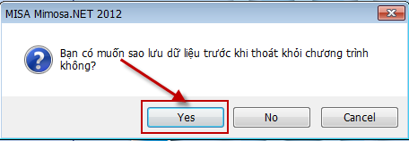{width="4.75in"
height="1.6458333333333333in"}

-   Nhấn **Yes** để chương trình tự động sao lưu dữ liệu.

-   Nếu là lần đầu tiên sử dụng MISA thì sẽ có thông báo:

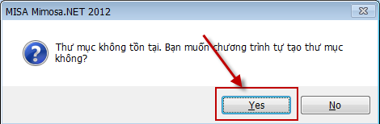{width="4.895833333333333in"
height="1.6041666666666667in"}

-   Nhấn Yes để chương trình tự tạo thư mục sao lưu dữ liệu.

**\* Nếu các đơn vị lưu dữ liệu vào một thư mục khác thì làm như sau:**

- Vào Menu **Hệ thống\\Tùy chọn.**

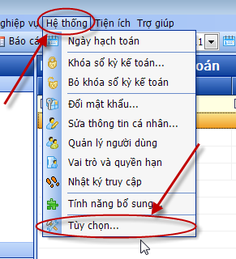{width="3.03125in"
height="3.3333333333333335in"}

- Chương trình hiện ra cửa sổ Tùy chọn, các anh chị bấm chọn **Sao lưu**

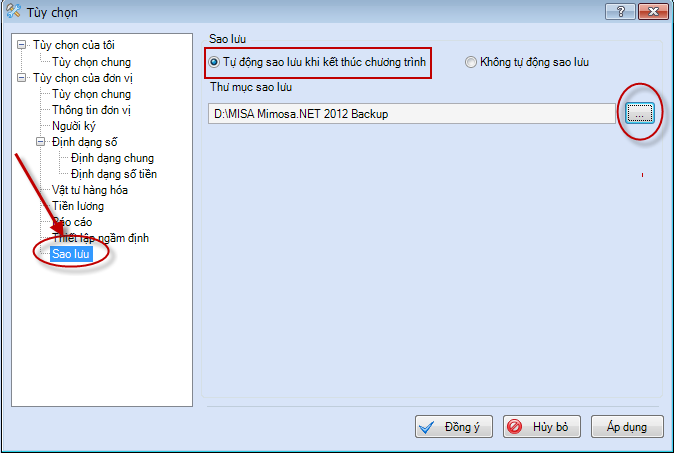{width="7.020833333333333in"
height="4.71875in"}

-   Có 2 ô tích là **Tự động sao lưu khi kết thúc chương trình** và
    **Không tự động sao lưu**, MISA mặc định ô tích **Tự động sao lưu
    khi kết thúc chương trình**, các anh chị không nên chọn lại.

-   Bấm vào dấu … để chọn lại đường dẫn lưu dữ liệu

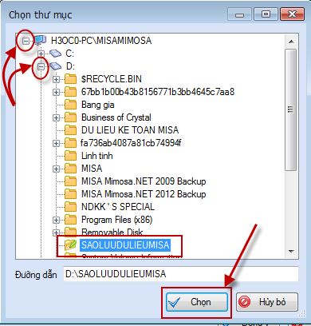{width="4.0625in"
height="3.395138888888889in"}

-   Bấm vào dấu **+** để chọn đường dẫn tới thư mục lưu dữ liệu

-   Bấm chọn thư mục sao lưu ( thư mục lưu dữ liệu

-   Nhấn Chọn.

> 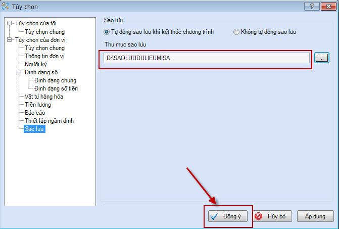{width="6.989583333333333in"
> height="3.770138888888889in"}

1.2 Sao lưu bằng tay
--------------------

- Vào Menu **Tệp\\Sao lưu**

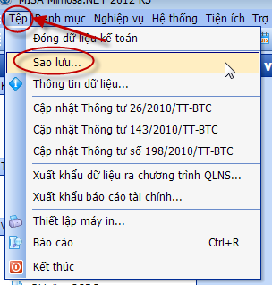{width="3.1666666666666665in"
height="2.990972222222222in"}

-   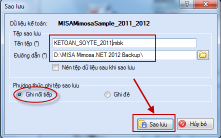{width="4.602083333333334in"
    height="2.626388888888889in"}Chương trình hiện ra cửa sổ Sao lưu

+ ***Tên Tệp***: đặt tên cho dữ liệu sao lưu, viết hoa, không gõ Tiếng
Việt, không khoảng cách. (VD: KETOAN\_SOYTE\_2011.mbk)

+ **Đường dẫn:** đường dẫn lưu dữ liệu là D:\\MISA Mimosa.NET 2012
Backup\\, có thể vào My computer tạo một thư mục mới trong ổ D hoặc ổ E
để lưu dữ liệu (VD: D:\\SAOLUUDULIEUMISA).

-   Tuy nhiên nên lưu trong thư mục MISA đã mặc định. Các anh chị nhớ
    ghi lại đường dẫn này để sau khi sao lưu thì vào lại đường dẫn này
    để chép dữ liệu.

+ Để gửi dữ liệu lên cho MISA kiểm tra thì tích vào ô Nén tập dữ liệu
sau khi lưu để dung lượng file nhẹ hơn, chép sang máy khác cũng nhanh
hơn. Lúc này file dữ liệu có đuôi .zip

+ Phương thức ghi tệp sao lưu: Có 2 phương thức là Ghi nối tiếp và Ghi
đè, MISA đã mặc định là Ghi nối tiếp, các anh chị không nên sửa lại.

-   Sau đó nhấn **Sao lưu**

-   MISA hiện ra hộp thoại thông báo sao lưu thành công, nhấn OK.

- Lúc này để chép dữ liệu sang máy khác thì các anh chị mở My computer
lên, vào đường dẫn đã lưu dữ liệu và chép file có đuôi .mbk hoặc .zip
(VD: KETOAN\_SOYTE\_2011.mbk hoặc KETOAN\_SOYTE\_2011.zip)

***\* Lưu ý:***

-   MISA mặc định lưu dữ liệu ở đường dẫn D:\\MISA Mimosa.NET 2012
    Backup\\, các anh chị không nên sửa lại.

-   Khi muốn chép file dữ liệu thì vào đường dẫn D:\\MISA Mimosa.NET
    2012 Backup\\

-   File sao lưu có dạng .mbk

2 Phục hồi dữ liệu
==================

- Để phục hồi dữ liệu các anh chị làm như sau:

- Khi mở Misa lên, hiện ra cửa sổ **Đăng nhập** thì nhấn **Hủy bỏ**

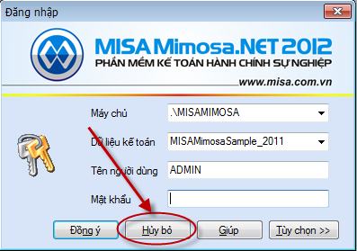{width="4.135416666666667in"
height="2.676388888888889in"}

-   Vào Menu **Tệp\\Phục hồi**

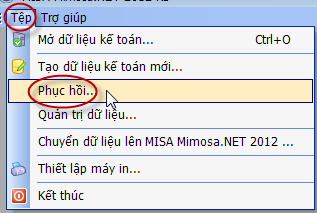{width="3.3020833333333335in"
height="2.21875in"}

 Xuất hiện cửa sổ **Đăng nhập**, nhấn **Đồng ý**.

 Chương trình hiện ra cửa sổ Phục hồi:

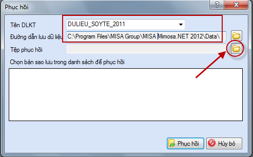{width="5.133333333333334in"
height="3.185416666666667in"}

+ ***Tên DLKT***: đặt lại tên cho dữ liệu kế toán, không trùng với những
tên đã có trong danh sách dữ liệu, viết hoa, không gõ Tiếng Việt, không
khoảng cách.

+ ***Đường dẫn lưu dữ liệu***: mặc định lưu ở C:\\Program Files
(x86)\\MISA Group\\MISA Mimosa.NET 2012\\Data\\. Tuy nhiên có thể chọn
lại đường dẫn khác.

+ ***Tệp phục hồi***: bấm vào biểu tượng thư mục màu vàng để chọn tới
đường dẫn lưu file sao lưu, file sao lưu MISAcó dạng **.mbk**

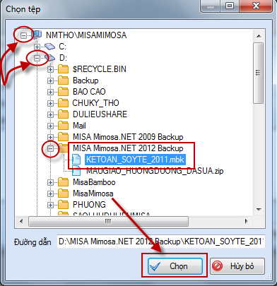{width="4.08125in"
height="3.3006944444444444in"} + Nhấn nút **Chọn**.

+ Nhấn phục hồi.

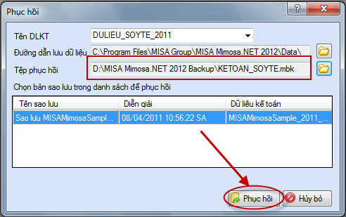{width="5.122916666666667in"
height="3.216666666666667in"}

+ Chương trình báo Phục hồi dữ liệu kế toán thành công, nhấn OK.

+ Sau đó vào **Tệp\\Mở dữ liệu kế toán** để mở dữ liệu vừa phục hồi lên.

+ Tại cửa sổ **Đăng nhập**

**-** **Dữ liệu kế toán**: bấm mũi tên màu đen để chọn lại tên dữ liệu
kế toán vừa đặt, nhấn **Đồng ý**.

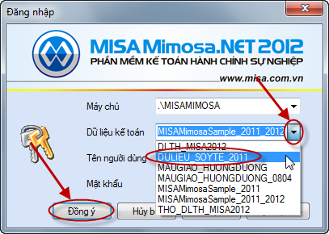{width="4.2375in"
height="3.01875in"}

-   Khi đã mở dữ liệu lên vào Menu **Tiện ích\\Bảo trì dữ liệu.**

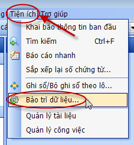{width="2.3645833333333335in"
height="2.5520833333333335in"}

Trong cửa sổ Bảo trì dữ liệu, các anh chị chọn khoảng thời gian là năm
hạch toán của mình và nhấn **Thực hiện**.

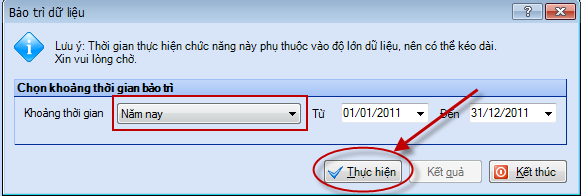{width="6.052083333333333in"
height="2.0416666666666665in"}

-   Chương trình hiện ra thông báo Bảo trì dữ liệu thành công, nhấn OK.

-   Sau đó nhấn **Kết thúc**.

**Lưu ý: -** Tên dữ liệu kế toán phải viết không khoảng cách, không gõ
Tiếng Việt.

- File sao lưu phải có dạng **.mbk**

- Đường dẫn sao lưu MISA đã mặc định , đơn vị không nên sửa.

***CHÚC CÁC ANH/CHỊ THÀNH CÔNG***

*** ***
