**HƯỚNG DẪN SỬ DỤNG GOOGLE DRIVE**

Mới đây Google vừa chính thức ra mắt dịch vụ lưu trữ online dựa trên
công nghệ “đám mây” (Cloud Computing) có tên**Google Drive. **Đây là một
trong những dịch vụ phổ biến nhất trên internet hiện nay, VD: Dropbox,
SkyDrive…

Người dùng đã có thể bắt đầu trải nghiệm dịch vụ Google Drive, tuy nhiên
phải thông qua bước đăng ký. Trong bài viết này Giải Pháp Số sẽ hướng
dẫn cho các bạn từng bước tiếp cận, đăng ký và sử dụng dịch vụ Google
Drive:

**Bước 1: **Vào link của dịch vụ Google
Drive: <https://drive.google.com/start#home>

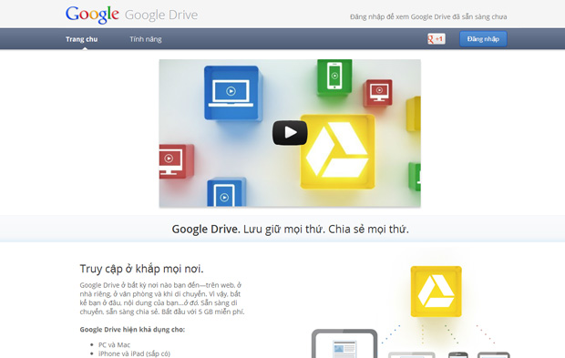

 

**Bước 2: **Đăng nhập tài khoản Google, click vào nút **“Thông báo cho
tôi” **để đăng ký dịch vụ

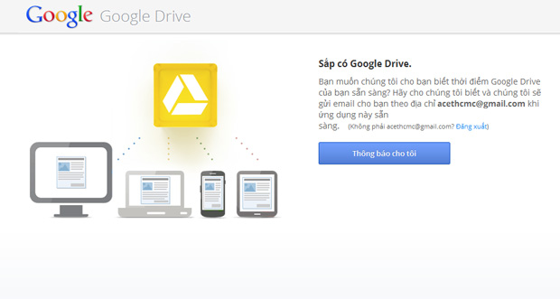

**Bước 3: **Kích hoạt dịch vụ Google Drive, nếu may mắn thì chỉ sau 24h
là bạn sẽ được Google gửi email thông báo kích hoạt dịch vụ thành công.

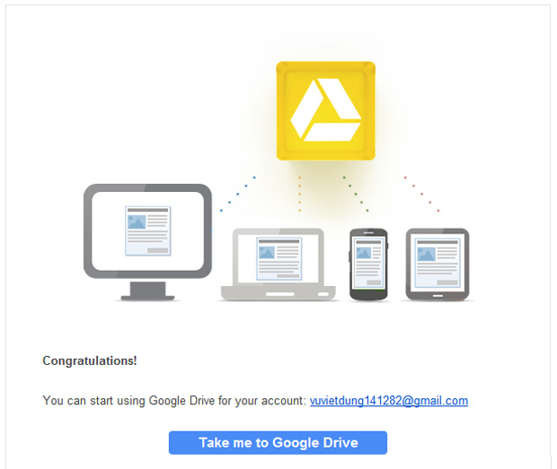

*Click nút “Take me to Google Drive” để tiếp tục!*

 

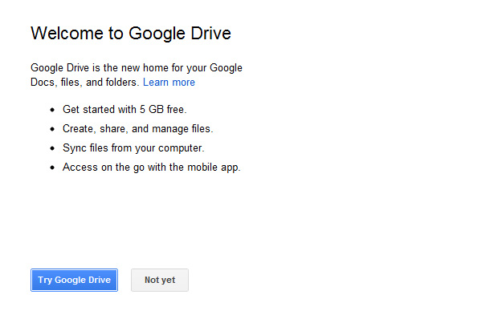

*Click nút “Try Google Drive” để tiếp tục!*

 

**Bước 4: **Tới giao diện quản lý Google Drive online

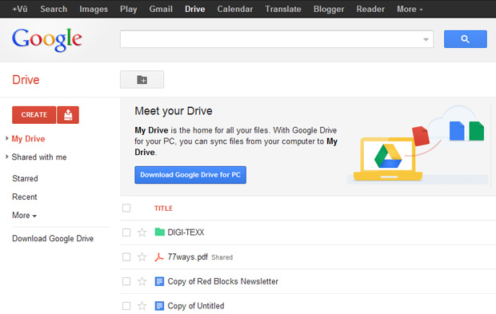

Giao diện Google Drive khá giống với giao diện quản lý Google Docs, các
file mà bạn đã lưu trên trên Google Docs mặc nhiên được hiển thị trong
Google Drive của bạn. Cách quản lý cũng giống như trên Google Docs: bên
trái là menu, phía trên là nút tạo file và nút upload file từ máy tính.
Phần ở giữa hiển thị danh sách file của bạn.

**Bước 5: **Sử dụng các tác vụ trên file hoặc folder

Khi bạn chọn 1 file hoặc 1 folder thì phía trên sẽ hiện lên menu tác vụ
cho phép bạn dễ dàng thực hiện những lệnh như: **chia sẻ, tổ chức, xóa,
xem trước** và nhiều tác vụ khác khi bấm vào nút** “More”**

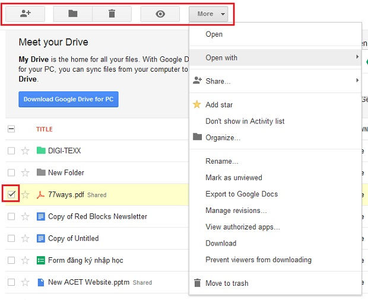

**Bước 6:** Cài đặt ứng dụng Google Drive để sử dụng trên máy tính. Đây
là một trong những giải pháp gần gũi, tiện lợi, thân thiện nhất đối với
những người sử dụng không chuyên bởi vì với ứng dụng này giúp người dùng
có thể sử dụng Google Drive trên máy tính giống như một thư mục bình
thường.

Click vào nút **“Download Google Drive for PC”, **theo các chỉ dẫn như
các hình dưới đây:

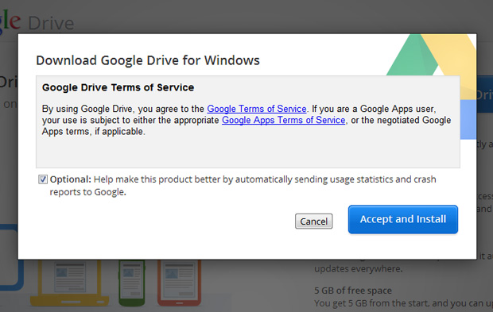

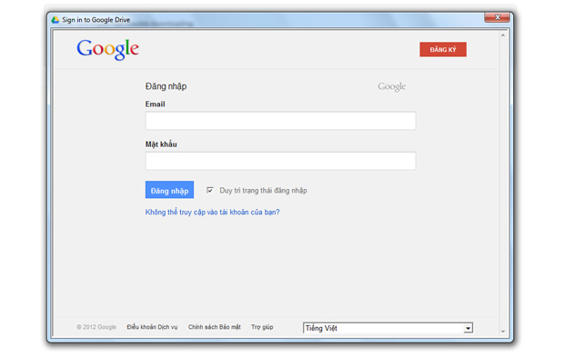

*Đăng nhập bằng tài khoản Google của bạn*

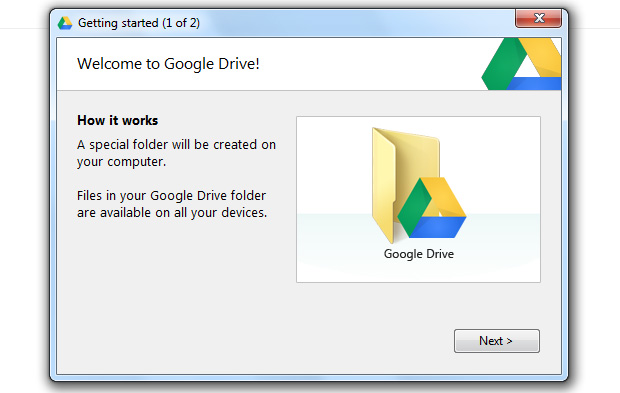

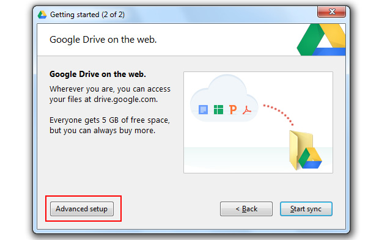

*Chọn Advanced setup để tùy chọn đường dẫn lưu trữ dữ liệu*

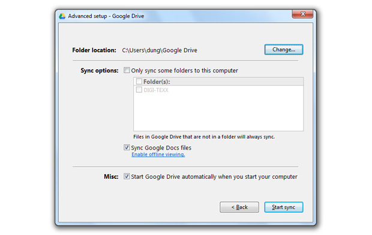

Xác nhận đường dẫn thư mục cho Google Drive trên máy tính của bạn

Bạn có 2 tùy chọn thêm đó là việc đồng bộ các file trên Google Docs lên
máy tính và tùy chọn chạy tự động ứng dụng Google Drive khi mở máy tính.

Nhấn nút “Start sync” để hoàn tất việc đồng bộ hóa dữ liệu online và
offline

Vậy là mỗi khi cần lưu trữ dữ liệu gì lên Google Drive thì bạn chỉ cần
Copy & Paste vào thư mục mới tạo:

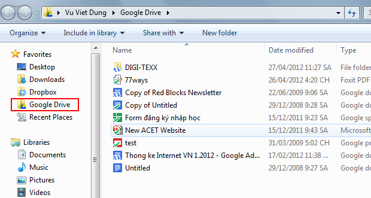

 

**\*\*\* Ứng dụng Google Drive cho Smart Phone:**

Nếu bạn đang sử dụng Android Smart Phone thì có thể dễ dàng cài đặt ứng
dụng trên kho ứng dụng Google Play

<https://play.google.com/store/apps/details?id=com.google.android.apps.docs&feature=search_result#?t=W251bGwsMSwyLDEsImNvbS5nb29nbGUuYW5kcm9pZC5hcHBzLmRvY3MiXQ..>

Ứng dụng Google Drive cho hệ điều hành iOs (iPhone, iPad) sẽ sớm công bố
trong thời gian sắp tới…

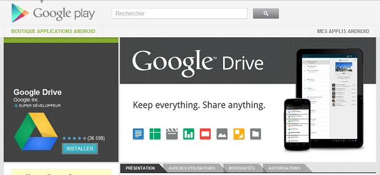

 

 

Để tìm hiểu thêm thông tin về các tính năng cơ bản của Google Drive, vui
lòng tới link
sau: <https://drive.google.com/start?skipIntro=1&authuser=0#features>

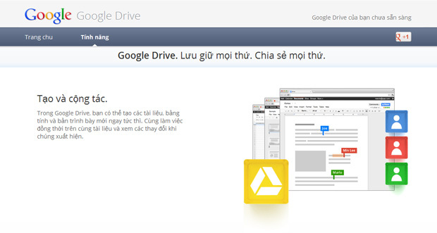

