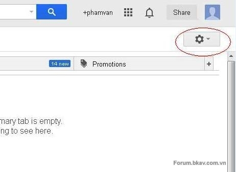
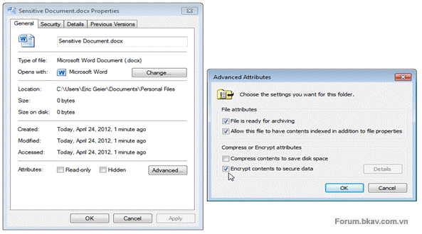
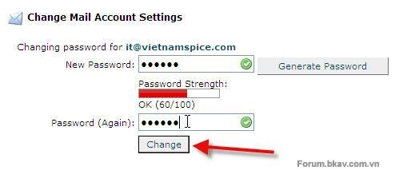
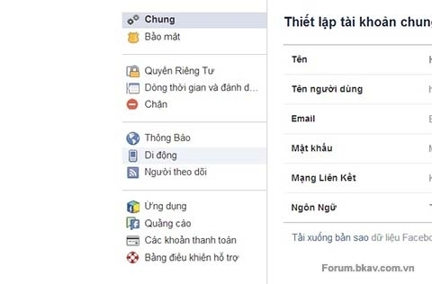
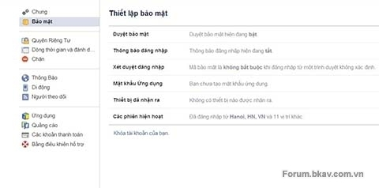
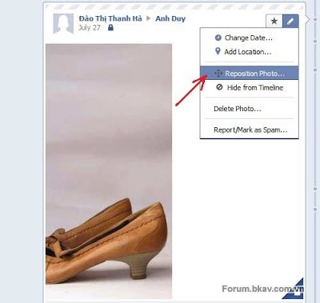

**LỜI NÓI ĐẦU:**\
\
**Mạng xã hội**, hay gọi là **mạng xã hội ảo**, (tiếng Anh: *social
network*) là dịch vụ nối kết các thành viên cùng sở thích trên Internet
lại với nhau với nhiều mục đích khác nhau không phân biệt không gian và
thời gian.\
Mạng xã hội có những tính năng như chat, e-mail, phim ảnh, voice chat,
chia sẻ file, blog và xã luận. Mạng đổi mới hoàn toàn cách cư dân mạng
liên kết với nhau và trở thành một phần tất yếu của mỗi ngày cho hàng
trăm triệu thành viên khắp thế giới. Các dịch vụ này có nhiều phương
cách để các thành viên tìm kiếm bạn bè, đối tác: dựa theo group (ví dụ
như tên trường hoặc tên thành phố), dựa trên thông tin cá nhân (như địa
chỉ e-mail hoặc screen name), hoặc dựa trên sở thích cá nhân (như thể
thao, phim ảnh, sách báo, hoặc ca nhạc), lĩnh vực quan tâm: kinh doanh,
mua bán...\
Hiện nay thế giới có hàng trăm mạng mạng xã hội khác nhau, với MySpace
và Facebook nổi tiếng nhất trong thị trường Bắc Mỹ và Tây Âu; Orkut và
Hi5 tại Nam Mỹ; Friendster tại Châu Á và các đảo quốc Thái Bình Dương.
Mạng xã hội khác gặt hái được thành công đáng kể theo vùng miền như Bebo
tại Anh Quốc, CyWorld tại Hàn Quốc, Mixi tại Nhật Bản và tại Việt Nam
xuất hiện rất nhiều các mạng xã hội như: Zing Me, YuMe, Tamtay....\
Thế giới hiện đại hiện nay người ta thường trao đổi thông tin hay lưu dữ
những thông tin quan trọng rất tiện lợi,nhưng với thời đại công nghệ
thông tin với nhiều phần mền thì mọi người có thể lén truy cập vào để
lấy thông tin hay phá hoại email và mạng xã hội.thông tin của mình.Như
vậỵ minh vói viết bài này để hướng dẫn các anh chị và các bạn về bảo đảm
an ninh cho tài khoản\
\
**I.Hướng dẫn dành cho gmail.**\
\
**Phần 1: Hướng dẫn cài bảo vệ hộp thư Gmail. **\
**1. Sử dụng những tính năng bảo mật tài khoản của Gmail**

**1.1 Hướng dẫn bảo vệ email bằng 2 lần mật khẩu**

**Bước 1**: Đăng nhập vào trang gmail\
\
**Bước 2**: Phía bên phải có dòng bánh xe hình răng,các bạn nháy chuột
vào và hiện bảng các bạn chọn vào cài đặt.

{width="4.8125in"
height="3.5in"}

**Bước 3**:Khi hiện cài đặt có phần ngôn ngữ hiển thị cho gmail các bạn
chọn english(us) và chọn lưu thay đổi.

{width="5.989583333333333in"
height="4.34375in"}

**Bước 4**:Sau khi thay đổi lại ngôn ngữ, bạn vào lại phần Setting và
chọn setting.

{width="3.25in"
height="3.0in"}

**Bước 5**: Bạn chọn accounts và tiếp theo là chọn Other Google account

{width="7.291666666666667in"
height="3.8333333333333335in"}

**Bước 6**: Sau khi chọn, trình duyệt sẽ đưa bạn sang một trang mới. và
chọn Using 2-step Vertification

{width="4.166666666666667in"
height="1.3645833333333333in"}

**Bước 7**: Tiếp tục chọn Set up 2-step verification.\
\
**Bước 8**: Trang web tiếp tục hiện ra và bạn hãy điền số điện thoại của
mình vào và chọn dạng gửi code là SMS text. Tiếp tục bấm vào phần Send
code, và đợt hệ thống gửi mã xác nhận tới máy di động của bạn và điền mã
đó vào ô thứ 2 rồi chọn Verify

{width="4.166666666666667in"
height="3.9166666666666665in"}

Điền số điện thoại và xác nhận.\
\
**Bước 9**: Khi trang web chuyển sang phần tiếp theo. Hệ thống hỏi bạn
có muốn tạo code dự phòng không. Và bạn hãy chọn Next để tiếp tục.\
\
**Bước 10**: Sau khi bấm vào Next. Hệ thống sẽ tạo cho bạn 10 mã số ngẫu
nhiên, bạn hãy lưu hoặc in nó ra giấy.\
\
**Bước 11**: Tiếp tục điền một số điện thoại khác vào để đề phòng khi
điện thoại của bạn không liên lạc được hoặc bị mất. ( Nên chọn số máy
bàn). Tiếp theo bạn chọn Automated voice message. Chọn Send code, Google
sẽ tự động thực hiện một cuộc gọi đến máy bàn của bạn và đọc 5 số để xác
nhận. Sau khi điền xong 5 số bạn hãy bấm vào Verify và tiếp tục bấm
Next.\
\
**Bước 12**: Bạn tiếp tục chọn Next.\
\
**Bước 13**:Sau đó, hệ thống sẽ hiển thị nút chức năng Turn on 2-step
verification. Một bảng thông báo hiện ra hỏi bạn có muốn sử dụng chức
năng này không. Thì bạn hãy bấm vào OK\
\
Cuối cùng hệ thống sẽ đưa bạn sang trang đăng nhập. Sau khi đăng nhập hệ
thống tiếp tục gửi 1 mã để xác minh qua điện thoại di động của bạn và
hãy điền mã số đó vào.\
\
Sau khi xác minh, trang web sẽ đưa bạn đến phần cấu hình cho tài khoản
của bạn. Bao gồm số điện thoại và 10 mã ngẫu nhiên.\
\
Các bạn thực hiện theo các bước trên thì cứ an tâm, không ai xâm nhập
vào gmail của bạn được!\
\
**Chú ý:**\
Nếu như bạn không nhận được tin nhắn SMS hoặc điện thoại hãy làm theo
cách sau: chọn Other ways to get a verification code và một bảng thông
báo nữa hiện ra. Bạn hãy lữa chọn cái nào thích hợp với mình nhất ( Nên
sử dụng mã dự phòng).\
\
Nếu các bạn làm các cách trên không được thì có thể lam theo bước này:\
Các bạn cũng chọn như **Bước 1**,2,3,4,5.rôi hiện bảng.

{width="5.78125in"
height="2.0520833333333335in"}

Các bạn chọn security rồi chọn learn more,sẽ xuất hiện trang khác các
bạn chọn 2-step Vertification như hình vẽ bên dưới:\
\
{width="5.28125in"
height="2.46875in"}\
\
Rồi các bạn Get started như bên dưới.

{width="5.5625in"
height="2.625in"}

Tiếp theo chọn start set up.\
\
{width="5.770833333333333in"
height="4.625in"}\
\
Và nhập dịa chỉ password của bạn vào và nhấn sign in.\
{width="5.104166666666667in"
height="4.46875in"}\
\
Và các bạn làm theo các bước hướng dẫn của gmail từ **Bước
1** đến **Bước 4** thế là xong,chúc các bạn thành công!

**1.2 Kiểm tra tình trạng đăng nhập vào tài khoản**

Điểm tiện lợi của Gmail là cho phép người dùng kiểm tra trạng thái đăng
nhập vào tài khoản để nhằm kiểm tra xem bạn có bị lộ mật khẩu không.\
Từ giao diện chính của Gmail, bạn bấm chuột vào **Chi tiết** ở cuối dòng
“**Hoạt động gần đây nhất của tài khoản…”**

{width="5.208333333333333in"
height="0.7083333333333334in"}

Gmail sẽ liệt kê chi tiết về thời gian truy cập, kiểu truy cập cũng như
địa chỉ IP của từng lần đăng nhập. Khi phát hiện có phiên đăng nhập
khác, bạn bấm **Đăng xuất khỏi tất cả các phiên bản khác**rồi thực hiện
thay đổi mật khẩu. Ngoài ra, Gmail sẽ có đánh giá là tài khoản của bạn
có bị xâm nhập hay không và bạn có thể hoàn toàn tin tưởng điều đó.

**1.3 Thay đổi mật khẩu đăng nhập**

Vì lý do bảo mật, bạn không nên một một mật khẩu trong thời gian quá
lâu, đồng thời khi phát hiện có dấu hiệu xâm nhập trái phép thì hãy thực
hiện thay đổi mật khẩu.\
Bạn vào Cài đặt &gt; Tài khoản và Nhập rồi chọn Cài đặt Tài khoản Google
như ở trên. Ở phần Cài đặt Cá nhân bạn bấm Đổi mật khẩu.

{width="5.729166666666667in"
height="1.09375in"}

Bạn nhập mật khẩu cũ vào rồi nhập mật khẩu mới và xác nhận theo yêu cầu
rồi bấm **Lưu**.

{width="4.166666666666667in"
height="3.0416666666666665in"}

**1.4 Thiết lập các chế độ lấy lại mật khẩu**

Ngoài việc đặt mật khẩu sao cho dễ nhớ với mình và khó đoán với người
khác cũng như thay đổi mật khẩu thường xuyên thì bạn cần phải có phương
án dự phòng cho trường hợp bị quên mật khẩu hay tài khoản rơi vào tay
người khác.\
Bạn vào **Cài đặt Tài khoản Google** như trên rồi bấm **Thay đổi tùy
chọn khôi phục mật khẩu**.

{width="4.6875in"
height="1.46875in"}

Bạn nhập mật khẩu truy cập vào rồi bấm **Xác minh** để tiếp tục.

{width="5.729166666666667in"
height="1.4270833333333333in"}

Tại đây có 3 hình thức khôi phục mật khẩu là dùng hòm thư phụ, sử dụng
câu hỏi bảo mật và khỏi phục qua tin nhắn SMS, bạn nên thiết lập cho tất
cả. Trước hết, tại phần **Email** bạn bấm **Thêm địa chỉ email**để bắt
đầu thêm địa chỉ e-mail phụ.

{width="4.6875in"
height="2.96875in"}

Tiếp đó, bạn chọn **Thêm địa chỉ email khôi phục**.

{width="4.6875in"
height="3.0833333333333335in"}

Cuối cùng, bạn nhập địa chỉ e-mail vào rồi bấm **Lưu** để hoàn tất.

{width="4.166666666666667in"
height="4.3125in"}

Muốn thêm lựa chọn khôi phục mật khẩu qua tin nhắn SMS, trong
phần **SMS** bạn bấm **Thêm số điện thoại di động.**

{width="4.166666666666667in"
height="3.2604166666666665in"}

Bạn chọn quốc gia và nhập số điện thoại vào rồi bấm **Lưu**.

{width="4.166666666666667in"
height="1.6145833333333333in"}

Lựa chọn lấy lại mật khẩu nhanh nhất nhưng đa số người dùng lại không
thể khôi phục bằng cách này được là dùng câu hỏi bảo mật. Lý do là khi
tạo tài khoản đa số đã không để ý đến vấn đề phục hồi nên trả lời qua
loa và kết quả là không nhớ mình đã chọn câu hỏi và trả lời câu hỏi như
thế nào. Rất may cho bạn là Gmail cho phép bạn chỉnh sửa câu hỏi và trả
lời lại, tại phần **Câu hỏi bảo mật** bạn bấm **Chỉnh sửa**.

{width="4.166666666666667in"
height="0.8958333333333334in"}

Bạn chọn câu hỏi mới và trả lời rồi bấm **Lưu**.

{width="4.166666666666667in"
height="1.3020833333333333in"}

Như vậy bạn đã thiết lập thành công các hình thức khôi phục mật khẩu cho
tài khoản của mình.

{width="4.166666666666667in"
height="4.46875in"}

**2. Hướng dẫn cách thức bảo mật bằng mã hóa:**

**2.1 Mã hóa kết nối:**

{width="2.5in"
height="2.0104166666666665in"}

Nếu bạn kiểm tra email qua trình duyệt web (cho dù ở trên máy tính để
bàn, máy tính xách tay, điện thoại thông minh hay máy tính bảng), cần
mất một chút thời gian để chắc rằng việc mã hóa giao thức SSL/TLS được
kích hoạt. Nếu thực hiện đúng, địa chỉ website sẽ bắt đầu bằng https
thay vì là http. Tùy vào trình duyệt, bạn sẽ thấy một số dấu hiệu bổ
sung, ví dụ như một thông báo bên cạnh thanh địa chỉ hay biểu tượng ổ
khóa màu vàng trên thanh trạng thái ở phía dưới cùng của cửa sổ trình
duyệt.Để bảo đảm việc kết nối giữa nhà cung cấp dịch vụ email với máy
tính hay thiết bị khác, bạn cần cài đặt mã hóa giao thức SSL (Secure
Socket Layer) và TLS (Transport Layer Security) – tương tự như cách thức
bảo vệ mà bạn dùng khi kiểm tra tài khoản ngân hàng hay thực hiện giao
dịch trực tuyến.\
\
Nếu bạn không thấy địa chỉ https và những chỉ dấu khác sau khi đăng nhập
vào chương trình email trên web, hãy gõ thêm một chữ s vào cuối của
‘http’ và nhấn Enter. Nếu nhà cung cấp dịch vụ email hỗ trợ giao thức
SSL/TLS, cách này sẽ giúp mã hóa kết nối hiện tại của bạn. Sau đó, bạn
duyệt thiết lập cài đặt tài khoản của mình để xem liệu có thể kích hoạt
mã hóa theo mặc định, hoặc liệu có thể sửa bookmark hay tạo shortcut tới
webmail dùng địa chỉ ‘https’. Nếu bạn không thể “ép” mã hóa, hãy kiểm
tra nhà cung cấp dịch vụ email vì có thể họ không hỗ trợ giao thức
SSL/TLS.

{width="4.083333333333333in"
height="4.5in"}

Tuy nhiên, trong những tình huống như vậy, sẽ khó khăn hơn trong việc
xác thực hay thiết lập mã hóa. Để thực hiện, hãy mở chương trình email
hay ứng dụng và tìm tới menu thiết lập; tại đó, tài khoản của bạn được
“dán nhãn” POP/SMTP, IMAP/SMTP, HTTP hay tài khoản Exchange. Tìm tùy
chọn để kích hoạt mã hóa, thường nằm trong các thiết lập nâng cao nơi
bạn có thể chỉ định số cổng (port) cho kết nối đến và đi.Nếu bạn dùng
chương trình email như Microsoft Outlook để nhận email hay một ứng dụng
email trên điện thoại thông minh, máy tính bảng, bạn nên cố gắng sử dụng
mã hóa SSL/TLS.\
Nếu bạn dùng tài khoản email Exchange cho công việc, bạn sẽ thấy mục
dành cho thiết lập bảo mật, nơi bạn có thể thấy rõ liệu mã hóa/bảo mật
có được kích hoạt cho các kết nối đến và đi cũng như cho tài khoản
Exchange của bạn hay không. Nếu nó không được kích hoạt, kiểm tra nhà
cung cấp dịch vụ email để xem họ có hỗ trợ mã hóa này và có thể tìm kiếm
nhà cung cấp nào khác có hỗ trợ mã hóa SSL/TLS.

**2.2 Mã hóa email lưu trữ**

{width="6.177083333333333in"
height="3.4375in"}\
\
Cách tốt nhất là mã hóa toàn bộ nội dung trên laptop hay thiết bị di
động, bởi vì các thiết bị di động thường rơi vào trường hợp đặc biệt là
bị mất hay đánh cắp. Đối với các thiết bị di động, tốt nhất là dùng hệ
điều hành cung cấp đầy đủ mã hóa trên thiết bị bằng cách thiết lập mã
PIN hay mật khẩu để bảo vệ email và dữ liệu khác của bạn.Nếu bạn thích
sử dụng trình email trên máy tính hay ứng dụng trên thiết bị di động hơn
là qua trình duyệt web, bạn nên chắc rằng dữ liệu email được lưu trữ đã
mã hóa để những kẻ tấn công trên mạng không thể truy cập vào nội dung
email đã lưu, nếu bạn lỡ mất hay bị ai đó đánh cắp thiết bị.\
\
Các thiết bị BlackBerry và iOS (như iPhone, iPad và iPod Touch) đã cung
cấp loại mã hóa này trong nhiều năm qua; Android hỗ trợ chỉ phiên bản
3.0 hay cao hơn. Các thiết bị Android cũ hơn, có thể dùng ứng dụng email
của bên thứ 3, như TouchDown cung cấp mã hóa dành cho các tài khoản
Exchange.\
\
Đối với máy tính để bàn và máy tính xách tay, bạn có thể mã hóa tập tin
dữ liệu email nếu bạn không muốn mã hóa toàn bộ nội dung trên máy tính.
Các chức năng mã hóa của mỗi trình email lại khác nhau, do đó nên kiểm
tra tài liệu hướng dẫn đối với mỗi chương trình và phiên bản cụ thể. Nếu
trình email của bạn không cung cấp mã hóa đáng tin cậy, hãy chọn lựa mã
hóa theo thư mục nơi email của bạn được lưu trữ.\
\
Ví dụ, nếu bạn dùng phiên bản Professional, Business hay Ultimate của
Windows, bạn có thể mã hóa nội dung email, không phụ thuộc vào chương
trình email bạn dùng, nhờ vào tính năng Encrypted File System (EFS) tích
hợp sẵn trong Windows. Trước hết, tìm các dạng tập tin mà trình email
của bạn sử dụng để lưu trữ các nội dung email; Microsoft Outlook dùng
tập tin .PST để lưu nội dung, hay tập tin .OST dành cho các tài khoản
Exchange. Trong Windows XP, bạn sẽ tìm thấy tập tin trong C: Documents
and SettingsyourusernameLocal SettingsApplication DataMicrosoftOutlook.
Trong Windows Vista và 7, đó là
C:UsersyourusernameAppDataLocalMicrosoftOutlook.\
\
Một khi đã xác định nơi trình email của bạn lưu dữ liệu, nhấn phải vào
tập tin hay thư mục chứa nội dung đó, chọn Properties, nhấn Advanced và
chọn Encrypt để mã hóa. Đó là tất cả những điều bạn cần làm. Tính năng
EFS sẽ giúp mở tập tin và giải mã tự động khi bạn đăng nhập vào tài
khoản Windows.\
Hãy nhớ vô hiệu hóa mã hóa trước khi cài đặt lại Windows hay thay đổi
tài khoản Windows của bạn nếu không bạn sẽ có nguy cơ không thể giải mã
được các tập tin sau đó!

**II.Hướng dẫn dành cho yahoo**\
\
**Phần 1: Hướng dẫn cài bảo vệ cho yahoo**

1.  Hướng dẫn bảo vệ yahoo bằng hai lần mật khẩu.

Để kích hoạt tính năng này bạn theo tác như sau:

-   **Bước 1**: Bạn truy cập bằng địa
    chỉ<https://edit.yahoo.com/commchannel/sec_chal_manage>

-   **Bước 2**: Đăng nhập bằng tài khoản và mật khẩu của bạn.

{width="6.979166666666667in"
height="1.7916666666666667in"}

-   **Bước 3**: Bạn đánh dấu tick vào ô trước dòng chữ: *Check this box
    to turn on the second sign-in verification.*

{width="4.385416666666667in"
height="2.25in"}\
\
**Lưu ý:**\
Khi điền số điện thoại bạn chọn đúng quốc gia và bỏ số 0 ở đầu đi, điền
như hình trên.\
Một cửa sổ popup sẽ hiện lên hiển thị sổ điện thoại của bạn. Bạn xác
nhận số điện thoại này là đúng và sử dụng nó bằng cách nhấp vào nút Use
Current Phone nếu muốn thay đổi số điện thoại khác thì bấm nút **Use New
Phone.**\
Khi bạn thực hiện xong ở cửa sổ popup ở trên sẽ có một tin nhắn kèm mã
xác nhận gửi đến số điện thoại của bạn và bạn hãy điền nó vào
khung **Enter Code** ở cửa sổ popup tiếp theo.\
\
{width="4.458333333333333in"
height="1.96875in"}\
\
Vậy là bạn đã kích hoạt thành công tính năng xác minh 2 bước cho tài
khoản Yahoo của mình rồi.\
Sau này nếu muốn hủy bỏ bị chỉ việc bỏ bạn chỉ việc bỏ dấu tick ở trước
dòng chữ Your second sign-in verification is turned on. Bạn cũng có thể
tùy chọn lại việc xác minh với 2 tùy chỉnh\
- Use either my security question or mobile phone number for
verification: Dùng câu hỏi bảo mật hoặc số điện thoại đã cung cấp để xác
minh.\
- Use only my mobile phone number for verification: Chỉ dùng số điện
thoại để xác minh.\
Bạn kéo xuống dưới để tùy chỉnh lại số điện thoại và câu hỏi bảo mật nếu
cần.\
\
{width="6.979166666666667in"
height="2.6145833333333335in"}

**Phần 2: Những thủ thuật khi sử dụng yahoo**

**2.1 Chặn nick gây phiền toái**

Trong danh sách Yahoo, hẳn phải có vài tên đáng ghét mà teen không muốn
nhìn thấy cái mặt. Hoặc bạn đã từng bị một số nick lạ nhảy vào spam, gây
bực mình và khó chịu. Vậy khi đó, giải pháp tốt nhất là tùy chỉnh cho
Yahoo! Messenger (Y!M) để chặn tất cả những nhân vật đó lại.\
Đầu tiên, chọn menu Messenger &gt; Preferences hoặc dùng phím tắt Ctrl +
Shift + P.

{width="3.9583333333333335in"
height="3.7083333333333335in"}

Sau đó, hộp thoại "**Yahoo! Messenger Preferences**" được mở ra. Trong
cửa sổ này, bạn chọn "**Ignore List**" từ danh sách Category.

{width="5.208333333333333in"
height="2.7395833333333335in"}

Lúc này, nếu muốn chặn kẻ xấu không có trong danh sách Y!M thì nhấp chọn
"Ignore anyone who is not on my Messenger List". Nếu bạn chỉ muốn giới
hạn với một số nick nào đó, hãy chọn "Ignore only the people below".

{width="4.041666666666667in"
height="2.03125in"}

{width="5.208333333333333in"
height="3.25in"}

Nhấn nút "Add". Khi này hộp thoại "Ignore a User" mở ra, bạn hãy gõ nick
cần chặn (ví dụ là badboy). Nhấn nút "Ignore".\
\
Nếu muốn loại bỏ khỏi danh sách thì bạn bấm "Remove". Cuối cùng là nhấn
"Apply" để hoàn thành.

**2.2 Chat với biểu tưởng cảm xúc ẩn**

Một thủ thuật đã khá quen thuộc nhưng chắc hẳn vẫn còn mới với nhiều
người. Đôi khi bạn nhìn thấy những biểu tượng cảm xúc lạ mắt, rồi tìm
hoài trong danh sách emotion của Y!M mà vẫn không thấy. Lý do rất đơn
giản, đấy là những biểu tượng cảm xúc ẩn đã được Yahoo giấu đi.

{width="5.208333333333333in"
height="3.5625in"}

Để mở bảng đầy đủ những khuôn mặt cảm xúc đó, bạn hãy truy cập
vào<http://vn.messenger.yahoo.com/features/hiddenemoticons/>\
để thấy được nhiều biểu tượng hơn. Hãy tự ngâm cứu và chọn ra những
emotion yêu thích nhé.\
2.3 Biến Y!M thành nơi cảm xúc thăng hoa\
Với Y!M Heart Sender 2.5, các biểu tượng cảm xúc trên Y!M sẽ biến thành
những cụm từ hết sức thú vị và sinh động. Bạn có thể tải về tiện tích
tại \
[http://www.mediafire.com/download/15...-2-05-free.zip](http://www.mediafire.com/download/15h3g9puaa5fgsl/y-m-heart-sender-2-05-free.zip) \
với dung lượng rất nhỏ, chỉ 250KB.

{width="5.208333333333333in"
height="3.8229166666666665in"}

Tải về thành công, bạn đăng nhập vào Y!M, mở một cửa sổ chat và kích
hoạt chương trình Y!M Heart Sender. Lựa chọn cụm từ cảm xúc tương ứng
với các biểu tượng bên phải, kéo thả vào màn hình đang chat bằng công cụ
bàn tay. Ngay lập tức, đối phương sẽ nhận được những món quà rất thú vị
đó!

**2.4 Làm nick On/Off liên tục**

Đôi khi, muốn trêu đùa người khác, chúng ta thường tắt bật nick bằng
chuột nhưng rất dễ gây nhầm lẫn và mỏi tay. Thay vào đó, tại sao teen
không dùng bàn phím để đổi gió một chút nhỉ?\
\
Để làm nick chat của bạn On/Off liên tục, hãy rê chuột vào nick mình và
bấm chọn Ctrl + Alt + i và Ctrl + Alt + a. Cứ thế thay đổi phím chữ i và
a trong khi vẫn giữ tay ở cụm phím Ctrl + Alt. Lưu ý, nếu có thông báo
bảng “hiện thông báo này trong tương lai” thì nhớ bỏ tích dấu chọn đó đi
nhé.

**2.5 Gửi tin nhắn tới điện thoại cho bạn chat**

Khi bạn chat đang offline và sử dụng điện thoại di động, chúng ta có thể
sử dụng dịch vụ hỗ trợ SMS của Y!M để gửi tới họ những thông điệp nho
nhỏ í! Đầu tiên, bạn bấm nick người đó lên, bấm chọn "Send an SMS
Message" hoặc dùng phím tắt là Ctrl + T.

{width="5.208333333333333in"
height="4.1875in"}

Một cửa sổ mới xuất hiện và bạn nhập số điện thoại của người đó vào. Lưu
ý rằng số điện thoại sẽ phải nhập theo mẫu +84 với mã vùng của Việt Nam.
Tin nhắn sẽ được gửi tức thì và bạn có thể nhập chính số phone của mình
để kiểm tra (giới hạn ký tự chỉ là 142 thôi).

**III.Hướng dẫn dành cho yahoo mail:**\
\
**Phần 1: Hướng dẫn cài bảo vệ cho mật khẩu yahoo mail.**

**Hướng dẫn bảo vệ yahoo mail bằng hai lần mật khẩu.**

**Bước 1**: Bạn truy cập
vào[https://login.yahoo.com/config/login...%3Dus%26ar%3D4](https://login.yahoo.com/config/login?.scrumb=0&.done=https%3A%2F%2Fedit.yahoo.com%2Fcommchannel%2Fsec_chal_manage%3F.scrumb%3D0%26.done%3D%26partner%3Dreg%26src%3D%26.intl%3Dus%26ar%3D4)\
\
và đăng nhập vào tài khoản Yahoo! Mail của mình

{width="5.364583333333333in"
height="3.7916666666666665in"}

**Bước 2**: Tại trang *Set Up Your* *Sign-in Verification*, bạn đánh dấu
vào ô *Check this box to turn on the second sign-in* *verification*. Ở
hộp thoại *Add Mobile Phone* hiện ra, bạn bấm vào mũi tên xổ xuống,
chọn *Vietnam*, rồi điền số điện thoại di động vào ô bên cạnh (bỏ số 0
đầu tiên). Xong, bạn bấm*Receive SMS* và chờ chốc lát, một tin nhắn chứa
mã xác nhận sẽ được gửi đến điện thoại của bạn.

{width="5.333333333333333in"
height="4.0in"}

**Bước 3**: Bạn nhập mã xác nhận trong tin nhắn vào ô *Enter code* rồi
bấm *Verify Code*.\
\
Khi nhập đúng, bạn sẽ nhận được thông báo *Success! You’ve completed the
second sign-in verification setup*. Lúc này, bạn thiết lập thêm về chế
độ đăng nhập hai lớp bằng cách đánh dấu vào một trong hai mục**: ***Use
either my security question or mobile phone number for verification*(có
thể dùng mã xác nhận được gửi đến điện thoại hay trả lời câu hỏi bảo mật
để đăng nhập), *Use* *only my mobile phone number for verification* (chỉ
dùng mã xác nhận được gửi đến điện thoại để đăng nhập). Tùy vào nhu cầu
mà bạn chọn chế độ cho hợp lý. Để thay đổi câu hỏi bảo mật và câu trả
lời, bạn kéo xuống mục *Security Question*, chọn *Đổi câu hỏi và câu trả
lời*.

{width="5.333333333333333in"
height="4.0in"}

Sau khi kích hoạt bảo mật hai lớp, việc đăng nhập trên máy tính đang sử
dụng vẫn bình thuờng (tức chỉ cần nhập mật khẩu, không cần nhập mã xác
nhận trên điện thoại). Khi chuyển sang đăng nhập trên máy tính khác, bạn
sẽ bị yêu cầu phải nhập thêm mã xác nhận.\
\
Để tắt bảo mật hai lớp, bạn lại truy cập vào\
[https://login.yahoo.com/config/login...%3Dus%26ar%3D4](https://login.yahoo.com/config/login?.scrumb=0&.done=https%3A%2F%2Fedit.yahoo.com%2Fcommchannel%2Fsec_chal_manage%3F.scrumb%3D0%26.done%3D%26partner%3Dreg%26src%3D%26.intl%3Dus%26ar%3D4)\
bỏ chọn tại dòng *Your second sign-in* *verification is turned on*,
bấm *Turn Off*. Ngoài ra, tại trường*Mobile Phone***,** bạn có thể thêm
một số điện thoại dự phòng, hay xóa số đã đăng ký.

**Phần 2: Những thủ thuật cho yahoo mail.**

**2.1 Xóa tài khoản Yahoo! Mail**\
\
Trước hết, bạn cần lưu ý là tài khoản Yahoo! Mail cũng là tài khoản
Yahoo Messenger, My Yahoo! và những dịch vụ khác thuộc Yahoo!. Đối với
các tài khoản Yahoo! Mail Plus (có phí) bạn cần hủy bỏ dịch vụ trước khi
xóa tài khoản email để tránh những phí thanh toán không mong đợi.\
Truy cập vào địa chỉ <https://edit.yahoo.com/config/delete_user> sau đó,
đăng nhập với tên tài khoản muốn xóa và mật khẩu (username và password).
Sau khi đăng nhập, sẽ gặp trang cảnh báo người dùng sau khi xóa tài
khoản sẽ không sử dụng được các dịch vụ của Yahoo. Nhập lại mật khẩu lần
nữa rồi chọn "*YES - Terminate this Account*".\
\
**2.2 Quản lý tài khoản mail khác chung với Yahoo! Mail**\
Hiện tại, Yahoo! Mail cho phép người dùng nhập thêm một tài khoản email
để sử dụng chung. Có nghĩa là bạn có thể kiểm tra 2 tài khoản email
trong cùng 1 hộp thư (inbox). Cách thức như sau:\
Vào *Options*, chọn *Mail Addresses*. Tại đây, bạn sẽ thấy khung quản lý
tài khoản email hiện có trong*inbox*. Nhấn *Add* để tiến hành nhập tài
khoản mới, chọn tiếp *Configure Account Manually* (bên phải) để có thể
tự nhập các thiết lập.\
+ Account Name: đặt tên cho tài khoản mới\
+ Mail Server: địa chỉ máy chủ POP của email mới (ví dụ: pop.yahoo.com,
pop.mailbandangdung.com...)\
+ Username & Password: tài khoản và mật khẩu\
+ Indicator: chọn màu sắc\
Sau khi nhập xong, nhấn "*Save Changes*" để thực hiện thay đổi. Chỉ với
tài khoản Yahoo! Mail Plus, bạn mới có thể gởi mail đi thông qua tài
khoản thứ 2. Với các tài khoản Yahoo! Mail thông thường thì bạn chỉ nhận
được email từ tài khoản thứ 2 vào chung *inbox* được mà thôi

{width="5.989583333333333in"
height="3.9375in"}

**2.3 Thay đổi màu sắc cho Yahoo! Mail**\
Bạn có thể thay đổi màu sắc tùy ý để không nhàm chán cho các thanh menu
trong Yahoo! Mail bằng cách đăng nhập vào tài khoản. Chọn ***Mail
Options***, chọn tiếp ***Colors*** bên dưới khung tùy
chọn ***Options***. Thay đổi khung màu theo ý thích rồi
chọn ***Save*** để lưu lại thiết lập, bạn sẽ thấy sự thay đổi khi Yahoo!
Mail có màu sắc riêng cho chính mình.\
\
**2.4 Xuất địa chỉ Email trong Yahoo! Mail**\
Đôi khi bạn muốn xuất tất cả những địa chỉ email bạn bè, người thân có
trong Address Book để có thể sử dụng cho các email client khác như
Outlook, Outlook Express hay Gmail. Yahoo! Mail Address Book hỗ trợ xuất
tất cả địa chỉ email với định dạng **.CSV** (cho Outlook)
hay **.VCF** (vCard).\
Đăng nhập vào tài khoản, chọn thẻ ***Addresses*** (kế thẻ Mail). Chọn
"***Import / Export***" (ở bên phải). Bạn cần cuộn trang xuống phần
Export ở bên dưới. Tại đây, sẽ có các phần tùy chọn xuất địa chỉ email
tương ứng với mục đích sử dụng của bạn. Nếu bạn sẽ dùng danh sách địa
chỉ email này cho Microsoft Outlook thì nhấn "***Export now***" ở phần
Microsoft Outlook. Tương tự cho Netscape/Thunderbird, vCard...\
\
**2.5 Đặt thư mục mặc định cho địa chỉ email người gởi**\
Đối với những email từ một người gởi xác định, bạn muốn chúng sẽ luôn
luôn tự động được đưa vào một thư mục trong Yahoo! Mail. Điều này rất
đơn giản khi sử dụng các email client như Outlook. Chỉ cần đặt một quy
tắc (rule) hay bộ lọc (filter) cho tài khoản email cũng như email nhận.
Trong Yahoo! Mail cũng tương tự như vậy.\
Trong Mail Options, ta chọn Filters rồi nhấn Add để đặt một bộ lọc mới.
Đặt tên cho bộ lọc ở "**Filter Name**", tốt nhất nên đặt theo tên của
người gởi vì nó sẽ giúp ích cho bạn khi quản lý nhiều bộ lọc. Gõ tiếp
địa chỉ email của người gởi vào ô "***From header - contains***" (Ví
dụ: *ebooks@new4hack.com*) và lưu ý đừng đánh dấu chọn vào "match case".
Sau đó, chọn trong danh sách xổ xuống ở phần "***Move the message to***"
thư mục (Folder) mà bạn muốn email được đưa vào đó. Nếu chưa có thư mục
thì bạn chọn **\[New Folder\]** và nhập tên cho thư mục. Nhấn "***Add
Filter***" để hoàn tất việc tạo bộ lọc

**IV.Những lời khuyên, kinh nghiệm khi sử dụng email**

**Sử dụng nhiều mật khẩu email:**\
Nếu bạn sử dụng một tài khoản email cho tất cả hoạt động cá nhân, như
tin nhắn Facebook, đăng ký website an toàn hoặc không an toàn, nhân các
bản tin mới từ các website đã đăng ký, quản lý nhiều tên miền... thì có
nghĩa bạn đang đặt tất cả các trứng vào cùng một giỏ. Nếu chẳng may giỏ
bị rơi hoặc bị mất thì các trứng trong giỏ sẽ không còn. Chính vì vậy,
bạn nên sử dụng nhiều tài khoản email, không những giúp bảo mật những
email quan trọng mà còn giúp bạn an tâm khi hoạt động trên thế giới
Internet. Trong thị trường cung cấp địa chỉ email miễn phí có ba dịch vụ
Gmail,với khả năng bảo mật khá tốt, bạn có thể đăng ký nhiều tài khoản
email để phục vụ công việc và cuộc sống.\
\
**Tạo một mật khẩu độc nhất vô nhị**\
Cùng với việc sử dụng nhiều tài khoản email, bạn cũng nên tạo cho mình
một mật khẩu an toàn cho mỗi tài khoản email. Nếu bạn quyết định sử dụng
một tài khoản cho mọi hoạt động thì cũng nên tạo ra một mật khẩu đủ khó
và độc nhất. Mỗi website cung cấp dịch luôn có phần kiểm tra độ khó của
tài khoản, các bạn cần đảm bảo rằng mật khẩu mà mình đặt ra phải ở mức
"strong" và cũng phải dễ nhớ đối với bạn. Theo nhiều báo cáo cho thấy số
lượng người đã và đang sử dụng chuỗi "123456" và "password" làm mật khẩu
cho tài khoản email của họ là rất nhiều, chứng tỏ họ chưa quan tâm đến
mức độ phức tạp của mật khẩu và sự an toàn của tài khoản email. Đôi lúc,
việc sử dụng một mật khẩu cho tất cả tài khoản có thể là một sai lầm.
Bởi vì khi một tin tặc đã đột nhập được vào một tài khoản email của bạn,
lấy được thông tin mật khẩu thì khi đó tin tặc này hoàn toàn có thể đăng
nhập vào các tài khoản khác của bạn.

{width="5.145833333333333in"
height="2.3229166666666665in"}

**Cảnh giác với Phishing lừa đảo**\
Phishing là một cách thức mà tin tặc sử dụng để lừa lấy những thông tin
cá nhân như mật khẩu, tài khoản ngân hàng. Khi nhận được một email yêu
cầu nhập thông tin tài khoản thì bạn đừng nên nhập những thông tin cá
nhân, mật khẩu của tài khoản email. Về cơ bản tin tặc bắt chước và mạo
danh hồ sơ của các website danh tiếng như eBay, Amazon, Facebook... để
lừa gạt người dùng nhập vào những thông tin quan trọng, ngay lập tức
những thông tin này sẽ được gửi đến tin tặc. Hìnhthức thực hiện của tác
tin tặc ngày càng tinhvi,họ tạo ra các website có giao diện rất giống
với website thật. Do đó, hãy cảnh giác với những email yêu cầu nhập
thông tin cá nhân, luôn luôn kiểm tra đường dẫn URL để chắc chắn đó là
tên miền chính thức của những dịch vụ danh tiếng.\
\
**Hạn chế bấm vào liên kết trong thư**\
Phishing lừa đảo và thư rác là những nỗi kinh hoàng cho người sử dụng
thư điện tử. Khi nhìn thấy trong email có một liên kết thì bạn không nên
bấm ngay vào nó. Bởi vì liên kết đó có thể dẫn bạn đến những website
chứa mã độc, phần mềm độc hại, virus và có thể khiến bạn trở thành nạn
nhân của hệ thống thư rác. Có một số đường link mà bạn có thể tin tưởng
và nhấp vào đó là những đường link từ diễn đàn khi bạn đăng ký và kích
hoạt tài khoản, chẳng hạn như liên kết đăng ký diễn đàn hoặc các tài
khoản game. Nếu nhận được email từ ngân hàng hay các dịch vụ khác thì
bạn hãy truy cập vào từ trang chủ của ngân hàng hay dịch vụ đó, không
cần phải bấm trực tiếp vào liên kết trong thư.\
\
**Không nên mở tập tin đính kèm khi không biết người gửi**\
Việc nhận file đính kèm với những định dang tập tin phổ biến trong email
từ những người mà bạn quen biết là khá an toàn và bạn có thể mở ra ngay
khi nhận được. Tuy nhiên, nếu bạn nhận được những tập tin đính kèm lạ
hoặc từ những người không quen biết thì bạn không nên mở những tập tin
này. Các tập tin này có thể chứa mã độc tự động tải về máy tính. Cao tay
hơn là những kẻ phá hoại đã cài một file có định dạng exe được ngụy
trang ở định dạng ảnh jpeg, chúng sẽ xâm nhập ngay vào hệ thống khi mở
tập tin.\
\
\
**Quét virút và mã độc**\
Khi đã lỡ tay bấm vào một liên kết hoặc mở một email nghi ngờ có virus,
mã độc thì việc đầu tiên mà bạn nên làm đó là sử dụng phần mềm diệt
virus để quét lại toàn bộ máy tính. Việc trang bị cho máy tính một phần
mềm diệt virus mạnh mẽ là hết sức cần thiết. Đây là một giải pháp đơn
giản và có hiệu quả nhất trong quá trình sử dụng và quản lý tập tin. Có
thể sử dụng các phần mềm diệt virút uy tín như:Bkav, Norton Antivirus,
Avira Premium Security Suite, BitDefender Total Security, Kaspersky
Internet Security, Webroot SecureAnywhere Antivirus…\
\
**Tránh sử dụng Wi-Fi công cộng**\
Cuối cùng, bạn không nên đăng nhập vào tài khoản email khi đang ở các
dịch vụ Internet công cộng bằng mạng không dây bởi vì mức độ an toàn của
Wi-Fi ở những nơi đó rất thấp. Tin tặc cso thể sử dụng những phần mềm
đánh hơi sniffer, virus, trojan,v.v..và truyền chúng vào môi trường mạng
không dây để để giám sát và thông dịch dữ liệu di chuyển trong mạng
không dây, từ đó tìm kiếm thông tin người dùng, mật khẩu khi nó được
truyền tải.

**V.Hướng dẫn dành cho Facebook**\
**Phần 1: Hướng dẫn cài bảo vệ cho Facebook**

**1.Sử dụng những tính năng bảo mật tài khoản của Facebook**

**1.1 Bảo mật 2 lớp**\
Bảo mật 2 lớp thực chất là tính năng "xác minh 2 bước" được Facebook
tích hợp ngay trong phần cài đặt để tăng cường an ninh cho người dùng.
Tính năng này bao gồm mật khẩu đăng nhập Facebook là lớp bảo vệ thứ nhất
và một mã số (code) ngẫu nhiên (được gửi đến người sử dụng qua điện
thoại) cho mỗi lần đăng nhập là lớp thứ hai.\
*Để bật tính năng bảo mật 2 lớp này, bạn hãy thực hiện theo những bước
dưới đây:*

**Bước 1**: Bạn hãy vào mục thiết lập (Setting) trên trang cá nhân của
mình.

{width="5.0in"
height="3.40625in"}

**Bước 2**: Vào phần di động (Mobile) rồi click vào mục “Thêm số điện
thoại” để thêm số điện thoại của bạn vào. Nếu như bạn đã có số điện
thoại rồi thì hãy nhấn vào nút “Xác nhận số điện thoại” để xác nhận số
điện thoại mà bạn đã cung cấp.

{width="1.0416666666666666e-2in"
height="1.0416666666666666e-2in"}{width="1.0416666666666666e-2in"
height="1.0416666666666666e-2in"}{width="5.0in"
height="3.2916666666666665in"}

Hãy chọn tên nước là Việt Nam và chọn nhà mạng. Ở đây, Facebook chỉ hỗ
trợ 4 lựa chọn là Gmobile, Vietnammobile, Viettel 1 và Viettel 2.

{width="1.0416666666666666e-2in"
height="1.0416666666666666e-2in"}{width="5.0in"
height="2.6145833333333335in"}

**Bước 3**: Sau khi chọn nước và nhà mạng xong, hãy dùng điện thoại của
bạn gửi tin nhắn tới nhà mạng để nhận một mã số xác nhận theo hướng dẫn.

{width="5.0in"
height="2.5208333333333335in"}

**Bước 4**: Sau khi xác nhận xong số điện thoại, quay trở lại phần cài
đặt và vào mục Bảo mật rồi lựa chọn phần Xét duyệt đăng nhập.

{width="5.0in"
height="2.4791666666666665in"}

Một bảng thông báo sẽ hiện ra để giải thích với bạn về tính năng bảo mật
này. Hãy bỏ qua và nhấn Tiếp tục.

{width="5.0in"
height="3.6354166666666665in"}

**Bước 5**: Trong bước này bạn cần xác nhận trình duyệt bạn thường xuyên
sử dụng để đăng nhập Facebook. Hãy điền tên của trình duyệt vào ô trống.
Hãy nhớ là điền trình duyệt bạn thường xuyên sử dụng trên máy tính hoặc
máy tính bảng nhé. Bởi sau này bạn sử dụng trình duyệt khác để đăng
nhập, Facebook sẽ bắt bạn phải xác nhận.

{width="5.0in"
height="2.1354166666666665in"}

**Bước 6**: Bạn xác nhận hệ điều hành mà bạn đang sử dụng trên chiếc
điện thoại của mình. Ở đây, Facebook cung cấp 2 lựa chọn, một lựa chọn
dành cho hệ điều hành Android và iOS và một lựa chọn là các hệ điều hành
khác.

{width="5.0in"
height="2.1770833333333335in"}

**Bước 7**: Facebook sẽ hướng dẫn bạn tạo các mã số trực tiếp bằng phần
mềm Facebook trên điện thoại. Các mã số này có thể dùng để xác nhận ở
lớp thứ 2.

{width="5.0in"
height="2.7083333333333335in"}

Nếu bạn không muốn sử dụng bộ tạo mã bằng phần mềm Facebook trên điện
thoại, Facebook sẽ gửi mã số cho bạn thông qua số điện thoại bạn đã đăng
ký ở trên.

{width="5.0in"
height="2.5833333333333335in"}

Sau khi nhận được mã số qua SMS, bạn hãy điền mã số nhận được vào cửa sổ
mới hiện ra và nhấn “Tiếp tục”.

**Bước 8**: Facebook sẽ hiện ra thông báo việc thiết lập đã hoàn tất.

{width="5.0in"
height="2.375in"}

Từ bây giờ, mỗi khi có người đăng nhập vào tài khoản Facebook của bạn từ
một trình duyệt khác trình duyệt bạn đã xác nhận, Facebook sẽ đòi mã xác
nhận gửi đến số điện thoại của bạn. Điều đó có nghĩa, chỉ cần có trong
tay điện thoại, bạn sẽ biết có người đang truy cập trái phép vào
Facebook của mình.

{width="5.0in"
height="2.875in"}

Ngoài ra, bạn có thể bật tính năng thông báo đăng nhập để Facebook gửi
email hoặc tin nhắn SMS cho bạn mỗi khi có người đăng nhập vào tài khoản
Facebook của bạn từ một máy tính hoặc một thiết bị nào khác mà bạn chưa
từng sử dụng.

{width="5.0in"
height="1.6979166666666667in"}

**2.Cách bảo vệ Facebook bạn không bị hack.**

**2.1 Kiểm tra quá trình đăng nhập của bạn**\
\
Trước hết, để kiểm tra xem Facebook của bạn có bị đăng nhập trái phép
hay không hãy chọn phần Account Settings tại trang chủ.

{width="2.2708333333333335in"
height="2.25in"}

Tiếp theo đó chọn mục Security ở thanh bên trái màn hình.

{width="2.1458333333333335in"
height="3.3645833333333335in"}

Trong bảng Security Settings chọn phần Active Sessions để kiểm tra
Facebook của bạn đã được log in tại những đâu.

{width="5.75in"
height="3.1041666666666665in"}

Một bảng thống kê với các thông số sẽ được hiển thị trong đó có thông số
hiện tại cùng các lần log in gần đây nhất. Ví dụ trong hình có 2 lần log
in không xuất phát từ bạn tại một địa điểm bạn không ở đó. Đây rất có
thể là vị trí những người khác đã đăng nhập vào tài khoản của bạn, ngày
giờ được hiển thị rõ trong phần này.

{width="4.416666666666667in"
height="4.802083333333333in"}

Tiếp theo hãy ấn vào End Activity để loại bỏ những lần truy nhập còn sót
lại. Nếu như người truy nhập tài khoản của bạn nằm ngoài danh sách này
sẽ phải nhập mật khẩu để có thể đăng nhập được vào Facebook của bạn. Sau
đó ngay lập tức thay đổi mật khẩu để tránh những lần truy cập trái phép.

{width="4.416666666666667in"
height="4.802083333333333in"}

**2.2 Thiết lập chế độ thông báo mỗi khi đăng nhập**\
\
Tiếp theo, để chắc chắn những lần truy cập là của bạn, hãy quay lại phần
Security sau đó chọn Login Notifications để Facebook gửi tới bạn thông
báo mỗi lần bạn đăng nhập vào Facebook. Thông báo này sẽ bao gồm ngày
giờ, địa điểm và thiết bị được sử dụng để truy cập.

{width="5.854166666666667in"
height="2.9375in"}

Trong phần cài đặt này bạn có thể chọn Email để Facebook gửi thông báo
tới địa chỉ Email bạn đăng kí, gửi qua tin nhắn để những cập nhật gửi
trực tiếp vào thiết bị di động của bạn hoặc bạn có thể chọn cả hai để...
gấp đôi sự đảm bảo. Khi bạn chọn phần nhận thông báo qua tin nhắn,
Facebook sẽ yêu cầu bạn nhập số điện thoại sau đó sẽ gửi một tin nhắn
với mã xác nhận vào di động của bạn. Bạn chỉ cần sao chép thông tin
trong tin nhắn vào hộp thoại trong Facebook là có thể bắt đầu nhận thông
báo qua tin nhắn.

{width="5.854166666666667in"
height="3.8854166666666665in"}

Đồng thời, thời gian gần đây có một số thông tin cho rằng hacker đang
tung ra đoạn mã độc để tự tạo những nhóm riêng sau đó tự động đưa bạn bè
vào nhóm này tạo nên sự khó chịu cho người dùng. Mặc dù chưa có bất kì
dấu hiệu nguy hiểm nào của hành động này nhưng nó sẽ tạo sự khó chịu cho
người dùng khi những nhóm này được tự động thành lập. Nếu như bạn vô
tình gặp phải tình trạng này bạn có thể xóa những nhóm này bằng cách rất
đơn giản.\
\
Trước hết, vào trang chủ Facebook sau đó nhìn sang thanh bên trái màn
hình. Các nhóm bạn bè sẽ được hiển thị ở đây, chọn nhóm mà bạn muốn xóa
(ví dụ trong hình là nhóm mang tên 'Test'). Click chuột vào nhóm này.

{width="1.9895833333333333in"
height="1.8229166666666667in"}

Một cửa sổ mới sẽ được hiện ra với các thông báo cập nhật của các thành
viên cũng như các sự kiện diễn ra trong nhóm. Để xóa nhóm chọn Manage
List phía dưới thanh công cụ sau đó chọn Delete List và làm theo hướng
dẫn của Facebook. Việc xóa nhóm sẽ không đồng nghĩa với việc unfriend
tất cả bạn bè trong nhóm. Khi xóa một nhóm trong Facebook, những người
bạn trong nhóm này sẽ được tự động chuyển về danh sách mặc định và sẽ
không làm ảnh hưởng tới tài khoản của bạn.

**\
**{width="2.8541666666666665in"
height="2.625in"}

2.3. Làm thế nào khi tài khoản bị hack?\
\
Nếu như tài khoản của bạn thực sự bị hack và bị thay đổi mật khẩu, bạn
có thể dễ dàng lấy lại mật khẩu của mình và "đá bay" tên đang chiếm giữ
trang cá nhân của bạn bằng cách bấm
vào [đây](https://www.facebook.com/login/identify?ctx=recover), Facebook
sẽ yêu cầu bạn nhập địa chỉ email hoặc số điện thoại để khởi động lại
mật khẩu đồng thời thay thế mật khẩu mới.\
\
Tuy nhiên, sẽ thế nào nếu như bạn quên mất địa chỉ email cũng như mật
khẩu của địa chỉ email? Nếu như bạn gặp vấn đề đó hãy bấm
vào [đây](http://www.facebook.com/help/contact/?id=320596411317906) và
làm theo hướng dẫn của Facebook để có được sự trợ giúp hợp lý nhất.\
\
**2.4. Phải làm gì để bảo vệ tài khoản trong tương lai?**\
\
Tất nhiên là thay đổi mật khẩu thường xuyên và cài đặt những ứng dụng
diệt virus để ngăn chặn việc mật khẩu bị đánh cắp, không nên click vào
những đường link đáng nghi ngờ được gửi từ bạn bè. Một số hacker rất
tinh vi khi tự tạo dựng nên những trang đăng nhập Facebook "ảo" để đánh
cắp mật khẩu của người dùng. Tuy nhiên hãy kiểm tra kĩ càng đường link
trên trình duyệt, link chính thức của Facebook sẽ chỉ
có [https://www.Facebook.com](https://www.facebook.com/) mà không sở hữu
bất kì thông tin cũng như kí tự nào khác.\
\
Nếu bạn dùng chung máy tính với nhiều người hoặc sử dụng máy tính công
cộng thì không nên chọn tính năng lưu trữ mật khẩu của trình duyệt kèm
theo đó là luôn log out sau mỗi lần vào Facebook để hạn chế được tối đa
những sai sót có thể xảy ra. Chúc các bạn thành công!

**Phần 2: Những thủ thuật khi dùng Facebook.**

**2.1 Cách cài đặt để chỉ hiện online/offline với một số bạn bè trên
Facebook**\
Ở cửa sổ chat của Facebook, nhấp chuột vào biểu tượng “Settings” hình
bánh răng, chọn “Advanced Settings”.

{width="4.166666666666667in"
height="2.6041666666666665in"}

Để chọn những người bạn muốn offline cùng, trong cửa số “Advanced Chat
Settings”, chọn “Turn on chat for all friends except” (bật chat với tất
cả bạn bè ngoại trừ..), sau đó nhấp chuột vào ô bên dưới và nhập tên
những người bạn mà bạn muốn hiện offline với họ.

{width="4.166666666666667in"
height="2.6145833333333335in"}

Ngược lại, nếu bạn muốn hiện online với một vài người nhất định, nhấp
chuột vào mục “Turn on chat for only some friends” (chỉ bật chat với một
số người bạn), nhấp chuột vào ô bên dưới và chọn những người bạn muốn
online cùng.\
\
**2.2 Chỉnh lại vị trí ảnh trên Timeline**\
Sau khi tải lên Timeline, những bức ảnh quá dài hoặc quá rộng thường bị
bị cắt một cách vụng về. Bạn có thể khắc phục điều này bằng các bước như
sau: nhấn vào biểu tượng “Edit or Remove” ở góc trên cùng bên phải mỗi
bức ảnh trên Timeline, chọn “Reposition Photo”.

{width="4.166666666666667in"
height="3.9479166666666665in"}

Sau đó, bạn có thể dùng chuột để di chuyển ảnh trên cửa sổ xem trước cho
tới khi nó xuất hiện đúng như mong muốn. Cuối cùng là nhấn “Save” để lưu
thay đổi.\
\
**2.3 Tải ảnh độ phân giải cao**\
Đôi khi bạn muốn chia sẻ những bức ảnh tuyệt đẹp với bạn bè, nhưng khi
tải lên Facebook, chúng bỗng trở nên mờ nhạt. Trước khi tải lên một bức
ảnh, hãy nhớ click chọn box “High Quality” để bức ảnh tải lên có chất
lượng tốt nhất.\
\
**2. 4. Chuyển tiếp các cuộc hội thoại trên Facebook**\
Bạn muốn truyền đạt một thông điệp tới nhiều người, nhưng lại không muốn
phải “copy+paste” một cách thủ công?. Hãy click vào thẻ (tab) “Actions”
trên đầu mỗi tin nhắn Facebook. Ở trình đơn xổ xuống, nhấp chọn “Forward
Messages”.

{width="4.166666666666667in"
height="2.8854166666666665in"}

Tiếp theo, đánh dấu đoạn hội thoại muốn chuyển tiếp, nhấn nút “Forward”
màu xanh, nhập tên hoặc địa chỉ email của người nhận, sau đó nhấn nút
“Send” màu xanh ở dưới cùng.\
2.5 Lên kế hoạch cập nhật Facebook với Sendible\
Đã có khá nhiều trường hợp kẻ trộm lợi dụng thông tin trên Facebook để
đột nhập lúc chủ nhân vắng nhà. Sendible, một ứng dụng cho phép bạn hẹn
giờ để cập nhật Facebook ngay cả khi bạn không ngồi máy tính.\
\
**2.6 Dùng Twitter để cập nhật Facebook**\
Đôi khi bạn không có thời gian để cập nhật mọi tài khoản mạng xã hội.
Nhờ ứng dụng Twitter on Facebook, tất cả các tweet của bạn sẽ xuất hiện
trên Facebook như status (trạng thái) mới.\
\
**2.7 Phóng to ảnh Facebook bằng phần rộng Chrome**\
Với phần mở rộng dành Chrome này, bạn không cần click vào ảnh trên News
Feed để xem chúng ở kích thước đầy đủ. Chỉ cần di chuyển con trở chuột
lên hình thu nhỏ của bức ảnh trên News Feed, bức ảnh đó sẽ ngay lập tức
bật ra trước mắt bạn ở kích thước lớn. Bạn cũng có thể dùng chuột để
phóng to thu nhỏ bức ảnh này.\
\
\
**2.8 Download cả một album ảnh:**\
Thủ thuật download cả một album ảnh thay vì download từng ảnh một. Các
bước thực hiện như sau:\
- **Bước 1**: Truy cập link sau: **Facebook2zip.com**\
- **Bước 2**: Đăng nhập bằng Facebook (Log in with Facebook). Sau đó thì
làm theo yêu cầu, bao gồm chọn Facebook của người bạn muốn down ảnh,
chọn album ảnh và cuối cùng là “TẢI VỀ”.

{width="1.75in"
height="0.9791666666666666in"}

Facebook2zip.com\
\
**2.9 Viết Satus không bị giới hạn kí tự:**\
Khi đăng status Facebook giới hạn người dùng trông 420 kí tự. Thủ thuật
Facebook để tránh điều này đó là bạn đăng một bức ảnh vàostatus đó,
việcbị giới hạn kí tự sẽ không còn. Bạn có thể thoải mái viết những gì
mình nghĩ mà không còn phải lo lắng.\
\
**2.10 Chat Facebook ngay trên màn hình desktop máy tính:**\
Mỗi lần muốn sử dụng chức năng Chat trên Facebook người dùng phải vào
trình duyệt và đôi khi do công việc nên thấy rất bất tiện. Có một thủ
thuật Facebook sẽ giúp bạn bỏ đi được sự bất tiện này. Ứng dụng sẽ báo
về màn hình Desktop các thông báo, tin nhắn tương tự như Yahoo! vậy.\
Miễn là máy tính của bạn sử dụng hệ điều hành Window7, Window Vista, và
WindowXP.\
Vào link sau để cài đặt: **Facebook.com/about/messenger**\
Trên đây là 10 thủ thuật cơ bản người dùng nên nắm rõ và thực hiện dễ
dàng. Hãy trở thành người sử dụng Facebook thông minh ngay hôm nay. Chúc
các bạn thành công!

**VI.Tổng kết**\
Qua thực tế sử dụng, cá nhân mình đánh giá sử dụng Gmail tiện lợi hơn
Yahoo mail vì mình nhận thấy Gmail có nhiều tính năng bảo mật tài khoản
hơn, bên cạnh đó là những ưu điểm vượt trội là: Mức độ phổ biến cao hơn,
tốc độ load mail nhanh hơn, hỗ trợ các giao thức POP3 và IMAP. Ngoài ra
Gmail có tính năng tuyệt vời là group messages, có nghĩa là Gmail sẽ
nhóm các email bạn trao đổi với cùng 1 contact. Việc này giúp phản hồi
thông tin tiện lợi hơn.\
Về mạng xã hội, mình thấy Facebook có những ưu điểm như mức độ phổ biến
(Facebook là MXH phổ biến nhất tại Việt Nam), hỗ trợ nhiều tính năng
nhằm đảm bảo an toàn cho tài khoản. Nếu bạn sử dụng những tính năng nhằm
đảm bảo an toàn cho tài khoản mà mình đã đề cập ở trên, chắc chắn bạn
hoàn toàn có thể yên tâm, không sợ bị đánh cắp tài khoản.
