***1. Torrent là gì?***

Đọc chủ đề này bạn sẽ hỏi ***Torrent là gì?*** Vậy thật ra nó là gì?\
\
Thường thì torrent là một file mang phần mở rộng.torrent bạn nhận từ
server. File.torrent này chứa thông tin về dữ liệu bạn muốn down (chứ
không phải là bản thân dữ liệu đó). Bạn có thể save file.torrent đó trên
máy của mình, sau đó mở nó bằng trình BitTorrent để tiến hành việc
download. Hoặc, bạn có thể down ngay bằng cách click thẳng vào link trên
trang web - cách này sẽ làm bạn mất thêm chút công sức nếu muốn down lại
file đó sau này.\
\
Tên gọi chính xác của nó là BitTorrent nhưng thông thường mọi người vẫn
gọi tắt và biết đến nó với cái tên Torrent.\
\
BitTorrent là một mạng chia sẻ được sáng lập bởi Bram Cohen, có khả năng
đặc biệt có ích cho những người cần chia sẻ các file có dụng lượng lớn
qua mạng. Nếu bạn có 1 file dung lượng 1GB và 300 người cần, sẽ cần rất
nhiều thời gian để chia sẻ 300GB dữ liệu. Nhưng nếu bạn chia file thành
các mảnh nhỏ gửi cho mọi người và họ lại chia sẻ các mảnh đó cho người
khác cho đến khi ai ai cũng có file hoàn chỉnh thì sẽ nhanh hơn rất
nhiều. Các trang web lớn có thể sử dụng BitTorrent để cập nhật cho các
phần mềm của họ, bằng cách này họ sẽ giảm được chi phí trả cho băng
thông. Tốc độ của BitTorrent rất đáng kinh ngạc, chỉ mất vài giờ để
truyền tải các file cực kỳ lớn. Một vài trang web đã ra đời dựa theo
công nghệ này phân phát các nội dung có bản quyền. Ngay lập tức, các tổ
chức như MPAA đã đổ lỗi cho công nghệ này, điều đó hoàn toàn sai, thực
tế lỗi là ở các cá nhân sử dụng công nghệ cho mục đích trái phép. Dù thế
nào đi nữa, BitTorrent không phải sinh ra để phát tán tài nguyên bất hợp
pháp, nó là một phát minh của Bram để giúp cho việc truyền tải trở nên
nhanh hơn trong thế giới mạng. Nó được sử dụng trên các trang web trên
khắp thể giới và Bram tự hào về điều này.\
\
BitTorrent là một mạng lưới P2P (peer to peer = ngang hàng, tức là nhiều
người cùng kết nối trực tiếp với nhau để chia sẻ file). Torrent chuyên
được dùng để trao đổi những dữ liệu như Movie, Games, Software,
Anime,... và một số File có dung lượng lớn hoặc cực lớn.

***2. Tracker là gì? Client là gì?***

Tracker là là một server dùng để ghi nhận các hoạt động của các thành
viên bằng các giao thức \[Protocol\] BitTorrent.\
\
Client hiểu đơn giản là một phần mềm giúp bạn kết nối tới các tracker để
tiến hành upload/download (Seed/Leech). Có rất nhiều Client dùng cho
download Torrent.

***3. Seed/Seeder - Leech/Leecher là gì? Peer là gì?***

Hiểu đơn giản seed là up, leech là down. Seeder là người upload, leecher
là người download. Sau khi download xong thì leecher trở thành seeder
nếu leecher tiếp tục upload cho những người dến sau.\
\
Có thể hiểu nếu số seeder càng đông thì torrent có tốc độ càng cao. Số
leecher cao cũng có thể làm đẩy nhanh tốc độ vì thực chất các leecher
cũng sẽ vừa down vừa up.\
\
Tổng số leech và seed sẽ = số peer.

***4. Swarm là gì? Scrape là gì?***

Swam là tổng số peer (leech+seed) tham gia chia sẻ 1 file nhất định. 1
swarm càng có nhiều seeder thì down càng nhanh, càng nhiều leecher thì
down càng chậm. Nhưng khi leecher chuyển sang seeder thì tốc độ down của
các leecher còn lại tăng.

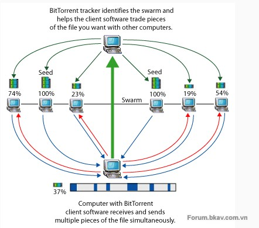{width="4.604166666666667in"
height="4.0625in"}

Scrape thực chất là lệnh ping mà các bác network man hay dùng, nếu nó
scrape thành công thì tracker chứa file torrent gốc đang hoạt động tốt
\[trừ bảo trì, nâng cấp, error..\] và scrape sẽ kiếm được thông tin về
cái file torrent gốc như seed, leech, peer, tracked by, upload date...

***5. DHT là gì?***

DHT có thể hiểu là một chức năng giúp bạn kết nối tới các máy khác nhanh
hơn, tải dữ liệu từ các máy đó mà ko cần thông qua tracker. Hầu hết các
public tracker đều có chức năng này, VT cũng vậy. Chức năng chỉ có một
nhược điểm duy nhất là dữ liệu up/down phần nào ko thông qua tracker nên
thông tin up/down trên Client (VD: Utorrent) khác với thông tin trên
tracker.\
\
DHT (Distributed Hash Table) là một lớp nằm trong hệ thống mạng p2p nó
chứa các giá trị và tên giống như một bảng Hash table \[bảng băm\] và
sẵn sàng cung cấp các thông tin này cho các User có bật DHT và tìm kiếm
cái Hash table đó, điều này sẽ giúp các User liên kết với nhau trên khắp
thế giới và khi tìm thấy cái file có cái bảng hash table đó nó sẽ tải về
máy mình.\
\
Cũng như các lớp \[layer\] khác của hệ thốg p2p, DHT hoạt động chính xác
100% chứ không có chuyện error khi ghép các mảnh dữ liệu với nhau cho dù
nó lấy từ rất nhiều người \[peer\] khác nhau.

{width="6.25in"
height="4.322916666666667in"}

***6. Port forwarding là gì?***

Khi chúng ta kết nối vào Internet thì có rất nhiều đường vận chuyển dữ
liệu khác nhau được sử dụng, máy vi tính sẽ âm thầm điều hành một cách
chính xác các công việc vận chuyển đó thông qua rất nhiều port khác
nhau. Các máy tính từ xa (máy vòng quanh thế giới trên internet ấy) sẽ
sử dụng Port forwarding để kết nối với một máy tính khác trong mạng LAN
và đây cũng chính là cách mà các chương trình Torrent sử dụng để chia sẻ
file giữa 2 máy tính với nhau nên ta còn gọi là peer to peer (PP)
sharing đó.

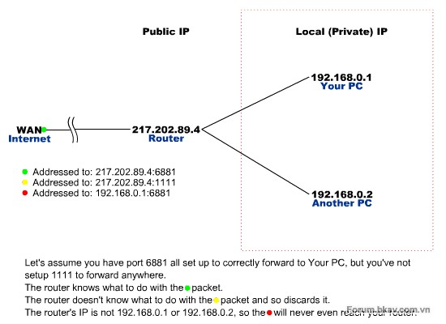{width="5.729166666666667in"
height="4.166666666666667in"}

***7. Tỉ lệ chia sẻ (Share Ratio)***

Tỉ lệ chia sẻ là tỉ lệ giữa dung lượng upload và download của bạn. Tỉ lệ
chấp nhận được là 1.000 trở lên, tỉ lệ này có nghĩa là dung lượng bạn đã
upload tương đương với dung lượng bạn đã download. Nếu dung lượng bạn
upload chưa bằng dung lượng bạn download, bạn đang làm ảnh hưởng đến
người khác. Ví dụ, nếu có càng nhiều người ngừng công việc upload ngay
sau khi họ upload được bằng nửa dung lượng họ download, như vây sẽ làm
chậm tốc độ chung của file torrent và làm cho file đó trở nên "chết" sớm
hơn so với khi mọi người có tỉ lệ chia sẻ cao.Một vài trang web Torrent
yêu cầu bạn đăng ký và đảm bảo tỉ lệ chia sẻ có thể sẽ giới hạn những
người không chịu upload hoặc cấm họ kết nối với tracker. Điều quan trọng
nhất: bạn hãy upload bằng dung lượng bạn download, đó là chính là chia
sẻ !.

***8. Những trang tìm kiếm Bit Torrent tốt nhất***

MiniNova.org (Đây là 1 trang Torrent miễn phí, MiniNova chưa phải là 1
cơ sở dữ liệu lớn. Nhưng nó có giao diện đáng tin cậy và sạch sẽ với
việc truy cập và tìm kiếm nhanh. Với thời gian cơ sở dữ liệu và số thành
viên của nó sẽ tăng lên.) \
\
Isohunt.com (Cũng là 1 trang Torrent miễn phí, Isohunt.com đánh bại sự
đe dọa của một đạo luật của MPAA. Chủ của trang này là 1 người tự do
thực sự, và đang tăng dần những biện hộ thuyết phục chống lại MPAA. Đọc
chi tiết tại trang chủ của Isohunt. Đây là 1 trang Torrent nổi tiếng, và
những người dùng mạng ngang hàng(P2P) đang cổ vũ khuyến khích cho những
hoạt động và thành công tiếp theo của nó.)\
\
Torrentspy.com (Đây là 1 trang Torrent miễn phí, Torrentspy cũng là 1
trang nổi tiếng với kích cỡ tổng thể, tốc độ, và thân thiện với người
dùng.)\
\
Torrentreactor.to (Torrentreactor làm nên 1 cuộc trở về từ một dịch vụ
hosting bất hợp tác và hijacking. Gần đây họ đã di chuyển tới một cấu
hình máy chủ khác và một tên miền nước Tonga ngoài Mỹ. Đọc chi tiết trên
trang chủ.Torrentreactor hiện tại là 1 website miễn phí.)\
\
Bi-Torrent.com (còn được biết đến với cái tên "VIP Torrents",
Bi-Torrent.com là 1 trang Torrent miễn phí với 1 giao diện Spartan và
định dạng tìm kiếm nhanh chóng.)\
\
Special mention: btefnet.net (cũng là 1 trang Torrent miễn phí,
btefnet.net chuyên về các file Torrent truyền hình. Với sự vắng mặt gần
đây của tv-swarm.com, btefnet.net là 1 trang tìm kiếm Ttorrent tốt nhất
hiện nay.)

***II. Một số phần mềm download-upload sử dụng giao thức torrent***

***1. BitTorrent: ***

*a) Giới thiệu chung:*

BitTorrent là phần mềm nguồn mở, do đó các nhà phát triển phần mềm có
thể tạo ra nhằm đáp ứng nhu cầu sử dụng Torrent, Việc tạo ra các file
Torrent để chia sẻ, upload, download…sẽ trở nên đơn giản hơn hi có sự
giúp đỡ của phần mềm này: 

{width="3.9270833333333335in"
height="2.34375in"}

*b) Hướng dẫn cài đặt: *

*c) Hướng dẫn sử dụng và tối ưu hóa:*

Sau khi cài xong trên Desktop sẽ xuất hiện biểu tượng của phần mềm, đầu
tiên ta kích vào để chạy phần mềm: 

{width="3.59375in"
height="2.7291666666666665in"}

Giao diện của chương trình: 

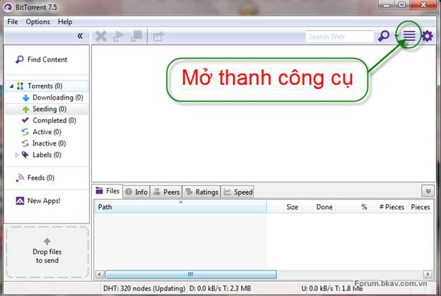{width="6.5in"
height="4.364583333333333in"}

Sẽ được như sau: 

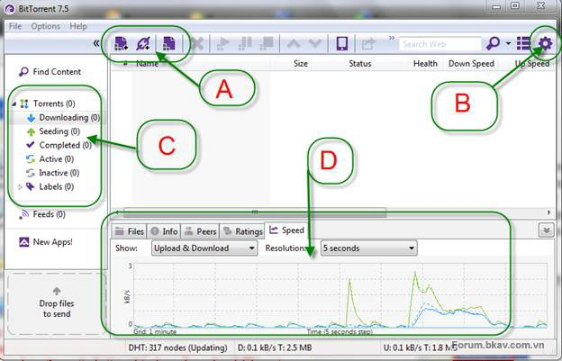{width="6.5in"
height="4.177083333333333in"}

A-Khu vực tạo file Torrent, mở file Torrent, tải file\
B-Khu vực tùy chọn cài đặt\
C-Hộp thư Download – Upload: Ta có thể biết các file đã tải(chia sẻ),
đang tải(chia sẻ), tạm dừng,…\
D-Khu vực thông tin về file (file, dung lượng, thông tin
upload,download..),\
Ngoài ra các bạn xuống dưới cùng sẽ thấy tốc độ upload,download.\
\
Thiết lập cấu hình: \
\
Tại giao diện chính bạn chọn biểu tượng bên góc trái hoặc
Options&gt;Preferences: 

{width="6.5in"
height="4.3125in"}

Tiếp đến, ở thẻ "General": 

{width="6.5in"
height="4.822916666666667in"}

-   Bạn chọn ngôn ngữ hiển thị ở vùng "2"

-   Thiết đặt khởi động cùng windows và thu nhỏ xuống phía dưới ở vùng
    "3"

-   Cài đặt update version ở vùng "4"

{width="6.5in"
height="4.833333333333333in"}

Tại cửa sổ Connection, gồm có: \
\
- **Proxy Server:**

-   Type: Loại Proxy (HTTP, HTTPS, SOCK4, SOCK5)

-   Proxy: Nhập Proxy vào

-   Port: Cổng của Proxy

-   Authentication: Đánh dấu vào mục này nếu Proxy của bạn yêu cầu tên
    đăng nhập và mật khẩu

-   Use proxy server for peer-to-peer connections: Sử dụng Proxy cho các
    kết nối P2P

- **Port used for incomming connections**: là cổng mà µTorrent sẽ\
dùng để kết nối. Bạn hãy dùng các cổng có số lớn trên 10000 để tránh bị
trùng cổng với các chương trình khác\
\
-**Add µtorrent to Windows Firewall exceptions**: không đánh dấu (Chỉ
đánh dấu mục này nếu chương trình bị chặn bởi Firewall)

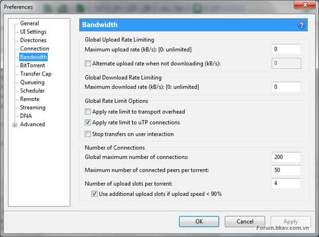{width="6.5in"
height="4.833333333333333in"}

Tại cửa sổ Bandwidth, gồm có:

-   **Global Maximum upload rate (kb/s): **Tốc độ upload cao nhất
    có thể. Bạn nên thiết lập bằng 80% tốc độ upload thực tế của bạn.
    Mình để "0" (không giới hạn), ngoài ra còn có tốc độ giới hạn upload
    khi đang download ở dòng dưới, bạn nên cân nhắc để lựa chọn hợp lý!

-   **Global Maximum download rate (kb/s): **Tốc độ download cao nhất
    có thể. Bạn nên thiết lập bằng 90% tốc độ download thực tế của bạn,
    mình để ở "0" (không giới hạn)

-   **Global Maximum Number of Connections: **Mặc định

-   **Các thông số khác bạn chọn như hình hướng dẫn ở trên**

{width="6.5in"
height="4.822916666666667in"}

Tiếp đến ở cửa sổ BitTorrent bạn thiết lập các thông số như trên.\
\
-Ngoài ra bạn cũng có thể thiết lập thêm các thông số cá nhân khác như: 

{width="6.5in"
height="4.875in"}

- Giới hạn dung lượng sử dụng trong 1 khoảng thời gian, và xem lịch sử
đã dùng.

{width="6.5in"
height="4.833333333333333in"}

- Như vậy có lẽ là đủ các thiết đặt cần thiết cho việc download

{width="6.5in"
height="4.854166666666667in"}

-Nhấn "Apply" để áp dụng các thiết đặt, sau đó nhấn OK.\
-Nhiều khi bạn download 1 file tốn nhiều thời gian mà bạn không thể ngồi
chờ đến khi xong để tắt máy hay để máy tính ngủ. Đừng lo! Tại giao diện
chính bạn vào "Options -&gt; Auto shutdown (mục dưới cùng) " và thiết
lập cho máy tính của mình tự động làm các công việc cần thiết khi
download xong.\
\
Hướng dẫn download file \*.torrent bằng: BitTorrent\
\
Khi bạn tìm kiếm và download từ trên mạng hoặc bạn bè bạn chia sẻ file
torrent chẳng hạn thì bạn sẽ làm thế nào để tải nó về.\
\
Sau đây mình sẽ ví dụ về download film có link torrent để các bạn tham
khảo.\
\
+ Cách 1: Bạn chọn chuột phải vào file torrent ở trên mạng và chọn "Copy
link location"

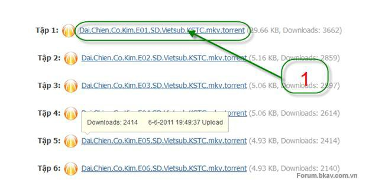{width="6.5in"
height="3.28125in"}

Sau đó tại giao diện BitTorrent bạn chọn: 

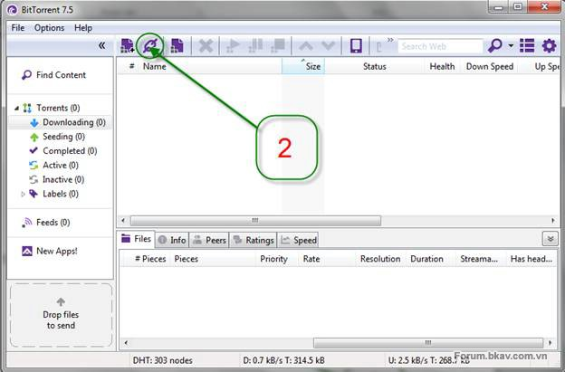{width="6.5in"
height="4.28125in"}

Tiếp đến: 

{width="6.5in"
height="4.291666666666667in"}

Tiếp đến chọn nơi lưu file và nhấn OK

{width="6.5in"
height="4.270833333333333in"}

Và quá trình download bắt đầu: 

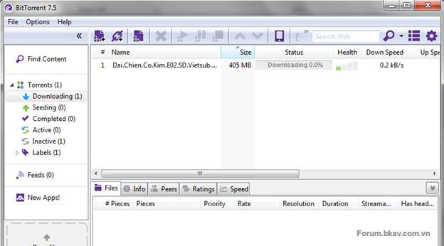{width="6.5in"
height="3.6041666666666665in"}

+ Cách 2: Bạn hãy yên tâm kích vào đó để save file torrent đó về máy
tính của bạn dưới dạng file \*.torrent (file này chỉ là dữ liệu chứa
thông tin download) 

{width="6.5in"
height="3.28125in"}

Để download nó về bạn hãy mở nó bằng chương trình BitTorrent: \
\
Tại giao diện chính của BitTorrent bạn chọn: 

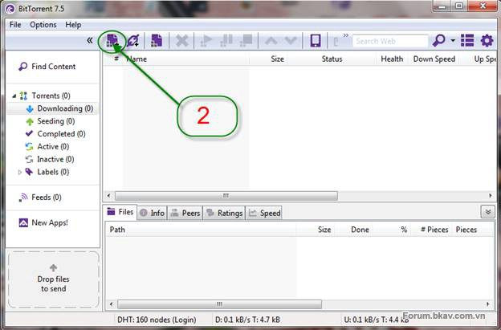{width="6.5in"
height="4.28125in"}

Tiếp đến bạn chọn cái file.torrent mà chúng ta vừa tải về

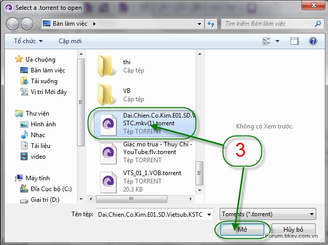{width="6.65625in"
height="4.96875in"}

Tiếp đến: 

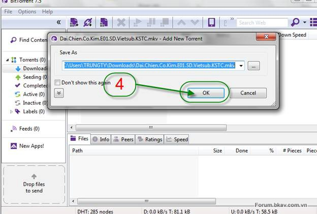{width="6.5in"
height="4.385416666666667in"}

Tiếp đến bạn sẽ thấy chương trình bắt đầu download file của bạn rồi đó!

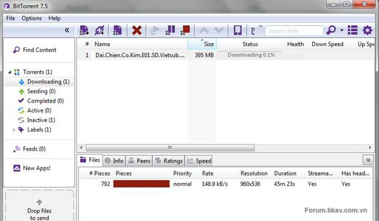{width="6.5in"
height="3.7916666666666665in"}

Down xong bạn save lại là có file cần down rồi đó! Chúc bạn thành
công!!!\
\
Hướng dẫn tạo file \*.torrent để chia sẻ cho bạn bè trên mạng Torrent
bằng: BitTorrent\
\
Tại giao diện chính của phần mềm bạn chọn "Sedding" sau đó chọn "Creat
new torrent"

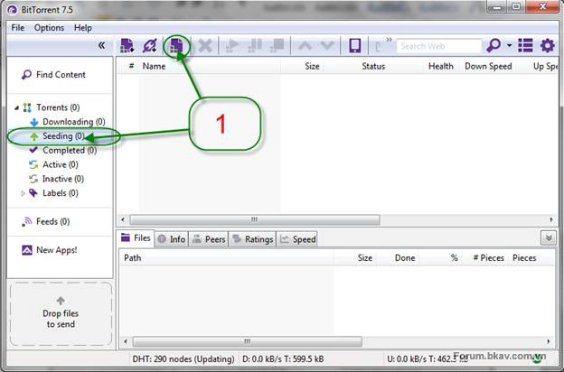{width="6.5in"
height="4.291666666666667in"}

Tiếp đến

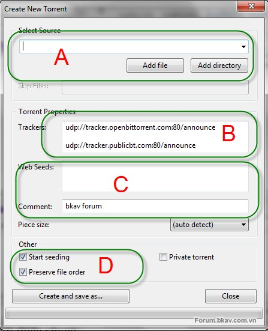{width="4.65625in"
height="5.739583333333333in"}

Gồm có:

-   "A": khu vực chọn file(folder) từ máy tính của bạn

-   "B": Khu vực Tracker upload (download)

-   "C": Khu vực thông tin thêm

-   "D": Khu vực cài đặt sau khi tạo xong file.torrent

Các bạn thiết lập như sau: \
\
Đầu tiên chọn "Add file" hay "Add directory" để thêm file hay folder: 

{width="4.666666666666667in"
height="5.71875in"}

Ở đây mình sẽ thêm file, tiếp đến: 

{width="6.520833333333333in"
height="5.114583333333333in"}

Bạn chọn file trong máy tính của bạn và nhấn "open- mở"

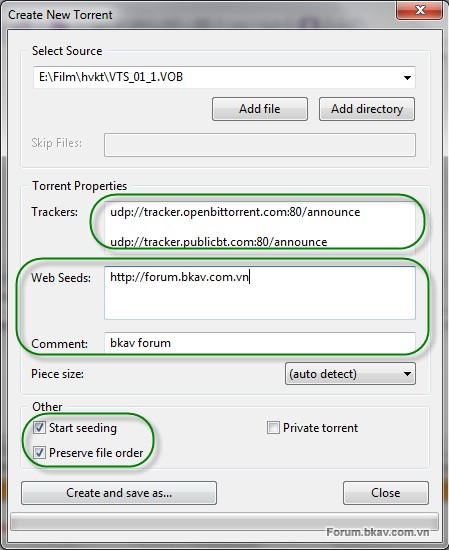{width="4.677083333333333in"
height="5.729166666666667in"}

Bạn thiết lập như mình đây:

-   Tracker: mình để Tracker mặc định của phần mềm, bạn cũng có thể thay
    bằng các Tracker khác như:

    -   <http://tracker.prq.to/announce>

    -   [http://inferno.demonoid.com:
        3389/announce](http://inferno.demonoid.com:%203389/announce)

    -   <http://tracker.bt-chat.com/announce>

    -   [http://tracker.zerotracker.com:
        2710/announce](http://tracker.zerotracker.com:%202710/announce)

<!-- -->

-   Phía dưới là thông tin thêm về file(không ảnh hưởng gì tới file của
    chúng ta)

-   Tích vào 2 checkbox ở phía cuối để thực hiện chia sẻ ngay khi tạo
    thành công!

Tiếp đến bạn nhấn "Creat and save as…" để tạo file

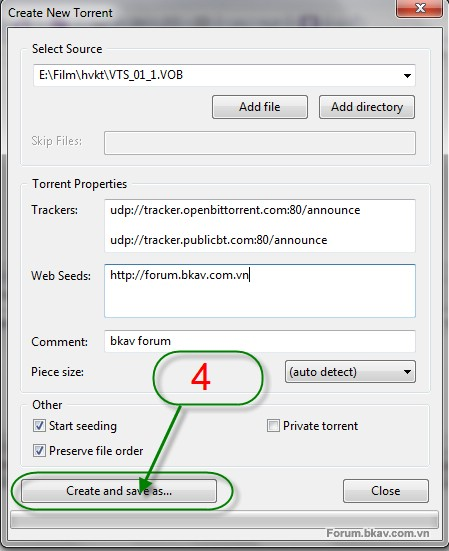{width="4.677083333333333in"
height="5.739583333333333in"}

Quá trình tạo file thành công bạn nhấn "Save – lưu", chọn vị trí và lưu
file torrent mà ta vừa tạo

{width="6.65625in"
height="4.96875in"}

Tiếp đến

{width="4.666666666666667in"
height="5.697916666666667in"}

Và bây giờ trở lại giao diện chính các bạn sẽ thấy rằng file của chúng
ta đang "Sedding": chia sẻ.

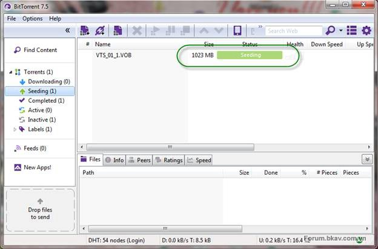{width="6.5in"
height="4.291666666666667in"}

Bây giờ bạn sẽ có 2 sự lựa chọn: \
\
+ Một là chia sẻ cho bạn bè của bạn bằng cách gửi file \*.torrent vừa
tạo cho họ để họ tải về (Với điều kiện bạn không được tắt file đang chia
sẻ kia đi), đây là hình thức chia sẻ trực tiếp.\
\
+ Hai là bạn upload lên Tracker để họ tải về từ đó, đây là hình thức
chia sẻ gián tiếp\
\
Với hình thức trực tiếp thì bạn cứ để như vậy rồi bằng cách nào
đó(yahoo, mediafire,…) gửi cho họ cái file \*.torrent mà bạn vừa save đó
để họ tải về chia sẻ của bạn\
\
Với hình thức còn lại bạn truy cập trực tiếp vào địa chỉ
web: [http://thepiratebay.org](http://thepiratebay.org/)hoặc [www.torrentbox.com](http://www.torrentbox.com/)\
\
Giả sử bạn dùng
trang [http://thepiratebay.org](http://thepiratebay.org/) để upload\
\
Đầu tiên bạn hãy đăng ký 1 tài khoản tại đó, sau khi đăng nhập thành
công\
\
Bạn chọn "Browse Torrents" tiếp đên chọn "Upload Torrent"

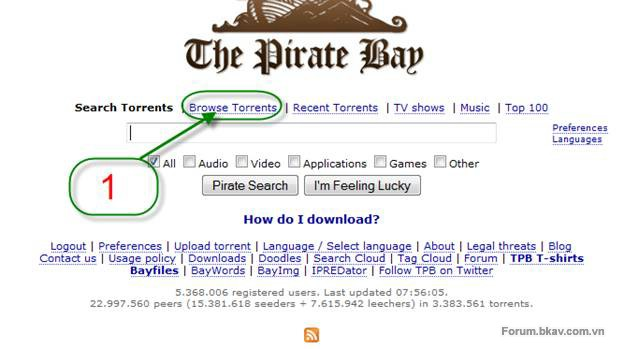{width="6.5in"
height="3.6354166666666665in"}

Tiếp đến: 

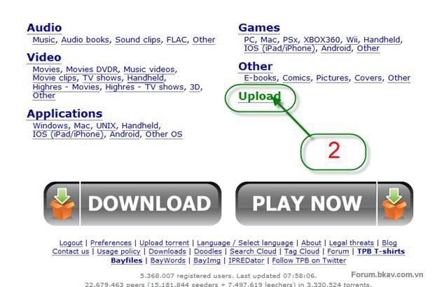{width="6.5in"
height="4.270833333333333in"}

Tiếp đến: 

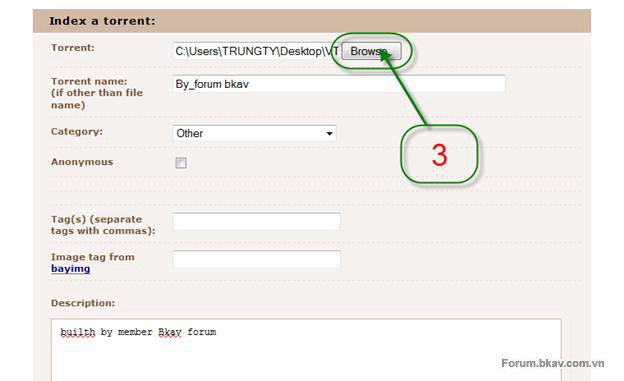{width="6.5in"
height="3.96875in"}

Bạn chọn file thiết lập các thông số cần thiết sau đó nhập mã vào sau đó
nhấn "Add to index"

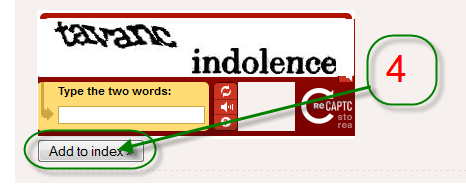{width="4.854166666666667in"
height="1.9166666666666667in"}

Cuối cùng bạn cần download file torrent của chính mình để hoàn tất việc
chia sẻ: 

{width="6.5in"
height="4.479166666666667in"}

Nhấn vào vùng trên để download file torrent về và mở bằng trình download
torrent của bạn. bạn cũng có thể coment ở phía dưới. \
\
Như vậy là việc tạo và chia sẻ torrent đã thành công rồi!\
\
Chúc bạn thành công!!!\
\
Hướng dẫn tối ưu hóa để tốc độ download – upload được nhanh hơn: \
\
Các bạn sẽ thấy rằng khi ta chạy chương trình để download hay upload sẽ
có thể xảy ra hiện tượng trùng "Listen Port" (cổng nghe) dẫn tới trường
hợp download sẽ bị chậm lại. Dấu hiệu để bạn nhận ra là dưới góc phải
phía dưới của phần mềm xuất hiện dấu chấm than "!"

{width="6.5in"
height="4.041666666666667in"}

Để không bị trùng cổng nghe thì bạn hãy vào phần thiết lập cấu hình như
mình hướng dẫn ở trên và chỉnh lại bằng cách chọn lại cổng nghe, bạn nên
chọn lớn hơn 10000 để tránh bị trùng cổng. khi nao có dấu chữ "V" màu
xanh thay cho "!" là Ok!

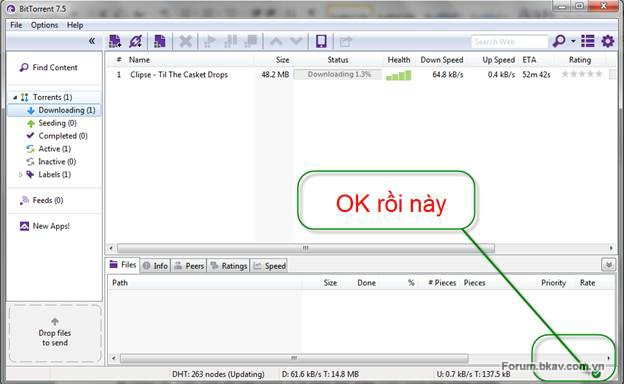{width="6.5in"
height="4.0in"}

Các bạn nên chú ý là lúc đầu có thể tốc độ sẽ chậm, sau đó sẽ tăng dần
nhé!

*d) Nhận xét ưu nhược điểm:*

*+ Ưu điểm: gọn nhẹ, dễ sử dụng, tốc độ ổn định. Cài đặt tối ưu hóa và
nâng cao dễ dàng*\
*+ Khuyết điểm: chỉ dùng để download file \*.torrent, tốc độ phụ thuộc
nhiều vào giao tức torrent và tracker*

***2. uTorrent:***

*a, Giới thiệu chung:*

Cũng như BitTorrent thì uTorrent cũng là phần mềm hỗ trợ download,upload
chia sẻ các file đuôi \*.torrent trên mạng Torrent. uTorren là phần mềm
nhỏ gọn và có giao diện rất dễ sử dụng

{width="2.34375in"
height="2.34375in"}

*b, Hướng dẫn cài đặt*

Chuẩn bị: \
Tải bộ cài uTorrent tại địa
chỉ: <http://download.utorrent.com/3.0/utorrent.exe>\
Trang chủ: [http://www.utorrent.com](http://www.utorrent.com/)\
Tiến hành cài đặt: \
Sau khi tải về các bạn kích vào file "uTorrent.exe" để tiến hành cài
đặt, tương tự như BitTorrent

{width="4.260416666666667in"
height="2.3854166666666665in"}

Tiếp đến nhấn Next

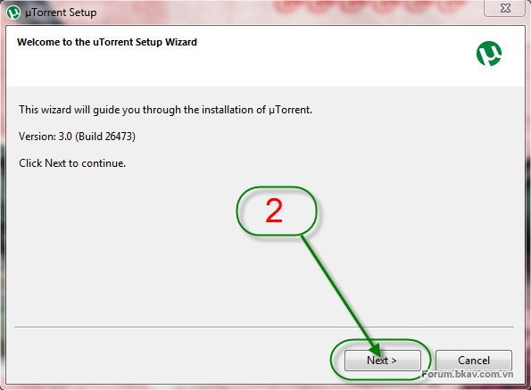{width="6.197916666666667in"
height="4.552083333333333in"}

Tiếp theo

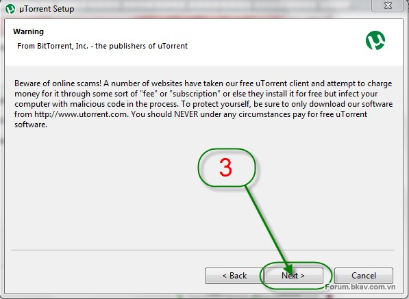{width="6.21875in"
height="4.552083333333333in"}

Tiếp đến nhấn "I Agree"

{width="6.229166666666667in"
height="4.59375in"}

Tiếp theo như hình hướng dẫn: 

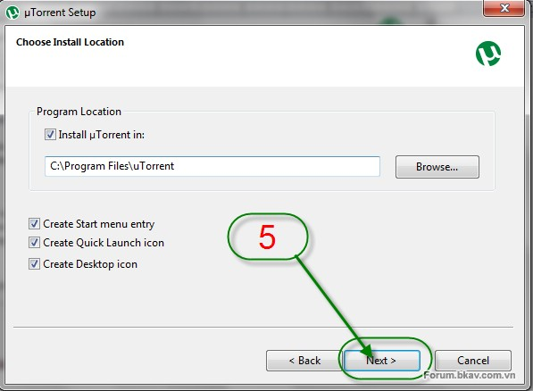{width="6.21875in"
height="4.5625in"}\
\
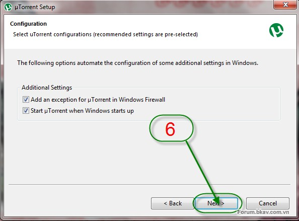{width="6.1875in"
height="4.572916666666667in"}

Cuối cùng nhấn "Install" để tiến hành hoàn tất cài đặt: 

{width="6.197916666666667in"
height="4.520833333333333in"}

Chờ quá trình cài đặt hoàn tất là có thể sử dụng!!!

*c, Hướng dẫn sử dụng và tối ưu hóa:*

Sau khi cài xong trên Desktop sẽ xuất hiện biểu tượng của phần mềm, đầu
tiên ta kích vào để chạy phần mềm: 

{width="4.208333333333333in"
height="2.9479166666666665in"}

*Giao diện của phần mềm như sau: *

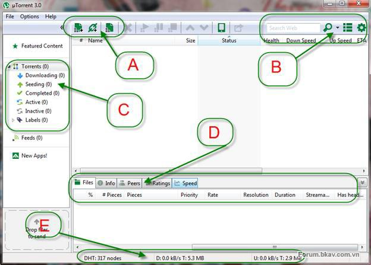{width="6.5in"
height="4.65625in"}

*Tương tự như BitTorrent cũng gồm có các phân vùng: *\
*A-Vùng tạo mới, mở và download file \*.torrent*\
*B-Vùng tìm kiếm và chỉnh sửa cài đặt*\
*C-Hộp thư download và upload, tạm dừng….*\
*D- Vùng thông tin file download, upload*\
*E- Tốc độ download, upload.*\
Thiết lập cấu hình: \
Tại giao diện chính bạn chọn biểu tượng bên góc trái hoặc
Options&gt;Preferences: 

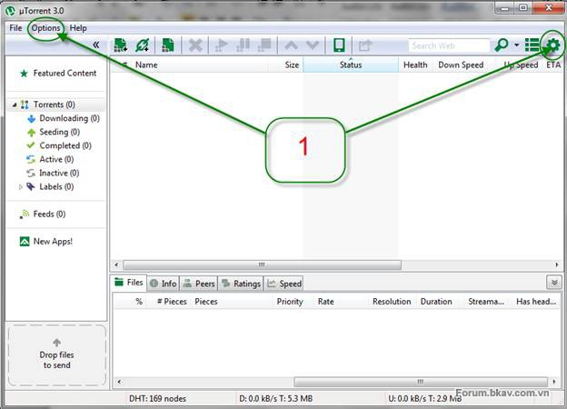{width="6.5in"
height="4.6875in"}

Sẽ được như sau: 

{width="6.5in"
height="4.833333333333333in"}

Tại cửa sổ Connection, gồm có:

-   **Proxy Server:**

    -   Type: Loại Proxy (HTTP, HTTPS, SOCK4, SOCK5)

    -   Proxy: Nhập Proxy vào

    -   Port: Cổng của Proxy

    -   Authentication: Đánh dấu vào mục này nếu Proxy của bạn yêu cầu
        tên đăng nhập và mật khẩu

    -   Use proxy server for peer

    -   to

    -   peer connections: Sử dụng Proxy cho các kết nối P2P

<!-- -->

-   **Port used for incomming connections**: là cổng mà µTorrent sẽ\
    dùng để kết nối. Bạn hãy dùng các cổng có số lớn trên 10000 để tránh
    bị trùng cổng với các chương trình khác

-   **Add µtorrent to Windows Firewall exceptions**: không đánh dấu (Chỉ
    đánh dấu mục này nếu chương trình bị chặn bởi Firewall)

{width="6.5in"
height="4.833333333333333in"}

Tại cửa sổ Bandwidth, gồm có:

-   **Global Maximum upload rate (kb/s): **Tốc độ upload cao nhất
    có thể. Bạn nên thiết lập bằng 80% tốc độ upload thực tế của bạn.
    Mình để "0" (không giới hạn), ngoài ra còn có tốc độ giới hạn upload
    khi đang download ở dòng dưới, bạn nên cân nhắc để lựa chọn hợp lý!

-   **Global Maximum download rate (kb/s): **Tốc độ download cao nhất
    có thể. Bạn nên thiết lập bằng 90% tốc độ download thực tế của bạn,
    mình để ở "0" (không giới hạn)

-   **Global Maximum Number of Connections: **Mặc định

-   **Các thông số khác bạn chọn như hình hướng dẫn ở trên**

{width="6.5in"
height="4.822916666666667in"}

Tiếp đến ở cửa sổ BitTorrent bạn thiết lập các thông số như trên.\
Ngoài ra bạn cũng có thể thiết lập thêm các thông số cá nhân khác như: 

{width="6.5in"
height="4.875in"}

Giới hạn dung lượng sử dụng trong 1 khoảng thời gian, và xem lịch sử đã
dùng.

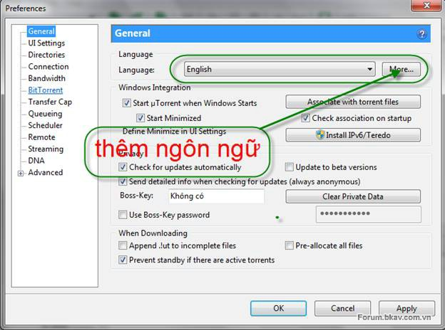{width="6.5in"
height="4.833333333333333in"}

Bạn cũng có thể cài thêm ngôn ngữ hiển thị và thay đổi nếu muốn (với
điều kiện version mà bạn đang dùng đã hỗ trợ trên trang chủ), bạn chọn
more để tải thêm ngôn ngữ cho phần mềm, Version mình đang giới thiệu
không có tiếng việt nên mình để mặc định là tiếng anh.

{width="6.5in"
height="4.833333333333333in"}

Như vậy có lẽ là đủ các thiết đặt cần thiết cho việc download

{width="6.5in"
height="4.854166666666667in"}

Nhấn "Apply" để áp dụng các thiết đặt, sau đó nhấn OK.\
Nhiều khi bạn download 1 file tốn nhiều thời gian mà bạn không thể ngồi
chờ đến khi xong để tắt máy hay để máy tính ngủ. Đừng lo! Tại giao diện
chính bạn vào "Options -&gt; Auto shutdown (mục dưới cùng) " và thiết
lập cho máy tính của mình tự động làm các công việc cần thiết khi
download xong.\
Hướng dẫn download file \*.torren bằng uTorrent\
Tương tự như BitTorrent, để download ta cũng có 2 cách: \
+ Cách 1: Bạn chọn chuột phải vào file torrent ở trên mạng và chọn "Copy
link location"

{width="6.5in"
height="3.28125in"}

Sau đó tại giao diện uTorrent bạn chọn: 

{width="6.5in"
height="4.75in"}

Tiếp đến: 

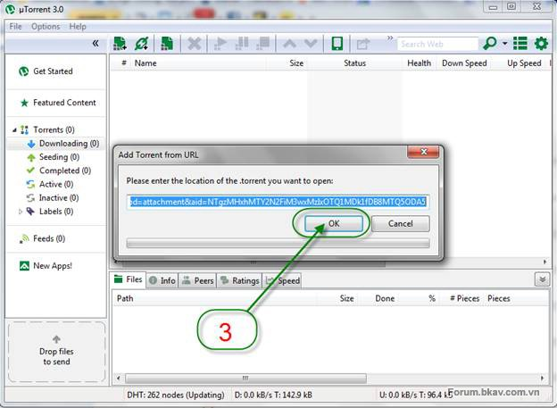{width="6.5in"
height="4.760416666666667in"}

Tiếp đến chọn nơi lưu file và nhấn OK: 

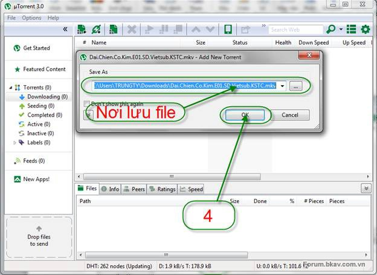{width="6.5in"
height="4.739583333333333in"}

Và quá trình download bắt đầu: 

{width="6.5in"
height="4.177083333333333in"}

+ Cách 2: Bạn hãy yên tâm kích vào đó để save file torrent đó về máy
tính của bạn dưới dạng file \*.torrent (file này chỉ là dữ liệu chứa
thông tin download) 

{width="6.5in"
height="3.28125in"}

Để download nó về bạn hãy mở nó bằng chương trình uTorrent: \
Tại giao diện chính của uTorrent bạn chọn: 

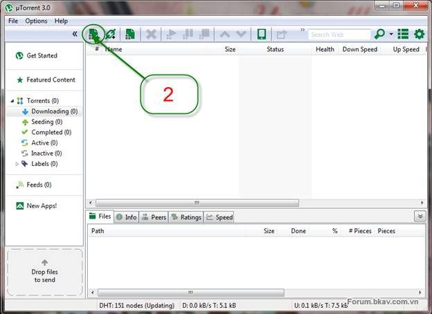{width="6.5in"
height="4.729166666666667in"}

Tiếp đến bạn chọn cái file.torrent mà chúng ta vừa tải về

{width="6.5in"
height="4.71875in"}

Tiếp đến: 

{width="6.5in"
height="4.739583333333333in"}

Tiếp đến bạn sẽ thấy chương trình bắt đầu download file của bạn rồi đó!

{width="6.5in"
height="4.0625in"}

Chúc bạn thành công!!!\
\
\
\
Hướng dẫn tạo file \*.torrent để chia sẻ cho bạn bè trên mạng Torrent
bằng uTorrent\
Tại giao diện chính của phần mềm bạn chọn "Sedding" sau đó chọn "Creat
new torrent"

{width="6.5in"
height="4.78125in"}

Tiếp đến

{width="4.65625in"
height="5.739583333333333in"}

Gồm có:

-   "A": khu vực chọn file(folder) từ máy tính của bạn

-   "B": Khu vực Tracker upload (download)

-   "C": Khu vực thông tin thêm

-   "D": Khu vực cài đặt sau khi tạo xong file.torrent

Các bạn thiết lập như sau: \
Tiếp đến chọn "Add file" hay "Add directory" để thêm file hay folder: 

{width="4.666666666666667in"
height="5.71875in"}

Quá trình làm tiếp tục tương tự như BitTorrent nên mình sẽ không giới
thiệu lại, các bạn hãy tham khảo ở phần trên, chỉ khác là: thay vì
BitTorrent thì giờ là uTorrent vì chúng có giao diện và cách sử dụng khá
giống nhau\
\
Hướng dẫn tối ưu hóa để tốc độ download – upload được nhanh hơn: \
\
Các bạn cũng làm tương tự như với BitTorrent (mình đã giới thiệu ở
trên)\
\
Chúc các bạn thành công!!!

*d) Nhận xét ưu khuyết điểm:*

-   *Ưu điểm: rất gọn nhẹ và dễ sử dụng, được nhiều người sử dụng*

-   *Nhược điểm: Giống như BitTorrent*

***3. BitComet: ***

*a) Giới thiệu chung:*

BitComet là chương trình BitTorrent được viết bằng ngôn ngữ lập trình
C++. Nó có rất nhiều tính năng mà chương trình BitTorrent gốc không có
và có khả năng tìm kiếm tài nguyên, khả năng download, chia sẻ file rất
nhanh và đơn giản. Giao diện đơn giản và dễ sử dụng

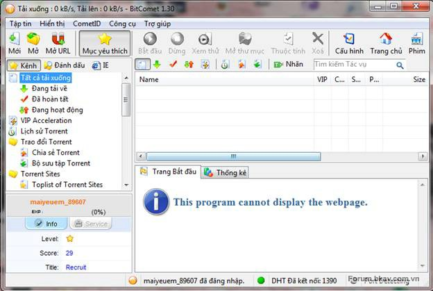{width="6.5in"
height="4.364583333333333in"}

*b) Hướng dẫn cài đặt: *

c) *Hướng dẫn sử dụng và tối ưu hóa:*

Sau khi cài xong trên Desktop sẽ xuất hiện biểu tượng của phần mềm, đầu
tiên ta kích vào để chạy phần mềm: 

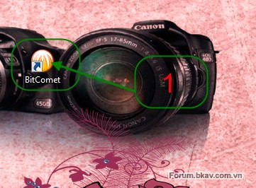{width="3.7604166666666665in"
height="2.7708333333333335in"}

Giao diện của chương trình: 

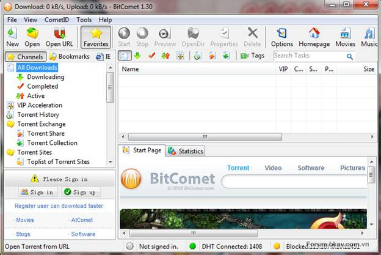{width="6.5in"
height="4.34375in"}

Bao gồm có: 

{width="6.510416666666667in"
height="4.0625in"}

-   "A": Khu vực chọn tác vụ download

-   "B": Hộp thư download

-   "C": Khu vực thiết lập cấu hình và tìm kiếm nhanh movies, Music,..
    và truy cập nhanh forum

-   "D": Khu vực tài khoản

-   "E": Khu vực thông tin file khi download

-   "F": Khu vực miền tìm kiếm nhanh

Thiết lập cấu hình: \
Bạn có thể tạo 1 tài khoản cho mình bằng cách chọn: 

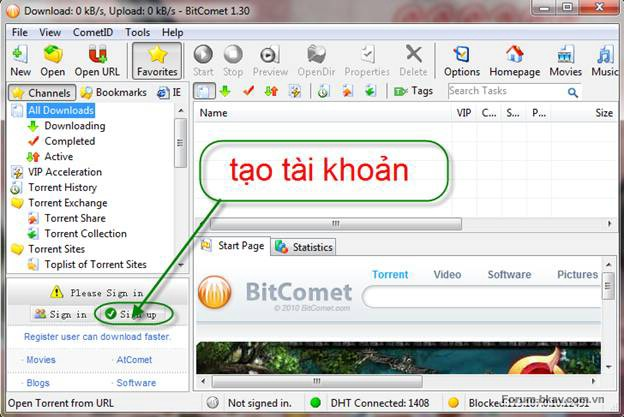{width="6.5in"
height="4.34375in"}

Sau đó làm theo hướng dẫn để tạo tài khoản, sau khi đăng nhập tài khoản
trên phần mềm sẽ có giao diện như sau: 

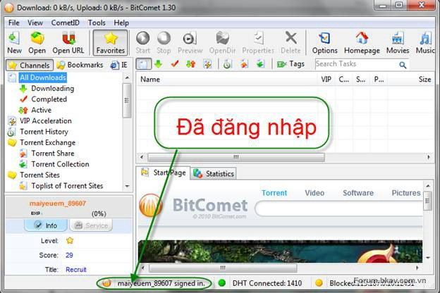{width="6.5in"
height="4.333333333333333in"}

Để thiết lập cấu hình bạn chọn: 

{width="6.5in"
height="4.395833333333333in"}

Thiết lập kết nối "Connection"

{width="6.5in"
height="4.197916666666667in"}

-   "A": Thiết lập Giới hạn download, upload\
    Mình sẽ để ở "Unlimit" (không giới hạn)

-   "B": Thiết lập cổng kết nối (cổng nghe) giúp tăng tốc độ kết nối\
    Bạn có thể chọn ngẫu nhiên bằng cách nhấn vào "Choose Random Port"\
    Để tối ưu nó mình sẽ hướng dẫn ở phần sau

-   "C": Cài đặt các cho phép qua tường lửa và kết nối mạng của Windows

Thiết lập tương tự như với BitTorrent và uTorrent\
\
Tiếp đến là thiết lập proxy (nếu mạng của bạn có đặt kết nối proxy)

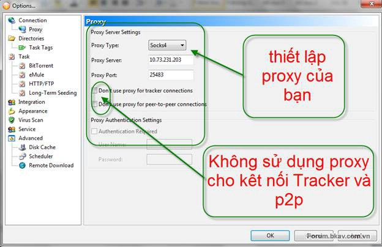{width="6.5in"
height="4.208333333333333in"}

Tiếp đến là nơi lưu file tải về: bạn có thể tùy chỉnh sâu hơn trong Task
Tags

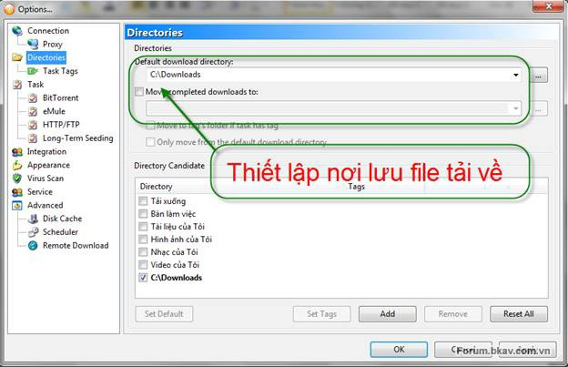{width="6.5in"
height="4.197916666666667in"}

Tiếp đến là cửa sổ "Task"

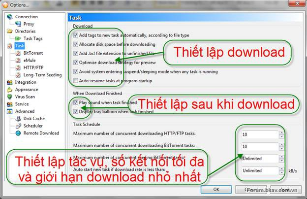{width="6.5in"
height="4.208333333333333in"}

Tiếp đến là các thiết lập cá nhân: "Integration"

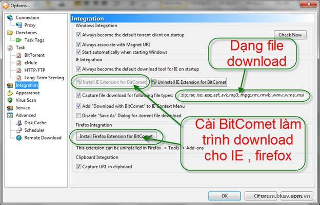{width="6.5in"
height="4.177083333333333in"}

Tại cửa sổ Virus Scan: 

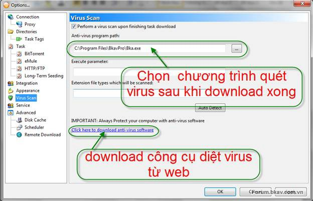{width="6.5in"
height="4.177083333333333in"}

Tại cửa sổ Service: 

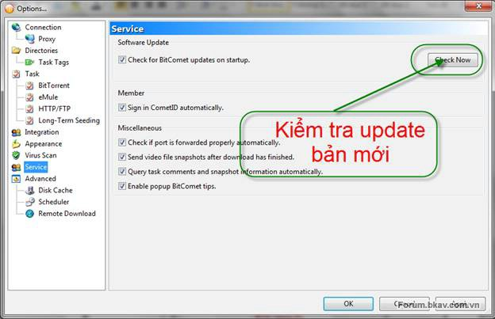{width="6.5in"
height="4.197916666666667in"}

Cửa sổ Advanced: bao gồm các thiết lập nâng cao: 

{width="6.5in"
height="4.208333333333333in"}

Sau khi thiết lập xong nhấn "Apply" + "OK" để hoàn tất quá trình thiết
lập cấu hình: 

{width="6.5in"
height="4.208333333333333in"}

Bản BitComet này đã tích hợp tiếng việt, nếu bạn thích thì chọn như
sau: \
Tool -&gt; Language -&gt; Others -&gt; Vietnamese (việt nam)\
Và sẽ được như sau: 

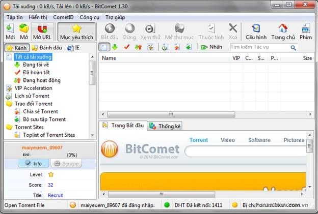{width="6.5in"
height="4.385416666666667in"}

Hướng dẫn download file \*.torrent bằng: BitComet\
Bạn cũng có 2 cách để down file torrent tương tự như BitTorrent và
uTorrent\
+ Cách 1: Bạn chọn chuột phải vào file torrent ở trên mạng và chọn "Copy
link location" (nếu trình duyệt đã tích cài BitComet như trên thì có thể
chọn "Download with BitComet sau khi nhấn phải chuột)

{width="6.5in"
height="3.28125in"}

Sau đó tại giao diện BitTorrent bạn chọn: 

{width="6.5in"
height="4.385416666666667in"}

Tiếp đến: 

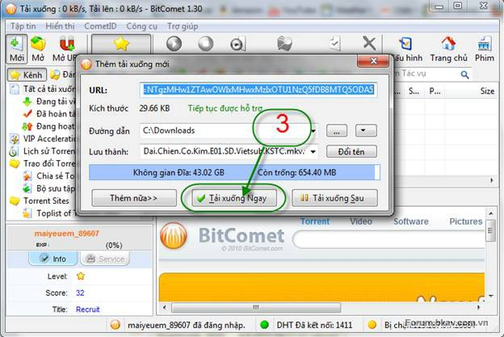{width="6.5in"
height="4.34375in"}

Bạn có thể chọn tải xuống sau nếu đang tải nhiều rồi và muốn tải sau\
Mình sẽ chọn tải xuống ngay, tiếp đến: 

{width="6.5in"
height="4.135416666666667in"}

Chọn nơi lưu file và nhấn tải xuống ngay.\
Nếu xuất hiện cửa sổ kiểm tra thì bạn hãy chọn: 

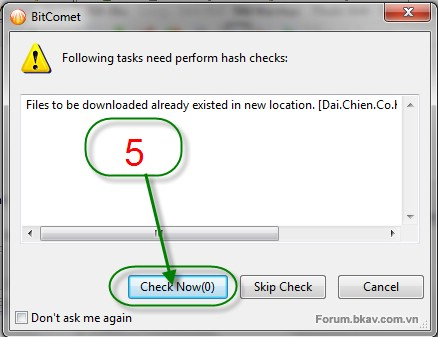{width="4.5625in"
height="3.5104166666666665in"}

Còn không thì không có bước đó và giao diện download như sau: 

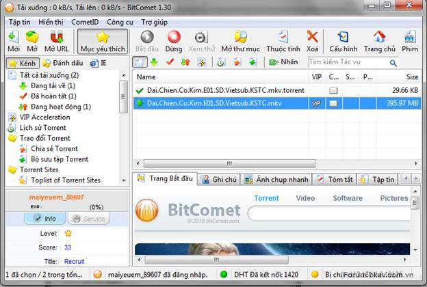{width="6.5in"
height="4.375in"}

+ Cách 2: Bạn hãy yên tâm kích vào đó để save file torrent đó về máy
tính của bạn dưới dạng file \*.torrent (file này chỉ là dữ liệu chứa
thông tin download) 

{width="6.5in"
height="3.28125in"}

Để download nó về bạn hãy mở nó bằng chương trình BitTorrent: \
Tại giao diện chính của BitComet bạn chọn: 

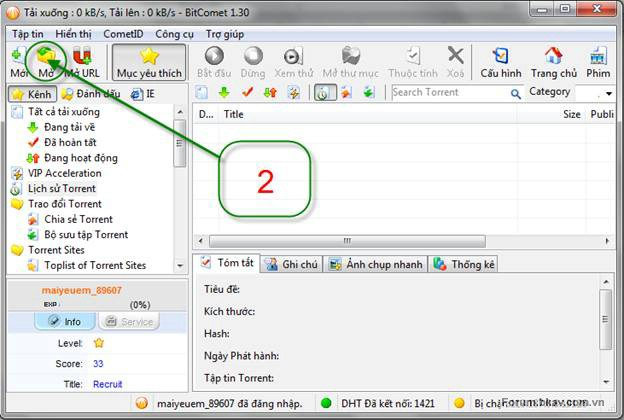{width="6.5in"
height="4.375in"}

Tiếp đến bạn chọn nơi lưu file vừa tải về và mở nó: 

{width="5.958333333333333in"
height="4.375in"}

Tiếp đến: 

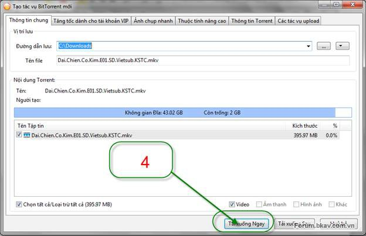{width="6.5in"
height="4.197916666666667in"}

Tiếp đến bạn sẽ thấy chương trình bắt đầu download file của bạn rồi đó!

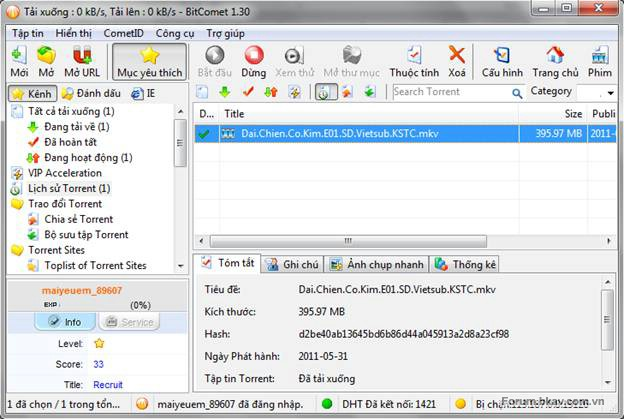{width="6.5in"
height="4.364583333333333in"}

Chúc bạn thành công!!!\
\
Hướng dẫn tạo file \*.torrent để chia sẻ cho bạn bè trên mạng Torrent
bằng: BitComet\
Tại giao diện chính của phần mềm bạn chọn "Tập tin" sau đó chọn "tạo
torrent", hoặc dùng phím tắt "Ctrl+M"

{width="6.5in"
height="4.34375in"}

Bạn sẽ thấy: 

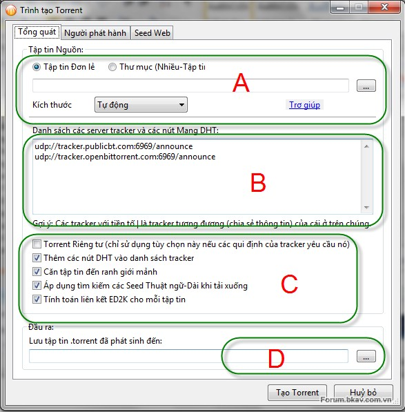{width="6.114583333333333in"
height="6.21875in"}

Gồm có:

-   "A": vùng chọn tệp tin từ máy tính

-   "B": vùng Tracker, mình để mặc định của phần mềm

-   "C": vùng thiết lập cá nhân

-   "D": vùng chọn nơi lưu tệp tin \*.torrent sau khi tạo xong

Ta sẽ tiến hành chọn file: 

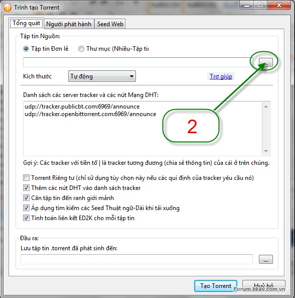{width="6.125in"
height="6.177083333333333in"}

Tiếp đến chọn file(folder) để tạo file torrent: 

{width="5.958333333333333in"
height="4.40625in"}

Tiếp đến, mình sẽ để tracker mặc định của phần mềm, bạn cũng có thể thay
bằng các tracker như: \
<http://tracker.prq.to/announce>\
[http://inferno.demonoid.com:
3389/announce](http://inferno.demonoid.com:%203389/announce)\
<http://tracker.bt-chat.com/announce>\
[http://tracker.zerotracker.com:
2710/announce](http://tracker.zerotracker.com:%202710/announce)\
chỉ cần 1 tracker là đủ.\
Bạn sẽ cá nhân file của ta như sau: 

{width="6.145833333333333in"
height="6.177083333333333in"}

Thiết lập xong ta tạo file torrent: 

{width="6.125in"
height="6.166666666666667in"}

Chờ quá trình tạo file torrent xong bạn sẽ thấy file của mình bắt đầu
chia sẻ: 

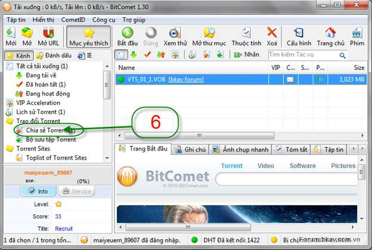{width="6.5in"
height="4.375in"}

Kích chuột vào chữ bắt đầu để bắt đầu chia sẻ: 

{width="6.5in"
height="4.354166666666667in"}

Bạn cũng có thể xem thông tin về file mà mình đang chia sẻ bằng cách:
kích chuột phải vào file và chọn: 

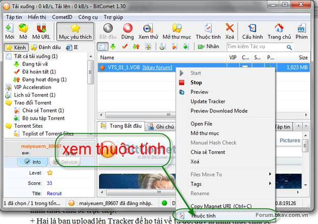{width="6.5in"
height="4.583333333333333in"}

Bạn sẽ thấy như sau: 

{width="6.5in"
height="4.177083333333333in"}

Chọn đồng ý để đóng lại nhé!\
Bây giờ bạn sẽ có 2 sự lựa chọn: \
+ Một là chia sẻ cho bạn bè của bạn bằng cách gửi file \*.torrent vừa
tạo cho họ để họ tải về (Với điều kiện bạn không được tắt file đang chia
sẻ kia đi), đây là hình thức chia sẻ trực tiếp.\
+ Hai là bạn upload lên Tracker để họ tải về từ đó, đây là hình thức
chia sẻ gián tiếp\
Cả 2 lựa chọn này đều tương tự như BitTorrent và uTorrent mình đã nêu ở
trên nên sẽ không giới thiệu lại. Các thao tác các bạn làm tương tự như
ở trên chỉ khác là thay bằng BitTorrent, uTorrent thì đây là BitComet
thôi.\
Chúc bạn thành công!!!\
Tải tệp tin không phải tệp tin torrent từ các link khác: \
BitComet có khả năng tải các tệp tin không phải đuôi torrent bằng cách
làm như sau: (ví dụ với link mediafire)

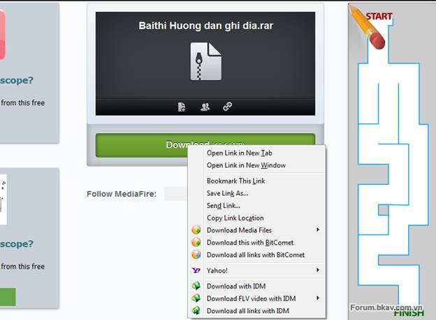{width="6.5in"
height="4.760416666666667in"}

Bạn kích phải chuột vào "Download" như trên và chọn "Copy link
location". Bạn cũng có thể chọn luôn "Download with BitComet" nhưng cách
này không hiệu quả lắm!\
Tiếp đến,tại giao diện BitComet bạn chọn: 

{width="6.5in"
height="4.395833333333333in"}

Sau đó: 

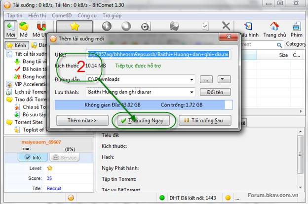{width="6.5in"
height="4.3125in"}

Vậy là bạn đã thực hiện tải tệp tin bình thường rồi! bạn chú ý nơi lưu
file ở trên kẻo quen nhé!\
\
Tìm kiếm nhanh các file \*.torrent: movies, music, game, vào forum,
search trên các tracker nổi tiếng: PirateBay, IsoHunt, MiniNova.\
Tại giao diện chính bạn chọn: 

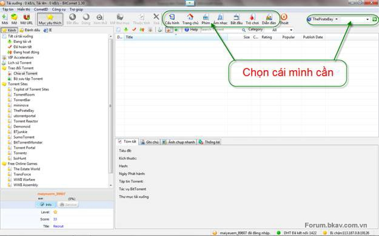{width="6.510416666666667in"
height="4.0625in"}

Sau đó trình duyệt web của bạn sẽ tự động truy cập vào nội dung mà bạn
chọn.\
Hướng dẫn tối ưu hóa để download – upload được nhanh hơn: \
+ Bước 1: Open Port\
Đầu tiên chọn: 

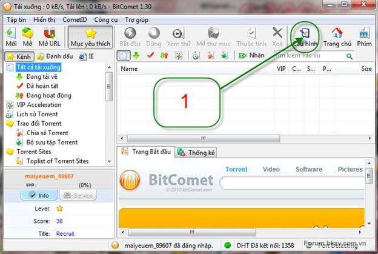{width="6.5in"
height="4.364583333333333in"}

Tiếp đến, tại cửa sổ

{width="6.5in"
height="4.177083333333333in"}

Sau đó bạn chọn 1 bất kỳ số từ dãy số 49152 đến 65534 gõ vào ô Listen
Port. Vì sao lại là trong dãy số đó mà không phải là là từ 1 đến 5000 và
6881 đến 6999 và các port khác trong list
này <http://www.portforward.com/cports.htm> đơn giản là vì các port đó
đã sử dụng cho một software khác.\
Ở trên là cách open port cho Bitcomet. Sau đây là cách open port cho
router của bạn (modem ADSL). Click vào Start/Run (của Windows) và gõ cmd
sau đó nhấn enter. Bạn gõ "ipconfig" sau đó nhấn enter.

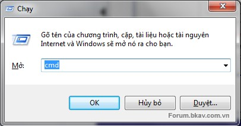{width="4.229166666666667in"
height="2.21875in"}

Bạn sẽ thấy chữ IP Address là số IP của bạn và Default Gateway là số
router. Bạn nhớ 2 số này

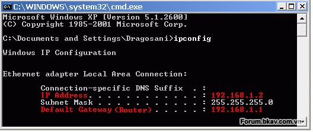{width="5.5in"
height="2.3229166666666665in"}

Các bạn sẽ tìm được cách open port cho router trong link
này<http://www.portforward.com/routers.htm> và đây là link list password
để vào trong router nếu bạn không biết
password <http://www.phenoelit.de/dpl/dpl.html>.\
Còn nếu không có trong link đó thì bắt buộc phải làm thủ công như sau.\
Bạn gõ số trong dòng Default Gateway vào IE và nhấn enter. Như trong
hình ở trên là số 192.168.1.1 của tôi, có thể của các bạn là 10.0.0.1
hoặc là bất kỳ số nào khác thì các bạn chỉ cần gõ số đó vào IE thế thôi.

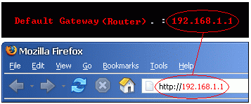{width="3.71875in"
height="1.5520833333333333in"}

Khi vào đến mục Forward Port bạn gõ vào đúng số IP của bạn và số port mà
bạn đã gõ vào trong Bitcomet.\
+ Bước 2: Vượt Firewall cho Bitcomet\
Thông thường hầu hết các chương trình phòng chống virus và windows đều
có firewall ở chế độ mặc định (default). Các bạn nên cho Bitcomet vượt
qua được Firewall mới có thể xem là thành công trong việc open port và
có thể thấy chữ Remote được. Vì mỗi người có dùng mỗi sofware khác nhau
và chỉnh setting cho mỗi software khác nhau nên tôi không thể nói ra ở
đây cách nào vượt firewall cho Bitcomet.\
Chúc vui vẻ!!!

*d) Nhận xét:*

*+ Ưu điểm: giao diện tiếng việt dễ sử dụng, có thêm nhiều chức năng mới
tích hợp, có thể download các file từ các địa chỉ không phải torrent như
các phần mềm download thông dụng,tốc độ khá nhanh.*\
*+ Nhược điểm: Quá trình tối ưu hóa rất khó khăn, nhiều khi không thành
công do nhiều yếu tố. khi chưa tối ưu hóa được thì tốc độ không cao
lắm!*

***III. Những rắc rối khi đang download:***

*"Chú ý là trong khi download(upload) các bạn có thể dừng lại để khi
khac download(upload) tiếp"*\
Ngày nào đó, thấy file kia không ai seed, không có peer, tức quá ấn
delete nó, ai ngờ nhanh nhảu đoảng xóa mất cái file đang download. Mà
được 99% rồi nay lại bị mất, phải làm sao đây. Hoặc máy virus, format ổ
system mà phần mềm cài ở trong đó, sau khi cài lại làm sao mà tiếp tục
công việc dang dở đây.\
Dễ thôi, miễn là bạn còn file nguồn \*.torrent và chưa xóa mất khu vực
mà bạn chọn lưu file khi download. Bạn hãy cứ tiến hành mở file
\*.torrent để download, và chọn khu vực lưu trùng với khu vực đã lưu
trước đây. Khi đó khi bạn chọn download sẽ có thông báo có file trùng
nhau, bạn cứ nhấn "OK" để nó "check" file và sẽ download tiếp, bạn sẽ
không phải download lại từ đầu. Còn nếu tên file đã lưu không khớp nhau
thì sẽ không có sự trùng file nên nó sẽ không check và bạn sẽ phải
download lại từ đầu!\
Chúc bạn thành công!

***IV. Một số phần mềm tìm kiếm torrent***

***1. Bit Che***

*a) Giới thiệu chung:*

{width="4.239583333333333in"
height="1.7916666666666667in"}

Là công cụ tìm kiếm torrent được đánh giá là nhanh và mạnh nhất.\
Nó hiển thị kết quả tìm kiếm của hầu hết các trang chia sẻ torrent lớn
như: PirateBay, IsoHunt, MiniNova, BTJunkie, ZeroTracker, Mp3Nova,
BTMon, TorrentBox, TorrentPortal..

*b) Hướng dẫn cài đặt:*

*Chuẩn bị: *\
Các bạn tải phần mềm tại: \
Trang chủ: \
*Hướng dẫn cài đặt: *\
Sau khi tải về các bạn kích vào file "bit\_che\_1\_0\_60.exe" để tiến
hành cài đặt: \
Đầu tiên bạn chọn ngôn ngữ cài đặt và nhấn "OK"

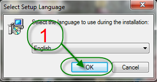{width="3.2395833333333335in"
height="1.6979166666666667in"}

Tiếp đến nhấn "Next"

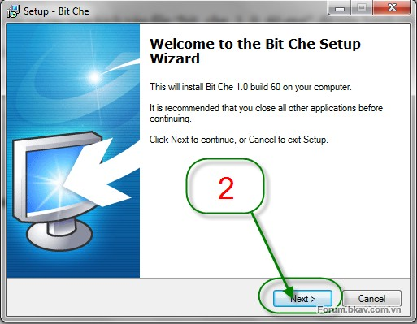{width="5.34375in"
height="4.15625in"}

Tiếp theo: 

{width="5.333333333333333in"
height="4.135416666666667in"}

Tiếp tục: 

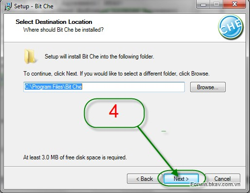{width="5.354166666666667in"
height="4.125in"}

Next tiếp: 

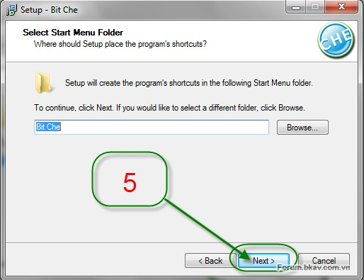{width="5.354166666666667in"
height="4.114583333333333in"}

Tiếp đến: 

{width="5.34375in"
height="4.15625in"}

Cuối cùng nhấn "Finish" để kết thúc: 

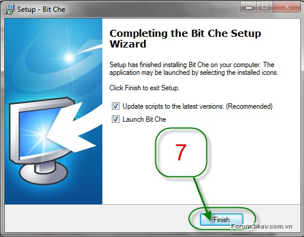{width="5.322916666666667in"
height="4.15625in"}

Quá trình cài đặt đã hoàn tất.

*c) Hướng dẫn sử dụng*

Chạy chương trình bạn sẽ thấy giao diện như sau: 

{width="6.5in"
height="4.614583333333333in"}

Đầu tiên bạn nhập từ khóa vào ô "Search" rồi nhấn enter: 

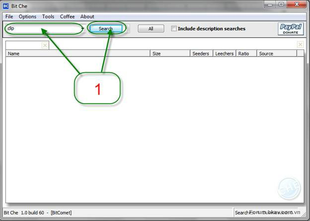{width="6.5in"
height="4.645833333333333in"}

Tiếp đến bạn căn tìm file muốn tải, căn cứ vào tên, tỉ lệ seed và leech
để lựa chọn file muốn tải

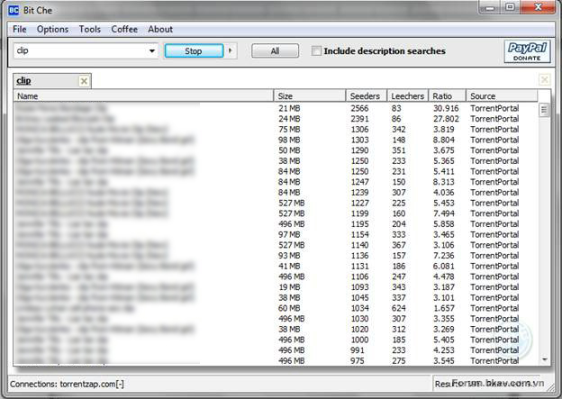{width="6.5in"
height="4.614583333333333in"}

Bạn cũng có thể tìm kiếm theo thể loại file (video, game…)

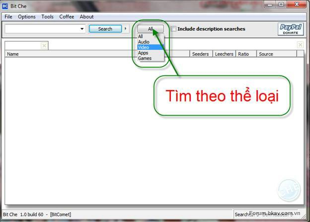{width="6.5in"
height="4.645833333333333in"}

Bạn chuột phải vào file muốn tải và chọn: "Open torrent" nếu muốn tải
luôn bằng trình download torrent đã cài, hoặc "saver torrent as.." để
save nó lại rồi tải sau

{width="6.5in"
height="4.625in"}

Nếu chọn "Open torrent" (Ở đây mình để BitComet là mặc định) thì bạn sẽ
được như sau: 

{width="6.5in"
height="4.15625in"}

Nhấn tải xuống và quá trình download bắt đầu: 

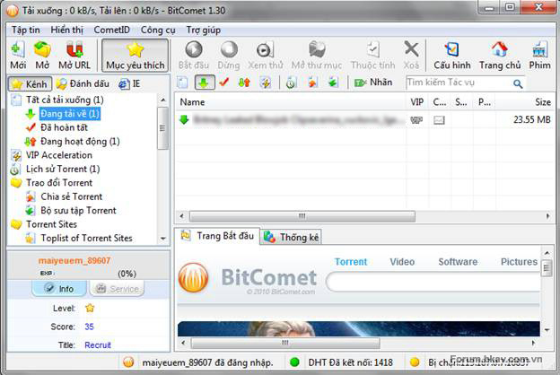{width="6.5in"
height="4.354166666666667in"}

Chúc bạn thành công !!!

*d) Nhận xét:*

*+ Ưu điểm: gọn nhẹ, dễ sử dụng, tìm kiếm nhanh, tốn ít bộ nhớ ram. Hiệu
quả cao*

***2. TorrentFetcher***

*a) Giới thiệu chung:*

{width="6.78125in"
height="4.458333333333333in"}

**TorrentFetcher **là chương trình tìm kiếm torrent khá hiệu quả và dễ
sử dụng, được đánh giá khá cao sau **BitChe.**

b) *Hướng dẫn cài đặt:*

Chuẩn bị: \
Các bạn tải bộ cài
tại: [http://downloads.zinious.com/Torrent....03\_\_setup.exe](http://downloads.zinious.com/TorrentFetcher_1.03__setup.exe)\
Trang
chủ: [http://torrentfetcher.en.malavida.com](http://torrentfetcher.en.malavida.com/)\
Tiến hành cài đặt: \
Sau khi tải về các bạn kích vào file "TorrentFetcher\_1.03\_\_setup.exe"
để tiến hành cài đặt: 

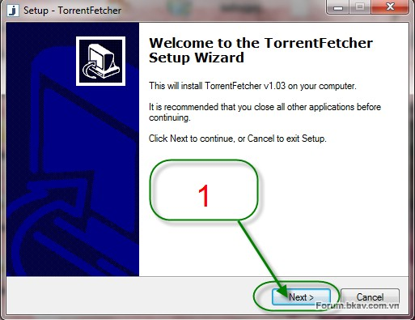{width="5.34375in"
height="4.114583333333333in"}

Nhấn Next: 

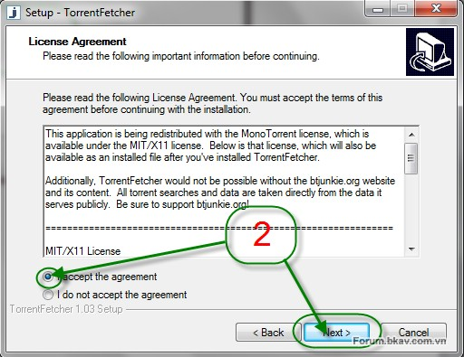{width="5.333333333333333in"
height="4.114583333333333in"}

Tiếp tục nhấn Next theo hướng dẫn: 

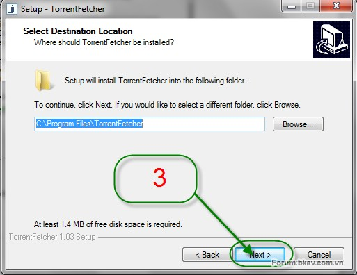{width="5.34375in"
height="4.125in"}

Tiếp đến: 

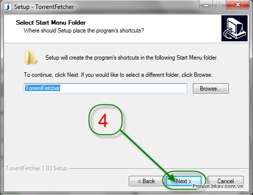{width="5.34375in"
height="4.125in"}

Tiếp theo: 

{width="5.34375in"
height="4.135416666666667in"}

Nhấn "Finish" để hoàn tất quá trình cài đặt: 

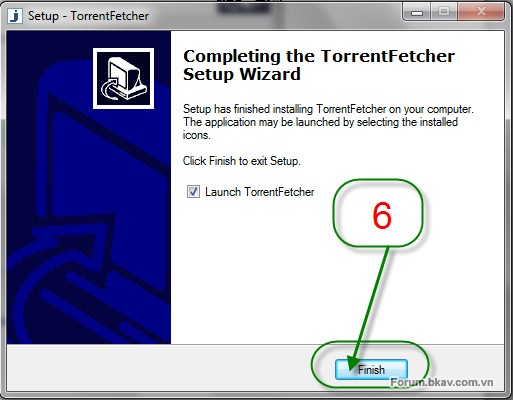{width="5.34375in"
height="4.166666666666667in"}

Quá trình cài đặt thành công rồi đó!

*c) Hướng dẫn sử dụng:*

Chạy chương trình bạn sẽ thấy giao diện của nó như sau: 

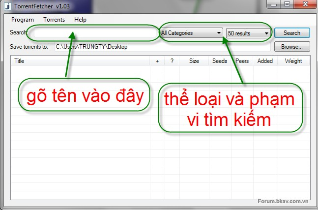{width="6.739583333333333in"
height="4.447916666666667in"}

Bạn nhập tên, chọn thể loại và nhân "Search" để tìm kiếm: 

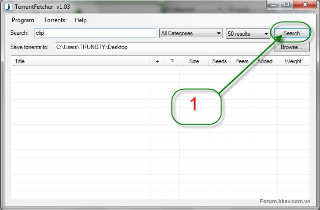{width="6.802083333333333in"
height="4.458333333333333in"}

Bạn sẽ được: 

{width="6.760416666666667in"
height="4.489583333333333in"}

Bạn sẽ thấy là so với BitChe thì không thể bằng rồi vì số lượng ít hơn.\
\
Chọn file bạn muốn tải và nhấn phải chuột vào nó, chọn: "Download
torrent"

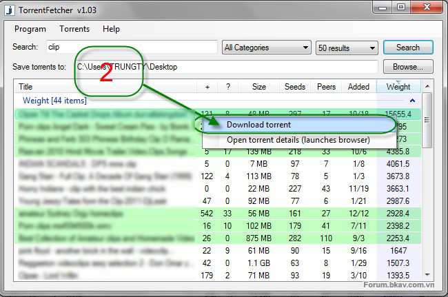{width="6.770833333333333in"
height="4.489583333333333in"}

Như vậy là bạn đã tải file torrent về máy, bây giờ bạn có thể dùng trình
download torrent để tải file của bạn về, bạn chú ý là bạn vừa lưu file
torrent đó tại khu vực\
"Save torrents to" như trên hình.\
Chúc bạn thành công!!!

*d) Nhận xét:*

*+ Ưu điểm: gọn nhẹ dễ sử dụng*\
*+ Nhược điểm: Tốn nhiều bộ nhớ ram, hiệu quả không cao như BitChe*

***V. Kết luận:***

***1.So sánh kết luận về Phần mềm download – upload: ***

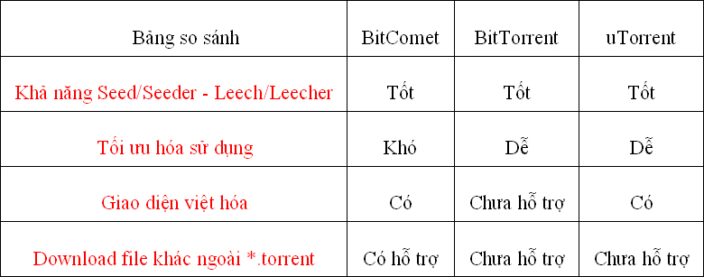{width="8.125in"
height="3.1979166666666665in"}

***2.So sánh kết luận về Phần mềm Tìm kiếm torrent: ***

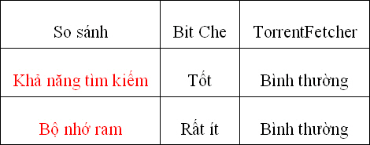{width="4.895833333333333in"
height="1.9270833333333333in"}
