**I. Giới thiệu chung và vai trò của ghi đĩa, các phần mềm chuyên dụng**

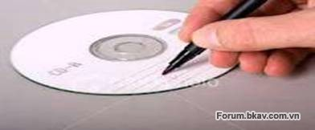

Vẫn biết rằng ghi đĩa không chỉ là một trong những cách mà chúng ta lưu
trữ dữ liệu mà còn là việc thường xuyên đối với các cửa hàng bán đĩa,
các bạn làm clip hình ảnh, nhạc và film... Tạo và ghi đĩa ngày càng có
vai trò quan trọng và dường như trong cuộc sống ai cũng sẽ sử dụng tới.
Tuy nhiên, ghi thế nào cho đúng cách để không lãng phí đĩa thì không
phải ai cũng biết. Tạo và ghi đĩa cũng có rất nhiều kiểu cũng như nhiều
cách thức khác nhau.

Sau đây mình xin giới thiệu với các bạn 3 phần mềm ghi đĩa thông dụng
nhất hiện nay:

+ Phần mềm ghi đĩa đa tính năng thương mại có tính phí **Nero 11**
+ Phần mềm ghi đĩa miễn phí **CDBurnerXP**
+ Phần mềm ghi đĩa miễn phí **InfraRecorder**

Nhãn đĩa đẹp cũng là 1 phần không thể thiếu để thu hút người xem. Nero
có tích hợp làm nhãn đĩa nhưng mình vẫn giới thiệu thêm với các bạn phần
mềm làm nhãn đĩa gọn nhẹ dễ sử dụng**Disketch CD Label Software**.

Ngoài ra hiện nay có rất nhiều phần mềm khác nhưng ít được mọi người sử
dụng nên mình sẽ không đề cập đến!

**III. Ghi đĩa bằng phần mềm thương mại Nero 11**

**A. Đôi nét về phần mềm Nero**:

Nero là phần mềm ghi đĩa tốt nhất hiện nay, được rất nhiều người sử dụng
vì tính năng ổn định và chất lượng đĩa sau khi ghi là rất tốt, tuy nhiên
có tính phí nên cũng ít người có khả năng dùng được.

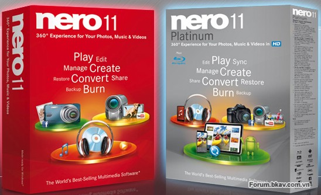

Ở đây ta chỉ viết tới 4 công cụ của Nero là: Nero Express, Nero Video,
Nero Burning Rom, Nero Convertdesigner.

**B. Hướng dẫn cài đặt**

**C. Hướng dẫn sử dụng và tối ưu hóa**

Sau khi cài xong trên mà hình sẽ xuất hiện biểu tượng:

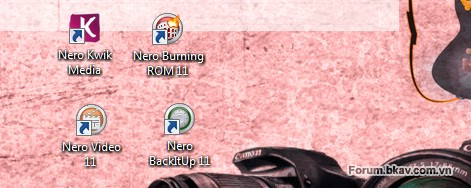

**1. Ghi đĩa với Nero Express đĩa nhạc Mp3, đĩa nhạc CD (Audio CD), đĩa
ảnh (Photo), đĩa hình (Video), đĩa dữ liệu (Data)…thông thường**

Có 2 cách để chạy Nero Express

-   Cách 1: vào start gõ *Nero Express* và chạy chương trình

-   Cách 2: chạy thông qua Nero Burning ROM 11 trên Desktop, mình sẽ
    giới thiệu dưới đây:

\* Chạy Nero Burning ROM 11

Vì là lần đầu tiên chạy trương trình nên sẽ xuất hiện thông báo:

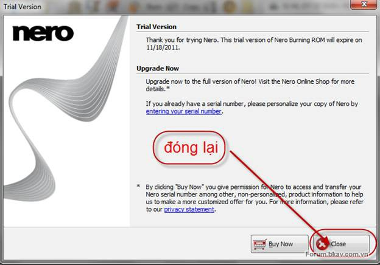

Bạn hãy đóng thông báo này lại và bạn sẽ thấy như sau:

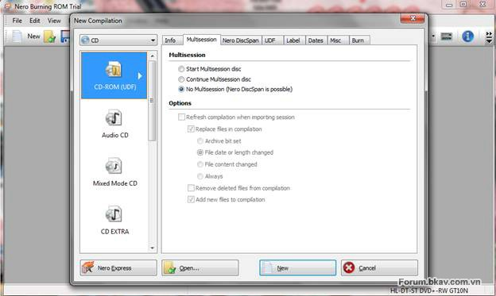

Tiếp đến bạn chọn:

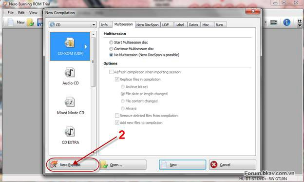

Bạn cũng có thể mở Nero Express theo cách thứ nhất. Và đây là giao diện
Nero Express:

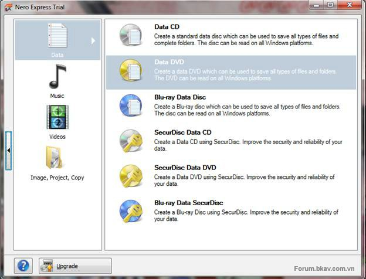

Sau đây mình sẽ đi vào hướng dẫn burn đĩa với từng công cụ của Nero
Express (mình sẽ hướng dẫn với đĩa DVD, đĩa CD các bạn làm tương tự):

**A. Burn đĩa dữ liệu Data **(ghi đĩa game, hình ảnh hay đơn giản là
những dữ liệu mà bạn muốn ghi ra đĩa để lưu trữ, gửi cho đối tác, bạn
bè...)

Cho đĩa trắng vào ổ đĩa, tiếp đến chọn Data DVD và làm theo hướng dẫn:

**Đĩa Data không bảo mật**

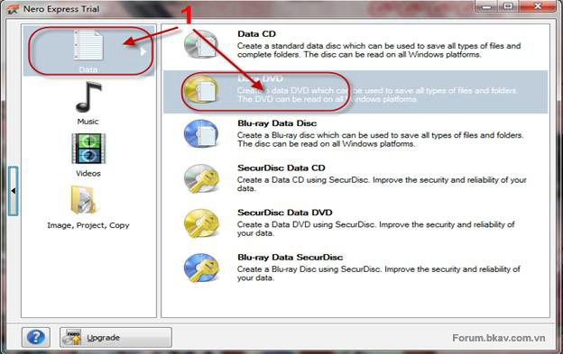

Ở cửa sổ tiếp bạn chọn **Add**, sau đó bạn chọn **All Files**

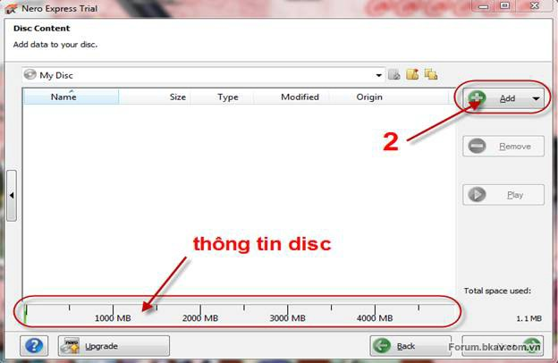

Sau đó chọn file và thêm vào, bạn có thể thêm nhiều file 1 lúc bằng cách
giữ phím Ctrl hoặc thêm nhiều lần cho đến hết dung lượng ổ đĩa.

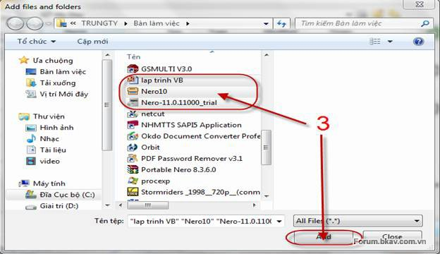

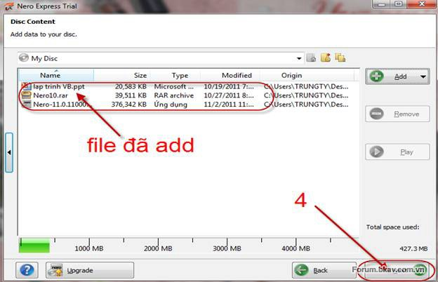

Tiếp đến:

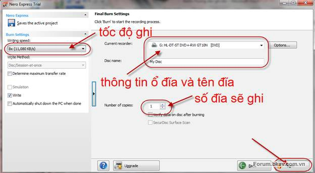

Giờ chỉ việc ngồi chờ burn xong, nếu bạn chọn burn nhiều hơn 1 đĩa thì
sẽ burn lần lượt.

**Đĩa Data bảo mật (Đặt mật khẩu bảo mật dữ liệu)**

Bạn chọn:

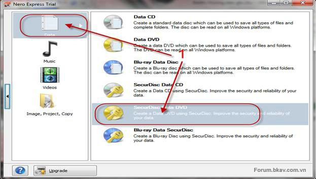

Tiếp đến:

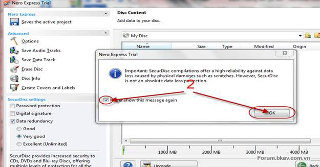

Tiếp đến bạn đặt mật khẩu cho đĩa:

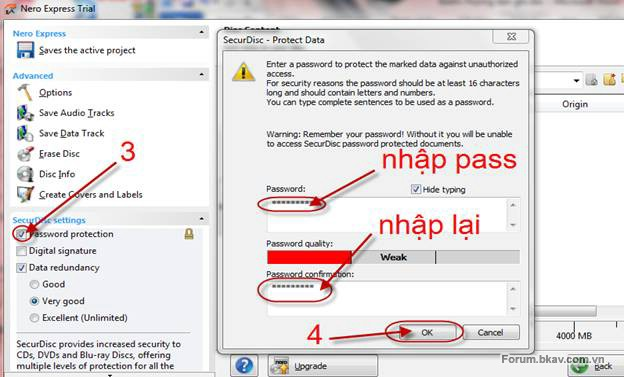

Xác nhận đặt mật khẩu:

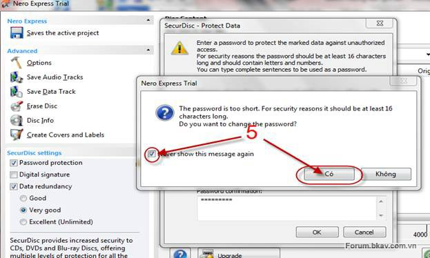

Sau đó bạn tiến hành **Add file** để ghi:

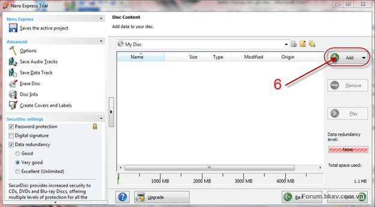

Chọn các file bạn muốn ghi ra đĩa và thêm vào để ghi:

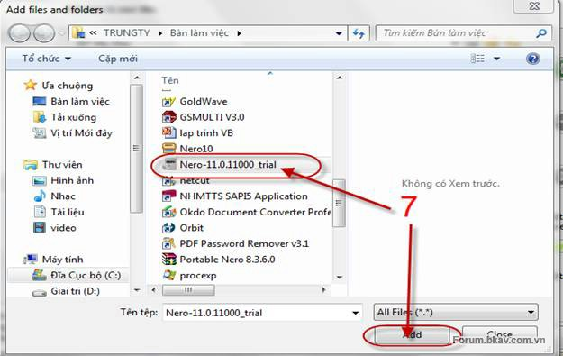

Sau đó bạn chọn **Add**, bạn sẽ thấy các file bảo mật nằm cạnh các file
đã add trên khung thông tin file. Nhấn **Next **để tiếp tục:

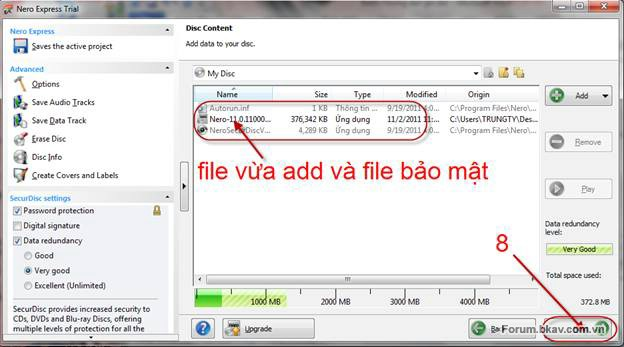

Tiếp đến là thiết lập thông tin ghi đĩa:

Vậy là bạn đã có 1 đĩa Data được bảo mật bằng password.

Chúc bạn thành công!

**Ghi lên đĩa Blue-ray: Bru-ray Data disc**

Blue-ray đang được các nhà sản xuất đĩa định nghĩa là một thế hệ đĩa
quang của tương lai. Hiện nay thiết bị ghi và đọc đĩa này còn ít nên
mình sẽ không đề cập đến

**Burn Audio ( Music)**

Cho đĩa trắng vào ổ đĩa, tiếp đến chọn **Music **và làm theo hướng dẫn:

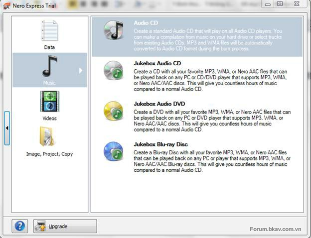

- **Audio CD**

Là đĩa nhạc CD mà bạn hay mua ở ngoài thị trường, đĩa này có đặc điểm:
số lượng bài ít thường tối đa 20 bài là hết và muốn copy vào máy tính để
nghe thì chỉ có 1 cách là dùng chương trình RIP lại thành Mp3 hay Wav.
Loại này khi chép nhạc vào đĩa CD thì phụ thuộc vào số phút ghi trên đĩa
CD, ví dụ đĩa bán ở ngoài là 80min thì nó ghi được tối đa 80 phút nhạc,
suy ra 1 bài có 5 phút thì chỉ chép được tối đa 16
bài hát Audio CD vào đĩa này.

-**Jukebox Audio CD và Jukebox Audio DVD**

Là đĩa chứa rất nhiều bài nhạc nhưng đã nén lại thành file Mp3 và bạn có
thể copy
và paste vào máy tính của mình bất cứ lúc nào mà không cần dùng chương
trình thứ 3 để RIP lại, đặc điểm của đĩa này là chứa được rất nhiều bài
hát, ví dụ với đĩa CD bán ngoài thị trường thì chứa được khoảng trên
dưới 130 bài hát Mp3, loại này chép vào đĩa CD thì theo qui định giới
hạn cũa đĩa CD trắng đó, ví dụ đĩa CD trắng đó chứa được Maximum là
700MB thì chỉ chép được 700MB.

Sau đây mình sẽ giới thiệu cách ghi đĩa Audio CD, còn các đĩa khác thì
tương tự, đầu tiên bạn chọn:

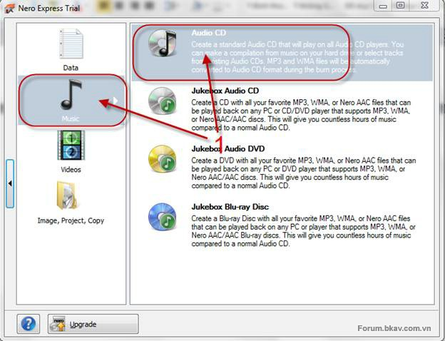

Tiếp đến các bạn thiết lập tùy chỉnh và chọn **Add **để add file vào:

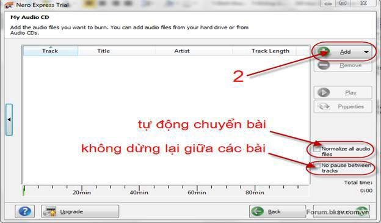

Tiếp đến:

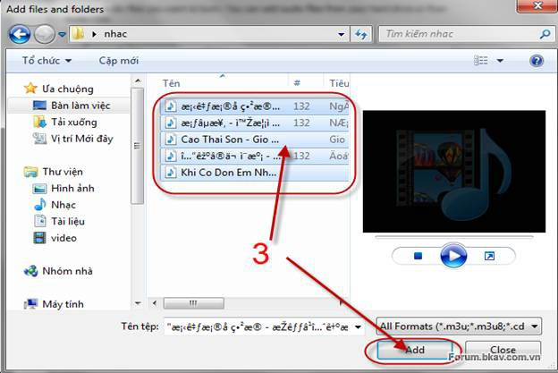

Tiếp tục:

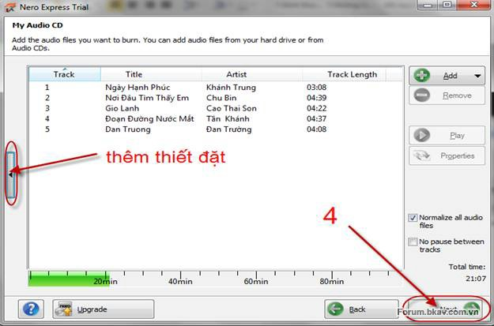

**Next **tiếp:

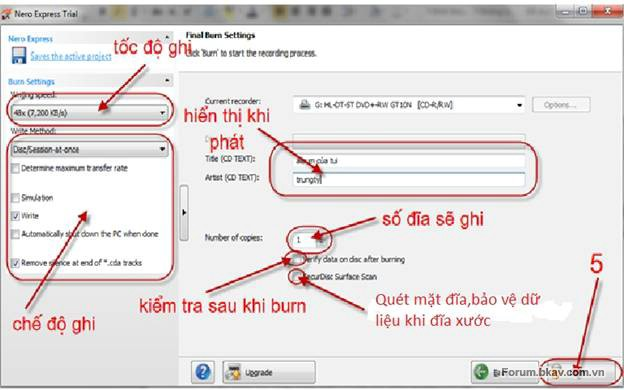

Sau khi thiết lập xong nhấn **Burn** và ngồi chờ thành quả.

**c. Burn DVD video file: ghi file video dạng \*.vob,\*.bup,\*.ifo**

Cho đĩa DVD trắng vào và làm theo hướng dẫn:

Tiếp theo bạn chọn DVD phù hợp, sẽ có 2 loại là:

DVD5 (4.7 Gb) và DVD9 (8.0 Gb), sau đó bạn chọn **Add**

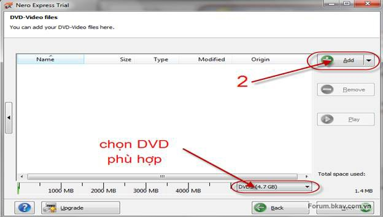

Tiếp đến:

Chọn file và chọn **Add**, chú ý là chỉ hỗ trợ file video DVD ở dạng
\*.vob, \*.bup,\*.ifo.

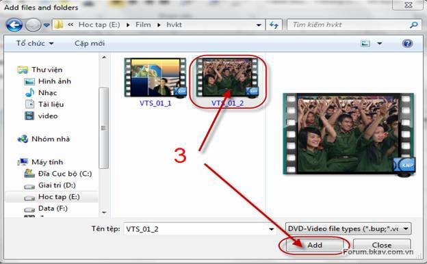

Sau khi add xong các file video cần ghi thì nhấn **Next**

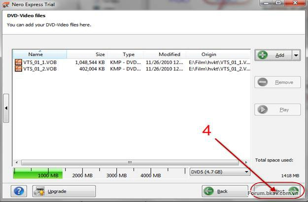

Tiếp theo:

Sau khi tùy chỉnh xong thì nhấn burn, ngồi chờ đĩa burn xong là được.

**d. Copy đĩa: copy từ 1 đĩa ra nhiều đĩa**

Cho đĩa chứa dữ liệu cần copy vào ổ đĩa, tại giao diện chính chọn:

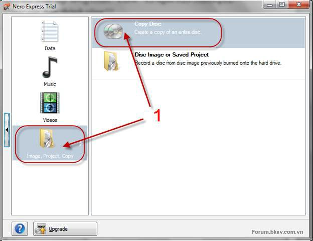

Tiếp đến:

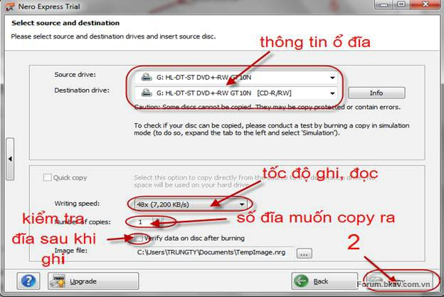

Nhấn **Copy **để sao chép đĩa, quá trình copy diễn ra:

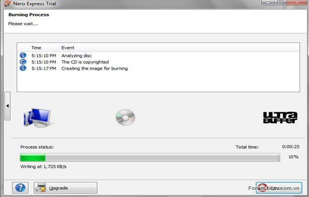

Sau khi kết thúc quá trình sao chép sẽ có thông báo như sau để bạn đưa
đĩa vào:

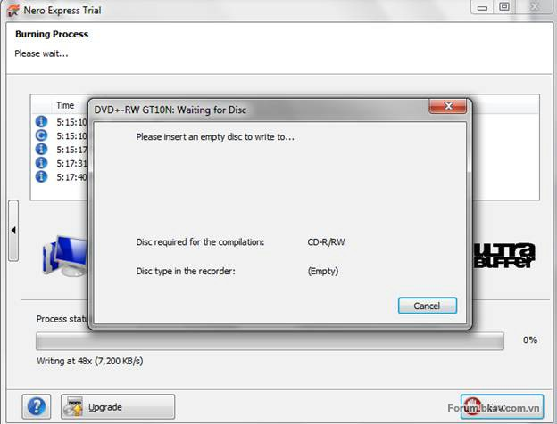

Bây giờ bạn hãy đưa đĩa trắng vào thì quá trình ghi đĩa sẽ tự động tiến
hành (nếu nhiều đĩa thì sẽ ghi từng cái một)

**Ưu điểm**: ghi được nhiều chức năng: Data, video, copy đĩa, các album
nhạc Mp3,…

**Khuyết điểm**: khó khăn với đa số định dạng video. Với các video dạng
\*.avi, \*.mpg,\*.flv… thì bạn phải convert sang định dạng \*.vob hoặc
\*.bup khi ghi DVD ( còn VCD, video ngắn trên CD thì vẫn áp dụng được),
ví dụ như ghi video tạo từ cuộc thi KT06.

**Cách khắc phục**: Cách ghi video dưới đây sẽ đảm bảo tốt nhất việc
này

**2. Ghi đĩa với Nero Video 11: video tự chạy trên các thiết bị đọc đĩa
(Đầu DVD, VCD, Máy tính,…)**

Trên màn hình desktop chọn Nero Video 11:

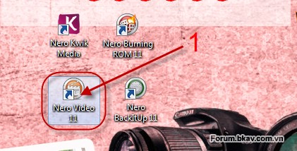

Giao diện của chương trình:

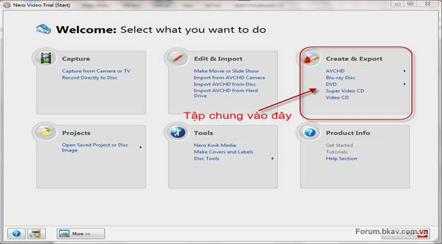

Trong khung ở trên ta quan tâm tới 3 chức năng:

+ DVD: Video DVD (burn đĩa DVD)

-   DVD video: video DVD thông thường

-   Mini DVD: video DVD trên đĩa CD

+Super Video CD: Video CD chất lượng cao (burn đĩa chất lượng cao)
+Video CD: Video CD (burn đĩa VCD)

Các bước tiến hành burn DVD và CD tương tự nhau, bạn cần burn DVD hay CD
thì chỉ cần chọn chức năng đó và làm theo các bước dưới đây. Mình sẽ lấy
burn DVD-video và Video CD làm ví dụ:

**A. Burn video DVD**

Đầu tiên chọn: **DVD**, sau đó chọn **DVD-video**

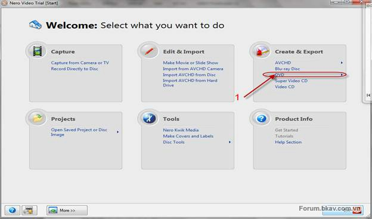

Chọn loại DVD của bạn ( DVD9, DVD,…)

Tiếp đến: chọn **Import **-&gt; **Import Files**

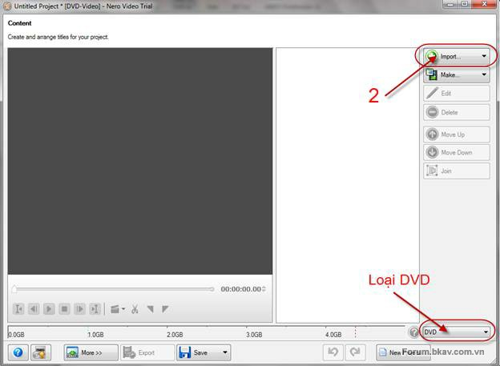

Tiếp đến bạn chọn file video và làm theo hướng dẫn:

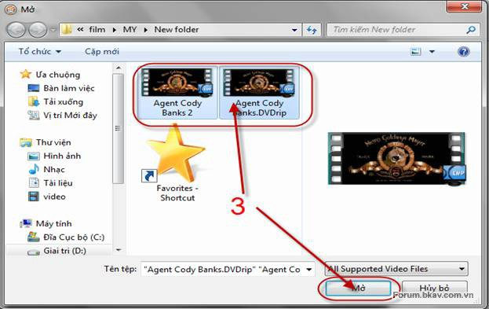

Sau khi add video xong bạn sẽ thấy như sau:

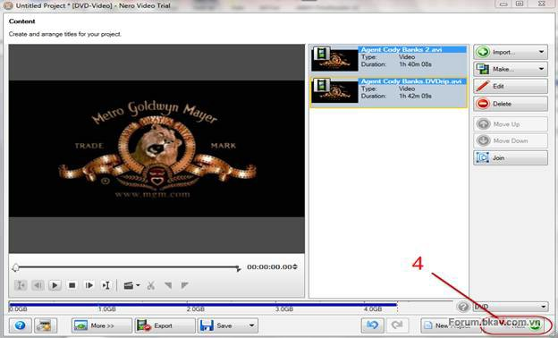

Nhấn **Next **để tiếp tục:

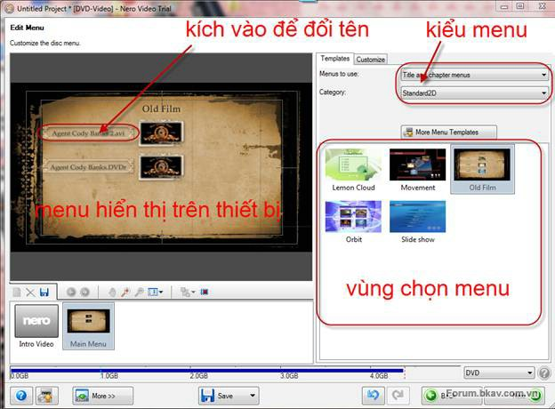

Khung cửa sổ các bạn nhìn thấy sẽ hiển thị trên thiết bị phát khi phát
đĩa này. Bạn có thể đổi tên cho từng video của mình, chọn và thiết lập
kiểu menu cho đẹp mắt.

Bạn có thể lấy thêm menu bằng cách làm như sau: chọn **More Menu
Template**

Tiếp đến click chuột vào **here**:

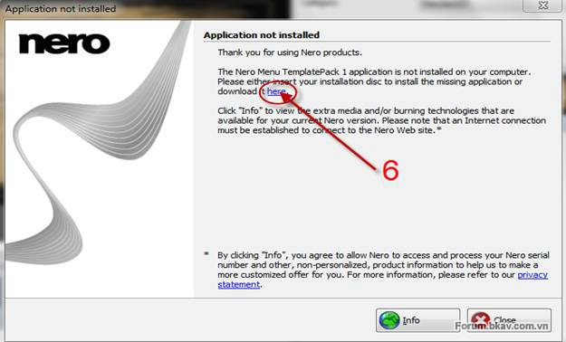

Bạn sẽ chuyển sang trang để tải thêm menu cho Nero của bạn. Hoặc bạn có
thể truy cập trực tiếp vào đây để tải thêm nhiều gói menu template
về [http://www.Nero.com/link.php?la=en-U...24&ai=16&ma=90](http://www.nero.com/link.php?la=en-US&to=111061057&oe=458752&gen_id=11&pi=32001&pg=1024&ai=16&ma=90)

Sau khi đã chọn được menu thích hợp và tùy chỉnh xong, bạn
nhấn **Next **để tiếp tục:

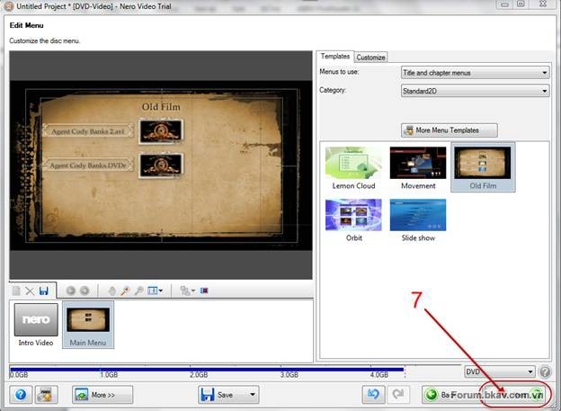

Tiếp đến bạn có thể xem thử giống như trên thiết bị phát, sau khi đã vừa
ý thì nhấn **Next **để tiếp tục:

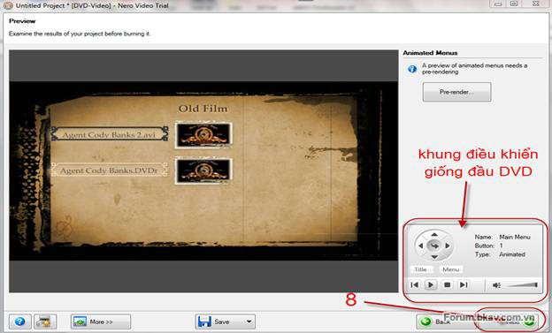

Bạn phải chắc là đã cho đĩa trắng vào rồi, tiếp đó nhấn **Burn**

Chờ quá trình burn xong là được rồi đó.

Chúc bạn thành công!

**B. Burn Video CD**

Cho CD trắng vào ổ đĩa.

Đầu tiên bạn chọn: **Video CD**

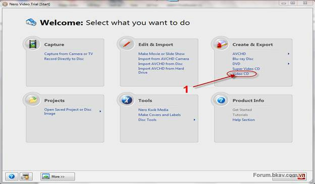

Tiếp đến:

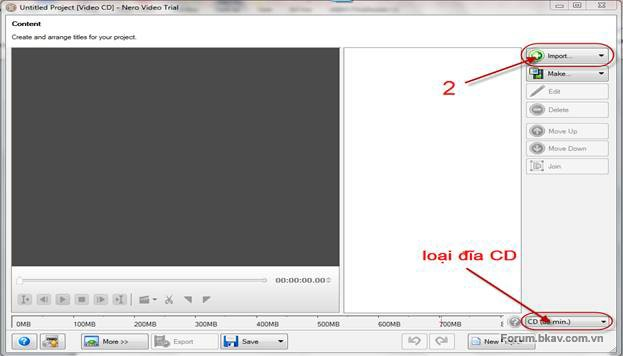

Nhấn **Import Files** để thêm file video:

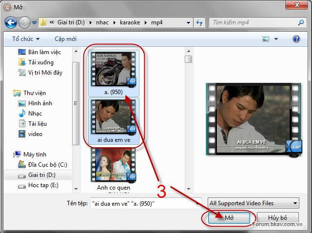

Sau khi thêm file video:

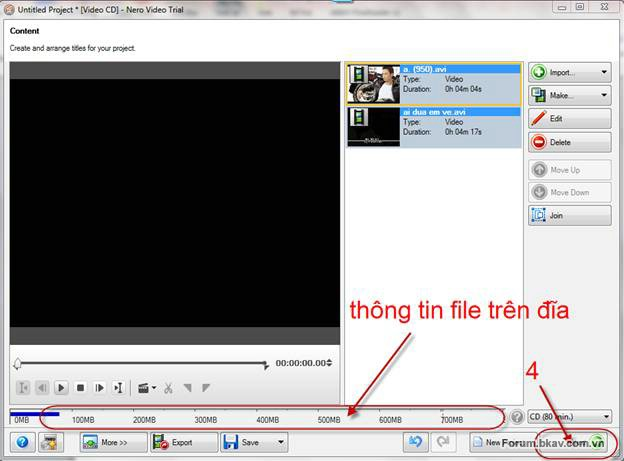

Nhấn **Next **để tiếp tục:

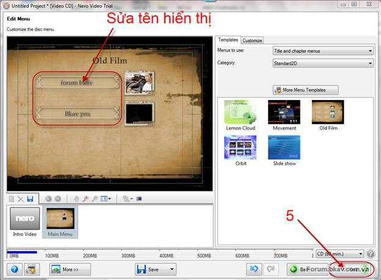

Tương tự như ghi DVD, nhấn **Next **để tiếp tục:

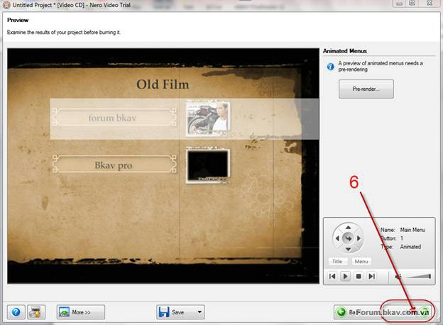

Tiếp đến:

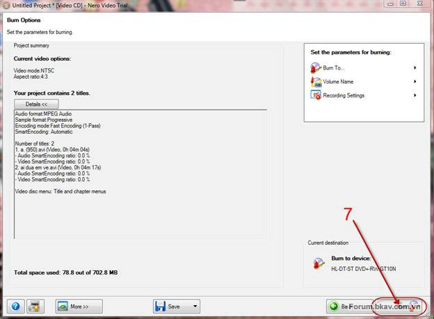

Chờ quá trình kết thúc là bạn đã có đĩa video CD cho riêng mình rồi đó.

Chúc bạn thành công!!!

**Ưu điểm**: burn đĩa rất ổn định không bị rớt đĩa, xem được trên các
phương tiện như đầu DVD,VCD,… Có menu đẹp mắt, khắc phục được việc ghi
đĩa gặp khó khăn với một số định dạng video (Như trên đã nói thì các
định dạng \*.avi, \*.mpg,\*.flv… thì bạn phải sử dụng phần mềm khác
convert sang định dạng \*.vob hoặc \*.bup), làm Nero hoàn thiện hơn.

Nhược điểm: thời gian có thể dài vì phải convert và tạo menu, thông
thường DVD mất khoảng 20 phút.

**3. Ghi đĩa với Nero Burning ROM:ghi file ảnh (iso, ima,… có thể boot
hoặc không boot nên đĩa), vận dụng khi ghi đĩa boot và đĩa windows**

Kích vào biểu tượng **Nero Burning ROM** trên desktop để chạy chương
trình hoặc có thể vào start gõ *Nero Burning ROM*:

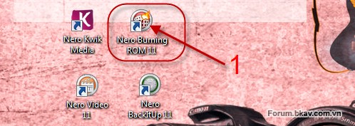

Giao diện chính của chương trình:

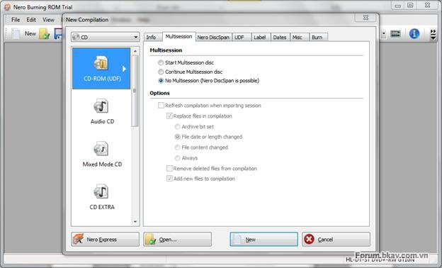

Tại đây có: loại đĩa DVD hay CD và các kiểu ghi đĩa tương ứng:

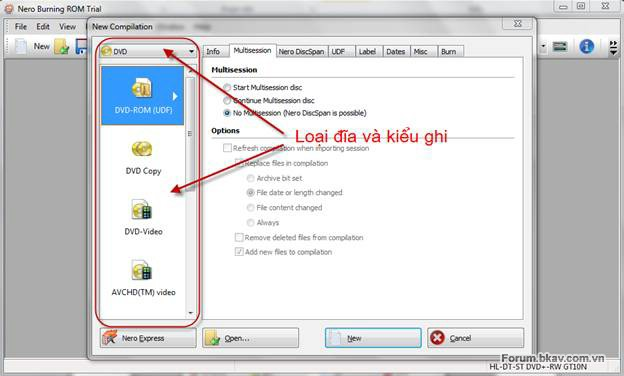

Ở đây mình chỉ giới thiệu ghi file image \*.iso bình thường và file
\*.iso boot, các file image khác các bạn làm tương tự. Mình sẽ ví dụ với
đĩa DVD, đĩa CD các bạn làm tương tự nhé.

Đôi khi chúng ta có các file iso của 1 đĩa nhạc và muốn ghi ra đĩa, hãy
chọn DVD ROM (iso). Nếu chúng ta có 1 file iso để boot ví dụ như
setupwindows7.iso hay hiren.iso ta muốn ghi đĩa boot mặc dù trước đó
file iso đó có thể boot được hoặc không do driver, bạn hãy chọn DVD ROM
(boot) là bạn có thể yên tâm rằng đĩa sẽ boot được. Đôi khi để ghi file
iso nhạc tự chạy ta cũng dùng chức năng này.

Mình sẽ lấy ghi file yêu cầu boot DVD ROM (boot) làm ví dụ, còn DVD ROM
(iso) thì tương tự.

Đầu tiên chọn **DVD ROM** (boot), sau đó nhấn **Open** để mở file iso
cần ghi:

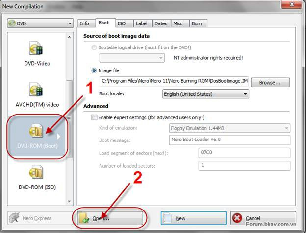

Tìm đến file iso và add vào theo hướng dẫn:

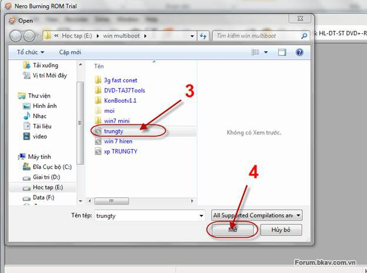

Sau đó xác lập các thông tin về ghi đĩa:

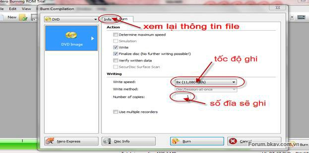

Cuối cùng chọn **Burn **để ghi tiến hành ghi đĩa:

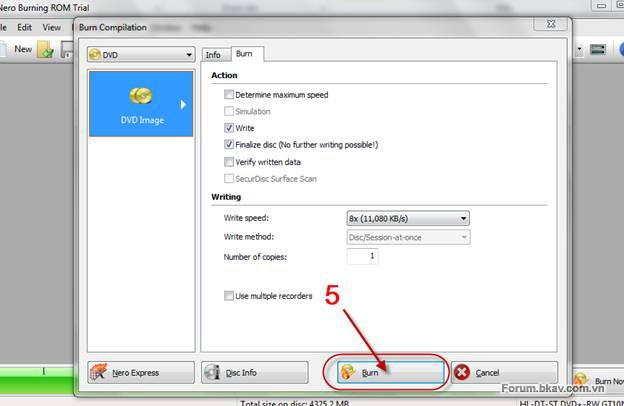

Như vậy là ta đã có đĩa như ý muốn.

Các bạn có thể tham khảo ghi đĩa tại
đây: <http://www.youtube.com/watch?v=lURq71bcUM4>

Chúc các bạn thành công!

**4. Làm bìa đĩa với Nero ConverDesigner**

Để mở công cụ này của Nero 11 có 2 cách:

-   Cách 1: mở thông qua Nero Video11

-   Cách 2: vào **Start**, chọn **All Program**, tiếp tục chọn **Nero**,
    trỏ tới **Nero11**, chọn **Nero ConverDesigner**:

Cách 2 thì đơn giản rồi sau đây mình sẽ giới thiệu cách 1

Trên màn hình desktop bạn chạy Nero video 11, tiếp đến chọn như hình
dưới:

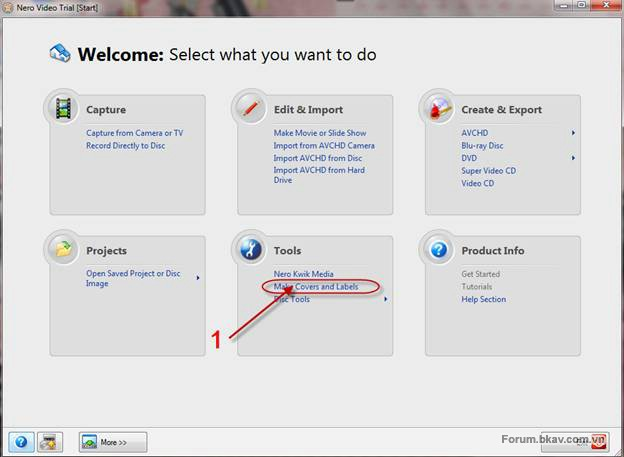

Chọn “**Make Convers and Label**”

Giao diện của **Nero ConverDesigner**:

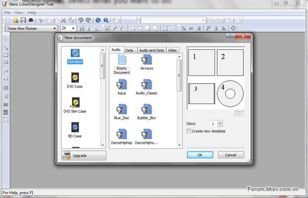

Trước tiên ta cần thiết lập cấu hình tối ưu hệ thống:

+Nhấn Cancel:

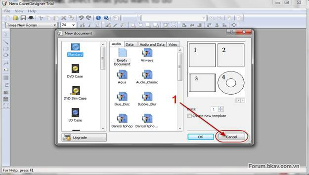

Tiếp đến:

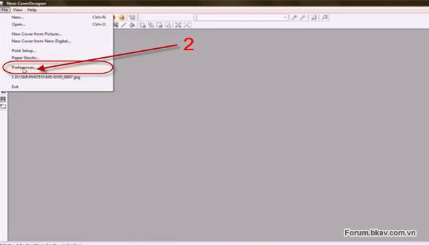

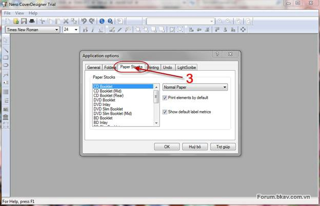

Tiếp đến bỏ dấu chọn **Print elements by default** với tất cả các thành
phần bên khung **Paper Stock** (trừ phần Disc là vẫn để dấu tích đó)

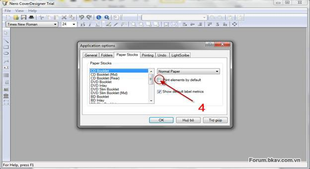

Tiếp đến nhấn **OK**:

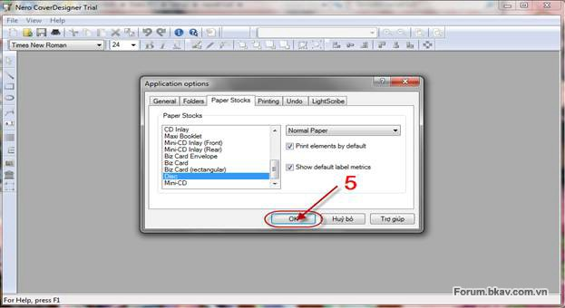

Bây giờ ta sẽ tạo mới nhãn đĩa: chọn **File**, chọn **New**:

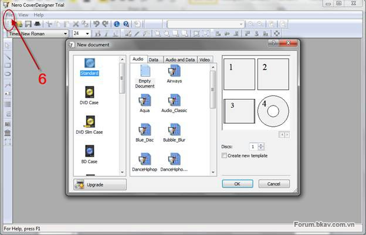

ở đây sẽ có các mẫu cho bạn chọn, bạn chọn một mẫu rồi nhấn **OK**, hoặc
tự thiết kế thì chọn như hình sau rồi nhấn **OK**:

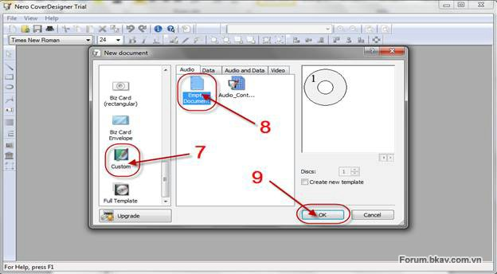

Sau đó bạn thỏa sức sáng tạo bìa đĩa với các công cụ trong khung:

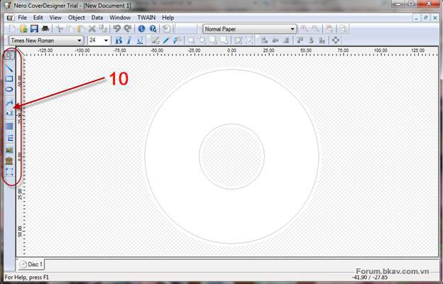

Tiếp:

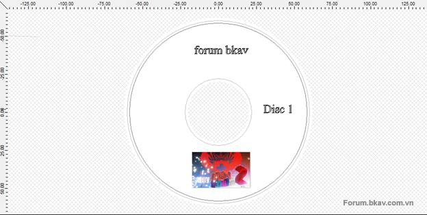

Sau khi thiết kế xong bạn in ra bằng cách chọn **Print**:

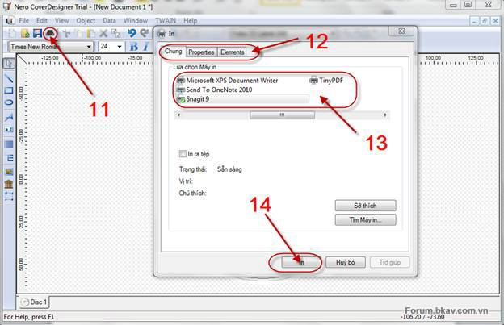

Bạn thiết lập các tùy chỉnh trong khu vực 12, chọn máy in của bạn trong
khu vực 13, sau khi xong nhấn nút in 14.

Mọi thao tác khác bạn có thể tham khảo video tại:

Chúc các bạn thành công!

**5. Nhận xét ưu khuyết điểm và những kinh nghiệm bản thân về Nero
11:**

**Ưu điểm**: ghi đa chức năng các loại đĩa, có thể ghi đĩa với tính ổn
định cao tránh mất dữ liệu khi đĩa xước, không rớt đĩa trong quá trình
ghi như 1 số phần mềm khác, ghi được đĩa video tự chạy và đĩa tự boot
với độ ổn định cao. Giao diện thân thiện và dễ sử dụng, có update đĩa
Blue-ray nhưng chưa ứng dụng nhiều nên mình không tiện giới thiệu ở
đây.

**Khuyết điểm**: tổng dung lượng bộ cài khá nặng (367 Mb) so với nhiều
phần mềm khác, là phần mềm có tính phí nên gặp khó khăn nếu muốn sử dụng
lâu dài.

Kinh nghiệm: 1 số kinh nghiệm mình đã nêu trong bài tuy nhiên mình xin
chia sẻ thêm là: ghi đĩa Data, album nhạc thì nên ghi bằng công cụ Nero
Express, ghi đĩa video thì nên ghi bằng Nero video, ghi đĩa boot hay đĩa
windows thì nên ghi bằng Nero Burning ROM. Khi ghi đĩa nên chọn tốc độ
vừa phải tránh hại ổ đĩa…

**III.Hướng dẫn ghi đĩa với phần mềm miễn phí CDBurnerXP**

**A. Giới thiệu chung:**

CDBurnerXP là phần mềm ghi đĩa miễn phí có hỗ trợ nhiều chức năng.
Chương trình hỗ trợ ghi trên các loại đĩa CD-R / CD-RW / DVD+R / DVD-R /
DVD+RW / DVD-RW, bao gồm cả đĩa 2 lớp, Blu-ray và HD-DVDs. Ngoài ra,
chương trình cho phép ghi cả file ảnh ISO ra đĩa, hỗ trợ giao diện đa
ngôn ngữ, tạo đĩa boot…

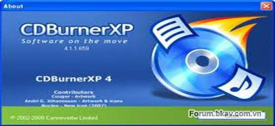

Các chức năng chính:

\* Hỗ trợ ghi mọi thể loại đĩa
\* Ghi đĩa nhạc tiếng không có khoảng trống giữa các track
\* Ghi và tạo file ISO
\* Kiểm tra dữ liệu sau khi ghi
\* Tạo đĩa boot
\* Giao diện đa ngôn ngữ
\* Chuyển đổi định dạng bin/nrg sang ISO
\* Chạy trên mọi hệ điều hành Windows

Yêu cầu hệ thống:

\*Hệ điều hành: Windows XP, Vista, Se7en
\*Microsoft .NET Framework 2.0 trở lên

**B. Hướng dẫn cài đặt**

**C. Hướng dẫn sử dụng và tối ưu hóa**

Trên màn hình Desktop xuất hiện biểu tượng:

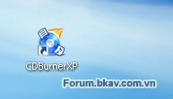

Chạy chương trình sẽ xuất hiện giao diện khá đơn giản và dễ sử dụng:

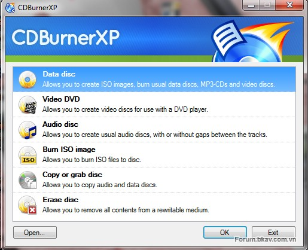

Dưới đây là từng chức năng của chương trình:

**1. Data disc: Ghi đĩa dữ liệu data**

Tại giao diện chính chọn **Data disc**:

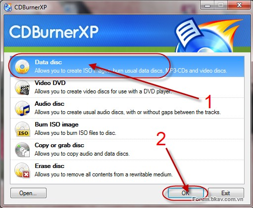

Nhấn **OK**:

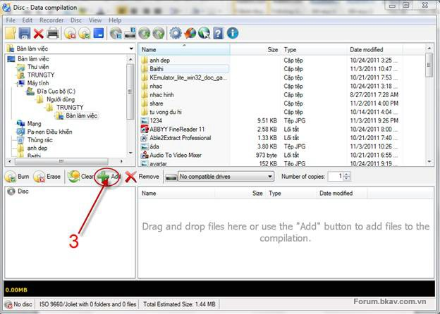

Tiếp đến nhấn **Add **để thêm dữ liệu Data:

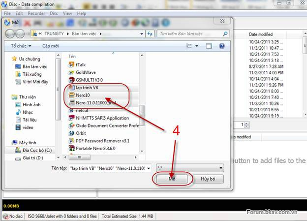

Sau khi thêm file xong sẽ thấy:

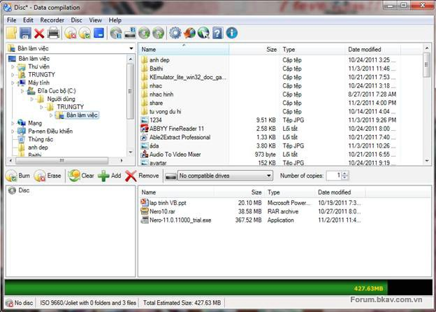

Xem tổng dung lượng file đã add ở phía dưới. Tiếp đến nhấn **Burn**:

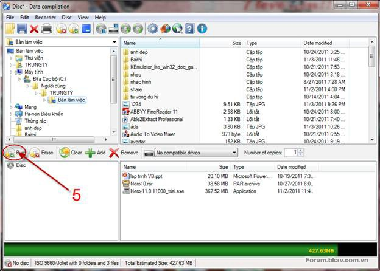

Nếu đĩa của bạn là đĩa có thể xóa đi ghi lại thì sẽ có thông báo:

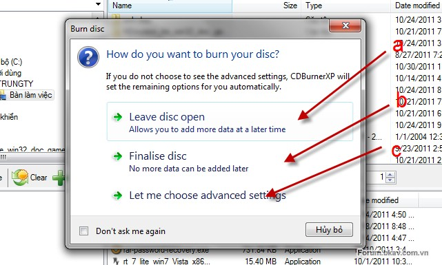

a: Đĩa có thể ghi thêm sau khi đã ghi
b: Đĩa không thể ghi thêm, muốn ghi thêm thì phải xóa đĩa
c: Bạn thiết lập

Nếu đĩa không có chức năng xóa đi ghi lại sẽ không thể thực hiện được 2
chức năng b và c.

Mình muốn sau khi ghi có thể ghi thêm nên mình chọn chức năng a: Đĩa có
thể ghi thêm sau khi đã ghi, chức năng này rất hay bị lỗi do thiếu
driver không nhận ra đĩa, cách ghi tương tự như ghi đĩa Audio ở dưới.
Các bạn có thể tự tìm hiểu chức năng này.

**2. Video DVD: ghi đĩa video**

Sẽ thấy như thế này:

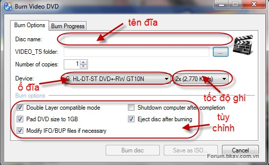

Tiếp đến:

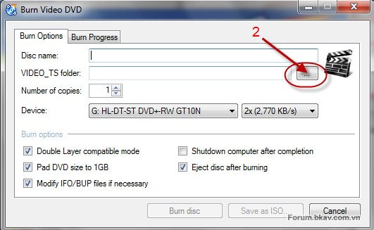

Tiếp đến bạn chọn folder chứa file video cần ghi:

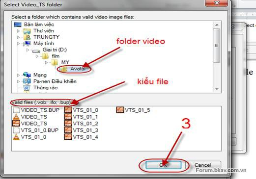

Chú ý là: cũng giống cách ghi video thông thường khác, nó chỉ hỗ trợ
định dạng các file \*.bup, \*.vob, \*.ifo. Do đó nếu video của bạn ở
dạng khác thì bạn phải đổi đuôi trước nhé.

Tiếp đến:

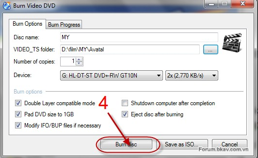

Bạn có thể save file ở dạng iso sau đó mới burn theo kiểu iso hoặc burn
ngay, mình sẽ burn ngay, bạn hãy chọn** Burn disc** như hình. Nhớ cho
đĩa trắng vào trước nhé. Sau đó ngồi chờ thành quả.

Chúc các bạn thành công!

**3. Audio disc: ghi đĩa audio**

Bạn hãy cho đĩa trắng vào. Tại giao diện chính chọn:

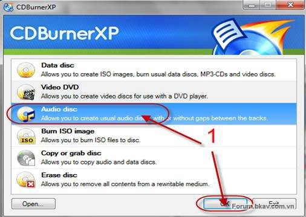

Mình ví dụ với đĩa DVD, đĩa CD cũng tương tự, sau bước 1 sẽ xuất hiện
giao diện:

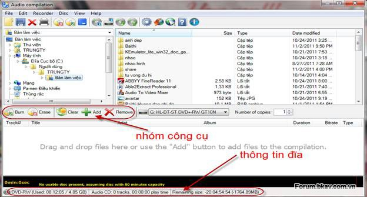

Tiếp đến chọn **Add **để thêm file audio:

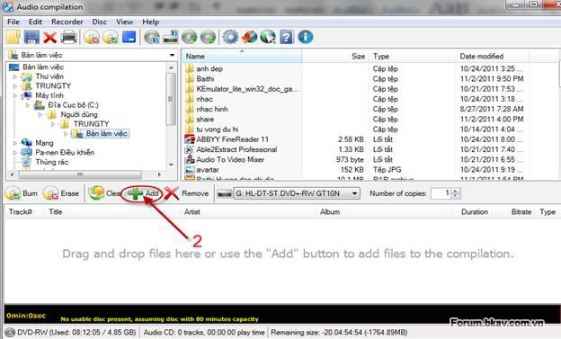

Tiếp theo, các bạn add file, có thể add nhiều file sao cho dung lượng
đĩa cho phép.

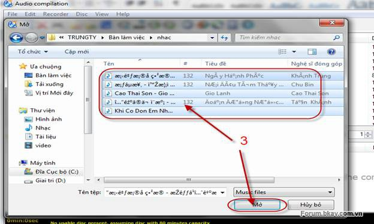

Các bạn có thể chèn text CD, DVD bằng cách chọn: Disc, sau đó chọn CD
text (có thể chèn cho từng bài hoặc toàn bộ album)

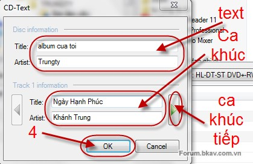

Tiếp đó nhấn **Burn **để thục hiện việc ghi đĩa:

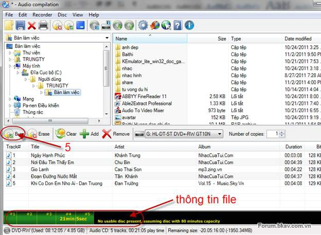

Sau khi nhấn **Burn **sẽ xuất hiện khung tùy chỉnh:

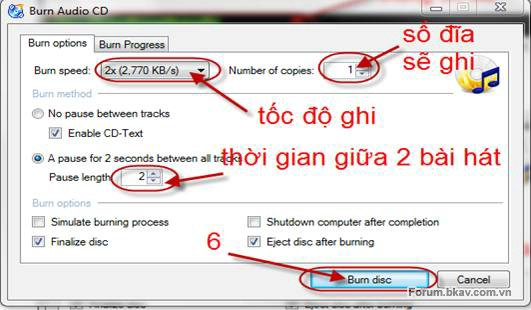

Thiết lập xong hãy nhấn **Burn disc** và ngồi chờ thành quả

**4. Burn iso image: Burn file ảnh đĩa, hỗ trợ 2 định dạng \*.iso và
\*.mds**

Tại giao diện chính chọn:

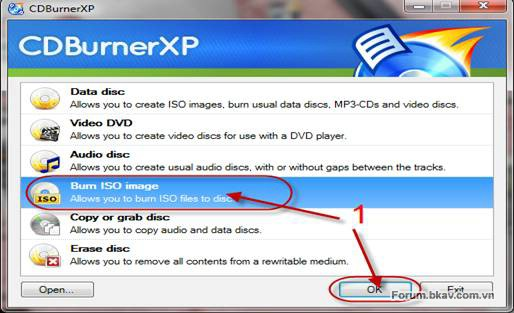

Tiếp đến:

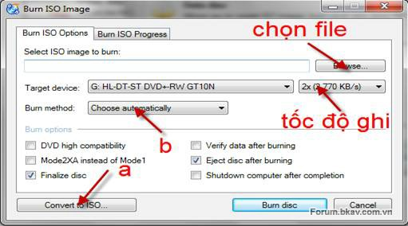

a: convert từ folder sang iso sau đó convert file iso đó
b: chế độ burn

Tiếp theo:

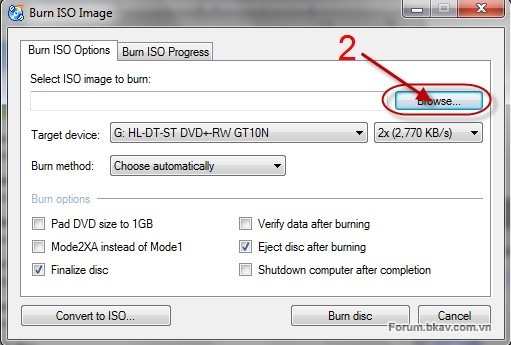

Sau khi kích chọn file:

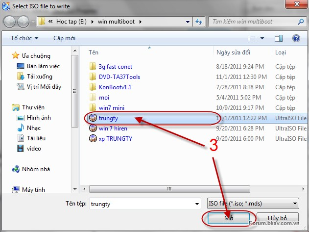

Tiếp đến: nhấn **Burn **và ngồi chờ

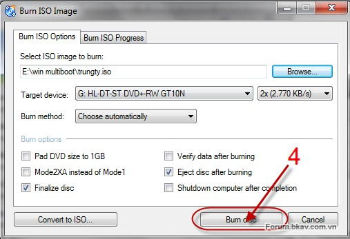

**5. Copy or grab disc: Copy đĩa ra nhiều đĩa khác**

Đầu tiên cho đĩa cần copy vào ổ đĩa, tại giao diện chính chọn:

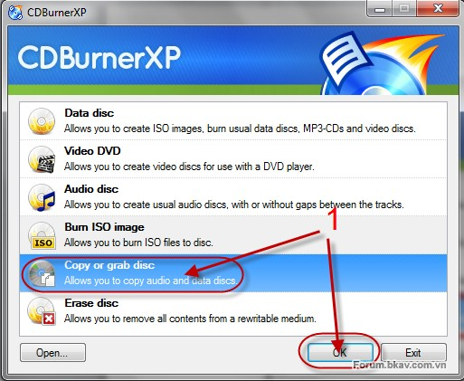

Tiếp đến chọn **Copy disc**

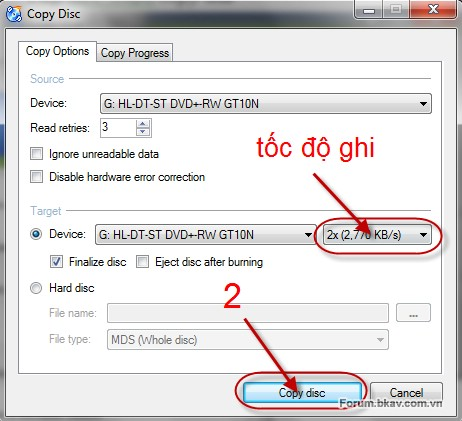

Quá trình copy diễn ra:

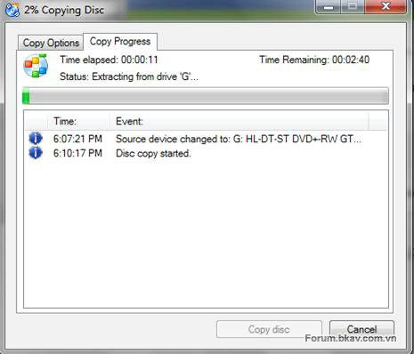

Sau khi copy xong sẽ hiện thông báo:

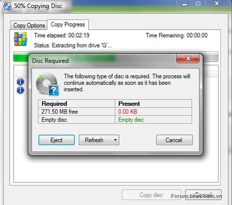

Bây giờ đĩa đã được đẩy ra. Bạn hay lấy đĩa trắng cho vào và quá trình
burn sẽ tự động tiếp tục.

Chúc các bạn thành công!

**6. Erase disc: Tẩy đĩa (áp dụng với đĩa có thể xóa đi ghi lại) để ghi
lại.**

Cho đĩa cần xóa vào.Tại giao diện chính chọn **Erase disc**:

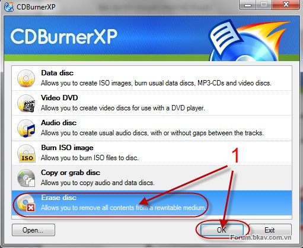

Tiếp đến:

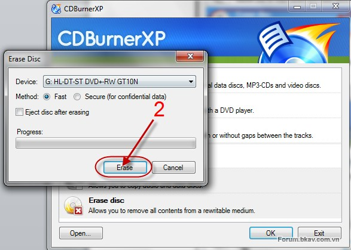

Chờ quá trình kết thúc là bạn có thể có đĩa để ghi rồi. Bạn chú ý là chỉ
áp dụng với đĩa chất lượng cao (có thể ghi nhiều lần).

Chúc bạn thành công!

**D. Nhận xét ưu nhược điểm**:

+ **Ưu điểm**: Giao diện đơn giản, gọn nhẹ, nhiều chức năng.
+ **Nhược điểm**: Chức năng còn hạn chế ở mức độ nhất định, ghi đĩa vẫn
có thể rớt đĩa nếu tốc độ cao, tính năng burn data vẫn còn hạn chế do
thiếu driver ở hầu hết máy tính (không nhận ra ổ đĩa) nếu nhận ra thì
vẫn ghi bình thường được, vẫn cần phần mềm khác để làm nhãn đĩa.

**IV.Ghi đĩa với phần mềm miễn phí InfraRecorder**

**A. Giới thiệu chung**:

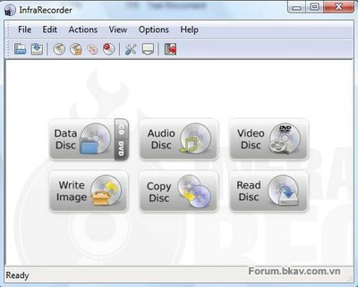

Chương trình có giao diện cực kì đơn giản và trực quan, phù hợp với tất
cả người sử dụng, và ẩn chứa rất nhiều ưu điểm:

- Hỗ trợ rất ghi nhiều định dạng đĩa khác nhau.
- Không chiếm dụng quá nhiều tài nguyên máy.
- Hỗ trợ đồng thời định dạng ISO, BIN và CUE.
- Hỗ trợ việc ghi đĩa Dual Layer DVDs (Đĩa DVD nhiều lớp).
- Hỗ trợ copy đĩa thành image.

**B. Hướng dẫn cài đặt:**

**C. Hướng dẫn sử dụng và tối ưu hóa**:

Sau khi cài xong trên Desktop xuất hiện biểu tượng:

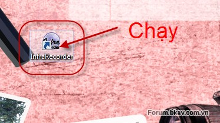

Giao diện chính của chương trình:

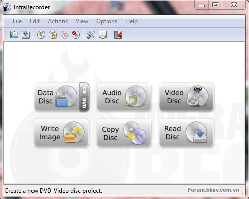

Gồm có:

+ Data Disc: đĩa data
+ Audio Disc: đĩa Audio
+ Video Disc: đĩa video
+ Write Image: Ghi file ảnh
+ Copy Disc: copy đĩa
+ Read Disc: đọc đĩa

Sau đây mình sẽ đi vào từng công cụ một:

**1. Data Disc**

Đầu tiên bạn cho đĩa trắng vào ổ đĩa

Tại giao diện chính bạn chọn **Data Disc** sẽ được như sau

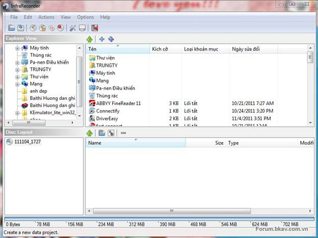

Bạn có thể chọn burn đĩa DVD hay CD bằng cách vào:

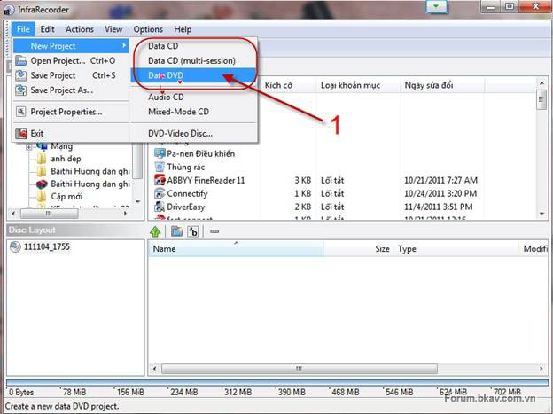

Ở đây mình ví dụ ghi đĩa DVD Data:

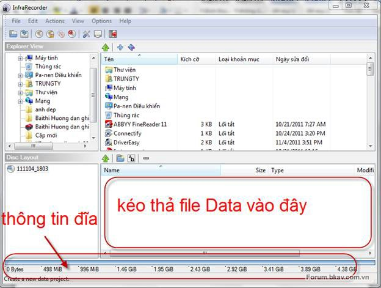

Bạn thêm file Data để ghi bằng cách kéo thả:

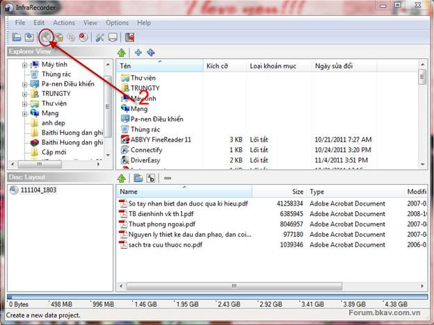

Sau khi thêm data rồi thì bạn nhấn vào biểu tượng trên để ghi đĩa:

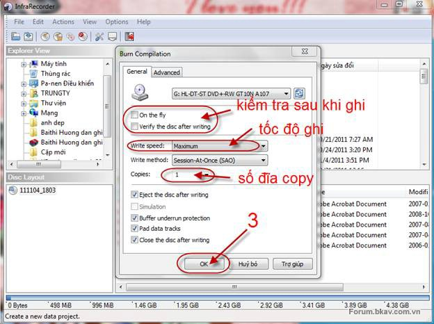

Tiếp đến bạn thiết lập kiểu ghi, và nhấn **OK**.

Quá trình ghi đĩa sẽ diễn ra. Chúc bạn thành công!

**2. Audio Disc**

Đầu tiên bạn cho đĩa CD trắng vào ổ đĩa.

Tại giao diện chính bạn chọn **Audio Disc** sẽ được như sau:

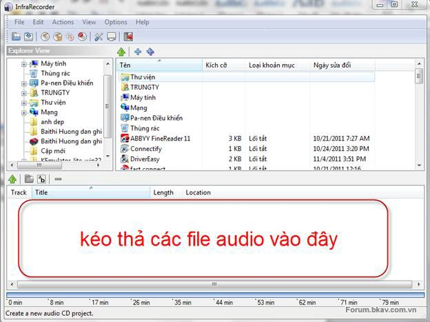

Sau khi kéo thả file vào ta được:

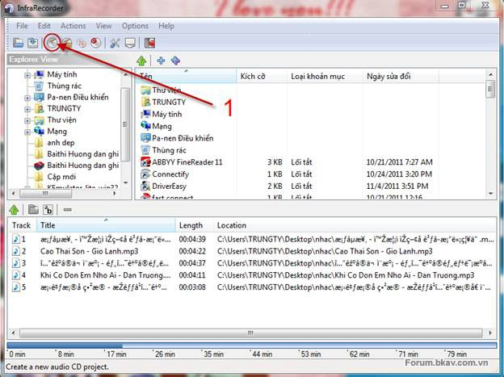

Tương tự như ghi Data, nhấn vào biểu tượng trên để ghi đĩa:

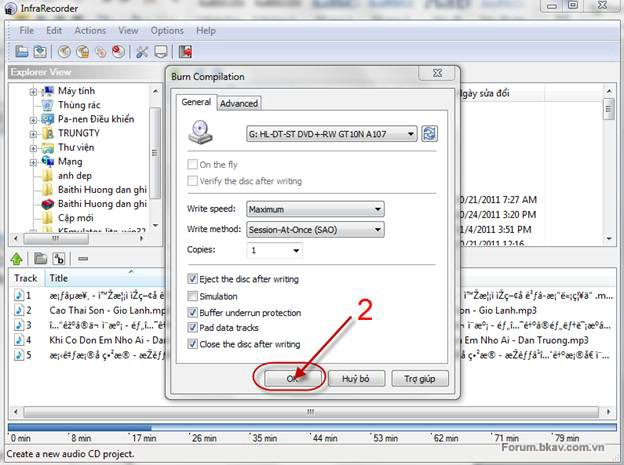

Bạn thiết lập các thông số tương tự như ghi đĩa Data. Sau đó nhấn OK để
thực hiện ghi đĩa.

**3. Video Disc**:

Đầu tiên bạn cho đĩa DVD trắng vào ổ đĩa.

Tại giao diện chính bạn chọn **Video Disc** sẽ được như sau:

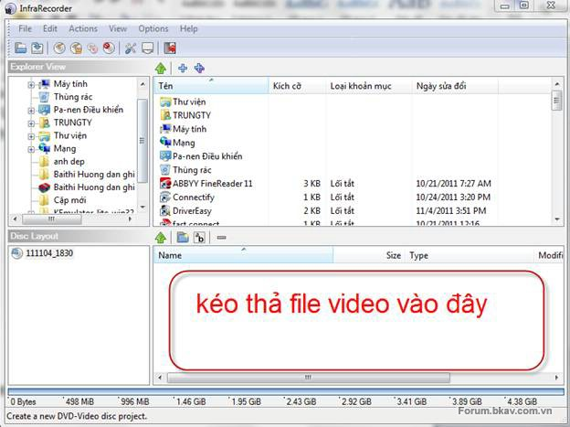

Sau khi bạn kéo thả Video vào khung trên sẽ được:

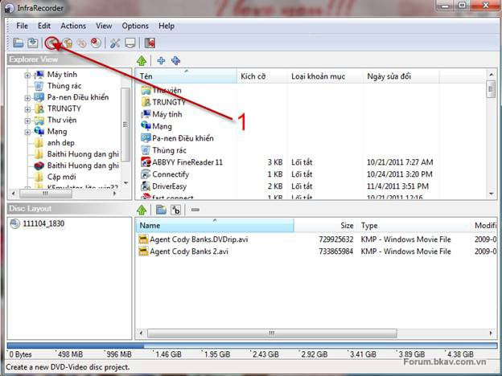

Bạn làm tương tự như trên, tiếp đến:

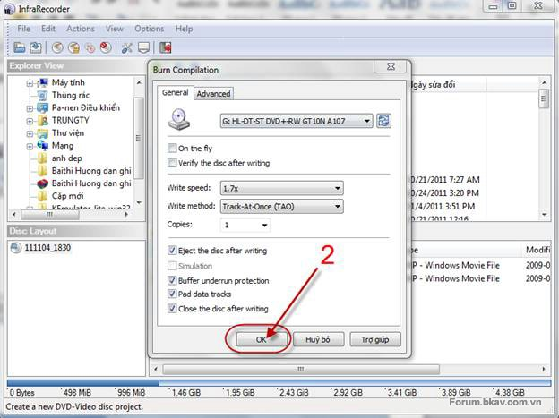

Bạn cũng chỉnh sửa thông số cần thiết để ghi đĩa rồi nhấn **OK **để tiến
hành ghi đĩa.

Chúc bạn thành công!

**4. Write Image: ghi file ảnh iso**

Cho đĩa CD hoặc DVD trắng vào, sau đó tại giao diện chính bạn
chọn **Write Image**:

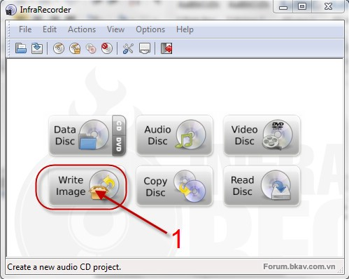

Tại cửa sổ tiếp đến bạn chọn file ảnh cần ghi (định dạng \*.iso, \*.cue,
\*.img)

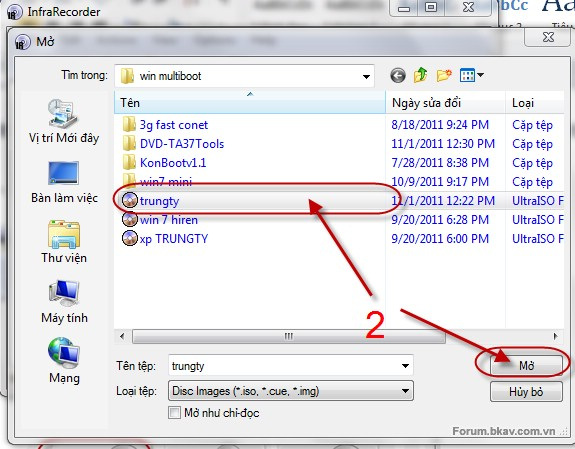

Tiếp đến bạn cũng tùy chỉnh các thông số như tốc độ ghi đĩa, kiểm tra
sau khi ghi… rồi nhấn **OK**để thực hiện ghi đĩa.

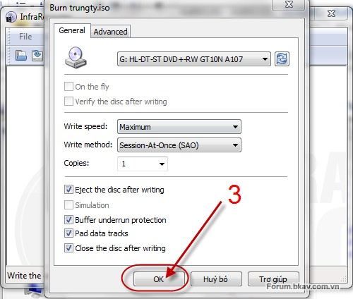

Chúc bạn thành công!

**5. Copy Disc: copy đĩa ra nhiều đĩa khác**

Cho đĩa cần copy vào ổ đĩa, sau đó tại giao diện chính bạn chọn:

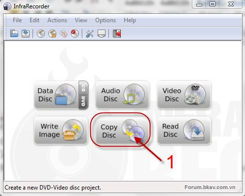

Tiếp đến:

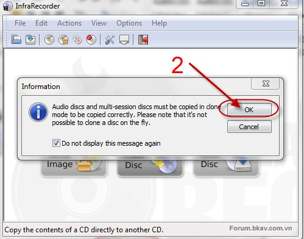

Tiếp đến bạn cũng thiết lập các thông số về tốc độ copy… như khi ghi đĩa
rồi nhấn **OK **để thực hiện copy:

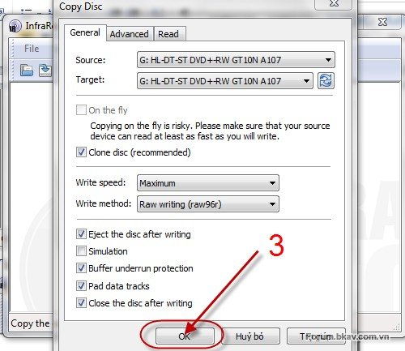

Sau khi copy xong, đĩa sẽ được đẩy ra bây giờ bạn hãy cho đĩa trắng vào
để ghi.

Chúc bạn thành công!

**6. Read Disc: Lưu file trên đĩa vào máy tính dưới dạng ảnh đĩa.**

Cho đĩa cần sao vào ổ đĩa, tiếp đến tại giao diện chính bạn chọn:

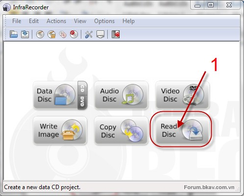

Tiếp đến:

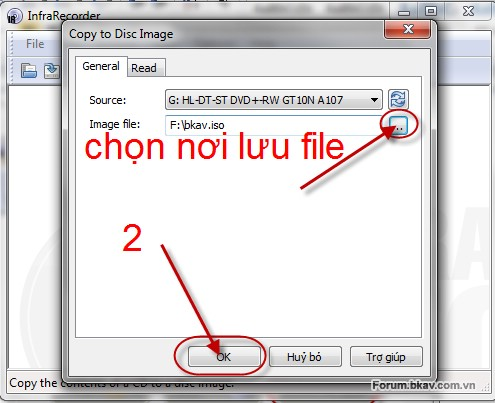

Chờ quá trình kết thúc là **OK**

Chúc bạn thành công!

**D. Nhận xét**:

+ **Ưu điểm**: Là phần mềm miễn phí, giao diện đơn giản, dễ sử dụng
+ **Nhược điểm**:Tuy nhiên chất lượng đĩa ghi không cao, dễ bị rớt đĩa
trong quá trình ghi.

**V. Phần mềm chuyên dụng làm mác (nhãn) đĩa Disketch**

**A. Giới thiệu chung**:

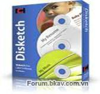

Disketch là phần mềm cho phép tạo các mác (nhãn) đĩa CD và DVD. Nó cho
phép bạn tạo các mác (nhãn) đĩa cũng như các ảnh ngoài cho các hộp đựng
CD và DVD.

**B. Hướng dẫn cài đặt**

Đây là phần mềm miễn phí, các bạn tải tại đây:

<http://www.nchsoftware.com/cdlabeler/disketchsetup.exe>

Trang chủ: <http://www.nchsoftware.com/cdlabeler/>

Sau khi tải về kích vào file cài đặt (ở đây là disketchsetup.exe) để
tiến hành cài đặt…

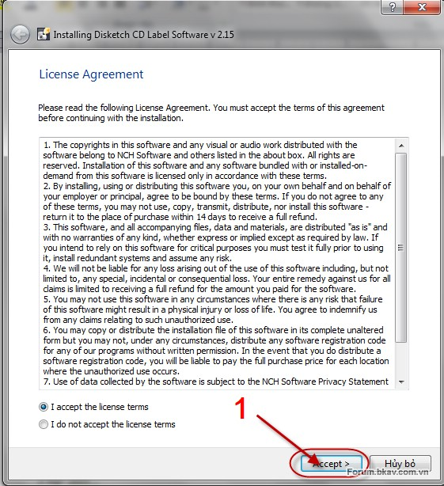

Tiếp đến:

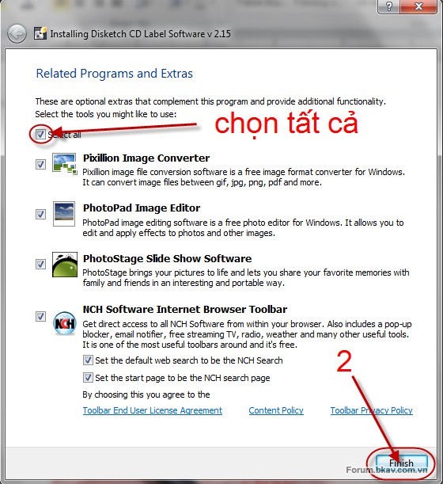

Nhấn **Finish **để kết thúc.

**C. Hướng dẫn sử dụng**:

Sau khi cài xong trên desktop xuất hiện 2 icon:

Có cả chức năng **Express Burning**, tuy nhiên ta chỉ chú ý đến chức
năng **Disketch CD label**, chạy nó ta được:

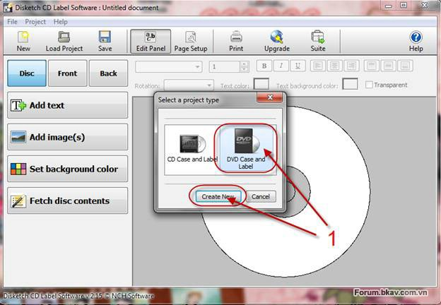

Có 2 sự lựa chọn là mác (nhãn) đĩa CD và DVD. Ở đây mình lấy DVD làm ví
dụ, CD thì tương tự, chọn như hình trên (nếu không thấy xuất hiện như
trên bạn có thể chọn **New **để có như vậy)

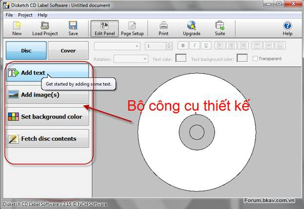

**1. Đầu tiên: Set background cho bìa đĩa**:

Chọn **Set Background** color sẽ được:

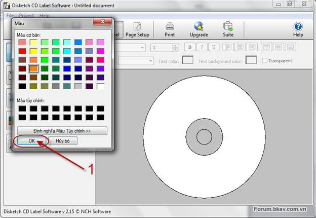

Chọn màu ưng ý và nhấn **OK**.

**2. Add image: chèn ảnh lên bìa đĩa**

Chọn add image:

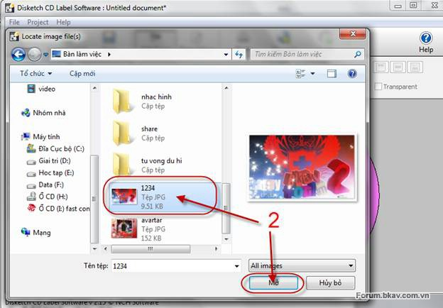

Căn chỉnh sao cho đẹp:

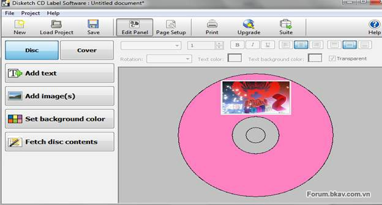

**3. Add text: chèn chữ**

Chọn **Add text** và đánh chữ vào, căn chỉnh cho phù hợp:

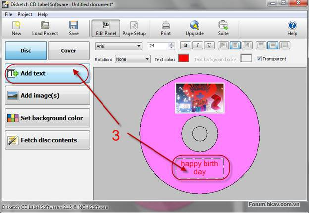

Sau khi xong, để in bìa đĩa ta chọn **Print**

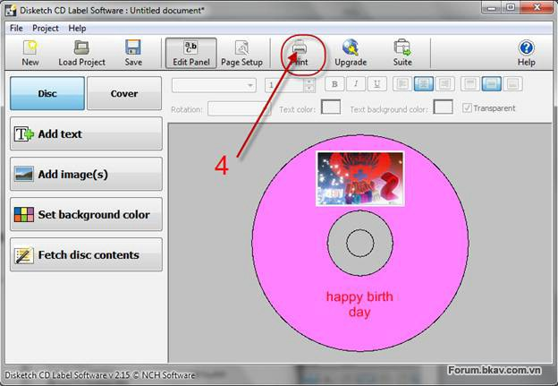

Tiếp đến:

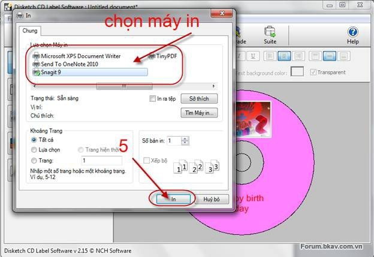

Chọn máy in, số bản in và nhấn **In**.

Vậy là bạn đã có bìa đĩa như ý chỉ sau vài thao tác, giờ mang ra dán vào
đĩa thôi! Chúc bạn thành công!

**D. Nhận xét**:

+ **Ưu điểm**: đơn giản gọn nhẹ dễ sử dụng, thao tác nhanh.
