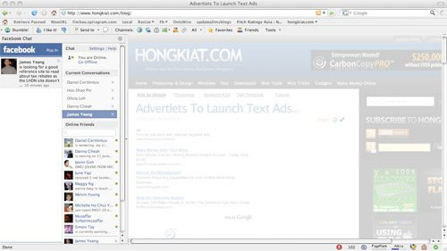
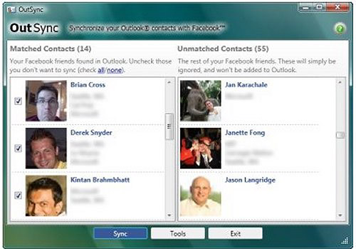
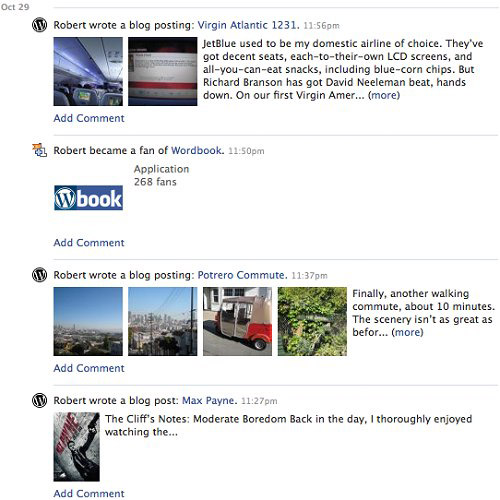
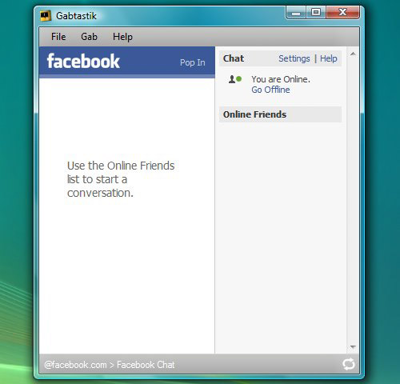
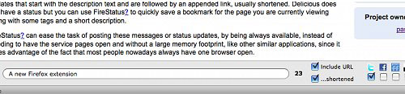

{width="5.208333333333333in"
height="4.166666666666667in"}

([*Facebook Việt*](http://facebookviet.com/)) Nếu bạn lướt Facebook 
hàng ngày, có lẽ bạn đã quen thuộc với các thao tác đơn giản như thêm/
xóa  bạn bè, cập nhật trạng thái, sử dụng wall và profile, thêm và khám
phá các trang (pages) & các ứng dụng (applications) vv… Nhưng còn có rất
nhiều điều nữa bạn có thể chưa biết về Facebook

[*Facebookviet*](http://facebookviet.com/) xin chia sẻ một số điều thú
vị, một số thủ thuật mà ít người biết trên Facebook, một số mẹo giúp bạn
kết nối tốt hơn với  bạn bè của mình .

Và dưới đây là  **20 mẹo về Facebook có thể bạn không biết.**

1.  Làm thế nào để  đặt Facebook chat  trên thanh sidebar của Firefox

> Nếu bạn đang sử dụng Firefox, bạn có thể đặt Facebook chat ở thanh
> bên.

1.  Làm thế nào để tải ảnh của 1 album trên Facebook

> [\
> *FacePAD: Facebook album hình ảnh tải
> về*](https://addons.mozilla.org/en-US/firefox/addon/8442) cho phép bạn
> tải về album ảnh của bạn bè cũng như album Events (sự kiện) và Groups
> Album chỉ với một click chuột
>
> {width="5.208333333333333in"
> height="5.177083333333333in"}
>
> {width="5.208333333333333in"
> height="2.9270833333333335in"}

1.  Làm thế nào để chia sẻ hình ảnh Flickr tới Facebook

> [*Flickr2Facebook*](http://www.keebler.net/flickr2facebook/) là một
> công cụ cho phép bạn tải ảnh lên Facebook từ Flickr.
>
> {width="5.208333333333333in"
> height="3.1770833333333335in"}

1.  Làm thế nào để cập nhật mà không cần sử dụng Facebook

> [*hellotxt*](http://hellotxt.com/) và *Ping.fm* giới thiệu các tính
> năng cho phép các quản trị viên cập nhật các Trang trên Facebook
> (pages).
>
> {width="5.208333333333333in"
> height="5.34375in"}

1.  Làm thế nào để đặt lịch cho các tin nhắn trên Facebook

> [*Sendible*](http://sendible.com/) cho phép bạn đặt lịch hẹn gửi tin
> nhắn của bạn tới bạn bè, đồng nghiệp hoặc khách hàng trong tương lai
>
> [\
> {width="5.208333333333333in"
> height="3.2395833333333335in"}](http://sendible.com/)

1.  Làm thế nào để dùng chức năng “bạn bè”  thực sự trên Facebook & giới
    > hạn chỉ một số người có thể xem được cập nhật trạng thái của bạn

> Một hướng dẫn nhỏ giúp bạn làm thế nào để cập nhật trạng thái Facebook
> và chỉ cho phép những người bạn gần gũi đọc được
>
> [\
> {width="5.208333333333333in"
> height="6.395833333333333in"}](http://www.makeuseof.com/tag/facebook-tip-how-to-safely-friend-a-colleague-or-relative-without-showing-them-all-your-business/)

1.  Làm thế nào để Tạo một Khung ảnh bạn bè Sử dụng hình ảnh của bạn bè\
    > Facebook của bạn

> Click vào thanh  **Bạn bè (friends). **Bấm vào **More tab  (để thêm 1
> tab)**.  Từ**“Choose an option“** , chọn bất kỳ\
> dấu gạch ngang **“-”.** Bạn bè trên Facebook của bạn sẽ được hiển thị
> gọn trên màn hình máy tính của bạn
>
> [\
> {width="5.208333333333333in"
> height="4.052083333333333in"}](http://www.hongkiat.com/blog/create-photo-collagegrid-view-of-your-facebook-friends/)

1.  Làm thế nào để biết Facebook Khi bạn bè secretly Xóa hay Chặn Bạn

> [*X-bạn bè*](http://findxfriends.com/) là một công cụ duy\
> nhất để theo dõi bạn bè rằng biến mất từ Facebook.
>
> {width="5.208333333333333in"
> height="2.2083333333333335in"}

1.  Làm thế nào để luôn hiển thị một số hình ảnh bạn của bạn trên hồ sơ
    > (thay vì để Facebook tự xếp)

> Một tính năng ít được biết trong Facebook cho phép bạn quyết định
> những ai hiển thị trong ô bạn bè (Friends box) của bạn. Click
> vào **biểu tượng hình bút chì (Edit hay Chỉnh sửa) t**rong hộp bạn bè
> của bạn và **nhập tên của** người bạn tốt nhất của bạn trong vào
> ô** Always show these friends**

1.  {width="5.208333333333333in"
    > height="2.3125in"}

2.  Làm thế nào để gỡ bỏ **quảng cáo trên Facebook**

> Một script  Greasemonkey script -[ *Facebook:
> Cleaner*](http://userscripts.org/scripts/show/27121) cho phép bạn gỡ
> bỏ các quảng cáo gây phiền nhiễu và những updates (cập nhật trạng
> thái) không mong muốn trên trang profile của bạn.
>
> [\
> {width="5.208333333333333in"
> height="3.0in"}](http://userscripts.org/scripts/show/27121)

1.  Làm thế nào để đồng bộ hình ảnh của bạn bè trên Facebook với
    > Contacts trên\
    > Microsoft Outlook

> [*OutSync*](http://www.melsam.com/outsync/) là một ứng dụng miễn phí
> cho phép bạn đồng bộ hóa hình ảnh của bạn bè của bạn trên Facebook
> Facebook với\
> Contacts trong Microsoft Outlook. Nó cho phép bạn chọn chỉ cập nhật
> một số người. Vì vậy, bạn có thể cập nhật tất cả các Contacts cùng một
> lúc, hoặc chỉ một vài contacts cùng một lúc
>
> [\
> {width="5.208333333333333in"
> height="3.6354166666666665in"}](http://www.melsam.com/outsync/)

1.  Làm thế nào để hiển thị Status của Facebook trên  Blog WordPress

> Dưới đây là một số phương pháp sử dụng Facebook status feed và
> WordPress RSS để hiển thị status của bạn trên blog WordPress
>
> {width="5.208333333333333in"
> height="3.6770833333333335in"}

1.  Làm thế nào để đăng Bài viết trên Blog của bạn tự động lên
    > Tường (Wall) trên Facebook

> [*Wordbook*](http://wordpress.org/extend/plugins/wordbook/) cho phép
> bạn đăng bài viết trên blog của bạn lên Tường của Facebook. Tab
> Facebook “Boxes” sẽ hiển thị những bài viết mới nhất trên blog của
> bạn.
>
> {width="5.208333333333333in"
> height="5.208333333333333in"}

1.  Làm thế nào để truy cập Facebook chat trên màn hình máy tính

> [*Gabtastik*](http://www.gabtastik.com/GabtastikWin.html) and *digsby* cho
> phép bạn tiếp tục mở các cửa sổ chat (trò chuyện)\
> chuyện trên Windows của bạn độc lập với các trình duyệt web
>
> {width="5.208333333333333in"
> height="5.0in"}

1.  Làm thế nào để Tạo Quiz trên Facebook dễ dàng

> [*LOLapps*](http://www.lolapps.com/) cho bạn những bài trắc nghiệm cá
> nhân dễ dàng và chia sẻ với bạn bè của bạn
>
> {width="5.208333333333333in"
> height="3.6145833333333335in"}

1.  Làm thế nào để Ẩn Tình trạng trực tuyến (Online status) của bạn trên
    > Facebook trong ô Chat

> Facebook đã tích hợp Friend list của bạn với Chat box và bạn cũng có\
> thể chọn danh sách các thành viên có thể nhìn thấy bạn đang online.
>
> {width="5.208333333333333in"
> height="4.083333333333333in"}

1.  Làm thế nào để cập nhật trên Facebook từ email của bạn

> [*NutshellMail*](http://nutshellmail.com/) cập nhật những trạng thái
> mới nhất của bạn tới email
>
> {width="5.208333333333333in"
> height="3.5416666666666665in"}

1.  Làm thế nào để cập nhật trạng thái (status) Facebook  từ trình duyệt
    > Firefox

> [*FireStatus*](https://addons.mozilla.org/en-US/firefox/addon/8973) là
> công cụ cho phép cập nhật trạng thái (status) lên nhiều mạng xã hội
> khác nhau, bao gồm cả Facebook.
>
> {width="5.208333333333333in"
> height="1.21875in"}

1.  Sử dụng Facebook ngay trên màn hình máy tính của bạn

> [*Seesmic
> Desktop*](http://desktop.seesmic.com/), *Facebooker*, *Xobni*, [*Facebook
> Sidebar
> Gadget*](http://www.facebooksidebargadget.com/), *Scrapboy* và[*Facebook
> AIR
> application*](http://static.ak.fbcdn.net/fbair/Facebook_Desktop_for_AIR.zip)
>
> là những công cụ cho phép bạn sử dụng Facebook ngay trên Desktop mà
> không qua trình duyệt
>
> {width="5.208333333333333in"
> height="3.03125in"}

1.  Làm thế nào để Xóa, Hủy Bỏ và Chấm dứt Tài khoản Facebook

> Một hướng dẫn nhỏ chỉ cho bạn cách xóa hoặc hủy bỏ tài khoản Facebook,
> và pofile của bạn  một cách dễ dàng.
>
> {width="5.208333333333333in"
> height="7.447916666666667in"}

Category: [*Facebook nâng
cao*](http://facebookviet.com/category/facebook-nang-cao/), *Mẹo sử
dụng*

Subscribe to [*RSS*](http://facebookviet.com/feed/) feed
