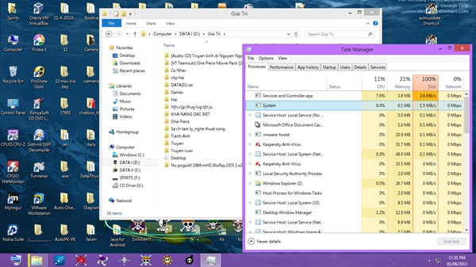
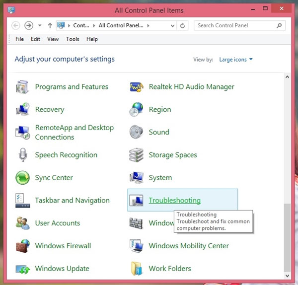
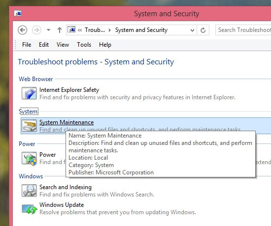
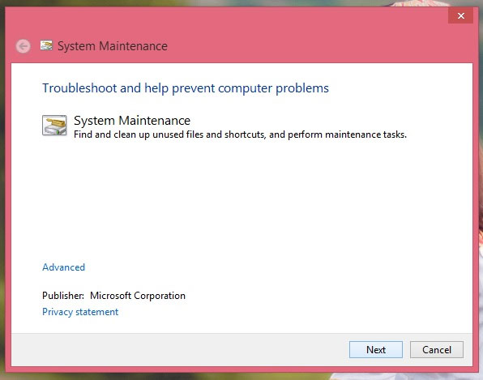
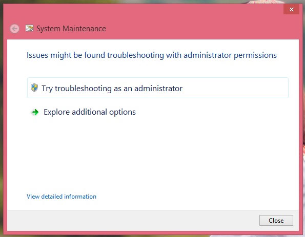
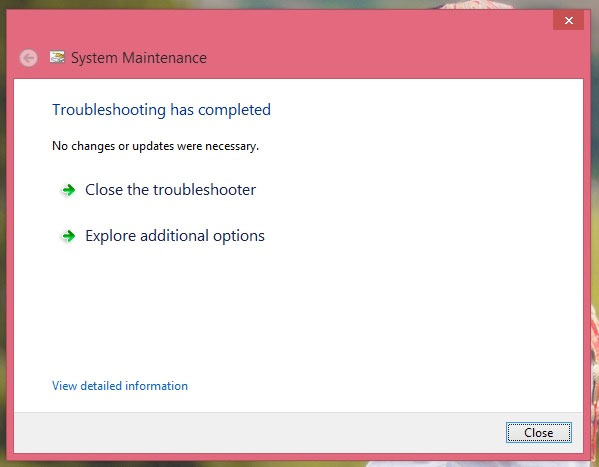
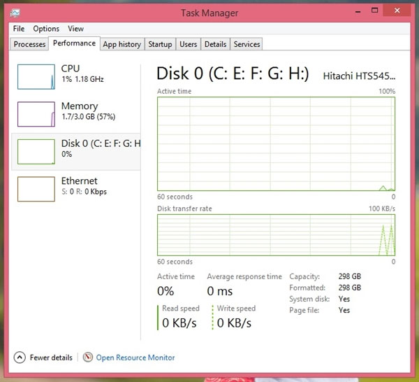

Có khá nhiều bạn đọc than phiền vì “dính” lỗi 100% Disk khi cài
Windows 8 hoặc sau khi nâng cấp lên Windows 8.1. Tình trạng này thường
hay xảy ra khi người dùng khởi động máy tính, và khi đang bị, máy sẽ
hoạt động rất chậm và dễ gây nóng máy.

Bài viết này tôi sẽ hướng dẫn bạn đọc cách đơn giản nhất để giải quyết
vấn đề này một cách triệt để:

Trước tiên, bạn mở Control Panel trên Windows 8/8.1 lên và nhấn chọn
Troubleshooting

Trong Troubleshooting, bạn chọn tiếp System and Security

Bạn chọn tiếp System Maintenance

Hộp thoại System Maintenance xuất hiện. Bạn hãy nhấn Next để sang bước
tiếp theo

Hệ thống sẽ tiến hành quét vấn đề trong ít giây

Sau đó bạn chọn tiếp dòng Try troubleshooter as administrator

Windows sẽ tiến hành quết lại hệ thống lần nữa để kiểm tra sự cố. Sau
khi xong việc, bạn nhấn Close để kết thúc

Bây giờ hãy khởi động lại Windows để kiểm tra kết quả.
