**Khi phiên bản mới nhất Windows 7 đang được hoàn tất, Quantrimang.com
chúng tôi xin dành một bài viết để giới thiệu tóm tắt về lịch các phiên
bản khác trong hệ điều hành Windows từ trước cho tới nay.**

Quả thực mà nói, hệ điều hành Windows đã có một lịch sử phát triển khá
dài, phiên bản đầu tiên của hệ điều hành này đã được phát hành cách đây
khoảng 25 năm và quãng thời gian mà Windows chiếm được ưu thế đối với
các máy tính cá nhân cũng vào khoảng trên 15 năm. Rõ ràng, qua rất nhiều
thay đổi về kỹ thuật trong 25 năm qua, phiên bản ngày nay của Windows đã
được phát triển hơn rất nhiều so với phiên bản Windows 1.0.

Phiên bản đầu tiên của Windows này (Windows 1.0) khá sơ đẳng. Sơ đẳng
hơn cả hệ điều hành DOS trước đó, tuy nhiên nhược điểm phát sinh là ở
chỗ rất khó sử dụng. Vì thực tế khi đó nếu bạn không có chuột thì việc
sử dụng sẽ khó khăn hơn rất nhiều so với giao diện dòng lệnh của DOS.

Tuy nhiên Windows được phát triển ngày một tốt hơn và cũng được phổ biến
rộng rãi hơn. Microsoft đã nâng cấp Windows trên một cơ sở nhất quán qua
hai thập kỷ qua. Phát hành một phiên bản Windows mới sau một vài năm;
đôi khi phiên bản mới chỉ là một nâng cấp nhỏ nhưng đôi khi lại là quá
trình đại tu toàn bộ.

Cho ví dụ, Windows 95 (phát hành năm 1995), phiên bản được viết lại toàn
bộ từ Windows 3.X trước đó nhưng trong khi đó phiên bản kế tiếp, Windows
98, lại là một nâng cấp và phiên bản Windows 98 thứ hai (năm 1999) thực
sự không khác gì một bản vá lỗi nhỏ.

Vậy phiên bản Windows 7 sắp ra nằm ở đâu trong timeline này? Windows
Vista, phiên bản trước đó, là một sự đại tu triệt để đối với hệ điều
hành này thì Win7 cũng có vẻ giống như Windows 98 – một nâng cấp bổ sung
thứ thiệt.

Đó là việc dõi theo lịch sử phát triển của Windows, rõ ràng, các nâng
cấp thứ yếu thường được phát hành sau những nâng cấp chủ đạo. Ở đây
Vista là chủ đạo, Windows 7 là thứ yếu, và đó cũng chính là chu trình
phát triển hệ điều hành của Microsoft.

Với những giới thiệu tổng quan trên, chúng ta hãy xem xét chi tiết hơn
về mỗi một phiên bản liên tiếp của Windows – bắt đầu với hình thức sơ
khai nhất của nó, hệ điều hành được biết đến với tên DOS.

**DOS**

Windows được phát triển từ hệ điều hành DOS ban đầu của Microsoft, đây
là hệ điều hành được phát hành năm 1981. Hệ điều hành mới này đã được
Bill Gates và Paul Allen phát triển để chạy trên máy tính cá nhân IBM,
với giao diện hoàn toàn bằng văn bản và các lệnh người dùng giản đơn.

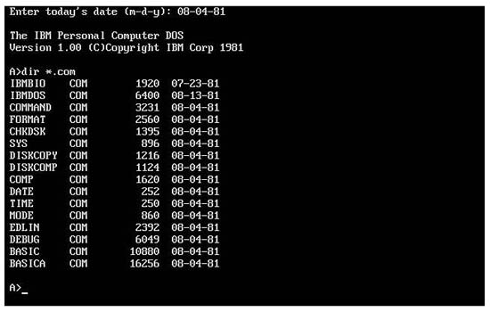{width="7.638888888888889in"
height="4.861111111111111in"}\
Hình 1: Hệ điều hành đầu tiên của Microsoft - PC-DOS 1.0

Những cải tiến tiếp tục được thực hiện, IBM đã liên hệ với công ty
Microsoft để cung cấp hệ điều hành cho các máy tính IBM vào thời điểm
ban đầu này. Khi đó Gates và Allen đã mua QDOS (*quick and dirty
operating system*) từ Seattle Computer Products và đã điều chỉnh những
cần thiết cho hệ thống máy tính mới.

Hệ điều khi đó được gọi là DOS, viết tắt cho cụm từ *disk operating
system*. DOS là một tên chung cho hai hệ điều hành khác nhau. Khi được
đóng gói với các máy tính cá nhân IBM, DOS được gọi là PC DOS. Còn khi
được bán dưới dạng một gói riêng bởi Microsoft, DOS được gọi là MS-DOS.
Tuy nhiên cả hai phiên bản đều có chức năng tương tự nhau.

Hầu hết người dùng PC thế hệ đầu tiên đều phải học để điều hành máy tính
của họ bằng DOS. Nhưng hệ điều hành này không thân thiện một chút nào;
nó yêu cầu người dùng phải nhớ tất cả các lệnh và sử dụng các lệnh đó để
thực hiện hầu hết các hoạt động hàng ngày, chẳng hạn như việc copy các
file, thay đổi thư mục,… Ưu điểm chính của DOS là tốc độ và tiêu tốn ít
bộ nhớ, đây là hai vấn đề quan trọng khi hầu hết các máy tính chỉ có
640K bộ nhớ.

**Windows 1.0**

Microsoft tin rằng các máy tính các nhân sẽ trở thành xu thế chủ đạo,
chúng phải dễ dàng hơn trong sử dụng, bảo vệ cho sự tin tưởng đó chính
là giao diện đồ họa người dùng (GUI) thay cho giao diện dòng lệnh của
DOS. Với quan điểm đó, Microsoft đã bắt tay vào thực hiện phiên bản mở
đầu của Windows vào năm 1983, và sản phẩm cuối cùng được phát hành ra
thị trường vào tháng 11 năm 1985.

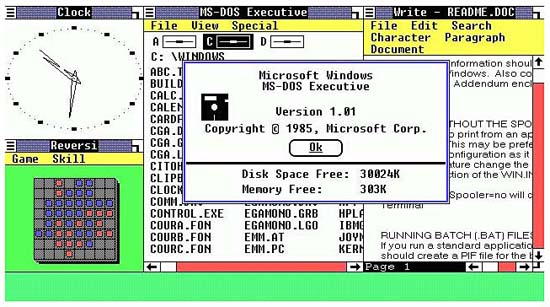{width="7.638888888888889in"
height="4.263888888888889in"}\
Hình 2: Phiên bản đầu tiên của Windows - Windows 1.0

Windows ban đầu được gọi là *Interface Manager*, và không có gì ngoài
một lớp vỏ đồ họa đặt trên hệ điều hành DOS đang tồn tại. Trong khi DOS
chỉ là một hệ điều hành sử dụng các lệnh bằng văn bản và gắn chặt với
bàn phím thì Windows 1.0 đã hỗ trợ hoạt động kích vào thả của chuột. Tuy
nhiên các cửa sổ trong giao diện hoàn toàn cứng nhắc và không mang tính
xếp chồng.

Không giống các hệ điều hành sau này, phiên bản đầu tiên của Windows này
chỉ có một vài tiện ích sơ đẳng. Nó chỉ có chương trình đồ họa Windows
Paint, bộ soạn thảo văn bản Windows Write, bộ lịch biểu, notepad và một
đồng hồ. Tuy nhiên thời đó Windows 1.0 cũng có Control Panel, đây là
thành phần được sử dụng để cấu hình các tính năng khác cho môi trường,
và MS-DOS Executive - kẻ tiền nhiệm cho bộ quản lý file Windows Explorer
ngày nay.

Không hề ngạc nhiên vì Windows 1.0 không thành công như mong đợi. Do lúc
đó không có nhiều nhu cầu cho một giao diện đồ họa người dùng cho các
ứng dụng văn bản cho các máy tính PC của IBM và đây cũng là phiên bản
Windows đầu tiên yêu cầu nhiều công xuất hơn các máy tính vào thời đại
đó.

**Windows 2.0**

Phiên bản thứ hai của Windows được phát hành vào năm 1987, đây là phiên
bản được cải tiến dựa trên phiên bản Windows 1.0. Phiên bản mới này đã
bổ sung thêm các cửa sổ có khả năng xếp chồng nhau và cho phép tối thiểu
hóa các cửa sổ để chuyển qua lại trong desktop bằng chuột.

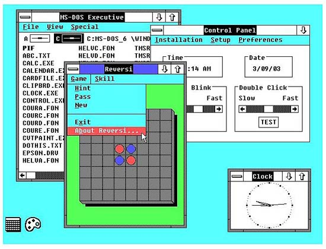{width="7.638888888888889in"
height="5.833333333333333in"}\
Hình 3: Các cửa sổ xếp chồng của Windows 2.0

Trong phiên bản này, Windows 2.0 đã có trong nó các ứng dụng Word và
Excel của Microsoft. Lúc này Word và Excel là các ứng dụng đồ họa cạnh
tranh với các đối thủ khi đó WordPerfect và Lotus 1-2-3; các ứng dụng
của Microsoft cần một giao diện đồ họa để có thể chạy hợp thức, do đó
Microsoft đã tích hợp chúng vào với Windows.

Lúc này không có nhiều ứng dụng tương thích với Windows. Chỉ có một
ngoại lệ đáng lưu ý đó là chương trình Aldus PageMaker.

**Windows 3.0**

Lần thứ ba có tiến bộ hơn các phiên bản trước rất nhiều và đánh dấu một
mốc quan trọng trong thương mại. Windows 3.0, phát hành năm 1990, là
phiên bản thương mại thành công đầu tiên của hệ điều hành, Microsoft đã
bán được khoảng 10 triệu copy trong hai năm trước khi nâng cấp lên 3.1.
Đây là phiên bản hệ điều hành đa nhiệm đích thực đầu tiên. Sau sự thành
công với Macintosh của Apple, thế giới máy tính cá nhân đã sẵn sàng cho
một hệ điều hành đa nhiệm cùng với giao diện đồ họa người dùng.

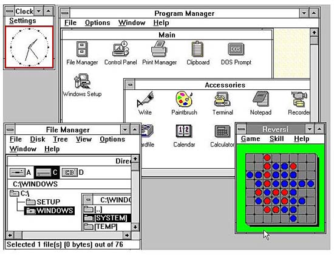{width="7.638888888888889in"
height="5.833333333333333in"}\
Hình 4: Phiên bản Windows 3.0

Windows 3.0 là một cải thiện lớn so với các phiên bản trước đây. Giao
diện của nó đẹp hơn nhiều với các nút 3D và người dùng có thể thay đổi
màu của desktop (tuy nhiên thời điểm này chưa có các ảnh nền -
wallpaper). Các chương trình được khởi chạy thông qua chương trình
Program Manager mới, và chương trình File Manager mới đã thay thế cho
chương trình MS-DOS Executive cũ trong vấn đề quản lý file. Đây cũng là
phiên bản đầu tiên của Windows có trò chơi Solitaire trong đó. Một điều
quan trọng nữa là Windows 3.0 có một chế độ Protected/Enhanced cho phép
các ứng dụng Windows nguyên bản có thể sử dụng bộ nhớ nhiều hơn hệ điều
hành DOS của nó.

Sau phát hành Windows 3.0, các ứng dụng được viết cho Windows được phát
triển rất rộng rãi trong khi đó các ứng dụng không cho Windows
(non-Windows) thì ngược lại. Windows 3.0 đã làm cho các ứng dụng Word và
Excel đã đánh bại các đối thủ cạnh tranh khác như WordPerfect, 1-2-3.

**Windows 3.1**

Windows 3.1, phát hành năm 1992, có thể coi là một nâng cấp cho phiên
bản 3.0. Phiên bản này không chỉ có các bản vá lỗi cần thiết mà nó còn
là phiên bản đầu tiên mà Windows hiển thị các font TrueType –làm cho
Windows trở thành một nền tảng quan trọng cho các máy desktop. Một điểm
mới nữa trong Windows 3.1 là bộ bảo vệ màn hình (screensaver) và hoạt
động kéo và thả.

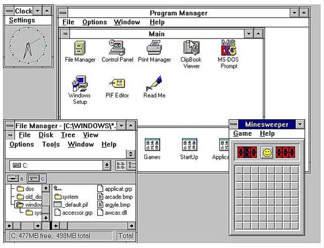{width="7.638888888888889in"
height="5.833333333333333in"}\
Hình 5: Các font TrueType của Windows 3.1

**Windows cho các nhóm làm việc (Workgroup)**

Cũng được phát hành vào năm 1992, Windows cho các nhóm làm việc (viết
tắt là WFW), là phiên bản dùng để kết nối đầu tiên của Windows. Ban đầu
được phát triển như một add-on của Windows 3.0, tuy nhiên WFW đã bổ sung
thêm các driver và các giao thức cần thiết (TCP/IP) cho việc kết nối
mạng ngang hàng. Đây chính là phiên bản WFW của Windows thích hợp với
môi trường công ty.

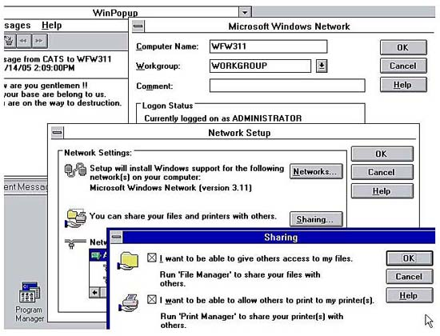{width="7.638888888888889in"
height="5.833333333333333in"}\
Hình 6: Windows cho các nhóm làm việc – phiên bản kết nối đầu tiên của
Windows

Với WFW, các phát hành của Windows được chia thành hai hướng: hướng dành
cho khách hàng, được thiết kế dành cho sử dụng trên các máy tính PC
riêng lẻ, hiện thân là Windows 3.1 và Windows 95 sắp ra đời, và một
hướng là dành cho khối doanh nghiệp, được thiết kế để sử dụng trên các
máy tính có kết nối mạng, hiện thân là WFW và Windows NT sắp ra đời.

**Windows NT**

Phát hành kế tiếp cho khối doanh nghiệp của Windows là Windows NT (từ NT
là viết tắt của cụm từ *newtechnology*), phiên bản chính thức được phát
hành vào năm 1993. Mặc dù vậy NT không phải là một nâng cấp đơn giản cho
WFW mà thay vì đó nó là một hệ điều hành 32-bit đúng nghĩa được thiết kế
cho các tổ chức có kết nối mạng. (Các phiên bản khách hàng vẫn được duy
trì ở các hệ điều hành 16-bit).

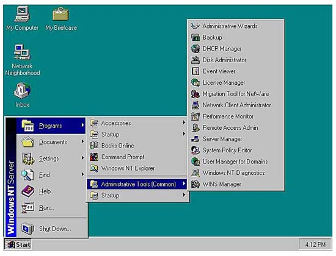{width="7.638888888888889in"
height="5.833333333333333in"}\
Hình 7: Windows NT – phiên bản Windows 32-bit đầu tiên dành cho sử dụng
trong khối doanh nghiệp

Windows NT cũng là một thành viên trong hợp tác phát triển hệ điều hành
OS/2 của Microsoft với IBM. Tuy nhiên khi mối quan hệ giữa IBM và
Microsoft bị đổ vỡ, IBM vẫn tiếp tục với OS/2, trong khi đó Microsoft đã
thay đổi tên phiên bản của OS/2 thành Windows NT.

Phục vụ cho khách hàng doanh nghiệp, Windows NT đã có hai phiên bản:
Workstation và Server. NT Workstation được dành cho các PC riêng rẽ trên
mạng công ty, còn NT Server có nhiệm vụ máy chủ cho tất cả các PC được
kết nối với nhau.

Với những khả năng cải thiện về công nghệ kết nối mạng, NT đã trở thành
một hệ điều hành chủ đạo cho các máy chủ và máy trạm doanh nghiệp trên
toàn thế giới. Nó cũng là cơ sở cho hệ điều hành Windows XP, hệ điều
hành sát nhập hai luồng Windows thành một hệ điều hành chung vào năm
2001.

**Windows 95**

Quay trở lại với hướng khách hàng, Microsoft đã sẵn sàng một phát hành
mới vào tháng 8 năm 1995. Phiên bản Windows 95 này có lẽ là phát hành
lớn nhất trong số các phát hành Windows.

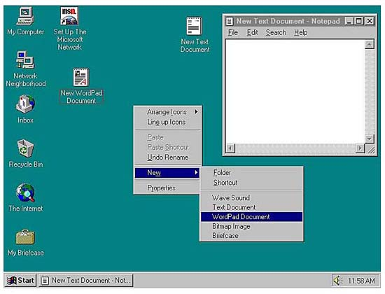{width="7.638888888888889in"
height="5.833333333333333in"}\
Hình 8: Windows 95 – phát hành Windows lớn nhất chưa từng có

Có thể khá khó khăn để hình dung lại sau 15 năm, nhưng phát hành Windows
95 là một sự kiện mang tính lịch sử, với việc đưa tin rộng rãi trên
phương tiện thông tin đại chúng, các khách hàng đã xếp thành những hàng
dài bên ngoài các cửa hàng từ nửa đêm để mua được những bản copy đầu
tiên của hệ điều hành này.

Tuy nhiên những gì mới thực sự gây choáng? Windows 95 có diện mạo đẹp
hơn và khả năng làm việc cũng tốt hơn, cả hai thứ đó đều đạt được mong
mỏi của người dùng sau nhiều năm chờ đợi. Đây là một hệ điều hành được
viết lại phần lớn và đã cải thiện được giao diện người dùng và đưa
Windows sang nền tảng 32-bit giả mạo. (Nhân kernel 16-bit vẫn được giữ
lại để có thể tương thích với các ứng dụng cũ).

Windows 95 đã xuất hiện Taskbar, thanh tác vụ này có các nút cho các cửa
sổ mở. Nó cũng là phiên bản đầu tiên của Windows có sử dụng nút Start và
menu Start; các shortcut trên desktop, kích phải chuột và các tên file
dài cũng lần đầu tiên xuất hiện trong phiên bản này.

Một điểm mới nữa trong Windows 95 – mặc dù không có trong phiên bản ban
đầu – đó là trình duyệt web Internet Explorer của Microsoft. IE 1.0 lần
đầu tiên xuất hiện là trong Windows 95 Plus! Với tư cách một add-on;
phiên bản 2.0 có trong Win95 Service Pack 1, gói dịch vụ được phát hành
vào tháng 12 năm 1995.

**Windows 98**

Windows 98, cũng được lấy tên năm phát hành của nó (1998), là một thay
đổi mang tính cách mạng so với phiên bản trước đó. Diện mạo bên ngoài
của nó đẹp hơn Windows 95 khá nhiều, và thậm chí nó còn có nhiều cải
thiện hữu dụng bên trong. Những cải thiện ở đây như sự hỗ trợ cho USB,
chia sẻ kết nối mạng và hệ thống file FAT32, tuy tất cả đều những cải
thiện này rất đáng giá nhưng không làm cho cả thế giới choáng ngợp như
lần ra mắt của Windows 95.

Microsoft đã phát hành phiên bản nâng cấp "Second Edition" của Windows
98 vào năm 1999. Phiên bản này có ít những thay đổi đáng chú ý mà chỉ có
hầu hết các bản vá lỗi.

**Windows Me**

Microsoft phát hành phiên bản Windows Millennium edition vào năm 2000.
Windows Me, có lẽ là lỗi lớn nhất của Microsoft, một nâng cấp thứ yếu
với rất nhiều lỗi thay vì sửa các lỗi trước đó.\
Trong phiên bản mới này, Microsoft đã nâng cấp các tính năng Internet và
multimedia của Windows 98, bổ sung thêm ứng dụng Windows Movie Maker,
giới thiệu tiện ích System Restore – tất cả đều là những ứng dụng tốt.
Tuy nhiên điều đáng chú ý nhất trong Windows Me đó là hiện tượng dễ đổ
vỡ và hệ thống dễ bị treo. Nguyên nhân này đã làm cho nhiều khách hàng
và các doanh nghiệp bỏ qua toàn bộ nâng cấp này.

**Windows 2000**

Được phát hành gần như đồng thời với phát hành dành cho khách hàng
Windows Me, Windows 2000 là một nâng cấp thành công cho khối doanh
nghiệp của Microsoft. Kế vị ngay sau Windows NT, Windows 2000 là một sự
tiến hóa từ nền tảng cơ bản NT, và vẫn nhắm đến thị trường doanh nghiệp.

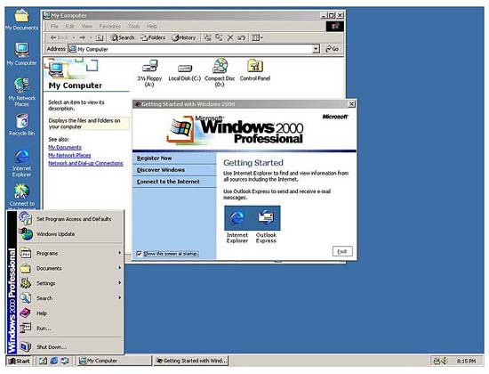{width="7.638888888888889in"
height="5.833333333333333in"}\
Hình 9: Windows 2000 – kẻ kế nhiệm cho Windows NT cho thị trường doanh
nghiệp

Không giống như NT, Windows 2000 có hai phiên bản (Workstation và
Server), Windows 2000 có đến 5 phiên bản khác nhau: Professional,
Server, Advanced Server, Datacenter Server và Small Business Server. Tất
cả các phiên bản đều kết hợp chặt chẽ các tính năng từ Windows 95/98 và
tạo nên một giao diện đẹp mắt và tinh tế.

**Windows XP**

Các dòng hệ điều hành khách hàng và doanh nghiệp của Windows đã được
nhập thành một với phát hành năm 2001 của Windows XP. Đây là phiên bản
đầu tiên mà Microsoft đưa sự tin cậy trong dòng doanh nghiệp ra thị
trường khách hàng – và đưa sự thân thiện vào thị trường doanh nghiệp. XP
có sự pha trộng tốt nhất giữa các phiên bản Windows 95/98/Me với thao
tác 32-bit của Windows NT/2000 và giao diện người dùng được tân trang
lại. Về bản chất có thể cho rằng XP là kết hợp giao diện của Windows
95/98/Me vào NT/2000 core, bỏ qua cơ sở mã DOS đã xuất hiện trong các
phiên bản khách hàng trước của Windows.

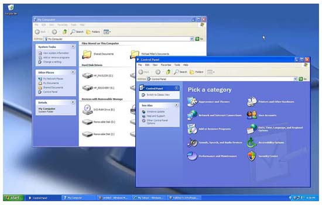{width="7.638888888888889in"
height="4.875in"}\
Hình 10: Giao diện thân thiện hơn của Windows XP

Với Windows XP, Microsoft đã bắt đầu phân khúc thị trường bằng một số
phiên bản khác nhau, mỗi một phiên bản lại có một tập các tính năng
riêng biệt. Các phiên bản khác nhau được phân khúc ở đây gồm có: XP Home
Edition, XP Professional (cho người dùng khối doanh nghiệp), XP Media
Center Edition, XP Tablet PC Edition, và XP Starter Edition (cho người
dùng trong các nước đang phát triển). Tuy nhiều người dùng cảm thấy lộn
xộn về sự phân khúc này, nhưng Microsoft dường như lại không quan tâm
đến điều đó.

Từ quan điểm của người dùng, XP là một phiên bản đẹp hơn, nhanh hơn so
với các phiên bản trước đó Windows 95/98 hoặc Windows 2000. (Nó cũng có
độ tin cậy cao hơn so với hệ điều hành Windows Me thất bại trước đó).
Giao diện Luna cho bạn thấy đẹp hơn và thân thiện hơn, tính năng Fast
User Switching cho phép cùng một máy có thể được chia sẻ dễ dàng với
những người dùng khác.

**Windows Vista**

Được phát hành năm 2007, phiên bản Windows này đã phát triển các tính
năng của XP và bổ sung thêm sự bảo mật và độ tin cậy, chức năng truyền
thông số được cải thiện và giao diện đồ họa người dùng Aero 3D đẹp mắt.

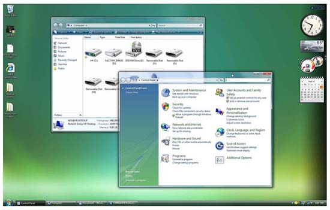{width="7.638888888888889in"
height="4.875in"}\
Hình 11: Giao diện Aero của Windows Vista

Chúng ta hãy bắt đầu với giao diện, để chạy được giao diện nâng cao này
đòi hỏi các máy tính phải có cấu hình cao, chính vì lý do này mà Vista
bị hạn chế khả năng nâng cấp từ nhiều máy tính cũ. Giao diện Aero hiển
thị các thành phần 3D gần như trong suốt và đường bao cửa sổ kiểu kính,
bên cạnh đó còn nhiều thứ trong Vista cũng rất khác biệt.

Các biểu tượng thư mục và file hiển thị bằng các thumbnail nội dung của
chúng. Khi bạn chuyển giữa các ứng dụng đang mở, Windows sẽ cuộn và xoay
vòng để hiển thị theo ngăn xếp 3D. Các cửa sổ trông uyển chuyển hơn,
tròn trịa hơn và có tính mờ đục, tăng cảm giác sâu khi bạn xem nhiều cửa
sổ trên màn hình. Bên cạnh đó còn có một Sidebar để giữ các Gadget, các
ứng dụng nhỏ chuyên dụng cho một nhiệm vụ nào đó.

Bên trong, Vista được thiết kế để chạy an toàn và tráng kiện hơn Windows
XP. Tuy nhiên một trong những tính năng bảo mật – người dùng phàn nàn
nhiều – là User Account Control, tính năng này góp phần vào làm gián
đoạn các hoạt động thông thường của người dùng. Dự định thì tốt (nhằm
ngăn chặn không cho truy cập trái phép vào hệ thống), tuy nhiên khi thực
thi thì chương trình lại làm cho người dùng tỏ ra rất khó chịu với các
cửa sổ đòi hỏi sự cho phép xuất hiện quá nhiều.

Thậm chí tồi tệ hơn, nhiều người dùng gặp phải các vấn đề trong việc
nâng cấp thiết bị cũ lên Vista. Nhiều thiết bị ngoại vi cũ không có
driver tương thích với Vista (đây có thể coi là một vấn đề với bất cứ
nâng cấp Windows nào), tuy nhiên có một số chương trình chạy trên XP
không thể làm việc đúng cách trong môi trường Vista.

Chắc hẳn từ những yếu tố không thành công trên của Windows Vista mà
Microsoft đã bắt tay vào để phát triển kẻ kế nhiệm cho Vista ngay lập
tức – Windows 7 sắp được phát hành.

**Windows 7**

Phiên bản mới nhất của Windows dự kiến được phát hành vào tháng 10 năm
2009. Đó là quãng thời gian hai năm ngắn ngủi sau khi phát hành Windows
Vista, điều đó cũng có nghĩa rằng nó không phải một nâng cấp chủ đạo
(không đủ thời gian).

Thay vì đó chúng ta có thể nghĩ về Windows 7 với Windows Vista giống như
mối quan hệ của Windows 98 với Windows 95. Nó chỉ là một phát hành thứ
yếu, giống một gói dịch vụ hơn là một nâng cấp quy mô lớn.

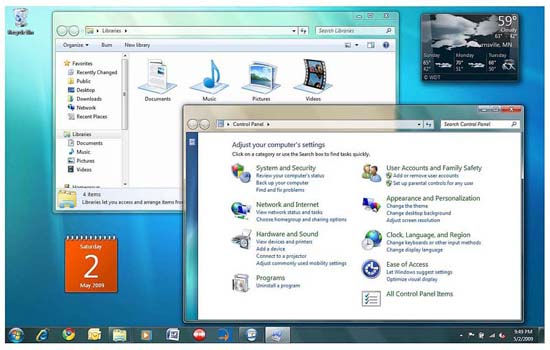{width="7.638888888888889in"
height="4.861111111111111in"}\
Hình 12: Taskbar mới trong Windows 7

Vậy có những gì thay đổi trong Windows 7? Đầu tiên, phát hành này sẽ
thay đổi những gì mà người dùng không thích trong Windows Vista. Phần
cứng cũ và phần mềm cũ tương thích nhiều hơn, và thậm chí còn có cả tính
năng Windows XP Mode cho phép chạy các ứng dụng trong thời đại XP trong
môi trường nguyên bản của Windows 7. User Account Control cũng được cải
thiện nhiều hơn để giảm bớt sự gián đoạn gây khó chịu đối với người
dùng.

Tiếp đến, Windows 7 còn có một số thay đổi về mặt giao diện. Sidebar bị
bỏ đi và thay vào đó bạn có thể đặt các Gadget trực tiếp lên desktop.
Bên cạnh là chế độ Aero Peek mới cho phép bạn nhìn “đằng sau” tất cả các
cửa sổ mở để thấy những gì bên dưới desktop, cũng như các hoạt động Aero
Snaps mới cho phép bạn dễ dàng di chuyển và cực đại hóa các cửa sổ.

Mặc dù vậy thay đổi lớn nhất lại rơi vào taskbar, một dải cố định trên
màn hình xuất hiện lần đầu tiên trong Windows 95. Taskbar mới trong
Windows 7 cho phép bạn *dock* (neo đậu) cả các cửa sổ đang mở và các ứng
dụng lẫn tài liệu ưa thích của bạn. Kích chuột phải vào một nút của
taskbar, bạn sẽ thấy một Jump List các tài liệu gần đây và các hoạt động
hữu dụng khác; đưa chuột qua nút taskbar, bạn sẽ thấy một ứng dụng đang
mở và bạn thumbnail của tất cả các tài liệu. Có thể nói Windows 7 thay
đổi cách bạn thực hiện trong nhiều thứ, tuy nhiên được nhiều người nhận
định là những cách mang tính tích cực.

Phát hành Windows 7 sắp tới đã kết thúc lịch sử của Windows cho đến thời
điểm này. Tuy nhiên các chuyên gia phát triển của Microsoft vẫn đang làm
việc trên các phiên bản mới của hệ điều hành lõi, và vì vậy chúng ta vẫn
có thể mong đợi những điều thú vị sẽ xuất hiện trong một tương lai gần.
Và Windows sẽ không bao giờ ngừng phát triển.
