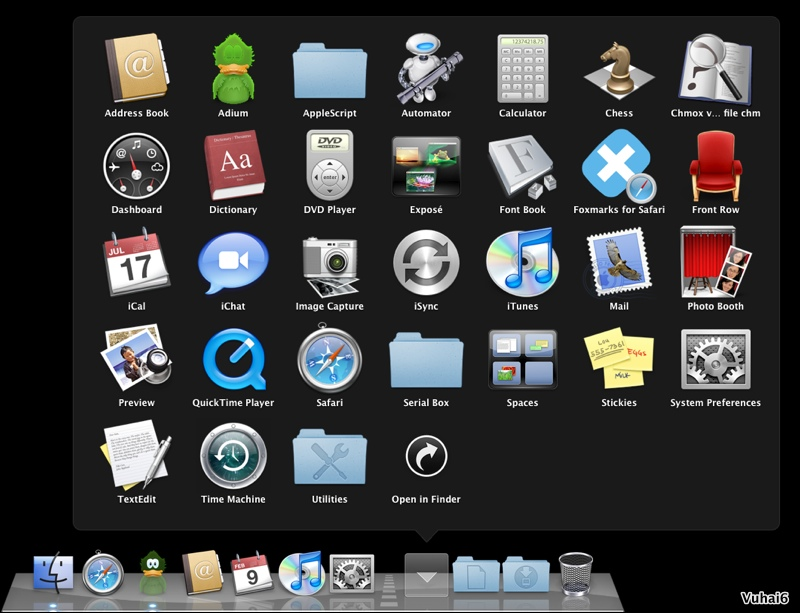

**Mục Lục**

Lời nói Đầu 1

I. Phần I - Làm quen với MacOS Leopard 10.5 3

 01./ Finder
 02./ Dock
 03./ Top menu
 04./ Video hướng dẫn

II. Phần II – System Preferences – chỉnh cấu hình hệ thống 10

 01./ Desktop & Screen Saver - Chỉnh hình nền và bảo vệ màn hình
 02./ DOCK
 03./ Expóse & Spaces
 04./ International
 05./ Security - Thiết lập cấu hình để bảo mật dữ liệu
 06./ Display - Chỉnh màu màn hình cho trong hơn
 07./ Energy Saver - thiết lập về chế độ sử dụng pin để pin được tốt
 hơn
 08./ Keyboard & Mouse
 09./ Trackpad
 10./ Accounts
 11./ Universal Access

III. Phần III – Những phần mềm tiện ích cơ bản cho mac 20

 01./ Âm Lịch 4.5 - Lịch Vạn Niên cho Mac OS X
 02./ Font và bộ gõ tiếng Việt
 03./ Từ điển E - V - E
 04./ Office - Văn Phòng
 05./ Nghe nhạc, xem film
 06./ Duyệt ảnh
 07./ Chuyển đổi các định dạng ảnh, nhạc, phim
 08./ Internet
 09./ Các phần mềm tiện ích khác

IV. Phần IV - Windows trên Apple - Bootcamp vs Parallel 37

 01./ Lưu ý chung
 02./ Bootcamp
 03./ Parallel

 04./ Cách khởi động vào window thông qua bootcam

V. Phần V – Một số thủ thuật nhỏ khi sử dụng Mac OS 52

01./Hướng dẫn cài đặt

02./ Những phím tắt trên Mac

03./Chụp màn hình

Phần I - Làm quen với MacOS Leopard 10.5
========================================

1.  ***Finder***
    - Có một phần mềm luôn luôn chạy cùng với MAC OS đó là Finder, đây
    chính là phần mềm cơ bản nhất của Mac OS. Finder có chức năng quản
    lí files, Folders, quản lí các công việc, thao tác... Desktop cũng
    chính là một phần của Finder. Ngoài màn hình Desktop có hai phần qua
    trọng đó là Dock và Top menu.
    
    - Khi ta mở một cửa sổ thư mục ra thì đó cũng chính là Finder

- Phía bên trái của cửa sổ là Sidebar, nơi hiển thị các thông tin:
Devices (ổ cứng, hdd box, usb, hay cd - dvd), Places (là nơi chứa các
Alias đến các thư mục trong ổ cứng, ta có thể khéo thả các thư mục vào
khu vực này cũng giống như làm với Dock)....

- Ta có thể cho hiện đường dẫn của File (Folder) - tại thanh bar phía
dưới - bằng cách: *vào menu View -&gt; chọn Show Path Bar*. Đây là kết
quả:

- Preference của Finder (phím tắt để truy cập là command + ,) cũng giống
như Folders Option bên Win, trong Preference ta có thể tinh chỉnh nhiều
thứ. Ta có thể chỉnh hiện hoặc không hiện các thành phần trong Sidebar.

-   **Show these items on the Desktop**: hiện và không hiện các thành
    phần ngoài Desktop (bạn có thể ẩn các ổ cứng đi ...)

-   **New finder windowns open**: Khi bạn kick vào Alias Finder ở Dock
    thì một cửa sổ được mở ra, và mặc định là Finder trỏ đến thư mục
    Home, ta có thể thay đổi thư mục khác vào đây.

-   **Always open folder in a new window**: Khi bạn kick đúp vào một thư
    mục (hay mở ổ đĩa) thì nó luôn mở ra một cửa sổ mới.

-   Ta có thể cho hiện phần mở rộng (đuôi) của các file bằng cách vào
    thẻ **Advanced** và chọn **Show all file extensions**

- Để coi thông tin của file (hay Folder) thì ta kick chuột phải vào file
(folder) và chọn **Get Info** . Hoặc cũng có thể kick vào file (folder)
đó và nhấn **Command + I**. Để coi thông tin của nhiều File (Folder) một
lúc thì nhấn thêm **alt** (alt + command + I)

- Ngoài finder mặc định, bạn có thể dùng phần mềm của hãng thứ 3 để quản
lý file. Điển hình như *Path Finder* (có nhiều chức năng khá hay, bạn
nên dùng)

1.  ***Dock***

- Là nơi chứa các Alias (Shorcut) của các phần mềm chúng ta hay sử dụng.
Alias của một phần mềm có thể để ngoài Desktop, hoặc gom chúng lại trên
Dock. Khi ta kéo icon một phần mềm vào Dock thì Alias của nó cũng sẽ
hiện lên trên Dock.

- Ta có thể xóa các Alias này ra khỏi Dock (khi đó phần mềm vẫn có trong
thư mục Application, không bị mất đi) bằng cách nhấn giữ và kéo alias đó
ra khỏi Dock

- Nếu phía dưới alias có chấm sáng có nghĩa là phần mềm đó đang chạy.

- Từ phiên bản MacOS 10.5 Leopard trở đi trên Dock chúng ta có thêm các
Stack (mặc định có sẵn 2stack phía bên trái thùng rác). Stack là alias
link đến một thư mục nào đó, ta có thể thêm hoặc bớt các stack (thao tác
giống như alias của phần mềm vào Dock)
Vd: kéo thư mục Application vào Dock ta có thêm stack Application

- Kích chuột phải vào một stack, có một menu hiện ra và ta có thể chỉnh
các thông số của stack

1.  ***Top Menu
    * 3.1 Phía bên trái của Top Menu**

- Ở ngay đầu bên trái là icon trái táo cắn dở
.
Logo này là cố định, dù bạn đang chạy phần mềm nào thì icon này cũng
hiện ở đây. Và đây cũng là menu để truy cập nhanh vào các chức năng cần
thiết của hệ điều hành. Một số chức năng qua trọng là:

-   **About This Mac**: Dùng để check thông tin, cấu hình máy

-   **Software Update**: cập nhật phiên bản mới nhất cho các phần mềm
    trong máy (chỉ áp dụng cho các phần mềm của apple)

-   **Force Quit**: tắt tất cả các phần mềm đang chạy (trong trường hợp
    phần mềm đó bị treo, không tắt bình thường được)

- Kế tiếp chính là tên phần mềm đang chạy và mình đang sử dụng. Khi
click và tên phần mềm thì sẽ xuất hiện một menu (bất cứ phần mềm nào
cũng có menu này). Chúng ta có thể coi thông tin về phần mềm này và quan
trọng nhất là truy cập được vào Preferences của phần mềm đó.

- Phần còn lại chính là các menu của phần mềm. MacOS có một điểm đăc
biệt khác win đó là các phần mềm đang chạy, dù đang ở vị trí nào trên
màn hình thì menu cuả n1o cũng hiện ở trên Top menu này (khi ta chọn một
phần mềm nào đó thì đồng thời menu của nó cũng hiện hiện Top menu ở vị
trí này)

***3.2* Phía bên phải của Top Menu**

- Ngoài cùng phía bên phải chính là Spotlight - chiếc kính lúp kỳ diệu.
- Các icon từ phải qua trái lần lượt là: Spotlight, Date time, pin,
volume, tắt mở wifi, tắt mở Bluetooth và cuối cùng là Time Machine.

- Ta có thể cài thêm iStat menus để thay thế cho các icon mặc định và
thêm một số các tính năng khác như thông tin về nhiệt độ máy, thông tin
ram, tốc độ quạt

Phần II – System Preferences – chỉnh cấu hình hệ thống
======================================================

*System Preferences giống như Control Panels bên Windows, là nơi mà ta
có thể cấu hình toàn bộ các phần trên máy tính để máy chạy tốt hơn phù
hợp hơn với thói quen dùng của mỗi người. Trong phần này chỉ là ví dụ
minh họa các điều chỉnh cơ bản, bạn hoàn toàn có thể điều chỉnh theo ý
thích của mình.*

Để vào System Preferences ta vào biểu tượng System Preferences trên DOCK
hoặc vào quả táo (góc trái bên trên) và chọn System Preferences.

*Biểu tượng System Preferences trên DOCK*

***Cụ thể như sau:***

1.  Desktop & Screen Saver - Chỉnh hình nền và bảo vệ màn hình

2.  DOCK

3.  Expóse & Spaces

4.  International

5.  Security - Thiết lập cấu hình để bảo mật dữ liệu

6.  Display - Chỉnh màu màn hình cho trong hơn

7.  Energy Saver - thiết lập về chế độ sử dụng pin để pin được tốt hơn

8.  Keyboard & Mouse – Bàn phím & Chuột

9.  Trackpad

10. Accounts

11. Universal Access

***1./ Desktop & Screen Saver - Chỉnh hình nền và bảo vệ màn hình***

-   **Thêm hình nền**: Bạn có thể thêm hình (hoặc thư mục chứa hình) vào
    danh sách bằng cách nhấn vào dấu +

-   **Change picture (+ thời gian)**: sau một khoảng thời gian bất kỳ
    thì hình nền sẽ được thay đổi.

-   **Random oder**: hình được thay đổi bất kỳ, không theo thứ tự.

-   **Translucent menu bar**: thanh Top menu trong suốt.

***2./ Dock:** Là nơi mà ta có thể nhanh chóng truy xuất các ứng dụng
trên máy MAC, với Leopard DOCK còn là nơi ta có thể để các thư mục mà ta
thích để giúp truy xuất thật nhanh. Xin giới thiệu các thao tác liên
quan đến DOCK. Để thêm một ứng dụng vào Dock ta kéo ứng dụng đó vào Dock
hoặc khi ứng dụng đang chạy ta bấm chuột phải và chọn "Keep in Dock". Để
gỡ bỏ ứng dụng ra khỏi Dock ta cầm và kéo ứng dụng ra khỏi Dock hoặc
nhấn chuột phải và chọn Remove from Dock.*

-   **Kích thước (Size)**: Ta có thể thay đổi kích thước của DOCK đến
    tối đa khi DOCK chạm 2 cạnh ở 2 đầu. Khi có càng nhiều ứng dụng ở
    DOCK thì DOCK càng nhỏ.

-   **Magnification**: Chọn ô này để kích thước của DOCK sẽ to ra khi ta
    rê chuột qua. Chức năng này chỉ có tác dụng khi ta chọn kích thước
    Magnification to hơn kích thước DOCK, trừ trường hợp kích thước DOCK
    ở mức to nhất.

-   **Vị trí của DOCK(Position on screen)**:Mặc định sau khi cài xong
    HĐH thì DOCK sẽ nằm ở cạnh dưới của màn hình. Tuy nhiên, hầu hết các
    máy tính Apple hiện nay là màn hình rộng. Do đó nếu để DOCK ở cạnh
    dưới sẽ làm cho chiều cao của màn hình thêm hẹp. Trong khi văn bản
    làm việc và các website đều thiết kế theo dạng dọc. Nên ta cần
    chuyển DOCK qua cạnh trái hoặc phải của màn hình để dễ làm việc hơn.

-   **Hiệu ứng phóng cửa sổ**: Có 2 cách thể hiện khi ta phóng to/thu
    nhỏ hay tắt/mở một cửa sổ từ DOCK và màn hình.

-   **Hiệu ứng khi mở ứng dụng(Animate Opening applications)**: Ta chọn
    ô này. Các ứng dụng trong lúc khởi động sẽ nhảy lên nhảy xuống
    ở DOCK.

-   **Ẩn/hiện DOCK tự động (Automatically hide and show the Dock)**: Ta
    chọn ô này. Dock sẽ tự động ẩn vào cạnh màn hình. Khi ta rê chuột
    qua cạnh màn hình thì Dock sẽ tự hiện ra.

***3./ Expóse & Spaces:** Tùy biến liên quan đến các cửa sổ, màn hình
trên Leopard. Một trong những đặc điểm nổi bật nhất của Leopard mà các
hệ điều hành khác không thể có được. Đây cũng là tính năng mà bạn sẽ
dùng hàng ngày. *

**3.1/ Expóse:** Các các cửa sổ thể hiện trên màn hình. Để giúp việc
chuyển đổi cửa sổ làm việc một cách hiệu quả bạn hãy thiết lập Expóse
cho phù hơp với mình nhất.

-   **Active Screen Corners**: phần này cho ta lựa chọn việc thể hiện
    trên màn hình sẽ thế nào khi ta di chuyển chuột đến 4 góc của
    màn hình. Trong hình minh họa trên, ở góc trái bên dưới mình chọn là
    All Windows. Có nghĩa là mỗi khi mình di chuyển vào góc đó thì tất
    cả các cửa sổ sẽ được sắp xếp lại để mình cùng 1 lúc có thể thấy hết
    các cửa sổ đó trên màn hình và có thể chọn cửa sổ nào mình muốn cho
    nó hiện lên trên cùng để làm việc.

-   **Expóse**: Tương tự như bên trên nhưng thay vì ta di chuyển chuột
    đến 4 góc thì ta chọn phím tắt. Mặc định là các phím. F9 để sếp tất
    cả các ứng dụng lên màn hình, F10 để hiện ứng dụng bạn đang làm việc
    rõ lên, các ứng dụng khác sẽ mờ đi, F11 để hiện ra màn hình desktop
    các cửa sổ ứng dụng sẽ chạy ra 4 cạnh.

-   **Dashboard**: Phần này quy định phím, nút để mở và tắt Dashboard.
    Dashboard là một khu vực chứa nhiều tiện ích nhỏ nhưng là Widgets
    bên Windows Vista. Hiện đã có hàng ngàn ứng dụng nhỏ khác nhau cho
    Dashboard .

 **3.2/ Spaces:** Kích hoạt chức năng Spaces trên Leopard sẽ giúp bạn
 có nhiều không gian làm việc hơn. Bạn có thể thêm 1 hoặc 15 màn hình
 ảo khác. Bạn có thể dùng phím tắt hoặc chuột để truy cập nhanh chóng
 đến các màn hình ảo này để làm việc.

-   **Kích hoạt Spaces**: Đánh dấu vào ô Enable Spaces. Ta có thể chọn ô
    Show Spaces in menu bar để truy cập nhanh các màn hình ảo từ thanh
    công cụ. Số hiện lên bên trong biểu tượng Spaces là số thứ tự màn
    hình đang được kích hoạt.

-   **Application Assignments**: Chọn ứng dụng chạy mặc định tại màn
    hình ảo nào đó: Ta có thể chọn một hay nhiều ứng dụng khác nhau mà
    mỗi lần mở lên các ứng dụng đó tự động chạy vào một màn hình ảo
    nhất định.

-   **Kích hoạt nhanh Spaces bằng bàn phím hoặc chuột (Keyboard and
    Mouse Shortcuts)**: Ta có thể đặt phím tắt từ bán phím, chuột để
    khởi động nhanh Spaces. Mặc định là nhấn F8 để kích hoạt Spaces,
    nhấn phím Control + phím mũi tên để di chuyển qua lại giữa các
    cửa sổ.

***4./ International:** Ta có thể chỉnh ngôn ngữ của hệ thống (mặc định
là English, vẫn chưa có ngôn ngữ Việt ). Ngoài ra có thể chỉnh định dạng
của số, đồng hồ, ngày tháng trong tab Formats. Quan trọng nhất ở phần
này là Input Menu, tại đây ta có thể hoạt các bộ gõ có sẵn của mac để
phục vụ nhu cầu của mình.*

-   **Tham khảo thêm bài viết**: *Tiếng Việt và bộ gõ tiếng Việt trên
    MAC OS X - Leopard*

-   **Bộ gõ có sẵn của Leopard** có cái bất tiện là khi gõ phải enter 2
    lần (hoặc sau mỗi chữ phải space bar). Ngoài bộ gõ có sẵn bạn có thể
    cài thêm bộ gõ tiếng Việt khác: *Cài đặt Bộ gõ tiếng Việt cho MAC OS
    X (2007-v2.0)*

***5./ Security - Thiết lập cấu hình để bảo mật dữ liệu***

-   **Trong phần này** bạn chỉ nên quan tâm đến tab đầu tiên General,
    phần còn lại sẽ có một bài viết khác (vì nó khá khó hiểu và có thể
    dẫn đến bị khóa dữ liệu khi làm không đúng)

-   **Require password to wake this computer from sleep or screen
    saver**: khi máy đang ở chế độ sleep hoặc screen saver, nếu muốn
    đăng nhập vào thì phải đánh password.

-   **Require password to unlock each System preference pane**: Khóa và
    không cho thay đổi các thông số trong system preference

***6./ Display - Chỉnh màu màn hình cho trong hơn:*** *Mặc định sau khi
vào hệ điều hành thì màn hình của MAC có một lớp sương mở phủ phía trước
làm cho màn hình hơi đục. Mọi người hầu như không để ý đến việc này vì
nó không ảnh hưởng lắm và chất lượng màn hình MAC vẫn đẹp. Tuy nhiên nếu
cân chỉnh một chút mọi người sẽ có một màn hình trong hơn nhiều.*

-   Vào System **Preferences&gt;Display** chọn Color rồi chọn
    **Calibrate**.

-   Một cửa sổ hiện ra, không chọn ô **Expert Mode**, nhấn **Continue**.

-   Chọn vào ô **2.2 Television Gamma** thay vì 1.8 Standard Gamma như
    mặc định. Bạn sẽ thấy màn hình trong hơn. Nhấn Continue.

-   Chọn vào ô **Native** và nhấn Continue.

-   Nhấn Continue rôi **OK**.

***7./ Energy Saver - thiết lập về chế độ sử dụng pin để pin được tốt
hơn***

-   Ở mục này có thể chỉnh thời gian sử dụng máy, thời gian sleep, hoặc
    chọn cái có sẵn trong mục: Optimization

-   Khi vào Schedule... ta có thể đặt thời gian mở máy và tắt máy
    (hoặc sleep)

***8./ Keyboard & Mouse: ***

-   **Mặc định của MacOS** là khi bạn nhấn F1, F2 ... thì nó không ra
    F1, F2 mà nó là phím chức năng, như chỉnh sáng tối, âm lượng, đèn
    bàn phím.... Để F1 chính là F1 thì ta chọn vào "Use all F1, F2, ect.
    keys as standard function keys". Khi đó muốn chỉnh sáng tối,
    âm lượng... thì ta dùng Fn + F1 (hoặc Fn + F2 .....)

-   **Illuminate keyboard in low light conditions**: nếu mục này được
    chọn thì tức là chức năng tự động bật đèn và chỉnh độ sáng của đèn
    bàn phím đã được bật lên.

***9./ Trackpad:** Những chiếc MAC mới ngày càng thông minh hơn với
nhiều tiện ích được kèm theo. Bạn có thể dùng 1 ngón để click chuột, 2
ngón để trượt, xoay, phóng to thu nhỏ và 3 ngón để qua bài, qua hình.
Vào đây sẽ thấy và có thể bật lên, tùy vào máy của bạn và phiên bản hệ
điều hành mà bạn sẽ thấy ít hay nhiều ngón:*

-   Vào **System Preferences**

-   Chọn **Keyboard & Mouse** rồi click thẻ **TrackPad** (với Leopard
    10.5.6 trở lên thì TrackPad được mang riêng ra ngoài).

-   Bấm vào **Tap to Click** nếu bạn muốn 1 ngón click chuột (nên chọn
    cái này).

-   Bấm vào **Dragging** nếu bạn muốn 1 ngón để di chuyển cửa sổ.

-   Chọn **Secondary Tap** nếu bạn muốn 2 ngón bật menu (chuột phải).
    Các chức năng khác của 2 ngón được bật mặc định.

***10./ Accounts: ***

-   Phần này cần quan tâm đến nhất là tab Login Items. Khi thấy có quá
    nhiều phần mềm khởi động cùng máy, khiến quá trình khởi động bị chậm
    thì bạn hãy vào đây, chọn cái nào muốn bỏ đi và nhấn vào **dấu -**

***11./ Universal Access: ***

-   **VoiceOver**: Khi bạn thấy tự nhiên cái máy bạn lại phát ra những
    tiếng nói khó hiểu (*thực ra là chức năng phát âm định hướng dành
    cho người mù*)

-   **Zoom**: Khi bạn bật On chức năng này thì bạn có thể phóng to thu
    nhỏ màn hình bằng cách nhấn **alt + command + - (hoặc alt +
    command + =)**

-   **Enable access for assistive devices**: bật chức năng phát âm
    của mac. Như khi cài translateIT sẽ yêu cầu bạn chọn cái này để có
    thể chạy chế độ phát âm.

Phần III – Những phần mềm tiện ích cơ bản cho mac
=================================================

***1./ Âm Lịch 4.5 - Lịch Vạn Niên cho Mac OS X ***

-   Phần mềm hiện thị lịch Âm Dương, cho phép bạn hiển thị lịch, tra cứu
    âm lịch, dương lịch từ Công Nguyên cho đến năm 9999. Với chức năng
    đa dạng, tính toán chính xác và cung cấp cả thông tin về sự khác
    biệt giữa lịch Trung Quốc và Việt Nam.

***
2./ Font và bộ gõ tiếng Việt***
***2.1/ Font tiếng Việt: ***

-   Bạn sẽ phải tải bộ Font Tiếng Việt cho Apple và thường với bộ font
    này là bạn có thể đọc các web mà không bị lỗi font. Tuy nhiên nếu
    rơi vào trường hợp máy bạn vẫn bị lỗi font thì bạn có thể cài thêm
    bộ Microsoft Office 2008.

 ***2.2/ Với bộ gõ tiếng Việt ta có vài sự lựa chọn:***

-   *Bộ gõ tiếng Việt cho MAC OS X (2007-v2.0)*: Với bộ gõ này ta phải
    **bỏ dấu ngay sau nguyên âm**, không thể bỏ dấu tự do được. Nhưng
    ngược lại thì ta **không phải enter 2lần** khi đã đánh xong chữ.
    Ngoài ra bộ gõ này có cái hay là **có thể gõ được với font VNI và
    TCVN3**

-   Bộ gõ tiếng Việt có sẵn trong Leopard: Ta **có thể bỏ dấu tự do**
    nếu dùng bộ gõ này. Nhưng nó có nhược điểm là **phải enter 2lần
    (hoặc phải spacebar rồi enter)**. Bộ gõ này cũng có nhược điểm là
    **chỉ dùng với unicode**, bạn không gõ được với font VNI hay TCVN.

***3./ Từ điển E - V - E:** Hiện nay đang có đến 3 bộ từ điển phổ biết
nhất dành cho MacOS, bạn có thể dùng một hoặc có thể dùng tất cả cũng
được vì thực ra những bộ từ điển này không gây ảnh hưởng đến tốc độ
máy.*

***3.1/ Từ điển Anh - Việt miễn phí cho OSX ***

-   Ưu điểm của bộ từ điển này là nhanh, có thể tra chéo trong các ứng
    dụng khác và đặc biệt là tra từ được ngay trong Spotlight. Việc cài
    từ điển vào máy tính cũng đơn giản và không tốn nhiều thời gian.

***3.2/ Bộ từ điển Việt Anh Pháp Đức Nga NaUy Wordnet Máy Tính***

-   Tổng hợp rất nhiều từ điển cần thiết. Ưu điểm của nó là có thể chạy
    ngay không cần cài đặt. Tác giả là anh Hồ Ngọc Đức, và tất nhiên là
    nó cũng free hoàn toàn.

-   Thông tin thêm: *Từ Điển Điện Tử v12 - Bộ từ điển Việt Anh Pháp Đức
    Nga NaUy Wordnet Máy Tính cho Mac*

***3.3/ TranslateIt!: bộ từ điển Anh, Pháp, Việt... phát âm cho MAC: ***

-   TranslateIT đầy đủ chức năng rất trong 3 bộ từ điển, ngoài ra nó có
    số lượng các bộ từ điển rất là phong phú, cập nhật thường xuyên.

-   Phiên bản mới nhất là 9.9 cải thiện tốc độ và tình năng tra chéo
    trong các ứng dụng khác.

-   Hạn chế lớn nhất của nó là phải trả tiền

***4./ Office - Văn Phòng:** Không thể thiếu đối với người dùng máy
tính, các phần mềm văn phòng hiện nay rành cho MacOS cũng rất là đa
dạng, từ free đến trả tiền đều có. Nhưng phổ biến nhất vẫn là Office
2008 của Microsoft và iWork 2009 của Apple*

***4.1/ Microsoft Office 2008***

-   Tương thích với office 2007 trên win, chuyển qua chuyển lại
    đơn giản. bao gồm các phần mềm Microsoft Word, PowerPoint, Excel,
    and Entourage.

***4.2/ iWork 09: ***

-   Bộ ứng dụng văn phòng phổ biến nhất trong cộng đồng MAC. Với các
    phần Pages tương ứng với MS Word, Number tương ứng với Excel và
    Keynote tương ứng với PowerPoint. Trong bộ iWork 9 có nhiều cải tiến
    liên quan đến 40 bộ themes được phát triển mới. Đây được xem là bộ
    phần mềm được chào đón nhất sau Leopard của Apple

-   Nếu so sánh thì iWork đẹp hơn Office 2008 nhiều, nhưng tính tương
    thích với office 2007 không cao.

***5./ Nghe nhạc, xem film:** Hiện nay theo thống kê thì có các phần mềm
sau là phổ biến, hỗ trợ cho công việc giải trí của bạn. Nếu bạn đã cài
hết những phần mềm này mà vào một số website vẫn không nghe nhạc được
thì cũng đừng lo, chỉ là do web đó không tương thích với MacOS thôi.*

-   **Flip4mac:** Phần mềm được phát triển bởi Microsoft thay thế cho dự
    án Media player đã bị kết thúc.

-   **Perian:** Bộ code bổ xung thêm cho Quicktime của MacOS, để coi
    được các định dạng khác nhau.

-   **130 Quicktime codecs:** Bổ xung thêm các code cần thiết

-   **VLC media player:** Phần mềm miễn phí rất nổi tiếng, hỗ trợ coi
    được rất nhiều các định dạng (hầu hết các định dạng hiện nay)

***6./ Duyệt ảnh:** Phần mềm duyệt ảnh khá là quan trọng, MacOS cũng có
sẵn Preview nhưng vẫn không đáp ứng được nhu cầu, vì thế bạn nên dùng
thêm một trong những phần mềm sau ( tùy theo nhu cầu của mỗi người)*

-   **Xee và ImageViewerCMPlugIn:** nhỏ, đơn giản nhưng tiện dụng

**Xee (đơn giản, dễ dùng, miễn phí)**

**ImageViewerCMPlugIn: mạnh mẽ nhưng phải trả tiền**

-   **Picasa và iPhoto:** chuyên nghiệp và mạnh mẽ

**Picasa: miễn phí nhưng đầy đủ các công cụ để quản lý và chỉnh sửa
ảnh**

**iPhoto: phần mềm chuyên nghiệp có trả phí của Apple**

***7./ Chuyển đổi các định dạng ảnh, nhạc, phim:** Chuyển đổi định dạng
của các file nhạc, phim là nhu cầu thiết yếu của những người dùng máy
tính. Bạn nên trang bị cho mình những phần mềm sau để khi cần có thể
dùng:*

-   ***iSkysoft iMedia Converter*** - chuyển đổi đa định dạng, chuyên
    nghiệp mà mạnh mẽ

-   ***Downsize*** - chỉnh kích thước, đóng khung, dán nhãn lên hình

***8./ Internet***

-   ***Adium:*** Có thể nói Adium là sự lựa chọn tốt nhất thay thế cho
    Yahoo, tuy nhiên từ sau khi bản Yahoo 3 beta 2 ra đời thì có lẽ
    Yahoo không cần phải thay thế nữa. Mặc dù vậy Adium vẫn được nhiều
    người sử dụng vì sự đơn giản và tiện dụng của nó. Ngoài ra Adium có
    giao diện đẹp, có thể custom được.

-   **Firefox:** hãy vào đây để biết lí do vì sao nên dùng Firefox nhé

-   **iGetter:** Phần mềm hỗ trợ download, tốc độ nhanh và "free"

-   **CyberDuck:** FTP cho MacOS

***9./ Các phần mềm tiện ích khác**: Dưới đây là một số phần mềm tiện
ích cần thiết mà bạn nên có trong máy của mình *

-   **LittleSnitch**: Dùng để chặn các phần mềm, không cho kết nối
    lên internet.

-   **Paragon NTFS** (hoặc ***NTFS-3G***): Hỗ trợ MacOS trong việc ghi
    dữ liệu lên phân vùng NTFS.

-   **AppZapper**: Gỡ bỏ phần mềm một cách triệt để.

-   **StuffIt Expander**: Nén và giải nén trong MacOS

-   **Split & Cocat**: Chia và gộp file, hỗ trợ các file định dạng
    *.001 ...

-   **TOAST**: Phần mềm ghi đĩa chuyên nghiệp.

-   **EasyWMA** - Chuyển đổi định dạng nhạc, phim đơn giản, ít
    tùy chỉnh.

-   Cuối cùng bạn có thể dùng iTunes có sẵn để chuyển các định dạng nhạc
    một cách đơn giản và nhanh chóng

Phần IV - Windows trên Apple - Bootcamp vs Parallel
===================================================

*Đối với nhiều người thì cài win lên máy mac vẫn là việc bắt buộc phải
làm, mặc dù muốn hay không muốn. Trong bài này mình chỉ nêu lên một số
điều cần nhớ khi cài win, còn quá trình cài chi tiết thì đã có nhiều bài
trong forum nói đến rồi.*

-   **Hiện nay có 2 cách** để chạy win trên máy tính apple: ***1 -***
    cài win chạy độc lập với mac (bootcamp), ***2 -*** cài win chạy trên
    máy ảo (parallel hoặc vmware). ***Chỉ hỗ trợ những dòng máy mới sử
    dụng chip Intel.***

-   **Mỗi cách làm** có cái hay và dở khác nhau, và phục vụ cho những
    nhu cầu khác nhau. Vì thế bạn hãy xác định rõ nhu cầu dùng win của
    mình để làm gì rồi quyết định sẽ cài win trên máy mac bằng cách nào.

-   **Cài win chạy độc lập (bootcamp)**: tận dụng tối đa cấu hình của
    máy, phù hợp với các thao tác cần cấu hình máy cao. Ngoài ra một số
    phần mềm yêu cầu phải có vga card thì bắt buộc phải dùng win chạy
    độc lập.

-   **Cài win qua máy ảo (parallel)**: Cấu hình máy là ảo, và không tận
    dụng hết được sức mạnh của hệ thống. Mặc dù parallel đã hỗ trợ vga
    card nhưng cũng vẫn chỉ là ảo. Hệ thống máy ảo này chỉ phù hợp cho
    những công việc văn phòng.

-   **Bootcamp hơn parallel** là tận dụng hết sức mạnh của hệ thống,
    nhưng nó lại chiếm không gian đĩa cứng nhiều hơn. Với bootcamp thì
    ta phải chia ra một partition riêng cho nó, còn parallel thì máy ảo
    chỉ là một file data (được chứa trong thư mục documents) và nó chỉ
    chiếm dung lượng tầm 5Gb (tùy người dùng).

-   **Với parallel** ta có thể chuyển qua chuyển lại giữa win và mac chỉ
    mất 1s, nhưng với bootcamp thì ta phải khởi động lại máy.

***1./ Cài win chạy độc lập với MacOS (Bootcamp)***

-   Trước tiên bạn hãy đọc bài này: *Cài Windows trên máy Mac bằng
    BootCamp*

-   Muốn dùng Bootcamp để chia ổ thì lúc đầu ổ cứng chỉ có một partition
    duy nhất, nếu ổ đã bị chia ra làm 3 ổ trở lên thì bootcamp sẽ không
    dùng được.

-   Thứ tự để cài win và phân thêm một ổ data dùng chung tốt nhất lên
    là:

    -   Dùng bootcamp để cài win như trong bài hướng dẫn trên.

    -   Sau khi cài đặt win hoàn chỉnh, cài *drive cho win* và cài thêm
        phần mềm *Macdrive* cho win thì bắt đầu vào MacOS để chia
        ổ cứng.

    -   Chia thêm một ổ data dùng chung cho mac và win, ổ data lên
        format dạng mac. Có nhiều trường hợp khi format data dạng fat
        thì ổ win bị hỏng. Coi thêm bài *Leopard: chia và gộp partition*
        để biết phải làm như thế nào.

-   Một số điều cần lưu ý:

    -   ***Khi cài win có một bước format partition, tốt nhất bạn hãy
        thực hiện bước này, format lại cái ổ định cài win.*** &lt;-
        thường những trường hợp bị lỗi "disk boot erro" là không thực
        hiện bước này.

    -   Trong Macdrive bạn lên để chế độ readonly, như thế ổ mac và data
        sẽ an toàn hơn. Có vài trường hợp ổ data không truy xuất
        được nữa.

    -   Nếu như bạn muốn cài lại win, chỉ cần bỏ disk setup win vào cài
        luôn, không cần dùng qua bootcamp nữa.

    -   Trong trường hợp máy bạn đang có 2 phân vùng (mac và data), bạn
        muốn cài thêm win vào, thì không cần phải dùng bootcamp. Đầu
        tiên là hãy chia ổ data ra thêm một ổ nữa để cài win, sau đó chỉ
        cần bỏ disk win vào và tiến hành boot từ dvd và cài đặt
        bình thường.

    -   **Nếu muốn xoá win đi thì chỉ cần vào Disk Utility format cái ổ
        win đi là được**.

***2./ Cài win trên máy ảo (Parallel)***

***Sau khi cài đặt xong ta có 3 lựa chọn:***

-   **Run Windowns on you Mac:** cài một máy ảo mới, chạy win hoặc bất
    cứ hệ điều hành nào bạn muốn.

-   **Import virtual machines:** nếu bạn đang dùng ver3.0 và muốn tiếp
    tục sử dụng máy ảo cũ thì sử dụng chức năng này

-   **Start using Parallels Desktop:** nếu máy bạn cài bootcamp, và bạn
    muốn dùng ngay win cài qua bootcamp thì dùng chức năng này.

**I./ Run Windowns on you Mac:** ở đây mình tạo máy ảo mới dùng winXP.

*Một thông báo xuất hiện, chọn **Continue***

*Bước tiếp theo là chọn lựa cài từ CD hay file image, ở đây mình chọn
cài từ file image*

*Tiếp theo là đặt tên user trong win và điền số đăng kí của bản win đang
cài*

*Chọn giống như hình dưới và Create để tiếp tục*

*Cuối cùng nhấn Start và ngồi đợi*

**II./ Import virtual machines:** sử dụng lại máy ảo đã có sẵn

*Một cửa sổ mở ra yêu cầu bản **Open** đến file máy ảo đã có sẵn*

*Có thể chọn **Backup and convert** hoặc chọn **Convert** rồi **Yes***

*Tiếp tục **Yes** một lần nữa để tiến hành convert máy ảo*

**III./ Start using Parallels Desktop:** đây là chức năng mình cho là ấn
tượng nhất so với bản 3.0 . Để sử dụng chức năng này thì trong máy phải
cài sẵn windown qua bootcamp. Chỉ mất tầm 5p là parallel đã có thể sử
dụng được. Đặc biệt hơn nữa là với những máy đã chia 3partition,
parallel vẫn nhận ra được phân vùng chứa win và sử dụng nó.

*Khi vừa chọn chức năng này thì có thông báo hiện ra, chờ vài phút*

*Khi nào trên màn hình hiện ra như hình dưới là đã xong, thời gian thực
hiện chưa tới 5p*

*Khi **Start** máy ảo, một thông báo hiện ra đại ý là: chuột và bàn phím
sẽ đơ vài phút, vui lòng chờ*

*Nếu bạn bị treo ở màn wellcome thì cũng đừng nóng nhé, kiên nhẫn chờ*

-   Lưu ý là khi thiết lập cấu hình máy ảo, bạn chia cho máy ảo bao
    nhiêu ram thì khi chạy nó cũng chiếm từng đó ram thật của hệ thống.

-   Mặc dù đã hỗ trợ 3D nhưng parallel cũng chỉ cung cấp cho máy ảo một
    vga ảo chứ không phải vga thật của hệ thống.

-   File máy ảo được lưu trong thư mục ***user/documents*** , vì thế nếu
    muốn xóa hay backup máy ảo thì bạn chỉ cần thao tác với thư mục
    parallel trong documents là được.

-   Khi cài win trong parallel, bạn không cần cài drive, parallel đã tự
    động làm điều đó cho bạn. Vì thế việc tốt nhất bạn nên làm là kiếm
    cốc cafe đợi đến khi nào parallel báo mọi việc đã hoàn tất

### 04./ Cách khởi động vào window thông qua bootcam

Đầu tiên các ban click vào **system preferences** như hình dưới đây

tiếp đó các bạn tiếp tục click vào startup như hình dưới đây:

tiếp đó các bạn click vào biểu tượng **window** rồi nhấn nút
**restart**. Ngồi đợi một lúc máy sẽ khởi động lại và tự động chuyển
sang window

Phần V – Một số thủ thuật nhỏ khi sử dụng Mac OS
================================================

**Hướng dẫn cài đặt:
**
1 - Tải từ điển về máy: Từ điển nặng 42MB có trong đĩa tặng trong buổi
họp mặt hôm qua hoặc bạn có thể tải về từ đây: ***Mediafire*,**
***Rapidshare*.** Sau khi tải về máy bung nén ra ta có thư mục tên:
**Tinhte_anh-viet.dictionary**

2 - Chép thư mục: **Tinhte_anh-viet.dictionary** vào thư mục:
HĐH:LibraryDictionaries *(hình 1)*

3 - Chạy ứng dụng Dictionary (trong mục Application)

4 - Tại ứng dụng Dictionary ta nhấn Command+, để vào Dictionary
Preferences. Tại đây ta chọn từ điển Anh - Việt *(hình 2)*

Giờ thì ta có thể tra từ điển từ ứng dụng từ điển có sẵn trong MAC,
SpotLight, DashBoard và trự tiếp từ Preview.

**Hình 1:**

**Hình 2:**

**
Để có thể tra từ điển từ trình duyệt ta làm thêm các bước sau:
**
1 - Tải ADD ON "Lookup in Dictionary" tại đây:
*https://addons.mozilla.org/en-US/firefox/addon/7261*

**PHÁT ÂM**

Để bật tính năng phát âm một từ đã chọn (chọn một từ và bắt Mac phát âm)
ta vào **System Preferences**, chọn **Speech**, bấm thẻ **Text to
Speech**, chọn "**Speak selected text when the key is pressed**", bấm
nút **Set key** để gán 1 phím tắt, thí dụ ở đây mình gán phím
Command+Control+S. Như vậy mỗi lần muốn phát âm Từ, hay đoạn văn nào (ở
bất kỳ đâu), mình chỉ cần chọn nó rồi nhấn cùng lúc 3 phím:
Command+Control+S

**Phần 1: các file .app, .dmg**

1./ Những file .app thường sẽ bị ẩn phần mở rộng đi, do đó chúng ta sẽ
không thấy ".app" đằng sau mỗi file.
Vd trong hình: **Adobe Reader v8 (bo cai), Chmox v3.0** là những file có
phần mở rộng là .app
-&gt;Đối với các file có đuôi là .app thì chúng ta chép thẳng vào thư
mục Applications và chạy luôn, không cần phải cài đặt.

2./ Đối với những file .dmg: kick đúp và tiến hành cài đặt.
Vd trong hình: kick đúp vào file **Firefox 2.0.0.8.dmg**, một ổ đĩa sẽ
được tạo ra

-&gt; Copy file chương trình bỏ vào thư mục Applications. Cuối cùng
eject cái ổ đĩa vừa mới được tạo ra.

**Những thủ thuật nhanh với Mac**

Một số phím tắt trong hệ điều hành MAC

1.

-   Cmd + C = copy

-   Cmd + V = Paste

-   Cmd + Opt + Shift + V = Paste and Match style

2.

-   Muốn tìm thông tin và địa chỉ của 1 file mình đã download về máy :
    Chọn chuột phải vào file =&gt; get info =&gt; more info ( sẽ nhìn
    thấy link của file ở đây )

3.

-   Spaces : là một chức năng rất hay giúp cho người khác không thể xem
    được những trang web bạn đang xem.

-   Thiết lập theo ý muốn : System Preferances =&gt; expose & Spaces
    =&gt; click Enable spaces . Lúc này sẽ nhìn thấy dấu cộng và trừ của
    Rows và colums. Cái này giúp mình thêm bớt cửa sổ.

-   Tiếp xuống dưới là Applications Assignment, cái này để thêm và bớt
    Apps trong từng cửa sổ. Bên ô Space là nơi ta cho phép app nằm ở của
    sổ số bao nhiêu ( Lưu ý ô every space khá hay, khi chọn evey space
    thì dù mình có chuyển sang cửa sổ nào đi chăng nữa thì apps đã được
    chọn every space cũng đi theo đến tất cả các cửa sổ )

4.

-   Opt + kéo thả file = copy

-   Opt + Cmd + kéo thả file = tạo 1 alias

5. Delete với Mac xách tay.

-   Fn + delele = **delete** (phím delete của Windows, sử dụng trên
    Bootcamp được luôn)

6. Bookmarks.

-   Với bạn nào có thói quen mở nhiều trang web yêu thích cùng 1 lúc,
    cách này giúp bạn không phải gõ tât cả nhưng trang web đó nữa.
    Mở tất cả những trang web đấy trên cùng 1 của sổ safari( nhiều tab)
    : click bookmarks =&gt; Add bookmarks for these .... folders. sau đó
    có thể đặt tên cho dễ nhớ. Để mở bookmark này, chọn Bookmarks , Chọn
    tên đã đặt, chon từng web, hoặc chọn tất cả Open in Tabs.

7. Cách đơn giản để tạo file PDFs.

-   Ở bất cứ apps nào ( vd : pages , safari....) : File =&gt; print ( mở
    của sổ print) =&gt; click PDF ( pop ra cửa sổ chọn các hình thức lưu
    file PDF )

8. Mở hoăc xem file khác mà không ngắt quãng bài keynote đang trình
chiếu:

-   Click H ( hide application ) và chọn bất cứ apps nào cần mở. Muốn
    quay lại keynote trên màn hình máy tính của mình chỉ cần click vào
    biểu tượng keynote trên dock.

9. Resize ảnh ngay trong Mail.
Nhiều khi muốn gưi ảnh cho ai đó, b ức ảnh của mình thì dung lượng quá
lớn mà ta lại chưa có hoăc không biết sử dụng app chỉnh sửa ảnh ? Quá
đơn giản :

-   Kéo thả ảnh vào trong cửa sổ compose của Mail. Lúc này chỉ cần click
    Image size ở góc bên phải dưới của cửa sổ compose.

10. Làm việc nhanh hơn với safari.
Trong cửa sổ Safari:

-   Cmd + L = bôi đen address bar ( lúc em chưa biết toàn phải kéo chuột

-   Cmd + Opt + F = Bôi đen của sổ tìm kiếm Google.

-   Cmd + i = Gửi email giao diên trang web mình đang xem.

-   Cmd + Shift + i = Gửi email địa chỉ trang web mình đang xem.

**Chỉ là những phím tắt đơn giản, nhưng cũng rất hữu dụng trong nhiều
trường hợp. Bạn nên biết qua, ít nhất sẽ có một lần phải dùng. Tất cả
những phím tắt này đều thực hiện khi vừa bật máy. Hãy chắc chắn là máy
bạn đã tắt hẳn khi bạn muốn dùng.**

Thao tác thực hiện là: *tắt máy -&gt; nhấn giữ phím tắt, trong lúc đó
nhấn power để mở máy, vẫn nhấn giữ phím tắt cho đến khi nó có hiệu lực*.
Khi mình nói *Command-S* có nghĩa là nhấn *giữ đồng thời 2 phím command
và S*.

  --------------------- --------------------------------------- --------------------------------------------------------------------------------------------------------------
  **Phím tắt**          **Chức năng**                           **Ứng dụng thực tế**
  **C**                 Khởi động máy từ CD/DVD                 Khi bạn muốn cài lại MacOS hay khi bạn có một *Bootable Utilities*
  **N**                 Khởi động từ ổ đĩa mạng                 Từ máy mình khởi động bằng một ổ cứng trong mạng
  **T**                 Khởi động vào chế độ Target Disk Mode   Biến máy tính thành ổ cứng gắn ngoài, giao tiếp với máy khác qua cổng Firewire
  **D**                 Kích hoạt chế độ Diagnostic volume      Khi bạn bỏ DVD Installer MacOS vào trong máy và dùng phím tắt này thì sẽ kích hoạt chế độ kiểm tra phần cứng
  **Command-S**         Khởi động vào chế độ Single-user        Một ứng dụng: *Gỡ bỏ Password*.
  **Command-Alt-P-R**   Reset PRAM                              Khi bạn muốn xóa bỏ các thiết lập và đưa về mặc định
  **Command-Alt-O-F**   Chế độ Open Firmware                    *Cài đặt hoặc gỡ bỏ Firmware Pasword*
  **Shift**             Khởi động vào Safe Boot                 Máy chỉ load các thành phần cơ bản cùng hệ điều hành
  **Alt/Option**        Vào Startup Manager                     Chọn phân vùng khởi động
  **Eject**                                                     Nếu trong máy có disk thì nó sẽ được nhả ra
  --------------------- --------------------------------------- --------------------------------------------------------------------------------------------------------------

Bác vào System Preferences. Chọn Sharing trong phần Internet & Network.
Bác muốn share files và máy in với windows thì tick chọn Windows Sharing
và Printer Sharing.

**Sau đây là 3 cách dùng tổ hợp phím để chụp màn hình và lưu nhanh thành
file ảnh .png vào Desktop:
**
1. **Chụp nguyên màn hình
Command + Shift + 3,** rồi buông ra.

2. **Chụp một vùng trên màn hình
Command + Shift + 4** , sau đó vẽ một hình chữ nhật khu vực cần chụp.

**3. Chụp một thành phần giao diện (không dính nền, đẹp, chỉ dành cho
Leopard)**
Giữ **Command + Shift + 4**, trong khi giữ 3 phím đó, ta nhấn thêm phím
**Spacer ba**r (thanh dài), con chuột sẽ biến thành hình Camera, ta di
chuyển đến thành phần nào (thí dụ cửa sổ, menu, icon, ...) thì sẽ chụp
thành phần đó và lưu lại thành file.

Thí dụ ta có thể chụp hình chiếc máy tính (Widget) như thế này mà không
dính nền, không dính Wallpaper bằng cách thứ 3:

**Thêm tính năng cho Magic Mouse bằng MagicPrefs**

Apple quảng cáo Magic Mouse là một chú chuột đa điểm giống như màn hình
của iPhone hay iPod Touch. Tuy nhiên người dùng lại chỉ khai thác được
cảm ứng rê trên mặt của chuột. Không phải là trên Magic Mouse không có
mà do Apple dấu các tính năng đa điểm đi. Phần mềm nhỏ sau đây sẽ giúp
bạn có thể khai thác được tối đa chức năng đa điểm của Magic Mouse. Sau
khi kích hoạt bạn có thể tùy chọn cho bấm 1,2,3,4 ngón, chạm 1,2,3,4
ngón với các tính năng khác nhau. Tức là ta có đến 10 cách khác nhau để
ra lệnh trên chuột Magic này... tuy rằng thực tế ta không thể sử dụng
hết.

Tải về:

Leopard (OS X 10.5+)

Snow Leopard (OS X 10.6+ và 64bit)

Sau khi tải về, các bạn chép ứng dụng MagicPrefs vào trong thư mục
Applications và nhấn vào để chạy. Lúc này trên thanh công cụ bên phải sẽ
xuất hiện biểu tượng của MagicPrefs, bấm vào biểu tượng đó để tùy biến.

**Mẹo: Không phải tất cả các tùy biến đều dùng được do đó bạn chỉ nên
chọn thêm vài tính năng màn hình hay dùng. **
