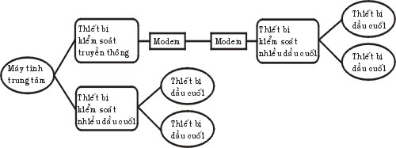
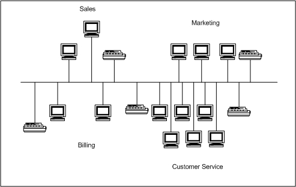
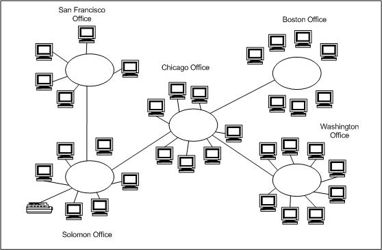
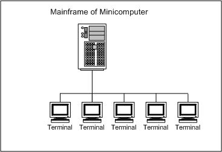
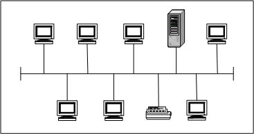
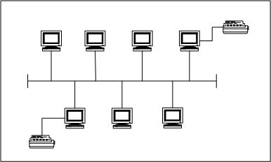
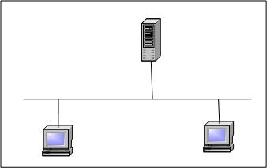
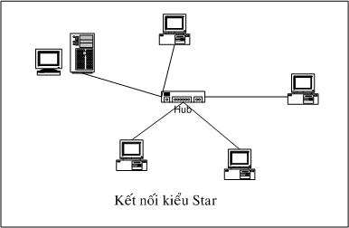
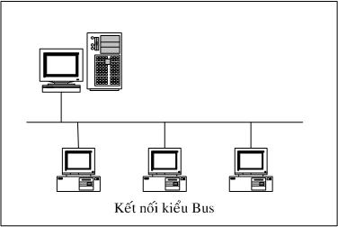

ĐỊNH NGHĨA MẠNG MÁY TÍNH 
-------------------------------

Mạng máy tính là một nhóm các máy tính, thiết bị ngoại vi được kết nối
với nhau thông qua các phương tiện truyền dẫn như cáp, sóng điện từ, tia
hồng ngoại…giúp cho các thiết bị này có thể trao đổi dữ liệu với nhau
một cách dễ dàng.

LỊCH SỬ MẠNG MÁY TÍNH 
----------------------------

Vào giữa những năm 50 một số nhà chế tạo máy tính đã nghiên cứu thành
công những thiết bị truy cập từ xa tới máy tính của họ. Một trong những
phương pháp thâm nhập từ xa được thực hiện bằng việc cài đặt một thiết
bị đầu cuối ở một vị trí cách xa trung tâm tính toán, thiết bị đầu cuối
này được liên kết với trung tâm bằng việc sử dụng đường dây điện thoại
và với hai thiết bị xử lý tín hiệu (thường gọi là Modem) gắn ở hai đầu
và tín hiệu được truyền thay vì trực tiếp thì thông qua dây điện thoại.

Trong lúc đưa ra giới thiệu những thiết bị đầu cuối từ xa, các nhà khoa
học đã triển khai một loạt những thiết bị điều khiển, những thiết bị đầu
cuối đặc biệt cho phép người sử dụng nâng cao được khả năng tương tác
với máy tính. Một trong những sản phẩm quan trọng đó là hệ thống thiết
bị đầu cuối 3270 của . Hệ thống đó bao gồm các màn hình, các hệ thống
điều khiển, các thiết bị truyền thông được liên kết với các trung tâm
tính toán. Hệ thống 3270 được giới thiệu vào năm 1971 và được sử dụng
dùng để mở rộng khả năng tính toán của trung tâm máy tính tới các vùng
xa. Ðể làm giảm nhiệm vụ truyền thông của máy tính trung tâm và số lượng
các liên kết giữa máy tính trung tâm với các thiết bị đầu cuối, và các
công ty máy tính khác đã sản xuất một số các thiết bị sau:

Thiết bị kiểm soát truyền thông: Có nhiệm vụ nhận các bit tín hiệu
từ các kênh truyền thông, gom chúng lại thành các byte dữ liệu và chuyển
nhóm các byte đó tới máy tính trung tâm để xử lý, thiết bị này cũng thực
hiện công việc ngược lại để chuyển tín hiệu trả lời của máy tính trung
tâm tới các trạm ở xa. Thiết bị trên cho phép giảm bớt được thời gian xử
lý trên máy tính trung tâm và xây dựng các thiết bị logic đặc trưng.

Thiết bị kiểm soát nhiều đầu cuối: Cho phép cùng một lúc kiểm soát
nhiều thiết bị đầu cuối. Máy tính trung tâm chỉ cần liên kết với một
thiết bị như vậy là có thể phục vụ cho tất cả các thiết bị đầu cuối đang
được gắn với thiết bị kiểm soát trên. Ðiều này đặc biệt có ý nghĩa khi
thiết bị kiểm soát nằm ở cách xa máy tính vì chỉ cần sử dụng một đường
điện thoại là có thể phục vụ cho nhiều thiết bị đầu cuối.

Hình 1.1: Mô hình trao đổi mạng của hệ thống 3270

Vào giữa những năm 1970, các thiết bị đầu cuối sử dụng những phương pháp
liên kết qua đường cáp nằm trong một khu vực đã được ra đời. Với những
ưu điểm từ nâng cao tốc độ truyền dữ liệu và qua đó kết hợp được khả
năng tính toán của các máy tính lại với nhau. Ðể thực hiện việc nâng cao
khả năng tính toán với nhiều máy tính các nhà sản xuất bắt đầu xây dựng
các mạng phức tạp. Vào những năm 1980 các hệ thống đường truyền tốc độ
cao đã được thiết lập ở Bắc Mỹ và Châu Âu và từ đó cũng xuất hiện các
nhà cung cấp các dịnh vụ truyền thông với những đường truyền có tốc độ
cao hơn nhiều lần so với đường dây điện thoại. Với những chi phí thuê
bao chấp nhận được, người ta có thể sử dụng được các đường truyền này để
liên kết máy tính lại với nhau và bắt đầu hình thành các mạng một cách
rộng khắp. Ở đây các nhà cung cấp dịch vụ đã xây dựng những đường truyền
dữ liệu liên kết giữa các thành phố và khu vực với nhau và sau đó cung
cấp các dịch vụ truyền dữ liệu cho những người xây dựng mạng. Người xây
dựng mạng lúc này sẽ không cần xây dựng lại đường truyền của mình mà chỉ
cần sử dụng một phần các năng lực truyền thông của các nhà cung cấp.

Vào năm 1974 công ty đã giới thiệu một loạt các thiết bị đầu cuối được
chế tạo cho lĩnh vực ngân hàng và thương mại, thông qua các dây cáp mạng
các thiết bị đầu cuối có thể truy cập cùng một lúc vào một máy tính dùng
chung. Với việc liên kết các máy tính nằm ở trong một khu vực nhỏ như
một tòa nhà hay là một khu nhà thì tiền chi phí cho các thiết bị và phần
mềm là thấp. Từ đó việc nghiên cứu khả năng sử dụng chung môi trường
truyền thông và các tài nguyên của các máy tính nhanh chóng được đầu tư.

Vào năm 1977, công ty DataPoint Corporation đã bắt đầu bán hệ điều hành
mạng của mình là "Attached Resource Computer Network" (hay gọi tắt là
Arcnet) ra thị trường. Mạng Arcnet cho phép liên kết các máy tính và các
trạm đầu cuối lại bằng dây cáp mạng, qua đó đã trở thành là hệ điều hành
mạng cục bộ đầu tiên.

Từ đó đến nay đã có rất nhiều công ty đưa ra các sản phẩm của mình, đặc
biệt khi các máy tính cá nhân được sử dụng một cánh rộng rãi. Khi số
lượng máy vi tính trong một văn phòng hay cơ quan được tăng lên nhanh
chóng thì việc kết nối chúng trở nên vô cùng cần thiết và sẽ mang lại
nhiều hiệu quả cho người sử dụng.

TẠI SAO CẦN CÓ MẠNG?
--------------------------

Ngày nay với một lượng lớn về thông tin, nhu cầu xử lý thông tin ngày
càng cao. Mạng máy tính hiện nay trở nên quá quen thuộc đối với chúng
ta, trong mọi lĩnh vực như khoa học, quân sự, quốc phòng, thương mại,
dịch vụ, giáo dục... Hiện nay ở nhiều nơi mạng đã trở thành một nhu cầu
không thể thiếu được. Người ta thấy được việc kết nối các máy tính thành
mạng cho chúng ta những khả năng mới to lớn như:

Sử dụng chung tài nguyên: Những tài nguyên của mạng (như thiết bị,
chương trình, dữ liệu) khi được trở thành các tài nguyên chung thì mọi
thành viên của mạng đều có thể tiếp cận được mà không quan tâm tới những
tài nguyên đó ở đâu.

Tăng độ tin cậy của hệ thống: Người ta có thể dễ dàng bảo trì máy
móc và lưu trữ (backup) các dữ liệu chung và khi có trục trặc trong hệ
thống thì chúng có thể được khôi phục nhanh chóng. Trong trường hợp có
trục trặc trên một trạm làm việc thì người ta cũng có thể sử dụng những
trạm khác thay thế.

Nâng cao chất lượng và hiệu quả khai thác thông tin: Khi thông tin
có thể được dùng chung thì nó mang lại cho người sử dụng khả năng tổ
chức lại các công việc với những thay đổi về chất như:

-   Ðáp ứng những nhu cầu của hệ thống ứng dụng kinh doanh hiện đại.

-   Cung cấp sự thống nhất giữa các dữ liệu.

-   Tăng cường năng lực xử lý nhờ kết hợp các bộ phận phân tán.

-   Tăng cường truy nhập tới các dịch vụ mạng khác nhau đang được cung
    cấp trên thế giới.

    I.  PHÂN LOẠI MẠNG MÁY TÍNH 
        ------------------------------

        1.  ### *Mạng cục bộ (Local Area Network)*

Mạng là một nhóm các máy tính và các thiết bị truyền thông mạng được nối
kết với nhau trong một khu vực nhỏ như một toà nhà cao ốc, khuôn viên
trường đại học, khu giải trí…

Các mạng thường có các đặc điểm sau đây:

-   Băng thông lớn có khả năng chạy các ứng dụng trực tuyến như xem
    phim, hội thảo qua mạng.

-   Kích thước mạng bị giới hạn bởi các thiết bị.

-   Chi phí các thiết bị mạng tương đối rẻ.

-   Quản trị đơn giản.

Hình 1.2

### *Mạng đô thị (Metropolitan Area Network)*

Mạng gần giống như mạng nhưng giới hạn của nó là một thành phố hay một
quốc gia. Mạng nối kết các mạng lại với nhau thông qua các phương tiện
truyền dẫn khác nhau (cáp quang, cáp đồng, sóng…) và các phương thức
truyền thông khác nhau.

Đặc điểm của mạng :

-   Băng thông mức trung bình, đủ để phục vụ các ứng dụng cấp thành phố
    hay quốc gia như chính phủ điện tử, thương mại điện tử, các ứng dụng
    của các ngân hàng…

-   Do nối kết nhiều với nhau nên độ phức tạp cũng tăng đồng thời việc
    quản lý sẽ khó khăn hơn.

-   Chi phí các thiết bị mạng tương đối đắt tiền.

    1.  ### *Mạng diện rộng WAN (Wide Area Network)*

Mạng WAN bao phủ vùng địa lý rộng lớn có thể là một quốc gia, một lục
địa hay toàn cầu. Mạng WAN thường là mạng của các công ty đa quốc gia
hay toàn cầu điển hình là mạng Internet. Do phạm vi rộng lớn của mạng
WAN nên thông thường mạng WAN là tập hợp các mạng LAN, MAN nối lại với
nhau bằng các phương tiện như: vệ tinh (satellites), sóng viba
(microwave), cáp quang, cáp điện thoại.

Đặc điểm của mạng WAN:

-   Băng thông thấp, dễ mất kết nối thường chỉ phù hợp với các ứng dụng
    online như e-mail, web, ftp…

-   Phạm vi hoạt động rộng lớn không giới hạn.

-   Do kết nối của nhiều LAN, MAN lại với nhau nên mạng rất phức tạp và
    có tính toàn cầu nên thường là các tổ chức quốc tế đứng ra qui định
    và quản lý.

-   Chi phí cho các thiết bị và các công nghệ mạng WAN rất đắt tiền.

Hình 1.3

### *Mạng Internet:*

Mạng Internet là trường hợp đặc biệt của mạng WAN, nó chứa các dịch vụ
toàn cầu như Mail, Web, Chat, FTP và phục vụ miễn phí cho mọi người.

Sự phân biệt giữa mạng cục bộ và mạng diện rộng
-----------------------------------------------------

Mạng cục bộ và mạng diện rộng có thể được phân biệt bởi: địa phương hoạt
động, tốc độ đường truyền và tỷ lệ lỗi trên đường truyền, chủ quản của
mạng, đường đi của thông tin trên mạng, dạng chuyển giao thông tin.

Địa phương hoạt động: Liên quan đến khu vực địa lý thì mạng cục bộ
sẽ là mạng liên kết các máy tính nằm ở trong một khu vực nhỏ. Khu vực có
thể bao gồm một tòa nhà hay là một khu nhà... Điều đó hạn chế bởi khoảng
cách đường dây cáp được dùng để liên kết các máy tính của mạng cục bộ
(hạn chế đó còn là hạn chế của khả năng kỹ thuật của đường truyền dữ
liệu). Ngược lại mạng diện rộng là mạng có khả năng liên kết các máy
tính trong một vùng rộng lớn như là một thành phố, một miền, một đất
nước, mạng diện rộng được xây dựng để nối hai hoặc nhiều khu vực địa lý
riêng biệt.

Tốc độ đường truyền và tỷ lệ lỗi trên đường truyền: Do các đường cáp
của mạng cục bộ được xây dựng trong một khu vực nhỏ cho nên nó ít bị ảnh
hưởng bởi tác động của thiên nhiên (như là sấm chớp, ánh sáng...). Điều
đó cho phép mạng cục bộ có thể truyền dữ liệu với tốc độ cao mà chỉ chịu
một tỷ lệ lỗi nhỏ. Ngược lại với mạng diện rộng do phải truyền ở những
khoảng cách khá xa với những đường truyền dẫn dài có khi lên tới hàng
ngàn km. Do vậy mạng diện rộng không thể truyền với tốc độ quá cao vì
khi đó tỷ lệ lỗi sẽ trở nên khó chấp nhận được.

Mạng cục bộ thường có tốc độ truyền dữ liệu từ 4 đến 16 Mbps và đạt tới
100 Mbps nếu dùng cáp quang. Còn phần lớn các mạng diện rộng cung cấp
đường truyền có tốc độ thấp hơn nhiều như T1 với 1.544 Mbps hay E1 với
2.048 Mbps.

(Ở đây bps (Bit Per Second) là một đơn vị trong truyền thông tương đương
với 1 bit được truyền trong một giây, ví dụ như tốc độ đường truyền là 1
Mbps tức là có thể truyền tối đa 1 Megabit trong 1 giây trên đường
truyền đó).

Thông thường trong mạng cục bộ tỷ lệ lỗi trong truyền dữ liệu vào khoảng
1/107-108 còn trong mạng diện rộng thì tỷ lệ đó vào khoảng 1/106 - 107

Chủ quản và điều hành của mạng: Do sự phức tạp trong việc xây dựng,
quản lý, duy trì các đường truyền dẫn nên khi xây dựng mạng diện rộng
người ta thường sử dụng các đường truyền được thuê từ các công ty viễn
thông hay các nhà cung cấp dịch vụ truyền số liệu. Tùy theo cấu trúc của
mạng những đường truyền đó thuộc cơ quan quản lý khác nhau như các nhà
cung cấp đường truyền nội hạt, liên tỉnh, liên quốc gia. Các đường
truyền đó phải tuân thủ các quy định của chính phủ các khu vực có đường
dây đi qua như: tốc độ, việc mã hóa.

Còn đối với mạng cục bộ thì công việc đơn giản hơn nhiều, khi một cơ
quan cài đặt mạng cục bộ thì toàn bộ mạng sẽ thuộc quyền quản lý của cơ
quan đó.

Đường đi của thông tin trên mạng: Trong mạng cục bộ thông tin được
đi theo con đường xác định bởi cấu trúc của mạng. Khi người ta xác định
cấu trúc của mạng thì thông tin sẽ luôn luôn đi theo cấu trúc đã xác
định đó. Còn với mạng diện rộng dữ liệu cấu trúc có thể phức tạp hơn
nhiều do việc sử dụng các dịch vụ truyền dữ liệu. Trong quá trình hoạt
động các điểm nút có thể thay đổi đường đi của các thông tin khi phát
hiện ra có trục trặc trên đường truyền hay khi phát hiện có quá nhiều
thông tin cần truyền giữa hai điểm nút nào đó. Trên mạng diện rộng thông
tin có thể có các con đường đi khác nhau, điều đó cho phép có thể sử
dụng tối đa các năng lực của đường truyền hay nâng cao điều kiện an toàn
trong truyền dữ liệu.

Dạng chuyển giao thông tin: Phần lớn các mạng diện rộng hiện nay
được phát triển cho việc truyền đồng thời trên đường truyền nhiều dạng
thông tin khác nhau như: video, tiếng nói, dữ liệu... Trong khi đó các
mạng cục bộ chủ yếu phát triển trong việc truyền dữ liệu thông thường.
Điều này có thể giải thích do việc truyền các dạng thông tin như video,
tiếng nói trong một khu vực nhỏ ít được quan tâm hơn như khi truyền qua
những khoảng cách lớn.

Các hệ thống mạng hiện nay ngày càng phức tạp về chất lượng, đa dạng về
chủng loại và phát triển rất nhanh về chất. Trong sự phát triển đó số
lượng những nhà sản xuất từ phần mềm, phần cứng máy tính, các sản phẩm
viễn thông cũng tăng nhanh với nhiều sản phẩm đa dạng. Chính vì vậy vai
trò chuẩn hóa cũng mang những ý nghĩa quan trọng. Tại các nước các cơ
quan chuẩn quốc gia đã đưa ra các những chuẩn về phần cứng và các quy
định về giao tiếp nhằm giúp cho các nhà sản xuất có thể làm ra các sản
phẩm có thể kết nối với các sản phẩm do hãng khác sản xuất.

CÁC MÔ HÌNH XỬ LÝ MẠNG 
-----------------------------

Cơ bản có 3 loại mô hình xử lý mạng bao gồm:

-   Mô hình xử lý mạng tập trung.

-   Mô hình xử lý mạng phân phối.

-   Mô hình xử lý mạng cộng tác.

    1.  ### *Mô hình xử lý mạng tập trung:*

Toàn bộ các tiến trình xử lý diễn ra tại máy tính trung tâm. Các máy
trạm cuối (Terminals) được nối mạng với máy tính trung tâm và chỉ hoạt
động như những thiết bị nhập xuất dữ liệu cho phép người dùng xem trên
màn hình và nhập liệu bàn phím. Các máy trạm đầu cuối không lưu trữ và
xử lý dữ liệu . Mô hình xử lý mạng trên có thể triển khai trên hệ thống
phần cứng hoặc phần mềm được cài đặt trên Server.

Ưu điểm: dữ liệu được bảo mật an toàn, dễ backup và diệt virus. Chi
phí các thiết bị thấp.

Khuyết điểm: khó đáp ứng được các yêu cầu của nhiều ứng dụng khác
nhau, tốc độ truy xuất chậm.

Hình 1.4

### *Mô hình xử lý mạng phân phối :*

Các máy tính có khả năng hoạt động độc lập, các công việc được tách nhỏ
và giao cho nhiều máy tính khác nhau thay vì tập trung xử lý trên máy
trung tâm. Tuy dữ liệu được xử lý và lưu trữ tại máy cục bộ nhưng các
máy tính này được nối mạng với nhau nên chúng có thể trao đổi dữ liệu và
dịch vụ.

Ưu điểm: truy xuất nhanh, phần lớn không giới hạn các ứng dụng.

Khuyết điểm: dữ liệu lưu trữ rời rạc khó đồng bộ, backup và rất dễ
nhiễm virus.

Hình 1.5

### *Mô hình xử lý mạng cộng tác:*

Mô hình xử lý mạng cộng tác bao gồm nhiều máy tính có thể hợp tác để
thực hiện một công việc. Một máy tính có thể mượn năng lực xử lý bằng
cách chạy các chương trình trên các máy nằm trong mạng.

Ưu điểm: rất nhanh và mạnh, có thể dùng để chạy các ứng dụng có các
phép toán lớn

Khuyết điểm: các dữ liệu được lưu trữ trên các vị trí khác nhau nên
rất khó đồng bộ và backup, khả năng nhiễm virus rất cao.

CÁC MÔ HÌNH QUẢN LÝ MẠNG 
-------------------------------

### *Workgroup*

Trong mô hình này các máy tính có quyền hạng ngang nhau và không có các
máy tính chuyên dụng làm nghiệp vụ cung cấp dịch vụ hay quản lý. Các máy
tính tự bảo mật và quản lý tài nguyên của riêng mình. Đồng thời các máy
tính cục bộ này cũng tự chứng thực cho người dùng cục bộ.

### *Domain*

Ngược lại với mô hình Workgroup, mô hình Domain thì việc quản lý và
chứng thực người dùng mạng tập trung tại máy tính Primary Domain
Controller. Các tài nguyên mạng cũng được quản lý tập trung và cấp quyền
hạn cho từng người dùng. Lúc đó trong hệ thống có các máy tính chuyên
dụng làm nhiệm vụ cung cấp các dịch vụ và quản lý các máy trạm.

Các mô hình ứng dụng mạng 
--------------------------------

### *Mạng ngang hàng (peer to peer)*

Mạng ngang hàng cung cấp việc kết nối cơ bản giữa các máy tính nhưng
không có bất kỳ một máy tính nào đóng vai trò phục vụ. Một máy tính trên
mạng có thể vừa là Client vừa là Server. Trong môi trường này người dùng
trên từng máy tính chịu trách nhiệm điều hành và chia sẻ tài nguyên của
máy tính mình. Mô hình này chỉ phù hợp với tổ chức nhỏ, số người giới
hạn (thông thường nhỏ hơn 10 người) và không quan tâm đến vấn đề bảo
mật.

Mạng ngang hàng thường dùng các hệ điều hành sau: Win95, Windows for
Workgroup, WinNT Workstation, Win2000 Proffessional, OS/2…

Ưu điểm: Do mô hình mạng ngang hàng đơn giản nên dễ cài đặt, tổ chức
và quản trị, chi phí thiết bị cho mô hình này thấp.

Khuyết điểm: Không cho phép quản lý tập trung nên dữ liệu phân tán,
khả năng bảo mật thấp rất dễ bị xâm nhập. Các tài nguyên không được sắp
xếp nên rất khó định vị và tìm kiếm.

Hình 1.6

### *Mạng khách chủ (Client – Server)*

Trong mô hình mạng khách chủ có một hệ thống máy tính cung cấp các tài
nguyên và dịch vụ cho cả hệ thống mạng sử dụng gọi là các máy chủ
(Server). Một hệ thống máy tính sử dụng các tài nguyên và dịch vụ này
được gọi là máy khách (Client). Các Server thường có cấu hình mạnh (tốc
độ xử lý nhanh, kích thước lưu trữ lớn) hoặc là các máy chuyên dụng.

Hệ điều hành mạng dùng trong mô hình Client - Server là WinNT, Novell
Netware, Unix,Win2K…

Ưu điểm: Do các dữ liệu được lưu trữ tập trung nên dễ bảo mật,
backup và đồng bộ với nhau. Tài nguyên và dịch vụ được tập trung nên dễ
chia sẻ và quản lý và có thể phục vụ cho nhiều người dùng.

Khuyết điểm: Các Server chuyên dụng rất đắt tiền, phải có nhà quản
trị cho hệ thống.

Hình 1.7

KIẾN TRÚC MẠNG CỤC BỘ
---------------------------

### *Hình trạng mạng (Network Topology)*

Topology mạng: Cách kết nối các máy tính với nhau về mặt hình học mà
ta gọi là tô pô của mạng .

Có 2 kiểu nối mạng chủ yếu đó là:

-   Nối kiểu điểm – điểm (point – to – point)

-   Nối kiểu điểm – nhiều điểm (point – to – multipoint hay broadcast)

- Point to Point: Các đường truyền nối từng cặp nút với nhau và mỗi
nút đều có trách nhiệm lưu trữ tạm thời sao đó chuyển tiếp dữ liệu đi
cho tới đích. Do cách làm việc như vậy nên mạng kiểu này còn được gọi là
mạng “lưu và chuyển tiếp“ (store and forward).

- Point to multipoint: Tất cả các nút phân chia nhau một đường
truyền vật lý chung. Dữ liệu gửi đi từ một nút nào đó sẽ được tiếp nhận
bởi tất cả các nút còn lại trên mạng, bởi vậy chỉ cần chỉ ra địa chỉ
đích của dữ liệu để căn cứ vào đó các nút tra xem dữ liệu đó có phải gửi
cho mình không.

### *Mạng hình sao (Star): *

Mạng hình sao có tất cả các trạm được kết nối với một thiết bị trung tâm
có nhiệm vụ nhận tín hiệu từ các trạm và chuyển đến trạm đích. Tuỳ theo
yêu cầu truyền thông trên mạng mà thiết bị trung tâm có thể là Switch,
router, hub hay máy chủ trung tâm. Vai trò của thiết bị trung tâm là
thiết lập các liên kết Point to Point.

Ưu điểm: Thiết lập mạng đơn giản, dễ dàng cấu hình lại mạng (thêm,
bớt các trạm), dễ dàng kiểm soát và khắc phục sự cố, tận dụng được tối
đa tốc độ truyền của đường truyền vật lý.

Khuyết điểm: Độ dài đường truyền nối một trạm với thiết bị trung tâm
bị hạn chế (trong vòng 100m, với công nghệ hiện nay).

Hình 1.8

### *Mạng trục tuyến tính (Bus):*

Tất cả các trạm phân chia một đường truyền chung (bus). Đường truyền
chính được giới hạn hai đầu bằng hai đầu nối đặc biệt gọi là terminator.
Mỗi trạm được nối với trục chính qua một đầu nối chữ T (T-connector)
hoặc một thiết bị thu phát (transceiver).

Mô hình mạng Bus hoạt động theo các liên kết Point to Multipoint hay
Broadcast.

Ưu điểm: Dễ thiết kế, chi phí thấp.

Khuyết điểm: Tính ổn định kém, chỉ một nút mạng hỏng là toàn bộ mạng
bị ngừng hoạt động.

### Hình 1.9

### *Mạng hình vòng (Ring): *

Trên mạng hình vòng tín hiệu được truyền đi trên vòng theo một chiều duy
nhất. Mỗi trạm của mạng được nối với nhau qua một bộ chuyển tiếp
(repeater) có nhiệm vụ nhận tín hiệu rồi chuyển tiếp đến trạm kế tiếp
trên vòng. Như vậy tín hiệu được lưu chuyển trên vòng theo một chuỗi
liên tiếp các liên kết Point to Point giữa các repeater.

Mạng hình vòng có ưu, nhược điểm tương tự như mạng hình sao, tuy nhiên
mạng hình vòng đòi hỏi giao thức truy nhập mạng phức tạp hơn mạng hình
sao.

Ngoài ra còn có các kết nối hỗn hợp giữa các kiến trúc mạng trên như:
Star Bus, Star Ring 
