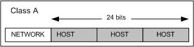
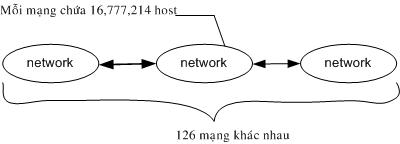
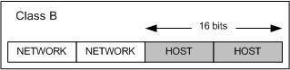
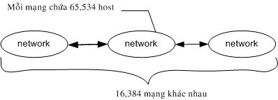
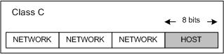
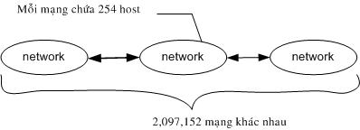
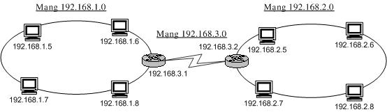
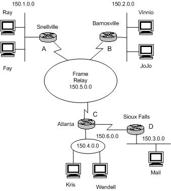
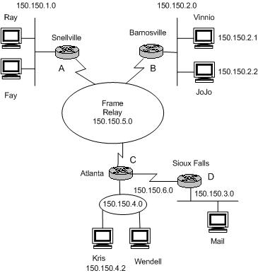
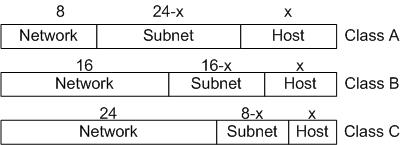

Giao thức /IP được phát triển từ mạng ARPANET và Internet và được dùng
như giao thức mạng và vận chuyển trên mạng Internet. (Transmission
Control Protocol) là giao thức thuộc tầng vận chuyển và IP (Internet
Protocol) là giao thức thuộc tầng mạng của mô hình . Họ giao thức /IP
hiện nay là giao thức được sử dụng rộng rãi nhất để liên kết các máy
tính và các mạng.

Hiện nay các máy tính của hầu hết các mạng có thể sử dụng giao thức /IP
để liên kết với nhau thông qua nhiều hệ thống mạng với kỹ thuật khác
nhau. Giao thức /IP thực chất là một họ giao thức cho phép các hệ thống
mạng cùng làm việc với nhau thông qua việc cung cấp phương tiện truyền
thông liên mạng.

I.  GIAO THỨC IP 
    -------------------

    1.  ### *Tổng quát*

Nhiệm vụ chính của giao thức IP là cung cấp khả năng kết nối các mạng
con thành liên kết mạng để truyền dữ liệu, vai trò của IP là vai trò của
giao thức tầng mạng trong mô hình OSI. Giao thức IP là một giao thức
kiểu không liên kết (connectionless) có nghĩa là không cần có giai đoạn
thiết lập liên kết trước khi truyền dữ liệu.

### *Các giao thức trong mạng IP*

Để mạng với giao thức IP hoạt động được tốt người ta cần một số giao
thức bổ sung, các giao thức này đều không phải là bộ phận của giao thức
IP và giao thức IP sẽ dùng đến chúng khi cần.

**Giao thức ARP (Address Resolution Protocol):** Ở đây cần lưu ý rằng
các địa chỉ IP được dùng để định danh các host và mạng ở tầng mạng của
mô hình , và chúng không phải là các địa chỉ vật lý (hay địa chỉ ) của
các trạm trên đó một mạng cục bộ (Ethernet, Token Ring). Trên một mạng
cục bộ hai trạm chỉ có thể liên lạc với nhau nếu chúng biết địa chỉ vật
lý của nhau. Như vậy vấn đề đặt ra là phải tìm được ánh xạ giữa địa chỉ
IP (32 bits) và địa chỉ vật lý của một trạm. Giao thức ARP đã được xây
dựng để tìm địa chỉ vật lý từ địa chỉ IP khi cần thiết.

**Giao thức RARP (Reverse Address Resolution Protocol):** Là giao thức
ngược với giao thức ARP. Giao thức RARP được dùng để tìm địa chỉ IP từ
địa chỉ vật lý.

**Giao thức ICMP (Internet Control Message Protocol):** Giao thức này
thực hiện truyền các thông báo điều khiển (báo cáo về các tình trạng các
lỗi trên mạng) giữa các gateway hoặc một nút của liên mạng. Tình trạng
lỗi có thể là: một gói tin IP không thể tới đích của nó, hoặc một router
không đủ bộ nhớ đệm để lưu và chuyển một gói tin IP, một thông báo ICMP
được tạo và chuyển cho IP. IP sẽ "bọc" (encapsulate) thông báo đó với
một IP header và truyền đến cho router hoặc trạm đích.

### *Các bước hoạt động của giao thức IP *

Khi giao thức IP được khởi động nó trở thành một thực thể tồn tại trong
máy tính và bắt đầu thực hiện những chức năng của mình, lúc đó thực thể
IP là cấu thành của tầng mạng, nhận yêu cầu từ các tầng trên nó và gửi
yêu cầu xuống các tầng dưới nó.

Đối với thực thể IP ở máy nguồn, khi nhận được một yêu cầu gửi từ tầng
trên, nó thực hiện các bước sau đây:

1.  Tạo một IP datagram dựa trên tham số nhận được.

2.  Tính checksum và ghép vào header của gói tin.

3.  Ra quyết định chọn đường: hoặc là trạm đích nằm trên cùng mạng hoặc
    > một gateway sẽ được chọn cho chặng tiếp theo.

4.  Chuyển gói tin xuống tầng dưới để truyền qua mạng.

Đối với router, khi nhận được một gói tin đi qua, nó thực hiện các động
tác sau:

1.  Tính chesksum, nếu sai thì loại bỏ gói tin.

2.  Giảm giá trị tham số Time - to Live. Nếu thời gian đã hết thì loại
    > bỏ gói tin.

3.  Ra quyết định chọn đường.

4.  Phân đoạn gói tin, nếu cần.

5.  Kiến tạo lại IP header, bao gồm giá trị mới của các vùng Time - to
    > -Live, Fragmentation và Checksum.

6.  Chuyển datagram xuống tầng dưới để chuyển qua mạng.

Cuối cùng khi một datagram nhận bởi một thực thể IP ở trạm đích, nó sẽ
thực hiện bởi các công việc sau:

1.  Tính checksum. Nếu sai thì loại bỏ gói tin.

2.  Tập hợp các đoạn của gói tin (nếu có phân đoạn).

3.  Chuyển dữ liệu và các tham số điều khiển lên tầng trên.

    I.  GIAO THỨC ĐIỀU KHIỂN TRUYỀN DỮ LIỆU TCP
        ---------------------------------------------

là một giao thức "có liên kết" (connection - oriented), nghĩa là cần
phải thiết lập liên kết giữa hai thực thể trước khi chúng trao đổi dữ
liệu với nhau. Một tiến trình ứng dụng trong một máy tính truy nhập vào
các dịch vụ của giao thức thông qua một cổng (port) của . Số hiệu cổng
được thể hiện bởi 2 bytes.

Hình 2.1: Cổng truy nhập dịch vụ

Một cổng kết hợp với địa chỉ IP tạo thành một đầu nối /IP (socket) duy
nhất trong liên mạng. Dịch vụ được cung cấp nhờ một liên kết logic giữa
một cặp đầu nối /IP. Một đầu nối /IP có thể tham gia nhiều liên kết với
các đầu nối /IP ở xa khác nhau. Trước khi truyền dữ liệu giữa 2 trạm cần
phải thiết lập một liên kết giữa chúng và khi không còn nhu cầu truyền
dữ liệu thì liên kết đó sẽ được giải phóng.

Các thực thể của tầng trên sử dụng giao thức thông qua các hàm gọi
(function calls) trong đó có các hàm yêu cầu: để yêu cầu, để trả lời.
Trong mỗi hàm còn có các tham số dành cho việc trao đổi dữ liệu.

**Các bước thực hiện để thiết lập một liên kết /IP:** Thiết lập một liên
kết mới có thể được mở theo một trong 2 phương thức: chủ động (active)
hoặc bị động (passive).

-   Phương thức bị động, người sử dụng yêu cầu chờ đợi một yêu cầu liên
    kết gửi đến từ xa thông qua một đầu nối /IP (tại chỗ). Người sử dụng
    dùng hàm passive Open có khai báo cổng và các thông số khác (mức ưu
    tiên, mức an toàn)

-   Với phương thức chủ động, người sử dụng yêu cầu mở một liên kết với
    một đầu nối /IP ở xa. Liên kết sẽ được xác lập nếu có một hàm
    Passive Open tương ứng đã được thực hiện tại đầu nối /IP ở xa đó.

Bảng liệt kê một vài cổng phổ biến.

  -------------- -------------------------
  Số hiệu cổng   Mô tả
  0              Reserved
  5              Remote job entry
  7              Echo
  9              Discard
  11             Systat
  13             Daytime
  15             Nestat
  17             Quotd (quote odd day)
  20             ftp-data
  21             ftp (control)
  23             Telnet
  25             SMTP
  37             Time
  53             Name Server
  102            ISO - TSAP
  103            X.400
  104            X.400 Sending
  111            Sun RPC
  139            Net BIOS Session source
  160 - 223      Reserved
  -------------- -------------------------

Khi người sử dụng gửi đi một yêu cầu mở liên kết sẽ được nhận hai thông
số trả lời từ .

-   Thông số Open ID được trả lời ngay lập tức để gán cho một liên kết
    cục bộ (local connection name) cho liên kết được yêu cầu. Thông số
    này về sau được dùng để tham chiếu tới liên kết đó. (Trong trường
    hợp nếu không thể thiết lập được liên kết yêu cầu thì nó phải gửi
    tham số Open Failure để thông báo).

-   Khi thiết lập được liên kết yêu cầu nó gửi tham số Open Sucsess được
    dùng để thông báo liên kết đã được thiết lập thành công. Thông báo
    này được chuyển đến trong cả hai trường hợp bị động và chủ động. Sau
    khi một liên kết được mở, việc truyền dữ liệu trên liên kết có thể
    được thực hiện.

**Các bước thực hiện khi truyền và nhận dữ liệu:** Sau khi xác lập được
liên kết người sử dụng gửi và nhận dữ liệu. Việc gửi và nhận dữ liệu
thông qua các hàm Send và Receive.

-   Hàm Send: Dữ liệu được gửi xuống theo các khối (block). Khi
    nhận được một khối dữ liệu, sẽ lưu trữ trong bộ đệm (buffer). Nếu cờ
    PUSH được dựng thì toàn bộ dữ liệu trong bộ đệm được gửi, kể cả khối
    dữ liệu mới đến sẽ được gửi đi. Ngược lại cờ PUSH không được dựng
    thì dữ liệu được giữ lại trong bộ đệm và sẽ gửi đi khi có cơ hội
    thích hợp (chẳng hạn chờ thêm dữ liệu nữa để gửi đi với hiệu
    quả hơn).

-   Hàm receive: Ở trạm đích dữ liệu sẽ được lưu trong bộ đệm gắn
    với mỗi liên kết. Nếu dữ liệu được đánh dấu với một cờ PUSH thì toàn
    bộ dữ liệu trong bộ đệm (kể cả các dữ liệu được lưu từ trước) sẽ
    được chuyển lên cho người sử dụng. Còn nếu dữ liệu đến không được
    đánh dấu với cờ PUSH thì chờ tới khi thích hợp mới chuyển dữ liệu
    với mục tiêu tăng hiệu quả hệ thống.

Nói chung việc nhận và giao dữ liệu cho người sử dụng đích của phụ thuộc
vào việc cài đặt cụ thể. Trường hợp cần chuyển gấp dữ liệu cho người sử
dụng thì có thể dùng cờ URGENT và đánh dấu dữ liệu bằng bit URG để báo
cho người sử dụng cần phải xử lý khẩn cấp dữ liệu đó.

**Các bước thực hiện khi đóng một liên kết:** Việc đóng một liên kết khi
không cần thiết được thực hiên theo một trong hai cách: dùng hàm Close
hoặc dùng hàm Abort.

-   **Hàm Close:** Yêu cầu đóng liên kết một cách bình thường. Có nghĩa
    là việc truyền dữ liệu trên liên kết đó đã hoàn tất. Khi nhận được
    một hàm Close sẽ truyền đi tất cả dữ liệu còn trong bộ đệm thông báo
    rằng nó đóng liên kết. Lưu ý rằng khi một người sử dụng đã gửi đi
    một hàm Close thì nó vẫn phải tiếp tục nhận dữ liệu đến trên liên
    kết đó cho đến khi đã báo cho phía bên kia biết về việc đóng liên
    kết và chuyển giao hết tất cả dữ liệu cho người sử dụng của mình.

-   **Hàm Abort:** Người sử dụng có thể đóng một liên kết bất kỳ và sẽ
    không chấp nhận dữ liệu qua liên kết đó nữa. Do vậy dữ liệu có thể
    bị mất đi khi đang được truyền đi. báo cho ở xa biết rằng liên kết
    đã được hủy bỏ và ở xa sẽ thông báo cho người sử dụng của mình.

Một số hàm khác của :

-   **Hàm Status:** cho phép người sử dụng yêu cầu cho biết trạng thái
    của một liên kết cụ thể, khi đó cung cấp thông tin cho người
    sử dụng.

-   **Hàm Error:** thông báo cho người sử dụng về các yêu cầu dịch vụ
    bất hợp lệ liên quan đến một liên kết có tên cho trước hoặc về các
    lỗi liên quan đến môi trường.

Đơn vị dữ liệu sử dụng trong được gọi là segment (đoạn dữ liệu), có các
tham số với ý nghĩa như sau:

Hình 2.2 Dạng thức của segment

-   (16 bits): Số hiệu cổng của trạm nguồn.

-   (16 bits): Số hiệu cổng của trạm đích.

-   Sequence Number (32 bits): số hiệu của byte đầu tiên của segment trừ
    khi bit SYN được thiết lập. Nếu bit SYN được thiết lập thì Sequence
    Number là số hiệu tuần tự khởi đầu (ISN) và byte dữ liệu đầu tiên
    là ISN+1.

-   Acknowledgment Number (32 bits): số hiệu của segment tiếp theo mà
    trạm nguồn đang chờ để nhận. Ngầm ý báo nhận tốt (các) segment mà
    trạm đích đã gửi cho trạm nguồn.

-   Data offset (4 bits): số lượng bội của 32 bit (32 bits words) trong
    header (tham số này chỉ ra vị trí bắt đầu của nguồn dữ liệu).

-   Reserved (6 bits): dành để dùng trong tương lai.

-   Control bit (các bit điều khiển):

    -   URG: Vùng con trỏ khẩn (Urgent Poiter) có hiệu lực.

    -   : Vùng báo nhận ( number) có hiệu lực.

    -   PSH: Chức năng PUSH.

    -   : Khởi động lại (reset) liên kết.

    -   SYN: Đồng bộ hóa số hiệu tuần tự (sequence number).

    -   FIN: Không còn dữ liệu từ trạm nguồn.

-   Window (16 bits): cấp phát credit để kiểm soát nguồn dữ liệu (cơ chế
    cửa sổ). Đây chính là số lượng các byte dữ liệu, bắt đầu từ byte
    được chỉ ra trong vùng number, mà trạm nguồn đã sẵn sàng để nhận.

-   Checksum (16 bits): mã kiểm soát lỗi cho toàn bộ segment (header +
    data).

-   Urgemt Poiter (16 bits): con trỏ này trỏ tới số hiệu tuần tự của
    byte đi theo sau dữ liệu khẩn. Vùng này chỉ có hiệu lực khi bit URG
    được thiết lập.

-   Options (độ dài thay đổi): khai báo các option của , trong đó có độ
    dài tối đa của vùng data trong một segment.

-   Paddinh (độ dài thay đổi): phần chèn thêm vào header để đảm bảo phần
    header luôn kết thúc ở một mốc 32 bits. Phần thêm này gồm toàn số 0.

-   data (độ dài thay đổi): chứa dữ liệu của tầng trên, có độ dài tối đa
    ngầm định là 536 bytes. Giá trị này có thể điều chỉnh bằng cách khai
    báo trong vùng options.

    I.  
        TỔNG QUAN VỀ ĐỊA CHỈ IP
        -----------------------------

Trước khi khảo sát cấu tạo, tính chất, nhiệm vụ của địa chỉ IP ta xét
những tiền đề tạo nên nó:

Đơn vị thông tin cơ bản trong máy tính được biểu diễn dưới dạng số nhị
phân bao gồm 2 giá trị đếm là 0 và 1. Tuy nhiên trong nhiều trường hợp
khác nó còn được biểu diễn bằng số bát phân, hay số thập lục phân.

Hệ thống số đó được miêu tả ở bảng dưới đây lấy số thập phân làm so sánh
tường minh:

  ----------- ---------- ---------- ---------------
  Thập phân   Nhị phân   Bát phân   Thập lục phân
  0           0000       0          0
  1           0001       1          1
  2           0010       2          2
  3           0011       3          3
  4           0100       4          4
  5           0101       5          5
  6           0110       6          6
  7           0111       7          7
  8           1000       10         8
  9           1001       11         9
  10          1010       12         A
  11          1011       13         B
  12          1100       14         C
  13          1101       15         D
  14          1110       16         E
  15          1111       17         F
  ----------- ---------- ---------- ---------------

Thông thường muốn chuyển từ số nhị phân, bát phân, thập lục phân qua lại
với nhau ta phải chuyển qua một bước trung gian về số thập lục phân.

**Quy tắc chuyển các số nhị phân, bát phân, thập lục phân về cơ số 10:**

Chuyển số nhị phân: 101101~2~ = X~10~ :
1x2^5^+0x2^4^+1x2^3^+1x2^2^+0x2^1^+1x2^0^ =45~10~.

Chuyển bát phân: 736~8~ = X~10~ : 7x8^2^+3x8^1^+6x8^0^ =478~10~.

Chuyển thập lục phân: F3~16~ = X~10~ : Fx16^1^+3x16^0^ = 15x16+16x3 =
243~10~.

**Qui tắc chuyển từ hệ số thập phân về các hệ số khác, ở đây ta lấy ví
dụ đối với số nhị phân: 13**~10~**=X**~2~**: **

13/2 = 6 dư 1

6/2 = 3 dư 0

3/2 = 1 dư 1

1/2 = 0 dư 1

Ta lấy số dư của phép chia cho 2 theo thứ tự từ dưới lên trên.

Vậy ta được số nhị phân của số 13 thập phân là: 1101~2~

Với các hệ số khác ta cũng thực hiện như vậy.

Cấu trúc địa chỉ IP gồm 32bits, được chia thành 4 nhóm, mỗi nhóm 8 bits
được biểu diễn như sau:

  ----- ---- ---- ---- --- --- --- ---
  1     1    1    1    1   1   1   1
  128   64   32   16   8   4   2   1
  ----- ---- ---- ---- --- --- --- ---

Vậy giá trị 8 bits khi tất cả được bật lên 1, hiểu ở giá trị thập phân
là: 255.

Vậy những giá trị thập phân mà ta có thể gán 4 nhóm của 32 Bit là:

  ------------------- ------------------- ------------------- -------------------
  00000000-11111111   00000000-11111111   00000000-11111111   00000000-11111111
  0-255               0-255               0-255               0-255
  ------------------- ------------------- ------------------- -------------------

Vậy địa chỉ IP có cấu trúc được chia làm hai hoặc ba phần là network\_id
& host\_id hoặc network\_id & subnet\_id & host\_id.

Là một con số có kích thước 32 bits. Khi trình bày người ta chia con số
32 bits này thành bốn phần, mỗi phần có kích thước 8 bits, gọi là octet
hoặc byte. Có các cách trình bày sau:

-   Ký pháp thập phân có dấu chấm (dotted-decimal notation). Ví
    dụ: 172.16.30.56.

-   Ký pháp nhị phân. Ví dụ: 10101100 00010000 00011110 00111000.

-   Ký pháp thập lục phân. Ví dụ: 82 39 1E 38.

Không gian địa chỉ IP (gồm 232 địa chỉ) được chia thành 5 lớp (class) để
dễ quản lý đó là: A, B, C, D và E. Trong đó các lớp A, B và C được triển
khai để đặt cho các host trên mạng Internet, lớp D dùng cho các nhóm
multicast, còn lớp E phục vụ cho mục đích nghiên cứu.

MỘT SỐ KHÁI NIỆM VÀ THUẬT NGỮ LIÊN QUAN:
----------------------------------------------

Địa chỉ host là địa chỉ IP có thể dùng để đặt cho các interface của các
host. Hai host nằm cùng một mạng sẽ có network\_id giống nhau và
host\_id khác nhau.

**Địa chỉ mạng (network address):** là địa chỉ IP dùng để đặt cho các
mạng. Phần host\_id của địa chỉ chỉ chứa các bit 0. Địa chỉ này không
thể dùng để đặt cho một Interface. Ví dụ 172.29.0.0

**Địa chỉ Broadcast:** là địa chỉ IP được dùng để đại diện cho tất cả
các host trong mạng. Phần host id chỉ chứa các bit 1. Địa chỉ này cũng
không thể dùng để đặt cho một host được. Ví dụ 172.29.255.255

**Các phép toán làm việc trên bit :**

  ------------- ------------
  Phép          Phép OR

  A B A and B   A B A or B

  1 1 1         1 1 1
                
  1 0 0         1 0 1
                
  0 1 0         0 1 1
                
  0 0 0         0 0 0
  ------------- ------------

Ví dụ sau minh hoạ phép giữa địa chỉ 172.29.14.10 và mask 255.255.0.0

172.29.14.10 = 10101100 00011101 00001110 00001010

255.255.0.0 = 11111111 11111111 00000000 00000000

172.29.0.0 = 10101100 00011101 00000000 00000000

172.29.1.0

**Mặt nạ mạng (Network Mask):** là một con số dài 32 bits, là phương
tiện giúp máy xác định được địa chỉ mạng của một địa chỉ IP (bằng cách
giữa địa chỉ IP với mặt nạ mạng) để phục vụ cho công việc routing. Mặt
nạ mạng cũng cho biết số bit nằm trong phần host\_id. Được xây dựng bằng
cách bật các bit tương ứng vớp phần network\_ id và tắt các bit tương
ứng với phần host\_id.

Mặt nạ mặc định của các lớp không chia mạng con

  ------- ---------------
  Lớp A   255.0.0
  Lớp B   255.255.0.0
  Lớp C   255.255.255.0
  ------- ---------------

GIỚI THIỆU CÁC LỚP ĐỊA CHỈ:
---------------------------------

### *Lớp A *

Dành một byte cho phần network\_id và ba byte cho phần host\_id.

Hình 2.3

Để nhận biết lớp A, bit đầu tiên của byte đầu tiên phải là bit 0. Dưới
dạnh nhị phân, byte này có dạng 0XXXXXXX . Vì vậy, những địa chỉ IP có
byte đầu tiên nằm trong khoảng từ 0 (00000000) đến 127 (01111111) sẽ
thuộc lớp A. Ví dụ : 50.14.32.8

Byte đầu tiên này cũng chính là network\_id, trừ đi bit đầu tiên làm ID
nhận dạng lớp A, còn lại 7 bits để đánh thứ tự các mạng, ta được 128
(27) mạng lớp A khác nhau. Bỏ đi hai trường hợp đặc biệt là 0 và 127.
Kết quả là lớp A chỉ còn 126 địa chỉ mạng, 1.0.0.0 đến 126.0.0.0

Phần host\_id chiếm 24 bits, tức có thể đặt địa chỉ cho 16,777,216 host
khác nhau trong mỗi mạng. Bỏ đi địa chỉ mạng (phần host\_id chứa toàn
các bit 0) và một địa chỉ Broadcast (phần host\_id chứa toàn các bit 1)
như vậy có tất cả 16,777,214 host khác nhau trong mỗi mạng lớp A. Ví dụ
đối với mạng 10.0.0.0 thì những giá trị host hợp lệ là 10.0.0.1 đến
10.255.255.254

Hình 2.4

### *Lớp B *

Dành 2 bytes cho mỗi phần network\_id và host\_id.

Hình 2.5

Dấu hiệu để nhận dạng địa chỉ lớp B là byte đầu tiên luôn bắt đầu bằng
hai bit 10. Dưới dạng nhị phân, octet có dạng 10XXXXXX. Vì vậy những địa
chỉ nằm trong khoảng từ 128 (10000000) đến 191 (10111111) sẽ thuộc về
lớp B. Ví dụ 172.29.10.1 là một địa chỉ lớp B .

Phần network\_id chiếm 16 bits bỏ đi 2 bits làm ID cho lớp, còn lại 14
bits cho phép ta đánh thứ tự 16,384 (214) mạng khác nhau (128.0.0.0 d8ến
191.255.0.0).

Phần host\_id dài 16 bits hay có 65536 (216) giá trị khác nhau. Trừ đi 2
trường hợp đặc biệt còn lại 65534 host trong một mạng lớp B. Ví dụ đối
với mạng 172.29.0.0 thì các địa chỉ host hợp lệ là từ 172.29.0.1 đến
172.29.255.254

Hình 2.6

### *Lớp C*

Dành 3 bytes cho phần network\_id và một byte cho phần host\_id

Hình 2.7

Byte đầu tiên luôn bắt đầu bằng 3 bits 110 và dạng nhị phân của octet
này là 110XXXXX. Như vậy những địa chỉ nằm trong khoảng từ 192
(11000000) đến 223 (11011111) sẽ thuộc về lớp C. Ví dụ: 203.162.41.235

Phần network\_id dùng 3 byte hay 24 bit, trừ đi 3 bit làm ID của lớp,
còn lại 21 bit hay 2,097,152 (2 21) địa chỉ mạng ( từ 192.0.0.0 đến
223.255.255.0).

Phần host\_id dài 1 byte cho 256 (28) giá trị khác nhau. Trừ đi hai
trường hợp đặc biệt ta còn 254 host khác nhau trong một mạng lớp C. Ví
dụ, đối với mạng 203.162.41.0, các địa chỉ host hợp lệ là từ
203.162.41.1 đến 203.162.41.254

Hình 2.8

### *Lớp D và E*

Các địa chỉ có byte đầu tiên nằm trong khoảng 224 đến 256 là các địa chỉ
thuộc lớp D hoặc E. Do các lớp này không phục vụ cho việc đánh địa chỉ
các host nên không trình bày ở đây.

### *Ví dụ cách triển khai đặt địa chỉ IP cho một hệ thống mạng*

Hình 2.9

### 
*Chia mạng con (subnetting) *

Giả sử ta phải tiến hành đặt địa chỉ IP cho hệ thống có cấu trúc như
sau:

Hình 2.10

Theo hình trên, ta bắt buộc phải dùng đến tất cả là 6 đường mạng riêng
biệt để đặt cho hệ thống mạng của mình, mặc dù trong mỗi mạng chỉ dùng
đến vài địa chỉ trong tổng số 65,534 địa chỉ hợp lệ ---&gt; một sự phí
phạm to lớn. Thay vì vậy, khi sử dụng kỹ thuật chia mạng con, ta chỉ cần
sử dụng một đường mạng 150.150.0.0 và chia đường mạng này thành sáu mạng
con theo hình bên dưới:

Hình 2.11

Rõ ràng khi cấp phát địa chỉ cho các hệ thống mạng lớn, người ta phải sử
dụng kỹ thuật chia mạng con trong tình hình địa chỉ IP ngày càng khan
hiếm. Xét về khía cạnh kỹ thuật, chia mạng con chính là việc dùng một số
bit trong phần host\_id ban đầu để đặt cho các mạng con. Lúc này cấu
trúc của địa chỉ IP gồm 3 phần: network\_id, subnet\_id và host\_id. Số
bit dùng trong subnet\_id bao nhiêu là tuỳ thuộc và chiến lược chia mạng
con của người quản trị, có thể là con số tròn byte (8 bits) hoặc một số
bit lẻ vẫn được. Tuy nhiên, ta không để subnet\_id chiếm trọn số bit có
trong host\_id ban đầu, cụ thể là subnet\_id host\_id -2.

Hình 2.12

Số lượng host trong mỗi mạng con được xác định bằng số bit trong phần
host\_id;

2x-2 (trường hợp đặc biệt) là số địa chỉ hợp lệ có thể đặt cho các host
trong mạng con. Tương tự số bit trong phần subnet\_id xác định số lượng
mạng con. Giả sử số bit là y ---&gt; 2y là số lượng mạng con có được.

**Một số khái niệm mới:**

-   Địa chỉ mạng con (địa chỉ đường mạng): Bao gồm cả phần network\_id
    và subnet\_id, phần host\_id chỉ chứa các bit 0. Theo hình trên thì
    ta có các địa chỉ mạng con sau: 150.150.1.0, 150.150.2.0,…

-   Địa chỉ broadcast trong một mạng con: Bật tất cả các bit trong phần
    host\_id lên 1. Ví dụ địa chỉ broadcast của mạng con 150.150.1.0
    là 150.150.1.255.

-   Mặt nạ mạng con (subnet mask): Giúp máy tính xác định được địa chỉ
    mạng con của một địa chỉ host. Để xây dựng mặt nạ mạng con cho một
    hệ thống địa chỉ, ta bật các bit trong phần host\_id thành 0. Ví dụ
    mặt nạ mạng con dùng cho hệ thống mạng trong mô hình trên là
    255.255.255.0

Vấn đề đặt ra là khi xác định được một địa chỉ IP (ví dụ 172.29.8.230)
ta không thể biết được host này nằm trong mạng nào (không thể biết mạng
này có chia mạng con hay không, và có nếu chia thì dùng bao nhiêu bit để
chia). Chính vì vậy khi ghi nhận địa chỉ IP của một host, ta cũng phải
cho biết subnet mask là bao nhiêu, ví dụ 12.29.8.230/255.255.255.0 hoặc
172.29.8.230/24

### *Địa chỉ riêng (private address) và cơ chế chuyển đổi địa chỉ mạng (Network Address Translation –NAT)*

Tất cả các IP host khi kết nối vào mạng Internet đều phải có một địa chỉ
IP o tổ chức IANA (Internet Assigned Numbers Authority) cấp phát – gọi
là địa chỉ hợp lệ (hay là được đăng ký). Tuy nhiên số lượng host kết nối
vào mạng ngày càng gia tăng dẫn đến tình trạng khan hiếm địa chỉ IP. Một
giải pháp đưa ra là sử dụng cơ chế kèm theo RFC 1918 quy định danh sách
địa chỉ riêng. Các địa chỉ này sẽ không được IANA cấp phát – hay còn gọi
là địa chỉ không hợp lệ. Bảng sau liệt kê danh sách các địa chỉ này:

  ----------------- ----- ---------------
  Nhóm địa chỉ      Lớp   Số lượng mạng

  10.0.0.0 đến      A     1
                          
  10.255.255.255          

  172.16.0.0 đến    B     16
                          
  172.32.255.255          

  192.168.0.0 đến   C     256
                          
  192.168.255.255         
  ----------------- ----- ---------------

