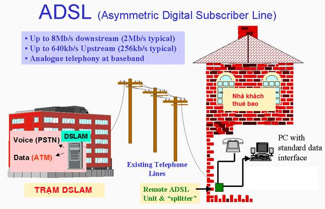

I.  GIỚI THIỆU ADSL (ADSL, ADSL 2+ )

- ADSL là từ viết tắt của Tiếng Anh: Asymmetric Digital Subscriber
    Line dịch sang tiếng Việt là đường dây thuê bao số bất đôi xứng, là
    một dạng của DSL.

- Tốc độ truy cập nhanh hơn so với phương thức quay số truyền thống

- ADSL sử dụng đường dây điện thoại sẵn có. tách băng thông trên đường
    cáp điện thoại thành hai: một phần nhỏ dành cho truyền âm
    (0khz-20khz), phần lớn dành cho truyền tải dữ liệu ở tốc độ cao
    25.875 KHz đến 1.104 MHz .

- Bất đối xứng” lượng dữ liệu upload và download không bằng nhau. Tốc
    độ chiều xuống (từ mạng tới thuê bao) có thể nhanh gấp hơn 10 lần so
    với tốc độ chiều lên (từ thuê bao tới mạng)

- Bị giới hạn khoảng cách từ trạm truyền dẫn (DSLAM) người sử dụng
    \~ 5400m.

- Luôn luôn online, không phải quay số, không phải trả cước nội hạt.

- ADSL ,ADSL2, ADSL 2+ (ADSL 2+ trên lý thuyết có thể đạt tốc độ
    download 24Mbps)

Ưu điểm của ADSL:

- Có thể sử dụng trên cùng một đường dây điện thoại sẵn có dựa trên
    hai dãi băng tần khác nhau. Việc sử dụng đồng thời ADSL, điện thoại,
    fax… Không làm ảnh hưởng đến chất lượng các dịch vụ .

- Bằng việc sử dụng băng tần cao ở phía trên băng tần dành cho thoại,
    công nghệ DSL có thể mã hóa được nhiều dữ liệu hơn và do đó đạt được
    tốc độ cao hơn các modem Dialup hiện nay.

- Không phải trả cước phí điện thoại phát sinh.

- Không tín hiệu báo bận, không thời gian chờ đợi.

- Gọi điện thoại Internet đi quốc tế với chất lượng cực tốt

- Không cần phải thực hiện quay số như dịch vụ Dialup.

- Không lo lộ tên truy cập và Password.

I.  CÀI ĐẶT VÀ CẤU HÌNH MODEM ADSL

<!-- -->

1.  Yêu cầu thiết bị đầu cuối:

- Phần cứng: ip modem, tên và mật khẩu đăng nhập modem ( xem tài liệu
    đính kèm theo modem)

- Nhà cung cấp dịch vụ: tên, mật khẩu đăng nhập ADSL, thông số VCI,
    VPI, Encapsulation, DNS do nhà cung cấp dịch vụ internet chuyển
    cho bạn.

  THÔNG SỐ KỸ THUẬT CỦA MỘT SỐ LOẠI MODEM ADSL
  ---------------------------------------------- ------------ ------------- ------- ------------
  STT
  1
  2
  3
  4
  5
  6
  7
  8
  9

  Thông số cơ bản của các nhà cung cấp dịch vụ internet
  ------------------------------------------------------- -------------- ----- ----- --------------- ---------------
  Stt
  1
  2
  3

1.  Cấu hình modem ADSL căn bản: Để cấu hình chi tiết một modem ADSL bạn
    có thể tham khảo tài liệu cấu hình các thiết bị đầu cuối kèm theo.

2.  Cấu hình nâng cao: Xem mục draytek

