CHƯƠNG I – TỔNG QUAN VỀ MẠNG WLAN
=================================

 – Khái niệm và lịch sử hình thành mạng WLAN
--------------------------------------------

 Mạng LAN không giây viết tắt là WLAN (Wireless Local Area Network), là
 một loại mạng máy tính mà các thành phần trong mạng không sử dụng các
 cáp như một mạng thông thường, môi trường truyền thông trong mạng là
 không khí. Các thành phần trong mạng sử dụng sóng điện từ để truyền
 thông với nhau. Nó giúp cho người sử dụng có thể di chuyển trong một
 vùng bao phủ rộng mà vẫn có thể kết nối được với mạng.

 Công nghệ WLAN xuất hiện năm vào cuối những năm 1990, khi những nhà
 sản xuất giới thiệu sản phẩm hoạt động dưới băng tần 900MHz. Những
 giải pháp này cung cấp tốc độ truyền dữ liệu 1Mbps, thấp hơn nhiều so
 với tốc độ 10Mbps của hầu hết các mạng sử dụng cáp đương thời.

 Năm 1992, những nhà sản xuất bắt đầu bán những sản phẩm sử dụng băng
 tần 2,4 Ghz. Mặc dù những sản phẩm này đã có tốc độ truyền dữ liệu cao
 hơn nhưng chúng vẫn là những giải pháp của riêng từng nhà sản xuất và
 chưa được công bố rộng rãi. Sự cần thiết cho sự hoạt động thống nhất
 giữa các thiết bị ở những giải tần khác nhau dẫn đến một số tổ chức
 bắt đầu phát triển những chuẩn mạng không giây chung.

 Năm 1997, IEEE (Institute of Electrical and Electronics Engineers) đã
 phê chuẩn của 802.11 và cũng được gọi với tên WIFI (Wireless Fidelity)
 cho các mạng WLAN. Chuẩn 802.11 hỗ trợ ba phương pháp truyền dữ liệu,
 trong đó có bao gồm phương pháp truyền tín hiệu vô tuyến ở tần số 2,4
 GHz.

 Năm 1999, IEEE thông qua hai sự bổ xung cho chuẩn 802.11 hai phương
 pháp truyền tín hiệu là các chuẩn 8.2.11a và 802.11b. Những sản phẩm
 WLAN dựa trên 802.11b nhanh chóng trở thành công nghệ không giây vượt
 trội. Các thiết bị 802.11b truyền phát ở tần số 2,4GHz, cung cấp tốc
 độ truyền tín hiệu có thể lên tới 11Mbps. IEEE 802.11b được tạo ra
 nhằm cung cấp những đặc điểm về tính hiệu dụng, thông lượng
 (throughput) và bảo mật để so sánh với mạng có dây.

 Đầu năm 2003, IEEE công bố thêm một chuẩn nữa là 802.11g mà có thể
 truyền nhận thông tin ở cả hai dải tần 2,4GHz và 5GHz. Chuẩn 802.11g
 có thể nâng tốc độ truyền dữ liệu lên tới 54Mbps. Hơn thế nữa, những
 sản phẩm sử dụng chuẩn 802.11g cũng có thể tương thích với những thiết
 bị chuẩn 802.11b. Ngày nay, chuẩn 802.11g đã đạt đến tốc độ từ
 108Mbps-300Mbps.

 Cuối năm 2009, chuẩn 802.11n đã được IEEE phê duyệt đưa vào sử dụng
 chính thức và được Hiệp hội Wi-Fi (Wi-Fi Alliance) kiểm định và cấp
 chứng nhận cho các sản phẩm đạt chuẩn. Mục tiêu chính của công nghệ
 này là tăng tốc độ truyền và tầm phủ sóng cho các thiết bị bằng cách
 kết hợp các công nghệ vượt trội và tiên tiến nhất. Về mặt lý thuyết,
 802.11n cho phép kết nối với tốc độ 300Mbps.

1.2 - Các chuẩn mạng thông dụng của WLAN 
-----------------------------------------

 Học viện Kỹ nghệ Điện và Điện tử IEEE (Institute of Electrical and
 Electronics Engineers) là hiệp hội phi lợi nhuận quốc tế về cách tân
 công nghệ tiên tiến hướng tới lợi ích của con người
 (http://www.ieee.org/index.html). Hiệp hội IEEE chính thức ra đời ngày
 1.1.1963 dựa trên sự hợp nhất của Học viện Kỹ nghệ Điện tử Mỹ (AIEE)
 thành lập năm 1884 và Học viện Kỹ nghệ Radio (IRE) thành lập năm 1912,
 với tổng số 150.000 thành viên. Tuy giữ tên gọi truyền thống về điện
 và điện tử, nhưng nội dung hoạt động của IEEE hiện bao gồm hầu hết mọi
 lĩnh vực công nghệ liên quan tới công nghệ điện tử và thông tin. Với
 hơn 395.000 thành viên tại hơn 160 nước, IEEE hiện là hiệp hội nghề
 nghiệp lớn nhất toàn cầu. Các thành viên của IEEE được tổ chức thành
 331 Chi hội khu vực thuộc 10 vùng địa lý trên toàn cầu. Mỗi thành viên
 của IEEE còn có thể và thường tham gia vào một vài trong số 38 Hội
 nghề nghiệp của IEEE về các lĩnh vực, từ điện, điện tử, công nghệ
 thông tin, truyền thông, vũ trụ, hạt nhân, robotics, viễn thám, đại
 dương… đến giáo dục, ảnh hưởng xã hội của công nghệ, con người và tự
 động hóa… Cùng với các Hội nghề nghiệp, IEEE còn có nhiều Hội đồng kỹ
 thuật nhằm phối hợp các Hội nghề nghiệp với nhau, cũng như Hội về
 chuẩn công nghệ và các Nhóm công tác.

1.2.1 - Chuẩn 802.11
--------------------

 Đây là chuẩn đầu tiên của hệ thống mạng không giây. Tốc độ truyền
 khoảng từ 1 đến 2 Mbps, hoạt động ở băng tần 2.4GHz. Chuẩn này chứa
 tất cả công nghệ truyền hiện hành bao gồm Direct Sequence Spectrum
 (DSS), Frequence Hopping Spread Spectrum (FHSS) và tia hồng ngoại.
 Chuẩn 802.11 là một trong hai chuẩn miêu tả những thao tác của sóng
 truyền (FHSS) trong hệ thống mạng không giây. Chỉ có các phần cứng
 thích hợp cho các chuẩn 802.11 mới có thể sử dụng hệ thống sử dụng hệ
 thống sóng truyền này.

1.2.2 - Chuẩn 802.11a
---------------------

 Chuẩn này được IEEE bổ sung và phê duyệt vào tháng 9 năm 1999, nhằm
 cung cấp một chuẩn hoạt động ở băng tần mới 5 GHz và cho tốc độ cao
 hơn (từ 20 đến 54 Mbit/s). Các hệ thống tuân thủ theo chuẩn này hoạt
 động ở băng tần từ 5,15 đến 5,25GHz và từ 5,75 đến 5,825 GHz, với tốc
 độ dữ liệu lên đến 54 Mbit/s. Chuẩn này sử dụng kỹ thuật điều chế OFDM
 (Orthogonal Frequency Division Multiplex), cho phép đạt được tốc độ dữ
 liệu cao hơn và khả năng chống nhiễu đa đường tốt hơn.

 Có thể sử dụng đến 8 Access Point (truyền trên 8 kênh Non-overlapping,
 kênh không chồng lấn phổ), đặc điểm này ở dải tần 2,4Ghz chỉ có thể sử
 dụng 3 Access Point (truyền trên 3 kênh Non – overlapping).

 Các sản phẩm của theo chuẩn IEEE 802.11a không tương thích với các sản
 phẩm theo chuẩn IEEE 802.11 và 802.11b vì chúng hoạt động ở các dải
 tần số khác nhau. Tuy nhiên các nhà sản xuất chipset đang cố gắng đưa
 loại chipset hoạt động ở cả 2 chế độ theo hai chuẩn 802.11a và
 802.11b. Sự phối hợp này được biết đến với tên WiFi5 ( WiFi cho công
 nghệ 5Gbps).

 Bảng 1.1 Một số thông số kỹ thuật của chuẩn 802.11a

  Thời điểm phê chuẩn             9/1999
  ------------------------------- ---------
  Giải tần                        5 Ghz
  Tốc độ truyền dữ liệu           54Mbps
  Độ khả thông                    31Mbps
  Phạm vi phủ sóng (outdoor)      \~ 50m
  Phạm vi phủ sóng (indoor)       \~ 35m
  Kỹ thuật truy nhập môi trường   CSMA/CA
  Kỹ thuật điều chế               OFDM
  Phổ tần chiếm dụng              300Mhz

1.2.3 - Chuẩn 802.11b
---------------------

 Cũng giống như chuẩn IEEE 802.11a, chuẩn này cũng có những thay đổi ở
 lớp vật lý so với chuẩn IEEE.802.11. Các hệ thống tuân thủ theo chuẩn
 này hoạt động trong băng tần từ 2,400 đến 2,483 GHz, chúng hỗ trợ cho
 các dịch vụ thoại, dữ liệu và ảnh ở tốc độ lên đến 11 Mbit/s. Chuẩn
 này xác định môi trường truyền dẫn DSSS với các tốc độ dữ liệu 11
 Mbit/s, 5,5 Mbit/s, 2Mbit/s và 1 Mbit/s.

 Các hệ thống tuân thủ chuẩn IEEE 802.11b hoạt động ở băng tần thấp hơn
 và khả năng xuyên qua các vật thể cứng tốt hơn các hệ thống tuân thủ
 chuẩn IEEE 802.11a. Các đặc tính này khiến các mạng WLAN tuân theo
 chuẩn IEEE 802.11b phù hợp với các môi trường có nhiều vật cản và
 trong các khu vực rộng như các khu nhà máy, các kho hàng, các trung
 tâm phân phối,... Dải hoạt động của hệ thống khoảng 100 mét.

 IEEE 802.11b là một chuẩn được sử dụng rộng rãi nhất cho Wireless LAN
 trước đây. Vì dải tần số 2,4GHz là dải tần số ISM (Industrial,
 Scientific and Medical: dải tần vô tuyến dành cho công nghiệp, khoa
 học và y học, không cần xin phép) cũng được sử dụng cho các chuẩn mạng
 không dây khác như là: Bluetooth và HomeRF, hai chuẩn này không được
 phổ biến như là 801.11. Bluetooth được thiết kế sử dụng cho thiết bị
 không dây mà không phải là Wireless LAN, nó được dùng cho mạng cá nhân
 PAN (Personal Area Network). Như vậy Wireless LAN sử dụng chuẩn
 802.11b và các thiết bị Bluetooth hoạt động trong cùng một dải băng
 tần.

 Bảng 1.2 Một số thông số kỹ thuật của chuẩn 802.11b

  Thời điểm phê chuẩn     9/1999
  ----------------------- --------------------------
  Dải tần hoạt động       2,4 GHz
  Tốc độ truyền dữ liệu   11 Mbps
  Bán kính phủ sóng       100m (với tần số 11Mbps)
  Kỹ thuật điều chế       FHSS, DSSS
  Phổ tần chiếm dụng      83,5 MHz

1.2.4 – Chuẩn 802.11g
---------------------

 Các hệ thống tuân theo chuẩn này hoạt động ở băng tần 2,4 GHz và có
 thể đạt tới tốc độ 54 Mbit/s. Giống như IEEE 802.11a, IEEE 802.11g còn
 sử dụng kỹ thuật điều chế OFDM để có thể đạt tốc độc cao hơn. Ngoài
 ra, các hệ thống tuân thủ theo IEEE 802.11g có khả năng tương thích
 ngược với các hệ thống theo chuẩn IEEE 802.11b vì chúng thực hiện tất
 cả các chức năng bắt buộc của IEEE 802.11b và cho phép các khách hàng
 của hệ thống tuân theo IEEE 802.11b kết hợp với các điểm chuẩn AP của
 IEEE 802.11g.

 Bảng 1.3 Một số thông số kỹ thuật của chuẩn 802.11g

  Thời điểm phê chuẩn      10/2002
  ------------------------ -------------------------
  Dải tần truyền dữ liệu   2,4 GHz
  Tốc độ bit               54 Mbps
  Bán kính phủ sóng        100m (với tốc độ11Mbps)
  Kỹ thuật điều chế        OFDM

1.2.5 – Chuẩn 802.11n
---------------------

 Chuẩn 802.11n đã được IEEE (Institute of Electrical and Electronics
 Engineers) phê duyệt đưa vào sử dụng chính thức và cũng đã được Hiệp
 hội Wi-Fi (Wi-Fi Alliance) kiểm định và cấp chứng nhận cho các sản
 phẩm đạt chuẩn. Chứng nhận chuẩn Wi-Fi 802.11n là bước cập nhật thêm
 một số tính năng tùy chọn cho 802.11n dự thảo 2.0 (draft 2.0) được
 Wi-Fi Alliance bắt đầu từ tháng 6/2007. Các yêu cầu cơ bản như băng
 tầng, tốc độ, các định dạng khung, khả năng tương thích ngược không
 thay đổi.

 Về mặt lý thuyết, chuẩn 802.11n cho phép kết nối với tốc độ 300 Mbps
 (có thể lên tới 600Mbps), tức là nhanh hơn khoảng 6 lần tốc độ đỉnh
 theo lý thuyết của các chuẩn trước đó như 802.11g/a (54 Mbps) và mở
 rộng vùng phủ sóng. 802.11n là mạng Wi-Fi đầu tiên có thể cạnh tranh
 về mặt hiệu suất với mạng có dây 100Mbps. Chuẩn 802.11n hoạt động ở cả
 hai tần số 2,4GHz và 5GHz với kỳ vọng có thể giảm bớt được tình trạng
 “quá tải” ở các chuẩn trước đây.

 Với đặc tả kỹ thuật được phê chuẩn, MIMO (Multiple-Input,
 Multiple-Output) là công nghệ bắt buộc phải có trong các sản phẩm
 Wi-Fi 802.11n. thường được dùng chung với kỹ thuật ghép kênh phân chia
 theo tần số trực giao OFDM (Orthogonal Frequency Division
 Multiplexing). MIMO có thể làm tăng tốc độ lên nhiều lần thông qua kỹ
 thuật đa phân chia theo không gian (spatial multiplexing). Chia một
 chuỗi dữ liệu thành nhiều chuỗi dữ liệu nhỏ hơn và phát/thu nhiều
 chuỗi nhỏ song song đồng thời trong cùng một kênh.

 Ngoài ra, MIMO còn giúp cải thiện phạm vi phủ sóng và độ tin cậy của
 thiết bị thông qua một kỹ thuật được gọi là phân tập không gian
 (spatial diversity). Kết hợp với công nghệ MIMO là 2 kỹ thuật : Mã hóa
 dữ liệu STBC (Space Time Block Coding) giúp cải thiện việc thu/phát
 tín hiệu trên nhiều anten và chế độ HT Duplicate (MCS 32) - Cho phép
 gửi thêm gói tin tương tự cùng lúc lên mỗi kênh 20MHz khi thiết bị
 hoạt động ở chế độ 40MHz – giúp tăng độ tin cậy cho thiết bị phát

 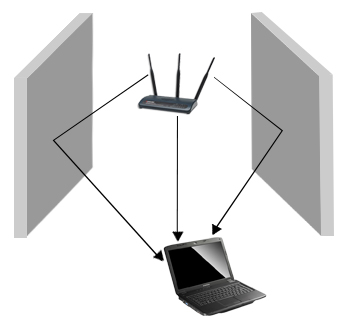

 Hình I.1 - Hệ thống MIMO NxM có N kênh phát và M kênh thu.

 Ngoài công nghệ MIMO, các thiết bị còn có thể được tích hợp thêm một
 số kỹ thuật khác để tăng tốc độ. Đầu tiên là kỹ thuật SGI (Short Guard
 Interval) cũng có thể góp phần cải thiện tốc độ bằng cách giảm kích
 thước của khoảng cách giữa các symbol (ký hiệu). Bên cạnh đó là một số
 kỹ thuật trên lớp vật lý với các cải tiến nhằm giảm overhead (gói tin
 mào đầu) - trực tiếp góp phần cải thiện tốc độ.

 Để giảm overhead, 802.11n dùng kỹ thuật tập hợp khung (frame
 aggregation - FA) - ghép hai hay nhiều khung (frame) thành một frame
 đơn để truyền đi. Chuẩn 802.11n sử dụng 2 kỹ thuật ghép frame : A-MSDU
 (Aggregation - MAC Service Data Units) hay viết gọn là MSDU - làm tăng
 kích thước khung dùng để phát các frame qua giao thức MAC (Media
 Access Control) và A-MPDU (Aggregation - MAC Protocol Data Unit) - làm
 tăng kích thước tối đa của các frame 802.11n được phát đi lên đến 64K
 byte (chuẩn trước chỉ có 2304byte).

 Một cách cải thiện thông lượng bổ sung khác là giảm kích thước frame
 ACK xuống còn 8byte (chuẩn cũ là 128byte). Ngoài ra, kỹ thuật SGI
 (Short Guard Interval) cũng có thể góp phần cải thiện 10% tốc độ bằng
 cách giảm khoảng cách giữa các symbol (ký hiệu) từ 4 nano giây xuống
 còn 3,6 nano giây. Cuối cùng là kỹ thuật GreenField Preamble được sử
 dụng để rút ngắn gói tin đầu tiên của frame (preamble) nhằm cải thiện
 hiệu năng và công suất tiêu thụ cho thiết bị.

1.2.6 – Một số chuẩn khác
-------------------------

 Ngoài các chuẩn phổ biến trên, IEEE còn lập các nhóm làm việc độc lập
 để bổ sung các quy định vào các chuẩn 802.11a, 802.11b, và 802.11g
 nhằm nâng cao tính hiệu quả, khả năng bảo mật và phù hợp với các thị
 trường châu Âu, Nhật của các chuẩn cũ như :

- IEEE 802.11c : Bổ sung việc truyền thông và trao đổi thông tin giữa
    LAN qua cầu nối lớp MAC với nhau.

- IEEE 802.11d : Chuẩn này được đặt ra nhằm giải quyết vấn đề là băng
    2,4 GHz không khả dụng ở một số quốc gia trên thế giới. Ngoài ra còn
    bổ sung các đặc tính hoạt động cho các vùng địa lý khác nhau.

- IEEE 802.11e : Nguyên gốc chuẩn 802.11 không cung cấp việc quản lý
    chất lượng dịch vụ. Phiên bản này cung cấp chức năng QoS. Theo kế
    hoạch, chuẩn này sẽ được ban hành vào cuối năm 2001 nhưng do không
    tích hợp trong thiết kế cấu trúc mà nó đã không được hoàn thành theo
    đúng thời gian dự kiến.

- IEEE 802.11f : Hỗ trợ tính di động, tương tự mạng di động tế bào.

- IEEE 802.11h : Hướng tới việc cải tiến công suất phát và lựa chọn
    kênh của chuẩn 802.11a, nhằm đáp ứng các tiêu chuẩn của thị trường
    châu Âu.

- IEEE 802.11i : Cải tiến vấn đề mã hoá và bảo mật. Cách tiếp cận là
    dựa trên chuẩn mã hoá dữ liệu DES (Data Encryption Standard).

- IEEE 802.11j : Sự hợp nhất trong việc đưa ra phiên bản tiêu chuẩn
    chung của 2 tổ chức IEEE và ETSI trên nền IEEE 802.11a và
    HIPERLAN 2.

- IEEE 802.11k : Cung cấp khả năng đo lường mạng và sóng vô tuyến
    thích hợp cho các lớp cao hơn.

- IEEE 802.11p : Hình thức kết nối mở rộng sử dụng trên các phương
    tiện giao thông (vd: sử dụng Wi-Fi trên xe buýt, xe cứu thương...).

- IEEE 802.11r : Mở rộng của IEEE 802.11d, cho phép nâng cấp khả năng
    chuyển vùng.

- IEEE 802.11T : Đây chính là tiêu chuẩn WMM như mô tả ở bảng trên.

- IEE 802.11u : Quy định cách thức tương tác với các thiết bị không
    tương thích 802 (như các mạng điện thoại di động).

- IEEE 802.11w : Là nâng cấp của các tiêu chuẩn bảo mật được mô tả ở
    IEEE 802.11i, hiện chỉ trong giải đoạn khởi đầu.

- ...

 Các chuẩn IEEE 802.11F và 802.11T được viết hoa chữ cái cuối cùng để
 phân biệt đây là hai chuẩn dựa trên các tài liệu độc lập, thay vì là
 sự mở rộng / nâng cấp của 802.11, và do đó chúng có thể được ứng dụng
 vào các môi trường khác 802.11 (chẳng hạn WiMAX – 802.16).

 Trong khi đó 802.11x sẽ không được dùng như một tiêu chuẩn độc lập mà
 sẽ bỏ trống để trỏ đến các chuẩn kết nối IEEE 802.11 bất kì. Nói cách
 khác, 802.11 có ý nghĩa là “mạng cục bộ không dây”, và 802.11x mang ý
 nghĩa “mạng cục bộ không dây theo hình thức kết nối nào đó (a/b/g/n)”.

 Chúng ta có thể dễ dàng tạo một mạng Wi-Fi với lẫn lộn các thiết bị
 theo chuẩn IEEE 802.11b với IEEE 802.11g. Tất nhiên là tốc độ và
 khoảng cách hiệu dụng sẽ là của IEEE 802.11b. Một trở ngại với các
 mạng IEEE 802.11b/g và có lẽ cả chuẩn 802.11n là việc sử dụng tần số
 2,4 GHz, vốn đã quá “chật chội” khi đó cũng là tần số hoạt động của
 máy bộ đàm, tai nghe và loa không dây, các lò viba.. cũng sử dụng tần
 số này, và công suất quá lớn của những thiết bị này có thể gây ra các
 vẫn đề về nhiễu loạn và giao thoa.

1.3 – Cấu trúc và một số mô hình mạng WLAN
------------------------------------------

1.3.1 - Cấu trúc cơ bản của mạng WLAN
-------------------------------------

Mạng sử dụng chuẩn 802.11 gồm có 4 thành phần chính :

- Hệ thống phân phối (Distribution System - DS)

- Điểm truy cập (Access Point)

- Tần liên lạc vô tuyến (Wireless Medium)

- Trạm (Stattions)

    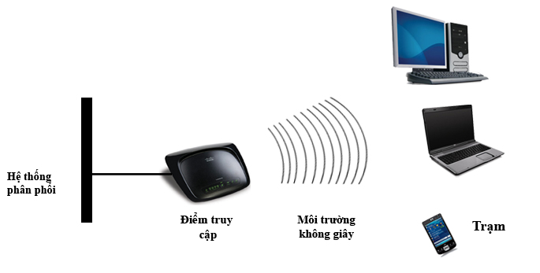

    Hình 1.2 – Cấu trúc cơ bản của một mạng WLAN.

1.3.2 – Thiết bị hạ tầng
------------------------

1.3.3 - Điểm truy cập: AP (Access Point)
----------------------------------------

 AP là một thiết bị song công (Full duplex) có mức độ thông minh tương
 đương với một chuyển mạch Ethernet phức tạp (Switch). Cung cấp cho các
 máy khách (client) một điểm truy cập vào mạng.

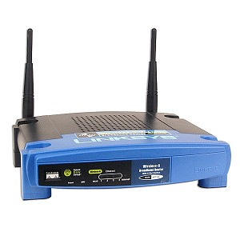

 Hình 1.3 – Access Point Linksys

 Các chế độ hoạt động của AP

 AP có thể giao tiếp với các máy không dây, với mạng có dây truyền
 thống và với các AP khác. Có 3 Mode hoạt động chính của AP:

- Chế độ gốc (Root mode): Root mode được sử dụng khi AP được kết
    nối với mạng backbone có dây thông qua giao diện có dây (thường
    là Ethernet) của nó. Hầu hết các AP sẽ hỗ trợ các mode khác ngoài
    root mode, tuy nhiên *root mode là cấu hình mặc định* của các
    AP. Khi một AP được kết nối với phân đoạn có dây thông qua cổng
    Ethernet của nó, nó sẽ được cấu hình để hoạt động trong root mode.
    Khi ở trong root mode, các AP được kết nối với cùng một hệ thống
    phân phối có dây có thể nói chuyện được với nhau thông qua phân đoạn
    có dây. Các client không dây có thể giao tiếp với các client không
    dây khác nằm trong những cell (ô tế bào, hay vùng phủ sóng của AP)
    khác nhau thông qua AP tương ứng mà chúng kết nối vào, sau đó các AP
    này sẽ giao tiếp với nhau thông qua phân đoạn có dây.

    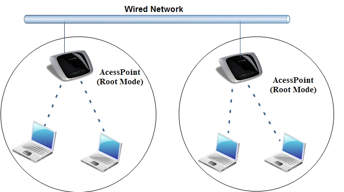

    Hình1.4 – Chế độ Root Mode

- Chế độ cầu nối (Bridge mode): Trong Bride mode, AP hoạt động
    hoàn toàn giống với một Bridge không dây. Chỉ một số ít các AP trên
    thị trường có hỗ trợ chức năng Bridge, điều này sẽ làm cho thiết bị
    có giá cao hơn đáng kể. Hình 1.5 mô tả AP hoạt động theo chế
    độ này. Client không kết nối với Bridge, nhưng thay vào đó, Bridge
    được sử dụng để kết nối 2 hoặc nhiều đoạn mạng có dây lại với nhau
    bằng kết nối không dây.

    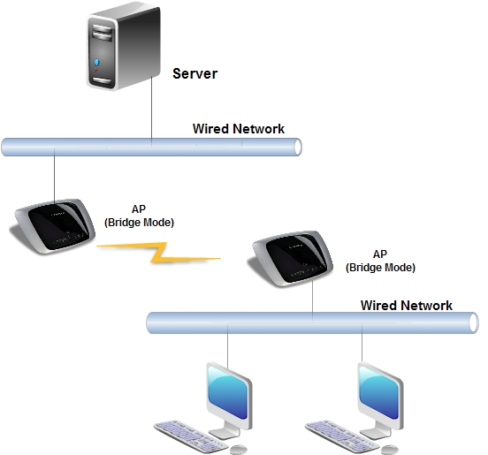

    Hình 1.5 – Chế độ Bridge Mode

- Chế độ lặp (Repeater mode): Trong Repeater mode, AP có khả năng
    cung cấp một đường kết nối không dây upstream vào mạng có dây thay
    vì một kết nối có dây bình thường. Như trong hình 1.6, một AP
    hoạt động như là một root mode và AP còn lại hoạt động như là một
    Repeater không dây. AP trong repeater mode kết nối với các client
    như là một AP và kết nối với upstream AP như là một client. Việc sử
    dụng AP trong Repeater mode là hoàn toàn không nên trừ khi cực kỳ
    cần thiết bởi vì các cell xung quanh mỗi AP trong trường hợp này
    phải chồng lên nhau ít nhất là 50%. Cấu hình này sẽ giảm trầm trọng
    phạm vi mà một client có thể kết nối đến repeater AP. Thêm vào đó,
    Repeater AP giao tiếp cả với client và với upstream AP thông qua kết
    nối không dây, điều này sẽ làm giảm thông lượng trên đoạn mạng
    không dây.

    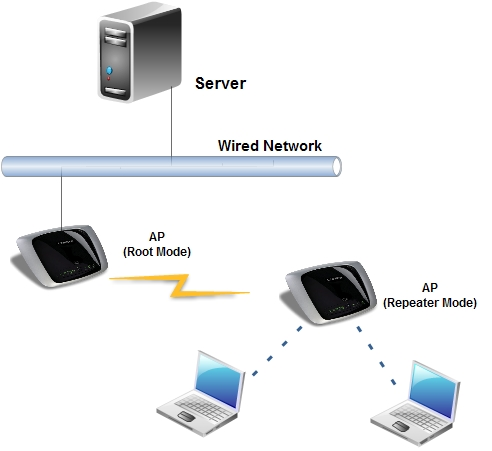

Hình 1.6 – Chế độ Repeater Mode

1.3.4 – Các thiết bị máy khách trong mạng WLAN
----------------------------------------------

a)  Card PCI Wireless :

    Là thành phần phổ biến nhất trong WLAN. Dùng để kết nối các máy
    khách vào hệ thống mạng không dây. Được cắm vào khe PCI trên
    máy tính. Loại này được sử dụng phổ biến cho các máy tính để
    bàn (desktop) kết nối vào mạng không dây.

 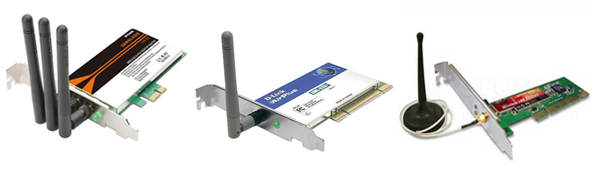

 Hình 1.7 – Card PCI Wireless

a)  Card PCMCIA Wireless :

    Trước đây được sử dụng trong các máy tính xách tay(laptop) và
    cácthiết bị hỗ trợ cá nhân số PDA(Personal Digital Associasion).
    Hiện nay nhờ sự phát triển của công nghệ nên PCMCIA wireless ít được
    sử dụng vì máy tính xách tay và PDA,…. đều được tích hợp sẵn Card
    Wireless bên trong thiết bị.

 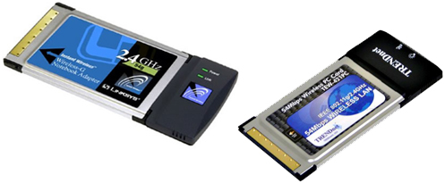

 Hình 1.8 - Card PCMCIA Wireless

a)  Card USB Wireless :

    Loại rất được ưu chuộng hiện nay dành cho các thiết bị kết nối vào
    mạng không dây vì tính năng di động và nhỏ gọn. Có chức năng tương
    tự như Card PCI Wireless, nhưng hỗ trợ chuẩn cắm là USB (Universal
    Serial Bus). Có thể tháo lắp nhanh chóng (không cần phải cắm cố định
    như Card PCI Wireless) và hỗ trợ cắm khi máy tính đang hoạt động.

    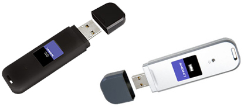

Hình 1.9 - Card USB Wireless

1.3.5 - Các mô hình mạng WLAN
-----------------------------

 Mạng WLAN gồm 3 mô hình cơ bản như sau :

- Mô hình mạng độc lập (IBSS) hay còn gọi là mạng Ad hoc.

- Mô hình mạng cơ sở (BSS).

- Mô hình mạng mở rộng (ESS).

1.3.6 - Mô hình mạng độc lập (IBSS - Independent Basic Service Set) hay còn gọi là mạng AD HOC
----------------------------------------------------------------------------------------------

 Các trạm (máy tính có hỗ trợ card mạng không dây) tập trung lại trong
 một không gian nhỏ để hình thành nên kết nối ngang cấp (peer-to-peer)
 giữa chúng. Các nút di động có card mạng wireless là chúng có thể trao
 đổi thông tin trực tiếp với nhau, không cần phải quản trị mạng. Vì các
 mạng ad-hoc này có thể thực hiện nhanh và dễ dàng nên chúng thường
 được thiết lập mà không cần một công cụ hay kỹ năng đặc biệt nào vì
 vậy nó rất thích hợp để sử dụng trong các hội nghị thương mại hoặc
 trong các nhóm làm việc tạm thời. Tuy nhiên chúng có thể có những
 nhược điểm về vùng phủ sóng bị giới hạn, mọi người sử dụng đều phải
 nghe được lẫn nhau.

 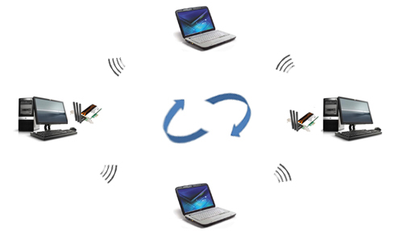

 Hình 1.10 – Mô hình mạng AD HOC

- Ưu điểm : Kết nối Peer-to-Peer không cần dùng Access Point, chi
    phí thấp, cấu hình và cài đặt đơn giản.

- Khuyết điểm : Khoảng cách giữa các máy trạm bị giới hạn, số
    lượng người dùng cũng bị giới hạn, không tích hợp được vào mạng có
    dây sẵn có.

1.3.7 - Mô hình mạng cơ sở (BSS - Basic service set)
----------------------------------------------------

 Trong mô mạng cở sở, các Client muốn liên lạc với nhau phải thông
 Access Point (AP). AP là điểm trung tâm quản lý mọi sự giao tiếp trong
 mạng, khi đó các Client không thể liên lạc trực tiếp với như trong
 mạng Independent BSS. Để giao tiếp với nhau các Client phải gửi các
 Frame dữ liệu đến AP, sau đó AP sẽ gửi đến máy nhận.

 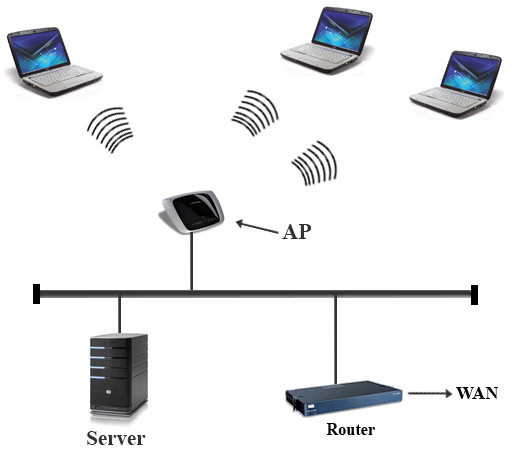

 Hình 1.11 – Mô hình mạng cơ sở

- Ưu điểm : Các máy trạm không kết nối trực tiếp được với nhau,
    các máy trạm trong mạng không dây có thể kết nối với hệ thống mạng
    có dây.

- Khuyết điểm : Giá thành cao, cài đặt và cấu hình phức tạp hơn mô
    hình Ad- Hoc.

1.3.8 - Mô hình mạng mở rộng (ESS - Extended Service Set)
---------------------------------------------------------

 Nhiều mô hình BSS kết hợp với nhau gọi là mô hình mạng ESS. Là mô hình
 sử dụng từ 2 AP trở lên để kết nối mạng. Khi đó các AP sẽ kết nối với
 nhau thành một mạng lớn hơn, phạm vi phủ sóng rộng hơn, thuận lợi và
 đáp ứng tốt cho các Client di động. Đảm bảo sự hoạt động của tất cả
 các Client.

 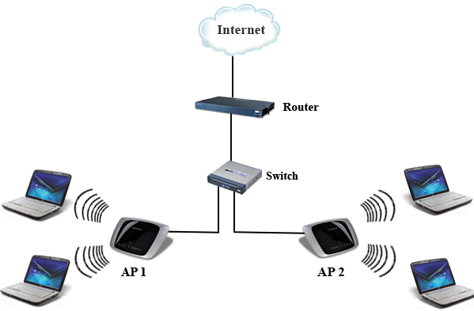

 Hình 1.12 – Mô hình mạng mở rộng

1.3.10 - Một số mô hình mạng WLAN khác
--------------------------------------

1)  Mô hình Roaming

    Đây là một tính năng trong mô hình mạng mở rộng. Các điểm truy cập
    (Access Point) có một phạm vi phủ sóng hữu hạn. Trong phạm vi lớn
    hơn như­ kho hàng, hoặc khu vực cơ quan cần thiết phải lặp đặt nhiều
    điểm truy cập hơn. Việc xác định vị trí điểm truy dựa trên ph­ương
    pháp khảo sát vị trí. Mục đích sẽ phủ lên vùng phủ sóng bằng các
    cell (vùng phủ sóng của Access Point) chồng lấp nhau để các máy trạm
    di chuyển khắp vùng mà không mất liên lạc mạng. Khả năng các máy
    trạm di chuyển không ghép nối giữa một cụm của các điểm truy cập
    đ­ược gọi Roaming. Các điểm truy cập chuyển khách hàng từ site này
    đến site khác một cách tự động mà máy trạm không hay biết, bảo đảm
    cho kết nối liên tục. Trong mô hình này các Access Point phải có
    cùng giá trị ESSID.

    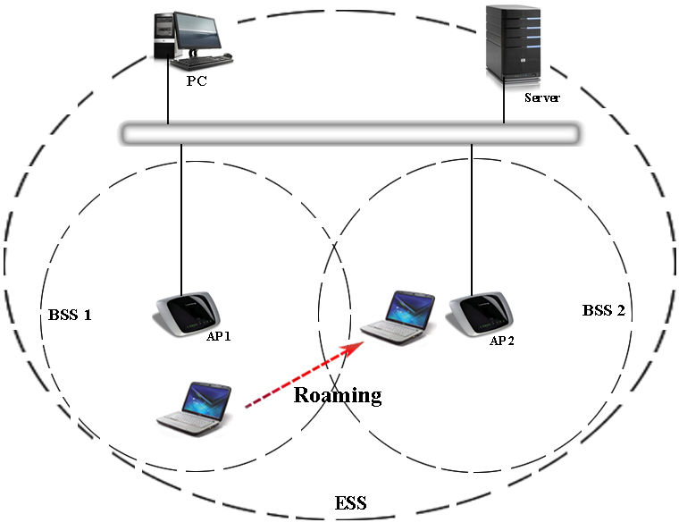

    Hình 1.13 – Mô hình Roaming

2)  Mô hình khuyếch đại tín hiệu (Repeater Access Point)

    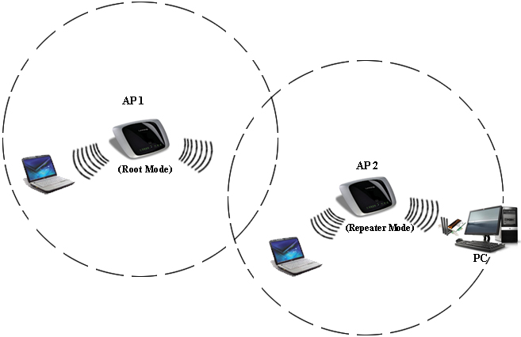

    Hình 1.14 – Mô hình khuyếch đại tín hiệu

3)  Mô hình Point to Point

    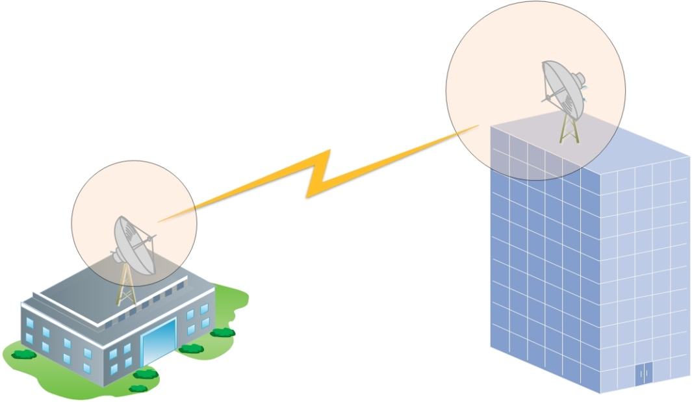

    Hình 1.15 – Mô hình Point to Point

4)  Mô hình Point to Multipoint

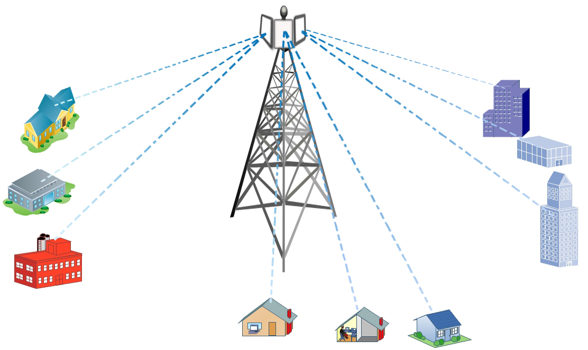

Hình 1.16 – Mô hình Point to Multipoint

1.4 – Đánh giá ưu điểm, nhược điểm và thực trạng mạng WLAN hiện nay
-------------------------------------------------------------------

1.4.1 - Ưu điểm
---------------

 Độ tin tưởng cao trong nối mạng của các doanh nghiệp và sự tăng trưởng
 mạnh mẽ của mạng Internet và các dịch vụ trực tuyến là bằng chứng mạnh
 mẽ đối với lợi ích của dữ liệu và tài nguyên dùng chung. Với mạng
 WLAN, người dùng truy cập thông tin dùng chung mà không tìm kiếm chỗ
 để cắm vào, và các nhà quản lý mạng thiết lập hoặc bổ sung mạng mà
 không lắp đặt hoặc di chuyển dây nối. Mạng WLAN cung cấp các hiệu suất
 sau : khả năng phục vụ, tiện nghi, và các lợi thế về chi phí hơn hẳn
 các mạng nối dây truyền thống.

- *Khả năng lưu động cải thiện hiệu suất và dịch vụ* : Các hệ
     thống mạng WLAN cung cấp sự truy cập thông tin thời gian thực tại
     bất cứ đâu cho người dùng mạng trong khu vực được triển khai. Khả
     năng lưu động này hỗ trợ các cơ hội về hiệu suất và dịch vụ mà
     mạng nối dây không thể thực hiện được. Với sự gia tăng về số người
     sử dụng máy tính xách tay hiện nay thì đây là một điều rất
     thuận lợi.

- *Đơn giản và trong cài đặt đơn giản* : Cài đặt hệ thống mạng
     WLAN nhanh và dễ dàng, loại trừ nhu cầu kéo dây qua các tường và
     các trần nhà.

- *Linh hoạt trong cài đặt* : Công nghệ không dây cho phép mạng đi
     đến các nơi mà mạng nối dây không thể.

- *Giảm bớt giá thành sở hữu* : Trong khi đầu tư ban đầu của phần
     cứng cần cho mạng WLAN có giá thành cao hơn các chi phí phần cứng
     mạng LAN hữu tuyến, nhưng chi phí cài đặt toàn bộ và giá thành
     tính theo tuổi thọ thấp hơn đáng kể. Các lợi ích về giá thành tính
     theo tuổi thọ là đáng kể trong môi trường năng động yêu cầu thường
     xuyên di chuyển, bổ sung, và thay đổi.

- *Tính linh hoạt* : Các hệ thống mạng WLAN được định hình theo
     các kiểu topo khác nhau để đáp ứng các nhu cầu của các ứng dụng và
     các cài đặt cụ thể. Cấu hình mạng dễ thay đổi từ các mạng độc lập
     phù hợp với số nhỏ người dùng đến các mạng cơ sở hạ tầng với hàng
     nghìn người sử dụng trong một vùng rộng lớn.

- Khả năng mở rộng : Mạng không dây có thể đáp ứng tức thì khi gia
     tăng số lượng người dùng. Với hệ thống mạng dùng cáp cần phải gắn
     thêm cáp.

1.4.2 - Nhược điểm
------------------

 Công nghệ mạng LAN không dây, ngoài rất nhiều sự tiện lợi và những ưu
 điểm được đề cập ở trên thì cũng có các nhược điểm. Trong một số
 trường hợp mạng LAN không dây có thể không như mong muốn vì một số lý
 do. Hầu hết chúng phải làm việc với những giới hạn vốn có của công
 nghệ.

- Bảo mật : Môi trường kết nối không dây là không khí nên khả năng
     bị tấn công của người dùng là rất cao.

- Phạm vi : Với chuẩn mạng 802.11n mới nhất hiện nay, phạm vi của
     mạng WLAN đã có sự thay đổi lớn. Tuy nhiên nó vẫn chưa thể đáp ứng
     được nhu cầu của người dùng. Để mở rộng phạm vi cần phải mua thêm
     Repeater hay Access Point, dẫn đến chi phí gia tăng. Với mô hình
     mạng lớn vẫn phải kết hợp với mạng có dây.

- Độ tin cậy: Vì sử dụng sóng vô tuyến để truyền thông nên việc bị
     nhiễu, tín hiệu bị giảm do tác động của các thiết bị khác (lò vi
     sóng, tín hiệu radio…) là không tránh khỏi. Làm giảm đáng kể hiệu
     quả hoạt động của mạng.

- Tốc độ : Tốc độ của mạng không dây vẫn còn rất chậm so với mạng
     sử dụng cáp (100 Mbps đến hàng Gbps).

1.4.3 – Thực trạng mạng WLAN hiện nay
-------------------------------------

Cùng với sự phát triển mạnh mẽ của Internet và các thiết bị mạng, sự
phát triển của nền kinh tế thị trường, nhu cầu trao đổi thông tin và dữ
liệu của con người là rất lớn. Ở Việt Nam, mạng WLAN trở nên rất phổ
biến và gần gũi với người dùng. Chúng ta có thể dễ dàng kết nối mạng
không dây tại nhiều địa điểm như : trường học, văn phòng,… hoặc ngay tại
gia đình bằng nhiều thiết bị hiện đại như : laptop, PDA...Tuy nhiên, vẫn
còn một số tồn tại như :

- Không thay đổi mật khẩu của nhà sản xuất : Điều này rất dễ dàng cho
    người nào đó truy cập vào Router và thay đổi các thiết lập để thoải
    mái truy cập vào mạng.

- Không kích hoạt các tính năng mã hóa : Nếu tính năng này không được
    kích hoạt, người khác hoàn toàn có thể dùng một số phần mềm dò mật
    khẩu để lấy những thông tin nhạy cảm phục vụ cho những ý đồ riêng.

- Không kiểm tra thường xuyên chế độ bảo mật : Nhiều người vẫn cho
    rằng mạng của mình hoàn toàn bảo mật với một chế độ bảo mật nào đó.

- Kích hoạt phương pháp bảo mật cấp thấp hoặc không kích hoạt : Một số
    người dùng hiện nay không hề kích hoạt bất kỳ chế độ bảo mật nào.
    Hoặc nếu có kích hoạt thì kích hoạt các chế độ bảo mật cấp thấp
    như WEP. Điều này hoàn toàn không nên. Người ngoài mạng có thể bẻ
    khóa và truy cập vào mạng.

CHƯƠNG II – CÁC PHƯƠNG PHÁP BẢO MẬT TRONG MẠNG WLAN
===================================================

2.1 – Giới thiệu
----------------

 Trong hệ thống mạng, vấn đề an toàn và bảo mật một hệ thống thông tin
 đóng một vai trò hết sức quan trọng. Thông tin chỉ có giá trị khi nó
 giữ được tính chính xác, thông tin chỉ có tính bảo mật khi chỉ có
 những người được phép nắm giữ thông tin biết được nó. Khi ta chưa có
 thông tin, hoặc việc sử dụng hệ thống thông tin chưa phải là phương
 tiện duy nhất trong quản lý, điều hành thì vấn đề an toàn, bảo mật đôi
 khi bị xem thường. Nhưng một khi nhìn nhận tới mức độ quan trọng của
 tính bền hệ thống và giá trị đích thực của thông tin đang có thì chúng
 ta sẽ có mức độ đánh giá về an toàn và bảo mật hệ thống thông tin. Để
 đảm bảo được tính an toàn và bảo mật cho một hệ thống cần phải có sự
 phối hợp giữa các yếu tố phần cứng, phần mềm và con người.

 Chương này sẽ cung cấp tổng quan về các phương pháp bảo mật được sử
 dụng trong mạng WLAN với các khái niệm cơ bản, phương pháp hoạt động
 cũng như đặc tính kỹ thuật của từng phương pháp ấy. Đồng thời sẽ nêu
 ra ưu điểm và nhược điểm của từng phương pháp.

2.1.1 – Tại sao phải bảo mật
----------------------------

 Mạng WLAN vốn là một mạng không an toàn, tuy nhiên ngay cả với mạng
 Wired LAN hay WAN nếu không có phương pháp bảo mật hữu hiệu đều không
 an toàn. Để kết nối tới một mạng LAN hữu tuyến người dùng cần phải
 truy cập theo đường truyền bằng dây cáp, phải kết nối một PC vào một
 cổng mạng. Các mạng không dây sử dụng sóng vô tuyến xuyên qua vật liệu
 của các tòa nhà, như vậy, sự bao phủ của sóng vô tuyến không phải chỉ
 trong phạm vi của tòa nhà ấy. Do đó, mạng không dây của một công ty
 cũng có thể bị truy cập từ bên ngoài tòa nhà công ty của họ nhờ các
 thiết bị thích hợp.

 Với giá thành xây dựng một hệ thống mạng WLAN giảm, ngày càng có nhiều
 tổ chức, công ty và các cá nhân sử dụng. Điều này sẽ không thể tránh
 khỏi việc hacker chuyển sang tấn công và khai thác các điểm yếu trên
 nền tảng mạng sử dụng chuẩn 802.11. Những công cụ Sniffers cho phép
 bắt được các gói tin giao tiếp trên mạng, họ có thể phân tích và lấy
 đi những thông tin quan trọng của chúng ta. Ngoài ra, hacker có thể
 lấy đi những dữ liệu mật của công ty; xen vào phiên giao dịch giữa tổ
 chức và khách hàng lấy những thông tin nhạy cảm; hoặc phá hoại hệ
 thống. Những tổn thất to lớn tới tổ chức, công ty không thể lường
 trước được. Vì thế, xây dựng mô hình, chính sách bảo mật là cần thiết.

2.1.2 - Đánh giá vấn đề an toàn, bảo mật hệ thống
-------------------------------------------------

 Để đảm bảo an ninh cho mạng, cần phải xây dựng một số tiêu chuẩn đánh
 giá mức độ an ninh an toàn mạng. Một số tiêu chuẩn đã được thừa nhận
 là thước đo mức độ an ninh mạng.

 Đánh giá trên phương diện vật lý, thiết bị phải đáp ứng được những nhu
 cầu sau :

- Có thiết bị dự phòng nóng cho các tình huống hỏng đột ngột. Có khả
    năng thay thế nóng từng phần hoặc toàn phần (hot-plug, hot-swap).

- Khả năng cập nhật, nâng cấp, bổ xung phần cứng và phần mềm.

- Yêu cầu nguồn điện, có dự phòng trong tình huống mất đột ngột.

- Các yêu cầu phù hợp với môi trường xung quanh : độ ẩm, nhiệt độ,
    chống sét, phòng chống cháy nổ, vv...

 Về dữ liệu :

- Có các biện pháp sao lưu dữ liệu một cách định kỳ và không định kỳ
    trong các tình huống phát sinh.

- Có biện pháp lưu trữ dữ liệu tập trung và phân tán nhằm chia bớt rủi
    ro trong các trường hợp đặc biệt như cháy nổ, thiên tai, chiến
    tranh, vv..

 Trên phương diện logic, hệ thống bảo mật phải đảm bảo các yêu cầu sau
 :

- Tính bí mật (Confidentiality)

    Là giới hạn các đối tượng được quyền truy xuất đến thông tin. Đối
    tượng truy xuất thông tin có thể là con người, máy tính và phần mềm.
    Tùy theo tính chất của thông tin mà mức độ bí mật của chúng có thể
    khác nhau.

- Tính xác thực (Authentication)

    Liên quan tới việc đảm bảo rằng một cuộc trao đổi thông tin là đáng
    tin cậy. Trong trường hợp một bản tin đơn lẻ, ví dụ như một tín hiệu
    báo động hay cảnh báo, chức năng của dịch vụ ủy quyền là đảm bảo bên
    nhận rằng bản tin là từ nguồn mà nó xác nhận là đúng.

    Trong trường hợp một tương tác đang xảy ra, ví dụ kết nối của một
    đầu cuối đến máy chủ, có hai vấn đề sau : thứ nhất tại thời điểm
    khởi tạo kết nối, dịch vụ đảm bảo rằng hai thực thể là đáng tin. Mỗi
    chúng là một thực thể được xác nhận. Thứ hai, dịch vụ cần phải đảm
    bảo rằng kết nối là không bị gây nhiễu do một thực thể thứ ba có thể
    giả mạo là một trong hai thực thể hợp pháp để truyền tin hoặc nhận
    tin không được cho phép.

- Tính toàn vẹn (Integrity)

    Tính toàn vẹn đảm bảo sự tồn tại nguyên vẹn của thông tin, loại trừ
    mọi sự thay đổi thông tin có chủ đích hoặc do hư hỏng, mất mát thông
    tin vì sự cố thiết bị hoặc phần mềm.

- Tính không thể phủ nhận (Non repudiation)

    Tính không thể phủ nhận bảo đảm rằng người gửi và người nhận không
    thể chối bỏ 1 bản tin đã được truyền. Vì vậy, khi một bản tin được
    gửi đi, bên nhận có thể chứng minh được rằng bản tin đó thật sự được
    gửi từ người gửi hợp pháp. Hoàn toàn tương tự, khi một bản tin được
    nhận, bên gửi có thể chứng minh được bản tin đó đúng thật được nhận
    bởi người nhận hợp lệ.

- Tính khả dụng (Availability)

 Một hệ thống đảm bảo tính sẵn sàng có nghĩa là có thể truy nhập dữ
 liệu bất cứ lúc nào mong muốn trong vòng một khoảng thời gian cho
 phép. Các cuộc tấn công khác nhau có thể tạo ra sự mất mát hoặc thiếu
 về sự sẵn sàng của dịch vụ. Tính khả dụng của dịch vụ thể hiện khả
 năng ngăn chặn và khôi phục những tổn thất của hệ thống do các cuộc
 tấn công gây ra.

- Khả năng điều khiển truy nhập (Access Control)

 Trong hoàn cảnh của an ninh mạng, điều khiển truy cập là khả năng hạn
 chế các truy nhập với máy chủ thông qua đường truyền thông. Để đạt
 được việc điều khiển này, mỗi một thực thể cố gắng đạt được quyền truy
 nhập cần phải được nhận diện, hoặc được xác nhận sao cho quyền truy
 nhập có thể được đáp ứng nhu cầu đối với từng người.

2.2 - Xác thực qua hệ thống mở (Open Authentication)
----------------------------------------------------

 Chứng thực hệ thống mở là một hình thức rất cơ bản của chứng thực, nó
 gồm một yêu cầu chứng thực đơn giản chứa ID trạm và một đáp lại chứng
 thực gồm thành công hoặc thất bại. Khi thành công, cả hai trạm được
 xem như được xác nhận với nhau.

 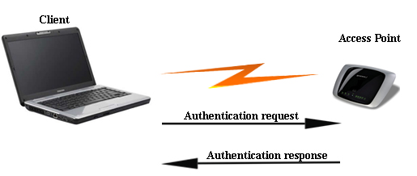

 Hình 2.1 – Chứng thực hệ thống mở

2.3 - Xác thực qua khoá chia sẻ (Shared-key Authentication) 
------------------------------------------------------------

 Là kiểu xác thực cho phép kiểm tra xem một khách hàng không dây đang
 được xác thực có biết về bí mật chung không. Điều này tương tự với
 khoá xác thực dùng chung trong “bảo mật IP” (IPSec). Chuẩn 802.11 hiện
 nay giả thiết rằng “khoá chung” được phân phối đến các tất cả các
 khách hàng đầu cuối thông qua một kênh bảo mật riêng, độc lập với tất
 cả các kênh khác của IEEE 802.11. Tuy nhiên, hình thức xác thực qua
 “khoá chung” nói chung là không an toàn và không được khuyến nghị sử
 dụng.

 Chứng thực khóa chia sẻ được xác nhận trên cơ sở cả hai trạm tham gia
 trong quá trình chứng thực có cùng khóa “chia sẻ”. Ta giả thiết rằng
 khóa này đã được truyền tới cả hai trạm suốt kênh bảo mật nào đó trong
 môi trường không giây. Trong các thi hành tiêu biểu, chứng thực này
 được thiết lập thủ công trên trạm khách hàng và AP. Các khung thứ nhất
 và thứ tư của chứng thực khóa chia sẻ tương tự như các khung có trong
 chứng thực hệ thống mở. Còn các khung thứ hai và khung thứ ba khác
 nhau, trạm xác nhận nhận một gói văn bản yêu cầu (được tạo ra khi sử
 dụng bộ tạo số giả ngẫu nhiên giải thuật WEP (PRNG)) từ AP, mật mã hóa
 nó sử dụng khóa chia sẻ, và gửi nó trở lại cho AP. Sau khi giải mã,
 nếu văn bản yêu cầu phù hợp, thì chứng thực một chiều thành công. Để
 chứng thực hai phía, quá trình trên được lặp lại ở phía đối diện. Cơ
 sở này làm cho hầu hết các tấn công vào mạng WLAN chuẩn IEEE 802.11b
 chỉ cần dựa vào việc bắt dạng mật mã hóa của một đáp ứng biết trước,
 nên dạng chứng thực này là một lựa chọn kém hiệu quả. Nó cho phép các
 hacker lấy thông tin để đánh đổ mật mã hóa WEP và đó cũng là lý do tại
 sao chứng thực khóa chia sẻ không bao giờ khuyến nghị.

 Sử dụng chứng thực mở là một phương pháp bảo vệ dữ liệu tốt hơn, vì nó
 cho phép chứng thực mà không có khóa WEP đúng. Bảo mật giới hạn vẫn
 được duy trì vì trạm sẽ không thể phát hoặc nhận dữ liệu chính xác với
 một khóa WEP sai.

 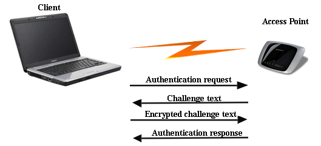

 Hình 2.2 – Chứng thực khóa chia sẻ

2.4 - Wired Equivalent Privacy (WEP)
------------------------------------

 WEP là một thuật toán đơn giản, sử dụng bộ phát chuỗi mã ngẫu nhiên
 PRNG (*Pseudo Random Number Generator*) và dòng mã RC4. Trong vài năm,
 thuật toán này được bảo mật và không sẵn có, tháng 9 năm 1994, một vài
 người đã đưa mã nguồn của nó lên mạng. Mặc dù bây giờ mã nguồn có sẵn,
 nhưng RC4 vẫn được đăng ký bởi RSADSI. Chuỗi mã RC4 mã hóa và giải mã
 rất nhanh, nó rất dễ thực hiện, và đủ đơn giản để các nhà phát triển
 phần mềm có thể dùng nó để mã hóa các phần mềm của mình.

 WEP sử dụng một khoá mã hoá không thay đổi có độ dài 64 bit hoặc 128
 bit, (nhưng trừ đi 24 bit sử dụng cho vector khởi tạo khoá mã hoá, nên
 độ dài khoá chỉ còn 40 bit hoặc 104 bit) được sử dụng để xác thực các
 thiết bị được phép truy cập vào trong mạng và cũng được sử dụng để mã
 hoá truyền dữ liệu.

 Rất đơn giản, các khoá mã hoá này dễ dàng bị "bẻ gãy" bởi thuật toán
 brute-force và kiểu tấn công thử lỗi (trial-and-error). Các phần mềm
 miễn phí như Airsnort hoặc WEPCrack sẽ cho phép hacker có thể phá vỡ
 khoá mã hoá nếu họ thu thập đủ từ 5 đến 10 triệu gói tin trên một mạng
 không dây. Với những khoá mã hoá 128 bit cũng không khá hơn: 24 bit
 cho khởi tạo mã hoá nên chỉ có 104 bit được sử dụng để mã hoá, và cách
 thức cũng giống như mã hoá có độ dài 64 bit nên mã hoá 128 bit cũng dễ
 dàng bị bẻ khoá. Ngoài ra, những điểm yếu trong những vector khởi tạo
 khoá mã hoá giúp cho hacker có thể tìm ra mật khẩu nhanh hơn với ít
 gói thông tin hơn rất nhiều.

 Để hiểu rõ hơn hoạt động của WEP, chúng ta bắt đầu xem xét stream
 ciphers (dòng mã hóa), nhận xét hoạt động của nó, đồng thời so sánh
 với các block-ciphers (khối mã hóa).

a)  Stream ciphers và Block-ciphers

    Stream ciphers mã hóa dữ liệu được sinh ra bằng một key stream từ
    khóa kết hợp với phép toán XOR dựa vào key-stream và dữ diệu
    dạng thô. Key stream có độ dài bất kỳ làm sao cho thích hợp với
    frame ở dạng plain-text để mã hóa. Dữ liệu cần truyền đi sẽ được mã
    hóa bằng thuật toán XOR với Key-stream để ra chuỗi đã được mã hóa.

    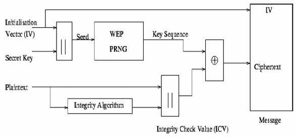

    Hình 2.3 - Sơ đồ quá trình mã hóa WEP

    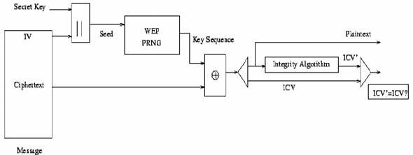

    Hình 2.4 – Sơ đồ quá trình giải mã WEP

    Block ciphers giao thiệp với dữ liệu trong các khối xác định, có thể
    là các frame ở mọi kích thước. Block ciphers sẽ chia frame đó ra
    thành nhiều frame nhỏ hơn với kích thước được xác định trước và sau
    đó thực thi phép XOR ở mỗi block. Mỗi block cần được xác định kích
    thước trước, và phần còn dư sẽ được đưa vào block có kích thước
    phù hợp. Chẳng hạn như một block-cipher lớn được chia thành các
    block nhỏ có kích thước là 16 byte, và một frame 38 bytes được
    mã hóa.

         Điểm yếu của thuật toán này là : các kết quả được mã hóa sẽ
    giống nhau với cùng 1 dữ liệu vào. Do đó, kẻ tấn công có thể thu
    thập tất cả các gói tin và xây dựng một từ điển mã hóa. Vì thế, cách
    mã hóa này cũng không an toàn.

    Để vượt qua vấn đề này, các nhà nghiên cứu đề xuất 2 cách sau:

- Initialization Vectors

- Feedback modes

a)  Initialization Vectors

    Initialization Vectors (IV) được dùng để đổi key-stream. IV là một
    giá trị số được dựa theo khóa cơ sở trước khi key stream được
    thực thi. Mỗi khi IV thay đổi thì key-stream sẽ thay đổi theo.

         Gốc của IV là 24 bit, sau này tăng lên đến 40, 64, 104, 128 bit
    WEP key. Cách IV gửi header ở dạng nguyên mẫu, vì thế trạm thu biết
    được giá trị IV và giải mã frame. Mặc dù số bit mã hóa có thể tăng
    lên nhưng nó vẫn không an toàn.

b)  Feedback Modes

 Chế độ feedback điều chỉnh lại tiến trình mã hóa để ngăn chặn việc hai
 dữ liệu giống nhau có kết quả mã hóa như nhau. Feedback mode thường
 được dùng với block ciphers, nó sẽ sinh ra một chuỗi dài block
 ciphers.

2.5 - Advantage Encryption Standard (AES)
-----------------------------------------

 AES đã đạt được một sự chấp nhận như là một sự thay thế xứng đáng cho
 thuật toán RC4 được sử dụng trong WEP. AES sử dụng thuật toán Rijndale
 có chiều dài key lần lượt là 128 bit, 192 bit và 256 bit.

 AES được xem như là không thể crack được bởi hầu hết các chuyên gia
 mật mã và National Institute of Standard and Technology (NIST) đã chọn
 sử dụng AES cho chuẩn xử lý thông tin Liên Bang (FIPS = Federal
 Information Processing Standard). Như là một phần của nỗ lực cải tiến
 chuẩn 802.11, ban làm việc 802.11i đã xem xét sử dụng AES trong phiên
 bản WEPv2.

 AES được thông qua bởi nhóm làm việc 802.11i để sử dụng trong WEPv2
 được cài đặt trong firmware và software bởi các nhà sản xuất. AP
 firmware và client firmware sẽ phải nâng cấp lên để có thể hỗ trợ AES.
 Các phần mềm trên client (driver và ứng dụng) sẽ hỗ trợ cấu hình AES
 với key bí mật.

2.6 – Filtering
---------------

 Filtering (lọc) là một cơ chế bảo mật cơ bản có thể được sử dụng cùng
 với WEP và AES. Filtering có nghĩa là giữ lại những cái không mong
 muốn và cho phép những cái mong muốn. Filtering hoạt động tương tự như
 Access List trên Router : bằng cách định nghĩa các tham số mà client
 phải tuân theo để có thể truy cập vào mạng. Có 3 kiểu filtering cơ bản
 có thể được sử dụng trong WLAN :

- SSID filtering

- MAC address filtering

- Protocol filtering

a)  SSID Filtering

 SSID filtering là một phương thức cơ bản của filtering, và chỉ nên
 được sử dụng cho việc điều khiển truy cập cơ bản. SSID (Service Set
 Identifier) chỉ là một thuật ngữ khác để gọi tên mạng. SSID của client
 phải khớp với SSID trên AP (trong mạng infrastructure) hay các client
 khác (trong mạng Ad-hoc) để có thể xác thực và kết nối với Service
 Set. Bởi vì SSID được quảng bá mà không được mã hóa trong các Beacon
 nên rất dễ phát hiện giá trị SSID bằng cách sử dụng sniffer. Nhiều AP
 có khả năng không phát SSID trong các Beacon. Trong trường hợp này,
 client phải có cùng giá trị SSID để có thể kết nối với AP. Khi một hệ
 thống được cấu hình theo cách này, nó được gọi là một hệ thống đóng.
 SSID filtering không được xem như là một phương thức tin cậy để ngăn
 chặn các người dùng không được quyền truy cập vào mạng. Một số sai lầm
 mà người sử dụng WLAN mắc phải trong việc quản lý SSID gồm :

- Sử dụng giá trị SSID mặc định: Thiết lập này tạo điều kiện thuận
    lợi cho hacker dò tìm địa chỉ MAC của AP. Rất đơn giản cho một
    hacker khi sử dụng sniffer để biết được địa chỉ MAC address của AP,
    sau đó nhìn vào phần OUI (3 bytes đầu) của MAC address để biết được
    nhà sản xuất (bằng cách tra bảng OUI được cung cấp hởi IEEE). Bảng
    OUI liệt kê các giá trị OUI khác nhau được gán cho các nhà sản xuất.
    Chúng ta có thể sử dụng NetStumbler để thực hiện các thao tác này
    một cách tự động. Mỗi nhà sản xuất thiết bị đều sử dụng giá trị SSID
    mặc định của riêng họ, việc có được giá trị này là hoàn toàn dễ
    dàng, chúng đều nằm trên website của nhà sản xuất. Vì thế, thay đổi
    giá trị mặc định của SSID là điều cần thiết.

- Sử dụng SSID có liên quan đến công ty : Điều này gây ra một nguy
    cơ bảo mật bởi vì hacker có thể dễ dàng tìm được vị trí vật lý của
    công ty. Khi tìm kiếm mạng WLAN trong bất kỳ vùng địa lý nào thì
    việc tìm được địa chỉ vật lý của WLAN chỉ mới là ½ của vấn đề. Thậm
    chí sau khi phát hiện được WLAN sử dụng các công cụ như NetStumbler
    thì việc tìm được nguồn gốc của tín hiệu sẽ tốn nhiều thời gian và
    công sức. Khi một admin sử dụng SSID là tên của công ty hay tổ chức
    thì việc tìm được WLAN là rất dễ dàng. Vì thế, luôn luôn sử dụng
    SSID không liên quan đến công ty.

- Sử dụng SSID như là một phương thức bảo mật mạng không dây :
    Điều này có thể gây ra một sự nản lòng bởi vì người sử dụng phải
    thay đổi giá trị SSID trong cấu hình của họ để có thể gia nhập
    vào mạng. SSID chỉ nên được sử dụng như là một phương thức để phân
    đoạn mạng chứ không phải là bảo mật mạng.

- Quảng bá SSID một cách không cần thiết : Chúng ta nên tắt chế độ
    quảng bá SSID của AP. Cấu hình này sẽ giúp cản trở những cuộc nghe
    lén một cách tình cờ.

a)  MAC Address Filtering

    WLAN có thể filter dựa trên MAC address của client. Hầu hết tất cả
    các AP đều có chức năng MAC filtering. Người quản trị mạng có thể
    xây dựng, phân phát và duy trì một danh sách các địa chỉ MAC được
    cho phép. Nếu client có địa chỉ MAC không nằm trong danh sách MAC
    filter của AP cố gắng kết nối vào mạng thì chức năng MAC filter sẽ
    ngăn chặn không cho phép client đó kết nối vào mạng.

    Có thể thấy rằng, đưa tất cả các MAC address của client vào bảng MAC
    filter của tất cả các AP trong một doanh nghiệp lớn là không
    khả thi. MAC address filter có thể được cài đặt trên một RADIUS
    server thay vì trên AP. Cấu hình này làm cho MAC filter là một giải
    pháp bảo mật có tính mở rộng cao. Đơn giản chỉ nhập địa chỉ MAC
    address vào RADIUS cùng với thông tin định danh người dùng. RADIUS
    server thường chỉ đến một nguồn chứng thực khác, vì thế một nguồn
    chứng thực là cần thiết để có thể hỗ trợ MAC filter.

    Mặc dù MAC filter dường như là một phương thức tốt để bảo mật mạng
    WLAN trong một số trường hợp. Tuy nhiên, nó vẫn dễ bị tấn công trong
    các trường hợp sau :

- Đánh cắp Card WLAN có trong danh sách cho phép của AP

- Lắng nghe traffic trong mạng WLAN, sau đó giả mạo địa chỉ MAC
    address sau giờ làm việc.

    MAC filtering rất thích hợp cho gia đình và văn phòng nhỏ nơi có
    ít client. Sử dụng WEP và MAC filtering cung cấp một giải pháp bảo
    mật vừa đủ trong các môi trường như vậy. Giải pháp này vừa đủ là bởi
    vì không một hacker thông minh nào lại mất thời gian để đột nhập vào
    mạng gia đình hay văn phòng nhỏ, để rồi chẳng thu được thông tin quý
    giá gì.

a)  Protocol Filtering

    WLAN có thể lọc các gói tin truyền trên mạng dựa trên các giao thức
    lớp 2 đến lớp 7. Trong nhiều trường hợp, các nhà sản xuất làm cho
    protocol filter có thể được cấu hình một cách độc lập cho cả đoạn
    mạng có dây và đoạn mạng không dây trên AP.

 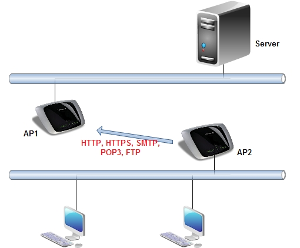

 Hình 2.5 – Lọc giao thức

 Lấy một ví dụ, ta có 2 AP kết nối 2 mạng LAN của tòa nhà lại với nhau.
 Vì băng thông dành cho các user ở tòa nhà thứ hai khá nhỏ nên một số
 phương thức điều khiển phải được sử. Nếu đường kết nối này được cài
 đặt với mục đích nhanh chóng truy cập internet cho người dùng thì
 chúng ta chỉ nên cho phép các giao thức như SMTP, POP3, HTTP, HTTPS,
 FTP và các giao thức tin nhắn nhanh khác. Khả năng lọc giao thức như
 vậy là rất hữu ích trong việc quản lý sử dụng môi trường dùng chung.

2.7 - WLAN VPN
--------------

 Nhiều nhà sản xuất WLAN đã tích hợp phần mềm VPN server vào trong AP
 và gateway cho phép sử dụng công nghệ VPN để bảo mật kết nối không
 dây. Lúc đó, client phải sử dụng phần mềm VPN client chạy các giao
 thức như PPTP hay IPSec để thiết lập tunnel trực tiếp đến AP.

 Trước tiên, client phải kết nối với AP. Sau đó, một kết nối VPN
 dial-up sẽ phải được tạo ra để cho client truyền traffic qua AP. Tất
 cả traffic truyền qua tunnel có thể được mã hóa và đưa vào tunnel để
 tăng thêm một lớp bảo mật nữa. Giải pháp này có ưu điểm là giá cả hợp
 lý và cài đặt khá đơn giản.

 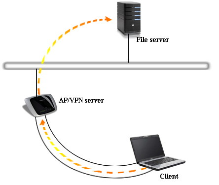

 Hình 2.6 – Mô hình WLAN VPN

2.8 - Temporal Key Integrity Protocol (TKIP)
--------------------------------------------

 TKIP là một sự nâng cấp cho WEP nhằm vá những vấn đề bảo mật đã biết
 trong cài đặt RC4 stream cipher trong WEP. TKIP cung cấp khả năng
 hashing (băm) IV để chống lại việc giả mạo gói tin, nó cũng cung cấp
 phương thức để kiểm tra tính toàn vẹn của thông điệp MIC (Message
 Integrity Check) giúp xác định xem liệu hacker đã thay đổi nội dung
 gói tin (bằng cách chèn vào traffic giúp crack key) hay chưa. TKIP sử
 dụng key động để chống lại việc crack key - là một lỗ hổng phổ biến
 trong chuẩn WEP hiện tại.

 TKIP có thể được cài đặt thông qua nâng cấp firmware cho AP hay Bridge
 cũng như nâng cấp software và firmware cho client. TKIP xác định các
 nguyên tắc cho IV, phương thức khởi tạo lại key dựa trên 802.1X, trộn
 key theo per-packet, hay kiểm tra toàn vẹn MIC. Những điều này sẽ gây
 ảnh hưởng đến hiệu năng sử dụng nhưng sự mất mát này đáng đuợc cân
 nhắc nếu xét về khía cạnh nâng cao bảo mật.

2.9 - Advanced Encryption Standard (AES)
----------------------------------------

 AES (tiêu chuẩn mã hóa tiên tiến) là một thuật toán mã hóa khối được
 chính phủ Hoa kỳ áp dụng làm tiêu chuẩn mã hóa. Giống như tiêu chuẩn
 tiền nhiệm DES, AES được kỳ vọng áp dụng trên phạm vi thế giới và đã
 được nghiên cứu rất kỹ lưỡng. AES được chấp thuận làm tiêu chuẩn liên
 bang bởi Viện tiêu chuẩn và công nghệ quốc gia Hoa kỳ (NIST) sau một
 quá trình tiêu chuẩn hóa kéo dài 5 năm.

 Thuật toán được thiết kế bởi hai nhà mật mã học người Bỉ: Joan Daemen
 và Vincent Rijmen (lấy tên chung là "Rijndael") khi tham gia cuộc
 thi thiết kế AES.

2.10 - 802.1X và EAP (Extensible Authentication Protocol)
---------------------------------------------------------

 802.1x là chuẩn đặc tả cho việc truy cập dựa trên cổng
 (port-based) được định nghĩa bởi IEEE. Hoạt động trên cả môi trường có
 dây truyền thống và không dây. Việc điều khiển truy cập được thực hiện
 bằng cách : khi một người dùng cố gắng kết nối vào hệ thống mạng, kết
 nối của người dùng sẽ được đặt ở trạng thái bị chặn (blocking) và chờ
 cho việc kiểm tra định danh người dùng hoàn tất.

 EAP là phương thức xác thực bao gồm yêu cầu định danh người dùng
 (password, cetificate,…), giao thức được sử dụng (MD5, TLS (Transport
 Layer Security), OTP (One Time Password),…) hỗ trợ tự động sinh khóa
 và xác thực lẫn nhau.

 Quá trình chứng thực 802.1x-EAP như sau:

1.  Client yêu cầu kết nối (associate request) với AP

2.  AP hồi đáp assocation request bằng một EAP identity request

3.  Client gởi một EAP identity response cho AP

4.  EAP identity response của client sẽ được AP forward đến server xác
    thực

5.  Server xác thực gởi một authorization request đến AP

6.  AP sẽ forward authorization request đến client

7.  Client gởi một EAP Authorization Response đến AP

8.  AP sẽ forward EAP authorization response đến server xác thực

9.  Server xác thực gởi một EAP success đến AP

10. AP sẽ forward EAP success đến client và đặt cổng kết nối với client
    sang chế độ forward

 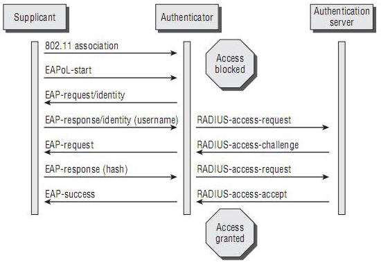

 Hình 2.7 - Mô hình hoạt động xác thực 802.1x

2.11 - WPA (Wi-Fi Protected Access)
-----------------------------------

 WEP được xây dựng để bảo vệ một mạng không dây tránh bị nghe trộm.
 Nhưng nhanh chóng sau đó người ta phát hiện ra nhiều lổ hỏng ở công
 nghệ này. Do đó, công nghệ mới có tên gọi WPA (*Wi-Fi Protected
 Access*) ra đời, khắc phục được nhiều nhược điểm của WEP.

 Một trong những cải tiến quan trọng nhất của WPA là sử dụng hàm thay
 đổi khoá TKIP (*Temporal Key Integrity Protocol*). WPA cũng sử dụng
 thuật toán RC4 như WEP nhưng mã hoá đầy đủ 128 bit. Và một đặc điểm
 khác là WPA thay đổi khoá cho mỗi gói tin. Các công cụ thu thập các
 gói tin để phá khoá mã hoá đều không thể thực hiện được với WPA. Bởi
 WPA thay đổi khoá liên tục nên hacker không bao giờ thu thập đủ dữ
 liệu mẫu để tìm ra mật khẩu. Không những thế, WPA còn bao gồm kiểm tra
 tính toàn vẹn của thông tin (Message Integrity Check). Vì vậy, dữ liệu
 không thể bị thay đổi trong khi đang ở trên đường truyền. Một trong
 những điểm hấp dẫn nhất của WPA là không yêu cầu nâng cấp phần cứng.
 Các nâng cấp miễn phí về phần mềm cho hầu hết các Card mạng và điểm
 truy cập sử dụng WPA rất dễ dàng và có sẵn.

 WPA có sẵn 2 lựa chọn : WPA Personal và WPA Enterprise. Cả 2 lựa chọn
 này đều sử dụng giao thức TKIP và sự khác biệt chỉ là khoá khởi tạo mã
 hoá lúc đầu. WPA Personal thích hợp cho gia đình và mạng văn phòng
 nhỏ, khoá khởi tạo sẽ được sử dụng tại các điểm truy cập và thiết bị
 máy trạm. Trong khi đó, WPA cho doanh nghiệp cần một máy chủ xác thực
 và 802.1x để cung cấp các khoá khởi tạo cho mỗi phiên làm việc.

 Trong khi Wi-Fi Alliance đã đưa ra WPA, và được coi là loại trừ mọi lổ
 hổng dễ bị tấn công của WEP nhưng người sử dụng vẫn không thực sự tin
 tưởng vào WPA. Có một lỗ hổng trong WPA và lỗi này chỉ xảy ra với WPA
 Personal. Khi mà hàm thay đổi khoá TKIP được sử dụng để tạo ra các
 khoá mã hoá bị phát hiện, nếu hacker có thể đoán được khoá khởi tạo
 hoặc một phần của mật khẩu, họ có thể xác định được toàn bộ mật khẩu,
 do đó có thể giải mã được dữ liệu. Tuy nhiên, lỗ hổng này cũng sẽ bị
 loại bỏ bằng cách sử dụng những khoá khởi tạo không dễ đoán. Điều này
 cũng có nghĩa rằng kỹ thuật TKIP của WPA chỉ là giải pháp tạm thời,
 chưa cung cấp một phương thức bảo mật cao nhất.

 WPA chỉ thích hợp với những công ty mà không không truyền dữ liệu
 "mật" về thương mại, hay các thông tin nhạy cảm... WPA cũng thích hợp
 với những hoạt động hàng ngày và mang tính thử nghiệm công nghệ.

2.12 - WPA2 (Wi-Fi Protected Access)
------------------------------------

 Một giải pháp về lâu dài là sử dụng 802.11i tương đương với WPA2, được
 chứng nhận bởi Wi-Fi Alliance. Chuẩn này sử dụng thuật toán mã hoá
 mạnh mẽ và được gọi là Chuẩn mã hoá nâng cao AES. AES sử dụng thuật
 toán mã hoá đối xứng theo khối Rijndael, sử dụng khối mã hoá 128 bit,
 và 192 bit hoặc 256 bit. Để đánh giá chuẩn mã hoá này, Viện nghiên cứu
 quốc gia về Chuẩn và Công nghệ của Mỹ, NIST (National Institute of
 Standards and Technology), đã thông qua thuật toán mã đối xứng này.

 Trong khi AES được xem như là bảo mật tốt hơn rất nhiều so với WEP 128
 bit hoặc 168 bit DES (Digital Encryption Standard). Để đảm bảo về mặt
 hiệu năng, quá trình mã hoá cần được thực hiện trong các thiết bị phần
 cứng như tích hợp vào chip. Tuy nhiên, rất ít người sử dụng mạng không
 dây quan tâm tới vấn đề này. Hơn nữa, hầu hết các thiết bị cầm tay
 Wi-Fi và máy quét mã vạch đều không tương thích với chuẩn 802.11i.

2.13 – Kết Luận
---------------

- Bảo mật mạng WLAN cũng tương tự như bảo mật cho các hệ thống
    mạng khác. Bảo mật hệ thống phải được áp dụng cho nhiều tầng, các
    thiết bị nhận dạng phát hiện tấn công phải được triển khai. Giới hạn
    các quyền truy cập tối thiểu cho những người dùng cần thiết. Dữ liệu
    được chia sẻ và yêu cầu xác thực mới cho phép truy cập. Dữ liệu
    truyền phải được mã hoá.

- Với người dùng sử dụng mạng WLAN cho gia đình, một phương thức bảo
    mật với WPA passphare hay preshared key được khuyến cáo sử dụng.

- Với giải pháp doanh nghiệp, để tối ưu quá trình bảo mật với 802.1x
    EAP làm phương thức xác thực và TKIP hay AES làm phương thức mã hoá.
    Được dựa theo chuẩn WPA hay WPA2 và 802.11i security.

- Phải ước lượng được các nguy cơ bảo mật và các mức độ bảo mật để áp
    dụng chính sách bảo mật cần thiết.

\
CHƯƠNG 3 - CÁC KỸ THUẬT TẤN CÔNG MẠNG WLAN VÀ BIỆN PHÁP PHÒNG CHỐNG
===================================================================

3.1 – Giới thiệu
----------------

 Mạng máy tính không dây cũng mang những đặc trưng cơ bản của một mạng
 máy tính, vì thế việc tấn công và các biện pháp ngăn chặn trên mạng
 không giây cũng tương tự như trong mạng có dây. Ngoài ra, từ những đặc
 thù riêng của mạng không dây về không gian truyền sóng nên nó chịu
 những kiểu tấn công khác và có những biện pháp ngăn chặn khác.

 Tấn công và phòng chống trong mạng WLAN là vấn đề được quan tâm rất
 nhiều hiện nay bởi các chuyên gia trong lĩnh vực bảo mật. Nhiều giải
 pháp tấn công và phòng chống đã được đưa ra nhưng chưa giải pháp nào
 thật sự gọi là bảo mật hoàn toàn. Cho đến hiện nay, mọi giải pháp
 phòng chống được đưa ra đều là tương đối, nghĩa là tính bảo mật trong
 mạng WLAN vẫn có thể bị phá vỡ bằng nhiều cách khác nhau. Chương này
 sẽ nêu ra những kiểu tấn công thường được áp dụng trong mạng WLAN,
 khái niệm, đặc điểm tấn công và một số phương pháp phòng chống.

 Hiện nay có rất nhiều kỹ thuật tấn công một mạng WLAN, điển hình là
 các kỹ thuật sau :

- Phương thức bắt gói tin (Sniffing)

- De-authentication Attack (Tấn công yêu cầu xác thực lại)

- Replay Attack (Tấn công phát lại)

- Rogue Access Point (giả mạo AP)

- Tấn công dựa trên sự cảm nhận lớp vật lý

- Disassociation Attack (Tấn công ngắt kết nối)

- Deny of Service Attack (Dos)

- Man in the middle Attack (Tấn công xen giữa)

- Passive Attack (Tấn công bị động)

- Active Attack (Tấn công chủ động)

- Dictionary Attack (Tấn công bằng phương pháp dò từ điển)

- Jamming Attacks (Tấn công chèn ép)

2.2 – Phương thức bắt gói tin (Sniffing)
----------------------------------------

 Sniffing là khái niệm cụ thể của khái niệm tổng quát “Nghe trộm –
 Eavesdropping” sử dụng trong mạng máy tính. Có lẽ là phương pháp đơn
 giản nhất, tuy nhiên nó vẫn có hiệu quả đối với việc tấn công WLAN.
 Bắt gói tin có thể hiểu như là một phương thức lấy trộm thông tin khi
 đặt một thiết bị thu nằm trong hoặc nằm gần vùng phủ sóng. Tấn công
 kiểu bắt gói tin sẽ khó bị phát hiện ra sự có mặt của thiết bị bắt gói
 dù thiết bị đó nằm trong hoặc nằm gần vùng phủ sóng nếu thiết bị không
 thực sự kết nối tới AP để thu các gói tin.

 Việc bắt gói tin ở mạng có dây thường được thực hiện dựa trên các
 thiết bị phần cứng mạng, ví dụ như việc sử dụng phần mềm bắt gói tin
 trên phần điều khiển thông tin ra vào của một card mạng trên máy tính,
 có nghĩa là cũng phải biết loại thiết bị phần cứng sử dụng, phải tìm
 cách cài đặt phần mềm bắt gói lên đó, vv.. tức là không đơn giản. Đối
 với mạng không dây, nguyên lý trên vẫn đúng nhưng không nhất thiết
 phải sử dụng vì có nhiều cách lấy thông tin đơn giản, dễ dàng hơn
 nhiều. Bởi vì đối với mạng không dây, thông tin được phát trên môi
 trường truyền sóng và ai cũng có thể thu được.

 Những chương trình bắt gói tin có khả năng lấy các thông tin quan
 trọng, mật khẩu, ... từ các quá trình trao đổi thông tin trên máy của
 chúng ta với các site HTTP, email, các instant messenger, các phiên
 FTP, các phiên telnet nếu những thông tin trao đổi đó dưới dạng văn
 bản không mã hóa (clear text). Có những chương trình có thể lấy được
 mật khẩu trên mạng không dây của quá trình trao đổi giữa Client và
 Server khi đang thực hiện quá trình nhập mật khẩu để đăng nhập. Cũng
 từ việc bắt gói tin, có thể nắm được thông tin, phân tích được lưu
 lượng của mạng (Traffic analysis) , phổ năng lượng trong không gian
 của các vùng. Từ đó mà kẻ tấn công có thể biết chỗ nào sóng truyền
 tốt, chỗ nào kém, chỗ nào tập trung nhiều máy.

 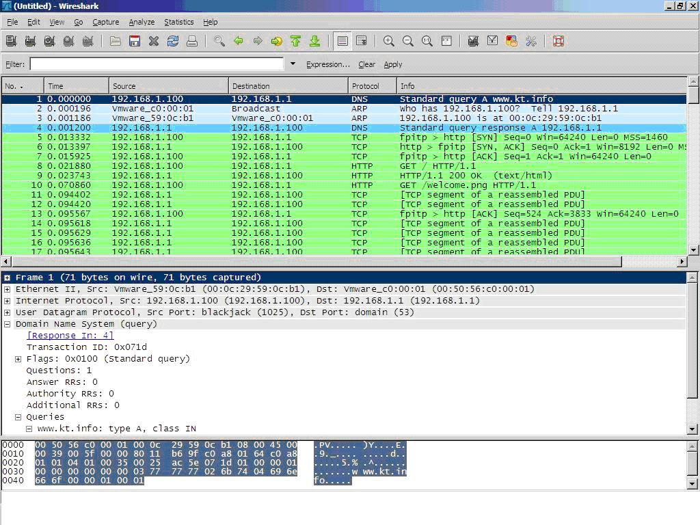

 Hình 3.1 – Bắt gói tin bằng phần mềm Wireshark

 Bắt gói tin ngoài việc trực tiếp giúp cho quá trình phá hoại, nó còn
 gián tiếp là tiền đề cho các phương thức phá hoại khác. Bắt gói tin là
 cơ sở của các phương thức tấn công như an trộm thông tin, thu thập
 thông tin phân bố mạng (wardriving), dò mã, bẻ mã (key crack), ...

 Biện pháp ngăn chặn bắt gói tin : Vì “bắt gói tin” là phương thức tấn
 công kiểu bị động nên rất khó phát hiện và do đặc điểm truyền sóng
 trong không gian nên không thể phòng ngừa việc nghe trộm của kẻ tấn
 công. Giải pháp đề ra ở đây là nâng cao khả năng mã hóa thông tin sao
 cho kẻ tấn công không thể giải mã được, khi đó thông tin lấy được sẽ
 thành vô giá trị đối với kẻ tấn công. Cách tốt nhất để phòng chống
 Sniffing là mã hóa thông lượng bằng IPSec.

3.3 - De-authentication Attack
------------------------------

 Kiểu tấn công deauthetication là phương pháp khai thác hiệu quả một
 lỗi xuất hiện trong chuẩn 802.11. Trong một mạng 802.11, khi một node
 mới muốn tham gia vào mạng lưới thì nó sẽ phải tiến hành các quy trình
 xác thực và liên kết. Sau khi đáp ứng được các yêu cầu thì node sẽ
 được cấp phép để truy cập vào mạng.

 Việc có được địa chỉ của AP trong mạng là vô cùng dễ dàng. Khi
 attacker biết được địa chỉ của AP, nó sẽ sử dụng địa chỉ broadcast để
 gởi thông điệp deauthentication đến cho tất cả các node bên trong
 mạng. Các node sẽ chấp nhận các thông điệp deauthentication không hề
 nghi ngờ cũng như có các biện pháp xác minh xem thử có phải thông điệp
 deauthentication được gởi từ AP hay không. Bước tiếp theo của quy
 trình này là tất cả các node nhận được deauthentication sẽ tiến hành
 reconnect, reauthorize và reasociate đến AP. Việc các node đồng loạt
 tiến hành reauthenticated sẽ khiến cho mạng bị tắc nghẽn. Hoặc sau khi
 kết nối lại, attacker liên tục gửi thông điệp yêu cầu xác thực lại cho
 người dùng khiến người dùng không thể truy cập vào mạng.

 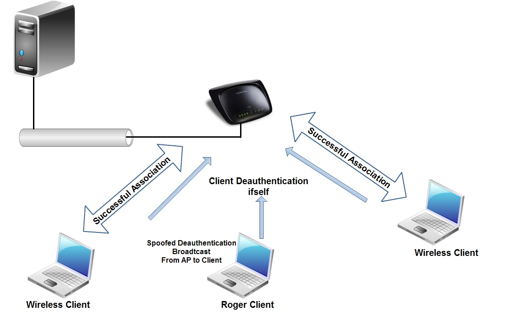

Hình 3.2 – Mô hình Deauthentication Attack

3.4 - Replay attack
-------------------

 Tấn công Replay attack, kẻ tấn công sẽ tiến hành lắng nghe trên đường
 truyền của nạn nhân. Khi nạn nhân tiến hành trao đổi các thông tin
 quan trọng ví dụ như passwork thì kẻ tấn công sẽ chặn các gói tin đó
 lại. Các gói tin bị bắt không bị kẻ tấn công thay đổi nội dung mà giữ
 nguyên đợi đến 1 thời gian thích hợp nào đó sẽ gởi gói tin đó đi giả
 dạng như nó được gởi ra từ máy gốc.

 Trong mạng 802.11 tấn công Replay Attack hầu như chắc chắn sẽ tạo ra
 hiện tượng Denial of Service. Hiện tượng này xảy ra bởi vì các node
 nhận được thông điệp sẽ dành trọn băng thông và thời gian sử lý cho
 việc decoded thông điệp dẫn đến tình trạng Denial of Service. 802.11
 dễ bị tổn thương đối với loại hình tấn công này bởi vì kiểu tấn công
 này dựa trên việc thiếu hoàn toàn thứ tự đánh số của các thông điệp.
 Các node nhận packets do những kẻ tấn công gởi đến, các paket này đều
 hợp lệ tuy nhiên thứ tự của packet không đáp ứng được trình tự packet
 mà node nhận được, điều này khiến cho node dành toàn bộ băng thông và
 thời gian để decode chúng. Ngoài ra 802.11 cũng không hề có bất kì
 phương pháp nào để xác định và loại bỏ replayed messages.

3.5 - Rogue Access Point (giả mạo AP)
-------------------------------------

 Giả mạo AP là kiểu tấn công “man in the middle” cổ điển. Đây là kiểu
 tấn công mà Attacker đứng ở giữa và trộm lưu lượng truyền giữa 2 nút.
 Kiểu tấn công này rất mạnh vì attacker có thể lấy đi tất cả lưu lượng
 đi qua mạng. Rất khó khăn để tạo một cuộc tấn công “man in the middle”
 trong mạng có dây bởi vì kiểu tấn công này yêu cầu truy cập thực sự
 đến đường truyền. Trong mạng không dây thì lại rất dễ bị tấn công kiểu
 này. Attacker cần phải tạo ra một AP thu hút nhiều sự lựa chọn hơn AP
 chính thống. AP giả này có thể được thiết lập bằng cách sao chép tất
 cả các cấu hình của AP chính thống đó là : SSID, địa chỉ MAC,...

 Bước tiếp theo là làm cho nạn nhân thực hiện kết nối tới AP giả. Cách
 thứ nhất là đợi cho nguời dùng tự kết nối. Cách thứ hai là gây ra một
 cuộc tấn công từ chối dịch vụ DoS trong AP chính thống do vậy nguời
 dùng sẽ phải kết nối lại với AP giả. Trong mạng 802.11 sự lựa chọn AP
 được thực hiện bởi cường độ của tín hiệu nhận. Điều duy nhất attacker
 phải thực hiện là chắc chắn rằng AP của mình có cường độ tín hiệu mạnh
 hơn cả. Để có được điều đó attacker phải đặt AP của mình gần nạn nhân
 hơn là AP chính thống hoặc sử dụng kỹ thuật anten định hướng. Sau khi
 nạn nhân kết nối tới AP giả, nạn nhân vẫn hoạt động như bình thường do
 vậy nếu nạn nhân kết nối đến một AP chính thống khác thì dữ liệu của
 nạn nhân đều đi qua AP giả. Attacker sẽ sử dụng các tiện ích để ghi
 lại mật khẩu của nạn nhân khi trao đổi với Web Server. Như vậy,
 attacker sẽ có được tất cả những gì anh ta muốn để đăng nhập vào mạng
 chính thống.

 Kiểu tấn công này tồn tại là do trong 802.11 không yêu cầu chứng thực
 2 hướng giữa AP và nút. AP phát quảng bá ra toàn mạng. Điều này rất dễ
 bị attacker nghe trộm và do vậy attacker có thể lấy được tất cả các
 thông tin mà chúng cần. Các nút trong mạng sử dụng WEP để chứng thực
 chúng với AP nhưng WEP cũng có những lỗ hổng có thể khai thác. Một
 attacker có thể nghe trộm thông tin và sử dụng bộ phân tích mã hoá để
 trộm mật khẩu của người dùng.

3.6 - Tấn công dựa trên sự cảm nhận lớp vật lý
----------------------------------------------

 Kẻ tất công lợi dụng giao thức chống đụng độ CSMA/CA, tức là nó sẽ làm
 cho tất cả người dùng nghĩ rằng lúc nào trong mạng cũng có 1 máy tính
 đang truyền thông. Điều này làm cho các máy tính khác luôn luôn ở
 trạng thái chờ đợi kẻ tấn công ấy truyền dữ liệu xong, dẫn đến tình
 trạng nghẽn trong mạng.

 Tần số là một nhược điểm bảo mật trong mạng không dây. Mức độ nguy
 hiểm thay đổi phụ thuộc vào giao diện của lớp vật lý. Có một vài tham
 số quyết định sự chịu đựng của mạng là : năng lượng máy phát, độ nhạy
 của máy thu, tần số RF (Radio Frequency), băng thông và sự định hướng
 của anten. Trong 802.11 sử dụng thuật toán đa truy cập cảm nhận sóng
 mang (CSMA) để tránh va chạm.

 CSMA là một thành phần của lớp MAC. CSMA được sử dụng để chắc chắn
 rằng sẽ không có va chạm dữ liệu trên đường truyền. Kiểu tấn công này
 không sử dụng tạp âm để tạo ra lỗi cho mạng nhưng nó sẽ lợi dụng chính
 chuẩn đó. Có nhiều cách để khai thác giao thức cảm nhận sóng mang vật
 lý. Cách đơn giản là làm cho các nút trong mạng đều tin tưởng rằng có
 một nút đang truyền tin tại thời điểm hiện tại. Cách dễ nhất đạt được
 điều này là tạo ra một nút giả mạo để truyền tin một cách liên tục.
 Một cách khác là sử dụng bộ tạo tín hiệu RF. Một cách tấn công tinh vi
 hơn là làm cho card mạng chuyển vào chế độ kiểm tra mà ở đó nó truyền
 đi liên tiếp một mẫu kiểm tra. Tất cả các nút trong phạm vi của một
 nút giả là rất nhạy với sóng mang và trong khi có một nút đang truyền
 thì sẽ không có nút nào được truyền.

3.7 - Disassociation Attack (Tấn công ngắt kết nối)
---------------------------------------------------

 Quá trình tấn công như sau :

- Attacker xác định mục tiêu (wireless clients) và mối liên kết giữa
    AP với các clients.

- Sau đó, attacker gửi disassociation frame bằng cách giả mạo
    Source và Destination MAC đến AP và các client tương ứng.

- Client sẽ nhận các frame này và nghĩ rằng frame hủy kết nối đến
    từ AP. Đồng thời, attacker cũng gởi disassociation frame đến AP.

- Sau khi đã ngắt kết nối của một client, attacker tiếp tục thực hiện
    tương tự với các client còn lại làm cho các client tự động ngắt kết
    nối với AP.

- Khi các clients bị ngắt kết nối sẽ thực hiện kết nối lại với AP ngay
    lập tức. Attacker tiếp tục gởi disassociation frame đến AP
    và clients.

 

 Hình 3.3 – Mô hình Disassociation Attack

3.8 - Deny of Service Attack (Dos)
----------------------------------

 DoS là một kỹ thuật được sử dụng chỉ đơn giản để làm hư hỏng mạng
 không dây hoặc làm cho nó không thể cung cấp dịch vụ như thông thường.
 Tương tự như những kẻ phá hoại sử dụng tấn công DoS vào một web server
 làm nghẽn server đó thì mạng WLAN cũng có thể bị shut down bằng cách
 gây nghẽn tín hiệu RF. Những tín hiệu gây nghẽn này có thể là cố ý hay
 vô ý và có thể loại bỏ được hay không loại bỏ được. Khi một attacker
 chủ động tấn công DoS, attacker có thể sử dụng một thiết bị WLAN đặc
 biệt, thiết bị này là bộ phát tín hiệu RF công suất cao hay thiết bị
 chuyên dung khác.

 Để loại bỏ kiểu tấn công này thì yêu cầu đầu tiên là phải xác định
 được nguồn tín hiệu RF. Việc này có thể làm bằng cách sử dụng một
 Spectrum Analyzer (máy phân tích phổ). Có nhiều loại Spectrum Analyzer
 trên thị trường nhưng ta nên dùng loại cầm tay, dùng pin cho tiện sử
 dụng. Một cách khác là dùng các ứng dụng Spectrum Analyzer phần mềm
 kèm theo các sản phẩm WLAN cho client.

 Khi nguồn gây ra DoS là không thể di chuyển được và không gây hại như
 tháp truyền thông hay các hệ thống hợp pháp khác thì admin nên xem xét
 sử dụng dãy tần số khác cho mạng WLAN. Ví dụ, nếu admin chịu trách
 nhiệm thiết kế và cài đặt mạng WLAN cho môi trường rộng lớn, phức tạp
 thì cần phải xem xét kỹ càng. Nếu như nguồn nhiễu RF trải rộng hơn 2.4
 Ghz như bộ đàm, lò vi sóng … thì admin nên sử dụng những thiết bị theo
 chuẩn 802.11a hoạt động trong băng tần 5 Ghz UNII thay vì sử dụng
 những thiết bị 802.11b/g hoạt động trong băng tần 2.4 Ghz sẽ dễ bị
 nhiễu.

 DoS do vô ý xuất hiện thường xuyên do nhiều thiết bị khác nhau chia sẽ
 chung băng tần 2.4 ISM với mạng WLAN. DoS một cách chủ động thường
 không phổ biến lắm, lý do là bởi vì để thực hiện được DoS thì rất tốn
 kém, giá của thiết bị rất mắc tiền, kết quả đạt được chỉ là tạm thời
 shut down mạng trong thời gian ngắn.

Một số công cụ thực hiện như :

- WLAN-Jack

- FATA-Jack

3.9 - Man in the middle Attack (MITM)
-------------------------------------

 Tấn công theo kiểu Man-in-the-middle là trường hợp trong đó attacker
 sử dụng một AP để đánh cắp các node di động bằng cách gởi tín hiệu RF
 mạnh hơn AP thực đến các node đó. Các node di động nhận thấy có AP
 phát tín hiệu RF tốt hơn nên sẽ kết nối đến AP giả mạo này, truyền dữ
 liệu có thể là những dữ liệu nhạy cảm đến AP giả mạo và attacker có
 toàn quyền xử lý. Đơn giản là kẻ đóng vai trò là một AP giả mạo đứng
 giữa tất cả các Client và AP thực sự, thậm chí các Client và AP thực
 không nhận thấy sự hiện diện của AP giả mạo này.

 Để làm cho client kết nối lại đến AP giả mạo thì công suất phát của AP
 giả mạo phải cao hơn nhiều so với AP thực trong vùng phủ sóng của nó.
 Việc kết nối lại với AP giả mạo được xem như là một phần của roaming
 nên người dùng sẽ không hề biết được. Việc đưa nguồn nhiễu toàn kênh
 (all-band interference - chẳng hạn như bluetooth) vào vùng phủ sóng
 của AP thực sẽ buộc client phải roaming.

 Attacker muốn tấn công theo kiểu Man-in-the-middle này trước tiên phải
 biết được giá trị SSID là các client đang sử dụng (giá trị này rất dễ
 dàng có được bằng các công cụ quét mạng WLAN). Sau đó, attacker phải
 biết được giá trị WEP key nếu mạng có sử dụng WEP. Kết nối upstream
 (với mạng trục có dây) từ AP giả mạo được điều khiển thông qua một
 thiết bị client như PC card hay Workgroup Bridge. Nhiều khi, tấn công
 Man-in-the-middle được thực hiện chỉ với một laptop và 2 PCMCIA card.
 Phần mềm AP chạy trên máy laptop nơi PC card được sử dụng như là một
 AP và một PC card thứ 2 được sử dụng để kết nối laptop đến AP thực gần
 đó. Trong cấu hình này, laptop chính là man-in-the-middle (người ở
 giữa), hoạt động giữa client và AP thực. Từ đó attacker có thể lấy
 được những thông tin giá trị bằng cách sử dụng các sniffer trên máy
 laptop.

 Điểm cốt yếu trong kiểu tấn công này là người dùng không thể nhận biết
 được. Vì thế, số lượng thông tin mà attacker có thể thu được chỉ phụ
 thuộc vào thời gian mà attacker có thể duy trì trạng thái này trước
 khi bị phát hiện. Bảo mật vật lý (Physical security) là phương pháp
 tốt nhất để chống lại kiểu tấn công này

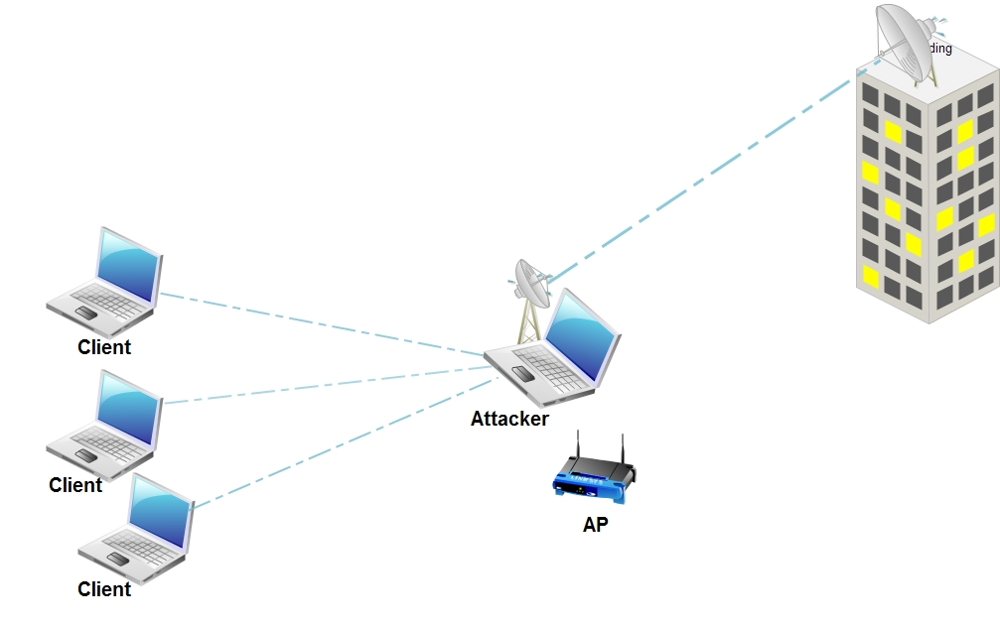

 Hình 3.4 – Mô hình tấn công Man in the middle

Wireless MITM

 Giả sử cho rằng Client B đã được chứng thực hợp lệ với C là một AP
 thực. Attacker X là một laptop có 2 wireless card, thông qua một card,
 hắn sẽ hiện diện trên mạng wireless là một AP. Attacker X sẽ gửi những
 frame không hợp lệ đến B mà sử dụng địa chỉ MAC của Access Point C như
 là địa chỉ nguồn, và BSSID đã được thu thập. B sẽ không được chứng
 thực và bắt đầu dò tìm AP và có thể tìm thấy X trên kênh khác với kênh
 của Access Point C, đây có thể xem là một cuộc tranh giành giữa
 Attacker X và Access Point C.

 Nếu B kết nối với X, thì cuộc tấn công theo phương pháp MITM coi như
 thành công. Sau đó, X sẽ gửi lại những frame mà nó nhận từ chuyển sang
 cho C, ngược lại những frame mà nó nhận từ C chuyển sang cho B sau khi
 thay đổi sao cho phù hợp.

ARP Poisoning

 ARP cache poisoning là một công nghệ đã được dùng trong mạng có dây
 thông thường. Nhưng hiện tại công nghệ này được xuất hiện lại trong
 các AP mà để kết nối đến Switch/Hub với các client trong mạng có dây.

 ARP thường được sử dụng để xác định địa chỉ MAC khi mà đã biết địa chỉ
 IP. Sự chuyển đổi này được thực hiện thông qua việc tìm kiếm trong một
 bảng địa chỉ, ARP cache sẽ giữ nhiệm vụ cập nhật bảng địa chỉ này bằng
 cách gửi broadcast các gói dữ liệu yêu cầu chứa các địa chỉ IP đến các
 client, nếu như IP của client nào trùng với IP nhận được thì sẽ phản
 hồi lại với gói dữ liệu chứa MAC Address của mình. Những thành phần
 trong bảng này sẽ hết hạn trong một khoảng thời gian nhất định vì
 client có thể thay đổi phần cứng (NIC) thì khi đó bảng này sẽ được cập
 nhật lại.

 Tuy nhiên, một nhược điểm của ARP là không có bất kỳ sự kiểm tra nào
 từ những phản hồi của các client hợp lệ hoặc là nhận phản hồi từ những
 client giả mạo. ARP Poisoning là một phương pháp tấn công lợi dụng vào
 lỗ hổng này. Nếu ARP cache bị lỗi thì hệ điều hành sẽ vẫn lưu địa MAC
 sai của một vài địa chỉ IP. Attacker sẽ thực hiện bằng cách gửi các
 gói dữ liệu phản hồi với những MAC Address sai.

 ARP Poisoning là một trong những công nghệ mà cho phép tấn công theo
 kiểu MITM. Attacker X sẽ đưa hắn vào giữa 2 máy B và C, bằng cách
 “nhiễm” vào B cho nên IP của C được kết nối với MAC Address của X,
 ngược lại bằng cách “nhiễm” vào C cho nên IP của B sẽ kết nối với MAC
 Address của X, nghĩa là cuối cùng mọi giao tiếp giữa B và C đều phải
 thông qua X.

 Tấn công ARP poisoning thì có thể áp dụng cho tất cả các host trong
 cùng một subnet. Hầu hết các AP đóng vai trò cầu nối để truyền nhận
 lớp địa chỉ MAC, cho nên tất cả các client kết nối đến đều có thể bị
 nguy hiểm. Nếu như một AP được kết nối trực tiếp đến Switch/Hub mà
 không có Router/Firewall thì sau đó các client kết nối đến Switch/Hub
 rất dễ bị tấn công. Chú ý rằng hầu hết các thiết bị có mặt trên thị
 trường hiện nay đều được tích hợp Switch với 4 hoặc 5 port vào trong
 AP, Router hoặc DSL/cable modem để kết nối Internet, bên trong thì AP
 đã được kết nối với Switch. Kết quả là attacker có thể là một client
 và trở thành một MITM giữa 2 mạng có dây thông thường, một mạng
 wireless và một mạng có dây, hoặc cả 2 mạng wireless.

 Các công cụ thực hiện như:

- HostAP (hostap.epitest.fi)

- AirJack (http://802.11ninja.net/airjack/)

- Ettercap (http://ettercap.sourceforge.net/).

3.10 - Passive Attack (Tấn công bị động)
----------------------------------------

 Tấn công bị động (passive) hay nghe lén (sniffing) có lẽ là một phương
 pháp tấn công WLAN đơn giản nhất nhưng vẫn rất hiệu quả. Passive
 attack không để lại một dấu vết nào chứng tỏ đã có sự hiện diện của
 attacker trong mạng vì khi tấn công attacker không gửi bất kỳ gói tin
 nào mà chỉ lắng nghe mọi dữ liệu lưu thông trên mạng. WLAN sniffer hay
 các ứng dụng miễn phí có thể được sử dụng để thu thập thông tin về
 mạng không dây ở khoảng cách xa bằng cách sử dụng anten định hướng.
 Phương pháp này cho phép attacker giữ khoảng cách với mạng, không để
 lại dấu vết trong khi vẫn lắng nghe và thu thập được những thông tin
 quý giá.

 Sniffer thường là một phần mềm có thể lắng nghe và giải mã các gói dữ
 liệu lưu thông trên mạng, sniffer đóng vai trò một hệ thống trung gian
 và sẽ copy tất cả các gói dữ liệu mà được gửi từ máy A sang máy B,
 chụp lấy password trong những phiên kết nối của các Client. Vì vậy
 mạng Wireless rất dễ bị nghe lén so với mạng có dây thông thường.

 Có nhiều ứng dụng có khả năng thu thập được password từ những địa chỉ
 HTTP, email, instant message, FTP session, telnet. Những kiểu kết nối
 trên đều truyền password theo dạng clear text (không mã hóa). Nhiều
 ứng dụng có thể bắt được cả password hash (mật mã đã được mã hóa bằng
 nhiều thuật toán như MD4, MD5, SHA,...) truyền trên đoạn mạng không
 dây giữa client và server lúc client đăng nhập vào. Bất kỳ thông tin
 nào truyền trên đoạn mạng không dây theo kiểu này đều rất dễ bị tấn
 công bởi attacker. Tác hại là không thể lường trước được nếu như
 attacker có thể đăng nhập vào mạng bằng thông tin của một người dùng
 nào đó và cố tình gây ra những thiệt hại cho mạng.

 Một attacker có thể ở đâu đó trong bãi đậu xe, dùng những công cụ để
 đột nhập vào mạng WLAN. Các công cụ có thể là một packet sniffer, hay
 một số phần mềm miễn phí để có thể crack được WEP key và đăng nhập vào
 mạng.

 Passive Scanning

 Passive Scanning là cách mà Attacker dung để lấy thông tin từ mạng
 bằng cách điều chỉnh thiết bị sao cho có tầng số sóng radio khác nhau.
 Passive Scanning nghĩa là cho Wireless NIC lắng nghe trên mỗi kênh một
 vài thông điệp mà không cho thất sự hiện diện của Attacker.

 Attacker có thể quét bị động mà không cần phải gửi bất cứ thông điệp
 nào. Chế độ này gọi là RF monitor, khi đó mỗi frame dữ liệu lưu thông
 trên mạng có thể bi copy bởi Attacker, mặc định thì chức năng này
 thường không có ở những Wireless NIC hiện có trên thị trường do đã
 được cài firmware đã tắt chức năng này. Trong chế độ này một Client có
 thể chụp lấy những gói dữ liệu mà không cần phải kết nối với AP hoặc
 Ah-hoc network.

 Detecting SSID

 Thông thường bằng cách Passive Scanning các Attacker có thể tìm ra
 được SSID của mạng, bởi vì SSID nằm trong các frame sau: Beacon, Probe
 Request, Probe Responses, Association Requests và Reassociation
 Requests.

 Trên một số AP co thể cấu hình cho SSID được gửi đi trong frame Beacon
 được che giấu đi, và thậm chí tắt các frame beacon hoàn toàn. SSID
 được giấu trong các frame beacon mục đích giảm tổi thiểu sự nhận biết
 của các Client về SSID. Trong nhiều trường hợp các Client cố gắng gia
 nhập vào mạng WLAN để kết nối bằng cách gửi yêu cầu dò tìm khi mà
 không thấy bất kỳ AP nào mà SSID không giống. Còng nếu frame Beacon
 không tắt thì các Attacker hiển nhiên sẽ xin được SSID từ AP bằng cách
 Passive Scanning.

 Khi mà đã có được SSID, thì yêu cầu kết nối sẽ xuất hiện tại những
 Client mà có SSID phù hợp. Một yêu cầu trong frame này sẽ bao gồm SSID
 đúng và thông tin nghe trộm của Attacker. Nếu một Client muốn gia nhập
 vào bất kỳ AP nào cho phép, nó sẽ gửi yêu cầu dò tìm trên tất cả các
 kênh và lắng nghe lời phản hồi mà có chứa SSID của AP. Attacker sẽ xem
 xét qua tất cả các lời phản hồi để chọn ra một AP. Thông thường thì
 kết nối sẽ được thiết lập ngay sau đó và Attacker sẽ đợi những thông
 tin phản hồi và suy ra được SSID.

 Nếu việc truyền nhận frame beacon bị tắt, thì attacker có 2 lựa chọn.
 Hoặc là attacker tiếp tục lắng nghe đến khi một yêu cầu kết nối xuất
 hiện từ một client có quyền truy cập mạng và có SSID phù hợp để nghe
 trộm SSID này. Hoặc là attacker có thể dò tìm bằng cách bơm vào
 (injecting) một frame mà đã tạo ra sẵn và sau đó lắng nghe phản hồi.

 Collecting the MAC Addresses

 Các attacker thu thập các địa chỉ MAC hợp lệ để sử dụng trong các
 frame giả mạo được dựng lên sau này. Địa chỉ MAC nguồn và đích luôn
 chứa đầy đủ trong tất cả các frame. Cò 2 lý do tại sao attacker muốn
 thu thập MAC Address của các client và AP trong mạng. Một là attacker
 muốn sử dụng những giá trị này trong các frame giả mạo để máy của hắn
 không bị AP nhận ra. Thứ hai là các AP có chức năng lọc các địa chỉ
 MAC chưa được đăng ký thì không cho truy cập vào mạng, attacker sẽ giả
 mạo địa chỉ MAC để truy cập hợp pháp.

 Collecting frames for Cracking WEP

 Mục đích của các attacker là tìm ra khóa WEP. Thông thường khóa này có
 thể đoán ra được dựa vào một lượng lớn các hệ thống công cộng mà các
 quản trị mạng đã cấu hình và thường sử dụng. Một vài phần mềm Client
 lưu trữ khóa WEP trong Registry của hệ thống. Sau này chúng ta phải
 thừa nhận rằng các Attacker đã không thành công trong việc xin khóa
 trong cách này, các Attacker sau đó đã tận dụng các phương pháp một
 cách có hệ thống trong việc crack WEP. Để thực hiện mục đích này một
 số lượng frame rất lớn (hàng triệu) frame cần được thu thập để crack
 WEP bởi vì đó là cách WEP hoạt động.

 Attacker nghe trộm một lượng lớn các frame dữ liệu từ một mạng WLAN.
 Tất cả các frame này sử dụng cùng một khóa. Những thuật toán đằng sau
 những secret-shared-key là một tập hợp các đoạn text đã mã hóa mà được
 trích xuất từ các frame. Tuy nhiên, tất cả những gì cần đó là một tập
 hợp các frame được mã hóa với những thuật toán yếu. Số frame được mã
 hóa với thuật toán yếu chiếm tỉ lệ nhỏ trong tất cả các frame. Trong
 tập hợp hàng triệu frame có thể chỉ có 100 frame được mã hóa như vậy.
 Có thể thấy được rằng việc tập hợp này có thể mất đến vài giờ và thậm
 chí vài ngày để trích xuất ra thông tin cần dò tìm. Tuy nhiên các
 attacker có thể sử dụng các máy tính mạnh thì thời gian dò tìm thông
 tin nhanh hơn có thể chỉ còn vài phút đến vài giờ.

 Công cụ thực hiện :

- AirSnort (http://airsnort.shmoo.com)

- Kismet (<http://www.kismetwireless.net/)

- AiroPeek (<http://www.widepackets.com/)

- Sniffer Pro

- WirelessMon (<http://www.passmark.com)

3.11 - Active Attack (Tấn công chủ động)
----------------------------------------

 Attacker có thể tấn công chủ động để thực hiện một số tác vụ trên
 mạng. Một cuộc tấn công chủ động có thể được sử dụng để truy cập vào
 server và lấy được những dữ liệu có giá trị hay sử dụng đường kết nối
 Internet của doanh nghiệp để thực hiện những mục đích phá hoại hay
 thậm chí là thay đổi cấu hình của hạ tầng mạng. Bằng cách kết nối với
 mạng không dây thông qua AP, attacker có thể xâm nhập sâu hơn vào mạng
 hoặc có thể thay đổi cấu hình của mạng. Ví dụ, một attacker có thể sửa
 đổi để thêm MAC address của attacker vào danh sách cho phép của MAC
 filter (danh sách lọc địa chỉ MAC) trên AP hay vô hiệu hóa tính năng
 MAC filter giúp cho việc đột nhập sau này dễ dàng hơn. Admin thậm chí
 không biết được thay đổi này trong một thời gian dài nếu như không
 kiểm tra thường xuyên.

 Một số ví dụ điển hình của active attack có thể bao gồm các Spammer
 (kẻ phát tán thư rác) hay các đối thủ cạnh tranh muốn đột nhập vào cơ
 sở dữ liệu của công ty. Một spammer có thể gởi một lúc nhiều mail đến
 mạng của gia đình hay doanh nghiệp thông qua kết nối không dây WLAN.
 Sau khi có được địa chỉ IP từ DHCP server, attacker có thể gởi cả ngàn
 bức thư sử dụng kết nối internet của chúng ta mà chúng ta không hề
 biết. Kiểu tấn công này có thể làm cho ISP ngắt kết nối email của
 chúng ta vì đã lạm dụng gởi nhiều mail mặc dù không phải lỗi của chúng
 ta.

 Một khi attacker đã có được kết nối không dây vào mạng của chúng ta,
 hắn có thể truy cập vào server, sử dụng kết nối WAN, Internet hay truy
 cập đến laptop, desktop người dùng. Cùng với một số công cụ đơn giản,
 attacker có thể dễ dàng thu thập được những thông tin quan trọng, giả
 mạo người dùng hay thậm chí gây thiệt hại cho mạng bằng cách cấu hình
 sai. Dò tìm server bằng cách quét cổng, tạo ra phiên làm việc NULL để
 chia sẽ hay crack password, sau đó đăng nhập vào server bằng account
 đã crack được là những điều mà attacker có thể làm đối với mạng của
 chúng ta.

 Detecting SSID

 Tìm ra SSID thông thường rất đơn giản với sự hổ trợ của các công cụ và
 bắt lấy những frame dữ liệu quan trọng. Nếu những frame này không được
 lưu thông trên mạng thì attacker không đủ kiên nhẫn để chờ đợi một yêu
 cầu kết nối hợp lệ từ một client khác mà có quyền truy cập vào mạng để
 thông qua đó có được một SSID chính xác. Attacker sẻ bơm vào
 (injecting) một yêu cầu thăm dò bằng một địa chỉ MAC giả mạo. Vì lầm
 tưởng địa chỉ MAC nên AP sẽ phát ra những frame dữ liệu quan trọng,
 lúc này attacker sẽ tìm ra SSID thông qua yêu cầu thăm dò đã gửi.

 Một vài loại AP cho phép tắt chức năng trả lời đối với những yêu cầu
 thăm dò mà không đúng SSID. Trong trường hợp này, attacker sẽ quyết
 định chọn một client kết nối đến một AP, và gửi cho client này frame
 tách rời giả mạo mà địa chỉ MAC đã được cài đặt trên AP. Client sẽ gửi
 một yêu cầu kết nối lại và SSID lộ diện.

 Detecting AP and station

 Mỗi một AP cũng là một máy trạm, vì thế các SSID và MAC address đã
 được tập hợp sẵn. Bằng cách sử dụng một vài công cụ hổ trợ dò tìm sóng
 mạng wireless sẽ cho chúng ta biết rõ khá đầy đủ thông tin của mạng
 wireless, AP và các client.

 Một số bit nào đó trong các frame được nhận biết rằng được phát ra từ
 AP. Nếu chúng ta cho rằng khóa WEP một là đã tắt hai là đã bị crack,
 attacker cũng có thể thu thập các địa chỉ IP của các AP và client.

 Detection of Probing

 Việc phát hiện sự giả mạo là hoàn toàn có thể, những frame mà attacker
 gửi đi cũng có thể bị phát hiện bởi hệ thống phát hiện xâm nhập –
 instrustion detection systems (IDS) của mạng WLAN, có thể nhận thấy
 được những sự thay đổi vật lý (MAC Address) của thiết bị wireless dù
 cho đó là những frame giả mạo.

 Công cụ thực hiện:

- NetStumbler

- WirelessMon

3.12 - Dictionary Attack (Tấn công bằng phương pháp dò từ điển)
---------------------------------------------------------------

 Nguyên lý thực hiện : Việc dò mật khẩu dựa trên nguyên lý quét tất cả
 các trường hợp có thể sinh ra từ tổ hợp của các ký tự. Nguyên lý này
 có thể được thực thi cụ thể bằng những phương pháp khác nhau như quét
 từ trên xuống dưới, từ dưới lên trên, từ số đến chữ, vv... Việc quét
 thế này tốn nhiều thời gian ngay cả trên những thế hệ máy tính tiên
 tiến bởi vì số trường hợp tổ hợp ra là cực kỳ nhiều. Thực tế là khi
 đặt một mật mã, nhiều người thường dùng các từ ngữ có ý nghĩa liên
 quan tới mình. Ví dụ như ngày sinh, tên riêng,... Trên cơ sở đó một
 nguyên lý mới được đưa ra là sẽ quét mật khẩu theo các trường hợp theo
 các từ ngữ trên một bộ từ điển có sẵn, nếu không tìm ra lúc đấy mới
 quét tổ hợp các trường hợp. Bộ từ điển này gồm những từ ngữ được sử
 dụng trong cuộc sống, trong xã hội, vv.. và nó luôn được cập nhật bổ
 sung để tăng khả năng “thông minh” của bộ phá mã.

 Để ngăn chặn với kiểu dò mật khẩu này, cần xây dựng một quy trình đặt
 mật khẩu phức tạp hơn, đa dạng hơn để tránh những tổ hợp từ, và gây
 khó khăn cho việc quét tổ hợp các trường hợp. Ví dụ quy trình đặt mật
 khẩu phải như sau:

- Mật khẩu dài tối thiểu 10 ký tự

- Có cả chữ thường và chữ hoa

- Có cả chữ, số, và có thể là các ký tự đặc biệt như !,@,\#,\$,..

- Tránh trùng với tên đăng ký, tên tài khoản, ngày sinh, vv..

- Không nên sử dụng các từ ngữ ngắn đơn giản có trong từ điển

3.13 - Jamming Attacks (Tấn công chèn ép)
-----------------------------------------

 Jamming là một kỹ thuật sử dụng đơn giản để làm mạng ngừng hoạt động.
 Phương thức jamming phổ biến nhất là sử dụng máy phát có tần số phát
 giống tần số mà mạng sử dụng để áp đảo làm mạng bị nhiễu, bị ngừng làm
 việc. Tín hiệu RF đó có thể di chuyển hoặc cố định.

 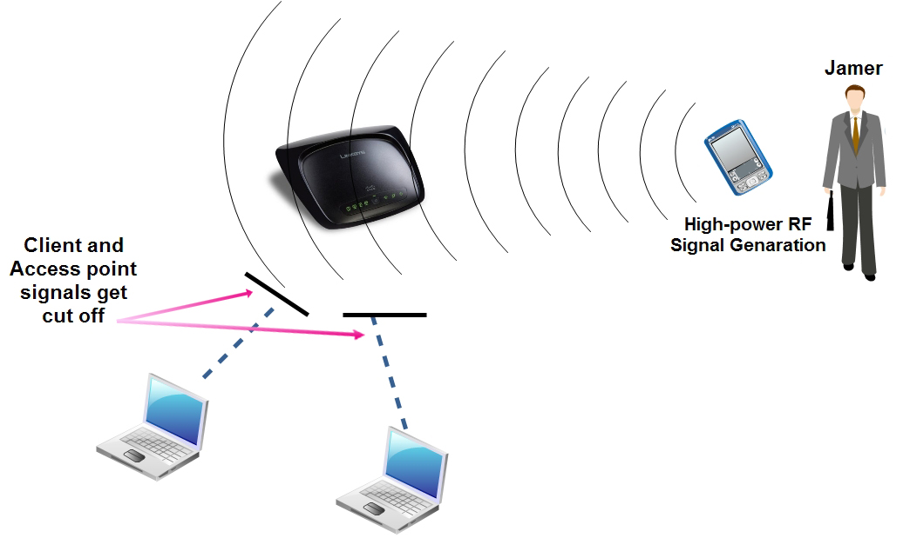

Hình 3.5 – Mô tả tấn công theo kiểu chèn ép

 Cũng có trường hợp sự Jamming xảy ra do không chủ ý và thường xảy ra
 với mọi thiết bị mà dùng chung dải tần 2,4Ghz. Tấn công bằng Jamming
 không phải là sự đe dọa nghiêm trọng, nó khó có thể được thực hiện phổ
 biến do vấn đề giá cả của thiết bị, nó quá đắt trong khi kẻ tấn công
 chỉ tạm thời vô hiệu hóa được mạng.

3.14 – Giới thiệu tổng quan về mô hình xác thực RADIUS
------------------------------------------------------

- Việc bảo mật WLAN sử dụng chuẩn 802.1x kết hợp với xác thực người
     dùng trên Access Point (AP). Một máy chủ thực hiện việc xác thực
     trên nền tảng RADIUS có thể là một giải pháp tốt cung cấp xác thực
     cho chuẩn 802.1x.

- Phần này sẽ giới thiệu cách thức làm việc của RADIUS và vì sao phải
     cần máy chủ RADIUS để hỗ trợ việc xác thực cho WLAN.

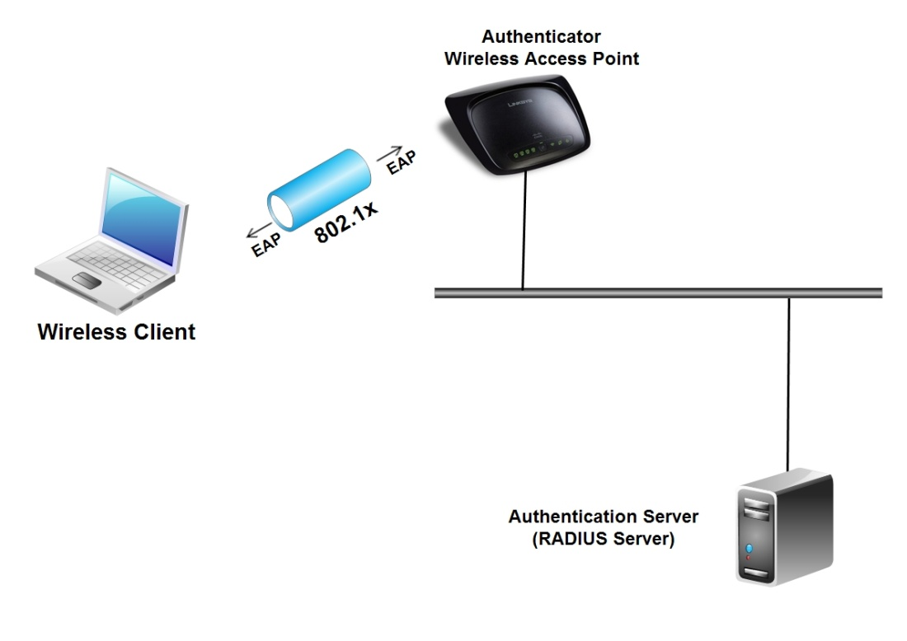

Hình 3.6 Mô hình xác thực giữa Wireless Clients và RADIUS Server.

3.14.1 - Xác thực, cấp phép và kiểm tra
---------------------------------------

 Giao thức Remote Authentication Dial In User Service (RADIUS) được
 định nghĩa trong RFC 2865 như sau: Với khả năng cung cấp xác thực tập
 trung, cấp phép và điều khiển truy cập (Authentication, Authorization,
 và Accounting – AAA) cho các phiên làm việc với SLIP và PPP Dial-up –
 như việc cung cấp xác thực của các nhà cung cấp dịch vụ Internet (ISP)
 đều dựa trên giao thức này để xác thực người dùng khi họ truy cập
 Internet.

 Nó cần thiết trong tất cả các Network Access Server (NAS) để làm việc
 với danh sách các username và password cho việc cấp phép, RADIUS
 Access-Request sẽ chuyển các thông tin tới một Authentication Server,
 thông thường nó là một AAA Server (AAA – Authentication, Authoriztion,
 và Accounting). Trong kiến trúc của hệ thống nó tạo ra khả năng tập
 trung các dữ liệu, thông tin của người dùng, các điều kiện truy cập
 trên một điểm duy nhất (single point), trong khi có khả năng cung cấp
 cho một hệ thống lớn, cung cấp giải pháp NAS.

 Khi một user kết nối, NAS sẽ gửi một message dạng RADIUS
 Access-Request tới máy chủ AAA Server, chuyển các thông tin như
 username và password, thông qua một port xác định, NAS identify, và
 một message Authenticator.

 Sau khi nhận được các thông tin máy chủ AAA sử dụng các gói tin được
 cung cấp như NAS identify, và Authenticator thẩm định lại việc NAS đó
 có được phép gửi các yêu cầu đó không. Nếu có khả năng, máy chủ AAA sẽ
 tìm kiểm tra thông tin username và password mà người dùng yêu cầu truy
 cập trong cơ sở dữ lệu. Nếu quá trình kiểm tra là đúng thì nó sẽ mang
 một thông tin trong Access-Request quyết định quá trình truy cập của
 user đó là được chấp nhận.

 Khi quá trình xác thực bắt đầu được sử dụng, máy chủ AAA có thể sẽ trả
 về một RADIUS Access-Challenge mang một số ngẫu nhiên. NAS sẽ chuyển
 thông tin đến người dùng từ xa (với ví dụ này sử dụng CHAP). Khi đó
 người dùng sẽ phải trả lời đúng các yêu cầu xác nhận (trong ví dụ này,
 đưa ra lời đề nghị mã hoá password), sau đó NAS sẽ chuyển tới máy chủ
 AAA một message RADIUS Access-Request.

 Nếu máy chủ AAA sau khi kiểm tra các thông tin của người dùng hoàn
 toàn thoả mãn sẽ cho phép sử dụng dịch vụ, nó sẽ trả về một message
 dạng RADIUS Access-Accept. Nếu không thoả mãn máy chủ AAA sẽ trả về
 một tin RADIUS Access-Reject và NAS sẽ ngắt kết nối với user.

 Khi một gói tin Access-Accept được nhận và RADIUS Accounting đã được
 thiết lập, NAS sẽ gửi mộtgói tin RADIUS Accounting-Request (Start) tới
 máy chủ AAA. Máy chủ sẽ thêm các thông tin vào file Log của nó, với
 việc NAS sẽ cho phép phiên làm việc với user bắt đầu khi nào, và kết
 thúc khi nào, RADIUS Accouting làm nhiệm vụ ghi lại quá trình xác thực
 của user vào hệ thống, khi kết thúc phiên làm việc NAS sẽ gửi một
 thông tin RADIUS Accounting-Request (Stop).

3.14.2 - Sự bảo mật và tính mở rộng
-----------------------------------

 Tất cả các message của RADIUS đều được đóng gói bởi UDP datagrams, nó
 bao gồm các thông tin như: message type, sequence number, length,
 Authenticator, và một loạt các Attribute-Value.

 Authenticator: Tác dụng của Authenticator là cung cấp một chế độ bảo
 mật. NAS và AAA Server sử dụng Authenticator để hiểu đuợc các thông
 tin đã được mã hóa của nhau, ví dụ như mật khẩu. Authenticator cũng
 giúp NAS phát hiện sự giả mạo của gói tin RADIUS Responses. Cuối cùng,
 Authenticator được sử dụng làm cho để biễn password thành một dạng nào
 đó, ngăn chặn việc làm lộ mật khẩu của người dùng trong các message
 RADIUS.

 Authenticator gửi Access-Request trong một số ngẫu nhiên. MD5 sẽ băm
 (hash) số ngẫu nhiên đó thành một dạng riêng là OR’ed cho mật khẩu của
 người dùng và gửi trong Access-Request User-Password. Toàn bộ RADIUS
 response sau đó được MD5 băm (hash) với cùng thông số bảo mật của
 Authenticator, và các thông số response khác.

 Authenticator giúp cho quá trình giao tiếp giữa NAS và máy chủ AAA
 được bảo mật nhưng nếu kẻ tấn công tóm được cả hai gói tin RADIUS
 Access-Request và Access-Response thì có thể thực hiện "dictionary
 attack" để phân tích việc đóng gói này. Trong điều kiện thực tế để
 việc giải mã khó khăn, ta cần phải sử dụng những thông số dài hơn,
 toàn bộ vấn đề có khả năng nguy hại cho quá trình truyền tải này được
 miêu tả rất kỹ trong RFC 3580.

 Attribute-Value Pairs: Thông tin được mang bởi RADIUS đuợc miêu tả
 trong một dạng Attribute-Value, để hỗ trợ cho nhiều công nghệ khác
 nhau, và nhiều phương thức xác thực khác nhau. Một chuẩn được định
 nghĩa trong Attribute-Value pairs (cặp đôi), bao gồm User-Name,
 User-Password, NAS-IPAddress, NAS-Port, Service-Type. Các nhà sản xuất
 (vendors) cũng có thể định nghĩa Attribute-Value pairs để mang các
 thông tin của mình như Vendor-Specific toàn bộ ví dụ này được miêu tả
 trong RFC 2548 - Định nghĩ Microsoft Attribute-Value pair trong
 MS-CHAP.

 Thêm vào đó, rất nhiều chuẩn Attribute-Value pairs được định nghĩa
 trong nhiều năm để hỗ trợ Extensible Authentication Protocol (EAP),
 một dạng khác cũ hơn của nó là PAP và CHAP dial-up protocol. Ta cũng
 có thể tìm thấy trong tài liệu RFC 3579 cho phiên bản mới nhất của
 RADIUS hỗ trợ EAP. Trong phần này sẽ nói rất rõ về hỗ trợ xác thực cho
 WLAN, từ khi chuẩn EAP được sử dụng cho 802.1x Port Access Control để
 cho phép xác thực từ bên ngoài cho wireless.

3.14.3 - Áp dụng RADIUS cho WLAN
--------------------------------

 Trong một mạng Wireless sử dụng 802.1x Port Access Control, các máy
 trạm sử dụng wireless với vai trò Remote User và Wireless Access Point
 làm việc như một Network Access Server (NAS). Để thay thế cho việc kết
 nối đến NAS với dial-up như giao thức PPP, wireless station kết nối
 đến Access Point bằng việc sử dụng giao thức 802.11.

 Một quá trình được thực hiện, wireless station gửi một message
 EAP-Start tới Access Point. Access Point sẽ yêu cầu station nhận dạng
 và chuyển các thông tin đó tới một AAA Server với thông tin là RADIUS
 Access-Request User-Name attribute.

 Máy chủ AAA và wireless station hoàn thành quá trình bằng việc chuyển
 các thông tin RADIUS Access-Challenge và Access-Request qua Access
 Point. Được quyết định bởi phía trên là một dạng EAP, thông tin này
 được chuyển trong một đường hầm được mã hoá TLS (Encypted TLS Tunnel).

 Nếu máy chủ AAA gửi một message Access-Accept, Access Point và
 wireless station sẽ hoàn thành quá trình kết nối và thực hiện phiên
 làm việc với việc sử dụng WEP hay TKIP để mã hoá dữ liệu. Và tại điểm
 đó, Access Point sẽ không cấm cổng và wireless station có thể gửi và
 nhận dữ liệu từ hệ thống mạng một cách bình thường.

 Cần lưu ý là mã hoá dữ liệu từ wireless station tới Access Point khác
 với quá trình mã hoá từ Access Point tới máy chủ AAA Server (RADIUS
 Server).

 Nếu máy chủ AAA gửi một message Access-Reject, Access Point sẽ ngắt
 kết nối tới station. Station có thể cố gắng thử lại quá tình xác thực,
 nhưng Access Point sẽ cấm station này không gửi được các gói tin tới
 các Access Point ở gần đó. Chú ý là station này hoàn toàn có khả năng
 nghe được các dữ liệu được truyền đi từ các stations khác – Trên thực
 tế dữ liệu được truyền qua sóng radio và đó là câu trả lời tại sao
 phải mã hoá dữ liệu khi truyền trong mạng không dây.

 Attribute-Value pare bao gồm trong message của RADIUS có thể sử dụng
 bởi máy chủ AAA để quyết định phiên làm việc giữa Access Point và
 wireless station, như Sesstion-Timeout hay VLAN Tag (Tunnel-Type=VLAN,
 Tunnel-Private-Group-ID=tag). Chính xác các thông tin thêm vào có thể
 phụ thuộc vào máy chủ AAA Server hay Access Point và station sử dụng.

3.14.4 - Các tùy chọn bổ sung
-----------------------------

 Một vấn đề đầu tiên là phải hiểu vai trò của RADIUS trong quá trình
 xác thực của WLAN, phải thiết lập một máy chủ AAA hỗ trợ interaction.

 Nếu chúng ta có một máy chủ AAA trong mạng gọi là RADIUS, nó đã sẵn
 sàng để hỗ trợ xác thực cho chuẩn 802.1x và cho phép chọn lựa các dạng
 EAP. Nếu đã có ta chuyển tiếp đến bước tiếp theo là làm thế nào để
 thiết lập tính năng này.

 Nếu có một RADIUS – AAA Server không hỗ trợ 802.1x, hoặc không hỗ trợ
 các dạng EAP, chúng ta có thể lựa chọn bằng cách cập nhật các phiên
 bản phần mềm mới hơn cho server, hay có thể cài đặt một máy chủ mới.
 Nếu cài đặt một máy chủ AAA hỗ trợ xác thực cho chuẩn 802.1x, chúng ta
 có thể sử dụng tính năng RADIUS proxy để thiết lập một chuỗi các máy
 chủ, cùng chia sẻ chung một cơ sở dữ liệu tập trung, RADIUS proxy có
 thể sử dụng để chuyển các yêu cầu xác thực tới máy chủ có khả năng xác
 thực qua chuẩn 802.1x.

 Nếu không có một RADIUS – là máy chủ AAA, cần thiết phải cài đặt một
 máy chủ cho quá trình xác thực của WLAN, lựa chọn cài đặt này là một
 công việc thú vị.

 Với cơ sở tập trung - Giải pháp sử dụng RADIUS cho mạng WLAN là rất
 quan trọng bởi nếu một hệ thống mạng của chúng ta có rất nhiều Access
 Point việc cấu hình để bảo mật hệ thống này là rất khó nếu quản lý
 riêng biệt, người dùng có thể xác thực từ nhiều Access Point khác nhau
 và điều đó là không bảo mật.

 Khi sử dụng RADIUS cho WLAN mang lại khả năng tiện lợi rất cao, xác
 thực cho toàn bộ hệ thống nhiều Access Point, … cung cấp các giải pháp
 thông minh hơn.

3.4.5 - Lựa chọn máy chủ RADIUS như thế nào là hợp lý
-----------------------------------------------------

 Trong phần trên, chúng ta đã hiểu được máy chủ RADIUS cung cấp xác
 thực cho 802.1x Port Access Control. Chúng ta cần quan tâm đến việc
 triển khai các tuỳ chọn cho các giải pháp sử dụng chuẩn 802.1x. Việc
 quản lý sử dụng ứng dụng này cũng như giá cả của một máy chủ RADIUS
 nếu được triển khai sẽ là bao nhiêu để có thể phù hợp với doanh
 nghiệp.

 Các công việc kinh doanh muốn nâng cao tính bảo mật cho hệ thống mạng
 WLAN nhưng lại sử dụng chuẩn 802.1x – và với yêu cầu này thì lựa chọn
 việc triển khai RADIUS là hợp lý.

 Deploy WPA with Preshared Keys: Nâng cấp hệ thống mạng WLAN đang sử
 dụng từ Wired Equivalent Privacy (WEP) tới Wi-Fi Protected Access
 (WPA) có thực hiện không cần phải sử dụng RADIUS mà bằng cách sử dụng
 Preshared Keys (PSK) hỗ trợ cho chuẩn 802.1x. Preshared Keys không thể
 thực hiện việc xác thực cho mỗi user và khả năng chống các cuộc tấn
 công "dictionary attack" là rất kém do tồn tại khá nhiều vấn đề về bảo
 mật. Nếu sử dụng giải pháp này việc kinh doanh sẽ có nhiều rủi do hơn,
 và chỉ áp dụng cho môi trường nhỏ thì giải pháp WPA-PSK là hợp lý.

 Use Microsoft's RADIUS Server: Nếu chúng ta có một máy chủ chạy hệ
 điều hành Microsoft Windows Server 2000/2003 thì hoàn toàn có khả
 năng, với việc sử dụng Microsoft’s Internet Authentication Service
 (IAS). IAS cần thiết cho các nhà quản trị hay các user phải làm việc
 trên môi trường Windows. Và nó cũng là một trong những tính năng cao
 cấp của Microsoft Wireless Provisioning Service.

 Install an Open Source RADIUS Server: Nếu chúng ta không có một phiên
 bản Windows, một lựa chọn nữa là sử dụng giải pháp phần mềm mã nguồn
 mở, có thể tham khảo tại:

[www.freeRADIUS.org](http://www.freeradius.org)

Với khả năng hỗ trợ cho chuẩn 802.1x các máy chủ chạy hệ điều hành mã nguồn mở như
 Linux, Free or OpenBSD, OSF/Unix, hoặc Solaris đều có thể sử dụng làm
 RADIUS Server.

 Mua một Commercial RADIUS Server: Trong trường hợp phải sử dụng một
 giải pháp chuyên nghiệp cần hỗ trợ đầy đủ toàn bộ các tính năng cũng
 như khả năng an toàn, và độ ổn định thì có thể mua các bản thương mại
 từ các nhà sản xuất khác, với tính năng hỗ trợ 802.1x và là một RADIUS
 Server chuyên nghiệp:

- Aradial WiFi - [www.aradial.com](http://www.aradial.com/)

- Bridgewater Wi-Fi AAA -
     [www.bridgewatersystems.com](http://www.bridgewatersystems.com/)

- Cisco Secure Access Control Server - http://www.cisco.com/

- Funk Odyssey - http://www.funk.com/

- IEA RadiusNT - http://www.iea-software.com/

- Infoblox RADIUS One Appliance - http://www.infoblox.com/

- Interlink Secure XS - http://www.interlinknetworks.com/

- LeapPoint AiroPoint Appliance - http://www.leappoint.com/

- Meetinghouse AEGIS - http://www.mtghouse.com/

- OSC Radiator - http://www.open.com.au/radiator/

- Vircom VOP RADIUS - [www.vircom.com](http://www.vircom.com/)

 Commercial RADIUS Servers có giá cả tuỳ vào khả năng của sản phẩm. Ví
 dụ mua một Funk Odyssey Server, bao gồm 25 license Odyssey Client. VOB
 RADIUS Small Bussiness giá khởi điểm là \$995 cho 100 Users. Một máy
 chủ Radiator license giá \$720.

 RADIUS server cũng có thể bao gồm cả giá của phần cứng/phần mềm. Ví dụ
 Funk’s Steel-Belted RADIUS có giá trên một Network Engines là \$7500.
 LeapPoint’s AiroPoint 3600 – SE có giá khởi điểm là \$2499 cho 50
 clients. Toàn bộ giá ở trên là ví dụ còn phụ thuộc nhiều vào nhà cung
 cấp phần mềm hay các đại lý của các hãng khác nhau.

 Ngoài ra với sự lựa chọn cho mạng doanh nghiệp nhỏ không có điều kiện
 triển khai máy chủ RADIUS một giải pháp tốt cho doanh nghiệp là sử
 dụng giải pháp bảo mật từ các công ty chuyên về bảo mật hệ thống mạng
 Wi-Fi như WSC Guard mang đến giải pháp bảo mật cho các dịch vụ trên
 nền 802.1x và với giá khởi điểm là \$89 cho một người dùng một năm và
 sẽ xuống còn \$59 khi khách hàng đăng ký 1000 người dùng.

3.5 – Kết Luận
--------------

 Mạng không dây có nhiều ưu điểm, nhưng đi kèm với nó là các nguy cơ bi
 hacker tấn công để lấy dữ liệu, phá hoại hệ thống. Vì môi trường
 truyền dẫn là không dây do đó việc bảo mật mạng LAN không dây là rất
 quan trọng. Ngày nay, do việc mạng LAN không dây trở nên phổ biến, nên
 nghiên cứu vấn đề bảo mật mạng LAN không dây rất được chú trọng.

 Trên đây là một số kỹ thật tấn công mạng WLAN và phương pháp phòng
 chống. Việc phòng chống tấn công chỉ mang ý nghĩa tương đối, nó không
 thể chống được hoàn toàn các kiểu tấn công.

 Phương pháp dùng máy chủ RADIUS để xác thực được xem là phương pháp
 bào mật hiệu của nhất hiện nay dựa trên chuẩn 802.1x. Tuy nhiên, chi
 phí cho việc lựa chọn một máy chủ dùng để xác thực người dùng cũng cần
 được cân nhắc cẩn thận, tránh thất thoát cho doanh nghiệp.

