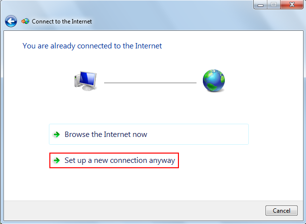
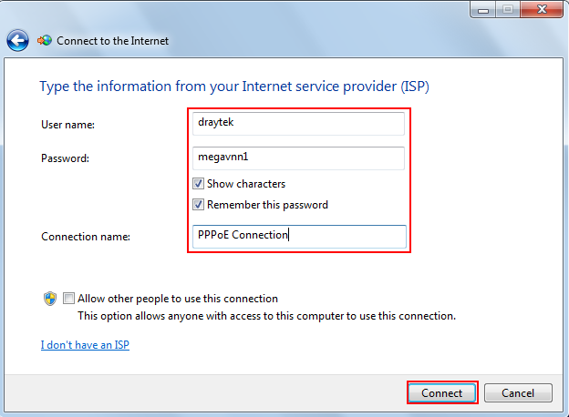
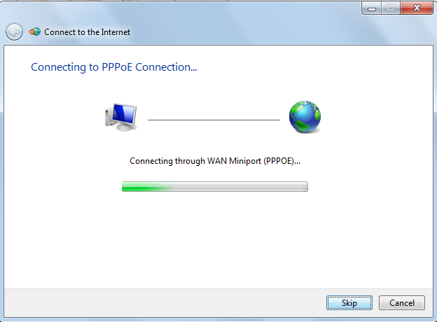
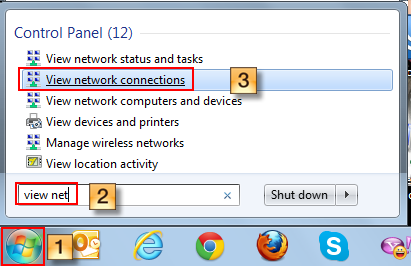
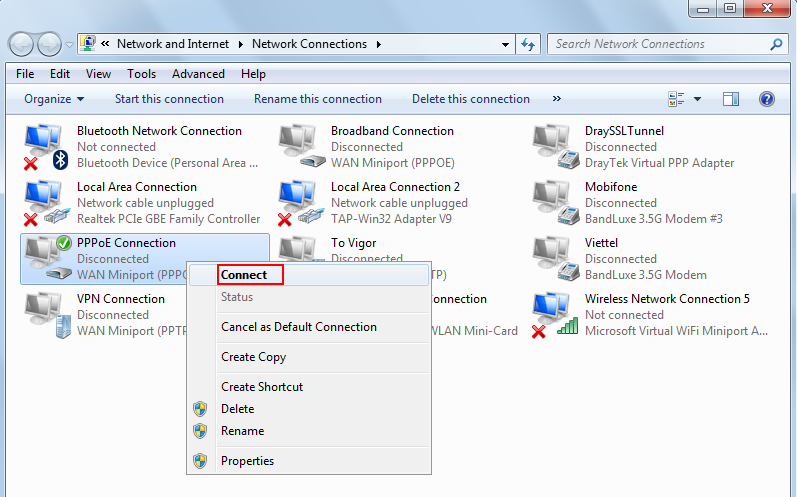
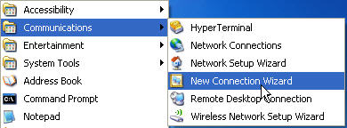
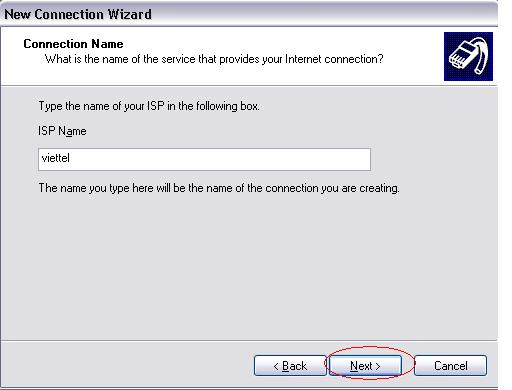

### Các bước cấu hình PPPoE trên máy tính

#### Cấu hình trên Windows 7
- Bước 1:

- Bước 2:

- Bước 3:

- Bước 4:

- Bước 5:

- Bước 6: Điền User và password của đường truyền internet vào

- Bước 7:

- Bước 8: Nếu không thể kết nối internet ở Bước 7, chúng ta tiếp
tục hoàn thành quá trình tạo sẳn một kết nối PPPoE và sẽ kết nối lại sau

- Bước 9:

- Bước 10: Vào lại kết nối PPPoE vừa tạo

- Bước 11: Nhấp phải chuột vào PPPoE Connection chọn Connect

- Bước 12:

#### Cấu hình trên Windows XP

- Bước 1:

- Bước 2:

- Bước 3:

- Bước 4:

- Bước 5:

- Bước 6:

- Bước 7:

