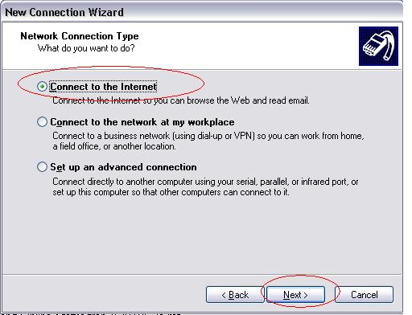

**Các bước cấu hình PPPoE trên máy tính**

**A. Cấu hình trên Windows 7**\
**Bước 1:**

{width="4.28125in"
height="3.6458333333333335in"}

**Bước 2:**

{width="5.208333333333333in"
height="3.8020833333333335in"}

**Bước 3:**

{width="5.208333333333333in"
height="3.8125in"}

**Bước 4:**

{width="5.208333333333333in"
height="3.78125in"}

**Bước 5:**

{width="5.208333333333333in"
height="3.8333333333333335in"}

**Bước 6:** Điền User và password của đường truyền internet vào

{width="5.229166666666667in"
height="3.8333333333333335in"}

**Bước 7:**

{width="5.208333333333333in"
height="3.8333333333333335in"}

**Bước 8: **Nếu không thể kết nối internet ở **Bước 7**, chúng ta tiếp
tục hoàn thành quá trình tạo sẳn một kết nối PPPoE và sẽ kết nối lại sau

{width="5.208333333333333in"
height="3.8229166666666665in"}

**Bước 9:**

{width="5.208333333333333in"
height="3.8020833333333335in"}

**Bước 10:** Vào lại kết nối PPPoE vừa tạo

{width="4.28125in"
height="2.7708333333333335in"}

**Bước 11: **Nhấp phải chuột vào **PPPoE Connection** chọn **Connect**

{width="5.208333333333333in"
height="3.2291666666666665in"}

**Bước 12:**

{width="3.7291666666666665in"
height="3.9479166666666665in"}

**\
B. Cấu hình trên Windows XP\
\
Bước 1:**

{width="4.0625in"
height="1.5in"}

**Bước 2:**

{width="5.333333333333333in"
height="4.083333333333333in"}

**Bước 3:**

{width="5.333333333333333in"
height="4.052083333333333in"}

**Bước 4:**

{width="5.333333333333333in"
height="4.0625in"}

**Bước 5:**

{width="5.333333333333333in"
height="4.0625in"}

**Bước 6:**

{width="5.333333333333333in"
height="4.0625in"}

**Bước 7:**

{width="3.59375in"
height="3.8645833333333335in"}

  
