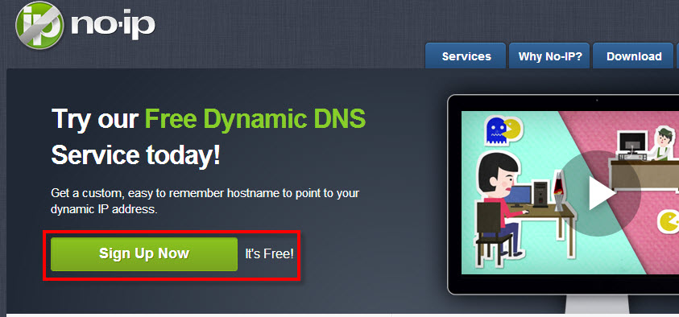

### Hướng dẫn đăng ký trên trang No-ip.com

- Bước 1:  Chúng ta vào
trang [www.no-ip.com](http://www.no-ip.com/) à Nhấp “Create Account”
để tạo tài khoản mới.

- Bước 2: Chúng ta khai báo đầy đủ các thông tin theo yêu cầu và sau
đó check vào “No thanks, I'll use the free hostname”. Sau đó bạn có
thể thấy và nhấn Sign Up để tạo accout free

- Bước 3: Sau khi chúng ta đăng ký thành công no-ip sẽ gửi cho
bạn 1 email kích hoạt tài khoản, bạn vào mail và kích hoạt tài khoản
bạn vừa mới tạo, bằng cách nhấp vào link để kích hoạt.

- Bước 4: Sau đó đăng nhập vào no-ip và click
vào Hosts/Redirects.

 

- Bước 5: Click vào Add a Host để thêm host vào để cấu hình và
quản lý.

- Bước 6: Sau đó chúng ta điền hostname và IP Address, click
vào Create Host để khởi tao.

 

II: Cài đặt NO-IP trên Router Draytek

- Bước 1: Chúng ta vào Applications --&gt; Dynamic DNS Setup
click vào Index 1. Sau đó check vào Enable Dynamic DNS Account, Tại
Service Provider: Ta chọn Service bạn vừa đăng ký (ở hình dưới mình chọn
no-ip), Tại Domain Name: Ta điền Domain bạn vừa đăng ký, Mục User/pass:
Điền tài khoản bạn vừa đăng ký.

- Bước 2: Sau khi khai báo xong vào lại Applications --&gt; chọn
Dynamic DNS Setup, check vào Enable Dynamic DNS Setup à chọn Ok, sau đó
click vào Force Update để cập nhật, tiếp theo click vào View Log. Nếu
thông báo hiện ra như hình dưới thì bạn đã thành công.

Hiện nay có 1 số trang cho phép chúng ta sử dụng Dyndns free
như dyndns.org ( free 1 tháng ), no-ip.com (free),dtdns.com
(free), changeip.com (free) … bạn có thể đăng ký và dùng thử để
lựa chọn ra dyndns mà bạn cho là tốt nhất.
