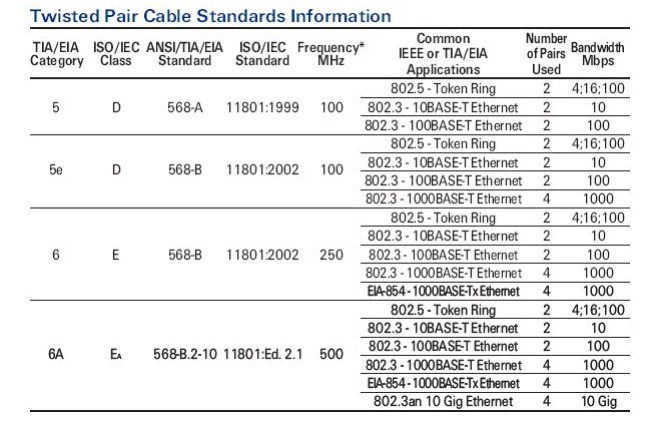
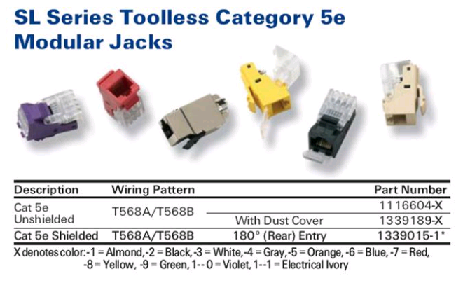
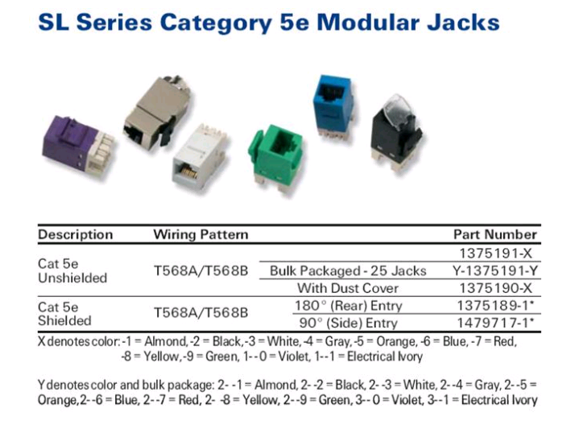
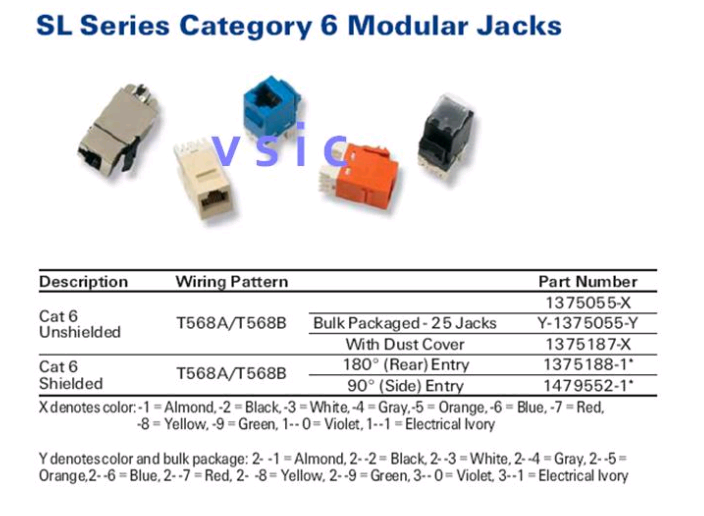
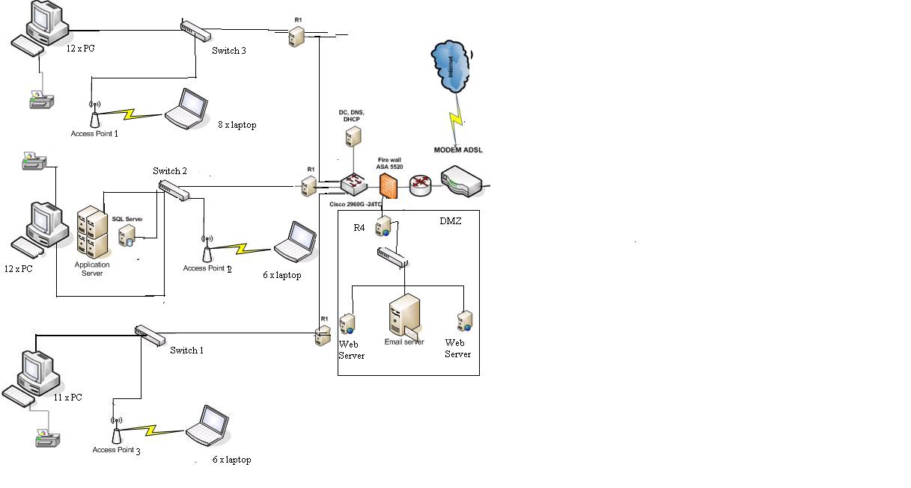
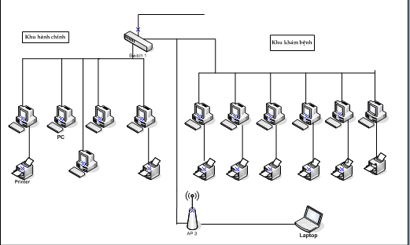
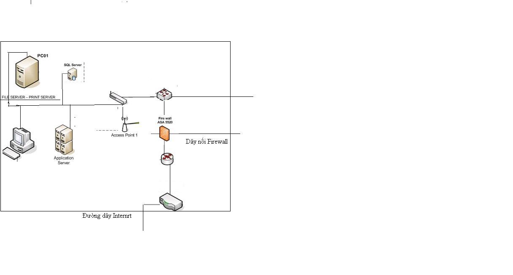
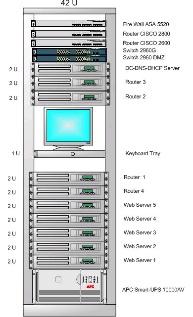
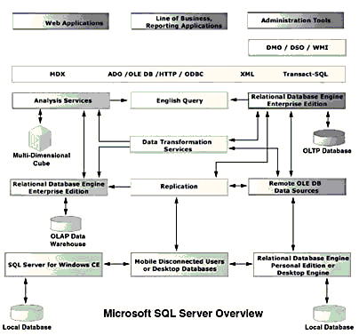

***Thiết kế mạng cho bệnh vịện đa khoa Đông Anh với sự đầu tư của Đức***

Kinh nghiệm của các nước tiên tiến trên thế giới đã chi ra rằng, ứng
dụng công nghệ thông tin trong y tế đã nâng cao đáng kể hiệu quả phục vụ
và giảm thiểu chi phí ở tất cả các bệnh viện thông qua việc lưu trữ, xử
lí, truyền tải thông tin 1 cách hệ thống, nhanh chóng, và chính xác

k

1. Khảo sát hệ thống mạng
-------------------------

\*Thu thập thông tin về bệnh viên thông qua các phương pháp:

-Phương pháp nghiên cứu tài liệu viết:

Sau khi điều tra theo phương pháp này, từ việc tổng hợp tài liệu ta thu
được kết quả như sau:

+Chiến lược của bệnh viện là xây dựng hệ thống mạng trong bệnh viện ở
mức độ hoàn chỉnh, mức độ mở của hệ thống theo quy mô lớn có nghia là
cần bổ sung hay sửa đổi thì có thể mở rộng được một cách đơn giản.

+Kế hoạch tổng thể phát triển hệ thống thông tin: Đôí với cả tổ chức thì
80% số người tham gia đều cho rằng cần phát triển một hệ thống ngay từ
đầu, sau đó sẽ có bổ sung và sửa đổi khi cần thiết. Còn ở từng phòng ban
thì cũng thu dược kết quả tương tự:

Phòng hành chính: 68%

Phòng khám bệnh: 90%

Phòng kế toán: 75%....

+Cơ cấu của bệnh viện này như sau:

1 Chủ tịch hội đồng quản trị và 3 phó chủ tịch thường trực hội đồng quản
trị

1 Trưởng phòng vật tư và thiết bị y tế

1 Trưởng phòng kĩ thuật

1 Giams đốc tài chính kiêm kế toán trưởng

10 Trưởng khoa phòng khám các khoa

20 Bác sĩ và 115 y tá và nhân viên

+Các quuy trình nghiệp vụ của bệnh viện:

Quy trinh khám bệnh và điều trị bệnh là chủ yếu, các quy trình nghiệp vụ
quản lí như quản lí bệnh viện, quản lí bệnh nhân, dự kiến như sau:

Quản lí bệnh nhân

Qủn lí công tác điều trị

Quản lí thuốc và cơ sở vật chất

Quản lí bệnh án điện tử…

\*Sau khi phân tích các kết quả thu được

-Số lượng người dùng từng ứng dụng: mạng máy tính sẽ xây dựng cho 150
cán bộ, bác sĩ, y tá và nhân viên khác sử dụng, như vậy quy mô của mạng
theo đánh giá là tương đối lớn, khả năng tài chính của bệnh viện này cho
hoạt động thiết kế mạng theo đánh giá là tượng đối lớn, đủ để mua các
thiết bị đắt tiền, với khả năng truyền tải tốt, sử dụng công nghệ tiên
tiến, có đủ chi phí để bổ sung thiết bị khi cần thiết

-Các hệ thống phần mềm sẽ được sử dụng trên mạng: mạng sử dụng word
tương đối nhiều, đòi hỏi trao đổi tài liệu nhiều, lưu trữ dữ liệu dạng
text rất quan trọng. Phần mềm dang sử dụng được cung cấp bởi rất nhiều
các nhà cung cấp phần mềm khác nhau, viết trên nhiều ngôn ngữ và hệ quản
trị cơ sở dữ liệu khác nhau theo yêu cầu riêng lẻ của từng phòng ban,
không kết nối được với nhau. Chỉ sử dụng một số thành phần tác nghiệp
đơn lẻ tại các khoa khám bênh, cấp cứu, khoa dược, quản lí nhân sự và
các chương trình kế toán

-Thông tin về nhu cầu về truyền tin của từng trạm: thông tin phải được
truyền ổn định đáp ứng được yêu cầu về công việc của người sử dụng, cung
cấp khả năng kết nối giữa các người dung khác nhau, giữa người dung với
các ứng dụng, tốc độ và độ tin cậy chấp nhận được, thời gian kết nối
nhanh, tốc độ truyền ổn định, mối quan hệ giữa các trạm cũng phải chặt
chẽ và phu hợp, tương thích với nhau dể đảm bảo hệ thống sau khi lắp đặt
hoạt động trơn tru

-Thông tin về người sử dụng mạng: ứng dụng công nghệ thông tin tai bệnh
viện chỉ dừng lại ở việc khai thác công việc văn phòng, thống kê, báo
cáo. Bệnh viện đã ứng dụng công nghệ thông tin quản lí nhưng mới thực
hiện từng phần riêng lẻ như quản lí nhân sự thu viện phí, quản lí kho
dược, đón tiếp bệnh nhân, khám bệnh…Chưa có nhiều kinh nghiệm về trình
độ quản lí

\*Các thông tin phục vụ bản vẽ chi tiết:

-Số lượng trạm và vị trí các ổ cắm mạng:

-Vị trí kích thước của tủ đấu dây mạng

-Độ dài các đoạn cáp giữa các thiết bị

-Trạng thái nhà cửa văn phòng: Bệnh viện có 2 tòa nhà 5 tầng, mõi tầng
diện tích xây dựng khoảng 400m2 (10\*40)

+Nhà A: 5 Tầng

Tầng 1 có 5 phòng khám bệnh, 5 phòng hành chính

Tầng 2 có phòng kĩ thuật, vật tư

Tầng 3, tầng 4 có một số phòng điều trị, phòng nghỉ của các nhân viên

Tầng 5 gồm phòng họp giao ban, phòng tiếp khách, 1 phòng dành riêng cho
giám đốc

+Nhà B: 5 Tầng

Tất cả các chuyên khoa chuyên ngành ở các tầng, cụ thể như sau:

Tầng 1: Cấp cứu

Tầng 2: Khoa răng, hàm, mặt và khoa Tai, mũi, họng

Tầng 3: Khám nội tiết

Tầng 4: Tim mạch

Tầng 5: khoa mắt

Ngoài ra, tất cả các tầng đều có các phong sau:

Phòng điều trị cho bệnh nhân

Phòng nghỉ của nhân viên

Hai tòa nhà nằm song song và cách nhau 25m, giữa hai tòa nhà không có
vật cản nào

 Nhìn chung yêu cầu về hệ thống mạng sau khi lắp đặt phải cá tính thống
nhất trong toàn bệnh viện, dễ phát triển mở rộng, coa khả năng trao đôi
thông tin giữa các phong ban trong bênh viện và với các bệnh viện khác,
dễ quản lí, thân thiện và dễ sử dụng, tiết kiệm kinh phí

2. Phân tích
------------

\*Phân tích mục tiêu của bênh viện: thống nhất các dòng thông tin trong
toàn bệnh viện, trước hết đó là dòng thông tin quản lý, liên quan đến
quản lí nhân sự, quản lý tài chính, quản lí cơ sở vật chất và nhất là
quản lí bệnh nhân, phần cơ bản và đặc trưng nhất trong các bệnh
viện.Tiếp đến là dòng thông tin liên quan đến bệnh nhân, trong đó phân
ra thành bệnh nhân nội trú và bệnh nhân ngoại trú. Mục tiêu của bệnh
viện này là đầu tư để hiện đại hóa mạng với các lắp đặt có thể coi là
hoàn toàn mới

\*Phân tích hệ thống hiện tại: Các nguồn lực hiện tại của mạng ở mức
thấp, phần cứng cưa hệ thống chưa có gì, yêu cầu lắp dặt mới hoàn toàn
với các thiết bị hiện đại, bên cạnh đó là việc xây dựng hệ thống phần
mềm hoàn thiện cho hệ thống máy tính của cả bệnh viện, bên cạnh đó là
điều kiện quản lí của bệnh viện phải tốt hơn trước

\*Phân tích các luồng dữ liệu trên mạng: Yêu cầu truyền dữ liệu của bệnh
viện bản chất là xem các dữ liệu chạy trên luồng, tức là xác định các
topology để các đường nầy không chạy chồng lên nhau, không bị đan chéo
nhau gây nghẽn dường truyền , có nghĩa là phải xác định khu vực nào cần
lưu lượng lớn, khu vực nào cần lưu lượng nhỏ, khu vực nào cần biệt lập
(thiết kế mạng con), từ đó xác định xem khu vực nào cần các thiết bị đắt
tiền, khu vực nào cần thiết bị ít tiền hơn.Ở bệnh viện này khu vực khám
bệnh cần lưu lượng đường truyền lớn nhất, các khu vực khác thì lưu lượng
nhỏ hơn

Phân lớp dữ liệu:

-Dữ liệu công khai (Public): Là dạng dữ liệu mà ai cũng có thể thấy, tất
cả những ai có nhu cầu quan tâm tới bệnh viện này đều có thể truy cập
vào để tìm kiếm thông tin cần thiết

-Khách hàng (Partner): Ở đây là các nhà cung cấp vật tư thiết bị y tế
cho bệnh viện có thể truy cập vào được để lấy thông tin

-Nội bộ (Employee Only): Những thông tin mà chỉ có các nhân viên, các y
tá, bác sĩ có thể truy cập vào được

-Dữ liệu cần che giấu (Confidential): Điển hình là các thông tin về tài
chính của bệnh viện, số điện thoại, địa chỉ, tiểu sử bệnh tạt của bệnh
nhân…

-Thông tin pháp lý (Legal Information): Quy định cho một số lượng người
truy cập nhất định

-Dữ liệu bí mật (Secret-Top): Liên quan đến các dữ liệu về tri thức, ví
dụ như những công trình nghiên cứu chưa được công bố hoặc đang trong
thời gian nghiên cứu

 Từ đó phải phân quyền cho các đối tượng truy cập

3. Phác thảo thiết kế
---------------------

Nhận định chung: qui mô mạng vừa với các thiết bị phân tán.2 tòa nhà nối
xa khoảng 25m và không có vật cản  giữa hai tòa nhà sử dụng cáp đồng
trục dày, giữa 2 switch dùng cáp UTP CAT 5. Trong tòa nhà dùng Star
Topology dễ tách ra các đoạn mạng mở, biết lưu lượng trong mạng được 1
switch quản lí.Giữa hai tòa nhà dùng Bus Topology.

> \*Các thiết bị được sử dụng trong mạng
>
> a\) Card mạng (Network Interface Card-NIC):
>
> -Là một thiét bị điện tử, có chức năng liên kết các nút mạng
>
> -Lắp đặt tại khe mở rộng của máy tính (expansion plot)
>
> -Ngày nay được thiết kế trên mainboad, có thể cắm qua cổng PCMCIA lắp
> cho laptop (là một loại plot mở rộng và cổng này có thể cắm các thiết
> bị mở rộng như card mạng, card không dây, modem, cổng 1394)
>
> -Nhiện vụ quan trọng nhất của NIC là truyền dữ liệu từ nút này sang
> nút khác của hệ thống
>
> -Chức năng cơ bản là chuẩn bị dữ liệu, gửi dữ liệu, kiểm soát luồng dữ
> liệu giữa máy tính và hệ thống card. Người ta còn sử dụng cho các
> thiết bị khác như camera, máy in…chạy ở tầng Physical
>
> b\) Bộ dẫn đường (Router)
>
> -Chức năng cơ bản là nối các mạng với giao thức và kiến trúc mạng khác
> nhau, có chức năng định tuyến (quyết định tuyến đường tốt nhất để
> truyền dữ liệu), sàng lọc lượng phát rộng trên các mạng vì vậy có thể
> liên kết các mạng cục bộ (tích hợp các thiết bị khác) và liên kết các
> mạng diện rộng
>
> -Router sử dụng bảng routing table (bảng định tuyến) để thực hiện chức
> năng định tuyến, routing table chứa địa chỉ của các nút mạng, bảng
> liệt kê các thông tin sau:
>
> +Toàn bộ sổ địa chỉ mạng
>
> +Cách kết nối vào các mạng khác
>
> +Các lộ trình có thể có giữa các bộ định tuyến
>
> +Phí tổn truyền dữ kiệu qua các lộ trình đó
>
> Khi kết nối router tự lập bảng routing table và khi có yêu cầu nó tự
> động tìm đường đi ngắn nhất và truyền dữ liệu đi
>
> c\) Bức tường lửa
>
> -Là phần cứng chạy trên phần mềm (OS) riêng của nó, có hệ điều hành
> riêng, chức năng làm trung gian giữa mạng chính và mạng ngoàikiểm
> soát và chống sự truy cập trái phép
>
> -Firewall chỉ mở các cổng cho các dịch vụ chuẩn nên về cơ bản có thể
> diệt được virut nhưng chỉ diệt ở mức tương đối.Thực tế nếu không làm
> như vậy sẽ gây ra nghẽn mạng nên chặn được virut hay không còn phụ
> thuộc vào cấu hình cụ thể
>
> d\) Modem (Modulation-Demodulation)
>
> Modem ADSL
>
> ADSL (Asymmetric Digital Subscriber Line)-Đường thuê bao số bất đối
> xứng
>
> ADSL cho phếp truyền dữ liệu và truy nhập Internet tốc độ cao qua
> đường dây điện thoại
>
> ADSL là một trong những kết nối Internet phổ biến cung cấp băng thông
> lớn cò gọi là mạng băng rộng
>
> ADSL có thể truyền qua cáp đồng đặc biệt hoặc qua điện thoại (ADSL
> truyền dữ liệu dạng Digital nên không ảnh hưởng đến đường truyền
> Analog của sóng điện thoại); nhưng ADSL sử dụng bộ chia (spliter) tách
> tín hiệu với tần số đặc biệt để tách tín hiệu mạng và điện thoại
>
> Công nghệ ADSL sử dụng phần lớn kênh truyền cho việc tải dữ liệu xuống
> (download) và chỉ dành một phần nhỏ cho việc đưa dữ liệu lên (up
> load). Trên lí thuyết, tốc độ tair xuống của ADSL có thẻ đạt 8 Mbps,
> còn tải lên là 64 Kbps. Tốc độ truy cập Internet qua Modem quay số
> thông thường thì tốc độ tải xuống cuẩ ADSL cao gấp 40 lần, còn nếu so
> sánh với công nghệ truy nhập ISDN thì cao gấp 60 lần
>
> e\) Thiết bị mạng không dây
>
> Môi trường truyền dẫn ở đây là truyền qua song vô tuyến với tần số
> khác nhau
>
> Accesspoint: Là thiết bị chung chuyển giữa mạng không dây và mạng có
> dây; đóng vai trò như một Hub
>
> Accesspoint Bridge: Kết nối hai mạng với nhau
>
> f\) Các phương tiện truyền dẫn (Tranmission media)
>
> +Dây cáp mạng: truyền dữ liệu, các bit thông tin từ điểm này đến điểm
> kia
>
> Cáp đồng: có 2 loại là cáp xoắn và cáp đồng trục
>
> Cấu tạo từ các nhóm gồm 2 hoặc 4 đôi dây
>
> • Mỗi đôi dây gồm 2 dây dẫn được bọc cách điện xoắn lại với nhau, tạo
> thành một đường truyền dẫn cân
>
> bằng
>
> • Các công nghệ cũ chỉ dùng 2 đôi dây cho một kết nối
>
> – Ethernet & Fast Ethernet dùng các chân 1, 2, 3, và 6
>
> – Token Ring dùng các chân 3, 4, 5, và 6
>
> • Các công nghệ gần đây (như Gigabit Ethernet) tận dụng
>
> cả 4 đôi dây để truyền đồng thời từ 2 hướng.
>
> - UTP: cáp đôi không bọc kim lọai, chống nhiễu kém
>
> Bảng sau liệt kê các thông số của các loại cáp thông dụng hiện nay CAT
> 5, CAT 5E, CAT 6, CAT 6E
>
> {width="6.236111111111111in"
> height="4.457638888888889in"}Hình ảnh và thông số một số đầu nối cáp:
>
> {width="6.116666666666666in"
> height="4.208333333333333in"}
>
> {width="6.1125in"
> height="3.879166666666667in"}
>
> {width="6.248611111111111in"
> height="5.375in"}
>
> \*Các thiết bị cụ thể được dùng như sau:
>
> -Danh sách các server:
>
> +File Server: Các máy lưu trữ file cho khu vực hành chính, khu vực
> khám bệnh, khu vực chuyên khoa chuyên ngành khác và khu vực điều trị
>
> +SQL Server: Máy cơ sở dữ liệu cho bộ phận kế toán tài chính
>
> +DC, DNS, DHCP System
>
> +APP Server: Quản lí các dự án
>
> +R1, R2, R3, R4: Các máy window server 2003 sử dụng dịch vụ RRAS làm
> bộ định tuyến
>
> -Danh sách các thiết bị:
>
> 1\. Switch
>
> -Nhà A, Tầng 2: 1 switch Cisco 24 port 100 Mbps
>
> -Nhà A, Tầng 4: 1 switch Cisco 24 port 100 Mbps
>
> -Nhà B, Tầng 2: 1 switch Cisco 24 port 100 Mbps
>
> -DMZ 1 switch 12 port 100Mbps
>
> 2\. Backbone
>
> Sử dụng Switch 1Gbit
>
> Cable CAT 6E STP
>
> 3\. Router
>
> 2 Router Cisco
>
> 4\. Firewall
>
> Sử dụng bộ Cisco ASA 5520 4 port để ngăn cách LAN, DMZ, Internet

\*Bảng phân bố địa chỉ IP

  ---------- -------- ---------------------------- ---------------
  Nhà A      Tầng 1   172.19.4.1- 172.19.10.254    255.255.252.0
                                                   
                      192.19.11.1- 172.19.16.254   

             Tầng 2   172.19.17.1- 172.19.20.254   255.255.252.0

             Tầng 4   172.19.21.1- 172.19.24.254   255.255.252.0

  Nhà B      Tầng 2   172.19.25.1- 172.19.28.254   255.255.252.0

             Tầng 4   172.19.29.1- 172.19.32.254   255.255.252.0

  Backbone            172.19.0.1- 172.19.3.254     255.255.252.0
  ---------- -------- ---------------------------- ---------------

Mạng LAN khác gồm 6 Web Server:

Địa chỉ IP: 172.19.33.1- 172.19.39.254 SubnetMask: 255.255.255.252

Địa chỉ IP đã đăng kí với ISP:

207.46.23.193-207.46.230.224 Subnet Mask: 255.255.255.224

> \*Phác thảo thiết kế:

1\. Ở nhà B ta thiết kế một mạng LAN riêng biệt, mạng này được nối với
khu vực trung tâm mạng đặt ở tầng 2 nhà A thông qua một đường dây đồng
trục (do đường truyền dữ liệu đi qua đây sẽ có mật độ tương đối cao) để
đảm bảo tốc độ truyền

2\. Đường dây đi trong máng để tránh các tác động bên ngoài không tốt như
va chạm, thời tiết… ngoài ra cũng để tránh lãng phí những khoảng không
gian để sử dụng vào việc khác, cũng để tăng tính thẩm mĩ cho bệnh viện

3\. Các Access Point được đặt để đảm bảo khu vực phủ song của cả hi tòa
nhà (với bán kính phủ song là 30m)

4\. Lắp đặt các thiết bị như bản thiết kế

> \*Mô hình vật lí chung của các phòng ban và trung tâm mạng:

{width="12.5375in"
height="6.802083333333333in"}

Mô hình vật lí tầng 1:

{width="6.370138888888889in"
height="3.25in"}

> \*Giaỉ thích:

-Mạng gồm 3 mạng LAN. Các mạng LAN này phải đi qua 1 Firewall trước khi
đến Router

- Khu DMZ (Data Management Zone)

Bao gồm Switch 1 và các Server Web, Email, Proxy

Đây là khu vực giao tiếp với bên ngoài của một mạng cục bộ. Các truy cập
từ bên ngoài (môi trường Internet) chỉ có thể truy cập được tới khu vực
này của mạng nội bộ. Vì các cổng của Server đều được mở để có thể giao
tiếp với môi trường bên ngoài, nên khu vực này rất dễ bị tấn công. Chính
vì vậy, xuất phát từ yêu cầu bảo mật, khu vực này được lắp đặt riêng,
không nối trực tiếp với một máy nào khác trong mạng LAN của bệnh viện ,
và được kiểm soát bởi firewall khi giao tiếp với môi trường bên ngoài.

Tuy khả năng bị tấn công cao, nhưng khu vực DMZ này là rất cần thiết cho
mạng nội bộ của bệnh viện

-Máy client trong mỗi tầng sẽ nhận địa chỉ IP từ máy Server DHCP

-Các router 1, 2, 3 sẽ có them chức năng DHCP Relay Agentđể tiếp âm các
yêu cầu xin IP từ máy Client đến máy DHCP

-Switch Backbone sử dụng là loại có 12 port 1Gbit

> \*Bảng các mối nối:

  --------------------- -----------------------------
  Mối nối               Tên cổng

  PCSwitch             Switch FastEthernet

  PrinterPC            USB

  Access PointSwitch   Access Point FastEthernet &
                        
                        Switch FastEthernet

  SwitchFirewall       Firewall FastEthernet &
                        
                        Switch FastEthernet

  ServerSwitch         Switch FastEthernet

  FirewallRouter       Firewall FastEthernet &
                        
                        Router FastEthernet

  RouterModem          Router FastEthernet &
                        
                        Modem FastEthernet
  --------------------- -----------------------------

> \*Mô hình logic:

4. Thiết kế chi tiết
--------------------

Mô hình mạng của bệnh viện gồm cả mạng không dây và mạng có dây, trong
đó mạng không dây được liên kết vào mạng chung thông qua AccessPoint.

> \*Mạng có dây:

-Mạng gồm các mạng LAN nhỏ, có băng thông rộng, được xây dựng trên nền
tảng công nghệ tốc đọ truyền dẫn cao, sử dụng hệ thống UTP CAT 5, STP
CAT 6 và hệ thống cáp đồng trục

-Các máy tính ở nhà B được liên kết với nhau tạo thành một mạng LAN nhỏ
và liên kết vào mạng chung của toàn bệnh viên thông qua Switch 1

-Các máy tính ở nhà A được liên kết với nhau thông qua Switch 2, Switch
3

-Khu trung tâm mạng nằm ở tầng 2 nhà A, tại đây đặt các mý chủ có cài
đặt các chương trình của bệnh viện như:

+Quản lí bệnh nhân

+Quản lí công tác điều trị

+Quản lí thuốc và cơ sở vật chất

+Quản lí bệnh án điện tử

…

-Firewall nằm giữa Router và mạng nội bộ của bệnh viện. Nó được nối với
router và 3 Switch (1, 2, 3). Chức năng của nó là kiểm soát đường
truyền; chống virut , các truy cập bất hợp pháp ; tăng cường tính bảo
mật và đồng thời cũng đóng vai trò là một Proxy server của mạng nội bộ
của bệnh viện. Nó được cấp phát một IP tĩnh của nhà cung cấp.

> \*Mạng không dây:

Mạng không dây được xây dựng trên chuẩn IEEE 802.11g, tần số 2.4 GHz,
tốc độ 54 Mbps.

Mạng không dây bao gồm các máy Laptop, được kết nối vào mạng chung thông
qua các Access Point.

Access Point được cấu hình để có IP tĩnh. Các máy Laptop sẽ tự động nhận
được IP của mình thông qua DHCP server, và cũng tự động nhận kênh truyền
(chanel) của AP.

Để tránh hiện tượng xung đột sóng , các AP phải được đặt kênh truyền
cách xa nhau

Các AP có cùng dải SSID (Service Set Identifier), tên của mạng để các
máy Laptop có thể truy cập được .

Các AP được bố trí để tầm phủ sóng có thể phủ kín khu vực mạng của bệnh
viện và không bị mất mạng khi di chuyển giữa 2 toà nhà.

> \*Mô hình khu vực trung tâm mạng (tầng 2, nhà A)

{width="12.5375in"
height="6.802083333333333in"}

> \*Tủ thiết bị được đặt ở trung tâm mạng

{width="4.0625in"
height="6.677083333333333in"}

> \*Lập kế hoạch cà thi công hệ thống cáp:

-Giữa các phòng trong cùng một tầng có các đường kết nối cáp ngang.

-Đường kết nối trục chính được dùng để liên kết giữa các tầng của tòa
nhà.

-Sau khi đã xá định được vị trí đặt cáp tiến hành lắp đặt các đường cáp
ngang và cáp trục

-Bấm đầu cuối cáp

-Kết thúc đầu cuối cáp tại khu vực làm việc, hộp phân phối và đầu vào
các phòng của các tòa nhà

-Khi thi công lắp đặt cáp phải chú ý lực kéo tối đa của cáp UTP là
25lbs/ft, tránh các vật hoặc góc nhọn, bén; kéo cáp đi vòng tránh các
vật cản; tránh dẫm đạp lên cáp, chú ý trọng lượng của các bó cáp trong
máng; tránh đặt cáp gần các nguồn nhiễu như dây điện, moto điện, đèn
huỳnh quang…; đi cáp trong máng (ống) kim loại có thể giúp giảm ảnh
hưởng của EMI; nếu đi cáp trần hoặc trong ống phi kim phải đảm bảo
khoảng cách tối thiểu 120 mm từ nguồn nhiễu; tránh đi cáp qua các vùng
có nhiệt độ cao, những nơi ẩm ướt, tránh làm cáp bị xoắn khi kéo…

5. Phần mềm
===========

-Hệ điều hành mạng cho các máy chủ: Sử dụng hệ điều hành WINDOW SERVER
2003 vì Window Serser 2003 là hệ điều hành đa dụng với các dịch vụ chủ
yếu như:

+File Server (phục vụ tệp tin): Quản trị hệ thống thư mục, file. Dịch vụ
Files server trên máy chủ thiết kế hệ thống thư mục cho người dung và
tạo các thư mục chung, tạo các share và gán quyền truy cập cho các
users. Dịch vụ Files server trên máy người dùng giúp người dùng login
vào mạng (để có thể login vao mạng user phải được gán hai quyền hạn là
quyền Right và quyền Permission), và map tài nguyên (ánh xạ tài nguyên
trên mạng thành tài nguyên của máy cục bộ)

+Print Server (dịch vụ in ấn): máy in muốn in được thì phải được cắm vào
một máy tính và coi máy in là một phần tài nguyên của mạng dể có thể
chia sẻ cho những người dùng khác nhau, máy in phải được kết nối vào
Server và cài đặt cho Server nhận biết được.Sau khi kết nối thì coi máy
in như một thành phần của mạng. Muốn in ấn trên mạng thì user phải có đủ
thẩm quền Right và Permission, trong đó việc gán quyền in điều khiển sử
dụng máy có các Permission sau:

Print: chỉ được quyền in

Manager Printer: quyền quản lí máy in

Manager Document: quyền quản lí tài tài liệu in ấn như tạm dừng in, xóa
các tác vụ in…

+Web Server (dịch vụ Web): Web Server là máy chủ có dung lượng lớn, tốc
độ cao, được dùng để lưu trữ thông tin như một ngân hàng dữ liệu, chứa
những website đã được thiết kế cùng với những thông tin liên quan
khác.(các mã Script, các chương trình, và các file Multimedia). Web
Server có khả năng gửi đến máy khách những trang Web thông qua môi
trường Internet (hoặc Intranet) qua giao thức HTTP - giao thức được
thiết kế để gửi các file đến trình duyệt Web (Web Browser), và các giao
thức khác.Tất cả các Web Server đều có một địa chỉ IP (IP Address) hoặc
cũng có thể có một Domain Name. Giả sử khi bạn đánh vào thanh Address
trên trình duyệt của bạn một dòng http://www.abc.com sau đó gõ phím
Enter bạn sẽ gửi một yêu cầu đến một Server có Domain Name là
www.abc.com.Server này sẽ tìm trang Web có tên là index.htm rồi gửi nó
đến trình duyệt của bạn. Bất kỳ một máy tính nào cũng có thể trở thành
một Web Server bởi việc cài đặt lên nó một chương trình phần mềm Server
Software và sau đó kết nối vào Internet.Khi máy tính của bạn kết nối đến
một Web Server và gửi đến yêu cầu truy cập các thông tin từ một trang
Web nào đó, Web Server Software sẽ nhận yêu cầu và gửi lại cho bạn những
thông tin mà bạn mong muốn.Giống như những phần mềm khác mà bạn đã từng
cài đặt trên máy tính của mình, Web Server Software cũng chỉ là một ứng
dụng phần mềm. Nó được cài đặt, và chạy trên máy tính dùng làm Web
Server, nhờ có chương trình này mà người sử dụng có thể truy cập đến các
thông tin của trang Web từ một máy tính khác ở trên mạng (Internet,
Intranet).Web Server Software còn có thể được tích hợp với CSDL
(Database), hay điều khiển việc kết nối vào CSDL để có thể truy cập và
kết xuất thông tin từ CSDL lên các trang Web và truyền tải chúng đến
người dùng.Server phải hoạt động liên tục 24/24 giờ, 7 ngày một tuần và
365 ngày một năm, để phục vụ cho việc cung cấp thông tin trực tuyến.Vị
trí đặt server đóng vai trò quan trọng trong chất lượng và tốc độ lưu
chuyển thông tin từ server và máy tính truy cập.

+Mail Server: mail server là máy chủ dùng để nhận và gửi mail với các
chức năng chính:

1.  Quản lí Account

2.  Nhận mail của người gửi (của những người có account) và gửi cho
    người nhận hoặc mail server của người nhận

3.  Nhận mail từ mail server của người gửi (từ bên ngoài) và phân phối
    mail cho người trong hệ thống

Tùy thuộc vào việc cài đặt mà mail server cho phép người dùng sử dụng
web-mail (web) để nhận mail (giống yahoo), hay cho phép sử dụng outlook
(application), hay cả hai (giống như gmail)

Còn web proxy là một máy trung gian có quyền đi ra internet (bên ngoài)
và cho phép những người trong hệ thông (bên trong) truy cập web thông
qua máy đó

-Các giao thức

+TCP\\IP

-Hệ quản trị cơ sở dữ liệu: sử dụng hệ quản trị cơ sở dữ liệu SQL Server
2000

SQL Server 2000 là một hệ thống quản lý cơ sở dữ liệu (Relational
Database Management System (RDBMS) ) sử dụng **Transact-SQL** để trao
đổi dữ liệu giữa Client computer và SQL Server computer. Một RDBMS bao
gồm databases, database engine và các ứng dụng dùng để quản lý dữ liệu
và các bộ phận khác nhau trong RDBMS.

SQL Server 2000 được tối ưu để có thể chạy trên môi trường cơ sở dữ liệu
rất lớn (Very Large Database Environment) lên đến Tera-Byte và có thể
phục vụ cùng lúc cho hàng ngàn user. SQL Server 2000 có thể kết hợp "ăn
ý" với các server khác như Microsoft Internet Information Server (IIS),
E-Commerce Server, Proxy Server....

Một chút kiến thức về các Version của SQL Server

SQL Server của Microsoft được thị trường chấp nhận rộng rãi kể từ
version 6.5. Sau đó Microsoft đã cải tiến và hầu như viết lại một engine
mới cho SQL Server 7.0. Cho nên có thể nói từ version 6.5 lên version
7.0 là một  bước nhảy vọt. Có một số đặc tính của SQL Server 7.0 không
tương thích với version 6.5. Trong khi đó từ Version 7.0 lên version 8.0
(SQL Server 2000) thì những cải tiến chủ yếu là mở rộng các tính năng về
web và làm cho SQL Server 2000 đáng tin cậy hơn.

Một điểm đặc biệt đáng lưu ý ở version 2000 là **Multiple-Instance**.
Nói cho dễ hiểu là bạn có thể install version 2000 chung với các version
trước mà không cần phải uninstall chúng. Nghĩa là bạn có thể chạy song
song version 6.5 hoặc 7.0 với version 2000 trên cùng một máy (điều này
không thể xảy ra với các version trước đây). Khi đó version cũ trên máy
bạn là **Default Instance** còn version 2000 mới vừa install sẽ là
**Named Instance**.

Các thành phần quan trọng trong SQL Server 2000

SQL Server 2000 được cấu tạo bởi nhiều thành phần như Relational
Database Engine, Analysis Service và English Query.... Các thành phần
này khi phối hợp với nhau tạo thành một giải pháp hoàn chỉnh giúp cho
việc lưu trữ và phân tích dữ liệu một cách dễ dàng.

{width="5.247916666666667in"
height="3.9270833333333335in"}

**Relational Database Engine** - Cái lõi của SQL Server:

Ðây là một engine có khả năng chứa data ở các quy mô khác nhau dưới dạng
table và support tất cả các kiểu kết nối (data connection) thông dụng
của Microsoft như ActiveX Data Objects (ADO), OLE DB, and Open Database
Connectivity (ODBC). Ngoài ra nó còn có khả năng tự điều chỉnh (tune up)
ví dụ như sử dụng thêm các tài nguyên (resource) của máy khi cần và trả
lại tài nguyên cho hệ điều hành khi một user log off.

**Replication** - Cơ chế tạo bản sao (Replica):

Giả sử bạn có một database dùng để chứa dữ liệu được các ứng dụng thường
xuyên cập nhật. Một ngày đẹp trời bạn muốn có một cái database giống y
hệt như thế trên một server khác để chạy báo cáo (report database) (cách
làm này thường dùng để tránh ảnh hưởng đến performance của server
chính). Vấn đề là report server của bạn cũng cần phải được cập nhật
thường xuyên để đảm bảo tính chính xác của các báo cáo. Bạn không thể
dùng cơ chế back up and restore trong trường hợp này. Lúc đó cơ chế
replication của SQL Server sẽ được sử dụng để bảo đảm cho dữ liệu ở 2
database được đồng bộ (synchronized)

**Data Transformation Service (DTS)** - Một dịch vụ chuyển dịch data vô
cùng hiệu quả

Nếu bạn làm việc trong một công ty lớn trong đó data được chứa trong
nhiều nơi khác nhau và ở các dạng khác nhau cụ thể như chứa trong
Oracle, DB2 (của IBM), SQL Server, Microsoft Access....Bạn chắc chắn sẽ
có nhu cầu di chuyển data giữa các server này (migrate hay transfer) và
không chỉ di chuyển bạn còn muốn định dạng (format) nó trước khi lưu vào
database khác, khi đó bạn sẽ thấy DTS giúp bạn giải quyết công việc trên
dễ dàng như thế nào.

**Analysis Service** - Một dịch vụ phân tích dữ liệu rất hay của
Microsoft

Dữ liệu (Data) chứa trong database sẽ chẳng có ý nghĩa gì nhiều nếu như
bạn không thể lấy được những thông tin (Information) bổ ích từ đó. Do đó
Microsoft cung cấp cho bạn một công cụ rất mạnh giúp cho việc phân tích
dữ liệu trở nên dễ dàng và hiệu quả bằng cách dùng khái niệm hình khối
nhiều chiều (multi-dimension cubes) và kỹ thuật "đào mỏ dữ liệu" (data
mining)

**English Query**

Một dịch vụ mà người Việt Nam chắc là ít muốn dùng. Ðây là một dịch vụ
giúp cho việc query data bằng tiếng Anh "trơn" (plain English).

**Meta Data Service**:

Meta data là những thông tin mô tả về cấu trúc của data trong database
như data thuộc loại nào String hay Integer..., một cột nào đó có phải là
Primary key hay không....Bởi vì những thông tin này cũng được chứa trong
database nên cũng là một dạng data nhưng để phân biệt với data "chính
thống" người ta gọi nó là Meta Data.Phần này chắc là bạn phải xem thêm
trong một thành phần khác của SQL Server sắp giới thiệu sau đây là **SQL
Server Books Online** vì không có bài nào trong loạt bài này nói rõ về
dịch vụ này cả.

**SQL Server Books Online**:

Cho dù bạn có đọc các sách khác nhau dạy về SQL server thì bạn cũng sẽ
thấy books online này rất hữu dụng và không thể thiếu được (cho nên
Microsoft mới hào phóng đính kèm theo SQL Server).

**SQL Server Tools** - Ðây là một bộ đồ nghề của người quản trị cơ sở dữ
liệu (DBA )

-   Ðầu tiên phải kể đến **Enterprise Manager**. Ðây là một công cụ cho
    ta thấy toàn cảnh hệ thống cơ sở dữ liệu một cách rất trực quan. Nó
    rất hữu ích đặc biệt cho người mới học và không thông thạo lắm
    về SQL.

-   Kế đến là **Query Analyzer**. Ðối với một DBA giỏi thì hầu như chỉ
    cần công cụ này là có thể quản lý cả một hệ thống database mà không
    cần đến những thứ khác. Ðây là một môi trường làm việc khá tốt vì ta
    có thể đánh bất kỳ câu lệnh SQL nào và chạy ngay lập tức đặc biệt là
    nó giúp cho ta debug mấy cái stored procedure dễ dàng.

-   Công cụ thứ ba cần phải kể đến là **SQL Profiler**. Nó có khả năng
    "chụp" (capture) tất cả các sự kiện hay hoạt động diễn ra trên một
    SQL server và lưu lại dưới dạng text file rất hữu dụng trong việc
    kiểm soát hoạt động của SQL Server.

-   Ngoài một số công cụ trực quan như trên chúng ta cũng thường hay
    dùng **osql** và **bcp** (bulk copy) trong command prompt.

-Hệ thống phần mềm:

Các máy tính cá nhân gồm Desktop và Laptop đều cài đặt hệ điều hành
Window XP Service Pack 2 ; phần mềm văn phòng Microsoft Ofice ; phần mềm
Client của các phần mềm ứng dụng trong server

6. Các giải pháp kĩ thuật khác 
===============================

-Giải pháp Back up: sao lưu 100% giống như bản cũ, tạo 1 hoặc hơn 1 bản
sao lưu, khi gặp sự cố có thể phục hồi dữ liệu với khả năng phục hồi dữ
liệu cao trong thời gian ngắn và chi phí thấp. Có 3 giải pháp chính:

+ Giải pháp trực tiếp – DAS-Direct Attached Storage: các thiết bị lưu
trữ được lắp đặt trực tiếp trên máy chủ, đơn giản và dễ quản trị, chi
phí chấp nhân được nhưng hệ số an toàn không cao

+ Giải pháp qua mạng –NAS-Network Attached Storage: các thiết bị lưu trữ
được gắn vsò mạng LAN, giải pháp này dựa trên công nghệ File Sharing kết
hợp với hệ điều hành riêng chuyên dụng để cung cấp truy cập cho các host
khác trong mạng, giaỉ pháp này có hệ số an toàn cao hơn giải pháp trực
tiếp DAS

+Mạng lưu trữ riêng biệt – SAN-Storage Area Network: các máy chủ và
thiết bị lưu trữ nối với nhau qua thiết bị chuyển mạch lưu trữ (SAN
switch), giải pháp này cho phép truy cập và lưu trữ thông tin với tốc độ
cao mà không ảnh hưởng đến mạng LAN, mang lại cho hệ thống tính ổn dịnh
và độ bảo mật cao và quản trị mềm dẻo, giải pháp lưu trữ này đặc biệt
phù hợp cho các ứng dụng đòi hởi tốc độ truy cập và tính sẵn sàng cao
như hệ thống cluster, giải pháp này đòi hỏi chi phí rất cao

Một số phầm mềm gắn với thiết bị lưu trữ:

  --------------------------------------- --------------------------------------------------------
  Tên phần mềm                            Thiết bị lưu trữ

  Snap Mirror                             Dùng thiết bị lưu trữ NAS của IBM
                                          
                                          & Net App.

  Enhanced Remove Mirroring               Dùng thiết bị lưu trữ DS4000 của IBM

  Metro Mirroring của IBM                 Các thiết bị lưu trữu sử dụng trong mạng SAN

  HP Open View Storage Mirroring          Lưu trữ củ máy chủ Window, các thiết bị NAS của HP

  HP Storage Work Continuous Access EVA   Dùng sản phẩm từ đĩa HP EVA (Enterprise Virtual Array)
  --------------------------------------- --------------------------------------------------------

\*Backup bằng các thiết bị

Có thể sử dụng kết hợp giữa các cách sau

Backup bằng đĩa DVD: “sử dụng loại đĩa DVD của Clickfree được tích hợp
sẵn tiện ích backup “. Dùng khi khối lượng dữ liệu chỉ khoảng 2, 3 lần
dung lượng đĩa DVD.

Nếu sao lưu bằng ổ USB thì những dung lượng kiểu như 4GB sẽ không thể
đủ, mà thay vào đó là 16GB, 32GB hoặc lớn hơn. Sử dụng USB để backup có
rất nhiều tiện lợi. Trước hết là có thể backup những tài liệu quan trọng
hoặc các tệp tin multimedia trên ổ cứng chỉ bằng ngón tay của bạn, có
thể dễ dàng để trong túi áo hoặc treo vào móc khóa. Rất nhiều ổ USB có
phần mềm mã hóa bằng mật khẩu, chính vì thế bạn không lo là dữ liệu của
mình sẽ vô tình bị đánh cắp. Có thể nói SanDisk luôn đi đầu trong lĩnh
vực backup bằng USB

Với khối lượng dữ liệu cần backup lớn, ta chọn giải pháp sử dụng Tape
Driver , một công cụ cũng khá phổ biến hiện nay , muốn mua loai dung
lượng backup cao thì nên mua loại : HP Storageworks Ultrium 1 hoặc
ultrium 2 hỗ trợ mấy loại băng từ dung lượng cao khoảng 200 Gb trở lên .
Hoặc sử dụng Portable Backup Storage Appliance 320GB (180USD) , Chỉ cần
kết nối thiết bị vào máy tính là nó sẽ tự động backup các tệp tin, bao
gồm nhạc, phim, ảnh và e-mail. Portable Backup Storage Appliance (PBSA)
kết nối qua cổng USB máy tính và có nhiều dung lượng để lựa chọn, từ
120GB tới 250GB và thậm chí là 500GB .

Ta nên sử dụng kết hợp các công cụ backup trên để đảm bảo dữ liệu được
an toàn.

-Một số giải pháp về an ninh mạng:

+Mạng riêng ảo (Vitural Private Network)

+Nhận thhực

+Mã hóa

+Ghi nhật kí

+Chữ kí số

+Kiểm soát cổng truyền tin

+Kiểm soát phương tiện truy cập

7. Dự toán kinh phí
-------------------

  ------------------- ----------------------------------------------------------------------------------------------------------- -------------- ----------
  Thiết bị            Tên sản phẩm                                                                                                Gía (VND)      Số lượng
  Máy tính để bàn     Máy tính nguyên chiếc Samsung 200MT                                                                         9,542,400      35
  Máy tính xách tay   Máy tính xách tay Apple 26SD                                                                                18,230,900     20
  Access Point        DLINK-DP G310/E                                                                                             2,880,000      3
  Server              IBM System X35007977R2                                                                                      77,760,000     1
                      IBM System X36507979B4309                                                                                   50,540,000     2
  Router              Thiết bị mạng Cisco 2800 Load Balancing & Security BroadBand router + 4 WAN port connect to 4 ADSL router   13,133,480     1
                      Thiết bị mạng Cisco 2600 Load Balancing & Security BroadBand router + 4 WAN port connect to 4 ADSL router   12,890,880     1
                      Thiết bị mạng Linksys Router AG241 4 Ports RJ45                                                             1,267,000      4
  Firewall            ASA 5520                                                                                                    5,780.850      1
  Modem               **ADSL2/2+ Speed up to 24Mbps MODEM - 01 LAN, 01 USB**                                                      679,202        1
  Máy in              CANON LBP 3300                                                                                              3,492,000      18
  Dây nối             UTP CAT 5E                                                                                                  4000/M         1000m
                      STP CAT 6E                                                                                                  15000/M        100M
  Đầu cắm                                                                                                                         500/cái        100cái
  Tủ mạng             42U                                                                                                         25,690,000     1
  Phần mềm                                                                                                                        90,000,000     
  Tổng tiền                                                                                                                       1,110,270,36   
  ------------------- ----------------------------------------------------------------------------------------------------------- -------------- ----------

**MỤC LỤC**

[***Thiết kế mạng cho bệnh vịện đa khoa Đông Anh với sự đầu tư của
Đức*** 1](#__RefHeading___Toc230092450)

[1. Khảo sát hệ thống mạng 1](#khảo-sát-hệ-thống-mạng)

[2. Phân tích 4](#phân-tích)

[3. Phác thảo thiết kế 6](#phác-thảo-thiết-kế)

[4. Thiết kế chi tiết 18](#thiết-kế-chi-tiết)

[5. Phần mềm 22](#phần-mềm)

[6. Các giải pháp kĩ thuật khác 30](#các-giải-pháp-kĩ-thuật-khác)

[7. Dự toán kinh phí 33](#dự-toán-kinh-phí)
