### Hướng dẫn cài đặt Games và những ứng dụng cần thiết cho phòng máy

Để phòng máy đáp ứng được hầu hết nhu cầu sử dụng của khách hàng, chúng
ta cần cài các Games và một số ứng dụng cần thiết, cụ thể như sau:

1) Games

- Online:
1. Kiếm thế.
2. Võ lâm truyền kỳ
I và [II](http://game.zing.vn/vo-lam-truyen-ky2/download/volam2.html?).
3. [Boom
Online](http://download.game.zing.vn/gamemenu/new/Boom-setup-1.61.exe?).
4. Tinh Võ.
5. Chinh Đồ.
6. Thuận Thiên Kiếm.
7. [Hot Step](http://hot.zing.vn/hs/huongdan/taitrochoi.html?).
8. Audition.
9. Fifa online.
10. v.v...

- Offline:
1. Warcraft.
2. Gta vice city.
3. Các Game Mini
4. v.v...

2) Các Ứng dụng

- Office:
1. Microsoft office 2003 hoặc 2007 (Word, Exel, Power Point)
2. Unikey hoặc Vietkey 2007 (Bộ gõ tiếng Việt)
3. Foxit Reader hoặc Adobe Reader (Đọc file .pdf).
4. Bộ Fonts Full (hỗ trợ xem và soạn thảo văn bản).
5. v.v...

- Internet
1. Yahoo Mesenger 11.5 (Phần mềm chat)
2. Nâng cấp Internet Explorer 89
4. [Mozilla Firefox bản mới
nhất](http://www.mozilla.com/vi/firefox/?) (Trình duyệt web tuơng tự như
IE)
5. [Adobe Flash bản mới nhất](http://get.adobe.com/flashplayer/?) (có
tác dụng hiển thị và tương tác với nội dung Flash trên web, ví dụ như
chơi các game Flash)
6. Internet Download Manager 6.19 (Hỗ trợ download file từ Internet)
7. v.v...

- Multimedia
1. [Windows Media Player
11](http://www.mediafire.com/?v1vlgns8hsm8t1g&) (Dùng nghe nhạc và xem
film)
2. [Storm codec7](http://www.mediafire.com/?ucuvb29d3p575b9&) (hỗ trợ
xem được mọi định dạng nghe nhạc, xem film).
3. v.v...

- Phần mềm đóng băng
1. Deep Freeze Standard 7.0 (Phiên bản mới nhất, có thể dùng chung với
CSM 4.3.3)

- Các phần mềm khác
1. TuneUp Utilities (dọn dẹp rác cho máy tính)
2. Winrar 3.93 (Giúp nén và giải nén các files và thư mục trong máy
tính).
3. v.v...

Mỗi Game hoặc phần mềm có một kiểu cài đặt khác nhau. Tuy nhiên, thường
thì bạn nhấn đúp chuột vào file có tên là "Setup" hoặc "Install" rồi
nhấn OK hoặc Next theo như yêu cầu của ứng dụng đó, một số phần mềm có
Serial number thì bạn sẽ nhập Key vào ô trống sau đó nhấn OK hoặc Next
cho đến khi hoàn tất.

Chú ý: Sau khi cài đặt Game hoặc ứng dụng xong, các bạn phải khởi động
lại máy rồi mới sử dụng.

Hầu hết các bạn đã biết cách cài đặt chương trình, nhưng một số thì
chưa, vì vậy mình sẽ hướng dẫn cài đặt chi tiết một Game và một ứng
dụng, bạn nào chưa biết có thể làm tương tự với các Games và ứng dụng
khác nhé!

Hướng dẫn cài Game Boom Online:

Sau khi download file cài đặt Boom Online về, các bạn nhấp đúp chuột và
chạy file Boom-setup-1.61.exe, sau đó bấm nút "Đi tới":

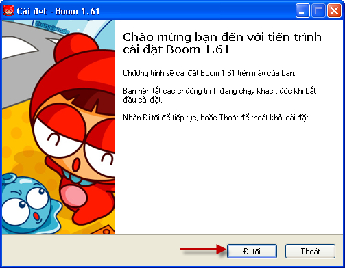
Bấm nút "Đi tới"

Chọn thư mục cài đặt Game, sau đó bấm nút "Đi tới"

Tiếp theo bấm "Đi tới" - "Đi tới"

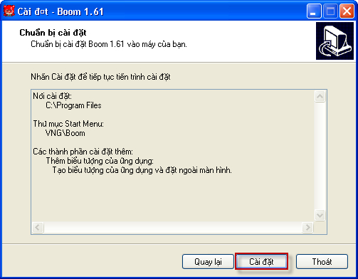
Bấm nút "Cài đặt"

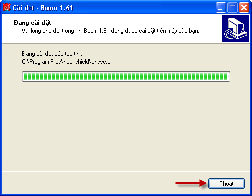
Sau khi chương trình cài đặt xong, bạn bấm nút "Thoát"

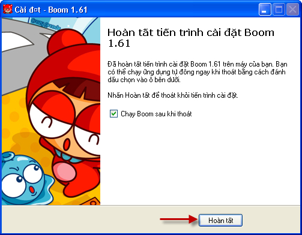
Bấm nút "Hoàn tất" để khởi chạy Game

Hướng dẫn cài Deep Freeze 7.0:

Sau khi download Deep Freeze 7.0 về, các bạn nhấp đúp chuột và chạy file
DFDtd.exe, sau đó bấm nút "Next"

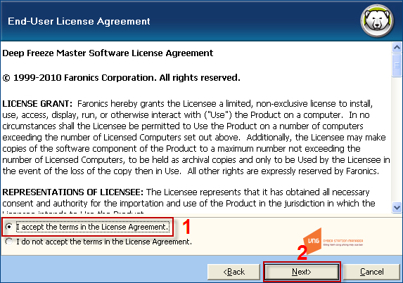
Bấm I Accept... sau đó bấm Next

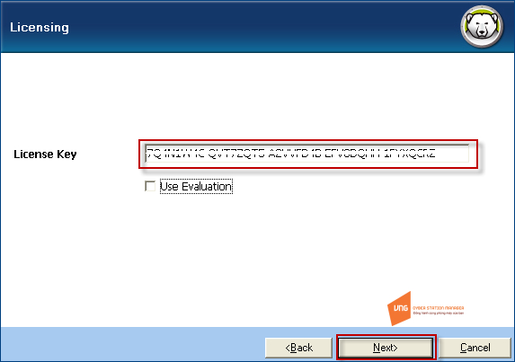
Nếu có License Key thì các bạn nhập vào, sau đó bấm Next

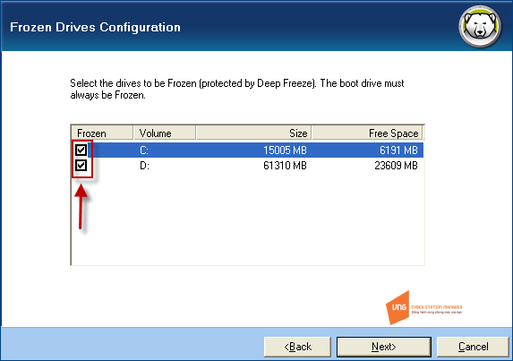
Chọn các ổ đĩa muốn đóng băng, rồi bấm Next

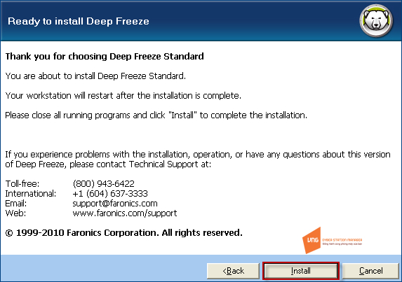
Bấm Install để chuơng trình bắt đầu cài đặt, chú ý: Windows sẽ tự khởi
động lại để hoàn tất quá trình

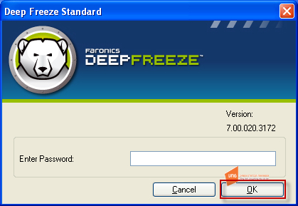
Sau khi Windows khởi động lại, bạn giữ phím Shift và nhấp đúp vào biểu
tượng hình con gấu trên khay đồng hồ (hoặc bấm tổ hợp phím Ctrl - Alt -
Shift F6 để mở cửa sổ đăng nhập như hình trên và bấm OK

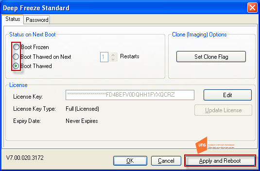
Chú ý các tùy chọn: Boot Frozen: (Đóng băng); Boot Thawed: (Mở
băng);

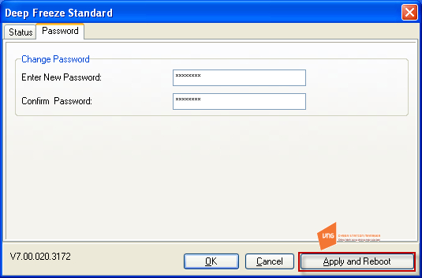
Các bạn có thể đặt password tại đây

Chúc các bạn thành công.

