### HƯỚNG DẪN CHI TIẾT GCAFE DISKLESS 

PHẦN I: GIỚI THIỆU

- GCafe Diskless là tính năng mới có từ phiên bản GCafe Version
     2.0.0.0

- Trong phiên bản GCafe Version 2.0.0.0 bao gồm 3 phần mềm kết hợp với
     nhau:

    - GCafe: GCafe quản lý và update game tự động. (Có thể cài
         cho phòng máy có hoặc không có ổ cứng).

    - Net Disk: Là trình kết nối với GCafe server để ánh xạ ổ
         chứa game của máy chủ thành ổ ảo của máy trạm. Có thể gọi Net
         Disk là trình Game Server

    - Diskless: Là trình quản lý máy trạm không ổ cứng. Các máy
         trạm khởi động hệ điều hành từ Diskless Server do đó có thể
         gọi Diskless Server là Bootrom Server.

- Để cài GCafe Diskless phải cài hết 3 chương trình trên. Có thể cài
     từng phần mềm lên từng Server và cấu hình cho các chương trình này
     kết hợp với nhau (thông qua IP) để tạo thành một chỉnh thể hoạt
     động được cho các máy trạm nhưng tốt hơn hết là nên cài lên cùng
     một Server để tiết kiệm chi phí và quản lý dễ hơn.

- Tất cả các chương trình trên hoạt động nên nền Windows
     của Microsoft. Đối với bản GCafe Client Version 2.0.0.0 cài cho
     phòng máy có ổ cứng có thể chạy trên nền Windows XP hoặc
     Windows 7. Đối với hệ thống GCafe Diskless Server nên dùng Windows
     Server để tối ưu hết tài nguyên của Server như RAM trên 8GB, SSD …
     ngoài ra Windows Server sẽ hoạt động ổn định giúp cho hệ thống
     GCafe Diskless ổn định và đạt hiệu quả cao hơn.

PHẦN II: CÁC BƯỚC CHUẨN BỊ

- CHUẨN BỊ CHO SERVER:

    - Phần cứng:

        - Mainboard phải có hổ trợ Sata 3

        - RAM tùy như cầu sử dụng, tối thiểu 8GB

        - CPU chọn loại thích hợp với mainboard, không cần tốc độ xử
             lý cao.

        - Card mạng: Tùy nhu cầu sử dụng, tối thiểu 2 card mạng. Yêu
             cần LAN 1000Gb

        - SSD: Phải có SSD (chạy trên cổng Sata 3) để làm Cache
             và Writeback.

        - HDD: Chỉ cần 1 HDD để cài OS cho Server và chứa Game. Khuyên
             dùng HDD mới có độ ổn định cao.

    - Phần mềm:

        - Nên dùng Windows Server 2008 R2. (Không nên dùng Windows
             2008 Server)

        - Windows Server 2008 R2 có hổ trợ TRIM giúp cho SSD hoạt động
             tốt hơn.

        - Dùng Windows Server 2008 R2 32bit hoặc 64bit đều được.

    - Định dạng các phân vùng:

        - HDD: Chia C: từ 15 đến 30GB chứa hệ điều hành server.
             Cluster càng cao càng tốt

        - HDD: Chia E: là phần còn lại để lưu trữ game. Cluster
             nên định dạng 64K để máy trạm mount nhanh hơn và
             load vào OS nhanh hơn.

        - SSD: Chia D: tối thiểu 35GB để chứa Image. Cluster nên
             định dạng 64K để máy trạm đọc và load Image
             nhanh hơn.

        - SSD: Chia F: là phần còn lại để làm Cache và Writeback.
             Cluster nên định dạng 4K để tiết kiệm dung lượng
             lưu trữ. (size on disk)

- CHUẨN BỊ MÁY TRẠM:

    - Phần cứng:

        - Phải có 1 máy trạm có HDD để cài OS và upload Imgae về máy
             chủ Diskless. Sau khi đã tạo được Image thì máy trạm không
             cần phải có HDD.

        - Khuyên dùng card mạng 1000Gb. Card mạng 100Gb load vào OS
             chậm nhưng load game tương đối nhanh.

        - Card mạng máy trạm cần phải có bootrom để boot hệ điều hành
             qua mạng. Phần lớn các card mạng onboard đều đã
             có bootrom. Cần enable bootrom của card mạng onboard để
             boot hệ điều hành qua mạng.

        - Nếu card mạng onboard không đủ tiêu chuẩn 1000Gb thì khi
             thêm card mạng rời 1000Gb cần chọn loại có bootrom. Lưu ý
             nếu dùng bootrom từ card mạng rời phải disable card
             mạng onboard. Cũng cần lưu ý có một vài card mạng rời có
             bootrom không tương thích với vài loại mainboard.

        - Ưu tiên các card mạng Atheros. Theo kinh nghiệm cho thấy các
             card mạng Atheros load hệ điều hành qua mạng rất nhanh.
             Các card mạng Realtek hoặc Intel đời mới load hệ điều hành
             cũng tương đối nhanh nhưng không bằng Atheros.

        - Các card mạng Marvell hoặc Nvidia đời cũ hầu như không hoạt
             động được với GCafe Diskless hoặc phải update driver thủ
             công thì mới hoạt động được.

    - Phần mềm:

        - Máy trạm có thể dùng Windows XP 32bit hoặc Windows 7 32bit.

        - Lưu ý: GCafe client không cài được trên OS 64bit.

        - Phân vùng chứa OS buộc phải định dạng NTFS.

- CHUẨN BỊ HẠ TẦNG MẠNG:

    - Switch: Nên dùng loại 1000Gb cho tất cả các port

    - Cáp mạng: Có thể dùng cable CAT5e. Phòng game có nhiều máy nên
         dùng cable CAT6. Nếu dùng cable CAT5e thì các cable nối giữa
         các Switch nên dùng cable CAT6. Các đoạn cable từ Server đến
         Switch cũng nên dùng cable CAT6.

    - Đầu bấm mạng: Nên dùng loại tốt. Kinh nghiệm cho thấy nếu dùng
         đầu bấm không tốt cable có thể hoạt động 100Mb. Khi bấm đầu
         cũng nên dùng loại kềm bấm loại tốt. Kinh nghiệm cho thấy nếu
         kềm bấm không tốt có thể làm hỏng đầu bấm dẫn đến tiếp xúc
         không tốt cũng làm cho cable hoạt động 100Mb.

    - Đối với phòng máy có nhiều máy khi thi công hạ tầng mạng cần kết
         nối các Switch theo hình sao. Nghĩa là phải có 1 switch chính
         chia ra cho các switch phụ. Server phải đi vào switch chính.
         Việc này làm cho server có thể cân bằng tải được trong mạng
         đồng thời các máy trạm có đường đi không quá 2 Switch. Nên
         chọn Switch chính loại tốt để bảo đảm việc chuyển mạch tốt
         hơn, băng thông không bị nghẽn.

PHẦN III: CÀI ĐẶT WINDOWS 2008 SERVER R2 64BIT

- Có thể download bản bản ghost Windows 2008 Server R2 64bit đã active
     theo link sau:

    - http://download.gcafe.vn/2K8\_R2\_64.GHO

    - Nếu Server dùng main chạy chipset Intel thì trước khi ghost cần
         kích hoạt “AHCI” trong BIOS.

    - Sau khi cài hoặc ghost xong, Windows yêu cầu thiết lập mật khẩu
         cho user. Mật khẩu yêu cầu tối thiểu phải có 1 số, 1 chữ và 1
         ký tự đặt biệt .

    - Cần thiết lập Vitual memory cho Windows (Tùy chỉnh pagefile.sys
         và đưa về C)

 

- Đối với bản Windows 2008 Server R2 đã hộ trợ TRIM. Để kiểm tra TRIM
     đã được enable hay chưa có thể vào CMD (chọn quyền Administrator)
     dùng đoạn command “fsutil behavior query disabledeletenotify”
     để kiểm tra. Kết quả:

    - DisableDeleteNotify = 1 (Windows TRIM commands DISABLE)

    - DisableDeleteNotify = 0 (Windows TRIM commands ENABLE)

    - Nếu TRIM đang disable, có thể dùng “fsutil behavior set
         disabledeletenotify 0” để enable lên

 

- Bỏ bớt một số giao thức trong phần Netwok Connection:

 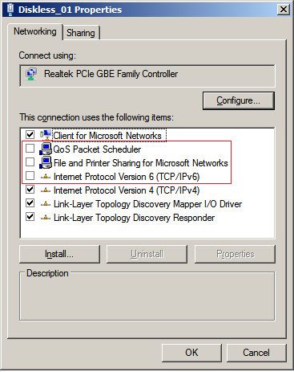

- Thiết lập tốc độ cho card mạng 1000Gb

 

PHẦN IV: ĐẶT TÊN VÀ ĐỊNH IP CHO TỪNG CARD MẠNG CỦA SERVER

- Đối với hệ thống Server có nhiều card mạng thì việc định danh từng
     card mạng và thiết lập IP tỉnh cho từng card mạng là việc nên làm
     để dễ dàng cho việc quản lý và khắc sự cố về sau.

- Đối với Server có 2 card mạng: Nên chọn card mạng onboard làm
     card mạng chính Diskless. Card mạng còn lại cho GCafe và Net Disk
     chạy chung.

    - Ví dụ

        - Card mạng 1: Đặt tên Diskless. IP: 192.168.1.200

        - Card mạng 2: Đặt tên GCafe\_NetDisk. IP: 192.168.1.201

- Đối với Server có 3 card mạng: Nên chọn card mạng onboard làm
     card mạng chính Diskless. Các card mạng còn lại phân định cho
     GCafe và Net Disk

    - Ví dụ:

        - Card mạng 1: Đặt tên Diskless. IP: 192.168.1.200

        - Card mạng 2: Đặt tên GCafe. IP: 192.168.1.201

        - Card mạng 3: Đặt tên Net Disk. IP: 192.168.1.202

- Đối với Server có 4 card mạng: Nên chọn card mạng onboard làm
     card mạng cho Diskless chính. Các card mạng còn lại phân định cho
     GCafe, Net Disk và Diskless\_02

    - Ví dụ:

        - Card mạng 1: Đặt tên Diskless\_01. IP: 192.168.1.200

        - Card mạng 2: Đặt tên GCafe. IP: 192.168.1.201

        - Card mạng 3: Đặt tên Net Disk. IP: 192.168.1.202

        - Card mạng 4: Đặt tên Diskless\_02. IP: 192.168.1.203

- Việc phân chia này rất hữu ích cho việc cài đặt 3 chương trình của
     GCafe Diskless. Giúp cho chúng ta ấn định IP nào chạy cho dịch vụ
     nào để khi có sự cố xảy ra thì chúng ta cũng có thể dễ dàng xác
     định và khắc phục bằng cách thay thế và gán lại IP là xong.

- Mặc dù các card mạng đã được gán và chạy cho từng dịch vụ nhưng
     chúng ta vẫn tận dụng tất cả các card mạng trong server để làm căn
     bằng tải cho Diskless. Nghĩa là, mỗi card mạng, sẽ chạy 2 dịch vụ:
     1 dịch vụ chính đã ấn định và 1 dịch vụ phụ là căn bằng tải
     cho diskless.

- Hình dưới là đã chọn các card mạng có trong server để làm
     loadbalacing cho diskless. Khi làm loadbalancing thì các máy trạm
     trong mạng khi boot lên sẽ được chia tải ra cho các card mạng làm
     giảm việc nghẽn băng thông từ máy chủ.

PHẦN V: CÀI ĐẶT VÀ THIẾT LẬP CÁC DỊCH VỤ

1.  CÀI GCAFE SERVER:

    - Trước khi cài GCafe Server cần disable các card mạng Diskless và
         Net Disk để khi cài chương trình sẽ chọn IP mặc định là card
         mạng đang enable.

 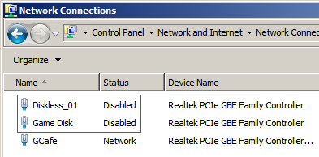

- Chạy file cài đặt GCafe Server. Chọn các nút thủ tục “Next, Yes,
     Accept …” và nhập Account trong quá trình cài đặt giống như bản
     GCafe version 1.0.0.0 trước đây.

- Đến phần lựa chọn hình thức cài đặt như hình dưới, chọn “Full Server
     Mode”

 

- Full Server Mode (Normal clients + Diskless Clients): Cài lên phòng
     máy vừa có máy trạm có ổ cứng vừa có máy trạm không ổ cứng. Mặc
     định chọn như vậy, sẽ thiết lập lại trong CGafe sau.

- Tiếp tục bỏ các tùy chọn và chọn “Finish” như hình dưới để kết thúc
     cài GCafe Server.

 

1.  CÀI NET DISK:

    - Trước khi cài Net Disk cần “Stop Service” của GCafe và disable
         các Diskless và GCafe.

 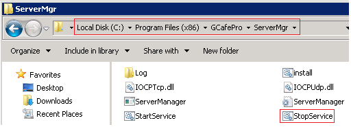

 

- Chạy file cài đặt Net Disk, chọn các nút thủ tục “Yes, Next,
     Accept…” và chọn Finish để kết thúc cài đặt Net Disk như
     hình dưới.

 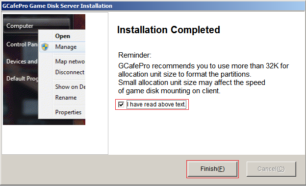

- Sau khi cài Net Disk thành công – kiểm tra trạng thái Net Disk. Từ
     Desktop chọn Icon “Disk Monitor” để chạy Net Disk Server

 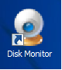

- Nhìn xuống góc trái dưới của Net Disk Server nếu thấy thông báo
     “Dịch vụ OK” là Net Disk Server đang hoạt động tốt.

 

1.  KẾT NỐI GCAFE VÀ NET DISK

- Chạy GCafe Control Panel và chọn “Game Disk”

 

- Chọn “Thêm”

 

- Trong phần địa chỉ Game Disk, nhấp dấu mũi tên xổ xuống để chọn IP
     của card mạng Net Disk. Nếu không thấy xuất hiện IP của Net Disk
     đã ấn định, hãy nhập IP của card mạng Net Disk vào đồng thời chọn
     “E” là chổ chứa game của máy chủ và cũng chọn “E” là ổ chứa game
     sẽ được ánh xạ xuống máy trạm từ máy chủ.

 

- Thiết lập Cache: Nhấp chuột vào dòng chữ “Thiết lập Cache” như vùng
     tô màu xanh ở hình trên. Nhập vào dung lượng RAM mong muốn để
     thiết lập cache cho Game Disk và chọn phân vùng SSD để làm phân
     vùng lưu trữ cache cho Game Disk. (Xem thêm phần 8 về cách set
     cache cho Game Disk)

 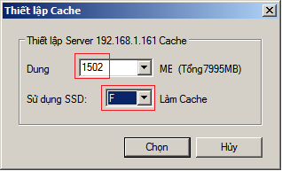

- Chọn nhóm cho Game Disk: Sau khi thêm Game Disk và cấu hình cache
     hoàn tất. Tiếp tục chọn nhóm để các máy trạm trong nhóm này nhận
     được ổ ảo của Server.

 

- Thiết lập mặc định tải về cho Game Disk. Thiết lập như trong hình để
     khi game download về sẽ tự cấu hình vào nhóm Game Disk. Lưu ý khi
     game update thì máy trạm phải khởi động lại mới nhận được những dữ
     liệu đã cập nhật. Đối với Game Disk, việc sửa game hoặc update
     game thủ công không cần tạo lại chỉ số. Tuy nhiên nếu dùng 2
     server thì cần tạo chỉ số để GCafe đồng bộ qua server phụ theo
     chỉ số.

 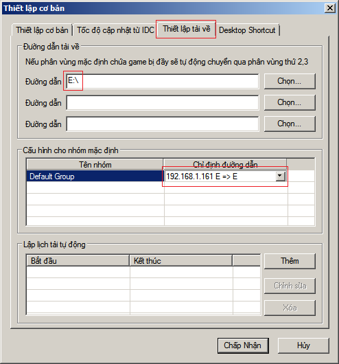

- Kiểm tra kết nối của CGafe và Net Disk: Sau khi kết nối GCafe với IP
     của Net Disk, tìm đến file “BSSyncNode.ini” có đường dẫn
     "C:\\Program Files
     (x86)\\GCafePro\\BSSyncNode\\BSSyncNode.ini", mở lên sẽ thấy
     “ServIP=” trỏ đến IP của Net Disk. Hoàn tất kết nối và cấu hình
     cho GCafe và Net Disk. Phòng máy nào cần dùng Game Server thì cấu
     hình đến phần này là xong.

 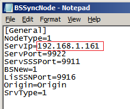

1.  CÀI DISKLESS SERVER

- Chạy file cài đặt Diskless server, chọn các nút thủ tục “YES,
     NEXT, Accept”. Đến phần tùy chọn đường dẫn, sửa lại cho Diskless
     cài về C. Diskless hổ trợ cài trên OS 64 bit nên mặc định cài vào
     Program Files.

 

- Tiếp tục chọn “Finish” như hình dưới

 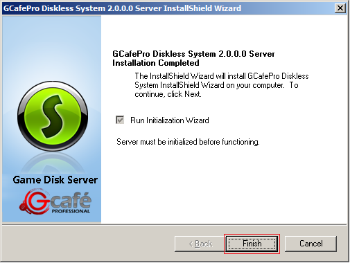

- Chọn IP cho Diskless chính như đã ấn định. Chọn đường dẫn lưu trữ
     Image (Nên dùng D). Nếu cài cho phòng máy chỉ có 1 server thì chỉ
     chọn “Máy chủ chính”. Nếu cài cho server phụ trong phòng máy có 2
     server thì chọn “Máy chủ thứ cấp”.

 

- Chọn phân vùng làm Writeback: Chọn ổ F như đã ấn định

 

- Thiết lập mật khẩu quản trị. Đây là mật khẩu để đóng hoặc mở Super
     cho Image từ máy trạm. Mật khẩu này quan trọng. Nếu chẳng may
     người chơi biết được sẽ tùy chỉnh image, cài virus vào image …. !

 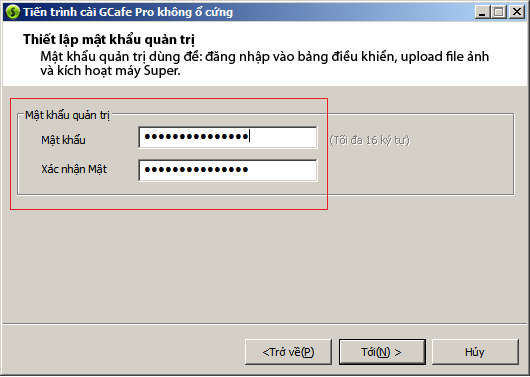

- Kết thúc cài diskless: Chọn tối ưu hóa card mạng để Diskless xác lập
     các thông số tối ưu cho các card mạng có trên Diskless Server

 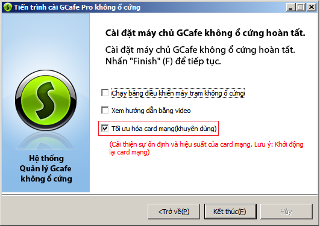

- Kiểm tra trạng thái Diskless sau khi cài: Nhìn xuống góc phải dưới
     của Desktop nếu thấy biểu tượng Diskless Status hiện màu xanh là
     Diskless đang hoạt động, đưa chuột vào để xem trạng thái

 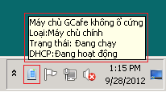

- Nhấp trái chuột vào biểu tượng này để xem chi tiết

 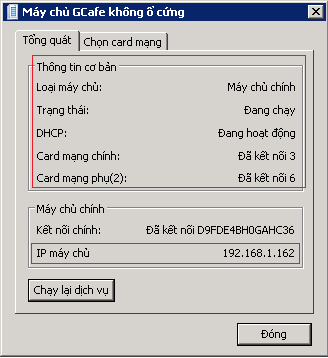

1.  CÀI GCAFE CLIENT

- Chạy file cài GCafe Client. Chọn các nút thủ tục “YES,
     NEXT, FINISH”. Đến phần tùy chọn cài đặt cho máy trạm như
     hình dưới. Phần này đang nói về cài Diskless nên sẽ chọn “Gcafe
     Diskless System Installation”: là chọn cài GCafe client cho máy
     trạm không ổ cứng để dùng GCafe upload Imaga về máy chủ. Lưu ý
     phần này chúng ta chỉ cài lên 1 máy có HDD để dùng GCafe upload
     image về Diskless Server. Image này sẽ dùng cho tất cả các máy
     trạm không ổ cứng.

 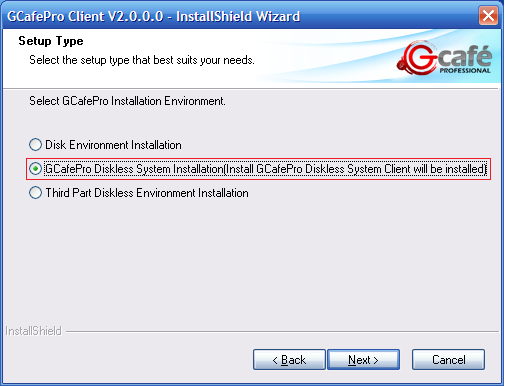

- Chọn Finish để kết thúc

 

- Chọn IP của GCafe Server: Nhấp vào dấu mũi tên sổ xuống bên phải để
     chọn IP của GCafe Server đã ấn định. Nếu không thấy IP của GCafe
     Server đã ấn định hãy nhập IP của GCafe Server vào. Chọn “Tới”

 

- Xác nhận lại IP máy chủ: Chọn “OK”

 

- Kết thúc cài GCafe Client

 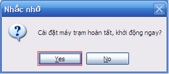

1.  UPLOAD IMAGE TỪ GCAFE CLIENT

- Chạy “GCafePro Diskless Client Tool” như trong hình dưới

 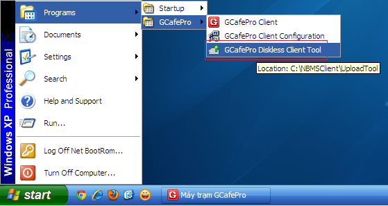

- Nhập mật khẩu quản trị - chọn “OK”

 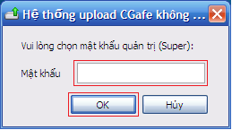

- Tạo Image mới

 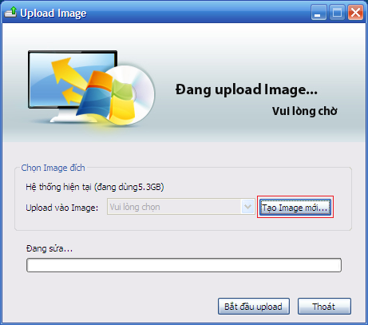

- Đặt tên gợi nhớ cho Image và quy định kích thước cho Image cần
     tải lên. Nên chọn 10GB. Chọn “Xác nhận”

 

- Sau khi đã đặt tên và tùy chọn kích thước cho Image. Chọn “Bắt đầu
     Upload”

 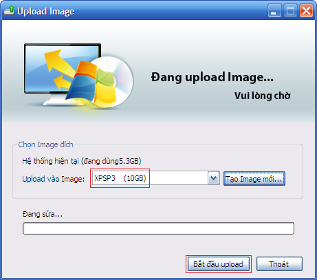

- Xác nhận lại thông tin trước khi Upload. Lưu ý: Khi quy định kích
     thước cho Image là 10GB thì máy trạm diskless sẽ có C là 10GB.
     Trong 10GB này có dữ liệu thực của hệ điều hành và các chương
     trình đã cài lên đó. Như trong ví dụ này. Kích thước C là 10GB, dữ
     liệu có trong C là 5.3GB. Chọn “OK” để tiến hành Upload

 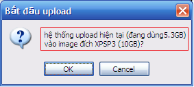

- Quá trình Upload sẽ diễn ra như trong hình dưới.

 

- Sau khi quá trình upload Image hoàn tất sẽ xuất hiện thông báo
     upload thành công. Chọn OK để reset lại máy. Đến đây có thể tắt
     máy tháo ổ cứng ra. Như vậy là đã có Image cho toàn bộ các
     máy trạm.

1.  THIẾT LẬP DISKLESS SERVER

- Đăng nhập Diskless Server: Chạy Diskless System Control Panel để
     đăng nhập.

 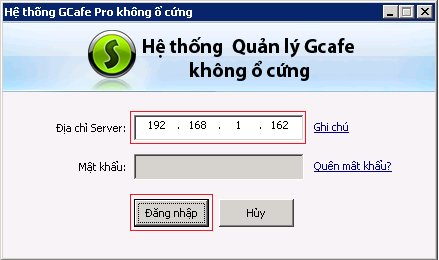

- Thiết lập cache cho Image: Chọn “Quản lý Server” -&gt; Nhấp phải
     chuột vào tên Server chọn “Thiết lập cache”

 

- Nhập 2000MB và chọn OK. Sau khi thiết lập cache cho Image, hệ thống
     sẽ lấy 2GB của RAM để hoạt động.

 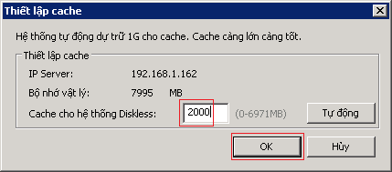

- Tạo máy trạm: Từ giao diện chính của Diskless – nhấp chọn nút chức
     năng “Tạo máy trạm”

 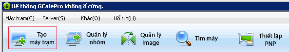

- Tiếp tục hoàn tất các thông tin để tạo máy trạm:

    - Phạm vi: Là số thứ tự máy cần tạo, đồng thời là số lượng máy cần
         tạo

    - IP đầu và IP kết thúc: Chọn dãi IP cho phù hợp với phòng máy

    - Thiết lập Image: Chọn Image cho các máy trạm

    - Độ phân giải: Có thể tùy chỉnh theo nhu cầu. Nếu trong list độ
         phân giải không có thông số độ phân giải như mong muốn có thể
         nhập thủ công vd: (1155x700).

    - Server chính: Có thể nhập chọn IP Server hoặc để cân bằng tải.

    - Gateway: Chỉ định Gateway cho các máy trạm

    - DNS: Nhập DNS. Có thể tùy chỉnh DNS cho máy trạm mà không cần
         thay đổi Image

    - Server phụ: Chọn “Vô hiệu hóa”

    - Cache: Chọn “Tự điều chỉnh”

 

- Chọn “Xác nhận” để hoàn tất việc tạo máy. CẦN RESET LẠI MÁY CHỦ.
     Đến đây các máy trạm có thể load OS từ bootrom.

- Vào phần thiết lập BIOS của máy trạm tìm và enable ROM của card
     mạng onboard.

- Tùy chỉnh cho boot qua LAN

- Khi lần đầu máy trạm boot vào sẽ thấy bảng đăng ký máy trạm như
     hình dưới.

- Sử dụng các phím điều hướng: lên, xuống để chọn máy thích hợp. Nhấp
     Enter 2 lần để chọn và xác nhận. Nếu danh sách máy trạm có nhiều
     trang có thể dùng phím điều hướng: trái, phải để sang trang.

- Sau khi đã đăng ký máy tương ứng với IP, máy chủ sẽ tự động lưu MAC
     của máy trạm. Lần sau máy trạm mở lên sẽ tự nhận IP và load OS với
     image đã gán.

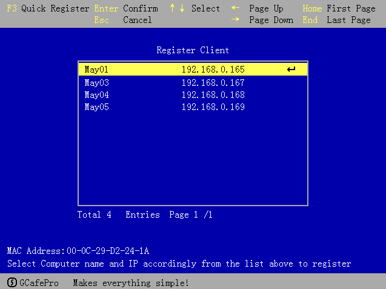

- Lưu ý: Nếu lỡ tay chọn sai tên máy, có thể sửa lại bằng cách xóa MAC
     cho máy trạm từ máy chủ. Máy bị xóa MAC khi khởi động lên sẽ hiện
     ra bảng đăng ký như hình trên.

- Đối với người mới bắt đầu làm bootrom có thể đọc và làm theo thứ tự
     từ phần đầu đến phần cuối là có thể tự hoàn tất GCafe Diskless.
     Sau k hi đã làm quen rồi thì có thể không theo thứ tự từng phần,
     tuy nhiên phải nên tuân thủ quy trình để hạn chế sự cố xảy ra.

1.  GIẢI THÍCH THÊM VỀ CACHE, WRITEBACK VÀ CÁCH THIẾT LẬP

- Đối với các hệ thống bootrom hoặc game server chúng ta có khái niệm
     cache và writeback. Phần này chỉ giải thích ý nghĩa của những khái
     niệm này trong phạm vi GCafe Diskless.

    - Cache: Có thể dùng RAM và dùng SSD để thiết lập. Trong phần
         thiết lập Gcafe kết nối Net Disk có chổ chọn RAM để làm cache
         và chọn ổ SSD để làm cache. Ví dụ khi thiết lập 5GB RAM
         làm cache và chọn F: để làm cache cho Game Disk: Khi máy trạm
         truy xuất game từ ổ ảo, máy chủ sẽ đọc dữ liệu game này một
         lần và đưa lên cache. Nếu RAM còn trống thì sẽ đưa lên RAM,
         tương tự khi có nhiều game được yêu cầu từ máy trạm thì máy
         chủ sẽ (đọc một game một lần) và đưa lên RAM. Cho đến khi dữ
         liệu cache vượt quá 5GB thì máy chủ sẽ ghi cache
         xuống SSD. Nếu SSD tiếp tục đầy thì máy chủ sẽ tự động xóa
         cache của những game trước đó. Lưu ý khi máy chủ truy xuất
         cache trên RAM sẽ nhanh hơn trên SSD. Vì game được lưu và truy
         xuất trên cache của máy chủ nên tốc độ truy xuất từ máy trạm
         sẽ được đáp ứng kịp thời làm cho game chạy nhanh hơn so với
         chạy trên HDD. Ví dụ: Khi máy chủ khởi động vào OS, máy trạm
         đầu tiên load game Đột Kich, máy chủ sẽ đọc từ HDD chứa game
         để đưa lên cache và phân phối cho máy trạm. Khi có một máy
         khác truy cập game Đột Kích thì máy chủ không đọc từ HDD nữa
         mà sẽ đọc từ cache để phân phối cho máy trạm nên tốc độ load
         game Đột Kích của máy truy cập lần thứ 2 sẽ nhanh hơn máy truy
         cập lần thứ 1. Bởi vậy Đột Kích chạy trên Diskless GCafe sẽ
         load nhanh hơn HDD.

    - Writeback: có thể dùng RAM và dùng SSD để thiết lập. Diskless có
         chổ thiết lập cache cho Image và chọn SSD để làm Writeback. Ví
         dụ thiết lập cache cho Image là 2GB và chọn Writeback
         là F. 2GB này có nghĩa là máy trạm được phép lấy dữ liệu
         từ bên ngoài về tối đa 2GB. Nếu máy trạm lấy dữ liệu từ
         bên ngoài về vượt quá 2GB thì chương trình sẽ ghi dữ liệu
         vượt quá này lên Writeback. Khi máy trạm reset hoặc tắt máy
         thì Writeback sẽ tự động xóa. Có thể nói rằng cache của Image
         và Writeback là nơi lưu trữ tạm thời cho những gì máy trạm lấy
         từ bên ngoài về. Lưu ý : Nếu Writeback full thì máy trạm sẽ
         không load được Image từ Gcafe Diskless.

    - Thiết lập cache và Writeback: Tùy theo lượng RAM đang có mà cấu
         hình cho phù hợp. Tạm thời có thể thiết lập theo công thức
         sau:

        - Tổng RAM – 2GB (System) – 2 GB (Image) = phần còn lại cho
             Game Disk.

        - Nếu RAM 8GB – 2GB hệ thống còn dư 6 GB.

        - 6GB tiếp tục thiết lập 2GB cho Image còn lại 4 GB

        - 4GB này thiết lập hết cho Game Disk.

    - Đối với hệ thống GCafe Diskless, cache và writeback là yếu tố
         quyết định nên RAM và càng nhiều càng tốt. Ngoài ra sẽ phân
         phối cache cho máy trạm được nhanh hơn nên cần nhiều
         card mạng. Hạ tầng mạng cũng phải đạt tiêu chuẩn.

    - Đối với máy trạm diskless, việc load OS nhanh hay chậm không còn
         phụ thuộc vào tốc độ của HDD như trước mà phụ thuộc vào card
         mạng đang có, phụ thuộc tốc độ truy xuất image từ máy chủ. Nên
         chọn các card mạng đời mới hổ trợ 1000MB cho các máy trạm và
         Image trên máy chủ nên cho lưu trữ trên SDD – phân vùng định
         dạng cluster 64Kb.

