I.  **BACKUP/RESTORE HỆ THỐNG TRƯỚC KHI THAO TÁC CHỈNH SỬA**

Thao tác này sẽ lưu lại trang thái hiện tại của hệ thống nhằm phục hồi
lại tình trạng ban đầu nếu quá trình sử dụng gặp vấn đề

Các bước thực hiện:

**Bước 1**: Vào **IO Manager** &gt; **Chọn ổ muốn
backup** &gt; **Tool **&gt; **Backup**

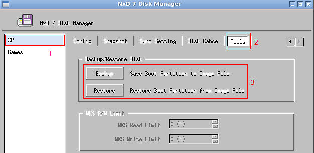

**Bước 2**: Chọn nơi lưu bản backup

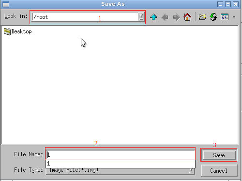

**Bước 3**: Quá trình backup hoàn tất &gt; chọn **Yes**

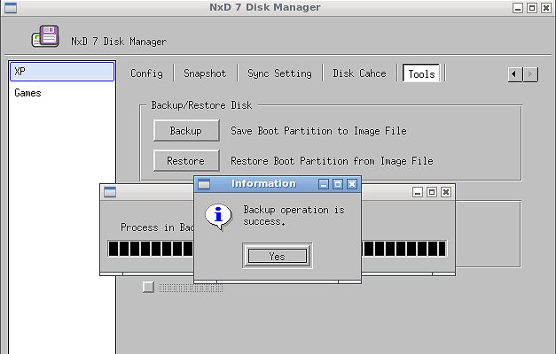

I.  **CHỈNH SỬA IMAGE(CÀI ĐẶT PHẦN MỀM, CẬP NHẬT GAME,....)**

**Bước 1**: Vào **NxD 7 Boot Manager** &gt; **Chọn 1 máy đang ở trạng
thái turn-off**

**Bước 2**: Kiểm tra để chắc chắn **không có máy trạm nào khác đang ở
tình trạng Superwks**

**Bước 3**: Nhấn **chọn máy trạm** &gt; Chọn **SuperWKS** &gt;
Chọn **Direct Update** &gt; **Bỏ chọn tại Enable protection
partition** &gt; **Ok**.

1: Direct Update - Mọi thay đổi sẽ được lưu ngay lập tức, nếu ta chọn
Merge update thì chỉ khi bấm lưu trên server dữ liệu mới chính thức lưu
vào đĩa.
2: Enable Protect Boot Partition - Nếu không cần thay đổi tới phân vùng
hệ thống ta có thể check chọn Enable Protect Boot Partition để bảo vệ
toàn vẹn cho phân vùng này.

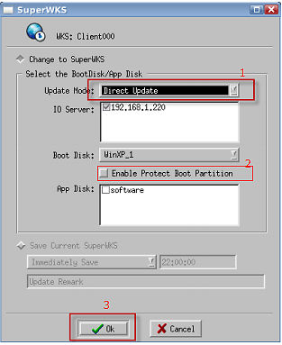

Nếu cập nhật game, software thì tick chọn thêm ổ trong phần App
Disk.

**Sau khi chọn SuperWKS, tên máy trạm sẽ đổi màu thành màu đỏ
*Lưu ý*: Mọi thay đổi trên image từ lúc này sẽ có tác dụng với toàn bộ
các máy trạm cùng sử dụng chung image đó**

**Bước 4**: Mở máy trạm. 

Khi đó máy trạm sẽ có biểu tượng thông báo đang ở trạng thái SuperWKS

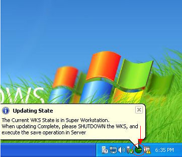

**Bước 5**: Thực hiện cài đặt và nâng cấp như trên hệ thống có ổ cứng

**Bước 6**: Tắt máy trạm

**Bước 7**: Lên Server lưu lại cấu hình vừa đổi
1: Đặt tên sau đó nhấn Save Current SuperWKS
2: Nhấn Ok để hoàn tất

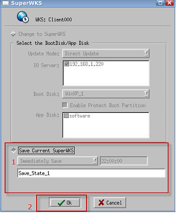

Các thay đổi sẽ có tác dụng sau khi các máy trạm reset.

I.  **HƯỚNG DẪN UPLOAD IMAGE TỪ MÁY TRẠM LÊN SERVER**

**Các bước chuẩn bị**:
1. Chuẩn bị 1 máy trạm có gắn ổ cứng và đã cài đặt hoàn chỉnh ( lưu ý
driver trên bản windows này phải cài bằng tay, không sử dụng auto driver
để cài).
2. Bộ cài NxD Client.

Quá trình upload image gồm 2 giai đoạn

**Giai đoạn 1: Cài đặt và cấu hình
**
**Trên máy server
**
**Bước 1**: Tạo 1 ổ đĩa chứa image sẽ upload từ máy trạm
Vào **I/O Manager** &gt; **DiskMan** &gt; **Add** &gt; chọn **New Basic
Disk** &gt; **Next** &gt; Điền các thông tin
1- Tên ổ đĩa
2- Loại ổ đĩa ( ở đây chọn image file)
3- Dung lượng ổ đĩa
4- Hệ điều hành ( chọn Xp/7/8 tùy theo hệ điều hành đã cài)
5- Nơi lưu ổ đĩa
6- Xác nhận

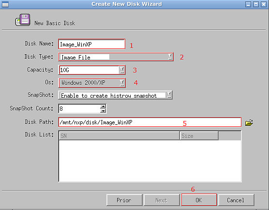

**Bước 2**: Vào **NxD Boot
Manager** &gt; **Option** &gt; **Import/Export** &gt; Check vào tùy
chọn**Enable Client Upload**

**Trên máy trạm (máy trạm này có gắn ổ cứng)
**
**Bước 3**: Cài đặt **NxD Client** - file cài đặt này sẽ nằm trong thư
mục Client sau khi giải nén từ file .iso mà quý chủ phòng máy đã tải về
trước đó.
Sau khi cài đặt xong &gt; **Reset máy trạm đó (tại bước này nếu reset
xong mà máy trạm không lên windows được thì cần phải ghost và cài đặt
lại chính xác driver cho máy)
**
**Bước 4**: Sau khi cài đặt thành công NxD Client, vào **Control
Panel** &gt; **NxD 5 Console** &gt;**NxD 5 Uploader**

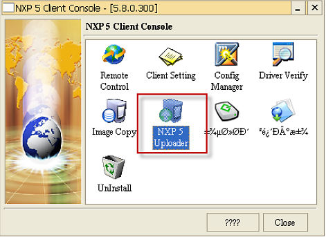

Nhấn **Search** để tự động nhận Boot Server và IO Server

1- Kiểm tra lại Boot Server và IO Server đã chính xác chưa
2- Tại **Boot Disk** chọn ổ đĩa đã tạo ở **bước 1**
3- Chọn **Mount** để tạo ổ đĩa ảo trên máy trạm

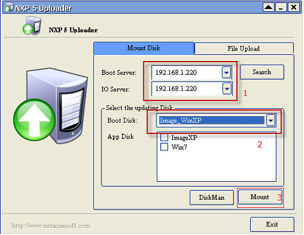

Sau khi mount thành công có thể kiểm tra lại bằng cách vào **Disk
Management** của máy trạm xem đã có ổ mới mount chưa.

*
**Lưu ý*****: Kiểm tra ổ đĩa vừa mount đã set active chưa**

**Giai đoạn 2: Upload Image
**
**Tại máy trạm
**
**Bước 1**: Check vào các tùy chọn theo hình sau

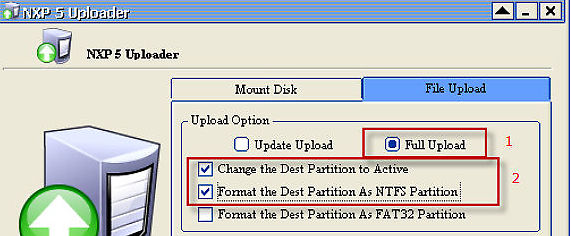

**
Bước 2**: Nhấn **Refresh** &gt; Chọn **Src Partition (ổ nguồn) là ổ chứa
hệ điều hành trên máy trạm đang dùng** &gt; **Dest Partition (ổ đích) là
ổ trên máy trạm mà ta vừa mount từ server xuống**

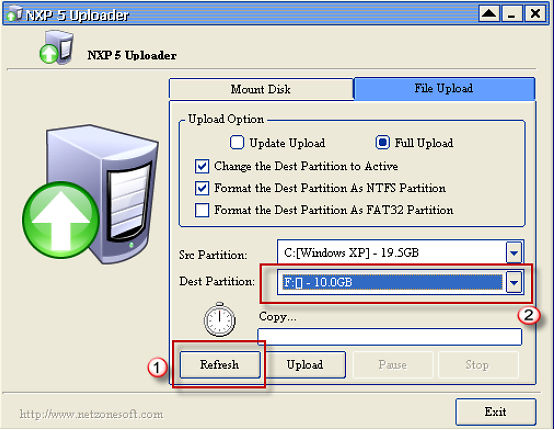

**Bước 3**: Nhấn **Upload**.

Sau khi quá trình upload thành công &gt; Tắt máy trạm &gt; Lên máy
server &gt; vào **NxD Boot Manager** &gt; **WKS** &gt; **Edit WKS** &gt;
tại **BootDisk** chọn image vừa upload và cho các máy trạm boot để kiểm
tra hoạt động của image mới nhé!

I.  **CẬP NHẬT GAME TRÊN HỆ THỐNG BOOTROM NXD BẰNG STARWIND
    **

**Các bước thực hiện**:

**Trên máy Server**

**Bước 1**: Tải chương trình gmiscsi-repack tại đây.

**Bước 2**: Cài đặt và cấu hình
1. Mở **Terminal** &gt; **gõ lệnh cài đặt** &gt; **Enter**

2. Nhập **IP máy tính tiền**

3. Nhập **IP máy Server**

4. Nhập **đường dẫn nơi chứa disk**

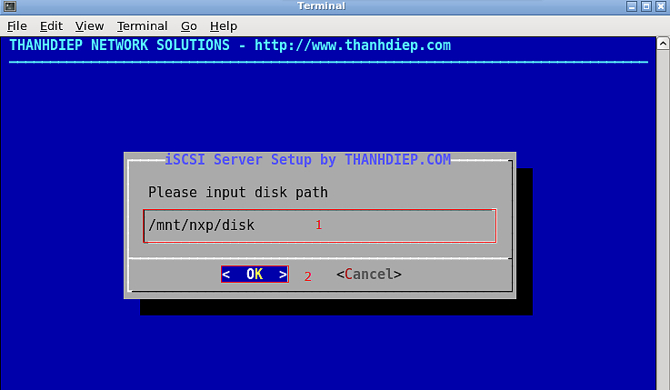

5. Nhập **tên ổ chứa game khi tạo disk**

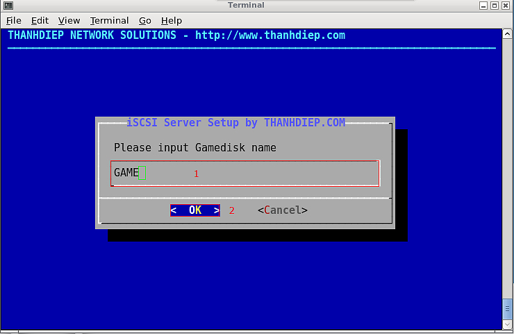

6. Nhập **tên ổ game trên Server**

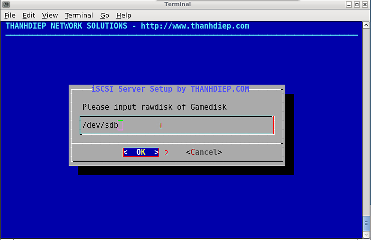

7. **Nếu ổ game không RAID thì chọn No**

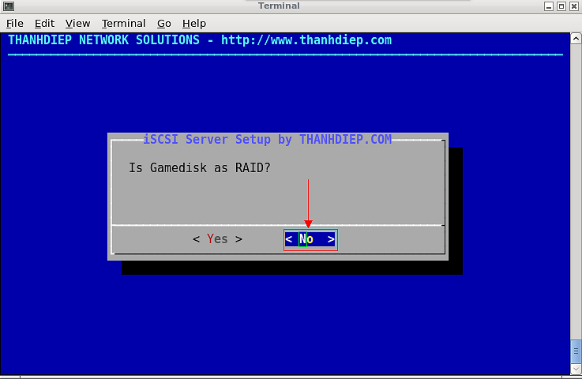

8. Nhập **đường dẫn nơi chứa WKS**

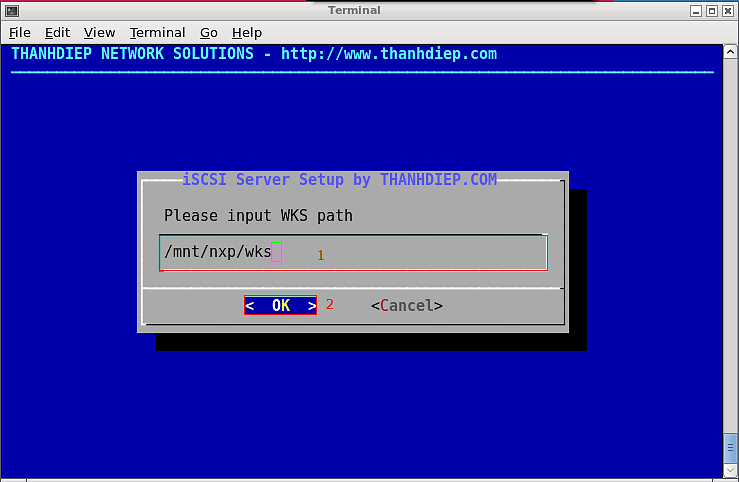

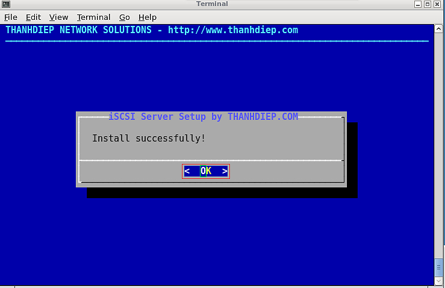

**Trên máy tính tiền** 

Sau khi cài đặt StarWind, ta tiến hành cấu hình

**Bước 3**: Cấu hình iSCSI Initiators StarWind

1. Chọn **Add Device** &gt;** Remote iSCSI Device** &gt; **Next** 

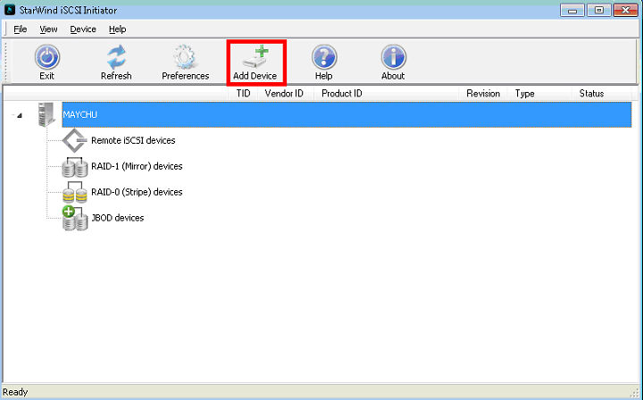

2. Nhập địa chỉ **IP Server**, nhấn **Next**

3. Nhấn **Next**

4. Nhấn **Finish** để kết thúc

5. Chờ một lát rồi kiểm tra lại trên máy tính tiền có thêm ổ GAME là
thành công

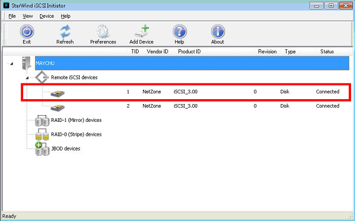

**Bước 4**: Cấu hình trên CSM Click Server

1. Vào **CSM Click Server** &gt; **Cấu hình**

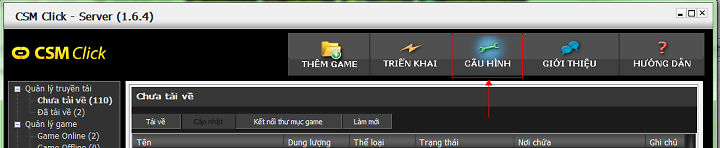

2. **Máy chứa game hiện tại** &gt; **Chọn máy chứa game là máy tính
tiền**

Lưu ý: Chọn đúng máy có IP như đã cấu hình khi cài đặt gmiscsi

**Bước 5**: Tiến hành cập nhật game như trên hệ thống có ổ cứng

Sau khi cập nhật game xong, **click chuột phải tại ổ Game trên
StarWind** &gt; Chọn **Force Remove Device**.
**Các thay đổi trên ổ Game sẽ có tác dụng ngay sau khi ngắt kết nối.**
