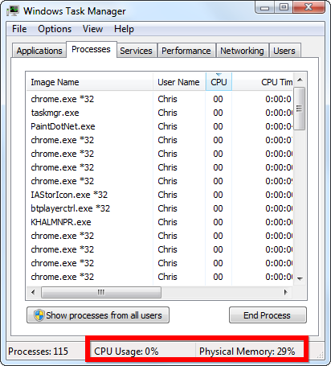
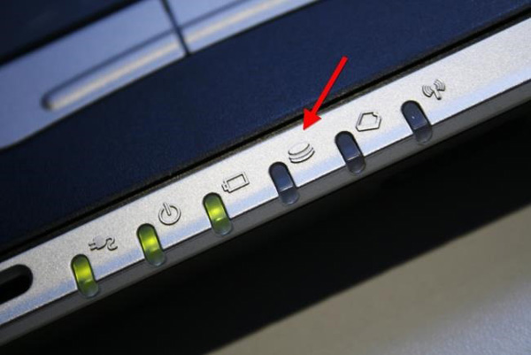
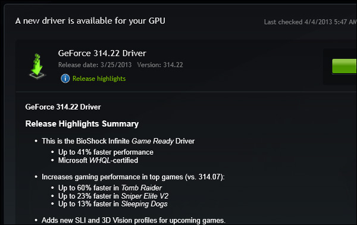
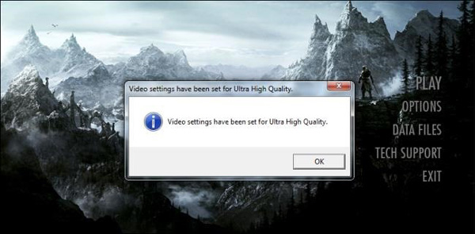
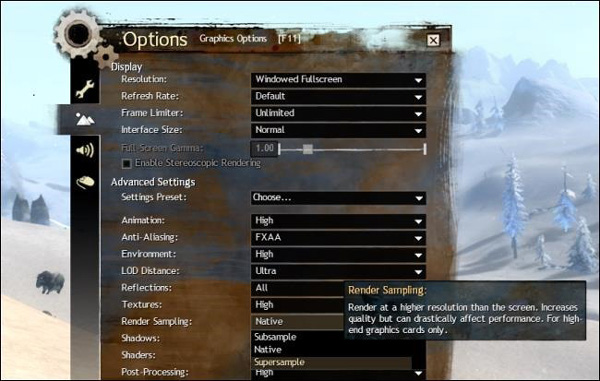
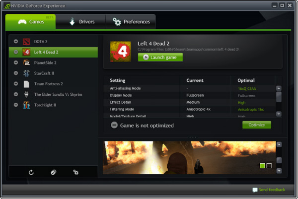
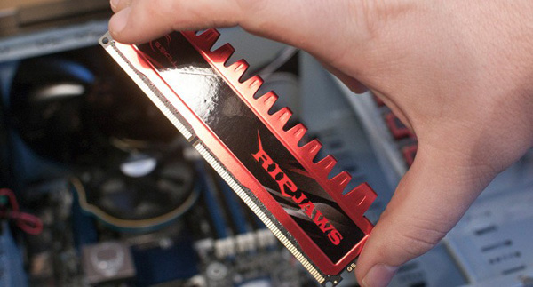

**Kiểm soát phần mềm đang chạy**

 

Đối với các máy hệ console, mỗi khi người dùng vào game máy lập tức tắt
các phần mềm khác đang chạy nhằm giải phóng hết tài nguyên cho game. PC
thì không: chúng vẫn hoạt động và tiêu tốn tài nguyên hệ thống:
download, duyệt web, các chương trình đang bật dạng cửa sổ hoặc ẩn dưới
system tray… Nếu sở hữu một cấu hình không thực sự mạnh, tốt nhất bạn
nên tắt bớt ứng dụng chiếm nhiều RAM và CPU, dành chúng cho thứ bạn cần
hơn lúc này là khung hình/giây.

 

Ngoài những thứ hiển nhiên nặng như encode video hay giải nén một tập
tin nén lớn, bạn có thể sử dụng Task Manager (click chuột phải vào
taskbar chọn Task Manager) để phát hiện tác vụ nào đang chiếm dụng nhiều
RAM và CPU để tắt chúng. Lưu ý là bạn phải biết rõ tác vụ mình sắp tắt
là gì, đừng nhắm mắt tắt bừa có thể sẽ trúng phải chương trình chạy nền
của hệ điều hành.

 

{width="4.291666666666667in"
height="4.739583333333333in"}

 

Ngoài RAM và CPU, có một thành phần khác rất quan trọng cũng cần giải
phóng là HDD. Ở đây tôi không nói đến dung lượng trống, mà là luồng dữ
liệu đọc/ghi. Các game nặng đều yêu cầu đọc/ghi dữ liệu nhiều và liên
tục lên ổ cứng. Nếu có thứ gì khác chiếm dụng nhiều băng thông (giải nén
chẳng hạn) thì dù chiếc PC của bạn có mạnh đến mấy, lag giật hay thậm
chí treo máy là chuyện bình thường.

 

{width="6.25in"
height="4.177083333333333in"}

 

Để phát hiện có ứng dụng nào đang sử dụng nhiều băng thông ổ cứng hay
không, hãy quan sát đèn HDD trên vỏ case của bạn. Nếu nó nhấp nháy hoặc
sáng liên tục nghĩa là ổ cứng đang chịu tải khá nặng. Bạn nên tắt bớt
các tác vụ khả nghi (như giải nén, convert video) hoặc thậm chí khởi
động lại máy cho chắc ăn.

 

**Cập nhật driver mới cho card đồ họa**

 

Trong rất nhiều trường hợp, driver (trình điều khiển) ảnh hưởng rất
nhiều đến hiệu năng card đồ họa. Thông thường đối với các card mới ra,
driver chưa thể tối ưu hiệu năng ngay được, mà sẽ được cải thiện dần dần
qua các bản cập nhật. Thậm chí có game còn không thể chạy nếu bạn dùng
driver quá cũ. Vì thế hãy chăm chỉ update driver cho card đồ họa của
bạn.

 

{width="6.25in"
height="3.9375in"}

 

Tuy nhiên, nếu cảm thấy hệ thống không ổn định sau khi cập nhật driver
như dính BSOD, card nóng hơn, khung hình/giây giảm… thì bạn nên trở về
với bản cũ. Đây là lỗi lập trình của hãng sản xuất GPU, tuy không xuất
hiện nhiều nhưng đã được ghi nhận trước đây.

 

**Tinh chỉnh thiết lập game hợp lý**

 

Nói đến hiệu năng chơi game, có 2 yếu tố luôn song hành và cần cân đối
hài hòa: đó là khung hình/giây và chất lượng hình ảnh. Hình ảnh xấu
nhưng đủ mượt bao giờ cũng tốt hơn đẹp mà giật. Vì vậy việc tùy chỉnh
thiết lập game hợp lý luôn là việc cần thiết để game thủ trải nghiệm
game được “sướng” nhất.

 

Thường thì trong lần chạy đầu tiên, game sẽ tự động nhận diện phần cứng
của bạn và đưa ra thiết lập sẵn mà nó cho là tốt nhất. Tính năng này rất
hay nhưng… không được chính xác lắm, đặc biệt đối với các phần cứng mới
ra đời sau game.

 

Nếu lười, bạn có thể sử dụng các bộ thiết lập mà game cung cấp sẵn (Low,
Medium, High, Ultra) cho đỡ mất công. Tuy nhiên cũng có nhiều trường hợp
dở khóc dở cười như cấu hình không đủ cân Ultra nhưng High thì lại quá
bay. Lúc này can thiệp sâu hơn vào từng thiết lập riêng biệt là điều cần
thiết để đạt được chất lượng hình ảnh tốt nhất có thể.

 

{width="6.25in"
height="3.0729166666666665in"}

 

Nếu có đủ kinh nghiệm chơi và tinh chỉnh thiết lập game, bạn sẽ nhận
thấy đa số game có các tùy chọn thiết lập giống nhau, như “Shadow” là
hiệu ứng đổ bóng, “Texture” là độ chi tiết vân bề mặt, “Anti-aliasing”
là khử răng cưa…. Trớ trêu thay, nhiều nhà phát hành lại thích đặt những
cái tên lạ và “kêu” cho các thiết lập quen thuộc trong các game bom tấn
của họ, khiến người chơi… chả biết đường nào mà chỉnh. Nếu gặp các thiết
lập “lạ” như thế, bạn nên tra google để biết ý nghĩa thực sự của nó là
gì; hoặc có thể thử cách “xôi thịt” hơn là chỉnh – chơi thử, chỉnh –
chơi thử, chỉnh – chơi thử… cho đến khi nào thấy ổn thì thôi.

 

{width="6.25in"
height="3.96875in"}

 

Sau đây là ý nghĩa của một vài thiết lập game thường thấy:

 

- “Resolution”: độ phân giải hình ảnh – thiết lập quan trọng bậc nhất
của game. Hãy đẩy độ phân giải càng cao càng tốt, sau đó mới tới các
thiết lập khác. Nếu đang dùng màn hình full HD 1920 x 1080 mà lại chỉ
đặt 1600 x 900 để ham hố high setting, bạn sẽ nhận được rất nhiều răng
cưa, hình ảnh mờ mờ thiếu độ sắc nét dù các thiết lập khác như Texture,
Shadow có cao đi chăng nữa.

Resolution càng cao, bộ nhớ của card đồ họa (VRAM) càng bị chiếm dụng
nhiều.

 

- “Texture detail”: độ chi tiết bề mặt vật thể. Đây là thiết lập quan
trọng, trực tiếp quyết định độ xấu/đẹp của hình ảnh. Với Texture detail
low, bạn sẽ được thưởng thức những khẩu súng trơn bóng như làm bằng
nhựa, khuôn mặt trơn tuột vô hồn của nhân vật hay các bức tường gạch
không có nét vữa. Trong khi đó Texture detail ultra sẽ khiến mọi thứ
thật hơn rất nhiều: đường nét góc cạnh của khẩu súng ưa thích, nếp nhăn
và biểu cảm trên mặt nhân vật, hay tác động của từng mảnh vụn lên bức
tường gần vụ nổ…

Mỗi nấc Texture detail yêu cầu nhiều VRAM hơn, đồng thời GPU phải làm
việc nặng hơn khá nhiều.

 

- “Shadow detail”: đổ bóng vật thể. Shadow detail cao sẽ khiến di chuyển
của nhân vật và vật thể trong game thật hơn với một chiếc bóng sống
động.

 

- “Draw distance”: tầm nhìn xa. Với Draw distance càng cao, cảnh vật
đằng xa càng rõ ràng và chi tiết hơn, đồng nghĩa hệ thống phải render
nhiều đối tượng hơn. Thiết lập này không quá nặng như Texture detail
nhưng “ngốn” cả VGA lẫn CPU.

 

- “Anti-aliasing”: khử răng cưa – khiến hình ảnh mịn màng, bớt răng cưa
và đương nhiên là thật hơn. Khử răng cưa có rất nhiều mức từ 1x cho đến
32x. Tuy nhiên các mức càng cao, VGA càng phải tải nặng hơn trong khi
chất lượng hình ảnh tăng lên so với mức trước thì lại không tương xứng.
Ví như khó có thể nhìn ra sự khác biệt giữa 8x và 16x, mà khung
hình/giây lại bị giảm rõ rệt. Vì vậy bạn nên cân đối một chút với các
thiết lập khác.

 

- “Anisotropic”, “Bilinear”, “Trilinear Filtering”: các thiết lập và
công nghệ “lọc” tăng chất lượng vân bề mặt.

 

- “Supersampling”: đây là một công nghệ mới ra đời sau này, thường chỉ
gặp trên các sát thủ phần cứng. Thực chất Supersampling là một giải pháp
khử răng cưa mới: render hình ảnh tại độ phân giải cao hơn thiết lập của
người dùng, sau đó thu nhỏ lại đúng kích cỡ cần thiết. Giải pháp này tỏ
ra hiệu quả rõ rệt so với khử răng cưa truyền thống, nhưng cũng nặng hơn
rất nhiều vì hệ thống phải render nhiều gấp vài lần bình thường.

 

{width="6.25in"
height="3.96875in"}

 

Bên cạnh việc tự dò dẫm mày mò, bạn có thể dùng thử GeForce Experience –
một công cụ do hãng thiết kế GPU Nvidia cung cấp. Dù mới chỉ hỗ trợ một
số ít game, nhưng công cụ này tỏ ra khá chính xác và có nhiều tiềm năng
phát triển trong tương lai gần.

 

{width="6.25in"
height="4.177083333333333in"}

 

**Nâng cấp phần cứng**

 

Dù có tỉ mỉ thế nào chăng nữa, tinh chỉnh thiết lập vẫn chỉ là giải pháp
tạm thời và hiệu quả có hạn. Nâng cấp phần cứng là cách duy nhất để vượt
qua giới hạn đó. Tuy nhiên nhắm mắt nâng bừa không thể đem lại hiệu quả
tốt nhất, bạn phải hiểu rõ cỗ máy của mình đang cần gì.

 

- Card đồ họa: là thành phần quan trọng bậc nhất đối với một cỗ máy chơi
game. Card đồ họa gánh tránh nhiệm render hình ảnh và xử lý một số hiệu
ứng vật lý. Nếu muốn đẩy chất lượng hình ảnh lên cao, nâng cấp VGA là
điều chắc chắn.

 

- Bộ xử lý: cũng là một thành phần quan trọng, CPU giữ vai trò xây dựng
kịch bản. Một vụ nổ diễn ra ra sao, tác động đến các vật thể xung quanh
thế nào, khiến nhân vật mất bao nhiêu máu v.v… đều do CPU vạch ra. Nâng
cấp VGA quá mạnh mà quên mất CPU sẽ dẫn đến một hiện tượng gọi là “nghẽn
cổ chai” – tức CPU không kịp ra kịch bản để VGA vẽ, gây nên lãng phí
hiệu năng.

 

- Ổ cứng: ngoài yếu tố hiển nhiên là dung lượng, tốc độ ổ cứng là một
yếu tố cực kì quan trọng. Đầu tiên, nó ảnh hưởng đến tốc độ load game và
thậm chí là cả khung hình nếu máy đang chạy một vài tác vụ khác nữa. Vì
vậy, đừng bao giờ dùng ổ HDD dòng Green tiết kiệm điện để cài hệ điều
hành, game và ứng dụng. Thứ đến, nếu cảm thấy hệ thống không nhanh như
kì vọng (dù cấu hình khá mạnh), một chiếc SSD sẽ là lựa chọn không bao
giờ khiến bạn thất vọng.

 

- RAM: bộ nhớ RAM là nơi nạp các file cần thiết trong quá trình chạy cả
game lẫn ứng dụng. Nếu không đủ RAM để nạp, game sẽ đọc trực tiếp dữ
liệu từ ổ cứng (tốc độ chậm hơn khoảng 40 -&gt; 200 lần so với RAM) và
giật lag hay thậm chí treo máy là điều rất dễ xảy ra. Cách nhanh nhất để
kiểm tra hệ thống có thiếu RAM hay không là xem trong Task Manager. Nếu
Physical Memory bị sử dụng lớn hơn 90%, bạn nên mua thêm RAM.

 

{width="6.25in"
height="3.3645833333333335in"}
